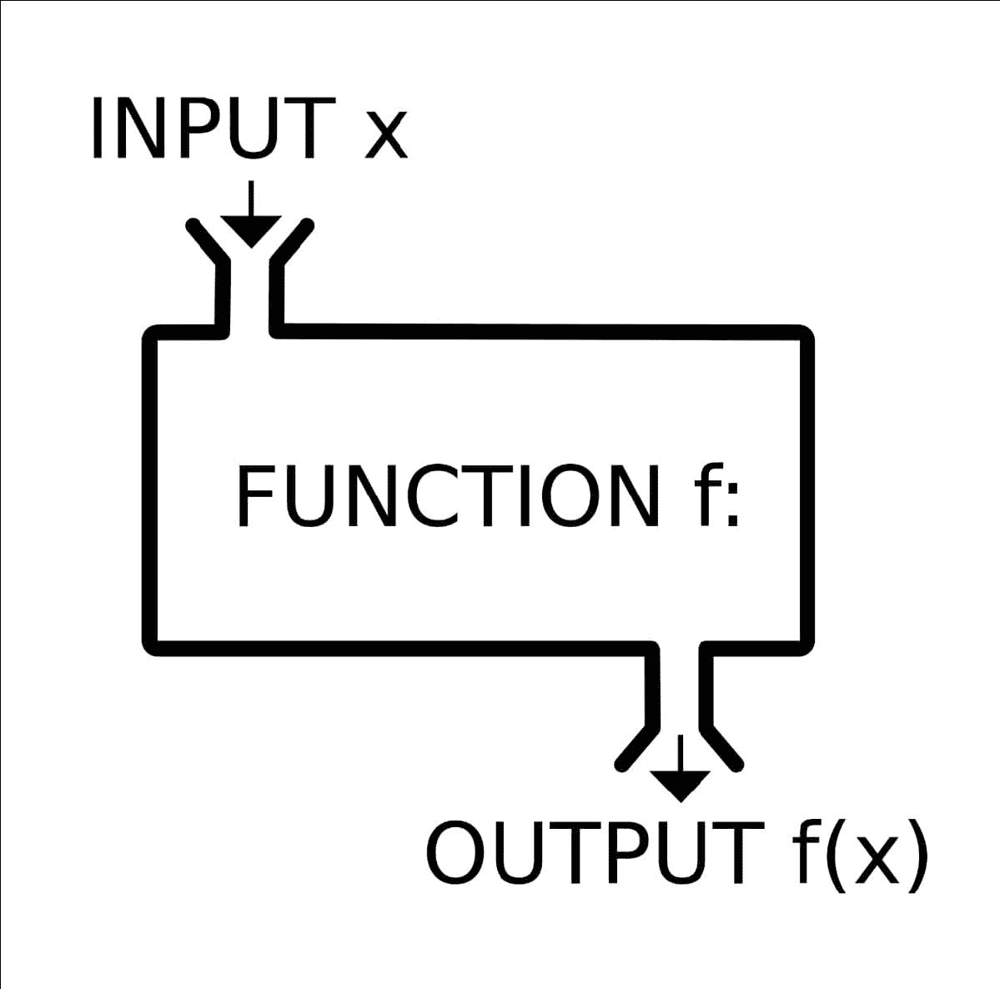

# 三、函数和类

在前一章中，我们了解了如何声明和定义数组，并介绍了多种类型的数组，如索引数组、关联数组等。我们还看到了可以在阵列上执行的各种操作。

在本章中，我们将确定如何定义和调用函数。我们还将学习如何创建类，以及如何将类和函数一起使用。

函数是打包成可重用代码的代码块。函数是一段代码，它通过执行一些处理，获取一个或多个输出来返回值。

类是对象的蓝图。类构成了数据的结构和利用信息创建对象的操作。

在本章结束时，您将能够：

*   定义和调用函数
*   定义类并使用`new`关键字创建类的实例
*   实现并调用`public`和`static`类函数

# 功能

功能就像一台具有固定逻辑的机器。在一端，它接受一个参数，处理它，并根据输入和函数定义返回一个值。

函数用于反复重用特定的代码块，而不是在需要时一直定义它：



为了定义一个函数，我们使用关键字`function,`后跟我们想要给出函数的名称；在花括号内，我们定义了函数的操作。例如，如果我们想创建一个函数来打印“Hello World”，我们将编写以下代码：

```php
<?php
    function HelloWorld(){
        echo "Hello World";
    }
?>
```

如果我们在一个新文件中编写这个函数并运行它，它不会显示任何内容，这是因为我们没有调用这个函数；我们只定义了它。

为了调用函数，我们添加了以下代码行：

```php
<?php
HelloWorld();
?>
```

创建函数时，有时需要将其他参数传递给函数；这可以在定义新函数时完成。

让我们修改前面的示例以接受一个`name`参数：

```php
<?php
    function HelloWorld($name){
        echo "Hello World, " . $name;
}
?>
```

为了传递名称，我们在函数名后面的括号内定义了一个变量。

现在，当我们调用函数时，我们可以通过该变量传递我们想要的任何值，它将被打印出来：

```php
<?php
    HelloWorld("John");
?>
```

有时，当我们创建一个函数时，我们知道在某些情况下我们不会传递值。在这些情况下，我们希望自动传递默认值。

要设置默认值，应在设置时将其分配给指定变量，如下所示：

```php
<?php
    function displayMessage($message = "World"){
        echo "Hello " . $message;
}
displayMessage();
displayMessage("Greg");
?>
```

函数不仅可用于将消息打印到屏幕上，还可用于返回值，该值可存储在变量中或用于其他函数。例如，如果创建一个加法函数，则可能需要返回总和：

```php
<?php
    function addNumbers($a, $b){
        return $a + $b;
}
echo addNumbers(5,6);
?>
```

现在我们有了一个可以返回值的函数，让我们看看如何使用它来存储值：

```php
<?php
    $sum = addNumbers(1,2);
?>
```

### 注

在程序中，有时可能需要高效地动态调用函数。PHP 为您提供了一个有用的工具来实现这一点-`call_user_func_array`。`call_user_func_array`函数允许您通过将函数名作为第一个参数传递来调用函数，并通过第二个参数以数组形式提供参数。

# 创建一个简单的函数

在本节中，我们将创建一个简单的函数，用于计算给定百分比的折扣。要执行此操作，请执行以下步骤：

1.  打开代码编辑器并创建一个新文件`function.php`。
2.  在新文件中，创建打开和关闭 php 标记：

    ```php
    <?php
    ?>
    ```

3.  现在，我们将创建两个新变量：`$sweaterPrice`和`$precentOff. T`它们将存储产品的原始价格，以及折扣百分比：

    ```php
    <?php
    $sweaterPrice = 50;
    $percentOff = 0.25;
    ?>
    ```

4.  既然我们有了变量，就可以定义函数了。我们的功能很简单；它接受价格和折扣百分比。在函数内部，我们将价格乘以折扣百分比并返回产品：

    ```php
    <?php
       $sweaterPrice = 50;
        $percentOff = 0.25;

        function couponCode($price, $discount){
            return $price * $discount;
        }
    ?>
    ```

5.  最后，我们可以使用新创建的功能

    ```php
    <?php

        $sweaterPrice = 50;
        $percentOff = 0.25;

        function couponCode($price, $discount){
            return $price * $discount;
        }
        echo "The sweater originally costs $" . $sweaterPrice . " with the discount you'll pay $" . ($sweaterPrice - couponCode($sweaterPrice, $percentOff)) . "\n";
    ?>
    ```

    ，继续向用户打印关于折扣的消息

既然您已经了解了函数，那么您应该熟悉开发可重用代码并应用它们。在下一节中，我们将学习有关类的知识。类将使我们更好地理解如何将代码和属性组织到一个整洁的包中。

# 课程

在本节中，您将了解类。类属于一种称为面向对象编程的编程类型，这仅仅意味着将代码组织成所谓的对象。对象允许您创建一个基本包，该包有自己的变量和方法，并且是该对象独有的。

### 注

将类视为对象的蓝图。只有一个类，但可以有许多实例化。这可以比作房子的蓝图。许多新家都可以用同一个蓝图建造。

让我们假设我们想要创建一个保存学生信息的类。我们将其定义如下：

```php
<?php

    class Student {

    }

?>
```

这是最基本的学生课堂，形式最简单。我们首先使用关键字 class，然后是我们的类的名称，在本例中，它是`Student`。接下来，我们创建一个带有开括号和闭括号的代码块。在左括号和右括号中，我们添加了类的内容。

这将引出类的下一节：成员变量。我们在本书的[第一章](1.html#E9OE2-e98dbd6ddbbd457aa055e4531e2a42b1 "Chapter 1. Getting Started with PHP")、*PHP 入门*中使用了变量。作为刷新器，变量充当容器，允许您临时存储数据。成员变量具有相同的函数，但作用域在给定类或类实例的边界内。

我们将扩展我们的`Student`类来存储学生的`name`、`age`和`major`：

```php
<?php

    class Student {
        public $name;
        public $age;
        public $major;
    }

?>
```

您应该注意我们在定义变量时使用的`public`关键字。这很重要，因为它告诉程序如何访问数据。`public`关键字只是表示您可以直接访问此数据。

现在我们已经准备好了类，我们可以创建一个新的类实例，并将其分配给一个变量，我们可以使用该变量与类的属性进行交互：

```php
<?php

    $michael = new Student();

    $michael->name = "Michael John";
    $michael->age = 27;
    $michael->major = "Computer Science";
?>
```

在本例中，我们使用`new`关键字创建 student 类的新实例，并将其分配给我们称之为`Michael`的变量。然后，使用箭头语法，我们可以访问公共值来设置名称、年龄和专业。

对于类，我们有时需要用值实例化类的新实例。我们可以使用一个名为构造函数的函数：

```php
public function __construct(){

}
```

此函数是使用`new`关键字实例化新类时调用的默认函数。对于传递值，我们将在构造函数中定义值。

例如，如果要设置学生信息，请执行以下操作：

```php
<?php

    class Student {
        public $name;
        public $age;
        public $major;
        public function __construct($name, $age, $major){
            $this->name = $name;
            $this->age = $age;
            $this->major = $major;
        }
    }

?>
```

现在，我们可以提供学生的信息：

```php
    <?php
        $michael = new Student("Michael John", 27, "Computer Science");
    ?> 
```

除了变量之外，您还可以定义`private`变量。`private`关键字使变量只能由方法本身访问。这意味着您只能通过`constructor`、`getter`函数和`setter`函数访问这些类型的变量，这让我们对类函数有了深刻的了解。

类函数允许您为`set`、`get`类创建本地功能，并修改类本身中保存的数据。例如，如果我们采用前面的类定义，将`public`变量替换为`private`变量，它将如下所示：

```php
<?php

    class Student {
        private $name;
        private $age;
        private $major;

        public function __construct($name, $age, $major){
            $this->name = $name;
            $this->age = $age;
            $this->major = $major;
        }
    }

?>
```

如果我们想更改这些值，或者将这些值放在程序中的其他位置，该怎么办？当然，我们定义函数：

### 注

有关完整的代码片段，请参阅代码文件文件夹中的`Lesson 3.php`文件。

```php
<?php

    class Student {
        private $name;
        private $age;
        private $major;
....
        }
public function getName(){
            return $this->name;
}

public function getAge(){
    return $this->age;
}
public function getMajor(){
    return $this->major;
}
    }

?>
```

请记住，不需要在函数名称中使用和`get`；你可以使用任何你想使用的名字，这让你很容易记住每个函数的功能。正如您在代码示例中所看到的，您可以使用相应的`set`函数更新`private`值，并使用相应的`get`函数检索这些值。

例如，假设 Michael 换了专业：

```php
<?php

    …
    $michael->setMajor("Engineering");

?>
```

如果我们想了解他的专业，我们可以使用以下代码：

```php
<?php

    echo "Michael's major is " . $michael->getMajor();

?>
```

当涉及到任何类型的编程时，类都是非常强大的工具，这主要是由于继承的思想。继承允许您创建一个`base`类，该类定义通用函数和变量，并将由该类的所有子类使用。

对于一个简单的例子，让我们定义一个`Animal`类：

```php
<?php

    class Animal{
          public $sound;
          public $name;

          public function speak(){
            echo $this->name . " says " . $this->sound;
        }
    }

?>
```

这个基类有一个变量，该变量保存动物名称和动物发出的声音。此外，它还有一个`public`功能`speak`，可以打印动物发出的声音。

我们可以从`base`类中扩展不同类型的动物。

假设我们想要定义一个`Dog`类：

```php
<?php
    class Dog extends Animal {
        public $name = "Dog";
        public $sound = "Woof! Woof!";
}

?>
```

我们只需更改 name 和 sound 变量的值，我们就有了`dog`类：

```php
<?php

    $dog = new Dog();

    $dog->speak();

?>
```

在开发子类时，需要记住的一点是，可以通过执行以下操作来扩展基本构造函数：

```php
<?php
    class Dog extends Animal {
        public $name = "Dog";
        public $sound = "Woof! Woof!";

        public function __construct(){
            parent::__construct();
        }
}

?>
```

另一个有用的部分是`static`函数。静态函数不需要创建类的实例才能使用。当您构建一个包含实用程序函数的类时，这很方便。要创建`static`函数，只需使用`static`关键字：

```php
<?php

    class Animal{
        public $sound;
        public $name;
public function speak(){
            echo $this->name . " says " . $this->sound;
        }

        public static function about(){
            echo "This is the animal base class.";
        }
    }

?>
```

在前面的示例中，我们创建了一个静态 about 函数，当调用该函数时，该函数将给出类的一点描述。您可以按如下方式使用此功能：

```php
<?php
    echo Animal::about();
?>
```

# 活动：计算员工的月工资

您已被分配计算员工的月薪。工资应计算并显示在屏幕上。

本活动的目的是让您了解如何从给定百分比计算折扣。

按照以下步骤执行此活动：

1.  打开代码编辑器并创建一个新文件`class.php`。
2.  在新文件中，创建打开和关闭`php`标记：

    ```php
    <?php

    ?>
    ```

3.  Next, define a base employee class:

    ### 注

    有关完整的代码片段，请参阅代码文件文件夹中的`Lesson 3.php`文件。

    ```php
    <?php

        class BaseEmployee {
            private $name;
            private $title;
            private $salary;

            function __construct($name, $title, $salary){
                $this->name = $name;
                $this->title = $title;
                $this->salary = $salary;
     }

            public function setName($name){
                $this->name = $name;
    ......
            }
            public function getTitle(){
                return $this->title;
            }

            public function getSalary(){
                return $this->salary;
            }
        }

    ?>
    ```

4.  From this base class, we can go ahead and create an `employee` class that extends the base class. In this extended class, we will add an additional function, which will calculate the monthly pay of an employee:

    ### 注

    有关完整的代码片段，请参阅代码文件文件夹中的`Lesson 3.php`文件。

    ```php
    <?php
        class BaseEmployee {
            private $name;
            private $title;
            private $salary;

            function __construct($name, $title, $salary){
    ...

            public function getSalary(){
            return $this->salary;
            }
        }

        class Employee extends BaseEmployee{
            public function calculateMonthlyPay(){
                return $this->salary / 12;
            }
        }
    ?>
    ```

5.  Lastly, we will use the new class to print the monthly pay:

    ### 注

    有关完整的代码片段，请参阅代码文件文件夹中的`Lesson 3.php`文件。

    ```php
    <?php

        class BaseEmployee {
            private $name;
            private $title;
            private $salary;
    ......
        class Employee extends BaseEmployee{
            public function calculateMonthlyPay(){
                return $this->salary / 12;
            }
        }

        $markus = new Employee("Markus Gray", "CEO", 100000);

        echo "Monthly Pay is " . $markus->calculateMonthlyPay();

    ?>
    ```

# 总结

在本章中，我们学习了函数和类。我们讨论了如何定义和调用函数。我们还讨论了如何定义类以及如何将类和函数一起使用。当我们开始构建更大、更复杂的项目时，函数和类将帮助我们创建高度组织的代码并维护最佳实践。

在下一章中，我们将介绍数据操作，如输入和输出数据、使用错误处理捕获和处理错误，以及 MySQL 的基础知识。