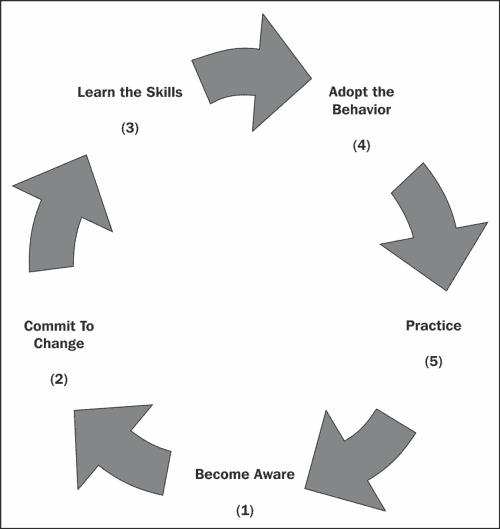
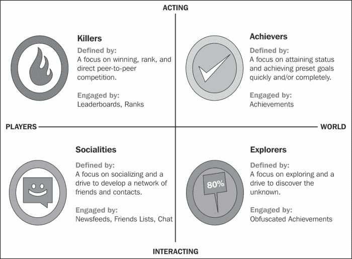
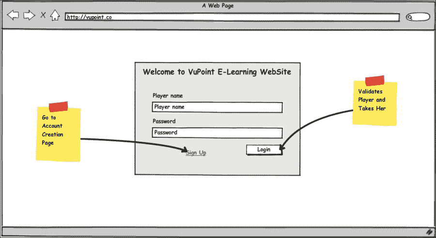

# 二、框架

现在我们已经看到了游戏化在现实世界中的一些用途，让我们仔细看看我们将如何创建我们的游戏化的电子学习系统。

如前所述，大多数游戏化应用程序都会失败。这不是因为游戏化不起作用，而是因为我们应用得很差。我们希望通过遵循开发系统的流程和框架来避免这种情况。在本章中，我们将概述这个框架，并开始为我们的系统提供一些结构。

我们将遵循游戏化设计框架，该框架由六个部分组成。他们是：

*   业务目标
*   目标行为
*   球员
*   活动循环
*   享乐
*   工具

在接下来的几页中，我们将仔细查看每一页，并开始在我们的游戏化电子学习网站的“骨骼”上添加“肉”。

我们将以最终产品的高层次模型来结束本章。这将使了解细节和构建应用程序变得相当容易。

# 业务目标

在我们在旅途中走得太远之前，我们首先需要弄清楚我们要去哪里。这就是业务目标的关键所在。虽然游戏是为了乐趣，游戏化是为了在不忽视商业目标的情况下产生积极的情绪，但游戏化是一项严肃的业务。

企业每年在信息技术上花费数百万美元。在信息技术方面持续稳定的投资有望通过改进业务流程带来回报。它的目的是帮助组织更顺利、更容易地运行。

游戏化就是“改进”业务流程。组织尽可能地改进流程本身，而技术只会促进流程。因此，游戏化工作将在类似的显微镜下进行审查，以及信息技术工作将获得的成功指标。客户、员工或利益相关者对组织的产品更感兴趣这一事实是不够的。它需要满足一个业务目标。

定义业务目标的起点是组织希望改进的业务流程。

就我们而言，我们计划改进的过程是电子学习。我们正在研究 K-12 老年人学习“思考”的过程。这个过程现在看起来怎么样？

图像来源：http://www.moddb.com/groups/critical-thinkers-of-moddb/images/critical-thinking-skills-explained

在一个全面的电子学习环境中，我们将尽可能地将这一过程游戏化。为此，我们将侧重于谈判与合作领域。根据批判性思维过程的谈判和合作阶段，学习者考虑不同的观点，并与他人进行讨论。

这使我们清楚地了解我们的一些目标可能是什么。其中可能包括：

*   增加与他人讨论的参与度
*   提高对不同观点的考虑水平

请注意，这些目标是可测量的。我们将能够测试我们正在寻找的增长/改进是否随着时间的推移而实际发生。

有了一套可测量的目标，我们可以将注意力转向下一步，即在我们的游戏化设计框架中的**目标行为**。

# 目标行为

现在，我们已经清楚我们试图用我们的系统实现什么，我们将重点关注我们希望激励的行动：我们的目标行为。

围绕游戏化努力的一个大问题是，它真的能导致行为改变吗。一旦游戏结束，员工、客户和利益相关者会回到他们习惯的方式吗？他们会想出办法“欺骗”系统吗？

以系统的方式实现长期组织目标的唯一方法是，应用程序不仅要引起当前的变化，而且要随着时间的推移产生持久的变化。许多游戏化应用程序在长期行为改变中失败，原因如下。

心理学家们详细研究了行为改变的生命周期。研究表明，人们在改变行为时会经历五个不同的阶段。每个阶段都提出了一系列不同的挑战。

行为生命周期的五个阶段如下：

*   **意识**：在一个人采取任何行动改变行为之前，他/她必须首先意识到自己当前的行为以及可能需要如何改变。
*   **认同**：当一个人意识到自己需要改变时，他们必须同意自己确实需要改变，并做出必要的承诺。
*   **学习**：但一个人到底需要做什么才能改变？不能假设他/她知道如何改变。他们必须学会新的行为。
*   **采纳**：现在他/她已经学会了必要的技能，他们需要实际实施这些技能。他们需要采取新的行动。
*   **Maintain**: Finally, after adopting a new behavior, it can only become a lasting change with constant practice.

    

    图像来源：http://www.accenture.com/us-en/blogs/technology-labs-blog/archive/2012/03/28/gamification-and-the-behavior-change-lifecycle.aspx)

我们如何利用这种理解来建立我们的目标行为？请记住，我们的目标是通过讨论增加互动，并增加对其他观点的考虑。根据我们对围绕目标改变行为的理解，我们需要我们的用户：

*   了解他们与其他用户的讨论频率
*   意识到其他观点的存在
*   与其他用户进行更多讨论
*   致力于考虑其他用户的观点
*   了解如何与其他用户进行更多讨论
*   了解其他用户的观点
*   与其他用户进行更多讨论
*   实际上考虑其他用户的观点
*   继续在一致的基础上与其他用户进行更多讨论
*   随着时间的推移，继续考虑其他用户的观点

这列出了用户需要为我们的系统执行的活动列表，以满足我们的目标。当然，我们的一些目标行为将是明确的。在其他情况下，我们需要一些创造力才能让用户采取这些行动。

那么，我们可以让我们的用户采取哪些可能的行动，使他们在行为改变的生命周期中前进？

*   检查他们的讨论线程数
*   回顾不同的观点部分
*   设置特定时间段的目标讨论量
*   设定要审查的不同观点的目标数量
*   观看有关如何使用讨论区的视频（或一些教学材料）
*   观看视频（或一些教学材料），了解观看其他视角的价值
*   参加讨论小组
*   阅读其他用户的讨论帖子
*   随时间参加讨论小组
*   随着时间的推移，阅读其他用户的观点

其中一些目标行为的实现相对简单。其他的则需要更多的思考。更重要的是，我们现在已经确定了我们希望用户采取的目标行为。这将指导我们其余的发展努力。

# 运动员

虽然最后几节讨论了事物的严重方面，如目标和目标行为，但我们仍然将游戏化作为重点。因此，从现在开始，我们将我们的用户称为**玩家**。我们必须记住，虽然我们已经定义了我们希望我们的球员采取的行动，但激励他们采取行动的策略因球员而异。游戏化绝对不是一刀切的过程。我们需要从球员的角度来审视我们的每一个目标行为。我们必须考虑到他们的动机，除非我们的机制几乎是反复试验。我们需要一种更加结构化的方法。

根据巴特尔的玩家动机理论，任何游戏系统的玩家都可分为以下四类之一：

*   **杀手**：这些人被激励参与游戏场景，其主要目的是通过“作用于”其他玩家来赢得游戏。这可能包括杀死他们、殴打他们，以及在游戏中与其他玩家直接竞争。
*   **成功者**：另一方面，这些成功者的动机是对系统本身采取明确的行动以取得胜利。他们的动机与其说是打败对手，不如说是为了取得胜利。
*   **社交者**：他们参与游戏的动机非常不同。他们更多地受到与其他玩家互动和参与的激励。
*   **探险者**：与社交者一样，探险者喜欢互动和参与，但与其他玩家的互动要少于与系统本身的互动。

下图概述了每个玩家的动机类型，以及什么样的游戏机制最能让他们参与其中。

图像来源：http://frankcaron.com/Flogger/?p=1732

在定义活动循环时，我们需要确保包括四种类型的参与者及其动机。

# 活动环

游戏化系统和其他系统一样，只是一系列动作。玩家对系统进行操作，系统做出响应。我们将用户如何与系统交互称为活动循环。我们将讨论两种类型的活动循环**参与循环**和**进展循环**，来描述我们的玩家互动。

交战循环描述了玩家如何与系统交战。它们概述了玩家的行为以及系统的响应方式。根据玩家的动机，他们的活动会有所不同，因此我们还必须考虑玩家为什么要采取他正在采取的行动。

一个渐进循环描述了玩家如何与整个系统互动。它概述了他/她在游戏中可能取得的进展。交战循环详细地讨论了玩家的行动，而进展循环则概述了玩家在系统中的移动。

例如，当一个人驾驶汽车时，他/她几乎一直在与汽车互动。这种互动是一组互动循环。一直以来，汽车都在向某个地方行驶。汽车行驶的方向描述了其前进循环。

活动循环倾向于遵循动机、行动和反馈模式。

### 注

更多详情请参见[附录](8.html "Appendix A. Tables")、*表格*。

球员们有足够的动力采取行动。当玩家采取行动并从系统中获得反馈时，这些反馈有望激励玩家采取另一个行动。他们采取行动并获得更多反馈。在一个完美的世界里，这种循环将无限期地持续下去，玩家们将永远不会停止玩我们的游戏化系统。我们的目标是尽可能接近这个连续的活动循环。

## 级数循环

在过去的几页中，我们研究了玩家在我们的参与循环中与系统的详细交互。现在是时候将我们的注意力转向另一种类型的活动循环，即进展循环。Progression 循环在宏观层面上查看系统。它们描述了玩家在系统中的旅程。我们通常会考虑等级、徽章和/或模式，当我们在考虑进展循环时，我们会回答诸如：你去过哪里、现在在哪里、要去哪里等问题。这可以归结为编纂玩家的掌握水平。

在我们的应用程序中，我们将从新手、专家和大师的角度来看待这段旅程。

加入游戏后，玩家将从新手级别开始。

在新手级别，我们将重点关注：

*   欢迎
*   登机并让用户适应系统的使用
*   可实现的目标

在欢迎阶段，我们将简单地向用户介绍游戏，并鼓励用户尝试。入职后，我们需要尽可能简化流程，并尽快反馈积极反馈。一旦用户上船，我们将概述最简单的参与方式并开始旅程。

在专家级别，玩家定期参与游戏。然而，其他球员不会认为这名球员是比赛中的领导者。我们在这一级别的目标是越来越多地提出更困难的挑战。当玩家遇到一个看起来太难的挑战时，我们可以在过程中加入惊喜选项，以保持他/她的积极性，直到他们能够突破专家壁垒达到大师级。

游戏和其他玩家承认大师。它们应该在游戏中突出显示，并且可能希望帮助新手和专家级别的其他人。这些选项应该在游戏的后期可用。

# 乐趣

在我们完成了确定目标、定义目标行为、确定玩家范围和规划系统活动的工作之后，我们终于可以思考许多新手游戏设计师开始的系统领域：乐趣。其他游戏化从业者将避免或至少掩饰游戏化设计过程中的有趣方面。重要的是，我们不要过分或低估过程中的乐趣。例如，厨师用香料准备一整顿饭，但他们不会把所有的香料都加在一起。他们在烹饪中均衡使用香料，为菜肴增添风味。把乐趣想象成一系列我们可以应用到活动循环中的香料。

Marc Leblanc 把乐趣分为八个不同的类别。在适当的情况下，我们会尝试将每一个都撒上，以达到所需的乐趣。请记住，一个玩家将体验到的乐趣对于另一个玩家来说并不相同。在这种情况下，一个尺码绝对不适合所有人。

*   **感觉**：愉悦的体验
*   **叙事**：展开的故事
*   **挑战**：障碍课程
*   **幻想**：假装
*   **团契**：一个社会框架
*   **发现**：探索未知领域
*   **表达方式**：玩家获得平台
*   **提交**：无意识的活动

那么，我们如何才能在我们的系统中谨慎地引入上述乐趣维度呢？下表列出了我们的选项：

<colgroup><col style="text-align: left"> <col style="text-align: left"></colgroup> 
| 

采取的行动

 | 

乐趣的维度

 |
| --- | --- |
| 检查他们的讨论线程数 | 挑战 |
| 回顾本节中不同的观点 | 发现 |
| 设置特定时间段的目标讨论量 | 挑战 |
| 设定要审查的“不同观点”的目标数量 | 挑战 |
| 观看有关如何使用讨论区的视频（或一些教学材料） | 挑战 |
| 观看视频（或一些教学材料），了解观看其他视角的价值 | 挑战 |
| 参加讨论小组 | 交情表示 |
| 阅读其他用户的讨论帖子 | 发现 |
| 随时间参加讨论小组 | 交情表示 |
| 阅读随着时间的推移其他用户的观点 | 发现 |

# 工具

我们终于到了从开始实施的阶段。在这一点上，我们可以看看各种游戏元素（工具）来实现我们的游戏化系统。如果我们一直遵循这个框架，那么机制和元素应该变得显而易见。我们不仅仅是为了增加排行榜或积分系统。我们可以将我们使用的所有工具与以前的工作联系起来。这将为我们的应用程序生成一个游戏化设计矩阵。但是在我们去那里之前，让我们停下来看看我们可以使用的一些工具。

有无数的工具、机制和策略可供我们使用。每天都在设计新的。以下是我们在设计游戏化系统时将遇到的一些最常见的机制：

*   **成就**：这些是玩家达到的具体目标。
*   **化身**：这些是玩家在游戏中角色、人物或角色的视觉表示。
*   **徽章**：这些是用于识别特定成就的视觉元素。他们给球员一种自豪感，他们可以向其他人炫耀。
*   **Boss-fight**：在游戏场景中，这是一个异常困难的挑战，通常在一个关卡的末尾，以展示足够的技能水平，从而提升到下一关卡。
*   **排行榜**：公开展示玩家排名。他们像徽章一样识别成就，但所有人都看得见。我们几乎每天都能看到这种情况，从运动队排名到销售代表的月度业绩。
*   **点**：这些点比较简单。玩家在系统中累积积分并进行各种动作。
*   **任务/任务**：这些是游戏场景中的专业挑战，以故事和目标为特征。
*   **奖励**：这是用来外在激励用户采取特定行动的任何东西。
*   **团队**：这是一组玩家作为一个整体进行比赛。
*   **虚拟资产**：这些是游戏中具有一定价值的元素，可以获取或用于获取其他有形或虚拟资产。

现在是时候脱掉游戏化设计的帽子，戴上开发者的帽子了。让我们从使用我们之前概述的设计开发一些最终站点的初始模型开始。许多人使用 Photoshop 或 Gimp 等图形工具开发模型。在这个阶段，我们将在模型中不太详细，只使用铅笔草图或模型工具，如 Balsamiq。

### 注

更多详情请参见[附录](8.html "Appendix A. Tables")、*表格*。

登录屏幕

这是我们应用程序中基本登录屏幕的一个模型。玩家习惯于我们在这里提供的基本登录和密码场景。

# 账户创建屏幕

首次玩家将需要先创建一个账户。

这是我们注册页面的模型。

主播放器屏幕

当玩家完全参与系统时，这捕获了我们系统的主要元素。

主播放器 Post 响应屏幕

我们通过实物模型概述了游戏化系统的关键功能。实物模型是一种向我们的团队视觉传达我们正在构建什么以及为什么要构建它的方法。视觉模型还为我们提供了一个在设计过程早期发现问题的机会。

# 总结

大多数游戏化的应用程序都会因为设计糟糕的系统而失败。因此，我们引入了游戏化设计框架来指导我们的开发过程。我们知道，如果我们：

*   明确业务目标
*   建立目标行为
*   了解我们的球员
*   完成活动循环
*   还记得好玩吗
*   优化工具