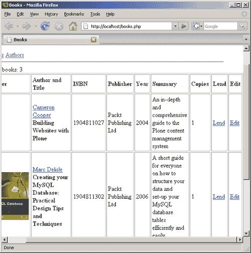
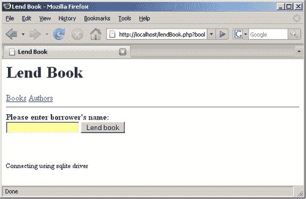
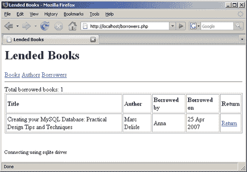

# 六、高级 PDO 使用

现在我们已经熟悉了 PDO 的基本特性，并使用它们构建了一个数据驱动的 web 应用程序，让我们看看一些高级功能。在本章中，我们将通过在 `php.ini`文件中指定连接配置文件名或选项来获取和设置连接属性（例如列名、大小写转换和底层 PDO 驱动程序的名称），以及连接到数据库。我们还将讨论交易。

我们将修改库应用程序，在每个页面的页脚中显示数据库驱动程序的名称。除了这个简单的更改之外，我们还将扩展应用程序，以跟踪我们拥有的一本书的副本数量，并跟踪那些借书的人。我们将使用事务来实现此功能。

# 设置和获取连接属性

在[第 3 章](3.html "Chapter 3. Error Handling")中，我们简要介绍了如何使用异常作为错误报告的一种手段时，设置连接属性。连接属性允许我们控制连接的某些方面，以及查询诸如驱动程序名称和版本之类的内容。

*   一种方法是在 PDO 构造函数中指定属性名称/值对数组。
*   另一种方法是调用 `PDO::setAttribute()`方法，该方法接受两个参数：
    *   属性的名称
    *   属性的值

在 PDO 中，属性及其值在 `PDO`类中定义为常量，如 `common.inc.php`文件中的以下调用所示：

```php
$conn->setAttribute(PDO::ATTR_ERRMODE, PDO::ERRMODE_EXCEPTION);

```

它包括两个这样的常数-`PDO::ATTR_ERRMODE`和 `PDO::ERRMODE_EXCEPTION`。

要获取属性的值，有 `PDO::getAttribute()`方法。它接受单个参数，即属性名称，并返回属性的值。例如，下面的代码将打印 `Exception:`

```php
if($conn->getAttribute(PDO::ATTR_ERRMODE) == PDO::ERRMODE_EXCEPTION) {
echo 'Exception';
}

```

现在，让我们看看 PDO 中有哪些连接属性。

*   `PDO::ATTR_CASE`. This attribute controls the case of column names that are returned by the `PDOStatement::fetch()` method. It is useful if the fetch mode is `PDO::FETCH_ASSOC` or `PDO::FETCH_BOTH` (as when the row is returned as an array that contains columns indexed by their name). This attribute can have one of the following three values: `PDO::CASE_LOWER, PDO::CASE_NATURAL`, and `PDO::CASE_UPPER`. Depending on this value, the column names will be lowercase, left without changes, or uppercase, respectively as in the following code snippet:

    ```php
    $conn->setAttribute(PDO::ATTR_CASE, PDO::CASE_UPPER);
    $stmt = $conn->query("SELECT * FROM authors LIMIT 1");
    $r = $stmt->fetch(PDO::FETCH_ASSOC);
    $stmt->closeCursor();
    var_dump($r);

    ```

    将打印：

    ```php
    array(4)
    {
    ["ID"]=>
    string(1) "1"
    ["FIRSTNAME"]=>
    string(4) "Marc"
    ["LASTNAME"]=>
    string(7) "Delisle"
    ["BIO"]=>
    string(54) "Marc Delisle is a member of the MySQL Developers
    Guild"
    }

    ```

    默认行为是不更改列名大小写，即 `PDO::CASE_NATURAL.`

*   `PDO::ATTR_ORACLE_NULLS:` This attribute, despite its name, works for all databases, not just Oracle. It controls how the `NULL` values and empty strings are passed in PHP. The possible values are `PDO::NULL_NATURAL` (for no transformation to happen), `PDO::NULL_EMPTY_STRING` (for empty strings to be replaced by PHP's null value), and `PDO::NULL_TO_STRING` (for the SQL NULL value is converted to an empty string in PHP).

    您可以在以下代码中看到此属性的工作方式：

    ```php
    $conn->setAttribute(PDO::ATTR_ORACLE_NULLS, PDO::NULL_TO_STRING);
    $stmt = $conn->query("SELECT * FROM books WHERE coverImage IS
    NULL LIMIT 1");
    $r = $stmt->fetch(PDO::FETCH_ASSOC);
    $stmt->closeCursor();
    var_dump($r);

    ```

    将导致：

    ```php
    array(9)
    {
    ["id"]=>
    string(1) "2"
    ["author"]=>
    string(1) "2"
    ["title"]=>
    string(18) "ImageMagick Tricks"
    ["isbn"]=>
    string(10) "1904811868"
    ["publisher"]=>
    string(20) "Packt Publishing Ltd"
    ["year"]=>
    string(4) "2006"
    ["summary"]=>
    string(81) "Unleash the power of ImageMagick
    with this fast,friendly tutorial and tips guide"
    ["coverMime"]=>
    string(0) ""
    ["coverImage"]=>
    string(0) ""
    }

    ```

    正如您所看到的，高亮显示的字段被报告为字符串，而不是 null（如果我们没有设置`PDO::ATTR_ORACLE_NULLS`属性，就会出现这种情况）。

*   `PDO::ATTR_ERRMODE`. This attribute sets the error reporting mode for the connection. It accepts three values:
    *   `PDO::ERRMODE_SILENT:`未执行任何操作，错误代码可通过 `PDO::errorCode()`和 `PDO::errorInfo()`方法（或 `PDOStatement`类中的等效方法）获得。这是默认值。
    *   `PDO::ERRMODE_WARNING:`如前所述，未采取任何行动，但将以 `E_WARNING`级别引发错误。
    *   `PDO::ERRMODE_EXCEPTION` will set the error codes (as with `PDO::ERRMODE_SILENT)`, and an exception of class `PDOException` will be thrown.

        还有一些特定于驱动程序的属性，我们将不在这里介绍。参见[http://www.php.net/pdo](http://www.php.net/pdo) 了解更多信息。然而，有一个特定于驾驶员的属性值得我们注意： `PDO::ATTR_PERSISTENT`。您可以使用它来指定 MySQL 驱动程序应使用持久连接，这会提供更好的性能（您可以将其视为 `mysql_pconnect()` 函数的对应项）。此属性应在 PDO 构造函数中设置，而不是通过 PDO:：setAttribute（）调用设置：

    ```php
    $conn = new PDO($connStr, $user, $pass,
    array(PDO::ATTR_PERSISTENT => true);

    ```

    上述三个属性是读/写属性，这意味着它们可以被读和写。也有只读属性，只能通过 `PDO::getAttribute()`方法使用。这些属性可能返回字符串值（而不是 PDO 类中定义的常量）。

*   `PDO::ATTR_DRIVER_NAME:` This returns the name of the underlying database driver:

    ```php
    echo $conn->getAttribute(PDO::ATTR_DRIVER_NAME);

    ```

    这将根据您使用的驱动程序打印 MySQL 或 SQLite。

*   `PDO::ATTR_CLIENT_VERSION:`返回基础数据库客户端库版本的名称。例如，对于 MySQL，这可能类似于 5.0.37。
*   `PDO::ATTR_SERVER_VERSION:`返回您所连接的数据库服务器的版本。对于 MySQL，这可以是一个字符串，例如`"4.1.8-nt"`。

现在让我们回到我们的应用程序，并对其进行修改，以在每个页面的页脚中显示数据库驱动程序。为此，我们将修改 `common.inc.php:`中的 `showFooter()`函数

```php
function showFooter()
{
global $conn;
if($conn instanceof PDO) {
$driverName = $conn->getAttribute(PDO::ATTR_DRIVER_NAME);
echo "<br/><br/>";
echo "<small>Connecting using $driverName driver</small>";
}
?>
</body>
</html>
<?php
}

```

在这个函数中，我们从全局名称空间导入 `$conn`变量。如果这个变量是 `PDO`类的对象，那么我们将调用 `getAttribute()`方法，如上所述。我们必须进行此检查，因为在某些情况下， `$conn`变量可能未设置。例如，如果 `PDO`构造函数失败并抛出异常，我们将无法调用 `$conn`变量上的任何方法（这将导致致命错误调用非对象上的成员函数是致命错误）

由于我们的应用程序中的所有页面都调用了 `showFooter()`方法函数，因此这种变化随处可见：


# MySQL 缓冲查询

如果您只使用 MySQL 数据库，那么可能需要使用 MySQL 的 PDO 驱动程序缓冲查询模式。当连接设置为缓冲查询模式时，每个 SELECT 查询的整个结果集将在返回到应用程序之前预取到内存中。这给了我们一个好处，我们可以使用 `PDOStatement::rowCount()`方法来检查结果集包含多少行。在[第 2 章](2.html "Chapter 2. Using PHP Data Objects: First Steps")中，我们讨论了该方法，并说明它对 MySQL 和 SQLite 数据库返回 0。现在，当指示 PDO 使用缓冲查询时，此方法将返回有意义的值。

要强制 PDO 进入 MySQL 缓冲查询模式，必须指定 `PDO::MYSQL_ATTR_USE_BUFFERED_QUERY`连接属性。考虑下面的例子：

```php
$conn = new PDO($connStr, $user, $pass);
$conn->setAttribute(PDO::ATTR_ERRMODE, PDO::ERRMODE_EXCEPTION); $conn->setAttribute(PDO::MYSQL_ATTR_USE_BUFFERED_QUERY, 1);
$q = $conn->query("SELECT * FROM books");
echo $q->rowCount();

```

这将打印返回的行数。

请注意，此属性仅适用于 MySQL，不能跨数据库移植。如果您的应用程序只使用 MySQL，那么应该使用它。另外，请记住，返回大结果集的缓冲查询对于资源来说非常昂贵，应该避免。如果要使用缓冲查询，请确保在发出此类昂贵的查询之前禁用它们。可以通过关闭此属性来完成此操作：

```php
$conn->setAttribute(PDO::MYSQL_ATTR_USE_BUFFERED_QUERY, 0);

```

您可以通过调用

```php
$conn->getAttribute(PDO::MYSQL_ATTR_USE_BUFFERED_QUERY);

```

我已经为每个屏幕截图切换了数据库（在第一个屏幕截图中，页面向下滚动到底部以节省空间）。

# 使用连接配置文件和 php.ini 设置进行连接

当我们讨论连接字符串（或 PDO 的数据源名称）时，我们看到连接字符串以驱动程序名称开头，后跟分号。PDO 还支持配置文件——一个包含连接字符串的文件。例如，我们可以在保存应用程序文件的目录中创建一个名为 `pdo.dsn`的文件，并将连接字符串放在那里：

```php
mysql:host=localhost;dbname=pdo
or
sqlite:/www/hosts/localhost/pdo.db

```

或者，我们可以创建两个文件 `mysql.dsn`和 `sqlite.dsn`，分别包含第一个和第二个连接字符串。

然后在 PDO 构造函数中，我们可以指定配置文件路径或 URL，而不仅仅是连接字符串：

```php
uri:./pdo.dsn

```

PDO 将读取该文件并使用其中指定的连接字符串。使用此方法的优点是，您不仅可以指定本地文件，还可以指定任何 URL，以便可以包括远程文件（前提是在系统中为 HTTP 或 FTP 等协议注册了合适的流处理程序）。另一方面，如果文件没有得到适当的保护，不让所有用户访问 web，那么它可能会向第三方泄漏安全信息，因此在使用此方法指定连接字符串时应小心。

还有另一种指定连接字符串的方法： `php.ini`文件中。例如，您可以在 `php.ini`文件中定义以下指令：

```php
pdo.dsn.mysql= mysql:host=localhost;dbname=pdo
pdo.dsn.sqlite=sqlite:/www/hosts/localhost/pdo.db

```

然后可以将“mysql”或“sqlite”字符串分别传递给 `PDO`构造函数，而不是 mysql 和 sqlite 的整个连接字符串：

```php
$conn = new PDO('mysql', $user, $pass);
$conn = new PDO('sqlite', $user, $pass);

```

如您所见，本例中的连接字符串应该与带有`'pdo.dsn'`前缀的 `php.ini`文件中的相应选项相匹配。

# 获取可用驱动程序列表

PDO 允许您以编程方式获取所有已安装驱动程序的列表。可以调用 `PDO::getAvailableDrivers()`方法返回一个数组，其中包含可以使用的数据库驱动程序的名称。例如，此代码将打印类似于以下内容的内容：

```php
var_dump(PDO::getAvailableDrivers());
array(3)
{
[0]=>
string(5) "mysql"
[1]=>
string(6) "sqlite"
[2]=>
string(7) "sqlite2"
}

```

此数组中包含的驱动程序名称是连接字符串的前缀。此外，返回的名称与 `PDO::ATTR_DRIVER_NAME`属性的值相同。

### 注

`PDO::getAvailableDrivers()`方法返回 `php.ini`文件中 PDO 系统注册的驱动程序名称。您可能无法在本地计算机上使用所有这些驱动程序。例如，如果 MySQL 服务器未运行，则返回的数组中存在 MySQL 项并不意味着您可以连接到本地 MySQL 服务器，并且如果某个数据库服务器正在本地计算机上运行，但其驱动程序未向 PDO 注册，然后您将无法连接到该数据库服务器。

# 交易

PDOAPI 还标准化了事务处理方法。默认情况下，成功创建 PDO 连接后，设置为 `autocommit`模式。这意味着对于每个支持事务的数据库，每个查询都包装在隐式事务中。对于不支持事务的数据库，每个查询都按原样执行。

通常，事务处理策略如下：

1.  开始交易。
2.  将数据库相关代码包装在*try…catch*块中。
3.  数据库相关代码（在*try*块中）应该在所有更新完成后提交更改。
4.  *catch*块应该回滚事务。

当然，事务中只应处理更新数据库的代码和可能破坏数据完整性的代码。交易的一个典型示例是转账：

1.  开始交易。
2.  如果付款人账户上有足够的资金：
    *   从付款人的帐户中减去金额。
    *   将金额添加到受益人的账户中。
3.  提交事务。

如果在事务的中间发生任何不好的事情，则数据库不会被更新，并且数据完整性被保留。此外，通过将帐户余额检查包装到事务中，我们可以确保并发更新不会破坏数据完整性。

PDO 只提供三种处理事务的方法： `PDO::beginTransaction()`启动事务； `PDO::commit()`提交调用 `PDO::beginTransaction()`后所做的更改； `PDO::rollBack()`回滚事务启动后所做的任何更改。

`PDO::beginTransaction()`方法不接受任何参数，并根据事务启动的成功情况返回布尔值。如果对该方法的调用失败，那么 PDO 将抛出异常（例如，如果您已经在事务的中间，PDO 会告诉您）。同样，如果没有活动事务， `PDO::rollBack()`方法将抛出异常，如果在调用 `PDO::beginTransaction()`之前调用 `PDO::commit()`方法，也会发生异常。（当然，您的错误处理模式必须设置为 `PDO::ERRMODE_EXCEPTION`才能引发异常。）

您还应该注意，如果您使用 PDO 执行该任务，则不应使用直接查询来控制事务。这意味着您不应该使用 `PDO::query()`方法发出 `BEGIN TRANSATION, COMMIT`或 `ROLLBACK`之类的查询。否则，这三种方法的行为将不一致。此外，PDO 目前不支持保存点。

现在让我们回到我们的库应用程序。为了了解交易在实践中是如何工作的，我们将对其进行修改，允许它跟踪我们拥有的某本书的副本数量，并且我们将实现一个功能来跟踪我们借书给的人。

此修改将包括以下更改：

*   我们将不得不通过添加一个新列来更改 books 表，以保留每本书的副本数。需要修改 `editBook.php`页面才能更改此值
*   我们将创建一个表来跟踪所有借贷者，但为了保持示例的简单性，我们将不创建借贷者表（正如我们在实际图书馆应用程序中所做的那样）。我们将把借书人的名字和我们借给他们的书的书号联系起来。
*   我们将创建一个页面，供借书时使用。此页面将询问借贷者姓名，然后在借贷者表中插入一条记录，并减少 books 表中的份数。
*   我们还需要一个页面，其中将列出所有借款人和另一个脚本，这将允许他们归还一本书。此脚本将从借贷者表中删除一条记录，并增加 books 表中的副本数。

我们将仅在一次更新两个表时使用事务（如上面列表中的最后两点）。

在编码之前，我们将更改 books 表：

```php
mysql> alter table books add column copies tinyint not null default 1;
Query OK, 3 rows affected (0.50 sec)
Records: 3 Duplicates: 0 Warnings: 0

```

应为 SQLite 执行相同的命令。

现在，让我们修改一下 `books.php`以显示每本书有多少份，并提供一个链接。以下是需要更改的代码行（第 20 至 58 行）：

```php
<table width="100%" border="1" cellpadding="3">
<tr style="font-weight: bold">
<td>Cover</td>
<td>Author and Title</td>
<td>ISBN</td>
<td>Publisher</td>
<td>Year</td>
<td>Summary</td>
<td>Copies</td>
<td>Lend</td>
<td>Edit</td>
</tr>
<?php
// Now iterate over every row and display it
while($r = $q->fetch())
{
?>
<tr>
<td>
<?php if($r['coverMime']) { ?>
">
<?php } else { ?>
n/a
<? } ?>
</td>
<td>
<a href="author.php?id=<?=$r['authorId']?>"><?=htmlspecialchars
("$r[firstName] $r[lastName]")?></a><br/>
<b><?=htmlspecialchars($r['title'])?></b>
</td>
<td><?=htmlspecialchars($r['isbn'])?></td>
<td><?=htmlspecialchars($r['publisher'])?></td>
<td><?=htmlspecialchars($r['year'])?></td>
<td><?=htmlspecialchars($r['summary'])?></td>
<td><?=$r['copies']?></td>
<td>
<a href="lendBook.php?book=<?=$r['id']?>">Lend</a>
</td>
<td>
<a href="editBook.php?book=<?=$r['id']?>">Edit</a>
</td>
</tr>
<?php
}
?>

```

现在，对于 MySQL 和 SQLite，您应该会看到一个类似于以下屏幕截图的页面（在这里，我们向下和向右滚动，以使其适合页面）：



现在，让我们创建借贷者表。如前所述，该表将包含一个 ID 字段、图书 ID 字段、借阅者姓名和时间戳列。我们需要此表上的 ID（主键），以防止可能的数据损坏；例如，如果同一借款人将同一本书借了两次。如果我们仅按姓名和账簿 ID 跟踪借款人，则该表中可能存在重复记录，并且归还一本账簿可能会删除该表中的多行，这将导致数据损坏：

```php
mysql> create table borrowers(
-> id int primary key not null auto_increment,
-> book int not null,
-> name varchar(40),
-> dt int);
Query OK, 0 rows affected (0.13 sec)

```

对于 SQLite，语法将略有不同：

```php
sqlite> create table borrowers(
...> id integer primary key,
...> book int not null,
...> name varchar(40),
...> dt int);

```

*借出*这本书的页面（`lendBook.php`可能是最难的部分。此页面将包含一个表单，您可以在其中输入借款人的姓名。成功提交后，脚本将启动交易，检查是否至少有一份可用的图书，在借书人表中插入一条记录，并减少图书表中的副本列，提交交易，并重定向到 `books.php`页面。

```php
<?php
/**
* This page allows lending a book
* PDO Library Management example application
* @author Dennis Popel
*/
// Don't forget the include
include('common.inc.php');
// First see if the request contains the book ID
// Return back to books.php if not
$id = (int)$_REQUEST['book'];
if(!$id) {
header("Location: books.php");
exit;
}
// Now see if the form was submitted
$warnings = array();
if($_POST['submit']) {
// Require that the borrower's name is entered
if(!$_POST['name']) {
$warnings[] = 'Please enter borrower\'s name';
}
else {
// Form is OK, "lend" the book
$conn->beginTransaction();
try
{
$stmt = $conn->query("SELECT copies FROM books WHERE id=$id");
$copies = $stmt->fetchColumn();
$stmt->closeCursor();
if($copies > 0) {
// If we can lend it
$conn->query("UPDATE books SET copies=copies-1
WHEREid=$id");
$stmt = $conn->prepare("INSERT INTO borrowers(book, name, dt)
VALUES(?, ?, ?)");
$stmt->execute(array($id, $_POST['name'], time()));
}
else {
// Else show warning
$warnings[] = 'There are no more copies of this book
available';
}
$conn->commit();
}
catch(PDOException $e)
{
// Something bad happened
// Roll back and rethrow the exception
$conn->rollBack();
throw $e;
}
}
// Now, if we don't have errors,
// redirect back to books.php
if(count($warnings) == 0) {
header("Location: books.php");
exit;
}
// otherwise, the warnings will be displayed
}
// Display the header
showHeader('Lend Book');
// If we have any warnings, display them now
if(count($warnings)) {
echo "<b>Please correct these errors:</b><br>";
foreach($warnings as $w)
{
echo "- ", htmlspecialchars($w), "<br>";
}
}
// Now display the form
?>
<form action="lendBook.php" method="post">
<input type="hidden" name="book" value="<?=$id?>">
<b>Please enter borrower's name:<br></b>
<input type="text" name="name"value="<?=htmlspecialchars
($_POST['name'])?>">
<input type="submit" name="submit" value=" Lend book ">
</form>
<?php
// Display footer
showFooter();

```

现在让我们运行代码。我们首先检查书籍的 ID 是否已通过 URL 或表单传递给脚本。（我们将 ID 保留在表单的隐藏字段中。）然后，如果有表单提交（按下提交按钮），我们将检查名称字段是否正确填写。如果测试成功，我们继续进行事务处理，计算剩余的副本数并检查该数字是否大于零，我们减少副本列并使用准备好的语句将记录插入到 `borrowers`表中。如果少于一个副本，我们将向 `$warnings`数组添加一条消息，以便在页面上显示警告。

如果事务中出现故障，将执行 `catch`块。事务将回滚，并再次抛出异常。我们这样做是为了让默认的错误处理程序完成它的工作。

现在，如果您将上述代码列表保存在 `lendBook.php`中，并点击图书列表页面上的**借出**链接之一，您将到达以下页面：



当然，您应该在数据库之间切换，以查看代码是否适用于 MySQL 和 SQLite。

### 注

为了增强页面，我们还应该显示书名和作者，但这将留给您。此外，如果您想知道为什么我们要提醒用户只有在表单提交后才有更多副本，这是因为我们只能在事务中决定。如果我们检测到事务中有可用的副本，只有这样我们才能确保没有并发更新会改变这一点。当然，从用户的角度来看，另一个附加内容可能是一个警告，与书的详细信息一起显示。但是，也需要在事务中进行检查。

现在，如果你*借给*一本书，你会看到图书列表页面上的**副本**栏已经减少。现在让我们创建一个页面，列出所有借贷者和借出给他们的书籍。我们叫它 `borrowers.php`。虽然此页面不处理任何用户输入，但它包含一个连接三个表（借阅者、书籍和作者）的查询：

```php
<?php
/**
* This page lists all borrowed books
* PDO Library Management example application
* @author Dennis Popel
*/
// Don't forget the include
include('common.inc.php');
// Display the header
showHeader('Lended Books');
// Get all lended books count and list
$sql = "SELECT borrowers.*, books.title, authors.firstName,
authors.lastName
FROM borrowers, books, authors
WHERE borrowers.book=books.id AND books.author=authors.id
ORDER BY borrowers.dt";
$totalBooks = getRowCount($sql);
$q = $conn->query($sql);
$q->setFetchMode(PDO::FETCH_ASSOC);
// now create the table
?>
Total borrowed books: <?=$totalBooks?>
<table width="100%" border="1" cellpadding="3">
<tr style="font-weight: bold">
<td>Title</td>
<td>Author</td>
<td>Borrowed by</td>
<td>Borrowed on</td>
<td>Return</td>
</tr>
<?php
// Now iterate over every row and display it
while($r = $q->fetch())
{
?>
<tr>
<td><?=htmlspecialchars($r['title'])?></td>
<td><?=htmlspecialchars("$r[firstName] $r[lastName]")?></td>
<td><?=htmlspecialchars($r['name'])?></td>
<td><?=date('d M Y', $r['dt'])?></td>
<td>
<a href="returnBook.php?borrower=<?=$r['id']?>">Return</a>
</td>
</tr>
<?php
}
?>
</table>
<?php
// Display footer
showFooter();

```

代码易于遵循；它遵循与 `books.php`或 `authors.php`相同的逻辑。但是，由于该页面没有从任何地方链接，我们应该在站点标题中添加一个链接（在 `common.inc.php):`中的 `showHeader()`功能）

```php
function showHeader($title)
{
?>
<html>
<head><title><?=htmlspecialchars($title)?></title></head>
<body>
<h1><?=htmlspecialchars($title)?></h1>
<a href="books.php">Books</a>
<a href="authors.php">Authors</a>
<a href="borrowers.php">Borrowers</a>
<hr>
<?php
}

```

现在，如果您导航到 `borrowers.php`，您应该会看到如下截图：



如我们所见，该页面包含指向 `returnBook.php`页面的链接，该页面目前还不存在。此脚本将从借贷者表中删除相关记录，并增加 books 表中的 copies 列。此操作也将包装在事务中。此外， `returnBook.php`接受借阅者的表 ID 字段（与接受书籍 ID 的 `lendBook.php`相反）。因此，我们还应该从借书人表中获取图书 ID：

```php
<?php
/**
* This page "returns" a book back to the library
* PDO Library Management example application
* @author Dennis Popel
*/
// Don't forget the include
include('common.inc.php');
// First see if the request contains the borrowers ID
// Return back to books.php if not
$id = (int)$_REQUEST['borrower'];
if(!$id) {
header("Location: books.php");
exit;
}
// Now start the transaction
$conn->beginTransaction();
try
{
$q = $conn->query("SELECT book FROM borrowers WHERE id=$id");
$book = (int)$q->fetchColumn();
$q->closeCursor();
$conn->query("DELETE FROM borrowers WHERE id=$id");
$conn->query("UPDATE books SET copies=copies+1 WHERE id=$book");
$conn->commit();
header("Location: books.php");
}
catch(PDOException $e)
{
$conn->rollBack();
throw $e;
}

```

代码应该是相当自我描述的。首先，我们检查请求是否包含借款人的 ID，然后更新这两个表。成功完成后，我们将被重定向到图书列表页面，否则，错误处理程序将显示相关消息。

现在，最后一次触摸： `editBook.php`页面，可以用来编辑我们有多少本书。我们将把这个留给你，但这里有一些考虑。对于现实生活中的图书馆应用程序来说，建议的跟踪借出图书的方法不是很好。我们应该把图书馆的总份数放在一列，把借出的份数放在另一列，而不是保留可用的份数。应该这样做，因为编辑可用图书的数量可能会导致数据损坏。返回一本书将增加 books 表中的 copies 列。如果其他人同时编辑可用的副本数量，他们可能不知道借款人正在归还一本书，因此可能输入错误的数字。

另一方面，如果有两个单独的列，那么更新总拷贝数将完全独立于图书出借和归还引起的更新。但是，在这种情况下，借出书籍的脚本应该检查借出的副本数是否小于总副本数。仅当满足此条件时，交易才应继续。

# 总结

在本章中，我们将介绍 PDO 提供的一些扩展功能，特别是事务。我们的应用程序示例经过修改，以提供依赖于事务的附加功能。我们还研究了事务感知代码的组织。

然而，正如您可能已经注意到的，我们在一个文件中混合了更新数据库、处理用户输入和呈现页面的代码。虽然我们试图将输入处理和表示保持在一个文件的不同部分（首先是数据处理，然后是页面呈现），但我们无法分离数据处理。

在下一章中，我们将看到如何分离数据模型和应用程序逻辑，以便可以从其他地方（而不仅仅是从我们的应用程序）访问和操作数据。我们将开发一个数据模型类，它将封装我们的库应用程序数据处理方法。然后可以从其他应用程序中使用此类。