# 一、了解和建立我们的开发环境

在本章中，我们将介绍运行 Magento 所涉及的一系列技术，以及如何为开发设置适当的环境。本章将介绍以下主题：

*   LAMP 虚拟机
*   设置和使用 VirtualBox
*   设置和使用流浪汉
*   IDE 和版本控制系统

我们还将学习如何从头开始设置 LAMP 虚拟机，以及如何使用 Vagrant 和 Chef 完全自动化此过程。

# 白手起家的灯

**LAMP**（**Linux、Apache、MySQL、PHP**是开源技术的解决方案栈，用于构建 web 服务器，也是当前运行 Magento 的标准。

欲了解更详细的需求清单，请访问[www.magentocommerce.com/system-requirements](http://www.magentocommerce.com/system-requirements)。

### 注

尽管在撰写本书时，Nginx 在 Magento 开发人员中得到了更广泛的采用，但 Apache2 仍然是社区认可的标准。我们将集中精力与之合作。

作为开发人员，在设置和维护我们的开发环境方面存在多种挑战和细微差别，例如：

*   匹配您的开发和生产环境
*   在不同平台和团队成员之间保持一致的环境
*   设置一个需要几个小时的新环境
*   并非所有的开发人员都有自己设置 LAMP 服务器的知识或经验

我们可以借助 Oracle 的 VirtualBox（[www.VirtualBox.org](http://www.virtualbox.org)来解决前两点。VirtualBox 是一个功能强大且广受欢迎的虚拟化引擎，它将允许我们创建**虚拟机**（**虚拟机**。VM 还可以在开发人员之间以及所有主要操作系统之间共享。

## 获取 VirtualBox

VirtualBox 是开源的，所有平台都支持它。可直接从[www.virtualbox.org/wiki/Downloads](http://www.virtualbox.org/wiki/Downloads)下载。

现在，我们将继续设置 Linux 虚拟机。我们选择 Ubuntu 服务器 12.04.2 LTS 是因为它的易用性和广泛可用的支持。首先，从[www.ubuntu.com/download/server](http://www.ubuntu.com/download/server)下载 ISO 文件；64 位和 32 位版本都可以工作。

要创建新的 Linux 虚拟机，请执行以下步骤：

1.  Start **VirtualBox Manager** and click on the **New** button in the upper-left corner, as shown in the following screenshot:

    

2.  将弹出一个向导对话框，指导我们完成创建裸虚拟机的步骤。向导将询问我们有关设置虚拟机的基本信息：
    *   **虚拟机名称**：我们应该如何命名我们的虚拟机？让我们把它命名为`Magento_dev 01`。
    *   **内存**：当我们的虚拟机启动时，将分配给来宾操作系统的系统内存值；对于运行全 LAMP 服务器，建议使用 1 GB 或更大的容量。
    *   **操作系统类型**：这是我们以后要安装的操作系统类型；在我们的例子中，我们希望选择**Linux/Ubuntu**，根据我们的选择，VirtualBox 将启用或禁用某些 VM 选项。
3.  Next, we need to specify a virtual hard disk. Select **Create a virtual hard drive now**, as shown in the following screenshot:

    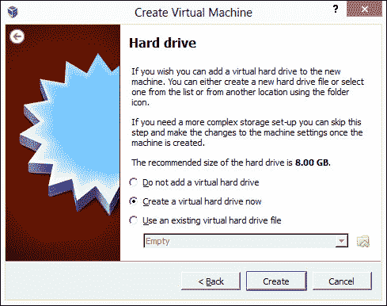

4.  硬盘选项很多，但在大多数情况下，选择**VirtualBox disk Image**（**VDI**就足够了。这将在主机操作系统上创建一个文件。
5.  我们现在需要选择物理驱动器上的存储类型。我们有以下两种选择：
    *   **动态分配**：随着来宾操作系统上文件数量和使用量的增加，磁盘映像将自动增长
    *   **固定大小**：此选项将从一开始限制虚拟磁盘的大小
6.  Next, we will need to specify the size of our virtual hard disk. We want to adjust the size depending on how many Magento installations we plan to use.

    ### 注

    一般来说，我们希望每个 Magento 安装至少保持 2 GB，如果在同一安装上运行数据库服务器，则再保持 3 GB。这并不是说所有这些空间都将一次性使用，甚至根本不会使用，但一旦考虑到产品映像和缓存文件，Magento 安装可以使用大量磁盘空间。

7.  Finally, we just need to click on the **Create** button.

    ### 提示

    主要区别在于，固定大小的硬盘将从一开始就在物理硬盘上保留空间，而动态分配的硬盘将逐渐增长，直到达到指定的大小。

    新创建的框将出现在左侧导航菜单上，但在启动最近创建的 VM 之前，我们需要进行一些更改，如下所示：

    我选择我们新创建的 VM，点击顶部的**设置**按钮。

    二,。打开**网络**菜单，选择**适配器 2**。我们将把连接到的**设置为**桥接适配器**，因为我们希望将其设置为连接到主网络接口的桥接适配器。这将允许我们使用 SSH 进行远程连接。**

    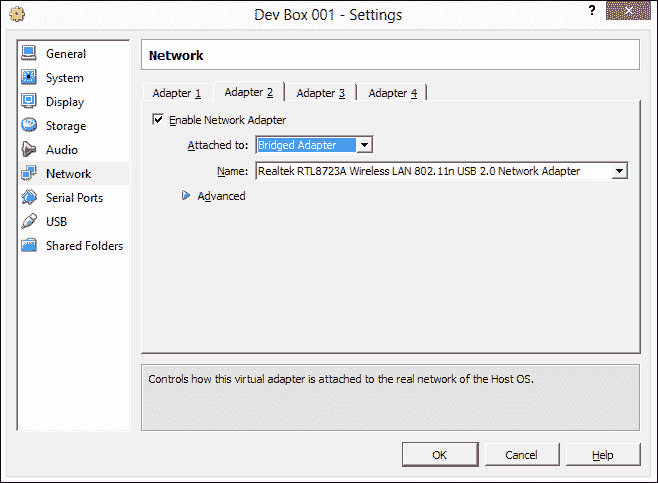

    iii.进入**系统**菜单，更改引导顺序，使 CD/DVD-ROM 首先引导。

    iv.在**存储**菜单上，选择一个空的 IDE 控制器并挂载我们之前下载的 Ubuntu ISO 映像。

    

## 启动我们的虚拟机

此时，我们已经成功安装并配置了 VirtualBox 实例，现在我们已经准备好第一次启动新的虚拟机。要做到这一点，只需选择左侧边栏中的 VM，然后单击顶部的**开始**按钮。

将弹出一个新窗口，其中包含到 VM 的接口。Ubuntu 需要几分钟才能启动。

一旦 Ubuntu 启动完毕，我们将看到两个菜单。第一个菜单允许我们选择语言，第二个菜单是主菜单，它提供了几个选项。在我们的例子中，我们只想继续使用**安装 Ubuntu 服务器**选项。

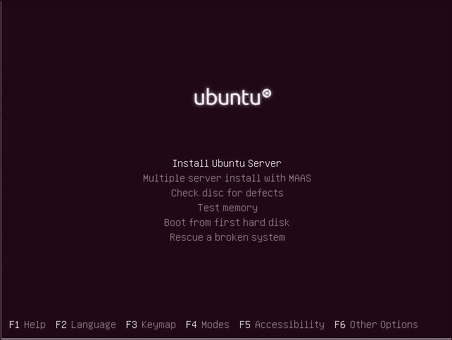

我们现在应该看到 Ubuntu 安装向导，它将询问我们的语言和键盘设置；在为我国和语言选择适当的设置后，安装程序将继续在内存中加载所有必要的软件包。这可能需要几分钟的时间。

Ubuntu 将继续配置我们的主网络适配器，一旦自动配置完成，我们将被要求为虚拟机设置主机名。我们可以将主机名保留为默认设置。

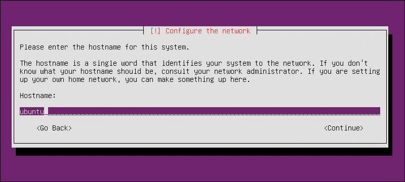

下一屏幕将要求我们输入我们用户的全名；在本例中，我们使用`Magento Developer`：

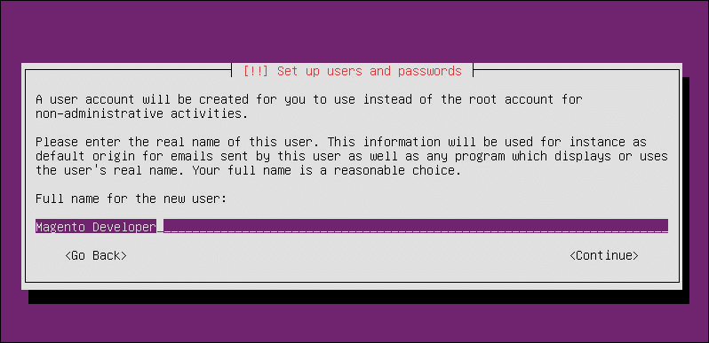

接下来，我们将被要求创建用户名和密码。让我们使用`magedev`作为我们的用户名：

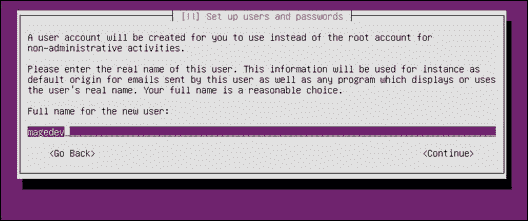

让我们使用`magento2013`作为密码：

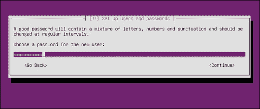

在接下来的屏幕上，我们将被要求确认密码并设置正确的时区；输入正确值后，安装向导将显示以下屏幕，询问我们的分区设置：

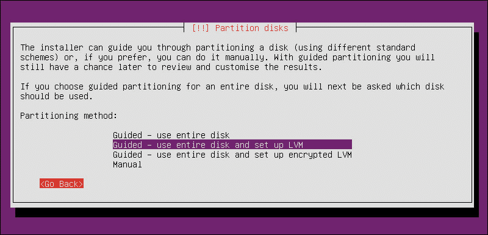

在本例中，我们选择**引导-使用整个磁盘并设置 LVM**；现在让我们确认我们正在对虚拟磁盘进行分区：

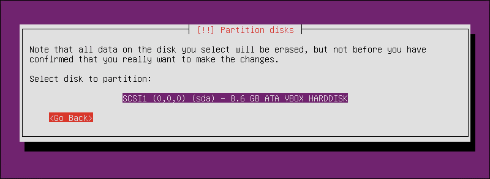

我们将被要求最后一次确认我们的变更；选择**完成分区并将更改写入磁盘**，如下图所示：

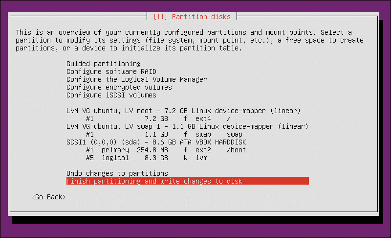

安装向导将要求我们选择要安装的预定义软件包；可用选项之一是**LAMP 服务器**。

虽然这非常方便，但我们不想安装预装 Ubuntu CD 的 LAMP 服务器；我们将手动安装所有灯具组件，以确保它们是根据特定需要设置的，并且是最新的补丁。

接下来，为此，我们需要一个 SSH 服务器；从列表中选择**OpenSSH 服务器**，点击**继续**：

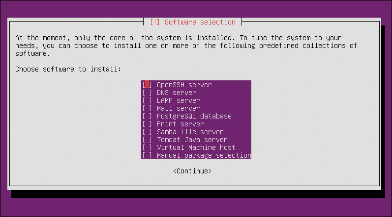

现在，Ubuntu 的安装已经完成，它将重新启动到我们新安装的虚拟机中。

我们几乎准备好继续安装环境的其余部分，但首先我们需要更新 package manager 存储库定义，登录控制台并运行以下命令：

```php
$ sudo apt-get update

```

**APT**代表**高级打包工具**，是大多数 Debian GNU/Linux 发行版中包含的核心库之一；`apt`大大简化了在我们的系统上安装和维护软件的过程。

一旦`apt-get`完成了所有存储库源的更新，我们就可以继续安装 LAMP 服务器的其他组件。

## 安装 Apache2

Apache 是一个 HTTP 服务器。目前，它用于托管超过 60%的网站，是运行 Magento 商店的公认标准。有许多在线指南和教程可用于微调和调整 Apache2 以提高 Magento 性能。

安装 Apache 非常简单，只需运行以下命令：

```php
$ sudo apt-get install apache2 -y

```

这将为我们安装 Apache2 和所有必需的依赖项。如果一切都已正确安装，我们现在可以打开浏览器并输入`http://192.168.36.1/`进行测试。

Apache 默认作为服务运行，可以使用以下命令进行控制：

```php
$ sudo apache2ctl stop 
$ sudo apache2ctl start 
$ sudo apache2ctl restart 

```

您现在应该可以看到 Apache 的默认网页，其中包含消息**It Works！**。

## 安装 PHP

**PHP**是一种服务器端脚本语言，代表**PHP 超文本处理器**。Magento 是在 PHP5 和 Zend 框架上实现的，我们需要安装 PHP 和一些附加库才能运行它。

让我们再次使用`apt-get`并运行以下命令来安装`php5`和所有必要的库：

```php
$ sudo apt-get install php5 php5-curl php5-gd php5-imagick php5-imap php5-mcrypt php5-mysql -y
$ sudo apt-get install php-pear php5-memcache -y
$ sudo apt-get install libapache2-mod-php5 -y

```

安装了第一个命令，不仅安装了`php5`，而且还安装了 Magento 连接数据库和处理图像所需的附加软件包。

第二个命令将安装 PEAR、PHP 包管理器和 PHP memcached 适配器。

### 注

Memcached 是一个高性能的分布式内存缓存系统；这是 Magento 的可选缓存系统。

第三个命令为 Apache 安装并设置`php5`模块。

通过运行以下命令，我们最终可以测试 PHP 安装是否正常工作：

```php
$ php -v

```

## 安装 MySQL

MySQL 是众多 web 应用的数据库热门选择，Magento 也不例外。我们需要使用以下命令安装并设置 MySQL 作为开发堆栈的一部分：

```php
$ sudo apt-get install mysql-server mysql-client -y

```

在安装过程中，我们将被要求输入根密码；使用`magento2013`。一旦安装程序完成，我们应该有一个`mysql`服务实例在后台运行。我们可以通过使用以下命令尝试连接到`mysql`服务器进行测试：

```php
$ sudo mysql -uroot -pmagento2013

```

如果一切都安装正确，我们会看到以下`mysql`服务器提示：

```php
mysql>

```

现在，我们有一个功能齐全的 LAMP 环境，不仅可以用于开发和使用 Magento 网站，还可以用于任何其他类型的 PHP 开发。

## 把所有东西放在一起

在这一点上，我们有一个基本的灯设置和运行。但是，为了使用 Magento，我们需要进行一些配置更改和附加设置。

我们需要做的第一件事是创建一个存储开发站点文件的位置，因此我们将运行以下命令：

```php
$ sudo mkdir -p /srv/www/magento_dev/public_html/
$ sudo mkdir /srv/www/magento_dev/logs/
$ sudo mkdir /srv/www/magento_dev/ssl/

```

这将为我们的第一个 Magento 站点创建必要的文件夹结构。现在我们需要查看最新版本的 Magento。我们可以使用 SVN 快速获取文件。

我们首先需要使用以下命令在服务器上安装 SVN：

```php
$ sudo apt-get install subversion -y

```

安装完成后，打开`magento_dev`目录并运行`svn`命令以获取最新版本文件：

```php
$ cd /srv/www/magento_dev 
$ sudo svn export --force http://svn.magentocommerce.com/source/branches/1.7 public_html/

```

我们还需要修复新 Magento 副本的一些权限：

```php
$ sudo chown -R www-data:www-data public_html/
$ sudo chmod -R 755 public_html/var/ 
$ sudo chmod -R 755 public_html/media/ 
$ sudo chmod -R 755 public_html/app/etc/

```

接下来，我们需要为我们的 Magento 安装创建一个新的数据库。让我们打开我们的`mysql`外壳：

```php
$ sudo mysql -uroot -pmagento2013

```

进入`mysql`shell 后，我们可以使用`create`命令，该命令后面应该跟有我们要创建的实体类型（`database`、`table`）和数据库名称，以创建一个新的数据库：

```php
mysql> create database magento_dev;

```

尽管我们可以使用根凭据访问开发数据库，但这不是推荐的做法，因为它不仅会危害单个站点，还会危害整个数据库服务器。MySQL 帐户根据权限进行限制。我们希望创建一组新的凭据，该凭据仅对我们的工作数据库具有有限的权限：

```php
mysql> GRANT ALL PRIVILEGES ON magento_dev.* TO 'mage'@'localhost' IDENTIFIED BY 'dev2013$#';

```

现在，我们需要正确设置 Apache2 并启用一些附加模块；幸运的是，此版本的 Apache 附带了一组有用的命令：

*   `a2ensite`：此在`sites-available`和`sites-enabled`文件夹中的 vhost 文件之间创建符号链接，以允许 Apache 服务器读取这些文件。
*   `a2dissite`：此删除`a2ensite`命令创建的符号链接。这将有效地禁用站点。
*   `a2enmod`：用于在`mods-enabled`目录和模块配置文件之间创建符号链接。
*   `a2dismod`：此将从`mods-enabled`目录中删除符号链接。此命令将阻止 Apache 加载模块。

Magento 使用`mod_rewrite`模块生成 URL。`mod_rewrite`使用基于规则的重写引擎动态重写请求 URL。

我们可以通过`a2enmod`命令启用`mod_rewrite`：

```php
$ sudo a2enmod rewrite

```

下一步需要我们在`sites-available`目录下创建一个新的虚拟主机文件：

```php
$ sudo nano /etc/apache2/sites-available/magento.localhost.com

```

`nano`命令将打开一个 shell 文本编辑器，我们可以在其中设置虚拟域的配置：

```php
<VirtualHost *:80>
  ServerAdmin magento@locahost.com
  ServerName magento.localhost.com
  DocumentRoot /srv/www/magento_dev/public_html

  <Directory /srv/www/magento_dev/public_html/>
    Options Indexes FollowSymlinks MultiViews
    AllowOverride All
    Order allow,deny
    allow from all
  </Directory>
  ErrorLog /srv/www/magento_dev/logs/error.log
  LogLevel warn
</VirtualHost>
```

要保存新的虚拟主机文件，请按*Ctrl*+*O*，然后按*Ctrl*+*X*。虚拟主机文件将告诉 Apache 它可以在哪里找到站点文件以及授予它们什么权限。为了使新的配置更改生效，我们需要启用新站点并重新启动 Apache。我们可以使用以下命令执行此操作：

```php
$ sudo a2ensite magento.localhost.com
$ sudo apache2ctl restart

```

我们几乎可以安装 Magento 了。我们只需要使用以下任一项设置到主机系统主机文件的本地映射：

*   Windows

    我在记事本中打开`C:\system32\drivers\etc\hosts`

    二,。在文件末尾添加以下行：

    ```php
    192.168.36.1 magento.localhost.com
    ```

*   Unix/Linux/OSX

    我使用`nano`打开`/etc/hosts`：

    ```php
    $ sudo nano /etc/hosts

    ```

    二,。在文件末尾添加以下行：

    ```php
    192.168.36.1 magento.localhost.com
    ```

    ### 提示

    如果您在对主机文件进行必要的更改时遇到问题，请访问`http://www.magedevguide.com/hostfile-help`。

我们现在可以通过在浏览器中打开`http://magento.localhost.com`来安装 Magento。最后，我们应该看到安装向导。按照向导指示的步骤进行操作，您将被设置为开始！

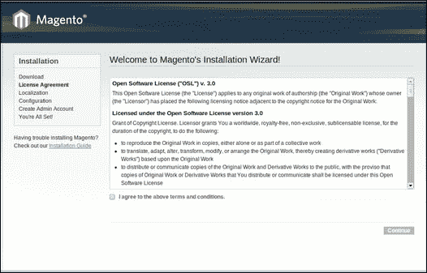

# 与流浪汉一起上路

之前，我们使用 VM 创建了一个 Magento 安装。尽管使用 VM 为我们提供了一个可靠的环境，但为每个 Magento 暂存安装设置指示灯仍然非常复杂。对于没有 Unix/Linux 环境工作经验的开发人员来说尤其如此。

如果我们能够获得运行虚拟机的所有好处，但是有一个完全自动化的安装过程，会怎么样？如果我们能够为每个登台网站动态创建和配置新的 VM 实例会怎么样？

这可以通过使用流浪者和厨师来实现。我们可以创建自动化虚拟机，而无需对 Linux 或不同的 LAMP 组件有广泛的了解。

### 注

Vagrant 目前支持 VirtualBox 4.0.x、4.1.x 和 4.2.x。

## 安装流浪汉

流浪汉可直接从[下载网站](http://downloads.vagrantup.com)下载。此外，它的软件包和安装程序可用于多种平台。下载 Vagrant 后，运行安装。

一旦安装了 Vagrant 和 VirtualBox，启动基本 VM 就很简单，只需在终端或命令提示符中键入以下行，具体取决于您使用的操作系统：

```php
$ vagrant box add lucid32 http://files.vagrantup.com/lucid32.box
$ vagrant init lucid32
$ vagrant up

```

这些命令将在安装了 Ubuntu Linux 的情况下启动一个新的 Vagrant box。从这一点开始，我们可以开始安装我们的灯正常。但是，当我们可以使用 Chef 自动完成任务时，为什么我们要花一个小时为每个项目配置和设置 LAMP 服务器呢？Chef 是一个用 Ruby 编写的配置管理工具，集成到 Vagrant 中。

为了让开始使用 Magento 的开发人员更容易，我在 Github 上创建了一个名为`magento-vagrant`的 Vagrant 存储库，其中包括所有必要的烹饪书和厨师食谱。`magento-vagrant`存储库还包括一本新的食谱，它将负责特定的 Magento 设置和配置。

为了开始使用`magento-vagrant`，您需要一份 Git 的工作副本。

如果您使用的是 Ubuntu，请运行以下命令：

```php
$ sudo apt-get install git-core -y

```

对于 Windows，我们可以在[使用本机工具 http://windows.github.com/](http://windows.github.com/) 下载并管理我们的存储库。

无论您使用的是哪种操作系统，我们都需要将此存储库的副本签出到本地文件系统中。我们将使用`C:/Users/magedev/Documents/magento-vagrant/`下载并保存我们的存储库；在`magento-vagrant`中，我们将找到以下文件和目录：

*   `cookbooks`
*   `data_bags`
*   `Public`
*   `.vagrant`
*   `Vagrantfile`

`magento-vagrant`存储库包括我们开发环境中每个组件的食谱，一旦我们启动新的 Vagrant box，就会自动安装这些食谱。

现在唯一要做的就是建立我们的开发站点。通过使用 Vagrant 和 Chef，向我们的 Vagrant 安装添加新 Magento 站点的过程已经简化。

在`data_bags`目录中，我们的 Vagrant box 中的每个 Magento 安装都有一个文件；默认存储库附带 Magento CE 1.7 的示例安装。

对于每个站点，我们需要创建一个新的 JSON 文件，其中包含 Chef 需要的所有设置。让我们来看看在默认位置文件中，可以找到的默认文件：

```php
{
    "id": "default",
    "host": "magento.localhost.com",
    "repo": [
        "url": "svn.magentocommerce.com/source/branches/1.7",
        "revision": "HEAD"  
     ],
   "database": [
      "name": "magento_staging",
      "username": "magento",
      "password": "magento2013$"
   ]
}
```

这将使用 Magento 存储库中的最新文件自动设置 Magento 安装。

将新站点添加到我们的 Vagrant box 只需为相应站点添加一个新的 JSON 文件并重新启动 Vagrant box。

现在我们已经有了一个正在运行的 Magento 安装，让我们看看如何选择一个合适的**集成开发环境**（**IDE**。

# 选择 IDE

选择合适的 IDE 主要取决于个人开发者的品味。然而，选择正确的 IDE 对于 Magento 开发人员来说是至关重要的。

IDE 面临的挑战主要来自 Magento 对工厂名称的广泛使用。这使得代码完成（也称为 intellisense）等某些功能的实现变得困难。目前，有两个 IDE 在其对 Magento 的本机支持方面表现出色–NetBeans 和 PhpStorm。

尽管 NetBeans 是开源的，并且已经存在了很长时间，但 PhpStorm 已经占据了上风，并从 Magento 社区获得了更多的支持。

此外，Magicento 是一款专为将 Magento 扩展和集成到 PhpStorm 中而创建的插件，其最新版本使其成为当前可用选项中的最佳选项。

# 使用版本控制系统

Magento 代码库非常广泛，包含 7000 多个文件和近 150 万行代码。因此，使用版本控制系统不仅是一种良好的做法，而且是必要的。

版本控制系统用于跟踪多个文件和多个开发人员的更改；通过使用版本控制系统，我们可以使用非常强大的工具。

在几种可用的版本控制系统（Git、SVN、Mercurial）中，Git 因其简单性和灵活性而值得特别关注。通过在 Github（Git 托管服务）上发布即将发布的 Magento 版本 2，Magento 核心开发团队已经认识到 Git 在 Magento 社区中的重要性。

### 注

有关 Magento2 的更多信息，请访问[https://github.com/magento/magento2](https://github.com/magento/magento2) 。

Github 现在包含一个专门针对 Magento 的`.gitignore`文件，它将忽略 Magento 核心中的所有文件，只跟踪我们自己的代码。

也就是说，在处理我们的 Magento 项目时，我们需要记住几个版本控制概念：

*   **分支**：这允许我们在不影响主干的情况下开发新功能（稳定发布）。
*   **合并**：用于将代码从一个地方移动到另一个地方的。通常，一旦代码准备好投入生产，就可以从一个开发品牌到我们的主干。
*   **标记**：此用于创建发布的快照。

# 总结

在第一章中，我们学习了如何设置和使用 LAMP 环境、跨多个平台设置开发环境、创建和配置流浪虚拟机、使用厨师食谱以及使用版本控制系统进行 Magento 开发。

拥有一个合适的环境是开始为 Magento 开发的第一步，也是我们 Magento 工具箱不可分割的一部分。

现在我们已经建立并准备好了开发环境，是时候深入研究 Magento 的基本概念了；这些概念将为我们提供使用 Magento 进行开发所需的工具和知识。