# 十四、使用包

现代 PHP 应用程序往往由大量文件组成。以 Magento 2 电子商务平台为例。一旦安装，它的`vendor`目录就包含了三万多个 PHP 类文件。它的巨大规模足以让任何人目瞪口呆。人们可能会想，为什么会有这么多文件？如今，如果不是强制性的，也很流行使用其他开发人员之前编写的现有库和包。一直*重新发明轮子*没有多大意义。这就是为什么 Composer 这样的包管理器在 PHP 开发人员中如此流行的原因。使用这些包管理器通常意味着在我们的项目中引入一组不同的第三方包。虽然这通常意味着应用程序大小的增加，但它也允许我们快速启动应用程序开发。附加的好处是第三方对这些包的质量和持续维护，我们只需将这些包更新到应用程序中即可。

在本章中，我们将介绍最流行的 PHP 软件包管理器 Composer：

*   理解作曲家
*   理解包装师
*   使用第三方软件包
*   创建自己的包
*   分发你的包裹

Throughout the previous chapters, we already had certain touching points with Composer, as we used some of its packages. The following sections are to add some extra clarity on top of that, as well as showcase how we can create our own packages.

# 理解作曲家

Composer 是 PHP 的*每个项目*包管理器。它最初于 2011 年发布，很快就赶上了潮流，成为 PHP 开发人员最喜欢的包管理器。只需查看其 GitHub 统计数据，我们就可以看到社区正在积极开发该项目：

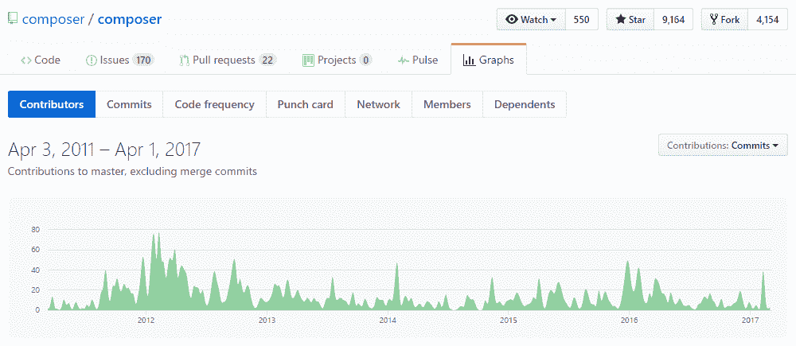

如今，它几乎是每一个流行的 PHP 项目的组成部分。安装 Composer 是一项非常简单的任务。假设我们使用的是全新的 Ubuntu 16.10（Yakkety Yak）安装，下面的命令概述了如何安装 Composer：

```php
sudo apt-get -y install composer

```

安装后运行`composer -v`应显示类似以下屏幕截图的输出：

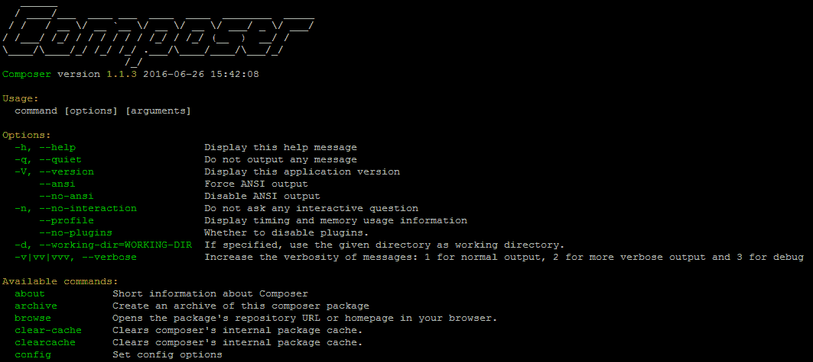

现在我们已经安装了它，使用 Composer 非常简单。假设我们有一个现有的项目，我们想向其中添加细枝库，那么只需在项目根目录中运行以下命令即可：

```php
composer require "twig/twig:^2.0"

```


执行时，创建/修改两个文件和一个目录：`composer.json`、`composer.lock`和`vendor`。`vendor`目录是 Composer 放置我们选择安装的软件包的物理位置。我们可以通过手动创建相同的`composer.json`文件，内容如下，然后在项目目录中运行`composer install`命令轻松开始：

```php
{
  "require": {
    "twig/twig": "^2.0"
  }
}

```

Check out [https://getcomposer.org/doc/04-schema.md](https://getcomposer.org/doc/04-schema.md) for full information on possible `composer.json` content.

现在，我们可以轻松地将`index.php`或任何其他入口点文件修改到我们的根项目目录中，并通过向其中添加以下条目包括所有已安装的 composer 软件包，如下所示：

```php
require_once __DIR__ . '/vendor/autoload.php';

```

`vendor/autoload.php`文件由 composer 工具创建，该工具处理我们通过 composer 拉入的所有包的自动加载，其内容如下所示：

```php
<?php

// autoload.php @generated by Composer

require_once __DIR__ . '/composer/autoload_real.php';

return ComposerAutoloaderInitea5a081b69b5068b6eadbd8b638d57b2::getLoader();

```

除了知道它在哪里之外，我们不应该真正关心这个文件。

Both PSR-4 and PSR-0 autoloading are supported, although PSR-4 is the recommended way as it offers a greater ease of use.

一旦我们将`/vendor/autoload.php`包含到脚本中，我们的应用程序就可以使用所有拉入的包。无论是新项目还是现有项目，Composer 都可以很容易地向其中添加包。

Learning about Composer in full is out of the scope of this section. Consult the original documentation ([https://getcomposer.org/](https://getcomposer.org/)) for more details on Composer.

# 理解包装师

与 Git 和 GitHub 的关系非常相似，我们有编写者和打包者的关系。虽然**Composer**本身是实际的工具，**Packagist**是为 Composer 提供包的默认存储库服务。该服务很容易让我们找到我们想要用于项目的包。无需进入内部，只要说 composer 工具了解从何处获取 Packagist 上托管的每个包的代码就足够了。

PackageGist 存储库服务托管在[https://packagist.org](https://packagist.org) ：

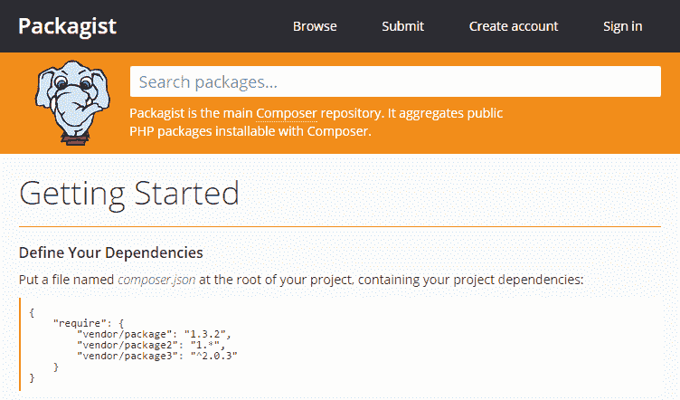

通过[可以很容易地观察到作曲家随时间的流行 https://packagist.org/statistics](https://packagist.org/statistics) 页面，显示了在过去几年中 Packagist 存储库中的软件包数量迅速增加：

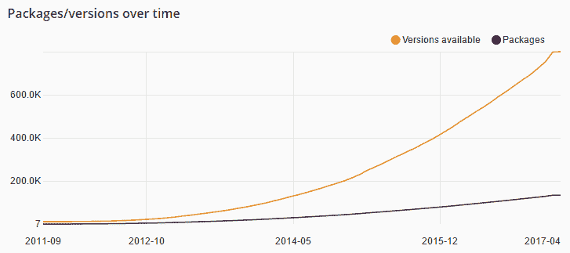

# 使用第三方软件包

我们已经看到通过以下两个选项之一安装 composer 软件包是多么容易：

*   执行诸如`require vendor/package:2.* vendor/package2:dev-master`之类的命令
*   在`composer.json``require`下增加一个包链接信息，在控制台上执行`composer install`

在不知道具体需要哪个软件包的情况下，我们可以使用[https://packagist.org](https://packagist.org) 使用搜索工具查找。让我们考虑一下，例如，我们正在寻找一个带有电子邮件发送功能的包。这就是 Packagist 存储库的巨大规模可能需要我们花费一些时间才能找到正确的包的地方。幸运的是，我们可以使用“按下载排序”或“按收藏夹排序”来帮助自己：

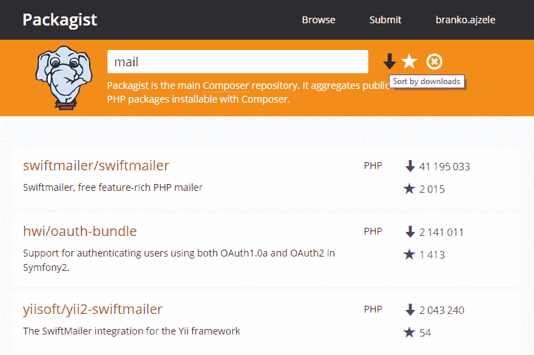

单击单个软件包后，我们将看到可以安装的可用版本：

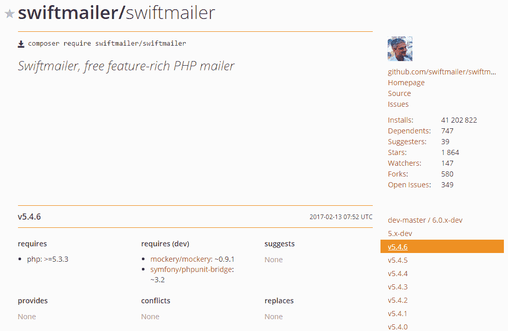

在这种情况下运行`composer require swiftmailer/swiftmailer`将为我们提供最新的稳定版本 5.4.6。

安装后，只需在项目根目录中运行`composer update`命令，即可将包更新为可能的新稳定版本。

# 创建自己的包

使用`composer init`命令，我们可以启动交互式`composer.json`生成器，稍后我们将使用它分发我们的包。根据以下输出，交互式生成器提出了几个问题：

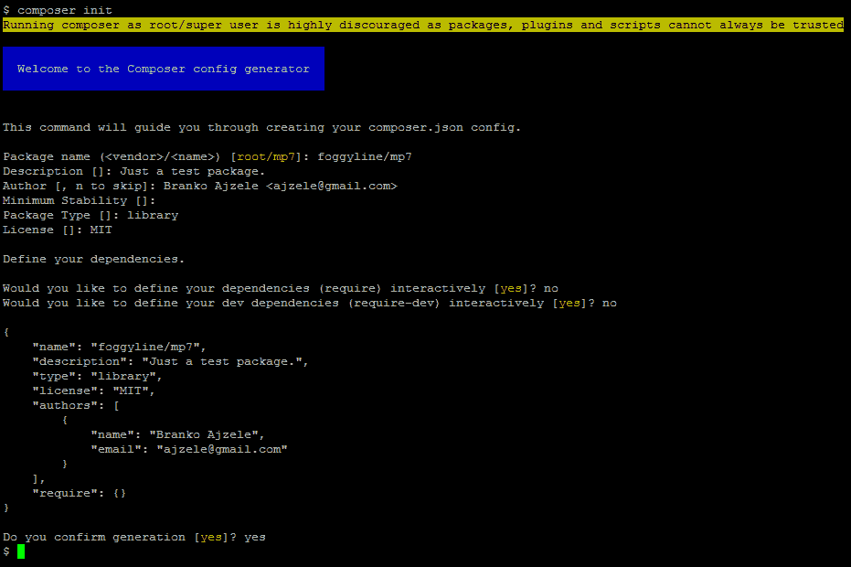

我们在这里使用`foggyline`作为我们的供应商名称，而`mp7`（精通 PHP 7 的缩写）用于包名称。完成后，生成包含以下内容的`composer.json`文件：

```php
{
"name": "foggyline/mp7",
"description": "Just a test package.",
"type": "library",
"license": "MIT",
"authors": [
    {
"name": "Branko Ajzele",
"email": "ajzele@gmail.com"
    }
  ],
"require": {}
}

```

现在，让我们继续创建相对于项目根目录的`src/Foggyline/MP7/Greeting/Goodbye.php`文件，其内容如下：

```php
<?php

namespace FoggylineMP7Greeting;

class Welcome
{
    public function generate($name)
    {
        return 'Welcome ' . $name;
    }
}

```

这是我们的虚拟库类，我们将很快作为 composer 包分发它。在此之前，我们需要修改`composer.json`，添加顶级`autoload`条目，如下所示：

```php
"autoload": {
  "psr-4": {
    "FoggylineMP7": "src/Foggyline/MP7/"
  }
}

```

为了测试`autoload`是否设置正确，我们运行`composer dump-autoload --optimize`控制台命令并创建具有以下内容的`index.php`文件。我们特意使用`MP7`目录的完整路径，因为这将是我们的单个库，即包：

```php
<?php

require_once __DIR__ . '/vendor/autoload.php';

use FoggylineMP7GreetingWelcome;

$greeting = new Welcome();

echo $greeting->generate('John');

```

如果一切顺利，运行这个脚本应该会给我们带来一个受欢迎的输出。既然`composer.json`描述了我们的项目，并且`src/Foggyline/MP7/`包含了我们的库代码，我们就可以继续发布了。

# 分发你的包裹

我们首先需要将`composer.json`和我们的库代码从`src/Foggyline/MP7/`中推送到 GitHub 存储库中。假设我们有一个空的 GitHub 存储库（如`git@github.com:ajzele/foggyline_mp7.git`）在等待我们，我们可以通过以下几个命令轻松地完成这一任务：

```php
git init
git remote add origin git@github.com:ajzele/foggyline_mp7.git
git add composer.json
git add src/Foggyline/MP7/
git commit -m "Initial commit"
git push origin master

```

这应该显示在 GitHub 中，如下所示：

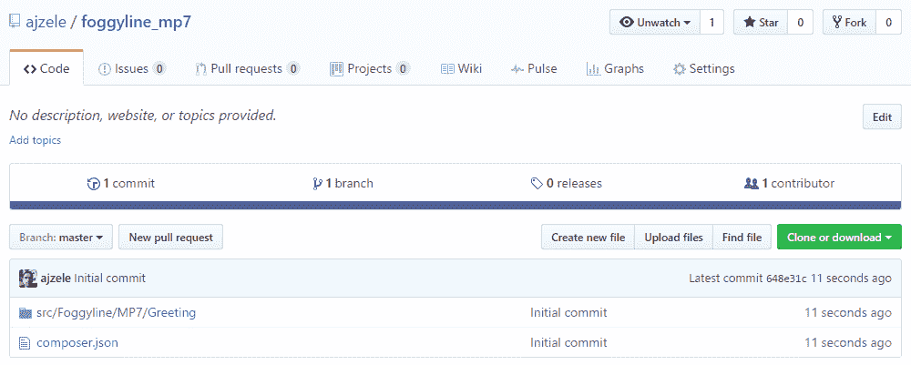

有了 GitHub 存储库中的文件，我们现在可以访问[https://packagist.org](https://packagist.org) 页面并提交我们的套餐：

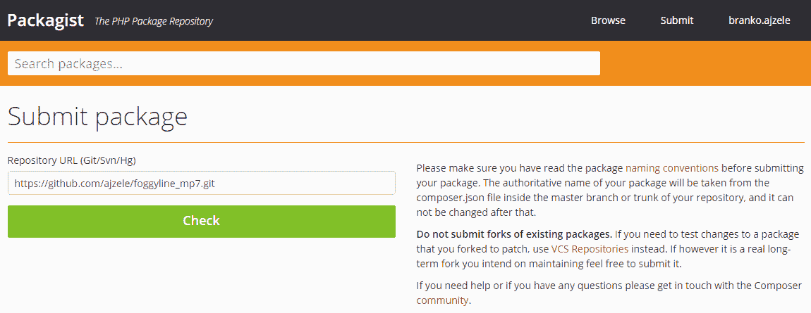

检查完成后，我们应该能够看到类似于以下屏幕的屏幕：

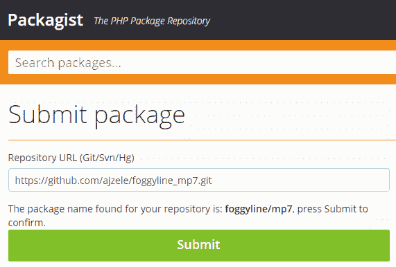

点击提交按钮后，我们应该能够看到类似于以下屏幕的屏幕：


现在，只要运行以下控制台命令，我们就可以在任何项目中使用`foggyline/mp7`包：

```php
composer require foggyline/mp7:dev-master

```

Notice the `dev-master` suffix here. Our package is flagged as `dev-master` only. This is because our [https://github.com/ajzele/foggyline_mp7](https://github.com/ajzele/foggyline_mp7) repository has no tags defined on it.

让我们继续向我们的存储库添加一个`v1.5`标记。我们将通过运行以下控制台命令来完成此操作：

```php
git tag -a v1.5 -m "my version 1.4" 648e31cc4a
git push origin v1.5

```

由于我们正在向已完成的提交添加标记，因此我们使用提交 ID`648e31cc4a`将标记附加到该提交。将标记推送到 GitHub 存储库后，我们可以返回 PackageGist 并点击 package edit 屏幕上的 Update 按钮。这将立即更新软件包版本列表，以显示`v1.5`：

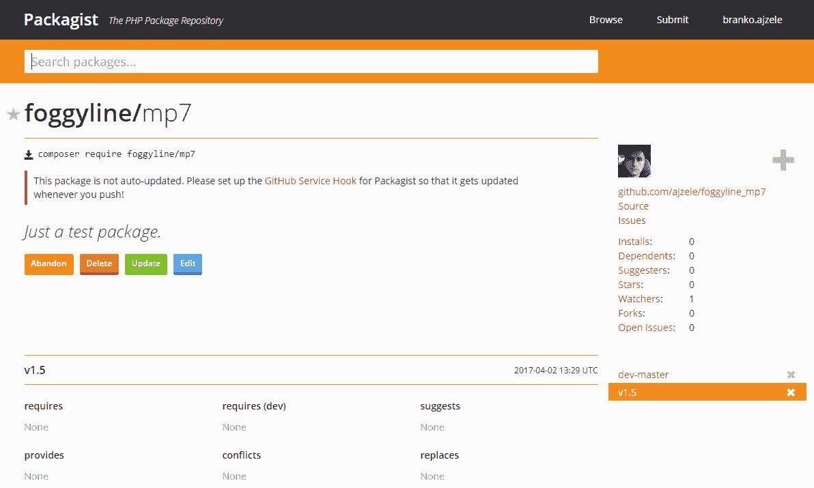

假设我们有一些项目目录，其中只有一个`index.php`文件，我们应该能够通过运行以下控制台命令来使用`foggyline/mp7`包：

```php
composer require foggyline/mp7

```

这将导致目录结构，如下所示：

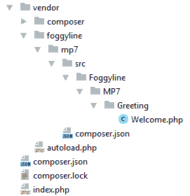

`index.php`脚本只需包含`/vendor/autoload.php`即可开始使用我们的 MP7 库。

# 总结

在本章中，我们了解了 PHP 最流行的包管理器——Composer。我们看到了将第三方软件包添加到我们的应用程序以及使用 PackageGist 存储库分发我们自己的软件包是多么容易。许多现代 PHP 应用程序都依赖于 Composer，这就是为什么理解如何充分利用它对我们的日常开发工作至关重要的原因。

接下来，我们将了解适用于 PHP 应用程序的测试类型。