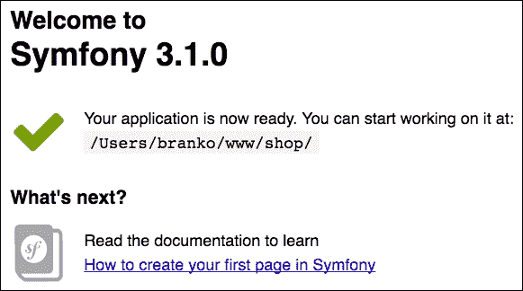
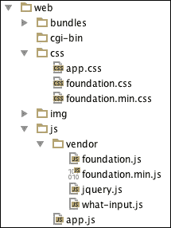
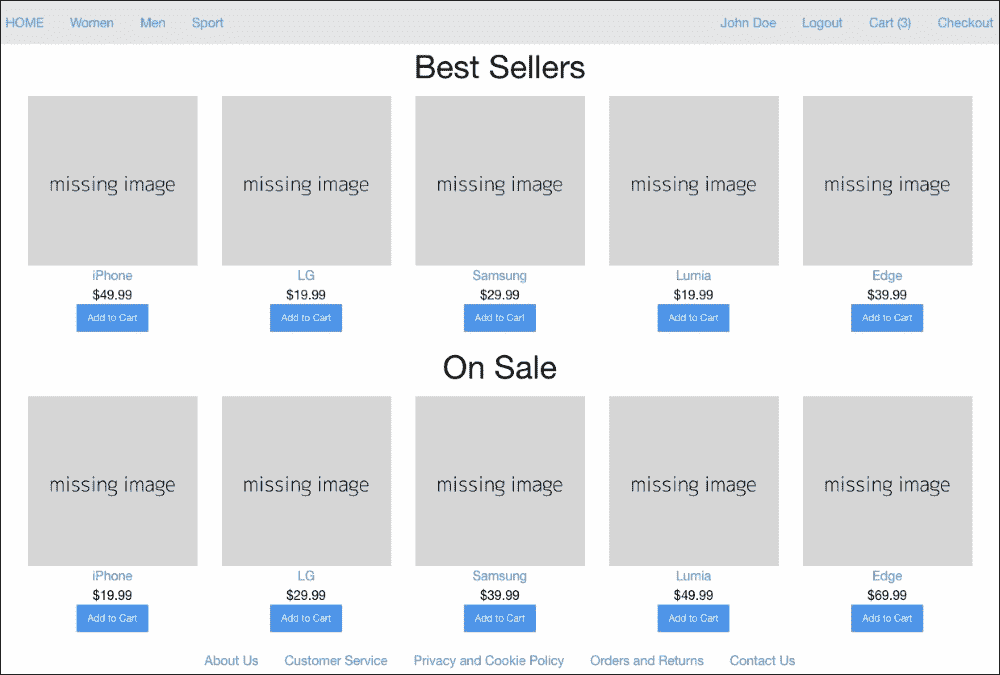
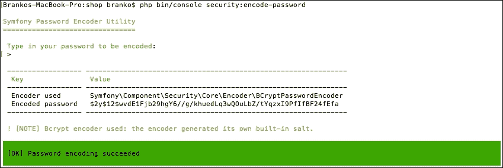
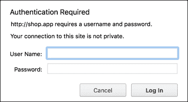

# 六、核心模块构建

到目前为止，我们已经熟悉了 PHP7 的最新变化、设计模式、设计原则和流行的 PHP 框架。我们还对 Symfony 进行了更详细的研究，作为我们未来的选择框架。我们现在终于到了可以开始构建模块化应用程序的地步。使用 Symfony 构建模块化应用程序是通过 bundles 机制完成的。从术语上讲，从现在开始，我们将考虑捆绑和模块是相同的事情。

在本章中，我们将介绍与核心模块相关的以下主题：

*   要求
*   依赖关系
*   实施
*   单元测试
*   功能测试

# 要求

回顾[第 4 章](04.html "Chapter 4. Requirement Specification for a Modular Web Shop App")、*模块化网店 App*的需求规范，以及中给出的线框，我们可以概括出模块将具备的一些需求。核心模块将用于设置通用的、应用程序范围的功能，如下所示：

*   为项目的网站包括基础 CSS
*   建立一个主页
*   构建其他静态页面
*   建立一个联系我们的页面
*   设置一个基本防火墙，管理员用户可以在这里管理以后从其他模块自动生成的所有 CRUD

# 依赖关系

核心模块本身并不依赖于我们将作为本书一部分编写的其他模块，也不依赖于标准 Symfony 安装之外的任何其他第三方模块。

# 实施

我们首先创建一个全新的 Symfony 项目，运行以下控制台命令：

```php
symfony new shop

```

这将创建一个新的`shop`目录，其中包含在浏览器中运行应用程序所需的所有文件。在这些文件和目录中有`src/AppBundle`目录，它实际上是我们的核心模块。在浏览器中运行应用程序之前，我们需要将新创建的`shop`目录映射到主机名，比如`shop.app`，这样我们就可以通过`http://shop.app`URL 在浏览器中访问它。完成后，如果我们打开`http://shop.app`，我们会看到**欢迎使用 Symfony 3.1.0**屏幕，如下所示：



虽然我们现在还不需要数据库，但我们稍后将开发的其他模块将采用数据库连接，因此从一开始就设置它是值得的。我们通过使用适当的数据库连接参数配置`app/config/parameters.yml`来实现。

然后，我们从 AutoT4 网站下载 AutoT3E.基金会网站。http://foundation.zurb.com/sites.html 。下载完成后，我们需要将其解包，并通过`/js`和`/css`目录复制到`Symfony /web`目录中，如下图所示：



### 注

值得注意的是，这是一个简化的基础设施，我们正在使用我们的模块，在这里我们只使用 CSS 和 JavaScript 文件而不设置任何与 SAS 相关的东西。

使用基础 java T1，CSS 和 JavaScript 文件，我们编辑如下的文件：

```php
<!doctype html>
<html class="no-js"lang="en">
  <head>
    <meta charset="utf-8"/>
    <meta http-equiv="x-ua-compatible" content="ie=edge">
    <meta name="viewport" content="width=device-width, initial-scale=1.0"/>
    <title>Welcome!</title>
    <link rel="stylesheet"href="{{ asset('css/foundation.css') }}"/>
    
  </head>
  <body>
    <!-- START BODY -->
    <!-- TOP-MENU -->
    <!-- SYSTEM-WIDE-MESSAGES -->
    <!-- PER-PAGE-BODY -->
    <!-- FOOTER -->
    <!-- START BODY -->
    <script src="{{ asset('js/vendor/jquery.js') }}"></script>
    <script src="{{ asset('js/vendor/what-input.js') }}"></script>
    <script src="{{ asset('js/vendor/foundation.js') }}"></script>
    <script>
      $(document).foundation();
    </script>
    
  </body>
</html>
```

在这里，我们将设置整个头部和身体前端区域，并加载所有必要的 CSS 和 JavaScript。Twigs`asset`标签帮助我们构建 URL 路径，我们只需传递 URL 路径本身，它就会为我们构建一个完整的 URL。关于页面的实际正文，这里有几件事要考虑。我们将如何构建类别、客户和结账菜单？在这一点上，我们没有这些模块中的任何一个，我们也不想让它们成为我们核心模块的必备模块。那么，我们如何解决目前还不存在的会计问题呢？

对于类别、客户和结帐菜单，我们可以为每个菜单项定义全局细枝变量，然后这些变量将用于呈现菜单。这些变量将通过适当的服务进行归档。由于核心包不知道未来的目录、客户和签出模块，我们将首先创建一些虚拟服务，并将它们与全局细枝变量挂钩。稍后，当我们开发 catalog、customer 和 checkout 模块时，这些模块将覆盖适当的服务，从而为 into 菜单提供正确的值。

这种方法可能不适合理想的模块化应用程序的概念，但它将满足我们的需要，因为我们没有硬编码任何依赖项。

我们首先在`app/config/config.yml`文件中添加以下条目：

```php
twig:
# ...
globals:
category_menu: '@category_menu'
customer_menu: '@customer_menu'
checkout_menu: '@checkout_menu'
products_bestsellers: '@bestsellers'
products_onsale: '@onsale'
```

`category_menu_items`、`customer_menu_items`、`checkout_menu_items`、`products_bestsellers`和`products_onsale`变量成为全局细枝变量，我们可以在任何细枝模板中使用，如下例所示：

```php
<ul>
  
  <li>{{ category.name }}</li>
  
</ul>
```

Twig 全局变量`config`中的`@`字符用于表示服务名称的开头。这是为我们的 Twig 变量提供值对象的服务。接下来，我们继续创建实际的`category_menu`、`customer_menu`、`checkout_menu`、`bestsellers`和`onsale`服务，修改`app/config/services.yml`如下：

```php
services:
category_menu:
  class: AppBundle\Service\Menu\Category
customer_menu:
  class: AppBundle\Service\Menu\Customer
checkout_menu:
  class: AppBundle\Service\Menu\Checkout
bestsellers:
  class: AppBundle\Service\Menu\BestSellers
onsale:
  class: AppBundle\Service\Menu\OnSale
```

此外，我们在`src/AppBundle/Service/Menu/`目录下创建每个列出的服务类。我们从具有以下内容的`src/AppBundle/Service/Menu/Bestsellers.php`文件开始：

```php
namespace AppBundle\Service\Menu;

class BestSellers {
  public function getItems() {
    // Note, this can be arranged as per some "Product"interface, so to know what dummy data to return
    return array(
      ay('path' =>'iphone', 'name' =>'iPhone', 'img' =>'/img/missing-image.png', 'price' => 49.99, 'add_to_cart_url' =>'#'),
      array('path' =>'lg', 'name' =>'LG', 'img' =>
        '/img/missing-image.png', 'price' => 19.99, 'add_to_cart_url' =>'#'),
      array('path' =>'samsung', 'name' =>'Samsung', 'img'=>'/img/missing-image.png', 'price' => 29.99, 'add_to_cart_url' =>'#'),
      array('path' =>'lumia', 'name' =>'Lumia', 'img' =>'/img/missing-image.png', 'price' => 19.99, 'add_to_cart_url' =>'#'),
      array('path' =>'edge', 'name' =>'Edge', 'img' =>'/img/missing-image.png', 'price' => 39.99, 'add_to_cart_url' =>'#'),
    );
  }
}
```

然后添加`src/AppBundle/Service/Menu/Category.php`文件，内容如下：

```php
class Category {
  public function getItems() {
    return array(
      array('path' =>'women', 'label' =>'Women'),
      array('path' =>'men', 'label' =>'Men'),
      array('path' =>'sport', 'label' =>'Sport'),
    );
  }
}
```

接下来，我们添加了这个`src/AppBundle/Service/Menu/Checkout.php`文件，其内容如下所示：

```php
class Checkout
{
  public function getItems()
  {
     // Initial dummy menu
     return array(
       array('path' =>'cart', 'label' =>'Cart (3)'),
       array('path' =>'checkout', 'label' =>'Checkout'),
    );
  }
}
```

完成后，我们将继续向`src/AppBundle/Service/Menu/Customer.php`文件添加以下内容：

```php
class Customer
{
  public function getItems()
  {
    // Initial dummy menu
    return array(
      array('path' =>'account', 'label' =>'John Doe'),
      array('path' =>'logout', 'label' =>'Logout'),
    );
  }
}
```

然后我们添加具有以下内容的`src/AppBundle/Service/Menu/OnSale.php`文件：

```php
class OnSale
{
  public function getItems()
  {
    // Note, this can be arranged as per some "Product" interface, so to know what dummy data to return
    return array(
      array('path' =>'iphone', 'name' =>'iPhone', 'img' =>'/img/missing-image.png', 'price' => 19.99, 'add_to_cart_url' =>'#'),
      array('path' =>'lg', 'name' =>'LG', 'img' =>'/img/missing-image.png', 'price'      => 29.99, 'add_to_cart_url' =>'#'),
      array('path' =>'samsung', 'name' =>'Samsung', 'img'=>'/img/missing-image.png', 'price' => 39.99, 'add_to_cart_url' =>'#'),
      array('path' =>'lumia', 'name' =>'Lumia', 'img' =>'/img/missing-image.png', 'price' => 49.99, 'add_to_cart_url' =>'#'),
      array('path' =>'edge', 'name' =>'Edge', 'img' =>'/img/missing-image.png', 'price' => 69.99, 'add_to_cart_url' =>'#'),
    ;
  }
}
```

我们现在已经定义了五个全局细枝变量，它们将用于构建我们的应用程序菜单。即使变量现在连接到一个只返回一个虚拟数组的虚拟服务，我们已经有效地将菜单项解耦到其他即将构建的模块中。当我们稍后开始构建我们的类别、客户和结账模块时，我们只需编写一个服务覆盖，并用真正的项目正确地填充菜单项数组。这将是理想的情况。

### 注

理想情况下，我们希望我们的服务按照某个接口返回数据，以确保任何人通过接口重写或扩展数据。由于我们试图将应用程序保持在最低限度，因此我们将继续使用简单的数组。

我们现在可以返回到我们的`app/Resources/views/base.html.twig`文件，用以下代码替换前面代码中的`<!-- TOP-MENU -->`：

```php
<div class="title-bar" data-responsive-toggle="appMenu" data-hide-for="medium">
  <button class="menu-icon" type="button" data-toggle></button>
  <div class="title-bar-title">Menu</div>
</div>

<div class="top-bar" id="appMenu">
  <div class="top-bar-left">
    {# category_menu is global twig var filled from service, and later overriden by another module service #}
    <ul class="menu">
      <li><a href="{{ path('homepage') }}">HOME</a></li>
        
        
      <li><a href="{{ link.path }}">{{ link.label }}</li></a>
      
      
    </ul>
  </div>
  <div class="top-bar-right">
    <ul class="menu">
      {# customer_menu is global twig var filled from service, and later overriden by another module service #}
      
      
      <li><a href="{{ link.path }}">{{ link.label }}</li></a>
      
      
      {# checkout_menu is global twig var filled from service, and later overriden by another module service #}
      
      
      <li><a href="{{ link.path }}">{{ link.label }}</li></a>
      
      
    </ul>
  </div>
</div>
```

然后我们可以将替换为以下内容：

```php
<div class="row column">
  
  <div class="alert callout">
    {{ flash_message }}
  </div>
  
  
  <div class="warning callout">
    {{ flash_message }}
  </div>
  
  
  <div class="success callout">
    {{ flash_message }}
  </div>
  
</div>
```

我们将`<!-- PER-PAGE-BODY -->`替换为以下内容：

```php
<div class="row column">
  
</div>
```

我们将`<!-- FOOTER -->`替换为以下内容：

```php
<div class="row column">
  <ul class="menu">
    <li><a href="{{ path('about') }}">About Us</a></li>
    <li><a href="{{ path('customer_service') }}">Customer Service</a></li>
    <li><a href="{{ path('privacy_cookie') }}">Privacy and Cookie Policy</a></li>
    <li><a href="{{ path('orders_returns') }}">Orders and Returns</a></li>
    <li><a href="{{ path('contact') }}">Contact Us</a></li>
  </ul>
</div>
```

现在我们可以继续编辑`src/AppBundle/Controller/DefaultController.php`文件并添加以下代码：

```php
/**
 * @Route("/", name="homepage")
 */
public function indexAction(Request $request)
{
  return $this->render('AppBundle:default:index.html.twig');
}

/**
 * @Route("/about", name="about")
 */
public function aboutAction()
{
  return $this->render('AppBundle:default:about.html.twig');
}

/**
 * @Route("/customer-service", name="customer_service")
 */
public function customerServiceAction()
{
  return $this->render('AppBundle:default:customer-service.html.twig');
}

/**
 * @Route("/orders-and-returns", name="orders_returns")
 */
public function ordersAndReturnsAction()
{
  return $this->render('AppBundle:default:orders-returns.html.twig');
}

/**
 * @Route("/privacy-and-cookie-policy", name="privacy_cookie")
 */
public function privacyAndCookiePolicyAction()
{
  return $this->render('AppBundle:default:privacy-cookie.html.twig');
}
```

驻留在`src/AppBundle/Resources/views/default`目录中的所有使用过的模板文件（`about.html.twig`、`customer-service.html.twig`、`orders-returns.html.twig`、`privacy-cookie.html.twig`）可以类似地定义如下：

```php



<div class="row">
  <h1>About Us</h1>
</div>
<div class="row">
  <p>Loremipsum dolor sit amet, consecteturadipiscingelit...</p>
</div>

```

在这里，我们只是用`row`类将标题和内容包装到`div`元素中，只是给它一些结构。结果应与此处显示的页面相似：


**联系我们**页面需要不同的方法，因为它将包含一个表单。为了构建表单，我们使用 Symfony 的`Form`组件，在`src/AppBundle/Controller/DefaultController.php`文件中添加以下内容：

```php
/**
 * @Route("/contact", name="contact")
 */
public function contactAction(Request $request) {

  // Build a form, with validation rules in place
  $form = $this->createFormBuilder()
  ->add('name', TextType::class, array(
    'constraints' => new NotBlank()
  ))
  ->add('email', EmailType::class, array(
    'constraints' => new Email()
  ))
  ->add('message', TextareaType::class, array(
    'constraints' => new Length(array('min' => 3))
  ))
   ->add('save', SubmitType::class, array(
    'label' =>'Reach Out!',
    'attr' => array('class' =>'button'),
  ))
  ->getForm();

  // Check if this is a POST type request and if so, handle form
  if ($request->isMethod('POST')) {
    $form->handleRequest($request);

    if ($form->isSubmitted() && $form->isValid()) {
      $this->addFlash(
        'success',
        'Your form has been submitted. Thank you.'
      );

      // todo: Send an email out...

      return $this->redirect($this->generateUrl('contact'));
    }
  }

  // Render "contact us" page
  return $this->render('AppBundle:default:contact.html.twig', array(
    'form' => $form->createView()
  ));
}
```

在这里，我们首先通过 FormBuilder 构建表单。`add`方法接受字段定义和字段约束，验证可以基于这些约束。然后，我们为 HTTPPOST 方法添加了一个检查，在这种情况下，我们向表单提供请求参数并对其运行验证。

有了`contactAction`方法，我们仍然需要一个模板文件来实际呈现表单。我们通过添加包含以下内容的`src/AppBundle/Resources/views/default/contact.html.twig`文件来实现：

```php




<div class="row">
  <h1>Contact Us</h1>
</div>

<div class="row">
  {{ form_start(form) }}
  {{ form_widget(form) }}
  {{ form_end(form) }}
</div>

```

基于这几个标记，Twig 为我们处理表单渲染。生成的浏览器输出是一个页面，如下所示：


我们几乎已经准备好了所有的页面。不过，我们的主页缺少一件事，那就是正文部分。与其他静态内容的页面不同，这个页面实际上是动态的，因为它列出了畅销书和正在销售的产品。这些数据预计将来自其他模块，目前还不可用。然而，这并不意味着我们不能为它们准备虚拟占位符。让我们继续编辑`app/Resources/views/default/index.html.twig`文件，如下所示：

```php


<!--products_bestsellers -->
<!--products_onsale -->

```

现在我们需要将替换为以下内容：

```php

<h2 class="text-center">Best Sellers</h2>
<div class="row products_bestsellers text-center small-up-1 medium-up-3 large-up-5" data-equalizer data-equalize-by- row="true">
  
  <div class="column product">
    
    <a href="{{ product.path }}">{{ product.name }}</a>
    <div>${{ product.price }}</div>
    <div><a class="small button"href="{{ product.add_to_cart_url }}">Add to Cart</a></div>
  </div>
  
</div>

```

现在我们需要将`<!-- products_onsale -->`替换为以下内容：

```php

<h2 class="text-center">On Sale</h2>
<div class="row products_onsale text-center small-up-1 medium-up-3 large-up-5" data-equalizer data-equalize-by-row="true">
  
  <div class="column product">
    
    <a href="{{ product.path }}">{{ product.name }}</a>
  <div>${{ product.price }}</div>
  <div><a class="small button"href="{{ product.add_to_cart_url }}">Add to Cart</a></div>
  </div>
  
</div>

```

### 提示

[http://dummyimage.com](http://dummyimage.com) 使我们能够为我们的应用程序创建占位符图像。

此时我们应该看到如下所示的主页：



## 配置应用程序范围的安全性

作为应用程序范围安全性的一部分，我们试图实现的是设置一些基本保护，以防未来的客户或任何其他用户能够访问和使用未来自动生成的 CRUD 控制器。我们通过修改`app/config/security.yml`文件来实现。`security.yml`文件有几个组件需要处理：防火墙、访问控制、提供者和编码器。如果我们观察到前一个测试应用程序中自动生成的 CRUD，很明显我们需要保护以下内容不被客户访问：

*   `GET|POST /new`
*   `GET|POST /{id}/edit`
*   `DELETE /{id}`

换句话说，URL 中包含`/new`和`/edit`的所有内容，以及`DELETE`方法的所有内容，都需要对客户进行保护。考虑到这一点，我们将使用 Symfony 安全功能创建一个角色为`ROLE_ADMIN`的内存用户。然后，我们将创建一个只允许`ROLE_ADMIN`访问我们刚才提到的资源的访问控制列表，以及一个防火墙，当我们试图访问这些资源时，它会触发 HTTP 基本身份验证登录表单。

使用内存提供程序意味着在我们的`security.yml`文件中对用户进行硬编码。对于我们的应用程序，我们将针对管理员类型的用户执行此操作。但是，实际密码不需要硬编码。假设我们将使用`1L6lllW9zXg0`作为密码，让我们跳转到控制台并键入以下命令：

```php
php bin/console security:encode-password

```

这将产生如下输出。



我们现在可以通过添加内存提供程序来编辑`security.yml`，并将生成的编码密码复制粘贴到其中，如下所示：

```php
security:
    providers:
        in_memory:
            memory:
                users:
                    john:
                        password: $2y$12$DFozWehwPkp14sVXr7.IbusW8ugvmZs9dQMExlggtyEa/TxZUStnO
                        roles: 'ROLE_ADMIN'
```

这里我们定义了一个角色为`ROLE_ADMIN`的用户`john`，其密码为编码的`1L6lllW9zXg0`。

一旦我们有了提供者，我们就可以继续向`security.yml`文件添加编码器。否则 Symfony 将不知道如何使用分配给`john`用户的当前密码：

```php
security:
    encoders:
        Symfony\Component\Security\Core\User\User:
            algorithm: bcrypt
            cost: 12
```

然后我们添加防火墙，如下所示：

```php
security:
    firewalls:
        guard_new_edit:
            pattern: /(new)|(edit)
            methods: [GET, POST]
            anonymous: ~
            http_basic: ~
       guard_delete:
           pattern: /
           methods: [DELETE]
           anonymous: ~
           http_basic: ~
```

`guard_new_edit`和`guard_delete`名称是我们两个应用程序防火墙的免费名称。`guard_new_edit`防火墙将拦截对 URL 中包含`/new`或`/edit`字符串的任何路由的所有 GET 和 POST 请求。`guard_delete`防火墙将拦截任何 URL 上的任何 HTTP`DELETE`方法。一旦这些防火墙启动，它们将显示 HTTP 基本身份验证表单，并且仅在用户登录时才允许访问。

然后我们添加访问控制列表，如下所示：

```php
security:
    access_control:
      # protect any possible auto-generated CRUD actions from everyone's access
      - { path: /new, roles: ROLE_ADMIN }
      - { path: /edit, roles: ROLE_ADMIN }
      - { path: /, roles: ROLE_ADMIN, methods: [DELETE] }
```

有了这些条目后，尝试使用`access_control`下定义的任何模式访问任何 URL 的用户将显示浏览器登录，如下所示：



唯一可以登录的用户是密码为`1L6lllW9zXg0`的`john`。一旦通过身份验证，用户就可以访问所有 CRUD 链接。对于我们的简单应用程序来说，这应该足够了。

# 单元测试

我们当前的模块除了控制器类和虚拟服务类之外没有其他特定类。因此，在这里我们不必为单元测试而烦恼。

# 功能测试

在我们开始编写我们的功能测试之前，我们需要通过将我们的 bundle`Tests`目录添加到`testsuite`路径来编辑`phpunit.xml.dist`文件，如下所示：

```php
<testsuites>
  <testsuite name="Project Test Suite">
    <-- ... other elements ... -->
      <directory>src/AppBundle/Tests</directory>
    <-- ... other elements ... -->
  </testsuite>
</testsuites>
```

我们的功能测试将只覆盖一个控制器，因为我们没有其他控制器。我们首先创建一个`src/AppBundle/Tests/Controller/DefaultControllerTest.php`文件，内容如下：

```php
namespace AppBundle\Tests\Controller;

use Symfony\Bundle\FrameworkBundle\Test\WebTestCase;

class DefaultControllerTest extends WebTestCase
{
//…
}
```

下一步是测试我们的每个控制器动作。至少我们应该测试页面内容是否正确输出。

### 提示

要在我们的 IDE 中自动完成，我们可以从官方网站[下载`PHPUnitphar`文件 https://phpunit.de](https://phpunit.de) 。下载后，我们可以简单地将其添加到项目的根目录中，这样 IDE，比如**PHPStorm**就可以将其选中。这使得跟踪所有那些`$this->assert`方法调用及其参数变得很容易。

我们首先要测试的是我们的主页。我们通过在`DefaultControllerTest`类的主体中添加以下内容来实现。

```php
public function testHomepage()
{
  // @var \Symfony\Bundle\FrameworkBundle\Client
  $client = static::createClient();
  /** @var \Symfony\Component\DomCrawler\Crawler */
  $crawler = $client->request('GET', '/');

  // Check if homepage loads OK
  $this->assertEquals(200, $client->getResponse()->getStatusCode());

  // Check if top bar left menu is present
  $this->assertNotEmpty($crawler->filter('.top-bar-left li')->count());

  // Check if top bar right menu is present
  $this->assertNotEmpty($crawler->filter('.top-bar-right li')->count());

  // Check if footer is present
  $this->assertNotEmpty($crawler->filter('.footer li')->children()->count());
}
```

在这里，我们同时检查几件事情。我们正在检查页面加载是否正常，以及 HTTP 200 状态。然后我们抓取左右菜单清点他们的项目，看看他们是否有。如果所有单项检查均通过，`testHomepage`测试被视为已通过。

我们通过在`DefaultControllerTest`类中添加以下内容来进一步测试所有静态页面：

```php
public function testStaticPages()
{
  // @var \Symfony\Bundle\FrameworkBundle\Client
  $client = static::createClient();
  /** @var \Symfony\Component\DomCrawler\Crawler */

  // Test About Us page
  $crawler = $client->request('GET', '/about');
  $this->assertEquals(200, $client->getResponse()->getStatusCode());
  $this->assertContains('About Us', $crawler->filter('h1')->text());

  // Test Customer Service page
  $crawler = $client->request('GET', '/customer-service');
  $this->assertEquals(200, $client->getResponse()->getStatusCode());
  $this->assertContains('Customer Service', $crawler->filter('h1')->text());

  // Test Privacy and Cookie Policy page
  $crawler = $client->request('GET', '/privacy-and-cookie-policy');
  $this->assertEquals(200, $client->getResponse()->getStatusCode());
  $this->assertContains('Privacy and Cookie Policy', $crawler->filter('h1')->text());

  // Test Orders and Returns page
  $crawler = $client->request('GET', '/orders-and-returns');
  $this->assertEquals(200, $client->getResponse()->getStatusCode());
  $this->assertContains('Orders and Returns', $crawler->filter('h1')->text());

  // Test Contact Us page
  $crawler = $client->request('GET', '/contact');
  $this->assertEquals(200, $client->getResponse()->getStatusCode());
  $this->assertContains('Contact Us', $crawler->filter('h1')->text());
}
```

在这里，我们为所有页面运行相同的`assertEquals`和`assertContains`函数。我们只是试图确认每个页面都加载了 HTTP 200，并且页面标题返回了正确的值，也就是说，`h1`元素。

最后，我们通过在`DefaultControllerTest`类中添加以下内容来处理表单提交测试：

```php
public function testContactFormSubmit()
{
  // @var \Symfony\Bundle\FrameworkBundle\Client
  $client = static::createClient();
  /** @var \Symfony\Component\DomCrawler\Crawler */
  $crawler = $client->request('GET', '/contact');

  // Find a button labeled as "Reach Out!"
  $form = $crawler->selectButton('Reach Out!')->form();

  // Note this does not validate form, it merely tests against submission and response page
  $crawler = $client->submit($form);
  $this->assertEquals(200, $client->getResponse()->getStatusCode());
}
```

在这里，我们通过**伸出手来抓住表单元素！**提交按钮。获取表单后，我们会在客户端上触发`submit`方法，将实例从元素传递给它。值得注意的是，这里没有测试实际的表单验证。即使如此，提交的表单仍应导致 HTTP 200 状态。

这些测试是决定性的。如果我们愿意，我们可以将它们编写得更加健壮，因为我们可以测试许多元素。

# 总结

在本章中，我们用 Symfony 术语构建了第一个模块或包。模块本身并不是真正松散耦合的，因为它依赖于`app`目录中的一些东西，比如`app/Resources/views/base.html.twig`布局模板。当我们谈到核心模块时，我们可以摆脱它，因为它们仅仅是我们为其余模块设置的基础。

接下来，在下一章中，我们将构建一个目录模块。这将是我们的网上商店应用程序的基础。