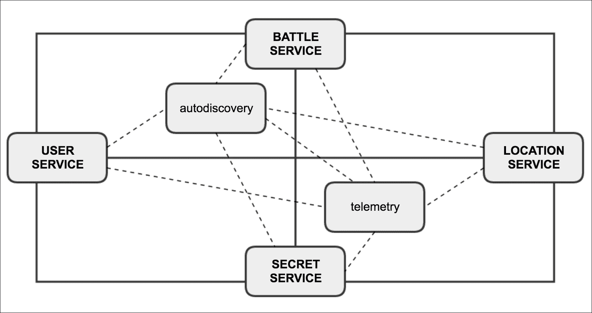
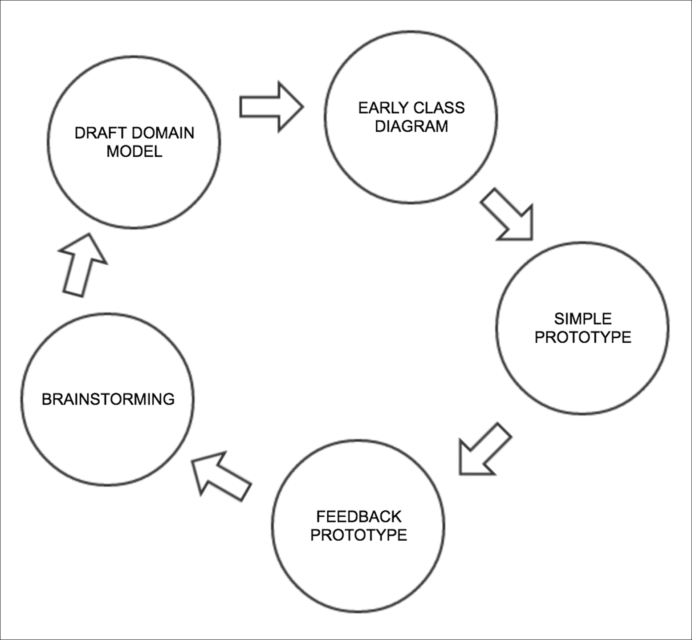
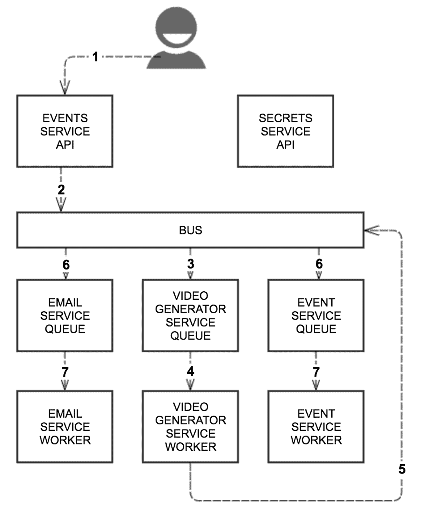

# 三、应用设计

在前面的章节中，我们简要介绍了我们将构建的应用程序。现在是深入了解整个项目的时候了。

# 微服务结构

我们想构建一个地理定位应用程序，我们选择像游戏一样创建它，这样它更有趣，更容易理解。您可以随意将该示例应用于任何其他想法，例如，嵌入地理本地化的旅游应用程序。

我们的游戏将使用地理定位来发现世界各地的不同秘密（如果你想要一张更小的地图，也可以在特定的地理区域）。后端系统将生成新的秘密，并将它们随机放置在我们的地图上，允许用户探索他们的环境以找到它们。作为我们游戏的玩家，您将收集不同的秘密并将其存储在您的*钱包*中，在这里您将找到关于每个秘密的更多信息。

为了让我们的游戏更有趣，我们将有一个战斗引擎。当你发现我们的*秘密世界*时，你可以与其他玩家战斗，窃取他/她的*秘密*。战斗引擎将是一个简单的-只要掷一个骰子，最高分数赢得战斗。

没有其他服务，例如用户/玩家管理系统等，此类项目无法完成。

作为开发人员，您从一个规范开始，并尝试将其分解为更小的部分。从我们的小描述中，我们可以开始定义我们的微服务及其职责，如下所示：

*   **用户服务**：该服务的主要职责是用户注册和管理。为了保持示例的小型化，我们还将添加额外的功能，例如用户通知和机密钱包管理。
*   **战斗服务**：该服务将负责用户的战斗，记录每次战斗，并将秘密从失败者钱包转移到胜利者手中。
*   **特勤处**：这是我们游戏的核心服务之一，因为它将负责所有的秘密工作。
*   **位置服务**：为了增加一层复杂性，我们决定创建一个服务来管理与位置相关的任何任务。主要职责是知道所有东西的位置；例如，如果用户服务需要知道该地区是否有其他玩家，向该服务发送带有地理定位的消息，则响应将告诉用户服务该地区的用户。

请注意，我们不仅为我们的游戏创建服务，还将使用其他支持服务使一切顺利进行。

下图描述了不同服务之间的通信路径。每个服务都可以与其他服务对话，这样我们就可以组合更大、更复杂的任务。下图描述了我们的微服务之间的连接：



## 微服务模式

设计模式是解决实际应用程序开发中经常出现的问题的可重用解决方案。这些解决方案有着行之有效的成功记录，并且被广泛使用，因此将它们添加到我们的项目中将使我们的软件更加稳定和可靠。

我们正在构建一个微服务应用程序，因为我们希望它尽可能稳定可靠，所以我们将使用一些微服务模式，例如：API 网关、服务发现和注册，以及共享数据库或每个服务的数据库。

## API 网关

我们将有一个前端供用户注册并与我们的应用程序交互，它将是我们微服务的主要客户端。此外，我们还计划在未来推出本地移动应用程序。让不同的客户使用我们的应用程序会让我们头疼，因为他们对我们的微服务的使用可能会非常不同。

为了统一任何客户机使用我们的微服务的方式，我们将添加一个额外的层——API 网关。此 API 网关成为任何客户端（例如浏览器和本机应用程序）的单一入口点。在这一层中，我们的网关可以通过两种方式处理请求：一些请求被简单地代理，另一些请求被分散到多个服务。我们甚至可以将此 API 网关用作安全层，检查客户端的每个请求是否允许使用我们的微服务：


资产的请求

拥有 API 网关有许多好处，其中我们可以强调以下几点：

*   我们的应用程序将有一个单一的访问点，消除了客户端需要知道每个微服务在哪里的问题。
*   我们可以更好地控制服务的使用方式，甚至可以为特定客户提供定制端点。
*   它减少了请求/往返次数。通过一次往返，客户机可以从多个服务检索数据。

## 服务发现和注册

我们的服务需要呼叫其他服务。在单体应用程序上，解决方案非常简单——我们可以调用方法或使用过程调用。我们正在构建一个运行在容器中的 microservices 应用程序，因此没有简单的方法知道某些服务的位置。我们的容器基础设施非常灵活，我们需要构建一个服务发现系统。

我们的每项服务都将通过查询我们的服务注册中心（我们使用 Consor 存储所有服务信息的地方）获得所有其他链接服务的位置。我们的注册表将知道每个服务实例的位置。下图显示了自动发现模式：


为此，我们将使用不同的工具：

*   **领事**：这是我们的服务注册中心，有很多功能，比如集群支持等。
*   **法比奥**：这是一款基于 Go 构建的反向代理，与 Concur 有着深层次的整合。我们喜欢这个代理的地方是它与 concur 的轻松连接，以及它执行蓝绿部署的能力。你可以尝试的另一个有趣的工具是 Træfik。
*   **NGINX**：一个强大的 HTTP 服务器和反向代理，对于大多数 web 开发人员来说，这是一个非常有名的工具，选择它是因为它的性能和低内存占用。我们将模糊地使用 Fabio 和 NGINX 作为反向代理。
*   **ContainerPilot**：这是一个用围棋编写的小工具。我们将使用此软件在 Concur 中注册我们的服务，将容器的统计数据发送到集中遥测系统，向 Concur 发送健康检查，并检测其他服务的变化。我们将用这个工具创建某种自动修复系统。

## 共享数据库或每个服务的数据库

应用程序以某种方式生成我们需要存储的数据。在单体应用程序中，毫无疑问，所有数据都存储在同一个位置。问题是当您处理 microservice 应用程序时，没有简单的响应。每个应用领域都是唯一的，因此没有解决问题的经验法则；您需要分析您的数据，并决定是将所有数据存储在共享存储中，还是每个服务都有自己的数据存储，还是混合存储。

在我们的示例应用程序中，我们将介绍这两种方法，但让我们解释每种方法的好处。

### 每个服务的数据库

在这种方法中，我们将每个微服务的持久数据保持为该服务的私有数据，这些数据只能通过其 API 访问，并具有许多好处：

*   它使服务松散耦合；例如，您可以在不影响用户服务的情况下更改作战服务。
*   它增加了应用程序的灵活性，因为数据只能通过其 API 访问；我们可以使用不同的存储引擎。例如，我们可以在用户服务中使用关系数据库，在位置服务中使用 NoSQL。

当然，此解决方案有一些缺点，最显著的问题是难以连接不同服务之间共享的数据。

### 共享数据库

这种方法的工作原理类似于单体应用程序中的数据库——所有数据都存储在同一个引擎中。主要的好处是将所有东西放在一个地方非常简单。

这种简单性有一些缺点；我们强调以下几点：

*   任何数据库更改都可能破坏或影响其他服务
*   当您对所有数据使用相同的引擎时，会导致应用程序的灵活性降低
*   如果数据存储已关闭，则所有使用共享数据库的服务都会注意到该问题

作为开发人员，您的工作是为您需要解决的每个问题找到最佳解决方案。您需要决定如何存储应用程序数据，始终牢记每个选项的优点和缺点。

# 宁静的习俗

**Representational State Transfer**是用于与 API 通信的方法的名称。顾名思义，它是*无国籍*；换句话说，这些服务不会保持数据传输，因此，如果您调用发送数据的微服务（例如，用户名和密码），微服务在下次调用时将不会记住数据。状态由客户端保存，因此客户端需要在每次调用微服务时发送状态。

一个很好的例子是当用户登录并且用户能够调用特定方法时，因此每次都需要发送用户凭据（用户名和密码或令牌）。

RESTAPI 的概念不再是服务；相反，它就像一个可以通过标识符（URI）进行通信的资源容器。

在以下几行中，我们将定义一些关于 API 的有趣约定。了解这些技巧很重要，因为在使用 API 时，您应该按照自己的意愿进行操作。换句话说，编写 API 就像是为自己写一本书——像您这样的开发人员会阅读它，所以完美的功能不是唯一重要的事情，友好的交谈方式也很重要。

如果您遵循一些惯例以使消费者满意，那么创建 RESTful API 对您和消费者来说将更容易。我在 RESTful API 上使用了一些建议，结果非常好。它们有助于组织应用程序及其未来的维护需求。此外，当您的 API 消费者喜欢使用您的应用程序时，他们会感谢您。

## 安全

RESTful API 中的安全性很重要，但是如果您的 API 将被您不认识的人使用，换句话说，如果它将对每个人都可用，那么它就特别重要。

*   到处使用 SSL——这对于 API 的安全性很重要。有许多公共场所没有 SSL 连接，可以嗅探包并获取其他人的凭据。
*   使用令牌身份验证，但如果要使用令牌对用户进行身份验证，则必须使用 SSL。使用令牌可以避免在每次需要标识当前用户时发送整个凭据。如果不可能，可以使用 OAuth2。
*   提供响应头，用于限制和避免同一使用者的请求过多。大公司的问题之一是流量问题，甚至有人试图用你的 API 做坏事。最好有某种方法来避免这些问题。

## 标准

一点一点地，PHP 和微服务的更多标准正在出现。正如我们在上一章中看到的，有一些小组，比如 PHP-FIG，试图建立它们。以下是使 API 更标准的一些技巧：

*   到处使用 JSON。避免使用 XML；如果有 RESTful API 的标准，那就是 JSON。它更加紧凑，可以轻松地用 web 语言加载。
*   使用 camelCase 而不是 snake_case；它更容易阅读。
*   使用 HTTP 状态代码错误。每种情况都有标准状态，因此使用它们可以避免更好地解释 API 的每个响应。
*   在 URL 中包含版本控制，不要将其放在标题上。该版本需要位于 URL 中，以确保浏览器可跨版本浏览资源。
*   提供重写 HTTP 方法的方法。一些浏览器只允许`POST`和`GET`请求，因此最好允许`X-HTTP-Method-Override`头覆盖`PUT`、`PATCH`和`DELETE`。

## 消费设施

API 的使用者是最重要的，因此您需要提供有用、有用和友好的方法，使开发人员的工作更轻松。发展思考这些问题的方法：

*   限制响应数据。开发人员不需要所有可用数据，因此您可以使用字段返回的过滤器限制响应。
*   使用查询参数对结果进行筛选和排序。它将帮助您简化 API。
*   请记住，您的 API 将由不同的开发人员使用，所以请注意您的文档——它需要非常清晰和友好。
*   在`POST`、`PATCH`和`PUT`请求中返回有用的内容。避免开发人员多次调用 API 以获取所需数据。
*   最好提供一种在响应中自动加载相关资源表示的方法。这将有助于开发人员避免多次请求相同的内容以获取所有必要的数据。可以通过包括过滤器来定义 URL 中的特定参数来实现这一点。
*   使用链接头进行分页，那么开发人员就不需要自己创建链接了。
*   包括有助于缓存的响应头。HTTP 包含了一个框架，可以通过添加一些头来实现这一点。

还有很多技巧，但是这些技巧对于 RESTful 约定的第一种方法已经足够了。在接下来的章节中，我们将看到这些 RESTful 约定的示例，并解释如何更好地使用它们。

# 缓存策略

> 菲尔·卡尔顿
> 
> *“计算机科学中只有两个难题：缓存失效和命名问题。”*

缓存是一个临时存储数据的组件，以便将来对该数据的请求可以更快地得到处理。这种临时存储用于缩短数据访问时间、减少延迟和改进 I/O。我们可以在微服务体系结构中使用不同类型的缓存来提高总体性能。让我们来看看这个问题。

## 通用缓存策略

为了维护缓存，我们有一些算法，这些算法提供了指令，告诉我们应该如何维护缓存。最常见的算法如下所示：

*   **最不常用（LFU）**：此策略使用计数器跟踪访问条目的频率，并首先删除计数器最低的元素。
*   **最近最少使用（LRU）**：在这种情况下，最近使用的项目总是在缓存顶部附近，当我们需要一些空间时，最近未访问的元素会被删除。
*   **最近使用（MRU）**：首先移除最近使用的物品。我们将在更常访问旧项目的情况下使用此方法。

开始考虑缓存策略的最佳时机是在设计应用程序所需的每个微服务时。每次服务返回数据时，您都需要问自己一些问题：

*   我们是否返回了无法存储在任何地方的敏感数据？
*   如果我们保持输入不变，是否返回相同的结果？
*   我们可以将这些数据存储多久？
*   我们要如何使此缓存无效？

您可以在应用程序中的任何位置添加缓存层。例如，如果使用 Percona/MySQL/MariaDB 作为数据存储，则可以正确启用和设置查询缓存。这个小小的设置将提升您的数据库。

即使在编写代码时，也需要考虑缓存。您可以对对象和数据执行延迟加载，或者构建自定义缓存层以提高总体性能。假设您正在从外部存储器请求和处理数据，请求的数据可以在同一执行中重复多次。执行类似于以下代码的操作将减少对外部存储的调用：

```php
    <?php 
    class MyClass 
    { 
       protected $myCache = []; 

       public function getMyDataById($id) 
       { 
           if (empty($this->myCache[$id])) { 
               $externalData = $this->getExternalData($id); 
               if ($externalData !== false) { 
                   $this->myCache[$id] = $externalData; 
               } 
           } 

                return $this->myCache[$id]; 
       } 
    } 

```

请注意，我们的示例省略了大块代码，例如名称空间或其他函数。我们只想为您提供总体思路，以便您可以创建自己的代码。

在这种情况下，每当我们使用 ID 作为密钥标识符向外部存储器发出请求时，我们都会将数据存储在`$myCache`变量中。下次我们请求一个与前一个 ID 相同的元素时，我们将从`$myCache`获取该元素，而不是从外部存储器请求数据。请注意，只有在相同的 PHP 执行中可以重用数据时，此策略才会成功。

在 PHP 中，您可以访问最流行的缓存服务器，如**memcached**和**Redis**；它们都以键值格式存储数据。访问这些功能强大的工具将使我们能够提高微服务应用程序的性能。

让我们使用`Redis`作为缓存来重建前面的示例。在下面的代码中，我们假设您的环境中有一个可用的`Redis`库（例如，phpredis）和一个正在运行的`Redis`服务器：

```php
    <?php 
    class MyClass 
    { 
      protected $myCache = null; 

      public function __construct() 
      { 
        $this->myCache  = new Redis(); 
        $this->myCache->connect('127.0.0.1',  6379); 
      } 

      public function getMyDataById($id) 
      { 
        $externalData = $this->myCache->get($id); 
          if ($externalData === false) { 
            $externalData = $this->getExternalData($id); 
            if ($externalData !== false) { 
              $this->myCache->set($id, $externalData); 
            } 
          } 

          return $externalData; 
      } 
    }

```

在这里，我们首先连接到 Redis 服务器，并调整了`getMyDataById`功能以使用我们新的 Redis 实例。这个例子可能更复杂，例如，通过添加依赖注入和在缓存中存储 JSON，以及其他无限选项。使用缓存引擎而不是构建自己的缓存引擎的好处之一是，所有这些引擎都具有许多非常酷和有用的功能。假设您只想将数据保存在缓存中 10 秒钟；使用 Redis 很容易做到这一点——只需使用`$this->myCache->set($id, $externalData, 10)`更改 set 调用，十秒钟后，您的记录将从缓存中删除。

比向缓存引擎添加数据更重要的事情是使存储的数据无效或删除数据。在某些情况下，可以使用旧数据，但在其他情况下，使用旧数据可能会导致问题。如果不添加 TTL 以使数据自动过期，请确保在需要时有方法删除或使数据无效。

记住这个例子和前一个例子，我们将在我们的微服务应用程序中使用这两种策略。

作为开发人员，您不需要绑定到特定的缓存引擎；包装它，创建一个抽象，并使用该抽象，以便您可以在任何时候更改底层引擎，而无需更改所有代码。

这种通用的缓存策略可以在应用程序的任何范围内使用——您可以在微服务的代码中甚至在微服务之间使用它。在我们的应用示例中，我们将处理*机密*；它们的数据不会经常更改，因此我们可以在第一次访问它们时将所有这些信息存储在缓存层（Redis）中。

未来的申请将从我们的缓存层获取机密数据，而不是从我们的数据存储中获取，从而提高我们应用程序的性能。请注意，检索和存储*机密*数据的服务是负责管理此缓存的服务。

让我们看看我们将在 microservices 应用程序中使用的一些其他缓存策略。

## HTTP 缓存

此策略使用一些 HTTP 头来确定浏览器是否可以使用响应的本地副本，还是需要从源服务器请求新副本。此缓存策略在应用程序外部进行管理，因此您对其没有太多控制权。

我们可以使用的一些 HTTP 头如下所示：

*   **到期**：设置未来内容到期的时间。当将来达到这一点时，任何类似的请求都必须返回到源服务器。
*   **上次修改**：指定上次修改响应的时间；它可以用作自定义验证策略的一部分，以确保用户始终拥有新鲜内容。
*   **Etag**：这个头标签是 HTTP 为 web 缓存验证提供的几种机制之一，它允许客户端发出有条件的请求。Etag 是服务器分配给特定版本的资源的标识符。如果资源发生变化，Etag 也会发生变化，这使我们能够快速比较两种资源表示，以确定它们是否相同。
*   **Pragma**：这是一个旧的头，来自 HTTP/1.0 实现。HTTP/1.1 缓存控制实现了相同的概念。
*   **缓存控制**：此报头是 expires 报头的替代品；它得到了很好的支持，并允许我们实现更灵活的缓存策略。可以组合此标头的不同值以实现不同的缓存行为。

以下是可用的选项：

*   **无缓存**：这表示任何缓存的内容在发送到客户端之前必须在每个请求上重新验证。
*   **无存储**：表示内容不能以任何方式缓存。当响应包含敏感数据时，此选项非常有用。
*   **public**：将内容标记为 public，可通过浏览器和任何中间缓存进行缓存。
*   **私有**：将内容标记为私有；此内容可以由用户的浏览器存储，但不能由中间方存储。
*   **最大年龄**：设置内容必须重新验证之前可以缓存的最大年龄。此选项值以秒为单位，最长为 1 年（31536000 秒）。
*   **s-maxage**：类似于 max age 表头；唯一的区别是，此选项仅应用于中间缓存。
*   **必须重新验证**：此标签表示必须严格遵守 max age、s-maxage 或 expires 标头指示的规则。
*   **代理重新验证**：类似于 s-maxage，但仅适用于中间代理。
*   **不转换**：此头告诉缓存在任何情况下都不允许修改接收到的内容。

在我们的示例应用程序中，我们将拥有一个可以通过任何 web 浏览器访问的公共 UI。使用正确的 HTTP 头，我们可以避免一次又一次地请求相同的资产。例如，我们的 CSS 和 JavaScript 文件不会经常更改，因此我们可以在将来设置到期日期，浏览器将保留它们的副本；未来的请求将使用本地副本，而不是请求新副本。

您可以从 NGINX 的浏览器访问时间开始，向所有`.jpg`、`.jpeg`、`.png`、`.gif`、`.ico`、`.css`和`.js`文件添加一个 expires 头，日期为未来 123 天，规则很简单：

```php
    location ~*  .(jpg|jpeg|png|gif|ico|css|js)$ { 
        expires 123d; 
    } 

```

## 静态文件缓存

一些静态元素对缓存非常友好，其中您可以缓存以下元素：

*   徽标和非自动生成的图像
*   样式表
*   JavaScript 文件
*   可下载内容
*   有媒体文件吗

这些元素往往很少更改，因此可以缓存更长的时间。为了减轻服务器的负载，您可以使用**内容交付网络**（**CDN**，以便这些不经常更改的文件可以由这些外部服务器提供服务。

基本上，CDN 有两种类型：

*   **推送 CDN**：此类型要求您**推送**您要存储的文件。您有责任确保将正确的文件上载到 CDN，并且推送的资源可用。它主要用于上传的图像，例如，用户的化身。请注意，一些 CDN 可以在推送后返回 OK 响应，但您的文件尚未真正就绪。
*   **拉 CDN**：这是懒惰版本，您不需要向 CDN 发送任何内容。当一个请求通过 CDN 到达并且文件不在他们的存储中时，他们会从您的服务器获取资源，并将其存储起来以备将来的请求。它主要用于 CSS、图像和 JavaScript 资产。

在设计 microservice 应用程序时，您需要记住这一点，因为您可能允许用户上载一些文件。

你打算把这些文件存放在哪里？如果它们是公开的，为什么不使用 CDN 来交付这些文件，而不是从您的服务器中删除它们呢。

一些著名的 CDN 包括 CloudFlare、Amazon CloudFront 和 Fastly 等。它们的共同点是，它们在世界各地都有多个数据中心，允许它们尝试从最近的服务器向您提供文件副本。

通过将 HTTP 与静态文件缓存策略相结合，可以将服务器上的资产请求减少到最低限度。我们将不解释其他缓存策略，例如全页缓存；有了我们介绍的内容，您就可以开始构建成功的微服务应用程序了。

# 领域驱动设计

**领域驱动设计**（**DDD**从此）是一种在需求复杂时进行开发的方法。这个概念并不新鲜；它是由 Eric Evans 在 2004 年的同名书中创建的，但现在它已成为主流，因为微服务在开发人员中很受欢迎，在大型项目中也很常见。

这是因为微服务概念（关于软件体系结构，将每个功能划分为服务）和 DDD 概念（关于有界上下文）之间具有很强的兼容性。

在了解在我们的微服务项目中在何处以及如何使用 DDD 之前，有必要了解 DDD 是什么以及它是如何工作的，因此，让我向您介绍主要概念，作为此方法的总结。

## 领域驱动设计的工作原理

Evans 介绍了了解领域驱动设计工作原理所需的一些概念：

*   **上下文**：这是一个单词或语句出现的环境，决定了它的含义。
*   **领域**：这是一个知识（本体）、影响或活动的领域。用户应用程序的主题区域是软件的领域。
*   **模型**：这是一个抽象系统，描述某个领域的选定方面，可用于解决与该领域相关的问题。
*   **泛在语言**：这是一种围绕领域模型构建的语言，所有团队成员都使用它将团队的所有活动与软件连接起来。

**软件领域**与技术术语、编程或计算机无关。在大多数项目中，最具挑战性的部分是理解业务领域，因此 DDD 建议使用**模型领域**；这是一种抽象、有序和选择性的知识，以图表、代码或文字形式再现。

模型域就像构建具有复杂功能的项目的路线图，需要遵循五个步骤来实现它。这五个步骤需要得到开发团队和领域专家的同意：

1.  **头脑风暴和细化**：开发团队和领域专家之间应该有一个沟通渠道。因此，项目中的所有人员都应该能够与每个人交谈，因为他们都需要知道项目应该如何工作。
2.  **领域模型草案**：在对话过程中，需要开始绘制领域模型草案，以便领域专家检查和纠正，直到双方同意为止。
3.  **早期类图**：利用草稿，我们可以开始构建早期版本的类图。
4.  **简单原型**：利用早期类图和领域模型的草稿，可以构建一个非常简单的原型。Evans 建议避免与域无关的事情，以确保域业务建模正确。它可以是一个非常简单的跟踪程序。
5.  **原型反馈**：领域专家与原型互动，检查是否满足所有需求，然后整个团队将改进模型领域和原型。

在域模型正确之前，此过程将包含所需的所有迭代：



模型、代码和设计必须一起发展和成长。它们不能完全不同步。如果一个概念在模型上更新了，它也应该在代码和设计上自动更新，其余的也一样。

模型是一个抽象系统，它描述一个领域的选择性概念，可以用来解决与该领域相关的问题。如果有一部分模型没有反映在代码中，则应将其删除。

最后，域模型是项目中公共语言的基础。DDD 中的这种通用语言称为**泛在语言**，它应该具有以下特性：

*   类名及其与域相关的函数
*   用于讨论模型中包含的域规则的术语
*   应用于域模型的分析和设计模式的名称

项目的所有成员（包括开发人员和领域专家）都应该使用通用语言，因此开发人员应该能够描述所有任务和功能。

在团队之间的所有讨论中，如会议、图表或文档中，使用这种语言是绝对必要的，但这种语言并不是在流程的第一次迭代中诞生的，这意味着需要多次迭代重构才能同步模型、语言和代码。例如，如果开发人员发现域中的某个类应该重命名，那么如果不重构域模型和通用语言上的名称，他们就无法重构该类。

无处不在的语言、领域模型和代码应该作为单个知识块一起进化。

DDD 的概念存在争议。Eric Evans 说，领域专家有必要使用与团队相同的语言，但有些人不喜欢这种想法。通常，领域专家不了解面向对象的概念或微服务，因为它们对于非开发人员来说过于抽象。无论如何，DDD 说如果领域专家不理解领域模型，那是因为它有问题。

领域模型中有图表，但 Evans 建议也使用文本，因为图表不能正确解释概念。此外，图表应该是肤浅的；如果你想看到更多的细节，你有它的代码。

某些项目受域模型和代码之间的连接的影响。这是因为在分析和设计之间存在一个划分。分析员制作独立于设计的模型，开发人员无法开发功能，因为缺少一些信息。此外，他们不能与领域专家交谈。开发团队将不会遵循该模型，最终，域模型将不会更新，也不会工作。因此，本项目不符合要求。

综上所述，DDD 将软件开发作为一个迭代过程来实现，该过程将模型、设计和代码作为一个块中的单个任务进行细化。

## 在微服务中使用域驱动程序设计

正如我们前面所说，DDD 完美地满足了微服务的需求。微服务出现了一个常见问题，因为它们具有分散的数据管理；这有好处，但有时可能会有问题。

两种服务之间的概念模型将是不同的，这可能会给大型公司带来问题。例如，用户可以根据服务的不同而有所不同，关于用户的每个服务的属性可以不同，并且属性语义也可以不同。

在一家大公司中，当应用程序不断发展并进行了多年的更新时，情况就更加复杂了。对于用户，每个服务都可以有不同的属性，通常情况下，它们不匹配。所以，解决这个问题的一个好方法是使用 DDD。

正如微服务所做的那样，DDD 将一个复杂的域划分为不同的上下文，在它们之间建立关系，并要求所有成员协作以获得特定域和有界上下文中的通用语言，迭代此过程，直到他们获得有关问题的实际概念。

Evans 建议将每个微服务设计为 DDD 绑定的上下文，以便为系统内的微服务提供逻辑边界。每一个微服务（或在其上工作的团队）都将负责系统的这一部分，它将提供更清晰和可维护的代码。

Michael Plöd 给出了更多关于 DDD 如何帮助微服务的想法。关于构建微服务，有四个重要方面：

*   **战略设计**：这基本上是有边界的上下文，但上下文映射和其他模式也很重要。上下文映射应显示项目的所有有界上下文及其相互之间的关系；它还描述了他们之间的合同。上下文映射对于想要进入微服务的单体应用程序非常有用。
*   **内部构建块**：这是指在设计有界上下文的内部时使用战术模式，如聚合、实体或存储库。
*   **大型结构**：用于创建使用进化顺序和责任层的结构。这也是微服务中的一个概念。在大型项目中，在边界环境中创建大型结构是很有帮助的。它们应该被设计成单独进化。
*   **提炼**：将单体应用程序迁移到微服务时，从已经成长的系统中提炼核心域非常有用。最重要的部分应该是识别和提取核心域，以及识别子域、从核心提取子域和重构的迭代过程。

总而言之，微服务和 DDD 非常匹配，但有必要拥有更大的范围，理解更多的边界上下文。

# 事件驱动架构

**事件驱动架构**（**EDA**）是一种应用程序架构模式，遵循事件的产生、检测、消耗和反应的技巧。

可以将事件描述为状态变化。例如，如果门已关闭，但有人打开了它，则门的状态将从关闭变为打开。开门服务必须像事件一样进行更改，其他服务可以知道该事件。

事件通知是异步生成、发布、检测或使用的消息，是事件更改的状态。重要的是要理解，事件不会在应用程序中移动，它只是发生而已。术语*事件*有点争议，因为它通常是指消息事件通知而不是事件，因此了解事件和事件通知之间的区别很重要。

这种模式通常用于基于组件或微服务的应用程序中，因为它们可以通过应用程序的设计和实现来应用。由事件驱动的应用程序具有事件创建者和事件使用者或接收器（一旦事件可用，他们就必须执行操作）。

**事件创建者**是事件的制作人；它只知道事件已经发生，其他什么都不知道。然后我们有事件消费者，他们是负责知道事件被触发的实体。消费者参与处理或更改事件。

**事件消费者**订阅了某种中间件事件管理器，该管理器在收到创建者事件发出的事件通知后，立即将事件转发给注册消费者，供其使用。

围绕体系结构（如 EDA）将应用程序开发为微服务，可以使这些应用程序的构建方式更易于响应，因为 EDA 应用程序在设计上可以在不可预测的异步环境中运行。

使用 EDA 的优点如下：

*   **解藕系统**：创建者服务不需要知道其余服务，其余服务不知道创建者。因此，它允许它断开系统的耦合。
*   **交互发布/订阅**：EDA 允许多对多交互，其中服务发布有关某个事件的信息，服务可以获取该信息并对该事件执行必要的操作。因此，它使许多创建者事件和使用者事件能够实时交换状态和响应信息。
*   **异步**：EDA 允许服务之间的异步交互，因此它们不需要等待即时响应，并且在等待响应时不强制连接工作。

## 微服务中的事件驱动架构

在大型项目中，微服务通常用于将其服务划分为较小的服务。因此，在他们之间进行良好且有组织的沟通是非常重要的。事件驱动体系结构可用于解决微服务之间通信的常见问题。

在基于微服务的项目中，通常每个微服务都使用 HTTP 请求相互通信。这有一些问题，我们现在将解释。

在我们的`Finding secrets`项目中，有一个为用户创建事件的功能。创建新事件时，需要将事件名称和事件表单中附加的图像发送到服务，以便根据接收到的数据创建视频。视频生成后，将更新事件并通过电子邮件发送给用户。

如果我们对每个服务发出 HTTP 请求，问题是所有服务都需要了解其他服务。例如，生成视频的服务需要知道在生成视频后如何更新事件；换句话说，服务必须包含执行此更新的代码。

而且，一旦我们添加了许多服务，这将变得越来越困难，因为它们之间需要更多的通信。它会有更多的故障，主要的问题是，如果微服务关闭，视频将无法生成。因此，使用 HTTP 请求无法很好地扩展，我们应该在这样的项目中使用不同的策略来通信微服务。

如果我们用不同的方式做事呢？换句话说，生成视频的服务不会直接更新事件，事件也不会要求视频服务生成视频。那么，我们如何让微服务进行通信呢？答案是使用事件驱动的体系结构。

为此，我们需要以下几点：

*   每个微服务的事件队列
*   所有的微服务都必须将事件发送到一个集中的总线（我们可以使用 AWS 来实现这一点）
*   每个微服务队列都必须订阅集中总线
*   每个微服务都有一个后台工作程序来监听事件队列，它将在接收到事件时执行必要的操作

在下图中，您可以看到所涉及的不同服务和流程流（用箭头表示）。下图显示了事件驱动的工作流：



当我们在**事件服务 API**（**1**上创建新事件时，该事件进入集中总线（**2**），相应的工作人员从集中总线（**3**获取该事件；其他人只是忽略了这件事。事件放置在视频生成器服务队列中，等待服务执行（**4**。

一旦视频由服务工作人员生成，服务将向中央总线（5）启动一个新事件。但是，这一次将由不同的工作人员执行（6），工作人员的 res 将像前面一样忽略此事件。更新事件的工作人员和发送电子邮件的工作人员将把事件放入他们的队列中，并对每个服务执行相应的操作（**7**，如果需要，他们将向集中总线发送新事件。

这是一个事件循环，它改进了服务之间通信的 HTTP 请求方法。使用事件驱动体系结构的优点如下所述：

*   如果服务上存在任何错误或异常，则事件不会丢失，它将保留在队列中，稍后将执行。例如，如果发送电子邮件的服务关闭，发送电子邮件的事件将保留在队列中，等待服务再次启动。
*   这些服务不需要知道如何更新其他服务。这意味着服务的逻辑可以在每个服务中隔离。
*   可以添加更多的微服务而不受影响。
*   它将更好地扩展。

# 持续集成、持续交付和工具

没有代码提交策略或测试/部署工作流，软件项目就不可能成功。在团队中工作时，制定战略更为重要。没有什么比在一个杂乱无章的项目上工作更烦人的了，那里没有规则，也没有人对他们所做的工作负责。在本节中，我们将解释最常见和最成功的开发实践。

## 持续集成-CI

持续集成是一种软件开发实践，其中所有团队成员都经常集成他们的工作。每次将新代码推送到共享存储库时，都会启动一个自动构建，以尽可能快地检测任何类型的集成错误。主要目标是避免长期和不可预测的集成。

### 什么是持续整合？

让我们用一个简单的 CI 流程示例来更好地解释它。假设您已经准备好了我们的游戏示例，并且在生产环境中运行良好，并且您对应用程序的用户会喜欢的一个小功能有了新的想法。这个新功能可以在几个小时内完成。

首先在开发机器上获取当前源代码的副本；您将使用一个源代码管理系统，所以您只需要从主线签出一个工作副本。

现在您已经有了源代码的工作副本，您可以做任何您需要的事情来完成特性、添加新代码、创建新测试等等。CI 实践假设您的代码的很大一部分将被自动化测试覆盖。PHP 中一个流行的单元测试套件是 PHPUnit，这是一个简单而强大的工具，我们将在后面的章节中介绍。测试我们的代码将有助于我们在流程的未来步骤中，并将确保代码的高质量。

现在，您已经结束了新特性，现在是在您的开发环境上启动自动构建的时候了。这个过程将获取源代码，检查错误，并运行自动测试。只有在生成和所有测试没有错误的情况下，我们才能将构建视为好的，并且可以将其添加到存储库中。

这样做的结果是，我们有一个稳定的软件，工作正常，包含很少的错误。

### CI 的好处

持续集成的主要目标是降低风险，但这并不是采用这种开发实践的唯一好处。除其他外，我们可以强调以下好处：

*   缩短集成时间
*   早期的错误检测是因为我们正在推动一些小的更改，并且每次更改都会经过一次又一次的测试
*   稳定构建的持续可用性，例如，我们可以使用它进行新的测试，作为客户的演示，甚至可以再次部署它
*   持续监控项目质量指标

### 持续集成工具

作为一名开发人员，您可能会担心如何自动化此过程。别担心，在市场上，您有多种方法来创建和管理 CI 管道。我们的最佳建议是，在您决定在项目中使用哪种 CI 软件之前，请花一些时间测试所有选项。一些易于与 PHP 集成的 CI 软件包括：

*   **詹金斯**：这是一个非常容易安装和管理的开源项目。它的多功能性使得该软件可能是 CI 应用最广泛的软件之一。
*   **竹**：这是一款基于订阅的软件。Atlassian 以其生产力和发展支持工具在发展世界中闻名。如果您需要与其他 Atlassian 工具深度集成，这是一个不错的选择。
*   **Travis**：这是另一款基于订阅的软件，为开源项目提供免费计划。
*   **PHP CI**：这个新的开源工具是基于 PHP 构建的，可以安装在您的服务器上，也可以作为基于云的工具。

在我们的示例项目中，我们将使用 Jenkins 并旋转 Docker 容器。同时，您可以使用以下简单命令开始测试 Jenkins：

```php
$ docker run -p 8080:8080 -p 50000:50000 jenkins 

```

此命令将为 Jenkins 创建一个带有正式 Docker 图像的容器，并将 8080 和 50000 从本地环境映射到该容器。如果您在`http://localhost:8080`上打开浏览器，您将可以访问詹金斯用户界面。

## 连续交付

持续交付是持续集成的延续，其主要目标是能够在任何时间点部署软件的任何版本，而不会出现故障。我们可以通过确保代码始终可供部署来实现这一点，并且通过遵循持续集成实践，我们可以确保源代码的集成质量和级别。

通过持续交付，每次我们对代码进行更改时，都会构建、测试这些更改，然后将其发布到后台环境中。下图显示了 CD 管道上的基本工作流。如您所见，如果任何测试步骤失败，我们需要重新开始，直到代码通过测试。通过这种方式，我们可以始终确保我们的项目符合最高质量标准。

以下是连续交付工作流的示意图：


### 持续交付的好处

持续交付有许多好处；其中，我们强调以下几点：

*   **降低部署风险**：我们将部署更小的更改，因此出错的空间更小，更容易解决任何问题。即使我们应用部署模式，例如蓝绿色部署，我们的部署也不会被用户检测到。
*   **进度跟踪**：由于并非所有开发人员和管理人员都以相同的方式跟踪工作进度，我们现在正在非常快速地部署小版本；毫无疑问，当任务完成时——如果是在生产环境中，任务就完成了。
*   **更高质量**：连续交货，小批量生产；这使我们能够在整个交付生命周期中从用户那里获得反馈。在构建完整功能之前，我们甚至可以使用 A/B 测试来测试想法。在我们的管道中有自动测试工具可以让开发人员快速发现回归，避免不稳定软件的发布。
*   **更快的上市时间**：传统软件生命周期的集成和测试阶段可能需要数周的时间，但如果我们能够实现构建和部署以及环境供应和测试过程的自动化，我们可以将时间减少到最低，并将其纳入开发人员的日常工作中。
*   **降低成本**：如果我们投资于构建、测试、部署和环境自动化，我们可以通过消除许多固定的相关成本来降低软件成本。

### 用于连续输送管道的工具

如前所述，持续交付是持续集成的延续，因此我们可以使用前面提到的大多数 CI 工具，并使用我们最喜欢的测试框架扩展我们的管道。在 PHP 中，我们有大量可用的测试框架，但最著名的是：

*   **phpUnit**：这是用于创建单元测试的最著名的框架。每个 PHP 开发者都需要知道这个框架，因为它将是他们测试的基础。这是行业标准。
*   **Codeception**：这是 PHP 可用的完整测试套件之一。使用 Codeception，您可以构建单元测试、功能测试和验收测试。
*   **行为**：这是最流行的行为驱动 PHP 测试框架。您不需要编写代码，而是编写故事，框架将对它们进行转换和测试。
*   **PHPSec**：这是继行为驱动测试之后的另一个重要框架。
*   **Selenium**：这是用于自动化浏览器的最复杂的测试框架之一。有了这个框架，就可以编写用户验收测试。

在接下来的章节中，我们将使用其中一些测试框架。同时，让他们中的每一个都尝试一下，选择你最喜欢的框架。记住，你可以毫无问题地混合它们。

# 总结

在本章中，我们讨论了设计和开发应用程序的不同方法。我们讨论了一些可以轻松集成到开发工作流中的模式和策略，甚至还讨论了最常见的开发实践。在接下来的章节中，我们将在开发工作流程中应用所有这些概念。