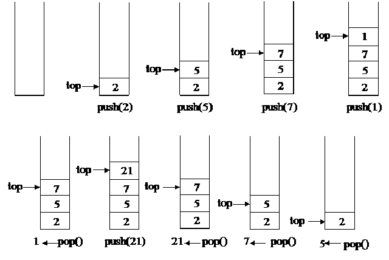
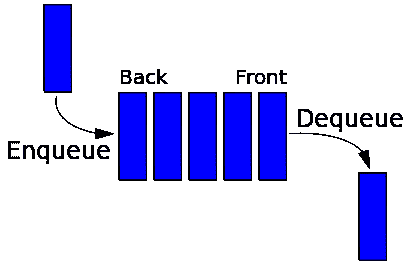
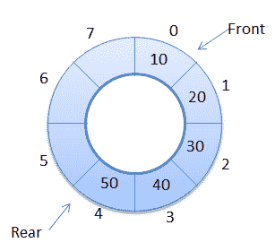

# 四、构造栈和队列

在日常生活中，我们使用两种最常见的数据结构。我们可以假设这些数据结构是受现实世界的启发，但它们在计算世界中有着非常重要的影响。我们讨论的是栈和队列数据结构。我们每天把书、文件、盘子和衣服堆放在一起，而我们则在售票处、公共汽车站和购物结账处排队。此外，我们还听说了 PHP 中的消息队列，它是高端应用程序中最常用的功能之一。在本章中，我们将探讨流行的栈和队列数据结构的不同实现。我们将学习 PHP 中的队列、优先级队列、循环队列和双端队列。

# 理解栈

栈是一个线性数据结构，遵循**后进**、**先出**（**后进先出**原则。这意味着栈只有一端，用于在结构中添加项和删除项。在栈中添加新项目称为推送，移除项目时进行推送称为 pop。因为我们只有一端要操作，所以我们总是要在一端推动一个项目，当我们弹出时，该端的最后一个项目将弹出。栈中最顶部的元素也位于栈末端的最开始处，称为顶部。如果我们考虑下面的图像，我们可以看到，在每次弹出和按下操作之后，顶部发生变化。此外，我们在栈顶部执行操作，而不是在栈的开始或中间。我们必须小心在栈为空时弹出元素，以及在栈为满时推送元素。如果要推送的元素超过其容量，可能会出现栈溢出。



从前面的讨论中，我们现在知道栈中有四个基本操作：

*   **推**：在栈顶部添加一个项目。
*   **Pop**：移除栈的顶部项目。
*   **Top**：返回栈顶项。它与 pop 不同，因为它不删除项目，它只为我们获取值。
*   **isEmpty**：检查栈是否为空。

现在，让我们使用 PHP 实现栈，但方式不同。首先，我们将尝试使用 PHP 的内置数组函数实现栈。然后，我们将了解如何在不使用 PHP 内置函数的情况下构建栈，而是使用一些其他数据结构，例如链表。

# 使用 PHP 数组实现栈

首先，我们将为栈创建一个接口，以便我们可以在不同的实现中使用它，并确保所有实现彼此具有一些相似性。让我们为栈编写简单的接口：

```php
interface Stack { 

    public function push(string $item); 

    public function pop(); 

    public function top(); 

    public function isEmpty(); 

}

```

从前面的接口可以看出，我们将所有栈函数都保留在接口中，因为它所实现的类必须具有所有这些函数，否则在运行时将抛出致命错误。由于我们是使用 PHP 数组实现栈的，因此我们将使用一些现有的 PHP 函数来实现 push、pop 和 top 操作。我们将以一种可以定义栈大小的方式来实现栈。如果数组中没有项目，但我们仍希望弹出，它将引发下溢异常，如果我们尝试推送的项目超过其容量允许的数量，则将引发溢出异常。以下是使用数组的栈实现的代码：

```php
class Books implements Stack { 

    private $limit; 
    private $stack; 

    public function __construct(int $limit = 20) { 
      $this->limit = $limit; 
      $this->stack = []; 
    } 

    public function pop(): string { 

      if ($this->isEmpty()) { 
          throw new UnderflowException('Stack is empty'); 
      } else { 
          return array_pop($this->stack); 
      } 
    } 

    public function push(string $newItem) { 

      if (count($this->stack) < $this->limit) { 
          array_push($this->stack, $newItem); 
      } else { 
          throw new OverflowException('Stack is full'); 
      } 
    } 

    public function top(): string { 
      return end($this->stack); 
    } 

    public function isEmpty(): bool { 
      return empty($this->stack); 
    } 
}

```

现在让我们看一下为栈编写的代码。我们将栈实现命名为`Books`，但只要它是有效的类名，我们可以随意命名它。首先，我们使用`__construct()`方法构造栈，该方法带有一个选项来限制我们可以存储在栈中的项目数量。默认值设置为`20`。下一个方法定义 pop 操作：

```php
public function pop():  string { 

  if ($this->isEmpty()) {
      throw new UnderflowException('Stack is empty');
  } else {
      return array_pop($this->stack);
  }
 }

```

如果栈不是空的，`pop`方法将返回字符串。为此，我们使用在 stack 类中定义的 empty 方法。如果栈为空，我们将从 SPL 抛出一个`UnderFlowException`。如果没有要弹出的项目，我们可以阻止该操作发生。如果栈不是空的，我们使用 PHP 中的`array_pop`函数返回数组中的最后一项。

在 push 方法中，我们做的与 pop 相反。首先，我们检查栈是否已满。如果不是，我们使用 PHP 的`array_push`函数将字符串项添加到栈的末尾。如果栈已满，我们将从 SPL 抛出一个`OverFlowException`。`top`方法返回栈中最顶层的元素。`isEmpty`方法检查栈是否为空。

Since we are following PHP 7, we are using both scalar type declarations at method level and return types for methods.

为了使用我们刚刚实现的栈类，我们必须考虑一个例子，在这个例子中我们可以使用所有这些操作。让我们编写一个小程序来制作一个书堆。以下是此操作的代码：

```php
try { 
    $programmingBooks = new Books(10); 
    $programmingBooks->push("Introduction to PHP7"); 
    $programmingBooks->push("Mastering JavaScript"); 
    $programmingBooks->push("MySQL Workbench tutorial"); 
    echo $programmingBooks->pop()."\n"; 
    echo $programmingBooks->top()."\n"; 
} catch (Exception $e) { 
    echo $e->getMessage(); 
}

```

我们已经为我们的书库创建了一个实例，并将我们的编程书籍标题保存在其中。我们有三次推送行动。最后插入的书名为`"MySQL workbench tutorial"`。如果我们在三次推送操作后弹出，我们将使用此标题名称作为返回。之后，top 将返回`"Mastering JavaScript"`，一旦执行 pop 操作，它将成为 top 项。我们将整个代码嵌套在一个`try...catch`块中，以便处理溢出和下溢引发的异常。上述代码将具有以下输出：

```php
MySQL Workbench tutorial
Mastering JavaScript

```

现在让我们关注一下刚刚完成的不同栈操作的复杂性。

# 理解栈操作的复杂性

下面是不同栈操作的时间复杂性。在最坏的情况下，栈操作的时间复杂度如下所示：

| **操作** | **时间复杂度** |
| 流行音乐 | `O(1)` |
| 推 | `O(1)` |
| 顶部 | `O(1)` |
| 栈空 | `O(1)` |

由于栈在始终记住栈顶部的一端运行，因此如果我们要搜索栈中的某个项目，这意味着我们必须搜索整个列表。访问栈中的特定项也是如此。虽然在这类操作中使用栈不是一种好的做法，但如果我们想这样做，我们必须记住，时间复杂性是基于比一般栈操作更多的操作的。

| **操作** | **时间复杂度** |
| 通道 | `O(n)` |
| 搜索 | `O(n)` |

The space complexity for stack is always `O(n)`.

到目前为止，我们已经了解了如何使用 PHP 数组及其内置函数行`array_pop`和`array_push`实现栈。但是我们可以忽略内置函数，通过手动数组操作来实现它，或者我们可以使用`array_shift`和`array_unshift`内置函数。

# 利用链表实现栈

在[第 3 章](03.html)中*使用链表*学习了如何实现链表。我们看到，在链表中，我们可以在末尾插入一个节点，从末尾将其删除，然后在列表的开头将其插入中间，依此类推。如果我们考虑结束插入，在单链表数据结构的结束操作中删除，我们可以很容易地执行与栈相似的操作。因此，让我们使用上一章中的`LinkedList`类来实现栈。以下是代码的外观：

```php
class BookList implements Stack { 

    private $stack; 

    public function __construct() { 
      $this->stack = new LinkedList(); 
    }

    public function pop(): string { 

      if ($this->isEmpty()) { 
          throw new UnderflowException('Stack is empty'); 
      } else { 
          $lastItem = $this->top(); 
          $this->stack->deleteLast(); 
          return $lastItem; 
      } 
    } 

    public function push(string $newItem) { 

      $this->stack->insert($newItem); 
    } 

public function top(): string { 
  return $this->stack->getNthNode($this->stack->getSize())->data; 
} 

    public function isEmpty(): bool { 
      return $this->stack->getSize() == 0; 
    } 
}

```

让我们通过每个代码块来了解这里发生了什么。如果我们从顶部开始，我们可以看到在`constructor`方法中，我们正在创建一个新的`LinkedList`对象，并将其分配给栈属性，而不是前面示例中的数组。我们假设`LinkedList`类是自动加载的，或者该文件包含在脚本中。现在让我们关注推送操作。推送操作非常简单。我们只需要在链表中插入一个新节点。由于我们对链表没有任何大小限制，所以这里不检查任何溢出。

在我们的链表实现中，没有显示最后一个节点的方法。我们已经插入了一个新的最后一个节点并删除了前一个最后一个节点，但是在这里，我们需要在不删除它的情况下获取最后一个节点的值。为了实现该功能，这正是我们栈的顶级操作，我们可以使用`getNthNode`方法以及`LinkedList`实现中的`getSize`。这样，我们就可以得到节点。但我们必须记住一件事：我们想要节点的字符串值，而不是完整的节点对象。这就是我们返回返回的节点的数据属性的原因。

与 top 操作类似，pop 操作还需要返回最后一个节点的数据，然后才能将其从列表中删除。为了实现这一点，我们使用了`top()`方法，然后使用`LinkedList`类中的`deleteLast()`方法。现在让我们运行一个示例代码，将这个新实现的`BookList`类用于栈操作。代码如下：

```php
try { 
    $programmingBooks = new BookList(); 
    $programmingBooks->push("Introduction to PHP7"); 
    $programmingBooks->push("Mastering JavaScript"); 
    $programmingBooks->push("MySQL Workbench tutorial"); 
    echo $programmingBooks->pop()."\n"; 
    echo $programmingBooks->pop()."\n"; 
    echo $programmingBooks->top()."\n"; 
} catch (Exception $e) { 
    echo $e->getMessage(); 
}

```

它看起来与我们运行的上一个示例非常相似，但这里我们尝试执行两个 pop 操作，然后是最上面的一个。因此，输出将如下所示：

```php
MySQL Workbench tutorial
Mastering JavaScript
Introduction to PHP7

```

如果我们知道栈的基本行为以及如何实现它，我们可以使用数组、链表、双链表来实现栈。由于我们已经看到了数组和链表的实现，现在我们将探讨栈的 SPL 实现，它实际上使用了双链表。

# 使用 SPL 中的 SplStack 类

如果我们对实现自己版本的栈不感兴趣，我们可以使用现有的 SPL 实现来实现栈。它非常易于使用，只需编写很少的代码。我们已经知道，`SplStack`使用`SplDoublyLinkedList`。它有所有可能的操作来推动、弹出、向前、向后、移动、取消移动等等。为了实现前面看到的相同示例，我们必须编写以下行：

```php
$books = new SplStack(); 
$books->push("Introduction to PHP7"); 
$books->push("Mastering JavaScript"); 
$books->push("MySQL Workbench tutorial"); 
echo $books->pop() . "\n"; 
echo $books->top() . "\n"; 

```

是的，使用`SplStack`类构建栈就是这么简单。由我们决定是使用 PHP 数组、链表还是内置类（如`SplStack`）来实现它。

# 栈的实际使用

栈在现代应用程序中有许多用途。无论是在浏览器历史记录中，还是在流行的开发术语栈跟踪中，栈无处不在。现在，我们将尝试使用栈解决一个实际问题。

# 嵌套括号匹配

当我们求解数学表达式时，首先需要考虑嵌套括号的正确性。如果括号嵌套不正确，则可能无法进行计算，或者计算错误。让我们看一些例子：


从前面的表达式中，只有第一个是正确的；其他两个不正确，因为括号嵌套不正确。为了确定括号是否嵌套，我们可以使用栈来实现解决方案。以下是实现的伪算法：

```php
valid = true 
s = empty stack 
for (each character of the string) { 
   if(character = ( or { or [ ) 
       s.push(character) 
  else if (character = ) or } or ] ) { 
   if(s is empty) 
valid = false 

     last = s.pop() 
    if(last is not opening parentheses of character)  
         valid = false 
  } 
} 
if(s is not empty) 
valid = false

```

如果我们看一下伪代码，它看起来非常简单。目标是忽略字符串中的任何数字、操作数或空格，而只考虑括号、括号和括号。如果他们正在打开括号，我们将推入栈。如果他们正在关闭括号，我们将弹出栈。如果弹出的括号不是我们试图匹配的开始括号，那么它是无效的。在循环结束时，如果字符串有效，栈应为空。但如果栈不是空的，则会有额外的括号，因此字符串无效。现在让我们将其转换为一个程序：

```php
function expressionChecker(string $expression): bool { 
    $valid = TRUE; 
    $stack = new SplStack(); 

    for ($i = 0; $i < strlen($expression); $i++) { 
    $char = substr($expression, $i, 1); 

    switch ($char) { 
      case '(': 
      case '{': 
      case '[': 
      $stack->push($char); 
      break; 

      case ')': 
      case '}': 
      case ']': 
      if ($stack->isEmpty()) { 
          $valid = FALSE; 
      } else { 
        $last = $stack->pop(); 
        if (($char == ")" && $last != "(")  
          || ($char == "}" && $last != "{")  
          || ($char == "]" && $last != "[")) { 

      $valid = FALSE; 
        } 
    } 
    break; 
  } 

  if (!$valid) 
      break; 
    } 

    if (!$stack->isEmpty()) { 
    $valid = FALSE; 
    } 

    return $valid; 
}

```

现在让我们运行前面讨论的三个示例：

```php
$expressions = []; 
$expressions[] = "8 * (9 -2) + { (4 * 5) / ( 2 * 2) }"; 
$expressions[] = "5 * 8 * 9 / ( 3 * 2 ) )"; 
$expressions[] = "[{ (2 * 7) + ( 15 - 3) ]"; 

foreach ($expressions as $expression) { 
    $valid = expressionChecker($expression); 

    if ($valid) { 
    echo "Expression is valid \n"; 
    } else { 
    echo "Expression is not valid \n"; 
    } 
} 

```

这将产生以下输出，这正是我们想要的：

```php
Expression is valid
Expression is not valid
Expression is not valid

```

# 理解队列

队列是另一种特殊的线性数据结构，遵循**先进**、**先进**（**先进先出**原则。操作有两个端：一个附加到队列，另一个从队列中删除。这与栈不同，在栈中，添加和删除操作都使用了一端。插入将始终位于后部或后部。将从前端移除一个元素。向队列中添加新元素的过程称为排队，删除元素的过程称为出列。查看队列前面的元素而不删除该元素的过程称为 peek，类似于栈的 top 操作。下图描述了队列的表示形式：



现在，如果我们为队列定义一个接口，它将如下所示：

```php
interface Queue { 

    public function enqueue(string $item); 

    public function dequeue(); 

    public function peek(); 

    public function isEmpty(); 
}

```

现在我们可以使用不同的方法实现队列，就像我们对栈所做的那样。首先，我们将使用一个 PHP 数组实现队列，然后是`LinkedList`，然后是`SplQueue`。

# 使用 PHP 数组实现队列

我们现在将使用 PHP 数组实现队列数据结构。我们已经看到，我们可以使用`array_push()`函数在数组末尾添加一个元素。为了移除数组的第一个元素，我们可以使用 PHP 的`array_shift()`函数，对于 peek 函数，我们可以使用 PHP 的`current()`函数。根据我们的讨论，下面是代码的外观：

```php
class AgentQueue implements Queue {

    private $limit; 
    private $queue; 

    public function __construct(int $limit = 20) { 
      $this->limit = $limit; 
      $this->queue = []; 
    } 

    public function dequeue(): string { 

      if ($this->isEmpty()) { 
          throw new UnderflowException('Queue is empty'); 
      } else { 
          return array_shift($this->queue); 
      } 
    } 

    public function enqueue(string $newItem) { 

      if (count($this->queue) < $this->limit) { 
          array_push($this->queue, $newItem); 
      } else { 
          throw new OverflowException('Queue is full'); 
      } 
    } 

    public function peek(): string { 
      return current($this->queue); 
    } 

    public function isEmpty(): bool { 
      return empty($this->queue); 
    } 

}

```

在这里，我们保持了对栈所做的相同原则。我们想要定义一个固定大小的队列，检查溢出和下溢。为了运行队列实现，我们可以考虑使用它作为呼叫中心应用程序的代理队列。下面是利用我们的队列操作的代码：

```php
try { 
    $agents = new AgentQueue(10); 
    $agents->enqueue("Fred"); 
    $agents->enqueue("John"); 
    $agents->enqueue("Keith"); 
    $agents->enqueue("Adiyan"); 
    $agents->enqueue("Mikhael"); 
    echo $agents->dequeue()."\n"; 
    echo $agents->dequeue()."\n"; 
    echo $agents->peek()."\n"; 
} catch (Exception $e) { 
    echo $e->getMessage(); 
} 

```

这将产生以下输出：

```php
Fred
John
Keith

```

# 使用链表实现队列

与栈实现一样，我们将使用[第 3 章](03.html)中的链表实现*使用链表*来实现这里的队列。我们可以使用`insert()`方法确保始终在末尾插入。我们可以使用`deleteFirst()`进行出列操作，`getNthNode()`进行窥视操作。以下是使用链表的队列的示例实现：

```php
class AgentQueue implements Queue { 

    private $limit; 
    private $queue; 

    public function __construct(int $limit = 20) { 
      $this->limit = $limit; 
      $this->queue = new LinkedList(); 
    } 

    public function dequeue(): string { 

      if ($this->isEmpty()) { 
          throw new UnderflowException('Queue is empty'); 
      } else { 
          $lastItem = $this->peek(); 
          $this->queue->deleteFirst(); 
          return $lastItem; 
      } 
    } 

    public function enqueue(string $newItem) { 

      if ($this->queue->getSize() < $this->limit) { 
          $this->queue->insert($newItem); 
      } else { 
          throw new OverflowException('Queue is full'); 
      } 
    } 

    public function peek(): string { 
      return $this->queue->getNthNode(1)->data; 
    } 

    public function isEmpty(): bool { 
      return $this->queue->getSize() == 0; 
    } 

}

```

# 使用 SPL 中的 SplQueue 类

如果我们不想在实现队列功能时遇到任何困难，并且对内置解决方案感到满意，那么我们可以使用`SplQueue`类满足任何基本队列需求。我们必须记住一件事：`SplQueue`类中没有可用的 peek 函数。我们必须使用`bottom()`函数来获取队列的第一个元素。下面是我们使用`SplQueue`的`AgentQueue`的简单队列实现：

```php
$agents = new SplQueue(); 
$agents->enqueue("Fred"); 
$agents->enqueue("John"); 
$agents->enqueue("Keith"); 
$agents->enqueue("Adiyan"); 
$agents->enqueue("Mikhael"); 
echo $agents->dequeue()."\n"; 
echo $agents->dequeue()."\n"; 
echo $agents->bottom()."\n";

```

# 理解优先级队列

优先级队列是一种特殊类型的队列，其中根据项目的优先级插入和删除项目。在编程世界中，优先级队列的使用是巨大的。例如，假设我们有一个非常大的电子邮件队列系统，我们通过队列系统发送每月的新闻稿。如果我们需要使用相同的队列功能向用户发送紧急电子邮件，该怎么办？由于一般的队列原则是在末尾添加项，因此发送该消息的过程将延迟很多。为了解决这个问题，我们可以使用优先级队列。在这种情况下，我们为每个节点分配一个优先级，并根据该优先级对它们进行排序。优先级较高的项目将位于列表的顶部，并将提前退出队列。

我们可以采取两种方法来构建优先级队列。

# 有序序列

如果我们为优先级队列计划一个有序序列，它可以有升序或降序。拥有订单序列的积极一面是，我们可以快速找到最大优先级项目或删除最大优先级项目，就像我们可以使用`O(1)`复杂性来找到它一样。但是插入将花费更多的时间，因为我们必须检查队列中的每个元素，以根据其优先级将项目放置在正确的位置。

# 无序序列

无序序列不需要我们遍历每个队列元素来放置新添加的元素。它总是作为一般排队原则添加到后面。因此，我们可以实现具有`O(1)`复杂性的排队操作。但是，如果我们想找到或删除优先级最高的元素，那么我们必须遍历每个元素以找到正确的元素。因此，它对搜索不是很友好。

现在，我们将编写代码，使用带有链表的有序序列实现优先级队列。

# 利用链表实现优先级队列

到目前为止，我们已经看到一个链表只使用了一个值，即节点数据。现在我们需要传递另一个值，它将是优先级。为了实现这一点，我们需要改变我们的`ListNode`实施：

```php
class ListNode {

    public $data = NULL; 
    public $next = NULL;
    public $priority = NULL;

    public function __construct(string $data = NULL, int $priority = 
      NULL) { 
      $this->data = $data;
      $this->priority = $priority;
    }

}

```

现在我们将数据和优先级作为节点的一部分。为了允许在插入操作期间考虑此优先级，我们还需要在`LinkedList`类中更改`insert()`实现。以下是修改后的实现：

```php
public function insert(string $data = NULL, int $priority = NULL) { 
  $newNode = new ListNode($data, $priority); 
  $this->_totalNode++; 

  if ($this->_firstNode === NULL) { 
      $this->_firstNode = &$newNode; 
  } else { 
      $previous = $this->_firstNode; 
      $currentNode = $this->_firstNode; 
      while ($currentNode !== NULL) { 
      if ($currentNode->priority < $priority) { 

         if ($currentNode == $this->_firstNode) { 
         $previous = $this->_firstNode; 
         $this->_firstNode = $newNode; 
         $newNode->next = $previous; 
         return; 
         } 
         $newNode->next = $currentNode; 
         $previous->next = $newNode; 
         return; 
    } 
    $previous = $currentNode; 
    $currentNode = $currentNode->next; 
    } 
  } 

  return TRUE; 
}

```

如我们所见，我们的`insert`方法已更改为在插入操作期间同时获取数据和优先级。通常，第一个过程是创建一个新节点并增加节点计数。可以有三种插入方式，如下所示：

*   列表为空，因此新节点是第一个节点。
*   列表不是空的，但新项具有最高优先级，因此。因此它成为第一个节点，前一个第一个节点跟随它。
*   列表不是空的，优先级也不是最高的，因此它会在列表中插入新节点，或者可能在列表的末尾。

在我们的实施过程中，我们考虑了所有三种可能性、三个事实。因此，我们总是在列表的开头有最高优先级的项。现在让我们用这段新代码运行`AgentQueue`实现，如下例所示：

```php
try { 
    $agents = new AgentQueue(10); 
    $agents->enqueue("Fred", 1); 
    $agents->enqueue("John", 2); 
    $agents->enqueue("Keith", 3); 
    $agents->enqueue("Adiyan", 4); 
    $agents->enqueue("Mikhael", 2); 
    $agents->display(); 
    echo $agents->dequeue()."\n"; 
    echo $agents->dequeue()."\n"; 
} catch (Exception $e) { 
    echo $e->getMessage(); 
}

```

如果没有优先级，那么队列应该是`Fred`、`John`、`Keith`、`Adiyan`和`Mikhael`。但由于我们已将优先级添加到列表中，因此输出为：

```php
Adiyan
Keith
John
Mikhael
Fred

```

因为`Adiyan`具有最高优先级，所以它被放置在队列的开头，即使它被插入到队列的第四位。

# 使用 SplPriorityQueue 实现优先级队列

PHP 已经内置了对使用 SPL 实现优先级队列的支持。我们可以使用`SplPriorityQueue`类来实现优先级队列。这是前面使用链表的示例，但这次我们选择 SPL:

```php
class MyPQ extends SplPriorityQueue { 

    public function compare($priority1, $priority2) { 
    return $priority1 <=> $priority2; 
    }

}

$agents = new MyPQ();

$agents->insert("Fred", 1); 
$agents->insert("John", 2);
$agents->insert("Keith", 3);
$agents->insert("Adiyan", 4);
$agents->insert("Mikhael", 2);

//mode of extraction
$agents->setExtractFlags(MyPQ::EXTR_BOTH); 

//Go to TOP
$agents->top();

while ($agents->valid()) {
    $current = $agents->current();
    echo $current['data'] . "\n";
    $agents->next();
}

```

这将产生与链表示例相同的结果。扩展到我们自己的`MyPQ`类的另一个好处是，我们可以定义是按升序还是降序对其进行排序。这里，我们选择降序，使用 PHP 组合比较运算符或 spaceship 运算符进行排序。

Most of the time, priority queues are implemented using heap. When we move on to the heap chapter, we will also implement a priority queue using heap.

# 实现循环队列

当我们使用标准队列时，每次我们将一个项目出列时，我们都必须重新缓冲整个队列。为了解决这个问题，我们可以使用一个圆形队列，后面跟着前面，形成一个圆形。这种特殊类型的队列需要对入队和出队操作进行特殊计算，并考虑队列的后部、前部和限制。循环队列始终是固定队列，也称为循环缓冲区或环形缓冲区。下图显示了循环队列的表示形式：



我们可以使用 PHP 数组实现循环队列。由于我们必须计算后部和前部的位置，因此阵列可以有效地用于此目的。以下是循环队列的示例：

```php
class CircularQueue implements Queue { 

    private $queue; 
    private $limit; 
    private $front = 0; 
    private $rear = 0; 

    public function __construct(int $limit = 5) { 
      $this->limit = $limit; 
      $this->queue = []; 
    } 

    public function size() { 
      if ($this->rear > $this->front) 
          return $this->rear - $this->front; 
      return $this->limit - $this->front + $this->rear; 
    } 

    public function isEmpty() { 
      return $this->rear == $this->front; 
    } 

    public function isFull() { 
      $diff = $this->rear - $this->front; 
      if ($diff == -1 || $diff == ($this->limit - 1)) 
          return true; 
      return false; 
    } 

    public function enqueue(string $item) { 
      if ($this->isFull()) { 
          throw new OverflowException("Queue is Full."); 
      } else { 
          $this->queue[$this->rear] = $item; 
          $this->rear = ($this->rear + 1) % $this->limit; 
      } 
    } 

    public function dequeue() { 
      $item = ""; 
      if ($this->isEmpty()) { 
          throw new UnderflowException("Queue is empty"); 
      } else { 
          $item = $this->queue[$this->front]; 
          $this->queue[$this->front] = NULL; 
          $this->front = ($this->front + 1) % $this->limit; 
      } 
      return $item; 
    } 

    public function peek() { 
      return $this->queue[$this->front]; 
    }

}

```

Since we are considering `0` as a front marker, the total size of the queue will be of the `limit -1`.

# 创建双端队列（deque）

到目前为止，我们已经实现了队列，其中一端用于排队器，称为后端，另一端用于出列器，称为前端。因此，一般来说，每一端都应用于特定目的。但如果我们需要从两端加入和退出队列呢？这可以通过使用称为双端队列或 deque 的概念来实现。在 deque 中，两端可用于排队和退队操作。如果我们查看使用链表的队列实现，我们会发现我们可以使用链表实现在最后插入、在第一个插入、在最后删除和在第一个删除。如果我们在此基础上实现一个新的 deque 类，我们就可以轻松地实现我们想要的目标。下图描述了一个双端队列：


以下是 deque 的实现：

```php
class DeQueue { 

    private $limit; 
    private $queue; 

    public function __construct(int $limit = 20) { 
      $this->limit = $limit; 
      $this->queue = new LinkedList(); 
    } 

    public function dequeueFromFront(): string { 

      if ($this->isEmpty()) { 
          throw new UnderflowException('Queue is empty'); 
      } else { 
          $lastItem = $this->peekFront(); 
          $this->queue->deleteFirst(); 
          return $lastItem; 
      } 
    } 

    public function dequeueFromBack(): string { 

      if ($this->isEmpty()) { 
          throw new UnderflowException('Queue is empty'); 
      } else { 
          $lastItem = $this->peekBack(); 
          $this->queue->deleteLast(); 
          return $lastItem; 
      } 
    } 

    public function enqueueAtBack(string $newItem) { 

      if ($this->queue->getSize() < $this->limit) { 
          $this->queue->insert($newItem); 
      } else { 
          throw new OverflowException('Queue is full'); 
      } 
    } 

    public function enqueueAtFront(string $newItem) { 

      if ($this->queue->getSize() < $this->limit) { 
          $this->queue->insertAtFirst($newItem); 
      } else { 
          throw new OverflowException('Queue is full'); 
      } 
    } 

    public function peekFront(): string { 
      return $this->queue->getNthNode(1)->data; 
    } 

    public function peekBack(): string { 
      return $this->queue->getNthNode($this->queue->getSize())->data; 
    } 

    public function isEmpty(): bool { 
      return $this->queue->getSize() == 0; 
    } 

}

```

现在我们将使用此类检查双端队列的操作：

```php
try { 
    $agents = new DeQueue(10); 
    $agents->enqueueAtFront("Fred"); 
    $agents->enqueueAtFront("John"); 
    $agents->enqueueAtBack("Keith"); 
    $agents->enqueueAtBack("Adiyan"); 
    $agents->enqueueAtFront("Mikhael"); 
    echo $agents->dequeueFromBack() . "\n"; 
    echo $agents->dequeueFromFront() . "\n"; 
    echo $agents->peekFront() . "\n"; 
} catch (Exception $e) { 
    echo $e->getMessage(); 
}

```

如果我们看前面的代码示例，首先在前面添加`Fred`，然后再在前面添加`John`。所以序列现在是`John`、`Fred`。然后在后面加上`Keith`，后面加上`Adiyan`。现在我们有了序列`John`、`Fred`、`Keith`、`Adiyan`。最后，我们在开头添加了`Mikhael`。所以最后的顺序是`Mikhael`、`John`、`Fred`、`Keith`、`Adiyan`。

由于我们先从后面排队列，`Adiyan`将首先退出，然后从前面排`Mikhael`。前面的新镜头将是`John`。以下是运行代码时的输出：

```php
Adiyan
Mikhael
John

```

# 总结

栈和队列是最常用的数据结构之一。在未来的算法和数据结构中，我们可以以不同的方式使用这些抽象数据类型。在本章中，我们了解了实现栈和队列的不同方法，以及不同类型的队列。在下一章中，我们将讨论递归——一种通过将较大问题划分为较小实例来解决较大问题的特殊方法。