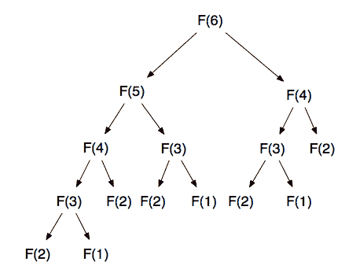
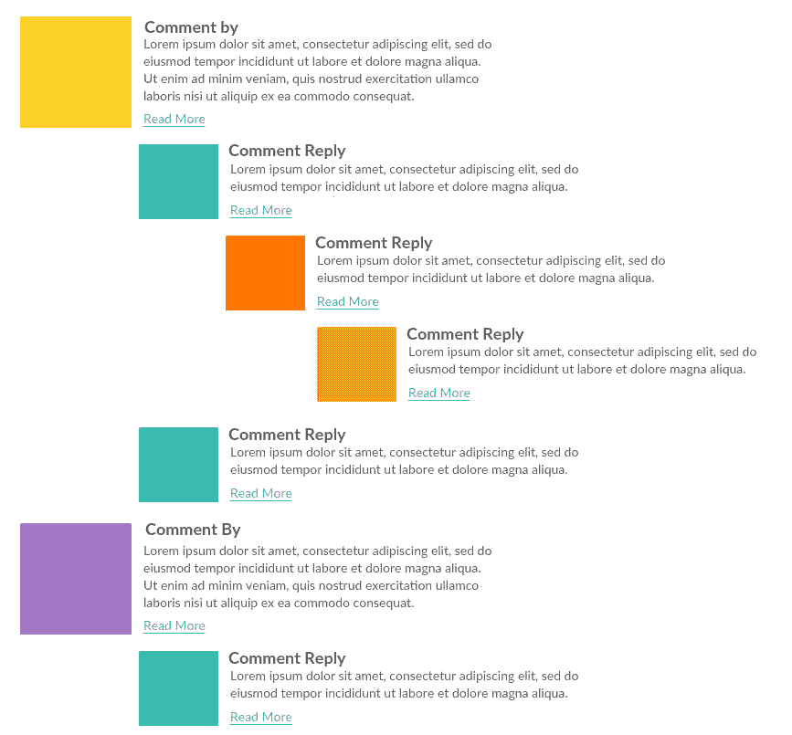
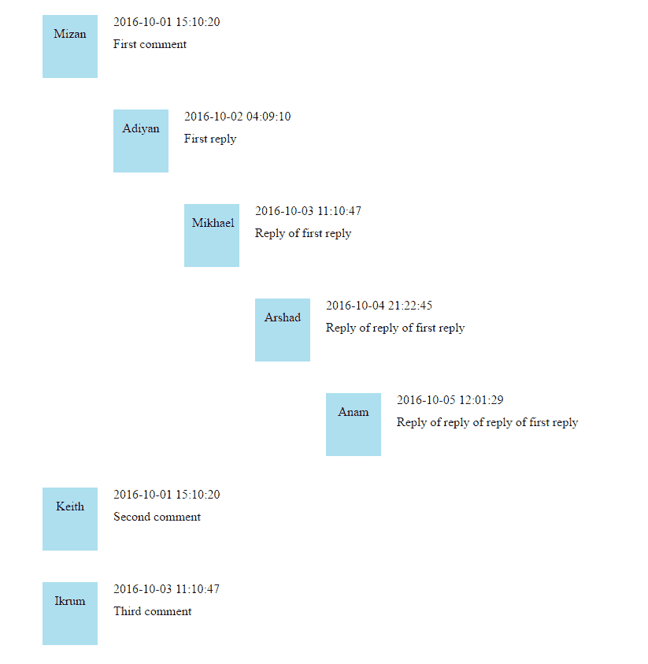

# 五、应用递归算法——递归

解决复杂的问题总是困难的。即使对于程序员来说，解决复杂的问题也会变得更加困难，有时还需要一个特殊的解决方案。递归是计算机程序员用来解决复杂问题的一种特殊方法。在本章中，我们将介绍递归的定义、属性、不同类型的递归以及许多示例。递归不是一个新概念；在自然界中，我们看到许多递归元素。分形显示递归行为。下图显示了自然递归：


# 理解递归

递归是一种通过将较大问题划分为较小问题来解决较大问题的方法。换句话说，递归就是将大问题分解成更小的相似问题来解决它们并得到实际结果。递归通常被称为调用自身的函数。这听起来可能很奇怪，但事实上，当函数处于递归状态时，它必须调用自己。这是什么样子的？让我们看一个例子，

在数学中，“阶乘”一词非常流行。数字*N*的阶乘定义为小于等于*N*的所有正整数的乘积。它总是用*表示！*（感叹号）。因此，*5*的阶乘可以写成如下：

*5！=5x4x3x2x1*

类似地，我们可以写出给定数字的以下阶乘：

*4！=4 X 3 X 2 X 1*

*3！=3x2x1*

*2！=2 X 1*

*1！=1*

如果我们仔细看我们的例子，我们可以用*4*的阶乘写出*5*的阶乘，如下所示：

*5！=5 X 4！*

同样，我们可以写：

*4！=4 X 3！*

*3！=3 X 2！*

*2！=2 X 1！*

*1！=1 X 0！*

*0！=1*

或者，我们可以简单地笼统地说：

*n！=n*（n-1）！*

这表示递归。我们正在将每一步分解为更小的步骤，并解决实际的大问题。下图显示了如何计算 3 的阶乘：


因此，步骤如下：

1.  *3！=3 X 2！*
2.  *2！=2 X 1！*
3.  *1！=1 X 0！*
4.  *0！=1*
5.  *1！=1 X 1=1*
6.  *2！=2 X 1=2*
7.  *3！=3 X 2=6*

# 递归算法的性质

现在，问题可能是，“如果函数调用自身，那么它如何停止或知道何时完成递归调用？”当我们编写递归解决方案时，我们必须确保它具有以下属性：

1.  每个递归调用都应该在一个较小的子问题上。像阶乘的例子一样，6 的阶乘是用 6 和 5 的阶乘的乘法来求解的，如此下去。
2.  它必须有一个基本情况。当到达基本情况时，将不会有进一步的递归，并且基本情况必须能够在没有任何进一步递归调用的情况下解决问题。在我们的阶乘示例中，我们没有从 0 进一步往下看。所以，在本例中，0 是我们的基本情况。
3.  不应该有任何循环。如果每个递归调用都调用同一个问题，那么将有一个永无止境的循环。重复几次后，计算机将显示栈溢出错误。

因此，如果我们现在使用 PHP7 编写阶乘程序，那么它将如下所示：

```php
function factorial(int $n): int {
   if ($n == 0)
    return 1;

   return $n * factorial($n - 1);
}

```

在前面的示例代码中，我们可以看到我们有一个基本条件，当`$n`的值为`0`时，我们返回`1`。如果不满足此条件，则返回`$n`的乘法和`$n-1`的阶乘。所以，它同时满足数字 1 和 3 的性质。我们在避免循环，同时确保每个递归调用都会创建一个较大的子问题。我们将编写如下算法的递归行为：


# 递归与迭代算法

如果我们分析我们的阶乘函数，我们可以看到它可以使用一个简单的迭代方法编写，使用一个`for`或`while`循环，如下所示：

```php
function factorial(int $n): int { 
    $result = 1; 

    for ($i = $n; $i > 0; $i--) {
      $result *= $i; 
    } 

    return $result; 
}

```

如果这可以写成一个简单的迭代，那么我们为什么要使用递归呢？递归用于解决更复杂的问题。并不是所有的问题都可以如此轻松地迭代解决。例如，我们需要显示某个目录中的所有文件。我们只需运行一个循环来列出所有文件，就可以做到这一点。但是，如果其中有另一个目录呢？然后，我们必须运行另一个循环来获取该目录中的所有文件。如果在那个目录中有另一个目录，而且它还在继续，那该怎么办？在这种情况下，迭代方法可能毫无帮助，或者可能会创建复杂的解决方案。这里最好选择递归方法。

递归管理用于管理函数调用的调用栈。因此，与迭代相比，递归将需要更多的内存和时间来完成。同样，在迭代中，在每个步骤中，我们都可以得到一个结果，但是对于递归，我们必须等到基本情况执行后才能得到任何结果。如果我们考虑阶乘的迭代和递归的例子，我们可以看到有一个称为 EndotT0 的局部变量来存储每一步的计算。然而，在递归中，不需要局部变量或赋值。

# 用递归实现斐波那契数

在数学中，斐波那契数是一种特殊的整数序列，其中一个数由过去两个数的总和组成，如下表达式所示：


如果我们使用 PHP 7 实现此功能，它将如下所示：

```php
function fibonacci(int $n): int { 
    if ($n == 0) { 
    return 1; 
    } else if ($n == 1) { 
    return 1; 
    } else { 
    return fibonacci($n - 1) + fibonacci($n - 2); 
    } 
}

```

如果我们考虑前面的实现，我们可以看到它与前面的例子有点不同。现在，我们从一个函数调用中调用两个函数。我们将很快讨论不同类型的递归。

# 用递归实现 GCD 计算

递归的另一个常用用法是实现两个数字的**最大公除法**（**GCD**。在 GCD 计算中，我们将继续计算，直到余数变为 0。它可以表示为：


现在，如果我们使用 PHP 7 递归实现，它将如下所示：

```php
function gcd(int $a, int $b): int { 
    if ($b == 0) { 
     return $a; 
    } else { 
     return gcd($b, $a % $b); 
    } 
}

```

此实现的另一个有趣部分是，与阶乘不同，我们不会从基本情况返回调用栈中的其他步骤。基本情况将返回计算值。这是执行递归的优化方法之一。

# 不同类型的递归

到目前为止，我们已经看到了一些递归的例子以及如何使用它。尽管这个术语说的是递归，但递归有不同的类型。我们将逐一探讨。

# 线性递归

编程世界中最常用的递归之一是线性递归。当一个函数在每次运行中调用自己一次时，我们称之为线性递归。就像我们的阶乘例子一样，当我们将大的计算分解为小的计算，直到达到基本条件时，我们称之为缠绕。当我们从基本条件返回到第一个递归调用时，我们称之为展开。在本章下一节中，我们将研究不同的线性递归。

# 二元递归

在二进制递归中，函数在每次运行中调用自己两次。因此，计算依赖于对自身的两个不同递归调用的两个结果。如果我们看一下斐波那契序列生成递归函数，我们很容易发现它是一个二进制递归。除此之外，我们在编程世界中有许多常用的二进制递归，如二进制搜索、分治、合并排序等。下图显示了二进制递归：



# 尾部递归

当返回时没有要执行的挂起操作时，递归方法是尾部递归的。例如，在我们的阶乘代码中，返回值用于与前一个值相乘以计算阶乘。所以，这不是尾部递归。斐波那契级数递归也是如此。如果我们查看我们的 GCD 递归，我们会发现在返回后没有操作要做。因此，最终返回或基本案例返回实际上就是答案。因此，GCD 是尾部递归的一个例子。尾部递归也是线性递归的一种形式。

# 相互递归

在这种情况下，我们可能需要以另一种方式从两个不同的方法递归调用两个不同的方法。例如，函数`A()`在每次调用中调用函数`B()`，函数`B()`在每次调用中调用函数`A()`。这就是所谓的相互递归。

# 嵌套递归

当递归函数调用本身作为参数时，则称为嵌套递归。嵌套递归的一个常见示例是 Ackermann 函数。请看以下等式：


如果我们看最后一行，我们可以看到函数`A ()`是递归调用的，但第二个参数本身是另一个递归调用。这是嵌套递归的一个例子。

尽管有不同类型的递归可用，但我们将仅使用基于需要的递归。现在，我们将在项目中看到递归的一些实际用法。

# 使用递归构建 N 级类别树

构建多级嵌套类别树或菜单总是一个问题。许多 CMS 和站点只允许一定程度的嵌套。为了避免由于多个联接而导致的性能问题，有些联接最多只允许 3-4 级嵌套。现在，我们将探讨如何在不影响性能的情况下，借助递归创建一个 N 级嵌套类别树或菜单。以下是我们的解决方案方法：

1.  我们将为数据库中的类别定义表结构。
2.  我们将获得表中的所有类别，而不使用任何联接或多个查询。它将是一个带有简单 select 语句的单个数据库查询。
3.  我们将构建一个类别数组，这样我们就可以利用递归来显示嵌套的类别或菜单。

假设我们的数据库中有一个简单的表结构来存储类别，它如下所示：

```php
CREATE TABLE `categories` ( 
  `id` int(11) NOT NULL, 
  `categoryName` varchar(100) NOT NULL, 
  `parentCategory` int(11) DEFAULT 0, 
  `sortInd` int(11) NOT NULL 
) ENGINE=InnoDB DEFAULT CHARSET=utf8;

```

为简单起见，我们假设表中不需要其他字段。此外，表中还有如下数据：

| **Id** | **类别名称** | **家长类别** | **sortInd** |
| 1. | 第一 | 0 | 0 |
| 2. | 第二 | 1. | 0 |
| 3. | 第三 | 1. | 1. |
| 4. | 第四 | 3. | 0 |
| 5. | 第五 | 4. | 0 |
| 6. | 第六 | 5. | 0 |
| 7. | 第七 | 6. | 0 |
| 8. | 八 | 7. | 0 |
| 9 | 第九 | 1. | 0 |
| 10 | 第十 | 2. | 1. |

现在，我们已经为我们的数据库创建了一个结构化的表，并且我们假设还输入了一些示例数据。让我们构建一个查询来检索此数据，以便我们可以转到递归解决方案：

```php
$dsn = "mysql:host=127.0.0.1;port=3306;dbname=packt;"; 
$username = "root"; 
$password = ""; 
$dbh = new PDO($dsn, $username, $password); 

$result = $dbh->query("Select * from categories order by parentCategory asc, sortInd asc", PDO::FETCH_OBJ); 

$categories = []; 

foreach($result as $row) { 
    $categories[$row->parentCategory][] = $row;
}

```

前面代码的核心部分是如何在数组中存储类别。我们将根据其父类别存储结果。这将帮助我们递归地显示类别的子类别。这看起来很简单。现在，基于 categories 数组，让我们编写递归函数以分层显示类别：

```php
function showCategoryTree(Array $categories, int $n) {
    if(isset($categories[$n])) { 

      foreach($categories[$n] as $category) {        
          echo str_repeat("-", $n)."".$category->categoryName."\n"; 
          showCategoryTree($categories, $category->id);          
      }
    }
    return;
}

```

前面的代码实际上递归地显示了所有类别及其子类别。我们取一个级别，然后首先在该级别上打印类别。我们会立即用代码`showCategoryTree($categories, $category->id)`检查它是否有子级类别。现在，如果我们使用根级别（级别 0）调用递归函数，那么我们将获得以下输出：

```php
showCategoryTree($categories, 0);

```

其输出如下所示：

```php
First
-Second
--Tenth
-Third
---Fourth
----fifth
-----Sixth
------seventh
-------Eighth
-Nineth

```

正如我们所看到的，不需要考虑类别级别或多个查询的深度，我们可以通过一个简单的查询和递归函数来构建嵌套的类别或菜单。我们可以使用`<ul>`和`<li>`创建一个嵌套菜单，如果我们希望它具有动态显示和隐藏功能的话。这对于在不进入实现块（例如具有固定级别的联接或固定级别的类别）的情况下有效地解决问题是至关重要的。前面的例子是尾部递归的完美展示，我们不等待递归返回任何东西，当我们继续前进时，结果已经显示出来了。

# 构建嵌套评论回复系统

通常，我们面临着以适当方式显示评论回复的挑战。按时间顺序显示它们有时不符合我们的需要。我们可能需要以这样的方式显示它们，即每条评论的回复低于实际评论本身。换句话说，我们可以说我们需要一个嵌套的注释回复系统或线程注释。我们希望构建类似于以下屏幕截图的内容：



我们可以按照嵌套类别部分中的步骤进行操作。不过，这一次，我们将有一些 UI 元素，让它看起来更真实。假设我们有一个名为`comments`的表，其中包含以下数据和列。为简单起见，我们不讨论多表关系。我们假设用户名与注释存储在同一个表中：

| **Id** | **评论** | **用户名** | **日期时间** | **家长 ID** | **postID** |
| 1. | 第一条评论 | 米桑 | 2016-10-01 15:10:20 | 0 | 1. |
| 2. | 第一答复 | 阿迪扬 | 2016-10-02 04:09:10 | 1. | 1. |
| 3. | 第一次答复的答复 | 米克尔 | 2016-10-03 11:10:47 | 2. | 1. |
| 4. | 第一次答复的答复 | 阿尔沙德 | 2016-10-04 21:22:45 | 3. | 1. |
| 5. | 第一次答复的答复 | 阿南 | 2016-10-05 12:01:29 | 4. | 1. |
| 6. | 第二条评论 | 基思 | 2016-10-01 15:10:20 | 0 | 1. |
| 7. | 第二篇文章的第一条评论 | 米隆 | 2016-10-02 04:09:10 | 0 | 2. |
| 8. | 第三条评论 | 伊克鲁姆 | 2016-10-03 11:10:47 | 0 | 1. |
| 9 | 第二篇帖子的第二条评论 | 艾哈迈德 | 2016-10-04 21:22:45 | 0 | 2. |
| 10 | 第二篇帖子第二条评论回复 | 阿夫萨 | 2016-10-18 05:18:24 | 9 | 2. |

现在，让我们编写一个准备好的语句来获取帖子中的所有评论。然后，我们可以构造一个类似于嵌套类别 1 的数组：

```php
$sql = "Select * from comments where postID = :postID order by parentID asc, datetime asc"; 
$stmt = $dbh->prepare($sql, array(PDO::ATTR_CURSOR => PDO::CURSOR_FWDONLY)); 
$stmt->setFetchMode(PDO::FETCH_OBJ); 
$stmt->execute(array(':postID' => 1)); 
$result = $stmt->fetchAll(); 

$comments = []; 

foreach ($result as $row) { 
    $comments[$row->parentID][] = $row;
}

```

现在，我们有了数组和所有需要的数据；现在，我们可以编写一个函数，递归调用该函数以显示带有适当缩进的注释：

```php
function displayComment(Array $comments, int $n) { 
   if (isset($comments[$n])) { 
      $str = "<ul>"; 
      foreach ($comments[$n] as $comment) { 
          $str .= "<li><div class='comment'><span class='pic'>
            {$comment->username}</span>"; 
          $str .= "<span class='datetime'>{$comment->datetime}</span>"; 
          $str .= "<span class='commenttext'>" . $comment->comment . "
            </span></div>"; 

          $str .= displayComment($comments, $comment->id); 
          $str .= "</li>"; 
       } 

      $str .= "</ul>"; 

      return $str; 
    } 
    return ""; 
} 

echo displayComment($comments, 0); 

```

因为我们已经在 PHP 代码中添加了一些 HTML 元素，所以我们需要一些基本的 CSS 来使其工作。下面是我们为使其成为一个干净的设计而编写的 CSS 代码。没有什么花哨的东西，但是纯 CSS 可以为注释的每个部分创建级联效果和一些基本样式：

```php
  ul { 
      list-style: none; 
      clear: both; 
  }

  li ul { 
      margin: 0px 0px 0px 50px; 
  } 

  .pic { 
      display: block; 
      width: 50px; 
      height: 50px; 
      float: left; 
      color: #000; 
      background: #ADDFEE; 
      padding: 15px 10px; 
      text-align: center; 
      margin-right: 20px; 
  }

  .comment { 
      float: left; 
      clear: both; 
      margin: 20px; 
      width: 500px; 
  }

  .datetime { 
      clear: right; 
      width: 400px; 
      margin-bottom: 10px; 
      float: left; 
  }

```

正如前面提到的，我们并没有试图在这里制造复杂的东西，只是响应迅速、设备友好等等。我们假设您可以毫无问题地将逻辑集成到应用程序的不同部分。

以下是数据和前面代码的输出：



从前面的两个示例中，我们可以看到，创建嵌套内容非常容易，而不需要多个查询或限制用于嵌套的 join 语句。我们甚至不需要自连接来生成嵌套数据。

# 使用递归查找文件和目录

通常，我们需要查找目录中的所有文件。这包括其中的所有子目录以及这些子目录中的目录。因此，我们需要一个递归解决方案来查找给定目录中的文件列表。以下示例将显示一个简单的递归函数，用于列出目录中的所有文件：

```php
function showFiles(string $dirName, Array &$allFiles = []) { 
    $files = scandir($dirName); 

    foreach ($files as $key => $value) { 
      $path = realpath($dirName . DIRECTORY_SEPARATOR . $value); 
      if (!is_dir($path)) { 
          $allFiles[] = $path; 
      } else if ($value != "." && $value != "..") { 
          showFiles($path, $allFiles); 
          $allFiles[] = $path; 
      } 
   } 
    return; 
} 

$files = []; 

showFiles(".", $files);

```

`showFiles`函数实际上取一个目录，首先扫描该目录，列出其下的所有文件和目录。然后，通过`foreach`循环，它迭代每个文件和目录。如果它是一个目录，我们再次调用`.`函数来列出它下面的文件和目录。直到遍历所有文件和目录为止。现在，我们有了`$files`数组下的所有文件。现在，让我们依次使用`foreach`循环显示文件：

```php
foreach($files as $file) {
    echo $file."\n";
}

```

这将在命令行中具有以下输出：

```php
/home/mizan/packtbook/chapter_1_1.php
/home/mizan/packtbook/chapter_1_2.php
/home/mizan/packtbook/chapter_2_1.php
/home/mizan/packtbook/chapter_2_2.php
/home/mizan/packtbook/chapter_3_.php
/home/mizan/packtbook/chapter_3_1.php
/home/mizan/packtbook/chapter_3_2.php
/home/mizan/packtbook/chapter_3_4.php
/home/mizan/packtbook/chapter_4_1.php
/home/mizan/packtbook/chapter_4_10.php
/home/mizan/packtbook/chapter_4_11.php
/home/mizan/packtbook/chapter_4_2.php
/home/mizan/packtbook/chapter_4_3.php
/home/mizan/packtbook/chapter_4_4.php
/home/mizan/packtbook/chapter_4_5.php
/home/mizan/packtbook/chapter_4_6.php
/home/mizan/packtbook/chapter_4_7.php
/home/mizan/packtbook/chapter_4_8.php
/home/mizan/packtbook/chapter_4_9.php
/home/mizan/packtbook/chapter_5_1.php
/home/mizan/packtbook/chapter_5_2.php
/home/mizan/packtbook/chapter_5_3.php
/home/mizan/packtbook/chapter_5_4.php
/home/mizan/packtbook/chapter_5_5.php
/home/mizan/packtbook/chapter_5_6.php
/home/mizan/packtbook/chapter_5_7.php
/home/mizan/packtbook/chapter_5_8.php
/home/mizan/packtbook/chapter_5_9.php

```

These were solutions for some common challenges we face during development. However, there are other places where we will use recursion heavily, such as binary search, trees, divide and conquer algorithm, and so on. We will discuss them in the upcoming chapters.

# 递归算法分析

递归算法的分析取决于我们使用的递归类型。如果是线性的，复杂度会有所不同；如果它是二进制的，它将具有不同的复杂性。因此，我们没有递归算法的通用复杂性。我们必须逐案分析。这里，我们将分析阶乘级数。首先，让我们关注阶乘部分。如果我们回想一下这一节，我们对阶乘递归有类似的内容：

```php
function factorial(int $n): int { 
    if ($n == 0) 
    return 1; 

    return $n * factorial($n - 1); 
} 

```

我们假设计算阶乘（`$n`需要`T(n)`的时间。我们将重点讨论如何在大 O 符号方面使用这个`T(n)`。每次调用阶乘函数时，都会涉及某些步骤：

1.  每次，我们都在检查基本情况。
2.  然后，我们在每个循环上调用阶乘（`$n-1`。
3.  我们在每个循环上与`$n`相乘。
4.  然后，我们返回结果。

现在，如果我们用`T(n)`表示这一点，那么我们可以说：

当 n=0 时*T（n）=a*

当 n>0 时*T（n）=T（n-1）+b*

这里，*a*和*b*都是一些常数。现在，让我们用*n*在*a*和*b*之间生成一个关系。我们可以很容易地写出如下等式：

*T（0）=a*

*T（1）=T（0）+b=a+b*

*T（2）=T（1）+b=a+b+b=a+2b*

*T（3）=T（2）+b=a+2b+b=a+3b*

*T（4）=T（3）+b=a+3b+b=a+4b*

我们可以看到一种模式正在出现。因此，我们可以确定：

*T（n）=a+（n）b*

或者，我们也可以简单地说，`T(n) = O(n)`。

因此，阶乘递归的线性复杂度为`O(n)`。

A fibonacci sequence with recursion has approximately `O(2<sup>n</sup>)` complexity. The calculation is very elaborative as we have to consider both the lower bound and upper bound for the Big O notation. In the upcoming chapters, we will also analyze binary recursion such as binary search and merge sorts. We will focus more on recursive analysis in those chapters.

# PHP 中的最大递归深度

由于递归是函数调用自身的过程，因此我们可以考虑一个有效的问题，例如“我们可以使用此递归进行多深？”。让我们为此做一个小程序：

```php
function maxDepth() {
    static $i = 0;
    print ++$i . "\n";
    maxDepth();
}

maxDepth();

```

我们能猜出最大深度吗？在耗尽内存限制之前，深度达到 917056 级。如果启用了**XDebug**，则限制将大大低于此限制。它还取决于内存、操作系统和 PHP 设置，如内存限制和最大执行时间。

尽管我们可以选择深入递归，但记住我们必须控制递归函数始终很重要。我们应该知道基本条件以及递归必须结束的位置。否则，它可能会产生一些错误的结果或突然结束。

# 使用 SPL 递归迭代器

标准 PHP 库 SPL 有许多用于递归的内置迭代器。我们可以根据需要使用它们，而不必从头开始实施它们。以下是迭代器及其功能的列表：

*   **RecursiveArrayIterator**：此递归迭代器允许对任何类型的数组或对象进行迭代，并修改键或值或取消设置它们。它还允许对当前迭代器项进行迭代。

*   **RecursiveCallbackFilterIterator**：**如果我们希望递归地将回调应用于任何数组或对象，此迭代器可能非常有用。**

***   **递归目录迭代器**：该迭代器允许迭代任何目录或文件系统。它使目录列表非常容易。例如，我们可以使用以下迭代器轻松重写本章中编写的目录列表程序：** 

 **```php
$path = realpath('.'); 

$files = new RecursiveIteratorIterator( 
   new RecursiveDirectoryIterator($path), RecursiveIteratorIterator::SELF_FIRST); 
foreach ($files as $name => $file) { 
    echo "$name\n"; 
}

```

*   **RecursiveFilterIterator:**如果我们在递归迭代中寻找一个过滤器选项，我们可以使用这个抽象迭代器来实现过滤部分。

*   **递归迭代器：**如果我们想迭代任何递归迭代器，我们可以使用这个。它已经内置，我们可以很容易地应用它。`RecursiveDirectoryIterator`部分的目录迭代器部分显示了如何使用它的示例。

*   **RecursiveGenereXiterator:**如果您想应用正则表达式过滤迭代器，我们可以将此迭代器与其他迭代器一起使用。

*   **递归树迭代器：**递归树迭代器允许我们为任何目录或多维数组创建类似树的图形表示。例如，以下足球队列表数组将生成树结构：

```php
$teams = array( 
    'Popular Football Teams', 
    array( 
  'La Lega', 
  array('Real Madrid', 'FC Barcelona', 'Athletico Madrid', 'Real  
    Betis', 'Osasuna') 
    ), 
    array( 
  'English Premier League', 
  array('Manchester United', 'Liverpool', 'Manchester City', 'Arsenal',   
    'Chelsea') 
    ) 
); 

$tree = new RecursiveTreeIterator( 
  new RecursiveArrayIterator($teams), null, null, RecursiveIteratorIterator::LEAVES_ONLY 
); 

foreach ($tree as $leaf) 
    echo $leaf . PHP_EOL;

```

输出如下所示：

```php
|-Popular Football Teams
| |-La Lega
|   |-Real Madrid
|   |-FC Barcelona
|   |-Athletico Madrid
|   |-Real Betis
|   \-Osasuna
 |-English Premier League
 |-Manchester United
 |-Liverpool
 |-Manchester City
 |-Arsenal
 \-Chelsea

```

# 使用 PHP 内置函数数组\u walk\u recursive

`array_walk_recursive`可以是 PHP 非常方便的内置函数，因为它可以递归地遍历任意大小的数组并应用回调函数。无论我们想找出一个元素是否在多维数组中，或者得到多维数组的数组的总和，我们都可以毫无问题地使用这个函数。

以下代码示例在执行时将产生一个**136**的输出：

```php
function array_sum_recursive(Array $array) { 
    $sum = 0; 
    array_walk_recursive($array, function($v) use (&$sum) { 
      $sum += $v; 
    }); 

    return $sum; 
} 

$arr =  
[1, 2, 3, 4, 5, [6, 7, [8, 9, 10, [11, 12, 13, [14, 15, 16]]]]]; 

echo array_sum_recursive($arr); 

```

The other two built-in recursive array functions in PHP are `array_merge_recursive` and `array_replace_recursive`. We can use them to merge multiple arrays to one or replace from multiple arrays, respectively.

# 总结

到目前为止，我们讨论了递归的不同性质和实际用法。我们已经了解了如何分析递归算法。计算机编程和递归是两个不可分割的部分。在编程世界中，递归的使用几乎无处不在。在接下来的章节中，我们将对其进行更多的探索，并将其应用到任何适用的地方。在下一章中，我们将讨论另一种称为“树”的特殊数据结构。**