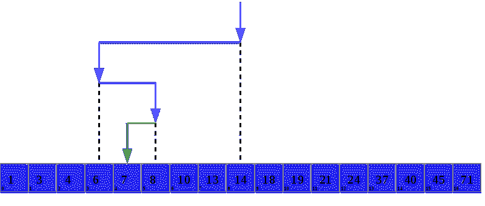
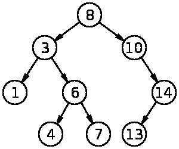

# 八、探索搜索选项

与排序一样，搜索也是编程界最常用的算法之一。无论我们是在搜索电话簿、电子邮件、数据库还是文件，我们实际上都在执行某种搜索技术来定位我们希望找到的项目。搜索和排序是编程的两个最重要的组成部分。在本章中，您将了解不同的搜索技术及其效率。我们还将学习搜索树数据结构的不同方法。

# 线性搜索

执行搜索的最常见方法之一是将每个项目与我们正在查找的项目进行比较。这称为线性搜索或顺序搜索。这是执行搜索的最基本方式。如果我们考虑在列表中有 n 个 T1 项，在最坏的情况下，我们必须搜索 SoT T2n n 个 T3 项来找到一个特定的项。我们可以遍历列表或数组来查找项。让我们考虑下面的例子：

```php
function search(array $numbers, int $needle): bool {
    $totalItems = count($numbers);

    for ($i = 0; $i < $totalItems; $i++) {
      if($numbers[$i] === $needle){
        return TRUE;
      }
     }
    return FALSE;
}

```

我们有一个名为`search`的函数，它接受两个参数。一个是数字列表，另一个是我们在列表中寻找的数字。我们正在运行 for 循环来迭代列表中的每个项目，并将它们与我们的项目进行比较。如果找到匹配项，则返回 true，不继续搜索。但是，如果循环结束时未找到任何内容，则在函数定义的末尾返回 false。让我们使用`search`函数通过以下程序查找：

```php
$numbers = range(1, 200, 5); 

if (search($numbers, 31)) { 
    echo "Found"; 
} else { 
    echo "Not found"; 
}

```

这里，我们使用 PHP 的内置函数范围生成一个随机数组，范围为 1 到 200（包括 1 到 200）。每个项目将有 5 个间隙，如 1、6、11、16 等；然后我们搜索 31，它在列表中，我们有 6、11、16、21、26、31 等等。但是，如果我们要搜索 32 或 33，则无法找到该项目。因此，对于这种情况，我们的输出将是`Found`。

我们需要记住的一件事是，我们并不担心我们的列表是否按特定顺序排列或以某种方式组织。如果我们正在寻找的项目是在第一个位置，这将是最好的结果。最坏的结果可能是最后一项或不在列表中的项。在这两种情况下，我们都必须迭代列表中的所有*n*项。以下是线性/顺序搜索的复杂性：

| 最佳时间复杂度 | `O(1)` |
| 最坏时间复杂度 | `O(n)` |
| 平均时间复杂度 | `O(n)` |
| 空间复杂性（最坏情况） | `O(1)` |

正如我们所见，线性搜索的平均或最差时间复杂度为`O(n)`，这不会改变我们对项目列表的排序方式。现在，如果数组中的项目按特定顺序排序，那么我们可能不必进行线性搜索，通过进行选择性或计算性搜索，我们可以得到更好的结果。最流行和最著名的搜索算法是“二进制搜索”。是的，这听起来像你在[第 6 章](06.html)*理解和实现树*中学习的二元搜索树，但是我们可以使用这个算法，甚至不用构建二元搜索树。那么，让我们来探讨一下。

# 二进制搜索

二进制搜索是编程界非常流行的搜索算法。在顺序搜索中，我们从头开始，扫描每个项目以找到所需的项目。但是，如果列表已经排序，则不需要从列表的开头或结尾进行搜索。在二元搜索算法中，我们从列表中间开始，检查中间项目是否小于或大于我们正在寻找的项目，并决定走哪条路。这样，我们将列表除以一半，然后完全丢弃一半，如下图所示：



如果我们看前面的图像，我们有一个数组中已排序（升序）的数字列表。我们想知道**7**项是否在数组中。由于数组有 17 个项（0 到 16 个索引），我们将首先转到中间索引，这是本例中的第八个索引。现在，第八个索引的值为**14**，大于我们正在搜索的值**7**。这意味着，如果此数组中存在**7**，则它位于**14**的左侧，因为数字已经排序。因此，我们从第八个索引到第十六个索引丢弃数组，因为数字不能在数组的该部分。现在，我们重复同样的过程，取数组剩余部分的中间部分，即剩余部分的第三个元素。现在，第三个元素的值为**6**，小于**7**。因此，我们要查找的项目位于第三个元素的右侧，而不是左侧。

现在，我们将检查数组的第四个元素到第七个元素，中间的元素现在指向第五个元素。第五个元素值是**8**，比我们要找的**7**还要多。所以，我们必须考虑第五元素的左手边来寻找我们正在寻找的物品。这一次，我们只剩下两项供数组检查，元素是第四和第五个元素。当我们向左移动时，我们将检查第四个元素，我们将看到该值与我们正在查找的**7**匹配。如果第四个索引值不是**7**，函数将返回 false，因为没有更多的元素可供检查。如果我们查看上图中的箭头标记，我们可以看到在四个步骤中，我们找到了我们要查找的值，而在最坏情况下，我们必须采取 17 个步骤来检查线性搜索函数中的所有 17 个数字。这称为二进制搜索、半间隔搜索或对数搜索。

正如我们在上一张图片中所看到的，我们必须将最初的列表分成两半，然后继续，直到我们达到无法再进一步划分以找到我们的项目的地步。我们可以使用迭代方式或递归方式来执行除法部分。实际上，我们将使用这两种方法。首先，让我们以迭代的方式定义二进制搜索的伪代码：

```php
BinarySearch(A : list of sorted items, value) { 
       low = 0 
       high = N
       while (low <= high) { 
    // lowest int value, no fraction 
           mid = (low + high) / 2              
           if (A[mid] > value) 
               high = mid - 1 
           else if (A[mid] < value) 
               low = mid + 1 
           else  
             return true 
       }
       return false 
 }

```

如果我们查看伪代码，我们可以看到我们正在根据中值调整我们的下限和上限。如果我们所寻找的值大于中间值，我们将下限调整为`mid+1`。如果小于中间值，则我们将较高的值设置为`mid-1`。它将继续，直到较低的值大于较高的值或找到项目为止。如果未找到该项，则在函数末尾返回 false。现在，让我们使用 PHP 实现伪代码：

```php
function binarySearch(array $numbers, int $needle): bool { 
    $low = 0; 
    $high = count($numbers) - 1; 
    while ($low <= $high) { 
      $mid = (int) (($low + $high) / 2); 

      if ($numbers[$mid] > $needle) { 
          $high = $mid - 1;
      } else if ($numbers[$mid] < $needle) { 
          $low = $mid + 1;
      } else {
          return TRUE;
      }
    }
    return FALSE; 
}

```

在我们的实现中，我们遵循了上一页中的大部分伪代码。现在，让我们通过两次搜索运行代码，其中一个值在列表中，另一个不在列表中：

```php
$numbers = range(1, 200, 5); 

$number = 31;
if (binarySearch($numbers, $number) !== FALSE) { 
    echo "$number Found \n"; 
} else { 
    echo "$number Not found \n"; 
} 

$number = 500; 
if (binarySearch($numbers, $number) !== FALSE) { 
    echo "$number Found \n"; 
} else { 
    echo "$number Not found \n"; 
} 

```

我们从前面的线性搜索代码中知道，`31`在列表中，它应该显示`Found`。但是，`500`不在列表中，应该显示`Not found`。如果我们运行代码，下面是我们将在控制台中看到的输出：

```php
31 Found
500 Not found

```

现在我们将编写二进制搜索的递归算法，这对我们来说也很方便。伪代码将要求我们在每次调用函数时发送额外的参数。我们需要在每次递归调用中发送低和高，而在迭代调用中我们没有这样做：

```php
BinarySearch(A : list of sorted items, value, low, high) { 

   if (high < low) 
          return false 

      // lowest int value, no fraction 
           mid = (low + high) / 2   

           if (A[mid] > value) 
               return BinarySearch(A, value, low, mid - 1) 
           else if (A[mid] < value) 
               return BinarySearch(A, value, mid + 1, high)  
     else 
      return TRUE;      
}

```

我们可以从前面的伪代码中看到，我们现在使用 low 和 high 作为参数，并且在每个调用中，新值都作为参数发送。我们有一个边界条件，在这里我们检查低值是否大于高值。与迭代代码相比，该代码看起来更小更干净。现在，让我们使用 PHP7 实现这一点：

```php
function binarySearch(array $numbers, int $needle,  
int $low, int $high): bool { 

    if ($high < $low) { 
    return FALSE; 
    } 

    $mid = (int) (($low + $high) / 2); 

    if ($numbers[$mid] > $needle) { 
      return binarySearch($numbers, $needle, $low, $mid - 1); 
    } else if ($numbers[$mid] < $needle) { 
      return binarySearch($numbers, $needle, $mid + 1, $high); 
    } else { 
      return TRUE; 
    } 
}

```

现在，让我们使用以下代码以递归方式运行此搜索：

```php
$numbers = range(1, 200, 5); 

$number = 31; 
if (binarySearch($numbers, $number, 0, count($numbers) - 1) !== FALSE) { 
    echo "$number Found \n"; 
} else { 
    echo "$number Not found \n"; 
} 

$number = 500; 
if (binarySearch($numbers, $number, 0, count($numbers) - 1) !== FALSE) { 
    echo "$number Found \n"; 
} else { 
    echo "$number Not found \n"; 
}

```

从前面的代码可以看出，我们第一次在递归二进制搜索的每次调用中发送了`0`和`count($numbers)-1`。然后，根据中间值在每次递归调用时自动调整该上限和下限。因此，我们已经看到了二进制搜索的迭代和递归实现。根据我们的需要，我们可以在我们的程序中使用其中任何一个。现在，让我们分析二进制搜索算法，找出它比线性或顺序搜索算法更好的地方。

# 二进制搜索算法分析

到目前为止，我们已经看到，对于每一次迭代，我们将列表除以一半，然后完全丢弃一半以进行搜索。这使得我们的列表分别经过 1、2 和 3 次迭代后看起来像*n/2*、*n/4*、*n/8*等等。所以我们可以说在第 k 次迭代之后，*n/2<sup>k</sup>*项将被留下。我们可以很容易地说，最后一次迭代发生在*n/2<sup>k</sup>=1*时，或者我们可以说，*2<sup>k</sup>=n*时。因此，从两侧获取 log 得到，*k=log（n）*，这是二进制搜索算法的最坏运行时间。以下是二进制搜索算法的复杂性：

| 最佳时间复杂度 | `O(1)` |
| 最坏时间复杂度 | `O(log n)` |
| 平均时间复杂度 | `O(log n)` |
| 空间复杂性（最坏情况） | `O(1)` |

如果我们的数组或列表已经排序，则最好应用二进制搜索以获得更好的性能。现在，不管列表是按升序还是降序排序，它都会对我们的高低计算产生一些影响。到目前为止，我们所看到的逻辑是关于升序的。如果数组按降序排序，则逻辑将在大于变为小于的位置进行交换，反之亦然。这里需要注意的一点是，二进制搜索算法为我们提供了搜索项的索引。但是，在某些情况下，我们不仅需要知道该数字是否存在，还需要在列表中查找第一次出现或最后一次出现。如果我们使用二进制搜索算法，那么它将返回 true 或最大索引数，搜索算法在其中找到该数字。但是，它可能不是第一次出现或最后一次出现。为此，我们将对二进制搜索算法进行一些修改，我们称之为重复二进制搜索树算法。

# 重复二叉搜索树算法

考虑下面的图像。我们有一个重复项目的数组。如果我们试图从数组中找到第一个出现的**2**，那么最后一节中的二进制搜索算法将给出第五个元素。然而，从下面的图像中，我们可以清楚地看到它不是第五个元素；相反，它是第二个元素，这是正确的答案。因此，需要对二进制搜索算法进行修改。修改将是一次重复搜索，直到我们达到第一次外观：


以下是使用迭代方法修改的解决方案：

```php
function repetitiveBinarySearch(array $numbers, int $needle): int { 
    $low = 0;
    $high = count($numbers) - 1;
    $firstOccurrence = -1;

    while ($low <= $high) { 
      $mid = (int) (($low + $high) / 2); 

      if ($numbers[$mid] === $needle) { 
          $firstOccurrence = $mid; 
          $high = $mid - 1; 
      } else if ($numbers[$mid] > $needle) { 
          $high = $mid - 1;
      } else {
          $low = $mid + 1;
      } 
    } 
    return $firstOccurrence; 
} 

```

正如我们所看到的，首先我们要检查 mid 是否具有我们正在寻找的值。如果为 true，则将中间索引指定为第一个匹配项，并搜索中间元素的左侧，以检查所查找的数字是否出现。然后我们继续迭代，直到我们搜索了每个索引（`$low`大于`$high`。如果没有找到进一步的匹配项，那么变量 first occurrence 将具有我们找到该项的第一个索引的值。如果没有，我们将照常返回`-1`。让我们运行以下代码来检查结果是否正确：

```php
$numbers = [1, 2, 2, 2, 2, 2, 2, 2, 2, 3, 3, 3, 3, 3, 4, 4, 5, 5]; 

$number = 2; 

$pos = repetitiveBinarySearch($numbers, $number); 

if ($pos >= 0) { 
    echo "$number Found at position $pos \n"; 
} else { 
    echo "$number Not found \n"; 
} 

$number = 5; 
$pos = repetitiveBinarySearch($numbers, $number); 

if ($pos >= 0) { 
    echo "$number Found at position $pos \n"; 
} else { 
    echo "$number Not found \n"; 
}

```

现在，我们有一个重复值为 2、3、4 和 5 的数组。我们希望搜索数组并找到值第一次出现的位置或索引。例如，如果我们在常规二进制搜索函数中搜索`2`，它将返回第八个位置作为找到值`2`的位置。在我们的例子中，我们实际上是在寻找第二个索引，它实际上保存了`2`项的第一个外观。我们的函数`repetitiveBinarySearch`正是这样做的，我们将返回位置存储到一个名为`$pos`的变量中。如果找到了数字和位置，我们将显示输出。现在，如果我们在控制台中运行前面的代码，我们将获得以下输出：

```php
2 Found at position 1
5 Found at position 16

```

这符合我们的预期结果。所以，我们可以说，我们现在有一个重复的二进制搜索算法，从给定的排序列表中查找项目的第一次和最后一次出现。这可能是解决许多问题的一个非常方便的函数。

到目前为止，通过我们的示例和分析，我们可以得出结论，二进制搜索肯定比线性搜索快。然而，主要的先决条件是在应用二进制搜索之前对列表进行排序。在未排序的数组中应用二进制搜索将导致不准确的结果。在某些情况下，我们接收到一个数组，但不确定该数组是否已排序。现在，问题是，“我们应该首先对数组进行排序并在这种情况下应用二进制搜索算法吗？还是应该运行线性搜索算法来查找项目？”让我们稍微讨论一下，以便我们知道如何处理这种情况。

# 搜索未排序的数组-我们应该先排序吗？

所以现在，我们处于这样一种情况：我们有一个包含*n*项的数组，它们没有被排序。因为我们知道二进制搜索速度更快，所以我们决定先对其进行排序，然后使用二进制搜索来搜索项目。如果我们这样做，我们必须记住，最好的排序算法的最坏时间复杂度为`O(nlog n)`，而对于二进制搜索，最坏情况复杂度为`O(log n)`。因此，如果我们进行排序，然后应用二进制搜索，复杂性将是`O(n log n)`，因为它是与`O(log n)`相比最大的一个。然而，我们也知道，对于任何线性或顺序搜索（排序或未排序），最糟糕的时间复杂度是`O(n)`，这比`O(n log n)`要好得多。根据`O(n)`和`O(n log n)`的复杂性比较，我们可以清楚地说，如果数组未排序，则执行线性搜索是更好的选择。

让我们考虑另一种情况，我们需要搜索一个给定数组的次数。让我们将*k*表示为要搜索数组的次数。如果*k*是 1，那么我们可以很容易地应用上一段中讨论的线性方法。如果*k*的值比数组的大小小，则可以，数组的大小由*n*表示。但是，如果*k*的值更接近或大于*n*，那么我们在这里应用线性方法时会遇到一些问题。

假设*k=n*，那么对于*n*时间，线性搜索的复杂度为`O(n<sup>2</sup>)`。现在，如果我们选择排序然后搜索选项，那么即使*k*更大，一次性排序也需要`O(n log n)`时间复杂度。然后，每次搜索将花费`O(log n)`，并且*n*次搜索将具有`O(n log n)`复杂度的最坏情况。如果我们在这里选择最坏的运行情况，我们将有`O(n log n)`用于排序和搜索*k*项，这比顺序搜索要好。

因此，我们可以得出结论，如果与数组大小相比，搜索操作的数量较小，则最好不要对数组进行排序并执行顺序搜索。但是，如果搜索操作的数量大于数组的大小，则最好先对数组排序，然后应用二进制搜索。

多年来，二进制搜索算法不断发展，出现了不同的变化。我们不必每次都选择中间的索引，而是可以通过计算来决定下一步应该使用哪个索引。这就是使这些变体高效工作的原因。现在我们将讨论二进制搜索算法的两种变体：插值搜索和指数搜索。

# 插值搜索

在二进制搜索算法中，我们总是从数组的中间开始搜索过程。如果一个数组是均匀分布的，并且我们正在寻找一个可能靠近数组末尾的项，那么从中间搜索对我们来说可能不是一个好的选择。插值搜索在这种情况下非常有用。插值搜索是对二进制搜索算法的改进。插值搜索可以根据搜索键的值转到不同的位置。例如，如果我们正在搜索靠近数组开头的键，它将转到数组的第一部分，而不是从中间开始。使用探针位置计算器方程计算位置，如下所示：

```php
pos = low + [ (key-arr[low])*(high-low) / (arr[high]-arr[low]) ]

```

正如我们所看到的，我们正在从一般的`mid = (low+high)/2`方程转向更复杂的方程。如果搜索的键更接近`arr[high]`，该公式将返回一个更高的值，如果搜索的键更接近`arr[low]`，该公式将返回一个更低的值。现在，让我们借助二进制搜索代码实现此搜索方法：

```php
function interpolationSearch(array $arr, int $key): int { 
    $low = 0; 
    $high = count($arr) - 1; 

    while ($arr[$high] != $arr[$low] && $key >= $arr[$low] && 
      $key <= $arr[$high]) { 

    $mid = intval($low + (($key - $arr[$low]) * ($high - $low) 
    / ($arr[$high] - $arr[$low]))); 

      if ($arr[$mid] < $key) 
          $low = $mid + 1; 
      else if ($key < $arr[$mid]) 
          $high = $mid - 1; 
      else 
          return $mid; 
    } 

    if ($key == $arr[$low]) 
      return $low; 
    else
      return -1; 
}

```

在这里，我们以不同的方式计算。虽然它需要更多的计算步骤，但好处在于如果列表是均匀分布的，那么该算法的平均复杂度为`O(log (log n))`，这比二进制搜索的复杂度`O(log n)`要好得多。此外，如果密钥的分布不均匀，我们必须小心。在这种情况下，插值搜索的性能可能会降低。

现在，我们将探索另一种称为指数搜索的二进制搜索变体，它可以改进算法。

# 指数搜索

在二进制搜索中，我们在整个列表中搜索给定的密钥。指数搜索通过确定搜索的上下限来改进二进制搜索，这样我们就不会搜索整个列表。它提高了查找元素所需的比较次数。通过以下两个步骤完成搜索：

1.  我们通过查找第一个指数*k*来确定边界大小，其中*2<sup>k</sup>*的值大于搜索项。现在，*2<sup>k</sup>*和*2<sup>k-1</sup>*分别成为上限和下限。
2.  对边界*2<sup>k</sup>*和*2<sup>k-1</sup>*应用二进制搜索算法。

现在让我们使用递归`binarySearch`函数实现指数搜索：

```php
function exponentialSearch(array $arr, int $key): int { 
    $size = count($arr); 

    if ($size == 0) 
      return -1; 

    $bound = 1; 
    while ($bound < $size && $arr[$bound] < $key) { 
      $bound *= 2; 
    } 
    return binarySearch($arr, $key, intval($bound / 2),  
min($bound, $size)); 
}

```

这里，在第一步中，我们正在采取*i*步骤来确定边界。因此，该算法需要`O(log i)`复杂度。我们必须记住这里，*i*比*n*小得多。然后，我们用*2<sup>j</sup>*到*2<sup>j-1</sup>*进行二元搜索，其中*j=log i*。我们知道二进制搜索需要`O(log n)`复杂度，其中*n*是列表的大小。但是，由于我们正在进行较小的边界搜索，因此实际上我们正在搜索*2<sup>log i</sup>-2<sup>log i</sup>-1=2<sup>log i-1</sup>*大小。因此，这个界限的复杂性将是 log*（2<sup>log i-1</sup>）=log（i）-1=O（log i）*。

因此，指数搜索的复杂性如下所示：

| 最佳时间复杂度 | `O(1)` |
| 最坏时间复杂度 | `O(log i)` |
| 平均时间复杂度 | `O(log i)` |
| 空间复杂性（最坏情况） | `O(1)` |

# 使用哈希表进行搜索

当涉及到搜索操作时，哈希表是一种非常有效的数据结构。由于哈希表以关联的方式存储数据，如果我们知道在哪里查找数据，我们可以轻松快速地获取数据。在哈希表中，每个数据都有一个与之关联的唯一索引。如果我们知道要查看哪个索引，就可以很容易地找到键。通常，在其他编程语言中，我们必须使用单独的哈希函数来计算哈希索引以存储值。哈希函数用于为同一个键生成相同的索引，并避免冲突。然而，PHP 的一个重要特性是 PHP 数组本身在其底层 C 实现中是一个哈希表。因为数组是动态的，所以我们不必担心数组的大小，也不必担心具有许多值的溢出数组。我们需要将值存储在关联数组中，以便将值与键关联。如果键是字符串或整数，则它可以是值本身。让我们运行一个示例来了解使用哈希表进行搜索：

```php
$arr = [];
$count = rand(10, 30); 

for($i = 0; $i<$count;$i++) {     
    $val = rand(1,500);     
    $arr[$val] = $val;     
} 

$number = 100; 
if(isset($arr[$number])) { 
    echo "$number found "; 
} else { 
    echo "$number not found"; 
}

```

我们刚刚构建了一个简单的随机关联数组，其中值和键是相同的。由于我们使用的是 PHP 数组，虽然值的范围可以是 1 到 500，但实际的数组大小是 10 到 30。如果它是用任何其他语言编写的，我们将构造一个大小为 501 的数组，以将该值作为键。这就是为什么使用哈希函数来计算索引。如果需要，我们还可以使用 PHP 的内置函数进行哈希：

```php
string hash(string $algo ,string $data [,bool $raw_output = false ])

```

第一个参数采用我们希望用于散列的算法类型。我们可以从 md5、sha1、sha256、crc32 等中进行选择。每种算法都产生一个固定长度的散列输出，我们可以将其用作散列表的键。

如果我们查看搜索部分，我们可以看到实际上我们正在直接检查关联的索引。这使得我们的搜索变得非常复杂。在 PHP 中，即使不使用哈希函数，也可以使用哈希表进行快速搜索。然而，如果我们愿意，我们总是可以使用哈希函数。

到目前为止，我们已经介绍了基于阵列和线性结构的搜索。现在，我们将重点转移到分层数据结构搜索，例如搜索树和图。虽然我们还没有讨论图（我们将在下一章中讨论它们），但我们将继续关注树搜索，它也可以应用于图搜索。

# 树木搜索

搜索分层数据的最佳方法之一是创建搜索树。在[第 6 章](06.html)*理解和实现树*中，我们了解了如何构建二叉搜索树并提高搜索效率。我们还发现了穿越树木的不同方法。现在，我们将探讨两种最流行的搜索树结构的方法，通常称为广度优先搜索（BFS）和深度优先搜索（DFS）。

# 广度优先搜索

在树结构中，根连接到其子节点，每个子节点都可以表示为一棵树。我们已经在[第 6 章](06.html)*理解和实现树*中看到了这一点。在广度优先搜索（通常称为 BFS）中，我们从一个节点（主要是根节点）开始，首先访问所有相邻节点或邻居节点，然后再访问其他邻居节点。换句话说，在应用 BFS 时，我们必须逐级移动。当我们逐级搜索时，这种技术被称为广度优先搜索。在以下树结构中，我们可以使用 BFS：


对于该树，BFS 将遵循如下节点：

BFS 的伪代码如下所示：

```php
procedure BFS(Node root)  
  Q := empty queue 
  Q.enqueue(root); 

  while(Q != empty) 
     u := Q.dequeue() 

     for each node w that is childnode of u 
        Q.enqueue(w) 
     end for each 
  end while 
end procedure

```

我们可以看到，我们保留了一个队列，用于跟踪需要访问的节点。我们可以保留另一个队列来保存访问序列，并返回它以显示访问序列。现在，我们将使用 PHP7 实现 BFS。

# 实现广度优先搜索

由于到目前为止我们还没有详细讨论这个图，我们将严格按照树结构来实现 BFS 和 DFS。此外，我们将使用我们在[第 6 章](06.html)、*理解和实现树*（甚至不是二叉树）中看到的通用树结构。我们将使用相同的`TreeNode`类来定义我们的节点以及与子节点的关系。现在，让我们定义具有 BFS 功能的`Tree`类：

```php
class TreeNode { 

    public $data = NULL; 
    public $children = []; 

    public function __construct(string $data = NULL) { 
      $this->data = $data; 
    } 

    public function addChildren(TreeNode $node) { 
      $this->children[] = $node; 
    } 
} 

class Tree { 

    public $root = NULL; 

    public function __construct(TreeNode $node) { 
      $this->root = $node; 
    } 

    public function BFS(TreeNode $node): SplQueue { 

      $queue = new SplQueue; 
      $visited = new SplQueue; 

      $queue->enqueue($node); 

      while (!$queue->isEmpty()) { 
          $current = $queue->dequeue(); 
          $visited->enqueue($current); 

          foreach ($current->children as $child) { 
            $queue->enqueue($child); 
          } 
      } 
    return $visited; 
    }
}

```

我们已经在树类中实现了 BFS 方法。我们将根节点作为广度优先搜索的起点。在这里，我们有两个队列：一个用于保存我们需要访问的节点，另一个用于我们已经访问的节点。我们还在方法末尾返回已访问的队列。现在让我们模仿本节开头看到的树。我们想把数据就像图中显示的树一样放进去，同时还要检查 BFS 是否真的返回了我们预期的模式；：

```php
    $root = new TreeNode("8"); 

    $tree = new Tree($root); 

    $node1 = new TreeNode("3"); 
    $node2 = new TreeNode("10"); 
    $root->addChildren($node1); 
    $root->addChildren($node2); 

    $node3 = new TreeNode("1"); 
    $node4 = new TreeNode("6"); 
    $node5 = new TreeNode("14"); 
    $node1->addChildren($node3); 
    $node1->addChildren($node4); 
    $node2->addChildren($node5); 

    $node6 = new TreeNode("4"); 
    $node7 = new TreeNode("7"); 
    $node8 = new TreeNode("13"); 
    $node4->addChildren($node6); 
    $node4->addChildren($node7); 
    $node5->addChildren($node8); 

    $visited = $tree->BFS($tree->root); 

    while (!$visited->isEmpty()) { 
      echo $visited->dequeue()->data . "\n"; 
    } 

```

我们在这里通过创建节点并将它们附加到根节点和其他节点来构建整个树结构。完成树之后，我们将调用`BFS`方法来查找遍历的完整序列。最后的`while`循环是打印我们访问的节点的序列。以下是前面代码的输出：

```php
8
3
10
1
6
14
4
7
13

```

我们已经收到了预期的结果。现在，如果我们想搜索节点是否存在，我们可以为`$current`节点值添加一个简单的条件检查。如果匹配，那么我们可以返回已访问的队列。

BFS 的最复杂度为**O**（*| V |+E |*），其中*V*是顶点或节点的数量，*E*是节点之间的边或连接的数量。对于空间复杂度，最坏的情况是**O**（*【V】*。

The graph BFS is similar, but with a minor difference. Since the graph can be cyclic (can create a loop), we need to make sure we are not visiting the same node again and again to create an infinite loop. In order to avoid revisiting graph nodes, we have to keep track of the node we have visited. For marking a visited node, we can either use a queue, or use a graph coloring algorithm. We will explore this in the next chapter.

# 深度优先搜索

深度优先搜索（DFS）是一种搜索技术，我们从节点开始搜索，然后通过分支从目标节点尽可能深入到节点。DFS 不同于 BFS，我们尝试深入挖掘，而不是首先展开。DFS 垂直增长并在到达分支末端时回溯，并移动下一个可用的相邻节点，直到搜索结束。我们可以从上一节中获取相同的树图像，如下所示：



如果我们在这里应用 DFS，则遍历将是。我们从根开始，然后访问第一个孩子，即**3**。但是，我们将探索**3**的子节点，并重复此操作，直到到达分支的底部，而不是像 BFS 一样去**10**。在 BFS 中，我们采用了迭代方法。对于 DFS，我们将采用递归方法。现在让我们为 DFS 编写伪代码：

```php
procedure DFS(Node current)       
     for each node v that is childnode of current  
        DFS(v) 
     end for each 
end procedure 

```

# 实现深度优先搜索

DFS 的伪代码看起来很简单。为了跟踪节点访问的顺序，我们需要使用一个队列来跟踪`Tree`类中的节点。下面是我们使用递归 DFS 实现的`Tree`类：

```php
class TreeNode { 

    public $data = NULL; 
    public $children = []; 

    public function __construct(string $data = NULL) { 
      $this->data = $data; 
    } 

    public function addChildren(TreeNode $node) { 
      $this->children[] = $node; 
    } 
} 

class Tree { 

    public $root = NULL; 
    public $visited; 

    public function __construct(TreeNode $node) { 
      $this->root = $node; 
      $this->visited = new SplQueue; 
    } 

    public function DFS(TreeNode $node) { 

      $this->visited->enqueue($node); 

      if($node->children){ 
          foreach ($node->children as $child) { 
        $this->DFS($child); 
          } 
      } 

    }
}

```

如我们所见，我们在树类`$visited`中添加了一个额外的属性来跟踪访问的节点。当我们调用`DFS`方法时，我们正在将节点添加到队列中。现在，如果我们使用上一节中相同的树结构，只需添加 DFS 调用并获取访问的部分，它将如下所示：

```php
try { 

    $root = new TreeNode("8"); 

    $tree = new Tree($root); 

    $node1 = new TreeNode("3"); 
    $node2 = new TreeNode("10"); 
    $root->addChildren($node1); 
    $root->addChildren($node2); 

    $node3 = new TreeNode("1"); 
    $node4 = new TreeNode("6"); 
    $node5 = new TreeNode("14"); 
    $node1->addChildren($node3); 
    $node1->addChildren($node4); 
    $node2->addChildren($node5); 

    $node6 = new TreeNode("4"); 
    $node7 = new TreeNode("7"); 
    $node8 = new TreeNode("13"); 
    $node4->addChildren($node6); 
    $node4->addChildren($node7); 
    $node5->addChildren($node8); 

    $tree->DFS($tree->root); 

    $visited = $tree->visited; 
    while (!$visited->isEmpty()) { 
      echo $visited->dequeue()->data . "\n"; 
    } 
} catch (Exception $e) { 
    echo $e->getMessage(); 
}

```

由于 DFS 不返回任何内容，因此我们使用类属性`visited`获取队列，以便显示访问节点的顺序。如果我们在控制台中运行此程序，我们将有以下输出：

```php
8
3
1
6
4
7
10
14
13

```

结果与预期相符。如果我们需要 DFS 的迭代解决方案，我们必须记住，我们需要使用栈而不是队列来跟踪下一个要访问的节点。然而，由于栈遵循后进先出原则，对于我们提到的图形图像，输出将与我们最初的想法不同。以下是使用迭代方法的实现：

```php
class TreeNode { 
    public $data = NULL; 
    public $children = []; 

    public function __construct(string $data = NULL) { 
      $this->data = $data; 
    } 

    public function addChildren(TreeNode $node) { 
      $this->children[] = $node; 
    } 

} 

class Tree { 
    public $root = NULL; 

    public function __construct(TreeNode $node) { 
      $this->root = $node; 
    }

    public function DFS(TreeNode $node): SplQueue { 

      $stack = new SplStack;
      $visited = new SplQueue;

      $stack->push($node);

      while (!$stack->isEmpty()) { 
          $current = $stack->pop(); 
          $visited->enqueue($current); 
          foreach ($current->children as $child) { 
            $stack->push($child); 
          } 
      } 
      return $visited; 
    }
}

try {

    $root = new TreeNode("8"); 
    $tree = new Tree($root); 

    $node1 = new TreeNode("3"); 
    $node2 = new TreeNode("10"); 
    $root->addChildren($node1); 
    $root->addChildren($node2); 

    $node3 = new TreeNode("1"); 
    $node4 = new TreeNode("6"); 
    $node5 = new TreeNode("14"); 
    $node1->addChildren($node3); 
    $node1->addChildren($node4); 
    $node2->addChildren($node5); 

    $node6 = new TreeNode("4"); 
    $node7 = new TreeNode("7"); 
    $node8 = new TreeNode("13"); 
    $node4->addChildren($node6); 
    $node4->addChildren($node7); 
    $node5->addChildren($node8); 

    $visited = $tree->DFS($tree->root); 

    while (!$visited->isEmpty()) { 
      echo $visited->dequeue()->data . "\n"; 
    } 
} catch (Exception $e) { 
    echo $e->getMessage(); 
}

```

它看起来非常类似于我们的迭代 BFS 算法。主要区别在于使用栈数据结构而不是队列数据结构来存储访问的节点。这也将对产出产生影响。前面的代码将产生输出`8 → 10 → 14 → 13 → 3 → 6 → 7 → 4 → 1`。这与上一节中显示的先前输出不同。当我们使用栈时，输出实际上是正确的。我们使用栈推送特定节点的子节点。对于值为**8**的根节点，我们有值为**3**的第一个子节点。将其推送到栈中，然后 root 的第二个子节点的值为**10**并被推送到栈中。由于**10**值是最后一次推送的，所以它将首先推送，遵循栈的后进先出原则。所以，如果我们使用栈，排序总是从最后一个分支开始，到第一个分支。然而，如果我们想保持节点从左到右的顺序，那么我们需要在 DFS 代码中做一些小的调整。以下是带有更改的代码块：

```php
public function DFS(TreeNode $node): SplQueue { 

  $stack = new SplStack; 
  $visited = new SplQueue;

  $stack->push($node); 

  while (!$stack->isEmpty()) { 
      $current = $stack->pop(); 
      $visited->enqueue($current); 
      $current->children = array_reverse($current->children); 
      foreach ($current->children as $child) { 
        $stack->push($child); 
      } 
    } 
    return $visited;
}

```

与上一个代码块的唯一区别在于，我们在从特定节点访问子节点之前添加了以下行：

```php
$current->children = array_reverse($current->children);

```

由于栈通过反转执行后进先出（LIFO），所以我们要确保在反转顺序时首先访问第一个节点。事实上，它只是一个队列。这将产生所需的序列，如 DFS 部分所示。如果我们有一个二叉树，那么我们很容易做到这一点，而不需要任何反转，因为我们可以选择先推右边的子节点，然后是左边的子节点，以首先弹出左边的子节点。

DFS 的最差复杂度为**O**（*| V |+E |*，其中*V*是顶点或节点的数量，*E*是节点之间的边或连接的数量。就空间复杂度而言，最坏的情况是**O**（*【V】*，与 BFS 类似。

# 总结

在本章中，我们讨论了不同的搜索算法及其复杂性。您学习了如何使用哈希表改进搜索以获得恒定时间的结果。我们还探讨了 BFS 和 DFS 这两种最重要的分层数据搜索方法。我们将对图形数据结构使用类似的概念，我们将在下一章中对此进行探讨。图算法是解决许多问题的关键，在编程世界中被大量使用。让我们开始另一个有趣的话题——图表。