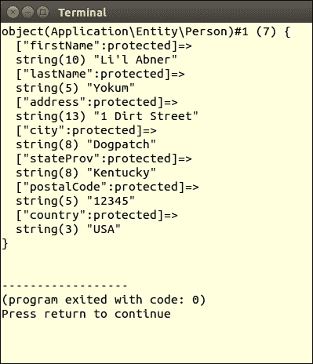
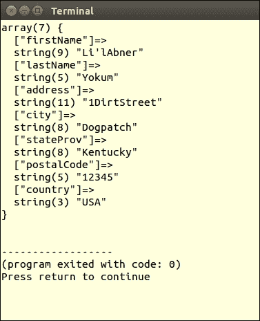
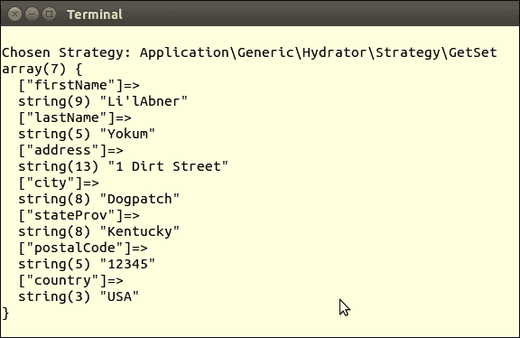
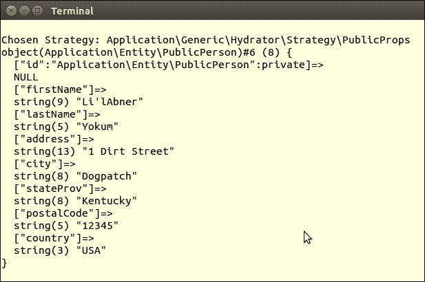
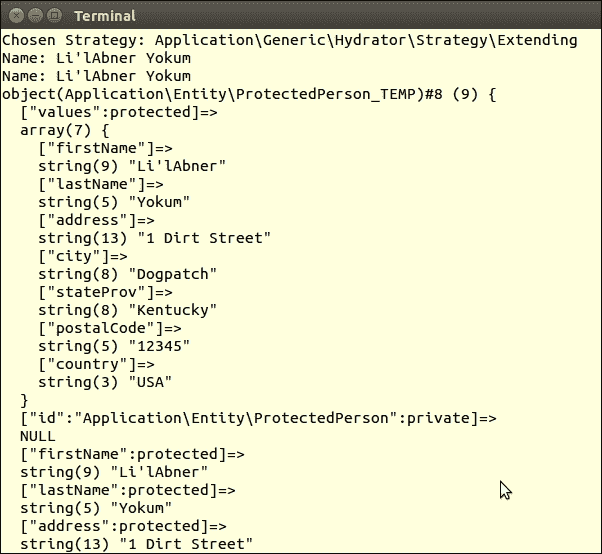
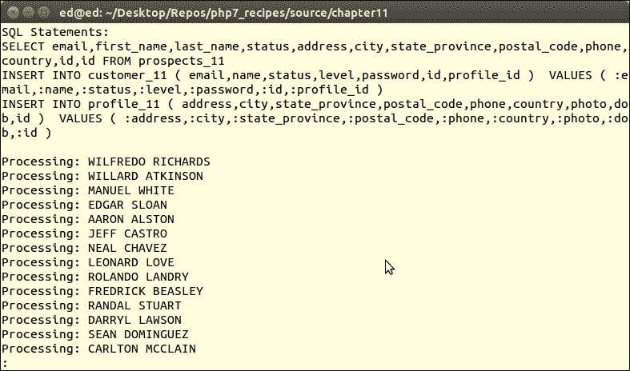
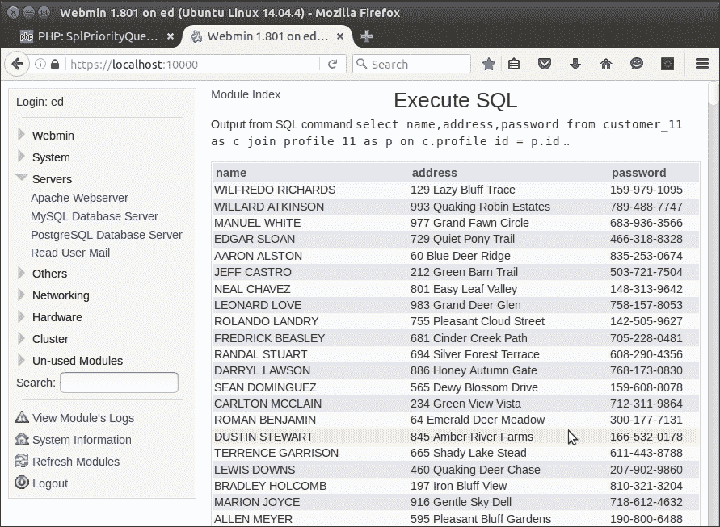
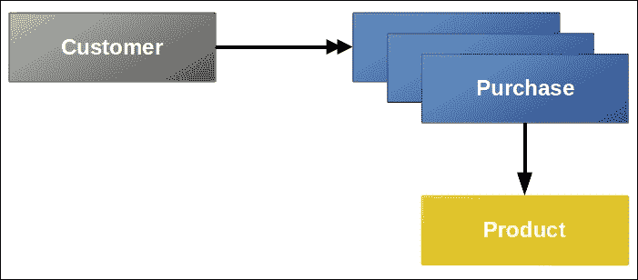
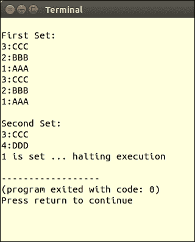

# 十一、实现软件设计模式

在本章中，我们将介绍以下主题：

*   创建指向对象的数组或
*   将对象构建到数组或
*   实施战略模式
*   定义映射器
*   实现对象关系映射
*   实现 Pub/Sub 设计模式

# 导言

将**软件设计模式**融入**面向对象编程**（**OOP**代码）的想法是在著名的四人帮（Gang of Four）撰写的一部名为*设计模式：可重用面向对象软件的元素*的开创性著作中首次讨论的（E.Gamma、R.Helm、R.Johnson 和 J.Vlissides）1994 年。这项工作既没有定义标准也没有定义协议，而是确定了多年来被证明有用的通用软件设计。本书中讨论的模式通常被认为分为三类：创造性、结构性和行为性。

本书中已经介绍了许多此类模式的示例。以下是一个简短的总结：

<colgroup><col style="text-align: left"> <col style="text-align: left"> <col style="text-align: left"></colgroup> 
| 

设计模式

 | 

章

 | 

配方

 |
| --- | --- | --- |
| 独生子女 | 2. | 定义可见性 |
| 工厂 | 6. | 实现表单工厂 |
| 适配器 | 8. | 不带`gettext()`的翻译处理 |
| 代理 | 7. | 创建一个简单的 REST 客户机创建一个简单的 SOAP 客户端 |
| 迭代器 | 2.3. | 递归目录迭代器使用迭代器 |

在本章中，我们将研究一些额外的设计模式，主要关注并发性和体系结构模式。

# 创建一个数组来创建对象或

**或**模式是**数据传输对象**设计模式的变体。它的设计原理非常简单：将数据从一个地方移动到另一个地方。在这个例子中，我们将定义类来将数据从数组移动到对象。

## 怎么做。。。

1.  首先，我们定义一个能够使用 getter 和 setter 的`Hydrator`类。对于本图，我们将使用`Application\Generic\Hydrator\GetSet`：

    ```php
    namespace Application\Generic\Hydrator;
    class GetSet
    {
      // code
    }
    ```

2.  接下来，我们定义一个`hydrate()`方法，它将数组和对象都作为参数。然后调用对象上的`setXXX()`方法，用数组中的值填充对象。我们使用`get_class()`确定对象的类，然后`get_class_methods()`得到所有方法的列表。`preg_match()`用于匹配方法前缀及其后缀，随后假定为数组键：

    ```php
    public static function hydrate(array $array, $object)
    {
      $class = get_class($object);
      $methodList = get_class_methods($class);
      foreach ($methodList as $method) {
        preg_match('/^(set)(.*?)$/i', $method, $matches);
        $prefix = $matches[1] ?? '';
        $key    = $matches[2] ?? '';
        $key    = strtolower(substr($key, 0, 1)) . substr($key, 1);
        if ($prefix == 'set' && !empty($array[$key])) {
            $object->$method($array[$key]);
        }
      }
      return $object;
    }
    ```

## 它是如何工作的。。。

为了演示如何使用数组或对象，首先定义*中描述的`Application\Generic\Hydrator\GetSet` 类。。。*部分。接下来，定义一个可用于测试概念的实体类。出于本说明的目的，请使用适当的属性和方法创建一个`Application\Entity\Person`类。确保为所有属性定义 getter 和 setter。并非所有此类方法都在此处显示：

```php
namespace Application\Entity;
class Person
{
  protected $firstName  = '';
  protected $lastName   = '';
  protected $address    = '';
  protected $city       = '';
  protected $stateProv  = '';
  protected $postalCode = '';
  protected $country    = '';

  public function getFirstName()
  {
    return $this->firstName;
  }

  public function setFirstName($firstName)
  {
    $this->firstName = $firstName;
  }

  // etc.
}
```

您现在可以创建一个名为`chap_11_array_to_object.php`的调用程序，该程序设置自动加载，使用适当的类：

```php
<?php
require __DIR__ . '/../Application/Autoload/Loader.php';
Application\Autoload\Loader::init(__DIR__ . '/..');
use Application\Entity\Person;
use Application\Generic\Hydrator\GetSet;
```

接下来，您可以定义一个测试数组，其中的值将添加到一个新的`Person`实例中：

```php
$a['firstName'] = 'Li\'l Abner';
$a['lastName']  = 'Yokum';
$a['address']   = '1 Dirt Street';
$a['city']      = 'Dogpatch';
$a['stateProv'] = 'Kentucky';
$a['postalCode']= '12345';
$a['country']   = 'USA';
```

您现在可以静态调用`hydrate()`和`extract()`：

```php
$b = GetSet::hydrate($a, new Person());
var_dump($b);
```

结果显示在以下屏幕截图中：



# 构建一个对象来创建一个数组或

此方法与*创建数组到对象或*方法相反。在这种情况下，我们需要从对象属性中提取值，并返回一个关联的数组，其中键将是列名。

## 怎么做。。。

1.  在本例中，我们将以前面配方中定义的`Application\Generic\Hydrator\GetSet`类为基础：

    ```php
    namespace Application\Generic\Hydrator;
    class GetSet
    {
      // code
    }
    ```

2.  After the `hydrate()` method defined in the previous recipe, we define an `extract()` method, which takes an object as an argument. The logic is similar to that used with `hydrate()`, except this time we're searching for `getXXX()` methods. Again, `preg_match()` is used to match the method prefix and its suffix, which is subsequently assumed to be the array key:

    ```php
    public static function extract($object)
    {
      $array = array();
      $class = get_class($object);
      $methodList = get_class_methods($class);
      foreach ($methodList as $method) {
        preg_match('/^(get)(.*?)$/i', $method, $matches);
        $prefix = $matches[1] ?? '';
        $key    = $matches[2] ?? '';
        $key    = strtolower(substr($key, 0, 1)) . substr($key, 1);
        if ($prefix == 'get') {
          $array[$key] = $object->$method();
        }
      }
      return $array;
    }
    }
    ```

    ### 注

    注意，为了方便起见，我们将`hydrate()`和`extract()`定义为静态方法。

## 它是如何工作的。。。

定义一个名为`chap_11_object_to_array.php`的调用程序，该程序设置自动加载，并使用适当的类：

```php
<?php
require __DIR__ . '/../Application/Autoload/Loader.php';
Application\Autoload\Loader::init(__DIR__ . '/..');
use Application\Entity\Person;
use Application\Generic\Hydrator\GetSet;
```

接下来，定义`Person`的一个实例，为其属性设置值：

```php
$obj = new Person();
$obj->setFirstName('Li\'lAbner');
$obj->setLastName('Yokum');
$obj->setAddress('1DirtStreet');
$obj->setCity('Dogpatch');
$obj->setStateProv('Kentucky');
$obj->setPostalCode('12345');
$obj->setCountry('USA');
```

最后，静态调用新的`extract()`方法：

```php
$a = GetSet::extract($obj);
var_dump($a);
```

输出如以下截图所示：



# 实施战略模式

通常情况下，运行时条件迫使开发人员定义几种做同一件事的方法。传统上，这涉及到大量的`if/elseif/else`命令块。然后，您必须在`if`语句中定义大型逻辑块，或者创建一系列函数或方法来启用不同的方法。strategy 模式试图通过让主类封装一系列表示解决同一问题的不同方法的子类来形式化这个过程。

## 怎么做。。。

1.  在本例中，我们将使用前面定义为策略的`GetSet`类。我们将定义一个主要的`Application\Generic\Hydrator\Any`类，然后该类将使用`Application\Generic\Hydrator\Strategy`命名空间中的策略类，包括`GetSet`、`PublicProps`和`Extending`。
2.  我们首先定义反映可用内置策略的类常量：

    ```php
    namespace Application\Generic\Hydrator;
    use InvalidArgumentException;
    use Application\Generic\Hydrator\Strategy\ { 
    GetSet, PublicProps, Extending };
    class Any
    {
      const STRATEGY_PUBLIC  = 'PublicProps';
      const STRATEGY_GET_SET = 'GetSet';
      const STRATEGY_EXTEND  = 'Extending';
      protected $strategies;
      public $chosen;
    ```

3.  然后我们定义一个构造函数，将所有内置策略添加到`$strategies`属性：

    ```php
    public function __construct()
    {
      $this->strategies[self::STRATEGY_GET_SET] = new GetSet();
      $this->strategies[self::STRATEGY_PUBLIC] = new PublicProps();
      $this->strategies[self::STRATEGY_EXTEND] = new Extending();
    }
    ```

4.  我们还添加了一个`addStrategy()`方法，该方法允许我们覆盖或添加新策略，而无需重新编码类：

    ```php
    public function addStrategy($key, HydratorInterface $strategy)
    {
      $this->strategies[$key] = $strategy;
    }
    ```

5.  `hydrate()`和`extract()`方法简单地调用所选策略的方法：

    ```php
    public function hydrate(array $array, $object)
    {
      $strategy = $this->chooseStrategy($object);
      $this->chosen = get_class($strategy);
      return $strategy::hydrate($array, $object);
    }

    public function extract($object)
    {
      $strategy = $this->chooseStrategy($object);
      $this->chosen = get_class($strategy);
      return $strategy::extract($object);
    }
    ```

6.  棘手的一点是要弄清楚应该选择哪种水合策略。为此，我们定义了`chooseStrategy()`，它将对象作为参数。我们首先通过获取类方法列表来执行一些检测工作。然后我们扫描列表，看看是否有任何`getXXX()`或`setXXX()`方法。如果是这样，我们选择`GetSet`或

    ```php
    public function chooseStrategy($object)
    {
      $strategy = NULL;
      $methodList = get_class_methods(get_class($object));
      if (!empty($methodList) && is_array($methodList)) {
          $getSet = FALSE;
          foreach ($methodList as $method) {
            if (preg_match('/^get|set.*$/i', $method)) {
                $strategy = $this->strategies[self::STRATEGY_GET_SET];
          break;
        }
      }
    }
    ```

    作为我们选择的策略
7.  仍然在我们的`chooseStrategy()`方法中，如果没有 getter 或 setter，我们接下来使用`get_class_vars()`来确定是否有任何可用的属性。如果是，我们选择`PublicProps`作为我们的水合器：

    ```php
    if (!$strategy) {
        $vars = get_class_vars(get_class($object));
        if (!empty($vars) && count($vars)) {
            $strategy = $this->strategies[self::STRATEGY_PUBLIC];
        }
    }
    ```

8.  如果所有其他操作都失败，我们将返回到`Extending`hydrator，它返回一个新类，该类仅扩展对象类，从而使任何`public`或`protected`属性可用：

    ```php
    if (!$strategy) {
        $strategy = $this->strategies[self::STRATEGY_EXTEND];
    }
    return $strategy;
    }
    }
    ```

9.  现在我们把注意力转向策略本身。首先，我们定义一个新的`Application\Generic\Hydrator\Strategy`名称空间。
10.  在新名称空间中，我们定义了一个接口，允许我们识别`Application\Generic\Hydrator\Any`：

    ```php
    namespace Application\Generic\Hydrator\Strategy;
    interface HydratorInterface
    {
      public static function hydrate(array $array, $object);
      public static function extract($object);
    }
    ```

    可以使用的任何策略
11.  `GetSet`水合器与前两个配方中的定义完全相同，唯一增加的是它将实现新的接口：

    ```php
    namespace Application\Generic\Hydrator\Strategy;
    class GetSet implements HydratorInterface
    {

      public static function hydrate(array $array, $object)
      {
        // defined in the recipe:
        // "Creating an Array to Object Hydrator"
      }

      public static function extract($object)
      {
        // defined in the recipe:
        // "Building an Object to Array Hydrator"
      }
    }
    ```

12.  下一个查询器只是读取和写入公共属性：

    ```php
    namespace Application\Generic\Hydrator\Strategy;
    class PublicProps implements HydratorInterface
    {
      public static function hydrate(array $array, $object)
      {
        $propertyList= array_keys(
          get_class_vars(get_class($object)));
        foreach ($propertyList as $property) {
          $object->$property = $array[$property] ?? NULL;
        }
        return $object;
      }

      public static function extract($object)
      {
        $array = array();
        $propertyList = array_keys(
          get_class_vars(get_class($object)));
        foreach ($propertyList as $property) {
          $array[$property] = $object->$property;
        }
        return $array;
      }
    }
    ```

13.  最后，`Extending`——瑞士水合器军刀，扩展了对象类，从而提供了对属性的直接访问。我们进一步定义了 magic getter 和 setter 来提供对属性的访问。
14.  `hydrate()`方法是最困难的，因为我们假设没有定义 getter 或 setter，也没有定义可见性级别为`public`的属性。因此，我们需要定义一个类来扩展要水合的对象的类。为此，我们首先定义一个字符串，该字符串将用作构建新类的模板：

    ```php
    namespace Application\Generic\Hydrator\Strategy;
    class Extending implements HydratorInterface
    {
      const UNDEFINED_PREFIX = 'undefined';
      const TEMP_PREFIX = 'TEMP_';
      const ERROR_EVAL = 'ERROR: unable to evaluate object';
      public static function hydrate(array $array, $object)
      {
        $className = get_class($object);
        $components = explode('\\', $className);
        $realClass  = array_pop($components);
        $nameSpace  = implode('\\', $components);
        $tempClass = $realClass . self::TEMP_SUFFIX;
        $template = 'namespace ' 
          . $nameSpace . '{'
          . 'class ' . $tempClass 
          . ' extends ' . $realClass . ' '
    ```

15.  继续在`hydrate()`方法中，我们定义了一个`$values`属性和一个构造函数，该构造函数将数组作为参数分配到对象中。我们在值数组中循环，为属性赋值。我们还定义了一个有用的`getArrayCopy()`方法，如果需要可以返回这些值，以及一个模拟直接属性访问的神奇`__get()`方法：

    ```php
    . '{ '
    . '  protected $values; '
    . '  public function __construct($array) '
    . '  { $this->values = $array; '
    . '    foreach ($array as $key => $value) '
    . '       $this->$key = $value; '
    . '  } '
    . '  public function getArrayCopy() '
    . '  { return $this->values; } '
    ```

16.  为了方便起见我们定义了一个神奇的`__get()`方法，它模拟直接变量访问，就像它们是公共的一样：

    ```php
    . '  public function __get($key) '
    . '  { return $this->values[$key] ?? NULL; } '
    ```

17.  在新类的模板中，我们还定义了一个神奇的`__call()`方法，它模拟 getter 和 setter:

    ```php
    . '  public function __call($method, $params) '
    . '  { '
    . '    preg_match("/^(get|set)(.*?)$/i", '
    . '        $method, $matches); '
    . '    $prefix = $matches[1] ?? ""; '
    . '    $key    = $matches[2] ?? ""; '
    . '    $key    = strtolower(substr($key, 0, 1)) ' 
    . '              substr($key, 1); '
    . '    if ($prefix == "get") { '
    . '        return $this->values[$key] ?? NULL; '
    . '     } else { '
    . '        $this->values[$key] = $params[0]; '
    . '     } '
    . '  } '
    . '} '
    . '} // ends namespace ' . PHP_EOL
    ```

18.  最后，还是在新类的模板中，我们在全局名称空间中添加了一个函数，用于构建并返回类实例：

    ```php
    . 'namespace { '
    . 'function build($array) '
    . '{ return new ' . $nameSpace . '\\' 
    .    $tempClass . '($array); } '
    . '} // ends global namespace '
    . PHP_EOL;
    ```

19.  仍然在`hydrate()`方法中，我们使用`eval()`执行完成的模板。然后我们运行模板末尾定义的`build()`方法。注意，由于我们不确定要填充的类的名称空间，我们从全局名称空间定义并调用`build()`：

    ```php
    try {
        eval($template);
    } catch (ParseError $e) {
        error_log(__METHOD__ . ':' . $e->getMessage());
        throw new Exception(self::ERROR_EVAL);
    }
    return \build($array);
    }
    ```

20.  `extract()`方法更容易定义，因为我们的选择非常有限。扩展一个类并使用魔术方法从数组填充它是很容易完成的。事实并非如此。如果我们要扩展该类，我们将丢失所有属性值，因为我们正在扩展该类，而不是对象实例。因此，我们唯一的选择是使用 getter 和公共属性的组合：

    ```php
    public static function extract($object)
    {
      $array = array();
      $class = get_class($object);
      $methodList = get_class_methods($class);
      foreach ($methodList as $method) {
        preg_match('/^(get)(.*?)$/i', $method, $matches);
        $prefix = $matches[1] ?? '';
        $key    = $matches[2] ?? '';
        $key    = strtolower(substr($key, 0, 1)) 
        . substr($key, 1);
        if ($prefix == 'get') {
            $array[$key] = $object->$method();
        }
      }
      $propertyList= array_keys(get_class_vars($class));
      foreach ($propertyList as $property) {
        $array[$property] = $object->$property;
      }
      return $array;
      }
    }
    ```

## 它是如何工作的。。。

您可以首先定义三个具有相同属性的测试类：`firstName`、`lastName`等等。第一个`Person`应该具有受保护的属性以及 getter 和 setter。第二个号`PublicPerson`将拥有公共财产。第三个`ProtectedPerson`具有受保护的属性，但没有 getter 或 setter：

```php
<?php
namespace Application\Entity;
class Person
{
  protected $firstName  = '';
  protected $lastName   = '';
  protected $address    = '';
  protected $city       = '';
  protected $stateProv  = '';
  protected $postalCode = '';
  protected $country    = '';

    public function getFirstName()
    {
      return $this->firstName;
    }

    public function setFirstName($firstName)
    {
      $this->firstName = $firstName;
    }

  // be sure to define remaining getters and setters

}

<?php
namespace Application\Entity;
class PublicPerson
{
  private $id = NULL;
  public $firstName  = '';
  public $lastName   = '';
  public $address    = '';
  public $city       = '';
  public $stateProv  = '';
  public $postalCode = '';
  public $country    = '';
}

<?php
namespace Application\Entity;

class ProtectedPerson
{
  private $id = NULL;
  protected $firstName  = '';
  protected $lastName   = '';
  protected $address    = '';
  protected $city       = '';
  protected $stateProv  = '';
  protected $postalCode = '';
  protected $country    = '';
}
```

您现在可以定义一个名为`chap_11_strategy_pattern.php`的调用程序，该程序设置自动加载并使用适当的类：

```php
<?php
require __DIR__ . '/../Application/Autoload/Loader.php';
Application\Autoload\Loader::init(__DIR__ . '/..');
use Application\Entity\ { Person, PublicPerson, ProtectedPerson };
use Application\Generic\Hydrator\Any;
use Application\Generic\Hydrator\Strategy\ { GetSet, Extending, PublicProps };
```

接下来，创建一个`Person`实例并运行 setter 来定义属性值：

```php
$obj = new Person();
$obj->setFirstName('Li\'lAbner');
$obj->setLastName('Yokum');
$obj->setAddress('1 Dirt Street');
$obj->setCity('Dogpatch');
$obj->setStateProv('Kentucky');
$obj->setPostalCode('12345');
$obj->setCountry('USA');
```

接下来，创建`Any`水合器实例，调用`extract()`，使用`var_dump()`查看结果：

```php
$hydrator = new Any();
$b = $hydrator->extract($obj);
echo "\nChosen Strategy: " . $hydrator->chosen . "\n";
var_dump($b);
```

在以下输出中，观察是否选择了`GetSet`策略：



### 注

请注意，`id`属性未设置，因为其可见性级别为`private`。

接下来，可以定义具有相同值的数组。在`Any`实例上调用`hydrate()`，并提供一个新的`PublicPerson`实例作为参数：

```php
$a = [
  'firstName'  => 'Li\'lAbner',
  'lastName'   => 'Yokum',
  'address'    => '1 Dirt Street',
  'city'       => 'Dogpatch',
  'stateProv'  => 'Kentucky',
  'postalCode' => '12345',
  'country'    => 'USA'
];

$p = $hydrator->hydrate($a, new PublicPerson());
echo "\nChosen Strategy: " . $hydrator->chosen . "\n";
var_dump($p);
```

结果如下。注意在本例中选择了`PublicProps`策略：



最后，再次调用`hydrate()`，但这次提供一个`ProtectedPerson`实例作为对象参数。然后，我们调用`getFirstName()`和`getLastName()`来测试魔法获取者。我们还将名字和姓氏作为直接变量访问：

```php
$q = $hydrator->hydrate($a, new ProtectedPerson());
echo "\nChosen Strategy: " . $hydrator->chosen . "\n";
echo "Name: {$q->getFirstName()} {$q->getLastName()}\n";
echo "Name: {$q->firstName} {$q->lastName}\n";
var_dump($q);
```

这是最后的输出，表明选择了`Extending`策略。您还将注意到，该实例是一个新的`ProtectedPerson_TEMP`类，并且受保护的属性已完全填充：



# 定义映射器

**映射器**或**数据映射器**的工作方式与水合器的工作方式大致相同：将数据从一个模型（无论是阵列还是对象）转换为另一个模型。一个关键的区别是，Hyderator 是通用的，不需要预先编程对象属性名称，而 mapper 则相反：它需要两个模型的属性名称的精确信息。在此配方中，我们将演示如何使用映射器将数据从一个数据库表转换为另一个数据库表。

## 怎么做。。。

1.  我们首先定义一个`Application\Database\Mapper\FieldConfig`类，它包含单个字段的映射指令。我们还定义了适当的类常量：

    ```php
    namespace Application\Database\Mapper;
    use InvalidArgumentException;
    class FieldConfig
    {
      const ERROR_SOURCE = 
        'ERROR: need to specify destTable and/or source';
      const ERROR_DEST   = 'ERROR: need to specify either '
        . 'both destTable and destCol or neither';
    ```

2.  键属性与相应的类常量一起定义。`$key`用于识别对象。`$source`表示源数据库表中的列。`$destTable`和`$destCol`表示目标数据库表和列。`$default`（如果已定义）包含默认值或产生适当值的回调：

    ```php
    public $key;
    public $source;
    public $destTable;
    public $destCol;
    public $default;
    ```

3.  We now turn our attention to the constructor, which assigns default values, builds the key, and checks to see that either or both `$source` or `$destTable` and `$destCol` are defined:

    ```php
    public function __construct($source = NULL,
                                $destTable = NULL,
                                $destCol   = NULL,
                                $default   = NULL)
    {
      // generate key from source + destTable + destCol
      $this->key = $source . '.' . $destTable . '.' . $destCol;
      $this->source = $source;
      $this->destTable = $destTable;
      $this->destCol = $destCol;
      $this->default = $default;
      if (($destTable && !$destCol) || 
          (!$destTable && $destCol)) {
          throw new InvalidArgumentException(self::ERROR_DEST);
      }
      if (!$destTable && !$source) {
          throw new InvalidArgumentException(
            self::ERROR_SOURCE);
      }
    }
    ```

    ### 注

    请注意，我们允许源列和目标列为`NULL`。原因是我们可能有一个在目标表中没有位置的源列。同样，目标表中可能存在源表中未表示的强制列。

4.  在默认情况下，我们需要检查该值是否为回调。如果是，我们运行回调；否则，我们返回直接值。请注意，应定义回调，以便它们接受数据库表行作为参数：

    ```php
    public function getDefault()
    {
      if (is_callable($this->default)) {
          return call_user_func($this->default, $row);
      } else {
          return $this->default;
      }
    }
    ```

5.  最后，为了总结这个类，我们为五个属性中的每一个定义了 getter 和 setter:

    ```php
    public function getKey()
    {
      return $this->key;
    }

    public function setKey($key)
    {
      $this->key = $key;
    }

    // etc.
    ```

6.  接下来，我们定义一个`Application\Database\Mapper\Mapping`映射类，它接受源表和目标表的名称以及一个`FieldConfig`对象数组作为参数。稍后您将看到，我们允许目标表属性为数组，因为映射可能是到两个或多个目标表：

    ```php
    namespace Application\Database\Mapper;
    class Mapping
    {
      protected $sourceTable;
      protected $destTable;
      protected $fields;
      protected $sourceCols;
      protected $destCols;

      public function __construct(
        $sourceTable, $destTable, $fields = NULL)
      {
        $this->sourceTable = $sourceTable;
        $this->destTable = $destTable;
        $this->fields = $fields;
      }
    ```

7.  然后我们为这些属性定义 getter 和 setter:

    ```php
    public function getSourceTable()
    {
      return $this->sourceTable;
    }
    public function setSourceTable($sourceTable)
    {
      $this->sourceTable = $sourceTable;
    }
    // etc.
    ```

8.  对于字段配置，我们还需要提供添加单个字段的功能。不需要将密钥作为单独的参数提供，因为这可以从`FieldConfig`实例

    ```php
    public function addField(FieldConfig $field)
    {
      $this->fields[$field->getKey()] = $field;
      return $this;
    }
    ```

    获得
9.  获取源列名数组非常重要。问题是源列名是埋在`FieldConfig`对象中的属性。因此，当调用此方法时，我们循环通过`FieldConfig`对象数组，并在每个对象上调用`getSource()`，以获得源列名：

    ```php
    public function getSourceColumns()
    {
      if (!$this->sourceCols) {
          $this->sourceCols = array();
          foreach ($this->getFields() as $field) {
            if (!empty($field->getSource())) {
                $this->sourceCols[$field->getKey()] = 
                  $field->getSource();
            }
          }
      }
      return $this->sourceCols;
    }
    ```

10.  我们对`getDestColumns()`使用类似的方法。与获取源列列表相比，最大的区别在于我们只需要一个特定目标表的列，如果定义了多个这样的表，这一点至关重要。我们不需要检查是否设置了`$destCol`，因为`FieldConfig`：

    ```php
    public function getDestColumns($table)
    {
      if (empty($this->destCols[$table])) {
          foreach ($this->getFields() as $field) {
            if ($field->getDestTable()) {
              if ($field->getDestTable() == $table) {
                  $this->destCols[$table][$field->getKey()] = 
                    $field->getDestCol();
              }
            }
          }
      }
      return $this->destCols[$table];
    }
    ```

    的构造函数已经考虑了这一点
11.  最后，我们定义了一个方法，该方法接受表示源表中一行数据的数组作为第一个参数。第二个参数是目标表的名称。该方法生成准备插入目标表的数据数组。
12.  We had to make a decision as to which would take precedence: the default value (which could be provided by a callback), or data from the source table. We decided to test for a default value first. If the default comes back `NULL`, data from the source is used. Note that if further processing is required, the default should be defined as a callback.

    ```php
    public function mapData($sourceData, $destTable)
    {
      $dest = array();
      foreach ($this->fields as $field) {
        if ($field->getDestTable() == $destTable) {
            $dest[$field->getDestCol()] = NULL;
            $default = $field->getDefault($sourceData);
            if ($default) {
                $dest[$field->getDestCol()] = $default;
            } else {
                $dest[$field->getDestCol()] = 
                      $sourceData[$field->getSource()];
            }
        }
      }
      return $dest;
    }
    }
    ```

    ### 注

    请注意，某些列将出现在目标插入中，而源行中不存在这些列。在这种情况下，`FieldConfig`对象的`$source`属性保留为`NULL`，并提供一个默认值，作为标量值或回调。

13.  我们现在准备定义两种生成 SQL 的方法。第一个这样的方法将生成从源表读取的 SQL 语句。该语句将包括要准备的占位符（例如，使用`PDO::prepare()`：

    ```php
    public function getSourceSelect($where = NULL)
    {
      $sql = 'SELECT ' 
      . implode(',', $this->getSourceColumns()) . ' ';
      $sql .= 'FROM ' . $this->getSourceTable() . ' ';
      if ($where) {
        $where = trim($where);
        if (stripos($where, 'WHERE') !== FALSE) {
            $sql .= $where;
        } else {
            $sql .= 'WHERE ' . $where;
        }
      }
      return trim($sql);
    }
    ```

14.  另一种 SQL 生成方法生成要为特定目标表准备的语句。请注意，占位符与前面有“`:`”的列名相同：

    ```php
    public function getDestInsert($table)
    {
      $sql = 'INSERT INTO ' . $table . ' ';
      $sql .= '( ' 
      . implode(',', $this->getDestColumns($table)) 
      . ' ) ';
      $sql .= ' VALUES ';
      $sql .= '( :' 
      . implode(',:', $this->getDestColumns($table)) 
      . ' ) ';
      return trim($sql);
    }
    ```

## 它是如何工作的。。。

使用步骤 1 到 5 中显示的代码生成一个`Application\Database\Mapper\FieldConfig`类。将步骤 6 至 14 中所示的代码放入第二个`Application\Database\Mapper\Mapping`类。

在定义执行映射的调用 AUTYT1 子程序之前，考虑源数据库和目标数据库表是非常重要的。源表`prospects_11`的定义如下：

```php
CREATE TABLE `prospects_11` (
  `id` int(11) NOT NULL AUTO_INCREMENT,
  `first_name` varchar(128) NOT NULL,
  `last_name` varchar(128) NOT NULL,
  `address` varchar(256) DEFAULT NULL,
  `city` varchar(64) DEFAULT NULL,
  `state_province` varchar(32) DEFAULT NULL,
  `postal_code` char(16) NOT NULL,
  `phone` varchar(16) NOT NULL,
  `country` char(2) NOT NULL,
  `email` varchar(250) NOT NULL,
  `status` char(8) DEFAULT NULL,
  `budget` decimal(10,2) DEFAULT NULL,
  `last_updated` datetime DEFAULT NULL,
  PRIMARY KEY (`id`),
  UNIQUE KEY `UNIQ_35730C06E7927C74` (`email`)
) ENGINE=InnoDB DEFAULT CHARSET=utf8;
```

在本例中，您可以使用两个目标表`customer_11`和`profile_11`，它们之间存在 1:1 的关系：

```php
CREATE TABLE `customer_11` (
  `id` int(11) NOT NULL AUTO_INCREMENT,
  `name` varchar(256) CHARACTER SET latin1 
     COLLATE latin1_general_cs NOT NULL,
  `balance` decimal(10,2) NOT NULL,
  `email` varchar(250) NOT NULL,
  `password` char(16) NOT NULL,
  `status` int(10) unsigned NOT NULL DEFAULT '0',
  `security_question` varchar(250) DEFAULT NULL,
  `confirm_code` varchar(32) DEFAULT NULL,
  `profile_id` int(11) DEFAULT NULL,
  `level` char(3) NOT NULL,
  PRIMARY KEY (`id`),
  UNIQUE KEY `UNIQ_81398E09E7927C74` (`email`)
) ENGINE=InnoDB AUTO_INCREMENT=80 DEFAULT CHARSET=utf8 COMMENT='Customers';

CREATE TABLE `profile_11` (
  `id` int(11) NOT NULL AUTO_INCREMENT,
  `address` varchar(256) NOT NULL,
  `city` varchar(64) NOT NULL,
  `state_province` varchar(32) NOT NULL,
  `postal_code` varchar(10) NOT NULL,
  `country` varchar(3) NOT NULL,
  `phone` varchar(16) NOT NULL,
  `photo` varchar(128) NOT NULL,
  `dob` datetime NOT NULL,
  PRIMARY KEY (`id`)
) ENGINE=InnoDB AUTO_INCREMENT=80 DEFAULT CHARSET=utf8 COMMENT='Customers';
```

您现在可以定义一个名为`chap_11_mapper.php`的调用程序，该程序设置自动加载并使用前面提到的两个类。您也可以使用[第 5 章](05.html "Chapter 5. Interacting with a Database")中定义的`Connection`类*与数据库*交互：

```php
<?php
define('DB_CONFIG_FILE', '/../config/db.config.php');
define('DEFAULT_PHOTO', 'person.gif');
require __DIR__ . '/../Application/Autoload/Loader.php';
Application\Autoload\Loader::init(__DIR__ . '/..');
use Application\Database\Mapper\ { FieldConfig, Mapping };
use Application\Database\Connection;
$conn = new Connection(include __DIR__ . DB_CONFIG_FILE);
```

出于演示目的，在确保两个目标表存在后，可以截断这两个表，以便显示的任何数据都是干净的：

```php
$conn->pdo->query('DELETE FROM customer_11');
$conn->pdo->query('DELETE FROM profile_11');
```

现在，您已经准备好构建`Mapping`实例并用`FieldConfig`对象填充它。每个`FieldConfig`对象表示源和目标之间的映射。在构造函数中，以数组的形式提供源表和两个目标表的名称：

```php
$mapper = new Mapping('prospects_11', ['customer_11','profile_11']);
```

您只需将字段映射到`prospects_11`和`customer_11`之间即可，其中没有默认值：

```php
$mapper>addField(new FieldConfig('email','customer_11','email'))
```

注意，`addField()`返回当前映射实例，因此无需继续指定`$mapper->addField()`。此技术称为作为**流畅接口**。

名称字段很复杂，因为在`prospects_11`表中它由两列表示，但在`customer_11`表中只有一列。因此，您可以添加一个回调作为`first_name`的默认值，将两个字段合并为一个字段。您还需要为`last_name`定义一个条目，但在没有目标映射的情况下：

```php
->addField(new FieldConfig('first_name','customer_11','name',
  function ($row) { return trim(($row['first_name'] ?? '') 
. ' ' .  ($row['last_name'] ?? ''));}))
->addField(new FieldConfig('last_name'))
```

`customer_11::status`字段可以使用空合并运算符（`??`确定是否设置：

```php
->addField(new FieldConfig('status','customer_11','status',
  function ($row) { return $row['status'] ?? 'Unknown'; }))
```

源表中没有表示`customer_11::level`字段，因此您可以为源字段创建`NULL`条目，但要确保设置了目标表和列。同样地，`customer_11::password`不存在于源表中。在这种情况下，回调使用电话号码作为临时密码：

```php
->addField(new FieldConfig(NULL,'customer_11','level','BEG'))
->addField(new FieldConfig(NULL,'customer_11','password',
  function ($row) { return $row['phone']; }))
```

您还可以如下设置从`prospects_11`到`profile_11`的映射。请注意，由于源照片和出生日期列在`prospects_11`中不存在，您可以设置任何适当的默认值：

```php
->addField(new FieldConfig('address','profile_11','address'))
->addField(new FieldConfig('city','profile_11','city'))
->addField(new FieldConfig('state_province','profile_11', 
'state_province', function ($row) { 
  return $row['state_province'] ?? 'Unknown'; }))
->addField(new FieldConfig('postal_code','profile_11',
'postal_code'))
->addField(new FieldConfig('phone','profile_11','phone'))
->addField(new FieldConfig('country','profile_11','country'))
->addField(new FieldConfig(NULL,'profile_11','photo',
DEFAULT_PHOTO))
->addField(new FieldConfig(NULL,'profile_11','dob',
date('Y-m-d')));
```

为了在`profile_11`和`customer_11`表之间建立 1:1 的关系，我们使用回调将`customer_11::id`、`customer_11::profile_id`和`profile_11::id`的值设置为`$row['id']`的值：

```php
$idCallback = function ($row) { return $row['id']; };
$mapper->addField(new FieldConfig('id','customer_11','id',
$idCallback))
->addField(new FieldConfig(NULL,'customer_11','profile_id',
$idCallback))
->addField(new FieldConfig('id','profile_11','id',$idCallback));
```

您现在可以调用适当的方法来生成三条 SQL 语句，一条从源表读取，两条插入到两个目标表中：

```php
$sourceSelect  = $mapper->getSourceSelect();
$custInsert    = $mapper->getDestInsert('customer_11');
$profileInsert = $mapper->getDestInsert('profile_11');
```

可以立即准备这三条语句，以便以后执行：

```php
$sourceStmt  = $conn->pdo->prepare($sourceSelect);
$custStmt    = $conn->pdo->prepare($custInsert);
$profileStmt = $conn->pdo->prepare($profileInsert);
```

然后执行`SELECT`语句，从源表生成行。在一个循环中，我们为每个目标表生成`INSERT`数据，并执行适当的准备语句：

```php
$sourceStmt->execute();
while ($row = $sourceStmt->fetch(PDO::FETCH_ASSOC)) {
  $custData = $mapper->mapData($row, 'customer_11');
  $custStmt->execute($custData);
  $profileData = $mapper->mapData($row, 'profile_11');
  $profileStmt->execute($profileData);
  echo "Processing: {$custData['name']}\n";
}
```

以下是生成的三条 SQL 语句：



然后我们可以使用 SQL`JOIN`直接从数据库中查看数据，以确保关系得到维护：



# 实现对象关系映射

有两种主要技术可以实现对象之间的关系映射。第一种技术涉及将相关的子对象预加载到父对象中。这种方法的优点是易于实现，并且所有亲子信息都可以立即获得。缺点是可能会消耗大量内存，并且性能曲线会出现偏差。

第二种技术是在父对象中嵌入辅助查找。在后一种方法中，当您需要访问子对象时，您将运行一个执行二次查找的 getter。这种方法的优点是性能需求分布在整个请求周期中，并且内存使用更易于管理。这种方法的缺点是生成的查询更多，这意味着数据库服务器需要做更多的工作。

### 注

然而，请注意，我们将展示如何使用**准备好的报表**来大大抵消这一缺点。

## 怎么做。。。

让我们看一下实现对象关系映射的两种技术。

### 技术#1-预加载所有子信息

首先，我们将讨论如何通过将所有子信息预加载到父类中来实现对象关系映射。在本例中，我们将使用三个相关的数据库表，`customer`、`purchases`和`products`：

1.  在*定义实体类以匹配数据库表配方*中，我们将使用[第 5 章](05.html "Chapter 5. Interacting with a Database")中定义的*与数据库*交互的`Application\Entity\Customer`类作为开发`Application\Entity\Purchase`类的模型。与前面一样，我们将使用数据库定义作为实体类定义的基础。以下是`purchases`表的数据库定义：

    ```php
    CREATE TABLE `purchases` (
      `id` int(11) NOT NULL AUTO_INCREMENT,
      `transaction` varchar(8) NOT NULL,
      `date` datetime NOT NULL,
      `quantity` int(10) unsigned NOT NULL,
      `sale_price` decimal(8,2) NOT NULL,
      `customer_id` int(11) DEFAULT NULL,
      `product_id` int(11) DEFAULT NULL,
      PRIMARY KEY (`id`),
      KEY `IDX_C3F3` (`customer_id`),
      KEY `IDX_665A` (`product_id`),
      CONSTRAINT `FK_665A` FOREIGN KEY (`product_id`) REFERENCES `products` (`id`),
      CONSTRAINT `FK_C3F3` FOREIGN KEY (`customer_id`) REFERENCES `customer` (`id`)
    );
    ```

2.  根据 customer 实体类，`Application\Entity\Purchase`的外观如下。请注意，并非所有的 getter 和 setter 都显示为：

    ```php
    namespace Application\Entity;

    class Purchase extends Base
    {

      const TABLE_NAME = 'purchases';
      protected $transaction = '';
      protected $date = NULL;
      protected $quantity = 0;
      protected $salePrice = 0.0;
      protected $customerId = 0;
      protected $productId = 0;

      protected $mapping = [
        'id'            => 'id',
        'transaction'   => 'transaction',
        'date'          => 'date',
        'quantity'      => 'quantity',
        'sale_price'    => 'salePrice',
        'customer_id'   => 'customerId',
        'product_id'    => 'productId',
      ];

      public function getTransaction() : string
      {
        return $this->transaction;
      }
      public function setTransaction($transaction)
      {
        $this->transaction = $transaction;
      }
      // NOTE: other getters / setters are not shown here
    }
    ```

3.  我们现在已经准备好定义`Application\Entity\Product`。以下是`products`表的数据库定义：

    ```php
    CREATE TABLE `products` (
      `id` int(11) NOT NULL AUTO_INCREMENT,
      `sku` varchar(16) DEFAULT NULL,
      `title` varchar(255) NOT NULL,
      `description` varchar(4096) DEFAULT NULL,
      `price` decimal(10,2) NOT NULL,
      `special` int(11) NOT NULL,
      `link` varchar(128) NOT NULL,
      PRIMARY KEY (`id`),
      UNIQUE KEY `UNIQ_38C4` (`sku`)
    );
    ```

4.  根据 customer 实体类，`Application\Entity\Product`的外观如下：

    ```php
    namespace Application\Entity;

    class Product extends Base
    {

      const TABLE_NAME = 'products';
      protected $sku = '';
      protected $title = '';
      protected $description = '';
      protected $price = 0.0;
      protected $special = 0;
      protected $link = '';

      protected $mapping = [
        'id'          => 'id',
        'sku'         => 'sku',
        'title'       => 'title',
        'description' => 'description',
        'price'       => 'price',
        'special'     => 'special',
        'link'        => 'link',
      ];

      public function getSku() : string
      {
        return $this->sku;
      }
      public function setSku($sku)
      {
        $this->sku = $sku;
      }
      // NOTE: other getters / setters are not shown here
    }
    ```

5.  Next, we need to implement a way to embed related objects. We will start with the `Application\Entity\Customer` parent class. For this section, we will assume the following relationships, illustrated in the following diagram:
    *   一个顾客，很多次购买
    *   一次购买，一种产品

    

6.  因此，我们定义了一个 getter 和 setter，它以对象数组的形式处理购买：

    ```php
    protected $purchases = array();
    public function addPurchase($purchase)
    {
      $this->purchases[] = $purchase;
    }
    public function getPurchases()
    {
      return $this->purchases;
    }
    ```

7.  Now we turn our attention to `Application\Entity\Purchase`. In this case, there is a 1:1 relationship between a purchase and a product, so there's no need to process an array:

    ```php
    protected $product = NULL;
    public function getProduct()
    {
      return $this->product;
    }
    public function setProduct(Product $product)
    {
      $this->product = $product;
    }
    ```

    ### 注

    请注意，在这两个实体类中，我们不会更改`$mapping`数组。这是因为实现对象关系映射与实体属性名和数据库列名之间的映射无关。

8.  由于仍然需要获取基本客户信息的核心功能，所以我们需要做的就是在*将实体类绑定到 RDBMS 查询*配方中扩展[第 5 章](05.html "Chapter 5. Interacting with a Database")中描述的`Application\Database\CustomerService` 类*与数据库*交互。我们可以创建一个新的`Application\Database\CustomerOrmService_1` 类，它扩展了`Application\Database\CustomerService`：

    ```php
    namespace Application\Database;
    use PDO;
    use PDOException;
    use Application\Entity\Customer;
    use Application\Entity\Product;
    use Application\Entity\Purchase;
    class CustomerOrmService_1 extends CustomerService
    {
      // add methods here
    }
    ```

9.  然后，我们向新的服务类添加一个方法，该方法执行查找，并将结果以`Product`和`Purchase`实体的形式嵌入到核心客户实体中。此方法以`JOIN`的形式执行查找。这是可能的，因为在购买和产品之间存在 1:1 的关系。由于`id`列在两个表中的名称相同，我们需要添加 purchase ID 列作为别名。然后我们循环遍历结果，创建`Product`和`Purchase`实体。重写 ID 后，我们可以将`Product`实体嵌入`Purchase`实体，然后将`Purchase`实体添加到`Customer`实体

    ```php
    protected function fetchPurchasesForCustomer(Customer $cust)
    {
      $sql = 'SELECT u.*,r.*,u.id AS purch_id '
        . 'FROM purchases AS u '
        . 'JOIN products AS r '
        . 'ON r.id = u.product_id '
        . 'WHERE u.customer_id = :id '
        . 'ORDER BY u.date';
      $stmt = $this->connection->pdo->prepare($sql);
      $stmt->execute(['id' => $cust->getId()]);
      while ($result = $stmt->fetch(PDO::FETCH_ASSOC)) {
        $product = Product::arrayToEntity($result, new Product());
        $product->setId($result['product_id']);
        $purch = Purchase::arrayToEntity($result, new Purchase());
        $purch->setId($result['purch_id']);
        $purch->setProduct($product);
        $cust->addPurchase($purch);
      }
      return $cust;
    }
    ```

    中的数组中
10.  接下来，我们为原始的`fetchById()`方法提供一个包装器。这段代码不仅需要获取原始的`Customer`实体，还需要查找并嵌入 `Product and Purchase`实体。我们可以调用新的`fetchByIdAndEmbedPurchases()`方法并接受客户 ID 作为参数：

    ```php
    public function fetchByIdAndEmbedPurchases($id)
    {
      return $this->fetchPurchasesForCustomer(
        $this->fetchById($id));
    }
    ```

### 技术#2-嵌入二次查找

现在我们将讨论如何将二次查找嵌入到相关的实体类中。我们将继续使用与上面相同的说明，使用定义的实体类，对应于三个相关的数据库表`customer`、`purchases`和`products`：

1.  这种方法的机制与前一节中描述的非常相似。主要区别在于，我们将嵌入一系列匿名函数，而不是立即执行数据库查找和生成实体类，这些匿名函数将执行相同的操作，但从视图逻辑调用。
2.  我们需要向`Application\Entity\Customer`类添加一个新方法，该方法向`purchases`属性添加一个条目。我们将提供一个匿名函数

    ```php
    public function setPurchases(Closure $purchaseLookup)
    {
      $this->purchases = $purchaseLookup;
    }
    ```

    ，而不是`Purchase` 实体数组
3.  接下来，我们将复制一个`Application\Database\CustomerOrmService_1`类，并将其命名为`Application\Database\CustomerOrmService_2`：

    ```php
    namespace Application\Database;
    use PDO;
    use PDOException;
    use Application\Entity\Customer;
    use Application\Entity\Product;
    use Application\Entity\Purchase;
    class CustomerOrmService_2 extends CustomerService
    {
      // code
    }
    ```

4.  然后我们定义一个`fetchPurchaseById()`方法，该方法根据单个购买的 ID 查找该购买并生成一个`Purchase`实体。因为在这种方法中，我们最终会提出一系列重复的单次购买请求，所以我们可以通过处理相同的预处理语句重新获得数据库效率，在本例中，是一个名为`$purchPreparedStmt`：

    ```php
    public function fetchPurchaseById($purchId)
    {
      if (!$this->purchPreparedStmt) {
          $sql = 'SELECT * FROM purchases WHERE id = :id';
          $this->purchPreparedStmt = 
          $this->connection->pdo->prepare($sql);
      }
      $this->purchPreparedStmt->execute(['id' => $purchId]);
      $result = $this->purchPreparedStmt->fetch(PDO::FETCH_ASSOC);
      return Purchase::arrayToEntity($result, new Purchase());
    }
    ```

    的属性
5.  之后，我们需要一个`fetchProductById()`方法，该方法根据单个产品的 ID 查找该产品并生成一个`Product`实体。考虑到客户可能多次购买同一产品，我们可以通过将获得的产品实体存储在`$products`阵列中来提高效率。此外，与购买一样，我们可以在相同的准备好的报表上执行查找：

    ```php
    public function fetchProductById($prodId)
    {
      if (!isset($this->products[$prodId])) {
          if (!$this->prodPreparedStmt) {
              $sql = 'SELECT * FROM products WHERE id = :id';
              $this->prodPreparedStmt = 
              $this->connection->pdo->prepare($sql);
          }
          $this->prodPreparedStmt->execute(['id' => $prodId]);
          $result = $this->prodPreparedStmt
          ->fetch(PDO::FETCH_ASSOC);
          $this->products[$prodId] = 
            Product::arrayToEntity($result, new Product());
      }
      return $this->products[$prodId];
    }
    ```

6.  我们现在可以修改`fetchPurchasesForCustomer()`方法，使其嵌入一个匿名函数，该函数同时调用`fetchPurchaseById()`和`fetchProductById()`，然后将生成的产品实体分配给新发现的采购实体。在本例中，我们进行初始查找，只返回该客户所有购买的 ID。然后我们在`Customer::$purchases`属性中嵌入一系列匿名函数，将购买 ID 存储为数组键，将匿名函数存储为其值：

    ```php
    public function fetchPurchasesForCustomer(Customer $cust)
    {
      $sql = 'SELECT id '
        . 'FROM purchases AS u '
        . 'WHERE u.customer_id = :id '
        . 'ORDER BY u.date';
      $stmt = $this->connection->pdo->prepare($sql);
      $stmt->execute(['id' => $cust->getId()]);
      while ($result = $stmt->fetch(PDO::FETCH_ASSOC)) {
        $cust->addPurchaseLookup(
        $result['id'],
        function ($purchId, $service) { 
          $purchase = $service->fetchPurchaseById($purchId);
          $product  = $service->fetchProductById(
                      $purchase->getProductId());
          $purchase->setProduct($product);
          return $purchase; }
        );
      }
      return $cust;
    }
    ```

## 它是如何工作的。。。

根据此配方中的步骤定义以下类，如下所示：

<colgroup><col style="text-align: left"> <col style="text-align: left"></colgroup> 
| 

班

 | 

技术#1 步骤

 |
| --- | --- |
| `Application\Entity\Purchase` | 1 - 2, 7 |
| `Application\Entity\Product` | 3 - 4 |
| `Application\Entity\Customer` | 6，16，+在[第 5 章](05.html "Chapter 5. Interacting with a Database")中描述，*与数据库*交互。 |
| `Application\Database\CustomerOrmService_1` | 8 - 10 |

第二种方法如下：

<colgroup><col style="text-align: left"> <col style="text-align: left"></colgroup> 
| 

班

 | 

技术#2 个步骤

 |
| --- | --- |
| `Application\Entity\Customer` | 2. |
| `Application\Database\CustomerOrmService_2` | 3 - 6 |

为了实现嵌入了实体的方法 1，定义一个名为`chap_11_orm_embedded.php,`的调用程序，该程序设置自动加载并使用适当的类：

```php
<?php
define('DB_CONFIG_FILE', '/../config/db.config.php');
require __DIR__ . '/../Application/Autoload/Loader.php';
Application\Autoload\Loader::init(__DIR__ . '/..');
use Application\Database\Connection;
use Application\Database\CustomerOrmService_1;
```

接下来，创建服务实例，并使用随机 ID 查找客户：

```php
$service = new CustomerOrmService_1(new Connection(include __DIR__ . DB_CONFIG_FILE));
$id   = rand(1,79);
$cust = $service->fetchByIdAndEmbedPurchases($id);
```

在视图逻辑中，您将通过`fetchByIdAndEmbedPurchases()`方法获得一个完全填充的`Customer` 实体。现在，您只需调用正确的 getter 来显示信息：

```php
  <!-- Customer Info -->
  <h1><?= $cust->getname() ?></h1>
  <div class="row">
    <div class="left">Balance</div><div class="right">
      <?= $cust->getBalance(); ?></div>
  </div>
    <!-- etc. -->
```

显示购买信息所需的逻辑将类似于下面的 HTML。注意，`Customer::getPurchases()`返回一个`Purchase`实体数组。要从`Purchase`实体获取产品信息，请在循环内部调用`Purchase::getProduct()`，它将生成一个`Product`实体。然后，您可以调用任何`Product`getter，在本例中为`Product::getTitle()`：

```php
  <!-- Purchases Info -->
  <table>
  <?php foreach ($cust->getPurchases() as $purchase) : ?>
  <tr>
  <td><?= $purchase->getTransaction() ?></td>
  <td><?= $purchase->getDate() ?></td>
  <td><?= $purchase->getQuantity() ?></td>
  <td><?= $purchase->getSalePrice() ?></td>
  <td><?= $purchase->getProduct()->getTitle() ?></td>
  </tr>
  <?php endforeach; ?>
</table>
```

请注意第二种方法，它使用辅助查找，定义一个名为`chap_11_orm_secondary_lookups.php`的调用程序，该程序设置自动加载并使用适当的类：

```php
<?php
define('DB_CONFIG_FILE', '/../config/db.config.php');
require __DIR__ . '/../Application/Autoload/Loader.php';
Application\Autoload\Loader::init(__DIR__ . '/..');
use Application\Database\Connection;
use Application\Database\CustomerOrmService_2;
```

接下来，创建服务实例，并使用随机 ID 查找客户：

```php
$service = new CustomerOrmService_2(new Connection(include __DIR__ . DB_CONFIG_FILE));
$id   = rand(1,79);
```

您现在可以为该客户检索一个`Application\Entity\Customer`实例并调用`fetchPurchasesForCustomer()`，该实例嵌入了匿名函数序列：

```php
$cust = $service->fetchById($id);
$cust = $service->fetchPurchasesForCustomer($cust);
```

显示核心客户信息的视图逻辑与前面描述的相同。显示购买信息所需的逻辑将类似于下面的 HTML 代码段。注意，`Customer::getPurchases()`返回一个匿名函数数组。每个函数调用返回一个特定的购买和相关产品：

```php
<table>
  <?php foreach($cust->getPurchases() as $purchId => $function) : ?>
  <tr>
  <?php $purchase = $function($purchId, $service); ?>
  <td><?= $purchase->getTransaction() ?></td>
  <td><?= $purchase->getDate() ?></td>
  <td><?= $purchase->getQuantity() ?></td>
  <td><?= $purchase->getSalePrice() ?></td>
  <td><?= $purchase->getProduct()->getTitle() ?></td>
  </tr>
  <?php endforeach; ?>
</table>
```

以下是一个输出示例：


### 提示

**最佳实践**

尽管循环的每次迭代代表两个独立的数据库查询（一个用于购买，一个用于产品），但通过使用*准备好的语句*保持了效率。事先准备好两个语句：一个用于查找特定购买，另一个用于查找特定产品。然后，这些准备好的语句被执行多次。此外，每个产品检索都独立存储在一个数组中，从而提高了效率。

## 另见

实现对象关系映射的库的最佳示例可能是条令。条令使用了一种嵌入式方法，其文档将其称为代理。更多信息请参考[http://www.doctrine-project.org/projects/orm.html](http://www.doctrine-project.org/projects/orm.html) 。

你也可以考虑复习一个关于 To.T0.学习理论的训练视频。http://shop.oreilly.com/product/0636920041382.do 。（免责声明：这是本书和本视频作者的无耻插件！）

# 实现发布/订阅设计模式

**发布/订阅**（**发布/订阅**）设计模式通常构成软件事件驱动编程的基础。此方法允许不同软件应用程序之间或单个应用程序中的不同软件模块之间进行**异步**通信。该模式的目的是允许方法或功能在发生重要动作时发布信号。如果某个信号已经发布，一个或多个类就会订阅并采取行动。

修改数据库或用户登录时就是此类操作的示例。此设计模式的另一个常见用途是当应用程序交付新闻提要时。如果发布了紧急新闻，应用程序将发布此事实，允许客户端订阅者刷新其新闻列表。

## 怎么做。。。

1.  首先，我们定义我们的发布者类`Application\PubSub\Publisher`。您会注意到，我们正在使用两个有用的**标准 PHP 库**（**SPL**）接口`SplSubject`和`SplObserver`：

    ```php
    namespace Application\PubSub;
    use SplSubject;
    use SplObserver;
    class Publisher implements SplSubject
    {
      // code
    }
    ```

2.  接下来，我们添加属性来表示发布服务器名称、要传递给订阅服务器的数据和订阅服务器数组（也称为侦听器）。您还将注意到，我们将使用一个链表（如[第 10 章](10.html "Chapter 10. Looking at Advanced Algorithms")所述，*查看高级算法*）来考虑优先级：

    ```php
    protected $name;
    protected $data;
    protected $linked;
    protected $subscribers;
    ```

3.  构造函数初始化这些属性。我们还加入了`__toString()`，以防需要快速访问此发布者的名称：

    ```php
    public function __construct($name)
    {
      $this->name = $name;
      $this->data = array();
      $this->subscribers = array();
      $this->linked = array();
    }

    public function __toString()
    {
      return $this->name;
    }
    ```

4.  为了将订阅者与该发布者关联，我们定义了`attach()`，在`SplSubject`接口中指定。我们接受一个`SplObserver`实例作为论点。注意，我们需要向`$subscribers`和`$linked`属性添加条目。然后使用`arsort()`按优先级表示的值对`$linked`进行排序，使用`arsort()`进行反向排序并维护键：

    ```php
    public function attach(SplObserver $subscriber)
    {
      $this->subscribers[$subscriber->getKey()] = $subscriber;
      $this->linked[$subscriber->getKey()] = 
        $subscriber->getPriority();
      arsort($this->linked);
    }
    ```

5.  界面还要求我们定义`detach()`，从列表中删除订户：

    ```php
    public function detach(SplObserver $subscriber)
    {
      unset($this->subscribers[$subscriber->getKey()]);
      unset($this->linked[$subscriber->getKey()]);
    }
    ```

6.  接口也需要定义`notify()`，它在所有订户上调用`update()`。请注意，我们循环浏览链接列表以确保按优先级顺序调用订阅者：

    ```php
    public function notify()
    {
      foreach ($this->linked as $key => $value)
      {
        $this->subscribers[$key]->update($this);
      }
    }
    ```

7.  接下来，我们定义适当的 getter 和 setter。我们在这里展示它们并非为了节省空间：

    ```php
    public function getName()
    {
      return $this->name;
    }

    public function setName($name)
    {
      $this->name = $name;
    }
    ```

8.  最后，我们需要提供一种通过键设置数据项的方法，当`notify()`被调用时，订阅者可以使用该方法：

    ```php
    public function setDataByKey($key, $value)
    {
      $this->data[$key] = $value;
    }
    ```

9.  现在我们来看看`Application\PubSub\Subscriber`。通常，我们会为每个发布服务器定义多个订阅服务器。在这种情况下，我们实现了`SplObserver`接口：

    ```php
    namespace Application\PubSub;
    use SplSubject;
    use SplObserver;
    class Subscriber implements SplObserver
    {
      // code
    }
    ```

10.  每个订户都需要一个唯一的标识符。在本例中，我们使用`md5()`和日期/时间信息以及随机数创建密钥。构造函数按如下方式初始化属性。订阅者执行的实际逻辑功能是回调的形式：

    ```php
    protected $key;
    protected $name;
    protected $priority;
    protected $callback;
    public function __construct(
      string $name, callable $callback, $priority = 0)
    {
      $this->key = md5(date('YmdHis') . rand(0,9999));
      $this->name = $name;
      $this->callback = $callback;
      $this->priority = $priority;
    }
    ```

11.  调用发布服务器上的`notifiy()`时调用`update()`函数。我们将发布者实例作为参数传递，并调用为此订阅服务器定义的回调：

    ```php
    public function update(SplSubject $publisher)
    {
      call_user_func($this->callback, $publisher);
    }
    ```

12.  为了方便起见，我们还需要定义 getter 和 setter。此处并非全部显示：

    ```php
    public function getKey()
    {
      return $this->key;
    }

    public function setKey($key)
    {
      $this->key = $key;
    }

    // other getters and setters not shown
    ```

## 它是如何工作的。。。

在本图中，定义一个名为`chap_11_pub_sub_simple_example.php`的调用程序，该程序设置自动加载并使用适当的类：

```php
<?php
require __DIR__ . '/../Application/Autoload/Loader.php';
Application\Autoload\Loader::init(__DIR__ . '/..');
use Application\PubSub\ { Publisher, Subscriber };
```

接下来，创建发布者实例并分配数据：

```php
$pub = new Publisher('test');
$pub->setDataByKey('1', 'AAA');
$pub->setDataByKey('2', 'BBB');
$pub->setDataByKey('3', 'CCC');
$pub->setDataByKey('4', 'DDD');
```

现在，您可以创建从发布服务器读取数据并回显结果的测试订阅服务器。第一个参数是名称，第二个参数是回调，最后一个参数是优先级：

```php
$sub1 = new Subscriber(
  '1',
  function ($pub) {
    echo '1:' . $pub->getData()[1] . PHP_EOL;
  },
  10
);
$sub2 = new Subscriber(
  '2',
  function ($pub) {
    echo '2:' . $pub->getData()[2] . PHP_EOL;
  },
  20
);
$sub3 = new Subscriber(
  '3',
  function ($pub) {
    echo '3:' . $pub->getData()[3] . PHP_EOL;
  },
  99
);
```

出于测试目的，无序连接用户，并呼叫`notify()`两次：

```php
$pub->attach($sub2);
$pub->attach($sub1);
$pub->attach($sub3);
$pub->notify();
$pub->notify();
```

接下来，定义并附加另一个订阅服务器，该订阅服务器查看订阅服务器 1 的数据，如果数据不为空，则退出：

```php
$sub4 = new Subscriber(
  '4',
  function ($pub) {
    echo '4:' . $pub->getData()[4] . PHP_EOL;
    if (!empty($pub->getData()[1]))
      die('1 is set ... halting execution');
  },
  25
);
$pub->attach($sub4);
$pub->notify();
```

这是输出。请注意，输出按优先级顺序排列（优先级较高者优先），第二个输出块被中断：



## 还有更多。。。

一个密切相关的软件设计模式是**观察者**。该机制类似，但普遍同意的区别是，观察者以同步方式运行，当接收到信号（通常也称为消息或事件）时，调用所有观察者方法。相反，发布/订阅模式是异步操作的，通常使用消息队列。另一个区别是，在发布/订阅模式中，发布者不需要知道订阅者。

## 另见

有关观察者模式和发布/订阅模式之间的差异的详细讨论，请参阅[中的文章 http://stackoverflow.com/questions/15594905/difference-between-observer-pub-sub-and-data-binding](http://stackoverflow.com/questions/15594905/difference-between-observer-pub-sub-and-data-binding) 。