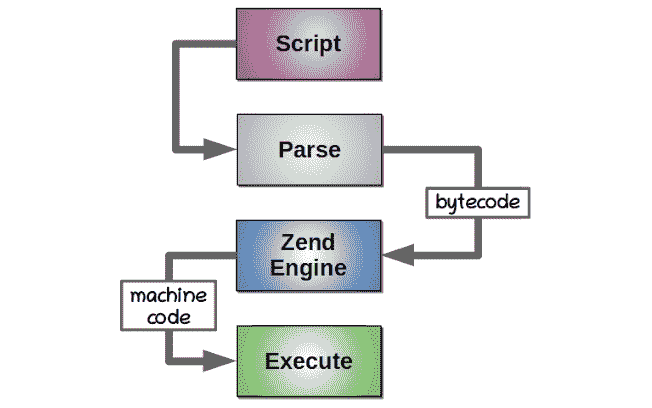
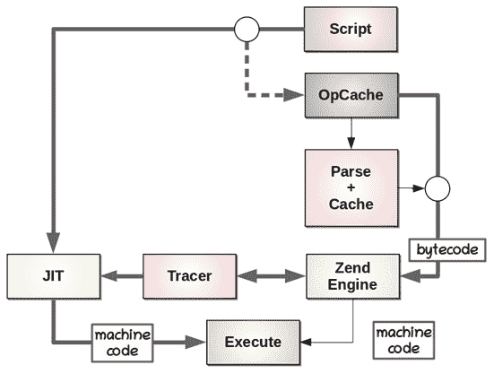
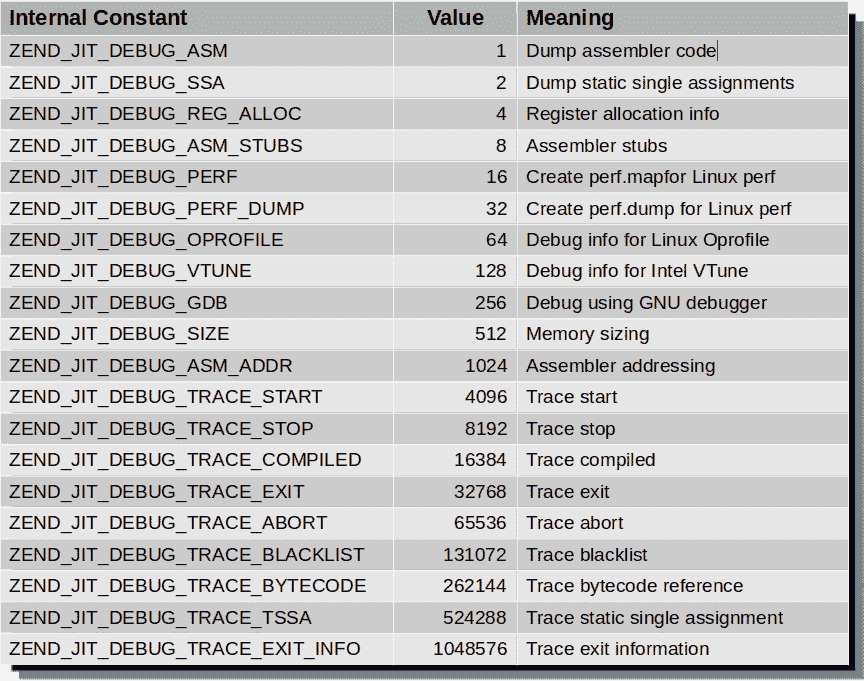
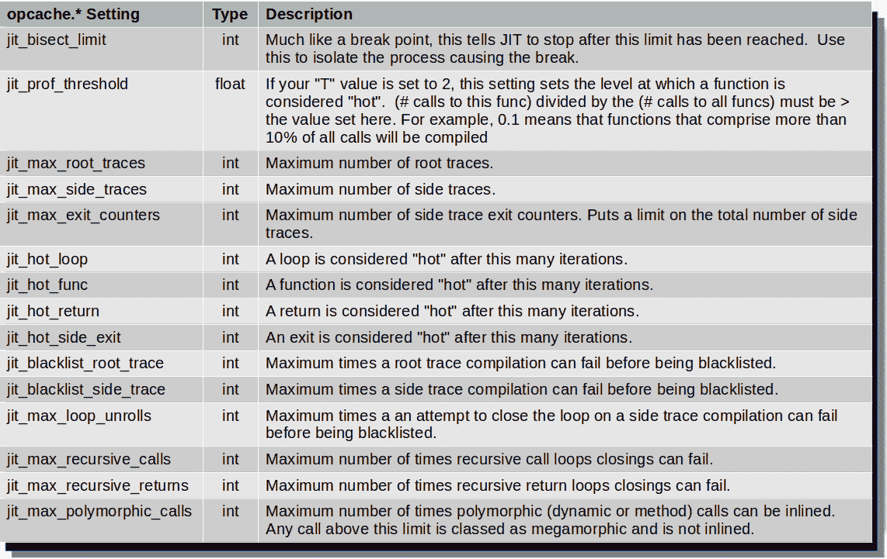

# 十、提高性能

PHP8.x 引入了许多对性能有积极影响的新特性。此外，许多内部改进，特别是在数组处理和管理对象引用方面，使性能比早期的 PHP 版本有了实质性的提高。此外，本章介绍的许多 PHP8 最佳实践可以提高效率并降低内存使用率。在本章中，您将了解如何优化 PHP8 代码以实现最佳性能。

PHP8 包含一种称为弱引用的技术。通过掌握本章最后一节讨论的这项技术，您的应用将使用更少的内存。通过仔细阅读本章所涵盖的材料并研究代码示例，您将能够编写更快、更高效的代码。这样的精通将极大地提高您作为 PHP 开发人员的地位，带来满意的客户，并提高您的职业潜力。

本章涵盖的主题包括以下内容：

*   使用**即时**（**JIT**编译器
*   加速阵列处理
*   实现稳定排序
*   使用弱引用提高效率

# 技术要求

要检查并运行本章中提供的代码示例，建议使用的最低硬件如下：

*   基于 x86_64 的台式 PC 或笔记本电脑
*   1 GB 的可用磁盘空间
*   4 GB 内存
*   每秒 500 千比特（Kbps）或更快的 internet 连接

此外，您还需要安装以下软件：

*   码头工人
*   Docker Compose

请参考[*第 1 章*](01.html#_idTextAnchor013)*中的*技术要求*部分，介绍新的 PHP8 OOP 特性*，了解有关 Docker 和 Docker Compose 安装的更多信息，以及如何构建用于演示本书中所述代码的 Docker 容器。在本书中，我们将您存储本书样本代码的目录称为`/repo`。

本章的源代码位于以下位置：https://github.com/PacktPublishing/PHP-8-Programming-Tips-Tricks-and-Best-Practices. 现在，我们可以通过查看期待已久的 JIT 编译器开始讨论。

# 使用 JIT 编译器

PHP8 引入了期待已久的**JIT 编译器**。这是一个非常重要的步骤，对 PHP 语言的长期生存能力具有重要影响。虽然 PHP 已经具备了生成和缓存**字节码**的能力，但在引入 JIT 编译器之前，PHP 还没有直接缓存**机器码**的能力。

事实上，从 2011 年开始，已经有几次尝试将 JIT 编译器功能添加到 PHP 中。PHP7 中的性能提升是这些早期努力的直接结果。早期的 JIT 编译器工作没有被提议为**RFC**（**注释请求**，因为它们没有显著提高性能。核心团队现在认为，任何进一步的性能提升现在都只能通过使用 JIT 来实现。作为一个附带的好处，这打开了 PHP 作为非 web 环境语言使用的可能性。另一个好处是，JIT 编译器提供了用 C 以外的语言开发 PHP 扩展的可能性。

密切关注本章中给出的细节非常重要，因为正确使用新的 JIT 编译器有可能极大地提高 PHP 应用的性能。在我们进入实现细节之前，首先需要解释 PHP 如何在没有 JIT 编译器的情况下执行字节码。然后，我们将向您展示 JIT 编译器是如何工作的。在这之后，您将能够更好地理解各种设置，以及如何对它们进行微调，从而为您的应用代码产生尽可能最佳的性能。

现在让我们把注意力转向没有 JIT 编译器的 PHP 是如何工作的。

## 发现 PHP 如何在没有 JIT 的情况下工作

当 PHP 安装在服务器上（或 Docker 容器中）时，除了核心扩展之外，安装的主要组件实际上是一个**虚拟机**（**VM**），通常称为 Zend 引擎。该虚拟机的运行方式与虚拟化技术（如*VMware*或*Docker*等）截然不同。Zend 引擎在本质上更接近于中的**Java 虚拟机**（**JVM**，它接受*字节码*并生成*机器码*。

这就引出了一个问题：*什么是字节码*和*什么是机器码*？现在我们来看看这个问题。

### 理解字节码和机器码

机器代码或**机器语言**是 CPU 直接理解的硬件指令的集合。每段机器代码都是一条指令，使 CPU 执行特定操作。这些低级的操作包括在寄存器之间移动信息、将给定数量的字节移入或移出内存、加法、减法等等。

机器代码通常使用**汇编语言**呈现出某种人类可读性。以下是以汇编语言呈现的机器代码示例：

```php
JIT$Mandelbrot::iterate: ;
        sub $0x10, %esp
        cmp $0x1, 0x1c(%esi)
        jb .L14
        jmp .L1
.ENTRY1:
        sub $0x10, %esp
.L1:
        cmp $0x2, 0x1c(%esi)
        jb .)L15
        mov $0xec3800f0, %edi
        jmp .L2
.ENTRY2:
        sub $0x10, %esp
.L2:
        cmp $0x5, 0x48(%esi)
        jnz .L16
        vmovsd 0x40(%esi), %xmm1
        vsubsd 0xec380068, %xmm1, %xmm1
```

尽管在大多数情况下，命令不容易理解，但从汇编语言表示中可以看到，该指令包括用于比较（`cmp`）、在寄存器和/或内存之间移动信息（`mov`）以及跳转到指令集中另一点（`jmp`的命令 ).

字节码，也称为**操作码**，是原始程序代码的一种大大简化的符号表示。字节码是由解析过程（通常称为**解释器**）生成的，该解析过程将人类可读程序代码与值一起分解为被称为**标记**的符号。值可以是程序代码中使用的任何字符串、整数、浮点和布尔数据。

下面是基于用于创建 Mandelbrot 的示例代码（稍后显示）生成的字节码片段的示例：


图 10.1–PHP 解析过程产生的字节码片段

现在让我们来看一下 PHP 程序的常规执行流。

### 理解传统的 PHP 程序执行

在传统的 PHP 程序运行周期中，PHP 程序代码通过称为**解析**的操作进行评估并分解为字节码。然后字节码被传递到 Zend 引擎，Zend 引擎将字节码转换为机器码。

当 PHP 第一次安装在服务器上时，安装过程会引入必要的逻辑，将 Zend 引擎定制为特定服务器的特定 CPU 和硬件（或虚拟 CPU 和硬件）。因此，在编写 PHP 代码时，您不知道最终运行代码的实际 CPU 的细节。Zend 引擎提供特定于硬件的感知。

下面显示的图 10.2 说明了传统的 PHP 执行：



图 10.2–传统 PHP 程序执行流程

尽管 PHP，特别是 PHP7，速度非常快，但获得额外的速度仍然是一个值得关注的问题。为此，大多数安装还支持 PHP**OPcache**扩展。在转到 JIT 编译器之前，让我们先快速查看一下 OPcache。

### 了解 PHP OPcache 的操作

顾名思义，PHP 操作缓存扩展*在第一次运行 PHP 程序时缓存*操作码（字节码）。在随后的程序运行中，字节码从缓存中提取，从而消除了解析阶段。这节省了大量时间，是在生产站点上启用的非常理想的功能。PHP OPcache 扩展是核心扩展集的一部分；但是，默认情况下不启用它。

在启用此扩展之前，必须首先确认您的 PHP 版本已使用`--enable-opcache`配置选项编译。您可以通过在 web 服务器上运行的 PHP 代码内部执行`phpinfo()`命令来检查这一点。在命令行中，输入和`php -i`命令。下面是一个从用于本书的 Docker 容器运行`php -i`的示例：

```php
root@php8_tips_php8 [ /repo/ch10 ]# php -i
phpinfo()
PHP Version => 8.1.0-dev
System => Linux php8_tips_php8 5.8.0-53-generic #60~20.04.1-Ubuntu SMP Thu May 6 09:52:46 UTC 2021 x86_64
Build Date => Dec 24 2020 00:11:29
Build System => Linux 9244ac997bc1 3.16.0-4-amd64 #1 SMP Debian 3.16.7-ckt11-1 (2015-05-24) x86_64 GNU/Linux
Configure Command =>  './configure'  '--prefix=/usr' '--sysconfdir=/etc' '--localstatedir=/var' '--datadir=/usr/share/php' '--mandir=/usr/share/man' '--enable-fpm' '--with-fpm-user=apache' '--with-fpm-group=apache'
// not all options shown
'--with-jpeg' '--with-png' '--with-sodium=/usr' '--enable-opcache-jit' '--with-pcre-jit' '--enable-opcache'
```

从输出中可以看到，此 PHP 安装的配置中包含了 OPcache。要启用 OPcache，请添加或取消注释以下`php.ini`文件设置：

*   `zend_extension=opcache`
*   `opcache.enable=1`
*   `opcache.enable_cli=1`

最后一个设置是可选的。它确定 OPcache 是否也处理从命令行执行的 PHP 命令。启用后，会有许多其他`php.ini`文件设置影响性能，但是，这些设置超出了本文讨论的范围。

提示

有关影响 OPcache 的 PHP`php.ini`文件设置的更多信息，请查看以下内容：https://www.php.net/manual/en/opcache.configuration.php.

现在让我们来看看 JIT 编译器是如何运行的，以及它与 OPcache 的区别。

### 使用 JIT 编译器发现 PHP 程序执行

当前方法的问题是无论字节码是否缓存，Zend 引擎仍然需要在每次程序请求时将字节码转换为机器码。JIT 编译器提供的功能不仅仅是将字节码编译成机器码，还可以*缓存机器码*。该过程通过创建请求跟踪的跟踪机制来实现。跟踪允许 JIT 编译器确定需要优化和缓存的机器代码块。使用 JIT 编译器的执行流程如*图 10.3*所示：



图 10.3-JIT 编译器的 PHP 执行流程

从图中可以看到，包含 OPcache 的正常执行流仍然存在。主要区别在于，请求可能会调用跟踪，导致程序流立即转移到 JIT 编译器，不仅有效地绕过了解析过程，还绕过了 Zend 引擎。JIT 编译器和 Zend 引擎都可以生成准备直接执行的机器代码。

JIT 编译器并不是凭空产生的。PHP 核心团队选择移植高性能且经过良好测试的**Dynam**预处理汇编程序。虽然 Dynam 是为**Lua**编程语言使用的 JIT 编译器而开发的，但它的设计非常适合作为任何基于 C 语言（如 PHP！）的 JIT 编译器的基础。

PHP JIT 实现的另一个有利方面是不产生任何**中间表示**（**IR**代码。相比之下，用于使用 JIT 编译器技术运行 Python 代码的**PyPyVM**必须首先以**图形结构**生成 IR 代码，用于流分析和优化，然后才能生成实际的机器代码。PHP JIT 中的 DynASM 内核不需要这个额外的步骤，从而产生比其他解释编程语言更高的性能。

提示

有关 DynASM 的更多信息，请访问本网站：https://luajit.org/dynasm.html. 下面是 PHP 8 JIT 如何运行的极好概述：https://www.zend.com/blog/exploring-new-php-jit-compiler. 您也可以在此处阅读正式的 JIT RFC：https://wiki.php.net/rfc/jit.

现在，您已经了解了 JIT 编译器如何适应 PHP 程序执行周期的一般流程，是时候学习如何启用它了。

## 启用 JIT 编译器

因为 JIT 编译器的主要功能是缓存机器代码，所以它作为 OPcache 扩展的独立部分运行。OPcache 充当网关，既可以启用 JIT 功能，也可以从自己分配的内存分配给 JIT 编译器。因此，为了启用 JIT 编译器，您必须首先启用 OPcache（请参阅上一节，*了解 PHP OPcache 的操作*。

为了启用 JIT 编译器，您必须首先确认 PHP 已使用`--enable-opcache-jit`配置选项编译。然后，只需将非零值赋给`php.ini`文件的`opcache.jit_buffer_size`指令，即可启用或禁用 JIT 编译器。

将值指定为整数–在这种情况下，该值表示字节数；值为零（默认值），禁用 JIT 编译器；或者，您可以指定一个数字，后跟以下任意字母：

*   `K`：千字节
*   `M`：兆字节
*   `G`：千兆字节

为 JIT 编译器缓冲区大小指定的值必须小于分配给 OPcache 的内存分配，因为 JIT 缓冲区已从 OPcache 缓冲区中取出。

下面是一个例子，它将 OPcache 内存消耗设置为 256 M，JIT 缓冲设置为 64 M。这些值可以放在`php.ini`文件中的任意位置：

```php
opcache.memory_consumption=256
opcache.jit_buffer_size=64M
```

现在您已经了解了 JIT 编译器的工作方式以及如何启用它，了解如何正确设置跟踪模式非常重要。

## 配置跟踪模式

`php.ini`设置`opcache.jit`控制 JIT 跟踪器操作。为方便起见，可以使用以下四个预设字符串中的一个：

*   `opcache.jit=disable`

    完全禁用 JIT 编译器（无论其他设置如何）。

*   `opcache.jit=off`

    禁用 JIT 编译器，但（在大多数情况下）可以在运行时使用`ini_set()`启用它。

*   `opcache.jit=function`

    将 JIT 编译器跟踪程序设置为函数模式。此模式对应于**CPU 寄存器触发优化（CRTO）**位 1205（下面解释）。

*   `opcache.jit=tracing`

    将 JIT 编译器跟踪程序设置为跟踪模式。该模式对应于 CRTO 数字 1254（下文解释）。在大多数情况下，此设置可提供最佳性能。

*   `opcache.jit=on`

    这是跟踪模式的别名。

    提示

    依赖运行时 JIT 激活是有风险的，可能会产生不一致的应用行为。最佳做法是使用`tracing`或`function`设置。

四个便利字符串实际上解析为一个四位数。每个数字对应于 JIT 编译器跟踪程序的不同方面。与其他`php.ini`文件设置不同，这四位数字不是位掩码，按以下顺序指定：`CRTO`。以下是四位数字中每一位的摘要。

### C（CPU 选择标志）

第一位数字表示 CPU 优化设置。如果将此数字设置为 0，则不会发生 CPU 优化。值为 1 启用生成**高级向量扩展**（**AVX**）**指令**。AVX 是英特尔和 AMD 微处理器 x86 指令集体系结构的扩展。自 2011 年以来，英特尔和 AMD 处理器一直支持 AVX。AVX2 可用于大多数服务器类型的处理器，如 Intel Xeon。

### R（寄存器分配）

第二位数字控制 JIT 编译器如何处理**寄存器**。寄存器与 RAM 类似，只是它们直接位于 CPU 内部。CPU 不断地将信息移入和移出寄存器以执行操作（例如，加法、减法、执行逻辑 and、OR 和 NOT 操作等）。与此设置关联的选项允许您禁用寄存器分配优化，或允许在本地或全局级别进行优化。

### T（JIT 触发器）

第三位数字指示 JIT 编译器应在何时触发。选项包括让 JIT 编译器在第一次加载脚本或第一次执行脚本时运行。或者，您可以指示 JIT 何时编译**热函数**。热函数是调用最频繁的函数。还有一个设置告诉 JIT 只编译标有`@jit docblock`注释的函数。

### O（优化级别）

第四位数字对应于优化级别。选项包括禁用优化、最小化和选择性。您还可以指示 JIT 编译器根据单个函数、调用树或内部过程分析的结果进行优化。

提示

有关四种 JIT 编译器跟踪器设置的完整分类，请参阅此文档参考页：https://www.php.net/manual/en/opcache.configuration.php#ini.opcache.jit.

现在让我们看一看正在运行的 JIT 编译器。

## 使用 JIT 编译器

在本例中，我们使用一个经典的基准测试程序，该程序生成一个**Mandelbrot**。这是一个非常好的测试，因为它的计算量非常大。我们在这里使用的实现来自 PHP 核心开发团队成员之一**Dmitry Stogov**生成的实现代码。您可以在此处查看原始实现：[https://gist.github.com/dstogov/12323ad13d3240aee8f1](https://gist.github.com/dstogov/12323ad13d3240aee8f1) ：

1.  我们首先定义 Mandelbrot 参数。尤其重要的是迭代次数（`MAX_LOOPS`。大量的数据会产生更多的计算，并降低总体生产速度。我们还捕获了开始时间：

    ```php
    // /repo/ch10/php8_jit_mandelbrot.php
    define('BAILOUT',   16);
    define('MAX_LOOPS', 10000);
    define('EDGE',      40.0);
    $d1  = microtime(1);
    ```

2.  为了方便多个程序运行，我们添加了一个选项来捕获命令行参数`-n`。如果存在此参数，则抑制 Mandelbrot 输出：

    ```php
    $time_only = (bool) ($argv[1] ?? $_GET['time'] ?? FALSE);
    ```

3.  然后我们定义一个函数`iterate()`，它直接从 Dmitry Stogov 的 Mandelbrot 实现中提取。此处未显示的实际代码可以在前面提到的 URL 上查看。
4.  接下来，我们通过`EDGE`：

    ```php
    $out = '';
    $f   = EDGE - 1;
    for ($y = -$f; $y < $f; $y++) {
        for ($x = -$f; $x < $f; $x++) {
            $out .= (iterate($x/EDGE,$y/EDGE) == 0)
                  ? '*' : ' ';
        }
        $out .= "\n";
    }
    ```

    确定的 X/Y 坐标生成 ASCII 图像
5.  最后，我们生产产品。如果通过 web 请求运行，则输出将被包装在`<pre>`标记中。如果存在`-n`标志，则仅显示经过的时间：

    ```php
    if (!empty($_SERVER['REQUEST_URI'])) {
        $out = '<pre>' . $out . '</pre>';
    }
    if (!$time_only) echo $out;
    $d2 = microtime(1);
    $diff = $d2 - $d1;
    printf("\nPHP Elapsed %0.3f\n", $diff);
    ```

6.  我们首先使用`-n`标志在 PHP7 Docker 容器中运行程序三次。结果如下。请注意，在与本书结合使用的 demo Docker 容器中，经过的时间很容易超过 10 秒：

    ```php
    root@php8_tips_php7 [ /repo/ch10 ]# 
    php php8_jit_mandelbrot.php -n
    PHP Elapsed 10.320
    root@php8_tips_php7 [ /repo/ch10 ]# 
    php php8_jit_mandelbrot.php -n
    PHP Elapsed 10.134
    root@php8_tips_php7 [ /repo/ch10 ]# 
    php php8_jit_mandelbrot.php -n
    PHP Elapsed 11.806
    ```

7.  现在我们来看 PHP8 Docker 容器。首先，我们调整`php.ini`文件以禁用 JIT 编译器。以下是设置：

    ```php
    opcache.jit=off
    opcache.jit_buffer_size=0
    ```

8.  下面是在 PHP8 中使用`-n`标志

    ```php
    root@php8_tips_php8 [ /repo/ch10 ]# 
    php php8_jit_mandelbrot.php -n
    PHP Elapsed 1.183
    root@php8_tips_php8 [ /repo/ch10 ]# 
    php php8_jit_mandelbrot.php -n
    PHP Elapsed 1.192
    root@php8_tips_php8 [ /repo/ch10 ]# 
    php php8_jit_mandelbrot.php -n
    PHP Elapsed 1.210
    ```

    运行程序三次的结果
9.  马上，您就可以看到切换到 PHP8 的好理由！即使没有 JIT 编译器，PHP8 也能够在 1 秒多一点的时间内执行相同的程序：时间的 1/10！
10.  接下来，我们修改`php.ini`文件设置以使用 JIT 编译器`function`跟踪模式。以下是使用的设置：

    ```php
    opcache.jit=function
    opcache.jit_buffer_size=64M
    ```

11.  然后，我们使用`-n`标志再次运行相同的程序。以下是使用 JIT 编译器`function`跟踪模式

    ```php
    root@php8_tips_php8 [ /repo/ch10 ]# 
    php php8_jit_mandelbrot.php -n
    PHP Elapsed 0.323
    root@php8_tips_php8 [ /repo/ch10 ]# 
    php php8_jit_mandelbrot.php -n
    PHP Elapsed 0.322
    root@php8_tips_php8 [ /repo/ch10 ]# 
    php php8_jit_mandelbrot.php -n
    PHP Elapsed 0.324
    ```

    在 PHP8 中运行的结果
12.  哇！我们设法将处理速度提高了 3 倍。现在速度小于 1/3 秒！但是如果我们尝试推荐的 JIT 编译器`tracing`模式，会发生什么呢？以下是调用该模式的设置：

    ```php
    opcache.jit=tracing
    opcache.jit_buffer_size=64M
    ```

13.  以下是我们上一组程序运行的结果：

    ```php
    root@php8_tips_php8 [ /repo/ch10 ]# 
    php php8_jit_mandelbrot.php -n
    PHP Elapsed 0.132
    root@php8_tips_php8 [ /repo/ch10 ]# 
    php php8_jit_mandelbrot.php -n
    PHP Elapsed 0.132
    root@php8_tips_php8 [ /repo/ch10 ]# 
    php php8_jit_mandelbrot.php -n
    PHP Elapsed 0.131
    ```

最后的结果，如输出所示，确实令人震惊。在没有 JIT 编译器的情况下，我们不仅可以比 PHP8 快 10 倍运行同一个程序，而且我们比 PHP7 快 100 倍！

重要提示

需要注意的是，运行与本书关联的 Docker 容器所用的主机不同，时间也会有所不同。您将无法看到与此处所示完全相同的时间。

现在让我们看看 JIT 编译器调试。

## 使用 JIT 编译器进行调试

使用 JIT 编译器时，使用**XDebug**或其他工具进行正常调试将无法有效工作。因此，PHP 核心团队增加了一个额外的`php.ini`文件选项`opcache.jit_debug`，该选项产生额外的调试信息。在这种情况下，可用的设置采用位标志的形式，这意味着您可以使用位运算符（如`AND`、`OR`、`XOR`等）组合它们。

*表 10.1*总结了可分配为`opcache.jit_debug`设置的值。请注意，标有**内部常数**的列没有显示 PHP 预定义的常数。这些值是内部 C 代码引用：



表 10.1–opcache.jit_ 调试设置

因此，例如，如果您希望启用对`ZEND_JIT_DEBUG_ASM`、`ZEND_JIT_DEBUG_PERF`和`ZEND_JIT_DEBUG_EXIT`的调试，您可以在`php.ini`文件中进行如下分配：

1.  First, you need to add up the values you wish to set. In this example, we would add:

    `1 + 16 + 32768`

2.  You then apply the sum to the `php.ini` setting:

    `opcache.jit_debug=32725`

3.  Or, alternatively, represent the values using bitwise `OR`:

    `opcache.jit_debug=1|16|32768`

根据调试设置，您现在可以使用 Linux`perf`命令或 Intel`VTune`等工具调试 JIT 编译器。

下面是运行上一节讨论的 Mandelbrot 测试程序时调试输出的部分示例。为了便于说明，我们使用了`php.ini`文件设置`opcache.jit_debug=32725`：

```php
root@php8_tips_php8 [ /repo/ch10 ]# 
php php8_jit_mandelbrot.php -n
---- TRACE 1 start (loop) iterate() /repo/ch10/php8_jit_mandelbrot.php:34
---- TRACE 1 stop (loop)
---- TRACE 1 Live Ranges
#15.CV6($i): 0-0 last_use
#19.CV6($i): 0-20 hint=#15.CV6($i)
... not all output is shown
---- TRACE 1 compiled
---- TRACE 2 start (side trace 1/7) iterate()
/repo/ch10/php8_jit_mandelbrot.php:41
---- TRACE 2 stop (return)
TRACE-2$iterate$41: ; (unknown)
    mov $0x2, EG(jit_trace_num)
    mov 0x10(%r14), %rcx
    test %rcx, %rcx
    jz .L1
    mov 0xb0(%r14), %rdx
    mov %rdx, (%rcx)
    mov $0x4, 0x8(%rcx)
...  not all output is shown
```

输出显示的是以汇编语言呈现的机器代码。如果在使用 JIT 编译器时遇到程序代码问题，汇编语言转储可能会帮助您查找错误源。

然而，请注意汇编语言是不可移植的，并且完全面向所使用的 CPU。因此，您可能需要获取该 CPU 的硬件参考手册，并查找正在使用的汇编语言代码。

现在让我们看看影响 JIT 编译器操作的其他`php.ini`文件设置。

## 发现其他 JIT 编译器设置

*表 10.2*提供了`php.ini`文件中尚未涉及的所有其他`opcache.jit*`设置的摘要：



表 10.2–其他 opcache.jit*php.ini 文件设置

正如您从表中看到的，您可以高度控制 JIT 编译器的操作方式。总的来说，这些设置表示控制 JIT 编译器做出的决策的阈值。如果配置正确，这些设置允许 JIT 编译器忽略不经常使用的循环和函数调用。现在，我们将离开令人兴奋的 JIT 编译器世界，看看如何提高阵列性能。

# 加速阵列处理

数组是任何 PHP 程序的重要组成部分。事实上，处理数组是不可避免的，因为程序每天处理的许多实际数据都是以数组的形式到达的。一个例子是来自 HTML 表单发布的数据。数据以`$_GET`或`$_POST`作为数组结束。

在本节中，我们将向您介绍 SPL 中包含的一个鲜为人知的类：`SplFixedArray`类。将数据从标准阵列迁移到`SplFixedArray`实例不仅可以提高性能，而且所需内存也会大大减少。学习如何利用本章介绍的技术可以对当前使用具有大量数据的数组的任何程序代码的速度和效率产生重大影响。

## 在 PHP8 中使用 SplFixedArray

PHP5.3 中引入的`SplFixedArray`类实际上是一个类似于数组的对象。但是，与`ArrayObject`不同，该类要求您对数组大小进行硬限制，并且只允许整数索引。您可能希望使用`SplFixedArray`而不是`ArrayObject`的原因是`SplFixedArray`占用的内存明显较少，而且性能很高。事实上，`SplFixedArray`实际占用的内存*比具有相同数据的标准阵列少*！

### 比较 SplFixedArray 与 array 和 ArrayObject

简单基准程序说明了标准阵列`ArrayObject`和`SplFixedArray`之间的差异：

1.  首先，我们定义了代码后面使用的两个常量：

    ```php
    // /repo/ch10/php7_spl_fixed_arr_size.php
    define('MAX_SIZE', 1000000);
    define('PATTERN', "%14s : %8.8f : %12s\n");
    ```

2.  接下来，我们定义一个函数，该函数添加由 64 字节长的字符串组成的 100 万个元素：

    ```php
    function testArr($list, $label) {
        $alpha = new InfiniteIterator(
            new ArrayIterator(range('A','Z')));
        $start_mem = memory_get_usage();
        $start_time = microtime(TRUE);
        for ($x = 0; $x < MAX_SIZE; $x++) {
            $letter = $alpha->current();
            $alpha->next();
            $list[$x] = str_repeat($letter, 64);
        }
        $mem_diff = memory_get_usage() - $start_mem;
        return [$label, (microtime(TRUE) - $start_time),
            number_format($mem_diff)];
    }
    ```

3.  然后我们调用函数三次，分别提供`array`、`ArrayObject`和`SplFixedArray`作为参数：

    ```php
    printf("%14s : %10s : %12s\n", '', 'Time', 'Memory');
    $result = testArr([], 'Array');
    vprintf(PATTERN, $result);
    $result = testArr(new ArrayObject(), 'ArrayObject');
    vprintf(PATTERN, $result);
    $result = testArr(
        new SplFixedArray(MAX_SIZE), 'SplFixedArray');
    vprintf(PATTERN, $result);
    ```

4.  以下是 PHP7.1 Docker 容器的结果：

    ```php
    root@php8_tips_php7 [ /repo/ch10 ]# 
    php php7_spl_fixed_arr_size.php 
                   :       Time :       Memory
             Array : 1.19430900 :  129,558,888
       ArrayObject : 1.20231009 :  129,558,832
     SplFixedArray : 1.19744802 :   96,000,280
    ```

5.  在 PHP8 中，所花费的时间要少得多，如下所示：

    ```php
    root@php8_tips_php8 [ /repo/ch10 ]# 
    php php7_spl_fixed_arr_size.php 
                   :       Time :       Memory
             Array : 0.13694692 :  129,558,888
       ArrayObject : 0.11058593 :  129,558,832
     SplFixedArray : 0.09748793 :   96,000,280
    ```

从的结果可以看出，PHP8 处理数组的速度是 PHP7.1 的 10 倍。两个版本使用的内存量相同。无论使用哪种版本的 PHP，`SplFixedArray`使用的内存都比标准数组或`ArrayObject`少得多。现在让我们看看 PHP8 中的`SplFixedArray`用法是如何变化的。

### 使用 PHP8 中的 SplFixedArray 更改

您可能还记得在[*第 7 章*](07.html#_idTextAnchor162)*中关于`Traversable`接口的简短讨论，在*可遍历到迭代聚合迁移*部分中，使用 PHP8 扩展*时避免陷阱。该节中提出的同样的考虑也适用于`SplFixedArray`。虽然`SplFixedArray`没有实现`Traversable`，但它实现了`Iterator`，而这反过来又扩展了`Traversable`。

在 PHP8 中，`SplFixedArray`不再实现`Iterator`。相反，它实现了`IteratorAggregate`。此更改的好处是 PHP8 中的`SplFixedArray`更快、更高效，并且在嵌套循环中使用也更安全。不利的一面，也是潜在的代码中断，是如果您将`SplFixedArray`与以下任何方法一起使用：`current()`、`key()`、`next()`、`rewind()`或`valid()`。

如果需要访问数组导航方法，现在必须使用`SplFixedArray::getIterator()`方法访问内部迭代器，所有导航方法都可以从该迭代器中访问。此处显示的一个简单代码示例说明了潜在的代码中断：

1.  我们首先从一个数组

    ```php
    // /repo/ch10/php7_spl_fixed_arr_iter.php
    $arr   = ['Person', 'Woman', 'Man', 'Camera', 'TV'];$fixed = SplFixedArray::fromArray($arr);
    ```

    构建一个`SplFixedArray`实例
2.  然后我们使用数组导航方法在数组中迭代：

    ```php
    while ($fixed->valid()) {
        echo $fixed->current() . '. ';
        $fixed->next();
    }
    ```

在 PHP 7 中，输出是数组中的五个字：

```php
root@php8_tips_php7 [ /repo/ch10 ]# 
php php7_spl_fixed_arr_iter.php 
Person. Woman. Man. Camera. TV.
```

然而，在 PHP 8 中，结果却截然不同，如下所示：

```php
root@php8_tips_php8 [ /repo/ch10 ]# 
php php7_spl_fixed_arr_iter.php 
PHP Fatal error:  Uncaught Error: Call to undefined method SplFixedArray::valid() in /repo/ch10/php7_spl_fixed_arr_iter.php:5
```

为了让这个例子在 PHP8 中工作，您所需要做的就是使用`SplFixedArray::getIterator()`方法访问内部迭代器。代码的其余部分不需要重写。下面是为 PHP 8 重新编写的修订后的代码示例：

```php
// /repo/ch10/php8_spl_fixed_arr_iter.php
$arr   = ['Person', 'Woman', 'Man', 'Camera', 'TV'];
$obj   = SplFixedArray::fromArray($arr);
$fixed = $obj->getIterator();
while ($fixed->valid()) {
    echo $fixed->current() . '. ';
    $fixed->next();
}
```

输出为现在的五个字，无错误：

```php
root@php8_tips_php8 [ /repo/ch10 ]# 
php php8_spl_fixed_arr_iter.php
Person. Woman. Man. Camera. TV. 
```

现在您已经了解了如何提高阵列处理性能，我们将把注意力转向阵列性能的另一个方面：排序。

# 实现稳定排序

在设计数组排序的逻辑时，最初的 PHP 开发人员为了速度牺牲了稳定性。当时，这被认为是一种合理的牺牲。但是，如果排序过程涉及复杂对象，则需要一个**稳定排序**。

在本节中，我们将讨论什么是稳定排序，以及为什么它很重要。如果能够确保数据得到稳定排序，应用代码将生成更准确的输出，从而提高客户满意度。在深入了解 PHP8 如何实现稳定排序之前，我们首先需要定义什么是稳定排序。

## 了解稳定排序

当用于排序的属性值相等时，在*稳定排序*中，元素的原始顺序得到保证。这样的结果更接近用户的期望。让我们看看一个简单的数据集，并确定什么将构成一个稳定的排序。为了便于说明，假设我们的数据集包含访问时间和用户名的条目：

```php
2021-06-01 11:11:11    Betty
2021-06-03 03:33:33    Betty
2021-06-01 11:11:11    Barney
2021-06-02 02:22:22    Wilma
2021-06-01 11:11:11    Wilma
2021-06-03 03:33:33    Barney
2021-06-01 11:11:11    Fred
```

如果我们希望按时间排序，您将立即注意到`2021-06-01 11:11:11`有重复项。如果我们对该数据集执行稳定排序，预期结果如下所示：

```php
2021-06-01 11:11:11    Betty
2021-06-01 11:11:11    Barney
2021-06-01 11:11:11    Wilma
2021-06-01 11:11:11    Fred
2021-06-02 02:22:22    Wilma
2021-06-03 03:33:33    Betty
2021-06-03 03:33:33    Barney
```

您将从排序后的数据集中注意到，重复时间为`2021-06-01 11:11:11`的条目按照最初输入的顺序显示。因此，我们可以说这个结果代表了一个稳定的排序。

在理想情况下，同样的原则也应适用于保留键/值关联的排序。稳定排序的另一个标准是，与不受监管的排序相比，它的性能应该没有差异。

提示

有关 PHP 8 稳定排序的更多信息，请查看官方 RFC：https://wiki.php.net/rfc/stable_sorting.

在 PHP8 中，核心的`*sort*()`函数和`ArrayObject::*sort*()`方法已经重写，以实现稳定的排序。让我们看一个代码示例，它说明了早期版本的 PHP 中可能出现的问题。

## 对比稳定和非稳定排序

在本例中，我们希望按时间对`Access`实例数组进行排序。每个`Access`实例都有两个属性，`$name`和`$time`。样本数据集包含重复的访问时间，但用户名不同：

1.  首先，我们定义了`Access`类：

    ```php
    // /repo/src/Php8/Sort/Access.php
    namespace Php8\Sort;
    class Access {
        public $name, $time;
        public function __construct($name, $time) {
            $this->name = $name;
            $this->time = $time;
        }
    }
    ```

2.  Next, we define a sample dataset that consists of a CSV file, `/repo/sample_data/access.csv`, with 21 rows. Each row represents a different name and access time combination:

    ```php
    "Fred",  "2021-06-01 11:11:11"
    "Fred",  "2021-06-01 02:22:22"
    "Betty", "2021-06-03 03:33:33"
    "Fred",  "2021-06-11 11:11:11"
    "Barney","2021-06-03 03:33:33"
    "Betty", "2021-06-01 11:11:11"
    "Betty", "2021-06-11 11:11:11"
    "Barney","2021-06-01 11:11:11"
    "Fred",  "2021-06-11 02:22:22"
    "Wilma", "2021-06-01 11:11:11"
    "Betty", "2021-06-13 03:33:33"
    "Fred",  "2021-06-21 11:11:11"
    "Betty", "2021-06-21 11:11:11"
    "Barney","2021-06-13 03:33:33"
    "Betty", "2021-06-23 03:33:33"
    "Barney","2021-06-11 11:11:11"
    "Barney","2021-06-21 11:11:11"
    "Fred",  "2021-06-21 02:22:22"
    "Barney","2021-06-23 03:33:33"
    "Wilma", "2021-06-21 11:11:11"
    "Wilma", "2021-06-11 11:11:11"
    ```

    扫描样本数据时，您会注意到所有以`11:11:11`作为输入时间的日期都是重复的，但是，您也会注意到任何给定日期的原始顺序始终是用户`Fred`、`Betty`、`Barney`和`Wilma`。此外，请注意，对于时间为`03:33:33`的日期，`Betty`的条目始终位于`Barney`之前。

3.  然后我们定义一个调用程序。在这个程序中要做的第一件事是配置自动加载和`use`的`Access`类：

    ```php
    // /repo/ch010/php8_sort_stable_simple.php
    require __DIR__ . 
    '/../src/Server/Autoload/Loader.php';
    $loader = new \Server\Autoload\Loader();
    use Php8\Sort\Access;
    ```

4.  接下来，我们将样本数据加载到`$access`数组中：

    ```php
    $access = [];
    $data = new SplFileObject(__DIR__ 
        . '/../sample_data/access.csv');
    while ($row = $data->fgetcsv())
        if (!empty($row) && count($row) === 2)
            $access[] = new Access($row[0], $row[1]);
    ```

5.  然后执行`usort()`。注意，用户定义的回调函数对每个实例的`time`属性进行比较：

    ```php
    usort($access, 
        function($a, $b) { return $a->time <=> $b->time; });
    ```

6.  最后，我们循环通过新排序的数组并显示结果：

    ```php
    foreach ($access as $entry)
        echo $entry->time . "\t" . $entry->name . "\n";
    ```

在 PHP 7 中，请注意，虽然时间是有序的，但名称并不反映预期的顺序`Fred`、`Betty`、`Barney`和`Wilma`。以下是 PHP7 的输出：

```php
root@php8_tips_php7 [ /repo/ch10 ]# 
php php8_sort_stable_simple.php 
2021-06-01 02:22:22    Fred
2021-06-01 11:11:11    Fred
2021-06-01 11:11:11    Wilma
2021-06-01 11:11:11    Betty
2021-06-01 11:11:11    Barney
2021-06-03 03:33:33    Betty
2021-06-03 03:33:33    Barney
2021-06-11 02:22:22    Fred
2021-06-11 11:11:11    Barney
2021-06-11 11:11:11    Wilma
2021-06-11 11:11:11    Betty
2021-06-11 11:11:11    Fred
2021-06-13 03:33:33    Barney
2021-06-13 03:33:33    Betty
2021-06-21 02:22:22    Fred
2021-06-21 11:11:11    Fred
2021-06-21 11:11:11    Betty
2021-06-21 11:11:11    Barney
2021-06-21 11:11:11    Wilma
2021-06-23 03:33:33    Betty
2021-06-23 03:33:33    Barney
```

从输出中可以看出，在第一组`11:11:11`日期中，最终的顺序是`Fred`、`Wilma`、`Betty`和`Barney`，而原始的输入顺序是`Fred`、`Betty`、`Barney`和`Wilma`。您还会注意到，对于日期和时间`2021-06-13 03:33:33`，`Barney`在`Betty`之前，而原始的输入顺序是相反的。根据我们的定义，PHP7 没有实现稳定排序！

现在让我们看一看在 PHP8 中运行的相同代码示例。以下是 PHP8 的输出：

```php
root@php8_tips_php8 [ /repo/ch10 ]# 
php php8_sort_stable_simple.php
2021-06-01 02:22:22    Fred
2021-06-01 11:11:11    Fred
2021-06-01 11:11:11    Betty
2021-06-01 11:11:11    Barney
2021-06-01 11:11:11    Wilma
2021-06-03 03:33:33    Betty
2021-06-03 03:33:33    Barney
2021-06-11 02:22:22    Fred
2021-06-11 11:11:11    Fred
2021-06-11 11:11:11    Betty
2021-06-11 11:11:11    Barney
2021-06-11 11:11:11    Wilma
2021-06-13 03:33:33    Betty
2021-06-13 03:33:33    Barney
2021-06-21 02:22:22    Fred
2021-06-21 11:11:11    Fred
2021-06-21 11:11:11    Betty
2021-06-21 11:11:11    Barney
2021-06-21 11:11:11    Wilma
2021-06-23 03:33:33    Betty
2021-06-23 03:33:33    Barney
```

从 PHP8 输出中可以看到，对于所有的`11:11:11`条目，条目`Fred`、`Betty`、`Barney`和`Wilma`的原始顺序都得到了遵守。您还会注意到，对于日期和时间`2021-06-13 03:33:33`，`Betty`始终在`Barney`之前。因此，我们可以得出结论，PHP8 执行稳定排序。

现在您可以在 PHP7 中看到这个问题，并且知道 PHP8 解决了这个问题，让我们看看在稳定排序中对键的影响。

## 检查稳定排序对键的影响

当使用`asort()`、`uasort()`或等效`ArrayIterator`方法时，稳定排序的概念也会影响键/值对。在下一个示例中，`ArrayIterator`填充了 20 个元素，每个元素都是重复的。键是按顺序递增的十六进制数：

1.  首先，我们定义一个函数来生成随机的 3 个字母组合：

    ```php
    // /repo/ch010/php8_sort_stable_keys.php
    $randVal = function () {
        $alpha = 'ABCDEFGHIJKLMNOPQRSTUVWXYZ';
        return $alpha[rand(0,25)] . $alpha[rand(0,25)] 
               . $alpha[rand(0,25)];};
    ```

2.  接下来，我们用样本数据加载一个`ArrayIterator`实例。其他每个元素都是重复的。我们还捕获了开始时间：

    ```php
    $start = microtime(TRUE);
    $max   = 20;
    $iter  = new ArrayIterator;
    for ($x = 256; $x < $max + 256; $x += 2) {
        $key = sprintf('%04X', $x);
        $iter->offsetSet($key, $randVal());
        $key = sprintf('%04X', $x + 1);
        $iter->offsetSet($key, 'AAA'); // <-- duplicate
    }
    ```

3.  然后我们执行`ArrayIterator::asort()`并显示生成的订单以及经过的时间：

    ```php
    // not all code is shown
    $iter->asort();
    foreach ($iter as $key => $value) echo "$key\t$value\n";
    echo "\nElapsed Time: " . (microtime(TRUE) - $start);
    ```

以下是在 PHP7 中运行此代码示例的结果：

```php
root@php8_tips_php7 [ /repo/ch10 ]# 
php php8_sort_stable_keys.php 
0113    AAA
010D    AAA
0103    AAA
0105    AAA
0111    AAA
0107    AAA
010F    AAA
0109    AAA
0101    AAA
010B    AAA
0104    CBC
... some output omitted ...
010C    ZJW
Elapsed Time: 0.00017094612121582
```

正如您从输出中看到的，尽管值是有序的，但在重复值的情况下，键以混乱的顺序出现。相比之下，请查看在 PHP 8 中运行的相同程序代码的输出：

```php
root@php8_tips_php8 [ /repo/ch10 ]# 
php php8_sort_stable_keys.php 
0101    AAA
0103    AAA
0105    AAA
0107    AAA
0109    AAA
010B    AAA
010D    AAA
010F    AAA
0111    AAA
0113    AAA
0100    BAU
... some output omitted ...
0104    QEE
Elapsed Time: 0.00010395050048828
```

输出显示任何重复条目的键以其原始顺序出现在输出中。输出结果表明，PHP8 不仅实现了值的稳定排序，还实现了键的稳定排序。此外，正如运行时间结果所示，PHP8 已经成功地保持了与以前相同（或更好）的性能。现在让我们把注意力转向 PHP8 中另一个直接影响数组排序的差异：非法排序函数的处理。

## 处理非法分拣功能

PHP7 及更早版本允许开发人员在使用`usort()`或`uasort()`（或等效的`ArrayIterator`方法）时，可以逃脱**非法函数**。对你来说，意识到这种坏习惯是非常重要的。否则，当您将代码迁移到 PHP8 时，可能存在向后兼容性中断。

在下面显示的示例中，创建了与*对比稳定和非稳定排序*部分中描述的示例相同的数组。*非法*排序函数返回一个布尔值，`u*sort()`回调需要返回两个元素之间的*相对位置*。从字面上讲，如果第一个操作数小于第二个操作数，则用户定义函数或回调函数需要返回`-1`，如果相等，则返回`0`，如果第一个操作数大于第二个操作数，则返回`1`。如果重写定义`usort()`回调的代码行，可能会出现如下非法函数：

```php
usort($access, function($a, $b) { 
    return $a->time < $b->time; });
```

在这个代码片段中，我们使用小于符号（`<`，而不是使用返回`-1`、`0`或`1`的 spaceship 操作符（`<=>`。在 PHP7 及以下版本中，返回布尔返回值的回调是可以接受的，并生成所需的结果。但实际上，PHP 解释器需要添加一个额外的操作来弥补缺少的操作。因此，如果回调仅执行此比较：

`op1 > op2`

PHP 解释器添加了一个附加操作：

`op1 <= op2`

在 PHP8 中，非法的排序函数会产生一个弃用通知。以下是在 PHP 8 中运行的重写代码：

```php
root@php8_tips_php8 [ /repo/ch10 ]#
php php8_sort_illegal_func.php 
PHP Deprecated:  usort(): Returning bool from comparison function is deprecated, return an integer less than, equal to, or greater than zero in /repo/ch10/php8_sort_illegal_func.php on line 30
2021-06-01 02:22:22    Fred
2021-06-01 11:11:11    Fred
2021-06-01 11:11:11    Betty
2021-06-01 11:11:11    Barney
... not all output is shown
```

从输出中可以看到，PHP8 允许操作继续，并且使用正确的回调时结果是一致的。但是，您也可以看到发布了`Deprecation`通知。

提示

您还可以在 PHP8 中使用箭头函数。前面显示的回调可能重写如下：

`usort($array, fn($a, $b) => $a <=> $b)`。

您现在对什么是稳定排序以及它为什么重要有了更深入的理解。您还能够发现由于 PHP8 和早期版本之间的处理差异而导致的潜在问题。现在我们来看看 PHP8 中引入的其他性能改进。

# 利用弱引用提高效率

随着 PHP 的不断发展和成熟，越来越多的开发人员转向 PHP 框架来促进应用的快速开发。然而，这种做法的一个必要副产品是占用内存的越来越大、越来越复杂的对象。包含许多属性的大型对象、其他对象或大型数组通常被称为昂贵对象。

这种趋势导致的潜在内存问题的一个复杂因素是，所有 PHP 对象分配都是通过引用自动完成的。如果没有引用，使用第三方框架将变得极其麻烦。但是，当通过引用指定对象时，该对象必须全部保留在内存中，直到所有引用都被销毁。只有这样，在取消设置或覆盖对象后，它才会被完全销毁。

在 PHP7.4 中，以弱参考支持的形式介绍了这个问题的潜在解决方案。PHP8 通过添加一个弱映射类扩展了这个新功能。在本节中，您将了解这项新技术是如何工作的，以及如何证明它有利于开发。我们先来看看弱引用。

## 利用弱引用

**弱引用**首先在 PHP7.4 中引入，并在 PHP8 中进行了细化。此类充当对象创建的包装器，允许开发人员使用对对象的引用，从而使范围外（例如，`unset()`）对象不受垃圾收集的保护。

[pecl.PHP.net](http://pecl.php.net)上目前有许多 PHP 扩展，为弱引用提供支持。大多数实现都侵入了 PHP 语言核心的 C 语言结构，要么重载对象处理程序，要么操纵堆栈和各种 C 指针。最终的结果，在大多数情况下，是一个可移植性的损失和大量的分割错误。PHP8 实现避免了这些问题。

如果您正在处理涉及大型对象的程序代码，并且程序代码可能会运行很长时间，那么掌握 PHP8 弱引用的使用非常重要。在了解使用细节之前，让我们先看看类定义。

## 审核 WeakReference 类定义

`WeakReference`类的正式定义如下：

```php
WeakReference {
    public __construct() : void
    public static create (object $object) : WeakReference
    public get() : object|null
}
```

如您所见，类定义非常简单。该类可用于为任何对象提供包装器。包装器使完全销毁对象变得更容易，而无需担心可能存在导致对象仍驻留在内存中的延迟引用。

提示

有关弱引用的背景和性质的更多信息，请查看以下内容：https://wiki.php.net/rfc/weakrefs. 文件参考如下：[https://www.php.net/manual/en/class.weakreference.php](https://www.php.net/manual/en/class.weakreference.php) 。

现在让我们看一个简单的例子来帮助您理解。

## 使用弱引用

这个例子演示了如何使用弱引用。在本例中，您将看到，当通过引用进行普通对象赋值时，即使原始对象未设置，它仍会保留在内存中。另一方面，如果使用`WeakReference`分配对象引用，一旦原始对象取消设置，它将从内存中完全删除：

1.  首先，我们定义四个对象。注意，`$obj2`是对`$obj1`的正常引用，而`$obj4`是对`$obj3`：

    ```php
    // /repo/ch010/php8_weak_reference.php
    $obj1 = new class () { public $name = 'Fred'; };
    $obj2 = $obj1;  // normal reference
    $obj3 = new class () { public $name = 'Fred'; };
    $obj4 = WeakReference::create($obj3); // weak ref
    ```

    的弱引用
2.  然后显示`$obj1`未设置前后`$obj2`的内容。因为`$obj1`和`$obj2`之间的连接是正常的 PHP 引用，`$obj1`由于创建了强引用而保留在内存中：

    ```php
    var_dump($obj2);
    unset($obj1);
    var_dump($obj2);  // $obj1 still loaded in memory
    ```

3.  然后，我们对`$obj3`和`$obj4`执行相同的操作。请注意，我们需要使用`WeakReference::get()`来获取关联的对象。一旦`$obj3`被取消设置，所有与`$obj3`和`$obj4`相关的信息将从内存中删除：

    ```php
    var_dump($obj4->get());
    unset($obj3);
    var_dump($obj4->get()); // both $obj3 and $obj4 are gone
    ```

以下是在 PHP 8 中运行的此代码示例的输出：

```php
root@php8_tips_php8 [ /repo/ch10 ]# 
php php8_weak_reference.php 
object(class@anonymous)#1 (1) {
  ["name"]=>  string(4) "Fred"
}
object(class@anonymous)#1 (1) {
  ["name"]=>  string(4) "Fred"
}
object(class@anonymous)#2 (1) {
  ["name"]=>  string(4) "Fred"
}
NULL
```

输出告诉我们一个有趣的故事！第二个`var_dump()`操作告诉我们，尽管`$obj1`已经取消设置，但由于`$obj2`创建的强引用，它仍然像僵尸一样生存。如果您正在处理昂贵的对象和复杂的应用代码，为了释放内存，您需要首先查找并销毁所有引用，然后再释放内存！

另一方面，如果确实需要内存，则使用`WeakReference::create()`方法创建引用，而不是直接分配对象（在 PHP 中是通过引用自动分配的）。弱参考具有正常参考的所有能力。唯一的区别是，如果它引用的对象被销毁或超出范围，弱引用也会自动销毁。

从输出中可以看到，上一次`var_dump()`操作的结果是`NULL`。这告诉我们这个物体确实被摧毁了。当主对象未设置时，其所有弱引用将自动消失。现在您已经了解了如何使用弱引用，以及它们解决的潜在问题，现在是时候来看看一个新类，`WeakMap`。

## 与 WeakMap 合作

在 PHP8 中，添加了一个新类`WeakMap`，它利用了弱引用支持。新类在功能上类似于`SplObjectStorage`。以下是正式的类定义：

```php
final WeakMap implements Countable,
    ArrayAccess, IteratorAggregate {
    public __construct ( )
    public count ( ) : int
    abstract public getIterator ( ) : Traversable
    public offsetExists ( object $object ) : bool
    public offsetGet ( object $object ) : mixed
    public offsetSet ( object $object , mixed $value ) :     void
    public offsetUnset ( object $object ) : void
}
```

就像`SplObjectStorage`一样，这个新类以对象数组的形式出现。因为它实现了`IteratorAggregate`，所以您可以使用`getIterator()`方法来访问内部迭代器。因此，新类不仅提供了传统的数组访问，还提供了 OOP 迭代器访问，这是两个世界中最好的！在详细介绍如何使用`WeakMap`之前，了解`SplObjectStorage`的典型用法非常重要。

## 使用 SplObjectStorage 实现容器类

`SplObjectStorage`类的一个潜在用途是使用它来形成依赖注入（**DI**容器（也称为**服务定位器**或**控制反转**容器）的基础。DI 容器类旨在创建和保存对象实例，以便于检索。

在本例中，我们使用从`Laminas\Filter\*`类中提取的昂贵对象数组加载容器类。然后，我们使用容器清理样本数据，然后取消设置过滤器数组：

1.  首先，我们基于`SplObjectStorage`定义了一个容器类。（稍后，在下一节中，我们将开发另一个容器类，它做同样的事情，并且基于`WeakMap`）这里是`UsesSplObjectStorage`类。在`__construct()`方法中，我们将配置好的过滤器附加到`SplObjectStorage`实例：

    ```php
    // /repo/src/Php7/Container/UsesSplObjectStorage.php
    namespace Php7\Container;
    use SplObjectStorage;
    class UsesSplObjectStorage {
        public $container;
        public $default;
        public function __construct(array $config = []) {
            $this->container = new SplObjectStorage();
            if ($config) foreach ($config as $obj)
                $this->container->attach(
                    $obj, get_class($obj));
            $this->default = new class () {
                public function filter($value) { 
                    return $value; }};
        }
    ```

2.  We then define a `get()` method that iterates through the `SplObjectStorage` container and returns the filter if found. If not found, a default class that simply passes the data straight through is returned:

    ```php
        public function get(string $key) {
            foreach ($this->container as $idx => $obj)
                if ($obj instanceof $key) return $obj;
            return $this->default;    
        }
    }
    ```

    注意，当使用`foreach()`循环迭代`SplObjectStorage`实例时，我们返回*值*（`$obj`，而不是键。另一方面，如果我们使用的是`WeakMap`实例，我们需要返回*键*，而不是值！

然后，我们定义一个调用程序，该程序使用我们新创建的`UsesSplObjectStorage`类来包含过滤器集：

1.  首先，我们定义自动加载并使用适当的类：

    ```php
    // /repo/ch010/php7_weak_map_problem.php
    require __DIR__ . '/../src/Server/Autoload/Loader.php';
    loader = new \Server\Autoload\Loader();
    use Laminas\Filter\ {StringTrim, StripNewlines,
        StripTags, ToInt, Whitelist, UriNormalize};
    use Php7\Container\UsesSplObjectStorage;
    ```

2.  接下来我们定义一个样本数据数组：

    ```php
    $data = [
        'name'    => '<script>bad JavaScript</script>name',
        'status'  => 'should only contain digits 9999',
        'gender'  => 'FMZ only allowed M, F or X',
        'space'   => "  leading/trailing whitespace or\n",
        'url'     => 'unlikelysource.com/about',
    ];
    ```

3.  然后，我们分配所有字段（`$required`所需的过滤器，以及特定于特定字段（`$added`：

    ```php
    $required = [StringTrim::class, 
                 StripNewlines::class, StripTags::class];
    $added = ['status'  => ToInt::class,
              'gender'  => Whitelist::class,
              'url'     => UriNormalize::class ];
    ```

    的过滤器
4.  之后，我们创建一个过滤器实例数组，用于填充我们的服务容器`UseSplObjectStorage`。请记住，每个筛选器类都会带来大量开销，可以将其视为一个*昂贵的*对象：

    ```php
    $filters = [
        new StringTrim(),
        new StripNewlines(),
        new StripTags(),
        new ToInt(),
        new Whitelist(['list' => ['M','F','X']]),
        new UriNormalize(['enforcedScheme' => 'https']),
    ];
    $container = new UsesSplObjectStorage($filters);
    ```

5.  我们现在使用容器类循环遍历数据文件以检索过滤器实例。`filter()`方法产生特定于该过滤器的净化值：

    ```php
    foreach ($data as $key => &$value) {
        foreach ($required as $class) {
            $value = $container->get($class)->filter($value);
        }
        if (isset($added[$key])) {
            $value = $container->get($added[$key])
                                ->filter($value);
        }
    }
    var_dump($data);
    ```

6.  最后，我们获取内存统计数据，形成比较`SplObjectStorage`和`WeakMap`使用情况的基础。我们还取消了`$filters`，理论上应该会释放相当大的内存量。我们运行`gc_collect_cycles()`强制 PHP 垃圾收集过程，将释放的内存释放回池中：

    ```php
    $mem = memory_get_usage();
    unset($filters);
    gc_collect_cycles();
    $end = memory_get_usage();
    echo "\nMemory Before Unset: $mem\n";
    echo "Memory After  Unset: $end\n";
    echo 'Difference         : ' . ($end - $mem) . "\n";
    echo 'Peak Memory Usage : ' . memory_get_peak_usage();
    ```

下面是刚才显示的调用程序在 PHP8 中运行的结果：

```php
root@php8_tips_php8 [ /repo/ch10 ]# 
php php7_weak_map_problem.php 
array(5) {
  ["name"]=>  string(18) "bad JavaScriptname"
  ["status"]=>  int(0)
  ["gender"]=>  NULL
  ["space"]=>  string(30) "leading/trailing whitespace or"
  ["url"]=>  &string(32) "https://unlikelysource.com/about"
}
Memory Before Unset: 518936
Memory After  Unset: 518672
Difference          :    264
Peak Memory Usage  : 780168
```

正如您从输出中看到的，我们的容器类工作得非常好，允许我们访问任何存储的过滤器类。另一个有趣的是，`unset($filters)`命令后释放的内存是`264`字节：不是很多！

现在您对`SplObjectStorage`类的典型用法有了概念。现在让我们来看看`SplObjectStorage`类的一个潜在问题，以及`WeakMap`是如何解决的。

## 了解 WeakMap 相对于存储的好处

`SplObjectStorage`的主要问题是，当分配的对象未设置或超出范围时，它仍保留在内存中。原因是当对象附加到`SplObjectStorage`实例时，它是通过引用完成的。

如果只处理少量对象，则可能不会遇到任何严重问题。如果使用`SplObjectStorage`并分配大量昂贵的对象进行存储，这最终可能会导致长时间运行的程序内存泄漏。另一方面，如果您使用`WeakMap`实例进行存储，则允许垃圾收集删除该对象，从而释放内存。当您开始将`WeakMap`实例集成到您的常规编程实践中时，您将得到占用更少内存的更高效的代码。

提示

有关`WeakMap`的更多信息，请查看此处的原始 RFC：https://wiki.php.net/rfc/weak_maps. 还可以查看文档：https://www.php.net/weakMap.

现在我们重写上一节（`/repo/ch010/php7_weak_map_problem.php`中的示例，但这次使用`WeakMap`：

1.  如前一个代码示例所述，我们定义了一个名为`UsesWeakMap`的容器类，保存了昂贵的过滤器类。该类与上一节中显示的类之间的主要区别在于`UsesWeakMap`使用`WeakMap`而不是`SplObjectStorage`进行存储。这是课程设置和`__construct()`方法：

    ```php
    // /repo/src/Php7/Container/UsesWeakMap.php
    namespace Php8\Container;
    use WeakMap;
    class UsesWeakMap {
        public $container;
        public $default;
        public function __construct(array $config = []) {
            $this->container = new WeakMap();
            if ($config)
                foreach ($config as $obj)
                    $this->container->offsetSet(
                        $obj, get_class($obj));
            $this->default = new class () {
                public function filter($value) { 
                    return $value; }};
        }
    ```

2.  Another difference between the two classes is that `WeakMap` implements `IteratorAggregate`. However, this still allows us to use a simple `foreach()` loop in the `get()` method:

    ```php
        public function get(string $key) {
            foreach ($this->container as $idx => $obj)
                if ($idx instanceof $key) return $idx;
            return $this->default;
        }
    }
    ```

    请注意，当使用`foreach()`循环迭代`WeakMap`实例时，我们返回的是*键*（`$idx`，而不是值！

3.  然后我们定义一个调用程序，该程序调用自动加载程序并使用适当的过滤器类。此调用程序与上一节中调用程序的最大区别在于，我们使用了基于`WeakMap`：

    ```php
    // /repo/ch010/php8_weak_map_problem.php
    require __DIR__ . '/../src/Server/Autoload/Loader.php';
    $loader = new \Server\Autoload\Loader();
    use Laminas\Filter\ {StringTrim, StripNewlines,
        StripTags, ToInt, Whitelist, UriNormalize};
    use Php8\Container\UsesWeakMap;
    ```

    的新容器类
4.  与前一个示例一样，我们定义了一个样本数据数组并分配过滤器。此代码未显示，因为它与上例的*步骤 2*和*3*相同。
5.  然后，我们在数组中创建过滤器实例，作为新容器类的参数。我们使用过滤器数组作为参数来创建容器类实例：

    ```php
    $filters = [
        new StringTrim(),
        new StripNewlines(),
        new StripTags(),
        new ToInt(),
        new Whitelist(['list' => ['M','F','X']]),
        new UriNormalize(['enforcedScheme' => 'https']),
    ];
    $container = new UsesWeakMap($filters);
    ```

6.  最后，正如前面示例中的*步骤 6*中所示的，我们循环遍历数据并应用容器类中的过滤器。我们还收集和显示内存统计信息。

以下是使用`WeakMap`修改后的程序在 PHP 8 中运行的输出：

```php
root@php8_tips_php8 [ /repo/ch10 ]# 
php php8_weak_map_problem.php 
array(5) {
  ["name"]=>  string(18) "bad JavaScriptname"
  ["status"]=>  int(0)
  ["gender"]=>  NULL
  ["space"]=>  string(30) "leading/trailing whitespace or"
  ["url"]=>  &string(32) "https://unlikelysource.com/about"
}
Memory Before Unset: 518712
Memory After  Unset: 517912
Difference          :    800
Peak Memory Usage  : 779944
```

正如您所料，总体内存使用率略低。然而，最大的区别是，在解除`$filters`之后的记忆差异。在前面的示例中，差异是`264`字节。在本例中，使用`WeakMap`产生`800`字节的差异。这意味着与使用`SplObjectStorage`相比，使用`WeakMap`有可能释放出三倍多的内存！

这就结束了我们对弱引用和弱映射的讨论。您现在可以编写效率更高、占用内存更少的代码了。存储的对象越大，节省内存的潜力就越大。

# 总结

在本章中，您不仅了解了新的 JIT 编译器是如何工作的，而且还了解了传统的 PHP 解释编译执行周期。使用 PHP8 并启用 JIT 编译器有可能将 PHP 应用的速度提高三倍以上。

在下一节中，您将了解什么是稳定排序，以及 PHP8 如何实现这项重要技术。通过掌握稳定排序，您的代码将以合理的方式生成数据，从而提高客户满意度。

下面的小节向您介绍了一种技术，它可以通过利用`SplFixedArray`类极大地提高性能并减少内存消耗。之后，您了解了 PHP8 对弱引用的支持以及新的`WeakMap`类。使用本章介绍的技术将使您的应用执行得更快，运行效率更高，使用的内存更少。

在下一章中，您将学习如何成功地迁移到 PHP8。