# 十一、使用 Yii 模块

到目前为止，我们已经在 TrackStar 应用程序中添加了很多功能。如果您回想一下[第 7 章](07.html "Chapter 7. User Access Control")、*用户访问控制*，我们引入了用户访问控制来限制基于用户角色层次结构的某些功能。这非常有助于在每个项目的基础上限制对某些行政职能的访问。例如，在特定项目中，您可能不希望允许团队的所有成员删除该项目。我们使用基于角色的访问控制实现将用户分配到项目中的特定角色，然后基于这些角色允许/限制对功能的访问。

然而，我们尚未解决的是整个应用程序的管理需求。像 TrackStar 这样的 Web 应用程序通常需要非常特殊的用户，这些用户能够完全访问管理所有内容。一个例子是能够为系统的每个用户管理所有 CRUD 操作，而不考虑项目。我们应用程序的*完全管理员*应该能够登录并删除或更新任何用户、任何项目、任何问题、缓和所有评论，等等。此外，我们通常会构建适用于整个应用程序的额外功能，例如将站点范围的系统消息留给所有用户、管理电子邮件活动、打开/关闭某些应用程序功能、管理角色和权限层次结构本身、更改站点主题等。由于向管理员公开的功能可能与向普通用户公开的功能有很大不同，因此通常最好将这些功能与应用程序的其余部分保持非常独立。我们将通过在 Yii 中的**模块**中构建我们的所有管理功能来实现这一分离。

# 特征规划

在本章中，我们将重点介绍以下粒度开发任务：

*   创建新模块以容纳管理功能
*   使管理员能够为应用程序用户添加系统范围的消息，以便在项目列表页面上查看
*   将新主题应用于模块
*   创建新的数据库表以保存系统消息数据
*   为系统消息生成所有 CRUD 功能
*   限制管理员用户访问新模块中的所有功能
*   在项目列表页面上显示新系统消息

# 使用模块

Yii 中的**模块**非常类似于包含在更大应用程序中的整个迷你应用程序。它的结构非常相似，包含模型、视图、控制器和其他支持组件。但是，模块本身不能作为独立应用程序部署；它们必须驻留在应用程序中。

模块非常有助于以模块化方式构建应用程序。大型应用程序通常可以划分为离散的应用程序功能，这些功能可以使用模块单独构建。网站功能，如添加用户论坛或用户博客，或网站管理员功能，是一些可以从主要网站功能中分割出来的示例，允许单独开发这些功能，并使它们在未来的项目中易于重用。我们将使用一个模块在应用程序中创建一个独特的位置，以容纳我们的管理功能。

## 创建模块

当使用我们的好友 Gii 时，创建一个新的模块是一件轻而易举的事。我们的 URL 更改到位后，现在可以通过`http://localhost/trackstar/gii`访问该工具。导航至该位置，并在左侧菜单中选择**模块生成器**选项。您将看到以下屏幕截图：

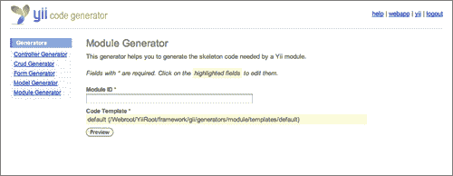

我们需要为模块提供一个唯一名称。由于我们正在创建一个管理模块，我们将非常有创意，并将其命名为`admin`。在**模块 ID**字段中键入此项，然后单击**预览**按钮。如以下屏幕截图所示，它将向您显示它打算生成的所有文件，允许您在创建每个文件之前预览它们：

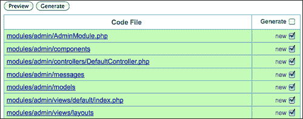

点击**生成**按钮，创建所有这些文件。您需要确保您的`/protected`文件夹可由 web 服务器进程写入，以便自动创建必要的目录和文件。以下屏幕截图显示了模块的成功生成：

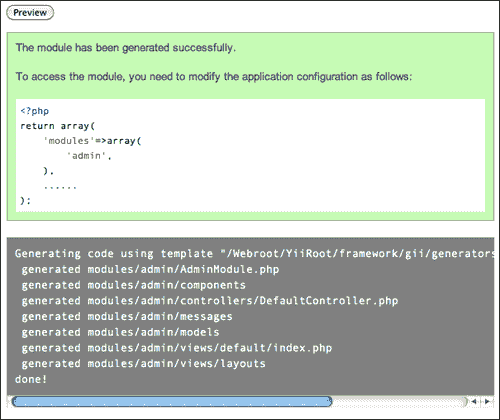

让我们走近一点，看看模块生成器为我们创造了什么。Yii 中的模块被组织为目录，其名称与模块的唯一名称相同。默认情况下，所有模块目录都位于`protected/modules`下。每个模块目录的结构与我们的主应用程序非常相似。这个命令为我们做的是为管理模块创建目录结构的框架。因为这是我们的第一个模块，所以创建了顶层目录`protected/modules`，然后在它下面创建了一个`admin/`目录。下面的屏幕截图显示了我们执行`module`命令时创建的所有目录和文件：


模块必须有一个`module`类，该类可以直接扩展，也可以从`CWebModule`的子类扩展。模块类名是通过组合模块 ID（即我们在创建模块`admin`时提供的名称）和字符串`Module`创建的。模块 ID 的第一个字母也是大写的。所以在我们的例子中，我们的管理模块类文件名为`AdminModule.php`。模块类用作存储模块代码中共享的信息的中心位置。例如，我们可以使用`CWebModule`的`params`属性存储模块特定的参数，并使用其`components`属性在模块级共享应用程序组件。与应用程序类对整个应用程序所起的作用一样，此模块类对模块起着类似的作用。所以`CWebModule`对于我们的模块就像`CWebApplication`对于我们的应用程序一样。

## 使用模块

正如成功创建消息所示，在我们可以使用我们的新模块之前，我们需要配置主应用程序的`modules`属性，将其包括在内以供使用。我们之前在向应用程序中添加`gii`模块时就这样做了，它允许我们访问 Gii 代码生成工具。我们在主配置文件`protected/config/main.php`中进行此更改。以下突出显示的代码表示必要的更改：

```php
'modules'=>array(
      'gii'=>array(
            'class'=>'system.gii.GiiModule',
            'password'=>'iamadmin',
      ),
 'admin',
   ),
```

保存此更改后，我们的新`admin`模块将连接起来以供使用。我们可以通过访问`http://localhost/trackstar/admin/default/index`来查看为我们创建的简单索引页面。我们模块中访问页面的请求路由结构与我们的主应用页面一样，只是需要在路由中包含`moduleID`目录。我们的路线将采用一般形式`/moduleID/controllerID/actionID`。因此 URL 请求`/admin/default/index`正在请求`admin`模块的默认控制器的索引方法。当我们访问此页面时，会看到类似于以下屏幕截图的内容：

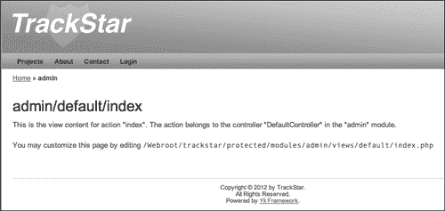

## 模块布局

有一件事我们会注意到，我们在上一章中创建的主题`newtheme`也应用到了我们的模块中。原因是我们的模块控制器类正在扩展`protected/components/Controller.php`，将其布局指定为`$layout='//layouts/column1'`。关键是这个定义前面的双斜杠。这指定我们使用主应用程序路径而不是特定模块路径来查找布局文件。因此，我们将得到应用于模块的布局文件与应用程序其余部分的布局文件相同。如果我们将其设置为单斜杠而不是双斜杠，我们将看到我们的`admin`模块根本没有应用任何布局。去试试吧。原因是，现在只使用单斜杠，即`$layout='/layouts/column1'`，它在模块内查找布局文件，而不是父应用程序。请继续进行此更改，并在继续操作时保留单斜杠定义。

您可以在模块中单独配置几乎所有内容，包括布局文件的默认路径。web 模块的默认布局路径为`/protected/modules/[moduleID]/views/layouts`，在本例中`[moduleID]`为`admin`。我们可以看到此目录下没有文件，因此没有要应用于模块的默认布局。

因为我们有一个特定的主题，所以在我们的案例中，故事稍微有点复杂。我们还可以在此主题内管理所有模块视图文件，包括模块布局视图文件。如果我们要这样做，我们需要添加到我们的主题目录结构，以适应我们的新模块。目录结构与预期非常接近。布局文件的通用格式为`/themes/[themeName]/views/[moduleID]/layouts/`，控制器视图文件的通用格式为`/themes/[themeName]/views/[moduleID]/[controllerID]/`。

为了帮助澄清这一点，让我们了解一下 Yii 在决定新`admin`模块使用哪些视图文件时的决策过程。如前所述，如果我们在布局视图文件前面指定双斜杠（“/”），它将通过父应用程序查找布局文件。但是，让我们看一看使用单斜杠的情况，并要求它在模块中找到适当的布局文件。在单斜杠场景中，以下是在我们的`admin`模块的`DefaultController.php`文件中发出`$this->render('index')`时发生的情况：

1.  Since `render()` is being called, as opposed to `renderPartial()`, it is going to attempt to decorate the specified `index.php` view file with a layout file. And since our application is currently configured to use a theme called `newtheme`, it is going to first look for layout files under this theme directory. Our new module's `DefaultController` class extends our application component `Controller.php`, which has `column1` specified as its `$layout` property. This property is not overridden, so it is also the layout file for `DefaultController`. Finally, since this is all happening within the `admin` module, Yii first looks for the following layout file:

    `/themes/newtheme/views/admin/layouts/column1.php`

    （注意在这个目录结构中包含了`moduleID`）

2.  This file does not exist, so it reverts to looking in the default location for the module. As previously mentioned, the default layout directory is specific to each module. So in this case it will attempt to locate the following layout file:

    `/protected/modules/admin/views/layouts/column1.php`

3.  This file also does not exist, so it will be unable to apply a layout. It will now simply attempt to render the specified `index.php` view file without a layout. However, again since we have specified the specific `newtheme` theme for this application, it will first look for the following view file:

    `/themes/newtheme/views/admin/default/index.php`

4.  该文件也不存在，因此它将在该模块的默认位置（`AdminModule`）即`/protected/modules/admin/views/default/index.php`再次查找该控制器（`DefaultController.php`）。

这解释了为什么页面`http://localhost/trackstar/admin/default/index`呈现时没有任何布局（同样，在我们使用单斜杠作为布局文件声明`$layout='/layouts/column1'`前缀的情况下）。为了让事情暂时保持完全独立和简单，让我们在模块的默认位置管理视图文件，而不是在`newtheme`主题下。另外，让我们将与原始应用程序相同的设计应用于`admin`模块，即应用新主题之前应用程序的外观。通过这种方式，我们的`admin`页面的外观将与普通应用程序页面大不相同，这将有助于提醒我们，我们是在特殊的管理部门，但我们不必花费任何时间来设计新的设计。

### 应用布局

首先，我们为我们的模块设置一个默认布局值。我们在模块类`/protected/modules/AdminModule.php`中的`init()`方法中设置模块范围的配置设置。因此，打开该文件并添加以下突出显示的代码：

```php
class AdminModule extends CWebModule
{
  public function init()
  {
    // this method is called when the module is being created
    // you may place code here to customize the module or the application

    // import the module-level models and components
    $this->setImport(array(
      'admin.models.*',
      'admin.components.*',
    ));

 $this->layout = 'main';

  }
```

这样，如果我们没有在更精细的级别上指定布局文件，例如在控制器类中，所有模块视图都将由位于我们模块的默认布局目录中的布局文件`main.php`修饰，即`/protected/modules/admin/views/layouts/`。

当然，现在我们需要创建这个文件。从主应用程序复制两个布局文件`/protected/views/layouts/main.php`和`/protected/views/layouts/column1.php`，并将它们都放在`/protected/modules/admin/views/layouts/`目录中。在您将这些文件复制到新位置后，我们需要对它们进行一些小更改。

首先，让我们更改`column1.php`。删除调用`beginContent()`中对`//layouts/main`的明确引用：

```php
<?php $this->beginContent(); ?>
<div id="content">
  <?php echo $content; ?>
</div><!-- content -->
<?php $this->endContent(); ?>
```

调用`beginContent()`时未指定输入文件将导致使用我们模块的默认布局，我们刚刚将其设置为新复制的`main.php`文件。

现在，让我们对`main.php`布局文件进行一些更改。我们将在应用程序标题文本中添加**管理控制台**，以强调我们位于应用程序的单独部分。我们还将更改菜单项，使其具有指向**管理员**主页的链接，以及返回主站点的链接。我们可以从此菜单中删除关于和**联系人**的**链接，因为我们不需要在**管理**部分重复这些选项。文件中添加的内容突出显示如下：**

```php
...
<div class="container" id="page">

  <div id="header">
 <div id="logo"><?php echo CHtml::encode(Yii::app()->name) . " Admin Console"; ?></div>
  </div><!-- header -->

  <div id="mainmenu">
    <?php $this->widget('zii.widgets.CMenu',array(
      'items'=>array(
 array('label'=>'Back To Main Site', 'url'=>array('/project')),
 array('label'=>'Admin', 'url'=>array('/admin/default/index')),
        array('label'=>'Login', 'url'=>array('/site/login'), 'visible'=>Yii::app()->user->isGuest),
        array('label'=>'Logout ('.Yii::app()->user->name.')', 'url'=>array('/site/logout'), 'visible'=>!Yii::app()->user->isGuest)
      ),
    )); ?>
  </div><!-- mainmenu -->
```

我们可以保持文件的其余部分不变。现在，如果我们访问我们的`admin`模块页面`http://localhost/trackstar/admin/default/index`，我们会看到如下屏幕截图：

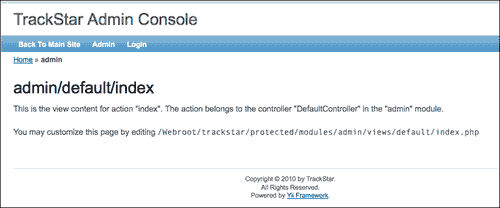

如果我们点击**返回主站点**链接，我们会看到我们被带回主应用程序的新主题版本。

# 限制管理员访问

您可能已经注意到的一个问题是，任何人，包括来宾用户，都可以访问我们新的`admin`模块。我们正在构建这个管理模块，以公开应用程序功能，这些功能应该只能由具有管理权限的用户访问。所以我们需要解决这个问题。

幸运的是，我们已经在应用程序中实现了 RBAC 访问模型，回到[第 7 章](07.html "Chapter 7. User Access Control")、*用户访问控制*。我们现在需要做的就是扩展它，为管理员添加一个新角色，并为该角色提供新的权限。

如果您还记得[第 7 章](07.html "Chapter 7. User Access Control")、*用户访问控制*中，我们使用 Yii`console`命令来实现我们的 RBAC 结构。我们需要补充这一点。因此，打开包含该`console`命令的文件`/protected/commands/shell/RbacCommand.php`，并在创建`owner`角色的地方添加以下代码：

```php
//create a general task-level permission for admins
 $this->_authManager->createTask("adminManagement", "access to the application administration functionality");   
 //create the site admin role, and add the appropriate permissions   
$role=$this->_authManager->createRole("admin"); 
$role->addChild("owner");
$role->addChild("reader"); 
$role->addChild("member");
$role->addChild("adminManagement");
//ensure we have one admin in the system (force it to be user id #1)
$this->_authManager->assign("admin",1);
```

这将创建一个名为`adminManagement`的新任务和一个名为`admin`的新角色。然后将`owner`、`reader`和`member`角色与`adminManagement`任务一起作为子任务添加，以便`admin`角色从所有这些角色继承权限。最后，它将`admin`角色分配给系统中的第一个用户，以确保至少有一个管理员可以访问我们的管理模块。

现在我们必须重新运行命令，用这些更改更新数据库。为此，只需使用`rbac`命令运行`yiic`命令行工具：

```php
% cd Webroot/trackstar/protected
% ./yiic rbac

```

### 注

添加此附加角色后，我们还应该更新提示时显示的消息中的文本，以继续指示将创建第四个角色。我们将把它作为练习留给读者。此更改已在可下载的代码文件中进行，以供参考。

通过对 RBAC 模型的这些更改，我们可以在`AdminModule::beforeControllerAction()`方法中添加访问检查，这样`admin`模块中的任何内容都不会执行，除非用户处于`admin`角色：

```php
public function beforeControllerAction($controller, $action)
{
  if(parent::beforeControllerAction($controller, $action))
  {
    // this method is called before any module controller action is performed
    // you may place customized code here
 if( !Yii::app()->user->checkAccess("admin") )
 {
 throw new CHttpException(403,Yii::t('application','You are not authorized to perform this action.'));
 }
 return true;
  }
  else
    return false;
}
```

这样，如果未被分配`admin`角色的用户现在试图访问**管理**模块中的任何页面，他们将收到 HTTP 403 授权错误页面。例如，如果您未登录，尝试访问**管理员**页面，您将收到以下结果：

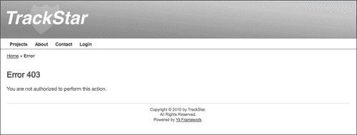

对于任何未被分配到`admin`角色的用户，同样适用。

现在我们可以有条件地在主应用程序菜单中添加一个指向站点**管理**部分的链接。这样，具有管理权限的用户就不必记住繁琐的 URL 即可导航到**管理**控制台。作为提醒，我们的主应用程序菜单位于我们应用程序的主题默认应用程序布局文件`/themes/newtheme/views/layouts/main.php`中。打开该文件并将以下突出显示的代码添加到菜单部分：

```php
<div id="mainmenu">
  <?php $this->widget('zii.widgets.CMenu',array(
    'items'=>array(
      array('label'=>'Projects', 'url'=>array('/project')),
      array('label'=>'About', 'url'=>array('/site/page', 'view'=>'about')),
      array('label'=>'Contact', 'url'=>array('/site/contact')),
 array('label'=>'Admin', 'url'=>array('/admin/default/index'), 'visible'=>Yii::app()->user->checkAccess("admin")),
      array('label'=>'Login', 'url'=>array('/site/login'), 'visible'=>Yii::app()->user->isGuest),
      array('label'=>'Logout ('.Yii::app()->user->name.')', 'url'=>array('/site/logout'), 'visible'=>!Yii::app()->user->isGuest)
    ),
  )); ?>
</div><!-- mainmenu -->
```

现在，当以具有`admin`访问权限的用户身份登录应用程序时（我们将其设置为`user id = 1`，**用户一**），我们将在顶部导航中看到一个新链接，该链接将带我们进入网站新增的**管理员**部分。

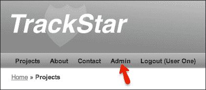

# 添加系统范围的消息

一个**模块**可以被认为是一个小型应用程序本身，向模块添加功能实际上与向主应用程序添加功能的过程相同。让我们为管理员添加一些新功能；我们将添加管理用户首次登录应用程序时向其显示的系统范围消息的功能。

## 创建数据库表

像通常使用全新功能的案例一样，我们需要一个存放数据的地方。我们需要创建一个新表来存储系统范围的消息。为了示例的目的，我们可以保持这一点非常简单。以下是我们表格的定义：

```php
CREATE TABLE `tbl_sys_message` 
( 
  `id` INTEGER NOT NULL PRIMARY KEY AUTO_INCREMENT,
  `message` TEXT NOT NULL, 
  `create_time` DATETIME,
  `create_user_id` INTEGER,
  `update_time` DATETIME,
  `update_user_id` INTEGER  
) 
```

当然，我们将创建一个新的数据库迁移来管理添加这个新表时所做的更改。

```php
% cd Webroot/trackstar/protected
% ./yiic migrate create_system_messages_table

```

这些命令在`protected/migrations/`目录下创建一个新的迁移文件。此文件的内容可从可下载代码或独立代码段中获取，该代码段位于[https://gist.github.com/3785282](https://gist.github.com/3785282) 。（我们没有包括类名；请记住，文件名和相应的类将具有不同的时间戳前缀。）

此文件就位后，我们可以运行迁移以添加此新表：

```php
% cd Webroot/trackstar/protected
% ./yiic migrate

```

## 创建我们的模型和 CRUD 脚手架

现在我们已经创建了表，下一步是使用我们最喜欢的工具 Gii 代码生成器生成`model`类。我们将首先使用**模型生成器**选项来创建`model`类，并使用**CURD 生成器**选项来创建我们的基本支架，以快速与该模型交互。继续并导航到用于创建新模型的 Gii 工具表单（`http://localhost/trackstar/gii/model`。这一次，由于我们是在模块的上下文中执行此操作，因此需要显式指定模型路径。用以下屏幕截图中所示的值填写表格（当然，您的**代码模板**路径值应特定于您的本地设置）：

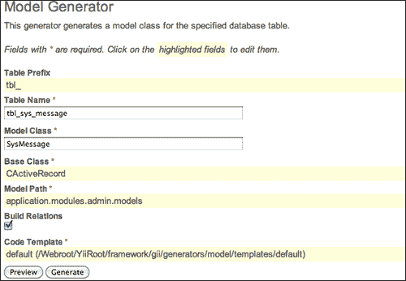

请注意，我们将**模型路径**文本框更改为`application.modules.admin.models`。点击**生成**按钮，继续生成**模型类**值。

现在我们可以用大致相同的方法创建 CRUD 脚手架。同样，我们之前所做的和现在所做的唯一真正的区别是我们的规范，`model`类的位置在`admin`模块中。在 Gii 工具中选择**CURD 发生器**选项后，填写**模型类**和**控制器 ID**表单字段，如下图截图所示：

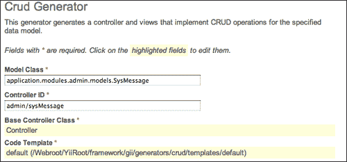

这会提醒工具我们的`model`类在`admin`模块下，我们的控制器类以及与此代码生成相关的所有其他文件也应该放在`admin`模块内。

首先点击**预览**按钮，然后点击**生成**按钮，完成创建。以下屏幕截图显示了此操作创建的所有文件的列表：

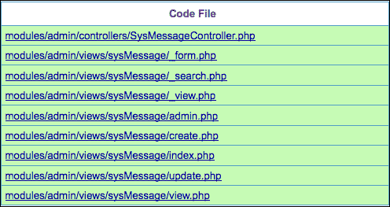

## 添加到我们新功能的链接

让我们在主`admin`模块导航中添加一个新的菜单项，该菜单项链接到我们新创建的消息功能。打开包含模块主菜单导航的文件`/protected/modules/admin/views/layouts/main.php`，并将以下`array`项添加到菜单小部件中：

```php
array('label'=>'System Messages', 'url'=>array('/admin/sysMessage/idex')),
```

如果我们在`http://localhost/trackstar/admin/sysMessage/create`查看新系统消息，我们会看到以下内容：

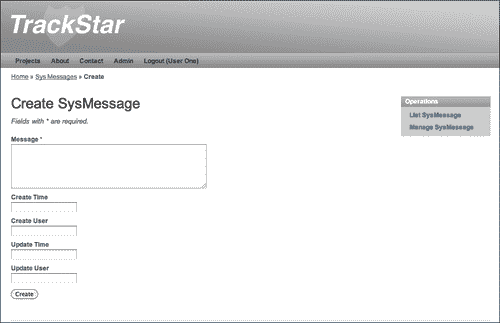

新系统消息功能的自动创建的控制器和视图文件是使用主应用程序中的两列布局文件创建的。如果您查看`SysMessageController.php`类文件内部，您将看到定义如下的布局：

```php
public $layout='//layouts/column2';
```

注意前面的双斜线。因此，我们可以看到，我们新添加的管理功能没有使用我们的`admin`模块布局文件。我们可以修改`controller`类以使用`admin`模块中现有的单列布局文件，也可以向模块布局文件中添加两列布局文件。后者会稍微容易一些，而且看起来也会更好，因为所有视图文件都是创建为在第二个右栏中显示其子菜单项（即指向所有 CRUD 功能的链接）。我们还需要修改新创建的模型类和相应的表单，以删除一些不需要的表单字段。以下是我们需要做的全部工作：

1.  将我们的主应用程序中的两列布局复制到我们的模块中，即将`/protected/views/layouts/column2.php`复制到`/protected/modules/admin/views/layouts/column2.php`。
2.  删除`//layouts/main`作为新复制的`column2.php`文件中第一行`beginContent()`方法调用的输入。
3.  修改`SysMessage`模型类，扩展`TrackstarActiveRecord`。（如果您还记得，这会添加代码来自动更新我们的`create_time/user and update_time/user`属性。）
4.  更改`SysMessageController`控制器类以使用模块目录中的新`column2.php`布局文件，而不是主应用程序中的布局文件。自动生成的代码指定了`$layout='//layouts/column2'`，但我们只需要将其设置为`$layout='/layouts/column2'`。
5.  由于我们正在扩展`TrackstarActiveRecord`，我们可以从自动生成的 sys messages 创建表单中删除不必要的字段，并从模型类中删除它们的关联规则。例如，从`modules/admin/views/sysMessage/_form.php`中删除以下表单字段：

    ```php
    <div class="row">
        <?php echo $form->labelEx($model,'create_time'); ?>
        <?php echo $form->textField($model,'create_time'); ?>
        <?php echo $form->error($model,'create_time'); ?>
      </div>

      <div class="row">
        <?php echo $form->labelEx($model,'create_user_id'); ?>
        <?php echo $form->textField($model,'create_user_id'); ?>
        <?php echo $form->error($model,'create_user_id'); ?>
      </div>

      <div class="row">
        <?php echo $form->labelEx($model,'update_time'); ?>
        <?php echo $form->textField($model,'update_time'); ?>
        <?php echo $form->error($model,'update_time'); ?>
      </div>

      <div class="row">
        <?php echo $form->labelEx($model,'update_user_id'); ?>
        <?php echo $form->textField($model,'update_user_id'); ?>
        <?php echo $form->error($model,'update_user_id'); ?>
      </div> 
    ```

6.  然后将这两条规则从`SysMessage::rules()`方法更改为：

    ```php
    array('create_user, update_user', 'numerical', 'integerOnly'=>true), and array('create_time, update_time', 'safe'),
    ```

只为用户可以输入的字段指定规则很重要。任何定义了规则的字段都可以通过`POST`或`GET`请求以批量方式进行设置，如果将不希望用户访问的字段保留在规则中，则可能会导致安全问题。

最后一个修改是更新我们的简单访问规则，以反映只有`admin`角色的用户才能访问我们的操作方法的要求。这主要是为了说明，因为我们已经在`AdminModule::beforeControlerAction`方法中使用我们的 RBAC 模型方法处理了访问。实际上，我们可以完全删除`accessRules()`方法。但是，让我们更新它们以反映需求，这样您就可以看到使用访问规则方法将如何工作。在`SysMessageController::accessRules()`方法中，将整个内容更改为以下内容：

```php
public function accessRules()
{
  return array(
    array('allow',  // allow only users in the 'admin' role access to our actions
      'actions'=>array('index','view', 'create', 'update', 'admin', 'delete'),
      'roles'=>array('admin'),
    ),
    array('deny',  // deny all users
      'users'=>array('*'),
    ),
  );
}
```

好的，所有这些都准备好了，如果我们现在通过访问`http://localhost/trackstar/admin/sysMessage/create`访问我们的新消息输入表单，我们将看到类似于以下屏幕截图的内容：

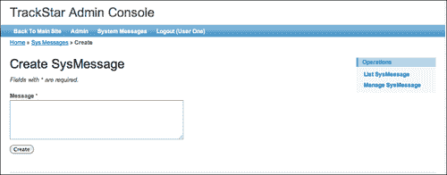

在表格中填写信息`Hello Users! This is your admin speaking...`，点击**创建**。应用程序会将您重定向到此新创建消息的详细信息列表页面，如以下屏幕截图所示：

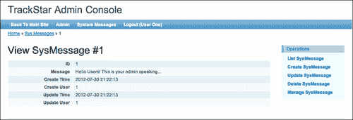

## 向用户显示消息

现在我们的系统中有一条消息，让我们在应用程序主页上向用户显示它。

### 导入新模型类进行应用程序范围的访问

为了从应用程序中的任何位置访问新创建的模型，我们需要将其作为应用程序配置的一部分导入。更改`protected/config/main.php`以包含新的`admin module models`文件夹：

```php
// autoloading model and component classes
'import'=>array(
  'application.models.*',
  'application.components.*',
 'application.modules.admin.models.*',
),
```

### 选择最近更新的消息

我们将把显示限制为只显示一条消息，并根据表中的`update_time`列选择最近更新的消息。由于我们想将其添加到主项目列表页面，因此需要修改`ProjectController::actionIndex() method`。通过添加以下突出显示的代码来更改该方法：

```php
public function actionIndex()
  {
      $dataProvider=new CActiveDataProvider('Project');

      Yii::app()->clientScript->registerLinkTag(
          'alternate',
          'application/rss+xml',
          $this->createUrl('comment/feed'));

 //get the latest system message to display based on the update_time column
 $sysMessage = SysMessage::model()->find(array(
 'order'=>'t.update_time DESC',
 ));
 if($sysMessage !== null)
 $message = $sysMessage->message;
 else
 $message = null;

      $this->render('index',array(
        'dataProvider'=>$dataProvider,
 'sysMessage'=>$message,
      ));
  }
```

现在我们需要修改视图文件以显示新的内容。将以下代码添加到`views/project/index.php`，就在`<h1>Projects</h1>`标题文本上方：

```php
<?php if($sysMessage !== null):?>
    <div class="sys-message">
        <?php echo $sysMessage; ?>
    </div>
<?php endif; ?>
```

现在，当我们访问我们的项目列表页面（即我们的应用程序主页）时，我们可以看到它的显示，如以下屏幕截图所示：

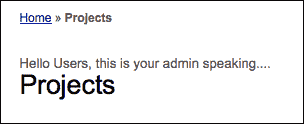

### 增加一点设计调整

好的，这是我们想要它做的，但是这条消息对用户来说并不是很突出。让我们通过向主 CSS 文件（`/themes/newtheme/css/main.css`中添加一个小片段来改变这一点：

```php
div.sys-message
{
  padding:.8em;
  margin-bottom:1em;
  border:3px solid #ddd;
  background:#9EEFFF;
  color:#FF330A;
  border-color:#00849E;
}
```

有了这一点，我们的信息现在真的在页面上脱颖而出。以下屏幕截图显示了包含这些更改的消息：


有人可能会说，这种设计上的调整有点过头了。如果用户不得不整天盯着这些消息的颜色看，他们可能会头疼。与其调低颜色，不如使用一点 JavaScript 在 5 秒钟后将消息淡出。由于用户每次访问此**主页**页面时，我们都会显示此消息，因此最好避免用户长时间盯着它看。

我们将使事情变得简单，并利用 Yii 随强大的 JavaScript 框架 jQuery 一起提供的事实。**jQuery**是一个开源的 JavaScript 库，它简化了 HTML**文档对象模型**（**DOM**）与 JavaScript 之间的交互。深入研究 jQuery 的细节超出了本书的范围。为了更加了解它的特性，访问它的文档是非常值得的。由于 Yii 随 jQuery 一起提供，您只需在视图文件中注册 jQuery 代码，Yii 将为您提供核心 jQuery 库。

我们还将使用 application helper 组件`CClientScript`在生成的网页中为我们注册 jQuery JavaScript 代码。它将确保已将其放置在适当的位置，并已正确标记和格式化。

因此，让我们修改之前添加的内容，以包含一个 JavaScript 片段，该片段将淡出消息。将我们刚刚添加到`views/project/index.php`的内容替换为以下内容：

```php
<?php if($sysMessage != null):?>
    <div class="sys-message">
        <?php echo $sysMessage; ?>
    </div>
<?php
  Yii::app()->clientScript->registerScript(
     'fadeAndHideEffect',
     '$(".sys-message").animate({opacity: 1.0}, 5000).fadeOut("slow");'
  );
endif; ?>
```

现在，如果我们重新加载主项目列表页面，我们会看到消息在 5 秒后消失。有关可以轻松添加到页面中的酷 jQuery 效果的更多信息，请查看[上的 jQuery API 文档 http://api.jquery.com/category/effects/](http://api.jquery.com/category/effects/) 。

最后，为了让自己相信一切都按预期进行，您可以添加另一条系统范围的消息。由于此较新消息将具有较新的`update_time`属性，因此它将显示在项目列表页面上。

# 总结

在本章中，我们介绍了 Yii 模块的概念，并通过使用 Yii 模块创建站点的管理部分来演示其实用性。我们演示了如何创建新模块，如何更改模块的布局和主题，如何在模块中添加应用程序功能，甚至如何利用现有 RBAC 模型，对模块中的功能应用授权访问控制。我们还演示了如何使用 jQuery 向应用程序添加少量的 UI flare。

添加了这个管理界面后，我们现在就拥有了应用程序的所有主要部分。虽然这个应用程序非常简单，但我们觉得是时候让它准备好投入生产了。下一章将重点介绍为生产部署准备应用程序。