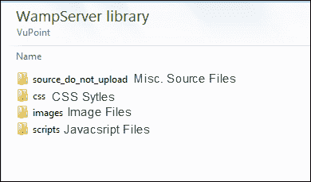
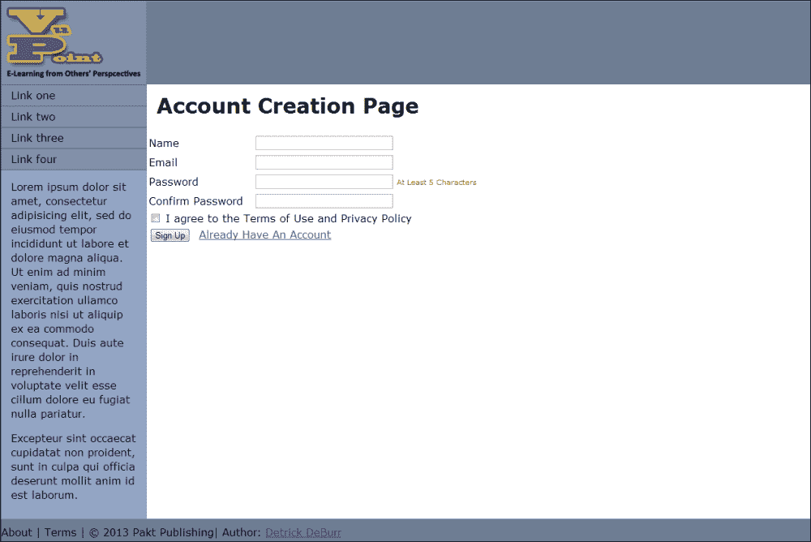
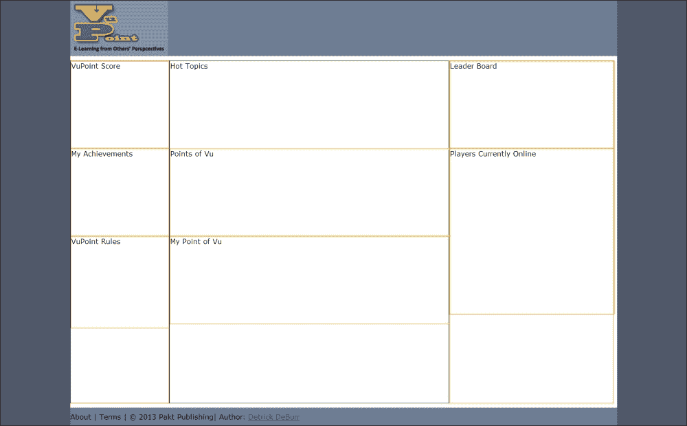

# 第五章活动

任何游戏化系统的核心是活动。用户是谁以及他/她的动机很重要，但归根结底，这一切都归结为系统允许用户进行的活动。在本章中，我们将讨论该活动。我们关注我们的玩家能够并且将要参与的元素、进展循环和参与场景。

游戏化系统中的活动只是游戏机制的一个配方。这些是在游戏场景中控制玩家行为的原则、规则和结构。它们通过奖励、反馈和激励系统勾勒出玩家的动作。正是游戏机制使系统变得有趣。

然而，我们必须清楚，游戏元素不是游戏，就像足球不是足球游戏一样。然而，它是游戏的一个要素和关键机制。它的本质决定了玩家在游戏中能做什么和不能做什么。例如，如果我们用棒球来代替足球，这项运动的基本性质就会改变。因此，力学是游戏化系统的核心。

# 游戏元素金字塔

根据《赢家的*：游戏思维如何改变你的商业*一书的作者凯文·沃巴赫博士的说法，游戏元素分为三类，构成了他所谓的**游戏元素金字塔**，如下图所示：


游戏元素金字塔是一种视觉思考各种游戏元素的方式。**动力学**是关于大局的。它们代表了系统中的进程、叙事和系统对玩家的总体约束。系统的**力学**是系统的动词。它们是使玩家沿着前进循环移动的元素。**组件**为详细信息。当我们想到诸如积分、排行榜、徽章等游戏元素时，就会想到这些东西。构成游戏化体验的一切都可以在元素金字塔中分类。

# 游戏化工具箱——优于 PBL

游戏化批评家们很快指出，游戏元素的糟糕使用表明游戏化还有很多需要改进的地方。在许多情况下，它们是正确的。PBL（积分、徽章和排行榜）正迅速成为游戏化应用程序的主要内容。虽然它们是优秀的游戏元素，但它们在特定场景中可能有意义，也可能没有意义。优秀的游戏元素永远不会让设计拙劣的过程变得有趣。更重要的是，我们不应该希望他们会。不幸的是，他们正在定义游戏化行业。

然而，在**游戏化工具箱**中有无数工具（即游戏元素）可供我们使用，只有那些鼓励我们针对的行为的工具才重要。决定系统成功与否的是元素的质量与数量。

以下是一些游戏动态的例子：

*   **社交互动**：人际关系产生团队感和归属感。例如，与朋友分享成就。
*   **情绪**：挫折和成就感是游戏化环境可能诱发的情绪。例如，提出稍微超出玩家技能水平的挑战会引起挫败感。另一方面，玩家在掌握挑战后会有成就感。
*   **约束**：所有游戏的核心都是迫使玩家进行权衡的规则，例如，玩家现在可以在游戏中访问更多资产，但解决挑战的时间可能更短。
*   **进展**：球员随时间的发展；例如，当一名球员在比赛中表现更好时，她会获得一个头衔。例如，Foursquare 用户会随着时间的推移逐渐晋升为市长。
*   **叙事**：持续的故事情节；例如，玩家在整个游戏中扮演一个角色，故事围绕玩家和其他游戏机制展开。

以下是一些游戏机制的示例：

*   **奖励**：由于内在/外在奖励，玩家被移动以采取某些行动
*   **反馈**：玩家需要了解他们在系统中的进展情况
*   **比赛**：有明确的赢家和输家
*   **挑战**：系统中需要一定程度努力的任务

以下是一些更常见的游戏元素（即工具）：

*   **排行榜**：此工具指定玩家进展和成就的视觉显示
*   **级别**：此工具指定玩家进程中定义的步骤
*   **徽章**：此工具指定成就的视觉表示
*   **积分**：此工具指定游戏进程的数字表示
*   **任务**：该工具通过目标和奖励指定预定义的挑战
*   **社交图**：此工具指定玩家在游戏中的社交网络表示
*   **团队**：此工具指定为共同目标共同工作的已定义玩家组
*   **虚拟商品**：该工具指定具有感知或真实货币价值的游戏资产

通过游戏元素的正确组合，如前几段所述，以及数据分析和社交媒体，我们的目标是创造一种引人入胜的体验。

我们的电子学习应用程序的正确组合是什么？以下是我们可以考虑的几个标准：

*   **积分**：我们为目标行为打分
*   **徽章**：我们正在制作徽章，以达到预定的成就
*   **排行榜**：我们在主页的显著位置展示了一份顶级玩家名单（按分值）
*   **反馈**：我们在应用程序的每个屏幕/视图上突出显示玩家当前的分数
*   **竞争**：我们充分利用竞争，允许玩家批评和/或捍卫其他玩家的观点

# VuPoint 应用

让我们再次关注我们的应用程序代码。我们将从应用程序的用户界面方面开始。这是处理用户与应用程序交互的代码。由于这是一个 web 应用程序，因此此代码将在 web 浏览器中运行。JavaScript 已经成为编写在 web 浏览器中运行的代码的事实上的语言。

## jQuery

如前所述，我们需要有一些地方来编写代码。在上一章中，这主要是在数据库中。这里我们将注意力转向服务器（PHP）和客户机（jQuery）。

在继续之前，让我们在 Wamp 服务器安装的根（`www`文件夹中为 VuPoint 应用程序创建一个目录结构。这是您完成后应该拥有的：



jQuery 是一个流行的开源 JavaScript 框架，允许我们使用**文档对象模型**（**DOM**）在浏览器中搜索（或查询）项目，并与这些项目交互。因此命名为 jQuery。jQuery 的一个主要优点是它可以为我们处理许多不同的浏览器细微差别，使我们只关注我们想要做的事情，而不是不同的浏览器如何处理我们的代码。jQuery 保护我们不受影响。

在应用程序中安装 jQuery 有几个选项。我们可以从[www.jquery.com/downloads](http://www.jquery.com/downloads)下载整个图书馆。我们应该在生产环境中使用压缩版本，在开发和调试中使用未压缩版本。第三种选择是使用来自**内容交付网络**（**CDN**的托管版本的库。这里有几个你可以考虑使用的地方。这真的是一个偏好的问题，你宁愿从你的系统有一个可靠的互联网连接。如果没有 Internet 连接，则需要在本地计算机上下载代码的版本。这是我们将要做的，但以下是一些常见的 jQuery CDN 来源：

*   jQuery

    ```php
    <script src="http://code.jQuery.com/jQuery-1.9.1.min.js"></script>
    <script src="http://code.jQuery.com/jQuery-migrate-1.1.1.min.js"></script>
    ```

*   谷歌

    ```php
    <script src="//ajax.googleapis.com/ajax/libs/jQuery/2.0.0/jQuery.min.js"></script>
    ```

*   微软

    ```php
    <script src="http://ajax.aspnetcdn.com/ajax/jQuery/jQuery-1.9.0.js"></script>
    ```

我们将直接在我们的系统上下载并安装库，如下图所示：


下载后，只需将`.js`文件保存到`scripts`目录，我们将在那里存储所有 JavaScript 代码。

我们可以通过创建和运行一个简单的页面来测试 jQuery 是否已安装。我们将创建一个`.js`文件来保存 HelloWorld JavaScript 方法。然后，我们将在`Vupoint`文件夹的根目录中创建一个`index.html`页面并执行它。

### Vupoint.js

此代码验证 jQuery 已成功安装：

```php
function HelloWorld(){
  alert('Hello World');
}
```

### Index.html

```php
<html>
  <head>
    <meta http-equiv="Content-Type" content="text/html; charset=utf-8">
    <title>VuPoint E-Learning System</title>
    <link href="assets/stylesheets/main.css" rel="stylesheet" type="text/css" media="all">
    <script  type="text/javascript" src="scripts/jQuery-2.0.0.js"></script>
    <script  type="text/javascript" src="scripts/vupoint.js"></script>
  <script  type="text/javascript" >
  $(document).ready(function(){
  HelloWorld();
  });

</script>
  </head>
<body>

<body>
</html>
```

前面代码生成的输出如下图所示：


## 主页

现在我们知道一切都在顺利进行，我们将把注意力转向构建电子学习应用程序的框架。

在大多数网站中，当没有专门调用其他页面时，会向用户显示默认页面或索引页面。在本例中，我们将构建一个`index.php`页面，该页面将位于应用程序的`root`文件夹中。这将是第一页被调用。

然而，我们的`index.php`页面不会向用户显示任何内容。它将更多地作为我们应用程序的驱动程序。它将简单地重定向到实际用户视图的其他单独页面。最初，我们将检查用户的计算机上是否有`VuPointuser`cookie。如果找到，这意味着他们有一个帐户，可以直接进入主视图页面或登录页面。我们将在帐户创建和登录页面就绪后添加此功能。以下是我们初始`index.php`页面的代码：

```php
<html>
  <head>
    <meta http-equiv="Content-Type" content="text/html; charset=utf-8">
    <title>VuPoint E-Learning System</title>
    <link href="assets/stylesheets/main.css" rel="stylesheet" type="text/css" media="all">
    <script  type="text/javascript" src="scripts/jQuery-2.0.0.js"></script>
    <script  type="text/javascript" src="scripts/vupoint.js"></script>
    <script  type="text/javascript" >
      $(document).ready(function(){
        HelloWorld();
      });
    </script>
  </head>
  <body>
    <?php
      deleteCookie("VuPointUser");
    if(!isset($_COOKIE['VuPointUser'])) {
      redirect('AccountCreation.php');
    }else{
      redirect('Login.php');
    }
    function redirect($url, $statusCode = 303)
    {
      header('Location: ' . $url, true, $statusCode);
      die();
    }
    function deleteCookie($cookieName){
      setcookie($cookieName, "", time()-3600);
    }
    ?>
  <body>
</html>
```

# 账户创建页面

这是玩家将看到的实际页面，如下面的屏幕截图所示。当没有找到`VuPointUser`cookie 时，他/她会被重定向到它。



创建此页面的代码如下所示：

```php
<?php include 'header.php'; ?>
<div class="container">
  <?php include 'menu.php'; ?>
  <div class="content">
    <h1>Account Creation Page</h1>
    <form action="AccountCreation.php" method="post">
    <table width="550" border="0">
  <tr>
    <td>Name</td>
    <td><input id="username" type="text" size="30" /></td>
  </tr>
  <tr>
    <td>Email</td>
    <td><input id="email" type="text" size="30" /></td>
  </tr>
  <tr>
    <td>Password</td>
    <td><input  id="password" type="password" size="30" /><span class="instruction"> At Least 5 Characters<span></td>
  </tr>
  <tr>
    <td>Confirm Password</td>
    <td><input id="confirmPassword" type="password" size="30" /></td>
  </tr>
<tr>
    <td colspan="2">
    <input id="termsofuseagreement" type="checkbox" value="" />
    I agree to the Terms of Use and Privacy Policy</td>
  </tr>
<tr>
    <td colspan="2">
  <input id="signup" type="button" value="Sign Up" onClick="return ValidateAccountCreationForm();" />&nbsp; <a href="Login.php">Already Have An Account</a> </tr>
</table>
</form>
  </div>
   <?php include 'footer.php'; ?>
  </div>
</body>
</html>
```

现在我们有了页面本身，当我们点击**注册**按钮时，实际会发生什么？

点击**注册**按钮，我们需要做以下几件事：

1.  验证表单。
    1.  确保玩家输入的密码匹配。
    2.  确保播放机输入了有效的电子邮件地址。
2.  将此新帐户添加到数据库。
3.  将`VuPointUser`cookie 添加到播放器的浏览器中。
4.  让玩家登录。
5.  带他/她到主视图。

这似乎需要考虑很多事情，但我们将以一种小型模块化的方式开发和编码它们。

## 验证表格

由于这是客户端功能，我们将使用 jQuery 处理。尽管有免费的插件可以帮助我们进行验证，但我们将编写自己的插件。我们首先在`vupoint.js`文件中添加一个表单验证方法。

以下是我们需要的几种方法：

```php
//Purpose: Test to see if the information on the form is valid
function ValidateAccountCreationForm(){
  if(EmailAddressValid()&&PasswordLongEnough(5)&&PasswordsMatch())
    {return true;}
  else
    {return false;}
}

//Purpose: Test to see if the email address is valid
function EmailAddressValid(){
  var emailAddress=$("#email").val();
  var re = /^(([^<>()[\]\\.,;:\s@\"]+(\.[^<>()[\]\\.,;:\s@\"]+)*)|(\".+\"))@((\[[0-9]{1,3}\.[0-9]{1,3}\.[0-9]{1,3}\.[0-9]{1,3}\])|(([a-zA-Z\-0-9]+\.)+[a-zA-Z]{2,}))$/;
  if(!re.test(emailAddress)){
    alert('The Email Address you entered is not valid. TryAgain');
  $("#email").focus();
  return false;
  }
  else{
    return true;
  }
}

//Purpose: Test to see if the entered password is long enough 
function PasswordLongEnough(len){
  if(parseInt($("#password").val().length) < parseInt(len)){
    alert('The Password you entered is not long enough. Try Again');
  $("#password").focus();
  return false;
  }
  else{
    return true;
  }
}

//Purpose: Test to see if the entered passwords match
function PasswordsMatch(){
  if(($("#password").val()!=$("#confirmPassword").val())){
    alert('The Passwords you entered do not match. Try Again');
    $("#password").focus();
    return false;
  }
  else{
    return true;
  }
}
```

## 向数据库写入新帐户

现在我们将注意力转向编写一个 php 函数，将表单中的信息插入`VuPoint`数据库。此函数接受表单中的用户名、密码和电子邮件地址，并将播放机插入数据库。此功能的编码如下：

```php
function CreatePlayerAccount($UserName,$Password,$EmailAdddress){
  createDBConnection();
  $CheckIfExist = "Select count(*) from Player where UserName='$UserName' and Password='$Password' and EmailAddress='$EmailAdddress'";
  $insStatment = "Insert into Player (UserName,Password,EmailAddress) values('$UserName','$Password','$EmailAdddress')";
  $result = mysql_query($CheckIfExist);
  $row = mysql_fetch_row($result);
  $numOfRows = $row[0];
  if($numOfRows>0){
    echo '<p>You already have a VuPoint Account.</p>';
    return false;
  }
  else{
    if(mysql_query($insStatment)){
    return true;
  }
  else{
    die("Insert  failed ".mysql_error());
    return false;
    }
  }
}
```

## 登录页面

**登录页面**是账户创建页面的补充页面。玩家将获得此页面以登录到站点的主视图。如下图所示为：


```php
<?php include 'vupoint.php'; ?>
<?php include 'header.php'; ?>

<div class="container">
  <?php include 'menu.php'; ?>
  <div class="content">
  <?php if(isset($_POST['login'])=='Login') {
    $UserNameEmail=$_POST['username_email'];
    $Password=$_POST['password'];
    if(LogPlayerIn($UserNameEmail,$Password)){
      redirect('MainVu.php');
    }
    else{
      echo 'Invalid Login... Try Again';
    }
    }
    else{ ?>
      <h1>Login Page</h1>
       <form action="Login.php" method="post">
    <table width="420" border="0">
  <tr>
    <td>Player Name/Email</td>
    <td><input id="username_email" name="username_email" type="text" size="30" /></td>
  </tr>
  <tr>
    <td>Password</td>
    <td><input id="password" name="password" type="password" size="30" /></td>
  </tr>
  <tr>
    <td colspan="2">
    <input name="rememberme" type="checkbox" value="" />
    Remember Me</td>
  </tr>
  <tr>
    <td colspan="2">
  <input name="login" type="submit" value="Login"  onClick="return ValidateLoginForm();"/>&nbsp; <a href="accountcreation.php">Sign Up</a> </tr>
    </table>
  </form>
  <?php } ?>
  </div>
    <?php include 'footer.php'; ?>
  </div>
  </body>
</html>
```

我们可以使用 jQuery 和 JavaScript 验证用户输入的内容，就像我们对帐户创建页面所做的一样，如下面的代码片段所示：

```php
function ValidateLoginForm(){
  var pwd = $("#password").val(),username='',emailaddress = '',username_email=$("#username_email").val();
  if(pwd==''||username_email==''){
    alert('You have entered an invalid username/email and password combination');{
  return false;
  }
}
```

## 主页面视图

我们在这里布局主页。一旦我们有了布局结构，我们就准备好用代码填充每个模块（块），以开发该功能，如以下代码片段所示：

```php
<?php include 'vupoint.php'; ?>
<?php include 'header.php'; ?>
<div class="container">
<div class="header">
  <a href="../VuPoint"></a>
    </div>
  <div class="content" style="width:100%">
    <div id="col1">
    <div id="vupointscorediv">VuPoint Score</div>
    <div id="myachievementsdiv">My Achievements</div>
    <div id="vupointrulesdiv">VuPoint Rules</div>
    </div>
    <div id="col2">
    <div id="hottopicsdiv">Hot Topics</div>
    <div id="pointsofvudiv">Points of Vu</div>
    <div id="mypointofvudiv">My Point of Vu</div>
    </div>
    <div id="col3">
    <div id="leaderboardsdiv">Leader Board</div>
    <div id="playersonlinenowdiv">Players Currently Online</div>
    </div>
   </div>
   <?php include 'footer.php'; ?>
  </div>
</body>
</html>
```

以下是我们现在应该拥有的与之前的草图模型相比：



这是我们的原始模型：


# 总结

在这一点上，我们应该有一个很好的想法，我们正在努力发展和为什么。

我们开发了游戏化系统的核心。我们已经概述了我们的玩家与之互动的活动。我们已经了解了他/她是谁，他/她的动机是什么。定义了我们的要素、进展循环和参与场景。从我们可以使用的无数游戏机制中，我们将其缩小到我们认为玩家会找到乐趣的原则、规则和结构。在下一章中，我们将深入探讨这种乐趣的概念。