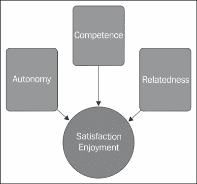
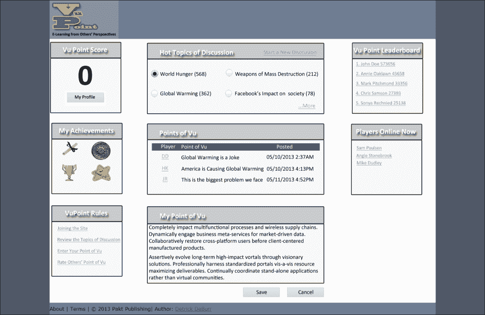

# 第六章乐趣

为什么首先要将应用程序游戏化？让事情变得更有趣有什么意义？我们是否回避了操纵的主要问题？我们应该操纵任何人做任何事吗？他们应该做他们想做的事。生活和幸福不都是“自由意志”吗？也许是这样，但科学和大量研究表明，我们的行为方式和我们所做的事情显然比我们最初想象的更可预测和更具可塑性。

# 内在行为与外在行为

真正的问题是，我们是否曾经主动做过一些事情（目标行为），或者某件事或某个人是否总是需要推动和刺激我们？从长远来看，推动和督促用户按照我们的系统行事是不可持续的。我们需要让我们的目标行为成为我们的玩家在没有挑衅的情况下“想要”继续的行为。我们不想继续付钱给他们来执行我们的目标行为。我们希望他们按照制度行事，而不是我们做任何事情，也不需要为他们付出巨大的精力。事实上，我们希望他们自愿这样做。我们希望我们的目标行为成为他们喜欢做的事情。

那么，人们“喜欢”做什么？我们知道他们喜欢做有趣的事情。人们做他们觉得有趣的事情。他们喜欢做有内在利益的事情。奖励的概念是游戏化的一个主要焦点。当我们想到奖励时，首先想到的是积分、金钱、成就等等。游戏化系统中的奖励通常是一件好事。我们认为任何促使人们采取目标行动的事情都是好事。然而，从长远来看，我们希望鼓励发展内在动机。内在动机表明他们会为了采取行动而采取我们想要的行动。演员从动作中获得足够的快乐和幸福，这意味着他/她不再需要外部奖励。

例如，职业运动员通常不会仅仅为了经济补偿而参加他们特定的运动。他们通常不仅仅是为了得分和获胜而踢球。他们玩游戏是因为他们最终喜欢这项运动。他们会玩这个游戏，并且已经这样做了，在他们的大部分生活中，没有任何形式的主要补偿或福利。人们可以放心地认为，胜利是他们的动力。但即使他们输了，他们仍然会继续比赛。

我们需要在我们的系统中建立机制，随着时间的推移提高球员的内在动机水平。这就是乐趣的目的。

我们需要给用户带来乐趣，让他/她有一种享受感。所以，只要他们想要享受，不一定是积分，他们就会加入我们的系统。只要他们想放松，他们就会加入我们的体系。无论何时，只要他们想有所成就，自我感觉良好，他们就会加入我们的体系。这就是我们所说的内在动机。

当一个人决定开发一个游戏化系统时，他/她首先考虑的是外在动机机制。他/她实施计分制、奖励制和领导委员会。这些都是有价值的，但我们也必须包括乐趣的因素。否则，玩家将对采取行动失去兴趣，更重要的是，对“玩我们的游戏”失去兴趣。最终，系统将失败。

我们的第一个目标是在我们的系统中建立内在的动机。玩家参与这个系统是因为他们仅仅因为参与而感到需要、快乐和感激。这对于我们利用有限的资源让他们这样做是非常理想的。这就是我们将重点关注的地方，这就是为什么在一天结束时，让我们的系统充满乐趣是如此重要。

# 什么让“乐趣”变得有趣？

那么，是什么让你觉得有趣？这是一个非常重要的问题。如果我们不知道什么是乐趣，我们如何将它构建到我们的系统中？我们需要明白，一个人的乐趣对另一个人来说并不是乐趣。

我们需要在我们所指的人的上下文中定义乐趣。对不同的人来说，乐趣是不同的。这取决于他们在生活中的位置。这取决于目前对他们最重要的是什么。然而，我们可以概括出什么是乐趣的一般概念。更重要的是，我们可以抓住这些想法的精髓。然后，我们只需要尽可能地实施它们。

当我们做一些迫使我们超越自我的事情时，我们通常会体验到乐趣。当我们努力去完成某件事时，我们会感受到一种快乐。这一理念的核心是成就。成就是有趣的。

许多人觉得打破常规很有趣。当我们摆脱日常生活和周围环境时，我们通常会觉得很愉快。一个惊喜的元素和经历意外往往有一个乐趣的元素。惊喜和意外是有趣的。

根据巴特尔的玩家理论，冒险和探索打动了很多人。他称他们为探险家。这些人从外出和冒险中找到乐趣。

和别人一起做事很有趣。在游戏环境中，与他人的互动会激励社交者。任何有社交成分的活动都被认为是有趣的。

行动很有趣。快乐和被动是很难的。参与、互动和交流往往会激发一定程度的乐趣。

许多人喜欢表达自己。情感表达很有趣。不同的人的情感表达是不同的。通过这项活动，我可以分享我的独特之处，这让我觉得很有趣。我们发现在情感层面上采取行动和表达一些独特和特别的东西很有趣。

乐趣绝对不是一个单一的、一刀切的概念。我们可以识别一些使活动变得有趣的组件或事物，并使用它们。以下是一些：

*   订婚
*   社会互动
*   冒险
*   勘探
*   惊喜
*   不确定性
*   挑战

这些都是增加乐趣的东西。我们可以将这些元素构建到我们的系统中，使系统更有趣。

# 玩家的经历

我们需要一个过程和方法来概括我们为玩家创造的这种愉快的体验。*斯科特·里格比*和*理查德·瑞安*（2006）起草了一份论文，分享他们对*球员体验*的研究。他们称之为**需要满足的玩家体验**（**笔**）模式。他们评估并证明，玩家的体验中至少需要有三样东西才能让体验更愉快：**能力**、**自主性**和**关联性**。



## 能力

玩家需要感觉自己有足够的能力来玩游戏。然而，他们也期望在整个游戏中有一定程度的挑战。挑战和球员的能力水平应该完美匹配。当玩家在游戏中变得更加熟练（更有能力）时，游戏就会变得更加困难。作者 Mihaly Csikszentmihalyi 将此称为“流动”。这是一种理想状态，在这种状态下，任务不会太难，因此一个人会放弃并退出。但是，让他们感到厌烦并不是件容易的事。

目标是使游戏的难度与玩家完成任务的能力保持一致。这会让玩家达到满意的程度。

## 自治

PENS 模型的另一个组成部分是自治。虽然玩家们处于一个游戏机制的结构中，但他们需要感觉自己总是在控制局面。他们可以决定下一步做什么。他们可以使用策略。他们可以自由地采取他们想要的任何行动。

## 关联性

最后，PENS 模型要求关系和社会互动。玩家需要与其他玩家建立联系。例如，在游戏*魔兽世界*中，玩家属于公会。我们还需要创造这种社会互动。

*丹尼尔·平克*是《驱动力：驱动力的惊人真相》一书的作者，他在写作中支持 PENS 模式。在这本书中，平克暗示，掌握知识是我们的动力。这相当于能力。他还表示，我们渴望在我们所做的事情上拥有自主权。最后，他建议我们需要从所采取的行动中感受到一种使命感。我们喜欢知道我们所做的与世界有一定的关联。

虽然关联性并不完全是目的，而且来自不同的角度，但这两个概念是重叠的。也许是关系给一项活动带来了目的。当用户看到他们所做的不仅仅影响到他们自己时，它会影响到整个社会，然后变得更加愉快。

这些都是我们需要在玩家体验中构建的东西，让我们的游戏化系统对玩家来说更有趣、更有趣。我们有很多方法来衡量系统的成功和/或失败。

# 评分模块

首先，我们来看看评分模块。它由 JavaScript 和一个 Ajax 调用组成，以从数据库中实际获取分数数据。下面是 JavaScript 方法的代码：

```php
function GetMyScore(){
  var action='GetMyPoints',
    player=getFromLocalStorage('player');
   $("#myscore").html('0');
   $.ajax({
        dataType: "text",
        data: {action:action,player:player},
        url: $AJAXHANDLER,
        success: function (data) {
    $("#myscore").html(data);
  },
        error: function (xhr, status, error) {
            alert(status + error + xhr.responseText);
        }
    });

  }
```

## AjaxHandler.php

在下面的代码中，Ajax 方法调用`ajax_handler.php`，其任务是接受 Ajax 调用，并根据 Ajax 调用传递给它的动作参数调用正确的 PHP 函数：

```php
<?php include 'vupoint.php'; ?>
<?php
if(isset($_GET['player'])){$player=$_GET['player'];  }

switch ($_GET['action']) {
  case 'GetMyPoints':
  GetMyVuPoints($player);
    break;
    case 'GetLeaderBoard':
  GetLeaderBoard();
  break;
  case 'GetPlayersOnlineNow':
  GetPlayersOnlineNow();
  break;
  case 'GetMyAchievements':
  GetMyAchievements($player);
  break;
  default:
  Error();
  break;
}
?>
```

在本例中，ajax_ 处理程序调用 vupoint.PHP 文件中的`GetMyVuPoints`PHP 函数。它接受玩家的用户名或电子邮件地址，并从数据库中返回玩家的分数。

```php
function GetMyVuPoints($Player){
$storedProcedure = "Select points from Player where UserName='$Player' or EmailAddress='$Player'";
$result = mysql_query($storedProcedure);
$pointsarray = mysql_fetch_row($result);
if($result){
$points = $pointsarray[0];
}else{
$points='10';
}
echo $points;
}
```

# 成就模块

实现模块的流程与其他模块相同。我们对 Ajax_handler.php 进行另一个 Ajax 调用来构建这个模块。注意，在来自 Ajax 调用的回调函数中，数据是用**JavaScript 对象表示法**（**JSON**写入的。我们需要循环这个 JSON 对象来实际访问成就数据。我们还需要动态地构建一个 HTML 表来保存成就图像。最后，我们将已构建的 HTML 附加到 MyProgressions div：

```php
function GetMyAchievements(){
  var action='GetMyAchievements',
  player=getFromLocalStorage('player'),
  html="<table style=\"margin:0 auto;\">";
  $.ajax({
        dataType: "json",
        data: {action:action,player:player},
        url: $AJAXHANDLER,
        success: function (data) {
    var Achievements = data[0].BadgesEarned.split(',');
    for (var i = 0; i < Achievements.length; i++) { 
    AchievementId=Achievements[i];
    html+='<tr>';
    html+='<td><a href=\"#\"></a></td>'
    html+='</tr>';
    }
    html+="</table>";
    $("#myachievementsdiv").append(html);
  },
        error: function (xhr, status, error) {
            alert(status + error + xhr.responseText);
        }
    });

  }

function GetMyAchievements($Player){
$storedProcedure = "Select BadgesEarned  from Player where UserName='$Player' or EmailAddress='$Player'";
$MyAchievements = array();
$fetch = mysql_query($storedProcedure); 
while ($row = mysql_fetch_array($fetch, MYSQL_ASSOC)) {
$row_array['BadgesEarned'] = $row['BadgesEarned'];
array_push($MyAchievements,$row_array);
}
echo json_encode($MyAchievements);
}
```

# 排行榜模块

流程与排行榜模块与成绩模块相同。下面是 JavaScript：

```php
function GetLeaderBoard(){
var action='GetLeaderBoard',html='',Username='',Points='',html="<table>";
$.ajax({
dataType: "json",
data: {action:action},
url: $AJAXHANDLER,
success: function (data){
for (var i = 0; i < data.length; i++) { 
if (data[i].UserName==''){Username='Anonymous'}else{Username=data[i].UserName};
Points = data[i].Points;
html+='<tr><td><a href="#">'+Username +'</a></td><td>'+Points+'</td></tr>';  
}
html+="</table>";
$("#leaderboardsdiv").append(html);
},
error: function (xhr, status, error) {
}
});
}
```

下面是相关的 PHP 函数：

```php
function GetLeaderBoard(){
$storedProcedure = "Select distinct UserName,Points from Player order by points desc LIMIT 0,5";
$Leaders = array();
$fetch = mysql_query($storedProcedure); 
while ($row = mysql_fetch_array($fetch, MYSQL_ASSOC)) {
$row_array['UserName'] = $row['UserName'];
$row_array['Points'] = $row['Points'];
array_push($Leaders,$row_array);
}
echo json_encode($Leaders);
}
```

# 玩家目前在线

让我们构建代码以获取并显示当前在线的玩家列表。在这里，我们编写了一个 JavaScript 函数，它调用我们的 PHP 模块来返回已登录玩家的列表。

JavaScript 函数如下所示：

```php
function GetPlayersOnlineNow(){
var action='GetPlayersOnlineNow',Username='',  html="<table>";
$.ajax({
dataType: "json",
data: {action:action},
url: $AJAXHANDLER,
        success: function (data){
    for (var i = 0; i < data.length; i++) { 
    if(data[i].UserName==''){Username='Anonymous'}else{Username=data[i].UserName};
    html+='<tr><td><a href="#">'+Username +'</a></td></tr>';  
    }
    html+="</table>";
    $("#playersonlinenowdiv").append(html);
  },
        error: function (xhr, status, error) {
            alert(status + error + xhr.responseText);
        }
    });

}
```

PHP 代码如所示：

```php
function GetPlayersOnlineNow(){
$storedProcedure = "Select  UserName from Player where CurrentlyLoggedIn=true";
$OnlinePlayers = array();
$fetch = mysql_query($storedProcedure); 
while ($row = mysql_fetch_array($fetch, MYSQL_ASSOC)) {
$row_array['UserName'] = $row['UserName'];
array_push($OnlinePlayers,$row_array);
}
echo json_encode($OnlinePlayers);
}
```

下面是我们现在应该看到的屏幕截图：



# 总结

在本章中，我们首先介绍了将流程游戏化的核心原因。我们想要一个理想的行为。我们不能强迫任何人做任何事。然而，我们可以让行为变得更加有趣。乐趣和快乐是一种强大的动力，它利用人类的基本需求来吸引快乐和避免痛苦。在我们把代码放在适当的位置之后，我们就有了实现游戏化电子学习系统的功能，我们在前面的章节中已经概述了这个系统。