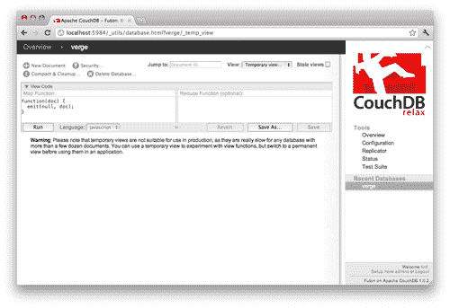
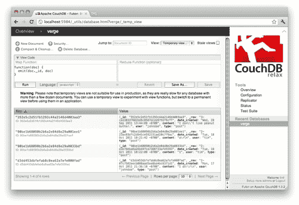
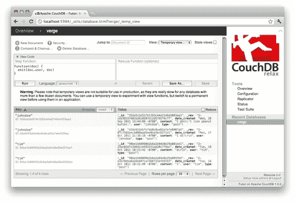
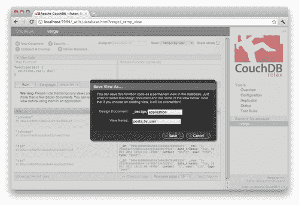
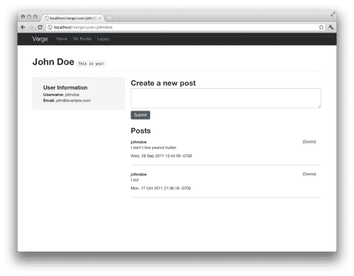
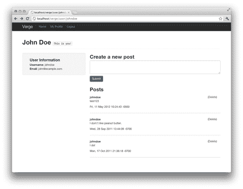

# 第 8 章使用设计文件进行查看和验证

> 到目前为止，我们的应用程序与使用 MySQL 或其他关系数据库时可能会执行的操作并没有显著差异。但是，在本章中，我们将通过使用 CouchDB 来处理许多过去可能是关系数据库的难点的事情，来提高我们对 CouchDB 的处理能力。

在本章中，我们将：

*   定义设计文件
*   了解视图以及如何使用视图查询数据
*   探索 MapReduce 函数的强大功能
*   玩 CouchDB 的 `validation`功能

让我们不要浪费时间，直接讨论设计文档。

# 设计文件

**设计文档**是 CouchDB 武库中的一种特殊东西，您可能无法从数据库中获得它。从表面上看，设计文档看起来与常规文档相同。它们有标准字段： `_id`和 `_rev`，可以创建、读取、更新和删除。但与普通文档不同，它们包含 JavaScript 形式的应用程序代码，并且具有特定的结构。这个 JavaScript 可以驱动验证，显示带有 `map`和 `reduce`函数的视图，等等。我们将很快讨论这些特性中的每一个，以及如何使用它们。

## 基础设计文件

基本设计文档可能类似于以下内容：

```php
{
—_id— : —_design/application—,
"_rev" : "3-71c0b0bd73a9c9a45ea738f1e9612798",
"views" : {
"example" : {
"map" : "function(doc){ emit(doc._id, doc)}"
}
}
}

```

`The _id`和 `_rev`看起来应该很熟悉，但与目前为止的其他文档不同， `_id`有一个可读的名称： `_design/example`。设计文件通过名称中的 `_design`进行识别。所以，遵循这种格式很重要。

从 `_id`和 `_rev`继续，您会注意到关键视图。视图是设计文档的重要组成部分，所以让我们进一步讨论它们。

## 观点

**视图**是 CouchDB 为我们提供的对数据库文档进行索引、查询和报告的功能。如果您是在经历了 MySQL 之后阅读本书的，那么视图将取代典型的 SQL `SELECT`语句。

现在您对视图有了一些背景知识，您会注意到在前面的设计文档中，我们创建了一个名为 `test`的视图。

### 地图功能

在 `example`键中，我们放置了一个名为 `map`的函数。映射函数是使用文档的 JavaScript 函数，然后将它们从原始结构转换为新的键/值对，然后应用程序可以使用。映射函数是理解的关键。那么，让我们看看 `map`函数的最简单实现，以确保我们都在同一页上：

```php
－example－ : {
－map－ : －function(doc){ emit(doc._id, doc)}－
}

```

调用示例 `map`函数时，CouchDB 将尝试为数据库中的每个文档编制索引，并使用 `doc`参数以 JSON 格式推送它们通过此函数。从这里，我们调用一个名为 `emit`的函数，该函数接受一个键和一个值，从中键和值将保存到一个数组中，一旦索引完成，该数组将返回。

`emit`函数的键和值可以是您想要的文档的任何字段。在本例中，我们将 `doc._id`作为键，将 `doc`作为值传递给 `emit`函数。您可能已经猜到， `doc._id`是正在编制索引的文档的 `_id`字段， `doc`是以 JSON 格式表示的整个文档。

在下一节中，我们将使用视图来处理数据。为了确保您能够完全破译视图对我们的数据所做的操作，请确保您在 `verge`数据库中至少创建了五到六篇文章。

# 行动时间-创建临时视图

CouchDB 提供了临时视图，供我们在开发或尝试测试视图结果时使用。让我们使用 Futon 创建一个临时视图，以便我们可以处理一些数据。

1.  打开浏览器，进入 Futon（`http://localhost:5984/_utils/`）。
2.  通过检查右栏底部，确保您已登录到 `admin`帐户。
3.  点击 `verge`进入我们的 `verge`数据库。
4.  Click on the drop-down box, and select **Temporary view...**.

    

5.  This form will allow us to play around with views and test them against data in real time.

    

6.  让我们编辑**映射函数**文本区域中的代码，使其与我们前面看到的示例代码相匹配：

    ```php
    function(doc) {
    emit(doc._id, doc)
    }

    ```

7.  Click on **Run** to see the results of the `map` function.

    

8.  让我们通过检查 `doc.type`是否等于 `post:`

    ```php
    function(doc) {
    if (doc.type == 'post') {
    emit(doc._id, doc);
    }
    }

    ```

    来确保我们只看到帖子
9.  再次点击**运行**，您将看到相同的结果。

## 刚才发生了什么事？

我们刚刚学习了如何在 CouchDB 中创建一个临时视图，这样我们就可以测试前面提到的 `map`函数。使用 Futon 提供的临时视图界面，我们运行了示例 `map`函数，并显示了一个键/值对列表。

最后，我们稍微加强了 `map`功能，以确保我们只查看 `type`等于 `post`的文档。现在，这一改变对我们的 `map`功能没有任何影响，但一旦我们添加了一个不同类型的文档，这一点就会改变。如果您还记得，这是因为 CouchDB 将文档存储在平面数据存储中；这意味着，当我们添加新的文档类型时，我们需要明确处理哪些文档类型。因此，通过在代码中添加 `if`语句，我们告诉 CouchDB 忽略那些没有将 `type`设置为 `post`的文档。

# 行动时间到了-创建一个列出帖子的视图

您可能已经注意到临时查看页面上的警告，警告如下：

```php
Warning: Please note that temporary views that we'll create are not suitable for use in production and will respond much slower as your data increases. It's recommended that you use temporary views in experimentation and development, but switch to a permanent view before using them in an application. 

```

让我们注意这个警告并创建一个设计文档，这样我们就可以开始在应用程序中构建这一切了。

1.  打开浏览器到 Futon。
2.  导航到我们正在使用的临时视图页面：（`http://localhost:5984/_utils/database.html?verge/_temp_view`。
3.  让我们让我们的函数更有用一点，并将键更改为 `doc.user`。

    ```php
    function(doc) {
    if (doc.type == 'post') {
    emit(doc.user, doc);
    }
    }

    ```

4.  Click on **Run** to see the results.

    

5.  现在我们的视图中有了我们想在应用程序中使用的代码，请单击**另存为。。。**保存此视图并为我们创建设计文档。
6.  A window will be displayed asking us to give the design document and the view a name. Enter `_design/application` as the name for **Design Document** name and `posts_by_user` as for **View Name**, then click on **Save**.

    

## 刚才发生了什么事？

我们从临时视图创建了一个设计文档，以便应用程序可以使用它。这一次，我们将密钥从 `doc._id`更改为 `doc.user`，以允许我们选择具有特定用户名的文档，这将在几分钟内有所帮助。然后，我们将这个临时视图保存到名为 `posts_by_user`的视图中，并将其保存到名为 `_design/application`的新设计文档中。

您可以使用 Futon 的界面轻松检查我们的设计文档是否成功创建。

1.  打开浏览器，进入 Futon 的 `verge`数据库（`http://localhost:5984/_utils/database.html?verge`。
2.  点击查看下拉框，选择**设计文件**。
3.  您在这里只能看到一个文档，这是我们新创建的名为 `_design/application`的设计文档。
4.  Click on the document, and you'll see the full design document.

    

在这里，让我们快速了解一下如何使用 Futon 测试设计文档及其视图：

1.  打开 Futon 浏览器，确保您正在查看 `verge`数据库（`http://localhost:5984/_utils/database.html?verge`。
2.  单击 view 下拉框，您将看到应用程序（设计文档的名称）。点击名为 `posts_by_user`的视图。
3.  You'll be shown the results of the view, as well as the code that is currently associated with it.

    

在此页面中，您可以单击结果并查看文档详细信息。您甚至可以通过键入新代码并单击**保存**来更改视图的代码。

使用这些简单的视图很有趣，但是让我们深入了解如何实际使用这些视图来查询文档。

### 查询地图功能

我们可以在 `map`查询中使用多种选项。我将谈到最常见的，但您可以在 CouchDB 的 wiki 上找到更多内容：[http://wiki.apache.org/couchdb/HTTP_view_API#Querying_Options](http://wiki.apache.org/couchdb/HTTP_view_API#Querying_Options) 。

最常见的查询选项有：

*   `reduce`
*   `startkey`
*   `endkey`
*   `key`
*   `limit`
*   `skip`
*   `descending`
*   `include_docs`

让我们在 `posts_by_user`视图中使用其中一些选项，看看我们能得到什么样的结果。

# 动作时间-按用户视图查询帖子

请记住，设计文档仍然是一个文档，这意味着我们可以像查询常规文档一样查询它。唯一的区别是我们需要使用稍微不同的 URL 模式来命中正确的文件。

1.  打开终端。
2.  使用一个 `curl`语句通过传递一个 `johndoe`键（或数据库中另一个拥有相当数量帖子的用户）来查询我们的设计文档，然后通过 `python mjson.tool`将其传递给

    ```php
    curl http://127.0.0.1:5984/verge/_design/application/_view/posts_by_user?key=%22johndoe%22 | python -mjson.tool 

    ```

    使其更漂亮一点
3.  终端将响应类似于以下内容：

    ```php
    {
    "offset": 0,
    "rows": [
    {
    "id": "352e5c2d51fb1293c44a2146d4003aa3",
    "key": "johndoe",
    "value": {
    "_id": "352e5c2d51fb1293c44a2146d4003aa3",
    "_rev": "3-ced38337602bd6c0587dc2d9792f6cff",
    "content": "I don\\'t like peanut butter.",
    "date_created": "Wed, 28 Sep 2011 13:44:09 -0700",
    "type": "post",
    "user": "johndoe"
    }
    },
    {
    "id": "d3dd453dbfefab8c8ea62a7efe000fad",
    "key": "johndoe",
    "value": {
    "_id": "d3dd453dbfefab8c8ea62a7efe000fad",
    "_rev": "2-07c7502eecb088aad5ee8bd4bc6371d1",
    "content": "I do!\r\n",
    "date_created": "Mon, 17 Oct 2011 21:36:18 -0700",
    "type": "post",
    "user": "johndoe"
    }
    }
    ],
    "total_rows": 4
    }

    ```

## 刚才发生了什么事？

我们刚刚使用了一个 `curl`语句来查询我们的应用程序设计文档中的 `posts_by_user`视图。我们将 `johndoe`作为视图搜索的键，CouchDB 使用该键只返回与该键匹配的文档。然后我们使用了 `python mjson.tool`，这样我们可以友好地看到我们的输出。

让我们有更多的乐趣，并通过几个快速场景来确定如何使用地图的 `query`选项来解决这些问题。

1.  如果您真的只想检索我们的 `map`函数将返回的 `johndoe?`的第一篇帖子，您可以通过在查询字符串的末尾添加 `limit=1`来实现这一点：

    ```php
    curl 'http://127.0.0.1:5984/verge/_design/application/_view/posts_by_user?key=%22johndoe%22&limit=1'| python -mjson.tool 

    ```

2.  您的终端将响应以下输出。注意，这一次你只得到一个帖子作为回报：

    ```php
    {
    "offset": 0,
    "rows": [
    {
    "id": "352e5c2d51fb1293c44a2146d4003aa3",
    "key": "johndoe",
    "value": {
    "_id": "352e5c2d51fb1293c44a2146d4003aa3",
    "_rev": "3-ced38337602bd6c0587dc2d9792f6cff",
    "content": "I don\\'t like peanut butter.",
    "content": "I don\\'t like peanut butter.",
    "date_created": "Wed, 28 Sep 2011 13:44:09 -0700",
    "type": "post",
    "user": "johndoe"
    }
    }
    ],
    "total_rows": 4
    }

    ```

3.  现在，如果我们想看到 map 函数返回 `johndoe?`的最后一篇帖子，您可以通过在语句末尾添加 `descending=true`和 `limit=1`来获得最新的帖子，如下所示：

    ```php
    curl 'http://127.0.0.1:5984/verge/_design/application/_view/posts_by_user?key=%22johndoe%22&limit=1&descending=true'| python -mjson.tool 

    ```

4.  您的命令行将返回您想要的内容：由 `johndoe`创建的最后一篇文章。

    ```php
    {
    "offset": 2,
    "rows": [
    {
    "id": "d3dd453dbfefab8c8ea62a7efe000fad",
    "key": "johndoe",
    "value": {
    "_id": "d3dd453dbfefab8c8ea62a7efe000fad",
    "_rev": "2-07c7502eecb088aad5ee8bd4bc6371d1",
    "content": "I do!\r\n",
    "date_created": "Mon, 17 Oct 2011 21:36:18 -0700",
    "type": "post",
    "user": "johndoe"
    }
    }
    ],
    "total_rows": 4
    }

    ```

有了这些例子，我们可以链接并组合我们的 `query`选项，以多种方式检索数据。我们可以暂时使用查询视图，但让我们继续尝试将 `posts_by_user`视图构建到我们的应用程序中，以允许我们在用户的个人资料上显示用户的帖子。

### 在我们的应用程序中使用视图

我们已经完成了查询数据库所需的大部分繁重工作；我们只需要在应用程序中添加几行代码。

# 行动时间-添加支持以通过 post 类中的用户获取帖子

1.  在文本编辑器中打开 `classes/post.php`。
2.  创建一个名为 `get_posts_by_user`的新 `public`函数，该函数将接受 `$username`作为参数。

    ```php
    public function get_posts_by_user($username) {
    }

    ```

3.  现在，让我们创建一个新的 `Bones`实例，以便查询 CouchDB。我们还将实例化一个名为 `$posts`的数组，我们将在函数末尾返回该数组。

    ```php
    public function get_posts_by_user($username) {
    $bones = new Bones();
    $posts = array();
    return $posts; 
    }

    ```

4.  接下来，让我们通过传递 `$username`作为键来查询我们的视图，并使用 `foreach`函数将所有结果迭代到一个 holding `$_post`变量中。

    ```php
    public function get_posts_by_user($username) {
    $bones = new Bones();
    $posts = array();
    foreach ($bones->couch- >get('_design/application/_view/posts_by_user?key="' . $username . '"&descending=true')->body->rows as $_post) {
    } 
    return $posts;
    }

    ```

5.  最后，让我们使用 `$_post`变量中的数据创建并填充 `Post`的新实例。然后，让我们将 `$post`添加到 `$posts`数组中。

    ```php
    public function get_posts_by_user($username) {
    $bones = new Bones();
    $posts = array();
    foreach ($bones->couch- >get('_design/application/_view/posts_by_user?key="' . $username . '"')->body->rows as $_post) {
    $post = new Post();
    $post->_id = $_post->id;
    $post->date_created = $_post->value->date_created;
    $post->content = $_post->value->content;
    $post->user = $_post->value->user;
    array_push($posts, $post);
    } 
    return $posts;
    }

    ```

## 刚才发生了什么事？

我们创建了一个名为 `get_posts_by_user`的函数，并将其放在 `Post`类中。此函数接受一个名为 `$username`的参数。 `get_posts_by_user`函数使用 `get_posts_by_user`视图将帖子列表返回到一个泛型类中，我们从中迭代每个文档，创建单个 `Post`对象，并将它们推送到一个数组中。您会注意到，我们必须使用 `$_post->value`获取 post 文档。请记住，这是因为我们的视图返回键和值的列表，每个文档一个，而我们的整个文档位于 `value`字段中。

简而言之，此函数使我们能够传入用户的用户名，并检索被传递的用户创建的帖子数组。

# 行动时间-将帖子添加到用户配置文件

现在我们已经完成了获取用户帖子的所有繁重工作，我们只需要再编写几行代码，直到它们出现在用户配置文件中。首先，我们在 `index.php`文件中添加一些代码，以接受路由中的用户名，将其传递给 `get_posts_by_user`函数，并将数据传递给纵断面图：

1.  打开 `index.php`，找到 `the /user/:username`路由，添加以下代码，将我们 `get_posts_by_user`函数返回的帖子传递到一个变量中，供我们的视图访问：

    ```php
    get('/user/:username', function($app) {
    $app->set('user', User::find_by_username($app- >request('username')));
    $app->set('is_current_user', ($app->request('username') == User::current_user() ? true : false));
    $app->set('posts', Post::get_posts_by_user($app- >request('username'))); 
    $app->render('user/profile');
    });

    ```

2.  打开 `views/user/profile.php`，并在**新建帖子**文本区域下方添加以下代码，以便我们可以在用户配置文件页面上显示帖子列表：

    ```php
    <h2>Posts</h2>
    <?php foreach ($posts as $post): ?>
    <div class="post-item row">
    <div class="span7">
    <strong><?php echo $user->name; ?></strong>
    <p>
    <?php echo $post->content; ?>
    </p>
    <?php echo $post->date_created; ?>
    </div>
    <div class="span1">
    <a href=#">(Delete)</a>
    </div>
    <div class="span8"></div>
    </div> 
    <?php endforeach; ?>

    ```

3.  最后，为了支持我们添加的一些新代码，让我们更新 `public/css/master.css`文件，使概要文件看起来整洁。

    ```php
    .post-item {padding: 10px 0 10px 0;}
    .post-item .span8 {margin-top: 20px; border-bottom: 1px solid #ccc;}
    .post-item .span1 a {color:red;}

    ```

## 刚才发生了什么事？

我们只是在 `index.php`文件中添加了一些代码，这样当用户导航到用户的配置文件时，我们的应用程序将把用户名从路由带到 `get_posts_by_user`函数，并将该函数的结果传递到一个名为 `posts`的变量中。然后，在 `views/user/profile.php`页面中，我们循环浏览帖子，并使用引导 CSS 规则使其看起来更漂亮。最后，我们在 `master.css`文件中添加了几行代码，使一切看起来都很好。

在本节中，我们还在每个当前不做任何事情的帖子旁边添加了一个（删除）链接。我们将在本章后面的部分介绍这一点。

启动浏览器，让我们检查一下，确保一切正常。

1.  打开浏览器，并作为用户之一登录。
2.  点击**我的档案**查看用户档案。
3.  You should now see the complete profile with all of the user's posts.

    

4.  让我们通过在文本区域中键入一些文本并单击**提交**来测试列表是否正常工作。
5.  Your profile was refreshed, and your new post should show up at the top of the list.

    

请随意在这里暂停，作为几个不同的用户登录，并创建大量的帖子！

完成后，让我们继续讨论 `map`函数的同伴：**reduce**。

### 减少功能

**Reduce**允许您处理 `map`函数返回的键/值对，然后将它们分解为单个值或更小的值分组。为了让事情变得更简单，CouchDB 附带了三个内置的 `reduce`函数，分别称为 `_count, _sum`和 `_stats`。

*   `_count:`返回映射值的个数
*   `_sum:`返回映射值之和
*   `_stats:`返回映射值的数字统计信息，包括总和、计数、最小值和最大值

因为 `reduce`函数对于新开发人员来说可能不是 100%直接的，所以让我们切入正题，在我们的应用程序中使用它。

在下一节中，我们将为我们的 `get_posts_by_user`视图创建一个 `reduce`函数，该函数将显示每个用户创建的帖子数量。请查看我们现有的设计文档，其中显示了 `reduce`功能的外观：

```php
{
"_id": "_design/application",
"_rev": "3-71c0b0bd73a9c9a45ea738f1e9612798",
"language": "javascript",
"views": {
"posts_by_user": {
"map": "function(doc) {emit(doc.user, doc)}",
"reduce": "_count" 
}
}
}

```

在本例中， `reduce`函数将 `map`函数中的所有用户名组合在一起，并返回每个用户名在列表中出现的次数计数。

# 行动时间-在蒲团中创建减少功能

使用 Futon 向视图添加 `reduce`函数非常容易。

1.  打开浏览器，进入 Futon 的 `verge`数据库（`http://localhost:5984/_utils/database.html?verge`。
2.  单击 view 下拉框，您将看到应用程序（设计文档的名称）。您可以点击名为 `posts_by_user`的视图。
3.  点击**查看代码**，可以看到**地图**和**缩小**的文本区域。
4.  在**减少**文本区输入 `_count`，点击**保存**。
5.  您可以通过点击**保存**按钮下方的**减少**复选框来验证您的 `reduce`功能是否正常工作。
6.  You should see a screenshot similar to the following:

    

## 刚才发生了什么事？

我们刚刚用 Futon 更新了我们的视图，使用了 `_count reduce`功能。然后，我们通过点击**减少**复选框，在同一视图中测试 `reduce`功能。你会注意到我们的 `reduce`函数还返回了一个键/值对，键等于用户名，值等于他们创建的帖子数量。

# 是时候采取行动了——为应用程序添加支持以使用 reduce 函数

现在我们已经创建了 `reduce`函数，让我们向应用程序添加一些代码来检索值。

1.  打开 `classes/post.php`。
2.  现在我们已经创建了一个 `reduce`函数，我们需要确保 `get_posts_by_user`函数使用视图而不使用 `reduce`函数。我们将通过在查询字符串中添加 `reduce=false`来实现这一点。这告诉视图不要运行 `reduce`函数。

    ```php
    public function get_posts_by_user($username) {
    $bones = new Bones();
    $posts = array();
    foreach ($bones->couch- >get('_design/application/_view/posts_by_user?key="' . $username . '"&descending=true&reduce=false')->body->rows as $_post) { 

    ```

3.  创建一个名为 `get_post_count_by_user`的新 `public`函数，该函数将接受 `$username`作为参数。

    ```php
    public function get_post_count_by_user($username) {
    }

    ```

4.  让我们向视图添加一个模拟 `get_posts_by_user`函数的调用。但是，这一次，我们将向查询字符串中添加 `reduce=true`。从视图中获得结果后，遍历数据以获得位于第一个返回行的值中的值。

    ```php
    public function get_post_count_by_user($username) {
    $bones = new Bones();
    $rows = $bones->couch- >get('_design/application/_view/posts_by_user?key="' . " $username . '"&reduce=true')->body->rows;
    if ($rows) {
    return $rows[0]->value;
    } else {
    return 0;
    } 
    }

    ```

5.  打开 `index.php`，找到 `/user/:username`路线。
6.  添加代码，将值从 `get_post_count_by_user`函数传递给视图可以访问的变量。

    ```php
    get('/user/:username', function($app) {
    $app->set('user', User::get_by_username($app- >request('username')));
    $app->set('is_current_user', ($app->request('username') == User::current_user() ? true : false));
    $app->set('posts', Post::get_posts_by_user($app- >request('username')));
    $app->set('post_count', Post::get_post_count_by_user($app- >request('username'))); 
    $app->render('user/profile');
    });

    ```

7.  最后，打开用户配置文件（`views/user/profile.php`，并在 `post`列表顶部显示$post_count 变量。

    ```php
    <h2>Posts (<?php echo $post_count; ?>)</h2>

    ```

## 刚才发生了什么事？

我们从更新现有的 `get_posts_by_user`函数开始，告诉它不要运行 `reduce`函数，只运行 `map`函数。然后，我们创建了一个名为 `get_post_count_by_user`的函数，它访问了我们的 `posts_by_user`视图。但是，这一次，我们告诉它通过在调用中传递 `reduce=true`来运行 `reduce`函数。当我们收到来自 `reduce`函数的值时，我们导航到第一行的值并返回它。我们只看一行，因为我们只传入一个用户名，这意味着只返回一个值。

然后我们从用户配置文件路由调用 `get_post_count_by_user`并将其传递到 `user/profile.php`视图。在视图中，我们在帖子列表的顶部输出了 `$post_count`。

有了这么少量的代码，我们就为我们的个人资料添加了一个很酷的功能。让我们测试一下，看看 `$post_count`显示了什么。

1.  打开您的浏览器，通过转到 `http://localhost/verge/user/johndoe`转到 John Doe 的用户配置文件。
2.  Notice that we are now displaying the number of posts at the top of the `post` list.

    

### 更多使用 MapReduce

同时使用 `map`和 `reduce`函数通常被称为**MapReduce**，当它们一起使用时，可以成为一种强大的数据分析方法。不幸的是，在这本书中我们不能通过各种各样的案例研究，但我会在这一章的结尾为进一步的教育提供一些参考。

## 验证

在本节中，我们将公开并讨论 CouchDB 的另一个真正独特的特性—它对文档功能的内置支持。此功能允许我们对数据进行更严格的控制，并可以保护我们免受 web 应用程序可能出现的一些严重问题的影响。

记住，我们的 `verge`数据库是任何用户都可以读取的，这对我们来说还不是什么问题。但是，例如，如果有人发现我们的数据库存储在哪里呢？他们可以轻松地创建和删除我们数据库中的文档。

为了充分说明这个问题，让我们添加一个功能，允许用户删除他们的帖子。这个简单的函数将说明一个潜在的安全漏洞，然后我们将用 CouchDB 的 `validation`函数修补这个漏洞。

# 是时候采取行动了——在我们的课程中增加对$\u rev 的支持

到目前为止，我们已经在 CouchDB 文档中看到了 `_rev`键，但我们还没有在应用程序中实际使用它。为了让我们对已经存在的文件采取任何行动，我们需要通过 `_rev`和 `_id`，以确保我们对最新的文件采取行动。

让我们通过在 `base`类中添加一个 `$_rev`变量来准备这一点。

1.  在工作目录中打开 `classes/base.php`，添加 `$_rev`变量。

    ```php
    abstract class Base
    {
    protected $_id;
    protected $_rev; 
    protected $type;

    ```

2.  不幸的是，现在无论何时调用 `to_json`函数， `_rev`都会被包括在内，不管它是否被使用。如果我们发送 CouchDB a `null _rev`，它将抛出一个错误。因此，让我们在 `classes/base.php`中的 `to_json`函数中添加一些代码，以便在 `_rev`变量没有设置值时取消设置它。

    ```php
    public function to_json() {
    if (isset($this->_rev) === false) {
    unset($this->_rev);
    } 
    return json_encode(get_object_vars($this));
    }

    ```

## 刚才发生了什么事？

我们在 `base`课上增加了 `$_rev`。到目前为止，我们还没有真正需要使用这个值，但在处理现有文档时，这是一个要求。在 `base`类中添加 `$_rev`之后，我们必须对 `to_json`函数进行改装，以便在 `$_rev`没有设置值的情况下将其取消设置。

# 行动时间-在我们的应用程序中添加删除帖子的支持

现在我们已经可以访问 `base`类中的 `_rev`变量，让我们添加支持，以便我们的应用程序可以从用户配置文件中删除帖子。

1.  让我们先打开 `classes/post.php`并在 `get_posts_by_user`函数中添加一行代码，这样我们就可以使用 `_rev`。

    ```php
    public function get_posts_by_user($username) {
    $bones = new Bones();
    $posts = array();
    foreach $bones->couch- >get('_design/application/_view/posts_by_user?key="' . $username . '"&descending=true&reduce=false')->body->rows as $_post) {
    $post = new Post();
    $post->_id = $_post->value->_id;
    $post->_rev = $_post->value->_rev; 
    $post->date_created = $_post->value->date_created;

    ```

2.  接下来，让我们在 `classes/post.php`文件中创建一个漂亮而简单的 `delete`函数，这样我们就可以删除帖子了。

    ```php
    public function delete() {
    $bones = new Bones();
    try {
    $bones->couch->delete($this->_id, $this->_rev);
    }
    catch(SagCouchException $e) {
    $bones->error500($e);
    }
    }

    ```

3.  现在我们有了删除帖子的后端支持，让我们在 `index.php`文件中添加一个接受 `_id`和 `_rev`的路由。通过这个途径，我们可以触发从我们的个人资料页面删除帖子。

    ```php
    get('/post/delete/:id/:rev', function($app) {
    $post = new Post();
    $post->_id = $app->request('id');
    $post->_rev = $app->request('rev'
    $post->delete();
    $app->set('success', 'Your post has been deleted');
    $app->redirect('/user/' . User::current_user());
    });

    ```

4.  最后，让我们更新我们的 `views/user/profile.php`页面，这样当用户点击 `delete`链接时，他们就会点击我们的路线，我们传递必要的变量。

    ```php
    <?php foreach ($posts as $post): ?>
    <div class="post-item row">
    <div class="span7">
    <strong><?php echo $user->name; ?></strong>
    <p>
    <?php echo $post->content; ?>
    </p>
    <?php echo $post->date_created; ?>
    </div>
    <div class="span1">
    <a href="<?php echo $this->make_route('/post/delete/' . $post->_id . '/' . $post->_rev)?>" class="delete">
    (Delete)
    </a> 
    </div>
    <div class="span8"></div>
    </div>
    <?php endforeach; ?>

    ```

## 刚才发生了什么事？

我们刚刚添加了对用户从其个人资料中删除帖子的支持。我们首先确保在 `get_posts_by_user`函数中将 `_rev`返回给我们的 post 对象，以便在尝试删除 post 时可以传递它。接下来，我们在 `post`类中创建了一个 `delete`函数，该函数接受 `$id`和 `$rev`作为属性，并调用 Sag 的 `delete`方法。然后，我们创建了一条名为 `/post/delete`的新路线，允许我们通过 `_id`和 `_rev`到达它。在这个路径中，我们创建了一个新的 `Post`对象，对其设置 `_id`和 `_rev`，然后调用 `delete`函数。然后设置 `success`变量并刷新配置文件。

最后，我们通过将 `$post->_id`和 `$post->_rev`传递到 `/post/delete`路由，使 `delete`链路在用户配置文件中运行。

含糖的我们现在可以点击网站上任何帖子旁边的**删除**，它将从数据库中删除。让我们试一试。

1.  打开浏览器并转到 `http://localhost/verge`。
2.  以任何用户身份登录，然后转到其用户配置文件。
3.  点击**（删除）**按钮。
4.  页面将重新加载，您的帖子将神奇地消失！

这段代码在技术上就像我们计划的那样工作，但是如果你在删除帖子上玩了几分钟，你可能已经注意到我们这里有一个问题。现在，任何用户都可以从任何个人资料中删除帖子，这意味着我可以转到你的个人资料并删除你的所有帖子。当然，我们可以通过隐藏**删除**按钮快速修复此问题。但是，让我们后退一步，很快就想到这一点。

如果有人发现（或猜测）用户帖子的 `_id`和 `_rev`并将其传递到 `/post/delete`路线，会发生什么？该帖子将被删除，因为我们没有任何用户级验证来确保试图删除文档的人实际上是文档的所有者。

让我们先在数据库级别解决这个问题，然后我们将反向工作，并在界面中正确隐藏**删除**按钮。

### CouchDB 对验证的支持

CouchDB 通过设计文档中名为 `validate_doc_update`的函数对文档进行验证。如果操作不符合我们的标准，此功能可以取消文档的创建/更新/删除。验证功能具有定义的结构，并适合设计文件，如下所示：

```php
{
"_id": "_design/application",
"_rev": "3-71c0b0bd73a9c9a45ea738f1e9612798",
"language": "javascript",
"validate_doc_update": "function(newDoc, oldDoc, userCtx) { //JavaScript Code }", 
"views": {
"posts_by_user": {
"map": "function(doc) {emit(doc.user, doc)}",
"reduce": "_count"
}
}
}

```

让我们看看 `validate_doc_update`函数，确保我们清楚这里发生了什么。

```php
function(newDoc, oldDoc, userCtx) { //JavaScript Code }

```

*   `newDoc:`您正试图保存的文档
*   `oldDoc:`为已有单据（如有）
*   `userCtx:`是用户对象及其角色

现在我们知道了我们可以使用的参数，让我们制作一个简单的 `validate`函数，确保只有文档的创建者才能更新或删除该文档。

# 行动时间-添加验证功能，以确保只有创建者可以更新或删除其文档

添加 `validate`函数可能有点奇怪，因为与视图不同，Futon 中没有一个好的界面供我们使用。添加 `validate_doc_update`函数的最快方法是将其视为文档中的普通字段，并在值中键入代码。这有点奇怪，但这是调整设计文档的最快方法。在本章的最后，如果您想更清楚地了解如何管理设计文档，我将为您提供一些参考资料。

1.  打开浏览器，进入 Futon（`http://localhost:5984/_utils/`。
2.  通过检查右下栏是否显示**欢迎**，确保您已登录 `admin`帐户。
3.  点击 `verge`进入我们的 `verge`数据库。
4.  点击我们的 `_design/application`设计文件。
5.  点击**添加字段**，调用该字段 `validate_doc_update`。
6.  在**值**文本区域中，添加以下代码（格式和缩进无关紧要）：

    ```php
    function(newDoc, oldDoc, userCtx) {
    if (newDoc.user) {
    if(newDoc.user != userCtx.name) {
    throw({"forbidden": "You may only update this document with user " + userCtx.name});
    }
    }
    }

    ```

7.  点击**保存**，您的文档将更新为包含验证功能。

## 刚才发生了什么事？

我们刚刚用 Futon 更新了我们的 `_design/application`设计文件。我们使用简单的接口创建 `validate_doc_update`函数，并将验证代码放入值中。代码可能看起来有点混乱；让我们快速浏览一下。

1.  首先，我们使用以下 `if`语句检查以确保保存的文档附带有用户变量：

    ```php
    if (newDoc.user).

    ```

2.  然后，我们检查文档上的用户名是否与当前登录用户的用户名匹配：

    ```php
    if(newDoc.user != userCtx.name).

    ```

3.  如果发现文档确实绑定了一个用户，并且试图保存的用户不是登录的用户，那么我们将抛出一个禁止的错误（HTTP 响应，状态代码为 `403)`，详细说明为什么无法使用这行代码保存文档：

    ```php
    throw({"forbidden": "You may only update this document with user " + userCtx.name});

    ```

值得注意的是，一个设计文档只能有一个 `validate_doc_update`功能。因此，如果您想对不同的文档执行不同类型的验证，那么您必须执行以下操作：

```php
function(newDoc, oldDoc, userCtx) {
if (newDoc.type == "post") {
// validation logic for posts
}
if (newDoc.type == "comment") {
// validation logic for comments
}
}

```

我们可以用验证函数做更多的事情。事实上，我们经常使用的 `_users`数据库通过 `validate_doc_update`功能驱动所有用户验证和控制。

现在，让我们测试一下我们的 `validation`函数。

1.  打开浏览器，进入 `http://localhost/verge`。
2.  以与 `John Doe`不同的用户登录。
3.  进入 `http://localhost/verge/user/johndoe`进入 `John Doe`的档案。
4.  试着点击 `(Delete)`按钮。
5.  Your browser will display the following message to you:

    

伟大的 CouchDB 为我们抛出了一个`403`错误，因为它知道我们不是以`John Doe`身份登录的，我们试图删除他的一篇帖子。如果您想进一步调查，您可以再次以`John Doe`身份登录，并验证您可以在以他身份登录时删除他的帖子。

我们可以放心地知道，无论用户使用什么界面，Sag、curl，甚至通过 Futon，CouchDB 都将确保用户必须拥有文档才能删除它。

我们可以为这个验证错误添加一个更优雅的错误消息，但是很少会发生这个错误，所以现在让我们继续。让我们在用户配置文件中添加一些简单的逻辑，这样用户就不能删除其他用户的帖子。

# 行动时间–当删除按钮不在当前用户的个人资料中时，隐藏删除按钮

对用户隐藏删除按钮实际上非常容易。虽然这种方法不能取代我们以前的验证功能，但它是一种友好的方法，可以防止用户无意中删除他人的帖子。

1.  在文本编辑器中打开 view/user/profile.php。
2.  找到创建帖子的循环，并在删除按钮周围添加此代码。

    ```php
    <div class="span1">
    <?php if ($is_current_user) { ?>
    <a href="<?php echo $this->make_route('/post/delete/' . $post-
    >
    _id . '/' . $post->_rev)?>" class="delete">(Delete)
    </a>
    <?php } ?>
    </div>

    ```

## 刚才发生了什么事？

我们只是使用简单变量`$is_current_user`在用户查看其他人的个人资料时隐藏删除按钮，并在用户查看自己的个人资料时显示。这与我们在本章前面用于显示和隐藏用于创建帖子的文本区域的技术相同。

如果您的一个用户现在转到另一个用户的个人资料，他们将无法看到删除其帖子的选项。即使他们设法找到了一篇帖子的`_id`和`_rev`，并且能够触发删除一篇帖子，`validation`功能也会阻止他们陷入困境。

# 收工

在这一章中我们经历了很多，但我只触及了一些肯定值得进一步研究的要点。

## 想要更多的例子吗？

学习`MapReduce`功能和设计文档的先进技术可能需要一整本书。事实上，上面有一整本书！如果您想了解更多关于真实用例场景以及如何处理一对多和多对多关系的信息，请查阅*Bradley Holt*中的一本书，书名为《编写和*在 CouchDB 中查询 MapReduce 视图》。*

## 在蒲团中处理设计文件太难了！

你不是唯一一个认为在 Futon 中处理设计文档太难的人。

有几个工具可能值得一看：

*   **库查普**[http://couchapp.org/](http://couchapp.org/) ：这是一个实用程序，可以让您创建在 CouchDB 内部运行的完整 JavaScript 应用程序。然而，在开发 PHP 应用程序时，它管理设计文档的方式也可以使您的生活更加轻松。
*   **爱情座椅**[http://www.russiantequila.com/wordpress/?p=119](http://www.russiantequila.com/wordpress/?p=119) ：它是一个在 Mono 下工作的轻量级编辑器，这意味着它可以在任何操作系统上工作。它允许您非常轻松地管理文档和设计文档。

# 总结

在本章中，我们深入研究了 CouchDB，并利用它的一些独特特性使我们的应用程序更简单。更具体地说，我们讨论了设计文档以及 CouchDB 如何使用它们，使用 Futon 创建视图和设计文档。我们了解了视图，如何使用选项（如 SQL）查询视图，如何借助 MapReduce 在视图中查询帖子，如何在应用程序中使用视图来动态显示每个用户的帖子列表和数量，以及如何将验证构建到 CouchDB 中，并使用它来保护应用程序。

在下一章中，我们将进一步介绍我们的应用程序，并添加有趣的功能，例如使用 JQuery 改善用户体验、添加分页、使用 Gravatar 等等！