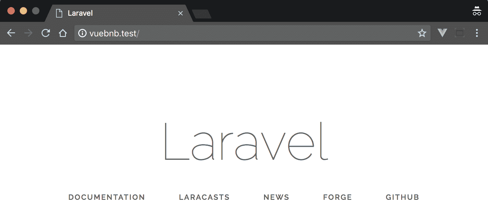

# 三、建立一个安全的开发环境

在这本书的前两章中，我们介绍了 Vue.js。现在，您应该对它的基本特性非常熟悉了。在本章中，当我们准备构建 Vuebnb 后端时，我们将启动并运行一个 Laravel 开发环境。

本章涵盖的主题:

*   拉弗尔简介
*   构建宅基地虚拟开发环境
*   将宅基地配置为托管 Vuebnb

# 拉维尔

Laravel 是一个 PHP 开源 MVC 框架，用于构建健壮的 web 应用。Laravel 目前版本为 5.5，是最受欢迎的 PHP 框架之一，因其优雅的语法和强大的功能而备受喜爱。

Laravel 适合创建各种基于 web 的项目，例如:

*   具有用户身份验证的网站，如客户门户或社交网络
*   Web 应用，如图像裁剪器或监控仪表板
*   Web 服务，如 RESTful APIs

在这本书里，我假设对 Laravel 有基本的了解。您应该对安装和设置 Laravel 感到满意，并熟悉它的核心特性，例如路由、视图和中间件。

如果你是 Laravel 的新手或者认为你可能需要复习一下，那么在继续阅读这本书之前，你应该花一两个小时通读 Laravel 的优秀文档:[https://laravel.com/docs/5.5/](https://laravel.com/docs/5.5/)。

# Laravel 和 Vue

Laravel 看起来像一个整体框架，因为它包含了构建几乎任何类型的 web 应用的特性。不过，在幕后，Laravel 是许多独立模块的集合，有些是作为 Laravel 项目的一部分开发的，有些则来自第三方作者。Laravel 之所以出色，部分原因在于它对这些组成模块的精心管理和无缝连接。

自 Laravel 5.3 版本以来，Vue.js 一直是 Laravel 安装中包含的默认前端框架。官方没有理由为什么选择 Vue 而不是其他有价值的选项，比如 React，但我的猜测是，这是因为 Vue 和 Laravel 有着相同的理念:简单和对开发人员体验的重视。

不管是什么原因，Vue 和 Laravel 为开发网络应用提供了一个非常强大和灵活的全栈框架。

# 环境

我们将使用 Laravel 5.5 作为 Vuebnb 的后端。这个版本的 Laravel 需要 PHP 7、几个 PHP 扩展和以下软件:

*   设计者
*   网络服务器，如 Apache 或 Nginx
*   数据库，如 MySQL 或 MariaDB

A complete list of requirements for Laravel can be found in the installation guide: [https://laravel.com/docs/5.5#installation](https://laravel.com/docs/5.5#installation).

与其在你的电脑上手动安装 Laravel 需求，我强烈建议你使用*宅地*开发环境，里面已经预装了你需要的一切。

# 农场

Laravel Homestead 是一个虚拟的网络应用环境，运行在 float 和 VirtualBox 上，可以运行在任何 Windows、Mac 或 Linux 系统上。

使用宅基地将为您省去了从头开始建立开发环境的麻烦。它还将确保你有一个与我正在使用的环境相同的环境，这将使你更容易理解这本书。

如果您的计算机上没有安装 Homestead，请遵循 Laravel 文档中的说明:[https://laravel.com/docs/5.5/homestead](https://laravel.com/docs/5.5/homestead)。使用默认配置选项。

一旦你安装了宅地并且用`vagrant up`命令启动了游民箱，你就可以继续了。

# Vuebnb

在[第二章](02.html)*制作 Vuebnb 原型，你的第一个 Vue.js 项目*中，我们制作了一个 Vuebnb 前端的原型。原型是从我们直接从浏览器加载的单个 HTML 文件中创建的。

现在我们将开始全栈 Vuebnb 项目的工作，其中原型将很快成为关键部分。这个主要项目将是一个完整的网络服务器和数据库安装 Laravel。

# 项目代码

如果您还没有，您需要通过从 GitHub 克隆代码库来将其下载到您的计算机上。在[第一章](01.html)、*你好 Vue-Vue . js 简介*的*代码库*部分给出了说明。

代码库中的`vuebnb`文件夹有我们现在想要使用的项目代码。切换到此文件夹并列出内容:

```php
$ cd vuebnb
$ ls -la
```

文件夹内容应该如下所示:


Figure 3.1\. vuebnb project files

# 共享文件夹

`Homestead.yaml`文件的`folders`属性列出了您想要在计算机和宅基地环境之间共享的所有文件夹。

确保代码库与 homesteam 共享，这样我们就可以在本章的后面部分从 homesteam 的网络服务器为 Vuebnb 提供服务。

`~/Homestead/Homestead.yaml` *:*

```php
folders:
  - map: /Users/anthonygore/Projects/Full-Stack-Vue.js-2-and-Laravel-5
    to: /home/vagrant/projects
```

# 终端命令

除非另有说明，否则书中所有进一步的终端命令将相对于项目目录给出，即 *vuebnb* 。

但是，由于项目目录在您的主机和宅基地之间共享，终端命令可以从这些环境中的任何一个运行。

宅地省去了你在主机上安装任何软件的麻烦。但是，如果不这样做，许多终端命令可能无法工作，或者在主机环境中无法正常工作。例如，如果您的主机上没有安装 PHP，您就不能从中运行 Artisan 命令:

```php
$ php artisan --version
-bash: php: command not found
```

如果是这种情况，您需要首先通过 SSH 连接，从 Homestead 环境中运行这些命令:

```php
$ cd ~/Homestead
$ vagrant ssh
```

然后，更改到操作系统中的项目目录，相同的终端命令将会工作:

```php
$ cd ~/projects/vuebnb
$ php artisan --version
Laravel Framework 5.5.20
```

从 Homestead 运行命令的唯一缺点是，由于 SSH 连接，它们运行速度较慢。我会让你来决定你更愿意用哪一个。

# 环境变量

Laravel 项目需要在`.env`文件中设置某些环境变量。通过复制环境文件示例立即创建一个:

```php
$ cp .env.example .env
```

通过运行以下命令生成应用密钥:

```php
$ php artisan key:generate
```

我已经预设了大多数其他相关的环境变量，所以你不应该改变任何东西，除非你已经为我配置了不同的宅基地。

# 作曲者安装

要完成安装过程，我们必须运行`composer install`来下载所有需要的包:

```php
$ composer install
```

# 数据库ˌ资料库

我们将使用关系数据库在后端应用中保存数据。宅基地有 MySQL 开箱即用；你只需要在`.env`文件中提供配置，就可以和 Laravel 一起使用。默认配置将在没有任何进一步更改的情况下工作。

`.env`:

```php
DB_CONNECTION=mysql
DB_HOST=192.168.10.10
DB_PORT=3306
DB_DATABASE=vuebnb
DB_USERNAME=homestead
DB_PASSWORD=secret
```

无论您为数据库选择什么名称(即`DB_DATABASE`的值)，请确保它已添加到您的`Homestead.yaml`文件中的`databases`数组中。

`~/Homestead/Homestead.yaml`:

```php
databases:
  ...
  - vuebnb
```

# 为项目服务

主 Vuebnb 项目现已安装。让我们让 web 服务器在本地开发域`vuebnb.test`为其服务。

在宅基地配置文件中，将`vuebnb.test`映射到项目的`public`文件夹。

`~/Homestead/Homestead.yaml`:

```php
sites:
  ...
  - map: vuebnb.test
    to: /home/vagrant/vuebnb/public
```

# 本地域名系统条目

我们还需要更新我们计算机的主机文件，以便它理解`vuebnb.test`和网络服务器的 IP 之间的映射。网络服务器在宅地盒子里，默认有 IP `192.168.10.10`。

要在 Mac 上进行配置，请在文本编辑器中打开您的主机文件`/etc/hosts`，并添加以下条目:

```php
192.168.10.10 vuebnb.test
```

The hosts file can normally be found at `C:\Windows\System32\Drivers\etc\hosts` on a Windows system.

# 访问项目

完成所有配置后，我们现在可以从`Homestead`目录中运行`vagrant provision`来完成设置:

```php
$ cd ~/Homestead
$ vagrant provision
# The next command will return you to the project directory
$ cd -
```

当供应过程完成时，当我们将浏览器导航到`http://vuebnb.test`时，我们应该能够看到我们的站点正在运行:



Figure 3.2\. Laravel welcome view

现在我们准备开始开发 Vuebnb 了！

# 摘要

在这简短的一章中，我们讨论了开发 Laravel 项目的需求。然后，我们安装并配置了 Homestead 虚拟开发环境来托管我们的主项目 Vuebnb。

在下一章中，我们将通过构建一个向 Vuebnb 前端提供数据的网络服务来开始我们的主要项目。