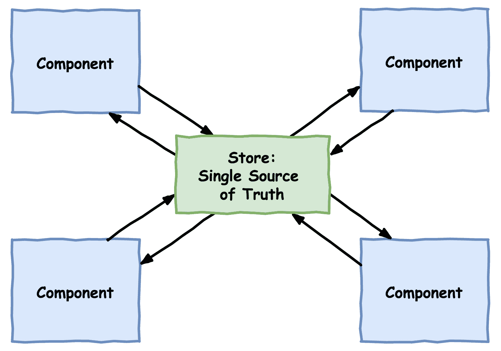
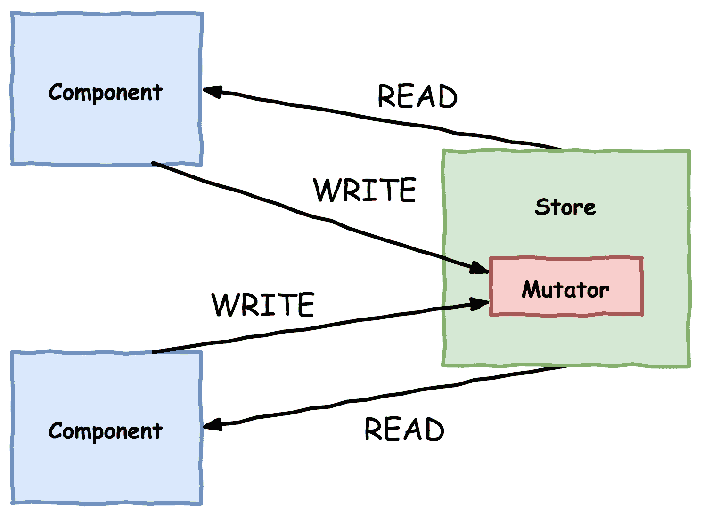
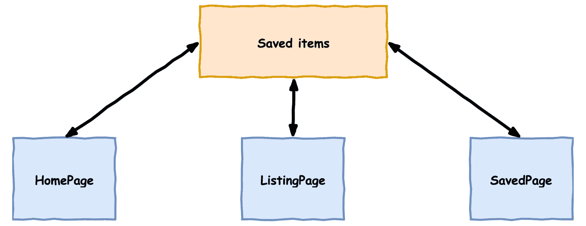
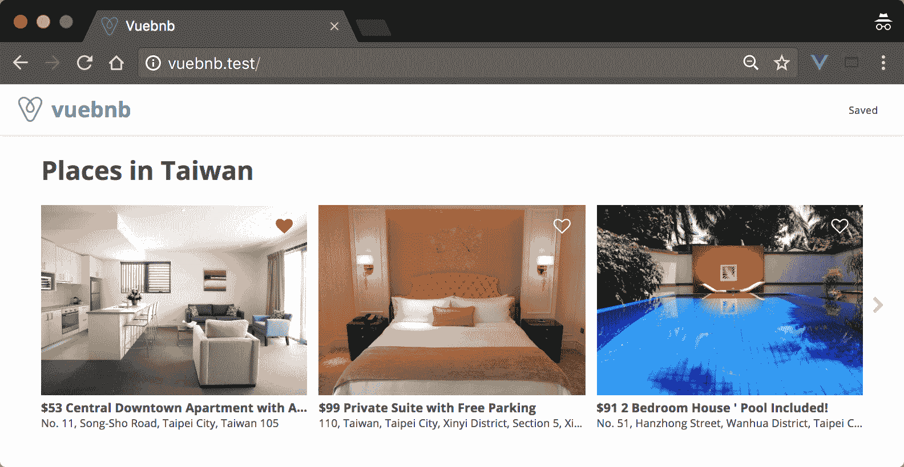
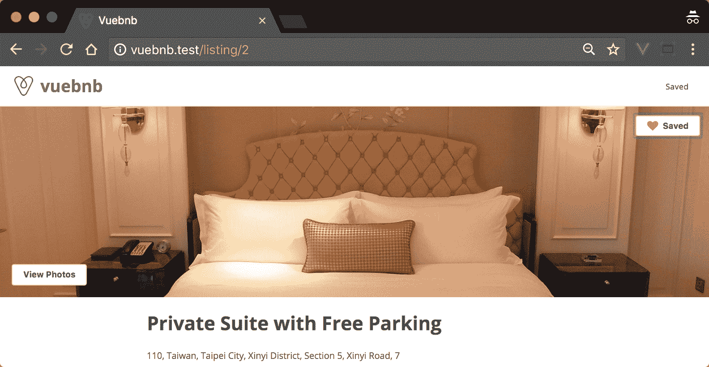
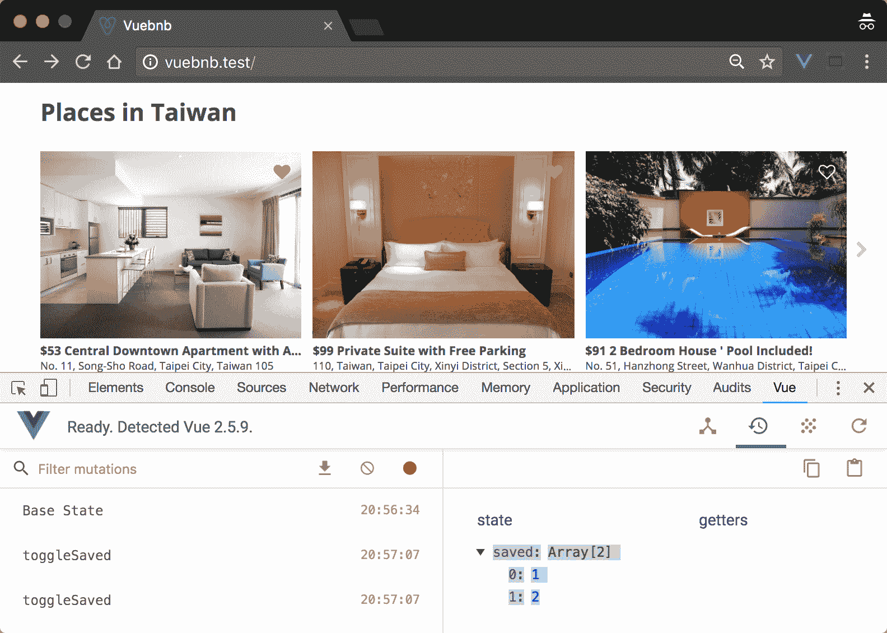
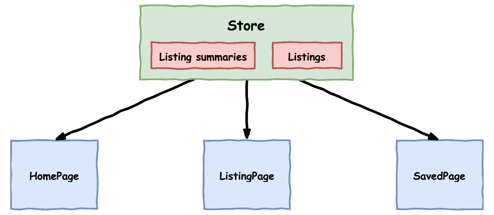
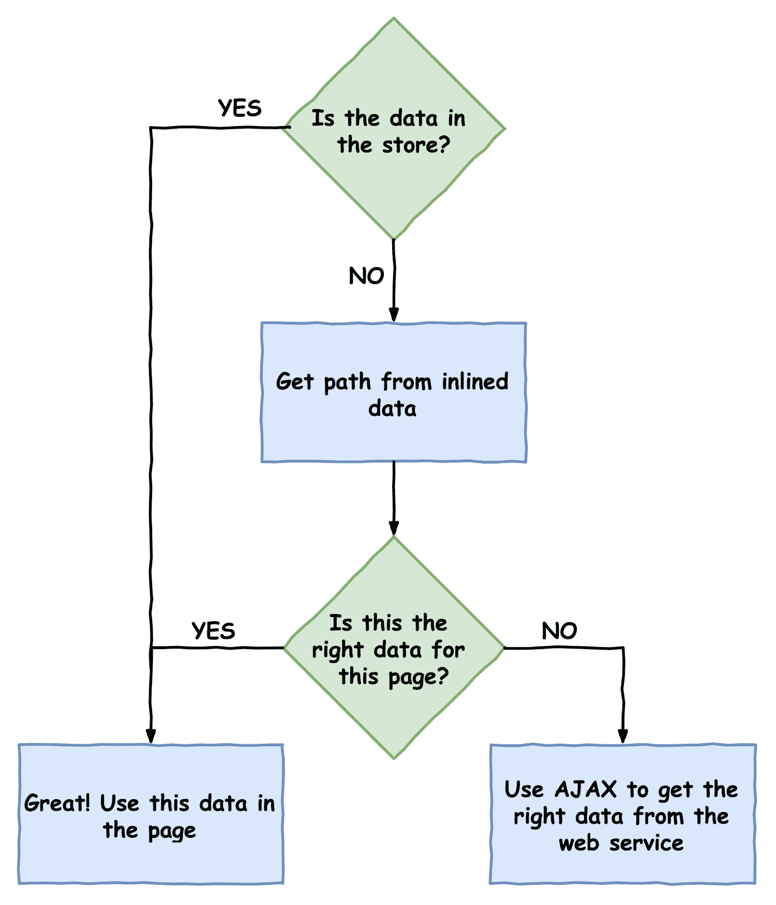
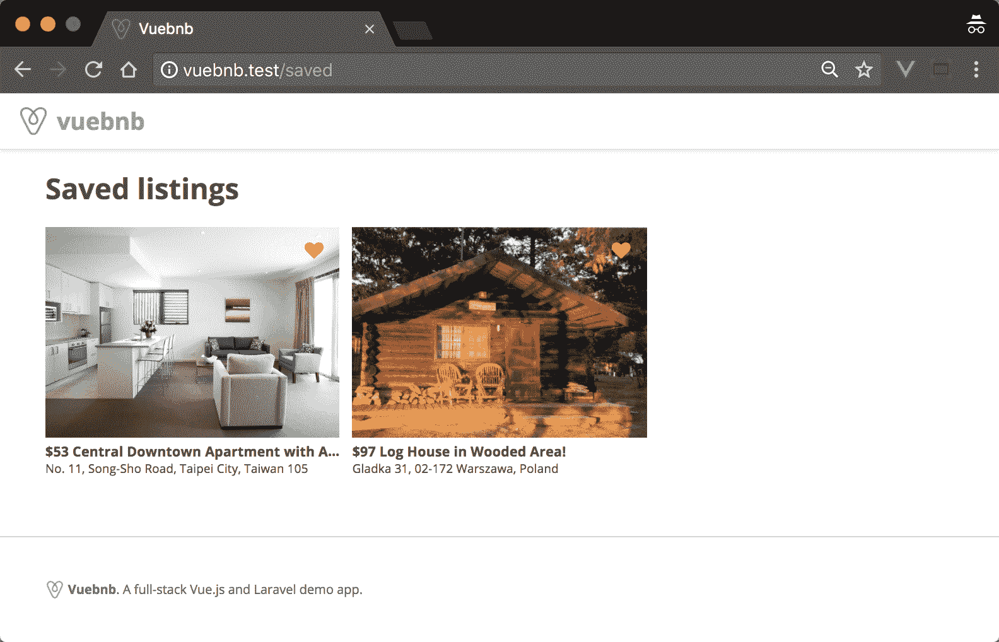
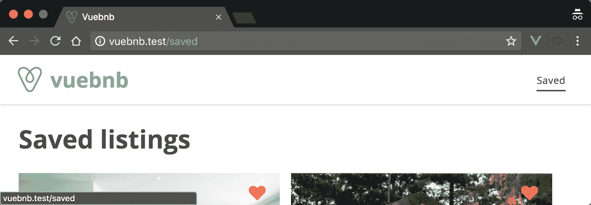

# 八、使用 Vuex 管理您的应用状态

在上一章中，您学习了如何使用 Vue Router 向 Vue.js 单页应用添加虚拟页面。我们现在将向 Vuebnb 添加跨页面共享数据的组件，因此不能依赖瞬态本地状态。为此，我们将利用 Vuex，一个受 Flux 启发的 Vue.js 库，它提供了一种管理全局应用状态的强大方法。

本章涵盖的主题:

*   介绍 Flux 应用体系结构，以及它为什么对构建用户界面有用
*   Vuex 及其关键特性的概述，包括状态和突变
*   如何安装 Vuex 并设置一个可以被 Vue.js 组件访问的全局存储
*   Vuex 如何通过变异记录和时间旅行调试实现 Vue 开发工具的高级调试
*   为 Vuebnb 列表创建保存功能和保存列表页面
*   将页面状态移动到 Vuex 中，以最大限度地减少从服务器检索不必要的数据

# 流量应用架构

假设你开发了一个多用户聊天应用。该界面有用户列表、私人聊天窗口、带有聊天记录的收件箱和通知用户未读消息的通知栏。

每天都有数百万用户通过你的应用聊天。不过也有人投诉一个烦人的问题:app 的通知栏偶尔会给出虚假通知；也就是说，用户会收到一条新的未读消息的通知，但是当他们查看它是什么时，它只是一条他们已经看到的消息。

我所描述的是几年前脸书开发人员使用他们的聊天系统的真实场景。解决这个问题的过程激励他们的开发人员创建了一个应用架构，他们将其命名为 *Flux* 。Flux 构成了 Vuex、Redux 和其他类似库的基础。

脸书开发者与这个*僵尸通知* bug 斗争了一段时间。他们最终意识到它的持久性不仅仅是一个简单的 bug 它指出了该应用架构中的一个潜在缺陷。

这个缺陷在摘要中最容易理解:当应用中有多个共享数据的组件时，它们之间相互连接的复杂性将会增加到数据状态不再可预测或可理解的程度。当上述错误不可避免地出现时，应用数据的复杂性使它们几乎无法解决:


Figure 8.1\. The complexity of communication between components increases with every extra component

Flux 不是图书馆。你不能去 GitHub 下载。Flux 是一组指导原则，描述了一个可扩展的前端架构，足以缓解这一缺陷。它不仅适用于聊天应用，也适用于任何具有共享状态的组件的复杂用户界面，如 Vuebnb。

现在让我们来探索 Flux 的指导原则。

# 原则 1——真理的单一来源

组件可能有*只需要知道的本地数据*。例如，滚动条在用户列表组件中的位置可能对其他组件不感兴趣:

```php
Vue.component('user-list', {
  data() {
    scrollPos: ...
  }
});
```

但是任何要在组件之间共享的数据，例如*应用数据*，都需要保存在一个地方，与使用它的组件分开。这个地点被称为*商店*。组件必须从该位置读取应用数据，并且不能保留自己的副本，以防止冲突或分歧:



Figure 8.2\. Centralized data simplifies application state

# 原则 2–数据是只读的

组件可以自由地从存储中读取数据。但是他们不能改变商店里的数据，至少不能直接改变。

相反，他们必须通知商店他们改变数据的意图，商店将负责通过一组被称为*变异器方法*的定义函数进行这些改变。

为什么采用这种方法？如果我们集中数据变更逻辑，那么如果状态中存在不一致，我们就不必看得太远。我们正在最大限度地降低某些随机组件(可能在第三方模块中)以意外方式更改数据的可能性:



Figure 8.3\. State is read-only. Mutator methods are used to write to the store

# 原则 3–突变是同步的

在架构中实现上述两个原则的应用中，调试状态不一致要容易得多。您可以记录提交并观察响应中的状态如何变化(这在 Vue Devtools 中自动发生，正如我们将看到的)。

但是如果我们的突变被异步应用，这种能力就会被削弱。我们知道提交的顺序，但是我们不知道组件提交的顺序。同步突变确保状态不依赖于不可预测事件的顺序和时间。

# 武契特

*Vuex* (通常发音为 *veweks* )是 Flux 架构的官方 Vue.js 实现。通过实施前面描述的原则，Vuex 使您的应用数据保持在透明和可预测的状态，即使数据在许多组件之间共享。

Vuex 包含一个带有 state 和 mutator 方法的存储区，并将被动更新从存储区读取数据的任何组件。它还允许方便的开发特性，如热模块重载(在运行的应用中更新模块)和时间旅行调试(通过突变回溯以跟踪错误)。

在本章中，我们将为我们的 Vuebnb 列表添加*保存*功能，以便用户可以跟踪他们最喜欢的列表。与目前为止我们应用中的其他数据不同，保存的状态必须跨页面保持；例如，当用户从一个页面切换到另一个页面时，应用必须记住用户已经保存了哪些项目。我们将使用 Vuex 来实现这一目标:



Figure 8.4\. Saved state is available to all page components

# 正在安装 Vuex

Vuex 是一个 NPM 软件包，可以从命令行安装:

```php
$ npm i --save-dev vuex
```

我们将把我们的 Vuex 配置放入一个新的模块文件`store.js`:

```php
$ touch resources/img/js/store.js
```

我们需要在这个文件中导入 Vuex，和 Vue Router 一样，用`Vue.use`安装。这赋予了 Vue 特殊的属性，使其与 Vuex 兼容，例如允许组件通过`this.$store`访问商店。

`resources/img/js/store.js`:

```php
import Vue from 'vue';
import Vuex from 'vuex';
Vue.use(Vuex);

export default new Vuex.Store();
```

然后我们将在我们的主应用文件中导入商店模块，并将其添加到我们的 Vue 实例中。

`resources/img/js/app.js`:

```php
...

import router from './router';
import store from './store';

var app = new Vue({
  el: '#app',
  render: h => h(App),
  router,
  store
});
```

# 保存功能

如上所述，我们将在 Vuebnb 列表中添加*保存*功能。这个功能的用户界面是一个小的、可点击的图标，覆盖在列表摘要缩略图的右上角。它的作用类似于复选框，允许用户切换任何特定列表的保存状态:



Figure 8.5\. The save feature shown on listing summaries

保存功能也将作为按钮添加到列表页面的标题图像中:



Figure 8.6\. The save feature shown on the listing page

# 列表保存

让我们从创建新组件开始:

```php
$ touch resources/img/components/ListingSave.vue
```

该组件的模板将包括一个字体真棒*心*图标。它还将包括一个点击处理程序，用于切换保存的状态。由于该组件将始终是列表或列表摘要的子组件，因此它将接收列表标识作为道具。这个道具将很快被用来拯救 Vuex 的状态。

`resources/img/components/ListingSave.vue`:

```php
<template>
  <div class="listing-save" @click.stop="toggleSaved()">
    <i class="fa fa-lg fa-heart-o"></i>
  </div>
</template>
<script>
  export default {
    props: [ 'id' ],
    methods: {
      toggleSaved() {
        // Implement this
      }
    }
  }
</script>
<style>
  .listing-save {
    position: absolute;
    top: 20px;
    right: 20px;
    cursor: pointer;
  }

  .listing-save .fa-heart-o {
    color: #ffffff;
  }
</style>
```

Note that the click handler has a `stop` modifier. This modifier prevents the click event from bubbling up to ancestor elements, especially any anchor tags which might trigger a page change!

我们现在将`ListingSave`添加到`ListingSummary`组件中。记得把清单的 ID 作为道具传递。在此过程中，让我们在`.listing-summary`类规则中添加一个`position: relative`，这样`ListingSave`就可以被定位为绝对反对它。

`resources/img/components/ListingSummary.vue`:

```php
<template>
  <div class="listing-summary">
    <router-link :to="{ name: 'listing', params: {listing: listing.id}}">
        ...
    </router-link>
    <listing-save :id="listing.id"></listing-save>
  </div>
</template>
<script>
  import ListingSave from './ListingSave.vue';

  export default {
    ...
    components: {
      ListingSave
    }
  }
</script>
<style>
  .listing-summary {
    ...
    position: relative;
  }
  ...

  @media (max-width: 400px) {
    .listing-summary .listing-save {
      left: 15px;
      right: auto;
    }
  }
</style>
```

完成后，我们现在将在每个摘要上看到`ListingSave`心脏图标:


Figure 8.7\. The ListingSave component within ListingSummary components

# 保存状态

`ListingSave`组件没有任何本地数据；相反，我们将在我们的 Vuex 商店中保留任何保存的列表。为此，我们将在商店中创建一个名为`saved`的数组。每次用户切换列表的保存状态时，其标识将被添加到该数组中或从该数组中删除。

首先，让我们给我们的 Vuex 商店添加一个`state`属性。该对象将保存我们希望应用组件在全球可用的任何数据。我们将向该对象添加`saved`属性，并为其分配一个空数组。

`resources/img/js/store.js`:

```php
...

export default new Vuex.Store({
  state: {
    saved: []
  }
});
```

# 变异方法

我们在`ListingSave`组件中为`toggleSaved`方法创建了存根。这种方法应该在商店的`saved`状态中添加或删除列表的标识。组件可以通过`this.$store`进入商店。更具体地说，`saved`阵列可以在`this.$store.state.saved`访问。

`resources/img/components/ListingSave.vue`:

```php
methods: {
  toggleSaved() {
    console.log(this.$store.state.saved);
    /* Currently an empty array.
      []
    */
  }
}
```

请记住，在 Flux 架构中，状态是只读的。这意味着我们不能从一个组件直接修改`saved`。相反，我们必须在存储中创建一个 mutator 方法来为我们进行修改。

让我们在商店配置中创建一个`mutations`属性，并添加一个函数属性`toggleSaved`。Vuex mutator 方法接收两个参数:存储状态和负载。这个负载可以是任何你想从组件传递到变异器的东西。对于当前案例，我们将发送列表标识。

`toggleSaved`的逻辑是检查列表标识是否已经在`saved`数组中，如果是，删除它，如果不是，添加它。

`resources/img/js/store.js`:

```php
export default new Vuex.Store({
  state: {
    saved: []
  },
  mutations: {
    toggleSaved(state, id) {
      let index = state.saved.findIndex(saved => saved === id);
      if (index === -1) {
        state.saved.push(id);
      } else {
        state.saved.splice(index, 1);
      }
    }
  }
});
```

我们现在需要从`ListingSave`开始实施这种突变。 *Commit* 是 Flux 行话，与*呼叫*或*触发*同义。提交看起来像一个自定义事件，第一个参数是 mutator 方法的名称，第二个参数是负载。

`resources/img/components/ListingSave.vue`:

```php
export default {
  props: [ 'id' ],
  methods: {
    toggleSaved() {
      this.$store.commit('toggleSaved', this.id);
    }
  }
}
```

在存储体系结构中使用 mutator 方法的要点是状态被一致地改变。但是还有一个额外的好处:我们可以很容易地记录这些更改进行调试。如果在单击其中一个保存按钮后，在 Vue Devtools 中选中 Vuex 选项卡，您将看到该突变的条目:


Figure 8.8: Mutation log

日志中的每个条目都可以告诉您提交变更后的状态，以及变更的细节。

If you double-click a logged mutation, Vue Devtools will revert the state of the app to what it was directly after that change. This is called *time-travel debugging* and can be useful for fine-grained debugging.

# 更改图标以反映状态

我们的`ListingSave`组件的图标会有不同的显示，这取决于列表是否被保存；如果保存列表，它将是不透明的，如果不保存，它将是透明的。由于组件不在本地存储它的状态，我们需要从存储中检索状态来实现这个特性。

Vuex 存储状态通常应该通过计算属性来检索。这确保了组件不会保留自己的副本，这将违反*单一真实来源*原则，并且当该组件或另一个组件改变状态时，组件会被重新渲染。反应性也适用于 Vuex 状态！

让我们创建一个计算属性`isListingSaved`，它将返回一个布尔值，反映这个特定的列表是否已经保存。

`resources/img/components/ListingSave.vue`:

```php
export default {
  props: [ 'id' ],
  methods: {
    toggleSaved() {
      this.$store.commit('toggleSaved', this.id);
    }
  },
  computed: {
    isListingSaved() {
      return this.$store.state.saved.find(saved => saved === this.id);
    }
  }
}
```

我们现在可以使用这个计算属性来更改图标。目前，我们正在使用字体真棒图标`fa-heart-o`。这应该代表*未保存的*状态。保存列表后，我们应该使用图标`fa-heart`。我们可以用动态类绑定来实现这一点。

`resources/img/components/ListingSave.vue`:

```php
<template>
  <div class="listing-save" @click.stop="toggleSaved()">
    <i :class="classes"></i>
  </div>
</template>
<script>
  export default {
    props: [ 'id' ],
    methods: { ... },
    computed: {
      isListingSaved() { ...},
      classes() {
        let saved = this.isListingSaved;
        return {
          'fa': true,
          'fa-lg': true,
          'fa-heart': saved,
          'fa-heart-o': !saved
        }
      }
    }
  }
</script>
<style>
  ...

  .listing-save .fa-heart {
    color: #ff5a5f;
  }
</style>
```

现在，用户可以直观地识别哪些列表已经保存，哪些没有保存。得益于反应性 Vuex 数据，当从应用的任何位置更改到`saved`状态时，图标将立即更新:



Figure 8.9\. The ListingSave icon will change depending on the state

# 添加到列表页面

我们还希望保存功能出现在列表页面上。它将进入“查看照片”按钮旁边的`HeaderImage`组件，这样，与列表摘要一样，该按钮将覆盖在列表的主图像上。

`resources/img/components/HeaderImage.vue`:

```php
<template>
  <div class="header">
    <div 
      class="header-img" 
      :style="headerImageStyle" 
      @click="$emit('header-clicked')"
    >
      <listing-save :id="id"></listing-save>
      <button class="view-photos">View Photos</button>
    </div>
  </div>
</template>
<script>
  import ListingSave from './ListingSave.vue';

  export default {
    computed: { ... },
    props: ['image-url', 'id'],
    components: {
      ListingSave
    }
  }
</script>
<style>...</style>
```

请注意`HeaderImage`在其范围内没有列表标识，因此我们必须将其作为道具从`ListingPage`传递下来。`id`目前也不是`ListingPage`的数据属性，但是，如果我们声明它，它将简单地工作。

这是因为 ID 已经是组件接收的初始状态/AJAX 数据的属性，因此当路由加载组件时`id`将自动被`Object.assign`填充。

`resources/img/components/ListingPage.vue`:

```php
<template>
  <div>
    <header-image
      v-if="images[0]"
      :image-url="images[0]"
      @header-clicked="openModal"
      :id="id"
    ></header-image>
    ...
  </div>
</template>
<script>
  ...
   export default {
    data() {
      ...
      id: null
    },
    methods: {
      assignData({ listing }) {
        Object.assign(this.$data, populateAmenitiesAndPrices(listing));
      },
      ...
    },
    ...
   }
</script>
<style>...</style>
```

完成后，保存功能将出现在列表页面上:


Figure 8.10\. The listing save feature on the listing page If you save a listing via the listing page, then return to the home page, the equivalent listing summary will be saved. This is because our Vuex state is global and will persist across page changes (though not page refreshes...yet).

# 制作列表保存按钮

事实上，`ListingSave`功能在列表页面标题中显得太小，很容易被用户忽略。让我们把它变成一个合适的按钮，类似于标题左下方的“查看照片”按钮。

为此，我们将修改`ListingSave`以允许父组件发送一个道具`button`。这个布尔属性将指示组件是否应该包含一个环绕在图标周围的`button`元素。

该按钮的文本将是一个计算属性`message`，它将根据`isListingSaved`的值从保存变为保存。

`resources/img/components/ListingSave.vue`:

```php
<template>
  <div class="listing-save" @click.stop="toggleSaved()">
    <button v-if="button">
      <i :class="classes"></i>
      {{ message }}
    </button>
    <i v-else :class="classes"></i>
  </div>
</template>
<script>
  export default {
    props: [ 'id', 'button' ],
    methods: { ... },
    computed: {
      isListingSaved() { ... },
      classes() { ... },
      message() {
        return this.isListingSaved ? 'Saved' : 'Save';
      }
    }
  }
</script>
<style>
  ...

  .listing-save i {
    padding-right: 4px;
  }

  .listing-save button .fa-heart-o {
    color: #808080;
  }
</style>
```

我们现在将`HeaderImage`内的`button`道具设置为`true`。即使该值不是动态的，我们也使用`v-bind`来确保该值被解释为 JavaScript 值，而不是字符串。

`resources/img/components/HeaderImage.vue`:

```php
<listing-save :id="id" :button="true"></listing-save>
```

这样，`ListingSave`将作为按钮出现在我们的列表页面上:


Figure 8.11\. The listing save feature appears as a button on the listing page

# 将页面状态移入存储区

现在用户可以保存他们喜欢的任何列表，我们需要一个*保存的*页面，他们可以一起查看这些保存的列表。我们将很快构建这个新页面，它将如下所示:


Figure 8.12: Saved page

然而，实现保存的页面需要增强我们的应用架构。让我们快速回顾一下如何从服务器检索数据，以了解原因。

我们应用中的所有页面都需要服务器上的路由来返回视图。该视图包括文档头中内联的相关页面组件的数据。或者，如果我们通过应用内链接导航到该页面，应用接口端点将提供相同的数据。我们在[第 7 章](07.html)、*用 Vue 路由*构建多页 App 中设置了这个机制。

保存的页面将需要与主页相同的数据(列表摘要数据)，因为保存的页面实际上只是主页上的一个微小变化。因此，在主页和保存的页面之间共享数据是有意义的。换句话说，如果用户从主页加载 Vuebnb，然后导航到保存的页面，反之亦然，那么多次加载列表摘要数据将是浪费。

让我们将页面状态从页面组件中分离出来，并将其移入 Vuex。这样，它可以被任何需要它的页面使用，并避免不必要的重新加载:



Figure 8.13\. Page state in store

# 状态和变异方法

让我们向 Vuex 商店添加两个新的状态属性:`listings`和`listing_summaries`。这些数组将分别存储我们的列表和列表摘要。当页面第一次加载时，或者当路由改变并且调用 API 时，加载的数据将被放入这些数组中，而不是直接分配给页面组件。页面组件将从存储中检索这些数据。

我们还将添加一个 mutator 方法`addData`，用于填充这些数组。它将接受具有两个属性的有效载荷对象:`route`和`data`。`route`是路线的名称，例如*列表*、*首页*、*T10】等等。`data`是从文件头或 API 中检索的列表或列表摘要数据。*

`resources/img/js/store.js`:

```php
import Vue from 'vue';
import Vuex from 'vuex';
Vue.use(Vuex);

export default new Vuex.Store({
  state: {
    saved: [],
    listing_summaries: [],
    listings: []
  },
  mutations: {
    toggleSaved(state, id) { ... },
    addData(state, { route, data }) {
      if (route === 'listing') {
        state.listings.push(data.listing);
      } else {
        state.listing_summaries = data.listings;
      }
    }
  }
});
```

# 路由

检索页面状态的逻辑在混合文件`route-mixin.js`中。这种混合向页面组件添加了一个`beforeRouteEnter`钩子，当组件实例可用时，该钩子将页面状态应用于该组件实例。

现在我们在 Vuex 中存储页面状态，我们将使用不同的方法。首先，我们不再需要混音了；我们现在将这个逻辑放入`router.js`中。其次，我们将使用不同的导航卫士`beforeEach`。这不是一个组件钩子，而是一个可以应用于路由本身的钩子，它在每次导航之前都会被触发。

您可以在下面的代码块中看到我是如何在`router.js`中实现这一点的。请注意，在调用`next()`之前，我们将页面状态提交给存储。

`resources/img/js/router.js`:

```php
...

import axios from 'axios';
import store from './store';

let router = new VueRouter({
  ...
});

router.beforeEach((to, from, next) => {
  let serverData = JSON.parse(window.vuebnb_server_data);
  if (!serverData.path || to.path !== serverData.path) {
    axios.get(`/api${to.path}`).then(({data}) => {
      store.commit('addData', {route: to.name, data});
      next();
    });
  }
  else {
    store.commit('addData', {route: to.name, data: serverData});
    next();
  }
});

export default router;
```

完成后，我们现在可以删除路由混合:

```php
$ rm resources/img/js/route-mixin.js
```

# 从 Vuex 检索页面状态

现在我们已经将页面状态移动到了 Vuex 中，我们需要修改我们的页面组件来检索它。从`ListingPage`开始，我们必须做出的改变是:

*   删除本地数据属性。
*   添加计算属性`listing`。这将根据路线从商店中找到正确的列表数据。
*   取出混合物。
*   更改模板变量，使其成为`listing`的属性:一个例子是`{{ title }}`，它将成为`{{ listing.title }}`。不幸的是，现在所有的变量都是`listing`的属性，这使得我们的模板稍微有点冗长。

`resources/img/components/ListingPage.vue`:

```php
<template>
  <div>
    <header-image 
      v-if="listing.images[0]" 
      :image-url="listing.images[0]" 
      @header-clicked="openModal" 
      :id="listing.id"
    ></header-image>
    <div class="listing-container">
      <div class="heading">
        <h1>{{ listing.title }}</h1>
        <p>{{ listing.address }}</p>
      </div>
      <hr>
      <div class="about">
        <h3>About this listing</h3>
        <expandable-text>{{ listing.about }}</expandable-text>
      </div>
      <div class="lists">
        <feature-list title="Amenities" :items="listing.amenities">
          ...
        </feature-list>
        <feature-list title="Prices" :items="listing.prices">
          ...
        </feature-list>
      </div>
    </div>
    <modal-window ref="imagemodal">
      <image-carousel :images="listing.images"></image-carousel>
    </modal-window>
  </div>
</template>
<script>
  ...

  export default {
    components: { ... },
    computed: {
      listing() {
        let listing = this.$store.state.listings.find(
          listing => listing.id == this.$route.params.listing
        );
        return populateAmenitiesAndPrices(listing);
      }
    },
    methods: { ... }
  }
</script>
```

对`HomePage`的修改要简单得多；只需删除 mixin 和本地状态，并用计算属性`listing_groups`替换它，它将从存储中检索所有列表摘要。

`resources/img/components/HomePage.vue`:

```php
export default {
  computed: {
    listing_groups() {
      return groupByCountry(this.$store.state.listing_summaries);
    }
  },
  components: { ... }
}
```

进行这些更改后，重新加载应用，您应该看不到明显的行为变化。但是，检查 Vue Devtools 的 Vuex 选项卡，您会看到页面数据现在存储在:


Figure 8.14\. Page state is now in the Vuex store

# 吸气剂

有时候我们想从商店得到的不是直接价值，而是衍生价值。例如，假设我们只想获取用户保存的列表摘要。为此，我们可以定义一个 *getter，*，它类似于存储的计算属性:

```php
state: {
  saved: [5, 10],
  listing_summaries: [ ... ]  
},
getters: {
  savedSummaries(state) {
    return state.listing_summaries.filter(
      item => state.saved.indexOf(item.id) > -1
    );
  }
}
```

现在，任何需要 getter 数据的组件都可以从存储中检索它，如下所示:

```php
console.log(this.$store.state.getters.savedSummaries);

/*
[
  5 => [ ... ],
  10 => [ ... ]
]
*/
```

通常，当几个组件需要相同的派生值时，可以定义一个 getter 来保存重复的代码。让我们创建一个获取特定列表的 getter。我们已经在`ListingPage`中创建了这个功能，但是由于我们的路由也需要它，我们将把它重构为一个 getter。

吸气剂的一个特点是，它们不像突变那样接受有效载荷论点。如果要将值传递给 getter，则需要返回一个函数，其中有效负载是该函数的参数。

`resources/img/js/router.js`:

```php
getters: {
  getListing(state) {
    return id => state.listings.find(listing => id == listing.id);
  }
}
```

现在让我们在`ListingPage`中使用这个 getter 来替换之前的逻辑。

`resources/img/components/ListingPage.vue`:

```php
computed: {
  listing() {
    return populateAmenitiesAndPrices(
      this.$store.getters.getListing(this.$route.params.listing)
    );
  }
}

```

# 检查页面状态是否在存储中

我们已成功地将页面状态移入存储区。现在在 navigation guard 中，我们将检查页面所需的数据是否已经存储，以避免两次检索相同的数据:



Figure 8.15\. Decision logic for getting page data

让我们在`router.js`中的`beforeEach`钩子中实现这个逻辑。我们将在开始时添加一个`if`块，如果数据已经存在，它将立即解决钩子问题。`if`使用具有以下逻辑的三元函数:

*   如果路径名是*列表*，使用`getListing`获取器查看该特定列表是否可用(如果不可用，该获取器返回`undefined`
*   如果路线名称是*而不是* *列表*，检查商店是否有可用的列表摘要。列表摘要总是一次检索全部，所以如果至少有一个，你可以假设它们都在那里

`resources/img/js/router.js`:

```php
router.beforeEach((to, from, next) => {
  let serverData = JSON.parse(window.vuebnb_server_data);
  if (
    to.name === 'listing'
      ? store.getters.getListing(to.params.listing)
      : store.state.listing_summaries.length > 0
  ) {
    next();
  }
  else if (!serverData.path || to.path !== serverData.path) {
    axios.get(`/api${to.path}`).then(({data}) => {
      store.commit('addData', {route: to.name, data});
      next();
    });

  }
  else {
    store.commit('addData', {route: to.name, data: serverData});
    next();
  }
});
```

完成后，如果应用内导航用于从主页导航到清单 1，然后返回主页，然后返回清单 1，应用将从 API 中检索清单 1。在以前的架构下，它会做两次！

# 保存的页面

我们现在将保存的页面添加到 Vuebnb。让我们从创建组件文件开始:

```php
$ touch resources/img/components/SavedPage.vue
```

接下来，我们将在路径`/saved`处使用该组件创建一条新路线。

`resources/img/js/router.js`:

```php
...

import SavedPage from '../components/SavedPage.vue';

let router = new VueRouter({
  ...
  routes: [
    ...
    { path: '/saved', component: SavedPage, name: 'saved' }
  ]
});
```

让我们也给 Laravel 项目添加一些服务器端路由。如上所述，保存的页面使用与主页完全相同的数据。这意味着我们可以调用与主页相同的控制器方法。

`routes/web.php`:

```php
Route::get('/saved', 'ListingController@get_home_web');
```

`routes/api.php`:

```php
Route::get('/saved', 'ListingController@get_home_api');
```

现在我们将定义`SavedPage`组件。从`script`标签开始，我们将导入我们在[第 6 章](06.html)、*中用 Vue.js 组件*创建的`ListingSummary`组件。我们还将创建一个计算属性`listings`，它将从商店返回列表摘要，并根据它们是否被保存进行过滤。

`resources/img/components/SavedPage.vue`:

```php
<template></template>
<script>
  import ListingSummary from './ListingSummary.vue';

  export default {
    computed: {
      listings() {
        return this.$store.state.listing_summaries.filter(
          item => this.$store.state.saved.indexOf(item.id) > -1
        );
      }
    },
    components: {
      ListingSummary
    }
  }
</script>
<style></style>
```

接下来，我们将添加到`SavedPage`的`template`标签。主要内容包括检查由`listings`计算属性返回的数组的长度。如果为 0，则尚未保存任何项目。在这种情况下，我们显示一条消息来通知用户。但是，如果有保存的列表，我们将遍历它们并用`ListingSummary`组件显示它们。

`resources/img/components/SavedPage.vue`:

```php
<template>
  <div id="saved" class="home-container">
    <h2>Saved listings</h2>
    <div v-if="listings.length" class="listing-summaries">
      <listing-summary
        v-for="listing in listings"
        :listing="listing"
        :key="listing.id"
      ></listing-summary>
    </div>
    <div v-else>No saved listings.</div>
  </div>
</template>
<script>...</script>
<style>...</style>
```

最后，我们将添加到`style`标签。这里要注意的主要事情是，我们正在利用`flex-wrap: wrap`规则，并向左边证明。这确保了我们的列表摘要会无间隙地按行组织。

`resources/img/components/SavedPage.vue`:

```php
<template>...</template>
<script>...</script>
<style>
  #saved .listing-summaries {
    display: flex;
    flex-wrap: wrap;
    justify-content: left;
    overflow: hidden;
  }

  #saved .listing-summaries .listing-summary {
    padding-bottom: 30px;
  }

  .listing-summaries > .listing-summary {
    margin-right: 15px;
  }
</style>
```

让我们也在我们的全局 CSS 文件中添加`.saved-container` CSS 规则。这确保了我们的自定义页脚也可以访问这些规则。

`resources/img/css/style.css`:

```php
.saved-container {
  margin: 0 auto;
  padding: 0 25px;
}

@media (min-width: 1131px) {
  .saved-container {
    width: 1095px;
    padding-left: 40px;
    margin-bottom: -10px;
  }
}
```

最后一个任务是向商店添加一些默认保存的物品。我已经随机选择了 1 和 15，但是你可以添加任何你想要的。当我们使用 Laravel 将保存的列表保存到数据库中时，我们将在下一章中再次删除这些列表。

`resources/img/js/store.js`:

```php
state: {
  saved: [1, 15],
  ...
},
```

完成后，我们保存的页面如下所示:



Figure 8.16\. Saved page

如果我们删除所有保存的列表，我们会看到:


Figure 8.17\. Saved page without listings

# 工具栏链接

本章中我们要做的最后一件事是在工具栏中添加一个指向保存的页面的链接，以便可以从任何其他页面访问保存的页面。为此，我们将添加一个内嵌的`ul`，其中链接包含在一个子`li`中(我们将在[第 9 章](09.html)、*中添加更多链接到工具栏，通过 Passport* 添加用户登录和 API 认证)。

`resources/img/components/App.vue`:

```php
<div id="toolbar">
  <router-link :to="{ name: 'home' }">
    
    <h1>vuebnb</h1>
  </router-link>
  <ul class="links">
    <li>
      <router-link :to="{ name: 'saved' }">Saved</router-link>
    </li>
  </ul>
</div>
```

为了正确显示这一点，我们必须添加一些额外的 CSS。首先，我们将修改`#toolbar`声明，以便工具栏使用 flex 进行显示。我们还将在显示链接的规则下面添加一些新的规则。

`resources/img/components/App.vue`:

```php
<style>
  #toolbar {
    display: flex;
    justify-content: space-between;
    border-bottom: 1px solid #e4e4e4;
    box-shadow: 0 1px 5px rgba(0, 0, 0, 0.1);
  }

  ...

  #toolbar ul {
    display: flex;
    align-items: center;
    list-style: none;
    padding: 0 24px 0 0;
    margin: 0;
  }

  @media (max-width: 373px) {
    #toolbar ul  {
      padding-right: 12px;
    }
  }

  #toolbar ul li {
    padding: 10px 10px 0 10px;
  }

  #toolbar ul li a {
    text-decoration: none;
    line-height: 1;
    color: inherit;
    font-size: 13px;
    padding-bottom: 8px;
    letter-spacing: 0.5px;
    cursor: pointer;
  }

  #toolbar ul li a:hover {
    border-bottom: 2px solid #484848;
    padding-bottom: 6px;
  }
</style>
```

我们现在在工具栏中有一个指向已保存页面的链接:



Figure 8.18: Saved link in toolbar

# 摘要

在本章中，我们了解了 Vue 的官方状态管理库 Vuex，它基于 Flux 架构。我们在 Vuebnb 中安装了 Vuex，并建立了一个可以写入和检索全局状态的存储。

然后我们学习了 Vuex 的主要特性，包括状态、mutator 方法和 getters，以及如何使用 Vue Devtools 调试 Vuex。我们利用这些知识实现了一个列表保存组件，然后将其添加到我们的主页面中。

最后，我们结合了 Vuex 和 Vue Router，以便在路由改变时更有效地存储和检索页面状态。

在下一章中，我们将讨论全栈应用最棘手的话题之一——身份验证。我们将向 Vuebnb 添加一个用户配置文件，这样用户就可以将他们保存的项目保存到数据库中。我们还将继续利用 Vuex 的一些更高级的功能来增加我们对它的了解。