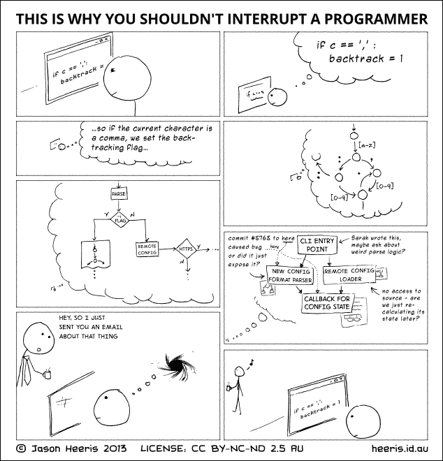

# 十二、我们在谈论函数式编程时，谈论的是什么

函数式编程在过去几年中获得了很大的发展。各大科技公司已开始使用函数式语言：

*   Scala 上的推特：[http://www.artima.com/scalazine/articles/twitter_on_scala.html](http://www.artima.com/scalazine/articles/twitter_on_scala.html)
*   WhatsApp 正在用 Erlang 编写：[http://www.fastcompany.com/3026758/inside-erlang-the-rare-programming-language-behind-whatsapps-success](http://www.fastcompany.com/3026758/inside-erlang-the-rare-programming-language-behind-whatsapps-success)
*   Facebook 使用 Haskell:[https://code.facebook.com/posts/302060973291128/open-sourcing-haxl-a-library-for-haskell/1](https://code.facebook.com/posts/302060973291128/open-sourcing-haxl-a-library-for-haskell/1)

在编译成 JavaScript 的函数式语言上已经有了一些非常出色和成功的工作：**Elm**和**PureScript**语言，举几个例子。人们正在努力创造新的语言，这些语言要么扩展到更传统的语言，要么编译成更传统的语言；我们可以引用 Python 的**Hy**和**椰子**语言。

甚至苹果的 iOS 开发新语言**Swift**也将函数式编程的多个概念整合到其核心中。

然而，这本书不是关于使用一种新的语言，而是关于从函数技术中获益，而不必改变我们的整个堆栈或学习一种全新的技术。通过在日常 PHP 中应用一些原则，我们可以极大地提高我们的生活质量和代码。

但在进一步讨论之前，让我们先简单介绍一下功能范式的真正含义，并解释它的来源。

# 什么是函数式编程？

如果你试图在互联网上搜索函数式编程的定义，你可能会在某个时候找到维基百科的文章（[https://en.wikipedia.org/wiki/Functional_programming](https://en.wikipedia.org/wiki/Functional_programming) ）。除其他外，功能编程描述如下：

> *在计算机科学中，函数式编程是一种编程范式——一种构建计算机程序结构和元素的方式，它将计算视为对数学函数的评估，并避免改变状态和可变数据。*

Haskell 维基（[https://wiki.haskell.org/Functional_programming](https://wiki.haskell.org/Functional_programming) 是这样描述的：

> *在函数式编程中，程序是通过计算表达式来执行的，与命令式编程不同，命令式编程中的程序是由语句组成的，这些语句在执行时会改变全局状态。函数式编程通常避免使用可变状态。*

虽然我们的观点可能有点不同，但我们可以从中概括出函数式编程的一些关键定义：

*   数学函数或表达式的求值
*   避免可变状态

从这两个核心思想中，我们可以获得许多有趣的特性和好处，您将在本书中发现。

## 功能

您可能知道函数在编程语言中是什么，但它与数学函数或 Haskell 称之为表达式有何区别？

数学函数不关心外部世界或程序的状态。对于给定的一组输入，输出总是完全相同的。为了避免混淆，在这种情况下，开发人员通常使用术语**纯函数**。我们在[第 2 章](02.html "Chapter 2.  Pure Functions, Referential Transparency, and Immutability")、*纯函数、引用透明性和不变性*中对此进行了讨论。

## 声明式编程

另一个区别是，函数式编程有时也称为**声明式编程**，与命令式编程不同。这些被称为**编程范例**。面向对象编程也是一种范例，但它与命令式编程紧密相连。

与其详细解释差异，不如用一个例子来说明。首先是使用 PHP 的命令：

```php
<?php
function getPrices(array $products) {
  // let's assume the $products parameter is an array of products.
  $prices = [];

  foreach($products as $p) {
    if($p->stock > 0) {
      $prices[] = $p->price;
    }
  }
  return $prices;
}
```

现在让我们看看如何使用 SQL 实现同样的功能，SQL 是一种声明性语言：

```php
SELECT price FROM products WHERE stock > 0;
```

注意到区别了吗？在第一个例子中，你告诉计算机一步一步地做什么，自己负责存储中间结果。第二个例子只描述了你想要什么；然后由数据库引擎返回结果。

在某种程度上，函数式编程看起来更像 SQL，而不是我们刚才看到的 PHP 代码。

没有任何解释，下面是如何以更具功能性的方式使用 PHP：

```php
<?php
function getPrices2(array $products) {
  return array_map(function($p) {
    return $p->price;
  }, array_filter(function($p) {
    return $p->stock > 0;
  }));
}
```

我承认这段代码可能并不比第一段代码更清晰。这可以通过使用专用库来改进。我们还将详细了解这种方法的优点。

## 避免可变状态

顾名思义，函数是函数编程最重要的组成部分。最纯粹的函数式语言只允许您使用函数，根本不允许使用变量，从而避免任何状态问题和状态变异，同时使任何类型的命令式编程都不可能。

这个想法虽然不错，但并不实用；这就是为什么大多数函数式语言都允许使用某种变量。然而，这些通常是不可变的，这意味着，一旦分配，它们的值就不能更改。

# 为什么函数式编程是软件开发的未来？

正如我们刚才看到的，函数式世界正在发展，企业界对函数式世界的采用也在增长，甚至新的命令式语言也从函数式语言中获得了灵感。但为什么会这样呢？

## 减轻开发者的认知负担

您可能经常读到或听说程序员不应该被打断，因为即使是很小的中断也会导致数十分钟的时间损失。我最喜欢的插图之一是以下漫画：



这部分是由于认知负担，或者换句话说，为了理解手头的问题或功能，你必须在记忆中保留大量的信息。

如果我们能够减少这一问题，好处将是巨大的：

*   代码将花费更少的时间来理解，并且更容易推理
*   中断将减少对精神过程的干扰
*   由于忘记了一条信息，将引入更少的错误
*   项目新来者的小学习曲线

我认为函数式编程可以大有帮助。

### 远离国家

当涉及到认知负担时，一个主要的竞争者，正如前面展示的漫画中所描述的那样，就是在试图理解一段代码的功能时，将所有这些少量的状态信息牢记在心。

每次访问变量或调用对象上的方法时，您都必须问问自己它的值是多少，并记住这一点，直到您读到当前代码的末尾。

通过使用纯函数，几乎所有这些都消失了。所有参数都在函数签名中。此外，由于函数不依赖于外部数据或任何对象状态，因此绝对可以确定，使用相同参数的任何后续调用都将具有完全相同的结果。

为了进一步说明问题，让我们引用 Ben Moseley 和 Peter Marks 的*出焦油坑*：

> *[…]我们相信，在大多数当代大型系统中，造成复杂性的唯一最大原因是状态，我们对状态的限制和管理做得越多越好。*

你可以在[阅读整篇文章 http://shaffner.us/cs/papers/tarpit.pdf](http://shaffner.us/cs/papers/tarpit.pdf) 。

### 小砌块

在进行函数式编程时，通常会创建许多小函数。然后你可以像乐高积木一样组合它们。这些小代码中的每一个都比这个试图做很多事情的大而混乱的方法更容易理解。

我并不是说所有的命令式代码都是一团糟，只是功能性思维确实鼓励编写更易于使用的小而简洁的函数。

### 关注点的位置

让我们看一下以下两个示例：


关注点的命令式与功能性分离

正如前面两篇虚构的代码片段所示，函数技术可以帮助您以一种鼓励关注点的局部性的方式组织代码。在这些片段中，我们可以按如下方式分离关注点：

*   创建列表
*   从文件中获取数据
*   过滤以**错误**文本开头的所有行
*   前 40 个错误

第二个片段显然对每个关注点都有一个更好的位置；它们没有在代码中展开。

有人可能会说，第一个代码不是最优的，可以重写以获得相同的结果。是的，可能是真的。但对于前一点，功能性思维从一开始就鼓励这种架构。

### 声明式编程

我们看到声明式编程是关于*什么*而不是*如何*。这有助于理解新代码，因为我们的大脑更容易思考我们想要什么，而不是如何去做。

当你在网上或在餐馆点东西时，你不会想象你想要的东西是如何被创造或交付的，你只会想到你想要的东西。函数式编程也一样，从一些数据开始，告诉语言你想用它做什么。

对于非程序员或对该语言缺乏经验的人来说，这种代码通常也更容易理解，因为我们可以可视化数据将发生什么。下面是另一条引文，引自*出焦油坑*，说明了这一点：

> *当程序员被迫（通过使用具有隐式控制流的语言）指定控件时，他或她被迫指定系统应该如何工作的一个方面，而不仅仅是需要什么。实际上，他们被迫过度指定问题*

## 缺陷较少的软件

我们已经看到函数式编程减少了认知负担，使代码更容易推理。对于 bug 来说，这已经是一个巨大的胜利，因为它将允许您快速发现问题，因为您将花费更少的时间了解代码如何工作，从而专注于它应该做什么。

但我们刚刚看到的所有好处都有另一个优势。它们也让测试变得容易多了！如果你有一个纯函数，并且你用一组给定的值来测试它，你就有绝对的把握，它总是会在生产中返回完全相同的东西。

有多少次您认为您的测试很好，但却发现您对应用中的某个模糊状态有某种隐藏的依赖，在某些特定情况下触发了问题？对于纯函数，这种情况应该少发生很多。

我们还将在本书后面学习基于属性的测试。尽管该技术可以用于任何命令式代码库，但其背后的思想来自函数世界。

## 更容易重构

重构从来都不容易。但由于纯函数的唯一输入是它的参数，唯一输出是返回值，所以事情就简单了。

如果重构后的函数继续为给定的输入返回相同的输出，则可以保证软件将继续工作。您不能忘记在对象的某个位置设置一些状态，因为您的函数没有副作用。

## 并行执行

我们的计算机拥有越来越多的内核，而云使得跨多个节点共享工作变得更加容易。然而，挑战在于确保计算可以分布。

映射和折叠等技术，加上不变性和无状态性，使这变得非常容易。

当然，您仍然会遇到与分布式计算本身相关的问题，例如分区和故障检测，但是将计算拆分为多个工作负载将变得容易得多！如果您想了解有关分布式系统的更多信息，我可以推荐本文（[http://videlalvaro.github.io/2015/12/learning-about-distributed-systems.html](http://videlalvaro.github.io/2015/12/learning-about-distributed-systems.html) ）由一位前同事提供。

## 实施良好实践

这本书证明了函数式编程更多的是关于我们做事的方式，而不是特定的语言。几乎可以在任何具有函数的语言中使用函数技术。您的语言仍然需要具有某些属性，但不是那么多。我喜欢谈论功能性思维。

如果是这样，为什么公司会转向函数式语言？因为这些语言强化了我们将在本书中学习的最佳实践。在 PHP 中，您必须始终记住使用函数技术。在哈斯克尔，你不能做任何其他事情；这种语言迫使您编写纯函数。

当然，您仍然可以用任何语言编写糟糕的代码，即使是最纯粹的语言。但通常，人们，尤其是开发人员，喜欢走阻力最小的道路。如果这条路是通向高质量代码的那条路，他们就会走。

# 功能世界的快速历史

从历史上看，函数式编程起源于学术界。直到最近几年，才有更多的主流公司开始使用它来开发面向消费者的应用。一些新的研究领域现在甚至由大学以外的人进行。但让我们从头开始。

## 第一年

我们的故事始于 20 世纪 30 年代，当时阿隆佐·丘奇（Alonzo Church）将 Lambda 演算形式化，这是一种使用接受其他函数作为参数的函数来解决数学问题的方法。虽然这是函数编程的基础，但在约翰·麦卡锡 1958 发布了 Tyr0 T0 Lisp AuthT1Ty 时，首次使用该概念来实现编程语言。公平地说，被认为是第一种编程语言的**Fortran**于 1957 年发布。

尽管 LISP 被认为是一种多范式语言，但它通常被认为是第一种函数式语言。很快，其他人接受了这一暗示，开始围绕函数式编程的思想展开工作，从而产生了**APL**（1964）、**Scheme**（1970）、**ML**（1973）、**FP**（1977）以及许多其他概念。

FP 本身现在或多或少已经死了，但约翰·巴克斯（John Backus）的演讲对功能范式的研究至关重要。这本书可能不是最容易读的，但它确实很有趣。我只能建议你在[上尝试一下整篇论文 http://worrydream.com/refs/Backus-CanProgrammingBeLiberated.pdf](http://worrydream.com/refs/Backus-CanProgrammingBeLiberated.pdf) 。

## Lisp 家族

Scheme 于 1970 年首次发布，旨在修复 Lisp 的一些缺陷。与此同时，Lisp 催生了一个编程语言家族或方言：

**Common Lisp**（1984）：试图编写一个语言规范，以统一当时编写的所有 Lisp 方言。

**Emacs Lisp**（1985）：用于自定义和扩展 Emacs 编辑器的脚本语言。

**Racket**（1994）：最初被创建为一个围绕语言设计和创作的平台，现在被用于游戏脚本、教育和研究等多个领域。

**Clojure**（2007）：由 Rich Hickey 经过长时间思考后创作，创造出完美的语言。Clojure 的目标是**Java 虚拟机**（**JVM**。有趣的是，Clojure 现在还可以有其他目标，例如 JavaScript（ClojureScript）和.NET 虚拟机。

**Hy**（2013）：一种针对 Python 运行时的方言，允许使用所有 Python 库。

## 毫升

ML 也产生了一些孩子，最著名的是**标准 ML**和**OCaml**（1996），它们至今仍在使用。在许多现代语言的设计中，它也经常被引用为影响力。举几个例子：Go、Rust、Erlang、Haskell 和 Scala。

## 二郎的崛起

我之前说过，函数式语言的主流使用是在最近几年开始的。这并不完全正确。爱立信早在 1986 年就开始研究 Erlang，对函数式语言所承诺的稳定性和健壮性感兴趣。

起初，Erlang 是在**Prolog**之上实现的，它被证明太慢了，但 1992 年通过重写使用虚拟机将 Erlang 编译为 C，使得爱立信早在 1995 年就在生产电话系统上使用了 Erlang。从那时起，它已被世界各地的电信公司使用，并被认为是高可用性方面最好的语言之一。

## 哈斯克尔

1990 年标志着 Haskell 的首次发布，这是世界各地的学者为创建第一个关于纯函数式语言的开放标准所做的规范工作的结果。其想法是将现有的函数式语言整合成一种通用语言，以便它可以成为进一步研究函数式语言设计的基础。

从那时起，Haskell 已从年的纯学术语言发展为领先的函数式语言之一。

## 斯卡拉

Scala 开发于 2001 年由前 Java 核心开发人员 Martin Odersky 启动。其主要思想是通过将函数式编程与更传统的命令式概念相结合，使其更易于实现。2004 年的第一次公开发布针对的是 JVM 和.NET 使用的**公共运行时语言**（**CRM**）（第二个目标后来在 2012 年被放弃）。

Scala 源代码可以与目标虚拟机的语言结构一起使用它的语言结构。直接使用现有 Java 库的能力以及退回到命令式风格的能力是 Scala 在企业界迅速崛起的原因之一。

由于 Android 使用与 Java 兼容的虚拟机，Scala 非常适合于移动开发，而且还有一项将其编译为 JavaScript 的计划，这意味着您可以在服务器和客户端上使用它进行 web 开发。

## 新来者

如今，函数式编程语言开始获得更多的主流认可，新的语言也在学术界之外被创造出来。以下是全世界人民正在积极开展的工作的简要概述。

**Elm**是在 ClojureScript 之外创建编译为 JavaScript 的函数式语言的一次认真尝试。这是 Evan Czaplicki 的一篇论文的结果，该论文试图创建一种函数式反应式语言，我们将在本书的最后一章探讨这一概念。当一个时间旅行调试器（[时，它得到了一些覆盖 http://debug.elm-lang.org/](http://debug.elm-lang.org/) ）是几年前首次提出的，这一想法在**React**等 JavaScript 框架中实施起来要痛苦得多。在线编辑器、非常棒的教程以及您可以使用**npm**安装它的事实大大缓解了入门门槛。

**PureScript**是另一种编译为 JavaScript 的函数式语言。它比 Elm 更接近 Haskell，并且遵循更数学的方法。社区规模较小，但为了使语言更加友好，正在进行大量工作。PureScript 编译器是用 Haskell 编写的，入门有点困难，但是如果您想要有健壮的客户端代码，那么它是值得的。

在我看来，**伊德里斯**并没有真正做好在生产环境中大放异彩的准备。但是，它在这个列表中占有一席之地，因为它是实现依赖类型的更高级函数语言之一。依赖类型是一种高级类型概念，主要见于纯学术语言中。详细解释它超出了本书的范围，但让我们做一个简单的例子：*一对整数*是**类型**；*第二个大于第一个*的一对整数是**依赖类型**，因为该类型取决于变量的值。这种打字系统的优点是，你可以更彻底地证明你的数据是正确的，因此你的软件的结果也是正确的。然而，这是一种非常先进的技术，而且这种语言很少见，也很难学习。

# 功能性术语

与其他领域一样，函数式编程也有自己的术语。这个小词汇表的目的是使阅读这本书更容易，也让你对你将在网上找到的资源有更多的了解。

**Arity**

函数采用的参数数。术语空、一元、二元和三元也用于表示分别采用 0、1、2 和 3 个参数的函数。另请参见下文中的变量。

**高阶函数**

返回另一个函数的函数。[第一章](01.html "Chapter 1. Functions as First Class Citizens in PHP")、*作为一等公民的函数*进一步解释了高阶函数的概念，因为这是函数编程的基础之一。

**副作用**

影响当前函数外部世界的任何内容：更改全局状态、通过引用传递的变量、对象中的值、写入屏幕或文件、获取用户输入。这是一个重要的概念，将在本书的多个章节中进一步探讨。

**纯度**

如果函数只使用显式参数且没有副作用，则称其为纯函数。纯函数是指当使用相同的参数调用时，总是产生完全相同的结果的函数。纯语言是只允许纯函数的语言。正如[第 2 章](02.html "Chapter 2.  Pure Functions, Referential Transparency, and Immutability")、*纯函数、引用透明性和不变性*中所讨论的，这个概念是函数编程的基石。

**功能组合**

组合函数是一种有用的技术，可以将各种函数作为构建块重用，以实现更复杂的操作。您可以组合两个函数来创建一个新函数`h`，而不是总是对函数`f`的结果调用函数`g`。[第 4 章](04.html "Chapter 4. Composing Functions")*编写函数*演示了如何使用此思想。

**不变性**

不可变变量是指一旦赋值就不能更改的变量。

**部分应用**

将给定值赋给函数的某些参数以创建一个较小算术数的新函数的过程。这有时称为将值固定或绑定到参数。这在 PHP 中有点难实现，但是[第 4 章](04.html "Chapter 4. Composing Functions")*编写函数*给出了一些如何实现的想法。

**咖喱**

与部分应用类似，curry 是将具有多个参数的函数转换为多个一元函数的过程，这些函数组合在一起以获得相同的结果。在[第 4 章](04.html "Chapter 4. Composing Functions")、*构成功能*中介绍了咖喱背后的原因和理念。

**折叠/缩小**

将集合减少为*单个*值的过程。这是函数式编程中经常使用的概念，在[第 3 章](03.html "Chapter 3.  Functional Basis in PHP")、*PHP 中的函数基础*中有详细说明。

**地图**

对集合的所有值应用函数的过程。这是函数式编程中经常使用的概念，在 PHP 中的[第 3 章](03.html "Chapter 3.  Functional Basis in PHP")、*函数基础中详细说明了这一点。*

**函子**

可以对其应用映射操作的任何类型的值或集合。给定函数的函子负责将其应用于其内部值。据说函子*将*值包装起来。这个概念在[第 5 章](05.html "Chapter 5.  Functors, Applicatives, and Monads")、*函子、应用和**单子*中提出。

**适用**

在上下文中保存函数的数据结构。给定值的 applicative 负责对其应用“内部”函数。据说函子*包装了*函数。这个概念在[第 5 章](05.html "Chapter 5.  Functors, Applicatives, and Monads")、*函子、应用和**单子*中提出。

**半群**

可以将其值逐二关联的任何类型。例如，字符串是一个半群，因为可以将它们连接起来。

整数有多个半群：

*   加法半群，将整数相加
*   乘法半群，将整数相乘

**幺半群**

幺半群是一个同样具有单位值的半群。标识值是与相同类型的对象关联时不会更改其值的值。整数的加法标识为 0，字符串的标识为空字符串。

幺半群还要求多个值的关联顺序不改变结果，例如，*（1+2）+3==1+（2+3）*。

**单子**

单子既可以作为函子，也可以作为应用；有关更多信息，请参阅专用的[第 5 章](05.html "Chapter 5.  Functors, Applicatives, and Monads")、*函子、应用和单子*。

**提升/提升/提升 TM**

将某物分别放入函子、应用或单子中的过程。

**态射**

变换函数。我们可以区分多种形态：

*   **自同态**：输入和输出的类型保持不变，例如，使字符串大写。
*   **同构**：类型改变，但数据保持不变，例如，将包含坐标的数组转换为坐标对象。

**代数型/并集型**

将两种类型组合成一种新类型。Scala 调用这两种类型。

**期权类型/可能类型**

包含有效值且等效于 null 的联合类型。当函数不确定是否返回有效值时，使用这种类型。[第 3 章](03.html "Chapter 3.  Functional Basis in PHP")，*PHP*中的功能基础，解释了如何使用这些来简化错误管理。

**幂等性**

如果将函数重新应用于其结果不会产生不同的结果，则称其为幂等函数。如果你用它自己组成一个幂等函数，它仍然会产生相同的结果。

**Lambda**

匿名函数的同义词，即分配给变量的函数。

**谓语**

对于给定的一组参数，返回 true 或 false 的函数。谓词通常用于筛选集合。

**参考透明度**

如果表达式可以在不改变程序结果的情况下被其值替换，则表示表达式是引用透明的。这个概念与纯度紧密相连。[第 2 章](02.html "Chapter 2.  Pure Functions, Referential Transparency, and Immutability")*纯函数、引用透明性和不变性*探讨了两者之间的细微差异。

**懒惰评估**

如果只在需要时计算表达式的结果，则称为延迟计算语言。这允许您创建无限列表，并且仅当表达式是引用透明的时才可能。

**非严格语言**

非严格语言是一种所有构造都是惰性计算的语言。只有少数语言是非严格的，这主要是因为语言必须是纯的，才能是非严格的，并且它带来了非琐碎的实现问题。最著名的非严格语言可能是 Haskell。

几乎所有常见的语言都是严格的：C、Java、PHP、Ruby、Python 等等。

**可变**

具有动态算术性的函数称为**变量**。这意味着函数接受数量可变的参数。