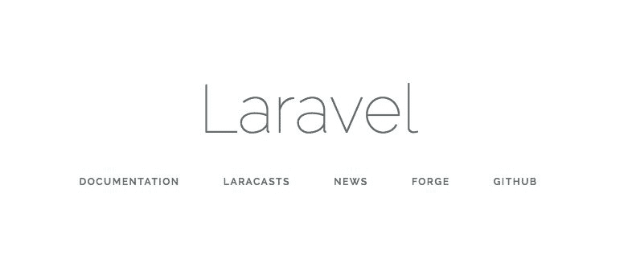
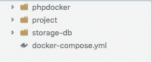
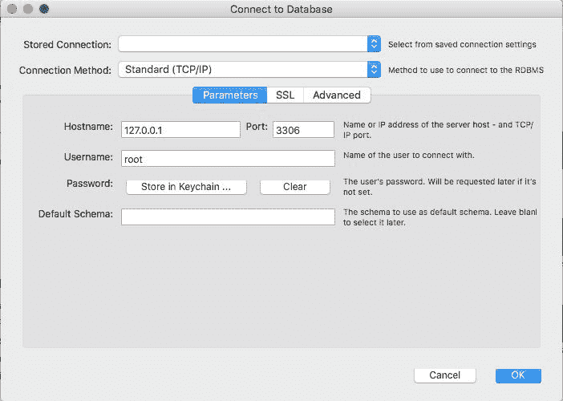
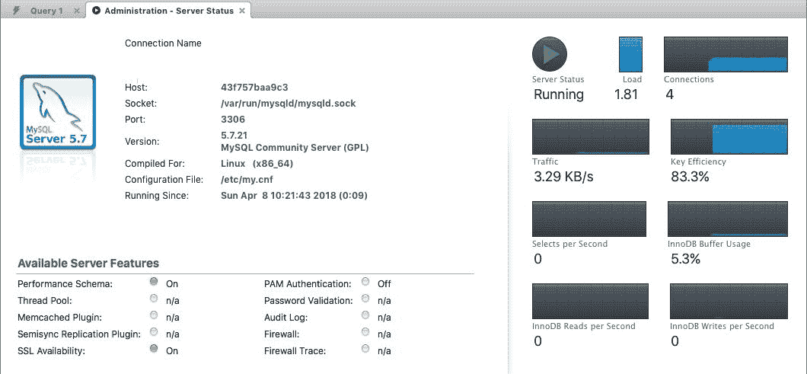
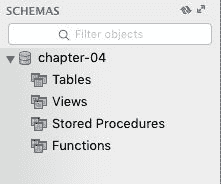
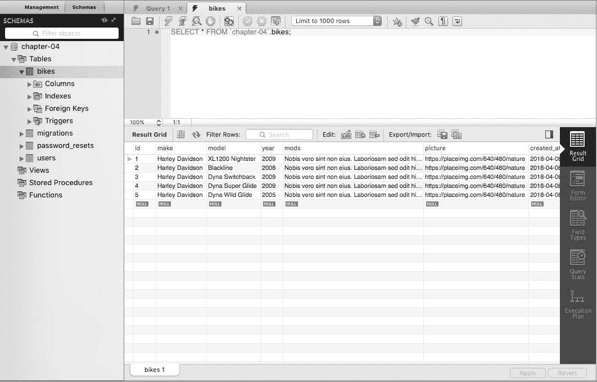
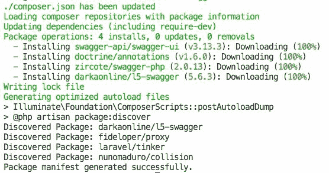
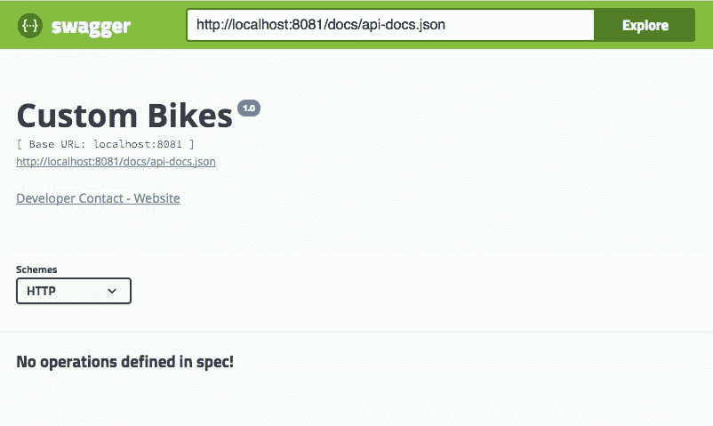

# 构建基线后端应用

现在，我们将开始构建应用的基线。在本章中，我们将使用 RESTful 架构创建一个 Laravel 应用。正如我们在上一章中看到的，Laravel 将为我们提供必要的基础设施，以构建一个坚实且可扩展的应用。

我们将进一步了解我们在[第 1 章](01.html#K0RQ0-f24bf9337f074c079f0c90fd02324171)、*中简要提到的一些要点，了解 Laravel 5* 的核心概念，例如使用 Docker 容器来配置我们的环境，以及如何始终填充我们的数据库，即使使用 MySQL Docker 容器也是如此。

正如我们之前提到的，完全可以为您的开发环境使用不同的配置，我们在[第 1 章](01.html#K0RQ0-f24bf9337f074c079f0c90fd02324171)*中提到了理解 Laravel 5 核心概念的一些方法。*但是，我们强烈建议您使用 Docker。

在本章中，我们将涵盖以下主题:

*   关于 Laravel 和 Docker 的附加说明
*   使用 PHP Composer 构建一个 Laravel 应用
*   建立一个 MySQL 数据库
*   迁移和数据库种子
*   斯瓦格框架的应用编程接口文档

# 关于 Laravel 和 Docker 的附加说明

在本节中，我们将使用我们在[第 1 章](01.html#K0RQ0-f24bf9337f074c079f0c90fd02324171)、*中创建的相同基础架构来理解 Laravel 5* 的核心概念。使用`PHPDocker.io`生成器，我们将对其进行定制，以便更好地了解 Docker 容器内部发生的事情。

所以，让我们进入更详细的解释，没有什么比弄脏我们的手更好的了。

# 创建 Docker 编写基础

首先，我们将为应用创建基础(`Dockerfile`、`docker-compose`)文件，这与我们在第一章中所做的不同。相反，我们将手动创建文件，但基于我们在[第 1 章](01.html#K0RQ0-f24bf9337f074c079f0c90fd02324171)、*中使用的文件理解 Laravel 5* 的核心概念。

按照以下步骤 *:*

1.  创建一个名为`chapter-04`的文件夹。
2.  在`chapter-04`文件夹内，创建一个名为`phpdocker`的文件夹。
3.  在`phpdocker`文件夹中，添加两个文件夹，一个叫做`nginx`，另一个叫做`php-fpm`。

# 配置 nginx

现在，是时候为`nginx`和`php-fpm`服务器创建配置文件了，所以我们将使用 nginx 反向代理将我们的 PHP 文件提供给 web。

在`nginx`文件夹中，创建一个名为`nginx.conf`的新文件，并添加以下代码:

```php
server {
    listen 80 default;
    client_max_body_size 308M;
    access_log /var/log/nginx/application.access.log;
    root /application/public;
    index index.php;
    if (!-e $request_filename) {
        rewrite ^.*$ /index.php last;
    }
    location ~ \.php$ {
        fastcgi_pass php-fpm:9000;
        fastcgi_index index.php;
        fastcgi_param SCRIPT_FILENAME
         $document_root$fastcgi_script_name;
        fastcgi_param PHP_VALUE
         "error_log=/var/log/nginx/application_php_errors.log";
        fastcgi_buffers 16 16k;
        fastcgi_buffer_size 32k;
        include fastcgi_params;
    }
}
```

上一个文件将端口`80`设置为我们的 web 服务器的默认端口，并将端口`9000`设置为`php-fpm`，这意味着我们在 nginx 中的容器将通过端口`9000`与`php-fpm`通信，而为了与 web 通信，将通过端口`80`使用公共视图。稍后，在`docker-compose.yml`中，我们将内部 Docker 容器端口配置给外部世界，在本例中，外部世界是我们的主机。

# 配置 php-fpm

要配置`php-fpm`，请执行以下步骤:

1.  在`php-fpm`文件夹内，创建一个名为`Dockerfile`的文件，并添加以下行:

```php
FROM phpdockerio/php72-fpm:latest
WORKDIR "/application"
# Install selected extensions and other stuff
RUN apt-get update \
    && apt-get -y --no-install-recommends install php7.2-mysql
     libmcrypt-dev \
    && apt-get clean; rm -rf /var/lib/apt/lists/* /tmp/* /var/tmp/*
    /usr/share/doc/*
```

现在，是时候创建我们的覆盖`php.ini`文件了，这是`PHP.ini`，在这里我们可以手动覆盖运行在服务器上的 PHP 设置。

在 Apache 服务器的情况下，当服务器启动时，它只运行一次，在我们的情况下，就像我们在 php-fpm 中使用 nginx 一样。关于这一点，我们使用的是`fastCgi`环境，这个文件在每次服务器调用时都会被读取。

使用`fastCgi`环境而不是传统的 Apache 环境的一些优势如下:

*   适应性过程增长
*   基本统计(类似于 Apache `mod_status`)
*   优雅的启动/停止高级流程管理
*   不同`uid`、`gid`、`chroot`、`environment`、`php.ini`(取代`safe_mode`)的开工能力
*   它为`stdout`和`stderr`创建日志
*   发生意外代码破坏时的紧急重启(缓存)
*   支持加速上传
*   对您的 facet FastCGI 的几个改进

在服务器上使用 PHP 的其他方法如下:

*   Apache 模块(`mod_php`)
*   公共网关接口
*   fast CGI-fast CGI-fast CGI-fast CGI-fast CGI-fast CGI-fast CGI
*   PHP–**FastCGI 流程管理器** ( **FPM** )
*   **命令行** ( **CLI** )

2.  在`php-fpm`文件夹中，创建一个名为`php-ini-overrides.ini`的新文件，并添加以下代码:

```php
upload_max_filesize = 300M
post_max_size = 308M
[Xdebug]
zend_extension=/usr/local/lib/php/extensions/no-debug-non-zts-20151012/xdebug.so
xdebug.remote_enable=1
xdebug.remote_autostart=1
xdebug.remote_host=111.111.11.1 # you must use your own IP address here
xdebug.remote_port=9009
```

请注意，我们只是在这里设置 Xdebug，这是一个调试 PHP 应用的 PHP 扩展。

# 创建 docker-compose 配置文件

现在，是时候配置我们的合成文件并装载我们将在应用中使用的所有容器了。我们将逐步构建这个文件，所以首先要做的是创建这个文件:

1.  在根目录内，`chapter-04`文件夹创建一个名为`docker-compose.yml`的文件。
2.  在`docker-compose.yml`中，添加以下代码:

```php
version: "3.1"
services:
mysql:
  image: mysql:5.7
  container_name: chapter-04-mysql
  working_dir: /application
  volumes:
    - .:/application
  environment:
    - MYSQL_ROOT_PASSWORD=123456
    - MYSQL_DATABASE=chapter-04
    - MYSQL_USER=chapter-04
    - MYSQL_PASSWORD=123456
  ports:
    - "8083:3306"
```

这里的第一个代码块是配置 MySQL 服务器。我们使用的是 Docker 的官方 MySQL 镜像。我们正在设置环境变量和端口，但是请注意，在主机上，我们使用端口`8083`访问 MySQL，并且在容器内部，我们使用`3306`默认端口。在本章的后面，我们将看到如何将 MySQL 客户端连接到 MySQL 容器。

You can find out more information from the official Docker website from at [https://hub.docker.com/explore/](https://hub.docker.com/explore/) and at [https://store.docker.com/](https://store.docker.com/).

请注意，我们只是在示例中使用了一个非常简单的密码。在生产环境中，我们将使用全局环境变量。

让我们添加新的代码块。

3.  仍然在`docker-compose.yml`文件中，在第一个块后添加以下代码:

```php
webserver:
  image: nginx:alpine
  container_name: chapter-04-webserver
  working_dir: /application
  volumes:
    - .:/application
    - ./phpdocker/nginx/nginx.conf:/etc/nginx/conf.d/default.conf
  ports:
    - "8081:80"
```

在前面的代码中，使用前面看到的内部端口 80 和主机上的端口`8081`配置我们的`nginx`容器。我们还将把`nginx.conf`放入容器中。这里，我们使用的是`nginx/alpine` Docker 图像。

You can read more about the alpine image here, at the following Docker website: [https://store.docker.cimg/alpine](https://store.docker.cimg/alpine).

4.  最后但同样重要的是，让我们配置`php-fpm`。在 web 服务器配置块之后添加以下代码块:

```php
php-fpm:
build: phpdocker/php-fpm
container_name: chapter-04-php-fpm
working_dir: /application
volumes:
- .:/application
- ./phpdocker/php-fpm/php-ini-overrides.ini:/etc/php/7.2/fpm/conf.d/99-overrides.ini
```

这里，我们只是在 Docker 容器内的`php-fpm`配置目录中从我们的机器设置`php-ini-overrides.ini`。

# 构建应用容器

现在，是时候检查一下一切是否按照我们的计划进行了。让我们创建将在应用中使用的容器。在[第 1 章](01.html#K0RQ0-f24bf9337f074c079f0c90fd02324171)*理解 Laravel 5* 的核心概念中，我们已经看到了一些非常有用的 Docker 命令，现在我们将再次使用它们。让我想想。

首先，我们将停止从上一章开始或在您的机器上仍在运行的任何容器。

Don't forget that you need to have your Docker Daemon up and running on your local machine.

1.  打开您的终端窗口，键入以下命令:

```php
docker ps -a
```

如果您是第一次在机器上使用 Docker，您将看到类似以下输出的内容:


Listed Docker containers

但是，如果您以前在您的机器上使用过 Docker，前面的命令将列出您机器上的所有 Docker 容器。在这种情况下，小心*步骤 2* ，因为该命令将停止并删除您机器上的所有容器。

因此，如果您想保留以前的容器，我们建议您使用以下命令停止并删除本书教程创建的容器:

```php
docker stop <containerId> 
```

您也可以使用以下命令代替在*步骤 2* 和*步骤 3* 中执行的命令:

```php
docker rm <containerId> 
```

2.  键入以下命令停止所有容器:

```php
docker stop $(docker ps -a -q)
```

3.  让我们通过键入以下命令来删除所有容器:

```php
docker rm $(docker ps -a -q)
```

干得好！现在，我们可以创建运行应用所需的映像。让我们测试一下我们在上一个会话中建立的设置。

4.  在`chapter-04`文件夹中，键入以下命令:

```php
docker-compose build
```

在终端窗口的末尾，我们将看到类似如下的输出:

```php
---> 5f8ed0da2be9 Successfully built 5f8ed0da2be9 Successfully tagged chapter-04_php-fpm:latest mysql uses an image, skipping
```

前面的输出告诉我们，我们创建了一个名为`chapter-04_php-fpm:latest`的新 Docker 映像，所以现在，让我们创建应用容器。

5.  在终端的`chapter-04`文件夹中，键入以下命令:

```php
docker-compose up -d
```

前一个命令的输出将给出我们之前设置的所有三个 Docker 容器的状态，类似于以下输出:

```php
---> 5f8ed0da2be9 Successfully built 5f8ed0da2be9 Successfully tagged chapter-04_php-fpm:latest mysql uses an image, skipping
```

6.  现在，我们可以检查用以下命令创建的新容器:

```php
docker ps -a
```

终端上的输出将非常类似于以下消息:


Docker containers running

请注意，我们在`chapter-04`文件夹中还没有任何应用代码，因此如果我们尝试使用`http://localhost:8081/`地址访问服务器，我们将看到一条“找不到文件”消息。这是完全可以预料到的，因为我们的服务器上还没有运行任何应用。

# 使用 PHP Composer 构建一个 Laravel 应用

我们在服务器上建立了坚实的基础。我们使用的 PHP 图像已经包含了 Laravel 运行应用所需的所有依赖项，包括 Composer。

因此，我们将使用`php-fpm`容器中的 Composer，而不是使用我们在机器上全局安装的内容。

这是避免版本冲突最安全的方法。让我们检查一下`php-fpm`容器里有什么:

1.  打开您的终端窗口，键入以下命令:

```php
docker-compose exec php-fpm bash
```

2.  现在我们已经进入了`php-fpm`bash/终端，让我们使用以下命令检查 composer 版本:

```php
composer --version
```

3.  我们将在终端上看到以下输出:

```php
Composer version 1.6.3
```

恭喜你！我们已经能够配置我们的所有环境，并准备开始构建我们的应用。

# 创建应用支架

为了保持本书的应用和您将使用示例代码的时刻之间的一致性，我们将修复将安装在您的环境中的 Laravel 版本。

因此，让我们继续以下步骤:

1.  打开您的终端窗口，键入以下命令:

```php
composer create-project laravel/laravel=5.6.12 project --prefer-dist
```

At the time of writing this book, we have installed version 5.6.12 of Laravel. Although we should have no problem installing a more current version, we strongly recommend that you keep the version in 5.6\. *.

使用之前的命令后，您将在终端窗口中看到以下消息:

```php
Generating optimized autoload files > Illuminate\Foundation\ComposerScripts::postAutoloadDump > @php artisan package:discover Discovered Package: fideloper/proxy Package: laravel/tinker Discovered Package: nunomaduro/collision Package manifest generated successfully. > @php artisan key:generate
```

这意味着一切都很顺利。

注意，我们在一个名为`project`的目录中创建了 Laravel 应用。这样，我们将拥有以下应用结构:


Application folder structure

请注意，我们已经将 Laravel 应用的内容从 Docker 配置文件夹中分离出来。强烈推荐这种做法，因为我们可以在项目文件夹中进行任何类型的更改，而不会意外损坏任何 Docker 或`docker-compose`文件。

但是有了这个小小的改变，我们需要调整`docker-compose.yml`文件，以适应已经创建的新路径。

2.  打开`docker-compose.yml`，让我们用新路径调整`php-fpm` 卷标签，如下面的代码块所示:

```php
php-fpm:
  build: phpdocker/php-fpm
  container_name: chapter-04-php-fpm
  working_dir: /application
  volumes:
    - ./project:/application
    - ./phpdocker/php-fpm/php-ini-
    overrides.ini:/etc/php/7.2/fpm/conf.d/99-overrides.ini
```

# 运行应用

为了使我们刚刚做出的更改生效，我们需要停止并重新启动我们的容器:

1.  在您的终端上，键入`exit`退出`php-fpm`狂欢。
2.  现在，在`chapter-04`文件夹的根目录下，仍然在终端中，键入以下命令:

```php
docker-compose kill
```

您将看到以下输出消息:

```php
Stopping chapter-04-webserver ... done Stopping chapter-04-mysql ... done Stopping chapter-04-php-fpm ... done
```

3.  在终端上，键入以下命令再次运行容器:

```php
docker-compose up -d
```

现在，我们可以看到`php-fpm`容器被重新创建，并将反映我们的更改:

```php
Recreating chapter-04-php-fpm ... done Starting chapter-04-webserver ... done Starting chapter-04-webserver ... done
```

It is highly recommended that you repeat this procedure whenever you make any changes to the `nginx` or `php-fpm` servers.

4.  现在，让我们检查一下 Laravel 的安装和配置。打开默认浏览器，进入`http://localhost:8081/`链接。

我们将从 Laravel 框架中看到欢迎屏幕，如下图所示:



Laravel welcome screen

# 建立一个 MySQL 数据库

到目前为止，我们已经走了很长的路，并为我们的 RESTful 应用建立了坚实的基础，尽管我们必须采取更多的步骤才能最终开始开发。

在这一步中，我们将为我们的应用配置我们的 MySQL 数据库，并在我们的 Docker MySQL 容器中执行一些更改，以便使我们的应用的数据保留在我们的数据库中，即使当我们断开或停止 MySQL 容器时也是如此。

# 添加存储文件夹

存储 MySQL 数据的本地文件夹非常重要，因为我们的`docker-compose.yml`文件不包含任何已经配置为存储数据库中创建的数据的卷。

请记住，我们使用的是 Docker，而我们的 MySQL 容器是基于一个数据库的映像。这样，每次我们完成容器过程时，我们的数据库都会被擦除，下次我们启动它时，我们的数据库将是空的。

打开`docker-compose.yml`文件，在 MySQL 配置块的应用卷后添加`- ./storage-db:/var/lib/mysql`，如下代码所示:

```php
mysql:
    image: mysql:5.7
    container_name: chapter-04-mysql
    working_dir: /application
    volumes:
    - .:/application
    - ./storage-db:/var/lib/mysql
```

前面的代码在我们的项目/机器上设置了`storage-db`文件夹来存储来自 MySQL 容器的所有 MySQL 数据。在本节的后面，我们将看到这些更改的结果，但是现在，让我们配置我们的数据库。

# 配置。环境文件

1.  打开`project`文件夹根目录下的`.env`文件，用以下几行替换数据库配置:

```php
DB_HOST=mysql
DB_PORT=3306
DB_DATABASE=chapter-04
DB_USERNAME=chapter-04
DB_PASSWORD=123456
```

让我们检查一下连接。

2.  在“终端”窗口中，键入以下命令:

```php
docker-compose exec php-fpm bash
```

3.  在`php-fpm` bash 中，键入以下命令:

```php
php artisan tinker
```

4.  最后，键入以下命令:

```php
DB::connection()->getPdo();
```

5.  您将看到类似于以下输出的内容:

```php
=> PDO {#760
inTransaction: false,
attributes: {
CASE: NATURAL,
ERRMODE: EXCEPTION,
AUTOCOMMIT: 1,
PERSISTENT: false,
DRIVER_NAME: "mysql",
SERVER_INFO: "Uptime: 2491 Threads: 1 Questions: 9 Slow queries: 0 Opens: 105 Flush tables: 1 Open tables: 98 Queriesper second avg: 0.003",
ORACLE_NULLS: NATURAL,
CLIENT_VERSION: "mysqlnd 5.0.12-dev - 20150407 - $Id: 38fea24f2847fa7519001be390c98ae0acafe387 $",
SERVER_VERSION: "5.7.21",
STATEMENT_CLASS: [
"PDOStatement",
],
EMULATE_PREPARES: 0,
CONNECTION_STATUS: "mysql via TCP/IP",
DEFAULT_FETCH_MODE: BOTH,
},
}
```

这意味着一切都很顺利。恭喜你！我们有数据库。现在，是时候生成我们名为`storage-db`的本地数据库文件夹了。

如果您还在`php-fpm` bash 中，请键入`exit`命令退出并返回终端。

6.  在终端窗口中，键入以下命令:

```php
docker-compose kill
```

7.  让我们删除之前创建的 MySQL 容器:

```php
docker-compose rm mysql
```

8.  现在，让我们重新创建容器，以便它启动并运行更改。键入以下命令:

```php
docker-compose up -d
```

您将在终端上看到以下输出:

```php
Creating chapter-04-mysql ... done Starting chapter-04-php-fpm ... done Starting chapter-04-webserver ... done
```

请注意，MySQL 容器是用正确配置的`storage-db`文件夹创建的。我们的项目将具有以下结构:



Project folder structure

# 使用 MySQL 外部客户端

完全使用命令行管理数据库可能不是一件容易的事情，从视觉上讲，也不是。为了在这个过程中帮助我们，所有的数据库都有一个工具来完成这个任务，MySQL 也不例外。

在这个过程中有几个开源的、多平台的工具帮助我们，MySQL 有自己的工具叫做 **Workbench** 。

You can read more about the Workbench at the official MySQL documentation at [https://www.mysql.com/products/workbench/](https://www.mysql.com/products/workbench/).

在本课程中，我们将看到如何使用带有图形界面的工具来访问 Docker 容器中的数据库。

1.  前往[https://dev.mysql.com/downloads/workbench/](https://dev.mysql.com/downloads/workbench/)，选择自己的平台，按照安装步骤进行。
2.  打开工作台，单击数据库顶部菜单，然后单击连接到数据库。

您将看到以下屏幕:



Workbench connection screen

3.  请记住，工作台运行在主机上，而不是在 MySQL Docker 容器中。向其中添加以下信息:

主机名:`127.0.0.1`端口:`8083`
用户名:`chapter-04`T5】密码:`123456`

请注意，我们使用的配置与在 Laravel `.env`文件中使用的配置相同。

4.  单击确定按钮。现在，我们连接到在 Docker 容器中运行的 MySQL 数据库。您将看到类似以下截图的内容:



Workbench welcome screen

请注意左侧的模式面板。我们已经有了由 Docker 容器创建的数据库，并准备使用它。此时，它仍然是空的，如下图所示:


Schema left panel

# 迁移和数据库种子

现在，让我们练习一些我们在第一章中简要看到的命令，并以不同的方式创建我们的迁移和种子。

1.  打开`chapter-04`文件夹中的终端窗口，输入以下命令:

```php
docker-compose exec php-fpm bash
```

2.  在容器根 bash 中，键入以下命令:

```php
php artisan make:model Bike -m
```

请注意，我们正在使用`-m`标志来创建迁移文件以及自行车模型的创建。现在，我们的应用中有两个新文件:

*   `project/app/Bike.php`
*   `project/database/migrations/XXXX_XX_XX_XXXXXX_create_bikes_table.php`

# 创建迁移样板

正如我们之前看到的，新文件只有由 Laravel 引擎创建的样板代码。让我们为**自行车**模型和迁移文件添加一些内容。

1.  打开`project/app/Bike.php`并在自行车模型功能中添加以下代码:

```php
protected $fillable = [
    'make',
    'model',
    'year',
    'mods',
    'picture'
];
```

2.  现在，我们需要向之前创建的迁移文件添加相同的属性。打开`project/database/migrations/XXXX_XX_XX_XXXXXX_create_bikes_table.php`，在`up()`功能中添加以下代码:

```php
Schema::create('bikes', function (Blueprint $table) {
$table->increments('id');
$table->string('make');
$table->string('model');
$table->string('year');
$table->text('mods');
$table->string('picture');
$table->timestamps();
});
```

恭喜你！您已经创建了我们的第一个迁移文件，现在是时候执行以下命令来填充我们的数据库了。

3.  打开您的终端窗口，键入以下命令:

```php
php artisan migrate
```

前一个命令的输出类似于以下内容:

```php
Migration table created successfully. Migrating: XXXX_XX_XX_XXXXXX_create_users_table Migrated: XXXX_XX_XX_XXXXXX_create_users_table Migrating: XXXX_XX_XX_XXXXXX_create_password_resets_table Migrated: XXXX_XX_XX_XXXXXX_create_password_resets_table Migrating: XXXX_XX_XX_XXXXXX_create_bikes_table Migrated: XXXX_XX_XX_XXXXXX_create_bikes_table
```

现在，在工作台模式上，我们可以看到我们的新表由`migrate`命令填充，如下图所示:



Workbench schema panel

# 创建我们的第一个数据库种子

在前面的步骤中，我们基本上遵循了与[第 1 章](01.html#K0RQ0-f24bf9337f074c079f0c90fd02324171)、*理解 Laravel 5* 的核心概念相同的过程，所以现在我们不打算使用 Faker 库来创建我们的数据。Faker 是一个非常有用的工具，因为在使用 Laravel 开发应用的过程中，它很容易使用并且可以快速创建数据。

在这个例子中，我们希望保持我们已经创建的数据与我们正在创建的应用更加一致，因此我们将使用一个外部 JSON 文件，其中包含我们想要插入到数据库中的数据。

1.  在`project/database`文件夹内，创建一个名为`data-sample`的新文件夹。
2.  在`project/database/data-sample`文件夹中，创建一个名为`bikes.json`的新文件，并添加以下代码:

```php
[{
  "id": 1,
  "make": "Harley Davidson",
  "model": "XL1200 Nightster",
  "year": "2009",
  "mods": "Nobis vero sint non eius. Laboriosam sed odit hic quia
    doloribus. Numquam laboriosam numquam quas quis.",
  "picture": "https://placeimg.com/640/480/nature
  }, {
  "id": 2,
  "make": "Harley Davidson",
  "model": "Blackline",
  "year": "2008",
  "mods": "Nobis vero sint non eius. Laboriosam sed odit hic quia
   doloribus. Numquam laboriosam numquam quas quis.",
  "picture": "https://placeimg.com/640/480/nature"
 }, {
  "id": 3,
  "make": "Harley Davidson",
  "model": "Dyna Switchback",
  "year": "2009",
  "mods": "Nobis vero sint non eius. Laboriosam sed odit hic quia
   doloribus. Numquam laboriosam numquam quas quis.",
  "picture": "https://placeimg.com/640/480/nature"
 }, {
  "id": 4,
  "make": "Harley Davidson",
  "model": "Dyna Super Glide",
  "year": "2009",
  "mods": "Nobis vero sint non eius. Laboriosam sed odit hic quia
  doloribus. Numquam laboriosam numquam quas quis.",
  "picture": "https://placeimg.com/640/480/nature"
 },{
  "id": 5,
  "make": "Harley Davidson",
  "model": "Dyna Wild Glide",
  "year": "2005",
  "mods": "Nobis vero sint non eius. Laboriosam sed odit hic quia
   doloribus. Numquam laboriosam numquam quas quis.",
  "picture": "https://placeimg.com/640/480/nature"
}]
```

请注意，我们保留了一些占位符文本和图像路径。暂时不要担心这个；在本书的后面，我们将使用前端应用替换所有这些数据。

3.  现在，是时候创建我们的种子文件了。在终端窗口中，键入以下命令:

```php
php artisan make:seeder BikesTableSeeder
```

上一个命令在`project/database/seeds`文件夹中添加了一个名为`BikesTableSeeder.php`的新文件。

4.  打开`project/database/seeds/BikesTableSeeder.php`并用以下内容替换其中的代码:

```php
use Illuminate\Database\Seeder;
use App\Bike;
class BikesTableSeeder extends Seeder
    {
    /**
    * Run the database seeds.
    *
    * @return void
    */
    public function run()
    {
        DB::table('bikes')->delete();
        $json = File::get("database/data-sample/bikes.json");
        $data = json_decode($json);
        foreach ($data as $obj) {
        Bike::create(array(
            'id' => $obj->id,
            'make' => $obj->make,
            'model' => $obj->model,
            'year' => $obj->year,
            'mods' => $obj->mods,
            'picture'=> $obj->picture
        ));
        }
    }
}
```

请注意，在第一行中，我们使用了 ORM 快捷函数(`DB::table()`)来删除自行车表，并使用了`Bike::create()`函数来创建我们的记录。在下一章中，我们将更深入地研究雄辩的 ORM，但是现在，让我们专注于创建我们的第一个种子。

5.  打开`project/database/seeds/DatabaseSeeder.php`并在`UsersTableSeeder`注释后添加下面一行代码:

```php
$this->call(BikesTableSeeder::class);
```

现在，是时候运行我们的种子并填充数据库了。我们可以通过两种方式做到这一点。我们可以单独运行`BikeSeeder`命令`php artisan db:seed --class=BikesTableSeeder`，或者使用`php artisan db:seed`命令，该命令将运行我们应用中的所有种子。

由于我们处于开发的开始阶段，我们将执行命令来加载所有的种子。

6.  打开您的终端窗口，键入以下命令:

```php
php artisan db:seed
```

在前一条命令结束时，我们将在终端上看到一条成功消息`Seeding: BikesTableSeeder`。太棒了。现在，我们在`chapter-04`数据库中有了第一批记录。

# 探索工作台表视图

现在，我们将使用工作台的可视化界面来可视化我们刚刚放入数据库中的数据。为此，请打开工作台并执行以下步骤:

1.  在右侧的模式面板上，单击“表格”菜单项。
2.  右键单击自行车，然后单击选择行–限制为 1000。

我们将在右侧看到一个新面板，如下图所示:



Bike tables on the Workbench interface

请注意，我们现在在自行车表内的数据库中有五条记录，这与我们在`bike.json`文件中创建的数据相同。

# 斯瓦格框架的应用编程接口文档

让我们休息一下，处理 RESTful 应用开发中一个极其重要的主题:关于如何使用 API 端点的文档。

虽然我们还没有创建任何控制器或路由来能够在浏览器中查看我们的应用编程接口的数据，但我们将引入一个新的工具来帮助我们开发我们的前端应用，称为斯瓦格框架。

swag 是一个开源的语言无关框架，用于描述、记录、消费和可视化 REST APIs。

如今，使用公共和私有 API 来创建前端 web 应用非常常见，我们熟悉几种 API，如 Twitter、LinkedIn 和许多其他 API。

记录应用是开发过程的一个重要部分。每个应用编程接口都需要被记录下来，以便于内部团队或第三方开发人员使用和测试。

最简单的方法是在开发过程的开始。

You can read more about the Swagger framework at the official website: [https://swagger.io/](https://swagger.io/).

# 安装 L5-斯瓦格库

在本节中，我们将使用 L5-斯瓦格项目。斯瓦格-PHP 和斯瓦格-用户界面的包装器将用于 Laravel 5 框架:

1.  仍然在终端窗口中，键入以下命令:

```php
composer require "darkaonline/l5-swagger"
```

You can read more about L5-Swagger at the official GitHub repository at [https://github.com/DarkaOnLine/L5-Swagger](https://github.com/DarkaOnLine/L5-Swagger).

在命令行的末尾，我们将看到以下输出:



Composer L5-Swagger installation process

2.  打开`project/config/app.php`文件，在`ServiceProvider`注释的末尾添加以下代码:

```php
\L5Swagger\L5SwaggerServiceProvider::class
```

3.  键入以下命令发布包:

```php
php artisan vendor:publish --provider "L5Swagger\L5SwaggerServiceProvider"
```

前面命令的输出将在我们的应用上创建一些新文件，如下图所示:


L5-Swagger UI

# 创建应用接口控制器

通过良好的实践，我们将在我们的应用中创建一个新的控制器，作为应用编程接口文档的基础，并用斯瓦格注释保存一些基本的应用编程接口信息。

1.  在终端窗口中，键入以下命令来创建新控制器:

```php
php artisan make:controller ApiController
```

2.  打开`project/app/Http/Controllers/ApiController.php`并用以下注释替换`Class ApiController comments`:

```php
* Class ApiController
*
* @package App\Http\Controllers
*
* @SWG\Swagger(
* basePath="",
* host="localhost:8081",
* schemes={"http"},
* @SWG\Info(
* version="1.0",
* title="Custom Bikes",
* @SWG\Contact(name="Developer Contact", url="https://www.example.com"),
* )
* )
*/
```

# 生成和发布应用编程接口文档

现在，是时候发布我们的文档并通过网络浏览器访问它了。因此，让我们按照以下步骤进行操作。

仍然在终端窗口中，键入以下命令:

```php
php artisan l5-swagger:generate
```

干得好！现在，我们已经准备好要实现的应用编程接口文档。

转到`http://localhost:8081/api/documentation`会看到类似如下截图的结果:



Swagger UI

斯瓦格框架已经在我们的本地机器上运行。

# 添加霸气定义

Swagger 为我们使用 API 的符号生成文档，API 是框架本身的一种自写，在这里，通过标签，我们可以定义每个元素的功能。让我们开始构建我们的应用编程接口文档。

第一步是给我们在前面步骤中刚刚创建的`Bike`模型添加一些定义。

1.  打开`project/app/Bike.php`模型文件，用以下几行替换代码:

```php
<?php
namespace App;
use Illuminate\Database\Eloquent\Model;
    /**
    * @SWG\Definition(
    * definition="Bike",
    * required={"make", "model", "year", "mods"},
    * @SWG\Property(
    * property="make",
    * type="string",
    * description="Company name",
    * example="Harley Davidson, Honda, Yamaha"
    * ),
    * @SWG\Property(
    * property="model",
    * type="string",
    * description="Motorcycle model",
    * example="Xl1200, Shadow ACE, V-Star"
    * ),
    * @SWG\Property(
    * property="year",
    * type="string",
    * description="Fabrication year",
    * example="2009, 2008, 2007"
    * ),
    * @SWG\Property(
    * property="mods",
    * type="string",
    * description="Motorcycle description of modifications",
    * example="New exhaust system"
    * ),
    * @SWG\Property(
    * property="picture",
    * type="string",
    * description="Bike image URL",
    * example="http://www.sample.com/my.bike.jpg"
    * )
    * )
    */
class Bike extends Model
{
        /**
        * The attributes that are mass assignable.
        *
        * @var array
        */
        protected $fillable = [
            'make',
            'model',
            'year',
            'mods',
            'picture'
        ];
}
```

前面的注释非常不言自明；我们只是描述了每个模型字段，并用一个关于如何使用它的有用示例来设置数据类型。

2.  返回到您的终端窗口，键入以下命令来生成文档:

```php
php artisan l5-swagger:generate
```

3.  现在，让我们检查我们的文档网址，看看会发生什么。转到`http://localhost:8081/api/documentation`，我们会看到我们的第一个模型已经被记录下来，如下图截图所示:


Swagger UI

请注意，我们在一个对象中解释了所有的模型属性，每个属性都有一个数据类型、描述和一个示例。由于`Swagger @SWG\Property`的定义，这是可能的:

```php
* @SWG\Property( * property="make", * type="string", * description="Company name", * example="Harley Davidson, Honda, Yamaha"
```

随着应用的增长，我们将添加使用 API 所需的所有文档。

You can find out more information about Swagger's visual interface at the following link [https://swagger.io/swagger-ui/](https://swagger.io/swagger-ui/).

# 摘要

我们已经到了另一章的结尾。我们在这里付出了很多努力，做了很多事情，比如配置 Docker 来维护我们将要在 MySQL 数据库中创建的数据。我们还创建了一个大型应用并配置了数据库，并学习了如何使用工作台来查看应用加载的数据。

我们创建了第一个模型及其迁移文件，还创建了一个种子来执行数据库中的初始数据加载。最后，我们建立了一个坚实的基础来扩展我们的 RESTful API。

在下一章中，我们将更深入地讨论如何使用 ORM 创建控制器、路由和表之间的关系。