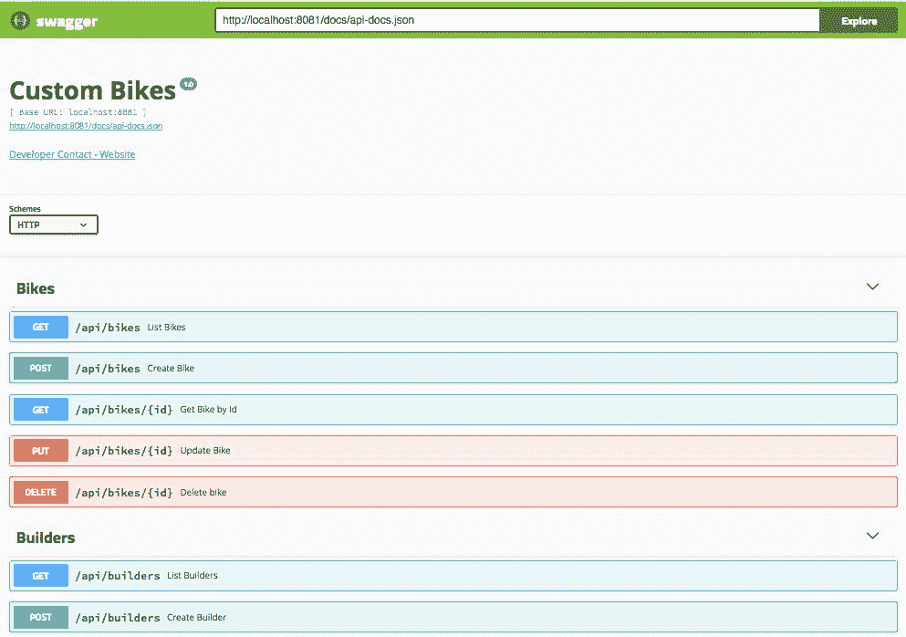
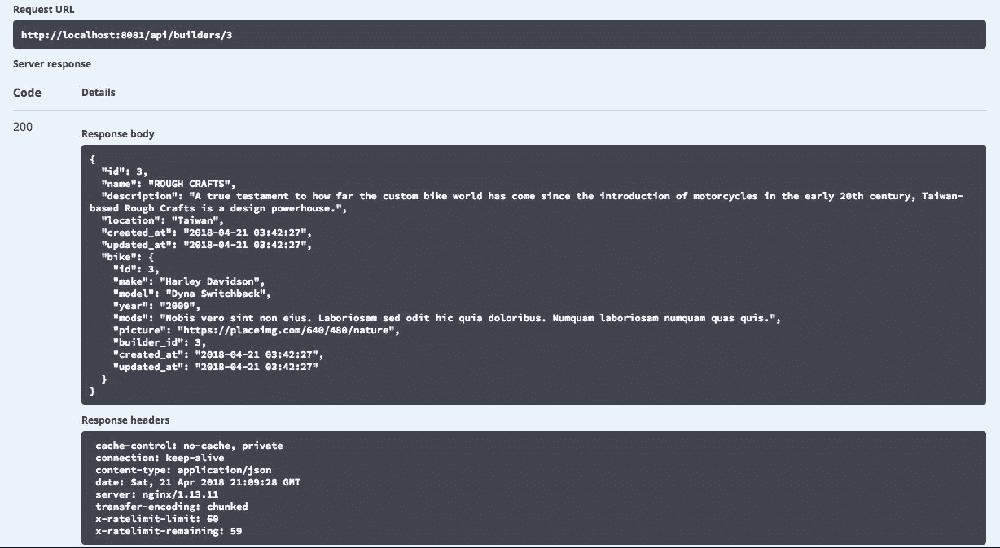
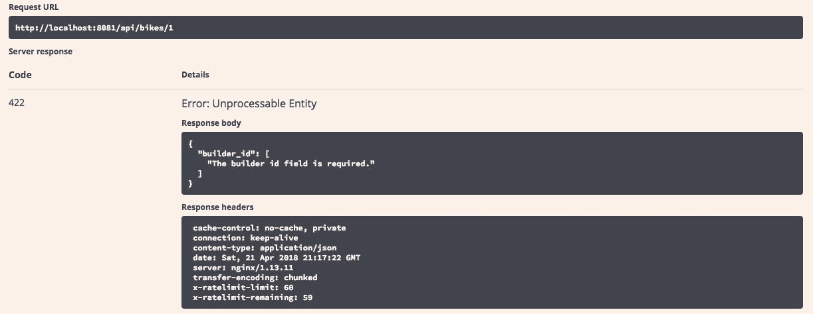
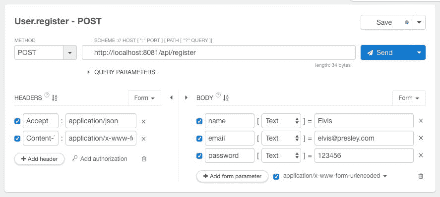
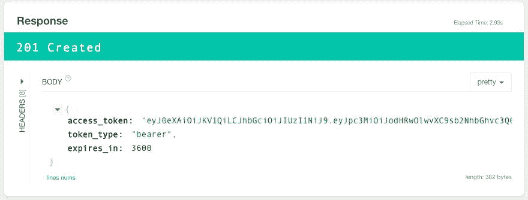
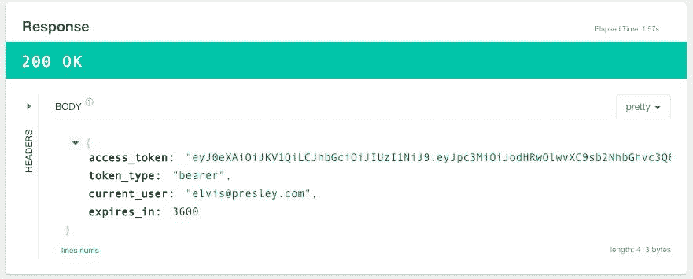

# 使用 Laravel 创建一个 RESTful 应用编程接口——第 2 部分

在本章中，我们将继续构建我们的应用编程接口。我们在拉弗尔还有很长的路要走。

我们将学习如何使用在每个 web 应用中非常常见的一些功能，例如身份验证和 API 错误的定制。

请记住，我们正在创建一个 RESTful API，与传统的应用(如 MVC)不同，我们的错误模型极其多样，并且在使用 JSON 格式时总是会返回。

在本章中，您将学习如何通过执行以下操作来构建一个可靠的 RESTful API:

*   处理请求验证和错误消息
*   使用基于令牌的身份验证
*   处理 Laravel 资源

# 处理请求验证和错误消息

Laravel 框架为我们提供了许多显示错误消息的方法，默认情况下，Laravel 的**基本控制器类**使用`ValidatesRequests`特性，该特性提供了验证传入 HTTP 请求的方法，包括许多默认规则，如必需、电子邮件格式、日期格式、字符串等。

You can read more about the possible validation rules at [https://laravel.com/docs/5.6/validation#available-validation-rules](https://laravel.com/docs/5.6/validation#available-validation-rules).

使用请求验证非常简单，我们可以在下面的代码块中看到:

```php
$validatedData = $request->validate([
'field name' => 'validation rule, can be more than one',
'field name' => 'validation rule',
'field name' => 'validation rule',
...
]);
```

例如，让我们看看如何使用到`localhost:8081/api/bikes`的 HTTP `POST`方法验证到`bikes`端点的传入请求。

验证代码如下所示:

```php
$validatedData = $request->validate([
'make' => 'required',
'model' => 'required',
'year'=> 'required',
'mods'=> 'required'
]);
```

前一个操作失败了，因为我们在想象的请求中故意没有发送所需的文件。然而，返回的消息有一些有趣的东西:

*   HTTP 状态码:`422`

*   以下 JSON 响应错误消息:

```php
{
    "message": "The given data was invalid.",
    "errors": {
    "": [
    "The field is required."
    ]}
}
```

很简单，对吧？Laravel 在幕后执行所有的验证，并给我们一个精心设计的错误消息。

但是如果我们想要控制所有的消息字段呢？答案是，我们可以使用验证器外观用验证器实例进行手动验证。这是我们将在接下来的部分中看到的。

# HTTP 状态代码

在我们进一步实现验证器之前，让我们休息一下，查看一些 HTTP 状态代码。正如我们之前看到的，我们有一个名为**的 422 HTTP 状态代码不可处理实体**。

下表显示了最常见和最有用的错误代码:

| 密码 | 名字 | 描述 |
| --- | --- | --- |
| Two hundred | 好 | 一切都好！ |
| Two hundred and one | 创造 | 资源已成功创建。 |
| Two hundred and two | 可接受的 | 该请求已被接受，将在稍后完成进一步处理。 |
| Two hundred and four | 好 | 资源已成功删除。 |
| Three hundred and two | 再直接的 | 常见的重定向响应；您可以在位置响应标题中获得 URI 的表示。 |
| Three hundred and four | 未修改 | 没有要返回的新数据。 |
| four hundred | 错误的请求 | 客户端错误。 |
| Four hundred and one | 未经授权的 | 您没有登录，例如，您没有使用有效的访问令牌。 |
| Four hundred and three | 被禁止的 | 您已通过身份验证，但无权访问您正在尝试执行的操作。 |
| Four hundred and four | 未发现 | 您请求的资源不存在。 |
| Four hundred and five | 不允许方法 | 不允许请求类型，例如，/pixels 是一个资源，POST/pixels 是一个有效的操作，但是 PUT/pixels 不是。 |
| Four hundred and nine | 冲突 | 资源已经存在。 |
| Four hundred and twenty-two | 不可处理的实体 | 验证失败。请求和格式有效，但是请求无法处理。例如，当发送的数据没有通过验证测试时，就会出现这种情况。 |
| Five hundred | 服务器错误 | 服务器上出现错误，这不是消费者的错。 |

You can read more about status codes at [http://www.restapitutorial.com/httpstatuscodes.html](http://www.restapitutorial.com/httpstatuscodes.html).

# 实施控制器验证

嗯，我们已经经历了很多理论，所以现在是时候写一些代码了。让我们在应用编程接口控制器上实现`Validator`:

1.  打开`project/app/Http/Controllers/API/BikeController.php`并在使用 App\Bike 语句后立即添加以下代码:

```php
use Validator;
```

2.  现在，在`store(Request $request)`方法中添加以下代码:

```php
$validator = Validator::make($request->all(), [
    'make' => 'required',
    'model' => 'required',
    'year'=> 'required',
    'mods'=> 'required',
    'builder_id' => 'required'
]);
if ($validator->fails()) {
    return response()->json($validator->errors(), 422);
}
```

注意，在前面的代码中，我们使用了响应 JSON 格式，并将错误和状态代码设置为`json()`方法的参数。

3.  我们将使用来自*步骤 2* 的相同代码块对`update(Request request,request,id)`方法进行同样的操作。
4.  打开`project/app/Http/Controllers/API/BuilderController.php`并在使用 App\Builder 语句后立即添加以下代码:

```php
use Validator;
```

5.  现在，在`store(Request $request)`方法中添加以下代码:

```php
$validator = Validator::make($request->all(), 
    ['name' => 'required',
    'description' => 'required',
    'location'=> 'required'
]);
if ($validator->fails()) {
    return response()->json($validator->errors(), 422);
}
```

6.  我们将使用来自*步骤 5 的相同代码块对`update(Request request,request,id)`方法进行同样的操作。*
7.  打开`project/app/Http/Controllers/API/ItemController.php`并在使用 App\Item 语句后立即添加以下代码:

```php
use Validator;
```

8.  现在，在`store(Request $request)`方法中添加以下代码:

```php
$validator = Validator::make($request->all(), [
    'type' => 'required',
```

```php

    'name' => 'required',
    'company'=> 'required',
    'bike_id'=> 'required'
]);
if ($validator->fails()) {
    return response()->json($validator->errors(), 422);
}
```

9.  我们将使用来自*步骤 7 的相同代码块对`update(Request request,request,id)`方法进行同样的操作。*

所有的验证样板代码都放在`store()`和`update()`方法中，所以是时候编写一些错误处理程序了。

# 添加自定义错误处理

默认情况下，Laravel 有一个非常强大的错误处理引擎，但是它完全致力于 MVC 开发模式，正如我们前面提到的。在接下来的几行中，我们将看到如何更改这个默认行为，并向我们的 API 添加一些特定的错误处理:

1.  打开`project/app/Exceptions/Handler.php`，在`render($request, Exception, $exception)`功能中添加以下代码:

```php
// This will replace our 404 response from the MVC to a JSON response.
if ($exception instanceof ModelNotFoundException
    && $request->wantsJson() // Enable header Accept:
     application/json to see the proper error msg
) {
    return response()->json(['error' => 'Resource not found'], 404);
}
if ($exception instanceof MethodNotAllowedHttpException) {
    return response()->json(['error' => 'Method Not Allowed'], 405);
}
if ($exception instanceof UnauthorizedHttpException) {
    return response()->json(['error' => 'Token not provided'], 401);
}
// JWT Auth related errors
if ($exception instanceof JWTException) {
    return response()->json(['error' => $exception], 500);
}
if ($exception instanceof TokenExpiredException) {
    return response()->json(['error' => 'token_expired'], 
    $exception->getStatusCode());
} else if ($exception instanceof TokenInvalidException) {
    return response()->json(['error' => 'token_invalid'],
     $exception->getStatusCode());
}
return parent::render($request, $exception);
```

在前面的代码中，除了映射我们的 API 的主要错误之外，我们还需要为涉及 JWT 身份验证的操作添加一些自定义错误。不用担心；在下一节中，我们将看到如何使用 JWT 为我们的 API 保护一些路由。

2.  现在，让我们在`ExceptionHandler`导入后，将以下代码添加到文件的顶部:

```php
use Illuminate\Database\Eloquent\ModelNotFoundException as ModelNotFoundException;
use Symfony\Component\HttpKernel\Exception\UnauthorizedHttpException as UnauthorizedHttpException;
use Tymon\JWTAuth\Exceptions\JWTException as JWTException;
use Tymon\JWTAuth\Exceptions\TokenExpiredException as TokenExpiredException;
use Tymon\JWTAuth\Exceptions\TokenInvalidException as TokenInvalidException;
```

现在，我们将能够看到正确的消息，而不是来自 Laravel 的默认错误页面。

请注意，我们保留了默认的 Laravel 错误页面，只是添加了自定义处理。我们发送`header: accept: application / json`是非常重要的。这样，Laravel 就可以识别出它应该以 JSON 格式发送响应，而不是发送标准的错误页面。

3.  让我们做一个简单的测试，看看当我们试图访问一个受保护的网址时会发生什么。打开终端窗口，键入以下代码:

```php
curl -X GET "http://localhost:8081/api/bikes/3" -H "accept: application/json" -H "X-CSRF-TOKEN: "
```

结果将是一个包含以下内容的 JSON:

```php
{"message":"Unauthenticated."}
```

4.  现在，让我们尝试另一个错误，看看当我们尝试发送 POST 方法时会发生什么。在终端中键入以下代码:

```php
curl -X POST "http://localhost:8081/api/bikes/3" -H "accept: application/json" -H "X-CSRF-TOKEN: "
```

结果将是一个包含以下内容的 JSON:

```php
{"error":"Method Not Allowed"}
```

# 用霸气界面检查应用编程接口网址

在完成了所有这些样板代码之后，是时候测试一下 API 了，看看我们在本章中完成的所有工作是如何实现的:

1.  打开终端并键入以下命令:

```php
php artisan l5-swagger:generate
```

Don't forget to go into the `php-fpm` containers bash with the following command: `docker-compose exec php-fpm bash`.

2.  打开默认浏览器，进入`http://localhost:8081/api/documentation`。

我们将看到以下结果，所有的 API 都有正确的记录:



Swagger UI

让我们检查一些操作。

# 获取所有记录

让我们看看如何使用斯瓦格用户界面上的`GET`方法从我们的应用编程接口中检索自行车列表:

1.  点击**获取/API/自行车**打开面板。
2.  点击试用按钮。
3.  点击**执行**按钮。

我们将看到类似以下截图的内容:


GET request

# 按标识获取记录

让我们看看如何从我们的应用编程接口获取自行车列表:

1.  点击 **GET /api/bikes/{id}** 打开面板。
2.  点击**试用**按钮。
3.  在身份证输入框内输入`3`。
4.  点击**执行**按钮。

会看到类似下面截图的内容:



GET by ID request

# 检查应用编程接口响应错误

现在，是时候检查一些错误消息了:

1.  点击 **PUT /api/bikes/{id}** 打开面板。
2.  点击**试用**按钮。
3.  在身份证输入框内输入`1`。
4.  将`Example Value`占位符替换为以下代码:

```php
{
 "make": "Yamaha",
 "model": "V-Star",
 "year": "2001",
 "mods": "New exhaust system and Grips",
 "picture": "http://www.sample.com/my.bike.jpg"
 }
```

5.  点击执行按钮。

我们将看到类似以下截图的内容:



Update failed with error message

我们可以观察到，一切都在意料之中。

# 基于令牌的身份验证

让我们进一步了解一下使用 Laravel 的 API 身份验证。即使 Laravel 是一个 MVC 框架，我们也可以使用基于令牌的身份验证功能。甚至 Laravel 本身也有一个名为 Passport 的图书馆。

Laravel Passport 是一个使用 OAuth2 标准的库。这种模式决定了通过令牌对 web 应用(API)执行应用身份验证的方式，而 JWT 专注于通过令牌对用户进行身份验证。

与简单的 JWT 相比，Laravel Passport 是一个更大的抽象层，它主要被设计为成熟且易于设置和用作 OAuth2 服务器。

另一种方法是使用库，如`tymon/jwt-auth`。

事实上，Laravel Passport 使用 JWT 进行身份验证，但这只是一个实现细节。`tymon/jwt-auth`更接近简单的基于令牌的身份验证，尽管它仍然非常强大和有用。

对于我们正在构建的 API 类型，JWT 是我们实现的理想方法。

You can read more about `jwt-auth` at [https://github.com/tymondesigns/jwt-auth](https://github.com/tymondesigns/jwt-auth).

# 安装 tymon-jwt-auth

让我们学习如何安装和配置`tymon/jwt-auth`。

安装过程非常简单，但是由于`tymon/jwt-auth`库在不断开发中，我们应该注意我们将使用的版本:

1.  打开`project/composer.json`文件，在 Laravel/Tinker 之后添加下面一行代码:

```php
"tymon/jwt-auth": "1.0.*"
```

2.  现在，是时候发布供应商包了。仍然在终端窗口和 Tinker 控制台中，键入以下命令:

```php
php artisan vendor:publish --provider="Tymon\JWTAuth\Providers\LaravelServiceProvider"
```

Note that we are using Laravel 5.6 and `jwt-auth` 1.0, so we don't need to perform any additional actions to load JWT providers. The `jwt-auth` documents sometimes look like a mess and are very confusing, but don't worry, just follow our steps and you will be safe from mismatching documentation.

3.  让我们生成秘密。仍然在“终端”窗口中，键入以下命令:

```php
 php artisan jwt:secret
```

4.  上一条命令将在您的`.env`文件上生成一个密钥，看起来像下面一行:

```php
JWT_SECRET=McR1It4Bw9G8jU1b4XJhDMeZs4Q5Zwear
```

此时，我们已经成功安装了`jwt-auth`，但是我们需要采取更多的步骤来确保我们的 API 安全。

# 更新用户模型

现在，我们需要更新`User`模型，这样我们就可以开始用用户认证来保护 API 端点。

首先，我们需要在我们的`User`模型上实现`Tymon\JWTAuth\Contracts\JWTSubject`契约，这需要两种方法:`getJWTIdentifier()`和`getJWTCustomClaims()`。

打开 `project/User.php`并用以下代码替换其内容:

```php
 <?php
 namespace  App;
 use  Illuminate\Notifications\Notifiable;
 use  Illuminate\Foundation\Auth\User  as  Authenticatable;
 use  Tymon\JWTAuth\Contracts\JWTSubject;
 /**
 * @SWG\Definition(
 * definition="User",
 * required={"name", "email", "password"},
 * @SWG\Property(
 * property="name",
 * type="string",
 * description="User name",
 * example="John Conor"
 * ),
 * @SWG\Property(
 * property="email",
 * type="string",
 * description="Email Address",
 * example="john.conor@terminator.com"
 * ),
 * @SWG\Property(
 * property="password",
 * type="string",
 * description="A very secure password",
 * example="123456"
 * ),
 * )
 */
 class  User  extends  Authenticatable  implements  JWTSubject
 {
     use  Notifiable;
     /**
     * The attributes that are mass assignable.
     *
     * @var array
     */
     protected  $fillable = [
         'name', 'email', 'password',
     ];
     /**
     * The attributes that should be hidden for arrays.
     *
     * @var array
     */
     protected  $hidden = [
         'password', 'remember_token',
     ];
     /**
     * Get JSON WEB TOKEN methods.
     *
     * @var array
     */
     public  function  getJWTIdentifier()
     {
         return  $this->getKey();
     } 
     public  function  getJWTCustomClaims()
     {
         return [];
     }  
     /**
     * Relationship.
     *
     * @var string
     */   
     public  function  bikes()
     {
         return  $this->hasMany(App\Bike);
     }
 }
```

# 设置授权保护

现在，让我们对`config.auth.php`文件进行一些调整，以保护一些路由:

1.  打开`project/config/auth.php`并用以下代码替换 API 驱动程序:

```php
 'defaults' => [         'guard'  =>  'api',
        'passwords'  =>  'users',
 ],
 'guards'  => [
                'web'  => [
                        'driver'  =>  'session',
                        'provider'  =>  'users',
        ],        
 'api'  => [
                'driver'  =>  'jwt',
                'provider'  =>  'users',
        ],
 ],
```

2.  注意，我们用`api`和`jwt`替换了默认的 Laravel 认证驱动程序。

# 创建身份验证控制器

对于我们的应用，我们将只使用一个控制器来包含注册和登录的所有操作，即注册、登录和注销。

在本书的后面，您将理解为什么我们在单个控制器中使用所有操作，而不是为每个操作创建一个控制器:

1.  打开您的终端窗口，键入以下命令:

```php
php artisan make:controller API/AuthController
```

2.  打开`project/app/Http/Controllers/API/AuthController.php`并用以下代码替换其内容:

```php
 <?php
 namespace  App\Http\Controllers\API;
 use  Illuminate\Http\Request;
 use  App\Http\Controllers\Controller;
 use  App\User;
 use  Validator;
 class  AuthController  extends  Controller
 {
     /**
     * Register a new user.
     *
     * @param \Illuminate\Http\Request $request
     * @return \Illuminate\Http\Response
     *
     * @SWG\Post(
     * path="/api/register",
     * tags={"Users"},
     * summary="Create new User",
     * @SWG\Parameter(
     * name="body",
     * in="body",
     * required=true,
     * @SWG\Schema(ref="#/definitions/User"),
     * description="Json format",
     * ),
     * @SWG\Response(
     * response=201,
     * description="Success: A Newly Created User",
     * @SWG\Schema(ref="#/definitions/User")
     * ),
     * @SWG\Response(
     * response=200,
     * description="Success: operation Successfully"
     * ),
     * @SWG\Response(
     * response=401,
     * description="Refused: Unauthenticated"
     * ),
    * @SWG\Response(
    * response="422",
    * description="Missing mandatory field"
    * ),
    * @SWG\Response(
    * response="404",
    * description="Not Found"
    * )
    * ),
    */
    public  function  register(Request  $request)
    {
        $validator = Validator::make($request->all(), [
            'email' => 'required|string|email|max:255|unique:users',
            'name' => 'required',
            'password'=> 'required'
        ]);
        if ($validator->fails()) {
            return  response()->json($validator->errors(), 422);
            }
        $user = User::create([
        'name' => $request->name,
        'email' => $request->email,
        'password' => bcrypt($request->password),
        ]);
        $token = auth()->login($user);
        return  response()->json([
            'access_token' => $token,
            'token_type' => 'bearer',
            'expires_in' => auth()->factory()->getTTL() * 60
            ], 201);
        }
    /**
    * Log in a user.
    *
    * @param \Illuminate\Http\Request $request
    * @return \Illuminate\Http\Response
    *
    * @SWG\Post(
    * path="/api/login",
    * tags={"Users"},
    * summary="loggin an user",
    * @SWG\Parameter(
    * name="body",
    * in="body",
    * required=true,
    * @SWG\Schema(ref="#/definitions/User"),
    * description="Json format",
    * ),
    * @SWG\Response(
    * response=200,
    * description="Success: operation Successfully"
    * ),
    * @SWG\Response(
    * response=401,
    * description="Refused: Unauthenticated"
    * ),
    * @SWG\Response(
    * response="422",
    * description="Missing mandatory field"
    * ),
    * @SWG\Response(
    * response="404",
    * description="Not Found"
    * )
    * ),
    */
    public  function  login(Request  $request)
    {
        $validator = Validator::make($request->all(), [
            'email' => 'required|string|email|max:255',
            'password'=> 'required'
        ]);
        if ($validator->fails()) {
            return  response()->json($validator->errors(), 422);
            }
        $credentials = $request->only(['email', 'password']);
        if (!$token = auth()->attempt($credentials)) {
            return  response()->json(['error' => 'Invalid
             Credentials'], 400);
        }
        $current_user = $request->email;
            return  response()->json([
            'access_token' => $token,
            'token_type' => 'bearer',
            'current_user' => $current_user,
            'expires_in' => auth()->factory()->getTTL() * 60
            ], 200);
            }
    /**
    * Register a new user.
    *
    * @param \Illuminate\Http\Request $request
    * @return \Illuminate\Http\Response
    *
    * @SWG\Post(
    * path="/api/logout",
    * tags={"Users"},
    * summary="logout an user",
    * @SWG\Parameter(
    * name="body",
    * in="body",
    * required=true,
    * @SWG\Schema(ref="#/definitions/User"),
    * description="Json format",
    * ),
    * @SWG\Response(
    * response=200,
    * description="Success: operation Successfully"
    * ),
    * @SWG\Response(
    * response=401,
    * description="Refused: Unauthenticated"
    * ),
    * @SWG\Response(
    * response="422",
    * description="Missing mandatory field"
    * ),
    * @SWG\Response(
    * response="404",
    * description="Not Found"
    * ),
    * @SWG\Response(
    * response="405",
    * description="Invalid input"
    * ),
    * security={
    * { "api_key":{} }
    * }
    * ),
    */
    public  function  logout(Request  $request){
        auth()->logout(true); // Force token to blacklist
        return  response()->json(['success' => 'Logged out
         Successfully.'], 200); }
}
```

在前面的代码中几乎没有什么新内容——我们只是在`register`、`login`和`logout`函数中返回了一个 JSON 响应，正如我们在前面几行中看到的那样。

3.  在`register()`功能中:

```php
 $token = auth()->login($user);
        return  response()->json([
                'access_token' => $token,
                'token_type' => 'bearer',
                'expires_in' => auth()->factory()->getTTL() * 60
 ], 201);
```

在我们创建了`user`之后，我们返回了一个带有`access_token`和到期日期的`201`的 HTTP 状态代码。

4.  在`login()`功能中:

```php
 $current_user = $request->email;
        return  response()->json([
                'access_token' => $token,
                'token_type' => 'bearer',
                'current_user' => $current_user,
                'expires_in' => auth()->factory()->getTTL() * 60
 ], 200);
```

这里，在`login()`功能中，我们根据用户的电子邮件地址、一个`access_token`和到期日期返回当前用户。

5.  在`logout()`功能中:

```php
auth()->logout(true); // Force token to blacklist
    return  response()->json(['success' => 'Logged out
     Successfully.'], 200);
```

请注意，`logout()`函数中的`true`参数告诉`jwt-auth`永远使令牌无效。

# 创建用户路由

现在，是时候为注册、登录和注销操作创建新的路由，并在我们的 API 中保护一些路由了，正如本章开头所讨论的。我们的用户可以与应用的部分内容进行交互，但是，要访问其所有内容，必须创建一个用户并登录到应用。

打开`project/routes/api.php`并用以下代码替换其内容:

```php
 <?php
 use  Illuminate\Http\Request;
 use  App\Bike;
 use  App\Http\Resources\BikesResource;

 /*
 |--------------------------------------------------------------------------
 | API Routes
 |--------------------------------------------------------------------------
 |
 | Here is where you can register API routes for your application. These
 | routes are loaded by the RouteServiceProvider within a group whic
 | is assigned the "api" middleware group. Enjoy building your API!
 |
 */

 // Register Routes
 Route::post('register', 'API\AuthController@register');
 Route::post('login', 'API\AuthController@login');
 Route::post('logout', 'API\AuthController@logout');

 Route::apiResources([

     'bikes' => 'API\BikeController',

     'builders' => 'API\BuilderController',

     'items' => 'API\ItemController',

     'bikes/{bike}/ratings' => 'API\RatingController'

 ]);

Route::middleware('jwt.auth')->get('me', function(Request $request){
    return auth()->user();
});
```

最后一步是保护端点；我们在`project/routes/api.php`文件中或者直接在控制器函数中这样做。我们将在控制器功能中实现这一点。

# 保护原料药路线

使用应用控制器保护我们的路由非常简单。我们所要做的就是编辑`Controller`文件并添加以下代码。

打开`project/Http/Controllers/API/BikeController.php`并在`GET`方法前添加以下代码:

```php
 /**
 * Protect update and delete methods, only for authenticated users.
 *
 * @return Unauthorized
 */
 public  function  __construct()
 {
        $this->middleware('auth:api')->except(['index']);
 }
```

前面的代码意味着我们正在使用`auth:api`中间件来保护除`index()`方法之外的所有骑车人路线。因此，我们的用户可以看到自行车列表，但是，要查看自行车的详细信息并发布自行车，他们必须登录。稍后，在[第 09 章](09.html#5O1SI0-f24bf9337f074c079f0c90fd02324171)、*创建服务和用户认证*中，在 Angular 上，我们将详细了解基于令牌的认证。

# 创建和登录用户

现在，是时候检查用户路线了。由于我们没有用户界面，我们将使用名为 Restlet Client 的 Chrome 扩展。它是免费的，非常强大。

你可以在[https://restlet.com/modules/client](https://restlet.com/modules/client)了解更多，下载:

1.  打开 Restlet 扩展并填写以下字段，如下图所示:



Register endpoint

2.  结果将是以下响应:



Created response

3.  现在，让我们用新创建的用户登录。填写字段，如下图所示:


User login

结果将是以下响应:



User logged response

好了，我们的 API 认证已经准备好了，可以开始了。后面在[第 09 章](09.html#5O1SI0-f24bf9337f074c079f0c90fd02324171)、*创建服务和用户认证*中，在 Angular 上，我们会详细看认证过程。

# 处理 Laravel 资源

在 Laravel 的一些早期版本中，可以使用一个名为 Fractal 的特性来处理 JSON web API，但是在 Laravel 的这个新版本中，我们有 **Resources** 特性，一个处理 JSON web API 的非常强大的工具。

在本节中，我们将了解如何使用参考资料功能，以便充分利用我们的应用编程接口。资源类是一种将数据从一种格式转换成另一种格式的方法。

当处理资源并将其转换为客户端的响应时，我们基本上有两种类型:项目和集合。您可能已经猜到，项目资源基本上是我们模型的一对一表示，而集合是许多项目的表示。集合还可能包含元数据和其他导航信息，我们将在本节后面看到。

# 创建自行车资源

那么，让我们创建第一个资源:

1.  打开您的终端窗口，键入以下命令:

```php
php artisan make:resource BikesResource
```

前面的命令将生成以下文件:

`App\Http\Resource\BikesResource.php`。

2.  打开`App\Http\Resource\BikesResource.php`并添加以下代码:

```php
<?php
namespace App\Http\Resources;
use Illuminate\Http\Resources\Json\JsonResource;
use App\Builder;
class BikesResource extends JsonResource
{
    /**
    * Transform the resource into an array.
    *
    * @param \Illuminate\Http\Request $request
    * @return array
    */
    public function toArray($request)
    {
        return [
            'id' => $this->id,
            'make' => $this->make,
            'model' => $this->model,
            'year' => $this->year,
            'mods' => $this->mods,
            'picture' => $this->picture,
            'garages' => $this->garages,
            'items' => $this->items,
            'builder' => $this->builder,
            'user' => $this->user,
            'ratings' => $this->ratings,
            'average_rating' => $this->ratings->avg('rating'),
            // Casting objects to string, to avoid receive create_at             and update_at as object
            'created_at' => (string) $this->created_at,
            'updated_at' => (string) $this->updated_at
        ];
    }
}
```

请注意，我们在数组函数中包含了`bike`模型中的所有关系。

# 正在创建构建器资源

现在，让我们使用`make`命令创建`BuildersResource`:

1.  打开您的终端窗口，键入以下命令:

```php
php artisan make:resource BuildersResource
```

2.  前面的命令将生成以下文件:

`App\Http\Resource\BuildersResource.php`。

3.  打开`App\Http\Resource\BuildersResource.php`并添加以下代码:

```php
<?php
namespace App\Http\Resources;
use Illuminate\Http\Resources\Json\JsonResource;
class BuildersResource extends JsonResource
{
    /**
    * Transform the resource into an array.
    *
    * @param \Illuminate\Http\Request $request
    * @return array
    */
    public function toArray($request)
    {
        return [
            'id' => $this->id,
            'name' => $this->name,
            'description' => $this->description,
            'location' => $this->location,
            'bike' => $this->bike,
            // Casting objects to string, to avoid receive create_at             and update_at as object
            'created_at' => (string) $this->created_at,
            'updated_at' => (string) $this->updated_at,
        ];
    }
}
```

# 正在创建项目资源

现在，让我们使用`make`命令创建`ItemsResource`:

1.  打开您的终端窗口，键入以下命令:

```php
php artisan make:resource ItemsResource
```

2.  上一条命令会生成如下文件:
    `App\Http\Resource\ItemsResource.php`。
3.  打开`App\Http\Resource\ItemsResource.php`并添加以下代码:

```php
<?php
namespace App\Http\Resources;
use Illuminate\Http\Resources\Json\JsonResource;
class ItemsResource extends JsonResource
{
    /**
    * Transform the resource into an array.
    *
    * @param \Illuminate\Http\Request $request
    * @return array
    */
    public function toArray($request)
    {
        return [
            'id' => $this->id,
            'type' => $this->type,
            'name' => $this->name,
            'company' => $this->company,
            'bike_id' => $this->bike_id,
            // Casting objects to string, to avoid receive create_at             and update_at as object
            'created_at' => (string) $this->created_at,
            'updated_at' => (string) $this->updated_at
        ];
    }
}
```

# 创建批准资源

现在，让我们创建一个新的`Resource`，这次是为了收视率:

1.  打开您的终端窗口，键入以下命令:

```php
php artisan make:resource ratingResource
```

2.  前面的命令将生成以下文件:

`App\Http\Resource\RatingResource.php`。

3.  打开`App\Http\Resource\RatingResource.php`并添加以下代码:

```php
<?php
namespace App\Http\Resources;
use Illuminate\Http\Resources\Json\JsonResource;
use App\Bike;
class RatingResource extends JsonResource
{
    /**
    * Transform the resource into an array.
    *
    * @param \Illuminate\Http\Request $request
    * @return array
    */
    public function toArray($request)
    {
        return [
            'user_id' => $this->user_id,
            'bike_id' => $this->bike_id,
            'rating' => $this->rating,
            'bike' => $this->bike,
            'average_rating' => $this->bike->ratings->avg('rating'),
            // Casting objects to string, to avoid receive 
```

```php
             create_at and update_at as object
             'created_at' => (string) $this->created_at,
             'updated_at' => (string) $this->updated_at
         ];
     }
}
```

# 向控制器添加资源

现在，我们需要对我们的控制器进行一些小的更改，以便使用我们刚刚创建的资源。为了避免任何错误，我们将查看所有控制器的代码:

1.  用以下代码替换`App/Http/Controllers/API/BikeController.php`中的内容，编辑`Bike`控制器:

```php
<?php
namespace App\Http\Controllers\API;
use Illuminate\Http\Request;
use App\Http\Controllers\Controller;
use App\Bike;
use Validator;
use App\Http\Resources\BikesResource;
class BikeController extends Controller
{
    /**
    * Protect update and delete methods, only for authenticated
     users.
    *
    * @return Unauthorized
    */
    public function __construct()
    {
        $this->middleware('auth:api')->except(['index']);
    }
    /**
    * Display a listing of the resource.
    *
    * @return \Illuminate\Http\Response
    *
    * @SWG\Get(
    * path="/api/bikes",
    * tags={"Bikes"},
    * summary="List Bikes",
    * @SWG\Response(
    * response=200,
    * description="Success: List all Bikes",
    * @SWG\Schema(ref="#/definitions/Bike")
    * ),
    * @SWG\Response(
    * response="404",
    * description="Not Found"
    * ),
    * @SWG\Response(
    *          response="405",
    *          description="Invalid HTTP Method"
    * )
    * ),
    */
    public function index()
    {
        $listBikes = Bike::all();
        return $listBikes;
        // Using Paginate method We explain this later in the book
        // return BikesResource::collection(Bike::with('ratings')-
        >paginate(10));
    }
```

现在，让我们添加`store` / `create`方法的代码。在`index()`功能后添加以下代码:

```php
/**
* Store a newly created resource in storage.
*
* @param \Illuminate\Http\Request $request
* @return \Illuminate\Http\Response
*
* @SWG\Post(
* path="/api/bikes",
* tags={"Bikes"},
* summary="Create Bike",
* @SWG\Parameter(
*          name="body",
*          in="body",
*          required=true,
*          @SWG\Schema(ref="#/definitions/Bike"),
*          description="Json format",
*      ),
* @SWG\Response(
* response=201,
* description="Success: A Newly Created Bike",
* @SWG\Schema(ref="#/definitions/Bike")
```

```php

* ),
* @SWG\Response(
* response=401,
* description="Refused: Unauthenticated"
* ),
* @SWG\Response(
* response="422",
* description="Missing mandatory field"
* ),
* @SWG\Response(
* response="404",
* description="Not Found"
* ),
* @SWG\Response(
     *          response="405",
     *          description="Invalid HTTP Method"
     * ),
     * security={
     *       { "api_key":{} }
     *      }
* ),
*/
public function store(Request $request)
{
    $validator = Validator::make($request->all(), [
        'make' => 'required',
        'model' => 'required',
        'year'=> 'required',
        'mods'=> 'required',
        'builder_id' => 'required'
        ]);
    if ($validator->fails()) {
        return response()->json($validator->errors(), 422);
    }
    // Creating a record in a different way
    $createBike = Bike::create([
        'user_id' => $request->user()->id,
        'make' => $request->make,
        'model' => $request->model,
        'year' => $request->year,
        'mods' => $request->mods,
        'picture' => $request->picture,
    ]);
    return new BikesResource($createBike);
}
```

通过`id`方法为`Get`添加以下代码。在`store()`功能后添加以下代码:

```php
/**
* Display the specified resource.
*
* @param int $id
* @return \Illuminate\Http\Response
*
* @SWG\Get(
* path="/api/bikes/{id}",
* tags={"Bikes"},
* summary="Get Bike by Id",
* @SWG\Parameter(
* name="id",
* in="path",
* required=true,
* type="integer",
* description="Display the specified bike by id.",
*      ),
* @SWG\Response(
* response=200,
* description="Success: Return the Bike",
* @SWG\Schema(ref="#/definitions/Bike")
* ),
* @SWG\Response(
* response="404",
* description="Not Found"
* ),
* @SWG\Response(
     *          response="405",
     *          description="Invalid HTTP Method"
     * ),
* security={
*       { "api_key":{} }
*   }
* ),
*/
public function show(Bike $bike)
{
    return new BikesResource($bike);
}
```

现在，让我们添加`update`方法的代码。在`show()` 功能后添加以下代码:

```php
/**
* Update the specified resource in storage.
*
* @param \Illuminate\Http\Request $request
* @param int $id
* @return \Illuminate\Http\Response
*
* @SWG\Put(
* path="/api/bikes/{id}",
* tags={"Bikes"},* summary="Update Bike",
* @SWG\Parameter(
* name="id",
* in="path",
* required=true,
* type="integer",
* description="Update the specified bike by id.",
*      ),
* @SWG\Parameter(
*          name="body",
*          in="body",
*          required=true,
*          @SWG\Schema(ref="#/definitions/Bike"),
*          description="Json format",
*      ),
* @SWG\Response(
* response=200,
* description="Success: Return the Bike updated",
* @SWG\Schema(ref="#/definitions/Bike")
* ),
* @SWG\Response(
* response="422",
* description="Missing mandatory field"
* ),
* @SWG\Response(
* response="404",
* description="Not Found"
* ),
* @SWG\Response(
     *          response="403",
     *          description="Forbidden"
     * ),
```

```php

* @SWG\Response(
     *          response="405",
     *          description="Invalid HTTP Method"
     * ),
     * security={
     *       { "api_key":{} }
     *      }
* ),
*/
public function update(Request $request, Bike $bike)
{
    // check if currently authenticated user is the bike owner
    if ($request->user()->id !== $bike->user_id) {
        return response()->json(['error' => 'You can only edit your
         own bike.'], 403);
    }
        $bike->update($request->only(['make', 'model', 'year',
         'mods',     'picture']));
    return new BikesResource($bike);
}
```

最后一种方法是删除所有记录。在`update()`功能后添加以下代码:

```php
/**
* Remove the specified resource from storage.
*
* @param int $id
* @return \Illuminate\Http\Response
*
* @SWG\Delete(
* path="/api/bikes/{id}",
* tags={"Bikes"},
* summary="Delete bike",
* description="Delete the specified bike by id",
* @SWG\Parameter(
* description="Bike id to delete",
* in="path",
* name="id",
* required=true,
* type="integer",
* format="int64"
* ),
* @SWG\Response(
* response=404,
* description="Not found"
* ),
* @SWG\Response(
* response=204,
* description="Success: successful deleted"
* ),
* @SWG\Response(
     *          response="405",
     *          description="Invalid HTTP Method"
     * ),
     * security={
     *       { "api_key":{} }
     *      }
* )
*/
public function destroy($id)
{
    $deleteBikeById = Bike::findOrFail($id)->delete();
    return response()->json([], 204);
    }
}
```

我们将对`Builders`控制器进行同样的操作。

2.  用以下代码替换`App/Http/Controllers/API/BuilderController.php`中的内容，编辑`Builder`控制器:

```php
<?php
namespace App\Http\Controllers\API;
use Illuminate\Http\Request;
use App\Http\Controllers\Controller;
use App\Builder;
use Validator;
use App\Http\Resources\BuildersResource;
class BuilderController extends Controller
{
    /**
    * Display a listing of the resource.
    *
    * @return \Illuminate\Http\Response
    *
    * @SWG\Get(
    * path="/api/builders",
    * tags={"Builders"},
    * summary="List Builders",
    * @SWG\Response(
    * response=200,
    * description="Success: List all Builders",
    * @SWG\Schema(ref="#/definitions/Builder")
    * ),
    * @SWG\Response(
    * response="404",
    * description="Not Found"
    * )
    * ),
    */
    public function index()
    {
        $listBuilder = Builder::all();
        return $listBuilder;
    }
```

现在，让我们添加`store` / `create`方法的代码。在`index()`功能后添加以下代码:

```php
/**
* Store a newly created resource in storage.
*
* @param \Illuminate\Http\Request $request
* @return \Illuminate\Http\Response
*
* @SWG\Post(
* path="/api/builders",
* tags={"Builders"},
* summary="Create Builder",
* @SWG\Parameter(
*          name="body",
*          in="body",
*          required=true,
*          @SWG\Schema(ref="#/definitions/Builder"),
*          description="Json format",
*      ),
* @SWG\Response(
* response=201,
* description="Success: A Newly Created Builder",
* @SWG\Schema(ref="#/definitions/Builder")
* ),
* @SWG\Response(
* response="422",
* description="Missing mandatory field"
* ),
* @SWG\Response(
* response="404",
* description="Not Found"
* ),
* @SWG\Response(
     *          response="405",
     *          description="Invalid HTTP Method"
     * )
* ),
*/
public function store(Request $request)
{
    $validator = Validator::make($request->all(), [
        'name' => 'required',
        'description' => 'required',
        'location'=> 'required'
        ]);
    if ($validator->fails()) {
        return response()->json($validator->errors(), 422);
    }
    $createBuilder = Builder::create($request->all());
        return $createBuilder;
 }
```

让我们通过`id`方法添加`Get`的代码。在`store()`功能后添加以下代码:

```php
/**
* Display the specified resource.
*
* @param int $id
* @return \Illuminate\Http\Response
*
* @SWG\Get(
* path="/api/builders/{id}",
* tags={"Builders"},
* summary="Get Builder by Id",
* @SWG\Parameter(
* name="id",
* in="path",
* required=true,
* type="integer",
* description="Display the specified Builder by id.",
*      ),
* @SWG\Response(
* response=200,
* description="Success: Return the Builder",
* @SWG\Schema(ref="#/definitions/Builder")
* ),
* @SWG\Response(
* response="404",
* description="Not Found"
* ),
* @SWG\Response(
     *          response="405",
     *          description="Invalid HTTP Method"
     * )
* ),
*/
public function show(Builder $builder)
{
    // $showBuilderById = Builder::with('Bike')->findOrFail($id);
    // return $showBuilderById;
    return new BuildersResource($builder);
}
```

现在，让我们添加`update`方法的代码。在`show()`功能后添加以下代码:

```php
/**
* Update the specified resource in storage.
*
* @param \Illuminate\Http\Request $request
* @param int $id
* @return \Illuminate\Http\Response
*
* @SWG\Put(
* path="/api/builders/{id}",
* tags={"Builders"},
* summary="Update Builder",
* @SWG\Parameter(
* name="id",
* in="path",
* required=true,
* type="integer",
* description="Update the specified Builder by id.",
*      ),
* @SWG\Parameter(
*          name="body",
*          in="body",
*          required=true,
*          @SWG\Schema(ref="#/definitions/Builder"),
*          description="Json format",
*      ),
* @SWG\Response(
* response=200,
* description="Success: Return the Builder updated",
* @SWG\Schema(ref="#/definitions/Builder")
* ),
* @SWG\Response(
* response="422",
* description="Missing mandatory field"
* ),
* @SWG\Response(
* response="404",
* description="Not Found"
* ),
* @SWG\Response(
     *          response="405",
     *          description="Invalid HTTP Method"
     * )
* ),
*/
public function update(Request $request, $id)
{
    $validator = Validator::make($request->all(), [
        'name' => 'required',
        'description' => 'required',
        'location'=> 'required'
        ]);
    if ($validator->fails()) {
        return response()->json($validator->errors(), 422);
    }
    $updateBuilderById = Builder::findOrFail($id);
    $updateBuilderById->update($request->all());
    return $updateBuilderById;
}
```

最后一种方法用于删除所有记录。在`update()`功能后添加以下代码:

```php
/**
* Remove the specified resource from storage.
*
* @param int $id
* @return \Illuminate\Http\Response
*
* @SWG\Delete(
* path="/api/builders/{id}",
* tags={"Builders"},
* summary="Delete Builder",
* description="Delete the specified Builder by id",
* @SWG\Parameter(
* description="Builder id to delete",
* in="path",
* name="id",
* required=true,
* type="integer",
* format="int64"
* ),
* @SWG\Response(
* response=404,
* description="Not found"
* ),
* @SWG\Response(
     *          response="405",
     *          description="Invalid HTTP Method"
     * ),
* @SWG\Response(
* response=204,
* description="Success: successful deleted"
* ),
* )
*/
public function destroy($id)
{
    $deleteBikeById = Bike::find($id)->delete();
    return response()->json([], 204);
    }
}
```

3.  为了编辑`Rating`控制器，用以下代码替换`App/Http/Controllers/API/RatingController.php`中的内容:

```php
<?php
namespace App\Http\Controllers\API;
use Illuminate\Http\Request;
use App\Http\Controllers\Controller;
use App\Bike;
use App\Rating;
use App\Http\Resources\RatingResource;
class RatingController extends Controller
{
    /**
    * Protect update and delete methods, only for authenticated         users.
    *
    * @return Unauthorized
    */
    public function __construct()
    {
        $this->middleware('auth:api');
    }
    /**
    * Store a newly created resource in storage.
    *
    * @param \Illuminate\Http\Request $request
    * @return \Illuminate\Http\Response
    *
    * @SWG\Post(
    * path="/api/bikes/{bike_id}/ratings",
    * tags={"Ratings"},
    * summary="rating a Bike",
    * @SWG\Parameter(
    * in="path",
    * name="id",
    * required=true,
    * type="integer",
    * format="int64",
    *      description="Bike Id"
    *    ),
    * @SWG\Parameter(
    *      name="body",
    *      in="body",
    *      required=true,
    *      @SWG\Schema(ref="#/definitions/Rating"),
    *      description="Json format",
    *     ),
    * @SWG\Response(
    * response=201,
    * description="Success: A Newly Created Rating",
    * @SWG\Schema(ref="#/definitions/Rating")
    * ),
    * @SWG\Response(
    * response=401,
    * description="Refused: Unauthenticated"
    * ),
    * @SWG\Response(
    * response="422",
    * description="Missing mandatory field"
    * ),
    * @SWG\Response(
    * response="404",
    * description="Not Found"
    * ),
    * @SWG\Response(
       *     response="405",
       *   description="Invalid HTTP Method"
       * ),
    * security={
    *     { "api_key":{} }
    * }
    * ),
    */
    public function store(Request $request, Bike $bike)
    {
        $rating = Rating::firstOrCreate(
        [
        'user_id' => $request->user()->id,
        'bike_id' => $bike->id,
        ],
        ['rating' => $request->rating]
        );
        return new RatingResource($rating);
    }
}
```

干得好！现在，我们有了继续使用我们的 API JSON 的必要代码。在接下来的几章中，您将更详细地了解我们迄今为止所取得的成就。我们已经准备好了应用编程接口。

# 摘要

我们已经结束了又一章。我们看到了如何构建基于令牌的身份验证，如何仅保护登录用户的端点，以及如何处理自定义错误消息。

我们还学习了如何使用 Laravel 资源返回一个 JSON API 格式。

我们正处于旅程的中间，但是我们需要构建所有的接口并实现 Angular 前端应用，以便我们的应用能够有一个令人愉快的视觉效果。

在下一章中，我们将看到如何将 Angular 以及其他一些工具集成到我们的应用中。