# 带引导程序 4 和引导程序的前端视图

在本章中，我们将了解如何使用 Angular CLI 中的新功能`add`，在运行中的 Angular 应用程序中包含引导框架。

Bootstrap 框架是最重要的 UI 框架之一，通过 Angular 指令/组件，我们可以在 Angular 应用程序中拥有 Bootstrap 的所有功能。

我们还将研究如何将我们的 Angular 服务与组件连接起来，以及如何使用后端 API 将它们组合在一起。最后，我们将学习如何在后端应用编程接口上配置**跨来源资源共享** ( **CORS** )以及如何在我们的 Angular 客户端应用程序中使用它。

在本章中，我们将涵盖以下主题:

*   安装引导 CSS 框架
*   使用引导程序编写角度模板
*   如何在 Laravel 后端设置 CORS
*   将 Angular 服务与应用程序组件连接起来
*   处理有角度的管道、表单和验证

# 准备基线代码

现在，我们需要准备我们的基线代码，这是一个非常类似于我们在上一章中执行的过程。让我们遵循以下步骤:

1.  从`chapter-9`文件夹复制所有内容。
2.  重命名文件夹`chapter-10`。

3.  删除`storage-db`文件夹。
4.  现在，让我们对`docker-compose.yml`文件进行一些更改，以便我们可以适应新的数据库和服务器容器。打开`docker-compose.yml`并用以下代码替换其内容:

```php
 version: "3.1"
 services:
     mysql:
       image: mysql:5.7
       container_name: chapter-10-mysql
       working_dir: /application
       volumes:
         - .:/application
         - ./storage-db:/var/lib/mysql
       environment:
         - MYSQL_ROOT_PASSWORD=123456
         - MYSQL_DATABASE=chapter-10
         - MYSQL_USER=chapter-10
         - MYSQL_PASSWORD=123456
       ports:
         - "8083:3306"
     webserver:
       image: nginx:alpine
       container_name: chapter-10-webserver
       working_dir: /application
       volumes:
         - .:/application
         -./phpdocker/nginx/nginx.conf:/etc/nginx/
           conf.d/default.conf
        ports:
          - "8081:80"
     php-fpm:
       build: phpdocker/php-fpm
       container_name: chapter-10-php-fpm
       working_dir: /application
       volumes:
         - ./Server:/application
         - ./phpdocker/php-fpm/php-ini-
           overrides.ini:/etc/php/7.2/fpm/conf.d/99-overrides.ini
```

请注意，我们更改了容器名称、数据库和 MySQL 用户:

*   `container_name: chapter-10-mysql`
*   `container_name: chapter-10-webserver`
*   ``container_name: chapter-10-php-fpm``
*   `MYSQL_DATABASE=chapter-10`
*   `MYSQL_USER=chapter-10`

5.  用连接字符串更新`.env`文件:

```php
 DB_CONNECTION=mysql
 DB_HOST=mysql
 DB_PORT=3306
 DB_DATABASE=chapter-10
 DB_USERNAME=chapter-10
 DB_PASSWORD=123456
```

6.  添加我们对 Git 源代码控制所做的更改。打开您的终端窗口，键入以下命令:

```php
 git add .
 git commit -m "Initial commit chapter 10"
```

7.  现在，让我们用以下命令启动 Docker 容器:

```php
 docker-compose up -d
```

# 安装引导 CSS 框架

在本节中，我们将再次使用 Angular CLI 6 中提供的最新功能:`add`命令。利用这一点，我们将向我们的应用程序添加 Bootstrap 4:

1.  在`chapter-10`的`Client`文件夹中，打开您的终端窗口并键入以下命令:

```php
 ng add @ng-bootstrap/schematics
```

2.  前面的命令将创建和更新以下文件:

```php
+ @ng-bootstrap/schematics@2.0.0-alpha.1
added 3 packages in 26.372s
Installed packages for tooling via npm.
UPDATE package.json (1589 bytes)
UPDATE src/app/app.module.ts (1516 bytes)
UPDATE angular.json (3706 bytes)
```

3.  在`package.json`文件中，我们将添加以下依赖项:

```php
     "@ng-bootstrap/schematics": "^2.0.0-alpha.1",
        "@ng-bootstrap/ng-bootstrap": "^2.0.0-alpha.0",
        "bootstrap": "^4.0.0"
```

4.  在`src/app/app.module.ts`文件中，我们将添加以下几行:

```php
     import { NgbModule } from  '@ng-bootstrap/ng-bootstrap';

        imports: [
                ...
                NgbModule.forRoot()
        ],
```

5.  在`angular.json`文件中，我们将添加以下几行:

```php
     "styles": [
                "src/styles.scss",
                {
                        "input": "./node_modules/bootstrap/dist/css/bootstrap.css"
                }
        ],
```

在这里，我们可以看到 Angular CLI 的所有功能都在发挥作用，因为所有这些更改都是自动执行的。

但是，我们可以看到`bootstrap.css`文件的使用方式使应用程序保持冻结状态，使得定制应用程序变得困难。

在下一节中，我们将研究使用 Bootstrap 的不同方法，以获得更大的灵活性。

# 正在删除引导 CSS 导入

首先，我们要删除从 Bootstrap 编译的 CSS，它是用`NgBootstrap`的安装命令注入到我们的`angular.json`文件中的。

打开`angular.json`文件，取下`input`标签。只保留`styles`标签，如下代码所示:

```php
     "styles": [
                "src/styles.scss"
        ],
```

# 添加引导 SCSS 导入

现在，我们将使用安装在`node_modules`文件夹中的文件作为我们主样式表的导入，该样式表存储在`./Client/src/style.scss`中:

1.  打开`./Client/src/style.scss`并在文件顶部添加以下代码:

```php
/*!
* Bootstrap v4.1.1 (https://getbootstrap.com/)
* Copyright 2011-2018 The Bootstrap Authors
* Copyright 2011-2018 Twitter, Inc.
* Licensed under MIT (https://github.com/twbs/bootstrap/blob/master/LICENSE)
*/
@import "../node_modules/bootstrap/scss/functions";
@import "../scss/bootstrap/_variables.scss";
@import "../node_modules/bootstrap/scss/_variables.scss";
@import "../node_modules/bootstrap/scss/mixins";
@import "../node_modules/bootstrap/scss/root";
@import "../node_modules/bootstrap/scss/reboot";
@import "../node_modules/bootstrap/scss/type";
@import "../node_modules/bootstrap/scss/images";
@import "../node_modules/bootstrap/scss/code";
@import "../node_modules/bootstrap/scss/grid";
@import "../node_modules/bootstrap/scss/tables";
@import "../node_modules/bootstrap/scss/forms";
@import "../node_modules/bootstrap/scss/buttons";
@import "../node_modules/bootstrap/scss/transitions";
@import "../node_modules/bootstrap/scss/dropdown";
@import "../node_modules/bootstrap/scss/button-group";
@import "../node_modules/bootstrap/scss/input-group";
@import "../node_modules/bootstrap/scss/custom-forms";
@import "../node_modules/bootstrap/scss/nav";
@import "../node_modules/bootstrap/scss/navbar";
@import "../node_modules/bootstrap/scss/card";
@import "../node_modules/bootstrap/scss/breadcrumb";
@import "../node_modules/bootstrap/scss/pagination";
@import "../node_modules/bootstrap/scss/badge";
@import "../node_modules/bootstrap/scss/jumbotron";
@import "../node_modules/bootstrap/scss/alert";
@import "../node_modules/bootstrap/scss/progress";
@import "../node_modules/bootstrap/scss/media";
@import "../node_modules/bootstrap/scss/list-group";
@import "../node_modules/bootstrap/scss/close";
@import "../node_modules/bootstrap/scss/modal";
@import "../node_modules/bootstrap/scss/tooltip";
@import "../node_modules/bootstrap/scss/popover";
@import "../node_modules/bootstrap/scss/carousel";
@import "../node_modules/bootstrap/scss/utilities";
@import "../node_modules/bootstrap/scss/print";
```

请注意，我们将引导注释保留在文件的顶部，只是为了将引导版本记录在易于找到的位置。

2.  如果需要，可以复制`node_modules/bootstrap/scss/bootstrap.scss`文件的内容，只需将导入路径调整到`../node_modules/bootstrap/scss`即可。

现在，我们的应用程序正在直接从`bootstrap/scss`文件夹编译 SCSS 代码。

以下是这样做的一些优点:

*   我们可以根据应用程序使用的组件来选择导入哪些 SCSS 模块。
*   我们减少将不被使用的 SCSS 代码。
*   我们可以很容易地覆盖引导变量。

# 覆盖引导变量

在这一步中，我们将看到如何在我们的应用程序中覆盖`Boostrap`变量:

1.  在`Client`文件夹的根目录下创建一个名为`scss`的新文件夹。
2.  在`./Client/scss`文件夹内，添加一个名为`bootstrap`的新文件夹。
3.  在`./Client/scss/bootstrap`里面，添加一个名为`_variable.scss`的新文件。
4.  从`node_modules/bootstrap/scss/_variables.scss`复制内容，粘贴到`./Client/scss/bootstrap/_variables.scss`中。

相当简单；恭喜你！我们准备覆盖引导变量。

最后一步是将新的`_variables.scss`文件导入到我们的主`style.scss`文件中。

5.  打开`./Client/style.scss`文件，用以下内容替换`@import "../node_modules/bootstrap/scss/_variables.scss"`行:

```php
 <pre>Error: ENOENT: no such file or directory, open '/Users/fernandomonteiro/_bitbucket/scss/bootstrap/_variables.scss'</pre>  
```

我们也可以选择放置这个变量文件，只使用我们将要覆盖的变量，而不使用关键字`Default`。这样，文件会变得更短，因为我们无法覆盖像这样的小项目中的所有变量。让我们看看如何做到这一点。

6.  假设我们只想覆盖所有组件的`border-radius`，同时删除`box-shadow`。我们只能使用这些变量，因此我们的`_variables.scss`文件将具有以下外观:

```php
     // Variables
        //
        // Removing border-radius and box-shadow from components

        $border-radius: 0;
        $border-radius-lg: 0;
        $border-radius-sm: 0;

        $box-shadow-sm: none;
        $box-shadow: none;
        $box-shadow-lg: none;
```

7.  为了使这些更改生效，我们需要对`./Client/style.scss`进行一个小的调整，并在 Bootstrap `variables`文件之前添加新的变量文件，如下代码所示:

```php
/*!
 * Bootstrap v4.1.1 (https://getbootstrap.com/)
 * Copyright 2011-2018 The Bootstrap Authors
 * Copyright 2011-2018 Twitter, Inc.
 * Licensed under MIT (https://github.com/twbs/bootstrap/blob/master/LICENSE)
 */
 @import "../node_modules/bootstrap/scss/functions";
 @import "../scss/bootstrap/_variables.scss";
 @import "../node_modules/bootstrap/scss/_variables.scss";
```

# 使用引导程序编写角度模板

此时此刻，我们的应用程序已经可以通过使用 Bootstrap CSS 进行可视化，这就是我们在上一节中所做的。回想一下，在前面的章节中，我们已经在一些模板中添加了 HTML 标记。

它们都已经包含了 Bootstrap 类，并且我们已经可以在浏览器窗口中可视化到目前为止的内容。让我们来看看这个:

1.  打开`./Client`文件夹内的终端窗口，输入以下命令:

```php
 npm start
```

2.  打开默认浏览器，进入`http://localhost:4200/`。

您将看到以下结果:

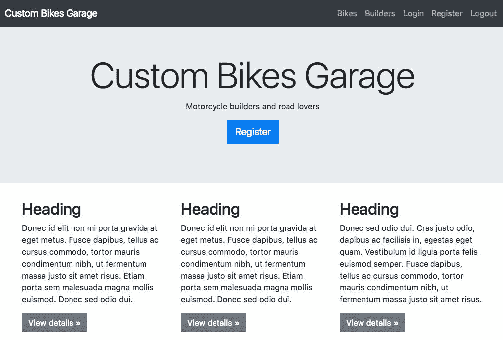

哇哦！现在，我们有一个网络应用程序。您会注意到，我们已经有了一个运行完美的应用程序。

3.  让我们点击`bikes`链接，看看到目前为止我们有什么:

请随意浏览应用程序的其余部分并查看其他页面。

然而，我们在这个阶段所拥有的只是占位符，所以现在是学习如何在我们的模板中应用 Angular 模板语法的时候了。

# 向导航组件添加模板绑定

现在，让我们对模板进行一些更改，以便可以使用 Angular 语法:

1.  打开`./Client/src/app/layout/nav/nav.component.html`并用以下代码替换其内容:

```php
<header> 
<nav class="navbar navbar-expand-md navbar-dark fixed-top bg-dark"> 
<a class="navbar-brand" [routerLink]="['/']" (click)="setTitle('Custom Bikes Garage')">Custom
Bikes Garage</a> 
<button class="navbar-toggler" type="button" data-toggle="collapse" data-
target="#navbarCollapse" aria-controls="navbarCollapse" aria-expanded="false" aria- label="Toggle
navigation"> 
<span class="navbar-toggler-icon"></span> 
</button> 
<div class="collapse navbar-collapse" id="navbarCollapse"> 
<ul class="navbar-nav ml-auto"> <li class="nav-item"> <a class="nav-link" [routerLink]="['/bikes']" routerLinkActive="active" (click)="setTitle('Bikes')">Bikes</a> 
</li> <li class="nav-item"> <a class="nav-link" [routerLink]="['/builders']" routerLinkActive="active" (click)="setTitle('Builders')">Builders</a> </li> 
<li *ngIf="!auth.isAuthenticated()" class="nav-item"> <a class="nav-link" [routerLink]="['/login']" routerLinkActive="active" (click)="setTitle('Login')">Login</a> </li> 
<li *ngIf="!auth.isAuthenticated()" class="nav-item"> <a class="nav-link" [routerLink]="['/register']" routerLinkActive="active" (click)="setTitle('Register')">Register</a> </li>
 <li *ngIf="auth.isAuthenticated()" class="nav-item"> 
<div ngbDropdown class="d-inline-block">
<button class="btn btn-secondary" id="dropdownBasic1" ngbDropdownToggle>{{ auth.currentUser?.name }}</button 
<div ngbDropdownMenu aria-labelledby="dropdownBasic1"> 
<button class="dropdown-item" (click)="onLogout();">Logout</button>
</div> 
</div>
</li>
</ul>
</div>
</nav> 
</header>
```

请注意，在前面的代码中，我们使用了`ngbDropdown`组件，也使用了`auth.isAuthenticated()`来确定用户是否登录。还要注意，我们在下拉列表中包含了注销链接。

现在，让我们调整登录和注册的模板。

# 向登录页面添加模板绑定

在[第 7 章](07.html#4G04U0-f24bf9337f074c079f0c90fd02324171)**带有 Angular-cli 的渐进式 Web 应用程序*中，我们已经为所有应用程序的视图/模板添加了 HTML 标记，但是，我们需要将 Angular 绑定和模型添加到模板中，以便一切正常工作:*

 *1.  打开`./Client/src/app/auth/login/login.component.html`。

2.  向标记添加以下绑定函数:

```php
 (ngSubmit)="onSubmit(loginForm)" #loginForm="ngForm"
```

现在，我们将把`ngModel`添加到电子邮件和密码输入中，而我们仍然在`./Client/src/app/auth/login/login.component.html`中。

3.  将以下代码添加到`email`输入中:

```php
 <input  type="email" [(ngModel)]="user.email" name="email" #email="ngModel" class="form-control"  id="email"  aria-describedby="emailHelp"  placeholder="Enter email">
```

4.  将以下代码添加到`password`输入中:

```php
 <input  type="password" [(ngModel)]="user.password" name="password" #password="ngModel" class="form-control"  id="password"  placeholder="Password">
```

# 向注册页面添加模板绑定

现在，让我们在注册页面模板上重复相同的操作:

1.  打开`./Client/src/app/auth/register/register.component.html`。

2.  向标记添加以下绑定函数:

```php
 [formGroup]="registerForm" (ngSubmit)="onSubmit()"  class="form-signin"  novalidate
```

注意`formGroup`属性的使用。这是角反应形式的一部分，但是现在不要担心这个；在本书的后面，我们将讨论模板驱动的表单和反应式表单。

现在，我们将把`formControlName`添加到`name`、`email`和`password`输入中，同时仍然在`./Client/src/app/auth/register/register.component.html`中。

3.  将以下代码添加到`name`输入中:

```php
 <input type="name"  formControlName="name"  class="form-control"  id="name"  aria-describedby="nameHelp"  placeholder="Enter your name">
```

4.  将以下代码添加到`email`输入中:

```php
 <input type="email"  formControlName="email" class="form-control"  id="email"  aria-describedby="emailHelp"  placeholder="Enter email">
```

5.  将以下代码添加到`password`输入中:

```php
 <input  formControlName="password"  type="password"  name="password" class="form-control"  id="password"  placeholder="Password">
```

# 将模板绑定添加到自行车详细信息页面

现在，让我们对`bike-detail`页面模板进行一些调整:

1.  打开`./Client/src/app/bikes/bike-detail/bike-detail.component.html`。

2.  用以下代码替换其内容:

```php
 <main role="main">
        <div class="py-5">
        <div class="container">
        <div *ngIf="isLoading" class="spinner">
                <div class="double-bounce1"></div>
                <div class="double-bounce2"></div>
        </div>
        <ngb-tabset type="pills" *ngIf="!isLoading">
                <ngb-tab title="Bike Detail">
                        <ng-template ngbTabContent>
                        <br>
                        <div class="row">
                                <div class="col-md-4">
                                
                                </div>
                                <div class="col-md-8">
                                <div class="card">
                                        <div class="card-body">
                                        <h5 class="card-title">{{ bike?.model }} | {{ bike?.year }} | Ratings: {{ bike?.average_rating }}
                                                <span *ngIf="userVote">| Your Vote: {{ userVote }}</span>
                                        </h5>
                                        <p class="card-text">{{ bike?.mods }}</p>
                                        </div>
                                        <div *ngIf="bike?.builder" class="card-header">
                                        <strong>Builder</strong>:
                                        <a routerLink="/builders/{{bike?.builder['id']}}">{{ bike?.builder['name'] }}</a>
                                        </div>
                                        <div *ngIf="bike?.items" class="card-header">
                                        <strong>Featured items</strong>:
                                        </div>
                                        <ul class="list-group list-group-flush">
                                        <li *ngFor="let item of bike?.items" class="list-group-item">
                                                <strong>Type</strong>: {{ item.type }} |
                                                <strong>Name</strong>: {{ item.name }} |
                                                <strong>Company</strong>: {{ item.company }}
                                        </li>
                                        </ul>
                                        <div class="card-body">
                                        <ul class="list-unstyled list-inline">
                                                <li class="list-inline-item">Vote: </li>
                                                <li class="list-inline-item">
                                                <a (click)="onVote('1')" class="btn btn-outline-secondary">1</a>
                                                </li>
                                                <li class="list-inline-item">
                                                <a (click)="onVote('2')" class="btn btn-outline-primary">2</a>
                                                </li>
                                                <li class="list-inline-item">
                                                <a (click)="onVote('3')" class="btn btn-outline-success">3</a>
                                                </li>
                                        </ul>
                                        </div>
                                </div>
                                </div>
                        </div>
                        </ng-template>
                </ngb-tab>
                <ngb-tab>
                        <ng-template ngbTabTitle *ngIf="checkBikeOwner()">Edit bike</ng-template>
                        <ng-template ngbTabContent>
                        <br>
                        <form (ngSubmit)="onSubmit(bikeAddForm)" #bikeAddForm="ngForm" name=bikeAddForm class="bg-light px-4 py-4">
                                <div class="form-group">
                                <label for="make">Make</label>
                                <input type="text" [(ngModel)]="bike.make"  name="make" class="form-control" id="make" placeholder="Enter make">
                                </div>
                                <div class="form-group">
                                <label for="model">Model</label>
                                <input type="text" [(ngModel)]="bike.model" name="model" class="form-control" id="model" placeholder="Enter model">
                                </div>
                                <div class="form-group">
                                <label for="year">Year</label>
                                <input type="text" [(ngModel)]="bike.year" name="year" class="form-control" id="year" placeholder="Enter year, ex: 1990, 2000">
                                </div>
                                <div class="form-group">
                                <label for="mods">Mods</label>
                                <textarea type="text" [(ngModel)]="bike.mods" name="mods" class="form-control" id="mods" placeholder="Enter modifications"></textarea>
                                </div>
                                <div class="form-group">
                                <label for="picture">Picture</label>
                                <input type="text" [(ngModel)]="bike.picture" name="picture" class="form-control" id="picture" placeholder="Enter picture url">
                                </div>
                                <div class="form-group">
                                <label for="inputState">Builder</label>
                                <select [(ngModel)]="bike.builder.id" name="builder_id" class="form-control">
                                        <option *ngFor="let builder of builders" [(ngValue)]="builder['id']">{{builder['name']}}</option>
                                </select>
                                </div>
                                <button type="submit" class="btn btn-primary">Submit</button>
                        </form>
                        </ng-template>
                </ngb-tab>
                </ngb-tabset>
        </div>
 </div>
 </main>
```

请注意，我们正在使用`*ngIf`指令隐藏我们的自行车，直到自行车对象可用。我们还使用点击绑定功能`(click)="onVote('1')"`对自行车进行投票，我们使用`*ngFor="let item of bike?.items"`列出自行车项目。

我们还使用来自`NgBootstrap` 的`ngb-tab``ngb-tabset`指令在此页面上创建两个视图:一个显示自行车的详细信息，另一个显示编辑表单，以便我们可以编辑自行车的详细信息。请注意，我们正在使用名为`checkBikeOwner()`的功能进行简单的检查，以查看登录的用户是否是自行车的所有者。否则，我们将隐藏该选项卡。

The `(?)` symbol is called the safe navigation operator.

预期结果如下图所示:

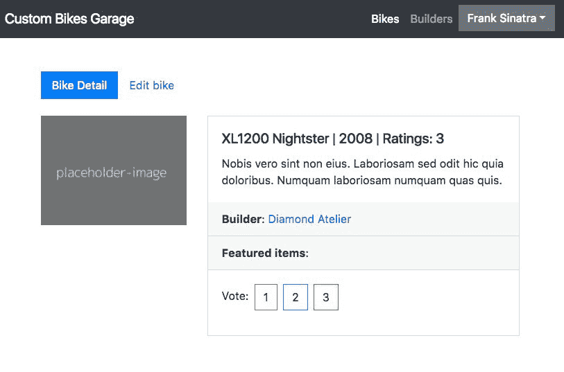

现在不要担心表单，因为我们将在本章末尾详细讨论它。

# 将模板绑定添加到自行车列表页面

好了，现在是时候创建`bike-list`模板绑定了:

1.  打开`./Client/src/app/bikes/bike-list/bike-list.component.html`。
2.  用以下代码替换其内容:

```php
<main role="main">
  <div class="py-5 bg-light">
    <div class="container">
      <form>
        <div class="form-group row">
          <label for="search" class="col-sm-2 col-form-label">Bike List</label>
          <div class="col-sm-8">
            <input [(ngModel)]="searchText" [ngModelOptions]="{standalone: true}" placeholder="buscar" type="text" class="form-control"
              id="search" placeholder="Search">
          </div>
          <div class="col-sm-2">
            <div ngbDropdown class="d-inline-block">
              <button class="btn btn-primary" id="dropdownBasicFilter" ngbDropdownToggle>Filter</button>
              <div ngbDropdownMenu aria-labelledby="dropdownBasicFilter">
                <button class="dropdown-item">Year</button>
              </div>
            </div>
          </div>
        </div>
      </form>
      <div *ngIf="isLoading" class="spinner">
        <div class="double-bounce1"></div>
        <div class="double-bounce2"></div>
      </div>
      <div class="row">
        <div class="col-md-4" *ngFor="let bike of bikes | bikeSearch: searchText ">
          <div class="card mb-4 box-shadow">
            
            <div class="card-body">
              <p>{{ bike.model }} | {{ bike.year }}</p>
              <p class="card-text">{{ bike.mods }}</p>
              <a routerLink="/bikes/{{ bike.id }}" class="card-link">Vote</a>
            </div>
          </div>
        </div>
      </div>
    </div>
  </div>
</main>
```

请注意，我们正在使用`ngbDropdown`、`ngbDropdownToggle`和`ngbDropdownMenu`组件，并且我们还在使用`*ngFor="let bike of bikes"`列出来自`bikes Array`和`*ngIf`的所有自行车，以显示和隐藏装载消息。

现在，我们可以看到 Angular 的力量。只需做一些改动，我们的静态模板就可以投入使用，并与我们的后端交互。但是我们仍然需要编写组件的逻辑来将所有的东西放在一起。

在此之前，让我们调整构建器模板。

# 将模板绑定添加到生成器详细信息页面

让我们添加`builder-detail`页:

1.  打开`./Client/src/app/builders/builder-detail/builder-detail.component.html`。

2.  用以下代码替换其内容:

```php
<main role="main">
  <div class="py-5">
  <div class="container">
  <div *ngIf="isLoading" class="spinner">
    <div class="double-bounce1"></div>
    <div class="double-bounce2"></div>
  </div>
  <ngb-tabset type="pills" *ngIf="!isLoading">
    <ngb-tab title="Bike Detail">
      <ng-template ngbTabContent>
      <br>
      <div class="row">
        <div class="col-md-4">
        
        </div>
        <div class="col-md-8">
        <div class="card">
          <div class="card-body">
          <h5 class="card-title">{{ bike?.model }} | {{ bike?.year }} | Ratings: {{ bike?.average_rating }}
            <span *ngIf="userVote">| Your Vote: {{ userVote }}</span>
          </h5>
          <p class="card-text">{{ bike?.mods }}</p>
          </div>
          <div *ngIf="bike?.builder" class="card-header">
          <strong>Builder</strong>:
          <a routerLink="/builders/{{bike?.builder['id']}}">{{ bike?.builder['name'] }}</a>
          </div>
          <div *ngIf="bike?.items" class="card-header">
          <strong>Featured items</strong>:
          </div>
          <ul class="list-group list-group-flush">
          <li *ngFor="let item of bike?.items" class="list-group-item">
            <strong>Type</strong>: {{ item.type }} |
            <strong>Name</strong>: {{ item.name }} |
            <strong>Company</strong>: {{ item.company }}
          </li>
          </ul>
          <div class="card-body">
          <ul class="list-unstyled list-inline">
            <li class="list-inline-item">Vote: </li>
            <li class="list-inline-item">
            <a (click)="onVote('1')" class="btn btn-outline-secondary">1</a>
            </li>
            <li class="list-inline-item">
            <a (click)="onVote('2')" class="btn btn-outline-primary">2</a>
            </li>
            <li class="list-inline-item">
            <a (click)="onVote('3')" class="btn btn-outline-success">3</a>
            </li>
          </ul>
          </div>
        </div>
        </div>
      </div>
      </ng-template>
    </ngb-tab>
    <ngb-tab>
      <ng-template ngbTabTitle *ngIf="checkBikeOwner()">Edit bike</ng-template>
      <ng-template ngbTabContent>
      <br>
      <form (ngSubmit)="onSubmit(bikeAddForm)" #bikeAddForm="ngForm" name=bikeAddForm class="bg-light px-4 py-4">
        <div class="form-group">
        <label for="make">Make</label>
        <input type="text" [(ngModel)]="bike.make"  name="make" class="form-control" id="make" placeholder="Enter make">
        </div>
        <div class="form-group">
        <label for="model">Model</label>
        <input type="text" [(ngModel)]="bike.model" name="model" class="form-control" id="model" placeholder="Enter model">
        </div>
        <div class="form-group">
        <label for="year">Year</label>
        <input type="text" [(ngModel)]="bike.year" name="year" class="form-control" id="year" placeholder="Enter year, ex: 1990, 2000">
        </div>
        <div class="form-group">
        <label for="mods">Mods</label>
        <textarea type="text" [(ngModel)]="bike.mods" name="mods" class="form-control" id="mods" placeholder="Enter modifications"></textarea>
        </div>
        <div class="form-group">
        <label for="picture">Picture</label>
        <input type="text" [(ngModel)]="bike.picture" name="picture" class="form-control" id="picture" placeholder="Enter picture url">
        </div>
        <div class="form-group">
        <label for="inputState">Builder</label>
        <select [(ngModel)]="bike.builder.id" name="builder_id" class="form-control">
          <option *ngFor="let builder of builders" [(ngValue)]="builder['id']">{{builder['name']}}</option>
        </select>
        </div>
        <button type="submit" class="btn btn-primary">Submit</button>
      </form>
      </ng-template>
    </ngb-tab>
    </ngb-tabset>
    </div>
  </div>
</main>
```

在构建器模板中，我们使用了与前面模板相同的技术。

# 将模板绑定添加到生成器列表页面

现在，是时候添加`builder-list`模板了:

1.  打开`./Client/src/app/builders/builder-list/builder-list.component.html`。

2.  用以下代码替换其内容:

```php
 <main  role="main">
        <div  class="py-5 bg-light">
                <div  class="container">
                        <div *ngIf="isLoading"  class="spinner">
                                <div  class="double-bounce1"></div>
                                <div  class="double-bounce2"></div>
                        </div>
                        <div  class="row">
                                <div  class="col-md-4" *ngFor="let builder of builders">
                                        <div  class="card mb-4 box-shadow">
                                                <div  class="card-header">
                                                        <h4  class="my-0 font-weight-normal">{{ builder?.name }}</h4>
                                                </div>
                                                <div  class="card-body">
                                                        <p  class="mt-3 mb-4">{{ builder?.description }</p>
                                                        <button  routerLink="/builders/{{ builder?.id }}"  type="button"  class="btn btn-lg btn-block btn-outline-primary">View Bike</button>
                                                </div>
                                                <div  class="card-footer text-muted">
                                                        {{ builder?.location }}
                                                </div>
                                        </div>
                                </div>
                        </div>
                </div>
        </div>
 </main>
```

现在，我们有足够的模板代码来呈现后端的内容。为此，我们只需要对后端进行一些小的调整，并在组件中写入逻辑。

# 在 Laravel 后端设置 CORS

在对我们的后端进行必要的更改之前，让我们来谈谈当今现代 web 应用程序中一个非常重要也非常常见的主题，即 CORS。

当我们使用`XMLHttpRequest`或`Fetch API`从给定的服务器获取数据时，这个调用通常是从另一个应用程序和其他地方执行的。

出于安全原因，浏览器限制跨来源的 HTTP 请求。

理解 CORS 如何工作的一个简单例子是这样的:想象一下，在一个特定的域中运行的一个前端应用程序，例如`http://mysimpledomain.com`，向另一个域中的另一个应用程序发送一个被称为`http://myanothersimpledomain.com`的请求。

CORS 是一种机制，它使用额外的 HTTP 头来告诉浏览器让 web 应用程序在一个源`http://mysimpledomain.com`上运行，并拥有从另一个源`http://myanothersimpledomain`上的服务器访问选定资源的权限。

你可以在 https://www.w3.org/TR/cors/阅读更多关于 CORS 的信息。

# 建立拉威尔·CORS

Laravel 非常支持在应用程序中使用 CORS。让我们看看如何使用名为`barryvdh/laravel-cors`的库进行配置:

1.  打开`chapter-10`文件夹内的终端窗口。

2.  键入以下命令:

```php
 docker-compose up -d
```

3.  现在，在`php-fpm`容器中，键入以下命令:

```php
 docker-compose exec php-fpm bash
```

这一步非常重要。如果您忘记了此命令，很可能会发现一个错误，或者您可能有使用本地 composer 版本执行以下命令的风险。

4.  在容器的 bash 中，键入以下命令:

```php
 composer require barryvdh/laravel-cors
```

多亏了最新版本的 Laravel (5.6)，我们的新库已经可以使用了。让我们再做一点改变。

5.  打开`./Server/app/Http/Kernel.php`文件，将以下代码添加到`middlewareGroup` API 中:

```php
 protected $middlewareGroups = [

        'web'  => [
                ...
        ],
        'api'  => [
                \Barryvdh\Cors\HandleCors::class,
                'throttle:60,1',
                'bindings',
        ],
```

非常重要的一点是，我们在 API 标签的第一行依赖项中添加了`\Barryvdh\Cors\HandleCors :: class`。这非常重要，因为我们可以避免在前端应用程序中出现状态代码为 0 的错误。

我们准备好出发了！

# 将 Angular 服务与应用程序组件连接起来

现在，我们将连接我们在本书中创建的所有 Angular 服务和模板。为此，我们将创建我们将在组件中使用的逻辑和功能。

在开始之前，让我们将应用编程接口的端点设置为 Angular 环境文件中的一个变量。

# 添加环境配置

顾名思义，这个文件用于在我们的应用程序中设置环境变量。最棒的是，Angular 附带了默认配置的开发和生产环境，使用起来非常简单。我们还可以设置各种变量。

在这个例子中，我们使用开发文件设置后端网址。

打开`./Client/src/environments/environment.ts`文件，添加如下网址:

```php
     export  const  environment  = {
                production: false,
                apiUrl: 'http://localhost:8081/api'
        };
```

如您所见，我们在`environments`文件夹中有另一个名为`environment.prod.ts`的文件。

现在不要担心这个文件，因为我们只会在以后的书中使用它。

# 创建导航方法

现在，是时候在`nav.component.ts`中创建导航行为了，让我们看看如何做到这一点:

1.  打开`./Client/src/layout/nav/nav.component.ts`并添加以下导入，就在核心导入之后:

```php
 import { Router } from  '@angular/router';
 import { Title } from  '@angular/platform-browser';

 // App imports
 import { AuthService } from  '../../pages/auth/_services/auth.service';
```

2.  还是在`./Client/src/layout/nav/nav.component.ts`上，让我们创建`constructor()`功能:

```php
 public  constructor(
        private  titleTagService:  Title,
        public  auth:  AuthService,
        private  router:  Router ) {}
```

这里，我们使用内置的 Angular 服务`Title`在模板之间导航时更新页面的标题标签。请记住，我们的应用程序是一个 SPA，我们不希望在所有页面中保持相同的标题。

此外，我们将使用身份验证服务来显示登录到应用程序的用户的名称，我们还将使用该服务的注销功能来注销用户。那么，让我们创建这个函数。

3.  在解构函数之后添加以下代码:

```php
 public  setTitle( pageTitle:  string) {
        this.titleTagService.setTitle( pageTitle );
 }
```

4.  现在，在`ngOnInit()`功能中，添加以下代码:

```php
 if (this.auth.getToken()) {
        this.auth.getUser().subscribe();
 }
```

5.  最后一步是添加`logout()`功能，就在`ngOnInit()`功能之后。添加以下代码:

```php
 onLogout() {
        this.auth.onLogout().subscribe();
 }
```

现在，我们已经准备好了应用程序的导航。预期结果如下图所示:


导航视图

# 创建自行车细节方法

让我们创建`bike-detail`组件:

1.  打开`./Client/src/pages/bikes/bike-detail/bike-detail.component.ts`并添加以下导入，就在核心导入之后:

```php
 import { ActivatedRoute } from  '@angular/router';

 // App imports
 import { Bike } from  '../bike';
 import { BikesService } from  '../_services/bikes.service';
 import { AuthService } from  '../../auth/_services/auth.service';
 import { User } from  './../../auth/user';
```

2.  在`BikeDetailComponent`类声明后添加以下属性:

```php
 bike:  Bike;
 isLoading:  Boolean  =  false;
 userVote:  number;
 builders: Array<Object> = [
        {id: 1, name: 'Diamond Atelier'},
        {id: 2, name: 'Deus Ex Machina\'s'},
        {id: 3, name: 'Rough Crafts'},
        {id: 4, name: 'Roldand Sands'},
        {id: 5, name: 'Chopper Dave'}
 ];
```

请注意，我们使用`Bike`模型作为我们的`bike`属性的类型，并创建一个简单的数组来保存我们的构建器。

请注意，在现实世界的 web 应用程序中，从服务器获取构建者列表是一个很好的做法，这样可以避免在组件内部进行硬编码。

3.  还是在`./Client/src/pages/bikes/bike-detail/bike-detail.component.ts`上，让我们创建`constructor()`功能:

```php
 constructor(
        private  bikeService:  BikesService,
        private  route:  ActivatedRoute,
        private  auth:  AuthService ) {}
```

我们将在本节稍后使用`ActivatedRoute`获取自行车 ID。

4.  在`ngOnInit()`功能中，添加以下代码:

```php
 // Get bike details
 this.getBikeDetail();
```

现在，让我们创建`getBikeDetail()`函数。

5.  在`ngOnInit()`功能后添加以下代码:

```php
 getBikeDetail():  void {
        this.isLoading  =  true;
        const  id  =  +this.route.snapshot.paramMap.get('id');
        this.bikeService.getBikeDetail(id)
                .subscribe(bike  => {
                        this.isLoading  =  false;
                        this.bike  =  bike['data'];
        });
 }
```

6.  现在，让我们添加`onVote()`功能。在`getBikeDetail()`功能后添加以下代码:

```php
 onVote(rating:  number, id:  number):  void {
        // Check if user already vote on a bike
        if (this.checkUserVote(this.bike.ratings)) {
                alert('you already vote on this bike');
                return;
        }
        // Get bike id
        id  =  +this.route.snapshot.paramMap.get('id');
        // post vote
        this.bikeService.voteOnBike(rating, id)
                .subscribe(
                        (response) => {
                                this.userVote  =  response.data.rating;
                                // Update the average rating and rating object on bike
                                this.bike['average_rating'] =  response.data.average_rating;
                                // Update ratings array
                                this.bike.ratings.push(response.data);
                        }
                );
 }
```

7.  现在，我们将创建一个功能，检查登录的用户是否已经投票选择了自行车。记住`RatingController.php`使用的是`firstOrCreate`方法:

```php
     public  function  store(Request $request, Bike $bike)
        {
                $rating =  Rating::firstOrCreate(
                        [
                        'user_id'  => $request->user()->id,
                        'bike_id'  => $bike->id,
                        ],
                        ['rating'  => $request->rating]
                );
                return  new  RatingResource($rating);
        }
```

我们将只登记第一次投票。因此，我们需要向用户显示一条简单的消息作为`Vote`功能的反馈。

8.  在`onVote()`功能后添加以下代码:

```php
 checkUserVote(ratings:  any[]):  Boolean {
        const  currentUserId  =  this.auth.currentUser.id;
        let  ratingUserId:  number;
        Object.keys(ratings).forEach( (i) => {
                ratingUserId  =  ratings[i].user_id;
        });
        if ( currentUserId  ===  ratingUserId ) {
                return  true;
        } else {
                return  false;
        }
 }
```

9.  以下方法使用提交功能更新`bike`记录。在`checkUserVote()`功能后添加以下代码:

```php
 onSubmit(bike) {
        this.isLoading = true;
        const id = +this.route.snapshot.paramMap.get('id');
        this.bikeService.updateBike(id, bike.value)
        .subscribe(response => {
                this.isLoading = false;
                this.bike = response['data'];
        });
 }
```

请注意，在这一步中，我们使用的是来自`bikeService`的`updateBike`方法。

10.  最后一个方法是一个简单的功能来检查自行车车主。请记住，用户只能编辑自己的自行车。在`onSubmit()`功能后添加以下代码:

```php
 checkBikeOwner(): Boolean {
        if (this.auth.currentUser.id === this.bike.user.id) {
                return true;
        } else {
                return false;
        }
 }
```

在这段代码中，我们使用`authService`来获取`User.id`，并将其与`bike.user.id`进行比较。

当我们访问`http://localhost:4200/bikes/3`网址时，这个页面的预期结果将类似于下面的截图:

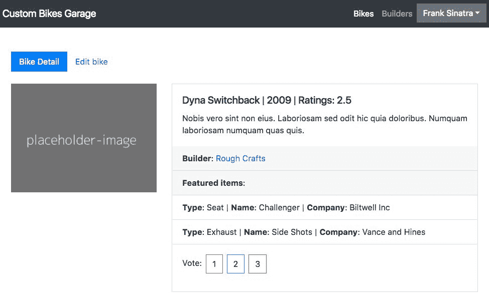

自行车详细信息屏幕

请注意，我们可以在这辆自行车上看到“编辑”按钮，因为我们的应用程序种子已经用一些示例信息填充了数据库。

因此，如果我们单击编辑自行车按钮，我们将看到类似于以下内容的内容:

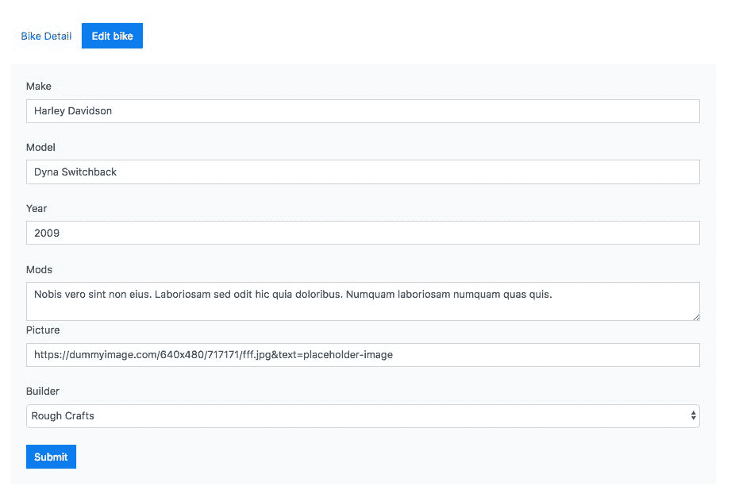

编辑自行车表单

# 创建自行车列表方法

让我们创建`bike-list`组件:

1.  打开`./Client/src/pages/bikes/bike-list/bike-list.component.ts`并添加以下导入，就在核心导入之后:

```php
 import { NgbDropdown } from '@ng-bootstrap/ng-bootstrap/dropdown/dropdown.module';

 // App imports
 import { Bike } from '../bike';
 import { BikesService } from '../_services/bikes.service';
```

2.  在`bike-list.component`类声明后添加以下属性:

```php
 // Using Bike Model class
 bikes: Bike[];
 isLoading: Boolean = false;
 public searchText: string;
```

3.  仍然在`./Client/src/pages/bikes/bike-list/bike-list.component.ts`**上，让我们创建`constructor()`功能:**

```php
 constructor(
        private bikeService: BikesService) {}
```

4.  在`ngOnInit()`功能中，添加以下代码:

```php
 // Get bike list
 this.getBikes();
```

现在，让我们创建`this.getBikes()`函数。

5.  在`ngOnInit()`功能后添加以下代码:

```php
 getBikes(): void {
 this.isLoading = true;
 this.bikeService.getBikes()
        .subscribe(
        response => this.handleResponse(response),
        error => this.handleError(error));
 }
```

注意，在这段代码中，我们使用两个函数来处理成功和错误响应。在`subscribe()`函数内部编写所有内容是可能的，但是更好的组织技巧是将它们分开。

6.  在`getBikes()`功能后添加以下代码:

```php
 protected handleResponse(response: Bike[]) {
        this.isLoading = false,
        this.bikes = response;
 }

 protected handleError(error: any) {
        this.isLoading = false,
        console.error(error);
 }
```

这里，在受保护的`handleError`方法上，我们只是使用`console.log()`来显示错误。

当我们访问`http://localhost:4200/bikes`网址时，这个页面的预期结果将类似于下面的截图:

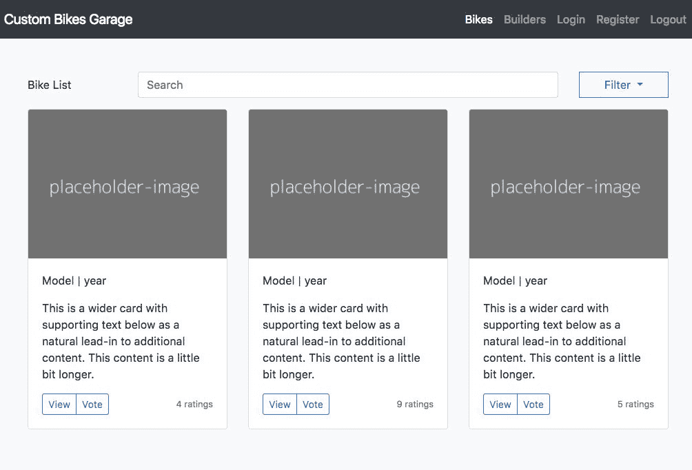

自行车列表页面

# 创建构建器细节方法

现在，是时候创建`builder-detail`组件了。让我们看看如何:

1.  打开`./Client/src/pages/builders/builder-detail/builder-detail.component.ts`并添加以下导入，就在核心导入之后:

```php
 import { ActivatedRoute } from '@angular/router';

 // App imports
 import { Builder } from './../builder';
 import { BuildersService } from '../_services/builders.service';
```

2.  在`builder-detail.component`类声明后添加以下属性:

```php
   builder: Builder;
   isLoading: Boolean = false;
```

3.  还是在`./Client/src/pages/builders/builder-detail/builder-detail.component.ts`上，让我们创建`constructor()`功能:

```php
 constructor(
        private buildersService: BuildersService,
        private route: ActivatedRoute) { }
```

4.  在`ngOnInit()`功能中，添加以下代码:

```php
 ngOnInit() {
        // Get builder detail
        this.getBuilderDetail();
 }
```

现在，让我们创建`this.getBuilderDetail()`函数。

5.  在`ngOnInit()`功能后添加以下代码:

```php
 getBuilderDetail(): void {
        this.isLoading = true;
        const id = +this.route.snapshot.paramMap.get('id');
        this.buildersService.getBuilderDetail(id)
                .subscribe(builder => {
                this.isLoading = false;
                this.builder = builder['data'];
        });
 }
```

当我们访问`http://localhost:4200/builders/4`网址时，这个页面的预期结果将类似于下面的截图:

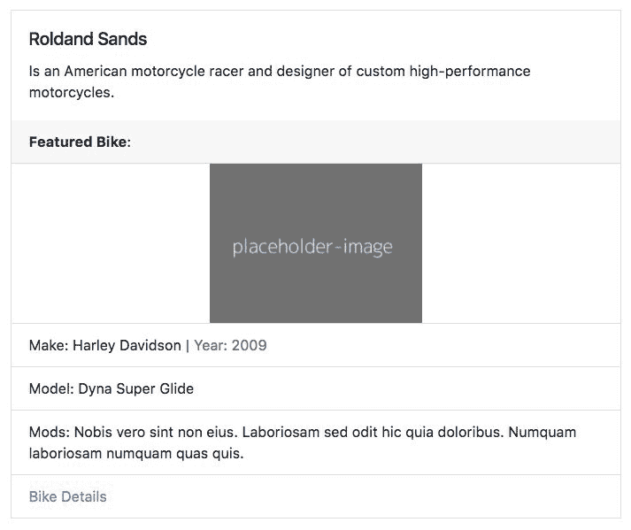

建筑商详细信息页面

# 创建生成器列表方法

现在，让我们创建`builder-list`方法来列出所有的构建者:

1.  打开`./Client/src/pages/builders/builder-list/builder-list.component.ts`并添加以下导入，就在核心导入之后:

```php
 // App imports
 import { Builder } from './../builder';
 import { BuildersService } from '../_services/builders.service';
```

2.  在`BuilderListComponent`类声明后添加以下属性:

```php
 // Using Builder Model class
 builders: Builder[];
 isLoading: Boolean = false;
```

3.  还是在`./Client/src/pages/builders/builder-list/builder-list.component.ts`上，让我们创建`constructor()`功能:

```php
 constructor(private builderService: BuildersService) { }
```

4.  在`ngOnInit()`功能中，添加以下代码:

```php
 ngOnInit() {
        // Get builder detail
        this.getBuilders();
 }
```

5.  在`ngOnInit()`功能后添加以下代码:

```php
 getBuilders(): void {
 this.isLoading = true;
 this.builderService.getBuilders()
        .subscribe(
        response => this.handleResponse(response),
        error => this.handleError(error));
 }
```

注意，在这段代码中，我们使用两个函数来处理成功和错误响应。可以在`subscribe()`函数中编写所有内容，但是更好的组织方法是将它们分开。

6.  在`getBuilders()`功能后添加以下代码:

```php
 protected handleResponse(response: Builder[]) {
        this.isLoading = false,
        this.builders = response;
 }
 protected handleError(error: any) {
        this.isLoading = false,
        console.error(error);
 }
```

最后，我们已经准备好了所有组件。

当我们访问`http://localhost:4200/builders`网址时，这个页面的预期结果将类似于下面的截图:

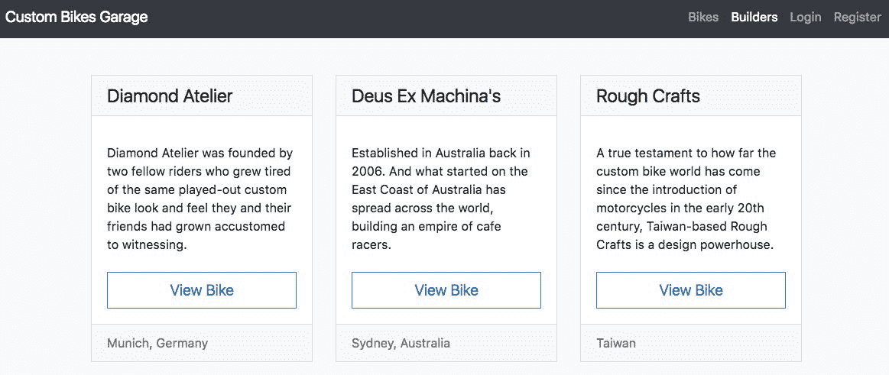

构建者列表页面

# 处理有角度的管道、表单和验证

在本节中，我们将看到如何使用新的管道功能在自行车列表页面中创建一个简单的搜索组件。我们还将研究如何以两种方式创建 Angular 表单:模板驱动表单和反应表单。最后，我们将向您展示如何在 Bootstrap CSS 中使用表单验证。

# 创建管道过滤器

Angular 中的管道是过滤和转换数据的简单方法，非常类似于旧的 AngularJS 过滤器。
我们在 Angular ( `DatePipe`、`UpperCasePipe`、`LowerCasePipe`、`CurrencyPipe`和`PercentPipe`中有一些默认管道，我们也可以创建自己的管道。

要创建自定义管道，我们可以使用 Angular CLI 为我们生成脚手架。让我们看看它是如何工作的:

1.  打开终端窗口，在`./Client/src/app`内输入以下命令:

```php
 ng g pipe pages/bikes/_pipes/bikeSearch
```

像往常一样，Angular CLI 负责创建文件和适当的导入。

2.  打开`./Client/src/app/pages/bikes/_pipes/bike-search.pipe.ts`并在`BikeSearchPipe`类中添加以下代码:

```php
 transform(items: any, searchText: string): any {
 if (searchText) {
        searchText = searchText.toLowerCase();
        return items.filter((item: any) => item.model.toLowerCase().indexOf(searchText) > -1);
 }
 return items;
 }
```

上一个`transform`功能从自行车列表页面的搜索框输入字段接收两个参数:列表和搜索字符串。那么，让我们看看如何在`bike-list`模板中使用它们。

3.  打开`./Client/src/app/pages/bikes/bike-list/bike-list.component.ts`并在搜索输入字段中添加以下属性:

```php
 <input [(ngModel)]="searchText" [ngModelOptions]="{standalone: true}" placeholder="buscar" type="text" class="form-control"
       id="search" placeholder="Search">
```

现在我们已经有了搜索模型，让我们在`*ngFor`循环上添加管道过滤器。

4.  在`*ngFor`属性中添加以下代码:

```php
 <div class="col-md-4" *ngFor="let bike of bikes | bikeSearch: searchText ">...</div>
```

因此，当我们在搜索输入中输入自行车模型时，我们将看到以下截图:

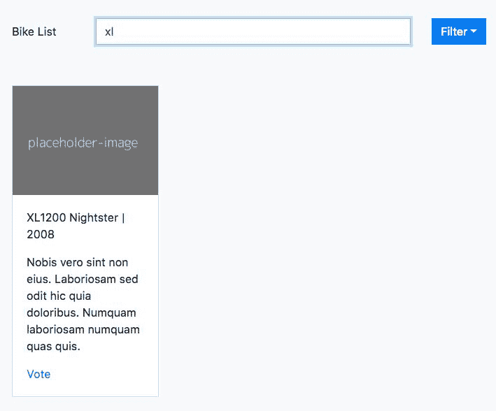

搜索字段工作

现在，让我们看看如何实现角形。

# 引入角形

众所周知，表单是任何现代网络应用程序的重要组成部分，它可以让用户登录应用程序，添加产品，并向博客发送评论。有些表单非常简单，但其他表单可能有一个字段数组，甚至有许多步骤和页面，其中包含大量输入字段。

使用 Angular，我们可以实现两种类型的表单:

*   模板驱动的表单
*   反应形式或模型驱动形式

两者实力相当，同属`@angular/forms`库。它们基于相同的窗体控件类。然而，它们有不同的理念、编程风格和技术，验证也不同。在下一节中，我们将看到每种技术的独特性。

# 理解角度模板驱动的表单

正如我们之前所解释的，模板驱动的表单与 AngularJS 表单非常相似，并且使用了指令，例如`ngModel`以及可能的`required`、`minlength`、`maxlength`和许多其他指令。当我们使用这些表单指令时，我们让模板在幕后工作。

# 查看登录表单模板和组件

理解模板驱动表单的一个很好的例子是登录表单。让我们看看`login.component.html`和`login.component.ts`:

1.  打开`./Client/src/app/pages/auth/login/login.component.html`查看模板输入标签:

```php
 [(ngModel)]="user.email"  name="email"
 [(ngModel)]="user.password" name="password"
```

注意，我们使用的是`ngModel = [(ngModel)]`的双向数据绑定语法。这意味着我们可以从登录组件类中设置初始数据，但是我们也可以更新它。

记住，Angular 的`ngModel`可以有三种不同的用法:

*   `ngModel`:没有分配绑定或值，取决于名称属性
*   `[ngModel]`:单向数据绑定语法
*   `[(ngModel)]`:双向数据绑定语法

对于提交按钮事件，我们只是使用`(ngSubmit)="onSubmit(loginForm)" #loginForm="ngForm"`指令，传入`loginForm`。

既然我们的`login.component.ts`完好无损，我们唯一需要的就是`onSubmit`功能。

2.  现在，让我们用以下代码替换`login.component.ts`来编辑它:

```php
 import { Component, OnInit } from '@angular/core';
 import { Router, ActivatedRoute } from '@angular/router';

 // App imports
 import { AuthService } from '../_services/auth.service';
 import { User } from '../user';

 @Component({
 selector: 'app-login',
 templateUrl: './login.component.html',
 styleUrls: ['./login.component.scss']
 })
 export class LoginComponent implements OnInit {
        user: User = new User();
        error: any;
        returnUrl: string;

        constructor(
                private authService: AuthService,
                private router: Router,
                private route: ActivatedRoute) { }

        ngOnInit() {
                //  Set the return url
                this.returnUrl = this.route.snapshot.queryParams['returnUrl'] || '/';
        }

        onSubmit(loginForm): void {
                this.authService.onLogin(this.user).subscribe(
                (response) => {
                        // get return url from route parameters or default to '/'
                        this.router.navigate([this.returnUrl]);
                },
                (error) => {
                        this.error = error.error;
                }
                );
                // Clear form fields
                loginForm.reset();
        }

 }
```

请注意，我们将`loginForm`传递给`onSubmit(loginForm)`函数，并使用`authService`将数据发送到端点。

# 理解角度反应/模型驱动形式

反应式/模型驱动表单和模板驱动表单之间的区别之一是使用了指令，如`ngModel`。

背后的原则是，我们使用表单应用编程接口负责任地将指令传递给`component.ts`代码。这具有更大的能力，并且对于工作来说非常高效，将所有的逻辑保持在同一个地方，正如我们将很快看到的。

# 查看登记表模板和组件

理解模型驱动表单的一个很好的例子是**注册**表单。我们来看看`register.component.html`和`register.component.ts`:

1.  打开`./Client/src/app/pages/auth/register/register.component.html`查看模板输入标签:

```php
 formControlName="name"
 formControlName="email"
 formControlName="password"
```

它几乎与我们在模板驱动表单上使用的符号相同，但稍微干净一点。在这里，我们不需要`name`属性。

对于提交按钮事件，我们只是使用`[formGroup]="registerForm" (ngSubmit)="onSubmit()"`属性和绑定函数。

2.  现在，让我们创建`register.component.ts`。将其代码替换为以下内容:

```php
 import { Component, OnInit } from '@angular/core';
 import { Router } from '@angular/router';
 import { FormBuilder, FormGroup, Validators } from '@angular/forms';

 // App imports
 import { User } from '../user';
 import { AuthService } from '../_services/auth.service';

 @Component({
 selector: 'app-register',
 templateUrl: './register.component.html',
 styleUrls: ['./register.component.scss']
 })
 export class RegisterComponent implements OnInit {

        user: User = new User();
        error: any;
        registerForm: FormGroup;

        constructor(private authService: AuthService, private router: Router, private fb: FormBuilder) {
                this.createForm();
        }

        ngOnInit() {}

        createForm() {
                this.registerForm = this.fb.group({
                name: [this.user.name, Validators.compose([Validators.required])],
                email: [this.user.email, Validators.compose([Validators.required, Validators.email ])],
                password: [this.user.password, Validators.compose([Validators.required, Validators.minLength(6)])],
                });
        }

        onSubmit(): void {

                this.authService.onRegister(this.registerForm.value).subscribe(
                (response) => {
                        this.router.navigate(['bikes']);
                },
                (response) => {
                        if (response.status === 422) {
                        Object.keys(response.error).map((err) => {
                                this.error = `${response.error[err]}`;
                        });

                        } else {
                        this.error = response.error;
                        }
                }
                );
        }

 }
```

注意，在这段代码中，我们处理的是提交函数的错误消息。在下面的例子中，我们将看看如何在两个表单上实现表单验证，但是现在，让我们回顾一些重要的点。

3.  打开`./Client/src/app/pages/auth/register/register.component.ts`；我们来复习一下`registerComponent`课。

我们可以注意到的第一个区别是文件顶部的`FormBuilder`、`FormGroup`和`Validators`的导入:

```php
     import { FormBuilder, FormGroup, Validators } from
     '@angular/forms';
```

我们还需要导入`auth.module.ts`里面的`ReactiveFormsModule`:

```php
     import { FormsModule, ReactiveFormsModule } from '@angular/forms';
```

我们可以使用`createForm()`函数中的`FormBuilder`应用编程接口创建表单:

```php
     createForm() {
                this.registerForm = this.fb.group({
                        name: [this.user.name, Validators.compose([Validators.required])],
                        email: [this.user.email, Validators.compose([Validators.required, Validators.email ])],
                        password: [this.user.password, Validators.compose([Validators.required, Validators.minLength(6)])],
                });
        }
```

这里，我们使用`Validators`直接从`component.ts`代码添加表单验证。太棒了，对吧？

请记住`fb`变量保存了我们放在构造函数中的`FormBuilder`:私有`fb:FormBuilder`。我们还将`registerForm`设置为`RegisterClass.`内的`FormGroup`

# 添加前端表单验证

正如我们今天所知，当我们谈论用户体验时，向最终用户显示持续的反馈是一个很好的做法，因此在将表单发送到后端之前验证它们是一个很好的做法。

在本节中，我们将了解如何将表单验证添加到登录和注册表单中。

# 处理模板驱动表单上的表单验证

打开`./Client/src/app/pages/auth/login/login.component.html`并用以下代码替换表单标签:

```php
 <form class="form-signin" (ngSubmit)="onSubmit(loginForm)" #loginForm="ngForm">
        <div class="text-center mb-4">
                <h1 class="h3 mt-3 mb-3 font-weight-normal">Welcome</h1>
                <p>Motorcycle builders and road lovers</p>
                <hr>
        </div>
        <div class="form-group" [ngClass]="{ 'has-error': !email.valid && (email.dirty || email.touched) }">
                <label for="email">Email address</label>
                <input type="email" [(ngModel)]="user.email"  name="email" #email="ngModel" required class="form-control" id="email" aria-describedby="emailHelp" placeholder="Enter email">
                <div *ngIf="email.invalid && (email.dirty || email.touched)" class="form-feedback">
                        <div *ngIf="email?.errors.required">Email is required</div>
                        <div *ngIf="email?.errors.email">Email must be a valid email address</div>
                </div>
        </div>
        <div class="form-group" [ngClass]="{ 'has-error': !password.valid && (password.dirty || password.touched) }">
                <label for="password">Password</label>
                <input type="password" [(ngModel)]="user.password" name="password" #password="ngModel" required minlength="6" class="form-control" id="password" placeholder="Password">
                <div *ngIf="password.invalid && (password.dirty || password.touched)" class="form-feedback">
                        <div *ngIf="password?.errors.required">Password is required</div>
                        <div *ngIf="password?.errors.minlength">Password must be at least 6 characters</div>
                </div>
        </div>
        <div  *ngIf="error" class="alert alert-danger" role="alert">
                Ops: {{ error.error }}
        </div>
        <button [disabled]="!loginForm.valid" class="btn btn-lg btn-primary btn-block mt-5" type="submit">Login</button>
 </form>
```

让我们回顾一下前面的代码。

请注意，如果表单无效，我们将使用内置在 Angular 指令中的`[ngClass]`对`div`表单组应用错误类:

```php
     // Email field
        class="form-group" [ngClass]="{ 'has-error': !email.valid && (email.dirty || email.touched) }"
        // Password field
        class="form-group" [ngClass]="{ 'has-error': !password.valid && (password.dirty || password.touched) }"
```

为了显示错误消息，我们将在输入字段后创建两个新的 div:

```php
     // Email validation
        <div *ngIf="email.invalid && (email.dirty || email.touched)" class="form-feedback">
                <div *ngIf="email?.errors.required">Email is required</div>
                <div *ngIf="email?.errors.email">Email must be a valid email address</div>
        </div>
        // Password validation
        <div *ngIf="password.invalid && (password.dirty || password.touched)" class="form-feedback">
                <div *ngIf="password?.errors.required">Password is required</div>
                <div *ngIf="password?.errors.minlength">Password must be at least 6 characters</div>
        </div>
```

借助`ngIf`和表单状态(脏、触摸)，如果输入字段与该条件匹配，我们可以看到每个错误。

下一个规则是下面的`div`显示可能发生的后端错误:

```php
     <div  *ngIf="error" class="alert alert-danger" role="alert">
                Ops: {{ error.error }}
        </div>
```

最后，使用`[disabled]`指令在提交按钮上设置验证:

```php
     <button [disabled]="!loginForm.valid" class="btn btn-lg btn-primary btn-block mt-5" type="submit">Login</button>
```

我们行动形式的最终结果如下:

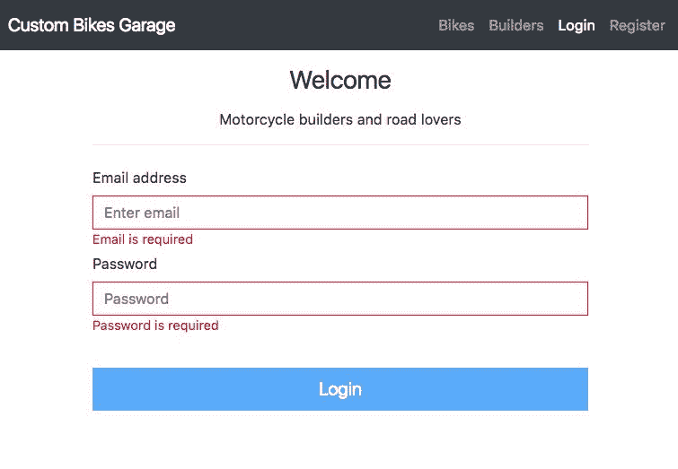

登录表单验证

# 处理模型驱动表单上的表单验证

打开`./Client/src/app/pages/auth/register/register.component.html`并用以下代码替换表单标签:

```php
 <form [formGroup]="registerForm" (ngSubmit)="onSubmit()"  class="form-register" novalidate>
        <div class="text-center mb-4">
                <h1 class="h3 mt-3 mb-3 font-weight-normal">Welcome</h1>
                <p>Motorcycle builders and road lovers</p>
                <hr>
        </div>
        <div class="form-group" [ngClass]="{ 'has-error': !registerForm.get('name').valid && (registerForm.get('name').dirty || registerForm.get('name').touched) }">
                <label for="name">Name</label>
                <input type="name" formControlName="name" class="form-control" id="name" aria-describedby="nameHelp" placeholder="Enter your name">
                <div class="form-feedback"
                        *ngIf="registerForm.get('name').errors && (registerForm.get('name').dirty || registerForm.get('name').touched)">
                        <div *ngIf="registerForm.get('name').hasError('required')">Name is required</div>
                </div>
        </div>
        <div class="form-group" [ngClass]="{ 'has-error': !registerForm.get('email').valid && (registerForm.get('email').dirty || registerForm.get('email').touched) }">
                <label for="email">Email address</label>
                <input type="email" formControlName="email" class="form-control" id="email" aria-describedby="emailHelp" placeholder="Enter email">
                <div class="form-feedback"
                *ngIf="registerForm.get('email').errors && (registerForm.get('email').dirty || registerForm.get('email').touched)">
                        <div *ngIf="registerForm.get('email').hasError('required')">Email is required</div>
                        <div *ngIf="registerForm.get('email').hasError('email')">Email must be a valid email address</div>
                </div>
        </div>
        <div class="form-group" [ngClass]="{ 'has-error': !registerForm.get('password').valid && (registerForm.get('password').dirty || registerForm.get('password').touched) }">
                <label for="password">Password</label>
                <input type="password" formControlName="password"  class="form-control" id="password" placeholder="Password">
                <div class="form-feedback"
                *ngIf="registerForm.get('password').errors && (registerForm.get('password').dirty || registerForm.get('password').touched)">
                        <p *ngIf="registerForm.get('password').hasError('required')">Password is required</p>
                        <p *ngIf="registerForm.get('password').hasError('minlength')">Password must be 6 characters long, we need another {{registerForm.get('password').errors['minlength'].requiredLength - registerForm.get('password').errors['minlength'].actualLength}} characters </p>
                </div>
        </div>
        <div  *ngIf="error" class="alert alert-danger" role="alert">
                Ops: {{ error }}
        </div>
        <button [disabled]="!registerForm.valid" class="btn btn-lg btn-primary btn-block mt-5" type="submit">Register</button>
 </form>
```

让我们回顾一下前面的代码。

请注意，如果表单无效，我们将使用 Angular 内置的`[ngClass]`对`div`表单组应用`error`类:

```php
     // Name field
        class="form-group" [ngClass]="{ 'has-error': !registerForm.get('name').valid && (registerForm.get('name').dirty || registerForm.get('name').touched) }"
        // Email field
        class="form-group" [ngClass]="{ 'has-error': !registerForm.get('email').valid && (registerForm.get('email').dirty || registerForm.get('email').touched) }"
        // Password field
        class="form-group" [ngClass]="{ 'has-error': !registerForm.get('password').valid && (registerForm.get('password').dirty || registerForm.get('password').touched) }"
```

这里可以注意到，我们是用`registerForm.get()`方法，让输入字段和登录表单有一点不同。

为了显示错误信息，我们将在输入字段后创建三个新的`div`:

```php
     // Name validation
        <div class="form-feedback"
                *ngIf="registerForm.get('name').errors && (registerForm.get('name').dirty || registerForm.get('name').touched)">
                <div *ngIf="registerForm.get('name').hasError('required')">Name is required</div>
        </div>

        // Email validation
        <div class="form-feedback"
                *ngIf="registerForm.get('email').errors && (registerForm.get('email').dirty || registerForm.get('email').touched)">
                <div *ngIf="registerForm.get('email').hasError('required')">Email is required</div>
                <div *ngIf="registerForm.get('email').hasError('email')">Email must be a valid email address</div>
        </div>

        // Password validation
        <div class="form-feedback"
                *ngIf="registerForm.get('password').errors && (registerForm.get('password').dirty || registerForm.get('password').touched)">
                <p *ngIf="registerForm.get('password').hasError('required')">Password is required</p>
                <p *ngIf="registerForm.get('password').hasError('minlength')">Password must be 6 characters long, we need another {{registerForm.get('password').errors['minlength'].requiredLength - registerForm.get('password').errors['minlength'].actualLength}} characters </p>
        </div>
```

下一个规则是下面的`div`用来显示可能发生的后端错误:

```php
     <div  *ngIf="error" class="alert alert-danger" role="alert">
                Ops: {{ error }}
        </div>
```

最后，使用`[disabled]` 指令在提交按钮上设置验证:

```php
     <button [disabled]="!registerForm.valid" class="btn btn-lg btn-
      primary btn-block mt-5" type="submit">Register</button>
```

我们的表单在运行时的最终结果将类似于以下内容:

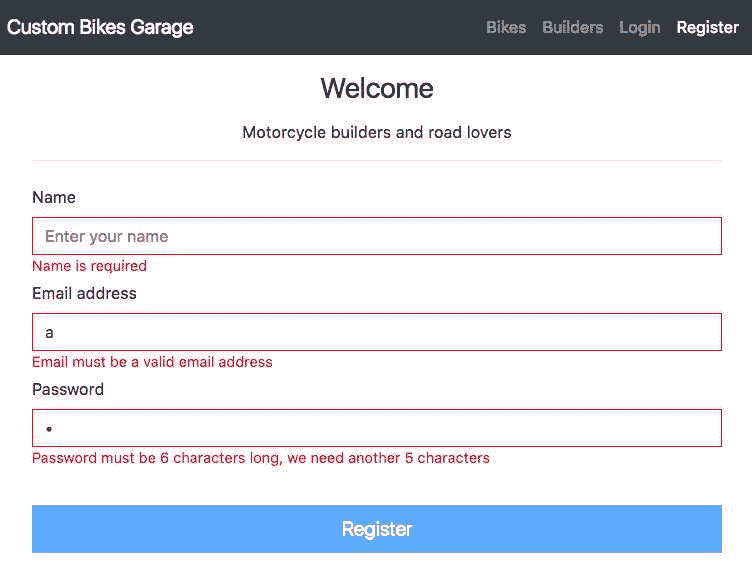

注册表单验证

在下一张截图中，我们可以看到后端错误，我们试图插入一个已经在使用的电子邮件地址:

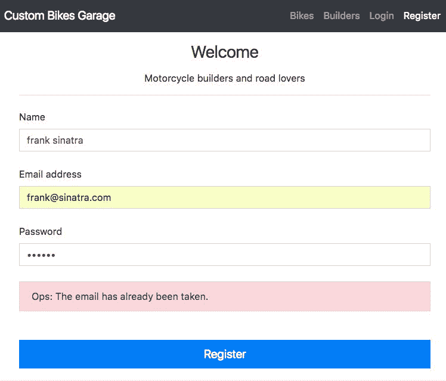

Backend error message

# 摘要

我们已经完成了另一章，我们的示例应用程序具有现代 web 应用程序的所有关键点。我们学习了如何安装、定制和扩展 Bootstrap CSS 框架，并学习了如何使用`NgBootstrap`组件。

我们还了解了如何将组件和服务设置在一起、表单验证以及许多其他非常有用的技术。

在下一章中，我们将看到如何为 SCSS 和 TS 文件设置临帖，以及如何使用 Docker 映像进行部署。***