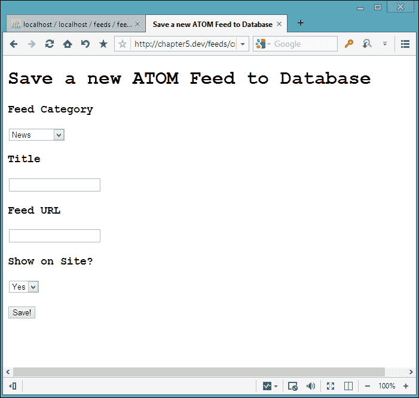
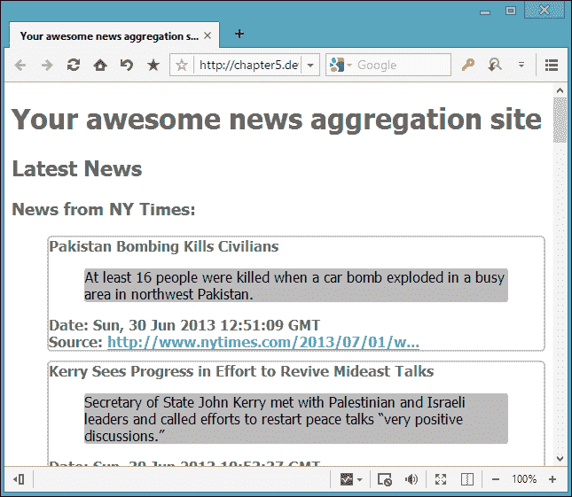

# 第五章。构建新闻聚合网站

在本章中，我们将创建一个新闻聚合网站。我们将解析多个提要，对它们进行分类，为我们的网站激活/停用它们，并使用 PHP 的 SimpleXML 扩展在我们的网站上显示它们。本章将涵盖以下主题:

*   创建数据库并迁移提要表
*   创建订阅源模型
*   创建我们的表单
*   验证和处理表单
*   扩展核心类
*   读取和解析外部提要

# 创建数据库并迁移提要表

成功安装 Laravel 4 并从`app/config/database.php`定义数据库凭证后，创建一个名为`feeds`的数据库。

创建数据库后，打开终端，导航到项目文件夹，运行以下命令:

```php
php artisan migrate:make create_feeds_table --table=feeds --create

```

该命令将为我们生成一个名为`feeds`的新数据库迁移。现在导航到`app/database/migrations`，打开前面命令刚刚创建的迁移文件，并按如下方式更改其内容:

```php
<?php
use Illuminate\Database\Schema\Blueprint;
use Illuminate\Database\Migrations\Migration;

class CreateFeedsTable extends Migration {

  /**
   * Run the migrations.
   *
   * @return void
   */
  public function up()
  {
    Schema::create('feeds', function(Blueprint $table)
    {
      $table->increments('id');
      $table->enum('active', array('0', '1'));
      $table->string('title,100)->default('');
      $table->enum('category', array('News', 'Sports','Technology'));
      $table->string('feed',1000)->default('');
      $table->timestamps();
    });
  }

  /**
   * Reverse the migrations.
   *
   * @return void
   */
  public function down()
  {
    Schema::drop('feeds');
  }

}
```

我们有`title`栏目在网站上展示标题，更方便用户。另外，我们设置了一个名为`active`的键，因为我们想要启用/禁用提要；我们用 Laravel 的新`enum()`方法设置它，这是 Laravel 4 的特色。我们还设置了一个`category`列，该列也是用`enum()`方法设置的，用于分组提要。

保存文件后，运行以下命令执行迁移:

```php
php artisan migrate

```

如果没有错误发生，您就可以开始项目的下一步了。

# 创建提要模型

正如所知，对于任何与 Laravel 上的数据库操作相关的事情，使用模型是最好的做法。我们将受益于雄辩的 ORM。

将该文件保存为`app/models/`下的`feeds.php`:

```php
<?php
Class Feeds Extends Eloquent{
    protected $table = 'feeds';
    protected $fillable = array('feed', 'title', 'active','category');
}
```

我们用值设置表名和可填充列。现在我们的模型已经准备好了，我们可以进行下一步，开始创建我们的控制器和表单。

# 创造我们的形态

现在我们应该创建一个表单，将记录保存到数据库中，并指定其属性。

1.  First, open your terminal and enter the following command:

    ```php
    php artisan controller:make FeedsController

    ```

    该命令将在`app/controllers`文件夹中为您生成一个带有一些空白方法的`FeedsController.php`文件。

    ### 注

    控制器中由`artisan`命令自动填充的默认方法不是 RESTful。

2.  Now, open `app/routes.php` and add the following lines:

    ```php
    //We defined a RESTful controller and all its via route directly
    Route::controller('feeds', 'FeedsController');

    ```

    我们可以用一行代码定义控制器上声明的所有动作，而不是逐个定义所有动作。如果您的方法名可以直接用作 get 或 post 动作，使用`controller()`方法可以节省您大量的时间。第一个参数设置控制器的 URI，第二个参数定义将访问和定义`controllers`文件夹中的哪个类。

    ### 注

    以这种方式设置的控制器是自动 RESTful。

3.  Now, let's create the form's method. Add these lines of code into your controller file:

    ```php
      //The method to show the form to add a new feed
      public function getCreate() {
        //We load a view directly and return it to be served
        return View::make('create_feed');
          }
    ```

    这里的流程相当简单；我们将该方法命名为`getCreate()`，因为我们希望我们的`create`方法是 RESTful。我们只是加载了一个视图文件，我们将在下一步中直接生成它。

4.  Now let's create our view file. Save this file as `create_feed.blade.php` under `app/views/`:

    ```php
    <!doctype html>
    <html lang="en">
    <head>
        <meta charset="UTF-8">
        <title>Save a new ATOM Feed to Database</title>
    </head>
    <body>
      <h1>Save a new ATOM Feed to Database</h1>
      @if(Session::has('message'))
        <h2>{{Session::get('message')}}</h2>
      @endif
        {{Form::open(array('url' => 'feeds/create', 'method' => 'post'))}}
        <h3>Feed Category</h3>
      {{Form::select('category',array('News'=>'News','Sports'=>'Sports','Technology'=>'Technology'),Input::old('category'))}}
      <h3>Title</h3>
        {{Form::text('title',Input::old('title'))}}
        <h3>Feed URL</h3>
        {{Form::text('feed',Input::old('feed'))}}

        <h3>Show on Site?</h3>
    {{Form::select('active',array('1'=>'Yes','2'=>'No'),Input::old('active'))}}
        {{Form::submit('Save!',array('style'=>'margin:20px 100% 0 0'))}}
        {{Form::close()}}
    </body>
    </html>
    ```

    前面的代码将生成一个简单的表单，如下所示:

    

# 验证和处理表单

在此部分，我们将验证提交的表格，并确保字段有效且必填字段已填写。然后我们将数据保存到数据库中。

1.  First, we need to define the form validation rules. We prefer adding validation rules to the related model, so the rules become reusable, and this prevents the code from becoming bloated. To do this, add the following code in `feeds.php` located at `app/models/` (the model that we generated earlier in this chapter), inside the class definition before the last `}`:

    ```php
    //Validation rules
    public static $form_rules = array(
      'feed'    => 'required|url|active_url',
      'title'  => 'required'
      'active'  => 'required|between:0,1',
      'category'  => 'required| in:News,Sports,Technology'
    );
    ```

    我们将变量设置为`public`，这样它就可以在模型文件本身之外使用，我们将它设置为`static`，这样我们就可以直接访问变量了。

    我们希望提要是一个 URL，我们希望使用`active_url`验证规则检查它是否是一个活动 URL，这取决于 PHP 的`chkdnsrr()`方法。

    我们的活动场只能得到两个值，`1`或`0`。因为我们用整数设置它，所以我们可以使用 Laravel 表单验证的`between`规则，并检查数字是否在`1`和`0`之间。

    我们的类别字段也有`enum`类型，它的值应该只有`News`、`Sports`或者`Technology`。要使用 Laravel 检查精确值，您可以使用验证规则`in`。

    ### 注

    并非所有的服务器配置都支持`chkdnsrr()`方法，所以请确保它安装在您的身边，否则您可能只依赖于在网址格式正确的情况下验证它。

2.  Now we need a controller post method to process the form. Add the following method to `app/controllers/FeedsController.php` before the last `}`:

    ```php
    //Processing the form
    public function postCreate(){

    //Let's first run the validation with all provided input
      $validation = Validator::make(Input::all(),Feeds::$form_rules);
      //If the validation passes, we add the values to the database and return to the form 
      if($validation->passes()) {
        //We try to insert a new row with Eloquent
        $create = Feeds::create(array(
          'feed'    => Input::get('feed'),
          'title'  => Input::get('title'),
          'active'  => Input::get('active'),
          'category'  => Input::get('category')
        ));

        //We return to the form with success or error message due to state of the 
        if($create) {
          return Redirect::to('feeds/create')
            ->with('message','The feed added to the database successfully!');
        } else {
          return Redirect::to('feeds/create')
            ->withInput()
            ->with('message','The feed could not be added, please try again later!');
        }
      } else {
        //If the validation does not pass, we return to the form with first error message as flash data
        return Redirect::to('feeds/create')
            ->withInput()
            ->with('message',$validation->errors()->first());

      }
    }
    ```

    让我们一个一个地去挖掘这个代码。首先，我们进行表单验证，并从我们通过`Feeds::$form_rules`生成的模型中调用我们的验证规则。

    之后，我们创建了一个`if()`语句，并用它将代码分成两部分。如果表单验证失败，我们使用`withInput()`特殊方法返回到旧输入的表单，并使用`with()`方法添加一个 flash 数据消息字段。

    如果表单验证通过，我们会尝试使用雄辩者的`create()`方法向数据库中添加一个新列，并根据`create`方法返回的内容返回成功或错误消息。

现在，我们需要为索引页面创建一个新视图，它将显示所有提要的最后五个条目。但在此之前，我们需要一个函数来解析 Atom 提要。为此，我们将在 Laravel 的`Str`类中扩展构建。

# 扩展核心类

Laravel 有很多内置的方法让我们的生活更轻松。但是和所有捆绑包一样，捆绑包本身在推出时可能不会让任何用户满意。因此，您可能希望使用自己的方法以及捆绑的方法。您总是可以创建新的类，但是如果您想要实现的一半已经内置了呢？例如，您想要添加一个表单元素，但是已经捆绑了一个`Form`类。在这种情况下，您可能希望用自己的方法扩展当前类，而不是创建新的方法来保持代码整洁。

在本节中，我们将使用名为`parse_atom()`的方法扩展`Str`类，我们将对其进行编码。

1.  首先，您必须找到类文件的位置。我们将扩展`vendor/laravel/framework/src/Illuminate/Support`下的`Str`类。注意，你也可以在`app/config/app.php`的别名键下找到这个类。
2.  现在在`app/folder`下创建一个名为`lib`的新文件夹。这个文件夹将保存我们的类扩展。因为`Str`类分组在文件夹`Support`下，所以建议你也在`lib`下新建一个名为`Support`的文件夹。
3.  Now create a new file named `Str.php` under `app/lib/Support`, which you've just created:

    ```php
    <?php namespace app\lib\Support;
    class Str extends \Illuminate\Support\Str {
        //Our shiny extended codes will come here
      }
    ```

    我们给了它一个命名空间，这样我们就可以很容易地访问它。不用像`\app\lib\Support\Str::trim()`那样使用(可以)，可以像`Str::trim()`那样直接使用。代码的其余部分解释了如何扩展库。我们提供了从`Illuminate`路径开始的类名，直接访问`Str`类。

4.  现在打开位于`app/config/`的`app.php`文件；注释掉下面一行:

    ```php
    'Str'             => 'Illuminate\Support\Str',
    ```

5.  Now, add the following line:

    ```php
    'Str'             => 'app\lib\Support\Str',
    ```

    这样，我们就把自动加载的`Str`类换成了我们的类，已经在扩展原来的类了。

6.  现在，为了使它在自动运行时可识别，打开你的`composer.json`文件，并将这些行添加到自动加载的`classmap`对象:

    ```php
    "app/lib",
    "app/lib/Support"
    ```

7.  Finally, run the following command in the terminal:

    ```php
    php composer.phar dump-autoload

    ```

    这将寻找依赖项并重新编译公共类。如果一切顺利，你现在将有一个延长的`Str`课程。

### 注

文件夹和类名区分大小写，即使在 Windows 服务器上也是如此。

# 读取和解析外部提要

我们的服务器上的提要网址和标题都已分类。现在我们所要做的就是解析它们并展示给最终用户。这需要遵循一些步骤:

1.  First, we need a method to parse external Atom feeds. Open your `Str.php` file located at `app/lib/Support/` and add this method into the class:

    ```php
    public static function parse_feed($url) {
        //First, we get our well-formatted external feed
        $feed = simplexml_load_file($url);
        //if cannot be found, or a parse/syntax error occurs, we return a blank array
        if(!count($feed)) {
          return array();
        } else {
          //If found, we return the newest five <item>s in the <channel>
          $out = array();
          $items = $feed->channel->item;
          for($i=0;$i<5;$i++) {
            $out[] = $items[$i];
          }
          //and we return the output
          return $out;
        }
      }
    ```

    首先，我们使用 SimpleXML 的内置方法`simplexml_load_file()`，在方法上加载 XML 提要。如果没有找到结果或者提要包含错误，我们将返回一个空数组。在 SimpleXML 中，所有对象及其子对象都完全像 XML 标签。所以如果有`<channel>`标签，就会有一个名为`channel`的物体，如果`<channel>`里面有`<item>`标签，那么每个`channel`物体下面都会有一个名为`item`的物体。所以如果你想访问频道里面的第一个项目，可以通过`$xml->channel->item[0]`来访问。

2.  现在我们需要一个视图来显示内容。首先，打开`app`下的`routes.php`，删除默认存在的`get`路线:

    ```php
    Route::get('/', array('as'=>'index', 'uses' =>'FeedsController@getIndex'));
    ```

3.  Now open `FeedsController.php` located at `app/controller/` and paste this code:

    ```php
    public function getIndex(){
      //First we get all the records that are active category by category:
        $news_raw   = Feeds::whereActive(1)->whereCategory('News')->get();
        $sports_raw  = Feeds::whereActive(1)->whereCategory('Sports')->get();
        $technology_raw = Feeds::whereActive(1)->whereCategory('Technology')->get();

      //Now we load our view file and send variables to the view
      return View::make('index')
        ->with('news',$news_raw)
        ->with('sports',$sports_raw)
        ->with('technology',$technology_raw);
      }
    ```

    在控制器中，我们一个接一个地获取提要的 URL，然后加载一个视图，并将它们一个接一个地设置为每个类别的独立变量。

4.  现在我们需要循环每个提要类别并显示其内容。将以下代码保存在`app/views/`下名为`index.blade.php`的文件中:

    ```php
    <!doctype html>
    <html lang="en">
    <head>
        <meta charset="UTF-8">
        <title>Your awesome news aggregation site</title>
        <style type="text/css">
        body { font-family: Tahoma, Arial, sans-serif; }
        h1, h2, h3, strong { color: #666; }
        blockquote{ background: #bbb; border-radius: 3px; }
        li { border: 2px solid #ccc; border-radius: 5px; list-style-type: none; margin-bottom: 10px }
        a { color: #1B9BE0; }
        </style>
    </head>
    <body>
       <h1>Your awesome news aggregation site</h1>
       <h2>Latest News</h2>
        @if(count($news))
            {{--We loop all news feed items --}}
            @foreach($news as $each)
                <h3>News from {{$each->title}}:</h3>
                <ul>
                {{-- for each feed item, we get and parse its feed elements --}}
                <?php $feeds = Str::parse_feed($each->feed); ?>
                @if(count($feeds))
                    {{-- In a loop, we show all feed elements one by one --}}
                    @foreach($feeds as $eachfeed)
                        <li>
                            <strong>{{$eachfeed->title}}</strong><br />
                            <blockquote>{{Str::limit(strip_tags($eachfeed->description),250)}}</blockquote>
                            <strong>Date: {{$eachfeed->pubDate}}</strong><br />
                            <strong>Source: {{HTML::link($eachfeed->link,Str::limit($eachfeed->link,35))}}</strong>

                        </li>
                    @endforeach
                @else
                    <li>No news found for {{$each->title}}.</li>
                @endif
                </ul>
            @endforeach
        @else
            <p>No News found :(</p>
        @endif

        <hr />

        <h2>Latest Sports News</h2>
        @if(count($sports))
            {{--We loop all news feed items --}}
            @foreach($sports as $each)
                <h3>Sports News from {{$each->title}}:</h3>
                <ul>
                {{-- for each feed item, we get and parse its feed elements --}}
                <?php $feeds = Str::parse_feed($each->feed); ?>
                @if(count($feeds))
                    {{-- In a loop, we show all feed elements one by one --}}
                    @foreach($feeds as $eachfeed)
                        <li>
                            <strong>{{$eachfeed->title}}</strong><br />
                            <blockquote>{{Str::limit(strip_tags($eachfeed->description),250)}}</blockquote>
                            <strong>Date: {{$eachfeed->pubDate}}</strong><br />
                            <strong>Source: {{HTML::link($eachfeed->link,Str::limit($eachfeed->link,35))}}</strong>
                        </li>
                    @endforeach
                @else
                    <li>No Sports News found for {{$each->title}}.</li>
                @endif
                </ul>
            @endforeach
        @else
            <p>No Sports News found :(</p>
        @endif

        <hr />

        <h2>Latest Technology News</h2>
        @if(count($technology))
           {{--We loop all news feed items --}}
            @foreach($technology as $each)
                <h3>Technology News from {{$each->title}}:</h3>
                <ul>
                {{-- for each feed item, we get and parse its feed elements --}}
                <?php $feeds = Str::parse_feed($each->feed); ?>
                @if(count($feeds))
                    {{-- In a loop, we show all feed elements one by one --}}
                    @foreach($feeds as $eachfeed)
                        <li>
                            <strong>{{$eachfeed->title}}</strong><br />
                            <blockquote>{{Str::limit(strip_tags($eachfeed->description),250)}}</blockquote>
                            <strong>Date: {{$eachfeed->pubDate}}</strong><br />
                            <strong>Source: {{HTML::link($eachfeed->link,Str::limit($eachfeed->link,35))}}</strong>
                        </li>
                    @endforeach
                @else
                    <li>No Technology News found for {{$each->title}}.</li>
                @endif
                </ul>
            @endforeach
        @else
            <p>No Technology News found :(</p>
        @endif

    </body>
    </html>
    ```

5.  We wrote the same code for each of the categories thrice. Also, between the `head` tags, a bit of styling is done, so the page will look prettier for the end user.

    我们用`<hr>`标签划分了每个类别的部分。除了源变量和分组之外，所有三个部分都使用相同的机制。

    我们首先检查每个类别是否存在记录(来自数据库的结果，因为我们可能还没有添加任何新闻源)。如果有结果，则使用 Blade 模板引擎的`@foreach()`方法循环每个记录。

    对于每条记录，我们首先显示提要的友好名称(我们之前在保存它们时定义的)，并用我们刚刚创建的`parse_feed()`方法解析提要。

    解析每个提要后，我们查看是否找到任何记录；如果是这样，我们再次循环它们。为了保持提要阅读器的整洁，我们使用 PHP 的`strip_tags()`函数修剪了所有的 HTML 标记，并使用 Laravel 的`Str`类的`limit()`方法将它们限制在最大 250 个字符以内(我们已经扩展了该方法)。

    单个提要的项目也有它们自己的标题、日期和来源链接，所以我们也在提要上显示了它们。为了防止链接破坏我们的界面，我们将文本限制在 35 个字符以内。

    完成所有编辑后，您应该会得到如下输出:

    

# 总结

在本章中，我们使用 Laravel 的内置函数和 PHP 的`SimpleXML`类创建了一个简单的提要阅读器。我们已经学会了如何扩展核心库，编写自己的方法，并在生产中使用它们。我们还学习了如何在查询数据库时过滤结果，以及如何创建记录。最后，我们学习了如何处理字符串、限制它们以及清理它们。在下一章中，我们将创建一个照片库系统。我们将确保上传的文件是照片。我们还会将照片分组到相册中，并将相册和照片与 Laravel 的内置关系方法相关联。