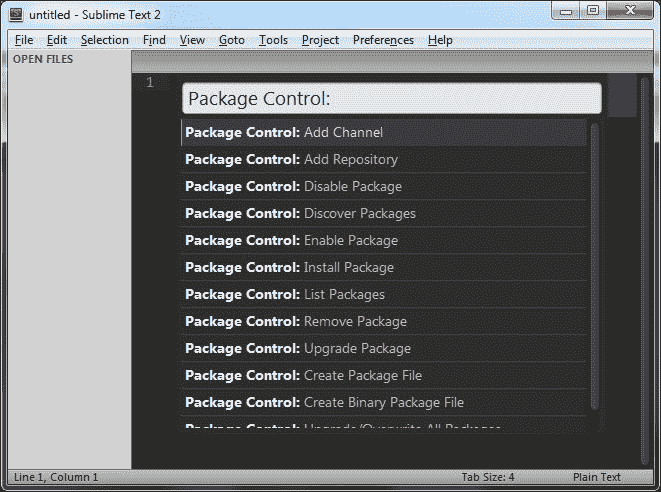
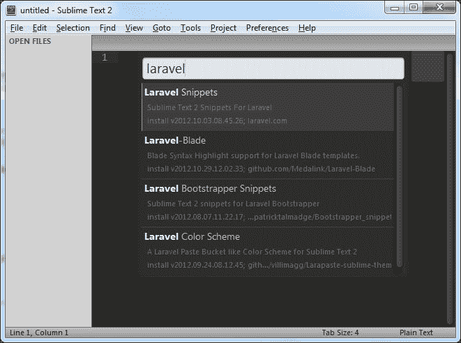
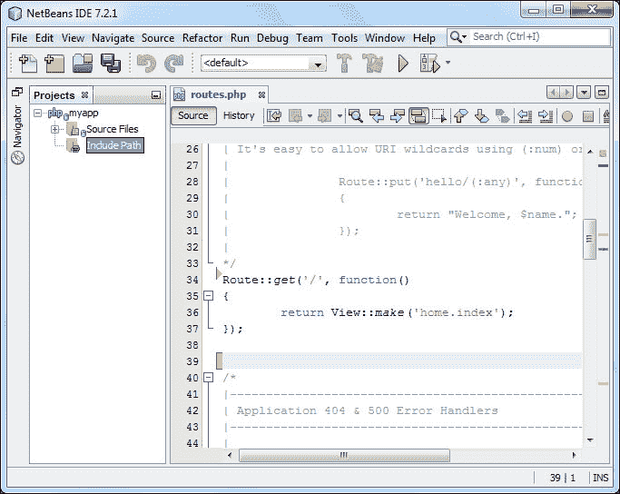

# 一、设置和安装 Laravel

在本章中，我们将介绍:

*   将 Laravel 安装为 git 子模块
*   在 Apache 中设置虚拟主机和开发环境
*   创建“干净”的网址
*   配置 Laravel
*   将 Laravel 用于崇高文本 2
*   设置您的 IDE 来自动完成 Laravel 的命名空间
*   使用自动加载器将类名映射到其文件
*   使用命名空间和目录创建高级自动加载器

# 简介

在这一章中，我们将学习如何轻松启动和运行 Laravel，并确保在进行任何核心更改时更新它很简单。我们还将把我们的开发和编码环境设置得非常高效，这样我们就可以专注于编写优秀的代码，而不必担心与我们的应用无关的问题。最后，我们将研究一些方法，让 Laravel 自动为我们做一些工作，这样我们就能够在很短的时间内扩展我们的应用。

# 将 Laravel 安装为 git 子模块

可能有一段时间我们希望将我们的 Laravel 安装与我们的其他公共文件分开。在这种情况下，将 Laravel 安装为 git 子模块将是一种解决方案。这将允许我们通过 git 更新我们的 Laravel 文件，而无需接触我们的应用代码。

## 做好准备

首先，我们应该运行我们的开发服务器并安装 git。在服务器的 web 目录中，创建一个`myapp`目录来保存我们的文件。安装将全部在命令行中完成。

## 怎么做...

要完成本食谱，请按照以下步骤操作:

1.  在您的终端或命令行中，导航至`myapp`的根目录。第一步是初始化 git 并下载我们的项目文件:

    ```php
    $ git init
    $ git clone git@github.com:laravel/laravel.git

    ```

2.  因为我们只需要`public`目录，移动到`/laravel`并删除其他所有内容:

    ```php
    $ cd laravel
    $ rm –r app bootstrap vendor

    ```

3.  然后，移回根目录，创建`framework`目录，添加 Laravel 作为子模块:

    ```php
    $ cd ..
    $ mkdir framework
    $ cd framework
    $ git init
    $ git submodule add https://github.com/laravel/laravel.git

    ```

4.  Now we need to run Composer to install the framework:

    ```php
    php composer.phar install

    ```

    ### 类型

    有关安装 Composer 的更多信息，请访问[http://getcomposer.org/doc/00-intro.md](http://getcomposer.org/doc/00-intro.md)。本书的其余部分将假设我们正在使用`composer.phar`，但是我们也可以全局添加它，并通过键入`composer`来简单地调用它。

5.  现在，打开`/laravel/public/index.php`找到以下几行:

    ```php
    require __DIR__.'/../bootstrap/autoload.php';
    $app = require_once __DIR__.'/../bootstrap/start.php';

    ```

6.  将前面几行改为:

    ```php
    require __DIR__.'/../../framework/laravel/bootstrap/autoload.php';
    $app = require_once __DIR__.'/../../framework/laravel/bootstrap/start.php';

    ```

## 它是如何工作的...

对许多人来说，仅仅运行“T1”就足以让“T2”的项目进行下去。然而，由于我们想让我们的框架作为一个子模块，我们需要将那些文件从我们的项目中分离出来。

首先，我们从 GitHub 下载文件，因为我们不需要任何框架文件，所以我们可以删除除了公共文件夹之外的所有文件。然后，我们在`framework`目录中创建我们的子模块，并在那里下载所有内容。完成后，我们运行`composer install`来安装所有的供应商软件包。

为了将框架连接到我们的应用，我们修改`/laravel/public/index.php`并将`require`路径更改为我们的框架目录。这将让我们的应用确切地知道框架文件的位置。

## 还有更多...

另一种解决方案是将`public`目录移动到我们服务器的根目录。然后，在更新我们的`index.php`文件时，我们将使用`__DIR__ . '/../framework/laravel/bootstrap'`来正确地包含所有内容。

# 在 Apache 中建立虚拟主机和开发环境

当开发我们的 Laravel 应用时，我们需要一个网络服务器来运行所有的东西。在 PHP 5.4 及更高版本中，我们可以使用内置的网络服务器，但是如果我们需要更多的功能，我们将需要一个完整的网络堆栈。在本食谱中，我们将在 Windows 上使用 Apache 服务器，但是任何使用 Apache 的操作系统都是相似的。

## 做好准备

这个食谱需要一个最新版本的 WAMP 服务器，可在[http://wampserver.com](http://wampserver.com)获得，尽管基本原理适用于 Windows 上的任何 Apache 配置。

## 怎么做...

要完成此配方，请遵循以下步骤:

1.  打开 WAMP 阿帕奇`httpd.conf`文件。它往往是位于`C:/wamp/bin/apache/Apach2.#.#/conf`。
2.  定位线`#Include conf/extra/httpd-vhosts.conf`并取下第一个`#`。
3.  移至`extra`目录，打开`httpd-vhosts.conf`文件，添加如下代码:

    ```php
    <VirtualHost *:80>
        ServerAdmin {your@email.com}
        DocumentRoot "C:/path/to/myapp/public"
        ServerName myapp.dev
        <Directory "C:/path/to/myapp/public">
            Options Indexes FollowSymLinks
            AllowOverride all
            # onlineoffline tag - don't remove
            Order Deny,Allow
            Deny from all
            Allow from 127.0.0.1
        </Directory>
    </VirtualHost>
    ```

4.  重新启动 Apache 服务。
5.  打开 Windows 主机文件，通常在`C:/Windows/System32/drivers/etc`中，在文本编辑器中打开文件`hosts`。
6.  在文件底部，添加一行`127.0.0.1 myapp.dev`。

## 它是如何工作的...

首先，在 Apache 配置文件`httpd.conf`中，我们取消对该行的注释，以允许该文件包含`vhosts`配置文件。您可以将代码直接包含在`httpd.conf`文件中，但是这种方法会使事情更有条理。

在`httpd-vhosts.conf`文件中，我们添加我们的 VirtualHost 代码。`DocumentRoot`告诉服务器文件的位置，`ServerName`是服务器将寻找的基本网址。因为我们只想将此用于本地开发，所以我们确保只允许使用 IP `127.0.0.1`访问本地主机。

在`hosts`文件中，我们需要告诉 Windows`myapp.dev`URL 使用哪个 IP。重启 Apache 和我们的浏览器后，我们应该可以到去`http://myapp.dev`查看我们的应用。

## 还有更多...

虽然这个方法是特定于 Windows 和 WAMP 的，但同样的想法可以应用于大多数 Apache 安装。唯一不同的是`httpd.conf`文件的位置(在 Linux Ubuntu 中，它在`/etc/apache2`中)和 DocumentRoot 的`public`目录的路径(在 Ubuntu 中，它可能类似于`/var/www/myapp/public`)。Linux 和 Mac OS X 的`hosts`文件将位于`/etc/hosts`中。

# 创建“干净”的网址

安装 Laravel 时，我们将使用的默认 URL 是`http://{your-server}/public`。如果我们决定删除`/public`，我们可以使用阿帕奇的`mod_rewrite`来更改网址。

## 做好准备

对于这个食谱，我们只需要一个全新的 Laravel 安装，一切都在一个正确配置的 Apache 服务器上运行。

## 怎么做...

要完成此配方，请遵循以下步骤:

1.  在我们应用的根目录中，添加一个`.htaccess`文件，并使用以下代码:

    ```php
    <IfModule mod_rewrite.c>
        RewriteEngine On
        RewriteRule ^(.*)$ public/$1 [L]
    </IfModule>
    ```

2.  转到`http://{your-server}`查看你的申请。

## 它是如何工作的...

这段简单的代码将接受我们在网址中添加的任何内容，并将其指向`public`目录。这样，我们就不需要手动输入`/public`。

## 还有更多...

如果我们决定将此应用移动到生产环境中，这不是完成任务的最佳方式。在这种情况下，我们只需将文件移到 web 根目录之外，并使`/public`成为我们的根目录。

# 配置 Laravel

在安装了 Laravel 之后，就可以运行了，不需要太多的配置。不过有几个设置我们要确保更新。

## 做好准备

对于这个食谱，我们需要定期安装 Laravel。

## 怎么做...

要完成此配方，请遵循以下步骤:

1.  打开`/app/config/app.php`并更新这些行:

    ```php
    'url' => 'http://localhost/,
    'locale' => 'en',
    'key' => 'Seriously-ChooseANewKey',
    ```

2.  打开`app/config/database.php`选择你喜欢的数据库:

    ```php
    'default' => 'mysql',
    'connections' => array(
        'mysql' => array(
            'driver'    => 'mysql',
            'host'      => 'localhost',
            'database'  => 'database',
            'username'  => 'root',
            'password'  => '',
            'charset'   => 'utf8',
            'collation' => 'utf8_unicode_ci',
            'prefix'    => '',
            ),
        ),
    ```

3.  在命令行中，转到应用的根目录，确保`storage`文件夹可写:

    ```php
    chmod –R 777 app/storage

    ```

## 它是如何工作的...

大部分配置会发生在`/app/config/app.php`文件中。虽然设置网址不是必需的，并且 Laravel 不用设置就能很好地解决这个问题，但是尽我们所能从框架中移除任何工作总是好的。接下来，我们设置我们的位置。如果我们选择在我们的应用中提供**本地化** ，这个设置将是我们的默认设置。然后，我们设置应用密钥，因为最好不要保留默认值。

接下来，我们设置将要使用的数据库驱动程序。Laravel 自带四个开箱即用的驱动程序:mysql、sqlite、sqlsrv (MS SQL Server)和 pgsql (Postgres)。

最后，我们的`app/storage`目录将用于保存任何临时数据，如会话或缓存，如果我们选择的话。为了实现这一点，我们需要确保应用可以写入目录。

## 还有更多...

为了便于创建安全的应用密钥，请删除默认密钥并将其留空。然后，在命令行中，导航到应用根目录并键入:

```php
php artisan key:generate

```

这将创建一个唯一且安全的密钥，并自动将其保存在您的配置文件中。

# 将 Laravel 用于崇高文本 2

用于编码的最流行的文本编辑器之一是崇高文本。Sublime 有许多功能，使编码变得有趣，通过插件，我们可以添加特定于 Laravel 的功能来帮助我们的应用。

## 做好准备

崇高文本 2 是一个流行的代码编辑器，它具有很强的可扩展性，使得编写代码毫不费力。可从[【http://www.sublimetext.com/2】](http://www.sublimetext.com/2)下载评估版。

我们还需要在崇高中安装并启用包控制包，这可以在[http://wbond . net/崇高 _ packages/packages _ Control/installation](http://wbond.net/sublime_packages/package_control/installation)中找到。

## 怎么做...

对于此配方，请遵循以下步骤:

1.  In your menu bar, go to **Preferences** then **Package Control**:

    

2.  Choose **Install Package**:

    

3.  在中搜索`laravel`查看列表。选择 **Laravel 4 Snippets** 并让其安装。完成后，选择**拉威-刀锋**安装。

## 它是如何工作的...

崇高文本 2 中的 Laravel 片段极大地简化了公共代码的编写，它包含了我们应用开发所需的几乎所有内容。例如，创建路线时，只需开始键入`Route`，将弹出一个列表，允许我们选择想要的路线，然后该列表会自动完成我们需要的其余代码。


## 还有更多...

如果我们使用 Laravel 附带的刀片模板系统，安装 Laravel-Blade 包会很有帮助。它可以识别文件中的刀片代码，并将自动突出显示语法。

# 设置您的 IDE 来自动完成 Laravel 的名称空间

大多数**ide**(**集成开发环境**)都有某种形式的代码完成作为程序的一部分。为了让拉弗尔的名称空间自动完成，我们可能需要帮助它识别名称空间是什么。

## 做好准备

对于这个方法，我们将向 NetBeans IDE 添加名称空间，但是过程与其他方法类似。

## 怎么做...

按照以下步骤完成该配方:

1.  下载下面列出了 Laravel 名称空间的预制文件:[https://gist.github.com/barryvdh/5227822](https://gist.github.com/barryvdh/5227822)。
2.  Create a folder anywhere on your computer to hold this file. For our purposes, we'll add the file to `C:/ide_helper/ide_helper.php`:

    

3.  After creating a project with the Laravel framework, navigate to **File** | **Project Properties** | **PHP Include Path**:

    

4.  点击 **添加文件夹……**然后在`C:/ide_helper`添加文件夹。
5.  Now when we start typing the code, the IDE will automatically suggest code to complete:

    

## 它是如何工作的...

一些 ide需要帮助理解框架的语法。为了让 NetBeans 理解，我们下载了所有 Laravel 类和选项的列表。然后，当我们将其添加到包含路径时，NetBeans 会自动检查该文件，并向我们显示自动完成选项。

## 还有更多...

我们可以使用 Composer 自动下载和更新文档。有关安装说明，请访问[https://github.com/barryvdh/laravel-ide-helper](https://github.com/barryvdh/laravel-ide-helper)。

# 使用自动加载器将类名映射到其文件

使用 Laravel 的类加载器，我们可以很容易地在代码中包含任何定制类库，并使它们随时可用。

## 做好准备

对于这个食谱，我们需要设置一个标准的 Laravel 安装。

## 怎么做...

要完成此配方，请遵循以下步骤:

1.  在 Laravel `/app`目录中，创建一个名为`custom`的新目录，它将保存我们的自定义类。
2.  在`custom`目录中，创建一个名为`MyShapes.php`的文件，并添加这个简单的代码:

    ```php
    <?php
    class MyShapes {
        public function octagon() 
        {
            return 'I am an octagon';
        }
    }
    ```

3.  在`/app/start`目录下，打开`global.php`并更新`ClassLoader`，这样看起来就是:

    ```php
    ClassLoader::addDirectories(array(

        app_path().'/commands',
        app_path().'/controllers',
        app_path().'/models',
        app_path().'/database/seeds',
        app_path().'/custom',

    ));
    ```

4.  现在，我们可以在应用的任何部分使用该类。例如，如果我们创建一条路线:

    ```php
    Route::get('shape', function()
    {
        $shape = new MyShapes;
        return $shape->octagon();
    });
    ```

## 它是如何工作的...

大多数情况下，我们将使用 Composer 向我们的应用添加包和库。但是，有些库可能无法通过 Composer 获得，或者我们希望单独保留的自定义库。要做到这一点，我们需要奉献一个地方来存放我们的类库；在这种情况下，我们创建一个名为`custom`的目录，并将其放入我们的`app`目录中。

然后我们添加我们的类文件，确保类的名称和文件名相同。这可能是我们自己创建的类，也可能是我们需要使用的遗留类。

最后，我们将该目录添加到 Laravel 的 ClassLoader 中。完成后，我们将能够在应用的任何地方使用这些类。

## 另见

*   创建带有名称空间和目录的高级自动加载器方法

# 使用名称空间和目录创建高级自动加载器

如果我们想确保我们的自定义类不会与我们的应用中的任何其他类发生冲突，我们需要将它们添加到一个名称空间中。使用 PSR-0 标准和 Composer，我们可以轻松地将这些类自动加载到 Laravel 中。

## 做好准备

对于这个食谱，我们需要设置一个标准的 Laravel 安装。

## 怎么做...

要完成此配方，请遵循以下步骤:

1.  在`/app`目录里面，新建一个名为`custom`的目录，在`custom`里面，新建一个名为`Custom`的目录，在`Custom`里面，新建一个名为`Shapes`的目录。
2.  在`/app/custom/Custom/Shapes`目录中，创建一个名为`MyShapes.php`的文件，并添加此代码:

    ```php
    <?php namespace Custom\Shapes;

    class MyShapes {
        public function triangle() 
        {
            return 'I am a triangle';
        }
    }
    ```

3.  在应用的根目录下，打开`composer.json`文件，找到`autoload`部分。更新它，使它看起来像这样:

    ```php
    "autoload": {
        "classmap": [
        "app/commands",
            "app/controllers",
            "app/models",
            "app/database/migrations",
            "app/database/seeds",
            "app/tests/TestCase.php",
        ],
        "psr-0": {
            "Custom": "app/custom"
        }
    }
    ```

4.  打开命令行，在 Composer:

    ```php
    php composer.phar dump-autoload

    ```

    上运行`dump-autoload`
5.  现在我们可以通过使用它的名称空间来调用那个类。例如，如果我们创建一条路线:

    ```php
    Route::get('shape', function()
    {
        $shape = new Custom\Shapes\MyShapes;
        return $shape->triangle();
    });
    ```

## 它是如何工作的...

名称空间是对 PHP 的强大补充，它们允许我们的类被使用，而我们不必担心它们的类名会干扰其他类名。通过在 Laravel 中自动加载名称空间，我们可以创建一组复杂的类，而不必担心类名与其他名称空间冲突。

出于我们的目的，我们正在通过 composer 加载自定义类，以及自动加载的 PSR-0 标准。

## 还有更多...

为了进一步扩展命名空间类的使用，我们可以使用 **IoC** 将其绑定到我们的应用。更多信息可以在[http://laravel.com/docs/ioc](http://laravel.com/docs/ioc)的 Laravel 文档中找到。

## 另见

*   使用自动加载器将类名映射到其文件的方法