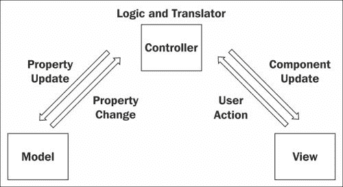

# 第四章。MVC 中的控制器

在本章中，我们将讨论什么是控制器，它的结构，它在 MVC 模式中的用途，以及它在 Laravel 的扩展设计模式和结构中的使用。

本章将讨论的主题如下:

*   什么是控制器？
*   MVC 设计模式中控制器的用途
*   控制器与 MVC 设计模式其他组件的交互
*   Laravel 如何在其设计模式中处理控制器

# 什么是控制器？

控制器是模型-视图-控制器(MVC)设计模式的一部分，我们可以简单地将其描述为应用的逻辑层。它理解来自另一端的请求(用户或应用编程接口请求)，调用相应的方法，执行主要检查，处理请求的逻辑，然后将数据返回到相应的视图或将最终用户重定向到另一条路由。

# 控制器的目的

以下是 MVC 结构中控制器的一些主要角色:

*   保存应用的逻辑，并定义在操作时应该触发哪个事件
*   作为模型、视图和应用的其他组件之间的中间步骤
*   翻译来自视图和模型的、他们可以理解的动作和响应，并将它们发送到其他层
*   在应用的其他组件之间搭建桥梁，并促进它们之间的通信
*   在任何操作之前，在构造方法中进行主要权限检查

这可以用一个真实的例子来最好地解释。

假设我们有一个用户管理网站，在管理面板中，一个管理员试图删除一个用户。在遵循 SOLID 原则的设计模式中，如果管理员单击删除用户按钮，会发生以下情况:

1.  从视图中，管理员向相应的控制器发送删除新闻项目的请求。
2.  控制器理解该请求并执行主要检查。首先，它检查请求者(在我们的例子中是管理员)是否真的是管理员，并且有删除该用户的权限。
3.  在主要检查之后，控制器告诉模型删除用户。
4.  模型自己执行一些检查，或者删除用户并告诉控制器该用户已被删除，或者告诉控制器该用户不可用(可能该用户已被删除)。
5.  在响应来自模型之后，控制器或者告诉视图告诉管理员用户被删除，或者重定向到另一个页面，响应类似于 404 未找到页面。

从前面的例子中可以看出，对于所有的交互，控制器承担着应用组件之间通信的主要角色。在遵循立体原则的 MVC 模式中，没有控制器，视图不能与模型交互，反之亦然。虽然这种架构模式有一些衍生，比如视图直接与模型交互，但是在一个完美的固体设计架构中，控制器应该始终是所有交互的中间元素。

控制员也可以被认为是翻译。它以各种方式从视图中获取输入，并将其转换为模型可以理解的请求，反之亦然。



# Laravel 中的控制器

在 Laravel 4 中，控制器是简单的 PHP 类，其文件名和类名以后缀`Controller`结尾(不是强制的，但强烈推荐；这是开发人员之间的标准)，它扩展了类`BaseController`，并默认存储在文件夹`app/controllers`中。这个文件夹结构是在`composer.json`文件的`classmap`键中定义的，不是强制的。多亏了 Composer，只要定义控制器在应用结构中的存储位置，就可以将它们放在任何喜欢的文件夹中。

以下是 Laravel 4 的一个非常简单的控制器:

```php
<?php

class UserController extends BaseController {

    public function showProfile($id)
    {
        $user = User::find($id);

        return View::make('user.profile', array('user' => $user));
    }

}
```

控制器保存`routes.php`中定义的动作的所有动作方法，其中所有动作(用户交互的每个链接)都在 Laravel 4 中设置。

在 Laravel 3 中，开发人员必须在方法前面加上`GET`或`POST`以便理解相应的请求类型。如果你的请求是一个`GET`请求，你的方法的名字必须是`get_profile`，如果请求是一个`POST`请求，它必须像`post_profile`一样。多亏了 Laravel 4，它现在不再是强制的了，你可以用任何你喜欢的方式命名你的方法。

现在出现了一个问题。我们如何访问控制器的这种方法？正如我们前面提到的，我们将使用路由来实现这一点。

## 路线

路由是在`app/routes.php`中定义的一组规则，在接收到传入的请求时，这些规则告诉 Laravel 基于所请求的 URL 正在调用哪些闭包函数和/或控制器方法。定义路线有多种方法。其中三个解释如下:

*   You can use closure functions and set the logic for the action directly from `app/routes.php` . Have a look at the following code:

    ```php
    Route::get('hello', function(){
       return 'Ahoy, everyone!';
    });
    ```

    在这里，我们已经调用了`get()`方法，因为我们希望这个路由是一个`GET`请求。第一个参数是动作的路径，所以如果我们调用`http://ourwebsite.com/hello`，就会调用这个路线动作。第二个参数可以来自各种选择。它可以是保存名称、过滤器和动作的数组，定义控制器动作方法的字符串，或者是直接保存逻辑的闭包函数。在我们的例子中，我们放置了一个闭包函数，并直接向最终用户返回了一个字符串。因此，如果用户导航到`http://ourwebsite.com/hello`，最终用户将看到消息**嗨，大家好！**直接。

*   The second way to set a route is to pass a second parameter as a string, define which Controller it is passed to, and the action to be called. Have a look at the following code:

    ```php
    Route::get('hello', 'ProfileController@hello'); 
    ```

    这里，字符串`ProfileController@hello`告诉 Laravel 方法`hello`将从名为`ProfileController`的控制器调用。我们用字符`@`将它们分开。

*   第三种方法是将数组设置为第二个参数，该参数获取各种键和值。看看下面的代码:

    ```php
    Route::get('hello', array(
       'before'   => 'member',
       'as'       => 'our_hello_page'
       'uses'     => 'ProfileController@hello'
    ));
    ```

数组可以有多个参数，这些参数定义了路线的名称、调用动作之前将应用的过滤器以及将使用哪个控制器及其方法。以下是三个不同的键:

*   `before`键在调用动作之前定义过滤，所以可以在调用每个动作之前设置一些过滤参数。例如，如果您有一个仅限成员的区域，并且不希望客人访问该资源，您可以通过在路线中使用`before`参数来通过过滤器。
*   `as`键定义路线的名称。这是相当有益的。假设您需要更改应用的 URL 结构。通常，如果您更改了路线的动作路径，您需要通过应用更改该动作的每个网址或重定向。相反，如果你用名字设置链接和重定向，你只需要改变一次路径，所有的链接和重定向都会被神奇地修复。
*   `uses`键的结构与我们的第二个例子完全相同。它保存控制器的名称及其调用时的方法。

在所有这些例子中，路由没有得到任何参数，我们也没有传递任何参数。这样想:我们已经通过使用路由访问了配置文件区域，但是在这些示例中，我们没有设置访问特定用户的方式。我们如何设置这些路线的参数？为此，我们必须在花括号中设置参数。

运行以下命令为路线设置参数:

```php
Route::get('users/{id}', function($id){
   return 'Hello, the user with ID of '.$id;
});
```

花括号中的参数直接成为闭包方法中的变量名。这种方法还为我们提供了一种在控制器的方法运行之前过滤这些参数的方法。使用`where()`，可以过滤这些参数。看看下面的代码:

```php
Route::get('users/{id}', function($id){
        return 'Hello, the user with ID of '.$id;
})->where(array('id' => '[0-9]+'));
```

方法`where()`要么是一个有键值的数组，要么是两个参数，其中第一个是花括号中的名字，第二个是过滤参数的正则表达式。

在我们的例子中，我们用正则表达式过滤了参数标识，只匹配数字，这样，我们将区分不同类型的数据来重载端点。

此外，这种方法还有另一个好处。如果一个人试图导航到`http://ourwebsite.com/users/xssSqlInjection`，Laravel 甚至会在进入控制器的方法之前抛出一个 404 错误。

如果我们遵循这个结构，我们需要为每个`GET`、`POST`、`PUT`和`DELETE`请求逐个设置每个动作。如果你想在你的动作中使用 RESTful 结构，而不是一个一个地设置每条路线，你可以使用`Route`类的`controller()`方法。

需要遵循某些步骤来设置 RESTful 控制器的路线。对于用户控制器，以下是步骤:

1.  您首先需要制作一个名为`UserController`的新控制器，并设置您的 RESTful 方法，如`index()`、`create()`、`store()`、`show($id)`、`edit($id)`、`update($id)`和`destroy($id)`。
2.  然后，您需要通过运行以下命令在`app/routes.php`中设置 RESTful 控制器:

    ```php
    Route::controller('users', 'UserController');
    ```

Laravel 提供了一种更快的方法来创建足智多谋的控制器。这些被拉弗尔称为资源控制器。按照以下步骤设置足智多谋控制器的路由:

1.  You first need to make a new Controller with Resourceful methods using Laravel's PHP client, `artisan` . Have a look at the following code:

    ```php
    php artisan controller:make NewsController
    ```

    使用该命令，在`app/controllers`文件夹中自动生成一个名为`NewsController.php`的新文件，其中已经定义了所有的资源方法。

2.  Then you need to set the Resourceful Controller in `app/routes.php` by running the following:

    ```php
    Route::resource('news', 'NewsController');
    ```

    在设置足智多谋控制器时，您可以通过为该`Route`定义设置第三个参数来设置要包括或排除的动作。

3.  要包含将在资源控制器中定义的操作(有点像白名单)，您可以使用`only`键，如下所示:

    ```php
    Route::resource(
       'news', 
       'NewsController',
       array('only' => array('index', 'show'))
    );
    ```

4.  要排除将在足智多谋的控制器(有点像黑名单)中定义的动作，您可以按如下方式使用`except`键:

    ```php
    Route::resource(
       'news', 
       'NewsController',
       array('except' => array('create', 'store', 'update', 'destroy'))
    );
    ```

5.  所有资源控制器操作都定义了路由名称。在某些情况下，您可能还想覆盖动作名称，这可以通过设置第三个参数`names`来实现，如下所示:

    ```php
    Route::resource(
       'news', 
       'NewsController',
       array('names' => array('create' => 'news.myCoolCreateAction')
    );
    ```

如果你已经浏览了上一章的，你可能还记得我们在路线中有过滤器，但是我们没有在 RESTful 和足智多谋的控制器中使用`before`键。要使用`before`键，我们可以执行之前遵循的步骤或在控制器中设置过滤器。这些可以在控制器的`__construct()`方法中设置(如果没有，创建一个)，如下所示:

```php
class NewsController extends BaseController {

    public function __construct()
    {

        $this->beforeFilter('csrf', array('on' => 'post'));

        $this->beforeFilter(function(){
           //my custom filter codes in closure function
        });

        $this->afterFilter('log', 
           array('only' => array('fooAction', 'barAction'))
        );
    }

}
```

如您所见，我们已经使用`beforeFilter()` 和 `afterFilter()`方法设置了过滤器。这些方法要么获取闭包函数，要么获取过滤器的名称作为第一个参数，要么获取可选的第二个参数作为数组，以定义这些过滤器的工作位置。

在本例中，我们首先将设置为 CSRF(跨站点请求伪造，这是一种方法，用于伪造可信请求，并通过该伪造请求向应用中注入恶意代码)保护过滤器，用于所有`POST`操作；之后，我们在闭包函数中定义了一个过滤器，并使用`afterFilter`方法记录所有`fooAction`和`barAction`事件的状态。

下表列出了 Laravel 的资源控制器处理的操作:

<colgroup><col> <col> <col> <col></colgroup> 
| 

动词

 | 

小路

 | 

行动

 | 

路线名称

 |
| --- | --- | --- | --- |
| `GET` | `/resource` | 索引 | `resource.index` |
| `GET` | `/resource/create` | 创造 | `resource.create` |
| `POST` | `/resource` | 商店 | `resource.store` |
| `GET` | `/resource/{resource}` | 显示 | `resource.show` |
| `GET` | `/resource/{resource}/edit` | 编辑 | `resource.edit` |
| `PUT` / `PATCH` | `/resource/{resource}` | 更新 | `resource.update` |
| `DELETE` | `/resource/{resource}` | 破坏 | `resource.destroy` |

# 在文件夹中使用控制器

在某些情况下，您可能希望将控制器分组到一个文件夹中，将它们放在一个更有层次的结构中。有两种方法可以实现这一点。

在解释这些方法之前，让我们假设在`app/controllers/admin`文件夹中有一个`UserController.php`文件，这是我们刚刚为与管理相关的控制器文件创建的。这里出现了一个问题:我们如何让 Laravel 和 Controller 文件都理解 Controller 在哪里？命名空间用于此类需求。命名空间是封装和分组项目的简单方法。

假设你有`app/controllers/UserController.php`和`app/controllers/admin/UserController.php`文件。我们怎么称呼一个具体的呢？名称空间在这里很有用。将以下文件保存为`app/controllers/admin/UserController.php`:

```php
<?php namespace admin; //The definition of namespace

use View; //What will be used

Class UserController Extends \BaseController {

   public function index() {
      return View::make('hello');
   }

}
```

现在我们定义路线如下:

```php
Route::get('my/admin/users/index', 'Admin\UserController@index');
```

在这里，我们为这个控制器添加了一些新的内容。它们如下:

*   第一个是`namespace admin;`。这仅仅定义了该文件位于名为`admin`的文件夹中。
*   第二个是`use View;`。如果我们的控制器在一个文件夹或一个定义的`namespace`下，除非我们导入它们，否则我们将要调用的所有类都将像`namespace\class`一样。如果我们不添加这一行，`View::make()`函数会抛出一个错误，说`Class admin\View not found`。为了更好地理解这一点，你可以把它想象成 HTML 的资产调用。让我们假设您正在浏览`admin/users.html`，并且其中有一个图像，其路径以这种格式定义:``。正如你可能想象的那样，图像将从`admin/img/img/avatar.png`请求，因为它位于名为`assets`的文件夹中。这是完全一样的情况。
*   当我们从`BaseController`类扩展时，我们添加了一个`\`(反斜杠)字符。这将意味着它将从根调用。如果我们没有将`use View;`添加到我们的类中并想让`View::make()`工作，我们应该将其修改为`\View::make()`(带有一个前导反斜杠)，以便请求正确的类。

如果有一个全新的文件夹结构，可以用两种方式定义。将每个文件夹路径添加到`composer.json`文件中的`autoload/classmap`对象中，或者定义一个`psr-0`自动加载。假设我们有一个新的`app/myApp`文件夹，里面有一个位于`app/myApp/controllers/admin/UserController.php`的控制器。

向控制器添加一个`classmap`对象，如下所示:

```php
"autoload": {
      "classmap": [
         "app/commands",
         "app/controllers",
          "app/models",
          "app/database/migrations",
          "app/database/seeds",
          "app/tests/TestCase.php",

          "app/myApp/controllers/admin",
      ]
}
```

现在给代码添加一个`psr-0`自动加载，如下所示:

```php
"autoload": {
      "classmap": [
         "app/commands",
         "app/controllers",
         "app/models",
         "app/database/migrations",
         "app/database/seeds",
         "app/tests/TestCase.php",

      ],

       "psr-0": {
         "myApp", "app/"
      }

}
```

然后从终端运行`composer dump-autoload`重新生成自动加载类。通过这个`psr-0`自动加载，我们已经教我们的 Composer 项目递归地自动加载`myApp`文件夹中的所有内容，该文件夹位于`app`文件夹中。另一种方法是用命名空间文件夹作为类名的前缀，并在每个文件夹之间使用`underscores (_)`。

假设我们有一个控制器`app/controllers/foo/bar/BazController.php`。将以下内容保存在该文件夹中:

```php
<?php

Class foo_bar_BazController extends BaseController {

   public function index() {
      return View::make('hello');
   }

}
```

现在我们定义路线如下:

```php
Route::get('foobarbaz', ' foo_bar_BazController@index');
```

然后，我们导航到`http://yourwebsite/foobarbaz`。即使没有命名空间或包含使用`use`的类，它也会自动工作。

# 总结

在本章中，我们学习了控制器在 MVC 模式中的角色，以及如何在 Laravel 4 中使用控制器和设置路由。我们还学习了过滤器、RESTful 和足智多谋控制器。

更多信息，可参考位于[http://laravel.com/docs/controllers](http://laravel.com/docs/controllers)的官方文档页面。在下一章中，我们将了解 Laravel 独特的设计模式，以及它如何使用仓库、立面和工厂模式。