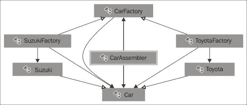

# 第五章。Laravel 中的设计模式

在本章中，我们将讨论 Laravel 使用的设计模式，以及如何和为什么使用它们，并给出例子。

本章将讨论的主题如下:

*   Laravel 中使用的设计模式
*   这些模式在 Laravel 中使用的原因

# 构建者(管理者)模式

这种设计模式旨在获得更简单、可重用的对象。其目标是将更大和更复杂的对象构建层与其他层分开，以便分离的层可以在应用程序的不同层中使用。

## 对构建者(管理者)模式的需求

在 Laravel 中，`AuthManager`类需要创建一些安全元素，以便与选定的授权存储驱动程序(如 cookie、会话或自定义元素)一起重用。为此，`AuthManager`类需要使用存储功能，如来自`Manager`类的`callCustomCreator()`和`getDrivers()`。

让我们看看构建器(管理器)模式是如何在 Laravel 中使用的。要查看这种模式下会发生什么，请导航至`vendor/Illuminate/Support/Manager.php`和`vendor/Illuminate/Auth/AuthManager.php`文件，如以下代码所示:

```php
   public function driver($driver = null)
   {
      ...

   }

   protected function createDriver($driver)
   {
      $method = 'create'.ucfirst($driver).'Driver';

      ...
   }

   protected function callCustomCreator($driver)
   {
      return $this->customCreators[$driver]($this->app);
   }

   public function extend($driver, Closure $callback)
   {
      $this->customCreators[$driver] = $callback;

      return $this;
   }
   public function getDrivers()
   {
      return $this->drivers;
   }

   public function __call($method, $parameters)
   {
      return call_user_func_array(array($this->driver(), $method), $parameters);
   }
```

现在，导航到`/vendor/Illuminate/Auth/AuthManager.php`文件，如下代码所示:

```php
   protected function createDriver($driver)
   {

      ....
   }

   protected function callCustomCreator($driver)
   {

   }

   public function createDatabaseDriver()
   {

   }

   protected function createDatabaseProvider()
   {

      ....
   }

   public function createEloquentDriver()
   {
      ...

   }

   protected function createEloquentProvider()
   {
      ...

   }

   public function getDefaultDriver()
   {
      ...
   }

   public function setDefaultDriver($name)
   {
      ...
   }
```

正如我们在前面的代码中看到的，类`AuthManager`从`Manager`类延伸而来。Laravel 附带一个基本的验证机制。因此，我们需要在数据库中存储身份验证凭据。首先，该类使用`AuthManager::setDefaultDriver()`函数检查我们的默认数据库配置。该函数实际上使用`Manager`类进行雄辩的操作。除了身份验证模型表名之外，所有数据库和身份验证选项(如 cookie 名称)都是从应用程序的配置文件中获得的。

为了更好地理解这个构建器(管理器)模式，我们可以以下面的演示为例:


在前面的示例图中，我们假设想要从前面的图中获取数据，例如披萨。客户点了两份披萨:一份亚洲披萨和/或一份中国披萨。这种比萨饼是通过`Waiter`课要求的。`PizzaBuilder`班(在我们这里是`Manager`班)按照`AuthRequest`的要求做了一个披萨，在我们这里是通过服务员送来的披萨。

此外，您可以导航到`vendor/Illuminate/Session/SessionManage.php`并在 Laravel 框架中检查该模式的使用。

# 工厂模式

在这一小节中，我们将检查工厂模式及其在 Laravel 框架中的使用。工厂模式基于创建模板方法对象，模板方法对象基于在子类中定义类的算法来实现算法。在这个模式结构中有一个子类，它是从一个大的超类中派生出来的。主类，我们可以称之为超类，只持有主逻辑和泛型逻辑；子类是从这个超类派生出来的。因此，可能会有不止一个子类从这个超类继承而来，它们针对不同的目的。

与 Laravel 中使用的其他设计模式不同，`Factory`方法更具可定制性。对于扩展子类加主类，不需要设置新的类，只需要一个新的操作。如果类或其组件通常会改变，或者方法需要被重写，这种方法非常有用，就像初始化一样。

在创建设计时，开发人员通常从在他们的应用程序中使用工厂模式开始。这样的模式被改变成抽象的工厂、构建器或原型模式。与工厂模式不同，原型模式需要初始化一次。由于模式的体系结构，工厂模式的方法(工厂方法)通常被称为内部模板方法。

工厂模式和抽象工厂或原型模式有一些区别。它们如下:

*   与抽象工厂模式不同，工厂模式不能使用原型模式来实现。
*   与原型模式不同，工厂模式不需要初始化，但是需要子类化。与其他模式相比，这是一个优势。由于这种方法，工厂模式可以返回一个注入的子类，而不是一个对象。
*   因为用工厂模式设计的类可以直接为其他组件返回子类，所以没有其他类或组件需要知道和访问构造函数方法。因此，建议所有构造函数方法和变量都应该是受保护的或私有的。
*   还有一件事需要考虑。由于此模式可能返回针对确切需求的子类，因此不建议使用 new 键使用此模式创建类的新实例。

## 工厂模式的需求

Laravel 在`Validation`类中附带了各种类型的验证规则。当我们开发应用程序时，我们通常需要验证数据。为此，一种常见的方法是在模型中设置验证规则，并从控制器中调用它们。这里的“规则”指的是验证类型及其范围。

有时，我们需要设置自定义规则和自定义错误消息来验证数据。让我们看看它是如何工作的，以及我们如何扩展`Validation`类来创建自定义规则。MVC 模式中的控制器也可以描述为模型和视图之间的桥梁。这可以用一个真实世界的例子来最好地解释。

假设我们有一个新闻聚合网站。在管理面板中，管理员尝试删除新闻项目。在 SOLID 设计模式中，如果管理员点击**删除新闻**按钮，就会出现这种情况。

首先，以为例进行检查，让我们打开`vendor/Illuminate/Validation/Factory.php`文件，如下代码所示:

```php
<?php namespace Illuminate\Validation;

use Closure;
use Illuminate\Container\Container;
use Symfony\Component\Translation\TranslatorInterface;

class Factory {

   protected $translator;

   protected $verifier;

   protected $container;

   protected $extensions = array();

   protected $implicitExtensions = array();

   protected $replacers = array();

   protected $fallbackMessages = array();

   protected $resolver;

   public function __construct(TranslatorInterface $translator, Container $container = null)
   {
      $this->container = $container;
      $this->translator = $translator;
   }

   public function make(array $data, array $rules, array $messages = array(), array $customAttributes = array())
   {

      $validator = $this->resolve($data, $rules, $messages, $customAttributes);

      if ( ! is_null($this->verifier))
      {
         $validator->setPresenceVerifier($this->verifier);
      }

      if ( ! is_null($this->container))
      {
         $validator->setContainer($this->container);
      }

      $this->addExtensions($validator);

      return $validator;
   }

      protected function addExtensions(Validator $validator)
   {
      $validator->addExtensions($this->extensions);

      $implicit = $this->implicitExtensions;

      $validator->addImplicitExtensions($implicit);

      $validator->addReplacers($this->replacers);

      $validator->setFallbackMessages($this->fallbackMessages);
   }

   protected function resolve(array $data, array $rules, array $messages, array $customAttributes)
   {
      if (is_null($this->resolver))
      {
         return new Validator($this->translator, $data, $rules, $messages, $customAttributes);
      }
      else
      {
         return call_user_func($this->resolver, $this->translator, $data, $rules, $messages, $customAttributes);
      }
   }

      public function extend($rule, $extension, $message = null)
   {
      $this->extensions[$rule] = $extension;

      if ($message) $this->fallbackMessages[snake_case($rule)] =  $message;
   }

   public function extendImplicit($rule, $extension, $message =  null)
   {
      $this->implicitExtensions[$rule] = $extension;

      if ($message) $this->fallbackMessages[snake_case($rule)] =  $message;
   }

   public function replacer($rule, $replacer)
   {
      $this->replacers[$rule] = $replacer;
   }

   public function resolver(Closure $resolver)
   {
      $this->resolver = $resolver;
   }

   public function getTranslator()
   {
      return $this->translator;
   }

   public function getPresenceVerifier()
   {
      return $this->verifier;
   }

   public function setPresenceVerifier(PresenceVerifierInterface $presenceVerifier
   {
      $this->verifier = $presenceVerifier;
   }

}
```

正如我们在前面的代码中看到的那样，`Validation Factory`类是用`Translator`类和一个 IoC 容器构建的。之后设置`addExtensions()`功能。这个方法包括对`Validator`实例的用户定义扩展，因此允许我们编写模板(结构)来创建`Validator`类的扩展。这些公共函数允许我们实现`Translator`类，这意味着它们允许我们编写定制的验证规则和消息。参考以下 **CarFactory** 图:



在上图中，你可以看到所有的汽车都是基于 **CarFactory** (所有汽车的基础)，而不考虑品牌。对于所有品牌来说，主要流程都是一样的(所有汽车都有发动机、轮胎、刹车、灯泡、齿轮等等)。你可能想要一辆**铃木**车或者一辆**丰田**车，根据这个选择，**铃木工厂**或者**丰田工厂**从**车厂**造出一辆**铃木**车或者一辆**丰田**车。

# 存储库模式

存储库模式通常用于在应用程序的两个不同的层之间创建接口。在我们的案例中，Laravel 的开发人员使用这种模式在`NamespaceItemResolver`(解析名称空间并理解哪个文件在哪个名称空间中的类)和`Loader`(需要另一个类并将其加载到应用程序中的类)之间创建了一个抽象层。`Loader`类只是加载给定命名空间的配置组。您可能知道，几乎所有的 Laravel 框架代码都是使用名称空间开发的。

## 对存储库模式的需求

让我们假设您正在使用雄辩的 ORM 从数据库中获取产品。该方法类似于控制器中的`Product::find(1)`。出于抽象的目的，这种方法并不理想。如果您现在放入这样的代码，您的控制器知道您使用的是雄辩，这在理想情况下不应该发生在一个好的抽象结构中。如果希望包含对数据库方案所做的更改，以便类外的调用不直接引用字段，而是通过存储库引用字段，则必须逐个挖掘所有代码。

现在，让我们为用户创建一个`imaginart`存储库接口(模式中将使用的方法列表)。姑且称之为`UserRepository.php`:

```php
<?php namespace Arda\Storage\User;

interface UserRepository {

   public function all();

   public function get();

   public function create($input);

   public function update($input);

   public function delete($input);

   public function find($id);

}
```

在这里，您可以看到模型中使用的所有方法的名称都是逐个声明的。现在，让我们创建存储库并将其命名为`EloquentUserRepository.php`:

```php
<?php namespace Arda\Storage\User;

use User;

class EloquentUserRepository implements UserRepository {

  public function all()
  {
    return User::all();
  }

  public function get()
  {
    return User::get();
  }

  public function create($input)
  {
    return User::create($input);
  }

  public function update($input)
  {
    return User::update($input);
  }

  public function delete($input)
  {
    return User::delete($input);
  }

  public function find($input)
  {
    return User::find($input);
  }

}
```

如您所见，这个存储库类实现了我们之前创建的我们的`UserRepository`。现在，您需要绑定这两者，这样当调用`UserRepositoryInterface`接口时，我们实际上获得了`EloquentUserRepository`。

这可以通过服务提供商或者通过一个简单的命令来完成，例如在 Laravel 中的以下命令:

```php
App:bind(
   'Arda\Storage\User\UserRepository',
   'Arda\Storage\User\EloquentUserRepository'
);
```

现在，在你的控制器中，你可以简单地使用存储库作为`Use Arda\Storage\User\UserRepository as User`。

每次控制器使用`User::find($id)`代码时，它首先进入接口，然后进入绑定的存储库，在我们的例子中是雄辩的存储库。通过这个，它到达雄辩的 ORM。这样，控制器就不可能知道数据是如何获取的。

# 战略模式

描述战略模式的最佳方法是通过一个问题。

## 战略模式的需求

在这个设计模式中，逻辑从复杂的类中被提取到更简单的组件中，这样它们就可以很容易地被更简单的方法替换。例如，您希望在网站上显示受欢迎的博客文章。在经典的方法中，您将计算流行度，进行分页，列出与当前分页偏移量和流行度相关的项目，并在一个简单的类中进行所有计算。这种模式旨在将每个算法分成独立的组件，以便它们可以在应用程序的其他部分轻松重用或组合。这种方法也带来了灵活性，使得在系统范围内改变算法变得容易。

为了更好地理解这一点，让我们来看看位于`vendor/Illuminate/Config/LoaderInterface`的以下加载器界面:

```php
<?php namespace Illuminate\Config;

interface LoaderInterface {

   public function load($environment, $group, $namespace = null);

   public function exists($group, $namespace = null);

    public function addNamespace($namespace, $hint);

   public function getNamespaces();

   public function cascadePackage($environment, $package, $group, $items);

}
```

当我们挖掘代码时，`LoaderInterface`作品会遵循一定的结构。`getNamespaces()`函数加载`app\config\app.php`文件中定义的所有名称空间。`addNamespace()`方法将名称空间分组后传递给`load()`函数。如果`exist()`函数返回`true`，则至少有一个配置组属于给定的名称空间。有关完整的结构，您可以参考本章的存储库部分。作为的结果，你可以通过`Loader`类的一个接口轻松调用你需要的方法来加载各种配置选项。如果我们通过 composer 下载一个包，或者将一个包实现到正在创作的应用程序中，模式会使所有包都可用，并从它们自己的名称空间加载它们，而没有任何冲突，尽管它们位于不同的名称空间中或者具有相同的文件名。

# 提供商模式

提供商模式由微软制定，用于 ASP.NET 初学者工具包，并在中正式化。NET 2.0 版([http://en.wikipedia.org/wiki/Provider_model](http://en.wikipedia.org/wiki/Provider_model))。它是应用编程接口类和应用程序的业务逻辑/数据抽象层之间的中间层。提供者是独立于应用编程接口本身的应用编程接口的实现。

这种模式、它的目标以及它的用法都与战略模式非常相似。这就是为什么许多开发人员已经在讨论是否接受这种方法作为设计模式。

为了更好地理解这些模式，让我们打开`vendor/Illuminate/Auth/AuthServiceProvider.php`和`vendor/Illuminate/Hashing/HashServiceProvider.php`:

```php
<?php namespace Illuminate\Auth;

use Illuminate\Support\ServiceProvider;

class AuthServiceProvider extends ServiceProvider {

   protected $defer = true;

   public function register()
   {
      $this->app->bindShared('auth', function($app)
      {
           // Once the authentication service has actually been requested by the developer
          // we will set a variable in the application indicating this, which helps us
          // to know that we need to set any queued cookies in the after event later.
         $app['auth.loaded'] = true;

          return new AuthManager($app);
      });
   }

   public function provides()
   {
      return array('auth');
   }

}

<?php namespace Illuminate\Hashing;

use Illuminate\Support\ServiceProvider;

class HashServiceProvider extends ServiceProvider {

   protected $defer = true;

   public function register()
   {
      $this->app->bindShared('hash', function() { return new BcryptHasher; });
   }

   public function provides()
   {
      return array('hash');
   }

}
```

正如你所看到的，两个类都扩展了`ServiceProvider`。`AuthServiceProvider`类允许我们在发送身份验证请求时向`AuthManager`提供所有服务，例如检查是否创建了 cookie 和会话，或者内容是否无效。请求认证服务后，开发人员可以通过`AuthDriver`定义是否通过响应设置会话或 cookie。

然而，`HashServiceProvider`在安全散列请求完成时为我们提供了相关的方法，以便我们可以使用、获取、检查或用这些散列做其他事情。两个提供程序都将值作为数组返回。

# 立面图案

Facade(外观)模式允许开发人员将各种复杂的接口合并成一个单一的类接口。这种模式还允许您将各种类中的各种方法包装到一个结构中。


在 Laravel 4 中，您可能已经知道，几乎每个方法看起来都像是静态方法，例如，`Input::has()`、`Config::get()`、`URL::route()`、`View::make()`和`HTML::style()`。然而，它们不是静态方法。如果它们是静态方法，那么很难对它们都进行测试。他们实际上是这种行为的模仿者。在后台，在 IoC 容器(一种将依赖注入类的方法)的帮助下，Laravel 实际上通过`Facade`类调用另一个类。Facade 基类得益于 PHP 自带的`__callStatic()`魔法方法调用所需的方法，比如静态方法。

例如，假设我们有一个名为`URL::to('home')`的方法。让我们检查一下网址是什么，它指的是什么。首先让我们打开`app/config/app.php`。在别名数组中，有一行如下所示:

```php
'URL' => 'Illuminate\Support\Facades\URL',
```

所以，如果我们叫`URL::to('home')`，我们实际上叫`Illuminate\Support\Facades \URL::to('home')`。

现在，让我们检查一下文件里面有什么。打开`vendor/Illuminate/Support/Facades/URL.php`文件:

```php
<?php namespace Illuminate\Support\Facades;

class URL extends Facade {

   protected static function getFacadeAccessor() { return 'url'; }

}
```

可以看到，类其实是从`Facade`类延伸出来的，没有一个静态的方法叫做`to()`。取而代之的是一种叫做`getFacadeAccessor()`的方法，它返回字符串`url`。`getFacadeAccessor()`方法的目的是定义注入什么。这样，Laravel 就明白这个班是在找`$app['url']`。

这在`vendor/Illuminate/Routing/RoutingServiceProvider.php`中定义如下:

```php
protected function registerUrlGenerator()
{
   $this->app['url'] = $this->app->share(function($app)
      {

      $routes = $app['router']->getRoutes();

      return new UrlGenerator($routes, $app->rebinding('request', function($app, $request)
      {
         $app['url']->setRequest($request);
      }));
   });
}
```

如您所见，它在同一个命名空间中返回了`UrlGenerator`类的新实例，该实例保存了我们正在寻找的`to()`方法:

```php
//Illuminate/Routing/UrlGenerator.php
public function to($path, $extra = array(), $secure = null)
{
   //...
}
```

所以每次使用这样的方法时，Laravel 首先去检查外观，然后检查通过什么注入，然后调用通过`injected`类的真正方法。

# 总结

在本章中，我们了解了在 Laravel PHP 框架中使用的各种设计模式，它们是如何以及为什么被使用的，以及它们可以解决什么问题。

在下一章中，我们将学习使用 Laravel 创建应用程序的最佳实践，在 Laravel 项目中使用代码中的设计模式。