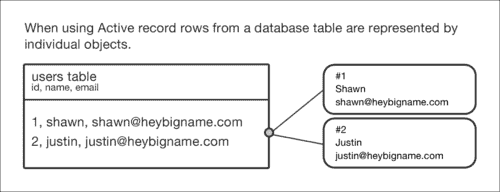
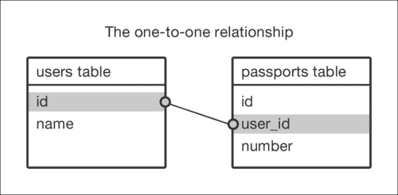
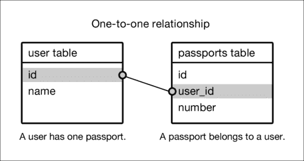
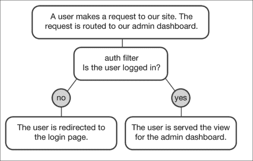

# 一、Laravel 即时入门

欢迎来到拉弗尔入门。这本书是专门为您提供开始使用 Laravel web 开发框架所需的所有信息而编写的。您将学习 Laravel 的基础知识，开始构建您的第一个网络应用，并发现一些使用 Laravel 的提示和技巧。

本指南包含以下部分:

*那么，什么是 Laravel？*–了解 Laravel 到底是什么，你能用它做什么，为什么它这么棒。

*安装*–本节将让您开始使用 Laravel 进行编程。我们将检查安装和基本配置，以便开始我们的应用！

*快速开始:创建您的第一个 web 应用*–让我们从制作自己的应用开始。在本节中，我们将开发一个基本的应用，它从表单接收输入，然后相应地更新数据库。

*您需要了解的关于*的前 5 个功能–在这里，我们将更深入地了解我们在*快速入门*部分中所介绍的内容。我们将了解更多关于雄辩、身份验证、过滤器、验证和捆绑包的信息。

*你应该了解的人和地方*-Laravel 社区是其最强大的教育资产之一。本部分为您提供了到项目页面和论坛的有用链接，以及大量有用的文章、教程、博客和 Laravel 超级贡献者的 Twitter 提要。

# 那么，什么是 Laravel？

Laravel 是一个用 PHP 编写的 MVC 网络开发框架。它旨在通过降低初始开发成本和持续维护成本来提高软件质量，并通过提供清晰的表达语法和一组核心功能来改善使用应用的体验，从而节省您数小时的实施时间。

Laravel 的设计理念是使用惯例而不是配置。这意味着它对你试图完成的事情做出了明智的假设，这样在大多数情况下，你将能够用更少的代码完成你的目标。并不是每一个您将要使用的应用和数据库都将使用这些约定来设计。谢天谢地，Laravel 足够灵活，可以与您的系统一起工作——不管它有多独特。

Laravel 的设计目标是极简主义和功能性之间的最佳结合点。更容易理解更小的代码库，Laravel 是关于以干净、简单和优雅的方式实现解决方案。长期的 PHP 开发人员会发现 Laravel 的许多方面都很熟悉，因为它是在它之前的 PHP 开发框架的演变。

Laravel 是少数几个提供真正代码模块化的 PHP 框架之一。这是通过驱动程序及其捆绑系统的组合来实现的。驱动程序允许您轻松更改和扩展缓存、会话、数据库和身份验证功能。使用捆绑包，您可以打包任何类型的代码供自己重用，或者提供给 Laravel 社区的其他成员。这非常令人兴奋，因为任何可以用 Laravel 编写的东西都可以打包成一个包，从简单的库到整个网络应用。Laravel 捆绑包网站允许您浏览由社区构建的捆绑包，以及展示您自己的捆绑包。它是第三方库和子系统的宝贵资源，可以极大地简化 web 应用的开发。

Laravel 还提供了一套与数据库交互的尖端工具。数据库迁移使您能够以独立于平台的方式轻松设计和修改数据库。然后，可以针对 Laravel 支持的任何数据库类型(MySQL、PostgreSQL、MSSQL 和 SQLite)运行迁移，并且不会有任何兼容性问题。

Laravel 的 Fluent 查询生成器抽象出不同数据库类型之间的差异。使用它来构建和执行健壮的查询。

Laravel 的 ActiveRecord 实现叫做**雄辩**。以面向对象的方式与数据库交互是现代标准。有了雄辩，我们可以创建、检索、更新和删除数据库记录，而不需要编写一行 SQL。除此之外，雄辩提供了强大的关系管理，它甚至可以自动为您处理分页。

Laravel 还附带了一个名为 **Artisan** 的命令行界面工具。使用 Artisan，开发人员可以与他们的应用进行交互，从而触发运行迁移、运行单元测试和运行计划任务等操作。Artisan 也是完全可扩展的，因此您可以编写任何类型的功能。Laravel 易于管理的路由系统让你可以轻松管理你的网站的网址。通过使用内置的 HTML 帮助器，您可以在您的站点内创建链接，如果您更改网址，这些链接将自动更新，从而使维护您的站点变得更加容易。

Blade 模板引擎通过为内嵌 PHP 提供美观的替代品并包含强大的新功能来清理您的视图。

# 安装

通过五个简单的步骤，你可以安装 Laravel 并在你的系统上安装它。

## 步骤 1–我需要什么？

在安装 Laravel 之前，您需要检查是否具备所有必需的元素，如下所示:

*   Laravel 需要一个网络服务器环境，并且可以很容易地在 Apache、IIS 和 Nginx 中运行。Laravel 应该运行在任何支持 PHP 的服务器环境中。设置本地网络服务器进行开发最简单的方法是通过 Linux 上的包管理器安装带有 PHP5 的 XAMPP (Windows)、MAMP (Mac OSX)或 Apache。
*   Laravel 是用 PHP 脚本语言编写的。目前，Laravel v3.2.5 至少需要 PHP v5.3 才能运行。
*   Laravel 要求您安装了文件信息和加密库。方便的是，它们几乎总是默认安装的。
*   。对于我们的快速启动应用，我们需要一个数据库。开箱即用，Laravel 支持 MySQL、MSSQL、PostgreSQL 和 SQLite。

## 步骤 2–下载 Laravel

下载 Laravel 最简单的方法是从[http://laravel.com/download](http://laravel.com/download)下载压缩包。

或者，您可以使用以下命令从 GitHub.com 克隆其`git`存储库来下载 Laravel。

```php
git clone git@github.com:laravel/laravel.git

```

最好下载最新的稳定版本。

将压缩包的内容提取到存储 web 应用的目录中。典型位置包括`/Users/Shawn/Sites`、`c:\sites`和`/var/www/vhosts/`，具体取决于您的操作系统。

我们假设您的第一个 Laravel 安装在`c:\sites\myfirst\`中。

## 步骤 3–配置主机

让我们开始设置我们的网络服务器来托管我们的站点。我们需要为示例应用选择一个主机名。这是我们的第一个应用，我们正在开发本地开发环境，所以让我们使用`http://myfirst.dev?`。

在 Linux 和 OSX 中，只需将以下行添加到您的`/etc/hosts`文件中:

```php
127.0.0.1 myfirst.dev
```

Windows 用户应该将该行添加到他们的`c:\windows\system32\drivers\etc\hosts`文件中。

现在您应该能够 ping 通`myfirst.dev`并看到它解析为`127.0.0.1`。

## 步骤 4–设置您的虚拟主机

现在我们有了一个主机名，我们需要告诉我们的网络服务器在哪里可以找到 Laravel 安装。将以下`VirtualHost`配置添加到您的 Apache web 服务器配置中，并用您的 Laravel 安装的公共目录的路径替换`DocumentRoot`。

```php
<VirtualHost *:80>
  ServerName myfirst.dev
  DocumentRoot c:/sites/myfirst/public
</VirtualHost>
```

非常重要的一点是`DocumentRoot`指向 Laravel 的公共目录。这有多种安全原因。短暂的服务器错误配置可能会暴露安全信息，例如您的数据库密码。

## 步骤 5–重新启动网络服务器并进行测试

现在您已经安装了 Laravel 文件，添加了您的主机声明，并更新了您的 web 服务器配置，您可以开始了！重启你的网络服务器软件，在浏览器中进入`http://myfirst.dev`。你应该看看 Laravel 的闪屏！

## 就这样！

至此，您应该已经有了一个可以工作的 Laravel 安装，并且可以自由地四处游玩并发现更多关于它的信息。

# 快速开始:创建您的第一个网络应用

在本节中，我们将构建一个用户管理工具。用户管理员是 web 应用中最常见的组件之一。他们还使用了许多我们想用 Laravel 探索的重要系统，包括数据库交互、表单和路由。

我们将从数据库中存储和检索记录，所以现在是为这个应用创建数据库的好时机。将数据库名称、用户和密码放在手边。

我们开始吧。

## 步骤 1–数据库配置

有了我们的数据库名称、用户和密码，我们现在可以告诉 Laravel 如何连接到我们的数据库。

打开文件`application/config/database.php`扫描内容。您将找到每个数据库驱动程序的配置示例。从可用选项(`sqlite`、`mysql`、`pgsql`和`sqlserv`)中确定要使用的驱动程序，并输入驱动程序的名称作为默认数据库连接。

然后，在**连接**部分添加您的数据库名称、用户和密码。

好的。我们只是在我们想去的地方。让我们从创建用户表开始。

## 步骤 2–使用迁移创建用户表

您通常可以使用类似 phpMyAdmin 或 Navicat 的工具来创建用户表。但是，Laravel 为我们提供了一个漂亮的迁移系统，我们应该使用它，因为它改进了我们的工作流程，减少了部署错误。

**迁移**是对模式修改的版本控制。迁移通过要求我们只定义一次模式变更，减少了我们面临的麻烦。之后，我们可以将我们的更改部署到任意数量的系统，而不会出现人为错误。

### 注

迁移对于您与其他人合作的项目尤其有用。像使用源代码管理一样，迁移总是一个好主意。

不熟悉迁移的开发人员可能认为迁移是不必要的，或者认为迁移一开始会增加太多额外的工作。但是，坚持下去，它们的价值会很快显现出来。

让我们从用 Laravel 的命令行工具 Artisan 创建我们的迁移模板开始。

为了使用 Artisan，我们需要将包含 PHP 二进制文件的目录添加到我们的`PATH`环境变量中。这让我们可以从任何地方执行 PHP 二进制文件，因为系统知道在哪里可以找到它。您可以通过从命令行终端运行以下命令来测试这一点:

```php
# php -v 

```

您应该会看到一个很好的读数，告诉您正在运行哪个版本的 PHP。

如果你发现你的命令行界面不知道 PHP 二进制文件在哪里，你需要更新你的系统`PATH`。您可以使用以下命令行在 OS X 和 Linux 上修改您的`PATH`变量:

```php
# export PATH=/path/to/php/binary:$PATH

```

Windows 用户需要从开始菜单中右键单击**计算机**，然后单击**属性**。点击**高级系统设置**，然后点击**环境变量**。在这里你可以找到系统变量`PATH`并添加包含你的 PHP 二进制文件的目录。

既然 PHP 二进制文件在我们的路径中，让我们导航到我们的`project`文件夹。现在我们可以继续安装我们的迁移数据库表了。执行以下命令:

```php
# php artisan migrate:install

```

您应该会看到消息，**迁移表创建成功**。如果出现错误，请验证数据库连接信息是否正确。

接下来，让我们在`application/migrations`文件夹中创建一个新的迁移模板。

```php
# php artisan migrate:makecreate_users_table

```

迁移文件采用年、月、日、时以及您添加的文本进行格式化，使其能够被人类识别，在本例中为`create_users_table`。我的看起来像`2012_08_16_112327_create_users_table.php`。文件名的结构很重要，因为它有助于 Laravel 理解它应该运行迁移的顺序。通过使用命名迁移的约定，您将帮助您的团队更好地理解您的工作(反之亦然)。一个范例惯例可能包括像`create_users_table`、`add_fields_to_users_table`或`rename_blog_posts_table_to_posts`这样的条目。

迁移文件包含一个单一的类，该类具有我们之前输入的人类可读的名称。类有两种方法，`up()`和`down()`。

运行迁移时，Laravel 逐个读入每个迁移文件，并运行其`up()`方法。如果您觉得出现了错误，可以回滚迁移。回滚更改时，Laravel 运行`down()`方法。`up()`方法用于对数据库进行所需的更改。`down()`方法是恢复您的更改。

让我们继续看看我们的`create_users_table migration`应该是什么样子:

```php
classCreate_Users_Table
{

  /**
  * Make changes to the database.
  *
  * @return void
  */
  public function up()
  {
    Schema::table('users', function($table)
    {
      $table->create();

      $table->increments('id');

      $table->string('email');
      $table->string('real_name');
      $table->string('password');

      $table->timestamps();
    });
  }

  /**
  * Revert the changes to the database.
  *
  * @return void
  */
  public function down()
  {
    Schema::drop('users');
  }

}
```

我们先来讨论一下我们的`up()`方法。我们的目标是创建`users`表并定义其中的字段。为了实现这个目标，我们将使用拉弗尔`Schema`类。创建或修改表格时，我们使用`Schema`类的`table()`方法。

`Schema::table()`接受两个论点。第一个是您将与之交互的表的名称，在本例中是`users`。第二个参数是包含表定义的闭包。闭包接受参数`$table`，这是我们将与之交互以定义表的对象。

```php
$table->create();
```

这一行告诉 Laravel 需要创建该表。如果我们省略这一行，`Schema`将生成`ALTER TABLE`语法，而不是`CREATE TABLE`语法。

```php
$table->increments('id');
```

`increments()`方法告诉`Schema`指定的字段应该是自动递增的主键。使用 Laravel，您会希望使用简单的字段名称，如`id`、`email`和`password`。如果您不熟悉使用**对象关系映射** ( **ORM** )，您可能习惯于创建那些以表名作为前缀的相同字段名称。例如:`user_id`、`user_email`、`user_password`。使用表名作为前缀定义字段名的目的是在使用查询生成器时简化查询生成。这不再是必要的，最好遵循更简单的约定，因为它为您管理冗余的交互，消除了您连续编写样板代码的需要。

```php
$table->string('email');
$table->string('real_name');
$table->string('password');
```

接下来我们有几个字符串声明。这些将被创建为默认长度为`200`的`VARCHAR`字段。您可以通过传递表示预期长度的第二个参数来重写这些字段的长度。例如:

```php
$table->string('email', 300);
```

这条线创建了一个名为`email`的`VARCHAR`字段，长度为`300`。

### 注

重要的是要注意，我们不应该减少`password`字段的大小，因为我们需要从 Laravel 的`Hash`类输出的长度。

```php
$table->timestamps();
```

最后，我们来到`timestamps()`法。这将创建两个`DATETIME`字段(`created_at`和`updated_at`)。为数据库中的每个表创建`timestamp`字段并不是没有道理的，因为它们对以后的故障排除非常有用。雄辩的 ORM 将自动为我们管理这些`timestamp`字段。所以，我们可以暂时忘掉他们。

`down()`方法应恢复对`up()`方法所做的任何更改。在这种情况下，`up()`方法创建一个名为用户的数据库表。所以，`down()`法应该去掉表。

```php
Schema::drop('users');
```

这是通过`Schema::drop()`方法完成的。`drop()`接受一个参数，一个包含要删除的表的名称的字符串值。

就这样！我们有了第一次移民。一旦你记住了常用的方法，如`increments()`、`string()`、`decimal()`、`timestamps()`和`date()`，你就能像用你喜欢的数据库管理工具修改数据库一样快速地进行迁移。但是，现在我们在版本化和协作的情况下使用它们获得了额外的好处。

现在，我们已经准备好运行我们的迁移。从这一点开始，运行迁移将始终以相同的方式进行。让我们继续尝试一下:

```php
# php artisan migrate

```

现在，我们应该看到消息，**Migrated:2012 _ 08 _ 16 _ 112327 _ create _ users _ table**。

测试我们的迁移非常重要。如果我们不测试我们的迁移，当我们需要回滚迁移并遇到错误时，它可能会在项目的后期反噬我们。适当的迁移测试验证了`up()`和`down()`方法都按预期运行。

要测试`up()`方法，请运行迁移并打开您首选的数据库管理应用。然后，确认一切都如你所愿。然后，通过回滚迁移并执行同样的操作来测试`down()`方法。使用以下命令立即回滚您的迁移:

```php
# php artisan migrate:rollback

```

最佳情况下，您会收到迁移已成功回滚的通知。再次检查您的数据库不再包含`users`表。就这样！这次迁移很好。最后一次运行您的迁移，让我们继续下一步。

```php
# php artisan migrate

```

## 步骤 3–创建一个有说服力的用户模型

现在我们已经创建了我们的`users`表，我们应该继续创建我们的用户模型。在 MVC 的上下文中，模型是表示各种类型的数据交互的类。数据可以包括存储在数据库中的信息，如用户、博客文章以及与许多其他类型数据源(如文件、表单或网络服务)的评论或交互。为了本文的目的，我们将主要使用模型来表示存储在数据库中的数据。

模特坐在`application/models`文件夹里。因此，继续使用以下代码创建文件`application/models/user.php`:

```php
class User extends Eloquent
{

}
```

这就是我们所需要的！这告诉 Laravel，我们的用户模型表示用户表中的数据。等等！拉弗尔是怎么知道的？嗯，因为我们当然是遵循拉弗尔的惯例！我们的数据库表`users`是复数，因为它表示它存储了多个用户记录。模型类被命名为`User`单数，因为它代表`users`表中的一个用户记录。`User`类名大写是因为使用帕斯卡大小写作为类名的标准。如果你的数据库表被命名为`user_profiles`，你的模型的类名将是`UserProfile`。

我们可以看到使用约定如何防止我们不得不做出一堆配置。那么，如果我们必须使用不符合惯例的数据库表呢？没问题！我们可以手动定义表名。只需在`User`类中添加以下一行:

```php
public static $table = 'my_users_table';
```

仅此而已。现在，Laravel 知道在与这个模型交互时，应该使用名为`my_users_table`的表。必要时，可以用配置覆盖 Laravel 中的大多数约定。

有一件重要的事情我们应该添加到我们的用户模型中。我们存储了用户的电子邮件地址、真实姓名和密码。我们希望确保用户的密码不是以纯文本形式存储的。我们需要在他们的密码存储到数据库之前对其进行哈希运算。为此，我们将创建一个设置器。

**设置器**是截取属性赋值的方法。在这种情况下，我们将截取密码属性的赋值，对收到的值进行散列，然后将散列值存储在数据库中。

让我们看一些代码。

```php
class User extends Eloquent
{
  public function set_password($string)
  {
    $this->set_attribute('password', Hash::make($string));
  }
}
```

如您所见，声明设置器的惯例是在您想要截取其赋值的属性名称前加上`set_`。用户的密码将作为参数`$string`传递给设置者。

我们使用`set_attribute()`方法将用户密码的散列版本存储到模型中。通常`set_attribute()`方法不是必需的。但是，我们不希望我们的二传手陷入无休止的循环中，因为我们不断尝试分配`$this->password`。`set_attribute()`方法接受两个参数。第一个是属性的名称，第二个是我们想要分配给它的值。用`set_attribute()`赋值时，不调用 setter 方法，直接在模型内修改数据。

我们使用 Laravel 的`Hash`类中的`make()`方法来创建用户密码的加盐散列。

## 第 4 步–走向结束

在我们继续并测试我们的用户模型之前，我们需要了解一些关于 Laravel 中路由的事情。**路由**是将一个网址链接到应用中的一个函数的行为。在 Laravel，可以通过两种方式路由。您可以路由到闭包或控制器操作。由于我们稍后将更详细地讨论控制器，让我们先来看看如何路由到在`application/routes.php`中声明的 Laravel 中的 closuRoutes。这个文件将代表你的站点的 URL 和包含你的站点的应用逻辑的函数之间的连接。这非常方便，因为其他开发人员将能够进入您的项目并知道请求是如何路由的，只需查看这个文件。

下面是一个路由到闭包的简单示例:

```php
Route::get('test', function(){
  return "This is the test route.";
});
```

我们使用`Route::get()`方法来定义路线。`Route::get()`向路由注册一个闭包，该闭包专门响应指定 URI 的`GET`请求。要注册`POST`、`PUT`和`DELETE`请求的结束，您可以分别使用`Route::post()`、`Route::put()`和`Route::delete()`。这些方法对应于通常所说的 **HTTP 动词**。

通常，开发人员只与`GET`和`POST`请求交互。当用户点击链接或在地址栏输入网址时，他们就创建了一个`GET`请求。当用户提交表单时，他们通常会创建一个`POST`请求。

`Route::get()`方法的第一个参数是路由的 URI(域名后的网址部分)，第二个参数是包含所需应用逻辑的闭包。

让我们更新示例并测试路线。

### 注

请注意，我们不是使用 echo 输出字符串，而是返回它。这是因为无论您是路由到闭包还是路由到控制器操作，您都应该始终返回响应。这使得 Laravel 能够以健壮的方式处理许多情况。

现在继续导航至`http://myfirst.dev/test`。你会看到信息，**这是测试路线**。

## 步骤 5–创建有口才的用户

现在，让我们测试一下`User`模型，并在这个过程中学习一点关于雄辩的知识。在这个应用中，我们将以几种方式与`User`模型进行交互。我们想使用`Create`、`Retrieve`、`Update`和`Delete`方法进行用户记录。这些常用方法被称为 **CRUD 方法**。

雄辩通过消除为模型手动实现 CRUD 方法的需要简化了开发。如果你曾经在没有 ORM 的情况下设计过模型，你已经意识到仅仅这一点就可以在大型网站上为你节省很多时间。

现在，让我们探讨一下创建新用户记录的各种方法。我们将重新调整上一步的测试路线，以帮助我们了解雄辩。使用以下代码更新路线声明:

```php
Route::get('test', function()
{
  $user = new User;

  $user->email = "test@test.com";
  $user->real_name = "Test Account";
  $user->password = "test";

  $user->save();

  return "The test user has been saved to the database.";});
```

让我们回顾一下:

```php
$user = new User;
```

首先，我们创建我们的`User`模型的新实例，并将其存储在`$user`变量中:

```php
$user->email = "test@test.com";
$user->real_name = "Test Account";
$user->password = "test";
```

然后，我们在`User`模型中设置一些属性。这些属性直接对应于用户数据库表中的字段。

```php
$user->save();
```

接下来，我们告诉雄辩者，我们希望将这个模型的内容保存到数据库中。

```php
return "The test user has been saved to the database.";
```

最后，我们将这个字符串输出到浏览器，这样我们就知道一切都好了。

继续在浏览器中导航至`http://myfirst.dev/test`。您应该会看到用户已保存到数据库的确认消息。

现在，看看你的数据库的`users`表的内容。你会看到一个新的记录充满了我们的数据。请注意，`timestamps`字段已自动为您预填充。用雄辩创建新的数据库记录是那么容易！

## 步骤 6–用户控制器

现在是我们创建第一个控制器的时候了。您已经学习了如何路由到闭包，并且可以使用这个方法来创建整个 web 应用。那么，什么是控制器，我们为什么要使用它们？

控制器是包含与公共域相关的应用逻辑的方法的容器。一个领域仅仅是目的的分类。在我们的 web 应用的上下文中，我们将只负责管理用户数据。所以，我们的领域是`users`。我们的`users`控制器将包含控制我们的应用流的应用逻辑，并将我们的数据库数据提交给视图进行格式化。

因为控制器允许我们对逻辑进行分组，所以我们也可以将配置应用于控制器，这将影响其中的所有方法。我们将在后面探讨这个概念的更多内容。

让我们创建文件`application/controllers/users.php`并用控制器类的骨架填充它:

```php
<?php

class Users_Controller extends Base_Controller
{

  public function action_index()
  {
    return "Welcome to the users controller.";
  }

}
```

我们的`users`控制器是一个类，它的名字是从包含在里面的方法的域中构造的，并以`_Controller`作为后缀。由于该控制器的域是用户帐户，我们的控制器被命名为`Users_Controller`。`_Controller`后缀是必需的，因为它防止控制器类与系统中的其他类发生名称冲突。

### 注

适用时，控制器的域应该总是复数。

你会注意到我们的`Users_Controller`类扩展了 Laravel 的默认`Base_Controller`类。这是一个很好的实践，因为如果我们需要一些代码或配置来影响我们所有的控制器，我们可以编辑文件`application/controllers/base.php`并对`Base_Controller`类进行更改。每个扩展`Base_Controller`类的控制器都会受到影响。

您还会注意到，我们已经定义了一个名为`index`的控制器动作。控制器动作是控制器类中的一种方法，我们打算将其作为路线的目的地。您可以决定在控制器类中创建只能从该类中的其他方法调用的方法；这些不会是行动。

控制器动作以前缀`action_`命名。这是一个重要的区别，因为我们不希望用户能够访问控制器中不是动作的方法。

那么，既然我们有了这个控制器，我们如何从浏览器中访问`index`动作呢？目前，我们不能。我们没有将任何网址路由到该控制器操作。所以，我们开始吧。打开`application/routes.php`并添加以下行:

```php
Route::controller('users');
```

如您所见，我们可以用一个命令向路由注册整个控制器。现在，我们可以通过`http://myfirst.dev/users/index`访问我们的`users`控制器的`index`动作。`index`动作也被认为是控制器的默认动作，因此我们也可以在`http://myfirst.dev/users`访问我们的`index`动作。

需要注意的是，虽然路由到闭包很方便，但路由到控制器通常被认为是更好的做法，原因有几个。在访问控制器的路由之前，它们不会被加载到内存中，这有助于减少应用的内存占用。它们还使维护变得更加容易，因为它非常清楚开发人员可以在哪里找到路线的代码。控制器是从基类派生的，所以在一个类中进行更改并通过继承使该更改影响其他类是很简单的。最后，因为控制器是按目的分组的动作，所以在每个控制器的基础上分配过滤器通常非常方便。我们将在*一节中详细讨论过滤器，您需要了解*的前 5 个特性。

## 步骤 7–创建用户索引视图

现在我们可以进入`http://myfirst.dev/users`并访问我们控制器的`index`方法。这很酷，但是我们的`users`控制器的`index`页面需要显示系统中的用户列表。要显示用户列表，我们需要创建一个视图。

一个**视图**是一个包含格式化数据(通常是 HTML)的文件。视图中使用 PHP 变量、条件和循环来显示和格式化动态内容。

Laravel 提供了自己的模板系统 **Blade** 。Blade 删除了 PHP 标签，并为常见任务提供了快捷方式，因此您的视图更加清晰，更易于创建和维护。

让我们从创建文件夹`application/views/users/`开始。该文件夹将存储我们的`users`控制器的所有视图。标准惯例是在`application/views`下为每个需要视图的控制器创建一个文件夹。然后，在`application/views/users/index.blade.php`创建视图文件。惯例是以使用视图文件的控制器动作命名视图文件。在这个例子中，我们使用的是 Blade。如果您不想使用刀锋，只需命名文件`index.php`。

让我们用下面的 HTML 来填充视图:

```php
<h1>Users</h1>

<ul>
  <li>Real Name - Email</li>
</ul>
```

不好看。但是，这很容易理解。

现在，我们将对`users`控制器的`index`动作进行修改:

```php
public function action_index()
{
  return View::make('users.index');
} 
```

现在，在我们之前返回字符串的地方，我们将返回一个视图对象。让我们仔细看看这里发生了什么。

`View`类的`make()`方法是一个工厂方法，用于生成视图对象。在这种情况下，我们通过论点`users.index`。这是 Laravel 引用视图文件的内部符号。符号由视图文件相对于`application/views`目录的路径组成，包括不带文件扩展名的文件名。例如，`application/views/users/index.php`会写成`users.index`，`application/views/admin/users/create.php`会写成`admin.users.create`。

### 注

需要注意的是，我们返回的是视图对象，而不是使用 echo 将视图的渲染内容发送到浏览器。这是 Laravel 工作方式的一个重要方面。我们永远不会在路由闭包或控制器动作中使用 echo。相反，我们将总是返回结果，并允许 Laravel 适当地处理事情。

现在，当我们转到`http://myfirst.dev/users`时，我们会看到我们刚刚创建的视图！

## 步骤 8–将数据从控制器传递到视图

事实上，我们可以去一个网址，看到我们创建的视图文件是非常酷的。但是，我们需要能够从我们的数据库中看到用户列表。为了实现这个目标，我们将首先从控制器动作中查询`User`模型，然后将该数据传递给视图。最后，我们将更新视图以显示从控制器接收的用户数据。

让我们从更新我们的`users`控制器的`index`动作开始:

```php
public function action_index()
{
  $users = User::all();

  return View::make('users.index')->with('users', $users);
}
```

让我们一行一行地看看这个:

```php
$users = User::all();
```

首先，我们请求所有用户作为来自雄辩者的对象。如果我们的`users`表中没有行，`$users`将是一个空数组。否则，`$users`将是一个对象数组。这些对象是我们的`User`类的实例。

```php
return View::make('users.index')->with('users', $users);
```

然后，我们稍微修改一下`View`对象的创建。我们链接了一个新方法`with()`。`with()`方法允许我们将数据从控制器传递到视图中。此方法接受两个参数。第一个参数是将在视图中创建的变量的名称。第二个参数是该变量的值。

概括地说，我们已经查询了所有用户的数据库，并将他们作为一组`User`对象传递给视图。由于`users`是`with()`方法的第一个参数，因此`User`对象的数组将作为变量`$users`出现在视图中。

## 步骤 9–将我们的动态内容添加到视图中

现在，我们的视图可以访问用户数据，让我们更新视图，以便我们可以真正看到这些用户。

```php
<h1>Users</h1>

@if($users)
  <ul>
    @foreach($users as $user)
      <li>{{ $user->real_name }} - {{ $user->email }}</li>
    @endforeach
  </ul>
@else
  Looks like we haven't added any users, yet!
@endif
```

Blade 很容易理解，并产生更加优雅的代码。`{{ }}`标记输出其中表达式的结果，并替换典型的回声命令。其他结构如`if()`、`foreach()`和`for()`也是一样的，但是没有 PHP 标签，前面有一个`@`。

### 注

Blade 不会导致显著的性能损失，因为它呈现给了一个原始的 PHP 缓存。仅当进行了更改时，才解析刀片模板。

同样重要的是要注意，您仍然可以在 Blade 模板中自由使用 PHP 标签。

如您所见，我们使用 if 语句来检查`$users`数组是否包含数据。如果是这样，我们在用户中循环，并为每个用户显示一个新的列表项。如果`$users`数组不包含任何数据，我们会输出一条这样的消息。

就这样！保存文件并在浏览器中点击 reload，您将看到我们创建的测试帐户。

### 注

这可能是一个玩超文本标记语言或者使用`test`路线添加新用户的好时机，我们通过这个路线来更好地了解一切是如何工作的。

## 步骤 10–RESTful 控制器

我们已经提到过，Laravel 的路由系统使您能够将`GET`、`POST`、`PUT`和`DELETE`请求路由到闭包。但是我们还没有讨论如何将它们单独路由到控制器动作。

答案是 RESTful 控制器！RESTful 控制器使您能够根据请求方法路由到不同的控制器操作。让我们配置我们的应用使用 RESTful 控制器。

由于我们所有的控制器类都是从`Base_Controller`类派生出来的，我们可以简单地将`$restful`配置添加到其中，我们所有的控制器都会受到影响。

将您的`Base_Controller`类更新为如下所示:

```php
classBase_Controller extends Controller{
  public $restful = true;

  /**
  * Catch-all method for requests that can't be matched.
  *
  * @param  string    $method
  * @param  array     $parameters
  * @return Response
  */
  public function __call($method, $parameters)
  {
    return Response::error('404');
  }

}
```

现在，每一个扩展`Base_Controller`(包括我们自己的`Users_Controller`)的控制器都是 RESTful 控制器！

但是等等。现在，当我们转到`http://myfirst.dev/users`时，我们会得到一个 404 错误。这是因为我们没有以 RESTful 的方式声明我们的行为。

编辑您的`Users_Controller`类并更改行:

```php
public function action_index()
```

对此:

```php
public function get_index()
```

你的`Users_Controller`类现在应该是这样的:

```php
classUsers_Controller extends Base_Controller
{

  public function get_index()
  {
    $users = User::all();

    return View::make('users.index')->with('users', $users);
  }

}
```

现在，当我们在浏览器中保存并重新加载页面时，它又开始工作了！我们添加到我们的`index`方法中的`get_ prefix`与我们之前使用的`action_`前缀有着相同的目的。

除非方法有适当的前缀，否则 Laravel 不会将 URL 路由到它们。通过这种方式，我们可以确保只有控制器动作是可路由的，并且我们的 web 应用的用户不能通过简单地在他们的浏览器中键入方法的名称来访问可能存在于我们的控制器中的其他方法。

当一个动作以`get_`为前缀时，它将只响应`GET`请求。前缀为`post_`的动作将只响应`POST`请求。`put_`和`delete_`也是如此。这为我们提供了更多的代码分离，并允许我们真正提高应用的可读性和可维护性。

## 步骤 11–创建用于添加用户的表单

是时候给我们网站的管理员创造用户的能力了。我们需要一个新的表格。让我们从创建文件`application/views/users/create.php`开始，并用以下形式的 HTML 填充它:

```php
<h1>Create a User</h1>

<form method="POST">
  Real Name: <input type="text" name="real_name"/><br />
  Email: <input type="text" name="email"/><br />
  Password: <input type="password" name="password" /><br />
  <input type="submit" value="Create User"/>
</form>
```

然后，让我们为它创建一个控制器动作。在我们的`Users_Controller`中，让我们添加以下动作。

```php
public function get_create()
{
  return View::make('users.create');
}
```

现在，我们可以去`http://myfirst.dev/users/create`看看我们的形态。再说一次，这并不漂亮，但有时简单是最好的。

## 步骤 12–将开机自检请求路由到控制器操作

当我们提交表单时，它会向我们的应用发出`POST`请求。我们还没有创建任何操作来处理`POST`请求，所以如果我们现在提交它，我们将会得到一个 404 错误。让我们继续在`Users_Controller`创造一个新的动作:

```php
public function post_create()
{
  return "The form has been posted here.";
}
```

请注意，该方法与我们用来显示创建用户表单的`get_create()`方法具有相同的操作名称。只有前缀不同。`get_create()`方法响应`GET`请求，而`post_create()`方法响应`POST`请求。在我们创建用户表单的情况下，`post_create()`方法接收表单提交的输入字段的内容。

继续提交创建用户表单，您将看到消息，**表单已发布在此处**。

## 步骤 13–接收表单输入并保存到数据库

现在我们从表单中接收到数据，我们可以继续创建用户帐户。

让我们更新`Users_Controller`类中的`post_create()`函数来添加这个功能:

```php
public function post_create()
{
  $user = new User;

  $user->real_name = Input::get('real_name');
  $user->email = Input::get('email');
  $user->password = Input::get('password');

  $user->save();

  return Redirect::to ('users');
}
```

这里，我们正在创建一个新的用户记录，就像我们在`test`路线中所做的一样。唯一不同的是，我们使用 Laravel 的`Input`类从表单中检索数据。无论数据来自`GET`请求的查询字符串还是`POST`请求的帖子数据，都可以使用`Input::get()`方法来检索数据。

我们用输入数据填充`User`对象。然后我们保存新用户。

```php
return Redirect::to('users');
```

这里有新东西。我们使用`Redirect`类返回一个`Response`对象，而不是返回一个字符串或一个`View`对象。路由闭包和控制器操作都应该返回响应。该响应可以是字符串或`Response`对象。当一个`View`对象被返回时，它将被渲染为一个字符串。`Redirect`类的`to()`方法特别告诉 Laravel 将用户重定向到其参数中指定的页面。在本例中，用户将被重定向至`http://myfirst.dev/users`。

我们在这里重定向用户，以便他们可以看到更新的用户列表，其中将包括他们刚刚创建的用户。去试试吧！

## 第 14 步–用 HTML 帮助器创建链接

我们需要一个从用户索引视图到创建用户表单的链接，因为它目前无法从用户界面访问。继续添加文件`application/views/users/ index.blade.php`的链接，代码如下:

```php
{{ HTML::link('users/create', 'Create a User') }}
```

Laravel 的`HTML`类可以用来创建各种各样的 HTML 标签。你可能会问自己为什么不自己简单地为链接编写 HTML。使用 Laravel 的 HTML 助手类的一个很好的理由是，它提供了一个统一的接口来创建可能需要动态改变的标签。让我们看一个例子来阐明这一点。

假设我们希望这个链接看起来像一个按钮，我们的设计师创建了一个名为`btn`的可爱的 CSS 类。我们需要更新对`HTML::link()`的调用，以包含新的类属性:

```php
{{ HTML::link('users/create', 'Create a User', array('class' => 'btn')) }}
```

实际上，我们可以将任意数量的属性包含到该类中，并且它们都会被适当地处理。分配给 HTML 元素的任何属性都可以通过将变量传递给该方法而不是内联声明来动态更新。

```php
<?php $create_link_attributes = array('class' => 'btn'); ?>

{{ HTML::link('users/create', 'Create a User', $create_link_attributes) }}
```

## 步骤 15–删除有说服力的用户记录

现在我们可以添加用户了，我们可能需要做一些清理。让我们给我们的`users`控制器添加一个删除动作。

```php
public function get_delete($user_id)
{
  $user = User::find($user_id);

  if(is_null($user))
  {
    return Redirect::to('users');
  }

  $user->delete();

  return Redirect::to('users');
}
```

现在，让我们一步一步来。

```php
public function get_delete($user_id)
```

这是我们第一次在控制器动作中声明参数。为了删除用户，我们需要知道要删除哪个用户。由于我们已经使用`Route::controller('users')`让 Laravel 自动为我们的控制器处理路由，它将知道，当我们转到 URL `http://myfirst.dev/users/delete/1`时，它应该路由到删除操作，并将额外的 URI 段作为参数传递给该方法。

如果您想从 URL 接收第二个参数(例如，`http://myfirst.dev/users/delete/happy`)，您可以向您的操作添加第二个参数，如下所示:

```php
public function get_delete($user_id, $emotion)
```

接下来，我们需要验证具有指定用户标识的用户是否确实存在。

```php
$user = User::find($user_id);
```

这一行告诉雄辩者找到一个与参数匹配的用户。如果找到用户，`$user`变量将填充一个对象，该对象是我们的`User`类的一个实例。否则，`$user`变量将包含空值。

```php
if(is_null($user))
{
  return Redirect::to('users');
}
```

这里，我们正在检查我们的用户变量是否有空值，表明没有找到请求的用户。如果是这样，我们将重定向回`users`索引。

```php
$user->delete();
return Redirect::to('users');
```

接下来，我们删除用户并重定向回`users`索引。

当然，直到我们更新`application/views/users/index.php`文件，给我们删除每个用户的链接，我们这里的工作才算完成。用以下内容替换列表项代码:

```php
<li>{{ $user->real_name }} - {{ $user->email }} - {{ HTML::link('users/delete/'.$user->id, 'Delete') }}</li>
```

重新加载`users`索引页面，您将看到删除链接。点击它，惊恐地发现我们已经不可挽回地从数据库中删除了数据。我希望这不是什么重要的事情！

## 步骤 16–用雄辩更新用户

所以，我们可以添加和删除用户，但是如果我们打了一个错别字并想修复它呢？让我们更新我们的`users`控制器，使用显示我们的更新表单，然后从中检索数据以更新用户记录所必需的方法:

```php
public function get_update($user_id)
{
  $user = User::find($user_id);

  if(is_null($user))
  {
    return Redirect::to('users');
  }

  return View::make('users.update')->with('user', $user);
}
```

这里我们有了新的`get_update()`方法。此方法接受用户标识作为参数。就像我们使用`get_delete()`方法一样，我们需要从数据库中加载用户记录来验证它是否存在。然后，我们将该用户传递给更新表单。

```php
public function post_update($user_id)
{
  $user = User::find($user_id);

  if(is_null($user))
  {
    return Redirect::to('users');
  }

  $user->real_name = Input::get('real_name');
  $user->email = Input::get('email');

  if(Input::has('password'))
  {
    $user->password = Input::get('password');
  }

  $user->save();

  return Redirect::to('users');	
}
```

当用户提交我们的更新表单时，他们将被路由到`post_update()`。

您可能已经注意到了接收用户标识作为参数的方法的一个常见主题。无论何时我们要与用户模型交互，我们都需要确定数据库记录存在并且模型已经被填充。我们必须首先加载它并验证它不是空的。

之后，我们给`real_name`和`email`属性赋予新的值。我们不想每次提交更改时都更改用户的密码。因此，我们将首先验证密码字段没有留空。如果一个属性没有在表单中发送或者是空白的，Laravel 的`Input`类的`has()`方法将返回`false`。如果不是空的，我们可以继续更新模型中的属性。

然后，我们将更改保存给用户，并重定向回`users`索引页面。

## 步骤 17–使用表单助手创建更新表单

现在，我们只需要创建`update`表单，我们将拥有一个完整的管理系统！

继续创建`application/views/users/update.blade.php`处的视图，并用这个可爱的表单填充它:

```php
<h1>Update a User</h1>

{{ Form::open() }}

  Real Name: {{ Form::text('real_name', $user->real_name) }}<br />
  Email: {{ Form::text('email', $user->email) }}<br />
  Change Password: {{ Form::password('password') }}<br />

{{ Form::submit('Update User') }}

{{ Form::close() }}
```

这几乎和 create 表单一模一样，只是我们有点混淆了。首先，你会注意到我们使用的是 Laravel 的`Form`类助手方法。这些辅助方法，像`HTML`类的辅助方法一样，不是强制性的。但是，建议使用它们。它们提供了许多与`HTML`类的辅助方法相同的优点。`Form`类的帮助器方法提供了一个统一的接口来生成生成的 HTML 标签。通过传递数组作为参数以编程方式更新 HTML 标记属性要比自己循环并生成 HTML 容易得多。

```php
Real Name: {{ Form::text('real_name', $user->real_name) }}
```

可以通过传入第二个参数来预填充文本字段。在这个例子中，我们从控制器传递的`user`对象传递`real_name`属性。然后我们以同样的方式预填充`email`领域。

```php
Change Password: {{ Form::password('password') }}
```

请注意，我们没有预先填充`password`字段。这样做没有意义，因为我们没有在数据库中存储密码的可读版本。不仅如此，为了防止开发人员出错，`Form::password()`方法根本不具备预填充该字段的功能。

这样我们就有了一个完整的更新用户表单！

# 你需要了解的 5 大功能

当您开始使用 Laravel 时，您会意识到它提供了各种各样的功能。我们花时间描述了我们在*快速入门*部分没有涉及的五个最重要的组件。掌握了这五个组件，你就有能力用 Laravel 制作出令人惊叹的网络应用。

## 1–雄辩的关系

雄辩的是 Laravel 的原生 ActiveRecord 实现。它建立在 Laravel 的流畅查询生成器之上。由于雄辩者使用 Fluent 的操作方式，复杂的查询和关系很容易描述和理解。

**活动记录**是一种设计模式，描述了一种面向对象的与数据库交互的方式。例如，您的数据库的`users`表包含行，并且这些行中的每一行代表您的站点的单个用户。您的`User`模型是扩展了雄辩模型类的类。当你从你的数据库中查询一条记录时，你的`User`模型类的一个实例被创建，并用来自数据库的信息填充。



活动记录的一个明显优势是，您的数据和与数据相关的业务逻辑都位于同一个对象中。例如，通常将用户的密码作为散列存储在模型中，以防止它作为明文存储。存储方法也很典型，它会在您的`User`类中创建这个密码散列。

活动记录模式的另一个强大方面是定义模型之间关系的能力。想象一下，你正在建立一个博客网站，你的用户是作者，他们必须能够发表他们的作品。使用活动记录实现，您可以定义关系的参数。维护这种关系的任务就大大简化了。简单的代码是容易改变的代码。难懂的代码是容易破解的代码。

作为一名 PHP 开发人员，您可能已经熟悉了数据库规范化的概念。如果你不是，那么**规范化**就是设计数据库的过程，这样在存储的数据中几乎没有冗余。例如，您不希望既有包含用户名的`users`表，又有包含作者姓名的博客文章表。相反，您的博客帖子记录将使用用户标识来引用用户。这样我们就避免了同步问题和大量的额外工作！

有多种方法可以在规范化的数据库模式中建立关系。

### 一对一关系

当一个关系以不允许更多记录相关的方式连接两个记录时，就是**一对一的关系**。例如，*用户*记录可能与*护照*记录有一对一的关系。在本例中，*用户*记录不允许链接到多个*护照*记录。同样，不允许*护照*记录与多个用户记录相关。

数据库看起来怎么样？您的`users`表包含数据库中每个用户的信息。您的`passports`表包含护照号码和拥有护照的用户的链接。



在本例中，每个用户只有一个护照，每个护照必须有一个所有者。`passports`表包含自己的`id`列，它将其用作主键。它还包含列`user_id`，其中包含护照所属用户的身份证。最后但并非最不重要的是，`passports`表包含护照号码栏。

首先，让我们在`User`类中模拟这种关系:

```php
class User extends Eloquent
{
  public function passport()
  {
    return $this->has_one('Passport');
  }
}
```

我们创建了一个名为`passport()`的方法，它返回一个关系。刚开始回归感情似乎很奇怪。但是，你很快就会爱上它提供的灵活性。

您会注意到我们正在使用`has_one()`方法，并将模型的名称作为参数传递。在这种情况下，用户只有一本护照。因此，参数是 passport 模型类的名称。这些信息足够让雄辩者了解如何为每个用户获取正确的护照记录。

现在，我们来看看`Passport`课:

```php
class Passport extends Eloquent
{
  public function users()
  {
    return $this->belongs_to('User');
  }
}
```

我们以不同的方式定义护照的关系。在`User`课上，我们使用了`has_one()`方法。在`Passport`课上，我们使用了`belongs_to()`。

尽早发现差异是至关重要的，这样理解其余的关系就更简单了。当一个数据库表包含一个外键时，就说它属于另一个表中的一条记录。在本例中，我们的`passports`表通过外键`user_id`引用`users`表中的记录。因此，我们会说护照属于用户。由于这是一对一的关系，用户有一本(`has_one()`)护照。



假设我们想用`1`的`id`查看用户的护照号。

```php
$user = User::find(1);

If(is_null($user))
{
  echo "No user found.";
  return;
}

If($user->passport)
{
  echo "The user's passport number is " . $user->passport->number;
}
else
{
  echo "This user has no passport.";
}
```

在这个例子中，我们尽职尽责地检查以确保我们的`user`对象按预期返回。这是一个不可忽视的必要步骤。然后，我们检查用户是否有与之关联的护照记录。如果该用户存在护照记录，将返回相关对象。如果不存在，`$user->passport`将返回`null`。在前面的示例中，我们测试记录的存在性，并返回适当的响应。

### 一对多关系

**一对多**关系类似于一对一关系。在这种关系类型中，一个模型有许多其他关系，而这些关系又属于前者。一对多关系的一个例子是职业运动队与队员的关系。一支球队有很多球员。在这个例子中，每个玩家只能属于一个团队。数据库表具有相同的结构。


现在，让我们看看描述这种关系的代码。

```php
class Team extends Eloquent
{
  public function players()
  {
    return $this->has_many('Player');
  }
}

class Player extends Eloquent
{
  public function team()
  {
    return $this->belongs_to('Team');
  }
}
```

这个例子和一对一的例子几乎一样。唯一的区别是团队的`players()`关系使用`has_many()`而不是`has_one()`。`has_one()`关系返回一个模型对象。`has_many()`关系返回模型对象的数组。

让我们显示特定团队中的所有玩家:

```php
$team = Team::find(2);

if(is_null($team))
{
  echo "The team could not be found.";
}

if(!$team->players)
{
  echo "The team has no players.";
}

foreach($team->players as $player)
{
  echo "$player->name is on team $team->name. ";
}
```

我们再次测试，以确保我们的团队能够被找到。然后，我们进行测试，以确保球队有球员。一旦我们确定了这一点，我们就可以循环播放这些玩家的名字。如果我们试图在没有第一次测试的情况下循环球员，如果球队有球员，我们会得到一个错误。

### 多对多关系

我们要讨论的最后一种关系类型是多对多关系。这种关系是不同的，因为每个表中的每个记录都可能同时与另一个表中的每个记录联系在一起。我们没有在这两个表中存储外键。相反，我们有第三个表，它的存在只是为了存储我们的外键。让我们看一下模式。


这里有一张学生桌和一张课程表。一个学生可以注册多门课程，一门课程可以包含很多学生。学生和课程之间的联系存储在数据透视表中。

一个**透视表**是一个专门为多对多关系连接两个表的表。命名数据透视表的标准惯例是将两个相关表的名称组合在一起，按字母顺序排列，并用下划线连接。这就给了我们表名`course_student`。这个约定不仅被 Laravel 使用，而且尽可能严格地遵循本文档中包含的命名约定是一个好主意，因为它们在网络开发行业中被广泛使用。

需要注意的是，我们没有为数据透视表创建模型。Laravel 允许我们管理这些表，而不需要与模型交互。这特别好，因为用业务逻辑建模数据透视表没有意义。只有学生和课程是我们业务的一部分。它们之间的联系很重要，但只对学生和课程很重要。这本身并不重要。

让我们定义这些模型，好吗？

```php
class Student extends Eloquent
{
  public function courses()
  {
    return $this->has_many_and_belongs_to('Course');
  }
}

class Course extends Eloquent
{
  public function students()
  {
    return $this->has_many_and_belongs_to('Student');
  }   
}
```

我们有两种模式，每种模式都有相同类型的相互关系。`has_many_and_belongs_to`是一个很长的名字。但是，这是一个相当简单的概念。一门课程有很多学生。但是，它也属于(`belongs_to`)学生档案，反之亦然。这样，他们就被认为是平等的。

让我们看看如何在实践中与这些模型互动:

```php
$student = Student::find(1);

if(is_null($student))
{
    echo "The student can't be found.";
    exit;
}

if(!$student->courses)
{
    echo "The student $student->name is not enrolled in any courses.";
    exit;
}

foreach($student->courses as $course)
{
    echo "The student $student->name is enrolled in the course $course->name.";
}
```

在这里，您可以看到，我们可以像一对多关系一样循环课程。任何时候一段关系都包含“T0”这个词，你知道你会收到一系列的模型。相反，让我们拉一门课，看看哪些学生是这门课的一部分。

```php
$course = Course::find(1);

if(is_null($course))
{
    echo "The course can't be found.";
    exit;
}

if(!$course->students)
{
    echo "The course $course->name seems to have no students enrolled.";
    exit;
}

foreach($course->students as $student)
{
    echo "The student $student->name is enrolled in the course $course->name.";
}
```

从课程方面来看，这种关系的运作方式完全相同。

既然我们已经建立了这种关系，我们可以用它做一些有趣的事情。让我们看看如何在现有课程中注册新学员:

```php
$course = Course::find(13);

if(is_null($course))
{
    echo "The course can't be found.";
    exit;
}

$new_student_information = array(
    'name' => 'Danielle'
);

$course->students()->insert($new_student_information);
```

在这里，我们使用`insert()`方法为我们的课程添加一名新学生。此方法特定于此关系类型，并创建新的学生记录。它还会在`course_student`表中添加一条记录，以链接课程和新学员。非常方便！

但是，坚持住。这个新语法是什么？

```php
$course->students()->insert($new_student_information);
```

请注意我们如何不使用`$course->students->insert()`。我们对学生的引用是方法引用，而不是属性引用。这是因为雄辩处理返回关系对象的方法不同于其他模型方法。

当您访问一个不存在的模型属性时，雄辩者会查看您是否有一个与该属性名称匹配的函数。例如，如果我们试图访问属性`$course->students`，则 length 将无法找到名为`$students`的成员变量。所以它会寻找一个名为`students()`的函数。我们确实有一个。然后，雄辩将从该方法接收关系对象，对其进行处理，并返回结果学生记录。

如果我们将一个关系方法作为方法而不是属性来访问，我们就直接接收回关系对象。关系的类扩展了`Query`类。这意味着您可以像操作查询对象一样操作关系对象，只是它现在有了特定于关系类型的新方法。具体的实现细节目前并不重要。重要的是要知道我们正在从`$course->students()`返回的关系对象上调用`insert()`方法。

假设你有一个用户模型，它有很多关系，属于一个角色模型。角色代表不同的权限分组。示例角色可能包括客户、管理员、超级管理员和超级管理员。

很容易想象一个用户表单来管理它的角色。它将包含许多复选框，每个潜在角色一个。复选框的名称为`role_ids[]`，每个值代表角色表中一个角色的标识。

当该表单发布后，我们将使用`Input::get()`方法检索这些值。

```php
$role_ids = Input::get('role_ids');
```

`$role_ids`现在是一个包含值`1`、`2`、`3`和`4`的数组。

```php
$user->roles()->sync($role_ids);
```

`sync()`方法是针对这种关系类型的，也非常适合我们的需求。我们告诉雄辩者将我们当前的`$user`连接到其标识存在于`$role_ids`数组中的角色。

让我们更详细地看看这里发生了什么。`$user->roles()`正在返回一个`has_many_and_belongs_to relationship`对象。我们称这个物体为`sync()`方法。雄辩现在查看`$role_ids`数组，并确认它是该用户的权威角色列表。然后，它会删除`role_user`数据透视表中不应该存在的任何记录，并为数据透视表中应该存在的任何角色添加记录。

## 2–认证

Laravel 帮助您处理用户登录和注销的典型任务，并使访问当前认证用户的`user`记录变得容易。

首先，我们需要为我们的站点配置身份验证。认证配置文件可以在`application/config/auth.php`找到。

这里我们有许多配置选项。首先，我们必须选择使用哪个`Auth`驱动程序。如果我们选择 Fluent 驱动程序，身份验证系统将使用表配置选项来查找用户，并在我们请求当前经过身份验证的用户时返回哑对象(仅包含数据的对象)。如果我们使用雄辩的驱动程序，认证系统将使用模型选项中列出的模型来查询用户，当我们请求当前认证的用户时，Laravel 将返回该模型的一个实例。此外，您可以通过更改用户名和密码选项来选择 Laravel 将针对哪些字段进行身份验证。通常，您将使用雄辩的驱动程序。

让我们从*快速入门*部分继续我们的示例。我们已经有了一个`User`模型，所以让我们将驱动程序选项设置为雄辩。我们认为使用您的电子邮件地址和密码登录是好的，所以我们将用户名选项设置为`email`，密码选项设置为`password`。我们也将模型设置为`User`。

就这样，我们都配置好了。让我们实现登录！首先，让我们为身份验证创建一个新的控制器。我们将把它储存在`application/controllers/auth.php`中。

```php
<?php

class Auth_Controller extends Base_Controller
{

  public function get_login()
  {
    return View::make('auth.login');
  }

}
```

我们需要路由这个，因为我们通常不想去`http://myfirst.dev/auth/login`，让我们手动设置一个路由。将此添加到您的`application/routes.php`中。

```php
Route::any('login', 'auth@login');
```

最后，在`application/views/auth/login.blade.php`创建登录表单:

```php
{{ Form::open() }}
  Email: {{ Form::text('email', Input::old('email')) }}<br />
  Password: {{ Form::password('password') }}<br />
  {{ Form::submit('Login') }}
{{ Form::close() }}
```

就这样！现在，让我们把浏览器导航到`http://myfirst.dev/login`。我们看到了我们漂亮的新登录表单！

现在，我们只需要能够提交我们的表格。让我们给我们的`Auth`控制器添加一个新动作:

```php
public function post_login()
{
  $credentials = array(
    'username' => Input::get('email'),
    'password' => Input::get('password'),
  );

  if(Auth::attempt($credentials))
  {
    return "User has been logged in.";
  }
  else
  {
    return Redirect::back()->with_input();
  }
}
```

随着这个方法的加入，我们现在有了一个功能正常的登录表单。尽管去试试吧！

让我们看看如何验证用户的电子邮件和密码。首先，我们创建一个数组，其中包含从登录表单收到的凭据。请注意，我们正在使用键`username`和`password`存储电子邮件和密码。尽管我们使用电子邮件进行身份验证，但是 Laravel 总是会收到带有密钥`username`和`password`的身份验证凭据。这是因为`username`和`password`字段在`auth config`文件中是可配置的。

然后，我们将凭证传递给`Auth::attempt()`方法。这个方法会处理过程的剩余部分。它会将我们在数据库中的记录与我们通过的证书进行比较。如果凭据匹配，它将在用户的浏览器中创建一个 cookie，用户将正式登录。如果成功登录，则`Auth::attempt()`返回`true`，如果失败，则返回`false`。如果验证尝试失败，我们将用户重定向回表单并重新填充`email`字段。

现在，让我们添加`logout`功能。将以下方法添加到您的`Auth`控制器中:

```php
public function get_logout()
{
  Auth::logout();

  return Redirect::to('');
}
```

最后，在您的`routes.php`文件中添加以下一行:

```php
Route::get('logout', 'auth@logout');
```

仅此而已！现在，当我们进入`http://myfirst.dev/logout`时，我们将被注销并重定向到我们网站的索引页面。

那么，如何才能发现是否有人登录了呢？雄辩流畅的`Auth`驾驶员包含两种处理方法，`check()`和`guest()`。让我们依次看看这些:

*   如果用户当前已登录，则`Auth::check()`返回`true`，否则返回`false`。
*   `Auth::guest()`与`Auth::check()`相反。如果用户登录，则返回`false`，否则返回`true`。

确定用户登录后，可以使用`Auth::user()`返回用户记录。如果您正在使用 Fluent 驱动程序，`Auth::user()`将从用户表中返回一个包含适当值的哑对象。如果您正在使用雄辩的驱动程序，`Auth::user()`将返回您的`User`模型的一个实例。这是非常强大的。让我们看一个例子:

```php
@if(Auth::check())
  <strong>You're logged in as {{ Auth::user()->real_name }}</strong>
@endif
```

如您所见，Laravel 的身份验证系统是基于驱动程序的。在这个例子中，我们使用了雄辩的驱动程序。但是，您也可以创建自定义身份验证驱动程序。这使您能够通过不同的方式对用户进行身份验证，并使用标准的`Auth`类应用编程接口返回不同类型的数据。涵盖自定义驱动程序的开发不在本文档的范围之内。然而，它简单而强大。请务必查看 Laravel 文档了解更多信息。

## 3–过滤器

现在我们有了一个带有身份验证的用户管理站点，我们需要将我们站点上的一些页面限制为已经成功通过身份验证的用户。我们将通过使用过滤器来做到这一点。

**过滤器**是可以在路由代码之前或之后运行的功能。在路由代码之前运行的过滤器被称为过滤器之前的**。同样著名的是过滤器**之后的**，它在路由代码之后运行。**

过滤器通常用于实施身份验证。我们可以创建一个过滤器来检测用户是否没有登录，然后将他/她重定向到登录表单。实际上，我们根本不需要制作这个过滤器。Laravel 附带了这个已经写好的过滤器。你可以在你的`application/routes.php`中找到它。

让我们来看看:

```php
Route::filter('auth', function()
{
  if (Auth::guest()) return Redirect::to('login');
});
```

可以看到一个滤镜是用`Route::filter()`方法注册的。存储过滤器注册的典型位置在您的`application/routes.php`文件中。

`Route::filter()`方法取两个参数。第一个是包含过滤器名称的字符串。第二个是匿名函数，它将在过滤器被激活时运行。

在本例中，匿名函数将检查用户是否使用`Auth::guest()`方法登录。如果用户没有登录，过滤器返回一个响应对象，告诉 Laravel 将用户重定向到登录页面。

需要注意的是，虽然您可以从之前的过滤器返回响应对象，但不可能从之后的过滤器重定向，因为此时已经太晚了。

现在我们有了`auth`过滤器，如何告诉 Laravel 什么时候运行它？正确的算法是视情况而定的。

以下是对路由函数应用过滤器的示例:

```php
Route::get('admin', array('before' => 'auth', function()
{
  return View::make('admin.dashboard');
}));
```

在本例中，我们希望为成功通过身份验证的用户提供一个管理仪表板。您可能会注意到我们的`Route::get()`声明已经更改。我们的第一个论点仍然是路线的 URI。然而，我们的第二个参数不再是匿名函数，它现在是一个数组。该阵列提供了一种配置路由注册的方法。Laravel 知道，当您传递键/值对时，它应该用作配置，当您传递匿名函数时，它应该用作路由的目标函数。

在这个例子中，我们只使用一个键/值对来配置我们的路由。我们使用`before`键告诉 Laravel 我们的路线使用了一个前置过滤器。与`before`键相关联的值是过滤器的名称，它应该在我们的匿名函数执行之前运行。



控制器是一组相似的可路由方法，因此过滤起来非常方便。通常，适用于控制器中一个动作的同一组过滤器也适用于其他动作。与在每个路由声明中定义过滤器相比，控制器级别的过滤提供了更大的灵活性和更少的冗余。让我们看看如何保护我们的`users`控制器。

```php
class Users_Controller extends Base_Controller
{

  public function __construct()
  {
    parent::__construct();

    $this->filter('before', 'auth');
  }
```

这里我们只看我们的`users`控制器的最上面的部分。控制器的其余部分与我们在*快速启动*部分创建的相同。

正如你可能已经注意到的，我们已经为我们的`Users_Controller`类声明了一个构造函数。构造函数是一种方法，一旦我们的类被实例化为对象，它就会立即运行。我们使用控制器类的构造函数来定义该控制器动作的过滤器。注意到我们首先调用`parent::__construct()`方法也很重要。对于 Laravel 的`Controller`类来说，执行它的构造函数是很重要的，这样它就可以初始化自己并准备好行动。

然后，我们告诉我们的控制器，对于对其动作之一的每个请求，我们希望运行 before filter `auth`。现在，这个控制器在您的身份验证实现后得到了完全的保护。在您成功登录之前，您将无法访问此控制器中的操作。如果您尝试访问控制器的某个操作，您将被重定向到登录页面。

现在，多亏了 Laravel 的`Auth`类和它的`auth`过滤器的结合，你现在有了一个安全的管理站点。

不幸的是，对 Laravel 过滤器功能的完整描述超出了本书的范围。谢天谢地，Laravel 的文档是一个很好的资源，可以让你了解更多关于过滤器的知识。

## 4–验证

Laravel 提供了一个功能齐全的`Validator`类来帮助验证表单、数据库模型或任何您想要的东西。`Validator`类允许您传递任何输入，声明您自己的规则，并定义您自己的自定义验证消息。

让我们看一下创建用户操作的示例实现。

```php
public function post_create()
{
  // validate input
  $rules = array(
    'real_name' => 'required|max:50',
    'email'     => 'required|email|unique:users',
    'password'  => 'required|min:5',
  );

  $validation = Validator::make(Input::all(), $rules);

  if($validation->fails())
  {
    return Redirect::back()->with_input()->with_errors($validation);
  }

  // create a user
  $user = new User;

  $user->real_name = Input::get('real_name');
  $user->email = Input::get('email');
  $user->password = Input::get('password');

  $user->save();

  return Redirect::to_action('users@index');
}
```

首先，我们创建一个定义验证规则的数组。验证规则数组是键/值对。每个键代表它将验证的字段名，每个值是一个包含验证规则及其配置的字符串。验证规则由管道字符(`|`)分隔，验证规则的配置参数由冒号(`:`)与规则名称分隔。

所需的规则确保已收到其字段的输入。`max`和`min`规则可以确保字符串不长于或短于特定长度。`min`和`max`的长度作为参数传递，因此用冒号与规则名称分开。在`real_name`示例中，我们确保长度不超过 50 个字符。我们还希望确保用户的密码长度不少于五个字符。

因为我们使用电子邮件进行身份验证，所以我们应该确保它是数据库中唯一的地址。因此，对于我们的`email`字段，我们定义`unique`规则，并告诉它与`users`数据库表中的其他值进行比较。如果它发现另一个电子邮件地址与我们的创建用户表单中的地址匹配，它将返回一个错误。

接下来，我们使用`Validator::make()`方法创建验证对象。我们提供表单的输入作为第一个参数，我们的`$rules`数组作为第二个参数。

我们现在可以使用`$validation->passes()`方法检查验证是否通过，或者使用`$validation->fails()`方法检查验证是否失败。

在本例中，如果我们的验证失败，我们将用户重定向回表单，其中包含用于重新填充表单的输入数据以及来自我们的`$validation`对象的错误数据。有了这个错误数据，我们可以用错误填充我们的表单，这样我们的用户就知道为什么我们的表单没有通过验证。

视图对象有一个特殊的`$errors`变量，该变量通常为空。当用户被重定向回另一个操作`with_errors($validation)`时，特殊的`$errors`变量会填充来自验证对象的错误。让我们看一个例子，如何显示`email`字段的错误:

```php
{{ $errors->first('email', '<span class="help-inline">:message</span>') }}
```

在这里，我们显示了第一个验证规则的错误消息，它没有通过`email`字段。我们的第二个参数是格式字符串。错误消息将替换字符串中的:`message`符号。如果`email`字段没有验证错误，则不会返回任何格式化的字符串。这使得该算法非常适合创建每个字段都有单独反馈的表单。

验证规则的完整列表可以在`http://myfirst.dev/docs`的项目中的 Laravel 文档中找到。

在典型的 web 应用中，验证发生在表单和数据模型上。表单验证确保从用户检索的数据符合特定标准。数据模型验证确保插入数据库的数据是足够的，关系得到维护，字段唯一性得到维护，等等。

我们的验证示例函数。但是，为了简洁起见，我们直接在控制器内部进行了编码。更适合存储表单验证规则的地方是特定于该表单的模型中。同样，存储数据库模型验证规则的更合适的地方是在一个雄辩的模型中。

## 5–捆

Laravel 框架的一个主要卖点是它处理模块化代码的方式。可以在 Laravel 中编写的任何功能都可以捆绑在一起。控制器、模型、视图、库、过滤器、配置文件、路由和迁移都可以打包成一个包，由您和您的团队重用或分发给其他人使用。知道 Laravel 的应用文件夹被认为是它的默认捆绑包可能会让你很兴奋。没错，所有用 Laravel 编写的网络应用代码都在一个包中运行。

由于捆绑包在 Laravel 中是一流的公民，它们对各种各样的应用都很有用。捆绑包可以用来添加像供应商库或助手函数这样简单的东西。捆绑包也经常被用来打包整个 web 应用子系统。例如，能够将博客捆绑包放入您的应用，运行迁移来创建您的博客数据库表，然后让 URL`http://myfirst.dev/blog`和`http://myfirst.dev/admin/blog`自动开始工作，这是非常合理的。捆绑包非常强大。

您的应用的包配置可以在位于您的 Laravel 安装的根目录中的`bundles.php`文件中找到。让我们现在来看看我们的网络应用的文件:

```php
return array(

  'docs' => array('handles' => 'docs'),

);
```

哦，看这里，我们已经安装了捆绑包。docs 包包含当前版本的 Laravel 文档。因为 docs bundle 处理的是 docs 路由，你可以去`http://myfirst.dev/docs`查看 Laravel 文档。您可以注释掉或删除配置文档包的行，以防止您的用户访问您的生产站点上的`docs`路线。

Laravel 有一个公共的在线捆绑库，可以在[http://bundles.laravel.com](http://bundles.laravel.com)找到。用户可以自由地创建和添加他们自己的包到这个存储库中。然后，我们可以将它们的包安装到我们自己的应用中。

有几种方法可以安装软件包。

使用 Artisan 安装软件包通常是从存储库中安装软件包的首选方法。只需使用 Artisan 的`bundle:install`任务，您请求的包将从 Laravel 包存储库中下载并安装到您的包目录中。让我们试一试。

```php
# php artisan bundle:install swiftmailer
Fetching [swiftmailer]...done! Bundle installed.

```

我们告诉 Artisan，我们想从捆绑包存储库中安装`swiftmailer`捆绑包。它下载了捆绑包，现在我们有了一个目录`bundles/swiftmailer`，其中包含了`swiftmailer`供应商库以及捆绑包的`start.php`文件。`start.php`是负责加载包的内容并准备使用的文件；它在包首次启动时运行。

没有 Artisan，你也能做到同样的事情。捆绑库通过使用 GitHub 运行。因此，存储库中的所有包都可以在 GitHub 上找到。你可以很容易地去[https://github.com/taylorotwell/swiftmailer](https://github.com/taylorotwell/swiftmailer)下载代码到你的包目录中。这与用 Artisan 做同样的事情，只需要多一点肘脂。

一旦安装了软件包，您必须将其添加到软件包配置文件中，然后才能使用。让我们将`swiftmailer`包的配置添加到我们的`bundles.php`文件中，并查看结果。

```php
return array(

  'docs' => array('handles' => 'docs'),
  'swiftmailer',

);
```

我们没有必要添加任何额外的配置参数来使我们的`swiftmailer`包工作。在我们的代码中，我们将简单地运行`Bundle::start('swiftmailer')`，并继续使用它。或者，如果您希望自动启动捆绑包，您可以简单地将自动配置添加到您的`bundles.php`文件中。

```php
return array(

  'docs' => array('handles' => 'docs'),
  'swiftmailer' => array('auto' => true),

);
```

现在，完全没有必要手动启动捆绑包。它将在您的路由代码执行之前自动启动。

捆绑包存在的核心目的是代码重用。在掌握 Laravel 的道路上，我们建议先实现新代码，不要捆绑包。然后，一旦您发现需要重用这些代码，您可能更愿意将这些代码捆绑在一起，并在必要时进行重构。这可以防止您因为学习如何将包放在一起以及第一次在 Laravel 中实现代码而放慢速度。

在你获得制作几个包的经验后，你会发现它们非常容易设计。在你获得这种经验之前，你可能会发现你正在耗费宝贵的开发时间重构你的代码。

您现在已经了解了使用 Laravel 开发的所有最基本的组件。随着您不断掌握，您将发现更多高级功能，例如控制容器的反转、视图作曲者、事件等等。Laravel 在 PHP 领域提供了一个独特的平台。您有机会实现自己的软件架构设计，而不必破坏性地修改核心来支持它。我们强烈建议您继续学习设计模式，因为您现在在一个真正支持您自己独特架构实现的平台上工作。

# 你应该了解的人和地方

如果你需要拉弗尔的帮助，这里有一些人和地方将被证明是无价的。

*   **官方主页**:[http://laravel.com](http://laravel.com)
*   **官方文件**:[http://laravel.com/docs](http://laravel.com/docs)
*   **官方原料药文件**:[http://laravel.com/api](http://laravel.com/api)
*   **github repository**:[https://github . com/laravel/laravel](https://github.com/laravel/laravel)

## 文章和教程

有很多人在写和录制关于使用 Laravel 的教程和电影系列。以下是一些可以帮助你提高游戏水平的方法:

*   *nettuts* 在免费和付费部分都提供了大量的 Laravel 教程。他们以高质量的演讲而闻名([http://net.tutsplus.com/tag/laravel/](http://net.tutsplus.com/tag/laravel/))。
*   Laravel: Ins and Outs 是最近由 Laravel 社区发起的一个研究小组，其中包含在其他地方找不到的有价值的信息。在[加入我们，在](http://laravel.io)[http://twitter.com/laravelio](http://twitter.com/laravelio)跟随我们。
*   《羽毛论坛》*的作者、Laravel 的长期贡献者贾森·刘易斯创建了一个很好的 Laravel 教程系列，其中包括一个如何为 GitHub 项目做贡献的指南([http://jasonlewis.me/blog/laravel-tutorials](http://jasonlewis.me/blog/laravel-tutorials))。*
**   Matthew Machuga 是一位备受尊敬的多学科开发人员，他有一些独一无二的 Laravel 屏幕截图，突出了 Laravel([http://matthewmachuga.com/screencasts](http://matthewmachuga.com/screencasts))的测试驱动开发。*   戴尔·里斯发布了一套广受欢迎的教程，涵盖了拉弗尔的许多基础知识([http://daylerees.com/category/laravel-tutorials/](http://daylerees.com/category/laravel-tutorials/))。*   最后，我自己的 screencast 系列包含 Laravel 的文件夹结构的演练、安全最佳实践的解释以及关于建模表单的信息(http://hey bigname . com/2012/03/12/a-walk-through-Laravel-folder-structure/)。*

 *## 社区

Laravel 有一个很棒的社区。具有多年经验的专业开发人员为论坛做出贡献，并提供他们的时间来帮助 IRC 渠道中的其他人。它们都是熟悉 Laravel 的好地方，也是你遇到困难时可以去的好地方。

作为一名软件开发专业人员，一个重要的部分就是让自己接触到尽可能多的问题的好的解决方案。唯一可以合理实现的方法是加入一个社区。通过定期阅读论坛和参与 IRC 频道，你将接触到许多你自己想不到的新想法。

*   *Laravel 论坛*:[http://forums . laravel . com](http://forums.laravel.com)
*   *幼虫 IRC* (实时聊天):[http://幼虫. com/irc](http://laravel.com/irc)

## 推特

推特是了解拉弗尔新闻的好方法——消息在网上传播很快。这里有几个你想关注的账户。

*   *@ Taylor twell*:他是负责 Laravel 的人，也是推动 PHP 作为一个严肃的开发平台向前发展的主要参与者
*   *@ laravelphp*:Laravel 的官方推特账号
*   *@laravelnews* :捕捉全球用户对 Laravel 各方面新闻的转发*