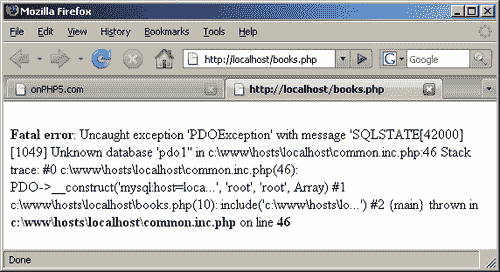
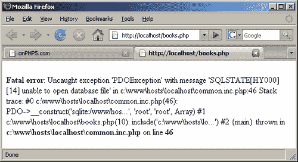
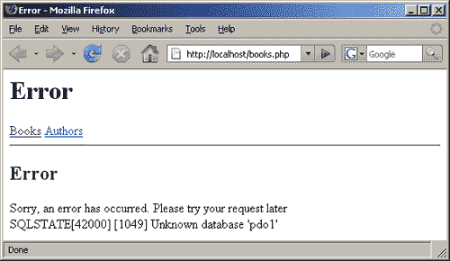
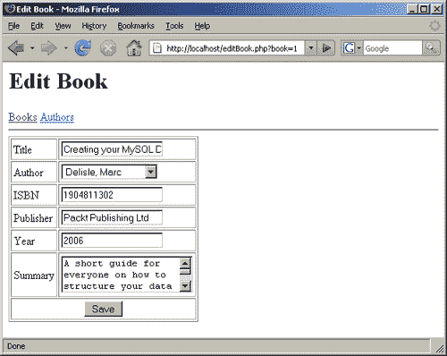
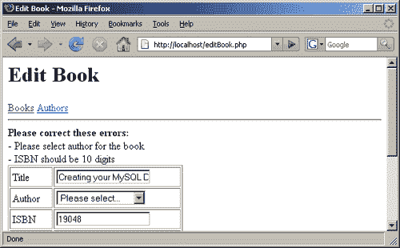

# 第三章错误处理

现在，我们已经构建了第一个使用 PDO 的应用程序，我们将更深入地了解用户友好的 web 应用程序错误处理的一个重要方面。它不仅可以告知用户错误情况，还可以限制在发生错误时未检测到的损坏。

大多数 web 应用程序都有相当简单的错误处理策略。发生错误时，脚本终止并显示错误页面。错误应该记录在错误日志中，开发人员或维护人员应该定期检查日志。数据库驱动的 web 应用程序中最常见的错误源如下：

*   服务器软件故障或过载，如著名的“连接太多”错误
*   应用程序配置不当，当我们使用不正确的连接字符串时可能会发生这种情况，当应用程序从一个主机移动到另一个主机时，这是一个相当常见的错误
*   对用户输入的验证不正确，这可能会导致 SQL 格式错误以及随后的查询失败
*   插入具有重复主键或唯一索引值的记录，这可能是由于应用程序业务逻辑中的错误造成的，也可能是在受控情况下发生的
*   SQL 语句中的语法错误

在本章中，我们将扩展应用程序，以便可以编辑现有记录以及添加新记录。由于我们将处理通过 web 表单提供的用户输入，因此必须注意其验证。此外，我们还可以添加错误处理，以便对非标准情况做出反应，并向用户提供友好的消息。

在继续之前，让我们简要地检查一下上面提到的错误的来源，看看在每种情况下应该应用什么错误处理策略。我们的错误处理策略将使用异常，因此您应该熟悉它们。如果不是，可以参考附录 A，它将向您介绍 PHP5 的新的面向对象特性。

我们有意识地选择使用异常，即使可以指示 PDO 不要使用它们，因为有一种情况是无法避免的。当无法创建数据库对象时，PDO 构造函数总是抛出异常，因此我们也可以在代码中使用异常作为主要的错误捕获方法。

# 错误来源

要创建错误处理策略，我们应该首先分析错误可能发生的位置。对数据库的每次调用都可能发生错误，尽管这不太可能，但我们将研究这个场景。但是在这样做之前，让我们检查每个可能的错误源，并定义一个处理它们的策略。

## 服务器软件故障或过载

这可能发生在一个非常繁忙的服务器上，它无法处理任何更多的传入连接。例如，在后台可能会运行很长时间的更新。结果是我们无法从数据库中获取任何数据，因此我们应该执行以下操作。

如果 PDO 构造函数失败，我们将显示一个页面，其中显示一条消息，表示此时无法满足用户的请求，他们应该稍后再试。当然，我们也应该记录这个错误，因为它可能需要立即注意。（一个好主意是向数据库管理员发送有关错误的电子邮件。）

这个错误的问题是，虽然它通常在与数据库建立连接之前（在对 PDO 构造函数的调用中）表现出来，但在建立连接之后（在数据库服务器关闭时调用 `PDO`或 `PDOStatement`对象的方法时），它可能会发生的风险很小。在这种情况下，我们的反应将是相同的，即向用户显示一条错误消息，要求他们稍后重试。

## 应用程序配置不正确

只有在数据库访问细节不同的服务器之间移动应用程序时，才会发生此错误；这可能是在我们从开发服务器上传到生产服务器时发生的，在生产服务器上，数据库设置不同。这不是正常执行应用程序期间可能发生的错误，但在上载时应小心，因为这可能会中断站点的操作。

如果发生此错误，我们可以显示另一条错误消息，如：“此站点正在维护”。在这种情况下，站点维护人员应该立即做出反应，因为如果不更正应用程序无法正常运行的连接字符串，就应该立即做出反应。

## 用户输入验证不正确

这是一个与 SQL 注入漏洞密切相关的错误。数据库驱动应用程序的每个开发人员都必须采取适当的措施来验证和过滤所有用户输入。此错误可能导致两个主要后果：要么是由于 SQL 格式错误导致查询失败（因此不会发生任何特别糟糕的情况），要么是 SQL 注入可能会发生，应用程序安全可能会受到影响。虽然它们的后果不同，但这两个问题都可以用同样的方法预防。

让我们考虑下面的场景。我们接受表单中的一些数值并将其插入数据库。为了使我们的示例保持简单，假设我们想要更新一本书的出版年份。为了实现这一点，我们可以创建一个包含两个字段的表单：一个包含书籍 ID 的隐藏字段，以及一个输入年份的文本字段。我们将跳过这里的实现细节，看看如何使用设计糟糕的脚本来处理此表单，从而导致错误并使整个系统处于风险之中。

表单处理脚本将检查两个请求变量： `$_REQUEST['book']`，用于保存图书 ID 和 `$_REQUEST['year']`，用于保存出版年份。如果没有对这些值进行验证，最终代码将类似于以下内容：

```php
$book = $_REQUEST['book'];
$year = $_REQUEST['year'];
$sql = "UPDATE books SET year=$year WHERE id=$book";
$conn->query($sql);

```

让我们看看如果用户将 `book`字段留空会发生什么。最后的 SQL 将如下所示：

```php
UPDATE books SET year= WHERE id=1;

```

此 SQL 格式不正确，将导致语法错误。因此，我们应该确保这两个变量都包含数值。如果他们没有，我们应该重新显示带有错误消息的表单。

现在，让我们看看攻击者如何利用此漏洞删除整个表的内容。为此，他们可以在 `year`字段中输入以下内容：

```php
2007; DELETE FROM books;

```

这会将单个查询转换为三个查询：

```php
UPDATE books SET year=2007; DELETE FROM books; WHERE book=1;

```

当然，第三个查询的格式不正确，但将执行第一个和第二个查询，并且数据库服务器将报告错误。为了解决这个问题，我们可以使用简单的验证来确保 `year`字段包含四位数字。但是，如果我们有可以包含任意字符的文本字段，那么在创建 SQL 之前必须对字段的值进行转义。

## 插入具有重复主键或唯一索引值的记录

当应用程序为主键或唯一索引插入具有重复值的记录时，可能会发生此问题。例如，在我们的作者和书籍数据库中，我们可能希望防止用户错误地输入同一本书两次。为此，我们可以为 `books`表的 ISBN 列创建一个唯一的索引。由于每本书都有一个唯一的 ISBN，任何插入相同 ISBN 的尝试都会产生错误。我们可以通过显示一条错误消息，要求用户更正 ISBN 或取消其添加，从而捕获此错误并做出相应的反应。

## SQL 语句中的语法错误

如果我们没有正确测试应用程序，可能会发生此错误。一个好的应用程序不能包含这些错误，开发团队有责任测试每一种可能的情况，并检查每个 SQL 语句的执行是否没有语法错误。

如果发生这种类型的错误，那么我们会用异常捕获它，并显示致命错误消息。开发商必须立即纠正这种情况。

现在我们已经了解了一些可能的错误源，让我们来看看 PDO 是如何处理错误的。

# PDO 中的错误处理类型

默认情况下，PDO 使用**静默错误处理模式**。这意味着调用 `PDO`或 `PDOStatement`类的方法时出现的任何错误都不会被报告。在这种模式下，每次发生错误时都必须调用 `PDO::errorInfo(), PDO::errorCode(), PDOStatement::errorInfo()`或 `PDOStatement::errorCode()`，以查看是否真的发生了错误。注意，这种模式与传统的数据库访问方式类似，通常在调用可能导致错误的函数、连接到数据库以及发出查询后，代码调用 `mysql_errno()`和 `mysql_error()`（或其他数据库系统的等效函数）。

另一种模式是**警告模式**。这里， `PDO`的作用与传统的数据库访问相同。在与数据库通信期间发生的任何错误都会引发 `E_WARNING`错误。根据配置，可能会显示错误消息或将其记录到文件中。

最后，PDO 介绍了一种使用**异常**处理数据库连接错误的现代方法。对任何 `PDO`或 `PDOStatement`方法的每次失败调用都会引发异常。

正如我们前面提到的，PDO 默认使用静默模式。要切换到所需的错误处理模式，我们必须通过调用 `PDO::setAttribute()`方法来指定它。每个错误处理模式由以下常量指定，这些常量在 PDO 类中定义：

*   `PDO::ERRMODE_SILENT`-*沉默*策略。
*   `PDO::ERRMODE_WARNING`-*警告*策略。
*   `PDO::ERRMODE_EXCEPTION`-使用*异常。*

要设置所需的错误处理模式，我们必须按以下方式设置 `PDO::ATTR_ERRMODE`属性：

```php
$conn->setAttribute(PDO::ATTR_ERRMODE, PDO::ERRMODE_EXCEPTION);

```

要查看 PDO 如何抛出异常，请在第 46 行之后添加上述语句，编辑 `common.inc.php`文件。如果要测试 PDO 引发异常时会发生什么，请更改连接字符串以指定不存在的数据库。现在将浏览器指向图书列表页面。

您应该看到类似以下内容的输出：



这是 PHP 对未捕获异常的默认反应，这些异常被视为致命错误和程序执行停止。错误消息显示异常的类、 `PDOException`、错误描述和一些调试信息，包括引发异常的语句的名称和行号。请注意，如果要测试 SQLite，指定不存在的数据库可能不起作用，因为如果数据库不存在，则将创建该数据库。要查看它是否适用于 SQLite，请更改第 10 行上的 `$connStr`变量，以便数据库名称中存在非法字符：

```php
$connStr = 'sqlite:/path/to/pdo*.db';

```

刷新浏览器，您将看到如下内容：



如您所见，将显示一条类似于上一示例的消息，指定源代码中错误的原因和位置。

# 定义错误处理功能

如果我们知道某个语句或代码块可能引发异常，我们应该将该代码包装在*try…catch*块中，以防止显示默认错误消息，并显示一个用户友好的错误页面。但在继续之前，让我们创建一个函数，该函数将呈现错误消息并退出应用程序。正如我们将从不同的脚本文件调用它一样，这个函数的最佳位置当然是 `common.inc.php`文件。

我们的函数名为 `showError()`，将执行以下操作：

*   呈现一个标题说“错误”。
*   呈现错误消息。我们将使用 `htmlspecialchars()`函数对文本进行转义，并使用 `nl2br()`函数对其进行处理，以便显示多行消息。（此功能将所有换行符转换为`<br>`标记。）
*   调用 `showFooter()`功能关闭开口`<html>`和`<body>`标签。该函数将假定应用程序已经调用了 `showHeader()`函数。（否则，我们将以破坏的 HTML 结束。）

我们还必须修改在 `common.inc.php`中创建连接对象的块，以捕获可能的异常。经过所有这些更改， `common.inc.php`的新版本将如下所示：

```php
<?php
/**
* This is a common include file
* PDO Library Management example application
* @author Dennis Popel
*/
// DB connection string and username/password
$connStr = 'mysql:host=localhost;dbname=pdo';
$user = 'root';
$pass = 'root';
/**
* This function will render the header on every page,
* including the opening html tag,
* the head section and the opening body tag.
* It should be called before any output of the
* page itself.
* @param string $title the page title
*/
function showHeader($title)
{
?>
<html>
<head><title><?=htmlspecialchars($title)?></title></head>
<body>
<h1><?=htmlspecialchars($title)?></h1>
<a href="books.php">Books</a>
<a href="authors.php">Authors</a>
<hr>
<?php
}
/**
* This function will 'close' the body and html
* tags opened by the showHeader() function
*/
function showFooter()
{
?>
</body>
</html>
<?php
}
/**
* This function will display an error message, call the
* showFooter() function and terminate the application
* @param string $message the error message
*/
function showError($message)
{
echo "<h2>Error</h2>";
echo nl2br(htmlspecialchars($message));
showFooter();
exit();
}
// Create the connection object
try
{
$conn = new PDO($connStr, $user, $pass);
$conn->setAttribute(PDO::ATTR_ERRMODE, PDO::ERRMODE_EXCEPTION);
}
catch(PDOException $e)
{
showHeader('Error');
showError("Sorry, an error has occurred. Please try your request
later\n" . $e->getMessage());
}

```

如您所见，新创建的函数非常简单。更有趣的部分是我们用来捕获异常的*try…catch*块。现在，通过这些修改，我们可以测试如何处理真正的异常。要做到这一点，请确保您的连接字符串是错误的（以便它为 MySQL 指定了错误的数据库名称，或者为 SQLite 指定了无效的文件名）。将浏览器指向 `books.php`，您将看到以下窗口：



# 创建编辑书页面

如前所述，我们希望扩展应用程序，以便添加和编辑书籍和作者。此外，我们的系统应该能够通过在 books 表的 `ISBN`列上强制执行唯一索引来防止我们两次进入同一本书。

在继续编写代码之前，我们将创建索引。启动命令行客户端并输入以下命令（MySQL 和 SQLite 的命令相同）：

```php
CREATE UNIQUE INDEX idx_isbn ON books(isbn);

```

我们还将使我们的“编辑图书”页面同时用于两个目的：添加一本新书和编辑一本现有的书。脚本将通过在 URL 或隐藏表单字段中显示图书 ID 来区分要执行的操作。我们将从 `books.php`中链接到这个新页面，这样我们只需点击图书列表页面上的链接就可以编辑每本书。

本页比前一章中描述的更复杂，因此我将首先向您提供代码，然后讨论它。我们将此页面称为编辑 `Book.php:`

```php
<?php
/**
* This page allows to add or edit a book
* PDO Library Management example application
* @author Dennis Popel
*/
// Don't forget the include
include('common.inc.php');
// See if we have the book ID passed in the request
$id = (int)$_REQUEST['book'];
if($id) {
// We have the ID, get the book details from the table
$q = $conn->query("SELECT * FROM books WHERE id=$id");
$book = $q->fetch(PDO::FETCH_ASSOC);
$q->closeCursor();
$q = null;
}
else {
// We are creating a new book
$book = array();
}
// Now get the list of all authors' first and last names
// We will need it to create the dropdown box for author
$authors = array();
$q = $conn->query("SELECT id, lastName, firstName FROM authors ORDER
BY lastName, firstName");
$q->setFetchMode(PDO::FETCH_ASSOC);
while($a = $q->fetch())
{
$authors[$a['id']] = "$a[lastName], $a[firstName]";
}
// Now see if the form was submitted
if($_POST['submit']) {
// Validate every field
$warnings = array();
// Title should be non-empty
if(!$_POST['title'])
{
$warnings[] = 'Please enter book title';
}
// Author should be a key in the $authors array
if(!array_key_exists($_POST['author'], $authors))
{
$warnings[] = 'Please select author for the book';
}
// ISBN should be a 10-digit number
if(!preg_match('~^\d{10}$~', $_POST['isbn'])) {
$warnings[] = 'ISBN should be 10 digits';
}
// Published should be non-empty
if(!$_POST['publisher']) {
$warnings[] = 'Please enter publisher';
}
// Year should be 4 digits
if(!preg_match('~^\d{4}$~', $_POST['year'])) {
$warnings[] = 'Year should be 4 digits';
}
// Sumary should be non-empty
if(!$_POST['summary']) {
$warnings[] = 'Please enter summary';
}
// If there are no errors, we can update the database
// If there was book ID passed, update that book
if(count($warnings) == 0) {
if(@$book['id']) {
$sql = "UPDATE books SET title=" . $conn>quote($_POST['title']) .
', author=' . $conn->quote($_POST['author']) .
', isbn=' . $conn->quote($_POST['isbn']) .
', publisher=' . $conn->quote($_POST['publisher']) .
', year=' . $conn->quote($_POST['year']) .
', summary=' . $conn->quote($_POST['summary']) .
" WHERE id=$book[id]";
}
else {
$sql = "INSERT INTO books(title, author, isbn, publisher,
year,summary) VALUES(" .
$conn->quote($_POST['title']) .
', ' . $conn->quote($_POST['author']) .
', ' . $conn->quote($_POST['isbn']) .
', ' . $conn->quote($_POST['publisher']) .
', ' . $conn->quote($_POST['year']) .
', ' . $conn->quote($_POST['summary']) .
')';
}
// Now we are updating the DB.
// We wrap this into a try/catch block
// as an exception can get thrown if
// the ISBN is already in the table
try
{
$conn->query($sql);
// If we are here that means that no error
// We can return back to books listing
header("Location: books.php");
exit;
}
catch(PDOException $e)
{
$warnings[] = 'Duplicate ISBN entered. Please correct';
}
}
}
else {
// Form was not submitted.
// Populate the $_POST array with the book's details
$_POST = $book;
}
// Display the header
showHeader('Edit Book');
// If we have any warnings, display them now
if(count($warnings)) {
echo "<b>Please correct these errors:</b><br>";
foreach($warnings as $w)
{
echo "- ", htmlspecialchars($w), "<br>";
}
}
// Now display the form
?>
<form action="editBook.php" method="post">
<table border="1" cellpadding="3">
<tr>
<td>Title</td>
<td>
<input type="text" name="title"
value="<?=htmlspecialchars($_POST['title'])?>">
</td>
</tr>
<tr>
<td>Author</td>
<td>
<select name="author">
<option value="">Please select...</option>
<?php foreach($authors as $id=>$author) { ?>
<option value="<?=$id?>"
<?= $id == $_POST['author'] ? 'selected' : ''?>>
<?=htmlspecialchars($author)?>
</option>
<?php } ?>
</select>
</td>
</tr>
<tr>
<td>ISBN</td>
<td>
<input type="text" name="isbn"
value="<?=htmlspecialchars($_POST['isbn'])?>">
</td>
</tr>
<tr>
<td>Publisher</td>
<td>
<input type="text" name="publisher"
value="<?=htmlspecialchars($_POST['publisher'])?>">
</td>
</tr>
<tr>
<td>Year</td>
<td>
<input type="text" name="year"
value="<?=htmlspecialchars($_POST['year'])?>">
</td>
</tr>
<tr>
<td>Summary</td>
<td>
<textarea name="summary"><?=htmlspecialchars( $_POST['summary'])?></textarea>
</td>
</tr>
<tr>
<td colspan="2" align="center">
<input type="submit" name="submit" value="Save">
</td>
</tr>
</table>
<?php if(@$book['id']) { ?>
<input type="hidden" name="book" value="<?=$book['id']?>">
<?php } ?>
</form>
<?php
// Display footer
showFooter();

```

代码是相当自文档化的，但让我们简要介绍一下它的主要部分。第 12 行到第 23 行处理获取书籍详细信息，如果使用书籍 ID 请求页面，则会对其进行编辑。这些详细信息存储在 `$book`变量中。请注意，我们是如何显式地将请求参数 `book`强制转换为 `integer`，这样就不会发生 SQL 注入（第 13 行）。如果没有提供图书 ID，则将其设置为空数组。注意我们如何调用 `closeCursor()`函数，然后将 `$q`变量赋值为 null。这是必要的，因为我们将重用连接对象。

第 26 行到第 33 行准备了作者列表。由于我们的系统允许每本书只有一位作者，我们将创建一个选择框字段，列出所有作者。

第 35 行检查是否提交了表单。如果测试成功，脚本将验证每个字段（第 37 到 68 行）。每个失败的验证都会附加到警告列表中。（使用空数组初始化了 `$warnings`变量。）我们将使用此列表查看验证是否成功，如果没有成功，则存储错误消息。

第 69 行到第 94 行构建了用于更新的实际 SQL。最后的 SQL 取决于我们是在更新一本书（当 `$book`数组将包含**id**键时），还是在添加一本新的。请注意，在执行查询之前，我们是如何引用每个列的值的。

第 95 到 112 行尝试执行查询。如果用户输入了重复的 ISBN，它可能会失败，因此我们将代码包装在 `try…catch`块中。如果抛出异常， `catch`块将向 `$warnings`数组追加相应的警告。如果一切正常，脚本将重定向到图书列表页面，您将在其中看到更改。

如果没有提交表单，则执行第 113 到 118 行。在这里， `$_POST`数组被 `$books`变量的内容填充。我们这样做是因为我们将在代码的后面使用 `$_POST`数组来显示表单字段的值。

请注意，我们如何在第 122 至 129 行显示错误消息（如果有），以及在第 141 至 154 行显示选择框。（我们正在查看所有作者，如果作者 ID 与本书作者 ID 匹配，则该作者将标记为所选选项。）此外，其他表单字段将使用应用于 `$_POST`数组项的 `htmlspecialchars()`函数呈现。第 189 行到第 191 行将向表单中添加一个隐藏字段，其中包含当前编辑的图书（如果有）的 ID。

现代 web 应用程序除了对用户提供的数据进行服务器端验证外，还采用客户端验证。虽然这不在本书的范围内，但您可以在项目中考虑基于浏览器的验证，以提高响应性并潜在地减少 Web 服务器的负载。

现在，我们应该从 `books.php`页面链接到新创建的页面。我们将为每个列出的图书提供一个*编辑本书*链接，以及表下的*添加图书*链接。我不会在这里复制整个 `books.php`源代码，只是应该更改的行。因此，第 32 至 48 行应替换为以下内容：

```php
<?php
// Now iterate over every row and display it
while($r = $q->fetch())
{
?>
<tr>
<td><ahref="author.php?id=<?=$r['authorId']?>">
<?=htmlspecialchars("$r[firstName] $r[lastName]")?></a></td>
<td><?=htmlspecialchars($r['title'])?></td>
<td><?=htmlspecialchars($r['isbn'])?></td>
<td><?=htmlspecialchars($r['publisher'])?></td>
<td><?=htmlspecialchars($r['year'])?></td>
<td><?=htmlspecialchars($r['summary'])?></td>
<td>
<a href="editBook.php?book=<?=$r['id']?>">Edit</a>
</td>
</tr>
<?php
}
?>

```

在调用 `showFooter()`函数之前，应添加以下内容，以便四行如下所示：

```php
<a href="editBook.php">Add book...</a>
<?php
// Display footer
showFooter();

```

现在，如果您再次导航到 `books.php`页面，您将看到以下窗口：


要查看编辑书籍页面的外观，请单击表格最后一列中的任何**编辑**链接。您应该看到以下表格：



让我们看看我们的表单是如何工作的。它正在验证发送到数据库的每个表单字段。如果存在任何验证错误，表单将不会更新数据库并提示用户更正其提交。例如，尝试将作者选择框更改为默认选项（标记为*请选择…*，并将 ISBN 编辑为 5 位数。

如果您点击**保存**按钮，您会看到表单显示以下错误消息：



现在更正错误并尝试将 ISBN 更改为 1904811027。另一本书已经在我们的数据库中使用了此 ISBN，因此表单将再次显示错误。您可以通过添加一本书来进一步测试表单。您可能还想测试它如何与 SQLite 一起工作。

# 创建编辑作者页面

我们的应用程序仍然缺少添加/编辑作者功能。此页面将比“编辑书籍”页面稍微简单一些，因为它没有作者选择框，也没有唯一索引。（您可能希望在作者的名字和姓氏列上创建一个唯一的索引，以防止重复，但这将由您决定。）

让我们把这个页面称为 `editAuthor.php`。以下是它的源代码：

```php
<?php
/**
* This page allows to add or edit an author
* PDO Library Management example application
* @author Dennis Popel
*/
// Don't forget the include
include('common.inc.php');
// See if we have the author ID passed in the request
$id = (int)$_REQUEST['author'];
if($id) {
// We have the ID, get the author details from the table
$q = $conn->query("SELECT * FROM authors WHERE id=$id");
$author = $q->fetch(PDO::FETCH_ASSOC);
$q->closeCursor();
$q = null;
}
else {
// We are creating a new book
$author = array();
}
// Now see if the form was submitted
if($_POST['submit']) {
// Validate every field
$warnings = array();
// First name should be non-empty
if(!$_POST['firstName']) {
$warnings[] = 'Please enter first name';
}
// Last name should be non-empty
if(!$_POST['lastName']) {
$warnings[] = 'Please enter last name';
}
// Bio should be non-empty
if(!$_POST['bio']) {
$warnings[] = 'Please enter bio';
}
// If there are no errors, we can update the database
// If there was book ID passed, update that book
if(count($warnings) == 0) {
if(@$author['id']) {
$sql = "UPDATE authors SET firstName=" .
$co>quote($_POST['firstName']) .
', lastName=' . $conn->quote($_POST['lastName']) .
', bio=' . $conn->quote($_POST['bio']) .
" WHERE id=$author[id]";
}
else {
$sql = "INSERT INTO authors(firstName, lastName, bio) VALUES(" .
$conn->quote($_POST['firstName']) .
', ' . $conn->quote($_POST['lastName']) .
', ' . $conn->quote($_POST['bio']) .
')';
}
$conn->query($sql);
header("Location: authors.php");
exit;
}
}
else {
// Form was not submitted.
// Populate the $_POST array with the author's details
$_POST = $author;
}
// Display the header
showHeader('Edit Author');
// If we have any warnings, display them now
if(count($warnings)) {
echo "<b>Please correct these errors:</b><br>";
foreach($warnings as $w)
{
echo "- ", htmlspecialchars($w), "<br>";
}
}
// Now display the form
?>
<form action="editAuthor.php" method="post">
<table border="1" cellpadding="3">
<tr>
<td>First name</td>
<td>
<input type="text" name="firstName"
value="<?=htmlspecialchars($_POST['firstName'])?>">
</td>
</tr>
<tr>
<td>Last name</td>
<td>
<input type="text" name="lastName"
value="<?=htmlspecialchars($_POST['lastName'])?>">
</td>
</tr>
<tr>
<td>Bio</td>
<td>
<textarea name="bio"><?=htmlspecialchars($_POST['bio'])?>
</textarea>
</td>
</tr>
<tr>
<td colspan="2" align="center">
<input type="submit" name="submit" value="Save">
</td>
</tr>
</table>
<?php if(@$author['id']) { ?>
<input type="hidden" name="author" value="<?=$author['id']?>">
<?php } ?>
</form>
<?php
// Display footer
showFooter();

```

此源代码与 `editBook.php`页面的构建方式相同，因此您应该能够轻松地理解它。

我们将以与从 `books.php`页面链接到 `editBook.php`页面相同的方式链接到 `editAuthors.php`页面。编辑 `authors.php`文件并将第 30-41 行更改为以下内容：

```php
while($r = $q->fetch(PDO::FETCH_ASSOC))
{
?>
<tr>
<td><?=htmlspecialchars($r['firstName'])?></td>
<td><?=htmlspecialchars($r['lastName'])?></td>
<td><?=htmlspecialchars($r['bio'])?></td>
<td>
<a href="editAuthor.php?author=<?=$r['id']?>">Edit</a>
</td>
</tr>
<?php
}

```

在最后一个 PHP 块之前添加以下行：

```php
<a href="editAuthor.php">Add Author...</a>

```

现在，如果您刷新 `authors.php`页面，您将看到以下内容：


您可以点击最右边栏中的**编辑**链接来编辑每个作者的详细信息。您可以尝试使用空值提交表单，以查看无效提交将被拒绝。此外，您还可以尝试向系统中添加新作者。成功完成此操作后，您可能希望返回图书列表并编辑一些图书。您将在**作者**选择框中看到新创建的作者。

# 针对未捕获的例外情况进行保护

如前所述，我们将*try…catch*块放在可能引发异常的代码周围。然而，在极少数情况下，可能会出现一些意外的例外情况。我们可以通过修改其中一个查询来模拟这种异常，使其包含一些格式错误的 SQL。例如，让我们将第 16 行的 `authors.php`编辑为以下内容：

```php
$q = $conn->query("SELECT * FROM authors ORDER BY lastName, firstName");

```

现在尝试用浏览器导航到 `authors.php`以查看是否发生了未捕获的异常。为了正确处理这种情况，我们要么创建一个异常处理程序，要么将调用 `PDO`或 `PDOStatement`类方法的每个代码块包装在*try…catch*块中。

让我们看看如何创建异常处理程序。这是一种更简单的方法，因为它不需要更改大量代码。但是，对于大型应用程序，这可能是一种不好的做法，因为处理异常可能更安全，并且可以应用更好的恢复逻辑。

然而，对于我们的简单应用程序，我们可以使用全局异常处理程序。只需使用 `showError()`功能表示站点正在维护中：

```php
/**
* This is the default exception handler
* @param Exception $e the uncaught exception
*/
function exceptionHandler($e)
{
showError("Sorry, the site is under maintenance\n" .
$e->getMessage());
}
// Set the global excpetion handler
set_exception_handler('exceptionHandler');

```

将其放入 `common.inc.php`，就在连接创建代码块之前。如果您现在刷新 `authors.php`页面，您将看到处理程序被调用。

最好使用默认的异常处理程序。正如您所注意到的，未经处理的异常会暴露太多敏感信息，包括数据库连接详细信息。此外，在现实世界的应用程序中，错误页面不应显示有关错误类型的任何信息。（请注意，我们的示例应用程序确实如此。）默认处理程序应该写入错误日志，并向站点维护人员发出错误警报。

# 总结

在本章中，我们研究了 `PDO`如何处理错误并引入异常。此外，我们还调查了错误的来源，并了解了如何应对这些错误。

我们的示例应用程序通过一些实际的管理功能进行了扩展，这些功能使用数据验证，并且可以防止 SQL 注入攻击。当然，它们还应该只允许某些用户根据登录名和密码修改数据库。然而，这超出了本书的范围。

在下一章中，我们将研究 PDO 和数据库编程的另一个非常重要的方面，通常使用准备好的语句。我们将看到如何在他们的帮助下简化我们的管理页面，从而减少代码和更好的维护。