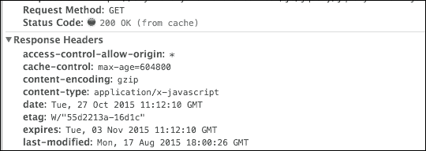
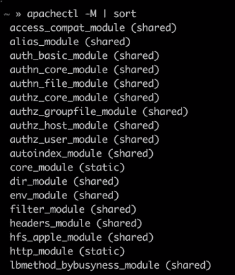
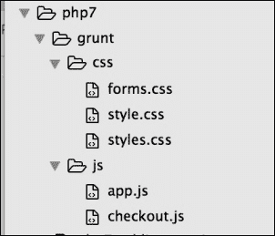
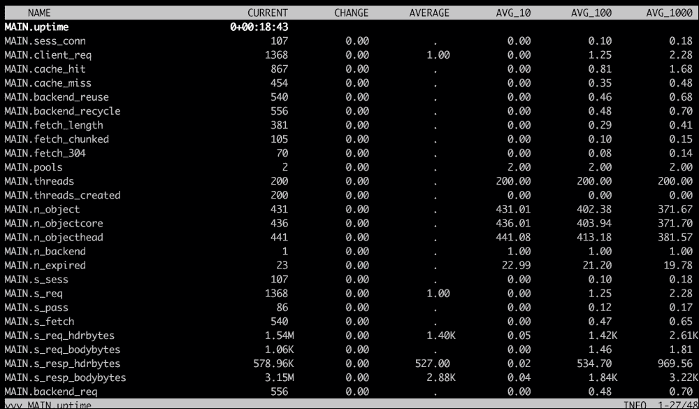
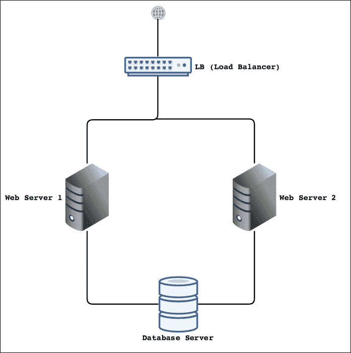
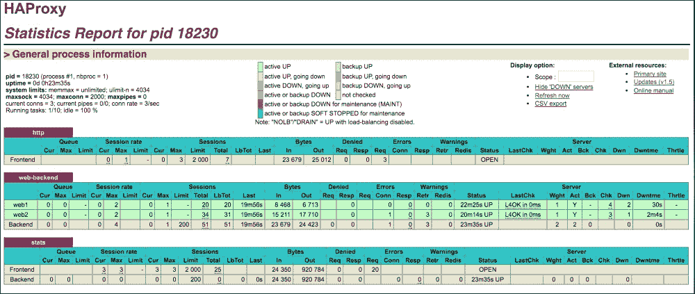
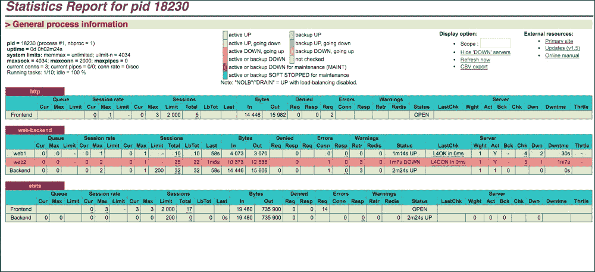

# 三、提高 PHP7 应用性能

基于**PHP 下一代**（**phpng**或**phpng**的瞄准性能，PHP7 已经彻底重写。然而，总是有更多的方法来提高应用的性能，包括编写高性能代码、使用最佳实践、web 服务器优化、缓存等等。在本章中，我们将讨论下列优化：

*   NGINX 和 Apache
*   HTTP 服务器优化
*   内容交付网络（CDN）
*   JavaScript/CSS 优化
*   整页缓存
*   清漆
*   基础设施

# NGINX 和 Apache

有太多的HTTP 服务器软件可用，每一个都有其优点和缺点。使用的两个最流行的 HTTP 服务器是 NGINX 和 Apache。让我们来看看这两种方法，并注意哪一种更适合我们的需要。

## 阿帕奇

Apache 是使用最广泛的 HTTP 服务器，受到大多数管理员的喜爱。管理员之所以选择它，是因为它具有灵活性、广泛的支持、强大的功能以及适用于大多数解释语言（如 PHP）的模块。由于 Apache 可以处理大量的解释语言，因此它不需要与其他软件通信来满足请求。Apache 可以在 prefork（进程跨线程生成）、worker（线程跨进程生成）和事件驱动（与 worker 进程相同，但它为*保持活动的*连接设置了专用线程，为活动连接设置了单独的线程）中处理请求；因此，它提供了更大的灵活性。

正如前面讨论的一样，每个请求都将由单个线程或进程处理，因此 Apache 消耗了太多的资源。当涉及到高流量应用时，Apache 可能会降低应用的速度，因为它不能很好地支持并发处理。

## NGINX

NGINX 是为解决高流量应用的并发问题而构建的。NGINX 提供异步、事件驱动和非阻塞请求处理。由于请求是异步处理的，NGINX 不会等待请求完成以阻止资源。

NGINX 创建工作进程，每个工作进程可以处理数千个连接。因此，一些进程可以同时处理高流量。

NGINX 不为任何解释语言提供任何内置支持。这需要依靠外部资源。这也很好，因为处理是在 NGINX 之外进行的，NGINX 只处理连接和请求。大多数情况下，NGINX 被认为比 Apache 更快。在某些情况下，例如使用静态内容（服务图像、`.css`和`.js`文件等），这可能是真的，但在当前的高性能服务器中，Apache 不是问题所在；PHP 是瓶颈。

### 注

Apache 和 NGINX 都可用于各种操作系统。在本书中，我们将使用 Debian 和 Ubuntu，因此将根据这些操作系统介绍所有文件路径

如前所述，本书将使用 NGINX。

# HTTP 服务器优化

每个 HTTP 服务器都提供了某些功能，可用于优化请求处理和服务内容。在本节中，我们将分享 Apache 和 NGINX 的一些技术，这些技术可用于优化 web 服务器并提供最佳性能和可伸缩性。大多数情况下，当应用这些优化时，需要重新启动 Apache 或 NGINX。

## 缓存静态文件

大多数情况下，静态文件，如图像、`.css`、`.js`和字体不会频繁更改。因此，将这些静态文件缓存在最终用户机器上是最佳实践。为此，web 服务器在响应中添加了特殊的头，这会告诉用户浏览器将静态内容缓存一段时间。以下是 Apache 和 NGINX 的配置代码。

### 阿帕奇

让我们看一看缓存以下静态内容的Apache 配置：

```php
<FilesMatch "\.(ico|jpg|jpeg|png|gif|css|js|woff)$">
  Header set Cache-Control "max-age=604800, public
</FileMatch>
```

在前面必须放在`.htaccess`文件中的代码中，我们使用 Apache`FilesMatch`指令匹配文件的扩展名。如果请求了所需的扩展文件，Apache 会将标头设置为缓存控制七天。然后浏览器将这些静态文件缓存七天。

### NGINX

以下配置可放置在`/etc/nginx/sites-available/your-virtual-host-conf-file`中：

```php
Location ~* .(ico|jpg|jpeg|png|gif|css|js|woff)$ {
  Expires 7d;
}
```

在前面的代码中，我们使用 NGINX`Location`块和不区分大小写的修饰符（`~*`来设置`Expires`七天。此代码将为所有定义的文件类型设置七天的缓存控制头。

进行这些设置后，请求的响应标头如下所示：



在上图中可以清楚地看到，`.js`文件是从缓存加载的。其缓存控制头设置为 7 天或 604800 秒。有效期也可以在`expires`标题中清楚注明。到期日后，浏览器将从服务器加载此`.js`文件，并在缓存控制头中定义的持续时间内再次缓存它。

# HTTP 持久连接

在 HTTP 持久性连接或 HTTP 保持活动状态中，单个 TCP/IP 连接用于多个请求或响应。它比普通连接有巨大的性能改进，因为它只使用一个连接，而不是为每个请求或响应打开和关闭连接。HTTP keep alive 的一些好处如下：

*   CPU 和内存上的负载减少了，因为一次打开的 TCP 连接更少，并且不会为后续请求和响应打开新的连接，因为这些 TCP 连接用于后续请求和响应。
*   减少 TCP 连接建立后后续请求的延迟。当建立 TCP 连接时，在用户和 HTTP 服务器之间进行三方握手通信。成功握手后，将建立 TCP 连接。在保持活动状态的情况下，对于建立 TCP 连接的初始请求，握手仅执行一次，对于后续请求，不执行握手或 TCP 连接打开/关闭。这将提高请求/响应的性能。
*   由于一次只打开到服务器的几个 TCP 连接，因此网络拥塞有所减少。

除了这些好处之外，保持生命还有一些副作用。每台服务器都有一个并发限制，当达到或使用该并发限制时，应用的性能可能会大大降低。为了解决这个问题，为每个连接定义了一个超时，之后 HTTP 保持活动连接将自动关闭。现在，让我们在 Apache 和 NGINX 上启用 HTTP 保持活动。

## 阿帕奇

在 Apache 中，keep alive 可以通过两种方式启用。您可以在`.htaccess`文件或 Apache 配置文件中启用它。

要在`.htaccess`文件中启用，请在`.htaccess`文件中放置以下配置：

```php
<ifModule mod_headers.c>
  Header set Connection keep-alive
</ifModule>
```

在前面的配置中，我们在`.htaccess`文件中将连接头设置为保持活动状态。由于`.htaccess`配置覆盖了配置文件中的配置，这将覆盖 Apache 配置文件中为保持活动状态所做的任何配置。

为了在 Apache 配置文件中启用 keep-alive 连接，我们必须修改三个配置选项。搜索以下配置并将值设置为示例中的值：

```php
KeepAlive On
MaxKeepAliveRequests 100
KeepAliveTimeout 100
```

在前面的配置中，我们通过将`KeepAlive`的值设置为`On`来打开 keep alive 配置。

下一个是`MaxKeepAliveRequests`，它定义了当时与 web 服务器保持活动连接的最大数量。Apache 中的默认值为 100，可以根据需要进行更改。要获得高性能，此值应保持较高。如果设置为 0，它将允许无限的保持活动连接，这是不推荐的。

最后一个配置为`KeepAliveTimeout`，设置为 100 秒。这定义了在同一 TCP 连接上等待来自同一客户端的下一个请求的秒数。如果没有请求，则连接关闭。

## NGINX

HTTP 保持活动状态是`http_core`模块的一部分，默认情况下启用。在 NGINX 配置文件中，我们可以编辑一些选项，比如超时。打开`nginx`配置文件，编辑以下配置选项，并将其值设置为：

```php
keepalive_requests 100
keepalive_timeout 100
```

`keepalive_requests`配置定义了单个客户端可以在单个 HTTP 保持活动连接上发出的最大请求数。

`keepalive_timeout`config 是服务器需要等待下一个请求的秒数，直到关闭保持活动连接。

## GZIP 压缩

内容压缩提供了一种减少 HTTP 服务器交付的内容大小的方法。Apache 和 NGINX 都支持GZIP 压缩，类似地，大多数现代浏览器都支持 GZIP。启用 GZIP 压缩后，HTTP 服务器发送压缩的 HTML、CSS、JavaScript 和较小的图像。这样，可以快速加载内容。

当浏览器发送其自身支持 GZIP 压缩的信息时，web 服务器仅通过 GZIP 压缩内容。通常，浏览器在*请求*头中发送此类信息。

下面是 Apache 和 NGINX 启用 GZIP 压缩的代码。

### 阿帕奇

以下代码可以放在`.htaccess`文件中：

```php
<IfModule mod_deflate.c>
SetOutputFilter DEFLATE
 #Add filters to different content types
AddOutputFilterByType DEFLATE text/html text/plain text/xml    text/css text/javascript application/javascript
    #Don't compress images
    SetEnvIfNoCase Request_URI \.(?:gif|jpe?g|png)$ no-gzip dont-   
    vary
</IfModule>
```

在前面的代码中，我们使用 Apache`deflate`模块来启用压缩。我们使用“按类型筛选”仅压缩某些类型的文件，例如`.html`、纯文本、`.xml`、`.css`和`.js`。另外，在结束模块之前，我们设置了一个不压缩图像的情况，因为压缩图像会导致图像质量下降。

### NGINX

正如前面提到的一样，您必须在 NGINX 的虚拟主机配置文件中放置以下代码：

```php
gzip on;
gzip_vary on;
gzip_types text/plain text/xml text/css text/javascript application/x-javascript;
gzip_com_level 4;
```

在前面的代码中，`gzip on;`行激活 GZIP 压缩。`gzip_vary on;`行用于启用不同的标题。`gzip_types`行用于定义要压缩的文件类型。可以根据需要添加任何文件类型。`gzip_com_level 4;`行用于设置压缩级别，但请小心此值；你不想把它设定得太高。它的范围是从 1 到 9，所以把它放在中间。

现在，让我们检查一下压缩是否真的有效。在下面的屏幕截图中，请求被发送到未启用 GZIP 压缩的服务器。下载或传输的最终 HTML 页面大小为 59 KB：


在 web 服务器上启用 GZIP 压缩后，传输的 HTML 页面的大小将减小到 9.95 KB，如以下屏幕截图所示：


此外，可以注意到，加载内容的时间也缩短了。因此，内容越小，页面加载速度就越快。

## 将 PHP 作为单独的服务使用

Apache 使用 PHP 的`mod_php`模块。通过这种方式，PHP 解释器被集成到 Apache 中，所有的处理都由这个 Apache 模块完成，这会占用更多的服务器硬件资源。可以将 PHP-FPM 与 Apache 结合使用，Apache 使用 FastCGI 协议并在单独的进程中运行。这使 Apache 能够担心 HTTP 请求处理，PHP 处理由 PHP-FPM 完成。

另一方面，NGINX 不为 PHP 处理提供任何内置支持或模块支持。因此，对于 NGINX，PHP 总是在单独的服务中使用。

现在，让我们来看看当 PHP 作为一个单独的服务运行时会发生什么：Web 服务器不知道如何处理动态内容请求并将请求转发给另一个外部服务，这降低了 Web 服务器上的处理负载。

## 禁用未使用的模块

Apache 和 NGINX 都内置了许多模块。在大多数情况下，您不需要这些模块中的一些。禁用这些模块是一种良好的做法。

列出已启用的模块，逐个禁用这些模块，然后重新启动服务器，这是一个很好的做法。在之后，检查您的应用是否正常工作。如果成功了，那就去吧；否则，请启用应用再次停止正常工作后的模块。

这是因为您可能会看到某个模块可能不是必需的，但其他一些有用的模块依赖于此模块。因此，最好的做法是如前所述列出一个列表并启用或禁用模块。

### 阿帕奇

要列出为 Apache 加载的所有模块，请在终端中发出以下命令：

```php
sudo apachectl –M

```

此命令将列出所有加载的模块，如以下屏幕截图所示：



现在，分析所有加载的模块，检查应用是否需要它们，并禁用它们，如下所示。

打开 Apache 配置文件，找到加载所有模块的部分。此处包含一个样本：

```php
LoadModule access_compat_module modules/mod_access_compat.so
LoadModule actions_module modules/mod_actions.so
LoadModule alias_module modules/mod_alias.so
LoadModule allowmethods_module modules/mod_allowmethods.so
LoadModule asis_module modules/mod_asis.so
LoadModule auth_basic_module modules/mod_auth_basic.so
#LoadModule auth_digest_module modules/mod_auth_digest.so
#LoadModule auth_form_module modules/mod_auth_form.so
#LoadModule authn_anon_module modules/mod_authn_anon.so
```

前面有`#`标志的模块未加载。因此，要禁用完整列表中的模块，只需放置一个`#`符号。`#`符号将注释掉该行，模块将不再加载。

### NGINX

要检查编译了哪些模块NGINX，请在终端中发出以下命令：

```php
sudo Nginx –V

```

这将列出有关 NGINX 安装的完整信息，包括编译 NGINX 的版本和模块。请查看以下屏幕截图：


通常，NGINX 只启用 NGINX 工作所需的模块。要启用安装了 NGINX 的任何其他模块，我们可以在`nginx.conf`文件中对其进行一些配置，但没有单一的方法来禁用任何 NGINX 模块。因此，最好搜索这个特定模块，并查看 NGINX 网站上的模块页面。在那里，我们可以找到有关此特定模块的信息，如果可用，我们可以找到有关如何禁用和配置此模块的信息。

## 网络服务器资源

每个 web 服务器都有自己的最佳设置供一般使用。但是，这些设置可能不适合您当前的服务器硬件。web 服务器硬件上最大的问题是 RAM。服务器的 RAM 越多，web 服务器处理请求的能力就越强。

### NGINX

NGINX 提供两个变量来调整资源，分别是`worker_processes`和`worker_connections`。`worker_processes`设置决定应运行多少 NGINX 进程。

现在，我们应该使用多少`worker_processes`资源？这取决于服务器。通常，每个处理器核心只有一个工作进程。因此，如果您的服务器处理器有四个内核，则该值可以设置为 4。

`worker_connections`的值显示每秒`worker_processes`设置的连接数。简单地说，`worker_connections`告诉 NGINX NGINX 可以同时处理多少个请求。`worker_connections`的值取决于系统处理器内核。要了解内核在 Linux 系统（Debian/Ubuntu）上的限制，请在终端中发出以下命令：

```php
Ulimit –n

```

此命令将向您显示一个应用于`worker_connections`的数字。

现在，假设我们的处理器有四个内核，每个内核的限制是 512。然后，我们可以在 NGINX 主配置文件中设置这两个变量的值。在 Debian/Ubuntu 上，它位于`/etc/nginx/nginx.conf`。

现在，找出这两个变量并按如下方式进行设置：

```php
Worker_processes 4;
Worker_connections 512
```

前面的值可能很高，特别是`worker_connections`，因为服务器处理器核心具有很高的限制。

# 内容交付网络（CDN）

内容交付网络用于承载静态媒体文件，如图像、`.css`和`.js`文件、音频和视频文件。这些文件存储在一个地理网络上，该网络的服务器位于不同的位置。然后，根据请求的位置，这些文件被提供给来自特定服务器的请求。

CDN 提供以下功能：

*   由于内容是静态的，不经常更改，CDN 将它们缓存在内存中。当请求某个文件时，CDN 直接从缓存发送该文件，这比从磁盘加载该文件并将其发送到浏览器要快。
*   CDN 服务器位于不同的位置。所有文件都存储在每个位置，具体取决于您在 CDN 中的设置。当浏览器请求到达 CDN 时，CDN 将请求的内容从最近的可用位置发送到请求的位置。例如，如果 CDN 在伦敦、纽约和迪拜都有服务器，并且请求来自中东，则 CDN 将从迪拜服务器发送内容。这样，当 CDN 从最近的位置传递内容时，响应时间就减少了。
*   每个浏览器都有向域同时发送请求的限制。主要是三个请求。当请求的响应到达时，浏览器会向同一域发送更多请求，这会导致整个页面加载延迟。CDN 提供子域（它们自己的子域或主域的子域，使用主域的 DNS 设置），这使浏览器能够为从不同域加载的相同内容发送更多并行请求。这使浏览器能够快速加载页面内容。
*   通常，对动态内容的请求很少，而对静态内容的请求更多。如果应用的静态内容托管在单独的 CDN 服务器上，这将极大地减少服务器上的负载。

## 使用 CDN

那么，您如何在应用中使用CDN？在最佳实践中，如果您的应用具有高流量，则最好在 CDN 中为每种内容类型创建不同的子域。例如，可以为 CSS 和 JavaScript 文件创建一个单独的域，为图像创建一个子域，为音频/视频文件创建另一个单独的子域。这样，浏览器将为每种内容类型发送并行请求。比方说，我们为每种内容类型提供了以下 URL：

*   **对于 CSS 和 JavaScript**：`http://css-js.yourcdn.com`
*   **对于图像**：`http://images.yourcdn.com`
*   **其他****媒体**：`http://media.yourcdn.com`

现在，大多数开源应用在其管理控制面板上提供设置来设置 CDN URL，但如果您碰巧使用了开源框架或自定义构建应用，您可以通过将以前的 URL 放置在数据库或全局加载的配置文件中来定义自己的 CDN 设置。

对于我们的示例，我们将把前面的 URL 放在配置文件中，并为它们创建三个常量，如下所示：

```php
Constant('CSS_JS_URL', 'http://css-js.yourcdn.com/');
Constant('IMAGES_URL', 'http://images.yourcdn.com/');
Constant('MEDiA_URL', 'http://css-js.yourcdn.com/');
```

如果需要加载 CSS 文件，可以按如下方式加载：

```php
<script type="text/javascript" src="<?php echo CSS_JS_URL ?>js/file.js"></script>
```

对于 JavaScript 文件，可以按如下方式加载：

```php
<link rel="stylesheet" type="text/css" href="<?php echo CSS_JS_URL ?>css/file.css" />
```

如果我们加载图像，我们可以在`img`标签的`src`属性中使用前面的方式，如下所示：

```php
images/image.png" />
```

在前面的例子中，如果我们不需要使用 CDN 或想要更改 CDN URL，那么只需在一个地方进行更改就很容易了。

大多数著名的 JavaScript 库和模板引擎将其静态资源托管在自己的个人 CDN 上。Google 在自己的 CDN 上托管查询库、字体和其他 JavaScript 库，这些库可以直接在应用中使用。

有时，我们可能不想使用 CDN，或者负担不起 CDN。为此，我们可以使用一种称为域共享的技术。使用域切分，我们可以创建子域或将其他域指向同一服务器和应用上的资源目录。该技术与前面讨论的相同；唯一的区别是我们自己将其他域或子域指向媒体、CSS、JavaScript 和图像目录。

这看起来不错，但它不能为我们提供 CDN 的最佳性能。这是因为 CDN 根据客户的位置、广泛的缓存和动态文件优化来决定内容的地理可用性。

# CSS 和 JavaScript 优化

每个 web 应用都有 CSS 和 JavaScript 文件。如今，大多数应用都有大量的 CSS 和 JavaScript 文件，以使应用具有吸引力和交互性。每个 CSS 和 JavaScript 文件都需要浏览器向服务器发送请求以获取文件。因此，CSS 和 JavaScript 文件越多，浏览器需要发送的请求就越多，从而影响其性能。

每个文件都有一个内容大小，浏览器下载它需要时间。例如，如果我们有 10 个 10 KB 的 CSS 文件和 10 个 50 KB 的 JavaScript 文件，CSS 文件的总内容大小是 100 KB，对于 JavaScript，这两种类型的文件的总内容大小都是 500 KB-600 KB。这太多了，浏览器需要时间下载它们。

### 注

性能在 web 应用中起着至关重要的作用。甚至谷歌也在其索引中计算性能。不要认为一个文件只有几 KBs，下载需要 1 毫秒，因为在性能方面，每毫秒都是计算在内的。最好的方法是优化、压缩和缓存所有内容。

在本节中，我们将讨论优化 CSS 和 JS 的两种方法，如下所示：

*   合并
*   缩小

## 合并

在合并过程中，我们可以将所有 CSS 文件合并到一个文件中，对 JavaScript 文件执行相同的过程，从而为 CSS 和 JavaScript 创建一个文件。如果我们有 10 个 CSS 文件，浏览器会发送 10 个请求，请求所有这些文件。但是，如果我们将它们合并到一个文件中，浏览器将只发送一个请求，从而节省了九个请求所需的时间。

## 缩小

在缩小过程中，CSS和 JavaScript 文件中的所有空行、注释和额外空格都将被删除。这样，文件的大小就减小了，文件加载速度也加快了。

例如，假设文件中包含以下 CSS 代码：

```php
.header {
  width: 1000px;
  height: auto;
  padding: 10px
}

/* move container to left */
.float-left {
  float: left;
}

/* Move container to right */
.float-right {
  float: right;
}
```

缩小文件后，我们将有如下类似的 CSS 代码：

```php
.header{width:100px;height:auto;padding:10px}.float-left{float:left}.float-right{float:right}
```

同样，对于 JavaScript，让我们考虑在 JavaScript 文件中有以下代码：

```php
/* Alert on page load */
$(document).ready(function() {
  alert("Page is loaded");
});

/* add three numbers */
function addNumbers(a, b, c) {
  return a + b + c;
}
```

现在，如果前面的文件缩小，我们将有以下代码：

```php
$(document).ready(function(){alert("Page is loaded")});function addNumbers(a,b,c){return a+b+c;}
```

在前面的例子中可以注意到，所有不必要的空白和新行都被删除了。此外，它将完整的文件代码放在一行中。删除所有代码注释。这样，文件大小就减小了，这有助于快速加载文件。此外，此文件将消耗较少的带宽，这在服务器资源有限的情况下非常有用。

大多数开源应用，如 Magento、Drupal 和 WordPress，要么提供内置支持，要么通过第三方插件/模块支持应用。在这里，我们将不讨论如何在这些应用中合并 CSS 或 JavaScript 文件，但我们将讨论一些可以合并 CSS 和 JavaScript 文件的工具。

### 缩小

Minify 是一组完全用 PHP 编写的库。Minify 支持CSS 和 JavaScript 文件的合并和缩小。它的代码是完全面向对象和命名空间的，因此可以嵌入到任何当前或专有的框架中。

### 注

缩小的主页位于[http://minifier.org](http://minifier.org) 。它还托管在 GitHub 上的[https://github.com/matthiasmullie/minify](https://github.com/matthiasmullie/minify) 。请务必注意，Minify 库使用的是同一作者编写的路径转换器库。路径转换器库可从[下载 https://github.com/matthiasmullie/path-converter](https://github.com/matthiasmullie/path-converter) 。下载此库并将其放置在与缩小库相同的文件夹中。

现在，让我们创建一个小项目，用于缩小和合并 CSS 和 JavaScript 文件。项目的文件夹结构如下所示：


在前面的屏幕截图中，显示了完整的项目结构。项目名称为`minify`。`css`文件夹包含我们所有的 CSS 文件，包括缩小或合并的文件。类似地，`js`文件夹包含我们所有的 JavaScript 文件，包括缩小或合并的文件。`libs`文件夹中有`Minify`库和`Converter`库。`Index.php`有我们的主要代码来缩小和合并 CSS 和 JavaScript 文件。

### 注

项目树中的`data`文件夹与 JavaScript 缩小相关。由于 JavaScript 的关键字前后都需要空格，因此这些`.txt`文件用于标识这些运算符。

因此，让我们首先使用`index.php`中的以下代码缩小 CSS 和 JavaScript 文件：

```php
include('libs/Converter.php');
include('libs/Minify.php');
include('libs/CSS.php');
include('libs/JS.php');
include('libs/Exception.php');

use MatthiasMullie\Minify;

/* Minify CSS */
$cssSourcePath = 'css/styles.css';
$cssOutputPath = 'css/styles.min.css';
$cssMinifier = new Minify\CSS($cssSourcePath);
$cssMinifier->minify($cssOutputPath);

/* Minify JS */
$jsSourcePath = 'js/app.js';
$jsOutputPath = 'js/app.min.js';
$jsMinifier = new Minify\JS($jsSourcePath);
$jsMinifier->minify($jsOutputPath);
```

前面的代码很简单。首先，我们包含了所有必需的库。然后，在`Minify CSS`块中，我们创建了两个路径变量：`$cssSourcePath`，它有我们需要缩小的 CSS 文件的路径，`$cssOutputPath`，它有将要生成的缩小的 CSS 文件的路径。

在此之后，我们实例化了`CSS.php`类的一个对象，并传递了需要缩小的 CSS 文件。最后，我们调用了`CSS`类的 minify 方法，并将输出路径与文件名一起传递，这将为我们生成所需的文件。

同样的解释也适用于 JS 缩小过程。

如果我们运行前面的 PHP 代码，所有文件都已就绪，并且一切正常，那么将创建两个新文件名：`styles.min.css`和`app.min.js`。这些是原始文件的新缩小版本。

现在，让我们使用Minify 合并多个 CSS 和 JavaScript 文件。首先，将一些 CSS 和 JavaScript 文件添加到项目中相应的文件夹中。在此之后，我们只需要在当前代码中添加一点代码。在下面的代码中，我将跳过包含所有库，但在需要使用 Minify 时必须加载这些文件：

```php
/* Minify CSS */
$cssSourcePath = 'css/styles.css';
$cssOutputPath = 'css/styles.min.merged.css';
$cssMinifier = new Minify\CSS($cssSourcePath);
$cssMinifier->add('css/style.css');
$cssMinifier->add('css/forms.js');
$cssMinifier->minify($cssOutputPath);

/* Minify JS */
$jsSourcePath = 'js/app.js';
$jsOutputPath = 'js/app.min.merged.js';
$jsMinifier = new Minify\JS($jsSourcePath);
$jsMinifier->add('js/checkout.js');
$jsMinifier->minify($jsOutputPath);
```

现在，看看突出显示的代码。在 CSS 部分，我们将缩小和合并的文件保存为`style.min.merged.css`，但命名并不重要；这完全取决于我们自己的选择。

现在，我们只需使用`$cssMinifier`和`$jsMinifier`对象的 add 方法添加新文件，然后调用`minify`。这将导致所有附加文件合并到初始文件中，然后缩小，从而生成单个合并和缩小的文件。

### 咕哝

根据 Grunt 的官方网站，Grunt 是一名 JavaScript 任务执行者。它使某些重复的任务自动化，这样你就不必重复工作了。它是一个很棒的工具，在 web 程序员中被广泛使用。

安装Grunt 非常简单。在这里，我们将在 MacOSX 上安装它，同样的方法也适用于大多数 Linux 系统，如 Debian 和 Ubuntu。

### 注

Grunt 需要 Node.js 和 npm。安装和配置 Node.js 和 npm 不在本书的范围内，因此对于本书，我们假设这些工具安装在您的机器上，或者您可以搜索它们并找出如何安装它们。

如果您的机器上安装了 Node.js和 npm，只需在终端中启动以下命令：

```php
sudo npm install –g grunt

```

这将安装 Grunt CLI。如果一切正常，则以下命令将显示 Grunt CLI 的版本：

```php
grunt –version

```

上述命令的输出为`grunt-cli v0.1.13;`在撰写本书时，此版本可用。

Grunt 为您提供了一个命令行，使您能够运行 Grunt 命令。Grunt 项目需要项目文件树中的两个文件。一个是`package.json`，由`npm`使用，并将 Grunt 和项目需要的 Grunt 插件列为 devdependency。

第二个文件是`GruntFile`，存储为`GruntFile.js`或`GruntFile.coffee`，用于配置和定义 Grunt 任务以及加载 Grunt 插件。

现在，我们将使用前面相同的项目，但我们的文件夹结构如下：



现在，在项目根目录中打开终端并发出以下命令：

```php
sudo npm init

```

这将通过询问几个问题生成`package.json`文件。现在，打开`package.json`文件并对其进行修改，使最终`package.json`文件的内容类似于以下内容：

```php
{
  "name" : "grunt"  //Name of the project
  "version : "1.0.0" //Version of the project
  "description" : "Minify and Merge JS and CSS file",
  "main" : "index.js",
  "DevDependencies" : {
    "grunt" : "0.4.1", //Version of Grunt

    //Concat plugin version used to merge css and js files
    "grunt-contrib-concat" : "0.1.3"

    //CSS minifying plugin
    "grunt-contrib-cssmin" : "0.6.1",

    //Uglify plugin used to minify JS files.
    "grunt-contrib-uglify" : "0.2.0" 

   },
"author" : "Altaf Hussain",
"license" : ""
}
```

为了便于理解，我在`package.json`文件的不同部分添加了注释。请注意，对于最终文件，我们将从此文件中删除注释。

可以看出，在`DevDependencies`部分，我们添加了三个用于不同任务的 Grunt 插件。

下一步是添加`GruntFile`。让我们在项目根目录中创建一个名为`GruntFile.js`的文件，类似于`package.json`文件。在`GruntFile`中放置以下内容：

```php
module.exports = function(grunt) {
   /*Load the package.json file*/
   pkg: grunt.file.readJSON('package.json'),
  /*Define Tasks*/
  grunt.initConfig({
    concat: {
      css: {
        src: [
        'css/*' //Load all files in CSS folder
],
         dest: 'dest/combined.css' //Destination of the final combined file.

      }, //End of CSS
js: {
      src: [
     'js/*' //Load all files in js folder
],
      dest: 'dest/combined.js' //Destination of the final combined file.

    }, //End of js

}, //End of concat
cssmin:  {
  css: {
    src : 'dest/combined.css',
    dest : 'dest/combined.min.css' 
}
},//End of cssmin
uglify: {
  js: {
    files: {
      'dest/combined.min.js' : ['dest/combined.js'] // destination Path : [src path]
    }
  }
} //End of uglify

}); //End of initConfig

grunt.loadNpmTasks('grunt-contrib-concat');
grunt.loadNpmTasks('grunt-contrib-uglify');
grunt.loadNpmTasks('grunt-contrib-cssmin');
grunt.registerTask('default', ['concat:css', 'concat:js', 'cssmin:css', 'uglify:js']);

}; //End of module.exports
```

前面的代码简单易懂，需要时会添加注释。在顶部，我们加载了`package.json`文件，之后，我们定义了不同的任务以及它们的 src 和目标文件。请记住，每个任务的 src 和目标语法都是不同的，这取决于插件。在`initConfig`块之后，我们加载了不同的插件和 npm 任务，然后向 GRUNT 注册它们。

现在，让我们运行我们的任务。

首先，让我们组合 CSS 和 JavaScript 文件，并通过以下命令将它们存储在 Grunfile 中任务列表中定义的各自目标中：

```php
grunt concat

```

在您的终端中运行上述命令后，如果您看到诸如`Done, without errors`之类的消息，则任务成功完成。

同样，让我们使用以下命令缩小 css 文件：

```php
grunt cssmin

```

然后，我们将使用以下命令缩小 JavaScript 文件：

```php
grunt uglify

```

现在，使用 Grunt 似乎需要做很多工作，但它提供了一些其他特性，可以让开发人员的生活变得轻松。例如，如果您需要更改 JavaScript 和 CSS 文件，该怎么办？是否应再次运行前面的所有命令？不，Grunt 提供了一个 watch 插件，它激活并执行任务中目标路径中的所有文件，如果发生任何更改，它会自动运行任务。

有关更详细的学习，请访问 Grunt 的官方网站[http://gruntjs.com/](http://gruntjs.com/) 。

# 整页缓存

在完整页面缓存中，网站的完整页面存储在缓存中，对于下一个请求，该缓存页面将被服务。如果您的网站内容不经常更改，则完整页面缓存更有效；例如，在包含简单帖子的博客上，每周都会添加新帖子。在这种情况下，可以在添加新帖子后清除缓存。

如果您有一个包含动态部分页面的网站，例如电子商务网站，该怎么办？在这种情况下，完整的页面缓存将产生问题，因为每个请求的页面总是不同的；当用户登录时，他/她可以向购物车添加产品等。在这种情况下，使用整页缓存可能不是那么容易。

大多数流行的平台要么内置支持全页缓存，要么通过插件和模块提供支持。在这种情况下，插件或模块负责每个请求的页面动态块。

# 清漆

Varnish，正如其官方网站上提到的，让你的网站飞起来；这是真的！Varnish 是一个在 web 服务器软件前面运行的开源 web 应用加速器。它必须在端口 80 上配置，以便每个请求都能到达它。

现在，Varnish 配置文件（称为带有`.vcl`扩展名的 VCL 文件）有了后端的定义。后端是在另一个端口（比如 8080）上配置的 web 服务器（Apache 或 NGINX）。可以定义多个后端，Varnish 也将负责负载平衡。

当一个请求到达 Varnish 时，它会检查该请求的数据在其缓存中是否可用。如果它在缓存中找到数据，那么缓存的数据将返回到请求，并且不会向 web 服务器或后端发送任何请求。如果 Varnish 在其缓存中找不到任何数据，它将向 web 服务器发送请求并请求数据。当它从 web 服务器接收数据时，它首先缓存该数据，然后将其发送回请求。

正如前面的讨论中所清楚的，如果 Varnish 在缓存中找到数据，则不需要向 web 服务器发出请求，因此也不需要在其中进行处理，并且响应会非常快地发送回来。

Varnish 还提供负载平衡和运行状况检查等功能。另外，Varnish 不支持 SSL 和 cookie。如果 Varnish 从 web 服务器或后端接收 Cookie，则不会缓存此页面。有不同的方法可以轻松克服这些问题。

我们已经做了足够的理论；现在，让我们通过以下步骤在 Debian/Ubuntu 服务器上安装 Varnish：

1.  首先，将 Varnish 存储库添加到`sources.list`文件中。在文件中放置以下行：

    ```php
        deb https://repo.varnish-cache.org/debian/ Jessie varnish-4.1
    ```

2.  之后，发出以下命令更新存储库：

    ```php
    sudo apt-get update

    ```

3.  现在，发出以下命令：

    ```php
    sudo apt-get install varnish

    ```

4.  这将下载并安装 Varnish。现在，要做的第一件事是将 Varnish 配置为侦听端口 80，并使 web 服务器侦听另一个端口，例如 8080。我们将在这里使用 NGINX 进行配置。
5.  现在，打开位于`/etc/default/varnish`的 Varnish 配置文件位置，并将其更改为类似于以下代码：

    ```php
        DAEMON_OPS="-a :80 \
          -T localhost:6082 \ 
          -f /etc/varnish/default.vcl \
          -S /etc/varnish/secret \
          -s malloc,256m"
    ```

6.  通过在终端中发出以下命令保存文件并重新启动 Varnish:

    ```php
    sudo service varnish restart

    ```

7.  现在我们的清漆在端口`80`上运行。让我们让 NGINX 在端口`8080`上运行。编辑应用的 NGINX`vhost`文件，并将侦听端口从`80`更改为`8080`，如下所示：

    ```php
        listen 8080;
    ```

8.  现在，通过在终端中发出以下命令来重新启动 NGINX:

    ```php
    sudo service nginx restart

    ```

9.  下一步是配置 Varnish VCL 文件并添加一个后端，该后端将在端口`8080`上与我们的后端通信。编辑位于`/etc/varnish/default.vcl`的 Varnish VCL 文件，如下所示：

    ```php
        backend default {
          .host = "127.0.0.1";
          .port = "8080";
        }
    ```

在前面的配置中，我们的后端主机位于运行 Varnish 的同一台服务器上，因此我们输入了本地 IP。在这种情况下，我们还可以输入 localhost。但是，如果后端在远程主机或其他服务器上运行，则应输入此服务器的 IP。

现在，我们完成了 Varnish 和 web 服务器配置。重新启动清漆和 NGINX。打开浏览器并输入服务器的 IP 或主机名。第一个响应可能看起来很慢，这是因为 Varnish 从后端获取数据，然后缓存它，但其他后续响应将非常快，因为 Varnish 缓存了数据，现在正在发送回缓存的数据，而不与后端通信。

Varnish 提供了一个工具，我们可以在其中轻松监控 Varnish 缓存状态。它是一个实时工具，并实时更新其内容。它被称为 varnishstat。要启动 varnishstat，只需在终端中发出以下命令：

```php
varnishstat

```

前面的命令将显示类似于以下屏幕截图的会话：



从前面的屏幕截图中可以看出，它显示了非常有用的信息，例如运行时间和开始时发出的请求数、缓存命中率、缓存未命中率、所有后端、后端重用等。我们可以使用此信息来调整清漆以获得最佳性能。

### 注

完整的 Varnish配置不在本书范围内，但可以在 Varnish 官方网站[上找到一份好的文档 https://www.varnish-cache.org](https://www.varnish-cache.org) 。

# 基础设施

我们讨论了太多关于提高应用性能的话题。现在，让我们讨论一下应用的可伸缩性和可用性。随着时间的推移，我们的应用上的流量可以一次增加到数千个用户。如果我们的应用在一台服务器上运行，性能将受到巨大影响。另外，让应用在一个点上运行也不是一个好主意，因为万一这个服务器宕机，我们的整个应用都会宕机。

为了使我们的应用更具可扩展性和更好的可用性，我们可以使用一种基础设施设置，在这种设置中，我们可以在多台服务器上托管我们的应用。此外，我们可以在不同的服务器上托管应用的不同部分。为了更好地理解，请查看下图：



这是基础设施的一个非常基本的设计。让我们讨论它的不同部分，以及每个部分和服务器将执行哪些操作。

### 注

可能只有负载平衡器（LB）连接到公共互联网，其余部件可以通过机架中的专用网络连接到每个部件。如果机架可用，这将非常好，因为所有服务器之间的所有通信都将在专用网络上进行，因此是安全的。

## 网络服务器

在前面的图中，我们有两个 web 服务器。根据需要可以有任意多个 web 服务器，并且可以轻松地连接到 LB。web 服务器将承载我们的实际应用，应用将在 NGINX 或 Apache 和 PHP7 上运行。我们将在本章中讨论的所有性能调整都可以在这些 web 服务器上使用。此外，这些服务器不必在端口 80 侦听。我们的 web 服务器应该在另一个端口侦听，以避免使用浏览器进行任何公共访问，这是很好的。

## 数据库服务器

数据库服务器主要用于可安装 MySQL 或 Percona 服务器的数据库。但是，基础结构设置中的一个问题是将会话数据存储在单个位置。为此，我们还可以在数据库服务器上安装 Redis 服务器，它将处理应用的会话数据。

前面的基础设施设计不是最终的或完美的设计。这只是给出了多服务器应用托管的概念。它还有很多改进的余地，例如添加另一个本地平衡器、更多的 web 服务器和数据库集群服务器。

## 负载平衡器（磅）

第一部分是**负载平衡器**（**LB**）。负载平衡器的目的是根据每个 web 服务器上的负载在 web 服务器之间分配流量。

对于负载平衡器，我们可以使用广泛用于此目的的 HAProxy。此外，HAProxy 会检查每个 web 服务器的运行状况，如果某个 web 服务器关闭，它会自动将此关闭的 web 服务器的流量重定向到其他可用的 web 服务器。为此，只有 LB 将在端口 80 侦听。

我们不想在可用的 web 服务器（在我们的例子中，是两个 web 服务器）上对 SSL 通信进行加密和解密，因此我们将使用 HAProxy 服务器在那里终止 SSL。当我们的 LB 收到带有 SSL 的请求时，它将终止 SSL 并向其中一个 web 服务器发送正常请求。当收到响应时，HAProxy 将加密响应并将其发送回客户端。这样，就不会同时使用两台服务器进行 SSL 加密/解密，而是只使用一台 LB 服务器进行加密/解密。

### 注

Varnish也可以用作负载平衡器，但这不是一个好主意，因为 Varnish 的全部用途是 HTTP 缓存。

## HAProxy 负载平衡

在前面的基础设施中，我们在 web 服务器前面放置了一个负载平衡器，用于平衡每台服务器上的负载，检查每台服务器的运行状况，并终止 SSL。我们将安装 HAProxy 并对其进行配置，以实现前面提到的所有配置。

### HAProxy 安装

我们将在 Debian/Ubuntu 上安装 HAProxy。在撰写本书时，HAProxy 1.6 是可用的最新稳定版本。执行以下步骤安装 HAProxy：

1.  首先，在终端下发以下命令更新系统缓存：

    ```php
    sudo apt-get update

    ```

2.  Next, install HAProxy by entering the following command in the terminal:

    ```php
    sudo apt-get install haproxy

    ```

    这将在系统上安装 HAProxy。

3.  Now, confirm the HAProxy installation by issuing the following command in the terminal:

    ```php
    haproxy -v

    ```

    

如果输出与前面的屏幕截图一样，那么恭喜！HAProxy 已成功安装。

### HAProxy 负载平衡

现在，是时候使用HAProxy 了。为此，我们有以下三台服务器：

*   第一个是安装了 HAProxy 的负载平衡器服务器。我们将其称为 LB。就本书而言，LB 服务器的 IP 为 10.211.55.1。此服务器将在端口 80 侦听，所有 HTTP 请求都将到达此服务器。此服务器还充当前端服务器，因为对应用的所有请求都将到达此服务器。
*   第二个是 web 服务器，我们称之为 Web1。NGINX、PHP7、MySQL 或 Percona 服务器安装在其上。此服务器的 IP 为 10.211.55.2。此服务器将在端口 80 或任何其他端口侦听。我们将把它保存在 8080 端口监听。
*   第三个是第二个 web 服务器，我们称之为 Web2，IP 为 10.211.55.3。这与 Web1 服务器的设置相同，将在端口 8080 侦听。

Web1 和 Web2 服务器也称为后端服务器。首先，让我们将 LB 或前端服务器配置为侦听端口 80。

打开位于`/etc/haproxy/`的`haproxy.cfg`文件，并在文件末尾添加以下行：

```php
frontend http
  bind *:80
  mode http
  default_backend web-backends
```

在前面的代码中，我们将 HAProxy 设置为在任何 IP 地址（本地环回 IP 127.0.0.1 或公共 IP）上的 HTTP 端口 80 侦听。然后，我们设置默认后端。

现在，我们将添加两个后端服务器。在同一文件的末尾，放置以下代码：

```php
backend web-backend 
  mode http
  balance roundrobin
  option forwardfor
  server web1 10.211.55.2:8080 check
  server web2 10.211.55.3:8080 check
```

在前面的配置中，我们向 web 后端添加了两个服务器。后端的参考名称为`web-backend`，也用于前端配置。正如我们所知，我们的两个 web 服务器都在端口 8080 侦听，所以我们提到它是每个 web 服务器的定义。此外，我们在每个 web 服务器的定义末尾使用了`check`，它告诉 HAProxy 检查服务器的运行状况。

现在，通过在终端中发出以下命令重新启动 HAProxy：

```php
sudo service haproxy restart

```

### 注

要启动 HAProxy，我们可以使用`sudo service haproxy start`命令。要停止 HAProxy，我们可以使用`sudo service haproxy stop`命令。

现在，在浏览器中输入 LB 服务器的 IP 或主机名，我们的 web 应用页面将从 Web1 或 Web2 显示。

现在，禁用任何 web 服务器，然后再次重新加载页面。应用仍然可以正常工作，因为 HAProxy 自动检测到一个 web 服务器关闭，并将流量重定向到第二个 web 服务器。

HAProxy 还提供了一个基于浏览器的统计页面。它提供有关 LB 和所有后端的完整监控信息。要启用统计信息，请打开`haprox.cfg`，并将以下代码放在文件末尾：

```php
listen stats *:1434
  stats enable
  stats uri /haproxy-stats
  stats auth phpuser:packtPassword
```

stats 在端口`1434`启用，可以设置为任何端口。该页面的 URL 为 `stats uri`。它可以设置为任何 URL。`auth`部分用于基本 HTTP 身份验证。保存文件并重新启动 HAProxy。现在，打开浏览器并输入 URL，如`10.211.55.1:1434/haproxy-stats`。统计信息页面将显示如下：



在前面的屏幕截图中，可以看到每个后端 web 服务器，包括前端信息。

此外，如果 web 服务器关闭，HAProxy stats 将突出显示此 web 服务器的行，如以下屏幕截图所示：



在我们的测试中，我们在我们的 Web2 服务器上停止了 NGINX 并刷新了 stats 页面，后端部分的 Web2 服务器行被突出显示。

使用 HAProxy 终止 SSL 非常简单。要使用 HAProxy 终止 SSL，我们只需添加 SSL 端口 443 绑定以及 SSL 证书文件位置。打开`haproxy.cfg`文件，编辑前端块，并在其中添加高亮显示的代码，如下块所示：

```php
frontend http 
bind *:80
bind *:443 ssl crt /etc/ssl/www.domain.crt
  mode http
  default_backend web-backends
```

现在，HAProxy 还在 443 监听，当向其发送 SSL 请求时，它会在那里处理并终止该请求，这样就不会向后端服务器发送 HTTPS 请求。这样，SSL 加密/解密的负载将从 web 服务器中移除，并且仅由 HAProxy 服务器管理。由于 SSL 在 HAProxy 服务器上终止，因此 web 服务器不需要在端口 443 上侦听，因为来自 HAProxy 服务器的常规请求会发送到后端。

# 总结

在本章中，我们讨论了从 NGINX 和 Apache 到 Varnish 的几个主题。我们讨论了如何优化 web 服务器的软件设置以获得最佳性能。此外，我们还讨论了 CDN 以及如何在客户应用中使用它们。我们讨论了优化 JavaScript 和 CSS 文件以获得最佳性能的两种方法。我们简要讨论了整页缓存和 Varnish 的安装和配置。最后，我们讨论了多服务器托管或基础设施设置，以使我们的应用具有可扩展性和最佳可用性。

在下一章中，我们将探讨提高数据库性能的方法。我们将讨论几个主题，包括 Percona 服务器、数据库的不同存储引擎、查询缓存、Redis 和 Memcached。