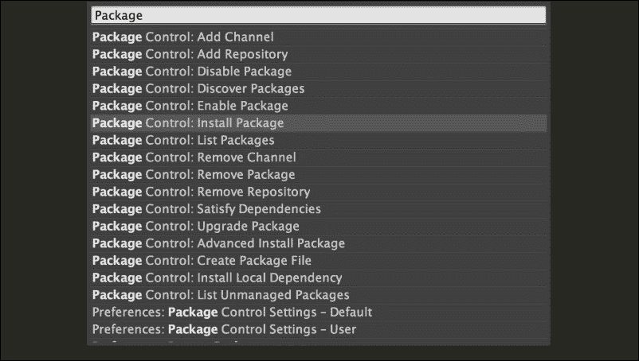
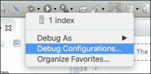
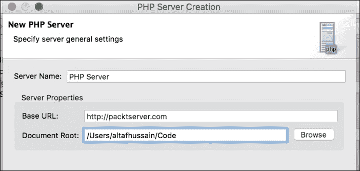
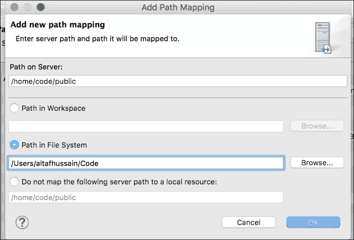
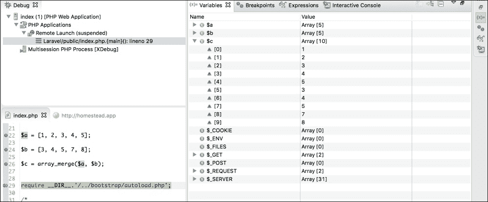
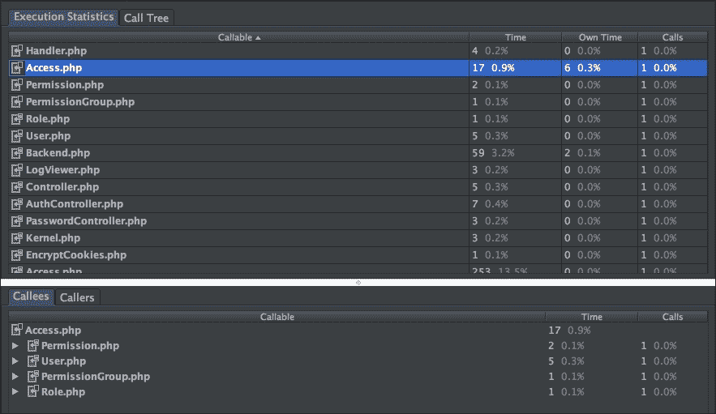
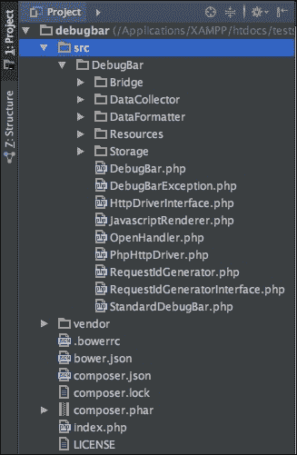

# 五、调试与评测

在开发过程中，每个开发人员都会面临问题，因此不清楚这里到底发生了什么以及为什么会产生问题。大多数情况下，这些问题可能是逻辑问题，也可能是数据问题。总是很难找到这样的问题。调试是一个发现这些问题并加以解决的过程。类似地，我们通常需要知道脚本消耗了多少资源，包括内存消耗、CPU 以及执行所需的时间。

在本章中，我们将介绍以下主题：

*   Xdebug
*   使用升华文本 3 进行调试
*   使用 Eclipse 进行调试
*   使用 Xdebug 进行评测
*   PHP 调试栏

# Xdebug

Xdebug 是PHP 的扩展，它为 PHP 脚本提供调试和分析信息。Xdebug 显示错误的完整跟踪信息，包括函数名、行号和文件名。此外，它还提供了使用不同 IDE 交互调试脚本的能力，如 Sublime Text、Eclipse、PHP Storm 和 Zend Studio。

要检查 PHP 安装中是否安装并启用了 Xdebug，我们需要检查 phpinfo（）的详细信息。在 phpinfo 详细信息页面上，搜索 Xdebug，您将看到类似于以下屏幕截图的详细信息：


这意味着我们的 PHP 安装已经安装了 Xdebug。现在，我们需要配置 Xdebug。Xdebug 配置要么在`php.ini`文件中，要么有单独的`.ini`文件。在安装时，我们将在`/etc/php/7.0/fpm/conf.d/`路径上放置一个单独的`20-xdebug.ini`文件。

### 注

在本书中，我们将使用来自拉维尔的宅地流浪者箱。它在 Ubuntu14.04LTS 安装上提供了完整的工具，包括带有Xdebug、NGINX 和 MySQL 的 PHP7。为了发展的目的，这个流浪汉盒子是一个完美的解决方案。更多信息请访问[https://laravel.com/docs/5.1/homestead](https://laravel.com/docs/5.1/homestead) 。

现在，打开`20-xdebug.ini`文件，并在其中放置以下配置：

```php
zend_extension = xdebug.so
xdebug.remote_enable = on
xdebug.remote_connect_back = on
xdebug.idekey = "vagrant"
```

前面是我们应该使用的启用远程调试和设置 IDE 密钥的最低配置。现在，通过在终端中发出以下命令重新启动 PHP：

```php
sudo service php-fpm7.0 restart

```

现在我们准备调试一些代码。

## 用升华文本调试

Sublime 文本编辑器有一个插件，可用于使用 Xdebug 调试 PHP代码。首先，让我们安装升华文本的`xdebug`包。

### 注

对于本主题，我们将使用升华文本 3，它仍处于测试阶段。使用版本 2 或版本 3 是您自己的选择。

首先，进入**工具****命令托盘**。将显示类似于以下内容的弹出窗口：



选择**软件包控制：安装软件包**，会弹出类似以下截图的窗口：


输入`xdebug`，将显示**Xdebug 客户端**包。单击它并等待一段时间，直到它被安装。

现在，在 Sublime 文本中创建一个项目并保存它。打开升华文本项目文件并在其中插入以下代码：

```php
{
  "folders":
  [
    {
    "follow_symlinks": true,
    "path": "."
  }
],

"settings": {
 "xdebug": {
 "path_mapping": {
 "full_path_on_remote_host" : "full_path_on_local_host"
 },
 "url" : http://url-of-application.com/,
 "super_globals" : true,
 "close_on_stop" : true,
 }
 }
}
```

突出显示的代码很重要，必须为 Xdebug 输入。路径映射是最重要的部分。它应该具有远程主机上应用根目录的完整路径，以及本地主机上应用根目录的完整路径。

现在，让我们开始调试。在项目的根目录下创建一个文件，将其命名为`index.php`，并在其中放置以下代码：

```php
$a = [1,2,3,4,5];
$b = [4,5,6,7,8];

$c = array_merge($a, $b);
```

现在，右键单击编辑器中的一行并选择**Xdebug**。然后点击**添加/删除断点**。让我们添加几个断点，如以下屏幕截图所示：


当一个断点被添加到一条线上时，一个填充的圆圈将显示在靠近行号的左侧，如前面的屏幕截图所示。

现在我们准备调试我们的 PHP 代码。导航至**工具****Xdebug****开始调试（在浏览器中启动）**。一个浏览器窗口将打开应用以及一个升华文本调试会话参数。浏览器窗口将处于加载状态，因为一旦到达第一个断点，执行就会停止。浏览器窗口将类似于以下内容：


一些新的小窗口也将在 Sublime 文本编辑器中打开，该编辑器将显示调试信息以及所有可用变量，如以下屏幕截图所示：


在前面的屏幕截图中，我们的`$a`、`$b`和`$c`数组未初始化，因为执行光标位于第 22 行，并且已停止在那里。此外，所有服务器变量、cookie、环境变量、请求数据以及 POST 和 GET 数据都可以在这里看到。通过这种方式，我们可以调试所有类型的变量、数组和对象，并检查每个变量、对象或数组在某一点上保存的数据。这使我们能够找出不经调试就很难检测到的错误。

现在，让我们向前移动执行光标。右键点击编辑器代码部分，进入**Xdebug****步进入**。光标将向前移动，变量数据可能会根据下一行进行更改。这可以在以下屏幕截图中看到：


通过点击**工具****Xdebug****停止调试**可以停止调试。

## 使用 Eclipse 进行调试

Eclipse 是应用最广泛的最自由、功能最强大的 IDE。它支持几乎所有主要的编程语言，包括 PHP。我们将讨论如何配置 Eclipse 以使用 Xdebug 进行调试。

首先，在 Eclipse 中打开项目。然后，单击工具栏中小错误图标右侧的向下箭头，如以下屏幕截图所示：



之后，点击**调试配置**菜单，将打开以下窗口：


选择左侧面板上的**PHP Web 应用**，然后点击左上角的**添加新**图标。这将添加一个新配置，如前面的屏幕截图所示。给配置一个名称。现在，我们需要在配置中添加一个PHP 服务器。点击右侧面板上的**新建**按钮，将打开以下窗口：



我们将输入服务器名称为`PHP Server`。服务器名称可以是任何名称，只要它是用户友好的，并且可以被识别以供以后使用。在**基本 URL**字段中，输入应用的完整 URL。**文档根目录**应该是应用根目录的本地路径。输入所有有效数据后，点击**下一步**按钮，我们将看到以下窗口：


在**调试器**下拉列表中选择**XDebug**，其余字段保持原样。点击**下一步**按钮，我们将看到路径映射窗口。将正确的本地路径映射到正确的远程路径非常重要。点击**添加**按钮，出现如下窗口：



输入远程服务器上应用的文档根目录的完整路径。然后，在文件系统中选择**路径，输入应用文档根目录的本地路径。点击**确定**，然后点击路径映射窗口中的**完成**按钮。然后，点击下一个窗口中的**完成**完成添加 PHP 服务器。**

现在，我们的配置已经就绪。首先，我们将通过单击行号栏向 PHP 文件添加一些断点，一个小蓝点将出现在那里，如下面的屏幕截图所示。现在，点击工具栏上的小 bug 图标，选择**调试为**，然后点击**PHP Web 应用**。调试过程将启动，并在浏览器中打开一个窗口。它将处于加载状态，就像我们在 Sublime 文本调试中看到的一样。此外，调试透视图将在 Eclipse 中打开，如下所示：



当我们点击右侧栏中的小（**X**）=图标时，我们将看到所有变量。此外，还可以编辑任何变量数据，甚至是任何数组的元素值、对象属性和 cookie 数据。修改后的数据将保留在当前调试会话中。

要进入下一行，只需按*F5*，执行光标就会移动到下一行。要跳出到下一个断点，我们将按*F6*。

# 使用 Xdebug 进行仿形

分析为我们提供了有关在应用中执行的每个脚本或任务的成本的信息。它有助于提供任务所需时间的信息，因此我们可以优化代码以节省时间。

Xdebug 有一个默认禁用的探查器。要启用探查器，请打开配置文件并在其中放置以下两行：

```php
xdebug.profiler_enable=on
xdebug.profiler_output_dir=/var/xdebug/profiler/
```

第一行启用探查器。第二行很重要，我们在其中定义了探查器文件的输出目录。在这个目录中，当执行探查器时，Xdebug 将存储输出文件。输出文件以名称存储，如`cachegrind.out.id`。此文件以简单文本格式包含所有配置文件数据。

现在，我们将简要介绍 Laravel 应用主页的一个简单安装。这是一个全新的、干净的装置。现在我们在浏览器中打开应用，在端追加`?XDEBUG_PROFILE=on`，如下图：

`http://application_url.com?XDEBUG_PROFILE=on`

加载此页面后，将在指定位置生成一个`cachegrind`文件。现在，当我们在文本编辑器中打开文件时，我们只会看到一些文本数据。

### 注

`cachegrind`文件可以用不同的工具打开。Windows 的工具之一是 WinCacheGrind。对于 Mac，我们有 qcachegrind。这些应用中的任何一个都将以这样一种方式查看文件数据，即我们将以一种易于分析的交互式形式查看所有数据。另外，PHP Storm 还有一个很好的 cachegrind 分析器。对于这个主题，我们使用了 PHP Storm IDE。

在 PHP Storm 中打开文件后，我们将获得一个类似于以下屏幕截图的窗口：



如前面的屏幕截图所示，我们在上面的窗格中有执行统计信息，其中显示了每个被调用脚本所花费的时间（以毫秒为单位）以及被调用的次数。在下面的窗格中，我们有调用此脚本的被调用方。

我们可以分析哪个脚本需要更多的时间，并且可以优化该脚本以减少其执行时间。此外，我们可以确定在某一点上是否需要调用特定的脚本。如果没有，那么我们可以删除此呼叫。

# PHP 调试栏

PHP DebugBar 是另一个很棒的工具，它在页面底部显示一个漂亮且完整的信息栏。它可以显示为调试目的而添加的自定义消息和完整的请求信息，包括`$_COOKIE`、`$_SERVER`、`$_POST`、`$_GET`数组以及数据（如果有）。除此之外，PHP DebugBar 还会显示异常（如果有）、执行的数据库查询及其详细信息。它还显示脚本占用的内存以及加载页面的时间。

根据 PHP 调试网站，DebugBar 可以轻松集成到任何应用项目中，并显示来自应用任何部分的调试和分析数据。

它的安装很容易。您可以下载完整的源代码，将其放置在应用中的某个位置，并设置自动加载程序以加载所有类，或者使用 composer 安装它。我们将使用 composer，因为它是安装它的简单而干净的方法。

### 注

Composer 是 PHP 管理项目依赖关系的一个很好的工具。它是用 PHP 编写的，可从[免费获得 https://getcomposer.org/](https://getcomposer.org/) 。我们假定您的计算机上安装了 composer。

在项目的`composer.json`文件中，将以下代码放入所需部分：

```php
"maximebf/debugbar" : ">=1.10.0"
```

保存文件，然后发出以下命令：

```php
composer update

```

编写器将开始更新依赖项并安装编写器。此外，它还将生成自动加载程序文件和/或 DebugBar 所需的其他依赖项。

### 注

只有在系统上全局安装 composer 时，前面的 composer 命令才起作用。如果不是，我们必须使用以下命令：

```php
php composer.phar update
```

前面的命令应该在`composer.phar`所在的文件夹中执行。

安装后，DebugBar 的项目树可以如下所示：



目录的结构可能有点不同，但通常情况下，正如我们前面提到的那样。`src`目录中有完整的 DebugBar 源代码。`vendor`目录中有一些第三方模块或 PHP 工具，它们可能是必需的，也可能不是必需的。另外，请注意，`vendor`文件夹中有自动加载程序，可以自动加载所有类。

现在让我们检查一下我们的安装，看看它是否正常工作。在项目根目录中创建一个新文件，并将其命名为`index.php`。在此之后，将以下代码放入其中：

```php
<?php
require "vendor/autoloader.php";
use Debugbar\StandardDebugBar;
$debugger = new StandardDebugBar();
$debugbarRenderer = $debugbar->getJavascriptRenderer();

//Add some messages
$debugbar['messages']->addMessage('PHP 7 by Packt');
$debugbar['messages']->addMessage('Written by Altaf Hussain');

?>

<html>
  <head>
    <?php echo $debugbarRenderer->renderHead(); ?>
  </head>
  <title>Welcome to Debug Bar</title>
  <body>
    <h1>Welcome to Debug Bar</h1>

  <!—- display debug bar here -->
  <?php echo $debugbarRenderer->render();  ?>

  </body>
</html>
```

在前面的代码中，我们首先包含了 autoloader，它由 composer 生成，用于自动加载所有类。然后，我们使用了`DebugBar\StandardDebugbar`名称空间。在此之后，我们实例化了两个对象：`StandardDebugBar`和`getJavascriptRenderer`。`StandardDebugBar`对象是一个对象数组，其中包含用于不同收集器的对象，例如消息收集器和其他收集器。`getJavascriptRenderer`对象负责在页眉处放置所需的 JavaScript 和 CSS 代码，并在页面底部显示条形图。

我们使用`$debugbar`对象向消息收集器添加消息。收集器负责从不同的源（如数据库、HTTP 请求、消息等）收集数据。

在 HTML 代码的开头部分，我们使用了`$debugbarRenderer`的`renderHead`方法来放置所需的 JavaScript 和 CSS 代码。在此之后，就在`<body>`块结束之前，我们使用同一对象的`render`方法来显示调试栏。

现在，在浏览器中加载应用，如果您注意到浏览器底部有一个条形图，如下图所示，那么恭喜您！DebugBar 安装正确，工作正常。


在右边，我们有应用消耗的内存和加载它的时间。

如果我们点击**消息**选项卡，我们将看到我们添加的消息，如下图所示：


DebugBar 提供数据采集器，用于从不同来源收集数据。这些被称为*基本采集器*，一些数据采集器如下：

*   消息收集器收集日志消息，如前一示例所示
*   TimeData collector 收集总执行时间以及特定操作的执行时间
*   异常收集器显示已发生的所有异常
*   PDO 收集器记录 SQL 查询
*   RequestData collector 收集 PHP 全局变量的数据，如`$_SERVER`、`$_POST`、`$_GET`等
*   配置收集器用于显示数组的任何键值对

此外，还有一些收集器提供了从第三方框架（如 Twig、Swift Mailer、Doctrine 等）收集数据的能力。这些收集器称为桥接收集器。PHP DebugBar 也可以轻松地集成到著名的 PHP 框架中，如 Laravel 和 Zend Framework 2。

### 注

在本书中不可能完整地讨论 PHP 调试栏。因此，这里只提供一个简单的介绍。PHP DebugBar 有一个很好的文档，提供了完整的细节和示例。文件可在[中找到 http://phpdebugbar.com/docs/readme.html](http://phpdebugbar.com/docs/readme.html) 。

# 总结

在本章中，我们讨论了调试 PHP 应用的不同工具。我们使用 Xdebug、Sublime Text 3 和 Eclipse 来调试我们的应用。然后，我们使用 Xdebug profiler 分析应用，以了解执行统计信息。最后，我们讨论了调试应用的 PHP DebugBar。

在下一章中，我们将讨论负载测试工具，我们可以使用这些工具在应用上放置负载或虚拟访问者，以便对其进行负载测试，并找出应用可以承受的负载量，以及负载对性能的影响。