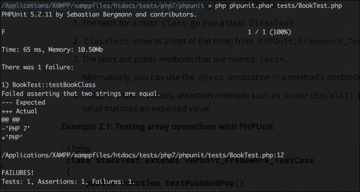

# 七、PHP 编程的最佳实践

到目前为止，我们讨论了与性能相关的主题。现在，在本章中，我们将研究 PHP 应用开发和部署中的最佳实践。这是一个广泛的话题，但我们将简要介绍一下。PHP 为各级程序员提供了轻松快速地编写高质量代码的能力。然而，当应用发展到更复杂的性质时，我们忘记了遵循最佳实践。要生成高性能的 PHP 应用，必须记住每行代码的性能。

我们将讨论以下主题：

*   编码风格
*   设计模式
*   面向服务的体系结构（SOA）
*   测试驱动开发（TDD）和 PHPUnit 测试
*   PHP 框架
*   版本控制系统和 Git
*   部署

# 编码风格

有太多的编码风格，比如 PSR-0、PSR-1、PSR-2、PSR-3 等等。程序员可以根据需要使用不同的标准，但必须遵循库中已经使用的标准或正在使用的框架，以使代码更具可读性。例如，Laravel 使用 PSR-1 和 PSR-4 编码标准，因此如果我们在 Laravel 开发，我们应该遵循这些编码标准。一些 PHP 框架，如 Yii 2 和**Zend Framework 2**遵循 PSR-2 编码标准。然而，这些框架都不遵循单一标准；根据他们的要求，他们中的大多数遵循混合标准。

重要的一点是遵循应用中使用的库中使用的标准。组织也可以将自己的编码标准用于内部目的。这不是编码的要求；这是对可读性和生成其他人能够理解的高质量代码的要求。

**PHP 框架互操作组**（**PHP-FIG**是一个成员定义 PHP 编码标准的组。有关 PSR标准的完整详细信息，请访问其网站[http://www.php-fig.org/](http://www.php-fig.org/) 。

与其讨论特定的编码标准，不如讨论 PHP 编码风格的最佳实践：

*   类名中每个单词的第一个字母必须是大写。开始大括号应位于类声明后的行上，结束大括号应位于类结束行后的行上。这里有一个例子：

    ```php
    class Foo
    {
      …
      …
      …
    }
    ```

*   类方法和函数名应遵循 camel 大小写命名约定。开始大括号应位于类声明的下一行，结束大括号应位于函数定义末尾的一行。方法名和括号之间不应该有空格。此外，第一个参数、左括号、最后一个参数和右括号之间不应有空格。此外，参数和该参数末尾的逗号之间不应有空格，但逗号和下一个参数之间应有空格。这里有一个例子：

    ```php
    public function phpBook($arg1, $arg2, $arg3)
    {
      …
      …
      …
    }
    ```

*   如果存在名称空间声明，则其声明后必须有一个空行。如果存在 use 声明，则所有这些声明都必须遵循该命名空间的声明。每行必须有一个 use 声明，并且 use 块后面必须有一个空格。此外，`extends`和`implements`关键字必须与类声明在同一行。这里有一个例子：

    ```php
    namespace Packt\Videos;

    use Packt\Books;
    use Packt\Presentations;

    class PacktClass extends VideosClass implements BaseClass
    {
      …
      …
      …
    }
    ```

*   必须为所有属性声明可见性，并且属性必须为 camel 大小写。此外，对于私有或受保护的可见性，属性的前面不得加下划线。请看以下示例：

    ```php
    class PacktClass
    {
      public $books;
      private $electronicBooks;
      …
      …
      …
    }
    ```

*   如果存在`abstract`关键字，则类必须在`class`关键字之前，方法必须在`final`关键字之前。另一方面，`static`关键字必须位于方法可见性之后。看看这个例子：

    ```php
    abstract class PacktClass
    {
      final public static function favoriteBooks()
      {
        …
        …
        …
      }
    }
    ```

*   所有 PHP 关键字必须使用小写，包括`true`和`false`关键字。常量必须声明并在大写字母中使用。
*   对于所有控件结构，控件结构关键字后必须有空格。如果此控件结构有表达式，则包含此表达式的括号与后面的代码块之间不得有空格。括号和起始大括号后必须有空格。起始支撑必须与控制结构在同一条线上。关闭撑杆必须在阀体末端后的管线上。请参阅以下代码以便更好地理解：

    ```php
    if ($book == "PHP 7") {
      …
      …
      …
    } else {
      …
      …
      …
    }
    ```

*   对于循环，空格必须如以下示例所示：

    ```php
    for ($h = 0; $h < 10; $h++) {
      …
      …
      …
    }

    foreach ($books as $key => $value) {
      …
      …
      …
    }

    while ($book) {
      …
      …
      …
    }
    ```

在本书中，我没有遵循大括号与控件结构声明在同一行的规则，而是始终在声明的下一行使用它。我没有发现它更清楚；这是个人的选择，任何人都可以遵循这里提到的标准。

标准很好遵循，因为它们使代码更具可读性和专业性。然而，永远不要试图发明自己的新标准；始终遵循那些已经发明并被社区所遵循的原则。

# 测试驱动开发（TDD）

测试驱动开发是在开发过程中测试应用各个方面的过程。要么在开发之前定义测试，然后进行开发以通过这些测试，要么构建类和库，然后进行测试。测试应用是非常重要的，在没有测试的情况下启动应用就像在没有降落伞的情况下从 30 层楼高的建筑物上跳下一样。

PHP 不提供任何内置功能进行测试，但还有其他测试框架可用于此目的。PHPUnit 是使用最广泛的框架或库之一。它是一个非常强大的工具，提供了许多功能。现在，让我们看一看。

PHPUnit 的安装很容易。只需下载它并将其放在项目根目录中，以便可以从命令行访问它。

### 注

PHPUnit 安装和基本细节，包括功能和示例，可在[中找到 https://phpunit.de/](https://phpunit.de/) 。

让我们举一个简单的例子。我们有一个`Book`类，如下所示：

```php
class Book 
{
  public $title;
  public function __construct($title)
  {
    $this->title = $title;
}

  public function getBook()
  {
    return $this->title;
  }
}
```

这是一个简单类的示例，该类在实例化时初始化`title`属性。调用`getBook`方法时，返回书的标题。

现在，我们想做一个测试，检查`getBook`方法是否返回`PHP 7`作为标题。因此，请执行以下步骤来创建测试：

1.  在项目的根目录下创建一个`tests`目录。在`tests`目录中创建一个`BookTest.php`文件。
2.  现在，在`BookTest.php`文件中放置以下代码：

    ```php
    include (__DIR__.'/../Book.php');

    class BookTest extends PHPUnit_Framework_TestCase 
    {
      public function testBookClass()
      {
        $expected = 'PHP 7';
        $book = new Book('PHP 7');
        $actual = $book->getBook();
        $this->assertEquals($expected, $book);
      }
    }
    ```

3.  现在，我们已经编写了第一个测试。注意，我们将类命名为`BookTest`，它扩展了`PHPUnit_Framework_TestCase`类。我们可以随意命名我们的测试类。但是，名称应该易于识别，以便我们知道这是为需要测试的类编写的。
4.  Then, we added a method named `testBookClass`. We are also free to select whatever name we want to give to this method, but it should start with the word `test`. If not, PHPUnit will not execute the method and will issue a warning—in our case, for the preceding test class—that no tests were found.

    在`testBookClass`方法中，我们创建了`Book`类的一个对象，并将`PHP 7`作为标题传递。然后，我们使用`Book`类的`getBook`方法获取标题。重要的部分是`testBookClass`方法的最后一行，它执行断言并检查`getBook`返回的数据是否是所需的数据。

5.  Now, we are ready to run our first test. Open the command line or terminal in the root of the project and issue the following command:

    ```php
    php phpunit.phar tests/BookTest.php

    ```

    当执行该命令时，我们将有一个类似于以下屏幕截图的输出：

    

    我们的测试成功执行，因为它符合测试中定义的标准。

6.  现在，让我们稍微更改一下类，并将`PHP`传递给`Book`类，如下代码所示：

    ```php
    public function testBookClass()
    {
      $book = new Book('PHP');
      $title = $book->getBook();
      $this->assertEquals('PHP 7', $book);
    }
    ```

7.  Now, we are looking for PHP 7, and our `Book` class returns `PHP`, so it does not pass our test. After executing this test, we will have a failure, as shown in the following screenshot:

    

    如前一个屏幕截图所示，我们预期为`PHP 7`，实际结果为`PHP 7`。`–`符号表示期望值，`+`符号表示实际值。

    ### 注

    在前面的主题中，我们讨论了如何在库上执行测试。我们只讨论了一个简单的基本测试。PHPUnit 不限于这些简单的测试，但是完全覆盖 PHPUnit 超出了本书的范围。关于 PHPUnit 的一本非常好的书是由 Packt 出版社出版的*PHPUnit Essentials*。

# 设计模式

设计模式解决了一个特定的问题。它不是一种工具；它只是描述如何解决特定问题的描述或模板。设计模式很重要，它们在编写干净清晰的代码方面发挥了很好的作用。

PHP 社区中使用最广泛的设计模式之一是**模型视图控制器**（**MVC**模式）。大多数 PHP 框架都是基于这种模式构建的。MVC 建议您将业务逻辑和数据操作（即模型）与表示（视图）分开。控制器只是在模型和视图之间扮演中间人的角色，使它们之间的通信成为可能。模型和视图之间没有直接的通信。如果视图需要任何类型的数据，它会向控制器发送请求。控制器知道如何根据该请求操作，如果需要，调用模型对数据执行任何操作（获取、插入、验证、删除等）。最后，控制器向视图发送响应。

在最佳实践中，使用胖模型和瘦控制器。这意味着控制器仅用于对请求执行特定操作，而不用于其他操作。即使在一些现代框架中，验证也从控制器中移出，并在模型级别执行。这些模型对数据执行所有操作。在现代框架中，模型被视为一个层，可以有多个部分，如业务逻辑、**创建读取更新删除**（**CRUD**）数据库操作、数据映射器模式和服务等。因此，满负荷的模型和控制器只是坐在那里享受懒散的工作负载。

另一种广泛使用的设计模式是工厂设计模式。此模式仅创建需要使用的对象。另一个好的模式是观察者模式，在该模式中，对象对其上的特定事件或任务调用不同的观察者。主要用于事件处理。另一个广泛使用的模式是**单例模式**，当需要在应用的整个执行过程中只使用类的单个对象时，可以使用该模式。*无法序列化和克隆单例对象*。

# 面向服务架构（SOA）

在面向服务的体系结构中，应用的组件按照定义的协议相互提供服务。每个组件彼此松散地耦合，它们之间的唯一通信方式是通过它们提供的服务。

在 PHP 中，Symfony 提供了实现 SOA 的最佳方式，因为它主要是一个以 HTTP 为中心的框架。Symfony 是其他 PHP 框架（如 zendframework、Yii、Laravel 等）广泛使用的最成熟、经过良好测试的库集合。

让我们考虑一个场景，我们有一个网站和移动应用的后端和前端。通常，在大多数应用中，后端和前端在相同的代码库和单个访问点上运行，并且为移动应用构建了一个 API 或 web 服务以与该后端通信。这是好的，但我们需要伟大的。因此，对于高性能和可扩展的应用，独立的组件彼此独立运行。如果它们需要相互通信，则通过 web 服务进行通信。

Web 服务是前端和后端之间以及后端和移动应用之间的中心通信点。后端是数据和任何其他业务逻辑的主要枢纽。它可以是独立的，并且可以使用任何编程语言（如 PHP）构建。前端可以使用普通 HTML/CSS、AngularJS、Node.js、jQuery 或任何其他前端技术构建。类似地，移动应用可以是本地的，也可以基于跨平台技术构建。后端并不关心前端和移动应用是基于什么构建的。

# 始终面向对象、可重用

对于一个小的、单页的应用来说，这似乎很困难，在这个应用中只发生了一些事情，但事实并非如此。这些类很容易处理，代码也总是清晰的。此外，这些类将应用逻辑与视图分开。这使事情更符合逻辑。在早期，当使用结构代码时，必须在视图文件或单独的文件中创建一组函数，这太容易了。然而，当应用变得更复杂时，处理起来就更困难了。

始终尝试创建松散耦合的类，以使它们在其他应用中更具可重用性。另外，始终在类的每个方法中执行单个任务。

# PHP 框架

我们都知道框架，它们对程序员的生活不是必不可少的。有很多框架，每个框架在一些特性上都有自己的优势。所有框架都很好，但使框架不适合应用的是应用的需求。

假设我们想构建一个企业级 CRM 应用，哪个框架最适合我们？这是最重要、最混乱、最浪费时间的问题。首先，我们需要了解 CRM 应用的完整需求、使用容量、功能、数据安全性和性能。

# 版本控制系统（VCS）和 Git

版本控制器系统提供了适当维护应用的代码、更改和版本的灵活性。使用 VCS，一个完整的团队可以在一个应用上协同工作，他们可以将其他团队成员的更改和他们自己对系统的更改拉到一起，而不会出现任何大问题。在发生灾难时，VCS 提供了退回到旧的、更稳定的应用版本的能力。

哦，等等！我们在谈论风投吗？我们提到 Git 了吗？不！那么，让我们从 Git 开始。

Git 是一个强大的工具。它监视分支中每个文件的更改，当推送到远程分支时，只上载更改的文件。Git 保存文件更改的历史记录，并为您提供比较更改文件的能力。

### 注

Packt Publishing 出版的*Git Essentials*是一本关于 Git 的内容丰富的好书。此外，有关 Git 的官方免费书籍可在[上找到 https://git-scm.com/book/en/v2](https://git-scm.com/book/en/v2) 。

# 部署和持续集成（CI）

FTP 已经过时了。这在今天是不可行的，它使事情变得缓慢，并且正常的 FTP 连接是不安全的。团队很难使用 FTP部署他们的更改，因为这会在他们的代码中产生巨大的冲突，这可能会导致问题，同时上传更改并可以覆盖彼此的更改。

使用 Git 版本控制系统，如 GitHub、GitLab 和 Bitbucket，我们可以使部署自动化。不同的开发人员使用不同的设置进行自动部署，这完全取决于他们自己的选择和易用性。使用自动部署的一般规则是使团队易于部署，并且不使用 FTP。

以下是展开设置的一般流程图：


如前面的流程图所示，我们有两台服务器：暂存或测试服务器和生产服务器。在登台服务器上，我们有一个网站的精确副本来测试新功能和其他功能，而生产服务器有我们的实时网站。

现在，我们有了一个存储库，它有两个主要分支：主分支和生产分支。主分支用于开发和测试目的，生产分支用于最终生产功能。请注意，生产分支只应接受合并，而不应接受提交，以便生产环境完全安全。

现在，假设我们想在应用中添加一个客户注册功能。我们将执行以下步骤：

1.  要做的第一件也是最重要的事情是从生产部门主管创建一个新的部门。让我们把这个分支命名为`customer-registration`。
2.  现在，将所有新功能添加到此`customer-registration`分支，并在本地开发服务器上验证时，将此分支合并到本地主分支。
3.  将新分支合并到本地主分支后，将主分支推送到远程主分支。成功推送将导致新功能移动到临时服务器。
4.  现在，在临时服务器上测试所有新功能。
5.  当一切正常时，将远程主分支与远程生产分支合并。这将导致所有更改移动到生产分支，而此合并将导致所有新更改移动到生产服务器。
6.  与前一个类似的理想设置使得部署非常容易，一个完整的团队可以处理应用，而不管地理位置如何。如果在部署过程中出现任何问题，可以很容易地退回到生产分支的旧版本。

**持续集成**（**CI**）是一种技术，其中团队的所有成员都必须将其代码集成到一个共享存储库中，然后团队成员的每次检查都通过自动构建进行验证，以捕获早期阶段的错误和问题。

有几种工具可用于 PHP 的 CI；其中一些是 PHPCI、Jenkins、Travis CI 和其他。

# 总结

在本章中，我们讨论了一些最佳实践，包括编码标准和样式、PHP 框架、设计模式、Git 和部署。此外，我们还讨论了 PHPUnit 框架，该框架用于针对测试测试类和库。此外，我们还讨论了面向服务的设计，它在为应用创建 API 方面起着重要作用。

在本书中，我们研究了开发环境的设置，包括 Linux 服务器，特别是 Debian 和 Ubuntu，我们还讨论了 Vagrant。PHP 的新特性也与示例代码一起列出。您详细阅读了我们可以用来提高应用和数据库性能的工具。此外，我们还讨论了应用的调试和压力或负载测试，以及编写高质量代码的一些最佳实践。

我们主要通过简单的例子总结工具和技术，向读者介绍这些工具和技术。很有可能每种工具和技术都有自己的书籍，用于更高级的用途。我们建议您继续使用这些工具和技术，并对它们的提前使用进行更多的研究。祝你好运！