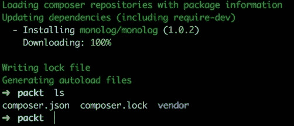
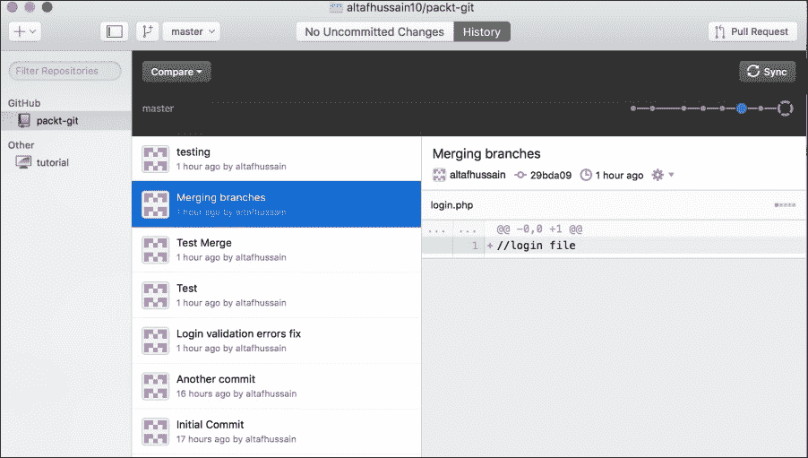

# 附录 A：使生活更轻松的工具

本书介绍了很多内容，从 PHP7 中的新特性开始，到编程中的最佳技术结束。在每一章中，我们都使用并讨论了一些工具，但由于章节和本书的篇幅有限，我们没有对这些工具进行太多的详细介绍。在本附录中，我们将更详细地讨论其中三种工具。我们将讨论的工具如下：

*   创作者
*   吉特
*   咕噜手表

那么，让我们开始吧。

# Composer–PHP 的依赖项管理器

Composer 是一个 PHP 依赖项管理工具，它使我们能够为 PHP 应用程序定义依赖项，并由 Composer 安装/更新它们。Composer 完全是用 PHP编写的，是一个 PHP 归档（PHAR）格式的应用程序。

### 注

Composer 从[下载依赖项 https://packagist.org/](https://packagist.org/) 。应用程序的任何依赖项都可以通过 Composer 安装，只要它在 PackageGist 上可用。此外，如果 Packagist 提供完整的应用程序，则可以通过 Composer 安装它们。

## 作曲家安装

Composer 是一个命令行工具，可以在操作系统中全局安装，也可以将`composer.phar`文件放在应用程序的根目录中，然后从命令行执行。对于 Windows，提供了一个可执行的安装文件，可用于全局安装 Composer。对于本书，我们将在全球范围内遵循 Debian/Ubuntu 的说明。执行以下步骤：

1.  发出以下命令以下载 Composer 安装程序。文件名为`installer`，只有通过以下代码安装 PHP 后才能执行：

    ```php
    Wget https://getcomposer.org/installer

    ```

2.  Issue the following command to install it globally on Debian or Ubuntu:

    ```php
    Php install --install-dir=/usr/local/bin --filename=composer

    ```

    此命令将下载 Composer 并将其安装在文件名为`composer`的`/usr/local/bin`目录中。现在，我们将能够在全球范围内运行 Composer。

3.  Verify the Composer installation by issuing the following command in the terminal:

    ```php
    Composer --version

    ```

    如果显示 Composer 版本，则 Composer 将在全局范围内成功安装。

    ### 注

    如果 Composer 在本地安装到应用程序，那么我们将有一个`composer.phar`文件。这些命令是相同的，但是所有的命令都应该用 PHP 执行。例如，`php composer.phar --version`将显示作曲家版本。

现在，Composer 已成功安装并开始工作；是时候使用它了。

## 使用作曲家

要在我们的项目中使用 Composer，我们需要一个`composer.json`文件。此文件包含项目所需的所有依赖项和一些其他元数据。Composer 使用此文件安装和更新不同的库。

假设我们的应用程序需要以不同的方式记录不同的信息。为此，我们可以使用`monolog`库。首先，我们将在应用程序的根目录中创建一个`composer.json`文件，并向其中添加以下代码：

```php
{
  "require": {
    "monolog/monolog": "1.0.*"
  }
}
```

保存文件后，执行以下命令以安装应用程序的依赖项：

```php
Composer install
```

此命令将下载依赖项并将其放置在`vendor`目录中，如以下屏幕截图所示：



如前面的截图所示，monolog 版本 1.0.2 已下载，并创建了一个`vendor`目录。`monolog`库位于该目录中。此外，如果包必须自动加载信息，则 Composer 会将库放在 Composer autoloader 中，该库也会放在`vendor`目录中。因此，任何新的库或依赖项都将在应用程序执行期间自动加载。

还可以看到一个新文件，即`composer.lock`。当 Composer 下载并安装任何依赖项时，确切的版本和其他信息会写入此文件，以将应用程序锁定到此特定版本的依赖项。这将确保所有团队成员或任何想要设置应用程序的人都将使用完全相同版本的依赖项，从而减少使用不同版本的依赖项的机会。

现在，Composer 被广泛用于包管理。大型开源项目，如 Magento、Zend Framework、Laravel、Yii 和许多其他项目，都可以通过 Composer 轻松安装。我们将在下一个附录中使用 Composer 安装其中一些。

# Git–版本控制系统

Git 是应用最广泛的版本控制系统。据 Git 官方网站称，这是一个分布式版本的控制系统，能够快速高效地处理从小型到大型的所有项目。

## Git 安装

Git 可用于所有主要的操作系统。对于 Windows，提供了一个可执行的安装文件，可用于安装 Git 并在命令行中使用它。在 OSX 上，Git 已经安装，但如果找不到，可以从他们的官方网站下载。要在 Debian/Ubuntu 上安装 Git，只需在终端中发出以下命令：

```php
sudo apt-get install git

```

安装后，发出以下命令检查是否正确安装：

```php
git –version

```

然后，我们将看到当前安装的 Git 版本。

## 使用 Git

为了更好地理解 Git，我们将从一个测试项目开始。我们的测试项目名称为`packt-git`。对于这个项目，我们还创建了一个名为`packt-git`的 GitHub 存储库，它将推送我们的项目文件。

首先，我们将通过发出以下命令在项目中初始化 Git：

```php
git init

```

前面的命令将初始化项目根目录中的空 Git 存储库，并且头部将保留在主分支上，主分支是每个 Git 存储库的默认分支。它将创建一个隐藏的`.git`目录，其中包含关于存储库的所有信息。接下来，我们将添加一个将在 GitHub 上创建的远程存储库。我在 GitHub 创建了一个测试存储库，它的 URL 为[https://github.com/altafhussain10/packt-git.git](https://github.com/altafhussain10/packt-git.git) 。

现在，发出以下命令将 GitHub 存储库添加到空存储库中：

```php
git remote add origion https://github.com/altafhussain10/packt-git.git

```

现在，在项目根目录下创建一个`README.md`文件，并向其中添加一些内容。`README.md`文件用于显示存储库信息以及 Git 上存储库的其他详细信息。此文件还用于显示有关如何使用存储库和/或创建此存储库的项目的说明。

现在，发出以下命令以查看 Git 存储库的状态：

```php
git status

```

此命令将显示存储库的状态，如以下屏幕截图所示：


正如前面的屏幕截图所示，我们的存储库中有一个尚未提交的未跟踪文件。首先，我们将通过在终端中发出以下命令来添加要跟踪的文件：

```php
git add README.md 

```

`git add`命令使用工作树中找到的当前内容更新索引。此命令添加对路径所做的所有更改。有一些选项可用于添加某些特定更改。我们之前使用的命令只会将`README.md`文件添加到存储库中的轨迹中。因此，如果要跟踪所有文件，则将使用以下命令：

```php
git add

```

这将开始跟踪当前工作目录或当前分支根目录中的所有文件。现在，如果我们想要跟踪一些特定的文件，比如所有扩展名为`.php`的文件，那么我们可以如下使用它：

```php
git add '*.php

```

这将添加所有扩展名为`.php`的文件进行跟踪。

接下来，我们将使用以下命令将更改或添加提交到存储库：

```php
git commit –m "Initial Commit"

```

`git commit`命令将所有更改提交到本地存储库。`-m`标志指定发送给`commit`的任何日志消息。请记住，更改仅提交到本地存储库。

现在，我们将使用以下命令将更改推送到远程存储库：

```php
git push –u origion master

```

前面的命令将把所有更改从本地存储库推送到远程存储库或源。`-u`标志用于设置上游，它将本地回购链接到远程中央回购。当我们第一次推动我们的更改时，我们必须使用`-u`选项。在此之后，我们可以只使用以下命令：

```php
git push

```

这将把所有更改推送到我们所在的当前分支的主存储库中。

## 新建分支机构合并

在开发过程中总是需要新的分支机构。如果需要任何类型的更改，最好为这些更改创建一个新分支。然后，在此分支上进行所有更改，最后提交、合并并将其推送到远程源。

为了更好地理解这一点，假设我们想要修复登录页面中的一个问题。问题在于验证错误。我们将把我们的新分公司命名为`login_validation_errors_fix`。最好给分支机构起一个更容易理解的名字。此外，我们希望从主分支负责人创建此新分支。这意味着我们希望新分支继承来自主分支的所有数据。因此，如果我们不在主分支，我们必须使用以下命令切换到主分支：

```php
git checkout master

```

前面的命令将把我们切换到主分支，无论我们在哪个分支。要创建分支，请在终端中发出以下命令：

```php
git branch login_validation_errors_fix

```

现在，我们的新分支是从主分支负责人创建的，所以所有的更改都应该对这个新分支进行。完成所有更改和修复后，我们必须将更改提交到本地和远程存储库。请注意，我们没有在远程存储库中创建新分支。现在，让我们使用以下命令提交更改：

```php
git commit -a -m "Login validation errors fix"

```

请注意，我们没有使用`git add`来添加更改或新添加。为了自动提交我们的更改，我们使用了`commit`中的`-a`选项，它将自动添加所有文件。如果使用了`git add`，则无需使用`commit`中的`-a`选项。现在，我们的更改被提交到本地存储库。我们需要将更改推送到远程原点。在终端中发出以下命令：

```php
git push -u origion login_validation_errors_fix

```

前面的命令将在远程存储库中创建一个新分支，将同一本地分支的跟踪设置为远程分支，并将所有更改推送到远程分支。

现在，我们想将更改与我们的主分支合并。首先，我们需要使用以下命令切换到主分支：

```php
git checkout master

```

接下来，我们将发出以下命令，将我们的新分支`login_validation_errors_fix`与主分支合并：

```php
git checkout master
git merge login_validation_errors_fix 
git push

```

切换到要合并新分支的分支非常重要。在此之后，我们需要使用`git merge branch_to_merge`语法将此分支与当前分支合并。最后，我们可以推到遥远的原点。现在，如果我们看看我们的远程存储库，我们将看到新的分支以及主分支中的更改。

## 克隆存储库

有时，我们需要处理托管在存储库中的项目。为此，我们将首先克隆此存储库，将完整的存储库下载到本地系统，然后为此远程存储库创建本地存储库。其余工作与我们之前讨论的相同。要克隆存储库，我们首先应该知道远程存储库的 web 地址。假设我们要克隆`PHPUnit`存储库。如果我们转到 PHPUnit 的 GitHub 存储库，我们将在右上方看到存储库的网址，如下面的屏幕截图所示：


**HTTPS**按钮后面的 URL 是此存储库的网址。复制此 URL 并使用以下命令克隆此存储库：

```php
git clone https://github.com/sebastianbergmann/phpunit.git

```

这将开始下载存储库。完成后，我们将有一个`PHPUnit`文件夹，其中包含存储库及其所有文件。现在，可以执行前面主题中提到的所有操作。

## 网钩

Git 最强大的特性之一是 webhooks。Webhook 是在存储库上发生特定操作时触发的事件。如果为`Push`请求创建了一个事件或钩子，那么每次推送到此存储库时都会触发此钩子。

要将 webhook 添加到存储库，请单击右上方存储库的**设置**链接。在新页面的左侧，我们将有一个**Webhooks 和服务**链接。单击它，我们将看到一个类似于以下页面的页面：


正如前面的屏幕截图所示，我们必须输入一个有效负载 URL，它将在每次触发所选事件时被调用。在**内容类型**中，我们将选择有效负载发送到我们的 URL 的数据格式。在事件部分，我们可以选择是只需要推送事件还是所有事件；我们可以选择要为其触发此钩子的多个事件。保存此钩子后，每次发生所选事件时都会触发它。

Webhook 主要用于部署。推送更改时，如果推送事件有 webhook，则调用特定 URL。然后，这个 URL 执行一些命令来下载更改并在本地服务器上处理它们，并将它们放置在适当的位置。此外，Webhook 还用于持续集成和部署到云服务。

## 用于管理存储库的桌面工具

有几种工具可以用于管理 Git 存储库。GitHub 提供了自己的工具 GitHub Desktop，可用于管理 GitHub 存储库。这可用于创建新的存储库、查看历史记录以及推、拉和克隆存储库。它提供了我们可以在命令行中使用的所有功能。下面的屏幕截图显示了我们的测试`packt-git`存储库：



### 注

GitHub 桌面可从[下载https://desktop.github.com/](https://desktop.github.com/) 仅适用于 Mac 和 Windows。此外，GitHub 桌面只能与 GitHub 一起使用，除非使用一些黑客使其与其他存储库（如 GitLab 或 Bitbucket）一起工作。

另一个强大的工具是 SourceTree。SourceTree 可以轻松地与 GitHub、GitLab 和 Bitbucket 一起使用。它提供了管理存储库、拉、推、提交、合并和其他操作的完整功能。SourceTree 为分支和提交提供了一个非常强大和漂亮的图形工具。以下是用于连接我们的`packt-git`测试存储库的 SourceTree 的屏幕截图：


除了前面的两个不错的工具外，每个开发 IDE 都提供了版本控制系统的全面支持，还提供了修改和新增文件的不同颜色等功能。

### 注

Git 是一个强大的工具；本附录中不可能包含。有好几本书可用，但 GitBook 是一个非常好的起点。可从[以不同格式下载 https://git-scm.com/book/en/v2](https://git-scm.com/book/en/v2) 或可在线阅读。

# 咕噜声手表

我们在[第 3 章](3.html "Chapter 3. Improving PHP 7 Application Performance")*中研究了 Grunt，以提高 PHP7 应用程序性能*。我们只使用它来合并 CSS 和JavaScript 文件并缩小它们。然而，Grunt 并非仅用于此目的。它是一个 JavaScript 任务运行程序，可以通过查看特定文件的更改或手动运行任务来运行任务。我们研究了如何手动运行任务，所以现在我们将研究在进行某些更改时如何使用 grunt watch 运行特定任务。

Grunt watch 非常有用，并且节省了大量时间，因为它自动运行特定的任务，而不是每次我们更改某些内容时手动运行任务。

让我们回顾一下[第 3 章](3.html "Chapter 3. Improving PHP 7 Application Performance")*中的例子，即提高 PHP7 应用程序性能*。我们使用 Grunt 组合并压缩 CSS 和 JavaScript 文件。为此，我们创建了四个任务。一个任务是合并所有 CSS 文件，第二个任务是合并所有 JavaScript 文件，第三个任务是压缩 CSS 文件，第四个任务是压缩所有 JavaScript 文件。如果每次进行更改时都手动运行所有这些任务，这将非常耗时。Grunt 提供了一个名为 watch 的功能，它监视文件更改的不同目的地，如果发生任何更改，它将执行 watch 中定义的任务。

首先，检查`grunt watch`模块是否已安装。检查`node_modules`目录，查看是否有另一个名为`grunt-contrib-watch`的目录。如果存在此目录，则已安装 watch。如果目录不存在，则只需在`GruntFile.js`所在的项目根目录的终端中发出以下命令：

```php
npm install grunt-contrib-watch

```

前面的命令将安装 Grunt watch，`watch`模块将提供`grunt-contrib-watch`目录。

现在，我们将修改此`GruntFile.js`文件以添加`watch`模块，该模块将监控我们定义目录中的所有文件，如果发生任何更改，它将自动运行这些任务。这将在反复手动执行这些任务时节省大量时间。看看下面的代码；突出显示的代码是修改的部分：

```php
module.exports = function(grunt) {
  /*Load the package.json file*/
  pkg: grunt.file.readJSON('package.json'),
  /*Define Tasks*/
  grunt.initConfig({
    concat: {
      css: {
      src: [
        'css/*' //Load all files in CSS folder
],
      dest: 'dest/combined.css' //Destination of the final combined file.

      },//End of CSS
js: {
      src: [
        'js/*' //Load all files in js folder
],
       dest: 'dest/combined.js' //Destination of the final combined file.

      }, //End of js

}, //End of concat
cssmin:  {
  css: {
    src : 'dest/combined.css',
    dest : 'dest/combined.min.css' 
}
}, //End of cssmin
uglify: {
  js: {
        files: {
        'dest/combined.min.js' : ['dest/combined.js']//destination Path : [src path]
}
}
}, //End of uglify

//The watch starts here
watch: {
 mywatch: {
 files: ['css/*', 'js/*', 'dist/*'],
 tasks: ['concat', 'cssmin', 'uglify']
 },
},
}); //End of initConfig

grunt.loadNpmTasks('grunt-contrib-watch'); //Include watch module
grunt.loadNpmTasks('grunt-contrib-concat');
grunt.loadNpmTasks('grunt-contrib-uglify');
grunt.loadNpmTasks('grunt-contrib-cssmin');
grunt.registerTask('default', ['concat:css', 'concat:js', 'cssmin:css', 'uglify:js']);
}; //End of module.exports
```

在前面突出显示的代码中，我们添加了一个`watch`块。`mywatch`标题可以是任何名称。`files`块是必需的，它采用一个源路径数组。Grunt watch 监视这些目标中的更改，并执行 tasks 块中定义的任务。此外，`tasks`块中提到的任务已经在`GruntFile.js`中创建。此外，我们必须使用`grunt.loadNpmTasks`加载`watch`模块。

现在打开`GruntFile.js`所在项目根节点的终端，运行以下命令：

```php
grunt watch

```

Grunt 将开始监视源文件的更改。现在，修改`GruntFile.js`中`files`块中定义的路径中的任何文件并保存该文件。一旦文件被保存，任务将被执行，并且任务的输出将显示在终端中。在以下屏幕截图中可以看到示例输出：


可以根据需要在`watch`块中查看尽可能多的任务，但这些任务应该出现在`GruntFile.js`中。

# 总结

在本附录中，我们讨论了 Composer 以及如何使用它来安装和更新软件包。此外，我们还详细讨论了 Git，包括推、拉、提交、创建分支以及合并不同的分支。此外，我们还讨论了 Git 挂钩。最后，我们讨论了 Grunt watch，并创建了一个 watch，每当`GruntFile.js`中定义的文件路径发生任何更改时，它都会执行四个任务。