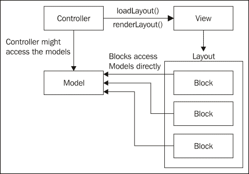
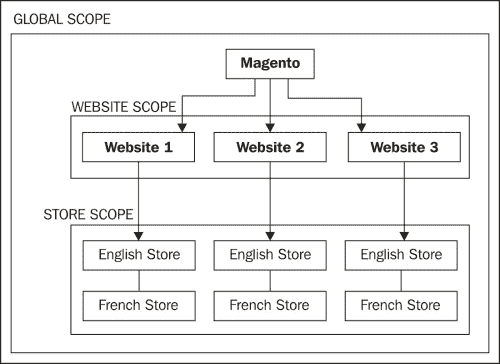
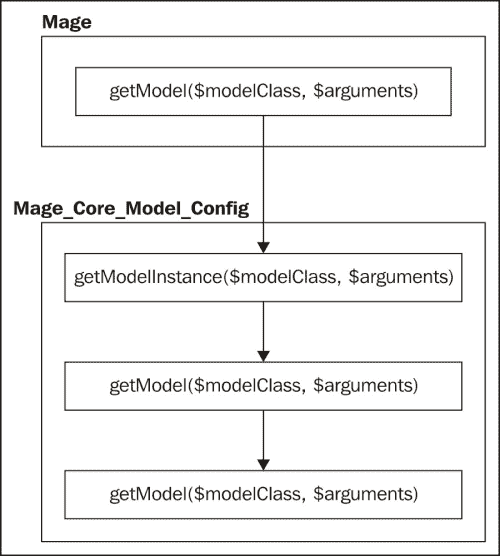
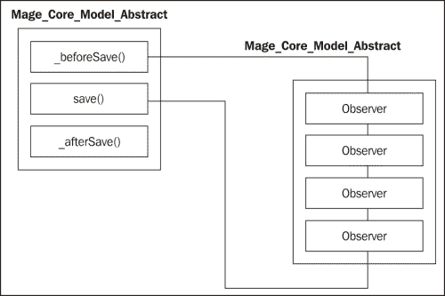

# 第 2 章：开发人员的 Magento 基础知识

在本章中，我们将介绍使用 Magento 的基本概念。我们将学习 Magento 是如何构造的，我们将讨论 Magento 灵活性的来源，即其模块化架构。

Magento是一个灵活而强大的系统。不幸的是，这也增加了一定程度的复杂性。目前，Magento 的干净安装有大约 30000 个文件和 120 多万行代码。

拥有如此强大和复杂的功能，Magento 对于新开发人员来说是令人望而生畏的；但别担心。本章旨在教授新开发人员使用和扩展 Magento 所需的所有基本概念和工具，在下一章中，我们将深入研究 Magento 模型和数据收集。

# Zend 框架——Magento 的基础

您可能知道，Magento 是市场上最强大的电子商务平台；关于 Magento，您可能不知道的是，它也是在 Zend 框架之上开发的一个**面向对象**（**OO**）PHP 框架。

Zend 的官方网站将该框架描述为：

> *Zend Framework 2 是一个开源框架，用于使用 PHP5.3+开发 web 应用程序和服务。Zend Framework 2 使用 100%面向对象的代码，并利用 PHP5.3 的大部分新功能，即名称空间、后期静态绑定、lambda 函数和闭包。*
> 
> *Zend Framework 2 的组件结构独特；每个组件的设计都很少依赖于其他组件。ZF2 遵循实体面向对象设计原则。这种松散耦合的体系结构允许开发人员使用他们想要的任何组件。我们称之为“随意使用”设计。*

但是Zend 框架到底是什么？Zend Framework 是在 PHP 上开发的一个 OO 框架，实现了**模型视图控制器**（**MVC**范式。当 Varien（现在的 Magento Inc.）开始开发 Magento 时，它决定在 Zend 之上开发，因为有以下组件：

*   `Zend_Cache`
*   `Zend_Acl`
*   `Zend_Locale`
*   `Zend_DB`
*   `Zend_Pdf`
*   `Zend_Currency`
*   `Zend_Date`
*   `Zend_Soap`
*   `Zend_Http`

Magento 总共使用了大约 15 种不同的 Zend 组件。Varien 库直接扩展了前面提到的几个 Zend 组件，例如`Varien_Cache_Core`从`Zend_Cache_Core`扩展而来。

使用 Zend 框架，Magento 的构建遵循以下原则：

*   **可维护性**：发生使用代码池将核心代码与本地定制和第三方模块分开
*   **可升级性**：Magento模块化允许扩展和第三方模块独立于系统的其余部分进行更新
*   **灵活性**：允许无缝定制，简化新功能开发

虽然使用过 Zend Framework 甚至不了解它不是使用 Magento 开发的要求，但当我们开始深入挖掘 Magento 的核心时，至少对 Zend 组件、用法和交互有一个基本的了解是非常宝贵的信息。

### 注

您可以在[了解更多关于 Zend 框架的信息 http://framework.zend.com/](http://framework.zend.com/) 。

# Magento 文件夹结构

Magento 文件夹结构与其他 MVC 应用略有不同；让我们看看目录树，每个目录及其功能：

*   `app`：该文件夹是 Magento 的核心，分为三个导入目录：
    *   `code`：包含我们所有的应用代码，分为`core`、`community`和`local`三个代码池
    *   `design`：此包含我们应用程序的所有模板和布局
    *   `locale`：此包含门店使用的所有翻译和电子邮件模板文件
*   `js`：此包含 Magento 中使用的所有 JavaScript 库
*   `media`：此包含我们产品和 CMS 页面的所有图像和媒体文件，以及产品图像缓存
*   `lib`：此包含 Magento 中使用的所有第三方库，如 Zend 和 PEAR，以及 Magento 开发的自定义库，它们位于 Varien 和 Mage 目录下
*   `skin`：此包含对应主题使用的所有 CSS 代码、图像和 JavaScript 文件
*   `var`：此包含我们的临时数据，如缓存文件、索引锁定文件、会话、导入/导出文件，如果是企业版，则包含整页缓存文件夹

Magento 是一个模块化系统。这意味着应用程序（包括核心）被划分为更小的模块。因此，文件夹结构在每个模块核心的组织中起着关键作用；典型的 Magento 模块文件夹结构如下图所示：


让我们更详细地查看每个文件夹：

*   `Block`：此文件夹包含 Magento 中的块，这些块在控制器和视图之间形成附加的逻辑层
*   `controllers`：`controllers`文件夹由处理 web 服务器请求的操作组成
*   `Controller`：此文件夹中的类是抽象类，由`controllers`文件夹下的`controller`类进行扩展
*   `etc`：在中，我们可以以`config.xml`和`system.xml`等 XML 文件的形式找到特定于模块的配置
*   `Helper`：此文件夹包含封装通用模块功能的辅助类，可用于同一模块的类以及其他模块的类
*   `Model`：此文件夹包含支持模块中控制器与数据交互的模型
*   `sql`：此文件夹包含每个特定模块的安装和升级文件

正如我们将在本章后面看到的，Magento 大量使用工厂名称和工厂方法。这就是文件夹结构如此重要的原因。

# 模块化架构

与大型应用程序不同，Magento 是由较小的模块构建的，每个模块都为 Magento 添加了特定的功能。

这种方法的优点之一是能够轻松启用和禁用特定模块功能，以及通过添加新模块来添加新功能。

## 自动装弹机

Magento 是一个庞大的框架，由近 30000 个文件组成。应用程序启动时需要每个文件，这会让它变得非常缓慢和沉重。因此，每次调用 factory 方法时，Magento 都会使用 autoloader 类来查找所需的文件。

那么，什么是自动装弹机？PHP5 包含一个名为`__autoload()`的函数。实例化类时，自动调用`__autoload()`函数；在这个函数中，定义了自定义逻辑来解析类名和所需文件。

让我们仔细看看位于 PootT0:

```php
… 
Mage::register('original_include_path', get_include_path());
if (defined('COMPILER_INCLUDE_PATH')) {
    $appPath = COMPILER_INCLUDE_PATH;
    set_include_path($appPath . PS . Mage::registry('original_include_path'));
    include_once "Mage_Core_functions.php";
    include_once "Varien_Autoload.php";
} else {
    /**
     * Set include path
     */
    $paths[] = BP . DS . 'app' . DS . 'code' . DS . 'local';
    $paths[] = BP . DS . 'app' . DS . 'code' . DS . 'community';
    $paths[] = BP . DS . 'app' . DS . 'code' . DS . 'core';
    $paths[] = BP . DS . 'lib';

    $appPath = implode(PS, $paths);
    set_include_path($appPath . PS . Mage::registry('original_include_path'));
    include_once "Mage/Core/functions.php";
    include_once "Varien/Autoload.php";
}

Varien_Autoload::register();
```

引导文件负责定义`include`路径并初始化 Varien autoloader，Varien autoloader 将自己的`autoload`函数定义为要调用的默认函数。让我们看看引擎盖下面，看看 Varien PoT2 的功能是什么：

```php
    /**
     * Load class source code
     *
     * @param string $class
     */
    public function autoload($class)
    {
        if ($this->_collectClasses) {
            $this->_arrLoadedClasses[self::$_scope][] = $class;
        }
        if ($this->_isIncludePathDefined) {
            $classFile =  COMPILER_INCLUDE_PATH . DIRECTORY_SEPARATOR . $class;
        } else {
            $classFile = str_replace(' ', DIRECTORY_SEPARATOR, ucwords(str_replace('_', ' ', $class)));
        }
        $classFile.= '.php';
        //echo $classFile;die();
        return include $classFile;
    }
```

`autoload`类接受一个名为`$class`的参数，该参数是工厂方法提供的别名。处理此别名以生成匹配的类名，然后将其包括在内。

正如我们前面提到的，Magento 的目录结构很重要，因为 Magento 的类名来自目录结构。该约定是工厂方法背后的核心原则，我们将在本章后面进行回顾。

## 代码池

如前所述，在`app/code`文件夹中，我们将应用程序代码分为三个不同的目录，即代码池。详情如下:

*   `core`：这是提供基本功能的 Magento 核心模块所在的位置。Magento 开发人员的黄金法则是，在任何情况下，您都不应该修改`core`代码池下的任何文件。
*   `community`：这是放置第三方模块的位置。它们要么由第三方提供，要么通过 Magento Connect 安装。
*   `local`：这是专门为此 Magento 实例开发的所有模块和代码所在的位置。

代码池标识模块的来源和加载顺序。如果我们再看一看`Mage.php`引导文件，我们可以看到加载代码池的顺序：

```php
    $paths[] = BP . DS . 'app' . DS . 'code' . DS . 'local';
    $paths[] = BP . DS . 'app' . DS . 'code' . DS . 'community';
    $paths[] = BP . DS . 'app' . DS . 'code' . DS . 'core';
    $paths[] = BP . DS . 'lib';
```

这意味着对于每个类请求，Magento 都会先查看`local`，然后查看`community`，再查看`core`，最后查看`lib`文件夹。

这还导致了一个有趣的行为，可以通过复制目录结构和匹配类名轻松地重写`core`和`community`类。

### 提示

不用说，这是一种糟糕的做法，但了解一下这一点仍然很有用，以防有一天你不得不处理一个利用这种行为的项目。

# 路由和请求流

在详细介绍构成 Magento 一部分的不同组件之前，我们必须了解这些组件如何相互作用，以及 Magento 如何处理来自 web 服务器的请求。

与任何其他 PHP 应用程序一样，我们有一个文件作为每个请求的入口点；对于 Magento，该文件为`index.php`，负责加载`Mage.php`引导类并启动请求周期。然后执行以下步骤：

1.  web 服务器接收请求，并通过调用引导文件`Mage.php`实例化 Magento。
2.  对前端控制器进行实例化和初始化；在此控制器初始化期间，Magento 搜索 web 路由并实例化它们。
3.  Magento 然后遍历每个路由器并调用匹配。`match`方法负责处理 URL 并生成相应的控制器和动作。
4.  然后，Magento 实例化匹配的控制器并执行相应的操作。

路由器在这个过程中尤为重要。前端控制器使用`Router`对象将请求的 URL（路由）与模块控制器和操作相匹配。默认情况下，Magento 附带以下路由器：

*   `Mage_Core_Controller_Varien_Router_Admin`
*   `Mage_Core_Controller_Varien_Router_Standard`
*   `Mage_Core_Controller_Varien_Router_Default`

动作控制器随后将加载并呈现布局，布局反过来将加载相应的块、模型和模板。

让我们分析一下 Magento将如何处理对类别页面的请求；我们将以`http://localhost/catalog/category/view/id/10`为例。Magento URI 由三部分组成–*/FrontName/ControllerName/ActionName*。

这意味着对于我们的示例 URL，细分如下：

*   **域名**：`catalog`
*   **控制器名称**：`category`
*   **动作名称**：`view`

如果我看一下 Magento router 类，我可以看到`Mage_Core_Controller_Varien_Router_Standard`匹配函数：

```php
public function match(Zend_Controller_Request_Http $request)
{
  …
   $path = trim($request->getPathInfo(), '/');
            if ($path) {
                $p = explode('/', $path);
            } else {
                $p = explode('/', $this->_getDefaultPath());
            }
  …
}
```

从前面的代码中，我们可以看到路由器尝试做的第一件事是将 URI 解析为数组。根据我们的示例 URL，相应的数组类似于以下代码段：

```php
$p = Array
(
    [0] => catalog
    [1] => category
    [2] => view
)
```

函数的下一部分将首先尝试检查请求是否指定了模块名；如果不是，那么它将尝试根据数组的第一个元素确定模块名。如果无法提供模块名，则函数返回`false`。让我们看看代码的那部分：

```php
      // get module name
        if ($request->getModuleName()) {
            $module = $request->getModuleName();
        } else {
            if (!empty($p[0])) {
                $module = $p[0];
            } else {
                $module = $this->getFront()->getDefault('module');
                $request->setAlias(Mage_Core_Model_Url_Rewrite::REWRITE_REQUEST_PATH_ALIAS, '');
            }
        }
        if (!$module) {
            if (Mage::app()->getStore()->isAdmin()) {
                $module = 'admin';
            } else {
                return false;
            }
        }
```

接下来，match 函数将遍历每个可用模块，并尝试使用以下代码匹配控制器和操作：

```php
…
        foreach ($modules as $realModule) {
            $request->setRouteName($this->getRouteByFrontName($module));

            // get controller name
            if ($request->getControllerName()) {
                $controller = $request->getControllerName();
            } else {
                if (!empty($p[1])) {
                    $controller = $p[1];
                } else {
                    $controller = $front->getDefault('controller');
                    $request->setAlias(
                        Mage_Core_Model_Url_Rewrite::REWRITE_REQUEST_PATH_ALIAS,
                        ltrim($request->getOriginalPathInfo(), '/')
                    );
                }
            }

            // get action name
            if (empty($action)) {
                if ($request->getActionName()) {
                    $action = $request->getActionName();
                } else {
                    $action = !empty($p[2]) ? $p[2] : $front->getDefault('action');
                }
            }

            //checking if this place should be secure
            $this->_checkShouldBeSecure($request, '/'.$module.'/'.$controller.'/'.$action);

            $controllerClassName = $this->_validateControllerClassName($realModule, $controller);
            if (!$controllerClassName) {
                continue;
            }

            // instantiate controller class
            $controllerInstance = Mage::getControllerInstance($controllerClassName, $request, $front->getResponse());

            if (!$controllerInstance->hasAction($action)) {
                continue;
            }

            $found = true;
            break;
        }
...
```

现在这看起来像是一个可怕的代码，所以让我们进一步细分。循环的第一部分将检查请求是否具有控制器名称；如果未设置，它将检查参数数组的（`$p`第二个值，并尝试确定控制器名称，然后尝试对操作名称执行相同的操作。

如果我们在循环中得到了，那么我们应该有一个模块名、一个控制器名和一个操作名，Magento 现在将使用该名称通过调用以下函数来尝试获得匹配的控制器类名：

```php
$controllerClassName = $this->_validateControllerClassName($realModule, $controller);
```

该函数不仅会生成匹配的类名，还将验证其存在性；在我们的示例中，此函数应返回`Mage_Catalog_CategoryController`。

因为我们现在有了一个有效的类名，我们可以继续实例化我们的控制器对象；如果你注意到这一点，你可能已经注意到我们的行动还没有做任何事情，而这正是我们循环的下一步。

我们新的实例化控制器带有一个非常方便的函数，名为`hasAction()`；本质上，这个函数的作用是调用一个名为`is_callable()`、的 PHP 函数，该函数将检查当前控制器是否有一个与动作名称匹配的公共函数；在我们的案例中，这将是`viewAction()`。

这种复杂的匹配过程和使用`foreach`循环背后的原因是多个模块可能使用相同的 FrontName。


现在，`http://localhost/catalog/category/view/id/10`不是一个非常友好的 URL；幸运的是，Magento 有自己的 URL 重写系统，允许我们使用`http://localhost/books.html`。

让我们深入了解一下 URL 重写系统，看看 Magento 如何从 URL 别名中获取控制器和操作名称。在我们的`Varien/Front.php`控制器调度功能中，Magento 将调用：

```php
Mage::getModel('core/url_rewrite')->rewrite();
```

在实际研究 AutoT0-函数的内部工作之前，让我们来看看 AUTYT1 模型的结构：

```php
Array (
  ["url_rewrite_id"] => "10"
  ["store_id"]       => "1"
  ["category_id"]    => "10"
  ["product_id"]     => NULL
  ["id_path"]        => "category/10"
  ["request_path"]   => "books.html"
  ["target_path"]    => "catalog/category/view/id/10"
  ["is_system"]      => "1"
  ["options"]        => NULL
  ["description"]    => NULL
)
```

正如我们所看到的，重写模块由几个属性组成，但其中只有两个是特别需要使用的属性—`request_path`和`target_path`。简单地说，重写模块的任务是使用匹配值`target_path`修改请求对象路径信息。

# MVC 的 Magento 版本

如果您熟悉传统的 MVC 实现，如 CakePHP或 Symfony，您可能知道最常见的实现称为基于约定的 MVC。使用基于约定的 MVC，要添加新模型或控制器，只需创建文件/类（遵循框架约定），系统就会自动获取它。

另一方面，Magento 使用基于配置的 MVC 模式，这意味着创建我们的文件/类是不够的；我们必须明确地告诉 Magento 我们添加了一个新类。

每个 Magento 模块都有一个`config.xml`文件，该文件位于模块`etc/`目录下，包含所有相关模块配置。例如，如果我们想添加一个包含新模型的新模块，我们需要在配置文件中定义一个节点，告诉 Magento 在哪里可以找到我们的模型，例如：

```php
<global>
…
<models>
     <group_classname>
          <class>Namespace_Modulename_Model</class>
     <group_classname>
</models>
...
</global>
```

虽然这看起来像是额外的工作，但它也给了我们巨大的灵活性和力量。例如，我们可以使用`rewrite`节点重写另一个类：

```php
<global>
…
<models>
     <group_classname>
      <rewrite>
               <modulename>Namespace_Modulename_Model</modulename>
      </rewrite>
     <group_classname>
</models>
...
</global>
```

Magento 将加载所有`config.xml`文件，并在运行时合并它们，创建一个配置树。

此外，模块还可以有一个`system.xml`文件，用于指定 Magento 后端中的配置选项，最终用户可以使用该文件配置模块功能。`system.xml`文件的一段代码如下所示：

```php
<config>
  <sections>
    <section_name translate="label">
      <label>Section Description</label>
      <tab>general</tab>
      <frontend_type>text</frontend_type>
      <sort_order>1000</sort_order>
      <show_in_default>1</show_in_default>
      <show_in_website>1</show_in_website>
      <show_in_store>1</show_in_store>
      <groups>
       <group_name translate="label">
         <label>Demo Of Config Fields</label>
         <frontend_type>text</frontend_type>
         <sort_order>1</sort_order>
         <show_in_default>1</show_in_default>
         <show_in_website>1</show_in_website>
         <show_in_store>1</show_in_store>  
   <fields>
          <field_name translate="label comment">
             <label>Enabled</label>
             <comment>
               <![CDATA[Comments can contain <strong>HTML</strong>]]>
             </comment>
             <frontend_type>select</frontend_type>
             <source_model>adminhtml/system_config_source_yesno</source_model>
             <sort_order>10</sort_order>
             <show_in_default>1</show_in_default>
             <show_in_website>1</show_in_website>
             <show_in_store>1</show_in_store>
          </field_name>
         </fields>
        </group_name>
       </groups>
    </section_name>
  </sections>
</config>
```

让我们分解每个节点函数：

*   `section_name`：这只是我们用来标识配置节的任意名称；在这个节点中，我们将为配置部分指定所有字段和组。
*   `group`：顾名思义，组用于将配置选项分组并显示在手风琴部分中。
*   `label`：此定义字段/区段/组上使用的标题或标签。
*   `tab`：此定义了该节应该显示在哪个选项卡上。
*   `frontend_type`：此节点允许我们为自定义选项字段指定要使用的渲染。一些可用选项包括：
    *   `button`
    *   `checkboxes`
    *   `checkbox`
    *   `date`
    *   `file`
    *   `hidden`
    *   `image`
    *   `label`
    *   `link`
    *   `multiline`
    *   `multiselect`
    *   `password`
    *   `radio`
    *   `radios`
    *   `select`
    *   `submit`
    *   `textarea`
    *   `text`
    *   `time`
*   `sort_order`：它指定字段、组或节的位置。
*   `source_model`：某些类型的字段（如`select`字段）可以从源模型中获取选项。Magento 已经在`Mage/Adminhtml/Model/System/Config/Source`下提供了几个有用的类。我们可以找到的一些类别包括：
    *   `YesNo`
    *   `Country`
    *   `Currency`
    *   `AllRegions`
    *   `Category`
    *   `Language`

通过使用 XML，我们可以在 Magento 后端为模块构建复杂的配置选项，而无需担心设置填充字段或验证数据的模板。

Magento 还提供了大量的表单字段验证模型，我们可以将其与`<validate>`标记一起使用。在以下字段验证器中，我们有：

*   `validate-email`
*   `validate-length`
*   `validate-url`
*   `validate-select`
*   `validate-password`

与 Magento 的任何其他部分一样，我们可以扩展`source_model`、`frontend_type`和`validator`函数，甚至创建新函数。我们将在后面的章节中处理这项任务，我们将在其中创建一种新的类型。但现在，我们将探讨模型、视图、文件布局和控制器的概念。

## 型号

Magento使用 ORM 方法；虽然我们仍然可以使用`Zend_Db`直接访问数据库，但我们大部分时间都将使用模型访问我们的数据。对于此类任务，Magento 提供以下两种类型的模型：

*   **简单模型**：这个模型实现是一个对象到一个表的简单映射，这意味着我们的对象属性匹配每个字段和表结构
*   **实体属性值（EAV）模型**：这种类型的模型用于描述具有动态数量属性的实体

Magento 将模型层分为两部分：处理业务逻辑的模型和处理数据库交互的资源。此设计决策允许 Magento 最终支持多个数据库平台，而无需更改模型内部的任何逻辑。

Magento ORM 使用 PHP 的魔法类方法之一提供对对象属性的动态访问。在下一章中，我们将更详细地研究模型、Magento ORM和数据收集。

### 注

Magento 模型不必与数据库中的任何类型的表或 EAV 实体相关。观察家是这类 Magento 模型的完美例子，我们稍后将对他们进行回顾。

## 观点

视图层是 Magento 真正区别于其他 MVC 应用程序的领域之一。与传统的 MVC 系统不同，Magento 的视图层分为以下三个不同的组件：

*   **布局**：布局是XML 文件，用于定义块结构和属性，如名称和我们可以使用的模板文件。每个 Magento 模块都有自己的布局文件集。
*   **块**：在 Magento 中使用块，通过将大部分逻辑移入块来减轻控制器的负担。
*   **模板**：模板是包含所需 HTML 代码和 PHP 标记的PHTML 文件。

布局赋予 Magento 前端惊人的灵活性。每个模块都有自己的布局 XML 文件，这些文件告诉 Magento 在每个页面请求中包含和呈现的内容。通过使用布局，我们可以从存储中移动、添加或删除块，而无需担心更改 XML 文件以外的任何内容。

## 解析布局文件

让我们检查一个Magento 的核心布局文件，在本例中为`catalog.xml`：

```php
<layout version="0.1.0">
<default>
    <reference name="left">
        <block type="core/template" name="left.permanent.callout" template="callouts/left_col.phtml">
            <action method="setImgSrc"><src>images/media/col_left_callout.jpg</src></action>
            <action method="setImgAlt" translate="alt" module="catalog"><alt>Our customer service is available 24/7\. Call us at (555) 555-0123.</alt></action>
            <action method="setLinkUrl"><url>checkout/cart</url></action>
        </block>
    </reference>
    <reference name="right">
        <block type="catalog/product_compare_sidebar" before="cart_sidebar" name="catalog.compare.sidebar" template="catalog/product/compare/sidebar.phtml"/>
        <block type="core/template" name="right.permanent.callout" template="callouts/right_col.phtml">
            <action method="setImgSrc"><src>images/media/col_right_callout.jpg</src></action>
            <action method="setImgAlt" translate="alt" module="catalog"><alt>Visit our site and save A LOT!</alt></action>
        </block>
    </reference>
    <reference name="footer_links">
        <action method="addLink" translate="label title" module="catalog" ifconfig="catalog/seo/site_map"><label>Site Map</label><url helper="catalog/map/getCategoryUrl" /><title>Site Map</title></action>
    </reference>
    <block type="catalog/product_price_template" name="catalog_product_price_template" />
</default>
```

布局块由三个主要的 XML 节点组成，如下所示：

*   `handle`: Each page request will have several unique handles; the layout uses these handles to tell Magento which blocks to load and render on a per page basis. The most commonly used handles are `default` and `[frontname]_[controller]_[action]`.

    `default`句柄对于设置全局块特别有用，例如，将 CSS 或 JavaScript 添加到头块上的所有页面。

*   `reference`：一个`<reference>`节点用来引用一个块。用于指定嵌套块或修改现有块。在我们的示例中，我们可以看到在`<reference name="left">`中指定了一个新的子块。
*   `block`：`<block>`节点用于加载我们的实际块。每个块节点都可以具有以下特性：
    *   `type`：这是实际块类的标识符。例如，`catalog`/`product_list`引用了`Mage_Catalog_Block_Product_List`。
    *   `name`：此为其他区块引用此区块的名称。
    *   `before`/`after`：这些属性可以用于相对于其他块的位置定位块。这两个属性都可以使用连字符作为值来指定模块应显示在最顶部还是最底部。
    *   `template`：此属性确定模板文件，用于渲染块。
    *   `action`：每个块类型都有影响前端功能的特定动作。例如，`page`/`html_head`块，它具有添加 CSS 和 JavaScript（`addJs`和`addCss`的操作。
    *   `as`：这是用于指定我们将用于从模板调用块的唯一标识符，例如使用`getChildHtml('block_name')`调用子块。

块是 Magento 为减少控制器负载而实施的新概念。它们基本上是直接与模型通信的数据资源，模型在需要时操作数据，然后将数据传递给视图。

最后，我们有我们的 PHTML 文件；模板包含`html`和`php`标记，并负责格式化和显示我们模型中的数据。让我们从产品视图模板中查看一个片段：

```php
<div class="product-view">
...
    <div class="product-name">
        <h1><?php echo $_helper->productAttribute($_product, $_product->getName(), 'name') ?></h1>
    </div>
...           
    <?php echo $this->getReviewsSummaryHtml($_product, false, true)?>
    <?php echo $this->getChildHtml('alert_urls') ?>
    <?php echo $this->getChildHtml('product_type_data') ?>
    <?php echo $this->getTierPriceHtml() ?>
    <?php echo $this->getChildHtml('extrahint') ?>
...

    <?php if ($_product->getShortDescription()):?>
        <div class="short-description">
            <h2><?php echo $this->__('Quick Overview') ?></h2>
            <div class="std"><?php echo $_helper->productAttribute($_product, nl2br($_product->getShortDescription()), 'short_description') ?></div>
        </div>
    <?php endif;?>
...
</div>
```

以下是 MVC 的框图：



## 控制器

在 Magento 中，MVC 控制器被设计为瘦控制器；精简控制器几乎没有业务逻辑，主要用于驱动应用程序请求。基本的 Magento 控制器操作只需加载并呈现布局：

```php
    public function viewAction()
    {
        $this->loadLayout();
        $this->renderLayout();
    }
```

从这里开始，模块的工作就是处理显示逻辑、从模型中获取数据、准备数据并将其发送到视图。

# 网站及店铺范围

Magento 的核心功能之一是能够通过单个 Magento 安装处理多个网站和商店；在内部，Magento 将这些实例中的每一个都称为作用域。



某些元素（如产品、类别、属性和配置）的值是范围特定的，在不同的范围内可能会有所不同；这给了 Magento 极大的灵活性，例如一个产品可以在两个不同的网站上以不同的价格设置，但仍然可以共享其余的属性配置。

作为开发人员，我们使用范围最多的领域之一是在使用配置时。Magento 提供的不同配置范围包括：

*   **全局**：顾名思义，这适用于所有范围。
*   **网站**：这些由一个域名定义，由一个或多个店铺组成。网站可以设置为共享客户数据或完全隔离。
*   **门店**：门店用于管理产品和类别，并对门店视图进行分组。商店也有一个根类别，允许我们在每个商店有单独的目录。
*   **店铺视图**：通过使用店铺视图，我们可以在我们的店铺前端设置多种语言。

Magento 中的配置选项可以在三个范围（全局、网站和商店视图）上存储值；默认情况下，所有值都在全局范围内设置。通过在我们的模块上使用`system.xml`，我们可以指定可以设置配置选项的范围；让我们回顾一下之前的`system.xml`：

```php
…
<field_name translate="label comment">
    <label>Enabled</label>
    <comment>
         <![CDATA[Comments can contain <strong>HTML</strong>]]>
     </comment>
     <frontend_type>select</frontend_type>
     <source_model>adminhtml/system_config_source_yesno</source_model>
     <sort_order>10</sort_order>
     <show_in_default>1</show_in_default>
     <show_in_website>1</show_in_website>
     <show_in_store>1</show_in_store>
</field_name>
…
```

# 工厂名称和功能

Magento 使用工厂方法实例化`Model`、`Helper`和`Block`类。工厂方法是一种设计模式，它允许我们在不使用确切的类名而使用类别名的情况下实例化对象。

Magento 实现了几种工厂方法，如下所示：

*   `Mage::getModel()`
*   `Mage::getResourceModel()`
*   `Mage::helper()`
*   `Mage::getSingleton()`
*   `Mage::getResourceSingleton()`
*   `Mage::getResourceHelper()`

这些方法中的每一个都有一个类别名，用于确定我们试图实例化的对象的真实类名；例如，如果我们想要实例化一个`product`对象，我们可以通过调用`getModel()`方法来实现：

```php
$product = Mage::getModel('catalog/product'); 
```

请注意，我们正在传递一个由`group_classname/model_name`组成的工厂名称；Magento 会将其解析为`Mage_Catalog_Model_Product`的实际类名。让我们仔细研究一下 Ont2t:

```php
public static function getModel($modelClass = '', $arguments = array())
    {
        return self::getConfig()->getModelInstance($modelClass, $arguments);
    }

getModel calls the getModelInstance from the Mage_Core_Model_Config class.

public function getModelInstance($modelClass='', $constructArguments=array())
{
    $className = $this->getModelClassName($modelClass);
    if (class_exists($className)) {
        Varien_Profiler::start('CORE::create_object_of::'.$className);
        $obj = new $className($constructArguments);
        Varien_Profiler::stop('CORE::create_object_of::'.$className);
        return $obj;
    } else {
        return false;
    }
}
```

`getModelInstance()`反过来调用`getModelClassName()`方法，该方法以我们的类别名为参数。然后它尝试验证返回的类是否存在，如果该类存在，它将创建该类的新实例并将其返回给我们的`getModel()`方法：

```php
public function getModelClassName($modelClass)
{
    $modelClass = trim($modelClass);
    if (strpos($modelClass, '/')===false) {
        return $modelClass;
    }
    return $this->getGroupedClassName('model', $modelClass);
}
```

`getModelClassName()`调用`getGroupedClassName()`方法，该方法实际负责返回我们模型的真实类名。

`getGroupedClassName()`取`$groupType`和`$classId`两个参数；`$groupType`是指我们试图实例化的对象类型（目前仅支持模型、块和助手）和我们试图实例化的`$classId`。

```php
public function getGroupedClassName($groupType, $classId, $groupRootNode=null)
{
    if (empty($groupRootNode)) {
        $groupRootNode = 'global/'.$groupType.'s';
    }
    $classArr = explode('/', trim($classId));
    $group = $classArr[0];
    $class = !empty($classArr[1]) ? $classArr[1] : null;

    if (isset($this->_classNameCache[$groupRootNode][$group][$class])) {
        return $this->_classNameCache[$groupRootNode][$group][$class];
    }
    $config = $this->_xml->global->{$groupType.'s'}->{$group};
    $className = null;
    if (isset($config->rewrite->$class)) {
        $className = (string)$config->rewrite->$class;
    } else {
        if ($config->deprecatedNode) {
            $deprecatedNode = $config->deprecatedNode;
            $configOld = $this->_xml->global->{$groupType.'s'}->$deprecatedNode;
            if (isset($configOld->rewrite->$class)) {
                $className = (string) $configOld->rewrite->$class;
            }
        }
    }
    if (empty($className)) {
        if (!empty($config)) {
            $className = $config->getClassName();
        }
        if (empty($className)) {
            $className = 'mage_'.$group.'_'.$groupType;
        }
        if (!empty($class)) {
            $className .= '_'.$class;
        }
        $className = uc_words($className);
    }
    $this->_classNameCache[$groupRootNode][$group][$class] = $className;
    return $className;
}
```

正如我们所看到的，`getGroupedClassName()`实际上正在做所有的工作；它获取我们的类别名`catalog`/`product`，并通过分解斜杠字符上的字符串来创建一个数组。

然后，它加载一个`VarienSimplexml_Element`实例，并传递数组中的第一个值（`group_classname`。它还将检查类是否已重写，如果已重写，我们将使用相应的组名。

Magento 还使用一个自定义版本的`uc_words()`函数，该函数将大写第一个字母，并在需要时转换类别名的分隔符。

最后，函数会将真实的类名返回给`getModelInstance()`函数；在我们的示例中，它将返回`Mage_Catalog_Model_Product`。



# 事件和观察员

事件和观察者模式可能是 Magento 更有趣的功能之一，因为它允许开发人员在应用程序流的关键部分扩展 Magento。

为了提供更大的灵活性并促进不同模块之间的交互，Magento 实现了事件/观察者模式；此模式允许模块松散耦合。

该系统分为两部分：一部分是包含对象和事件信息的事件调度，另一部分是监听特定事件的观察者。



## 事件调度

使用`Mage::dispatchEvent()`函数创建或调度事件。核心团队已经在核心的关键部分创建了多个事件。例如，模型抽象类`Mage_Core_Model_Abstract`在每次保存模型时调用两个受保护的函数—`_beforeSave()`和`_afterSave()`；在这些方法中的每种方法上都会触发两个事件：

```php
protected function _beforeSave()
{
    if (!$this->getId()) {
        $this->isObjectNew(true);
    }
    Mage::dispatchEvent('model_save_before', array('object'=>$this));
    Mage::dispatchEvent($this->_eventPrefix.'_save_before', $this->_getEventData());
    return $this;
}

protected function _afterSave()
{
    $this->cleanModelCache();
    Mage::dispatchEvent('model_save_after', array('object'=>$this));
    Mage::dispatchEvent($this->_eventPrefix.'_save_after', $this->_getEventData());
    return $this;
}
```

每个函数触发一个通用`mode_save_after`事件，然后根据保存的对象类型触发一个动态版本。这为我们通过观察者操纵对象提供了广泛的可能性。

`Mage::dispatchEvent()`方法有两个参数：第一个是事件名称，第二个是观察者接收的数据数组。我们可以在此数组中传递值或对象。如果我们想操纵这些对象，这很方便。

为了理解事件系统的细节，让我们来看看 Apple T0A.方法

```php
public static function dispatchEvent($name, array $data = array())
{
    $result = self::app()->dispatchEvent($name, $data);
    return $result;
}
```

此函数实际上是位于`Mage_Core_Model_App`中的`app`核心类中的`dispatchEvent()`函数的别名：

```php
public function dispatchEvent($eventName, $args)
{
    foreach ($this->_events as $area=>$events) {
        if (!isset($events[$eventName])) {
            $eventConfig = $this->getConfig()->getEventConfig($area, $eventName);
            if (!$eventConfig) {
                $this->_events[$area][$eventName] = false;
                continue;
            }
            $observers = array();
            foreach ($eventConfig->observers->children() as $obsName=>$obsConfig) {
                $observers[$obsName] = array(
                    'type'  => (string)$obsConfig->type,
                    'model' => $obsConfig->class ? (string)$obsConfig->class : $obsConfig->getClassName(),
                    'method'=> (string)$obsConfig->method,
                    'args'  => (array)$obsConfig->args,
                );
            }
            $events[$eventName]['observers'] = $observers;
            $this->_events[$area][$eventName]['observers'] = $observers;
        }
        if (false===$events[$eventName]) {
            continue;
        } else {
            $event = new Varien_Event($args);
            $event->setName($eventName);
            $observer = new Varien_Event_Observer();
        }

        foreach ($events[$eventName]['observers'] as $obsName=>$obs) {
            $observer->setData(array('event'=>$event));
            Varien_Profiler::start('OBSERVER: '.$obsName);
            switch ($obs['type']) {
                case 'disabled':
                    break;
                case 'object':
                case 'model':
                    $method = $obs['method'];
                    $observer->addData($args);
                    $object = Mage::getModel($obs['model']);
                    $this->_callObserverMethod($object, $method, $observer);
                    break;
                default:
                    $method = $obs['method'];
                    $observer->addData($args);
                    $object = Mage::getSingleton($obs['model']);
                    $this->_callObserverMethod($object, $method, $observer);
                    break;
            }
            Varien_Profiler::stop('OBSERVER: '.$obsName);
        }
    }
    return $this;
}
```

`dispatchEvent()`方法实际上是在事件/观察者模型上完成所有工作：

1.  它获取 Magento 配置对象。
2.  它遍历观察者的节点子节点，检查定义的观察者是否正在侦听当前事件。
3.  对于每个可用的观察者，分派事件将尝试实例化观察者对象。
4.  最后，Magento 将尝试调用映射到此特定事件的相应观察者函数。

## 观察者绑定

现在，发送事件是等式的唯一部分。我们还需要告诉 Magento 哪个观测者正在收听每个事件。不出所料，观察员是通过`config.xml`指定的。正如我们前面看到的，`dispatchEvent()`函数查询配置对象以寻找可用的观察者。让我们看一个例子：To.T2A.文件：

```php
<events>
    <event_name>
        <observers>
            <observer_identifier>
                <class>module_name/observer</class>
                <method>function_name</method>
            </observer_identifier>
        </observers>
    </event_name>
</events>
```

`event`节点可以在每个配置部分（管理、全局、前端等）中指定，我们可以指定多个`event_name`子节点；`event_name`必须与`dispatchEvent()`函数中使用的事件名称匹配。

在每个`event_name`节点中，我们有一个观察者节点，可以包含多个观察者，每个观察者都有一个唯一的标识符。

观察者节点有两个属性，例如`<class>`，它指向我们的观察者模型类和`<method>`，后者依次指向观察者类中的实际方法。让我们分析一个示例观察者类定义：

```php
class Namespace_Modulename_Model_Observer
{
    public function methodName(Varien_Event_Observer $observer)
    {
        //some code
    }
}  
```

### 注

观察者模型的一个有趣之处是，它们不扩展任何其他 Magento 类。

# 总结

在本章中，我们讨论了许多有关 Magento 的重要和基本主题，如其体系结构、文件夹结构、路由系统、MVC 模式、事件和观察者以及配置范围。

虽然乍一看这似乎势不可挡，但这只是冰山一角。关于这些主题和 Magento，还有很多需要学习的内容。本章的目的是让开发人员了解平台的所有重要组件，从配置对象到事件/对象模式的实现方式。

Magento 是一个强大而灵活的系统，它不仅仅是一个电子商务平台。核心团队在使 Magento 成为一个强大的框架方面付出了大量的努力。

在后面的章节中，我们不仅将更详细地回顾所有这些概念，而且还将通过构建自己的扩展以实际的方式应用它们。