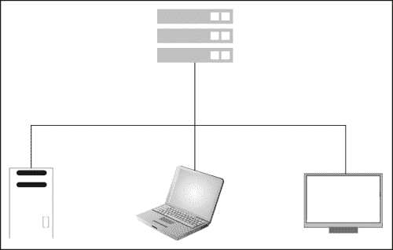
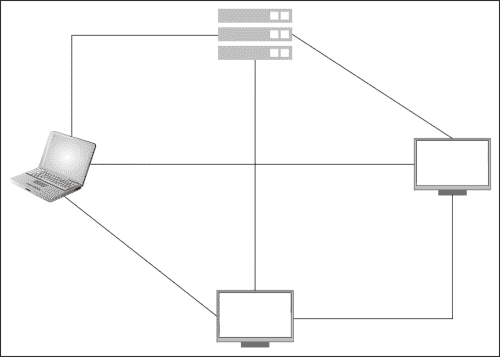
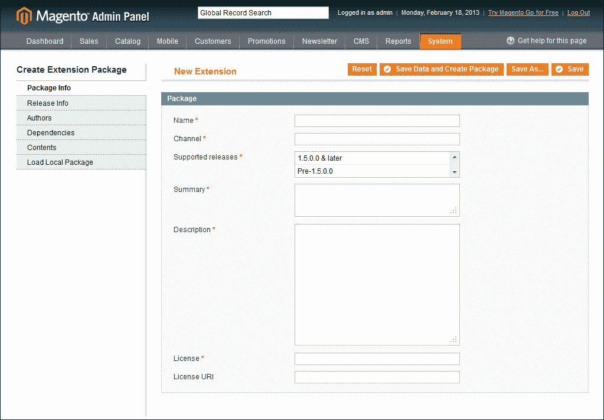
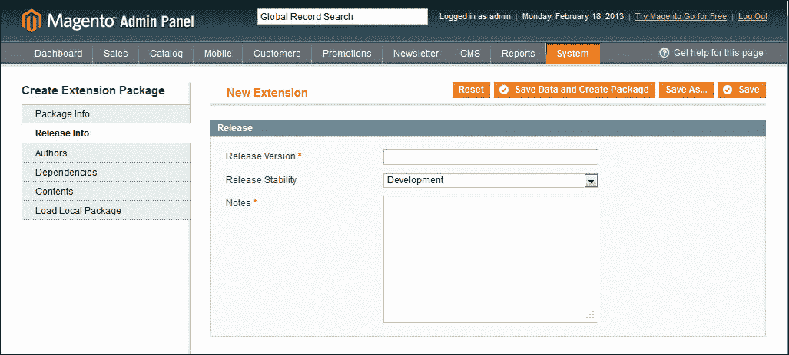
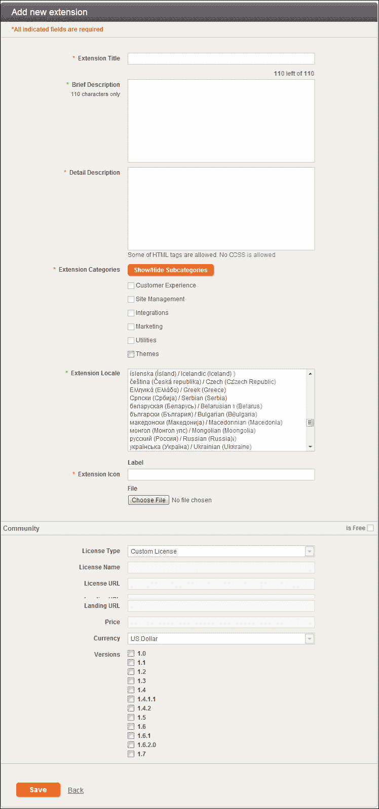

# 八、部署与分发

欢迎来到本书的最后一章；我们已经走了很长一段路，学到了很多东西。到现在为止，您应该已经对为 Magento 工作和开发自定义扩展所涉及的一切都有了清晰的认识。

嗯，几乎所有的东西，就像任何其他 Magento 开发人员一样，您的代码最终需要升级到生产环境中，或者打包分发；在本章中，我们将看到我们可以使用的不同技术、工具和策略。

本章的最终目标是为您提供工具和技能，使您能够自信地进行部署，并且几乎不停机。

# 零停机部署之路

对开发人员来说，部署到生产环境可能是最可怕的任务之一，而且往往会被错误地完成。

但什么是零停机部署？好吧，这是对生产充满信心，知道代码已经过适当的测试和准备，这是所有 Magento 开发人员都应该向往的理想。

这不是通过单个过程或工具实现的，而是通过技术、标准和工具的组合实现的。在本章中，我们将学习以下内容：

*   通过 Magento Connect 分发我们的扩展
*   版本控制系统在部署中的作用
*   分支和合并更改的正确实践

## 从头做起

在上一章中，我们了解了测试如何不仅可以增强我们的工作流程，而且还可以使我们避免将来的麻烦。单元测试、集成测试和自动化工具都在我们的掌握之中，以确保我们的代码得到正确的测试。

编写测试不仅仅意味着编写一些测试并完成；我们负责考虑所有可能影响我们的代码的边缘情况，并为每种情况编写测试。

## 确保所见即所得

在本书的第一章中，我们直接讨论了建立开发环境，这是一项非常重要的任务。为了保证交付的代码质量和经过测试，我们必须能够在尽可能接近生产环境的环境中开发和测试代码。

我将以 Magento 早期的一个例子来说明这种环境的重要性。我听说这件事发生过好几次；开发人员在本地环境中从头开始创建新的扩展，他们完成了开发并在本地登台上进行了测试，一切似乎都正常工作。

普遍接受的工作流之一是：

*   在开发人员的本地计算机上启动开发，该计算机在生产环境附近运行虚拟机
*   在作为生产环境尽可能接近的副本的临时环境上测试和批准更改
*   最后，将更改部署到生产环境

现在是时候将他们的代码推广到生产中了，他们自信地这样做了；当然是本地的,所以要做生产,对吧?？在这些特殊情况下，情况并非如此；相反，新代码一加载到生产环境中，商店就崩溃了，说自动加载程序找不到该类。

怎么搞的？嗯，问题是开发人员的本地环境是 Windows，扩展文件夹的名称是 CamelCase，例如`MyExtension`，但在类名内部，他们使用大写文本（`Myextension`。

现在，这在 Windows 中可以正常工作，因为文件不区分大写、大写或小写文件夹名称；而像大多数 web 服务器一样，基于 Unix 的系统确实在文件夹和文件命名方面有所区别。

虽然这个例子看起来很傻，但它很好地说明了标准化开发环境的必要性；Magento 安装中有很多部件和“移动部件”。不同版本的 PHP 或额外的 Apache 模块（在生产环境中启用，但不支持登台）可以带来巨大的不同。

### 注

在[了解更多关于 Magento 命名约定的信息 http://www.magedevguide.com/naming-conventions](http://www.magedevguide.com/naming-conventions) 。

## 就绪即就绪

但是，当我们说我们的代码实际上已经准备好投入生产时，ready 的真正含义是什么？每个开发人员可能对“准备就绪”和“完成”的实际含义有不同的定义。在处理新模块或扩展 Magento 时，我们应该始终定义此特定功能/代码的就绪含义。

因此，我们现在正在取得进展，我们知道，为了将代码传递到生产环境，我们必须执行以下操作：

1.  测试我们的代码，确保我们涵盖了所有的边缘情况。
2.  确保代码遵循标准和指南。
3.  确保它已在尽可能接近生产的环境中进行测试和开发。

# 版本控制系统及部署

**版本控制系统**（**VCSs**）是任何开发人员的命脉，虽然 Git 和 SVN 爱好者（Mercurial 的朋友们不用说）在这一领域可能有点分歧，但基本功能还是一样的。

让我们快速浏览一下每个风险投资公司之间的差异，以及它们的优缺点。

## SVN

这是一个功能强大的系统，它已经存在了相当长的一段时间，非常有名，并且被广泛使用。

**Subversion****SVN**为集中式 VCS；我们的意思是，只有一个主源被认为是“好的”，所有开发人员都会从这个中心源签出并将更改推送到这个中心源。

虽然这使更改更容易跟踪和维护，但它有一个严重的缺点。集中化还意味着我们必须与中央存储库保持持续的通信，因此远程工作或没有互联网连接是不可能的。

## 吉特

Git 是一家年轻得多的风投公司，并且几年来一直在流行，这主要是由于开源社区的广泛采用以及 Github（[www.Github.com](http://www.github.com)的流行。

SVN 和 Git 之间的一个关键区别是 Git 是一个分散的版本控制系统，这意味着没有中央权限或主存储库；每个开发人员都有本地可用的存储库的完整副本。

除了拥有比其他 VCS 更好、功能更强大的分支系统外，分散化使 Git 更快；此外，远程工作或没有互联网连接也是可能的。

无论我们选择哪种风投，风投最强大（有时被忽视）的功能是分支或创建分支的能力。

分支允许我们在不破坏主干或主机中的稳定代码的情况下试验和开发新特性；创建分支需要我们获取当前主干/主代码的快照，以便进行任何更改和测试。

现在，分支只是方程的一部分；一旦我们对代码更改感到满意，并且正确地测试了每个边缘情况，我们就需要一种将这些更改重新集成到主代码库中的方法。合并使我们能够通过运行几个命令重新整合所有分支修改。

通过集成分支并将更改合并到我们的工作流中，我们获得了灵活性和自由，可以处理不同的更改集、功能和错误修复，而不会干扰实验性或正在进行的代码。

此外，正如我们接下来将要学习的，版本控制可以帮助我们进行无缝升级，并使我们的代码在多个 Magento 安装中轻松保持最新。

# 分布

您可能希望免费分发您的扩展，或使其在商业上可用，但您如何保证每次都正确安装了代码而无需自己动手？那么更新或升级呢？并不是所有的店主都精通技术或者能够自己更改文件。

幸运的是，Magento 自带了自己的包管理器和扩展市场，名为 MagentoConnect。

Magento Connect 允许开发者和解决方案合作伙伴与社区分享他们的开源和商业贡献，而不仅仅限于定制模块；我们可以在 Magento Connect 市场中找到以下类型的资源：

*   模块
*   语言包
*   自定义主题

## 包装我们的分机

Magento Connect 的核心功能之一是允许我们直接从 Magento 后端打包扩展。

要打包我们的分机，请执行以下步骤：

1.  登录到 Magento 后端。
2.  From the backend, select **System** | **Magento Connect** | **Package Extensions**.

    

正如我们所看到的，**创建扩展****包**部分由六个不同的小节组成，我们将在下面介绍。

### 包裹信息

**Package Info**用于指定支持的名称、说明、版本等一般扩展信息，如下所示：

*   **名称**：标准做法是保持名称的简洁性，只使用文字
*   **通道**：表示分机代码池；正如我们在前面的章节中提到的，为分发而设计的扩展应该使用“社区”渠道
*   **支持的版本**：选择我们的扩展应该支持哪一版本的 Magento
*   **摘要**：此字段包含对延期审核流程中使用的延期的简要描述
*   **说明**：对扩展及其功能有详细的说明
*   **许可证**：此为本次扩展使用的许可证；一些可用选项包括：
    *   **开放式软件许可证****OSL**
    *   **Mozilla 公共许可证****MPL**
    *   **麻省理工学院许可证****MITL**
    *   **GNU 通用公共许可证****GPL**
    *   任何其他许可证（如果您的扩展将进行商业分发）
*   **License URI**: This has the link to the license text

    ### 注

    有关不同许可证类型的更多信息，请参见[http://www.magedevguide.com/license-types](http://www.magedevguide.com/license-types) 。

### 发布信息

以下屏幕截图显示**发布信息**的屏幕：

**发布信息**部分包含当前包发布的重要数据：

*   **发布版本**：初始版本可以是任意数字，但是，重要的是版本随每次发布而递增。Magento Connect 将不允许您两次更新同一版本。
*   **释放稳定性**：有三个选项可用—**稳定**、**β**和**α**。
*   **备注**：这里我们可以输入所有发布的具体备注，如果有的话。

### 作者

以下截图显示了**作者**的屏幕：

在本节中，指定了关于作者的信息；每个作者的信息都有以下字段：

*   **姓名**：作者全名
*   **用户**：Magento 用户名
*   **邮箱**：联系邮箱地址

### 依赖关系

以下屏幕截图显示了**依赖项**的屏幕：

打包 Magento 扩展时使用三种类型的依赖项：

*   **PHP 版本**：这里我们需要在**最小值**和**最大值**字段中分别指定此扩展支持的最小和最大 PHP 版本
*   **包**：用于指定此扩展所需的任何其他包
*   **扩展**：这里我们可以指定是否需要特定的 PHP 扩展才能使我们的扩展工作

如果不满足软件包依赖关系，Magento Connect 将允许我们安装所需的扩展；对于 PHP 扩展，Magento Connect 将抛出错误并停止安装。

### 目录

以下屏幕截图显示**内容**的屏幕：

**目录**部分允许我们指定构成扩展包一部分的每个文件和文件夹。

### 注

这是扩展包装过程中最重要的部分，也是最容易出错的部分。

每个内容条目都有以下字段：

*   **目标**：这是目标库目录，用于指定搜索文件的基本路径。以下选项可用：
    *   **Magento 核心团队模块文件–/app/code/Core**
    *   **Magento 本地模块文件–/app/code/Local**
    *   **Magento 社区模块文件–/app/code/Community**
    *   **Magento 全球配置–/app/etc**
    *   **Magento 语言环境文件–/app/Locale**
    *   **Magento 用户界面（布局、模板）–./app/design**
    *   **Magento 库文件–/lib**
    *   **Magento 媒体库–/媒体**
    *   **Magento 主题皮肤（图像、CSS、JS）–皮肤**
    *   **Magento 其他网络可访问文件–./**
    *   **Magento PHPUnit 试验–/试验**
    *   **Magento 其他–/**
*   **路径**：这是相对于我们指定目标的文件名和/或路径
*   **类型**：对于该字段，我们有两个选项—**文件**或**递归目录**
*   **包含**：此字段采用正则表达式，允许我们指定要包含哪些文件
*   **忽略**：此字段采用正则表达式，允许我们指定要排除哪些文件

### 加载本地包

下面的屏幕截图显示了**加载本地包**的屏幕：

本节将允许我们加载打包的扩展；因为我们没有打包任何扩展，所以列表当前为空。

让我们继续打包我们的礼品注册扩展。确保填写所有字段，然后点击**保存数据并创建包**；这将打包扩展并将其保存在`magento_root/var/connect/`文件夹中。

扩展包文件包含所有源文件和所需源代码；此外，每个包都会创建一个名为`package.xml`的新文件。此文件包含有关扩展名的所有信息以及文件和文件夹的详细结构。

# 发布我们的分机

最后，为了使我们的扩展可用，我们必须在 MagentoConnect 中创建一个扩展配置文件。要创建扩展配置文件，请执行以下步骤：

1.  登录[magentocommerce.com](http://magentocommerce.com)。
2.  点击**我的账户**链接。
3.  点击左侧导航中的**开发者**链接。
4.  点击**添加新扩展**。

**添加新扩展**窗口如下图所示：

需要注意的是，**扩展名**字段必须是生成包时使用的确切名称。

创建扩展配置文件后，我们可以继续上载扩展包；所有字段应与扩展包装过程中指定的字段匹配。

最后，完成后，我们可以点击**提交审批**按钮。扩展可以具有以下状态：

*   **已提交**：表示扩展已提交审核
*   **未批准**：这意味着分机存在问题，您还会收到一封电子邮件，解释分机未批准的原因
*   **Live**：这意味着扩展已经批准，可以通过 Magento Connect 获得
*   **离线**：这意味着您可以随时从您的账户**分机管理员**将您的分机离线

# 总结

在本章中，我们学习了如何部署和共享自定义扩展。我们可以使用许多不同的方法来共享代码并将其部署到生产环境中。

这是我们这本书的最后一章；我们已经了解了很多关于 Magento 开发的知识，尽管我们已经涵盖了很多领域，但这本书只是您漫长旅程中的一块垫脚石。

Magento 不是一个容易学习的框架，虽然它可能是一个令人畏惧的体验，但我鼓励您继续尝试和学习。