# 测量和优化数据库性能

在本书的第一章中，我们使用`mysqlslap`工具学习如何进行基本的 MySQL 基准测试。在本章中，我们将使用此工具和其他工具对 MariaDB（MySQL）服务器进行更高级的基准测试。但是，首先，我们将学习查询优化技术，这些技术将使用 MySQL 的一些内置功能，以便更好地分析 SQL 查询。

因此，我们将学习如何通过使用简单的度量技术（如查询优化）来度量和优化数据库性能。此外，我们还将了解如何使用高级数据库基准测试工具，如**DBT2**和**SysBench**。

因此，我们将讨论以下几点：

*   度量和优化 SQL 查询性能
*   安装、配置和使用高级数据库基准测试工具

# SQL 查询性能

为了更好地理解 SQL 查询性能，我们必须首先了解什么是索引以及它们是如何构建的。

# 索引的结构

索引是表元素的有序列表。这些元素首先存储在物理上无序的双链接列表中。该列表通过指向表项的指针和以逻辑顺序存储索引值的第二个结构（平衡树或 b 树）双重链接到表。因此，对于读取操作，索引的算法复杂度平均为对数-`O(log n)`，这意味着即使表中有大量条目，数据库引擎也应该保持速度。实际上，索引查找包含三个步骤：

*   树遍历
*   搜索叶节点链
*   从表中提取数据

因此，仅从 b-树读取时，索引查找非常有用，例如，您可以避免线性-`O(n)`-全表扫描。尽管如此，在写入表时保持索引最新所导致的开销复杂性是无法避免的。

这让我们首先考虑查询优化：表数据的最终用途是什么？我们只是记录信息还是存储用户的购物车项目？我们正在查询一个主要从中读取或写入的表吗？这一点很重要，因为优化一个`SELECT`查询可能会减慢对同一个表的一系列其他`INSERT`或`UPDATE`查询的速度。

第二个考虑因素是表格数据的性质。例如，我们是否试图为生成等价性的值编制索引，从而迫使数据库引擎在 b 树的叶节点中进一步查找，以确定真正满足特定查询期望的所有值？当模棱两可成为一个问题时，我们可能会得到一个“慢索引”或通常被称为“退化索引”。

第三个考虑因素是围绕查询表的行为的经济性。底层计算机的功能有多强大？平均有多少用户在给定时间查询表？可伸缩性重要吗？

最后一个需要考虑的问题是数据的存储大小。重要的是要知道，作为一般规则，索引平均增长到原始表大小的 10%左右。因此，当表的大小较大时，预计表的索引也会较大。当然，索引越大，由于 I/O 延迟，等待的时间就越长。

这些注意事项将决定要优化的查询以及如何优化查询。有时候，优化就是无所事事。

现在我们更好地理解了索引，让我们开始分析简单的 SQL 查询，以便了解数据库引擎执行计划。

# 执行计划

我们将通过分析简单的`WHERE`条款开始理解执行计划。为此，我们将使用第一个 Linux for PHP Docker 容器。在第一章中，我们将 Sakila 数据库加载到 MariaDB（MySQL）服务器中。现在，我们将使用它来了解执行计划如何工作以及何时使用查询优化技术。在容器的 CLI 上，输入以下命令：

```php
# mysql -uroot 
# MariaDB > USE sakila; 
# MariaDB > SELECT * FROM actor WHERE first_name = 'AL'; 
```

这些命令应产生以下结果：

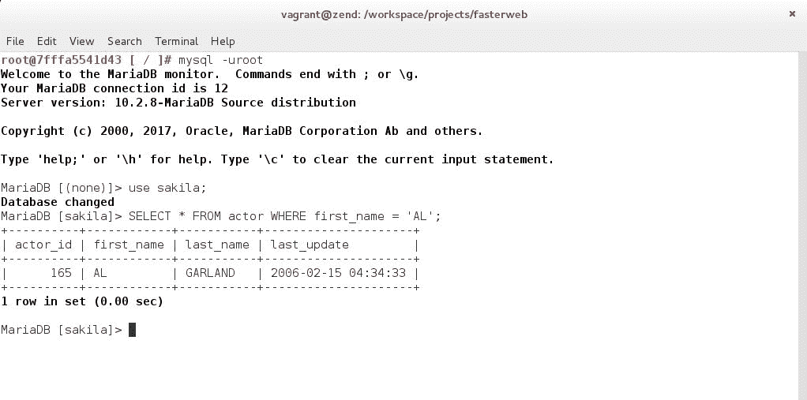

The result of the SELECT statement

乍一看，此查询的执行时间为 0.00 秒，似乎很好。但是，真的是这样吗？为了进一步分析这个查询，我们必须查看数据库引擎的执行计划。为此，请在查询开始处输入关键字`EXPLAIN`：

```php
 # MariaDB > EXPLAIN SELECT * FROM actor WHERE first_name = 'AL'; 
```

以下结果为我们提供了有关执行计划的一些信息：

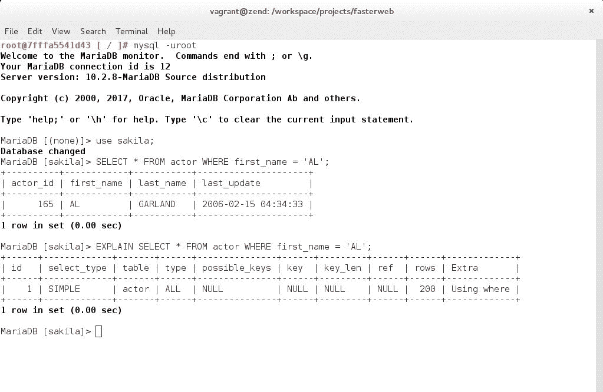

The execution plan of the same SELECT statement

让我们花点时间定义此结果集的每一列：

*   `id`列告诉我们表是按什么顺序联接的。在本例中，只有一个表。
*   `select_type`是`SIMPLE`，这意味着没有执行此查询的子查询、联合或依赖查询类型。

*   `table`列为我们提供了作为查询对象的表的名称。如果它是一个临时物化的表，我们会在本列中看到表达式`<subquery#>`。
*   `type`列对于查询优化非常重要。它为我们提供了有关表访问以及如何从表中查找和检索行的信息。在这种情况下，会出现一个红旗，因为我们可以看到该列的值是`ALL`。要进一步了解这一非常重要的列的不同可能值，请参考 MariaDB 手册[https://mariadb.com/kb/en/library/explain/](https://mariadb.com/kb/en/library/explain/) 。
*   `possible_keys`列通知我们表中可用于回答查询的键。在本例中，该值为`NULL`。
*   `key`列表示实际使用的键。这里，值也是`NULL`。
*   `key_len`列中的值意味着只有多列键的特定字节数用于完成查询查找。
*   `ref`列告诉我们哪些列或常数用于与使用的索引进行比较。当然，因为没有使用索引来执行此查询，所以此列的值也是`NULL`。
*   `rows`列指示数据库引擎必须检查的行数，以完成其执行计划。在本例中，引擎必须通过 200 行。如果表很大，并且必须连接到上一个表，那么性能会很快下降。
*   最后一列是`Extra`列。本专栏将为我们提供有关执行计划的更多信息。在本例中，数据库引擎使用`WHERE`子句，因为它必须进行完整的表扫描。

# 基本查询优化

为了开始优化这个查询，我们必须经历我之前所说的查询优化的*初始考虑因素*。在本例中，假设此表将成为`READ`查询的对象，而不是`WRITE`查询的对象，因为数据一旦写入表中，将保持相当静态。另外，需要注意的是，在`actor`表的`first_name`列上创建索引会使索引由于该列中的非唯一值而容易产生歧义。此外，假设可伸缩性很重要，因为我们希望每小时有许多用户查询此表，并且表大小应该长期保持可管理。

鉴于此，我们将继续在`actor`表的`first_name`列上创建索引：

```php
 # MariaDB > CREATE INDEX idx_first_name ON actor(first_name); 
```

完成后，MariaDB 确认索引的创建：


Confirmation that the index was created

现在已经创建了索引，我们在请求数据库引擎`EXPLAIN`执行计划时得到这个结果：


The execution plan is now optimized

`type`列的值现在为`ref`、`possible_keys`为`idx_first_name`、`key`为`idx_first_name`、`ref`为`const`、`rows`为`1`、`Extra`为`Using index condition`。正如我们所看到的，引擎现在已经将我们新创建的索引标识为可能要使用的键，然后继续使用它。它使用查询中给定的常量值在索引中执行查找，并且在访问表时只考虑一行。所有这些都很好，但正如我们在初始考虑中所预期的，索引由非唯一值组成。表列的值之间可能存在的等价性可能会导致索引随时间而退化，因此访问类型为`ref`，额外的信息表明引擎为`Using index condition`，这意味着将`WHERE`子句下推到表引擎，以便在索引级别进行优化。在本例中，考虑到公认的初始因素，这是绝对意义上的最佳查询优化，因为不可能在 actor 表的`first_name`列中获得唯一值。但是，事实上，根据领域用例的不同，存在一种可能的优化。如果我们只希望使用参与者的名字，那么我们可以通过只选择合适的列来进一步优化`Extra`列中的`Using index condition`，从而允许数据库引擎只访问索引：

```php
 # MariaDB > EXPLAIN SELECT first_name FROM actor WHERE first_name = 'AL'; 
```

然后，数据库引擎确认它只使用了`Extra`列中的索引：


The 'Extra' column now contains the information "Using where; Using index"

那么，所有这些如何转化为整体绩效呢？让我们运行一些基准测试，以测量更改的影响。

首先，我们将运行一个没有索引的基准测试。在容器的 CLI 上，运行以下命令：

```php
# mysqlslap --user=root --host=localhost --concurrency=1000 --number-of-queries=10000 --create-schema=sakila --query="SELECT * FROM actor WHERE first_name = 'AL';" --delimiter=";" --verbose --iterations=2 --debug-info;
```

以下是没有索引的结果：


The results of the benchmark test WITHOUT the use of the index

以及，指数的结果：

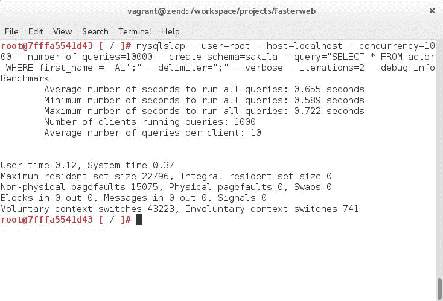

The results of the benchmark test WITH the use of the index

最后，让我们运行相同的命令，同时只选择适当的列，从而将查找仅限于索引：

```php
# mysqlslap --user=root --host=localhost --concurrency=1000 --number-of-queries=10000 --create-schema=sakila --query="SELECT first_name FROM actor WHERE first_name = 'AL';" --delimiter=";" --verbose --iterations=2 --debug-info; 
```

以下是最后一次基准测试的结果：

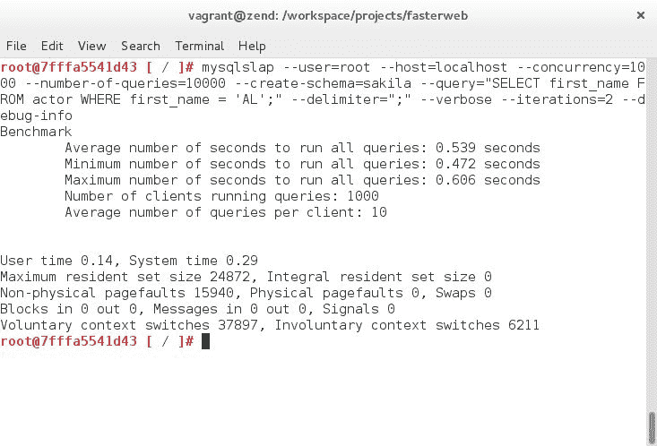

The results of the benchmark test WITH the use of the index ONLY

基准测试结果清楚地表明，我们的查询优化确实满足了我们最初的可伸缩性假设，特别是当我们看到表的大小不断增长，并且随着时间的推移，我们的数据库越来越受越来越多用户的欢迎时。

# 性能模式和高级查询优化

通过使用 MariaDB（MySQL）的性能模式来分析查询，查询优化的艺术可以进一步推进。查询分析允许我们查看引擎盖下发生的事情，并进一步优化复杂查询。

首先，让我们在数据库服务器上启用性能模式。为此，请在 Linux for PHP 容器的 CLI 上输入以下命令：

```php
# sed -i '/myisam_sort_buffer_size =/a performance_schema = ON' /etc/mysql/my.cnf  
# sed -i '/performance_schema =/a performance-schema-instrument = "stage/%=ON"' /etc/mysql/my.cnf 
# sed -i '/performance-schema-instrument =/a performance-schema-consumer-events-stages-current = ON' /etc/mysql/my.cnf 
# sed -i '/performance-schema-consumer-events-stages-current =/a performance-schema-consumer-events-stages-history = ON' /etc/mysql/my.cnf 
# sed -i '/performance-schema-consumer-events-stages-history =/a performance-schema-consumer-events-stages-history-long = ON' /etc/mysql/my.cnf 
# /etc/init.d/mysql restart 
# mysql -uroot 
# MariaDB > USE performance_schema; 
# MariaDB > UPDATE setup_instruments SET ENABLED = 'YES', TIMED = 'YES'; 
# MariaDB > UPDATE setup_consumers SET ENABLED = 'YES'; 
```

数据库引擎将确认`performance_schema`数据库中的某些行被修改：


The 'performance_schema' database has been modified

现在，我们可以检查性能模式是否已启用：

```php
# MariaDB > SHOW VARIABLES LIKE 'performance_schema'; 
```

数据库引擎应返回以下结果：


Confirmation that the performance schema is now enabled

既然已经启用并准备好了评测，那么让我们在 Sakila 数据库上运行一个复杂的查询。使用带有`NOT IN`子句的子查询通常会迫使引擎对主查询进行迭代式的额外检查。这些查询可以使用`JOIN`语句进行优化。我们将接受以下查询并在数据库服务器上运行它：

```php
# MariaDB > SELECT film.film_id 
          > FROM film 
          > WHERE film.rating = 'G' 
          > AND film.film_id NOT IN ( 
              > SELECT film.film_id 
              > FROM rental 
              > LEFT JOIN inventory ON rental.inventory_id = inventory.inventory_id 
              > LEFT JOIN film ON inventory.film_id = film.film_id 
          > ); 
```

运行查询将产生以下结果：

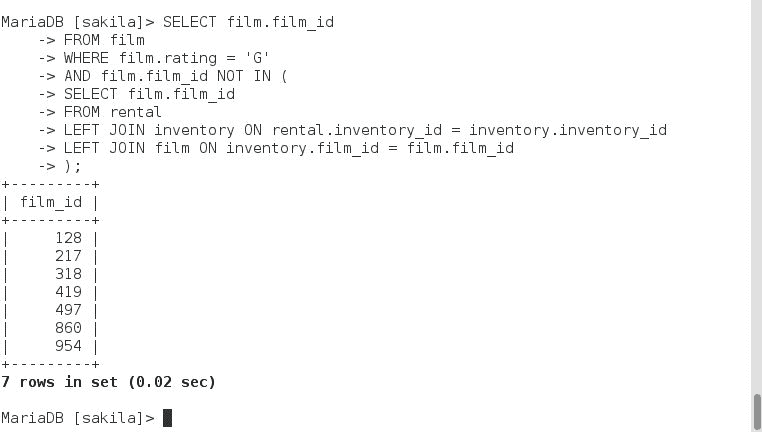

The result of the SELECT statement

下面是在上一次查询中使用`EXPLAIN`语句时的结果：

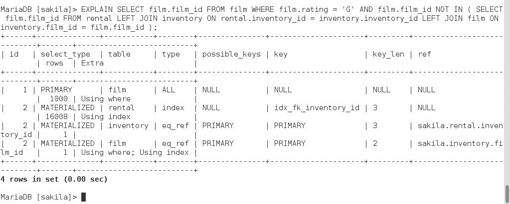

The execution plan of the same SELECT statement

正如我们所看到的，引擎正在执行一个完整的表扫描，并使用一个物化的子查询来完成它的查找。要查看引擎盖下发生了什么，我们必须查看探查器记录的与此查询相关的事件。为此，请输入以下查询：

```php
# MariaDB > SELECT EVENT_ID, TRUNCATE(TIMER_WAIT/1000000000000,6) as Duration, SQL_TEXT 
          > FROM performance_schema.events_statements_history_long WHERE SQL_TEXT like 
 '%NOT IN%'; 
```

运行此查询后，您将获得原始查询的唯一标识符：

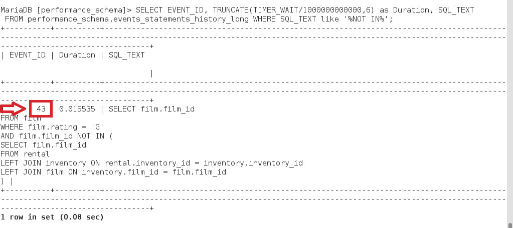

The original query's identifier

此信息允许我们运行以下查询，以获取运行原始查询时发生的基础事件的列表：

```php
# MariaDB > SELECT event_name AS Stage, TRUNCATE(TIMER_WAIT/1000000000000,6) AS Duration 
          > FROM performance_schema.events_stages_history_long WHERE NESTING_EVENT_ID=43; 
```

以下是我们在 MariaDB 关于原始查询的性能模式中发现的内容：

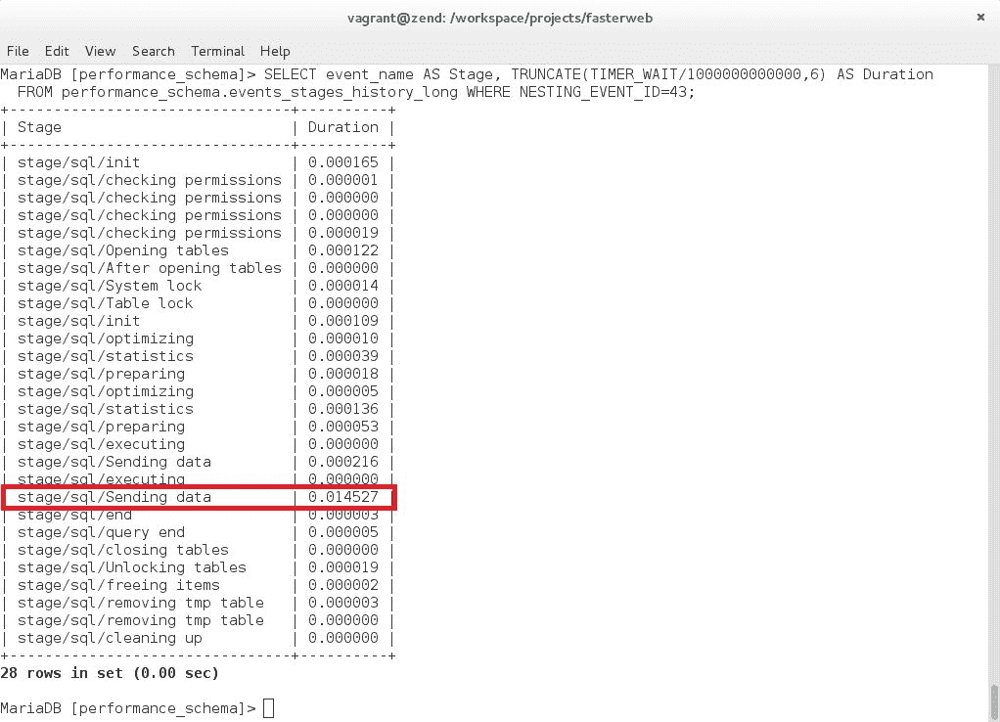

The query's profile reveals one particularly long operation

这个结果表明，`NOT IN`子句导致数据库引擎创建一个物化子查询，因为内部查询被优化为半连接子查询。因此，引擎必须在运行查询和物化子查询之前执行一些优化操作。此外，结果表明，物化子查询是代价最高的操作。

优化这些子查询的最简单方法是在主查询中用适当的`JOIN`语句替换它们，如下所示：

```php
# MariaDB > SELECT film.film_id 
#         > FROM rental 
#         > INNER JOIN inventory ON rental.inventory_id = inventory.inventory_id 
#         > RIGHT JOIN film ON inventory.film_id = film.film_id 
#         > WHERE film.rating = 'G' 
#         > AND rental.rental_id IS NULL 
#         > GROUP BY film.film_id; 
```

通过运行此查询，我们从数据库中获得了相同的结果，但是`EXPLAIN`语句揭示了一个全新的执行计划，以便获得完全相同的结果：

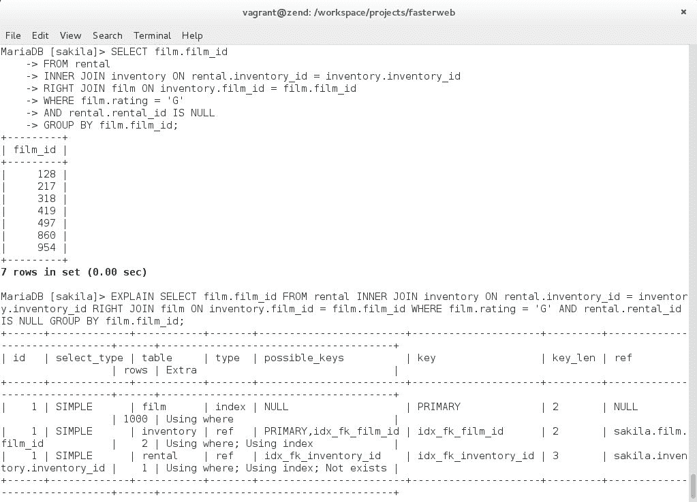

The new execution plan shows only 'SIMPLE' select types

子查询已消失，并已成为简单查询。让我们看看这次性能模式记录了什么：

```php
# MariaDB > SELECT EVENT_ID, TRUNCATE(TIMER_WAIT/1000000000000,6) as Duration, SQL_TEXT 
          > FROM performance_schema.events_statements_history_long WHERE SQL_TEXT like '%GROUP BY%'; 
# MariaDB > SELECT event_name AS Stage, TRUNCATE(TIMER_WAIT/1000000000000,6) AS Duration 
          > FROM performance_schema.events_stages_history_long WHERE NESTING_EVENT_ID=22717; 
```

探查器记录了以下结果：

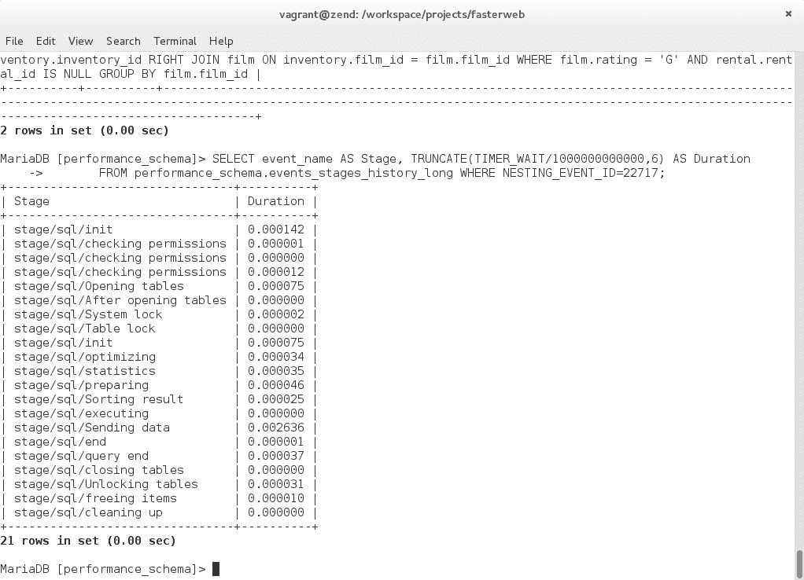

The new query's profile reveals considerable performance improvements

结果清楚地表明，在执行计划的初始化阶段发生的优化操作较少，因此查询执行速度大约快七倍。并非所有物化子查询都可以通过这种方式进行优化，但是，在优化查询时，物化子查询、依赖子查询或不可缓存子查询应该总是激发我们问自己是否可以做得更好。

有关查询优化的更多信息，请收听 Michael Moussa 在*Nomad PHP*（[上对此主题的精彩演讲 https://nomadphp.com/product/mysql-analysis-understanding-optimization-queries/](https://nomadphp.com/product/mysql-analysis-understanding-optimization-queries/) ）。

# 高级基准测试工具

到目前为止，我们已经使用了`mysqlslap`基准测试工具。但是，如果您需要更彻底地测试数据库服务器，那么还有其他更高级的基准测试工具。我们将快速了解其中的两个工具：DBT2 和 SysBench。

# DBT2

此基准测试工具用于对 MySQL 服务器运行自动基准测试。它允许您模拟大量的数据仓库。

要下载、编译和安装 DBT2，请在容器的 CLI 上输入以下命令：

```php
# cd /srv/www
# wget -O dbt2-0.37.tar.gz https://master.dl.sourceforge.net/project/osdldbt/dbt2/0.37/dbt2-0.37.tar.gz 
# tar -xvf dbt2-0.37.tar.gz 
# cd dbt2-0.37.tar.gz 
# ./configure --with-mysql 
# make 
# make install 
# cpan install Statistics::Descriptive 
# mkdir -p /srv/mysql/dbt2-tmp-data/dbt2-w3 
# ./src/datagen -w 3 -d /srv/mysql/dbt2-tmp-data/dbt2-w3 --mysql 
```

创建数据仓库后，您将看到以下消息：

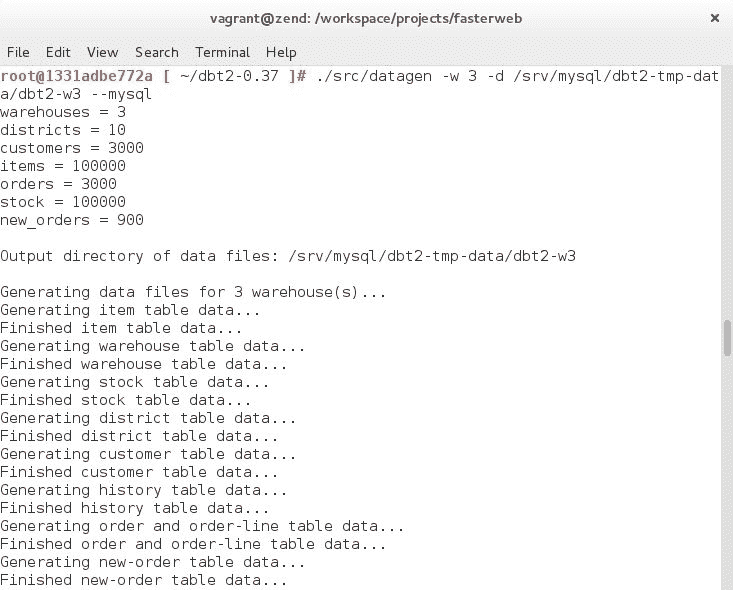

Confirmation that the database warehouses have been created

您现在必须使用 vi 编辑器修改文件`scripts/mysql/mysql_load_db.sh`：

```php
# vi scripts/mysql/mysql_load_db.sh 
```

进入编辑器后，键入`/LOAD DATA`并按*进入*。将光标放在这一行的末尾，按`*I*`并输入大写的单词`IGNORE`。完成编辑后，您的文件应如下所示：

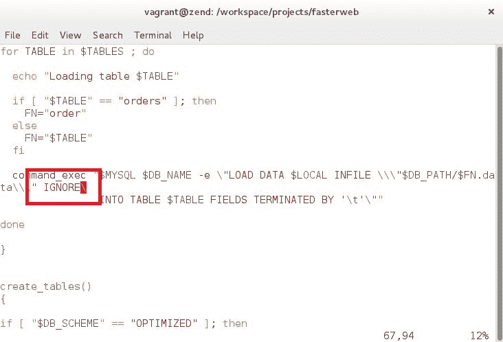

Inserting the string "IGNORE" on the "LOAD DATA" line of the 'mysql_load_db.sh' script

完成后，按*Esc*键，然后键入`:wq`。这将保存更改并关闭 vi 编辑器。

现在，输入以下命令将测试数据加载到数据库中：

```php
# ./scripts/mysql/mysql_load_db.sh -d dbt2 -f /srv/mysql/dbt2-tmp-data/dbt2-w3 -s /run/mysqld/mysqld.sock -u root 
```

将数据加载到数据库后，您将看到以下消息：

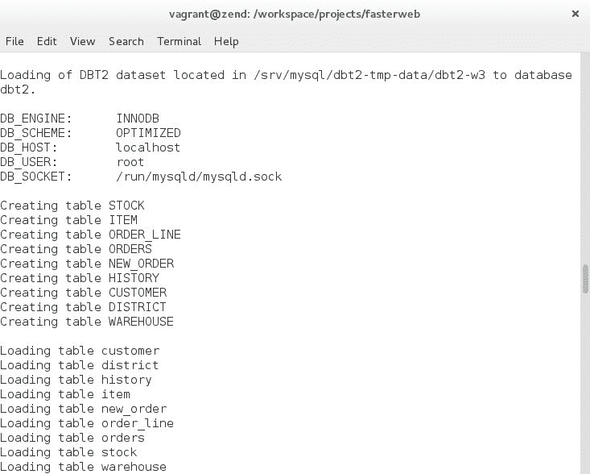

Confirmation that the data is being loaded into the database

要启动测试，请输入以下命令：

```php
# ./scripts/run_mysql.sh -n dbt2 -o /run/mysqld/mysqld.sock -u root -w 3 -t 300 -c 20 
```

输入命令后，您将首先看到以下消息：

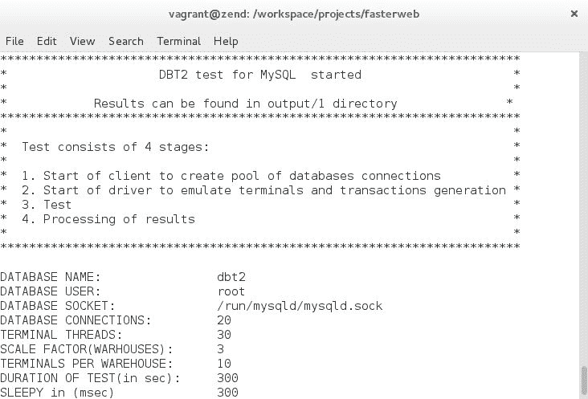

Confirmation that the tests have begun

您还将收到以下消息：

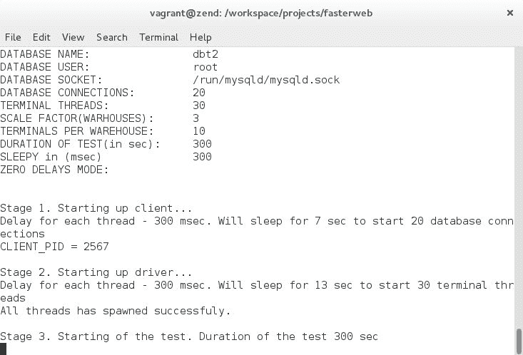

Confirmation that the tests are running

大约五分钟后，您将获得基准测试的结果：

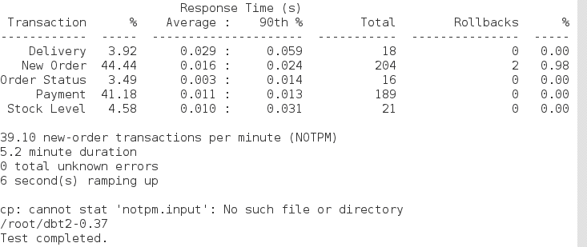

Confirmation that the tests are completed

从给定的结果可以看出，我们可以很好地了解数据库服务器在大型数据仓库环境中的性能。附加测试可以通过边缘案例测试轻松确认服务器的限制。让我们使用 SysBench 运行一个这样的测试。

# 系统工作台

SysBench 是另一个非常流行的开源基准测试工具。此工具不仅允许您测试开源 RDBMS，还允许您测试硬件（CPU、I/O 等）。

要下载、编译和安装 SysBench，请在 Linux for PHP Docker 容器中输入以下命令：

```php
# cd /srv/www
# wget -O sysbench-0.4.12.14.tar.gz https://downloads.mysql.com/source/sysbench-0.4.12.14.tar.gz 
# tar -xvf sysbench-0.4.12.14.tar.gz 
# cd sysbench-0.4.12.14 
# ./configure 
# make 
# make install 
```

现在，输入以下命令以创建一个表，其中包含一百万行作为数据库中的测试数据：

```php
# sysbench --test=oltp --oltp-table-size=1000000 --mysql-db=test --mysql-user=root prepare 
```

将数据加载到数据库后，您将看到以下消息：

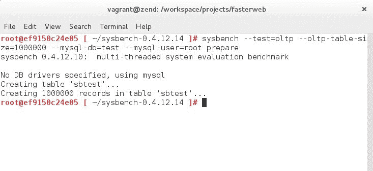

Confirmation that the test data has been loaded into the database

现在，要运行测试，请输入以下命令：

```php
# sysbench --test=oltp --oltp-table-size=1000000 --mysql-db=test --mysql-user=root --max-time=60 --oltp-read-only=on --max-requests=0 --num-threads=8 run 
```

输入上一个命令后，首先会收到以下消息：

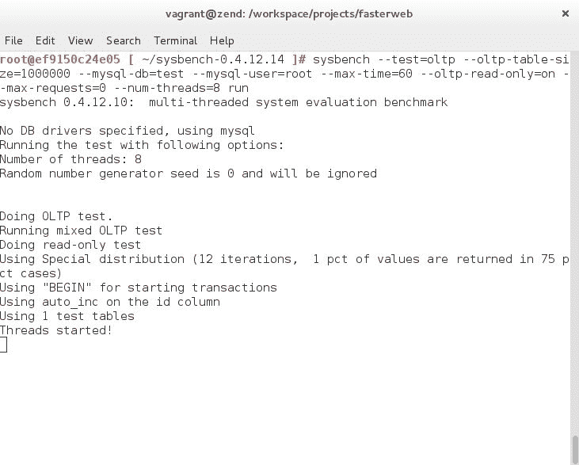

Confirmation that the tests are running

几分钟后，您应该会得到类似以下结果：

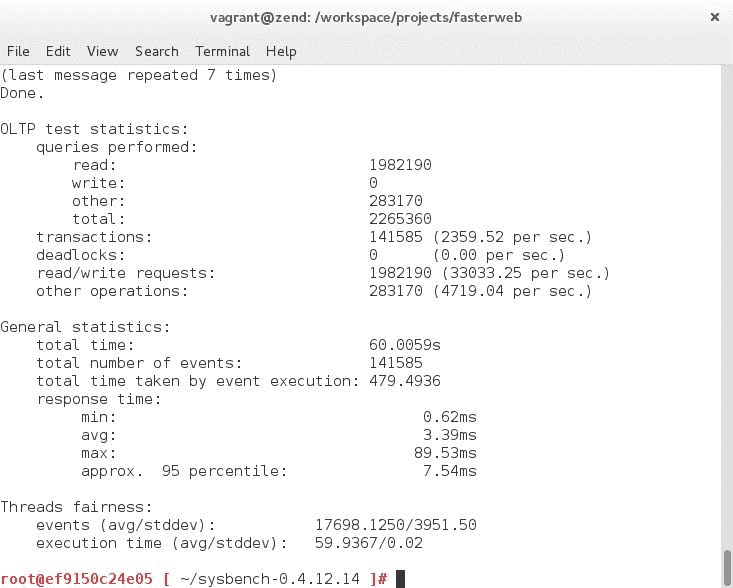

The results of the SysBench tests

结果显示，我的计算机上的 MariaDB 服务器每秒可以处理大约 2300 个事务，每秒可以处理 33000 个读/写请求。这些边缘案例测试可以让我们很好地了解硬件和数据库服务器的总体性能水平。

# 总结

在本章中，我们学习了如何通过使用简单的度量技术（如查询优化）来度量和优化数据库性能。此外，我们还了解了如何使用高级数据库基准测试工具，如 DBT2 和 SysBench。

在下一章中，我们将看到如何使用现代 SQL 技术来优化非常复杂的 SQL 查询。