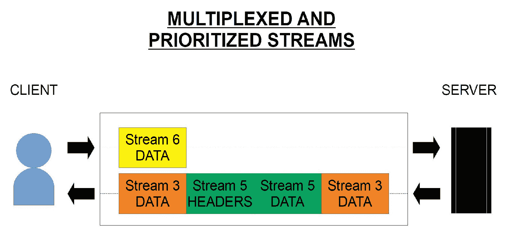
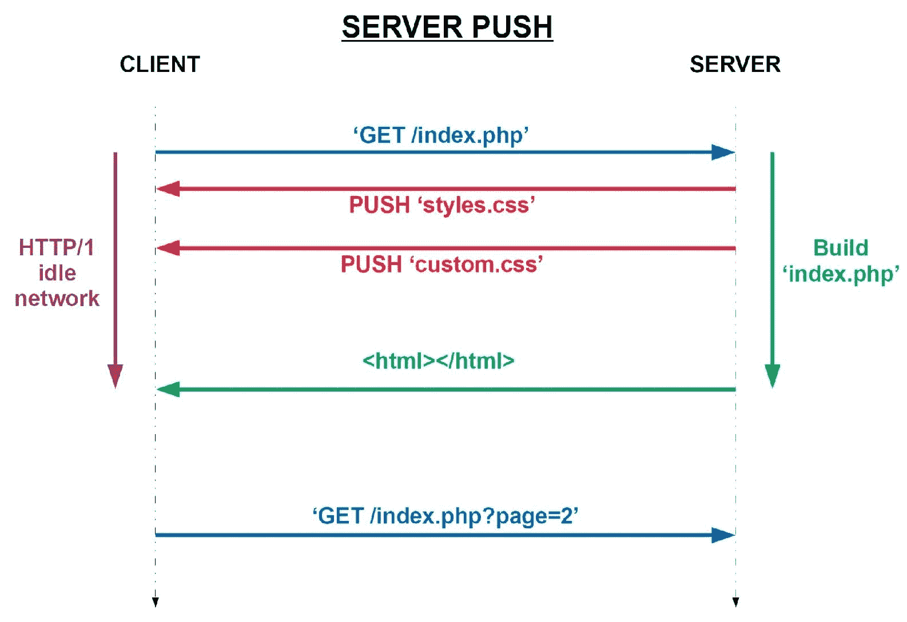
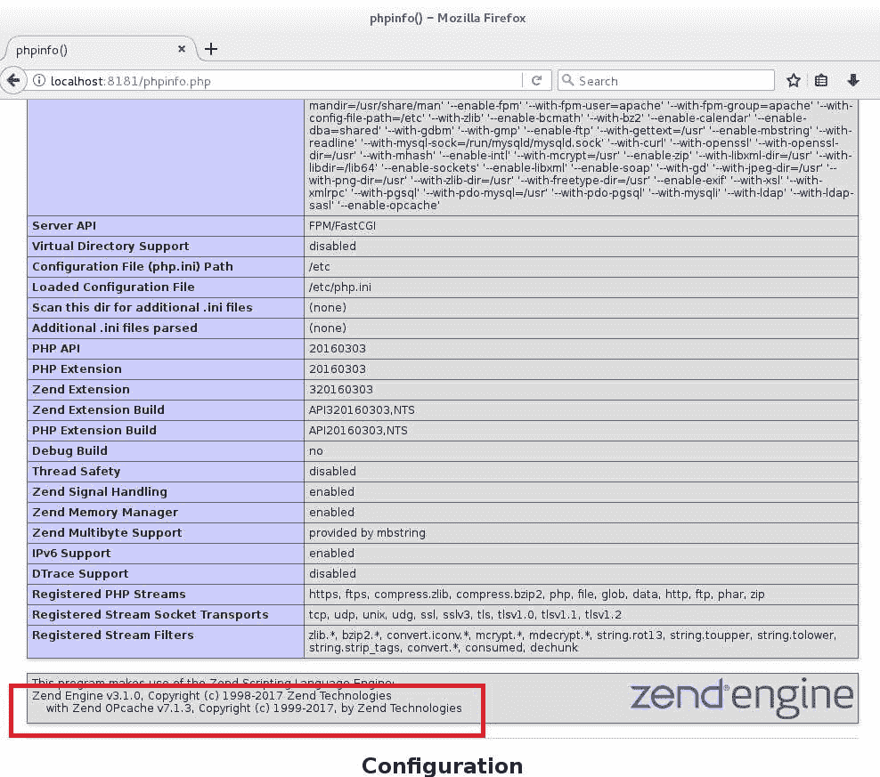
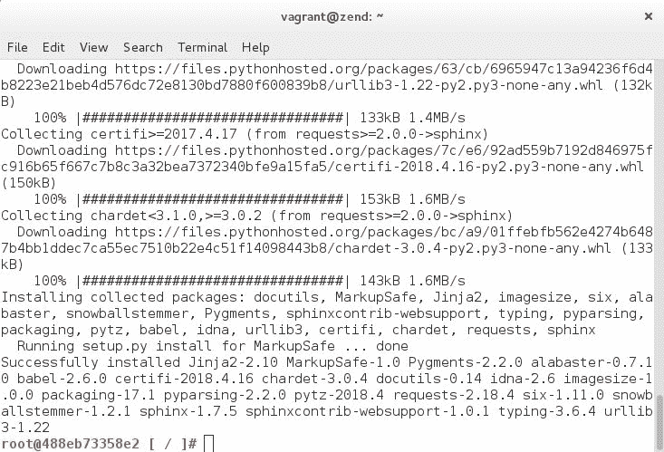
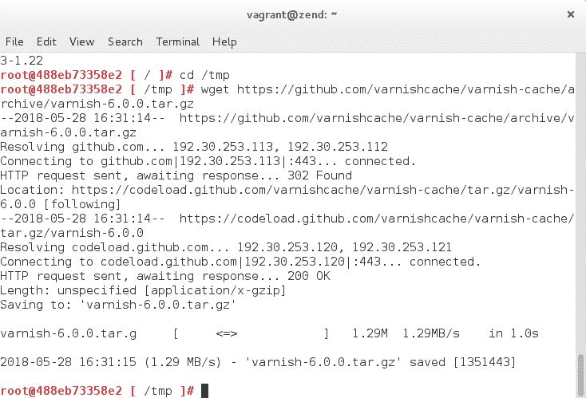
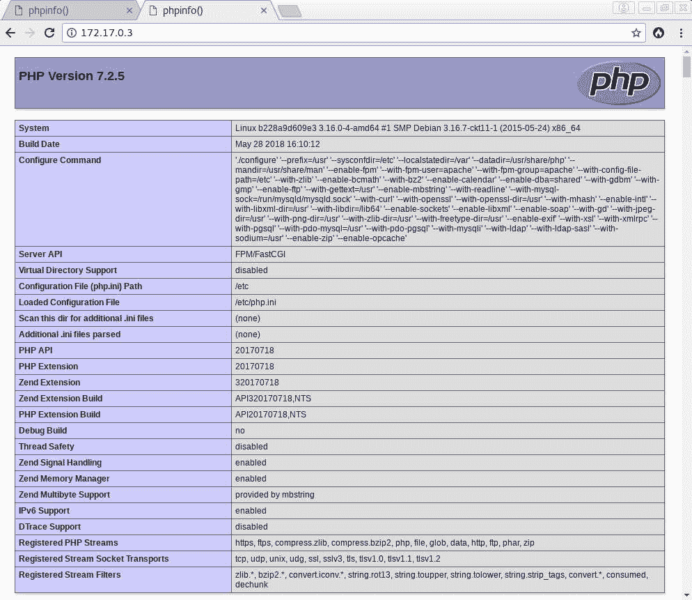
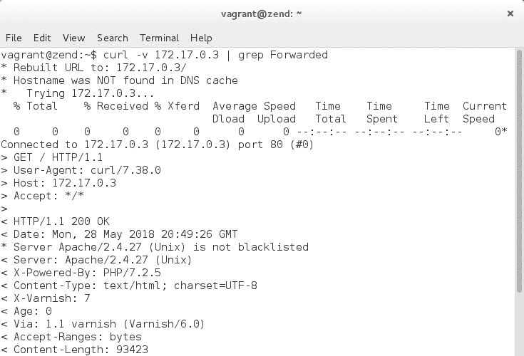
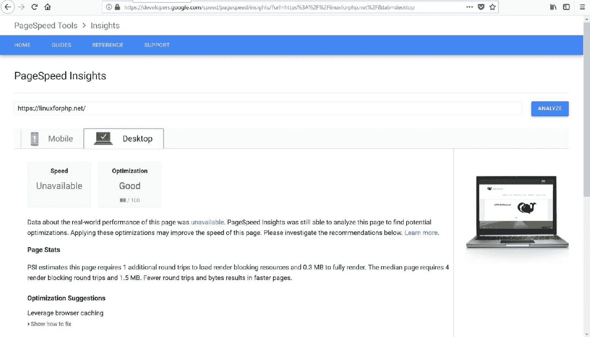
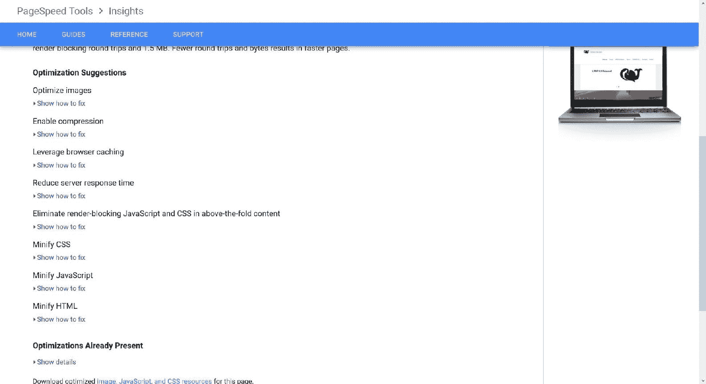

# 提高 Web 服务器的性能

谷歌将更新老化的网络协议作为其快速网络计划的首要任务之一。随着 web 开发的新重点从向用户提供越来越多的功能（即使这些功能很慢）转向提供与 web 性能不兼容的功能，世界各地的许多项目已经在进行中。谷歌的倡议有助于改变网络开发的优先次序，从而使现有的项目得以曝光，并创建新的项目。

在本章中，我们将介绍一些与谷歌网络新计划一起进行的项目。因此，我们将涵盖以下几点：

*   MOD_SPDY 和 HTTP/2
*   PHP-FPM 和 OPCache
*   ESI 和清漆缓存
*   客户端缓存
*   其他更快的 Web 工具

# MOD_SPDY 和 HTTP/2

2009 年，谷歌宣布，它将开始利用一种名为 SPDY（`SPeeDY`的新会话协议，寻找更新 HTTP 协议的方法。这个新的会话协议在底层 TLS 表示层上工作，并允许在应用层进行许多 HTTP 速度优化。使用 SPDY 就像激活 SSL、在 web 服务器上安装`mod_spdy`模块并激活它一样简单。为了从其功能中获益，无需对网站进行任何修改。

此外，所有主流浏览器都支持它。SPDY 迅速成为更快网络的核心元素，并于 2012 年 11 月成为 HTTP 协议下一次重大修订的基础。然后，在 2015 年，它被弃用，取而代之的是新的 HTTP/2 协议。SPDY 引入的最重要的优化，将在新 HTTP 协议的规范中找到它们的方法，是多路复用和优先流、服务器推送和头压缩。在我们深入了解 HTTP/2 协议的一些细节之前，让我们更详细地了解每一种优化。

# 多路复用和优先流

SPDY 的多路流功能允许将多个请求映射到单个连接上的多个流。这些流是双向的，可以由客户端或服务器启动（服务器推送功能）。通过一个连接打开多个流可以避免在每个客户机/服务器交换上建立新连接的开销，特别是在并行下载多个资源以完成单个页面的呈现时。因此，第一个特性使得在使用 HTTP/1 协议时可以摆脱有限数量的可能连接：



How multiplexed and prioritized streams work

此外，SPDY 的数据流被优先考虑。此附加功能允许客户机确定应首先通过有线发送哪些资源。因此，SPDY 避免了在 HTTP/1 协议中尝试进行服务器管道传输（即`KeepAlive`指令）时出现的**先进先出**（**先进先出**）问题。

# 服务器推送

如前所述，SPDY 的新流功能使服务器能够将数据推送到客户端，而无需响应客户端的请求。这使得通信具有双向性，并允许 web 服务器预测客户机的需求。事实上，甚至在客户端解析 HTML 并确定呈现页面所需的所有文件之前，web 服务器就可以将文件向下推送到客户端，从而减少客户端发送的请求数，以便获取所有必要的资源：



How the 'server push' feature works

通过了解许多研究表明，平均而言，大多数页面需要针对 20 到 30 个域的 70 到 100 个请求才能完成呈现，我们可以很容易地看到此功能如何能够减少 web 的冗余，并显著降低网络延迟。

# 头压缩

SPDY 的第三个重要特性是使用`gzip`对头部进行压缩。通过压缩通常大量的 HTTP 头并将其平均减少 85%的原始大小，SPDY 可以将大多数 HTTP 在线事务的加载时间缩短整整一秒钟。尽管使用`gzip`动态压缩报头被发现是不安全的，但报头压缩的想法仍然存在，并在 HTTP/2 协议中重新实现，因为它对整体 web 性能有很大的好处。

# HTTP/2

HTTP/2 作为 RFC 7540[1]于 2015 年 5 月发布，是 HTTP 协议的最新主要修订版。它主要基于 Google 的 SPDY 协议，并提供了一个新的二进制帧层，该层与 HTTP/1 不向后兼容。如前所述，它的大部分功能都是通过 SPDY 项目开发的。SPDY 和 HTTP/2 之间最显著的区别是新协议压缩其头的方式。而 SPDY 依赖于使用`gzip`动态压缩报头，HTTP/2 协议使用了一种名为`HPACK`的新方法，该方法使用了一种基于哈夫曼码的固定算法。为了避免 SPDY 发现的数据压缩可能导致私有数据泄漏的问题，需要使用这种新方法。

尽管新协议将大多数网页的加载时间缩短了两倍之多，但许多批评人士表示失望，他们指出，谷歌在更新 HTTP 协议项目上强加的不切实际的最后期限使得新版本的协议无法基于 SPDY 项目之外的任何其他内容，因此，新 HTTP 协议的进一步改进错过了许多机会。*Varnish Cache*的开发者*波尔·亨宁·坎普*甚至继续说 HTTP/2 不一致，过于复杂，不必要。此外，他还表示，复制通常应在传输层进行的流量控制违反了协议分层原则[2]。最后，在这个新协议中发现了许多安全漏洞，其中最显著的是网络安全公司 Imperva 在 2016 年美国黑帽大会上公布的漏洞[3]。这些攻击包括慢读攻击、依赖循环攻击、流多路复用滥用和 HPACK 炸弹。本质上，所有这些攻击向量都可以通过将服务器提交到**拒绝服务**（**DoS**攻击）或使其内存饱和来使其脱机。

尽管存在所有这些问题以及许多与加密相关的问题，但所有主要的 web 服务器和浏览器都采用了它，并且现在提供了对它的支持。大多数情况下，如果您的 web 服务器是使用 HTTP/2 标志配置和编译的，则只需激活服务器的`/etc/httpd/httpd.conf`文件中的模块即可开始使用它。对于 Apache Web 服务器，还必须将`Protocols`指令添加到服务器的配置文件中。请注意，在服务器上激活 HTTP/2 协议将对资源消耗产生相当大的影响。例如，在 ApacheWeb 服务器上启用此功能将导致创建许多线程，因为服务器将通过创建专用工作线程来服务 HTTP/2 请求，以便处理结果并将结果流回到客户端。下面是如何在 Apache 的`httpd.conf`和`httpd-ssl.conf`配置文件中启用 HTTP/2 模块的示例（假设`mod_ssl`模块也已启用）：

```php
# File: /etc/httpd/httpd.conf
[...]
LoadModule ssl_module /usr/lib/httpd/modules/mod_ssl.so
LoadModule http2_module /usr/lib/httpd/modules/mod_http2.so
[...]

# File: /etc/httpd/extra/httpd-ssl.conf
[...]
<VirtualHost _default_:443>

Protocols h2 http/1.1

#   General setup for the virtual host
DocumentRoot "/srv/www"
[...]
```

有关 HTTP/2 协议的更多信息，请访问以下地址：

*   [https://developers.google.com/web/fundamentals/performance/http2/](https://developers.google.com/web/fundamentals/performance/http2/)

要了解有关 Apache 实现相同协议的更多信息，请访问以下链接：

*   [https://httpd.apache.org/docs/2.4/howto/http2.html](https://httpd.apache.org/docs/2.4/howto/http2.html)
*   [https://httpd.apache.org/docs/2.4/mod/mod_http2.html](https://httpd.apache.org/docs/2.4/mod/mod_http2.html)

最后，要了解更多关于 NGINX 提供的实现的信息，请查阅他们的文档：

*   [http://nginx.org/en/docs/http/ngx_http_v2_module.html](http://nginx.org/en/docs/http/ngx_http_v2_module.html)

# PHP-FPM 和 OPCache

当谈到更快的 Web 时，考虑如何确保 PHP 二进制本身在 Web 服务器上被优化运行是非常重要的，考虑到 PHP 安装在世界各地七十到百分之八十的服务器上。

# PHP-FPM

自 PHP5.3 以来，PHP 现在包括一个 FastCGI 进程管理器，它允许您在 web 服务器上运行更安全、更快和更可靠的 PHP 代码。在 PHP-FPM 之前，在 web 服务器上运行 PHP 代码的默认方式通常是通过`mod_php`模块。PHP-FPM 之所以如此有趣，是因为它能够适应传入请求的数量，并在工作人员池中生成新的进程，以适应不断增长的需求。此外，以这种方式运行 PHP 允许更好的脚本终止、更优雅的服务器重新启动、更高级的错误报告和服务器日志记录，以及通过 PHP 二进制文件的后台处理对每个 PHP 工作池的 PHP 环境进行细粒度调优。

据许多高流量网站报道，他们在生产服务器上从`mod_php`切换到`PHP-FPM`时，速度性能提高了 300%。当然，正如 Ilia Alshanetsky 在他的一次演讲[4]中提到的，在提供静态内容时，许多其他服务器，如 lighttpd、thttpd、Tux 或 Boa，可以比 Apache 快 400%。但是，在动态内容方面，没有任何服务器比 Apache 或 NGINX 更快，尤其是当它们与 PHP-FPM 结合使用时。

在服务器上启用 PHP-FPM 就像在编译时使用`--enable-fpm`开关配置 PHP 一样简单。从这里开始，就需要根据性能和安全问题确定如何运行 PHP-FPM。例如，如果您在生产环境中，您可能会决定在多台服务器上使用多个工作人员池运行 PHP-FPM，以便分配工作负载。此外，出于性能和安全原因，您可能更喜欢通过服务器上的 UNIX 套接字运行 PHP-FPM，而不是通过网络环回（`127.0.0.1`）运行 PHP-FPM。事实上，UNIX 套接字在任何情况下都会更快，并且会提供更好的安全性，以抵御本地网络攻击者。本地网络攻击者总是试图通过使用域自动化，通过强制执行适当的访问控制来确保连接机密性，来破坏套接字侦听器的环回。

# Zend OPcache

从 PHP5.5 开始，在编译时将`--enable-opcache`开关添加到配置脚本时，PHP 的核心功能中现在可以使用操作码缓存。

一般来说，Zend OPcache 将使任何脚本的速度从 8%提高到 80%。PHP 二进制文件导致脚本的墙时间越长，OPcache 的作用就越大。但是，如果脚本的 PHP 代码非常基本，或者由于 I/O（如文件流或数据库连接）延迟而减慢了 PHP 的速度，则 OPcache 只能略微提高脚本性能。

在所有情况下，Zend OPcache 都将优化 PHP 脚本性能，默认情况下应在所有生产服务器上启用。

让我们看看如何为运行 PHP7.1.16（NTS）的 PHP 容器配置 Linux 附带的 PHP-FPM 服务器，以使用 UNIX 套接字而不是网络环回，在 Apache 和 PHP 之间建立连接。此外，让我们将 PHP-FPM 配置为使用 Zend OPcache。

请确保容器仍在运行，并在其 CLI 上输入以下命令：

```php
# rm /srv/www
# ln -s /srv/fasterweb/chapter_9 /srv/www
# cd /srv/www
# cat >>/etc/php.ini << EOF 
> [OpCache] 
> zend_extension = $( php -i | grep extensions | awk '{print $3}' )/opcache.so 
> EOF 
# sed -i 's/;opcache.enable=1/opcache.enable=1/' /etc/php.ini 
# sed -i 's/Proxy "fcgi://127.0.0.1:9000"/Proxy "unix:/run/php-fpm.sock|fcgi://localhost/"/' /etc/httpd/httpd.conf 
# sed -i 's/# SetHandler "proxy:unix:/SetHandler "proxy:unix:/' /etc/httpd/httpd.conf 
# sed -i 's/SetHandler "proxy:fcgi:/# SetHandler "proxy:fcgi:/' /etc/httpd/httpd.conf 
# sed -i 's/listen = 127.0.0.1:9000/; listen = 127.0.0.1:9000nlisten = /run/php-fpm.sock/' /etc/php-fpm.d/www.conf 
# /etc/init.d/php-fpm restart 
# chown apache:apache /run/php-fpm.sock 
# /etc/init.d/httpd restart 
```

您现在可以使用*vi*编辑器查看修改后的`php.ini`文件，以确保以前的设置不再被注释掉，并且新的`[OPcache]`部分已添加到该文件中。然后，在您最喜欢的浏览器中，您现在应该可以在访问`http://localhost:8181/phpinfo.php`时看到以下屏幕：



Confirmation that Zend Opcache is enabled and running

如果您确实看到上一个屏幕，则表示您已通过 UNIX 套接字成功地将*Apache*服务器连接到 PHP-FPM，并启用了*Zend OPcache*。

如果您希望在*Linux for PHP*基本映像（`asclinux/linuxforphp-8.1:src`中使用 FPM 和*OPCache*配置开关从头开始测试编译 PHP，请在新的终端窗口中输入以下命令：

```php
# docker run --rm -it -p 8383:80 asclinux/linuxforphp-8.1:src /bin/bash -c "cd ; wget -O tmp http://bit.ly/2jheBrr ; /bin/bash ./tmp 7.2.5 nts ; echo '<?php phpinfo();' > /srv/www/index.php ; /bin/bash"
```

如果您希望手动完成相同的任务，请访问*Linux for PHP*网站获取进一步说明（[https://linuxforphp.net/cookbook/production](https://linuxforphp.net/cookbook/production) ）。

# ESI 和清漆缓存

另一种更快的 Web 技术是**边缘技术，包括**（**ESI**）标记语言和 HTTP 缓存服务器。

# 边缘侧包括（ESI）

ESI 最初被正式定义为一种规范，将于 2001 年由**万维网联盟**（**W3C**）批准，ESI 被认为是一种通过将边缘计算应用于它来应对 Web 基础设施扩展挑战的方法。边缘计算是一种优化云计算的方法，它在数据源附近进行数据处理，而不是将所有数据处理集中在数据中心。在 ESI 的情况下，想法是将网页内容分散到网络的逻辑极端，以避免每次都将所有内容请求发送到 web 服务器。

该规范要求使用新的 HTML 标记，允许 HTTP 缓存服务器确定是否需要从原始 web 服务器获取页面的某些部分，或者是否可以将这些部分的缓存版本发送回客户端，而无需向服务器查询。可以将 ESI 视为一种 HTML 包含特性，用于从不同的外部源组装网页的动态内容。

许多 HTTP 缓存服务器开始使用新的标记标记。一些**内容交付网络**（**CDN**），如 Akamai，以及许多 HTTP 代理服务器，如 Varnish、Squid 和 Mongrel ESI，多年来开始实施该规范，尽管大多数没有实施整个规范。此外，其中一些服务器（如 Akamai）添加了原始规范中没有的其他功能。

此外，重要的 PHP 框架，如*Symfony*开始在其核心配置中添加 ESI 功能，从而允许 PHP 开发人员在开发应用程序时立即开始考虑 ESI。

此外，浏览器开始鼓励 ESI 的使用，例如，通过保留在 web 上获取的所有文件的本地缓存，并在不同网站请求相同文件时重用这些文件。因此，在您的网站上使用 CDN 托管的 JavaScript 文件带来了一个好处，即减少了对 web 服务器的客户端请求的数量，只需一遍又一遍地获取相同的文件。

在 HTML 中开始使用`esi:include`标记以缓存部分网页是非常容易的。例如，您可以这样使用它：

```php
<!DOCTYPE html>
<html>
    <body>
        ... content ...

        <!-- Cache part of the page here -->
        <esi:include src="http://..." />

        ... content continued ...
    </body>
</html>
```

另一个例子是使用 PHP 和*Symfony*框架自动生成 ESI 包含标记。通过让*Symfony*信任*Varnish Cache*服务器，在 YAML 配置文件中启用 ESI，在其控制器的方法中设置网页的共享最大年龄限制，并在相应的模板中添加所需的呈现助手方法，可以轻松实现这一点。让我们一次一个地完成这些步骤。

首先让*Symfony*信任*清漆缓存*服务器。在*Symfony*的最新版本中，必须添加对`Request`类的静态`setTrustedProxies()`方法的调用。在*Symfony*安装的`public/index.php`文件中，添加以下行：

```php
# public/index.php

[...]

$request = Request::createFromGlobals();

// Have Symfony trust your reverse proxy
Request::setTrustedProxies(

    // the IP address (or range) of your proxy
    ['192.0.0.1', '10.0.0.0/8'],

    // Trust the "Forwarded" header
    Request::HEADER_FORWARDED

    // or, trust *all* "X-Forwarded-*" headers
    // Request::HEADER_X_FORWARDED_ALL

    // or, trust headers when using AWS ELB
    // Request::HEADER_X_FORWARDED_AWS_ELB

); }

[...]
```

根据您正在使用的*Symfony*版本和*清漆*版本，您可能需要执行不同的步骤。请参阅*Symfony*文件的下页，以完成第一步：[https://symfony.com/doc/current/http_cache/varnish.html](https://symfony.com/doc/current/http_cache/varnish.html) 。

然后，将以下行添加到您的*Symfony*配置文件中：

```php
# config/packages/framework.yaml

framework:
    # ...
    esi: { enabled: true }
    fragments: { path: /_fragment }
```

完成后，修改两个控制器，如下所示：

```php
# src/Controller/SomeController.php

namespace App\Controller;

...

class SomeController extends Controller
{
    public function indexAction()
    {
        $response = $this->render('static/index.html.twig');

        $response->setSharedMaxAge(600);

        return $response;
    }
}
```

第二个修改如下：

```php
# src/Controller/OtherController.php

namespace App\Controller;

...

class OtherController extends Controller
{
    public function recentAction($maxPerPage)
    {
        ...

        $response->setSharedMaxAge(30);

        return $response;
    }
}
```

最后，在细枝模板中执行以下修改：

```php
{# templates/static/index.html.twig #}

{{ render_esi(controller('App\Controller\OtherController::recent', { 'maxPerPage': 5 })) }}
```

您现在应该能够在加载*Symfony*应用程序的页面时看到 ESI 的效果。

为了更好地掌握 ESI 的内部工作原理，让我们尝试安装并运行一个部分实现 ESI 规范的 HTTP 反向代理服务器。

# 清漆缓存

部分实现 ESI 的 HTTP 反向代理服务器之一是*Varnish Cache*。这个 HTTP 缓存服务器最初是由其创建者*波尔·亨宁·坎普*、*安德斯·伯格*和*达格·尔林·斯莫格拉夫*提出的，作为一个非常需要的*Squid*的替代品，这是一个著名的 HTTP 转发代理服务器（客户端代理）。可以让*Squid*作为反向代理（服务器代理）工作，但很难将其设置为以这种方式工作。

导致*清漆缓存*创建的最初会议于 2006 年 2 月在奥斯陆举行。该项目背后的基本概念是找到一种方法来快速处理从传递的网络流量中获取的字节，并确定缓存这些字节的内容、位置和时间。许多年后，*Varnish Cache*已经成为 web 上最重要的 HTTP 缓存服务器之一，近 300 万个网站在生产中使用它[6]。

为了更好地理解*Varnish Cache*是如何工作的，让我们花点时间在 Linux for PHP 基本容器中安装它。

在新的终端窗口中，请输入以下 Docker 命令：

```php
# docker run -it -p 6082:6082 -p 8484:80 asclinux/linuxforphp-8.1:src /bin/bash 
```

然后，输入以下命令：

```php
# pip install --upgrade pip
# pip install docutils sphinx
```

现在，您应该可以在 CLI 上看到以下消息：



Confirmation that the requested Python modules have been installed

然后，输入以下命令：

```php
# cd /tmp
# wget https://github.com/varnishcache/varnish-cache/archive/varnish-6.0.0.tar.gz
```

完成后，您将看到与此类似的屏幕：



The download of the archive containing the source code of Varnish Cache is completed

最后，请使用以下命令解包、配置并安装*Varnish Cache*完成安装：

```php
# tar -xvf varnish-6.0.0.tar.gz
# cd varnish-cache-varnish-6.0.0/
# sh autogen.sh
# sh configure
# make
# make install
# varnishd -a 0.0.0.0:80 -T 0.0.0.0:6082 -b [IP_ADDRESS_OR_DOMAIN_NAME_OF_WEB_SERVER]:80
```

完成后，您将收到以下消息：


The Varnish Cache daemon is now running and waiting for connections

正如我们在本书[第 2 章](02.html#12AK80-f23473f4602d4f9ab8631600e1d888e7)、*连续评测和监控*中提到的，当我们通过*Docker*容器安装*TICK*堆栈时，您可以获得两个容器（运行*Apache*的容器）的 IP 地址服务器和正在运行*Varnish*服务器的新服务器），通过发出以下命令：

```php
# docker network inspect bridge 
```

一旦得到结果，您就可以用运行*Apache*（PHP 的*Linux*容器）的容器的 IP 地址替换上一个命令中的[IP\地址\或\U 域名\服务器]占位符。在我的例子中，*Apache*Web 服务器的 IP 地址是`172.17.0.2`，而*Varnish Cache*服务器的 IP 地址是`172.17.0.3`。因此，命令将是：

```php
# varnishd -a 0.0.0.0:80 -T 0.0.0.0:6082 -b 172.17.0.2:80 
```

一旦启动，您可以将浏览器指向*Varnish Cache*服务器的 IP 地址，您应该可以获得*Apache*Web 服务器的内容。在我的例子中，当我的浏览器指向`172.17.0.3`时，我得到了预期的结果：



Varnish is caching and returning the response obtained from the Apache server

我们可以通过在新的终端窗口中发出以下`curl`命令并将结果传输到`grep`以查看请求和响应头，从而确认*Varnish Cache*服务器正在使用我们的*Apache*Web 服务器作为其后端：

```php
# curl -v 172.17.0.3 | grep Forwarded 
```

结果应类似于以下屏幕截图：



The Varnish Cache headers are added to the Apache headers

我们可以看到，头文件显示*Apache*服务器通过*Varnish Cache*服务器进行响应。

因此，通过正确的 DNS 配置，可以将所有 web 流量重定向到*Varnish Cache*服务器，并仅将 web 服务器用作其后端。

这个例子向我们展示了配置*Varnish Cache*服务器是多么容易，以及为了快速提高 web 服务器性能而立即开始使用它并从中获益是多么简单。

# 客户端缓存

让我们继续使用另一种更快的 Web 技术，即客户端缓存。这种形式的 HTTP 缓存侧重于减少呈现页面所需的请求数，以尽可能避免网络延迟。事实上，大型响应通常需要通过网络进行多次往返。HTTP 客户端缓存尝试最小化这些请求的数量，以完成页面的呈现。如今，所有主流浏览器都支持这些技术，在您的网站上启用这些技术非常简单，只需发送几个额外的标题或使用**内容交付网络**（**CDN**上已有的库文件即可。让我们看看这两种技术：浏览器缓存头和 CDN。

# 浏览器缓存

浏览器缓存基于这样一种思想，即如果响应中包含的某些文件在某段时间内完全相同，则无需获取这些文件。它的工作方式是通过服务器发送到浏览器的标题，以指示它避免在特定时间段内获取特定页面或文件。因此，浏览器将显示保存在其缓存中的内容，而不是在特定时间段内或在资源更改之前通过网络获取资源。

因此，浏览器缓存依赖于缓存控制评估（过期模型）和响应验证（验证模型）。缓存控制评估定义为一组指令，通知浏览器谁可以缓存响应、在什么情况下以及缓存多长时间。响应验证依赖于哈希令牌来确定响应的内容是否已更改。即使缓存控制指示缓存内容已过期，浏览器也可以避免再次获取结果。事实上，在从服务器接收到指示内容未被修改的响应时，基于服务器上发送的令牌未更改的事实，浏览器只需更新缓存控制并重置过期前的时间延迟。

这是通过使用某些响应头来实现的。这些是**缓存控制**和**ETag**头。以下是响应中接收到的这些头的示例：


How browser caching works

在本例中，缓存控制指示**120**秒的**最大年龄**，并设置一个值为**“e4563ff”**的**ETag**。有了这两个标头，浏览器将能够充分管理其缓存。因此，启用浏览器缓存与将这些响应头添加到 web 服务器返回的响应中一样简单。在*Apache*的情况下，确保将 FileETag 指令添加到服务器的配置文件是一个简单的问题。

也可以使用 PHP 中的*Symfony*框架直接设置缓存控制和过期标头。具体来说，*Symfony*的响应对象允许您使用其`setCache()`方法设置所有缓存控制头。以下是使用此方法时的示例：

```php
# src/Controller/SomeController.php

...

class SomeController extends Controller
{
    public function indexAction()
    {
        $response = $this->render('index.html.twig');

        $response->setCache(array(
            'etag'          => $etag,
            'last_modified' => $date,
            'max_age'       => 10,
            's_maxage'      => 10,
            'public'        => true,
         // 'private'       => true,
        ));

        return $response;
    }
}
```

在了解了开始使用浏览器 HTTP 缓存是多么容易和简单之后，让我们花点时间来了解 HTTP 缓存与 HTTP 反向代理服务器技术等技术相结合时如何提供其他好处。

# 内容交付网络（CDN）

内容交付网络是代理服务器的分布式网络，允许对常见或流行的 web 资源进行高可用性和高性能分发。这些资源可以是 web 对象，如文本、图像和脚本（包括 CSS 和 JavaScript 库）、可下载对象（如文件和软件）以及实时流媒体或按需流媒体。因此，CDN 可以用作一种 internet 公共缓存。实际上，通过使用 CDN 托管所有库文件，您将浏览器 HTTP 缓存与 HTTP 反向代理缓存相结合。这意味着，如果其他网站或 web 应用程序正在使用与您相同的库文件，则您的用户浏览器将使用其缓存的库版本，或者向 CDN 而不是 web 服务器提交刷新文件的请求。这不仅可以通过减少全局呈现相同内容所需的请求数量来减少网络延迟，还可以通过将刷新过期浏览器缓存的责任委托给 CDN 的反向代理缓存来减轻 web 服务器的部分工作负载。

这种更快的 Web 解决方案非常容易实现。它通常很简单，只需通过修改 DNS 配置将 web 流量重定向到 CDN 即可。例如，*云闪*（[https://www.cloudflare.com/](https://www.cloudflare.com/) ）无需对 web 服务器配置进行任何更改即可开始使用其 HTTP 反向代理缓存。一旦您在*Cloudflare*界面中注册了 web 服务器的原始域名和 IP 地址，您只需通过将域名指向*Cloudflare*服务器来修改 DNS 设置，即可立即开始使用。让我们使用 cURL 来查询[https://linuxforphp.net/](https://linuxforphp.net/) 站点，使用*Cloudflare*：

```php
# curl -v https://linuxforphp.net 
```

查询该网站应得到以下结果，确认目前只能通过*Cloudflare*访问：


Confirmation that the linuxforphp.net website is available through Cloudflare

正如我们所看到的，*Cloudflare*确实已启用，并且添加了缓存控制，并在响应头中过期。

# 其他更快的 Web 工具

还有许多其他更快的 Web 工具可以帮助您优化 Web 应用程序和网站的性能。在这些工具中，有一些是谷歌为开发者提供的更快的网站（[上的建议 https://developers.google.com/speed/](https://developers.google.com/speed/) ）。*PageSpeed Insights*是帮助您进一步分析 web 应用程序性能问题的工具。

此工具根据您提交的 URL 快速确定 web 应用程序的任何可能的性能优化。为了进一步分析在*Linux for PHP*网站上使用*Cloudflare*的效果，让我们将 URL 提交到*PageSpeed Insights*工具。

以下是使用*Cloudflare*之前的初步结果：


Results of the performance analysis of the linuxforphp.net website when NOT using Cloudflare

下面是添加*Cloudflare*反向代理服务器后的结果：



Results of the performance analysis of the linuxforphp.net website when using Cloudflare

我们不仅可以看到网站的总体性能要好得多，而且*PageSpeed Insights*也为我们如何进一步优化 web 应用程序提供了建议。

在切换到*Cloudflare*之前，该工具的初始建议如下：



Suggestions to optimize the performance of the linuxforphp.net website when NOT using Cloudflare

然后切换到*Cloudflare*后：


Suggestions to optimize the performance of the linuxforphp.net website when using Cloudflare

正如我们所看到的，优化建议的列表要短得多，但是如果我们要利用浏览器缓存在站点上找到的特定图像文件，消除一些渲染阻塞 JavaScript 和 CSS，减少图像大小，并尝试总体上减少服务器响应时间，我们肯定会得到满分！

# 总结

在本章中，我们介绍了一些与*谷歌*的更快网络新计划相关的项目。我们已经了解了 HTTP/2 协议的全部内容，以及 SPDY 项目如何使其成为可能，PHP-FPM 和 Zend OPCache 如何帮助您提高 PHP 脚本的性能，如何通过设置 Varnish 缓存服务器来使用 ESI 技术，如何使用客户端缓存，以及其他更快的 Web 工具如何帮助您优化 Web 服务器的性能。

在下一章中，我们将看到，当一切似乎都已完全优化时，我们仍然可以超越性能。

# 工具书类

[1] [https://tools.ietf.org/html/rfc7540](https://tools.ietf.org/html/rfc7540)

[2] [https://queue.acm.org/detail.cfm?id=2716278](https://queue.acm.org/detail.cfm?id=2716278)

[3] [https://www.imperva.com/docs/Imperva_HII_HTTP2.pdf](https://www.imperva.com/docs/Imperva_HII_HTTP2.pdf)

[4] [https://ilia.ws/files/zend_performance.pdf](https://ilia.ws/files/zend_performance.pdf)

[5] [https://varnish-cache.org/docs/trunk/phk/firstdesign.html](https://varnish-cache.org/docs/trunk/phk/firstdesign.html)

[6] [https://trends.builtwith.com/web-server](https://trends.builtwith.com/web-server) 2018 年 3 月。