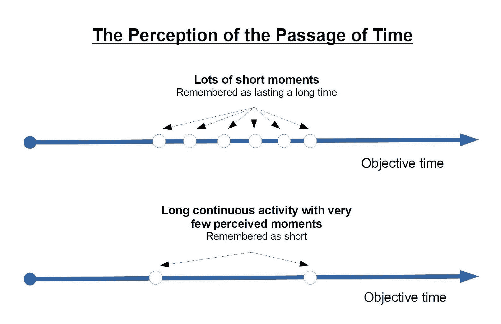
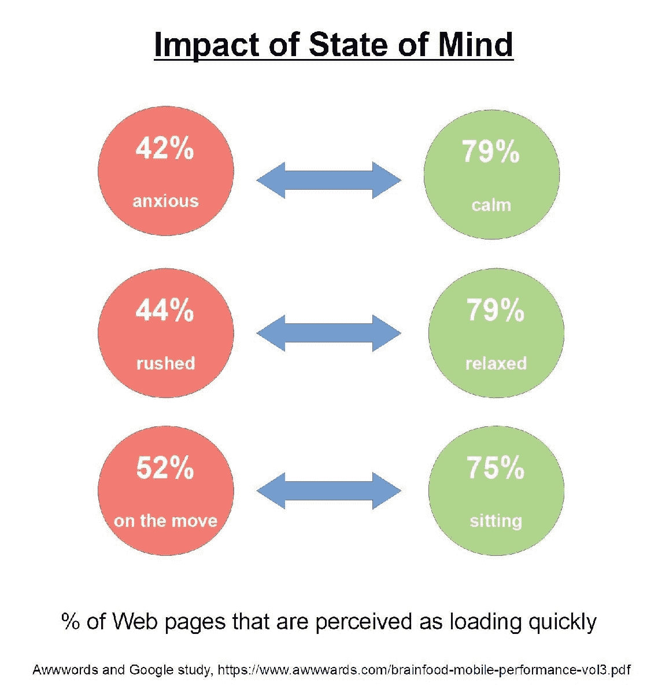
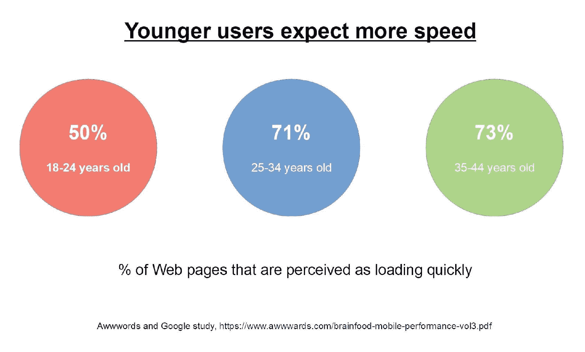
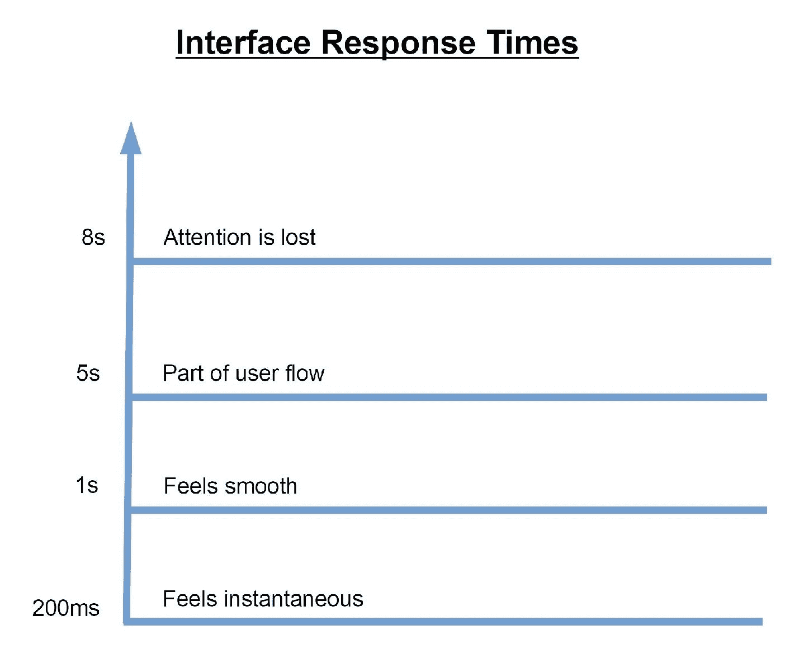
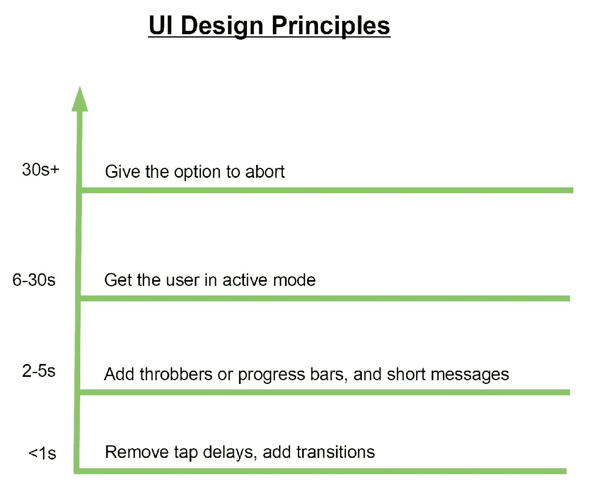
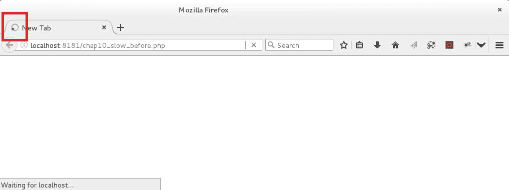
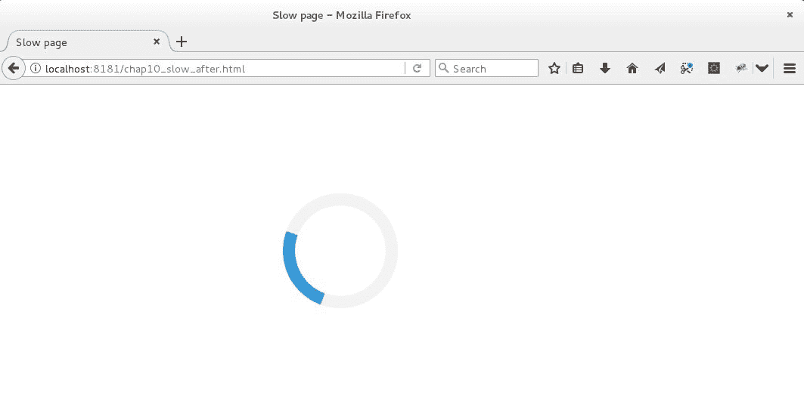
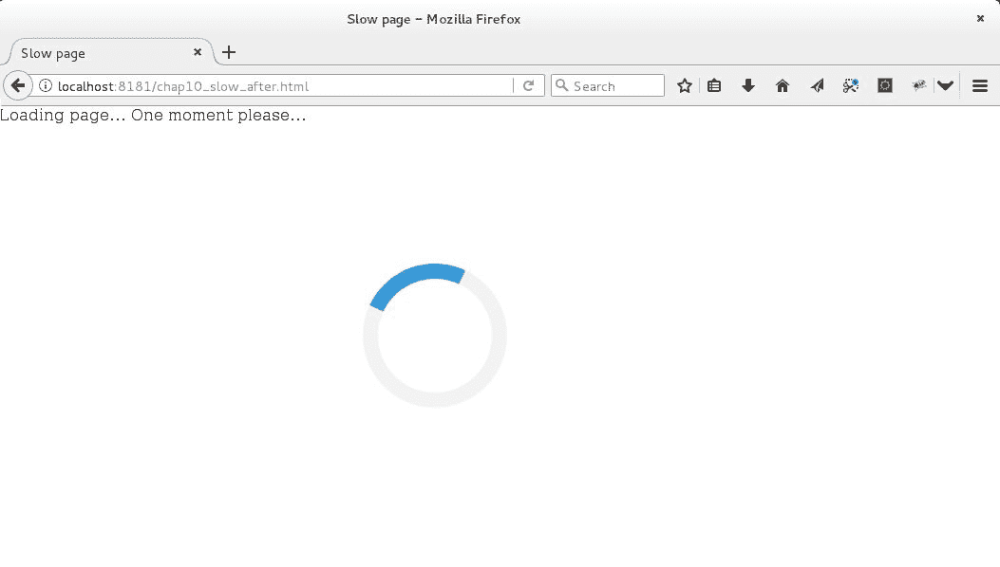
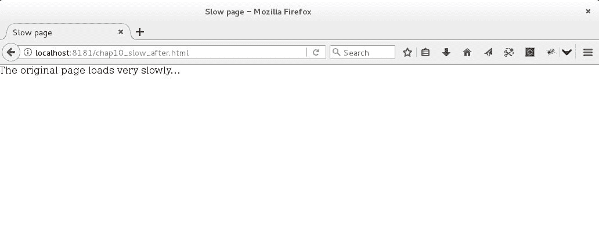
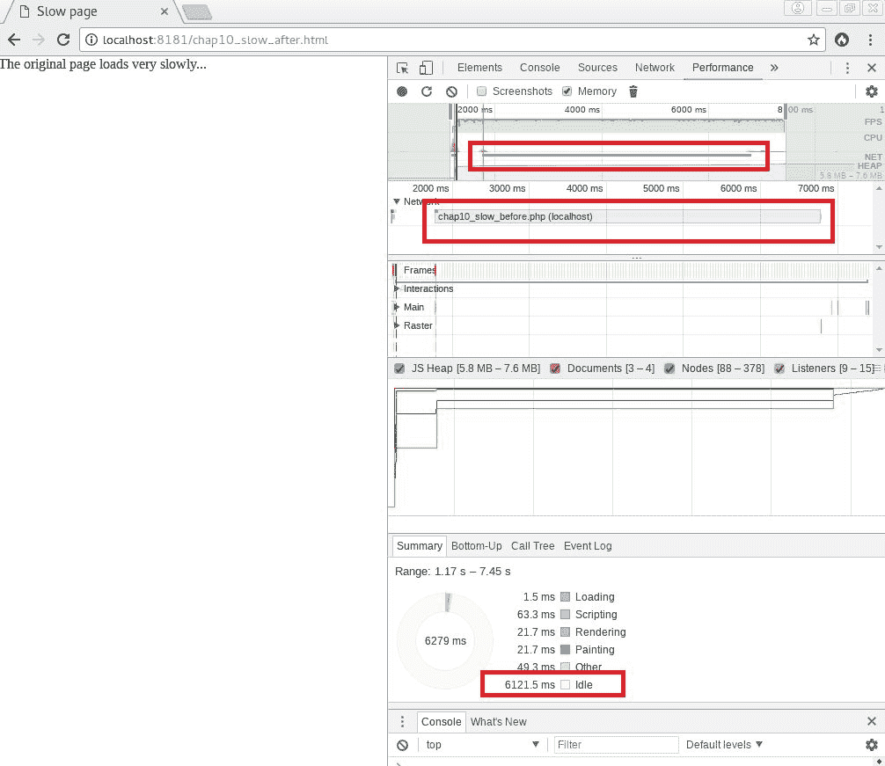

# 超越绩效

在本书的[第一章](01.html#K0RQ0-f23473f4602d4f9ab8631600e1d888e7)*快速网络入门*中，我们提到了性能也是关于感知的。事实上，如前所述，时间测量取决于测量时刻，并且可以根据要执行的任务的复杂性、用户的心理状态和用户的期望而变化，因为用户可能已经根据执行某项任务时他认为是参考软件的软件来定义了这些期望。因此，应用程序以一种良好的方式完成它必须完成的任务也意味着软件必须满足用户对该计算机程序应该如何完成任务的期望。因此，越快越好。

在本章中，我们将尝试更好地理解 UI 设计背后的原则，当涉及到性能感知时。我们将看到这些设计原则如何在没有真正优化的情况下对用户的主观时间感知产生真正的影响，并提高感知性能。

因此，我们将涵盖以下几点：

*   计时和感知时间
*   速度知觉
*   合理的延迟和响应时间
*   UI 设计原则和模式
*   超越性能工具

# 计时和感知时间

在前面的章节中，我们已经讨论了绩效问题，因为绩效是通过客观时间来衡量的。客观时间是通过一种工具来测量的，该工具以相等的测量单位划分即将到来的未来和即将到来的过去之间的持续时间，而这两个过去的部分处于持续不断的存在流中。

这个对客观时间的定义告诉我们，时间是一种存在运动的效果，它通过一个恒定的现在将我们从一个不确定的未来带到一个冻结的过去状态。这是客观的，因为第三方存在通过将其划分为相等的计量单位，被用作存在从一个国家转移到另一个国家的见证人。这就是为什么目标时间通常被称为时钟时间的原因，因为它指的是将时间划分为相等的测量单位（例如秒、分钟、小时等）的概念。显然，研究客观时间的科学领域是物理学。

话虽如此，毫无疑问，人类认为两个时刻之间的持续时间是可变的。事实上，我们都知道，当我们玩得开心时，时间过得飞快。因此，在心理学、主观或感知领域，时间被定义为大脑对两个或多个连续事件之间实际时间流逝的意识水平所产生的印象。意识越清醒，时间越长。它意识越不清楚，时间似乎过得越快：



The passing of time as it is perceived by the mind

许多因素会影响大脑对持续时间的感知。其中最值得注意的是人的情绪状态、对过去和预期事件的感知、压力的总体水平、体温、药物的存在以及年龄对人的心理状态的总体影响。

当将这些概念应用于计算机科学，更具体地说，应用于用户界面设计时，感知时间研究背后的概念成为我们发现如何影响用户对持续时间的感知以及这种感知如何影响用户的总体满意度的原则。

当然，这些因素中有很多超出了计算机程序员的控制范围，但是在设计用户界面时要考虑到一些因素，以便积极地影响用户的满意度。

# 速度知觉

首先，根据 Paul Bakaus 的说法，一个人的意识落后于当前发生的事情大约 80 毫秒。事实上，主观的现在总是客观的过去。此外，如果时事在本质上更为复杂，那么一个人将需要更多的时间来理解和充分感知时事。这些因素对任何人都适用。因此，所有用户将无意识地为计算机处理授予此免费启动时间。

其次，用户的情绪状态对感知时间有很强的影响。Awwwards 和 Google[1]最近的一项研究表明，焦虑或匆忙的用户会认为超过 50%的网站加载缓慢，而平静和放松的用户则不到 25%。与舒适地坐着的用户相比，移动中的用户也是如此：



The influence of a person's emotional state or level of activity when it comes to speed perception

第三，年龄是考虑时间感知的一个重要因素。用户越年轻，就越能意识到持续时间。根据 AWWWD 的同一研究，18-24 岁的用户只会考虑访问的网站中有一半是快的，而 25 到 44 岁的用户会认为几乎三个季度的相同网站加载得很快：



The influence of a person's age when it comes to speed perception

最后，当应用程序的有效使用开始时，所有用户都不太了解持续时间，即使没有完成加载。速度慢的零售网站常常因为感知速度而获得高度赞扬，这完全是因为用户可以开始购买他们想要的商品，即使浏览器还没有完成整个页面的呈现。

因此，与速度感知相关的某些元素对所有用户来说都是通用的，而其他元素则取决于特定的用户配置文件。为了更好地了解如何对总体用户满意度产生最佳影响，开发人员需要发现这些特定元素。

# 合理的延迟和响应时间

另一个因素是用户认为合理的延迟。正如[第 1 章](01.html#K0RQ0-f23473f4602d4f9ab8631600e1d888e7)*中所述，【更快的 Web 入门】*，这与用户认为某类应用程序的最佳性能直接相关。这种最佳性能通常是根据用户可能认为是引用的应用来确定的。对于基于 web 的应用程序和网站，由于所有 web 用户平均共享这些应用程序和网站，因此需要考虑某些阈值。

首先，大多数用户认为响应时间为 300 毫秒或更少是瞬时的。这在很大程度上是由前面提到的“意识滞后”所解释的。至于 300 毫秒到 1 秒之间的响应时间，这些被认为是合理的延迟，并给用户一种平稳过渡的印象。许多用户将开始失去注意力，并开始感到不耐烦超过三秒的响应时间延迟，除非有某种用户流。此外，谷歌最近的一项研究表明，如果手机网站的页面加载时间超过三秒，超过 50%的用户将离开该网站。八秒钟后，用户注意力被认为已丢失：



What most users consider to be a reasonable delay when using web applications or browsing websites

其次，所有已经完成既定目标的用户，或者之前访问某个网站时有良好的速度体验的用户，在将来访问该网站时会更加宽容，并且更有可能对持续时间有积极的看法。

最后，积极的速度体验不仅会确认用户对网站本身的满意度，还会影响用户对在线访问最终结果的感知以及对企业品牌的整体评价。

# UI 设计原则和模式

考虑到前面的所有因素和概念，现在可以抽象和理解某些 UI 设计原则。

首先，速度对用户很重要。因此，如果无法对应用程序进行其他优化，请确保用户在初始页面完成渲染之前就可以开始使用该应用程序。这意味着尽快进入页面的**第一个有意义的绘画**（**FMP**），以减少进入“交互时间”所需的时间，这是用户可以开始与应用程序交互的第一个时刻。有一项基本技术可以帮助您在加载页面的“高于折叠”内容之前加载页面，即将所有阻塞的 JavaScript 放在页面主体的末尾。此外，页面的某些部分可以缓存以更快地呈现，或者可以通过 AJAX 请求加载到浏览器中，这些请求例如通过定期计时器触发。最后，HTTP/2 的服务器推送功能和 HTTP 反向代理服务器在处理依赖于许多 CSS 和 JavaScript 库和框架以完成其呈现的网页时可能会非常有用。

其次，即使一个网站加载任何页面的时间不到一秒钟，也可以通过消除移动浏览器的点击延迟来加快速度。这可以通过在页面的标题部分添加 HTML 元标记来实现：

```php
<meta name="viewport" content="width=device-width">
```

此外，您可以使用*Chrome*CSS 规则来完成相同的任务：

```php
touch-action: manipulation
```

对于较旧的浏览器，请查看 FT 实验室的*快速点击*（[https://github.com/ftlabs/fastclick](https://github.com/ftlabs/fastclick) ）。

或者，由于页面加载速度非常快，因此可以添加简单的动画，以使页面过渡更加平滑。最好在提示用户时放松，在需要通过按钮和菜单做出即时反应时放松。这些基本的过渡动画应该持续 200 到 500 毫秒，当使用反弹或弹性效果时，应该将过渡视为持续 800 到 1200 毫秒。即使这些类型的视觉效果会给用户留下应用程序是高质量产品的印象，也不要过度动画化网页过渡，并尝试在网页加载未知图像大小时防止内容跳转，以保持整个用户体验尽可能平滑和精简。

第三，如果你的页面需要 2 到 5 秒的时间才能加载，建议你通过使用进度条、按动器或任何其他智能分心工具向用户发送一些反馈。此外，请务必使用简单的表达方式解释发生了什么，如“%32 MB 已上载”、“正在发送电子邮件”或“预计剩余时间：1 分钟”。

最后，如果一个页面的加载时间超过 5 秒，你应该让用户玩一个简单的游戏，让他们处于活动模式，例如。当然，你可以继续使用按动器、进度条和显示短消息来解释发生了什么。但是让用户进入主动模式会让他们对时间的流逝不那么在意。这对于需要很长加载时间的页面特别有用。事实上，一个非常活跃的用户可能会完全忘记时间，并被手头的一个愉快的游戏逗乐。如果您知道用户在查看您的应用程序时会感到焦虑、匆忙或移动，也可以使用此技术。此外，当页面需要很长的加载时间时，用户应该始终可以中止操作并稍后重试。

这也将对用户的总体满意度产生积极影响，因为它允许用户完全控制冗长的操作：



Applicable UI design principles depending on expected time delays

现在，让我们看看如何使用前面的原则和模式实现一个简单的 UI 设计。

# “超越性能”工具

为了更好地了解如何实现这些类型的解决方案，我们将创建一个动画转换，该转换将围绕一个非常慢的 PHP 脚本进行。因此，我们将尝试影响原始脚本的感知速度。

我们最初的 PHP 脚本将通过运行 sleep 命令来模拟缓慢的执行。以下是原始脚本的内容：

```php
<?php

// chap10_slow_before.php

sleep(5);

echo 'The original page loads very slowly...';
```

如果我们立即运行此脚本，我们肯定会发现脚本速度很慢，并且经过的时间可能会让我们相信出现了问题：



The script's slow execution might make us believe that something is going wrong

剧本确实给我们的印象是它是暂时挂起的。

现在我们将创建一个 HTML 脚本，该脚本将查询原始 PHP 脚本，并通过 AJAX 请求获得脚本的输出。这个新的 HTML 脚本还将添加一些过渡动画，以影响用户对原始脚本速度的感知。

为了实现这一点，我们将添加一个完全由 CSS 生成的 throbber，我们将使用`jQuery`和`Modernizr`库来进行 AJAX 调用。这些库文件托管在 CDN 上，以便从 HTTP 反向代理缓存和浏览器缓存中获益。以下是第二个脚本（`chap10_slow_after.html`的内容：

```php
<!DOCTYPE html>

<html lang="en">
<head>
    <meta charset="UTF-8">
    <title>Slow page</title>

    <meta name="viewport" content="width=device-width, initial-scale=1">
    <style>
        /* Center the loader */
        #se-pre-con {
            position: absolute;
            left: 50%;
            top: 50%;
            z-index: 1;
            width: 150px;
            height: 150px;
            margin: -75px 0 0 -75px;
            border: 16px solid #f3f3f3;
            border-radius: 50%;
            border-top: 16px solid #3498db;
            width: 120px;
            height: 120px;
            -webkit-animation: spin 2s linear infinite;
            animation: spin 2s linear infinite;
        }

        @-webkit-keyframes spin {
            0% { -webkit-transform: rotate(0deg); }
            100% { -webkit-transform: rotate(360deg); }
        }

        @keyframes spin {
            0% { transform: rotate(0deg); }
            100% { transform: rotate(360deg); }
        }

        /* Add animation to "page content" */
        .animate-bottom {
            position: relative;
            -webkit-animation-name: animatebottom;
            -webkit-animation-duration: 1s;
            animation-name: animatebottom;
            animation-duration: 1s
        }

        @-webkit-keyframes animatebottom {
            from { bottom:-100px; opacity:0 }
            to { bottom:0px; opacity:1 }
        }

        @keyframes animatebottom {
            from{ bottom:-100px; opacity:0 }
            to{ bottom:0; opacity:1 }
        }

        #contents {
            display: none;
            text-align: left;
        }
    </style>
</head>

<body onload="myAnimatedAjax()" style="margin:0;">

<div id="se-pre-con"></div>

<div id="contents"></div>

<script type="text/javascript" src="http://ajax.googleapis.com/ajax/libs/jquery/1.5.2/jquery.min.js"></script>
<script type="text/javascript" src="http://cdnjs.cloudflare.com/ajax/libs/modernizr/2.8.2/modernizr.js"></script>

<script type="text/javascript">

    jQuery.ajaxSetup({
        beforeSend: function() {
            $("#contents").html("Loading page... One moment please...").toggle();
        },
        complete: function(){
            $("#se-pre-con").fadeOut("slow"); //toggle visibility: off
        },
        success: function(result) {
            $("#contents").html(result);
        }
    });

    function myAnimatedAjax() {
        var myVar = setTimeout(animatedAjax, 500);
    }

    function animatedAjax() {
        $.ajax({
            type: "GET",
            url: "/chap10_slow_before.php"
        });
    }

</script>

</body>

</html>
```

运行此新脚本时，您应该会看到一个跳动器出现：



throbber 通知用户正在发生某些事情。

然后，几分钟后，您将看到一条消息，说明正在加载所需的页面：



The new message distracts the user and partially resets the user's perception of the passing of time

这条新消息旨在分散用户的注意力，并导致用户对时间的感知部分重置。最后，当 AJAX 请求完成时，throbber 和消息都会消失，以便显示另一个页面的内容：



The throbber and the message both disappear and the original script's output is displayed

当让新脚本运行时，我们肯定会得到这样的印象：原始脚本的墙时间减少了，而实际上，由于向发出 AJAX 请求的 JavaScript 函数添加了 0.5 秒超时，墙时间增加了。如果您运行我们在前几章中提到的 JavaScript 探查器，您将看到幕后发生了什么：



Most of the execution time (six seconds) is passed waiting for the original script to complete its execution

探查器确认此脚本的大部分挂起时间是由原始脚本的网络 I/O 来解释的，加载此脚本所需的时间与以前一样长。但是，我们使用新的包装器脚本所取得的成就给最终用户留下的印象是，我们已经成功地“超越了性能”

# 总结

在本章中，我们更好地理解了 UI 设计背后的原则，即性能感知。我们已经看到了这些设计原则如何对用户的主观时间感知产生真正的影响，以及它们如何在没有真正优化的情况下提高感知性能。

我们希望这本书能帮助您更好地理解性能和效率的概念，发现构成当今互联网的大多数新的底层网络技术，并帮助您掌握更快的网络。

# 工具书类

[1] [https://www.awwwards.com/brainfood-mobile-performance-vol3.pdf](https://www.awwwards.com/brainfood-mobile-performance-vol3.pdf)