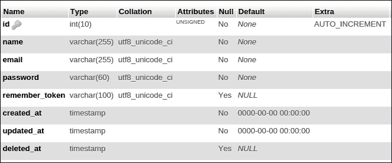
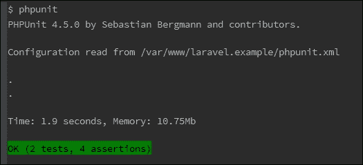

# 二、自动化测试——迁移和植入您的数据库

到目前为止，我们已经创建了一些基本模型和数据库的概要。现在，我们需要创建数据库迁移和播种。传统上，数据库“转储”文件被用作传递模式和数据的一种方式，模式是表的结构，数据是初始或预定义的记录，如默认值；不变的列表，如城市或国家；和“管理员”等用户。这些包含 SQL 的转储文件可以提交给源代码控制。这并不总是维护数据库完整性的最佳方式；因为每次开发人员添加记录或修改数据库时，团队中的所有开发人员都需要删除并重新创建数据库，或者手动添加或删除数据、表、行、列或索引。迁移允许数据库以代码的形式存在，实际驻留在 Laravel 项目中，并在源代码控制中进行版本控制。

迁移是从命令行运行的，如果数据库尚不存在，也可以在需要时自动创建数据库，或者删除并重新创建表，并填充已经存在的表。迁移在 Laravel 中已经存在了一段时间，所以它们出现在 Laravel 5 中并不奇怪。

# 利用拉威尔的迁移特征

第一步是运行`artisan`命令:

```php
$ php artisan migrate:install

```

这将创建一个名为`migration`的表，该表有两列:`migration`，这是 MySQL 中的 varchar 255，以及`batch`，这是一个整数。Laravel 将使用此表来跟踪已运行的迁移。换句话说，它维护所有已经执行的操作的历史。以下是主要操作的列表:

*   `install`:如前所述，本次操作安装
*   `refresh`:此操作重置并重新运行所有迁移
*   `reset`:此操作回滚所有迁移
*   `rollback`:这个操作是“撤销”的一种，只是回滚上一个操作
*   `status`:这个操作产生一个类似于表格的迁移输出，并说明它们是否已经运行

## 迁徙的一个例子

Laravel 5 在`/database/migrations`目录中包含两个迁移。

第一次迁移创建`users`表。

第二个创建`password_resets`表，正如您可能已经猜到的，该表用于恢复丢失的密码。除非另有规定，迁移在`/config/database.php`配置文件中配置的数据库上运行:

```php
<?php

use Illuminate\Database\Schema\Blueprint;
use Illuminate\Database\Migrations\Migration;

class CreateUsersTable extends Migration {

  /**
   * Run the migrations.
   *
   * @return void
   */
  public function up()
  {
    Schema::create('users', function(Blueprint $table)
    {
      $table->smallIncrements('id')->unsigned();
      $table->string('name');
      $table->string('email')->unique();
      $table->string('password', 60);
      $table->rememberToken();
      $table->timestamps();
      $table->softDeletes();
    });
  }

  /**
   * Reverse the migrations.
   *
   * @return void
   */
  public function down()
  {
    Schema::drop('users');
  }

}
```

迁移扩展`Migration`类并使用`Blueprint`类。

有两种方法:`up`和`down`，分别在使用`migrate`命令和`rollback`命令时使用。调用`Schema::create()`方法时，表名是第一个参数，函数回调是第二个参数，它接受一个`Blueprint`对象的实例作为参数。

## 创建表格

`$table`对象有几个方法可以执行创建索引、设置自动递增字段、说明应该创建哪种类型的字段以及将字段名称作为参数传递等任务。

第一个命令用于创建一个自动增量字段`id`，它将是表的主键。然后，创建字符串字段，如`name`、`email`和`password`。请注意，唯一的方法链接到`email`字段的`create`语句，声明`email`字段将用作登录名/用户标识，因为这是大多数现代网络应用中的常见做法。`rememberToken`用于允许用户在每次会话中保持认证。该令牌在每次登录和注销时都会重置，从而保护用户免受潜在的恶意劫持。

## 拉弗尔的迁徙魔法

Laravel 迁移还能够创建时间戳字段，这些字段用于通过表行自动存储每个模型的创建和更新信息。

## $table- >时间戳()；

下面的代码行告诉迁移在表中自动创建两列，即`created_at`和`updated_at`，这是由 Laravel 的雄辩 **对象关系映射** ( **ORM** )自动使用的，以允许应用知道对象是何时创建的以及何时更新的:

`$table->timestamps()`

在以下示例中，字段更新如下:

```php
/*
*   created_at is set with timestamps
*/
$user = new User();
$user->email = "johndoe@acmewidgets.com";
$user->name = "John Doe";
$user->save(); // created_at is set with timestamps

/*
*   updated_at is set with timestamps
*/
$user = User::find(1); //where 1 is the $id
$user->email = "johndoe@acmeenterprise.com";
$user->save(); //updated_at is updated
```

另一个很棒的 Laravel 特性是软删除字段。这提供了一种类型的**回收站** ，允许数据在以后任意恢复。

该特性只是向表中添加另一列，以允许数据的软删除。要添加到迁移中的代码如下所示:

```php
$table->softDeletes();
```

这将向`database, deleted_at,`添加一列，该列或者将`null`作为其值，或者将时间戳作为记录被删除的时间。这将在您的数据库应用中构建回收站功能。

运行以下命令:

```php
$ php artisan migrate

```

迁移开始并创建表。现在出现**迁移**表，如下图截图所示:


`users`表的结构如下截图所示:



要回滚迁移，请运行以下命令:

```php
$ php artisan migrate:rollback

```

`rollback` 命令使用迁移表来确定回滚哪些操作。在这种情况下，`migrations`表在运行后，现在是空的。

# 从模式到迁移

开发过程中常见的情况是创建了一个模式，然后我们需要从该模式创建一个迁移。在撰写本文时，在 Laravel 内核中还没有官方工具可以做到这一点，但是有几个包可供使用。

其中一个包就是`migrations-generator`包。

首先，在`composer.json`文件的`require-dev`部分添加以下行，以要求`composer.json`文件中的`migrations-generator`依赖项:

```php
"require-dev": {
    "phpunit/phpunit": "~4.0",
    "phpspec/phpspec": "~2.1",
    "xethron/migrations-generator": "dev-feature/laravel-five-stable",
    "way/generators": "dev-feature/laravel-five-stable"
  },
```

还需要在根级别将以下文本添加到`composer.json`文件中:

```php
"repositories": [
  {
    "type": "git",
    "url": "git@github.com:jamisonvalenta/Laravel-4-Generators.git"
  }],
```

## 作曲家的 require-dev 命令

与`require`相反， `require-dev`命令是一种允许仅在开发阶段需要的某些包的编写器机制。大多数测试工具和迁移工具将只在本地开发机器、质量保证机器和/或持续集成环境中使用，而不会在生产环境中使用。这种机制使您的生产安装没有不必要的软件包。

## Laravel 的提供商阵列

Laravel 在`config/app.php`文件中的`providers`数组列出了 Laravel 在任何时候都可以使用的提供商。

我们将添加`way generator`和`Xethron migration`服务提供商:

```php
'providers' => [

        /*
         * Laravel Framework Service Providers...
         */
          Illuminate\Foundation\Providers\ArtisanServiceProvider::class,
          Illuminate\Auth\AuthServiceProvider::class,
          Illuminate\Broadcasting\BroadcastServiceProvider::class,
        ...
    'Way\Generators\GeneratorsServiceProvider',
    'Xethron\MigrationsGenerator\MigrationsGeneratorServiceProvider'
]
```

## 作曲家更新命令

`composer update`命令是一种简单而强大的方法，可以确保所有需要到位的东西都能够正常工作并且没有错误。运行此命令后，我们现在可以运行迁移了。

## 生成迁移

只需输入以下命令:

```php
$ php artisan

```

`artisan`命令将显示所有可能命令的列表。`migrate:generate`命令应包含在有效命令列表中。如果此命令不在列表中，则说明某些内容配置不正确。

一旦确认列表中存在`migrate:generate`命令，只需运行以下命令:

```php
$ php artisan migrate:generate

```

这将启动该过程。

在这个例子中，我们使用了 MySQL 数据库。当出现提示时，通过输入`Y`，该过程将开始，并且输出应该显示为数据库中的每个表创建的一个迁移文件。

您的命令提示符应该以这种方式出现在最后:

```php
Using connection: mysql

Generating migrations for: accommodations, amenities, amenity_room, cities, countries, currencies, locations, rates, reservation_room, reservations, rooms, states, users
Do you want to log these migrations in the migrations table? [Y/n] Y
Migration table created successfully.
Next Batch Number is: 1\. We recommend using Batch Number 0 so that it becomes the "first" migration [Default: 0] 
Setting up Tables and Index Migrations
Created: /var/www/laravel.example/database/migrations/2015_02_07_170311_create_accommodations_table.php
Created: /var/www/laravel.example/database/migrations/2015_02_07_170311_create_amenities_table.php
Created: /var/www/laravel.example/database/migrations/2015_02_07_170311_create_amenity_room_table.php
Created: /var/www/laravel.example/database/migrations/2015_02_07_170311_create_cities_table.php
Created: /var/www/laravel.example/database/migrations/2015_02_07_170311_create_countries_table.php
Created: /var/www/laravel.example/database/migrations/2015_02_07_170311_create_currencies_table.php
Created: /var/www/laravel.example/database/migrations/2015_02_07_170311_create_locations_table.php
Created: /var/www/laravel.example/database/migrations/2015_02_07_170311_create_rates_table.php
Created: /var/www/laravel.example/database/migrations/2015_02_07_170311_create_reservation_room_table.php
Created: /var/www/laravel.example/database/migrations/2015_02_07_170311_create_reservations_table.php
Created: /var/www/laravel.example/database/migrations/2015_02_07_170311_create_rooms_table.php
Created: /var/www/laravel.example/database/migrations/2015_02_07_170311_create_states_table.php
Created: /var/www/laravel.example/database/migrations/2015_02_07_170311_create_users_table.php

Finished!

```

# 迁移解剖

考虑迁移文件中某一行的示例；我们可以看到 table 对象被用在一系列方法中。迁移文件的下一行在`locations`表的位置有效属性中设置状态属性:

```php
$table->smallInteger('state_id')->unsigned()->index('state_id');
```

## 列表表格

通常，需要创建或导入通常保持不变的有限项目列表，如城市、州、国家和类似项目。让我们称这些列表或查找表。在这些表中，标识通常应该是正数。这些列表可能会增加，但通常不会有任何被删除或更新的数据。`smallInteger`类型用于保持表小，也表示属于有限列表的值，这种东西不会自然增长。下一种方法`unsigned`规定上限为 65535。该值应该足以代表酒店所在的大多数州、省或类似类型的地理区域。链中的最后一个方法向数据库列添加索引。这在像这样的列表中非常重要，这些列表用于`select`语句或`read`语句。`Read`声明将在[第 9 章](09.html "Chapter 9. Scaling Laravel")、*缩放 Laravel* 中讨论。使用无符号是很重要的，因为它使正极限加倍，否则正极限将是 32767。使用索引，我们可以加快查找时间，并访问表中数据的缓存版本。

## 软删除和时间戳属性

关于列表表的`softDeletes``timestamps`，看情况而定。如果表不是很大，跟踪任何更新、插入或删除(如果发生的话)应该不会太有害；然而，如果列表中包含的国家很少发生变化，而且变化很小，那么谨慎的做法是省略`softDeletes`和`timestamps`。因此，整个表可能会放入内存，速度会非常快。要省略时间戳，需要添加以下代码行:

```php
public $timestamps = false;
```

# 创造种子

为了创建我们的数据库播种器，我们将修改扩展`Seeder`的`DatabaseSeeder`类。文件的名字是`database/seeds/DatabaseSeeder.php`。文件的内容如下:

```php
<?php

use Illuminate\Database\Seeder;
use Illuminate\Database\Eloquent\Model;

class DatabaseSeeder extends Seeder {

    /**
     * Run the database seeds.
     *
     * @return void
     */
    public function run()
    {
        Model::unguard();

        //create a user
        $user = new \MyCompany\User();
        $user->id=1;
        $user->email = "testing@tester.com";
        $user->password = Hash::make('p@ssw0rd');
        $user->save();

        //create a country
        $country = new \MyCompany\Accommodation\Location\State;
        $country->name = "United States";
        $country->id = 236;
        $country->save();

        //create a state
        $state = new \MyCompany\Accommodation\Location\State;
        $state->name = "Pennsylvania";
        $state->id = 1;
        $state->save();

        //create a city
        $city = new \MyCompany\Accommodation\Location\City;
        $city->name = "Pittsburgh";
        $city->save();

        //create a location
        $location = new \MyCompany\Accommodation\Location;
        $location->city_id = $city->id;
        $location->state_id = $state->id;
        $location->country_id = 236;
        $location->latitude = 40.44;
        $location->longitude = 80;
        $location->code = '15212';
        $location->address_1 = "100 Main Street";
        $location->save();

        //create a new accommodation
        $accommodation = new \MyCompany\Accommodation;
        $accommodation->name = "Royal Plaza Hotel";
        $accommodation->location_id = $location;
        $accommodation->description = "A modern, 4-star hotel";
        $accommodation->save();

        //create a room
        $room1 = new \MyCompany\Accommodation\Room;
        $room1->room_number= 'A01';
        $room1->accommodation_id = $accommodation->id;
        $room1->save();

        //create another room
        $room2 = new \MyCompany\Accommodation\Room;
        $room2->room_number= 'A02';
        $room2->accommodation_id = $accommodation->id;
        $room2->save();

        //create the room array
        $rooms = [$room1,$room2];

    }

}
```

种子文件设置了非常基本的可能场景。对于初始测试，我们甚至不需要将每个可能的国家、州、城市和位置添加到数据库中；我们只需要添加必要的信息来创建各种场景。创建新的预订；例如，我们将为每个用户、国家、州、城市、位置和住宿模型创建一个实例，然后创建两个房间，并将其添加到房间数组中。

让我们为预订创建一个存储库，它将实现一个非常简单的存储库界面:

```php
<?php

namespace MyCompany\Accommodation;

interface RepositoryInterface {
    public function create($attributes);
}
```

现在我们来创建`ReservationRepository`，实现`RepositoryInterface`:

```php
<?php

namespace MyCompany\Accommodation;

class ReservationRepository implements RepositoryInterface {
    private $reservation;

    function __construct($reservation)
    {
        $this->reservation = $reservation;
    }

    public function create($attributes)
    {
        $this->reservation->create($attributes);
        return $this->reservation;
    }
}
```

现在，我们将创建创建预订和填充数据透视表所需的方法`reservation_room`:

```php
public function create($attributes)
{

    $modelAttributes= array_except($attributes, ['rooms']);

    $reservation = $this->reservationModel->create($modelAttributes);
    if (isset($attributes['rooms']) ) {
        $reservation->rooms()->sync($attributes['rooms']);
    }
    return $reservation;
}
```

### 类型

`array_except()` Laravel 助手用于返回`attributes`数组，但`$rooms`数组除外，该数组将用于`sync()`功能。

这里，我们将模型的每个属性设置为方法中设置的属性。我们需要添加在预订和房间之间建立多对多关系的方法:

```php
public function rooms(){
    return $this->belongsToMany('MyCompany\Accommodation\Room')->withTimestamps();
}
```

在这种情况下，我们需要将`withTimestamps()`添加到关系中，以便更新时间戳，指示关系何时保存在`reservation_room`透视表中。

# 用 PHPUnit 进行数据库测试

PHPUnit 与 Laravel 5 的集成很好，就像与 Laravel 4 的集成一样，所以设置测试环境相当容易。一个好的测试方法是使用 SQLite 数据库并将其设置为驻留在内存中，但是您需要修改`config/database.php`文件，如下所示:

```php
    'default' => 'sqlite',
       'connections' => array(
        'sqlite' => array(
            'driver'   => 'sqlite',
            'database' => ':memory:',
            'prefix'   => '',
        ),
    ),
```

然后，我们需要修改`phpunit.xml`文件来设置一个`DB_DRIVER`环境变量:

```php
<php>
        <env name="APP_ENV" value="testing"/>
        <env name="CACHE_DRIVER" value="array"/>
        <env name="SESSION_DRIVER" value="array"/>
        <env name="DB_DRIVER" value="sqlite"/>
</php>
```

然后，我们需要修改`config/database.php`文件中的以下一行:

```php
'default' => 'mysql',
```

我们修改前面的行以匹配下面的行:

```php
'default' => env('DB_DRIVER', 'mysql'),
```

现在，我们将设置 PHPUnit 在内存中的`sqlite`数据库上运行我们的迁移。

在`tests`目录中，有两个类:扩展`LaravelTestCase`类的`TestCase`类和扩展`TestCase`类的`ExampleTest`类。

我们需要向`TestCase`添加两种方法来执行迁移，运行播种器，然后将数据库恢复到其原始状态:

```php
<?php

class TestCase extends Illuminate\Foundation\Testing\TestCase {

    public function setUp()
    {
        parent::setUp();
        Artisan::call('migrate');
        Artisan::call('db:seed');
    }

    /**
    * Creates the application.
    *
    * @return \Illuminate\Foundation\Application
    */
    public function createApplication()
    {
        $app = require __DIR__.'/../bootstrap/app.php';
        $app->make('Illuminate\Contracts\Console\Kernel')->bootstrap();
        return $app;
    }

    public function tearDown()
    {
        Artisan::call('migrate:rollback');
    }
}
```

现在，我们将创建一个 PHPUnit 测试来验证数据是否正确保存在数据库中。我们需要将`tests/ExampleTest.php`修改为以下代码:

```php
<?php

class ExampleTest extends TestCase {

    /**
    * A basic functional test example.
    *
    * @return void
    */

public function testReserveRoomExample()
    {

        $reservationRepository = new \MyCompany\Accommodation\ReservationRepository(
            new \MyCompany\Accommodation\Reservation());
        $reservationValidator = new \MyCompany\Accommodation\ReservationValidator();
        $start_date = '2015-10-01';
        $end_date = '2015-10-10';
        $rooms = \MyCompany\Accommodation\Room::take(2)->lists('id')->toArray();
        if ($reservationValidator->validate($start_date,$end_date,$rooms)) {
            $reservation = $reservationRepository->create(['date_start'=>$start_date,'date_end'=>$end_date,'rooms'=>$rooms,'reservation_number'=>'0001']);
        }

        $this->assertInstanceOf('\MyCompany\Accommodation\Reservation',$reservation);
        $this->assertEquals('2015-10-01',$reservation->date_start);
        $this->assertEquals(2,count($reservation->rooms));
}
```

## 运行 PHPUnit

要启动 PHPUnit，只需键入以下命令:

```php
$ phpunit

```

测试将会运行。由于`Reservation`类的`create`方法返回一个预订，我们可以使用 PHPUnit 的`assertInstanceOf`方法来确定数据库中是否创建了一个预订。我们可以添加任何其他断言，以确保保存的值正是我们想要的。例如，我们可以断言开始日期等于`'2015-10-01'`，`room`数组的大小等于`two`。与`testBasicExample()`方法一起，我们可以确保对`"/"`的`GET`请求返回一个`200`。PHPUnit 结果如下所示:



请注意，有两个点代表测试。 **OK** 表示没有失败，再次告诉我们有两个测试，四个断言；示例中的一个断言和其他三个断言，我们已经将其添加到我们的`testReserveRoomExample`测试中。如果我们测试的是三个房间而不是两个，PHPUnit 会产生以下输出:

```php
$ phpunit
PHPUnit 4.5.0 by Sebastian Bergmann and contributors.

Configuration read from /var/www/laravel.example/phpunit.xml

.
F

Time: 1.59 seconds, Memory: 10.75Mb

There was 1 failure:

1) ExampleTest::testReserveRoomExample
Failed asserting that 2 matches expected 3.

/var/www/laravel.example/tests/ExampleTest.php:24

FAILURES! 
Tests: 2, Assertions: 4, Failures: 1.

```

注意不是第二个点，我们有一个`F`代表失败，而不是`OK`，我们被告知有`1`失败。PHPUnit 然后列出了哪些测试失败了，并很好地告诉我们我故意修改为不正确的那一行，如下所示:

```php
   $this->assertEquals(3,count($reservationResult->rooms));
```

前一行确实不正确:

```php
Failed asserting that 2 matches expected 3.

```

记住`2`是计数`($reservationResult->rooms)`的值。

# 使用 Behat 进行功能测试

虽然 phpspec 遵循规范的 BDD，并且对于隔离的规范和设计很有用，但是它的补充工具 Behat 用于集成和功能测试。由于 phpspec 建议模拟所有的事情，数据库查询实际上不会被执行，因为数据库不在该方法的上下文中。Behat 是对某个特性进行行为测试的一个很好的工具。虽然 phpspec 已经包含在 Laravel 5 的依赖项中，但 Behat 将作为外部模块安装。

应该运行以下命令来安装 Behat 并使其与 Laravel 5 一起工作:

```php
$ composer require behat/behat behat/mink behat/mink-extension laracasts/behat-laravel-extension --dev

```

运行作曲家更新后，Behat 的功能被添加到 Laravel 中。接下来，应该在 Laravel 项目的根目录下添加一个`behat.yaml`文件，以指定要使用的扩展名。

接下来，运行以下命令:

```php
$ behat --init

```

这将创建一个内部有`bootstrap`目录的`features`目录。一个`FeaturesContext`班将也将被创建。每次运行`behat`时，引导程序中的所有内容都会运行。这对于自动运行迁移和播种非常有用。

`features/bootstrap/FeaturesContext.php`文件是这样的:

```php
<?php

use Behat\Behat\Context\Context;
use Behat\Behat\Context\SnippetAcceptingContext;
use Behat\Gherkin\Node\PyStringNode;
use Behat\Gherkin\Node\TableNode;

/**
 * Defines application features from the specific context.
 */
class FeatureContext implements Context, SnippetAcceptingContext
{
    /**
     * Initializes context.
     *
     * Every scenario gets its own context instance.
     * You can also pass arbitrary arguments to the
     * context constructor through behat.yml.
     */
    public function __construct()
    {
    }
}
```

接下来`FeatureContext`类需要扩展`MinkContext`类，因此类定义行需要修改如下:

```php
class FeatureContext implements Context, SnippetAcceptingContext
```

接下来， `prepare`和`cleanup`方法将被添加到类中，以便执行迁移。我们将添加`@BeforeSuite`和`@AfterSuite`注释，告诉 Behat 在每个套件之前执行迁移和播种，并迁移到回滚，以便在每个套件之后将数据库恢复到其原始状态。在文档块中使用注释将在[第 6 章](06.html "Chapter 6. Taming Complexity with Annotations")、*用注释驯服复杂性*中讨论。我们现在的课堂结构如下:

```php
<?php

use Behat\Behat\Context\Context;
use Behat\Behat\Context\SnippetAcceptingContext;
use Behat\Gherkin\Node\PyStringNode;
use Behat\Gherkin\Node\TableNode;

/**
 * Defines application features from the specific context.
 */
class FeatureContext implements Context, SnippetAcceptingContext
{
    /**
     * Initializes context.
     *
     * Every scenario gets its own context instance.
     * You can also pass arbitrary arguments to the
     * context constructor through behat.yml.
     */
    public function __construct()
    {
    }
     /**
     * @BeforeSuite
     */
     public static function prepare(SuiteEvent $event)
     {
        Artisan::call('migrate');
        Artisan::call('db:seed');

     }

     /**
     * @AfterSuite 
     */
     public function cleanup(ScenarioEvent $event)
     {
        Artisan::call('migrate:rollback');
     }
}
```

现在，需要创建一个特征文件。在房间目录中创建`reservation.feature`:

```php
Feature: Reserve Room
  In order to verify the reservation system
  As an accommodation reservation user
  I need to be able to create a reservation in the system
  Scenario: Reserve a Room
   When I create a reservation
         Then I should have one reservation
```

当`behat`运行如下:

```php
$ behat

```

产生以下输出:

```php
Feature: Reserve Room
 In order to verify the reservation system
 As an accommodation reservation user
 I need to be able to create a reservation in the system

 Scenario: List 2 files in a directory # features/reservation.feature:5
 When I create a reservation
 Then I should have one reservation

1 scenario (1 undefined)
2 steps (2 undefined)
0m0.10s (7.48Mb)

--- FeatureContext has missing steps. Define them with these snippets:

 /**
 * @When I create a reservation
 */
 public function iCreateAReservation()
 {
 throw new PendingException();
 }

 /**
 * @Then I should have one reservation
 */
 public function iShouldHaveOneReservation()
 {
 throw new PendingException();
 }

```

Behat，就像 phpspec 一样，熟练地产生输出，向你展示需要创建的方法。请注意，使用的是骆驼纹而不是蛇纹。这个代码应该复制到`FeatureContext`类中。请注意，默认情况下，会引发异常。

在这里，将调用 RESTful API，因此需要向项目中添加大量的 HTTP 包:

```php
$ composer require guzzlehttp/guzzle

```

接下来，给类添加一个属性来保存`guzzle`对象。我们将向 RESTful 资源控制器添加一个`POST`请求，以创建一个预订并期待一个 201 代码。请注意，返回代码是一个字符串，需要转换为整数。接下来，执行`get`以返回所有预订。

应该只创建一个保留，因为每次都会运行迁移和播种:

```php
<?php

use Behat\Behat\Context\Context;
use Behat\Behat\Context\SnippetAcceptingContext;
use Behat\Gherkin\Node\PyStringNode;
use Behat\Gherkin\Node\TableNode;
use Behat\MinkExtension\Context\MinkContext;
use Behat\Testwork\Hook\Scope\BeforeSuiteScope;
use Behat\Testwork\Hook\Scope\AfterSuiteScope;
use GuzzleHttp\Client;

/**
 * Defines application features from the specific context.
 */
class FeatureContext extends MinkContext implements Context, SnippetAcceptingContext
{
    /**
     * Initializes context.
     *
     * Every scenario gets its own context instance.
     * You can also pass arbitrary arguments to the
     * context constructor through behat.yml.
     */
    protected $httpClient;

    public function __construct()
    {
        $this->httpClient = new Client();
    }
    /**
     * @BeforeSuite
     */
    public static function prepare(BeforeSuiteScope $scope)
    {
        Artisan::call('migrate');
        Artisan::call('db:seed');

    }

    /**
     * @When I create a reservation
     */
    public function iCreateAReservation()
    {
        $request = $this->httpClient->post('http://laravel.example/reservations',['body'=> ['start_date'=>'2015-04-01','end_date'=>'2015-04-04','rooms[]'=>'100']]);
        if ((int)$request->getStatusCode()!==201)
        {
            throw new Exception('A successfully created status code must be returned');
        }
    }

    /**
     * @Then I should have one reservation
     */
    public function iShouldHaveOneReservation()
    {
        $request = $this->httpClient->get('http://laravel.example/reservations');
        $arr = json_decode($request->getBody());
        if (count($arr)!==1)
        {
            throw new Exception('there must be exactly one reservation');
        }
    }

    /**
     * @AfterSuite
     */
    public static function cleanup(AfterSuiteScope $scope)
    {
        Artisan::call('migrate:rollback');
    }
}

    /**
     * @When I create a reservation
     */
    public function iCreateAReservation()
    {
        $request = $this->httpClient->post('http://laravel.example/reservations',['body'=> ['start_date'=>'2015-04-01','end_date'=>'2015-04-04','rooms[]'=>'100']]);
        if ((int)$request->getStatusCode()!==201)
        {
            throw new Exception('A successfully created status code must be returned');
        }
    }
```

现在，要创建，请使用来自命令行的工匠:

```php
$ php artisan make:controller ReservationsController

```

以下是预约控制器的内容:

```php
<?php namespace MyCompany\Http\Controllers;

use MyCompany\Http\Requests;
use MyCompany\Http\Controllers\Controller;
use Illuminate\Http\Request;
use Symfony\Component\HttpFoundation\Response;
use MyCompany\Accommodation\ReservationRepository;
use MyCompany\Accommodation\ReservationValidator;
use MyCompany\Accommodation\Reservation;

class ReservationsController extends Controller {

    /**
    * Display a listing of the resource.
    *
    * @return Response
    */
    public function index()
    {
        return Reservation::all();
    }

    /**
    * Store a newly created resource in storage.
    *
    * @return Response
    */
    public function store()
    {
        $reservationRepository = new ReservationRepository(new Reservation());
        $reservationValidator = new ReservationValidator();
        if ($reservationValidator->validate(\Input::get('start_date'),
        \Input::get('end_date'),\Input::get('rooms')))
        {
        $reservationRepository->create(['date_start'=>\Input::get('start_date'),'date_end'=>\Input::get('end_date'),'rooms'=>\Input::get('rooms')]);
        return response('', '201');
        }
    }
}
```

最后，将`ReservationController`添加到位于`app/Http/routes.php`的的`routes.php`文件中:

```php
Route::resource('reservations','ReservationController');

```

现在`behat`运行时，结果如下:

```php
Feature: Reserve Room
 In order to verify the reservation system
 As an accommodation reservation user
 I need to be able to create a reservation in the system

 Scenario: Reserve a Room
 When I create a reservation         # FeatureContext::iCreateAReservation()
 Then I should have one reservation  # FeatureContext::iShouldHaveOneReservation()

1 scenario (1 passed)
2 steps (2 passed)

```

# 总结

配置 Laravel 从现有模式创建迁移文件对于非绿地项目来说也是一个有用的框架。通过在测试环境中运行迁移和播种，每个测试都可以从数据库的完全干净的版本以及初始数据中受益，初始数据允许它在数据库中“刚好足够”来最低限度地验证软件是否按需要运行。当遗留代码需要移植到 Laravel 时，PHPUnit 可以用来测试任何现有的函数。Behat 提供了一种基于行为的替代方案，可以巧妙地执行端到端测试。

我们在一个孤立的环境中使用 phpspec 设计了我们的类，只关注业务规则和客户的请求，同时嘲笑一些东西，比如实际的实体，比如房间。然后，我们通过使用功能测试工具 PHPUnit 来验证实际查询是否被正确执行并保存在数据库中。最后，我们使用 Behat 来执行端到端测试。

在下一章中，我们将看到 RESTful API 的创建，基本的 CRUD 操作(创建、读取、更新和删除)，并讨论一些最佳实践。