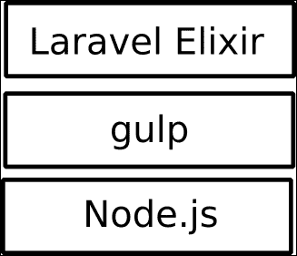
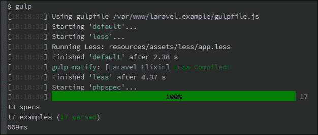
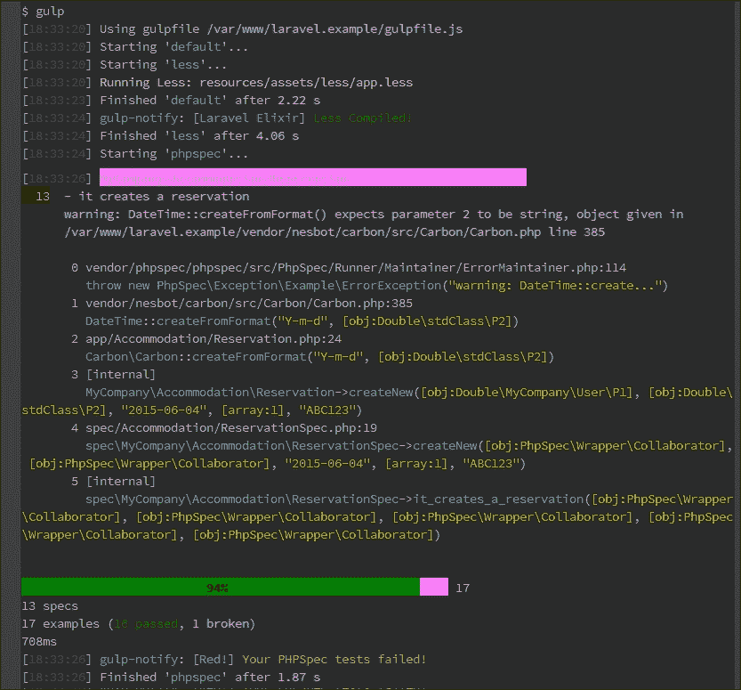

# 十、使用Elixirs构建、编译和测试

本章将涵盖以下主题:

*   安装 Node.js、大口和Elixirs
*   跑步Elixirs
*   使用Elixirs组合 CSS 和 JavaScript 文件
*   设置通知
*   用Elixirs进行测试
*   Elixirs

# 自动化 Laravel

在本书中，已经构建了示例应用的许多部分。我们讨论了创建应用的步骤。然而，有更多关于工具的信息可以用来帮助搭建脚手架、样板模板以及为 CRUD 应用构建 RESTful API。直到最近，关于自动化开发过程和部署过程的某些部分的文章还不多。

最近几年在 PHP 领域出现的一个新领域是持续集成和构建工具的概念。持续集成和持续交付的流行使开发团队能够每天多次不断地发布对其应用的许多小改进。在本章中，您将了解 Laravel 如何拥有一个新的工具集，使团队能够快速、轻松地部署他们的软件版本并进行构建，以及自动组合软件的许多组件。

持续集成和持续交付已经在开发过程中引起了相当大的演变，这极大地改变了软件构建的方式。然而，就在不久前，标准的部署过程只涉及将代码放在服务器上。大多数 PHP 的早期采用者只是网页设计师，他们需要添加一些功能，比如论坛或 T2 联系我们的形式。因为他们中的大多数人不是程序员，大多数用于网页设计和图形设计的实践也进入了 PHP 部署。这些实践通常涉及使用诸如 FileZilla 之类的应用将文件从左侧面板(用户的计算机)拖放到右侧(服务器的目录)。对于更有经验的人来说，使用 PuTTY 之类的终端仿真器执行当时神秘的 UNIX 命令。

使用了不安全的文件传输端口 21，所有内容都以未压缩的方式发送，并简单地复制到服务器。通常，所有文件都会被覆盖，对于包含许多图像和文件的大型站点，部署通常需要将近一个小时。

最终，源代码控制系统变得无处不在。最近几年，SVN 和 Git 已经成为大多数软件项目的行业标准。这些工具允许直接从代码存储库中进行部署。

最近，composer 的出现创造了一种简单的方法，可以简单地包含整个软件包，为软件应用添加功能。开发人员只需在配置文件中添加一行代码就能轻松完成，这令人振奋！

开发和部署过程的自动化可能涉及许多步骤，下面列出了其中一些步骤。

## 部署

以下是部署流程的一些功能:

*   复制与生产环境相关的某些配置设置
*   处理或编译任何使用快捷语法或预处理器编写的**级联样式表** ( **CSS** )或 JavaScript 文件
*   将各种资产(源代码或映像)复制到镜像、集群服务器或内容交付网络
*   修改某些文件或目录的读/写/执行权限和/或所有权
*   将几个文件合并到一个文件中，以减少执行多个 HTTP 调用所需的开销
*   减少文件中无用的空白和注释(缩小和/或丑化)以减小其大小
*   将服务器上的现有文件与本地环境中的文件进行比较，以确定是否覆盖它们
*   标记和/或版本化源代码，以允许可能的代码回滚

## 开发或部署

以下是开发或部署流程的一些功能:

*   验证代码通过了为保证质量而编写的所有单元、功能和验收测试
*   运行执行各种操作的脚本
*   对数据库表执行任何迁移、播种或其他修改
*   从托管源代码控制系统(如 GitHub)获取源代码控制

很明显，现代发展非常复杂。软件开发的一个更困难的方面是在开发过程中不断重新创建生产或最终环境。

# 走向自动化

像这样的工具，文件观察者可以在每次修改文件时运行脚本或执行操作。此外，像 PHPStorm 这样的 ide 将识别文件扩展名，并提供监视文件变化的功能，允许开发人员执行某些操作。虽然这种方法是可以接受的，但它的可移植性不是很高，每个开发人员都必须在 IDE 或文本编辑器中创建一个配置文件并与不同的观察者共享。这就产生了依赖性，整个团队依赖于一个集成开发环境。

此外，还可以创建其他方法，如以特定时间间隔运行的 Bash-shell 脚本。然而，使用这些脚本需要 UNIX 外壳编码知识。如前所述，像 artisan 这样的工具有助于自动化许多手动任务。然而，大多数默认的 artisan 命令过去和现在都是手动执行的。

幸运的是，出现了两个使用 Node.js JavaScript 平台的工具:*咕噜*和*大口*。咕噜和大口都取得了相当大的成功，但大口最近变得更受欢迎。然而，学习使用 write 快速编写任务并不容易，尤其是对于可能不熟悉 JavaScript 语法的 PHP 开发人员来说。

请考虑以下取自 grave 文档的示例代码:

```php
gulp.task('scripts', ['clean'], function() {
  // Minify and copy all JavaScript (except vendor scripts)
  // with sourcemaps all the way down
  return gulp.src(paths.scripts)
    .pipe(sourcemaps.init())
      .pipe(coffee())
      .pipe(uglify())
      .pipe(concat('all.min.js'))
    .pipe(sourcemaps.write())
    .pipe(gulp.dest('build/js'));
});
```

# 从大口到Elixirs

幸运的是， Laravel 社区总是向前思考，专注于降低复杂性。一个名为**Elixirs**的官方社区工具已经出现，以方便吞咽。大口建立在 Node.js 之上，Elixirs建立在大口之上，创造了一个包装:



### 注

不要把 Laravel Elixirs与同名的动态功能语言混淆。另一种Elixirs使用 Erlang 虚拟机，而 Laravel Elixirs使用大口和 Node.js

# 开始

如果开发计算机上还没有安装 Node.js，第一步是安装它。

### 注

说明可以在以下网址找到:

https://nodejs . org

## 安装 Node.js

有了基于 Debian 的操作系统，比如 Ubuntu，安装 Node.js 可以像使用`apt`包管理器一样简单。在命令行中，使用以下命令:

```php
$ sudo apt-get install -y nodejs

```

正确的操作系统请参考 Node.js 网站([https://nodejs.org](https://nodejs.org))的安装说明。

## 安装 Node.js 包管理器

下一步包括安装大口，Elixirs将使用它来运行它的任务。这一步需要 **Node.js 包管理器** ( **npm** )。如果`npm`尚未安装，则使用`apt`包装安装程序。以下命令将用于安装`npm`:

```php
$ sudo apt-get install npm

```

npm 使用一个`json`文件来管理项目的依赖关系:`package.json`。该文件位于 Laravel 项目目录的根目录下，格式如下:

```php
{
  "devDependencies": {
    "gulp": "^3.8.8",
    "laravel-elixir": "*"
  }
}
```

大口和拉弗尔Elixirs作为依赖安装。

## 安装大口

以下命令用于安装`gulp`:

```php
$ sud onpm install --global gulp

```

## 安装Elixirs

一旦 Node.js、npm 和安装完毕，下一步就是安装 Laravel Elixirs。通过在没有任何参数的情况下运行`npm`安装，`npm`将读取其配置文件并安装 Laravel Elixirs:

```php
$ npm install

```

# 跑步Elixirs

默认情况下，Laravel 包含一个`gulpfile.js`文件，被 Laravel 用来运行它的任务。该文件包含一个`require`方法，该方法包含任务运行所需的一切:

```php
var elixir = require('laravel-elixir');

/*
 |----------------------------------------------------------------
 | Elixir Asset Management
 |----------------------------------------------------------------
 |
 | Elixir provides a clean, fluent API for defining some basic gulp tasks
 | for your Laravel application. By default, we are compiling the Sass
 | file for our application, as well as publishing vendor resources.
 |
 */

elixir(function(mix) {
    mix.less('app.less');
});
```

第一个混合显示为示例:`app.less`。要运行大口，只需在命令行中键入`gulp`，如下所示:

```php
$  gulp

```

输出如下所示:

```php
[21:23:38] Using gulpfile /var/www/laravel.example/gulpfile.js
[21:23:38] Starting 'default'...
[21:23:38] Starting 'less'...
[21:23:38] Running Less: resources/img/less/app.less
[21:23:41] Finished 'default' after 2.35 s
[21:23:43] gulp-notify: [Laravel Elixir] Less Compiled!
[21:23:43] Finished 'less' after 4.27 s

```

第一行表示已加载大口文件。下面几行显示了每个正在运行的任务。`less`作业处理级联样式表预处理器`Less`。

# 设置通知

如果你的开发环境是一个游民盒子，安装`vagrant-notify`将允许 Laravel 酏直接与主机交互，直接在操作系统中显示原生消息。要安装它，应该从主机操作系统运行以下命令:

```php
$ vagrant plugin install vagrant-notify

```

以下是显示 PHPUnit 测试失败的通知截图:


安装说明取决于每个操作系统。

### 注

更多信息，请访问[https://github.com/fgrehm/vagrant-notify](https://github.com/fgrehm/vagrant-notify)。

# 将 CSS 和 JavaScript 文件与Elixirs相结合

部署过程中最重要的一步可能是组合和缩小 CSS 和 JavaScript 文件。缩小并组合五个 JavaScript 文件和三个 CSS 文件意味着不再有八个 HTTP 请求，而只有一个。此外，通过删除空格、换行符、注释和其他技术(如缩短变量名)来缩小文件，文件大小将减少到原始大小的一小部分。尽管有优势，仍然有许多网站继续使用未统一和未组合的 CSS 和 JavaScript 文件。

酏提供了一种简单的方法来轻松地组合和缩小文件。下面的代码说明了这个例子:

```php
elixir(function(mix) {
    mix.scripts().styles();
});
```

两种方法`scripts()`和`styles()`将把所有的 JavaScript 和 CSS 文件分别组合成单个文件`all.js`和`all.css`。默认情况下，这两个函数期望文件位于`/resources/img/js`和`/resources/img/css`。

当大口命令结束后，输出会是这样的:

```php
[00:36:20] Using gulpfile /var/www/laravel.example/gulpfile.js
[00:36:20] Starting 'default'...
[00:36:20] Starting 'scripts'...
[00:36:20] Merging: resources/img/js/**/*.js
[00:36:20] Finished 'default' after 246 ms
[00:36:20] Finished 'scripts' after 280 ms
[00:36:20] Starting 'styles'...
[00:36:20] Merging: resources/img/css/**/*.css
[00:36:21] Finished 'styles' after 191 ms

```

请注意输出如何方便地说明扫描了哪些目录。内容被合并，在本文中称为合并，但不是缩小。这是因为，在开发过程中，调试小型文件太困难了。如果只合并某个文件，则该文件的名称可以作为第一个参数传递给函数:

```php
mix.scripts('app.js');
```

如果要合并多个文件，可以将文件名数组作为第一个参数传递给函数:

```php
mix.scripts(['app.js','lib.js']);
```

在生产环境中，希望文件缩小。要使Elixirs同时缩小 CSS 和 JavaScript，在吞咽命令中添加`--production`选项，如下所示:

```php
$ gulp --production

```

这将产生所需的缩小输出。默认输出目录位于:

```php
/public/js
/public/css
```

# 用 Laravel Elixirs编译

Laravel Elixirs非常擅长执行常规任务，否则需要学习脚本语言。以下各节将演示Elixirs可以执行的各种类型的编译。

## 编译 Sass 和 Less

级联样式表预处理程序`Less`和`Sass`是为了增强 CSS 的功能而出现的。例如，它不包含任何变量。`Less`和`Sass`允许前端开发人员利用语法上熟悉的变量和其他特性。下面的代码是标准 CSS 的一个例子。DOM 元素`p`和`li`(分别是段落和列表项)，任何带有`post`类的元素都有`font-family` Arial，无衬线作为后备，黑色作为颜色:

```php
p, li, .post {
  font-family: Arial, sans-serif;
  color: #000;
}
```

接下来，使用`Sass` CSS 预处理器，字体系列和文本颜色都将被两个变量替代:`$text-font`和`$text-color`。这使得在需要更改时易于维护。此外，变量可以共享。代码如下:

```php
$text-font:    Arial, sans-serif;
$text-color: #000;

p, li, .post {
  font: 100% $text-font;
  color: $text-color;
}
h2 {
  font: 2em $text-font;
  color: $text-color;
}
```

`Less`预处理器使用`@`代替`$`；因此，它的语法看起来更像注解而不是`php`变量:

```php
@text-font:    Arial, sans-serif;
@text-color: #000;

p, li, .post {
  font: 100% @text-font;
  color: @text-color;
}
h2 {
  font: 2em @text-font;
  color: @text-color;
}
```

有一个额外的步骤需要执行，因为它不会被浏览器引擎解释。增加的一步是将`Less`或`Sass`代码编译成真正的 CSS。这在开发阶段引入了额外的时间；因此，Elixirs有助于自动化这一过程。

在前面的 Laravel Elixirs示例中，`less`函数仅将文件名`app.less`作为唯一的参数。现在，这个例子应该更清楚了。此外，`less`可能会接受一系列将被编译的参数。

`less`方法在`/resources/img/less`中搜索，默认情况下输出将放在`public/css/`中:

```php
elixir(function(mix) {
    mix.less([
        'style.less',
        'style-rtl.less'
    ]);
});
```

## 编写咖啡脚本

咖啡脚本是一种编译成 JavaScript 的编程语言。像 Less 和 Sass 一样，它的目标是简化或扩展它编译到的语言的功能。在 CoffeeScript 的例子中，它通过需要更少的击键来简化 Javascript。在下面的 JavaScript 代码中，创建了两个变量——一个数组和一个对象:

```php
var available, list, room;

room = 14;

available = true;

list = [101,102,311,421];

room = { 
  id: 1,
  number: 102,
  status: "available"
}
```

在下面的 CoffeeScript 代码中，语法非常相似，但是不需要分号，也不需要`var`创建变量。此外，缩进用于定义对象的属性。代码如下:

```php
room = 14

available = true 

list = [101,102,311,421]

room = 
  id: 1
  number: 102
  status: "available"
```

在这个咖啡脚本的例子中，只少了几个字符；然而，对于程序员来说，更少的击键有助于提高速度和效率。要将咖啡编译器添加到Elixirs中，只需使用`coffee`函数，如下代码所示:

```php
elixir(function(mix) {
    mix.coffee([
        'app.coffee'
    ]);
});
```

## 编译器命令摘要

下表显示了预处理器、语言、函数之间的映射，以及每个函数期望源在哪里。右边的最后一列显示了结果组合文件的目录和/或名称。

<colgroup><col style="text-align: left"> <col style="text-align: left"> <col style="text-align: left"> <col style="text-align: left"> <col style="text-align: left"></colgroup> 
| 

处理器

 | 

语言

 | 

功能

 | 

源目录

 | 

默认输出位置

 |
| --- | --- | --- | --- | --- |
| 较少的 | 半铸钢ˌ钢性铸铁(Cast Semi-Steel) | `less()` | `/resources/img/less/file(s).less` | `/public/css/file(s).css` |
| 厚颜无耻 | 半铸钢ˌ钢性铸铁(Cast Semi-Steel) | `sass()` | `/resources/img/sass/file(s).scss` | `/public/css/file(s).css` |
| 不适用的 | 半铸钢ˌ钢性铸铁(Cast Semi-Steel) | `styles()` | `/resources/img/css/` | `/public/css/all.css` |
| 不适用的 | Java Script 语言 | `scripts()` | `/resources/img/js/` | `/public/js/all.js` |
| 咖啡脚本 | Java Script 语言 | `coffee()` | `/resources/img/coffee/` | `/public/js/app.js` |

> 用不同的名称保存

可选地，每个方法采用第二个参数，该参数将覆盖默认位置。要使用不同的目录(在本例中是名为`app`的目录)，只需将该目录添加为第二个参数:

```php
mix.scripts(null,'public/app/js').styles(null,'public/app/css');
```

在本例中，文件将保存在`public/app/jsand public/app/css`处。

## 把所有东西放在一起

最后，让我们把一切放在一起，得出一个有趣的结论。由于咖啡脚本和`less`和`sass`文件没有合并，而是直接复制到目的地，我们首先将咖啡脚本、`less`和`sass`文件保存到酏期望 JavaScript 和 CSS 文件所在的目录中。然后，我们指示Elixirs将所有的 JavaScript 和 CSS 文件合并和缩小为两个合并和缩小的文件。代码如下:

```php
elixir(function(mix) {
    mix.coffee(null,'resources/img/js')
        .sass(null,'resources/img/css')
        .less(null,'resources/img/css')
        .scripts()
        .styles();
});
```

### 类型

切记，Elixirs会覆盖文件，而不会验证文件是否存在，这一点非常重要，因此需要为每个文件选择一个唯一的名称。命令完成后，`all.js`和`all.css`将在`public/js`和`public/css`目录中合并和缩小。

# 用Elixirs进行测试

除了编译和发送通知，Elixirs还可以用于自动启动测试。以下各节将讨论Elixirs如何同时用于 PHPSpec 和 PHPUnit。

## PHPSpec

第一步是运行 PHPSpec 测试来自动化代码测试。通过将`phpSpec()`添加到我们的`gulpfile.js`中，PHPSpec 测试将运行:

```php
elixir(function(mix) {
    mix.less('app.less').phpSpec();
});
```

输出如下截图所示。保持 PHPSpec 输出，因此测试输出非常有用:



当 PHPSpec 测试失败时，结果很容易读取:



拉弗尔Elixirs输出截图

在这个的例子中，phpspec 在**中遇到了一个错误，它创建了一个预订测试**行，如前面的截图所示。

## PHPUnit

类似地，我们可以通过将`phpUnit`添加到任务列表中来将 PHPUnit 添加到我们的测试套件中，如下所示:

```php
elixir(function(mix) {
    mix.less('app.less').phpSpec().phpUnit();
});
```

## 创建自定义任务

Elixirs给了我们创造定制任务的能力，几乎可以做任何事情。我们可以编写的自定义任务的一个例子是扫描控制器中的注解。所有自定义任务都需要`gulp`和`laravel-elixir`。重要的是要记住，使用的编程语言是 JavaScript，因此语法可能熟悉，也可能不熟悉，但它足够简单，可以快速学习。如果命令将从命令行界面执行，那么我们也将导入 shell。代码如下:

```php
var gulp = require('gulp');
var elixir = require('laravel-elixir');
var shell = require('gulp-shell');

/*
 |----------------------------------------------------------------
 | Route Annotation Scanner
 |----------------------------------------------------------------
 |
 | We'll run route:scan Artisan to scan for changed files.
 | Output is written to storage/framework/routes.scanned.php
 | 
*/

 elixir.extend('routeScanning', function() {
                 gulp.task('routeScanning', function() {
                         return gulp.src('').
      pipe(shell('php artisan route:scan'));
                 });

     return this.queueTask('routeScanning');
 });
```

在这段代码中，我们首先扩展Elixirs，并给方法起一个名字，例如`routeScanning`。然后，定义一个吞咽任务，并且`task`方法的第一个参数是命令的名称。第二个命令是一个闭包，包含将要执行和返回的代码。

最后，通过将命令的名称传递到`queueTask`方法中，任务被排队等待执行。

将此脚本添加到我们的链中，如下所示:

```php
elixir(function(mix) {
    mix.routeScanning();
});
```

输出将如下所示:

```php
$ gulp
[23:24:19] Using gulpfile /var/www/laravel.example/gulpfile.js
[23:24:19] Starting 'default'...
[23:24:19] Starting 'routeScanning'...
[23:24:19] Finished 'default' after 12 ms
[23:24:20] Finished 'routeScanning' after 1 s

```

由于 `pipe`功能允许链接命令，因此很容易添加一个通知来提醒通知系统，如下所示:

```php
var gulp = require('gulp');
var elixir = require('laravel-elixir');
var shell = require('gulp-shell');
var Notification = require('./commands/Notification');

 elixir.extend('routeScanning', function() {
                 gulp.task('routeScanning', function() {
                         return gulp.src('').
                             pipe(shell('php artisan route:scan')).
                             pipe(new Notification().message('Annotations scanned.'));
                 });
     return this.queueTask('routeScanning');

 });
```

在这里，`Notification`类被拉进来，并创建一个新的通知来发送消息`Annotations scanned.`到通知系统。

运行代码会产生以下输出。注意添加了`gulp-notify`:

```php
$ gulp
[23:46:59] Using gulpfile /var/www/laravel.example/gulpfile.js
[23:46:59] Starting 'default'...
[23:46:59] Starting 'routeScanning'...
[23:46:59] Finished 'default' after 38 ms
PHP Warning:  Module 'xdebug' already loaded in Unknown on line 0
Routes scanned!
[23:47:00] gulp-notify: [Laravel Elixir] Annotations scanned
[23:47:00] Finished 'routeScanning' after 1.36 s

```

# 设置文件观察器

显然，每次我们想要编译级联样式表或扫描注解时，运行大口是乏味的。幸运的是，Elixirs内置了一个观察者机制。要调用它，只需运行以下命令:

```php
$ gulp watch

```

这将允许任何已被放入`gulpfile.js`链的任务在某些变化发生时自动运行。在注解任务中启用此功能所需的代码如下:

```php
 this.registerWatcher("routeScanning", "app/Http/Controllers/**/*.php");
```

前面的代码表示手表。第一个论点是`routeScanning`任务。第二个命令是目录模式，它将被监视是否有修改。

因为我们知道路由注解将在控制器内部，所以我们可以将路径设置为仅在`app/Http/Controllers/`目录内查看。regex 样式语法将匹配位于控制器下的任何一个目录中任何扩展名为`php`的文件。

现在，每当匹配模式的文件被修改时，`routeScanning`任务，以及任何其他正在观察匹配相同模式的文件的任务。

# 额外的拉弗尔药剂任务

npm 网站提供了超过 75 个任务，涉及测试、JavaScript、CSS 等等。`npm`网站位于[http://npmjs.com](http://npmjs.com)。


包含许多有用的 Laravel Elixirs任务的 npm 网站截图

# 总结

在这一章中，您学习了Elixirs不断增长的任务列表如何帮助全栈开发人员以及开发团队。一些任务与前端开发相关，例如编译、组合和缩小 CSS 和 JavaScript。其他任务与后端开发相关，例如行为驱动开发。将这些任务集成到日常开发工作流程中，将使整个团队能够轻松理解持续集成服务器中必需的步骤，在持续集成服务器中，Elixirs将执行其任务，如测试和编译，以准备将文件开发到生产中。

由于Elixirs是建立在大口的基础上的，随着大口和Elixirs社区的不断发展以及新的贡献者继续为Elixirs做出贡献，Elixirs的未来将继续丰富。