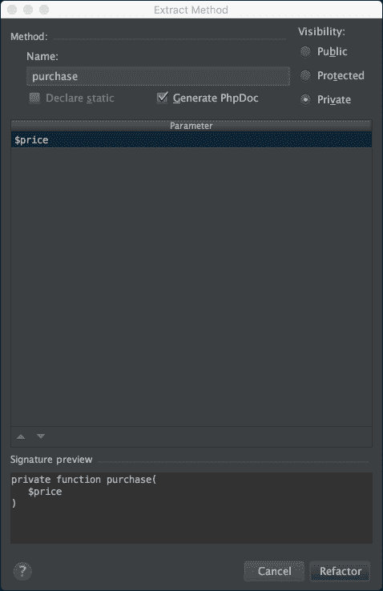

# 第 7 章重构

在本书中，我主要关注使用设计模式来处理您编写的新代码；这是至关重要的，开发人员不要编写新的遗留代码，在批评他人的代码之前，改进自己的代码是至关重要的。开发人员必须首先了解如何编写代码，然后才能有效地重构代码。

本章主要基于*重构：由*Martin Fowler*等人改进现有代码*的设计，以及*Joshua Kerievsky*对*模式的重构*。如果你有兴趣更多地了解这门学科，我强烈推荐你阅读这些书。

# 什么是重构？

重构代码的一个关键主题是解决代码内部结构中的问题，同时不改变被重构程序的外部行为。在某些情况下，这可能意味着引入内部结构，而这些内部结构以前不是有意的或没有考虑过的。

作为一个过程进行重构可以改进代码编写后的设计。虽然设计是软件工程过程的一个关键阶段，但它常常被忽视（尤其是在 PHP 中）；除此之外，长期维护代码结构还需要继续理解软件设计。如果开发人员不了解项目最初是如何设计的，他们可能会以一种非常粗糙的方式进行开发。

在**极限编程****XP**中，使用了一个被称为*重构无情*的短语，这是不言自明的。在 XP 中，重构被认为是一种使软件设计尽可能简单并避免不必要的复杂性的机制。正如 XP 规则中所述：*确保所有内容都只表达一次。最终，生产出一个整洁的系统所需的时间更少*。

重构的一个关键原则是发现软件设计，就好像它是要被发现的东西，而不是预先创建的一样。在开发系统时，我们可以使用开发作为找到良好设计解决方案的机制。通过使用重构，我们能够确保系统在开发过程中保持良好状态，从而减少技术债务。

重构并不总是可能的，您可能偶尔会遇到无法更改的*黑盒*系统，事实上，您甚至可能需要封装一个系统来重写它。然而，在许多情况下，我们可以简单地重构代码以改进设计。

# 测试，测试，再测试

这是无法避免的，为了重构代码，您需要一组可靠的测试。重构代码可以很好地减少引入 bug 的机会，但更改代码设计会引入大量新 bug。

重构过程中会出现意外的副作用，在重构过程中，类是紧密耦合的，您可能会发现对一个函数进行微小的更改会在一个完全独立的类中产生负面的副作用。

良好的重构效果需要良好的测试。根本没有办法解决这个问题。

除此之外，从更政治的角度来看，一些公司遇到了反复糟糕的重构工作的不良影响，可能会变得不愿意重构代码；确保有好的测试可以让公司确保重构工作不会破坏功能。

在本章中，我将演示重构工作，它应该伴随着使用单元测试的测试工作，在本书的下一章（也是最后一章），我将讨论行为测试（用于 BDD）。单元测试是开发人员测试给定代码单元的最佳机制；单元测试补充了代码结构，证明了方法应该做什么，并测试了代码单元之间的交互；从这个意义上说，它们是重构工作中开发人员可以使用的最佳测试形式。但是，行为测试用于测试代码的行为，因此对于证明应用程序可以成功完成给定形式的行为非常有用。

每一个经验丰富的开发人员都会有痛苦调试任务的记忆；有时会持续到深夜。让我们思考一下大多数开发人员是如何日常工作的。他们并不总是编码，他们的一些时间花在设计代码上，而相当多的时间花在调试他们已经编写的代码上。拥有自测试代码可以快速减少这种负担。

测试驱动开发围绕着在编写功能之前编写测试的方法，实际上代码应该与测试匹配。

测试类时，一定要测试类的`public`接口；事实上，PHPUnit 不允许您在普通使用下测试`private`或`protected`方法。

# 代码有异味

**代码气味**本质上是一些不好的做法，它们会让您的代码变得不必要的难以理解，坏代码可能会使用本章中介绍的技术进行重构。代码气味通常会违反一些基本的软件设计原则，从而对整个代码的设计质量产生负面影响。

Martin Fowler 通过以下说明定义了代码气味：

> *“代码气味是一种表面指示，通常对应于系统中更深层次的问题”。*

在本书的开头，我们讨论了术语*技术债务*，从这个意义上讲，代码气味可以作为一个整体贡献*技术债务*。

代码气味可能不一定构成 bug，它不会停止程序的执行，但它可以帮助以后引入 bug 的过程，并使重构代码到合适的设计变得更加困难。

让我们介绍一些处理遗留 PHP 项目时可能遇到的基本代码气味。

我们将讨论一些代码气味以及如何以非常简单的方式解决它们，但现在让我们考虑一些更重要的、重复出现的模式，以及如何通过应用设计模式来解决这些问题，以简化代码前进的维护。

在这里，我们将专门讨论从*到*模式的重构，在某些情况下，当从模式重构*简化代码设计时，您可能会从中受益。本章中反复出现的主题围绕着代码的设计如何贯穿于代码的整个开发生命周期，而不仅仅是在任意设计阶段之后被丢弃。*

模式可以用来传达意图，它们可以作为开发人员之间的语言；这就是为什么在软件工程师的整个职业生涯中，了解并继续使用大量模式是至关重要的。

在*到模式重构*一书中有更多的方法可用，在这里，我挑选了最适合 PHP 开发人员的方法。

## 长方法和重复代码

重复代码是一种非常常见的代码气味。开发人员经常复制和粘贴代码，而不是为他们的应用程序使用适当的控制结构。如果同一个控制结构位于多个位置，那么将两个结构合并为一个将使代码受益。

如果重复的代码相同，则可以使用 extract 方法。那么提取方法是什么呢？本质上，**提取方法**只是将属于长函数的业务逻辑删除为更小的函数。

让我们想象一个`dice`类，一旦掷骰子，它将返回一个 1 到 6 之间的罗马数字的随机数。

`Legacy`类可以如下所示：

```php
class LegacyDice 
{ 
  public function roll(): string 
  { 
    $rand = rand(1, 6); 

    // Switch statement to convert a number between 1 and 6 to a Roman Numeral. 
    switch ($rand) { 
      case 5: 
        $randString = "V"; 
        break; 
      case 6: 
        $randString = "VI"; 
        break; 
      default: 
        $randString = str_repeat("I", $rand); 
        break; 
    } 

    return $randString; 
  } 
} 

```

让我们提取将随机数转换为罗马数字的方法，并将其放入单独的函数中：

```php
class Dice 
{ 
  /** 
   * Roll the dice. 
   * @return string 
   */ 
  public function roll(): string 
  { 
    $rand = rand(1, 6); 

    return $this->numberToRomanNumeral($rand); 
  } 

  /** 
   * Convert a number between 1 and 6 to a Roman Numeral. 
   * 
   * @param int $number 
   * 
   * @return string 
   * @throws Exception 
   */ 
  public function numberToRomanNumeral(int $number): string 
  { 
    if (($number < 1) || ($number > 6)) { 
      throw new Exception('Number out of range.'); 
    } 

    switch ($number) { 
      case 5: 
        $randString = "V"; 
        break; 
      case 6: 
        $randString = "VI"; 
        break; 
      default: 
        $randString = str_repeat("I", $number); 
        break; 
    } 

    return $randString; 
  } 
} 

```

我们对原始代码块只做了两个更改，我们将执行罗马数字转换的函数分离出来，并将其放在一个单独的函数中。我们已经用函数本身的 DocBlock 替换了内联注释。

这种方法可以用于复制，如果它存在于多个地方（并且是相同的），我们只需调用单个函数，而不是跨多个地方复制代码。

如果代码在不相关的类中，请查看它在逻辑上适合的位置（在任何一个类或单独的类中），并在那里提取它。

在本书前面，我们已经讨论了保持函数小型化的必要性。这对于确保代码的长期可读性至关重要。

我经常看到开发人员在函数中注释代码块；相反，为什么不将这些方法分解成它们自己的函数呢？然后可通过 DocBlocks 添加可读文档。因此，我们在这里用来处理重复代码的提取方法可以有更简单的用途；分解长方法。

当处理较小的方法时，各种业务问题的解决方案更容易共享。

## 大班

大班制往往违反单一责任原则。在给定的时间点上，你正在处理的类是否只有一个改变的理由？一个类应该只负责功能的一个部分，而且，该类应该完全封装该职责。

通过提取与单个职责不紧密相关的方法将类划分为多个类，这是一种帮助减轻这种代码气味的简单而有效的方法。

## 用多态或策略模式替换复杂的逻辑语句和开关语句

Switch 语句（或者无限大的 if 语句）可以通过使用多态行为在很大程度上删除；我在本书的前几章中已经描述了多态性，它提供了一种比使用 switch 语句更优雅的处理计算问题的方法。

假设您正在打开一个国家代码；US 或 GB，而不是以这种方式切换，通过使用多态性，您可以运行相同的方法。

在不可能出现多态行为的情况下（例如，没有公共接口的情况下），在某些情况下，您甚至可以使用策略替换类型代码；实际上，您可以将多个 switch 语句合并为只将一个类注入到客户端的构造函数中，该构造函数将处理与各个类本身的关系。

例如让我们假设我们有一个输出接口，这个接口由包含`load`方法的各种其他类实现。这个`load`方法允许我们注入一个数组，并以我们要求的格式返回一些数据。这些类是该行为的极其粗糙的实现：

```php
interface Output 
{ 
  public function load(array $data); 
} 

class Serial implements Output 
{ 
  public function load(array $data) 
  { 
    return serialize($data); 
  } 
} 

class JSON implements Output 
{ 
  public function load(array $data) 
  { 
    return json_encode($data); 
  } 
} 

class XML implements Output 
{ 
  public function load(array $data) 
  { 
    return xmlrpc_encode($data); 
  } 
} 

```

### 注

在撰写本文时，PHP 仍然认为`xmlrpc_encode`函数是实验性的，因此，我建议不要在生产中使用它。这里纯粹是为了演示（为了保持代码简短）。

一个带有`switch`语句的极其粗糙的实现可以如下所示：

```php
$client = "JSON"; 

switch ($client) { 
  case "Serial": 
    $client = new Serial(); 
    break; 
  case "JSON": 
    $client = new JSON(); 
    break; 
  case "XML": 
    $client = new XML(); 
    break; 
} 

echo $client->load(array(1, 2)); 

```

但显然，我们可以通过实现一个客户端来做很多事情，该客户端将允许我们将一个`Output`类注入`Client`并相应地允许我们接收输出。此类类可能如下所示：

```php
class OutputClient 
{ 
  private $output; 

  public function __construct(Output $outputType) 
  { 
    $this->output = $outputType; 
  } 

  public function loadOutput(array $data) 
  { 
    return $this->output->load($data); 
  } 
} 

```

我们现在可以以非常简单的方式使用此客户端：

```php
$client = new OutputClient(new JSON());
echo $client->loadOutput(array(1, 2));

```

## 按照单一控制结构复制代码

这里我不会重复模板设计模式是如何工作的，但我想解释的是，它可以用来帮助消除重复代码。

我在本书前面演示的模板设计模式允许我们有效地抽象出程序的结构，然后我们只填充特定于实现的方法。这可以通过避免反复重复单个控制结构来帮助我们减少代码重复。

## 长参数列表和原始困扰

原始困扰是指开发人员过度使用原始数据类型而不是使用对象。

PHP 支持八种基本类型；该组可以进一步细分为标量类型、复合类型和特殊类型。

标量类型是包含单个值的数据类型。如果你问自己“这个值能在刻度上吗？”数字可以在*X*到*Y*的刻度上，布尔值可以在从假到真的刻度上，你就可以识别它们。以下是一些标量类型的示例：

*   布尔值
*   整数
*   浮动
*   一串

复合类型由一组标量值组成：

*   大堆
*   对象

特殊类型如下：

*   资源（引用外部资源）
*   无效的

假设我们有一个简单的`Salary`计算器类，它接受员工的基本工资、佣金率和养老金率；发送此数据后，可以使用`calculate`方法输入他们的销售额，计算他们的总工资：

```php
class Salary 
{ 
  private $baseSalary; 
  private $commission = 0; 
  private $pension = 0; 

  public function __construct(float $baseSalary, float $commission, float $pension) 
  { 
    $this->baseSalary = $baseSalary; 
    $this->commission = $commission; 
    $this->pension    = $pension; 
  } 

  public function calculate(float $sales): float 
  { 
    $base       = $this->baseSalary; 
    $commission = $this->commission * $sales; 
    $deducation = $base * $this->pension; 

    return $commission + $base - $deducation; 
  } 
} 

```

请注意该构造函数的长度。是的，我们可以使用 Builder 模式创建一个对象，然后将其注入构造函数，但是在这种情况下，我们能够具体地抽象出复杂的信息。在这种情况下，如果我们将员工信息移动到一个单独的类中，我们可以确保更好地遵守单一责任原则。

第一步是分离班级的责任，以便我们能够分离班级的责任：

```php
class Employee 
{ 
  private $name; 
  private $baseSalary; 
  private $commission = 0; 
  private $pension = 0; 

  public function __construct(string $name, float $baseSalary) 
  { 
    $this->name       = $name; 
    $this->baseSalary = $baseSalary; 
  } 

  public function getBaseSalary(): float 
  { 
    return $this->baseSalary; 
  } 

  public function setCommission(float $percentage) 
  { 
    $this->commission = $percentage; 
  } 

  public function getCommission(): float 
  { 
    return $this->commission; 
  } 

  public function setPension(float $rate) 
  { 
    $this->pension = $rate; 
  } 

  public function getPension(): float 
  { 
    return $this->commission; 
  } 
} 

```

从这一点出发，我们可以简化`Salary`类的构造函数，这样我们只需要输入`Employee`对象就可以使用该类：

```php
class Salary 
{ 
  private $employee; 

  public function __construct(Employee $employee) 
  { 
    $this->employee = $employee; 
  } 

  public function calculate(float $sales): float 
  { 
    $base       = $this->employee->getBaseSalary(); 
    $commission = $this->employee->getCommission() * $sales; 
    $deducation = $base * $this->employee->getPension(); 

    return $commission + $base - $deducation; 
  } 
} 

```

## 不雅暴露

假设我们有一个`Human`类，如下所示：

```php
class Human 
{ 
  public $name; 
  public $dateOfBirth; 
  public $height; 
  public $weight; 
} 

```

我们可以随心所欲地设置值，无需验证，也没有统一的信息获取方式。这有什么不对吗？嗯，在面向对象中，封装的原则是至关重要的；我们隐藏数据。换句话说，在拥有数据的对象不知道数据的情况下，我们的数据永远不应该是可见的。

相反，我们将所有的`public`数据变量替换为`private`变量。除此之外，我们还添加了适当的方法来获取和设置数据：

```php
class Human 
{ 
  private $name; 
  private $dateOfBirth; 
  private $height; 
  private $weight; 

  public function __construct(string $name, double $dateOfBirth) 
  { 
    $this->name        = $name; 
    $this->dateOfBirth = $dateOfBirth; 
  } 

  public function setWeight(double $weight) 
  { 
    $this->weight = $weight; 
  } 

  public function getWeight(): double 
  { 
    return $this->weight; 
  } 

  public function setHeight(double $height) 
  { 
    $this->height = $height; 
  } 

  public function getHeight(): double 
  { 
    return $this->height; 
  } 
} 

```

确保 setter 和 getter 是逻辑的，并且不仅仅因为类属性存在而存在。完成后，您需要遍历应用程序并替换对变量的任何直接访问，以便它们首先通过适当的方法。

然而，这暴露了另一种代码气味；特征嫉妒。

## 特征嫉妒

不严格地说，**功能嫉妒**是指我们不让对象计算其自身属性，而是将其偏移到另一个类。

因此，在前面的示例中，我们有自己的`Salary`计算器类，如下所示：

```php
class Salary 
{ 
  private $employee; 

  public function __construct(Employee $employee) 
  { 
    $this->employee = $employee; 
  } 

  public function calculate(float $sales): float 
  { 
    $base       = $this->employee->getBaseSalary(); 
    $commission = $this->employee->getCommission() * $sales; 
    $deducation = $base * $this->employee->getPension(); 

    return $commission + $base - $deducation; 
  } 
} 

```

相反，让我们来看看将这个函数实现到 AuthT0Up 类本身，结果我们也可以忽略不必要的吸气剂，并将我们的属性正确地内化：

```php
class Employee 
{ 
  private $name; 
  private $baseSalary; 
  private $commission = 0; 
  private $pension = 0; 

  public function __construct(string $name, float $baseSalary) 
  { 
    $this->name       = $name; 
    $this->baseSalary = $baseSalary; 
  } 

  public function setCommission(float $percentage) 
  { 
    $this->commission = $percentage; 
  } 

  public function setPension(float $rate) 
  { 
    $this->pension = $rate; 
  } 

  public function calculate(float $sales): float 
  { 
    $base       = $this->baseSalary; 
    $commission = $this->commission * $sales; 
    $deducation = $base * $this->pension; 

    return $commission + $base - $deducation; 
  } 
} 

```

## 不恰当的亲密关系

这可能经常发生在继承中；Martin Fowler 优雅地说：

> *“子类总是比他们的父母希望他们知道的更多地了解他们的父母。”*

更一般地说；当一个字段在另一个类中的使用多于该类本身时，我们可以使用 move-field 方法在新类中创建一个字段，然后将该字段的用户重定向到新类。

我们可以将其与 move 方法结合起来，将函数放在使用它最多的类中，并将其从原始类中删除，如果这不可能，我们只需在新类中引用函数即可。

## 深层嵌套语句

嵌套的 if 语句凌乱难看。这导致了难以遵循的意大利面条逻辑；而是使用内联函数调用。

从最内部的代码块开始，尝试将代码提取到它自己的函数中，让它可以快乐地生活。在第 1 章中，第 1 章，“好的 PHP 开发者”不是一个 OxMORMON TY3。我们讨论了如何通过一个例子来实现这一点，但是如果你经常重构，你可能会考虑投资一个能帮助你解决这个问题的工具。

这里有一个提示给我们当中的 PHPStorm 用户：重构菜单中有一个可爱的小选项，可以自动为您执行此操作。只需突出显示要提取的代码块，转到菜单栏中的重构，然后单击提取>方法。然后将弹出一个对话框，允许您配置重构的运行方式：



## 删除对参数的赋值

尽量避免在函数体中设置参数：

```php
class Before 
{ 
  function deductTax(float $salary, float $rate): float 
  { 
    $salary = $salary * $rate; 

    return $salary; 
  } 
} 

```

这可以通过设置内部参数来正确完成：

```php
class After 
{ 
  function deductTax(float $salary, float $rate): float 
  { 
    $netSalary = $salary * $rate; 

    return $netSalary; 
  } 
} 

```

通过这样的行为，我们可以很容易地识别和提取重复的代码，此外，在以后维护代码时，还可以更容易地替换代码。

这是一个简单的调整，允许我们识别代码中的特定参数在做什么。

## 评论

注释本身并不是代码的味道，在许多情况下，注释是非常有益的。正如马丁·福勒所说：

> *“在我们的嗅觉类比中，评论并不是一种难闻的气味；事实上，它们是一种甜味。”*

然而，Fowler 继续演示如何使用注释作为除臭剂来隐藏代码气味。当您发现自己在函数中注释代码块时，您可以找到使用 extract 方法的好机会。

如果一条评论隐藏了一种难闻的气味，重构它，你很快就会发现原来的评论是多余的。这不是不使用 DocBlock 函数或不必要地搜索代码注释的借口，但重要的是要记住，当您将设计重构为更加简单时，特定注释可能会变得无用。

## 用助剂包封复合材料

正如本书前面所讨论的，构建器设计模式可以通过我们获取一组很长的参数并将它们转换为单个对象来工作，然后我们可以将它们放入另一个类的构造函数中。

例如，我们有一个名为`APIBuilder`的类，这个构建器类本身可以使用 API 密钥和 API 的机密进行实例化，但是一旦它被实例化为对象，我们就可以简单地将整个对象传递给另一个类的构造函数。

到目前为止，一切顺利；但是我们可以使用这个构建器模式来封装复合模式。我们实际上只是创建一个生成器来创建我们的项目。通过这样做，我们可以通过单个类实现更大的控制，从而为我们提供了导航和更改复合族的整个树结构的机会。

## 用观察员替换硬编码通知

硬编码通知通常是两个类紧密耦合在一起，以便一个能够通知另一个。相反，通过使用`SplObserver`和`SplSubject`接口，观察者可以使用更易插拔的接口更新对象。在观察者中实现`update`方法后，主体只需实现`Subject`接口：

```php
SplSubject { 
   /* Methods */ 
   abstract public void attach ( SplObserver $observer ) 
   abstract public void detach ( SplObserver $observer ) 
   abstract public void notify ( void ) 
} 

```

由此产生的体系结构是一个不紧密耦合的可插拔通知系统。

## 用复合材料替换一个/多个区别

如果我们有单独的逻辑将个人交给团体，我们可以使用复合模式整合这些逻辑。这是我们在本书前面讨论过的模式；为了整合到这个模式中，开发人员只需要修改他们的代码，这样一个类就可以处理两种形式的数据。

为了实现这一点，我们必须首先确保这两个区别实现相同的接口。

当我最初演示此模式时，我写了如何使用此模式来解决将单个歌曲和播放列表视为一个整体的问题。假设我们的`Music`接口纯粹是以下内容：

```php
interface Music 
{ 
  public function play(); 
} 

```

关键的任务是确保这个接口在一个和多个区别中都得到遵守。您的`Song`类和`Playlist`类都必须实现`Music`接口。从根本上说，这就是允许我们用行为来对待两者的原因。

## 带适配器的独立版本

由于我在本书中对它们的覆盖程度太高，我不想长期使用适配器，但我只想让您考虑它们可以用于支持不同版本的 API。

请确保不要将多个 API 版本的代码封装在同一个类中，相反，您可以将不同版本的这些差异抽象到适配器中。在使用这种方法时，我敦促您首先尝试使用封装方法，而不是基于继承的方法，因为这将提供更大的自由度。

# 我该怎么跟经理说？

重构然后添加功能通常比在向现有代码库添加价值的同时简单地添加功能要快。许多优秀的管理者，只要能够正确理解软件及其开发方式，就会明白这一点。

当然，也有一些管理者对软件实际上是什么一无所知，他们通常只受最后期限的驱使，可能不愿意更多地了解他们的学科领域。我说的是我在本书前面提到的恐怖故事开发者。有时候，*Scrum 大师*也会犯这种错误，因为他们可能无法与整个软件开发生命周期相关联。

正如马丁·福勒本人所说：

> *“当然，很多人说他们是受质量驱动的，但更多的是受进度驱动的。在这些情况下，我给出了更具争议性的建议：不要告诉别人！”*

不正确理解技术流程的经理可能会根据软件的生产速度来交付软件；重构可以被证明是帮助生成软件的最快速的方法。它提供了一种高效和彻底的方式来跟上项目的进度，并允许我们顺利地注入新功能。

我们将在本书的下一章讨论管理以及如何有效地管理项目。

# 总结

在本章中，我们讨论了一些重构代码的方法，以确保设计始终具有良好的质量。通过重构代码，我们可以更好地理解我们的代码库，并为我们添加到软件中的附加功能提供未来的证明。

简化和分解所面临的问题是重构代码时可以使用的两个最好的基本工具。

如果您使用的是 CI 环境，那么在该环境上运行 PHP Mess Detector（PHPMD）也可以帮助您更好地编写代码。

在下一章中，我将讨论如何恰当地使用设计模式，从在网络环境中开发 API 的快速课程开始。