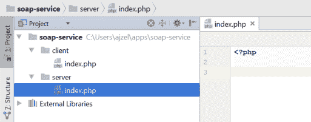
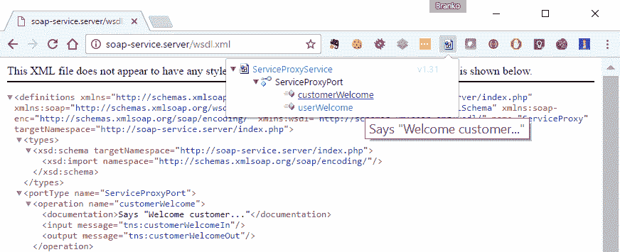
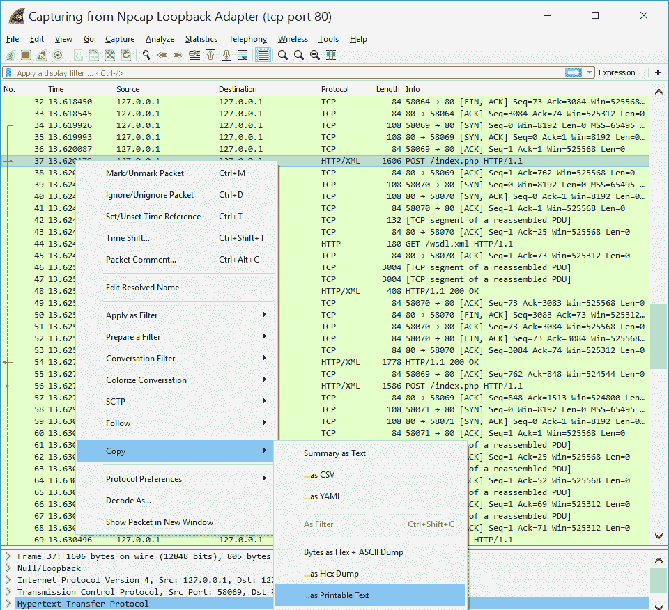
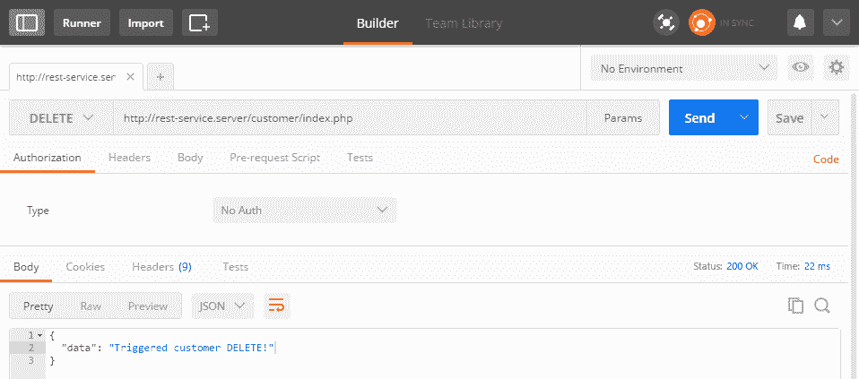
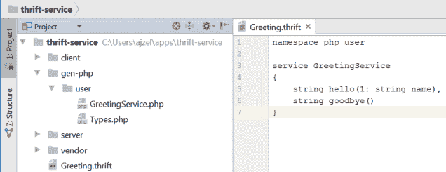
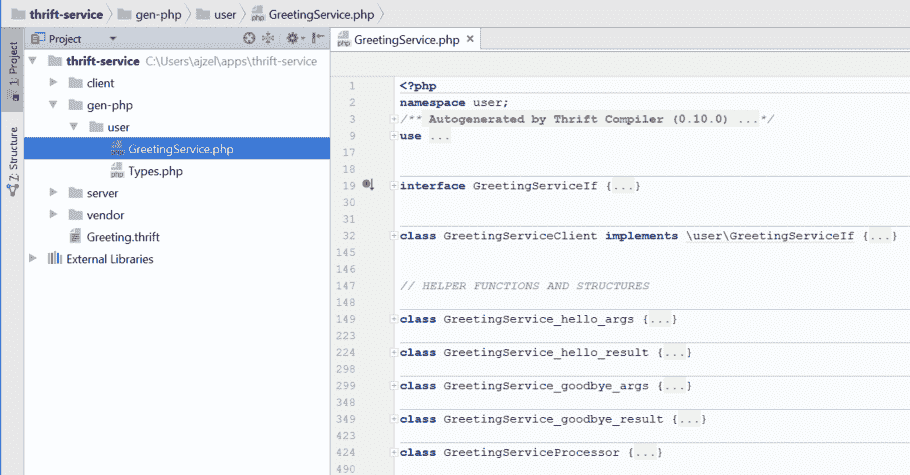
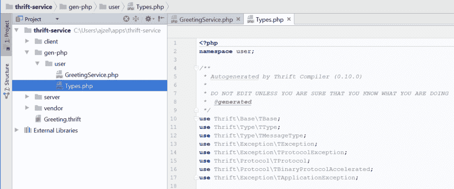
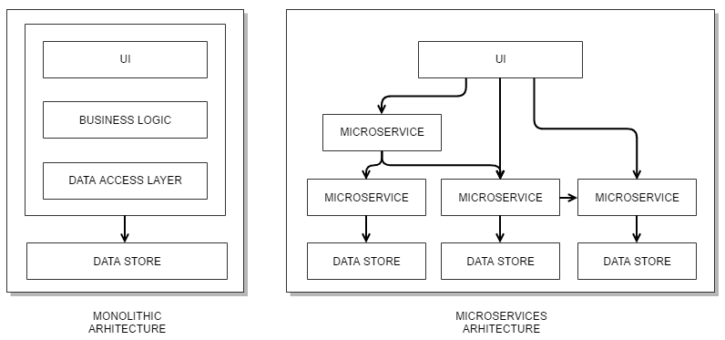

# 建筑服务

如今，许多现代应用程序使用**HTTP**（**超文本传输协议**），这种无状态的应用层协议允许我们在分布式系统之间交换消息。消息交换过程可以通过客户机-服务器计算模型来观察，因为它是以请求-响应类型的消息的形式发生的。这使我们能够轻松地编写服务，或者更具体地说，编写 web 服务，以触发服务器上的各种操作并将数据反馈回客户端。

在本章中，我们将通过以下部分更仔细地了解这种客户机-服务器关系：

*   了解客户机-服务器关系
*   使用 SOAP：
    *   XML 扩展
    *   创建服务器
    *   创建 WSDL 文件
    *   创建客户端
*   休息时工作：
    *   JSON 扩展
    *   创建服务器
    *   创建客户端
*   使用 Apache Thrift（RPC）：
    *   安装 Apache Thrift
    *   定义服务
    *   创建服务器
    *   创建客户端
*   理解微服务

# 了解客户机-服务器关系

为了方便地可视化客户机-服务器关系和消息的请求-响应类型，我们可以将移动货币应用程序视为客户机，将一些远程网站（如`http://api.fixer.io/`）视为服务器。服务器公开一个或多个 URL 端点，允许通信交换，如`http://api.fixer.io/latest?symbols=USD,GBP`。移动应用程序可以轻松发出 HTTP`GET http://api.fixer.io/latest?symbols=GBP,HRK,USD`请求，然后产生如下响应：

```php
{
  "base": "EUR",
  "date": "2017-03-10",
  "rates": {
    "GBP": 0.8725,
    "HRK": 7.419,
    "USD": 1.0606
  }
}

```

HTTP`GET`关键字用于表示我们希望在通过 URL 联系的远程（服务器）系统上的接收器上执行的操作类型。响应包含 JSON 格式的数据，我们的移动货币应用程序可以轻松地消化和利用这些数据。这个特定的消息交换示例是我们标记为**表示状态转移**（**REST**或 RESTful 服务的。

REST 服务本身不是协议；它是 HTTP 无状态协议和标准操作（GET、POST、PUT、DELETE 等）之上的一种体系结构样式。它的内容远不止这个简单的例子，我们将在后面的*与 REST*部分看到。

还有其他形式的服务不仅仅是一种体系结构风格，比如 SOAP 服务和 Apache Thrift 服务。虽然它们有自己的协议集，但它们也可以很好地使用 HTTP。

# 使用肥皂

**SOAP**（**简单对象访问协议**是一种基于 XML 的消息交换协议，依赖 HTTP 等应用层协议进行消息协商和传输。**万维网联盟**（**W3C**维护 SOAP 规范。

The SOAP specifications document is available at [https://www.w3.org/TR/soap/](https://www.w3.org/TR/soap/).

SOAP 消息是由`Envelope`、`Header`、`Body`和`Fault`元素组成的 XML 文档：

```php
<?xml version="1.0" ?>
<env:Envelope>
<env:Header>
<!-- ... -->
    </env:Header>
<env:Body>
<!-- ... -->
        <env:Fault>
<!-- ... -->
        </env:Fault>
</env:Body>
</env:Envelope>

```

`Envelope`是每个 SOAP 请求的必需元素，因为它封装了整个 SOAP 消息。类似地，`Body`元素也是必需的，因为它包含请求和响应信息。另一方面，`Header`和`Fault`是可选元素。仅使用基于 XML 的请求-响应消息，我们就可以通过 HTTP 建立客户机-服务器通信。虽然交易 XML 消息看起来很简单，但在处理大量方法调用和数据类型时可能会变得很麻烦。

这就是 WSDL 发挥作用的地方。WSDL 是一种接口定义语言，可用于定义 web 服务的数据类型和操作。W3C 维护 WSDL 规范

The WSDL specification document is available at [https://www.w3.org/TR/wsdl](https://www.w3.org/TR/wsdl).

根据以下部分示例，共有六个主要元素用于描述服务：

```php
<?xml version="1.0" ?>
<definitions>
<types>
<!-- ... -->
    </types>
<message>
<!-- ... -->
    </message>
<portType>
<!-- ... -->
    </portType>
<binding>
<!-- ... -->
    </binding>
<port>
<!-- ... -->
    </port>
<service>
<!-- ... -->
    </service>
</definitions>

```

虽然我们的服务不需要 WSDL 就可以运行，但对于使用我们的 SOAP 服务的客户机来说，WSDL 肯定很方便。遗憾的是，PHP 缺少任何基于我们的 SOAP 服务使用的 PHP 类轻松生成 WSDL 文件的官方工具。这使得 PHP 开发人员手工编写 WSDL 文件既繁琐又耗时，这就是为什么一些开发人员倾向于完全忽略 WSDL 的原因。

暂时将 WSDL 文件生成放在一边，可以肯定地说，SOAP 服务唯一真正具有挑战性的部分是编写和读取 XML 消息。这就是 PHP 扩展派上用场的地方。

# XML 扩展

有几种方法可以在 PHP 中读取和写入 XML 文档，包括正则表达式和专门的类和方法。regex 方法容易出错，特别是对于复杂的 XML 文档，这就是为什么建议使用扩展。PHP 为此提供了几个扩展，最常见的扩展如下：

*   **XMLWriter**：这允许我们生成 XML 数据流或文件
*   **XMLReader**：允许读取 XML 数据
*   **SimpleXML**：将 XML 转换为对象，并允许使用普通属性选择器和数组迭代器处理对象
*   **DOM**：这允许我们通过 DOM API 对 XML 文档进行操作

处理 XML 文档的基础是正确读取和写入其元素和属性。让我们假设以下`simple.xml`文档：

```php
<?xml version="1.0" encoding="UTF-8"?>
<customer>
  <name type="string"><![CDATA[John]]></name>
  <age type="integer">34</age> 
  <addresses>
    <address><![CDATA[The Address #1]]></address>
  </addresses>
</customer>

```

使用`XMLWriter`，我们可以通过运行以下代码创建相同的文档：

```php
<?php

$xml = new XMLWriter();
$xml->openMemory();
$xml->setIndent(true); // optional formatting

$xml->startDocument('1.0', 'UTF-8');
$xml->startElement('customer');

$xml->startElement('name');
$xml->writeAttribute('type', 'string');
$xml->writeCData('John');
$xml->endElement(); // </name>

$xml->startElement('age');
$xml->writeAttribute('type', 'integer');
$xml->writeRaw(34);
$xml->endElement(); // </age>

$xml->startElement('addresses');
$xml->startElement('address');
$xml->writeCData('The Address #1');
$xml->endElement(); // </address>
$xml->endElement(); // </addresses>

$xml->endElement(); // </customer>

$document = $xml->outputMemory();

```

我们可以看到，使用`XMLWriter`写下必要的 XML 是一个相对简单的操作。`XMLWriter`扩展使我们的代码一开始有点难以阅读。所有这些`startElement()`和`endElement()`方法使得弄清楚 XML 中的每个元素所在的位置有点乏味。要适应它需要一点时间。但是，它确实允许我们轻松生成简单的 XML 文档。使用`XMLReader`，我们现在可以使用以下代码块基于给定 XML 文档中的数据输出`Customer John, at age 34, living at The Address #1`字符串：

```php
<?php

$xml = new XMLReader();
$xml->open(__DIR__ . '/simple.xml');

$name = '';
$age = '';
$address = '';

while ($xml->read()) {
    if ($xml->name == 'name') {
        $name = $xml->readString();
        $xml->next();
    } elseif ($xml->name == 'age') {
        $age = $xml->readString();
        $xml->next();
    } elseif ($xml->name == 'address') {
        $address = $xml->readString();
        $xml->next();
    }
}

echo sprintf(
    'Customer %s, at age %s, living at %s',
    $name, $age, $address
);

```

虽然代码本身看起来很简单，`while`循环揭示了`XMLReader`的有趣本质。`XMLReader`从上到下读取 XML 文档。虽然这种方法对于以基于流的方式高效解析大型复杂的 XML 文档来说是一个不错的选择，但对于更简单的 XML 文档来说，它似乎有点过头了。

让我们看看`SimpleXML`如何处理同一`simple.xml`文件的写入。以下代码生成的 XML 内容与`XMLWriter`几乎相同：

```php
<?php

$document = new SimpleXMLElement(
    '<?xml version="1.0" encoding="UTF-8"?><customer></customer>'
);

$name = $document->addChild('name', 'John');
$age = $document->addChild('age', 34);
$addresses = $document->addChild('addresses');
$address = $addresses->addChild('address', 'The Address #1');

echo $document->asXML();

```

这里的区别是，我们不能具体地将`<![CDATA[...]]>`传递给我们的元素。有一些变通方法使用了`dom_import_simplexml()`函数，但这是`DOM`扩展的函数。这并不是说它有什么不好的地方，但是让我们把我们的例子很好地分开。现在我们知道我们可以使用`SimpleXML`编写 XML 文档，让我们看看如何从中读取。使用`SimpleXML`，我们现在可以使用以下代码输出相同的`Customer John, at age 34, living at The Address #1`字符串：

```php
<?php

$document = new SimpleXMLElement(__DIR__ . '/simple.xml', null, true);

$name = (string)$document->name;
$age = (string)$document->age;
$address = (string)$document->addresses[0]->address;

echo sprintf(
    'Customer %s, at age %s, living at %s',
    $name, $age, $address
);

```

使用`SimpleXML`的 XML 读取过程似乎比使用`XMLReader`的过程要短一些，尽管这些示例中没有任何错误处理。

让我们来看一看，使用{ To.t0}类来写一个 XML 文档：

```php
<?php

$document = new DOMDocument('1.0', 'UTF-8');
$document->formatOutput = true; // optional

$customer = $document->createElement('customer');
$customer = $document->appendChild($customer);

$name = $document->createElement('name');
$name = $customer->appendChild($name);
$nameTypeAttr = $document->createAttribute('type');
$nameTypeAttr->value = 'string';
$name->appendChild($nameTypeAttr);
$name->appendChild($document->createCDATASection('John'));

$age = $document->createElement('age');
$age = $customer->appendChild($age);
$ageTypeAttr = $document->createAttribute('type');
$ageTypeAttr->value = 'integer';
$age->appendChild($ageTypeAttr);
$age->appendChild($document->createTextNode(34));

$addresses = $document->createElement('addresses');
$addresses = $customer->appendChild($addresses);

$address = $document->createElement('address');
$address = $addresses->appendChild($address);
$address->appendChild($document->createCDATASection('The Address #1'));

echo $document->saveXML();

```

最后，让我们看看`DOMDocument`如何处理 XML 文档的读取：

```php
<?php

$document = new DOMDocument();
$document->load(__DIR__ . '/simple.xml');

$name = $document->getElementsByTagName('name')[0]->nodeValue;
$age = $document->getElementsByTagName('age')[0]->nodeValue;
$address = $document->getElementsByTagName('address')[0]->nodeValue;

echo sprintf(
    'Customer %s, at age %s, living at %s',
    $name, $age, $address
);

```

`DOM`和`SimpleXMLElement`扩展使得从 XML 文档中读取值变得非常容易，只要我们对其结构的完整性有信心。在处理 XML 文档时，我们应该根据文档大小等因素评估用例。虽然`XMLReader`和`XMLWriter`类要处理得更详细，但如果使用得当，它们的性能往往更高效。

现在，我们已经对在 PHP 中处理 XML 文档有了基本的了解，让我们创建第一个 SOAP 服务器。

# 创建服务器

PHP`soap`扩展提供`SoapClient`和`SoapServer`类。我们可以使用`SoapServer`类来设置一个 SOAP 服务服务器，该服务器带有或不带有 WSDL 服务描述文件

When used without WSDL (non-WSDL mode), `SoapClient` and `SoapServer` use a common exchange format, which removes the need for a WSDL file.

在前进之前，我们应该确保已经安装了`soap`分机。我们可以通过观察`php -m`控制台命令的输出或查看`phpinfo()`功能输出来实现：


在 soap 扩展可用且已加载的情况下，我们可以按照以下结构准备我们的`soap-service`项目目录：



接下来，我们将假设 web 服务器配置为将内容从`soap-service/server`目录发送到[http://soap-service.server](http://soap-service.server) 请求，以及从`soap-service/client`目录到[的内容 http://soap-service.client](http://soap-service.client) 请求。

让我们用两个不同的类创建一个小型 SOAP 服务，每个类使用相同的`welcome()`方法。我们可以从创建具有以下内容的`soap-service/server/services/Foggyline/Customer.php`文件开始：

```php
<?php

namespace Foggyline;

class Customer
{
    /**
     * Says "Welcome customer..."
     * @param $name
     * @return string
     */
    function welcome($name)
    {
       return 'Welcome customer: ' . $name;
    }
}

```

现在，让我们创建具有以下内容的`soap-service/server/services/Foggyline/User.php`文件：

```php
<?php

namespace Foggyline;

class User
{
    /**
     * Says "Welcome user..."
     * @param $name
     * @return string
     */
    function welcome($name)
    {
        return 'Welcome user: ' . $name;
    }
}

```

有了这两个类，让我们创建一个代理类来封装它们。我们通过创建具有以下内容的`soap-service/server/ServiceProxy.php`文件来实现此目的：

```php
<?php

require_once __DIR__ . '/services/Foggyline/Customer.php';
require_once __DIR__ . '/services/Foggyline/User.php';

class ServiceProxy
{
    private $customerService;
    private $userService;

    public function __construct()
    {
        $this->customerService = new Foggyline\Customer();
        $this->userService = new Foggyline\User();
    }

    /**
     * Says "Welcome customer..."
     * @soap
     * @param $name
     * @return string
     */
    public function customerWelcome($name)
    {
        return $this->customerService->welcome($name);
    }

    /**
     * Says "Welcome user..."
     * @soap
     * @param $name
     * @return string
     */
    public function userWelcome($name)
    {
        return $this->userService->welcome($name);
    }
}

```

现在我们有了代理类，我们可以创建实际的`SoapServer`实例。我们通过创建具有以下内容的`soap-service/server/index.php`文件来实现：

```php
<?php

require_once __DIR__ . '/ServiceProxy.php';

$options = [
    'uri' => 'http://soap-service.server/index.php'
];

$server = new SoapServer(null, $options);

$server->setClass('ServiceProxy');

$server->handle();

```

这里，我们正在实例化`SoapServer`实例，为`$wsdl`参数传递 null，并且在`$options`参数下只传递一个`'uri'`选项。必须以非 wsdl 模式指定 URI。然后，我们使用`setClass()`实例方法设置将处理传入 SOAP 请求的类。不幸的是，我们不能传递一个类数组或多次调用`setClass()`方法来同时添加几个不同的处理类，这就是为什么我们创建`ServiceProxy`类来包装`Customer`和`User`类。最后，我们调用了`$server`实例的`handle()`方法，该方法处理 SOAP 请求。此时，我们的 SOAP 服务服务器应该可以完全运行。

# 创建 WSDL 文件

然而，在我们移动到客户机之前，让我们快速查看 WSDL。在`ServiceProxy`类方法上使用的`@soap`标记与`SoapServer`的功能没有任何关系。我们之所以使用它，仅仅是因为 php2wsdl 库使我们能够根据提供的类自动生成 WSDL 文件。php2wsdl 库作为 composer 包提供，这意味着我们可以通过在`soap-service/server`目录中运行以下命令来安装它：

```php
composer require php2wsdl/php2wsdl

```

安装后，我们可以创建具有以下内容的`soap-service\server\wsdl-auto-gen.php`文件：

```php
<?php

require_once __DIR__ . '/vendor/autoload.php';
require_once __DIR__ . '/ServiceProxy.php';

$class = 'ServiceProxy';
$serviceURI = 'http://soap-service.server/index.php';

$wsdlGenerator = new PHP2WSDL\PHPClass2WSDL($class, $serviceURI);
$wsdlGenerator->generateWSDL(true);

file_put_contents(__DIR__ . '/wsdl.xml', $wsdlGenerator->dump());

```

一旦我们在控制台或浏览器中执行`wsdl-auto-gen.php`，它将生成包含以下内容的`soap-service/server/wsdl.xml`文件：

```php
<?xml version="1.0"?>
<definitions  xmlns:tns="http://soap-service.server/index.php" xmlns:soap="http://schemas.xmlsoap.org/wsdl/soap/" xmlns:xsd="http://www.w3.org/2001/XMLSchema" xmlns:soap-enc="http://schemas.xmlsoap.org/soap/encoding/" xmlns:wsdl="http://schemas.xmlsoap.org/wsdl/" name="ServiceProxy" targetNamespace="http://soap-service.server/index.php">
<types>
<xsd:schema targetNamespace="http://soap-service.server/index.php">
<xsd:import namespace="http://schemas.xmlsoap.org/soap/encoding/"/>
</xsd:schema>
</types>
<portType name="ServiceProxyPort">
  <operation name="customerWelcome">
  <documentation>Says "Welcome customer..."</documentation>
  <input message="tns:customerWelcomeIn"/>
  <output message="tns:customerWelcomeOut"/>
  </operation>
    <operation name="userWelcome">
    <documentation>Says "Welcome user..."</documentation>
    <input message="tns:userWelcomeIn"/>
  <output message="tns:userWelcomeOut"/>
</operation>
</portType>
<binding name="ServiceProxyBinding" type="tns:ServiceProxyPort">
<soap:binding style="rpc" transport="http://schemas.xmlsoap.org/soap/http"/>
<operation name="customerWelcome">
<soap:operation soapAction="http://soap-service.server/index.php#customerWelcome"/>
<input>
<soap:body use="encoded" encodingStyle="http://schemas.xmlsoap.org/soap/encoding/" namespace="http://soap-service.server/index.php"/>
</input>
<output>
<soap:body use="encoded" encodingStyle="http://schemas.xmlsoap.org/soap/encoding/" namespace="http://soap-service.server/index.php"/>
</output>
</operation>
<operation name="userWelcome">
<soap:operation soapAction="http://soap-service.server/index.php#userWelcome"/>
<input>
<soap:body use="encoded" encodingStyle="http://schemas.xmlsoap.org/soap/encoding/" namespace="http://soap-service.server/index.php"/>
</input>
<output>
<soap:body use="encoded" encodingStyle="http://schemas.xmlsoap.org/soap/encoding/" namespace="http://soap-service.server/index.php"/>
</output>
</operation>
</binding>
<service name="ServiceProxyService">
<port name="ServiceProxyPort" binding="tns:ServiceProxyBinding">
   <soap:address location="http://soap-service.server/index.php"/>
</port>
</service>
<message name="customerWelcomeIn">
  <part name="name" type="xsd:anyType"/>
</message>
<message name="customerWelcomeOut">
  <part name="return" type="xsd:string"/>
</message>
<message name="userWelcomeIn">
  <part name="name" type="xsd:anyType"/>
</message>
<message name="userWelcomeOut">
  <part name="return" type="xsd:string"/>
</message>
</definitions>

```

这是一个相当长的手动写入文件。它的好处是，一旦我们设置了 WSDL 文件，各种第三方工具和其他语言库就可以轻松地使用我们的服务。例如，这是 Chrome 浏览器 Wizdler 扩展的屏幕截图，解释 WSDL 文件内容：



有了 WSDL，我们现在可以轻松地修改`soap-service/server/index.php`文件，如下所示：

```php
// NON-WSDL MODE: $server = new SoapServer(null, $options);

// WSDL MODE: $server = new SoapServer('http://soap-service.server/wsdl.xml');

$server = new SoapServer('http://soap-service.server/wsdl.xml');

```

现在我们已经整理好了 SOAP 服务器部分，让我们创建一个客户机。

# 创建客户端

当我们使用`SoapClient`类时，在 PHP 中创建 SOAP 客户端是一项相对简单的任务。让我们创建具有以下内容的`soap-service/client/index.php`文件：

```php
<?php

$options = [
    'location' => 'http://soap-service.server/index.php',
    'uri' => 'http://soap-service.server/index.php',
    'trace ' => true,
];

// NON-WSDL MODE: $client = new SoapClient($wsdl = null, $options);
// WSDL MODE: $client = new SoapClient('http://soap-service.server/wsdl.xml', $options);

$client = new SoapClient('http://soap-service.server/wsdl.xml', $options);

echo $client->customerWelcome('John');
echo $client->userWelcome('Mariya');

```

执行客户端代码应产生以下输出：


当发出 SOAP 请求时，可以通过 Wireshark 等网络工具观察引擎盖下发生的情况：



这向我们显示了单个 SOAP 请求的确切内容，例如针对`$client->customerWelcome('John')`的请求：

```php
POST /index.php HTTP/1.1
Host: soap-service.server
Connection: Keep-Alive
User-Agent: PHP-SOAP/7.0.10
Content-Type: text/xml; charset=utf-8
SOAPAction: "http://soap-service.server/index.php#customerWelcome"
Content-Length: 525

<?xml version="1.0" encoding="UTF-8"?>
<SOAP-ENV:Envelope xmlns:SOAP-ENV="http://schemas.xmlsoap.org/soap/envelope/"
 xmlns:ns1="http://soap-service.server/index.php" xmlns:xsd="http://www.w3.org/2001/XMLSchema"
 xmlns:xsi="http://www.w3.org/2001/XMLSchema-instance"
 xmlns:SOAP-ENC="http://schemas.xmlsoap.org/soap/encoding/"
 SOAP-ENV:encodingStyle="http://schemas.xmlsoap.org/soap/encoding/">
 <SOAP-ENV:Body>
 <ns1:customerWelcome>
 <name xsi:type="xsd:string">John</name>
 </ns1:customerWelcome>
 </SOAP-ENV:Body>
</SOAP-ENV:Envelope>

```

理解 SOAP 请求的结构和内容，甚至可以使用`cURL`函数来处理请求-响应通信，尽管这比处理`SoapClient`和`SoapServer`类要麻烦得多，也容易出错。

在本节中，我们已经谈到了 SOAP 服务的一些关键点。虽然关于 SOAP 规范还有很多要说的，但这里给出的示例是编写 SOAP 服务的一个很好的起点。

web 服务的一个稍微简单的变体是 REST。

# 休息工作

与 SOAP 不同，REST 是一种体系结构风格，它没有自己的协议或标准。它依赖 URL 和 HTTP 谓词（如 POST、GET、PUT 和 DELETE）来建立消息交换流程。由于缺乏标准，因此谈论起来有些困难，因为各种 REST 服务实现可能会为客户端提供不同的服务使用方式。在来回处理数据时，我们可以自由选择 JSON、XML 或任何其他我们喜欢的格式。JSON 的简单性和轻量级使得它成为许多用户和框架的流行选择。

粗略地说，在浏览器中打开网页的行为可以解释为 REST 调用，其中浏览器充当客户端，服务器充当 REST 服务。与可能涉及 cookie 和会话的浏览器页面不同，REST 依赖于无状态操作。

接下来，我们将假设我们的 web 服务器配置为为为[提供`rest-service/server`目录的内容 http://rest-service.server](http://rest-service.server) 请求，以及[的`rest-service/client`目录内容 http://rest-service.client](http://rest-service.client) 请求。

# JSON 扩展

多年来，JSON 数据格式在某种程度上已经成为 REST 的默认数据交换格式。JSON 的简单性使得它在 PHP 开发人员中非常流行。PHP 语言提供了现成的`json_encode()`和`json_decode()`函数。使用这些函数，我们可以轻松地编码 PHP 数组和对象，以及解码各种 JSON 结构。

以下示例演示了使用`json_encode()`函数的简单性：

```php
<?php

class User
{
    public $name;
    public $age;
    public $salary;
}

$user = new User();
$user->name = 'John';
$user->age = 34;
$user->salary = 4200.50;

echo json_encode($user);
// {"name":"John","age":34,"salary":4200.5}

$employees = ['John', 'Mariya', 'Sarah', 'Marc'];

echo json_encode($employees);
// ["John","Mariya","Sarah","Marc"]

```

以下示例演示了使用`json_decode()`函数的简单性：

```php
<?php

$user = json_decode('{"name":"John","age":34,"salary":4200.5}');

print_r($user);

//    stdClass Object
//    (
//        [name] => John
//        [age] => 34
//        [salary] => 4200.5
//    )

```

这就是限制的作用。注意 JSON 对象是如何在 PHP 中转换为`stdClass`类型的对象的。没有直接的方法将其注入到`User`类型的对象中。当然，如果需要，我们可以编写一个自定义功能，尝试将`stdClass`对象转换为`User`的实例。

# 创建服务器

简单地说，REST 服务器根据给定的 URL 和 HTTP 谓词发送 HTTP 响应。记住这一点，让我们从添加到`rest-service/server/customer/index.php`文件的以下代码块开始：

```php
<?php

if ('POST' == $_SERVER['REQUEST_METHOD']) {
    header('Content-type: application/json');
    echo json_encode(['data' => 'Triggered customer POST!']);
}

if ('GET' == $_SERVER['REQUEST_METHOD']) {
    header('Content-type: application/json');
    echo json_encode(['data' => 'Triggered customer GET!']);
}

if ('PUT' == $_SERVER['REQUEST_METHOD']) {
    header('Content-type: application/json');
    echo json_encode(['data' => 'Triggered customer PUT!']);
}

if ('DELETE' == $_SERVER['REQUEST_METHOD']) {
    header('Content-type: application/json');
    echo json_encode(['data' => 'Triggered customer DELETE!']);
}

```

看起来很有趣，这已经是一个简单的 REST 服务示例——一个为单个资源处理四种不同操作的示例。使用 Postman 等工具，我们可以触发[上的`DELETE`操作 http://rest-service.server/customer/index.php](http://rest-service.server/customer/index.php) 资源



显然，这个简化的实现没有处理 REST 服务中通常会遇到的任何事情，例如版本控制、规范化、验证、**跨源资源共享**（**CORS**）、身份验证等。从头开始实现所有这些 REST 特性是一项耗时的任务，这就是为什么我们可能想看看现有框架提供的解决方案。

Silex micro Framework 是快速开始使用 REST 服务的简洁解决方案。我们只需在控制台`rest-service/server`目录下运行以下命令，即可将 Silex 添加到我们的项目中：

```php
composer require silex/silex "~2.0"

```

安装完成后，我们可以将以下代码转储到`rest-service/server/index.php`文件中：

```php
<?php

require_once __DIR__ . '/vendor/autoload.php';

use Silex\Application;
use Symfony\Component\HttpFoundation\Request;
use Symfony\Component\HttpFoundation\Response;

$app = new Silex\Application();

// The "before" middleware, convenient for auth and request data check
$app->before(function (Request $request, Application $app) {
    // Some auth token control
    if (!$request->headers->get('X-AUTH-TOKEN')) {
        // todo: Implement
    }
    // JSON content type control
    if ($request->headers->get('Content-Type') != 'application/json') {
        // todo: Implement
    }
});

// The "error" middleware, convenient for service wide error handling
$app->error(function (\Exception $e, Request $request, $code) {
    // todo: Implement
});

// The "OPTIONS" route, set to trigger for any URL
$app->options('{url}', function ($url) use ($app) {
    return new Response('', 204, ['Allow' => 'POST, GET, PUT, DELETE, OPTIONS']);
})->assert('url', '.+');

// The "after" middleware, convenient for CORS control
$app->after(function (Request $request, Response $response) {
    $response->headers->set('Access-Control-Allow-Headers', 'origin, content-type, accept, X-AUTH-TOKEN');
    $response->headers->set('Access-Control-Allow-Origin', '*');
    $response->headers->set('Access-Control-Allow-Methods', 'POST, GET, PUT, DELETE');
});

// The "POST /user/welcome" REST service endpoint
$app->post('/user/welcome', function (Request $request, Application $app) {
    $data = json_decode($request->getContent(), true);
    return $app->json(['data' => 'Welcome ' . $data['name']]);
})->bind('user_welcome');

$app->run();

```

这也是 REST 服务的一个相对简单的示例，但它比我们最初的示例做得更多。在本例中，Silex 框架引入了几个关键概念，我们可以在构建 REST 服务器时充分利用这些概念。`before`、`after`和`error`中间件使我们能够连接到请求处理过程的三个不同阶段。例如，使用`before`中间件，我们可以插入身份验证代码，以及对传入数据的有效性进行各种检查。REST 服务通常围绕令牌构建它们的身份验证，然后令牌沿着单个请求传递。一般的想法是有一个端点，如`POST user/login`，用户使用用户名和密码登录，然后获得一个身份验证令牌，用于其余的 rest 服务调用。然后，该令牌通常作为请求头的一部分传递。现在，每次用户尝试访问受保护的资源时，都会从标头中提取一个令牌，并查看数据库（或可能存储该令牌的任何其他存储），以找出令牌背后的用户。然后，系统要么允许用户继续原始请求，要么将其阻止。这就是中间件派上用场的地方。

The web service authentication is an enormous topic by itself--one that won't be covered in this book. OAuth is the industry-standard protocol for authorization that is quite often used with REST style services. For more information about OAuth, check out [https://oauth.net](https://oauth.net).

我们如何总结我们的反应完全取决于我们自己。与 SOAP 不同的是，没有定义 REST 服务响应的数据结构的长期确立的标准。然而，在过去几年中，有几项计划试图解决这一挑战。

JSON API is an attempt to formalize client-server interfaces that use exchange JSON data; check out [http://jsonapi.org/format/](http://jsonapi.org/format/) for more information.

为了让服务器正常工作，我们还需要添加具有以下内容的`rest-service\server\.htaccess`文件：

```php
<IfModule mod_rewrite.c>
Options -MultiViews
    RewriteEngine On
    RewriteCond %{REQUEST_FILENAME} !-d
    RewriteCond %{REQUEST_FILENAME} !-f
    RewriteRule ^ index.php [QSA,L]
</IfModule>

```

Silex 方便地支持几个关键 HTTP 动词（GET、POST、PUT、DELETE、PATCH 和 OPTIONS），对于这些动词，我们可以用*资源路径+回调函数*语法轻松实现逻辑：

```php
$app->get('/resource/path', function () { /* todo: logic */ });
$app->post('/resource/path', function () { /* todo: logic */ });
$app->put('/resource/path', function () { /* todo: logic */ });
$app->delete('/resource/path', function () { /* todo: logic */ });
$app->patch('/resource/path', function () { /* todo: logic */ });
$app->options('/resource/path', function () { /* todo: logic */ });

```

这使得快速起草 REST 服务变得很容易，只需几行代码。我们的服务器示例在服务器安全性方面几乎没有什么作用。其目的仅仅是在构建 REST 服务时强调中间件的有用性。安全方面，如身份验证、授权、CORS、HTTPS 和其他方面，应该给予最大的关注。

Frameworks such as [http://silex.sensiolabs.org](http://silex.sensiolabs.org) and [https://apigility.org](https://apigility.org/) provide a great solution to write high-quality feature-rich REST services.

# 创建客户端

鉴于 REST 服务依赖于 HTTP，可以安全地假设使用 PHP CURL 编写客户机应该是一个非常简单的过程。让我们创建一个包含以下内容的`rest-service/client/index.php`文件：

```php
<?php

$ch = curl_init();

$headers = [
    'Content-Type: application/json',
    'X-AUTH-TOKEN: some-auth-token-here'
];

curl_setopt($ch, CURLOPT_URL, 'http://rest-service.server/user/welcome');
curl_setopt($ch, CURLOPT_POST, true);
curl_setopt($ch, CURLOPT_POSTFIELDS, json_encode(['name' => 'John']));
curl_setopt($ch, CURLOPT_HTTPHEADER, $headers);
curl_setopt($ch, CURLOPT_RETURNTRANSFER, true);

$result = curl_exec($ch);

curl_close($ch);

echo $result;

```

Wireshark 网络工具告诉我们，此代码生成对 REST 服务的以下 HTTP 请求：

```php
POST /user/welcome HTTP/1.1
Host: rest-service.server
Accept: */*
Content-Type: application/json
X-AUTH-TOKEN: some-auth-token-here
Content-Length: 15

{"name":"John"}

```

尽管 CURL 方法工作得很好，但它很快就会变得麻烦且容易出错。这意味着必须处理各种类型的错误响应、SSL 证书等方面的挑战。更优雅的解决方案是使用 HTTP 客户端库，如 Guzzle。

Guzzle is an MIT-licensed HTTP client written in PHP. It can easily be installed through composer, by running the `composer require guzzlehttp/guzzle` command.

非 PHP 客户端比 PHP 客户端更经常地联系我们的 REST 服务。考虑到这一点，让我们看看一个简单的 HTML/jQuery 客户机如何与我们的 REST 服务通信。为此，我们在`rest-service/client/index.html`中添加了以下代码：

```php
<!DOCTYPE html>
<html lang="en">
  <head>
    <meta charset="UTF-8">
    <title>Client App</title>
    <script src="https://code.jquery.com/jquery-3.1.1.min.js"
      integrity="sha256-hVVnYaiADRTO2PzUGmuLJr8BLUSjGIZsDYGmIJLv2b8="
      crossorigin="anonymous"></script>
  </head>
<body>
  <script>
    jQuery.ajax({
      method: 'POST',
      url: 'http://rest-service.server/user/welcome',
      headers: {'X-AUTH-TOKEN': 'some-auth-token-here'},
      data: JSON.stringify({name: 'John'}),
      dataType: 'json',
      contentType: 'application/json',
      success: function (response) {
        console.log(response.data);
      }
    });
    </script>
  </body>
</html>

```

jQuery`ajax()`方法充当 HTTP 客户端。通过向它传递适当的参数值，它能够成功地与 REST 服务建立请求-响应通信。

在本节中，我们已经讨论了 REST 服务的一些关键点。尽管我们几乎没有触及整个 REST 体系结构的表面，但这里提供的示例应该足以让我们开始学习。JSON 和 HTTP 的易实现性和简单性使 REST 成为现代应用程序非常吸引人的选择。

# 使用 Apache Thrift（RPC）

Apache Thrift 是一个开源框架，用于构建可伸缩的跨语言服务。它最初由 Facebook 开发，然后在 2008 年 5 月左右进入 Apache 孵化器。简单性、透明性、一致性和性能是该框架背后的四个关键价值。

与 REST 和 SOAP 类型的服务不同，Thrift 服务使用二进制形式的通信。幸运的是，Thrift 提供了一个代码生成引擎来帮助我们启动。代码生成引擎可以拾取任何**接口定义语言**（**IDL**文件）并从中生成 PHP 或其他语言绑定。

在开始编写第一个服务定义之前，我们需要安装 ApacheThrift。

# 安装 Apache Thrift

Apache Thrift 可以从源文件安装。假设我们有一个新的 Ubuntu 16.10 安装，我们可以使用以下一组命令启动 Apache Thrift 安装步骤：

```php
sudo apt-get update
sudo apt-get -y install php automake bison flex g++ git libboost-all-dev libevent-dev libssl-dev libtool make pkg-config

```

这两个命令应该为我们提供编译 Apache Thrift 源文件所需的工具。完成此操作后，我们可以提取机器上的实际源文件：

```php
wget http://apache.mirror.anlx.net/thrift/0.10.0/thrift-0.10.0.tar.gz
tar -xvf thrift-0.10.0.tar.gz
cd thrift-0.10.0/

```

打开源文件后，我们可以触发`configure`和`make`命令，如下所示：

```php
./configure
make
make install

```

最后，我们需要确保我们的`LD_LIBRARY_PATH`路径上有`/usr/local/lib/`目录：

```php
echo "export LD_LIBRARY_PATH=$LD_LIBRARY_PATH:/usr/local/lib/" >> ~/.bashrc

```

我们现在应该注销 shell，然后重新登录。使用以下命令，我们确认已安装 Apache Thrift：

```php
thrift -version

```

这将为我们提供以下输出：


通过控制台安装并提供`thrift`工具，我们可以准备我们的`thrift-service`项目：

```php
mkdir thrift-service
cd thrift-service/
mkdir client
mkdir server
mkdir vendor
cd vendor
git clone https://github.com/apache/thrift.git

```

接下来，我们将假设 web 服务器被配置为向[提供`thrift-service/client`目录的内容 http://thrift-service.client](http://thrift-service.client) 请求，`thrift-service/server`目录的内容发送到[http://thrift-service.server](http://thrift-service.server) 请求。

# 定义服务

在 PHP 中使用 Apache Thrift 可以通过以下几个步骤进行描述：

*   通过 IDL 文件定义服务
*   自动生成语言绑定
*   提供已定义接口的 PHP 实现
*   通过服务器公开提供的服务实现
*   通过客户端使用公开服务

节俭服务从`.thrift`文件开始，即 IDL 描述的文件。

IDL 文件支持几种数据类型的定义：

*   `bool`：这是一个布尔值（true 或 false）
*   `byte`：这是一个 8 位有符号整数
*   `i16`：这是一个 16 位有符号整数
*   `i32`：这是一个 32 位有符号整数
*   `i64`：这是一个 64 位有符号整数
*   `double`：这是一个 64 位浮点数
*   `string`：这是一个 UTF-8 编码的文本字符串
*   `binary`：这是一个未编码字节序列
*   `struct`：这本质上等同于 OOP 语言中的类，但没有继承
*   容器（`list`、`set`、`map`：这映射到大多数编程语言中的常见容器类型

为了简单起见，我们将重点使用`string`类型。让我们创建第一个 Apache Thrift 服务。我们通过在`thrift-service/`目录中创建`Greeting.thrift`文件来实现，如下所示：

```php
namespace php user

service GreetingService
{
  string hello(1: string name),
  string goodbye()
}

```

我们可以看到 Thrift 文件是一个纯接口——这里没有实现。当代码生成引擎运行时，`namespace php user`语法转换为*，在用户名称空间内为生成的代码*的 PHP 类型生成 GreetingService。如果我们在使用 PHP 的同时使用另一种语言，比如说 Java，我们可以很容易地添加另一行代码，`namespace java customer`。这将在一个名称空间中生成 PHP 绑定，在另一个名称空间中生成 Java 绑定。

我们可以看到，`service`关键字用于指定`GreetingService`接口。在接口中，我们有两个方法定义。`hello(1: string name)`字符串接收单个名称参数，而`goodbye()`不接收任何参数。

See [https://thrift.apache.org/docs/idl](https://thrift.apache.org/docs/idl) for more details about IDL syntax.

有了`Greeting.thrift`文件，我们可以触发代码生成，从而获得必要的 PHP 绑定。我们可以在控制台上执行以下代码：

```php
thrift -r -gen php:server Greeting.thrift

```

此时，我们的文件夹结构应类似于以下屏幕截图：



我们可以看到，`thrift`命令在`gen-php/user`目录下为我们生成了两个文件。`GreetingService.php`是一个相当大的文件；它有近 500 行代码，定义了使用我们的 Thrift 服务所需的各种助手函数和结构：



鉴于，`Types.php`文件定义了几种不同的使用类型：



所有这些类型都驻留在`thrift-service/vendor/thrift/lib/php/lib/Thrift`中，这就是我们之前执行`git clone https://github.com/apache/thrift.git`命令的原因。到目前为止，我们的`thrift-service/gen-php/user/GreetingService.php`服务在`hello()`和`goodbye()`方法逻辑方面仍然没有真正起到任何作用。

# 创建服务器

`thrift-service/server/`目录是我们实现项目服务器位的地方。让我们创建一个单一的一体化`thrift-service/server/index.php`文件，该文件实现`hello()`和`goodbye()`方法，并通过[公开它们 http://thrift-service.server/index.php](http://thrift-service.server/index.php) 对于可能出现的任何节俭请求：

```php
<?php

require_once __DIR__ . '/../vendor/thrift/lib/php/lib/Thrift/ClassLoader/ThriftClassLoader.php';

use Thrift\ClassLoader\ThriftClassLoader;
use Thrift\Transport\TPhpStream;
use Thrift\Transport\TBufferedTransport;
use Thrift\Protocol\TBinaryProtocol;
use user\GreetingServiceProcessor;
use user\GreetingServiceIf;

$loader = new ThriftClassLoader();
$loader->registerNamespace('Thrift', __DIR__ . '/../vendor/thrift/lib/php/lib');
$loader->registerDefinition('user', __DIR__ . '/../gen-php');
$loader->register();

class GreetingServiceImpl implements GreetingServiceIf
{
  public function hello($name)
  {
    return 'Hello ' . $name . '!';
  }

  public function goodbye()
  {
    return 'Goodbye!';
  }
}

header('Content-Type', 'application/x-thrift');

$handler = new GreetingServiceImpl();
$processor = new GreetingServiceProcessor($handler);
$transport = new TBufferedTransport(new TPhpStream(TPhpStream::MODE_R | TPhpStream::MODE_W));
$protocol = new TBinaryProtocol($transport, true, true);

$transport->open();
$processor->process($protocol, $protocol);
$transport->close();

```

我们从包括`ThriftClassLoader`班开始。这个加载器类使我们能够为整个`Thrift`和`user`名称空间设置自动加载。然后我们通过`GreetingServiceImpl`类进入`hello()`和`goodbye()`方法实现。最后，我们实例化了相应的*处理器*、*处理器*、*传输*和*协议*，以便能够处理传入请求。

# 创建客户端

`thrift-service/client/`目录是我们实现项目客户的地方。让我们创建一个*一体式*`thrift-service/client/index.php`文件，用于调用[上公开的节约服务中的`hello()`和`goodbye()`方法 http://thrift-service.server/index.php](http://thrift-service.server/index.php) ：

```php
<?php

require_once __DIR__ . '/../vendor/thrift/lib/php/lib/Thrift/ClassLoader/ThriftClassLoader.php';

use Thrift\ClassLoader\ThriftClassLoader;
use Thrift\Transport\THttpClient;
use Thrift\Transport\TBufferedTransport;
use Thrift\Protocol\TBinaryProtocol;
use user\GreetingServiceClient;

$loader = new ThriftClassLoader();
$loader->registerNamespace('Thrift', __DIR__ . '/../vendor/thrift/lib/php/lib');
$loader->registerDefinition('user', __DIR__ . '/../gen-php');
$loader->register();

$socket = new THttpClient('thrift-service.server', 80, '/index.php');
$transport = new TBufferedTransport($socket);
$protocol = new TBinaryProtocol($transport);
$client = new GreetingServiceClient($protocol);

$transport->open();

echo $client->hello('John');
echo $client->goodbye();

$transport->close();

```

与服务器示例非常相似，在这里，我们也从包含`ThriftClassLoader`类开始，这反过来使我们能够为整个`Thrift`和`user`名称空间设置自动加载。然后，我们实例化了套接字、传输、协议和客户机，从而与 Thrift 服务建立了连接。客户端和服务器都使用相同的`thrift-service/gen-php/user/GreetingService.php`文件。考虑到`GreetingServiceClient`驻留在自动生成的`GreetingService.php`文件中，这使得客户很容易立即意识到`GreetingService`可能公开的任何方法。

为了测试我们的客户，我们需要做的就是打开[http://thrift-service.client/index.php](http://thrift-service.client/index.php) 在浏览器中。这将为我们提供以下输出：


在本节中，我们讨论了 Apache Thrift 服务的一些关键点。尽管关于 Thrift 的 IDL 和类型系统还有很多要说的，但这里给出的示例是朝着正确方向迈出的一步。

# 理解微服务

术语微服务表示以松散耦合服务的形式构建应用程序的体系结构风格。这些独立部署的服务是最常用 web 服务技术构建的小型应用程序。一个服务可以通过 SOAP 进行通信，另一个可以通过 REST、Apache Thrift 或其他方式进行通信。这里没有规定公司要求的标准。总体思路是将一个大型单片应用程序拆分为几个较小的应用程序，即服务，但这样做的方式符合业务目标。

下图尝试将此概念可视化：



在 Netflix 和 Amazon 等公司的推广下，微服务风格开始解决现代应用程序开发的几个关键挑战，其中一些挑战包括：

*   **开发团队规模**：这是一个单一的微服务，可以由一个相对较小的团队开发
*   **开发技能的多样性**：这些是可以用不同编程语言编写的不同服务
*   **更改/升级**：这些较小的代码更容易更改或更新
*   **集成和部署**：这些较小的代码片段更易于部署
*   **新手更容易**：这些较小的代码片段更容易赶上
*   **业务能力聚焦**：这个单独的服务代码是围绕特定的业务能力组织的
*   **可伸缩性**：并不是所有的东西都能平等伸缩；较小的代码块可以更容易地进行缩放
*   **故障处理**：此单一故障服务不会导致整个应用程序停机
*   **技术栈**：这对快速链接技术栈的依赖性较小

同时，它们也带来了一些新的挑战，其中一些挑战包括：

*   **服务沟通**：这是围绕服务沟通的额外努力
*   **分布式事务**：这些是跨多个服务的业务需求所带来的挑战
*   **测试和监控**：这比整体式应用更具挑战性
*   **网络延迟**：每个微服务都会引入额外的网络延迟
*   **容错**：这些微服务必须从一开始就针对故障进行设计

这就是说，构建微服务几乎是一项简单的任务。对于大多数应用程序来说，首先使用*整体式*，采用谨慎的解耦和模块化结构，可能是一个更好的起点。一旦一个整体发展到了它的复杂性开始影响我们管理它的方式的时候，那么是时候考虑将它细分为微服务席了。

# 总结

在本章中，我们了解了两种最常见和成熟的 web 服务：SOAP 和 REST。我们还研究了一颗冉冉升起的新星阿帕奇节俭。一旦我们通过了 Apache Thrift 初始安装和设置的障碍，简单性、可扩展性、速度和可移植性等特性肯定会成为关注的焦点。正如我们在客户机示例中看到的，RPC 调用可以很容易地通过一个中央代码存储库实现——在我们的例子中是`thrift-service/gen-php/`目录。

虽然 Apache Thrift 在受欢迎程度方面还没有赶上，但 Facebook、Evernote、Pinterest、Quora、Uber 和其他知名品牌使用它的事实无疑说明了这一点。这并不是说未来明智的 SOAP 或 REST 不那么重要。选择正确的服务类型是一个*仔细规划*和*前瞻性思考*的问题。

最后，我们讨论了一种称为微服务（microservices）的新体系结构风格的出现的一些关键点。

接下来，我们将更深入地了解如何使用 PHP 应用程序中最常用的数据库：MySQL、Mongo、Elasticsearch 和 Redis。