# 十二、使用数据库

PHP 语言对几种不同的数据库都有很好的支持。从 PHP 语言的早期开始，MySQL 就被 PHP 开发人员视为 go-to 数据库。虽然最初的重点主要放在**关系数据库管理系统**（**RDBMS**），但事实证明，其他类型的数据库对现代应用程序同样（或更）重要。从那时起，文档和数据键值数据库就越来越流行。

如今，一个 PHP 应用程序同时使用 MySQL、Mongo、Redis 以及可能更多的数据库或数据存储已经司空见惯

Mongo 的 NoSQL（“非 SQL”、“非关系”或“不仅仅是 SQL”）特性允许构建生成大量新数据类型（可能是快速变化的数据类型）的应用程序。从**SQL**（**结构化查询语言**的严格性中解脱出来，使用结构化、半结构化、非结构化和多态性数据成为 Mongo 数据库全新的体验。Redis 等内存数据结构存储力求速度，这使得它们非常适合缓存和消息代理系统。

在本章中，我们将通过以下几节详细介绍 MySQL、Mongo 和 Redis：

*   使用 MySQL
    *   安装 MySQL
    *   设置示例数据
    *   通过 mysqli 驱动程序扩展进行查询
    *   通过 PHP 数据对象驱动程序扩展进行查询
*   与 MongoDB 合作
    *   安装 MongoDB
    *   设置示例数据
    *   通过 MongoDB 驱动程序扩展进行查询
*   与 Redis 合作
    *   安装 Redis
    *   设置示例数据
    *   通过 phpredis 驱动程序扩展进行查询

Throughout this chapter, we provide quick installation instructions for each of the three database servers. These instructions are given on a relatively basic level, without any post-installation configuration or tuning that is usually done on production-type machines. The general idea here was to merely get the developer machine up and running with each of the database servers.

# 使用 MySQL

MySQL 是一种开源 RDBMS，已经存在了 20 多年。最初由瑞典公司 MySQL AB 开发和拥有，现在由 Oracle 公司拥有。MySQL 目前的稳定版本是 5.7。

MySQL 的一些关键优势可以概括如下：

*   跨平台，在服务器上运行
*   可用于桌面和 web 应用程序
*   快速、可靠且易于使用
*   适用于小型和大型应用
*   使用标准 SQL
*   支持查询缓存
*   支持 Unicode
*   使用 InnoDB 时的 ACID 合规性
*   使用 InnoDB 时的事务

# 安装 MySQL

假设我们使用的是全新的 Ubuntu 16.10（Yakkety Yak）安装，以下步骤概述了如何设置 MySQL：

1.  要安装 MySQL，我们执行以下控制台命令：

```php
sudo apt-get update
sudo apt-get -y install mysql-server

```

2.  安装过程触发控制台 GUI 界面，要求我们输入`root`用户密码：


3.  出于确认目的，需要重复提供的密码：

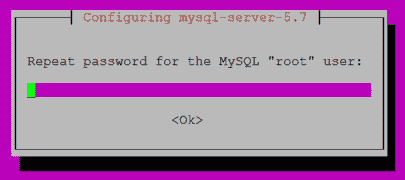

4.  安装完成后，我们可以执行以下`mysql --version`命令确认 MySQL 服务器是否已启动并运行：

```php
root@vultr:~# mysql --version
mysql Ver 14.14 Distrib 5.7.17, for Linux (x86_64) using EditLine wrapper

```

5.  服务器运行后，我们需要确保安装的安全。这是通过运行以下命令完成的：

```php
sudo mysql_secure_installation

```

6.  安全安装过程会触发一个带有多个提示的交互式 shell，询问以下信息：
    *   输入 root 用户的密码：
    *   是否要设置验证密码插件？
    *   请输入 0=低、1=中等和 2=强：
    *   新密码：
    *   重新输入新密码：
    *   删除匿名用户？
    *   不允许根用户远程登录？
    *   是否删除测试数据库并访问它？
    *   现在重新加载特权表吗？

以下屏幕截图描述了此过程：

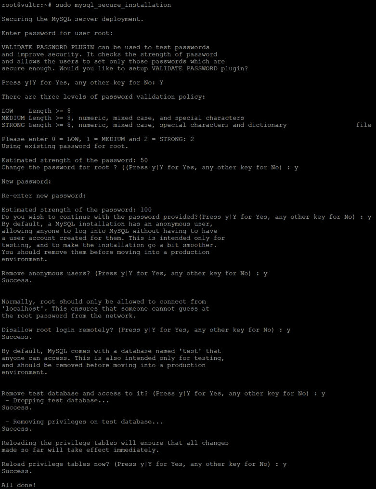

Check out [https://dev.mysql.com/doc/refman/5.7/en/validate-password-plugin.html](https://dev.mysql.com/doc/refman/5.7/en/validate-password-plugin.html) for more information about the password validation plugin.

7.  安全安装过程完成后，我们可以继续使用`mysql`控制台工具连接 MySQL，如下所示：

```php
// INSECURE WAY (bare passwords in a command)
mysql -uroot -p'mL08e!Tq'
mysql --user=root --password='mL08e!Tq'

// SECURE WAY (triggers "enter password" prompt)
mysql -uroot -p
mysql --user=root --password

```

请注意，在密码周围使用了单引号字符（`'`。虽然通常我们可以使用`"`或`'`引号，但密码中使用的`!`字符强制我们使用`'`。如果不将密码包装在单个引号中，在这种情况下，我们将看到如下错误！Tq:未找到事件。这是因为感叹号（`!`）是 bash 中历史扩展的一部分。要将其用作密码的一部分，我们需要用单引号将其括起来。此外，我们的密码可以包含`'`或`"`字符。要在密码中转义这些引号，我们可以使用前导反斜杠（），或者将整个参数用相反样式的引号括起来。但是，避开古怪密码字符的最简单和最安全的方法是避免使用`-p`或`--password`参数指定密码值，并通过输入密码：提示符提供密码。

这将为我们提供以下输出：

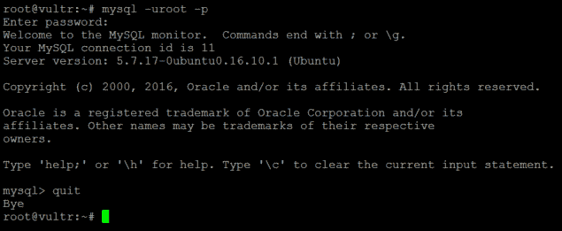

Check out [https://dev.mysql.com/doc/refman/5.7/en/mysql-shell.html](https://dev.mysql.com/doc/refman/5.7/en/mysql-shell.html) for more information about the MySQL shell.

# 设置示例数据

在我们开始查询 MySQL 之前，让我们继续设置一些示例数据。MySQL 提供了一个名为 Sakila 的示例数据库，我们可以从 MySQL 官方网站下载，如下所示：

```php
cd ~
wget http://downloads.mysql.com/docs/sakila-db.tar.gz
tar -xzf sakila-db.tar.gz
cd sakila-db/

```

一旦下载并解包，这将为我们提供以下三个文件：


接下来，我们需要看看如何导入`sakila-schema.sql`和`sakila-data.sql`。幸运的是，MySQL 提供了几种方法来实现这一点。快速查看`sakila-schema.sql`文件，在文件顶部显示以下条目：

```php
DROP SCHEMA IF EXISTS sakila;
CREATE SCHEMA sakila;
USE sakila;

```

这意味着`sakila-schema.sql`文件将为我们创建一个模式（数据库），并将其设置为当前使用的数据库。这是需要理解的重要一点，因为并非所有的`.sql`/备份文件都会有这一点，我们将被迫手动完成这一部分。了解`sakila-schema.sql`如何处理导入所需的一切，以下命令显示了我们可以使用的三种不同方法：

```php
// Either this command
mysql -uroot -p < sakila-schema.sql

// Either this command
mysql -uroot -p -e "SOURCE sakila-schema.sql" 

```

第二个命令使用`-e`（`--execute`参数将 SQL 语句传递给服务器。我们可以轻松地交互使用`mysql`工具，然后在其中执行`SOURCE sakila-schema.sql`。架构就绪后，我们可以继续导入实际数据：

```php
// Either this command
mysql -uroot -p < sakila-data.sql

// Either this command
mysql -uroot -p -e "SOURCE sakila-data.sql" 

```

如果我们现在交互使用`mysql`工具，我们可以检查数据库导入是否成功：

```php
show databases;
use sakila;
show tables;

```

这将为我们提供以下输出：

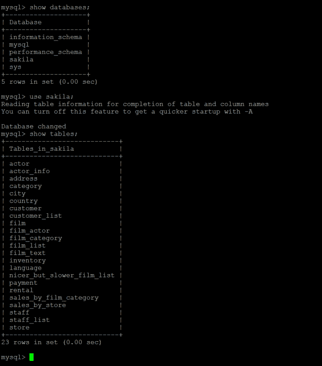

Check out [https://dev.mysql.com/doc/sakila/en/](https://dev.mysql.com/doc/sakila/en/) for more information about the Sakila sample database.

# 通过 MySQLi 驱动程序扩展进行查询

有几个驱动程序扩展允许我们查询 MySQL。MySQLi 就是其中之一。为了在控制台上使用 MySQLi，我们需要确保安装了 PHP CLI 和`mysql`驱动程序扩展：

```php
sudo apt-get -y install php7.0-cli php7.0-mysql

```

请注意，扩展名缺少`i`后缀。一旦安装了`mysql`驱动程序扩展，我们就可以开始查询 MySQL 服务器了。

# 连接

我们可以使用 MySQLi 函数或类与 MySQL 交互。本着面向对象的精神，我们将在所有示例中使用类方法。使用`mysqli`类，我们可以从 PHP 建立 MySQL 连接，如下所示：

```php
$mysqli = new mysqli('127.0.0.1', 'root', 'mL08e!Tq', 'sakila');

```

此单行表达式将在`127.0.0.1`主机上查找 MySQL，并尝试使用`root`用户名和`mL08e!Tq`密码连接到其`sakila`数据库。

# 错误处理

处理`mysqli`周围的错误相对容易，因为我们可以使用一个简单的`try...catch`块，如下所示：

```php
<?php

mysqli_report(MYSQLI_REPORT_ALL);

try {
   $mysqli = new mysqli('127.0.0.1', 'root', 'mL08e!Tq', 'sakila');
} catch (Throwable $t) {
   exit($t->getMessage());
}

```

理想情况下，我们希望使用`mysqli_sql_exception`进行更有针对性的 MySQL 异常处理：

```php
<?php

mysqli_report(MYSQLI_REPORT_ALL);

try {
  $mysqli = new mysqli('127.0.0.1', 'root', 'mL08e!Tq', 'sakila');
} catch (mysqli_sql_exception $e) {
  exit($e->getMessage());
}

```

我们可以将以下报告级别之一传递给`mysqli_report()`功能：

*   `MYSQLI_REPORT_INDEX`：报告查询中是否使用了坏索引或根本没有索引
*   `MYSQLI_REPORT_ERROR`：报告 MySQL 函数调用的错误
*   `MYSQLI_REPORT_STRICT`：此报告`mysqli_sql_exception`而不是可能的警告
*   `MYSQLI_REPORT_ALL`：这报道了一切
*   `MYSQLI_REPORT_OFF`：本报告无任何内容

While `MYSQLI_REPORT_ALL` may seem like an overkill, using it may pinpoint MySQL errors that are not obvious on the application level, such as the lack of an index on a column.

# 挑选

我们可以使用`mysqli`实例的`query()`方法从 MySQL 中选择数据，如下所示：

```php
<?php

try {
    // Report on all types of errors
    mysqli_report(MYSQLI_REPORT_ALL);

    // Open a new connection to the MySQL server
    $mysqli = new mysqli('127.0.0.1', 'root', 'mL08e!Tq', 'sakila');

    // Perform a query on the database
    $result = $mysqli->query('SELECT * FROM customer WHERE email LIKE "MARIA.MILLER@sakilacustomer.org"');

    // Return the current row of a result set as an object
    $customer = $result->fetch_object();

    // Close opened database connection
    $mysqli->close();

    // Output customer info
    echo $customer->first_name, ' ', $customer->last_name, PHP_EOL;
} catch (mysqli_sql_exception $e) {
    // Output error and exit upon exception
    echo $e->getMessage(), PHP_EOL;
    exit;
}

```

前面的示例给出了以下错误：

```php
No index used in query/prepared statement SELECT * FROM customer WHERE email = "MARIA.MILLER@sakilacustomer.org"

```

如果我们使用`MYSQLI_REPORT_STRICT`而不是`MYSQLI_REPORT_ALL`，我们就不会出现错误。但是，使用限制性较小的错误报告并不是减少错误的解决方案。尽管我们可能不负责数据库体系结构和维护，但作为开发人员，我们有责任报告这样的疏忽，因为它们肯定会影响我们的应用程序性能。在本例中，一个解决方案是在电子邮件列上实际创建索引。我们可以通过以下查询轻松完成此操作：

```php
ALTER TABLE customer ADD INDEX idx_email (email);

```


`idx_email`是我们正在创建的索引的自由名称，`email`是我们正在为其创建索引的列。`idx_`前缀只是一些开发人员使用的惯例；索引可以很容易地命名为`xyz`或只是`email`。

索引就绪后，如果我们现在尝试执行前面的代码，它将输出 MARIA MILLER，如以下屏幕截图所示：


`query()`方法根据以下类型返回`mysqli_result`对象或`True`和`False`布尔值：

*   `SELECT`查询类型-`mysqli_result`对象或布尔值`False`
*   `SHOW`查询类型-`mysqli_result`对象或布尔值`False`
*   `DESCRIBE`查询类型-`mysqli_result`对象或布尔值`False`
*   `EXPLAIN`查询类型-`mysqli_result`对象或布尔值`False`
*   其他类型的查询-布尔`True`或`False`

`mysqli_result`对象的实例有几种不同的结果获取方法：

*   `fetch_object()`：取结果集的当前行作为对象，允许重复调用
*   `fetch_all()`：取所有结果行为`MYSQLI_ASSOC`、`MYSQLI_NUM`或`MYSQLI_BOTH`
*   `fetch_array()`：获取单个结果行作为`MYSQLI_ASSOC`、`MYSQLI_NUM`或`MYSQLI_BOTH`
*   `fetch_assoc()`：获取单个结果行作为关联数组，并允许重复调用
*   `fetch_field()`：取结果集中的下一个字段，允许重复调用
*   `fetch_field_direct()`：获取单个字段的元数据
*   `fetch_fields()`：获取整个结果集中字段的元数据
*   `fetch_row()`：这将获取单个结果行作为枚举数组，并允许重复调用

# 绑定参数

查询数据通常伴随着数据绑定。就安全性而言，数据绑定是一条必由之路，因为我们不应该单独将查询字符串与变量连接起来。这会导致 SQL 注入攻击。我们可以使用`mysqli`和`mysqli_stmt`实例的`prepare()`和`bind_param()`方法将数据绑定到查询中，如下所示：

```php
<?php

try {
    // Report on all types of errors
    mysqli_report(MYSQLI_REPORT_ALL);

    // Open a new connection to the MySQL server
    $mysqli = new mysqli('127.0.0.1', 'root', 'mL08e!Tq', 'sakila');

    $customerIdGt = 100;
    $storeId = 2;
    $email = "%ANN%";

    // Prepare an SQL statement for execution
    $statement = $mysqli->prepare('SELECT * FROM customer WHERE customer_id > ? AND store_id = ? AND email LIKE ?');

    // Binds variables to a prepared statement as parameters
    $statement->bind_param('iis', $customerIdGt, $storeId, $email);

    // Execute a prepared query
    $statement->execute();

    // Gets a result set from a prepared statement
    $result = $statement->get_result();

    // Fetch object from row/entry in result set
    while ($customer = $result->fetch_object()) {
        // Output customer info
        echo $customer->first_name, ' ', $customer->last_name, PHP_EOL;
    }

    // Close a prepared statement
    $statement->close();

    // Close database connection
    $mysqli->close();
} catch (mysqli_sql_exception $e) {
    // Output error and exit upon exception
    echo $e->getMessage();
    exit;
}

```

这将为我们提供以下输出：

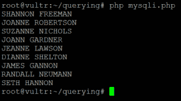

`bind_param()`方法有一个有趣的语法。它接受两个或多个参数。第一个参数`$types`字符串包含一个或多个字符。这些字符指定了相应绑定变量的类型：

*   `i`：整数类型的变量
*   `d`：这是 double 类型的变量
*   `s`：类型字符串的变量
*   `b`：这是 blob 类型的变量

第二个和以下所有参数表示绑定变量。我们的示例使用`'iis'`作为`$types`参数，它基本上读取`bind_param()`方法及其参数为：绑定整数类型（`$customerIdGt`）、整数类型（`$storeId`）和字符串类型（`$email`）。

# 插入

现在我们已经了解了如何准备查询并将数据绑定到查询，插入新记录变得非常简单：

```php
<?php

try {
    // Report on all types of errors
    mysqli_report(MYSQLI_REPORT_ALL);

    // Open a new connection to the MySQL server
    $mysqli = new mysqli('127.0.0.1', 'root', 'mL08e!Tq', 'sakila');

    // Prepare some teat address data
    $address = 'The street';
    $district = 'The district';
    $cityId = 135; // Matches the Dallas city in Sakila DB
    $postalCode = '31000';
    $phone = '123456789';

    // Prepare an SQL statement for execution
    $statement = $mysqli->prepare('INSERT INTO address (
            address,
            district,
            city_id,
            postal_code,
            phone
        ) VALUES (
            ?,
            ?,
            ?,
            ?,
            ?
        );
    ');

    // Bind variables to a prepared statement as parameters
    $statement->bind_param('ssiss', $address, $district, $cityId, $postalCode, $phone);

    // Execute a prepared Query
    $statement->execute();

    // Close a prepared statement
    $statement->close();

    // Quick & "dirty" way to fetch newly created address id
    $addressId = $mysqli->insert_id;

    // Close database connection
    $mysqli->close();
} catch (mysqli_sql_exception $e) {
    // Output error and exit upon exception
    echo $e->getMessage();
    exit;
}

```

这里的示例与前面介绍绑定的示例非常相似。明显的区别仅仅在于实际的`INSERT INTO`SQL 表达式。不用说，`mysqli`没有单独的 PHP 类或方法来处理选择、插入或任何其他操作。

# 更新

与选择和插入类似，我们也可以使用`prepare()`、`bind_param()`和`execute()`方法来处理记录更新，如下所示：

```php
<?php

try {
    // Report on all types of errors
    mysqli_report(MYSQLI_REPORT_ALL);

    // Open a new connection to the MySQL server
    $mysqli = new mysqli('127.0.0.1', 'root', 'mL08e!Tq', 'sakila');

    // Prepare some teat address data
    $address = 'The new street';
    $addressId = 600;

    // Prepare an SQL statement for execution
    $statement = $mysqli->prepare('UPDATE address SET address = ? WHERE address_id = ?');

    // Bind variables to a prepared statement as parameters
    $statement->bind_param('si', $address, $addressId);

    // Execute a prepared Query
    $statement->execute();

    // Close a prepared statement
    $statement->close();

    // Close database connection
    $mysqli->close();
} catch (mysqli_sql_exception $e) {
    // Output error and exit upon exception
    echo $e->getMessage();
    exit;
} 

```

# 删除

同样，我们可以使用`prepare()`、`bind_param()`和`execute()`方法来处理记录删除，如下所示：

```php
<?php

try {
    // Report on all types of errors
    mysqli_report(MYSQLI_REPORT_ALL);

    // Open a new connection to the MySQL server
    $mysqli = new mysqli('127.0.0.1', 'root', 'mL08e!Tq', 'sakila');

    // Prepare some teat address data
    $paymentId = 500;

    // Prepare an SQL statement for execution
    $statement = $mysqli->prepare('DELETE FROM payment WHERE payment_id = ?');

    // Bind variables to a prepared statement as parameters
    $statement->bind_param('i', $paymentId);

    // Execute a prepared Query
    $statement->execute();

    // Close a prepared statement
    $statement->close();

    // Close database connection
    $mysqli->close();
} catch (mysqli_sql_exception $e) {
    // Output error and exit upon exception
    echo $e->getMessage();
    exit;
}

```

# 交易

虽然`SELECT`、`INSERT`、`UPDATE`和`DELETE`方法允许我们以循序渐进的方式操作数据，但 MySQL 的真正优势在于事务。通过`mysqli`实例的`begin_transaction()`、`commit()`、`commit()`和`rollback()`方法，我们可以控制 MySQL 的交易特性：

```php
<?php

mysqli_report(MYSQLI_REPORT_ALL);
$mysqli = new mysqli('127.0.0.1', 'root', 'mL08e!Tq', 'sakila');

try {
    // Start new transaction
    $mysqli->begin_transaction(MYSQLI_TRANS_START_READ_WRITE);

    // Create new address
    $result = $mysqli->query('INSERT INTO address (
            address,
            district,
            city_id,
            postal_code,
            phone
        ) VALUES (
            "The street",
            "The district",
            333,
            "31000",
            "123456789"
        );
    ');

    // Fetch newly created address id
    $addressId = $mysqli->insert_id;

    // Create new customer
    $statement = $mysqli->prepare('INSERT INTO customer (
            store_id,
            first_name,
            last_name,
            email,
            address_id
        ) VALUES (
            2,
            "John",
            "Doe",
            "john@test.it",
            ?
        )
    ');
    $statement->bind_param('i', $addressId);
    $statement->execute();

    // Fetch newly created customer id
    $customerId = $mysqli->insert_id;

    // Select newly created customer info
    $statement = $mysqli->prepare('SELECT * FROM customer WHERE customer_id = ?');
    $statement->bind_param('i', $customerId);
    $statement->execute();
    $result = $statement->get_result();
    $customer = $result->fetch_object();

    // Commit transaction
    $mysqli->commit();

    echo $customer->first_name, ' ', $customer->last_name, PHP_EOL;
} catch (mysqli_sql_exception $t) {
    // We MUST be careful with non-db try block operations that throw exceptions
    // As they might cause a rollback inadvertently
    $mysqli->rollback();
    echo $t->getMessage(), PHP_EOL;
}

// Close database connection
$mysqli->close();

```

有效的事务标志如下所示：

*   `MYSQLI_TRANS_START_READ_ONLY`：匹配 MySQL`START TRANSACTION READ ONLY`查询
*   `MYSQLI_TRANS_START_READ_WRITE`：匹配 MySQL`START TRANSACTION READ WRITE`查询
*   `MYSQLI_TRANS_START_WITH_CONSISTENT_SNAPSHOT`：匹配 MySQL`START TRANSACTION WITH CONSISTENT SNAPSHOT`查询

Check out [https://dev.mysql.com/doc/refman/5.7/en/commit.html](https://dev.mysql.com/doc/refman/5.7/en/commit.html) for more information about the MySQL transaction syntax and meaning.

# 通过 PHP 数据对象驱动程序扩展进行查询

从 PHP5.1.0 开始，**PHP 数据对象**（**PDO**）驱动程序扩展默认附带 PHP。

# 连接

使用 PDO 驱动程序扩展，我们可以使用`PDO`类从 PHP 连接到 MySQL 数据库，如下所示：

```php
<?php

$host = '127.0.0.1';
$dbname = 'sakila';
$username = 'root';
$password = 'mL08e!Tq';

$conn = new PDO(
    "mysql:host=$host;dbname=$dbname",
    $username,
    $password
);

```

这个简单的多行表达式将在`127.0.0.1`主机上查找 MySQL，并尝试使用`root`用户名和`mL08e!Tq`密码连接到其`sakila`数据库。

# 错误处理

可以使用特殊的`PDOException`类来处理 PDO 周围的错误，如下所示：

```php
<?php

try {
    $host = '127.0.0.1';
    $dbname = 'sakila';
    $username = 'root';
    $password = 'mL08e!Tq';

    $conn = new PDO(
        "mysql:host=$host;dbname=$dbname",
        $username,
        $password,
        [PDO::ATTR_ERRMODE => PDO::ERRMODE_EXCEPTION]
    );
} catch (PDOException $e) {
    echo $e->getMessage(), PHP_EOL;
}

```

有三种不同的错误模式：

*   `ERRMODE_SILENT`
*   `ERRMODE_WARNING`
*   `ERRMODE_EXCEPTION`

这里，我们使用`ERRMODE_EXCEPTION`来利用`try...catch`块。

# 挑选

使用`PDO`查询记录与使用`mysqli`查询记录有些相似。我们在这两种情况下都使用原始 SQL 语句。区别在于 PHP 方法的方便性和它们提供的细微差别。以下示例演示如何从 MySQL 表中选择记录：

```php
<?php

try {
    $conn = new PDO(
        "mysql:host=127.0.0.1;dbname=sakila", 'root', 'mL08e!Tq',
        [PDO::ATTR_ERRMODE => PDO::ERRMODE_EXCEPTION]
    );

    $result = $conn->query('SELECT * FROM customer LIMIT 5');
    $customers = $result->fetchAll(PDO::FETCH_OBJ);

    foreach ($customers as $customer) {
        echo $customer->first_name, ' ', $customer->last_name, PHP_EOL;
    }
} catch (PDOException $e) {
    echo $e->getMessage(), PHP_EOL;
}

```

这将提供以下输出：

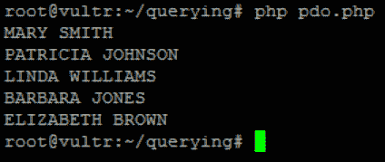

`PDOStatement`和`$result`对象的实例有几种不同的结果获取方法：

*   `fetch()`：从结果集中提取下一行，允许重复调用，并根据提取样式返回值
*   `fetchAll()`：将所有结果集行作为数组进行提取，并根据提取样式返回一个值
*   `fetchObject()`：从结果集中获取下一行作为对象，并允许重复调用
*   `fetchColumn()`：从结果集的下一行获取一列，并允许重复调用

以下列表显示了可用的 PDO 获取样式：

*   `PDO::FETCH_LAZY`
*   `PDO::FETCH_ASSOC`
*   `PDO::FETCH_NUM`
*   `PDO::FETCH_BOTH`
*   `PDO::FETCH_OBJ`
*   `PDO::FETCH_BOUND`
*   `PDO::FETCH_COLUMN`
*   `PDO::FETCH_CLASS`
*   `PDO::FETCH_INTO`
*   `PDO::FETCH_FUNC`
*   `PDO::FETCH_GROUP`
*   `PDO::FETCH_UNIQUE`
*   `PDO::FETCH_KEY_PAIR`
*   `PDO::FETCH_CLASSTYPE`
*   `PDO::FETCH_SERIALIZE`
*   `PDO::FETCH_PROPS_LATE`
*   `PDO::FETCH_NAMED`

While most of these fetch styles are quite self-explanatory, we can consult [http://php.net/manual/en/pdo.constants.php](http://php.net/manual/en/pdo.constants.php) for further details.

以下示例演示了一种更复杂的选择方法，该方法在混合中使用参数绑定：

```php
<?php

try {
    $conn = new PDO(
        "mysql:host=127.0.0.1;dbname=sakila", 'root', 'mL08e!Tq',
        [PDO::ATTR_ERRMODE => PDO::ERRMODE_EXCEPTION]
    );

    $statement = $conn->prepare('SELECT * FROM customer 
        WHERE customer_id > :customer_id AND store_id = :store_id AND email LIKE :email');

    $statement->execute([
        ':customer_id' => 100,
        ':store_id' => 2,
        ':email' => '%ANN%',
    ]);

    $customers = $statement->fetchAll(PDO::FETCH_OBJ);

    foreach ($customers as $customer) {
        echo $customer->first_name, ' ', $customer->last_name, PHP_EOL;
    }
} catch (PDOException $e) {
    echo $e->getMessage(), PHP_EOL;
}

```

这将提供以下输出：

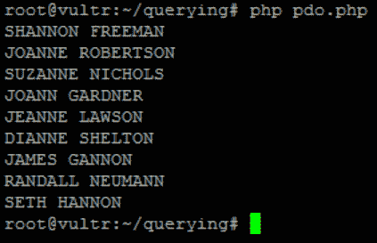

与`PDO`绑定和`mysqli`绑定最明显的区别在于`PDO`允许命名参数绑定。这使得查询更具可读性。

# 插入

与选择非常相似，插入涉及围绕`INSERT INTO`SQL 语句的相同 PDO 方法集：

```php
<?php

try {
    $conn = new PDO(
        "mysql:host=127.0.0.1;dbname=sakila", 'root', 'mL08e!Tq',
        [PDO::ATTR_ERRMODE => PDO::ERRMODE_EXCEPTION]
    );

    $statement = $conn->prepare('INSERT INTO address (
            address,
            district,
            city_id,
            postal_code,
            phone,
            location
        ) VALUES (
            :address,
            :district,
            :city_id,
            :postal_code,
            :phone,
            POINT(:longitude, :latitude)
        );
    ');

    $statement->execute([
        ':address' => 'The street',
        ':district' => 'The district',
        ':city_id' => '537',
        ':postal_code' => '31000',
        ':phone' => '888777666333',
        ':longitude' => 45.55111,
        ':latitude' => 18.69389
    ]);
} catch (PDOException $e) {
    echo $e->getMessage(), PHP_EOL;
}

```

# 更新

与选择和插入非常相似，更新涉及到围绕`UPDATE`SQL 语句的同一组 PDO 方法：

```php
<?php

try {
    $conn = new PDO(
        "mysql:host=127.0.0.1;dbname=sakila", 'root', 'mL08e!Tq',
        [PDO::ATTR_ERRMODE => PDO::ERRMODE_EXCEPTION]
    );

    $statement = $conn->prepare('UPDATE address SET phone = :phone WHERE address_id = :address_id');

    $statement->execute([
        ':phone' => '888777666555',
        ':address_id' => 600,
    ]);
} catch (PDOException $e) {
    echo $e->getMessage(), PHP_EOL;
}

```

# 删除

与选择、插入和更新非常相似，删除涉及到围绕`DELETE FROM`SQL 语句的同一组 PDO 方法：

```php
<?php

try {
    $conn = new PDO(
        "mysql:host=127.0.0.1;dbname=sakila", 'root', 'mL08e!Tq',
        [PDO::ATTR_ERRMODE => PDO::ERRMODE_EXCEPTION]
    );

    $statement = $conn->prepare('DELETE FROM payment WHERE payment_id = :payment_id');
    $statement->execute([
        ':payment_id' => 16046
    ]);
} catch (PDOException $e) {
    echo $e->getMessage(), PHP_EOL;
}

```

# 交易

使用 PDO 的事务与使用 MySQLi 的事务差别不大。利用`PDO`实例的`beginTransaction()`、`commit()`和`rollback()`方法，我们可以控制 MySQLi 的交易特性：

```php
<?php

$conn = new PDO(
    "mysql:host=127.0.0.1;dbname=sakila", 'root', 'mL08e!Tq',
    [PDO::ATTR_ERRMODE => PDO::ERRMODE_EXCEPTION]
);

try {
    // Start new transaction
    $conn->beginTransaction();

    // Create new address
    $result = $conn->query('INSERT INTO address (
            address,
            district,
            city_id,
            postal_code,
            phone,
            location
        ) VALUES (
            "The street",
            "The district",
            537,
            "27107",
            "888777666555",
            POINT(45.55111, 18.69389)
        );
    ');

    // Fetch newly created address id
    $addressId = $conn->lastInsertId();

    // Create new customer
    $statement = $conn->prepare('INSERT INTO customer (
            store_id,
            first_name,
            last_name,
            email,
            address_id
        ) VALUES (
            2,
            "John",
            "Doe",
            "john-pdo@test.it",
            :address_id
        )
    ');

    $statement->execute([':address_id' => $addressId]);

    // Fetch newly created customer id
    $customerId = $conn->lastInsertId();

    // Select newly created customer info
    $statement = $conn->prepare('SELECT * FROM customer WHERE customer_id = :customer_id');
    $statement->execute([':customer_id' => $customerId]);
    $customer = $statement->fetchObject();

    // Commit transaction
    $conn->commit();

    echo $customer->first_name, ' ', $customer->last_name, PHP_EOL;
} catch (PDOException $e) {
    $conn->rollback();
    echo $e->getMessage(), PHP_EOL;
}

```

# 与 MongoDB 合作

MongoDB 是由 MongoDB Inc.开发的免费开源 NoSQL 数据库。

MongoDB 的一些关键优势可以概括如下：

*   它是一个基于文档的数据库
*   它是跨平台的
*   它运行在单个服务器上以及分布式体系结构上
*   它可以用于桌面和 web 应用程序
*   它使用 JSON 对象来存储数据
*   它可以使用 JavaScript map reduce 在服务器端进行信息处理
*   它处理大量数据
*   它汇总了计算结果
*   它支持字段、范围查询和正则表达式搜索
*   它是本机复制

# 安装 MongoDB

假设我们使用的是全新的 Ubuntu 16.10（Yakkety Yak）安装，以下步骤概述了如何安装 MongoDB：

1.  我们将使用以下控制台命令安装 MongoDB：

```php
sudo apt-get update
sudo apt-get install -y mongodb

```

2.  为了进一步检查 MongoDB 是否已成功安装并运行，我们可以执行以下命令：

```php
sudo systemctl status mongodb.service

```

3.  这将为我们提供以下输出：


# 设置示例数据

在 Ubuntu 终端上运行`mongo`命令会让我们进入一个 mongo 交互式 shell。从这里开始，通过几个简单的命令，我们可以添加示例数据：

```php
use foggyline
db.products.insert({name: "iPhone 7", price: 650, weight: "138g"});
db.products.insert({name: "Samsung Galaxy S7", price: 670, weight: "152g" });
db.products.insert({name: "Motorola Moto Z Play", price: 449.99, weight: "165g" });
db.products.insert({name: "Google Pixel", price: 649.99, weight: "168g" });
db.products.insert({name: "HTC 10", price: 799, weight: "161g" });
show dbs
show collections

```

这将为我们提供与以下屏幕截图类似的输出：

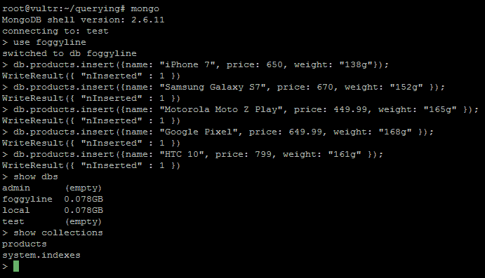

使用`use foggyline`和`db.products.find()`，我们现在可以列出添加到`products`集合中的所有条目：


# 通过 MongoDB 驱动程序扩展进行查询

我们需要确保安装了 PHP CLI 和 MongoDB 驱动程序扩展：

```php
sudo apt-get -y install php-pear
sudo apt-get -y install php7.0-dev
sudo apt-get -y install libcurl4-openssl-dev pkg-config libssl-dev libsslcommon2-dev
sudo pecl install mongodb

```

成功执行这些命令后，我们可以确认安装了`mongodb`驱动程序扩展，如下图所示：


除了驱动程序扩展之外，我们还需要一个`mongodb/mongodb`composer 包添加到我们的项目目录中。我们可以通过运行以下控制台命令来执行此操作：

```php
sudo apt-get -y install composer
composer require mongodb/mongodb

```

假设我们的项目目录中有`mongo.php`文件，只需加载 MongoDB 库，并开始使用 Mongo 数据库：

```php
<?php

require_once __DIR__ . '/vendor/autoload.php';

// Code...

```

# 连接

使用`mongodb`驱动程序扩展和`mongodb/mongodb`PHP 库，我们可以使用`MongoDBDriverManager`类从 PHP 连接到 Mongo 数据库，如下所示：

```php
<?php

require_once __DIR__ . '/vendor/autoload.php';

$manager = new MongoDBDriverManager('mongodb://localhost:27017');

```

此单行表达式将在端口`27017`下的`localhost`上查找 MongoDB。

# 错误处理

使用`try...catch`块处理错误非常简单，因为每当发生错误时都会抛出`MongoDBDriverExceptionException`：

```php
<?php

require_once __DIR__ . '/vendor/autoload.php';

try {
    $manager = new MongoDBDriverManager('mongodb://localhost:27017');
} catch (MongoDBDriverExceptionException $e) {
    echo $e->getMessage(), PHP_EOL;
    exit;
}

```

# 挑选

使用 MongoDB 获取数据归结为使用三个不同的类，`MongoDBDriverManager`、`MongoDBDriverQuery`和`MongoDBDriverReadPreference`：

```php
<?php

require_once __DIR__ . '/vendor/autoload.php';

try {
    $manager = new MongoDBDriverManager('mongodb://localhost:27017');

    /* Select only the matching documents */
    $filter = [
        'price' => [
            '$gte' => 619.99,
        ],
    ];

    $queryOptions = [
        /* Return only the following fields in the matching documents */
        'projection' => [
            'name' => 1,
            'price' => 1,
        ],
        /* Return the documents in descending order of price */
        'sort' => [
            'price' => -1
        ]
    ];

    $query = new MongoDBDriverQuery($filter, $queryOptions);

    $readPreference = new MongoDBDriverReadPreference(MongoDBDriverReadPreference::RP_PRIMARY);

    $products = $manager->executeQuery('foggyline.products', $query, $readPreference);

    foreach ($products as $product) {
        echo $product->name, ': ', $product->price, PHP_EOL;
    }
} catch (MongoDBDriverExceptionException $e) {
    echo $e->getMessage(), PHP_EOL;
    exit;
}

```

这将提供以下输出：

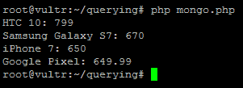

我们可以传递到`$filter`的查询运算符列表非常广泛，但以下比较运算符可能是最有趣的：

*   `$eq`：这些匹配所有等于指定值的值
*   `$gt`：这些匹配所有大于指定值的值
*   `$gte`：这些匹配所有大于或等于指定值的值
*   `$lt`：这些匹配所有小于指定值的值
*   `$lte`：这些匹配所有小于或等于指定值的值
*   `$ne`：这些匹配所有不等于指定值的值
*   `$in`：这些匹配数组中指定的所有值
*   `$nin`：这些值与数组中指定的 none 值匹配

Check out [ttps://docs.mongodb.com/manual/reference/operator/query/](https://docs.mongodb.com/manual/reference/operator/query/) for a full list of MongoDB query and projection operators.

我们可以传递给`$queryOptions`的查询选项列表同样令人印象深刻，但以下选项可能是最基本的选项：

*   `collation`：这些允许为字符串比较指定特定于语言的规则
*   `limit`：这些允许指定要返回的最大文档数
*   `maxTimeMS`：以毫秒为单位设置处理操作时限
*   `projection`：允许指定返回单据中包含哪些字段
*   `sort`：这些允许指定结果的排序顺序

Check out [http://php.net/manual/en/mongodb-driver-query.construct.php](http://php.net/manual/en/mongodb-driver-query.construct.php) for a full list of the `MongoDBDriverQuery` query options.

# 插入

使用 MongoDB 编写新数据可以归结为使用三个不同的类：`MongoDBDriverManager`、`MongoDBDriverBulkWrite`和`MongoDBDriverWriteConcern`：

```php
<?php

require_once __DIR__ . '/vendor/autoload.php';

try {
    $manager = new MongoDBDriverManager('mongodb://localhost:27017');

    $bulkWrite = new MongoDBDriverBulkWrite;

    $bulkWrite->insert([
        'name' => 'iPhone 7 Black White',
        'price' => 650,
        'weight' => '138g'
    ]);

    $bulkWrite->insert([
        'name' => 'Samsung Galaxy S7 White',
        'price' => 670,
        'weight' => '152g'
    ]);

    $writeConcern = new MongoDBDriverWriteConcern(MongoDBDriverWriteConcern::MAJORITY, 1000);

    $result = $manager->executeBulkWrite('foggyline.products', $bulkWrite, $writeConcern);

    if ($result->getInsertedCount()) {
        echo 'Record(s) saved successfully.', PHP_EOL;
    } else {
        echo 'Error occurred.', PHP_EOL;
    }
} catch (MongoDBDriverExceptionException $e) {
    echo $e->getMessage(), PHP_EOL;
    exit;
}

```

`BulkWrite`实例可以通过`insert()`方法存储一条或多条 insert 语句。然后我们在`$manager`实例上将`$bulkWrite`和`$writeConcern`传递给`executeBulkWrite()`。一旦执行，我们可以通过`mongo`外壳观察新添加的记录：


# 更新

更新现有数据的过程与写入新数据的过程几乎相同。明显的区别在于在`MongoDBDriverBulkWrite`实例上使用`update()`方法：

```php
<?php

require_once __DIR__ . '/vendor/autoload.php';

try {
    $manager = new MongoDBDriverManager('mongodb://localhost:27017');

    $bulkWrite = new MongoDBDriverBulkWrite;

    $bulkWrite->update(
        ['name' => 'iPhone 7 Black White'],
        ['$set' => [
            'name' => 'iPhone 7 Black Black',
            'price' => 649.99
        ]],
        ['multi' => true, 'upsert' => false]
    );

    $bulkWrite->update(
        ['name' => 'Samsung Galaxy S7 White'],
        ['$set' => [
            'name' => 'Samsung Galaxy S7 Black',
            'price' => 669.99
        ]],
        ['multi' => true, 'upsert' => false]
    );

    $writeConcern = new MongoDBDriverWriteConcern(MongoDBDriverWriteConcern::MAJORITY, 1000);

    $result = $manager->executeBulkWrite('foggyline.products', $bulkWrite, $writeConcern);

    if ($result->getModifiedCount()) {
        echo 'Record(s) saved updated.', PHP_EOL;
    } else {
        echo 'Error occurred.', PHP_EOL;
    }
} catch (MongoDBDriverExceptionException $e) {
    echo $e->getMessage(), PHP_EOL;
    exit;
}

```

`update()`方法接受三个不同的参数：过滤器、新对象和更新选项。更新选项下传递的`multi`选项告知是否将更新所有文档的匹配条件。在更新选项下传递的`upsert`选项控制在未找到现有记录时创建新记录。由此产生的变化可以通过`mongo`外壳观察到：


# 删除

删除的方式类似于写入和更新，因为它使用了`MongoDBDriverBulkWrite`对象的实例。这次我们使用的是实例`delete()`方法，它接受过滤和删除选项：

```php
<?php

require_once __DIR__ . '/vendor/autoload.php';

try {
    $manager = new MongoDBDriverManager('mongodb://localhost:27017');

    $bulkWrite = new MongoDBDriverBulkWrite;

    $bulkWrite->delete(
        // filter
        [
            'name' => [
                '$regex' => '^iPhone'
            ]
        ],
        // Delete options
        ['limit' => false]
    );

    $writeConcern = new MongoDBDriverWriteConcern(MongoDBDriverWriteConcern::MAJORITY, 1000);

    $result = $manager->executeBulkWrite('foggyline.products', $bulkWrite, $writeConcern);

    if ($result->getDeletedCount()) {
        echo 'Record(s) deleted.', PHP_EOL;
    } else {
        echo 'Error occurred.', PHP_EOL;
    }
} catch (MongoDBDriverExceptionException $e) {
    echo $e->getMessage(), PHP_EOL;
    exit;
}

```

使用`limit`选项的`false`值，我们有效地请求删除所有匹配的文档。使用`mongo`shell，我们可以观察到如下屏幕截图所示的变化：


# 交易

MongoDB 没有 MySQL 所拥有的完整的**ACID**（**原子性、一致性、隔离性、耐久性**）支持，它只在文档级别支持 ACID 事务。不支持多文档事务。缺乏 ACID 法规遵从性肯定会限制其在依赖此功能的平台上的使用。这并不是说 MongoDB 不能用于此类平台。让我们考虑一个流行的 MaMto to 电子商务平台。没有什么可以阻止 Magento 将 MongoDB 添加到混合中。虽然 MySQL 特性可以保证销售相关功能的 ACID 合规性，但 MongoDB 可以在连接中使用，以涵盖目录功能的相关内容。这种类型的共生关系可以很容易地将这两种数据库功能的优点带到我们的平台上。

# 与 Redis 合作

Redis 是一个开源的内存数据结构存储，其开发由 Redis 实验室赞助。名称来源于**远程字典服务器**。它目前被列为最流行的键值数据库之一。

Redis 的一些关键优势可以概括如下：

*   内存数据结构存储器
*   键值数据存储
*   生存时间有限的钥匙
*   发布/订阅消息
*   它可以用于缓存数据存储
*   交易
*   主从复制

# 安装 Redis

假设我们使用的是全新的 Ubuntu 16.10（Yakkety Yak）安装，以下步骤概述了如何安装 Redis 服务器：

1.  我们可以使用以下控制台命令安装 Redis 服务器：

```php
sudo apt-get update
sudo apt-get -y install build-essential tcl
wget http://download.redis.io/redis-stable.tar.gz
tar xzf redis-stable.tar.gz
cd redis-stable
make
make test
sudo make install
./src/redis-server

```

2.  这将为我们提供以下输出：

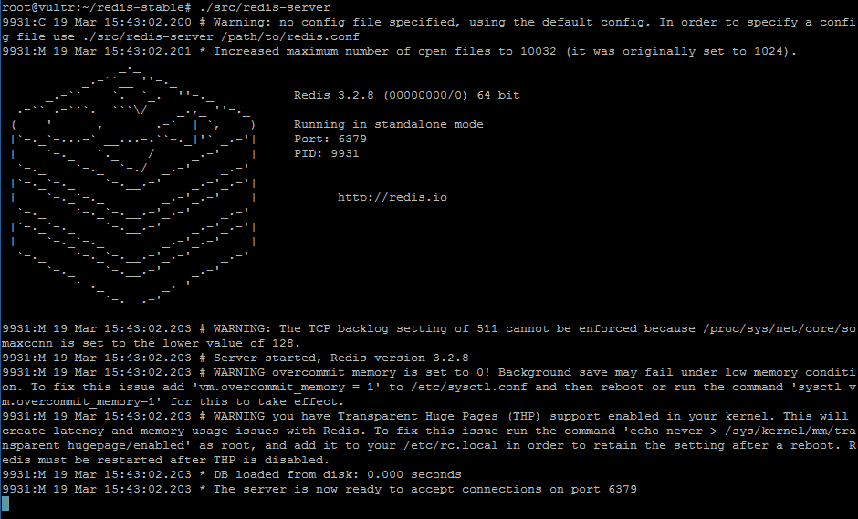

# 设置示例数据

在 Ubuntu 终端上运行`redis-cli`命令可以让我们进入 Redis 交互式 shell。从这里开始，通过几个简单的命令，我们可以添加以下示例数据：

```php
SET Key1 10
SET Key2 20
SET Key3 30
SET Key4 40
SET Key5 50

```

这将为我们提供以下输出：

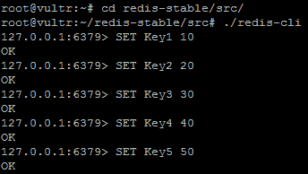

使用`redis-cli`shell 中的`KEYS *`命令，我们现在可以列出 Redis 添加的所有条目：

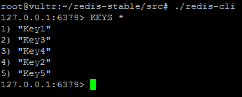

# 通过 phpredis 驱动程序扩展进行查询

在开始查询之前，我们需要确保安装了 PHP CLI 和`phpredis`驱动程序扩展：

```php
sudo apt-get -y install php7.0-dev
sudo apt-get -y install unzip
wget https://github.com/phpredis/phpredis/archive/php7.zip -O phpredis.zip
unzip phpredis.zip 
cd phpredis-php7/
phpize
./configure
make
sudo make install
echo extension=redis.so >> /etc/php/7.0/cli/php.ini

```

成功执行这些命令后，我们可以确认`phpredis`驱动程序扩展安装如下：


# 连接

使用`phpredis`驱动程序扩展，我们可以使用`Redis`类从 PHP 连接到 Redis，如下所示：

```php
<?php

$client = new Redis();

$client->connect('localhost', 6379);

```

此单行表达式将在本地主机上的端口`6379`下查找 Redis。

# 错误处理

对于使用`Redis`类发生的每个错误，`phpredis`驱动程序扩展都会抛出`RedisException`。这使得通过简单的`try...catch`块轻松处理错误：

```php
<?php

try {
    $client = new Redis();
    $client->connect('localhost', 6379);
    // Code...
} catch (RedisException $e) {
    echo $e->getMessage(), PHP_EOL;
}

```

# 挑选

鉴于 Redis 是一个键值存储，选择键就像使用`Redis`实例的单一`get()`方法一样简单：

```php
<?php

try {
    $client = new Redis();
    $client->connect('localhost', 6379);
    echo $client->get('Key3'), PHP_EOL;
    echo $client->get('Key5'), PHP_EOL;
} catch (RedisException $e) {
    echo $e->getMessage(), PHP_EOL;
}

```

这将为我们提供以下输出：


`Redis`客户端类还提供`mget()`方法，可以一次获取多个键值：

```php
<?php

try {
    $client = new Redis();
    $client->connect('localhost', 6379);

    $values = $client->mget(['Key1', 'Key2', 'Key4']);
    print_r($values);
} catch (RedisException $e) {
    echo $e->getMessage(), PHP_EOL;
}

```

这将为我们提供以下输出：

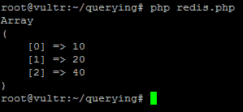

# 插入

Redis key-value 机制背后的简单性造就了一个简单而直接的`set()`方法，通过该方法我们可以插入新条目，如下例所示：

```php
<?php

try {
    $client = new Redis();
    $client->connect('localhost', 6379);

    $client->set('user', [
        'name' => 'John',
        'age' => 34,
        'salary' => 4200.00
    ]);

    // $client->get('user');
    // returns string containing "Array" chars

    $client->set('customer', json_encode([
        'name' => 'Marc',
        'age' => 43,
        'salary' => 3600.00
    ]));

    // $client->get('customer');
    // returns json looking string, which we can simply json_decode()
} catch (RedisException $e) {
    echo $e->getMessage(), PHP_EOL;
}

```

这将为我们提供以下输出：

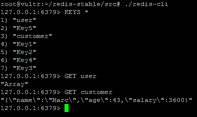

在对非字符串结构使用 set 方法时，我们应该小心。`user`键值导致数组字符串存储在 Redis 中，而不是实际的数组结构。在我们将数组结构传递到`set()`方法之前，使用`json_encode()`将数组结构转换为 JSON，这很容易排序。

`set()`方法的一大好处是，它支持以秒为单位的超时，因此我们可以轻松编写如下表达式：

```php
$client->set('test', 'test2', 3600);

```

尽管如此，当我们想要为密钥添加超时时，调用`setex()`方法是首选的方式：

```php
$client->setex('key', 3600, 'value');

```

Timeouts are a great feature to use when using Redis as a cache database. They basically automate the cache lifetime for us.

# 更新

通过 Redis 客户端更新值与插入值相同。我们使用相同的`set()`方法，使用相同的密钥。新值仅覆盖上一个值（如果存在）：

```php
<?php

try {
    $client = new Redis();
    $client->connect('localhost', 6379);

    $client->set('test', 'test1');
    $client->set('test', 'test2');

    // $client->get('test');
    // returns string containing "test2" chars
} catch (RedisException $e) {
    echo $e->getMessage(), PHP_EOL;
}

```

# 删除

从 Redis 中删除记录非常简单，只需调用 Redis client`del()`方法并将要删除的密钥传递给它即可：

```php
<?php

try {
    $client = new Redis();
    $client->connect('localhost', 6379);
    $client->del('user');
} catch (RedisException $e) {
    echo $e->getMessage(), PHP_EOL;
}

```

# 交易

与 MongoDB 非常相似，Redis 也没有 MySQL 所具有的 ACID 支持，这实际上是正常的，因为 Redis 只是一个键/值存储，而不是一个关系数据库。然而，Redis 提供了一定程度的原子性。使用`MULTI`、`EXEC`、`DISCARD`、`WATCH`，我们能够在一个步骤内执行一组命令，Redis 在此期间做出以下两个保证：

*   另一个客户端请求不能在组命令执行的中间服务。
*   要么全部处理，要么不处理任何命令

让我们来看看下面的例子：

```php
<?php

try {
    $client = new Redis();
    $client->connect('localhost', 6379);

    $client->multi();

    $result1 = $client->set('tKey1', 'Test#1'); // Valid command
    $result2 = $client->zadd('tKey2', null); // Invalid command

    if ($result1 == false || $result2 == false) {
        $client->discard();
        echo 'Transaction aborted.', PHP_EOL;
    } else {
        $client->exec();
        echo 'Transaction commited.', PHP_EOL;
    }
} catch (RedisException $e) {
    echo $e->getMessage(), PHP_EOL;
}

```

`$result2`值显示为`false`，触发`$client->discard();`。虽然，`result1`是一个有效的表达式，但它是在`$client->multi();`调用之后出现的，这意味着它的命令没有得到真正的处理；因此，我们无法看到 Redis 中存储的`Test#1`值。虽然没有像 MySQL 那样的经典回滚机制，但这是一个很好的事务模型。

# 总结

在本章中，我们讨论了查询三个非常不同的数据库系统的基础知识。

MySQL 数据库已经存在很长一段时间了，它很可能是大多数 PHP 应用程序的第一大数据库。它的 ACID 合规性使其在处理金融或其他敏感数据的应用程序中不可替代，因为原子性、一致性、隔离性和持久性是关键因素。

另一方面，Mongo 通过一种无模式的方法处理数据存储。这使得开发人员更容易加快应用程序开发的速度，尽管跨文档缺乏 ACID 遵从性限制了它在某些类型的应用程序中的使用。

最后，Redis 数据存储是一个很好的缓存，甚至是应用程序的会话存储解决方案。

接下来，我们将进一步了解依赖注入，它是什么，以及它在模块化应用程序中扮演什么角色。