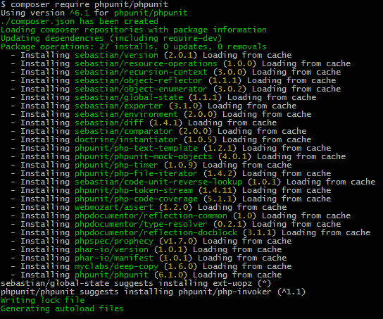
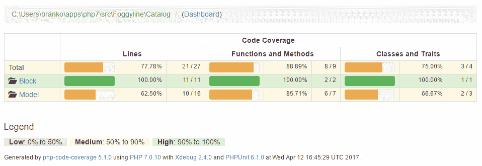
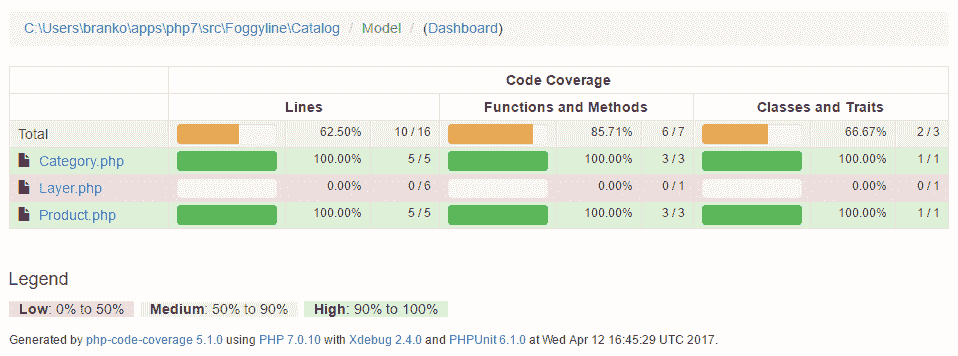
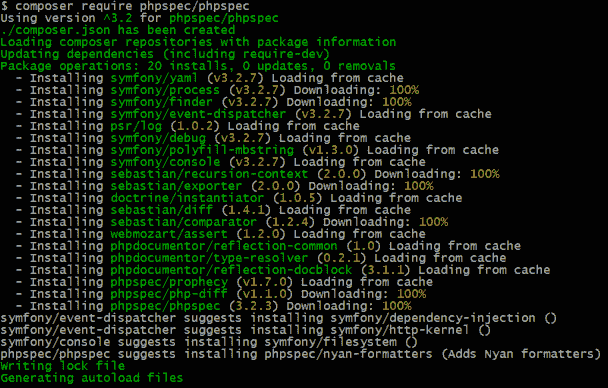
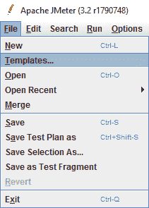

# 测试重要位

编写高质量的软件是一项技术上具有挑战性且成本高昂的活动。技术上具有挑战性的部分来自于需要理解和实施多种类型的应用程序测试。然而，代价高昂的部分来自这样一个事实：正确的测试通常会产生比我们正在测试的代码更多的代码，这意味着完成工作需要更多的时间。

与开发人员不同，企业不太关心技术细节，而是关心降低成本。这就是以牺牲质量为代价的两个世界的冲突。虽然双方都理解*技术债务*概念的含义，但很少有人认真对待。Web 应用程序就是这种冲突的一个很好的例子。足够好的用户体验和设计通常足以满足股东的需求，而软件的许多内部和远离眼睛的部分都没有经过测试。

Check out [https://en.wikipedia.org/wiki/Technical_debt](https://en.wikipedia.org/wiki/Technical_debt) for more information on the technical debt concept.

我们可以将多种类型的测试应用于我们的应用程序，其中一些测试如下：

*   单元测试
*   功能测试
*   性能测试
*   可用性测试
*   验收测试

说一个比另一个更重要是不公平的，因为每一个都涉及应用程序中非常不同的部分。PHP 生态系统和工具的当前状态表明，*单元*、*功能*和*性能测试*是流行的。在本章中，我们将快速了解一些适用于这些测试类型的工具和库：

*   菲普尼特
*   比哈特
*   phpspec
*   吉米特

Software that a typical programmer believes to be thoroughly tested has often had only about 55 to 60 percent of its logic paths executed. Using automated support, such as coverage analyzers, can raise that roughly to 85 to 90 percent. It is nearly impossible to test software at the level of 100 percent of its logic paths.

                                                                       - Facts and Fallacies of Software Engineering book.

# 菲普尼特

PHPUnit 是单元测试框架的代表，其总体思想是为一段必须满足的独立代码提供一个*严格的契约*。这段代码就是我们所称的*单元*，它在 PHP 中转换为类及其方法。PHPUnit 框架使用*断言*功能验证这些单元的行为是否符合预期。单元测试的好处是，它的早期问题检测有助于减少最初可能不明显的*复合*或*后续*错误。单元测试覆盖的程序路径越多越好。

# 建立 PHPUnit

PHPUnit 可以临时命名为工具或库来安装。实际上，两者都是相同的东西，只是我们安装和使用它们的方式有所不同。*工具*版本实际上只是一个 PHP*phar*归档文件，我们可以通过控制台运行，然后控制台提供了一组我们可以全局执行的控制台命令。另一方面，*库*版本是一组 PHPUnit 库，打包为 Composer 包，以及转储到项目`vendor/bin/`目录中的二进制文件。

假设我们使用的是 Ubuntu 16.10（Yakkety-Yak）安装，那么通过以下命令安装 PHPUnit 作为工具是很容易的：

```php
wget https://phar.phpunit.de/phpunit.phar
chmod +x phpunit.phar
sudo mv phpunit.phar /usr/local/bin/phpunit
phpunit --version

```

这将为我们提供最终输出，非常类似于以下屏幕截图：


PHPUnit 成为一个系统范围内可访问的控制台工具，与任何项目都不相关。

将 PHPUnit 安装为库非常简单，只需在项目根目录中运行以下控制台命令即可：

```php
composer require phpunit/phpunit

```

这将为我们提供最终输出，非常类似于以下屏幕截图：



这将安装我们项目的`vendor/phpunit/`目录中的所有 PHPUnit 库文件，以及`vendor/bin/`目录下的`phpunit`可执行文件。

# 设置示例应用程序

在我们开始编写一些 PHPUnit 测试脚本之前，让我们继续创建一个非常简单的应用程序，它只包含几个文件。这将使我们能够关注稍后编写测试的本质。

**Test driven development** (**TDD**), such as the one done with PHPUnit, encourages writing tests before the implementations. This way, the tests set the expectations for the functionality and not the other way around. This approach requires a certain level of experience and discipline, which might not sit well with newcomers to PHPUnit.

让我们假设我们正在制作 web 购物功能的一部分，从而开始处理产品和类别实体。我们提到的第一类是`Product`模型。我们将创建`src\Foggyline\Catalog\Model\Product.php`文件，其内容如下：

```php
<?php

declare(strict_types=1);

namespace Foggyline\Catalog\Model;

class Product
{
    protected $id;
    protected $title;
    protected $price;
    protected $taxRate;

    public function __construct(string $id, string $title, float $price, int $taxRate)
    {
        $this->id = $id;
        $this->title = $title;
        $this->price = $price;
        $this->taxRate = $taxRate;
    }

    public function getId(): string
    {
        return $this->id;
    }

    public function getTitle(): string
    {
        return $this->title;
    }

    public function getPrice(): float
    {
        return $this->price;
    }

    public function getTaxRate(): int
    {
       return $this->taxRate;
    }
}

```

`Product`类依赖于构造函数来设置产品的 ID、标题、价格和税率。除此之外，除了简单的 getter 方法外，该类没有实际的逻辑。在`Product`类就绪后，让我们继续创建一个`Category`类。我们将其添加到`src\Foggyline\Catalog\Model\Category.php`文件中，其内容如下：

```php
<?php

declare(strict_types=1);

namespace Foggyline\Catalog\Model;

class Category
{
    protected $title;
    protected $products;

    public function __construct(string $title, array $products)
    {
        $this->title = $title;
        $this->products = $products;
    }

    public function getTitle(): string
    {
        return $this->title;
    }

    public function getProducts(): array
    {
        return $this->products;
    }
}

```

`Category`类依赖构造函数来设置类别标题及其产品。除此之外，它没有任何逻辑，除了两个 getter 方法，这两个方法只返回通过构造函数设置的值。

为了增加一些趣味性，出于测试目的，让我们继续创建一个虚拟的`Layer`类作为`src\Foggyline\Catalog\Model\Layer.php`文件的一部分，其内容如下：

```php
<?php

namespace Foggyline\Catalog\Model;

// Just a dummy class, for testing purpose
class Layer
{
    public function dummy()
    {
        $time = time();
        sleep(2);
        $time = time() - $time;
        return $time;
    }
}

```

我们将使用这个类仅仅作为一个示例，稍后将进行代码覆盖率分析。

对于`Product`和`Category`模型，让我们继续创建`Block\Category\View`类作为`src\Foggyline\Catalog\Block\Category\View.php`文件的一部分，其内容如下：

```php
<?php

declare(strict_types=1);

namespace Foggyline\Catalog\Block\Category;

use Foggyline\Catalog\Model\Category;
class View
{
    protected $category;

    public function __construct(Category $category)
    {
        $this->category = $category;
    }

    public function render(): string
    {
        $products = '';

        foreach ($this->category->getProducts() as $product) {
          if ($product instanceof \Foggyline\Catalog\Model\Product) {
            $products .= '<div class="product">
             <h1 class="product-title">' . $product->getTitle() . '</h1>
             <div class="product-price">' . number_format($product->getPrice(), 2, ',', '.') . '</h1>
                </div>';
            }
        }

        return '<div class="category">
            <h1 class="category-title">' . $this->category->getTitle() . '</h1>
            <div class="category-products">' . $products . '</div>
        </div>';
    }
}

```

我们正在使用`render()`方法呈现整个类别页面。页面本身由一个类别标题和一个容器组成，其中包含所有产品及其各自的标题和价格。现在我们已经概述了真正基本的应用程序类，让我们向`autoload.php`文件添加一个简单的 PSR4 类型加载程序，其内容如下：

```php
<?php

$loader = require __DIR__ . '/vendor/autoload.php';
$loader->addPsr4('Foggyline\\', __DIR__ . '/src/Foggyline');

```

最后，我们将应用程序的入口点设置为`index.php`文件的一部分，其内容如下：

```php
<?php

require __DIR__ . '/autoload.php';

use Foggyline\Catalog\Model\Product;
use Foggyline\Catalog\Model\Category;
use Foggyline\Catalog\Block\Category\View as CategoryView;

$category = new Category('Laptops', [
    new Product('RL', 'Red Laptop', 1499.99, 25),
    new Product('YL', 'Yellow Laptop', 2499.99, 25),
    new Product('BL', 'Blue Laptop', 3499.99, 25),
]);

$categoryView = new CategoryView($category);
echo $categoryView->render();

```

We will be using this utterly simple application across other types of tests as well, so it's worth keeping its files and structure in mind.

# 写作测试

开始编写 PHPUnit 测试需要掌握一些基本概念，例如：

*   **setUp（）方法**：与构造函数类似，这是我们创建对象的地方，我们将对其执行测试。
*   **tearDown（）方法**：类似于析构函数，这是我们清理测试对象的地方。
*   **test*（）methods**：每个名称以 test 开头的公共方法，例如`testSomething()`、`testItAgain()`等，都被视为一个测试，在方法的 docblock 中添加`@test`注释也可以达到同样的效果；尽管如此，这似乎是一个较少使用的案例。
*   **@depends 注释**：这允许表达测试方法之间的依赖关系。
*   **断言**：PHPUnit 的核心，这组方法允许我们对正确性进行推理。

The `vendor\phpunit\phpunit\src\Framework\Assert\Functions.php` file contains an extensive list of the `assert*` function declarations, such as `assertEquals()`, `assertContains()`, `assertLessThan()`, and others, totaling to over 90 different assert functions.

考虑到这些，让我们继续编写`src\Foggyline\Catalog\Test\Unit\Model\ProductTest.php`文件，其内容如下：

```php
<?php

namespace Foggyline\Catalog\Test\Unit\Model;

use PHPUnit\Framework\TestCase;
use Foggyline\Catalog\Model\Product;

class ProductTest extends TestCase
{
    protected $product;

    public function setUp()
    {
        $this->product = new Product('SL', 'Silver Laptop', 4599.99, 25);
    }

    public function testTitle()
    {
        $this->assertEquals(
            'Silver Laptop',
            $this->product->getTitle()
        );
    }

    public function testPrice()
    {
        $this->assertEquals(
            4599.99,
            $this->product->getPrice()
        );
    }
}

```

我们的`ProductTest`类正在使用`setUp()`方法来设置`Product`类的实例。然后，这两种`test*()`方法使用 PHPUnit 内置的`assertEquals()`方法来测试产品名称和价格的价值。

然后我们添加`src\Foggyline\Catalog\Test\Unit\Model\CategoryTest.php`文件，其内容如下：

```php
<?php

namespace Foggyline\Catalog\Test\Unit\Model;

use PHPUnit\Framework\TestCase;
use Foggyline\Catalog\Model\Product;
use Foggyline\Catalog\Model\Category;

class CategoryTest extends TestCase
{
    protected $category;

    public function setUp()
    {
        $this->category = new Category('Laptops', [
            new Product('TRL', 'Test Red Laptop', 1499.99, 25),
            new Product('TYL', 'Test Yellow Laptop', 2499.99, 25),
        ]);
    }

    public function testTotalProductsCount()
    {
        $this->assertCount(2, $this->category->getProducts());
    }

    public function testTitle()
    {
        $this->assertEquals('Laptops', $this->category->getTitle());
    }
}

```

我们的`CategoryTest`类正在使用`setUp()`方法来设置`Category`类的实例，以及传递给`Category`类构造函数的两个产品。然后，这两个`test*()`方法使用 PHPUnit 的内置`assertCount()`和`assertEquals()`方法来测试实例化的值。

然后我们添加`src\Foggyline\Catalog\Test\Unit\Block\Category\ViewTest.php`文件，其内容如下：

```php
<?php

namespace Foggyline\Catalog\Test\Unit\Block\Category;

use PHPUnit\Framework\TestCase;
use Foggyline\Catalog\Model\Product;
use Foggyline\Catalog\Model\Category;
use Foggyline\Catalog\Block\Category\View as CategoryView;

class ViewTest extends TestCase
{
    protected $category;
    protected $categoryView;

    public function setUp()
    {
        $this->category = new Category('Laptops', [
            new Product('TRL', 'Test Red Laptop', 1499.99, 25),
            new Product('TYL', 'Test Yellow Laptop', 2499.99, 25),
        ]);

        $this->categoryView = new CategoryView($this->category);
    }

    public function testCategoryTitle()
    {
        $this->assertContains(
            '<h1 class="category-title">Laptops',
            $this->categoryView->render()
        );
    }

    public function testProductsContainer()
    {
        $this->assertContains(
            '<h1 class="product-title">Test Yellow',
            $this->categoryView->render()
        );
    }
}

```

我们的`ViewTest`类使用`setUp()`方法来设置`Category`类的实例，同时将两个产品传递给`Category`类构造函数。然后，这两个`test*()`方法使用 PHPUnit 的内置`assertContains()`方法来测试是否存在应通过 category view`render()`方法调用返回的值。

然后我们添加`phpunit.xml`文件，其内容如下：

```php
<phpunit bootstrap="autoload.php">
  <testsuites>
    <testsuite name="foggyline">
      <directory>src/Foggyline/*/Test/Unit/*</directory>
    </testsuite>
  </testsuites>
</phpunit>

```

`phpunit.xml`配置文件支持非常强大的选项列表。使用 PHPUnit 元素的 bootstrap 属性，我们指示 PHPUnit 工具在运行测试之前加载`autoload.php`文件。这确保了我们的 PSR4 自动加载程序将启动，并且我们的测试类将在`src/Foggyline`目录中看到我们的类。我们在`testsuites`中定义的`foggyline`测试套件使用目录选项，以正则表达式的形式指定单元测试的路径。我们使用的路径是这样的，以便拾取`src/Foggyline/Catalog/Test/Unit/`和`src/Foggyline/Checkout/Test/Unit/`目录下的所有文件。

Check out [https://phpunit.de/manual/current/en/appendixes.configuration.html](https://phpunit.de/manual/current/en/appendixes.configuration.html) for more information on `phpunit.xml` configuration options.

# 执行测试

运行我们刚刚编写的测试套件就像在项目根目录中执行`phpunit`命令一样简单。

执行后，`phpunit`将查找`phpunit.xml`文件并采取相应行动。这意味着`phpunit`将知道在哪里查找测试文件。成功执行的测试显示如下屏幕截图所示的输出：


但是，未成功执行的测试显示了如下屏幕截图所示的输出：


我们可以很容易地修改其中一个测试类，就像我们对前面的`ViewTest`所做的那样，以触发并观察`phpunit`对失败的反应。

# 代码覆盖率

PHPUnit 最大的优点是它的代码覆盖率报告功能。我们只需扩展`phpunit.xml`文件，就可以轻松地将代码覆盖率添加到测试套件中，如下所示：

```php
<phpunit bootstrap="autoload.php">
  <testsuites>
    <testsuite name="foggyline">
      <directory>src/Foggyline/*/Test/Unit/*</directory>
    </testsuite>
  </testsuites>
  <filter>
    <whitelist>
      <directory>src/Foggyline/</directory>
      <exclude>
        <file>src/config.php</file>
        <file>src/auth.php</file>
        <directory>src/Foggyline/*/Test/</directory>
      </exclude> 
    </whitelist>
    <logging>
      <log type="coverage-html" target="log/report" lowUpperBound="50" 
        highLowerBound="80"/>
    </logging>
  </filter>
</phpunit>

```

在这里，我们添加了`filter`元素，还有一个额外的`whitelist`和`logging`元素。现在，我们可以再次触发测试，但是，这一次，使用稍微修改的命令，如下所示：

```php
phpunit --coverage-html log/report

```

这将为我们提供最终输出，如以下屏幕截图所示：


`log/report`目录现在应该充满 HTML 报告文件。如果我们将其公开给浏览器，我们可以看到一个生成良好的报告，其中包含关于我们代码库的宝贵信息，如以下屏幕截图所示：



前面的屏幕截图显示了整个`src/Foggyline/Catalog/`目录结构的代码覆盖率百分比。进一步深入到`Model`目录，我们看到我们的`Layer`类的代码覆盖率为 0%，这是预期的，因为我们没有为它编写任何测试：



进一步深入到实际的`Product`类本身，我们可以看到 PHPUnit 代码覆盖率概述了我们测试所覆盖的每一行代码：


通过直接查看实际的`Layer`类，我们可以清楚地看到此类中没有任何代码覆盖：


代码覆盖率提供了关于我们在测试中覆盖的代码量的有价值的视觉和统计信息。尽管这些信息很容易被误解，但 100%的代码覆盖率绝不是衡量我们个人测试质量的标准。编写质量测试需要作者，即开发人员，对单元测试的确切含义有一个清晰的理解。可以说，我们可以轻松地获得 100%的代码覆盖率，100%通过测试，但却无法解决某些测试用例或逻辑路径。

# 比哈特

Behat 是一个基于**行为驱动开发人员**t（**BDD**概念的开源免费测试框架。BDD 框架（包括 Behat）的最大好处是，功能文档的很大一部分被注入到我们最终测试的实际用户故事中。也就是说，在某种程度上，文档本身就是一种测试。

# 设置行为

与 PHPUnit 非常相似，Behat 可以作为工具和库安装。工具版本是`.phar`归档文件，我们可以从官方的 GitHub 存储库下载它，其中库版本打包为 Composer 包。

假设我们使用的是 Ubuntu 16.10（Yakkety Yak）安装，通过以下命令将 Behat 作为工具安装起来很容易：

```php
wget https://github.com/Behat/Behat/releases/download/v3.3.0/behat.phar
chmod +x behat.phar
sudo mv behat.phar /usr/local/bin/behat
behat --version 

```

这将为我们提供以下输出：


将 Behat 安装为库与在项目根目录中运行以下控制台命令一样简单：

```php
composer require behat/behat

```

这将为我们提供最终输出，如以下屏幕截图所示：


Behat 库现在在`vendor/behat`目录下可用，其控制台工具可执行文件在`vendor/bin/behat`文件下可用。

# 设置示例应用程序

Behat 测试的示例应用程序与我们用于 PHPUnit 测试的应用程序相同。我们将通过添加一个额外的类来扩展它。鉴于我们的 PHPUnit 示例应用程序中缺少任何真正的“行为”，我们在这里的扩展将包括一个虚拟购物车功能。

因此，我们将添加`src\Foggyline\Checkout\Model\Cart.php`文件，其内容如下：

```php
<?php

declare(strict_types=1);

namespace Foggyline\Checkout\Model;

class Cart implements \Countable
{
    protected $productQtyMapping = [];

    public function addProduct(\Foggyline\Catalog\Model\Product $product, int $qty): self
    {
        $this->productQtyMapping[$product->getId()]['product'] = $product;
        $this->productQtyMapping[$product->getId()]['qty'] = $qty;
        return $this;
    }

    public function removeProduct($productId): self
    {
       if (isset($this->productQtyMapping[$productId])) {
            unset($this->productQtyMapping[$productId]);
        }

       return $this;
    }

    public function getSubtotal()
    {
        $subtotal = 0.0;

        foreach ($this->productQtyMapping as $mapping) {
            $subtotal += ($mapping['qty'] * $mapping['product']->getPrice());
        }

        return $subtotal;
    }

    public function getTotal()
    {
        $total = 0.0;

        foreach ($this->productQtyMapping as $mapping) {
            $total += ($mapping['qty'] * ($mapping['product']->getPrice() + ($mapping['product']->getPrice() * ($mapping['product']->getTaxRate() / 100))));
        }

        return $total;
    }

    public function count()
    {
        return count($this->productQtyMapping);
    }
}

```

保持原有的`index.php`文件不变，我们继续创建`index_2.php`文件，其内容如下：

```php
<?php

$loader = require __DIR__ . '/vendor/autoload.php';
$loader->addPsr4('Foggyline\\', __DIR__ . '/src/Foggyline');

use Foggyline\Catalog\Model\Product;
use \Foggyline\Checkout\Model\Cart;

$cart = new Cart();
$cart->addProduct(new Product('RL', 'Red Laptop', 75.00, 25), 1);
$cart->addProduct(new Product('YL', 'Yellow Laptop', 100.00, 25), 1);

echo $cart->getSubtotal(), PHP_EOL;
echo $cart->getTotal(), PHP_EOL;

$cart->removeProduct('YL');

echo $cart->getSubtotal(), PHP_EOL;
echo $cart->getTotal(), PHP_EOL;

```

我们实际上不需要这个来进行测试，但它将展示如何使用我们的虚拟购物车。

# 写作测试

开始编写 Behat 测试需要掌握一些基本概念，例如：

*   **小黄瓜语言**：这是一种为行为描述创建的空白、业务可读、领域特定的语言，能够通过概念时给出的*立即用于项目文档和自动测试*
*   **功能**：保存在`*.feature`文件下的一个或多个场景列表。默认情况下，Behat 功能将存储在与我们的项目相关的`features/`目录中。
*   **场景**：这些是核心小黄瓜结构，由一个或多个步骤组成。
*   **步骤**：这些步骤也称为*吉文斯*、*何时*和*之后。*对于 Behat 来说，它们是无法区分的，开发人员应该能够区分它们，因为它们是根据自己的目的精心挑选的。在任何用户交互之前，给定的*步骤将系统置于已知状态。*When*步骤描述了用户执行的关键动作。*然后*步骤观察结果。*

记住这些，让我们继续编写并开始我们的 Behat 测试。

The `vendor\phpunit\phpunit\src\Framework\Assert\Functions.php` file contains an extensive list of `asert*` function declarations, such as `assertEquals()`, `assertContains()`, `assertLessThan()`, and others, totaling to over 90 different assert functions.

在我们项目目录的根目录中，如果我们运行`behat --init`控制台命令，它将生成一个`features/`目录，并在其中生成一个包含以下内容的`features/bootstrap/FeatureContext.php`文件：

```php
<?php

use Behat\Behat\Context\Context;
use Behat\Gherkin\Node\PyStringNode;
use Behat\Gherkin\Node\TableNode;

/**
 * Defines application features from the specific context.
 */
class FeatureContext implements Context
{
    /**
     * Initializes context.
     *
     * Every scenario gets its own context instance.
     * You can also pass arbitrary arguments to the
     * context constructor through behat.yml.
     */
    public function __construct()
    {
    }
}

```

新创建的`features/`目录是我们编写测试的地方。暂时忽略新生成的`FeatureContext`，让我们继续创建我们的第一个`.feature`。正如我们前面提到的，Behat 测试是以一种称为**小黄瓜**的特殊格式编写的。让我们继续写下我们的`features/checkout-cart.feature`文件如下：

```php
Feature: Checkout cart
  In order to buy products
  As a customer
  I need to be able to put products into a cart

  Rules:
  - Each product TAX rate is 25%
  - Delivery for basket under $100 is $10
  - Delivery for basket over $100 is $5

Scenario: Buying a single product under $100
Given there is a "Red Laptop", which costs $75.00 and has a tax rate of 25
When I add the "Red Laptop" to the cart
Then I should have 1 product in the cart
And the overall subtotal cart price should be $75.00
And the delivery cost should be $10.00
And the overall total cart price should be $103.75

Scenario: Buying two products over $100
Given there is a "Red Laptop", which costs $75.00 and has a tax rate of 25
And there is a "Yellow Laptop", which costs $100.00 and has a tax rate of 25
When I add the "Red Laptop" to the cart
And I add the "Yellow Laptop" to the cart
Then I should have 2 product in the cart
And the overall subtotal cart price should be $175.00
And the delivery cost should be $5.00
And the overall total cart price should be $223.75

```

我们可以看到`Given`、`When`和`Then`关键词正在投入使用。然而，`And`也有几次出现。当有几个`Given`、`When`和`Then `步骤时，我们可以自由使用`And`或`But`等附加关键字来标记步骤，从而使我们的场景能够更流畅地阅读。Behat 不区分这些关键字中的任何一个；它们只意味着开发人员能够进行区分和体验。

现在，我们可以用测试更新我们的`FeatureContext`类，即步骤，从`checkout-cart.feature`开始。只需运行以下命令，Behat 工具就可以为我们执行此操作：

```php
behat --dry-run --append-snippets

```

这将为我们提供以下输出：


执行此命令后，Behat 会自动将所有缺少的步骤方法追加到我们的`FeatureContext`类中，该类现在看起来像以下代码块：

```php
<?php

use Behat\Behat\Tester\Exception\PendingException;
use Behat\Behat\Context\Context;
use Behat\Gherkin\Node\PyStringNode;
use Behat\Gherkin\Node\TableNode;

/**
 * Defines application features from the specific context.
 */
class FeatureContext implements Context
{
    /**
     * Initializes context.
     *
     * Every scenario gets its own context instance.
     * You can also pass arbitrary arguments to the
     * context constructor through behat.yml.
     */
    public function __construct()
    {
    }

    /**
     * @Given there is a :arg1, which costs $:arg2 and has a tax rate of :arg3
     */
    public function thereIsAWhichCostsAndHasATaxRateOf($arg1, $arg2, $arg3)
    {
        throw new PendingException();
    }

    /**
     * @When I add the :arg1 to the cart
     */
    public function iAddTheToTheCart($arg1)
    {
        throw new PendingException();
    }

    /**
     * @Then I should have :arg1 product in the cart
     */
    public function iShouldHaveProductInTheCart($arg1)
    {
        throw new PendingException();
    }

    /**
     * @Then the overall subtotal cart price should be $:arg1
     */
    public function theOverallSubtotalCartPriceShouldBe($arg1)
    {
        throw new PendingException();
    }

    /**
     * @Then the delivery cost should be $:arg1
     */
    public function theDeliveryCostShouldBe($arg1)
    {
        throw new PendingException();
    }

    /**
     * @Then the overall total cart price should be $:arg1
     */
    public function theOverallTotalCartPriceShouldBe($arg1)
    {
        throw new PendingException();
    }
}

```

现在，我们需要进入并编辑这些存根方法，以反映我们测试此行为所针对的类。这意味着用正确的逻辑和断言替换所有的`throw new PendingException()`表达式：

```php
<?php

$loader = require __DIR__ . '/../../vendor/autoload.php';
$loader->addPsr4('Foggyline\\', __DIR__ . '/../../src/Foggyline');

use Behat\Behat\Tester\Exception\PendingException;
use Behat\Behat\Context\Context;
use Behat\Gherkin\Node\PyStringNode;
use Behat\Gherkin\Node\TableNode;

use Foggyline\Catalog\Model\Product;
use \Foggyline\Checkout\Model\Cart;
use \PHPUnit\Framework\Assert;

/**
 * Defines application features from the specific context.
 */
class FeatureContext implements Context
{
    protected $cart;
    protected $products = [];

    /**
     * Initializes context.
     *
     * Every scenario gets its own context instance.
     * You can also pass arbitrary arguments to the
     * context constructor through behat.yml.
     */
    public function __construct()
    {
        $this->cart = new Cart();
    }

    /**
     * @Given there is a :arg1, which costs $:arg2 and has a tax rate of :arg3
     */
    public function thereIsAWhichCostsAndHasATaxRateOf($arg1, $arg2, $arg3)
    {
        $this->products[$arg1] = new Product($arg1, $arg1, $arg2, $arg3);
    }

    /**
     * @When I add the :arg1 to the cart
     */
    public function iAddTheToTheCart($arg1)
    {
        $this->cart->addProduct($this->products[$arg1], 1);
    }

    /**
     * @Then I should have :arg1 product in the cart
     */
    public function iShouldHaveProductInTheCart($arg1)
    {
        Assert::assertCount((int)$arg1, $this->cart);
    }

    /**
     * @Then the overall subtotal cart price should be $:arg1
     */
    public function theOverallSubtotalCartPriceShouldBe($arg1)
    {
        Assert::assertEquals($arg1, $this->cart->getSubtotal());
    }

    /**
     * @Then the delivery cost should be $:arg1
     */
    public function theDeliveryCostShouldBe($arg1)
    {
        Assert::assertEquals($arg1, $this->cart->getDeliveryCost());
    }

    /**
     * @Then the overall total cart price should be $:arg1
     */
    public function theOverallTotalCartPriceShouldBe($arg1)
    {
        Assert::assertEquals($arg1, $this->cart->getTotal());
    }
}

```

注意使用 PHPUnit 框架进行断言。使用 Behat 并不意味着我们必须停止使用 PHPUnit 库。如果不重用 PHPUnit 中可用的 assert 函数的 wast 数量，那将是一件很遗憾的事情。将其添加到项目中很容易，如下代码行所示：

```php
composer require phpunit/phpunit

```

# 执行测试

一旦我们整理出`features\bootstrap\FeatureContext.php`文件中的所有存根方法，我们就可以在项目根目录中运行`behat`命令来执行测试。这将为我们提供以下输出：


输出表明总共有 2 个场景和 14 个不同的步骤，所有这些都已确认有效。

# phpspec

与 Behat 一样，**phpspec**是一个基于 BDD 概念的开源免费测试框架。然而，它的测试方法与 Behat 有很大不同；我们甚至可以说它位于 PHPUnt 和 BeHAT 的中间。与 Behat 不同，phpspec 不使用小黄瓜格式的故事来描述其测试。这样一来，phpspec 将重点转移到内部应用程序行为上，而不是外部应用程序行为上。与 PHPUnit 非常相似，phpspec 允许我们实例化对象，调用其方法，并对结果执行各种断言。它的不同之处在于它的“思考规范”，而不是“思考测试”方法。

# 建立 phpspec

与 PHPUnit 和 Behat 非常相似，phpspec 可以作为工具和库安装。工具版本是`.phar`存档，我们可以从官方的 GitHub 存储库下载，而库版本是打包为 Composer 包的。

假设我们使用的是 Ubuntu 16.10（Yakkety-Yak）安装，将 phpspec 作为工具安装很容易，如下命令所示：

```php
wget https://github.com/phpspec/phpspec/releases/download/3.2.3/phpspec.phar
chmod +x phpspec.phar
sudo mv phpspec.phar /usr/local/bin/phpspec
phpspec --version

```

这将为我们提供以下输出：


将 phpspec 安装为库与在项目根目录中运行以下控制台命令一样简单：

```php
composer require phpspec/phpspec

```

这将为我们提供最终输出，如以下屏幕截图所示：



phpspec 库现在在`vendor/phpspec`目录下可用，其控制台工具在`vendor/bin/phpspec`文件下可执行。

# 写作测试

开始编写 phpspec 测试需要掌握一些基本概念，例如：

*   **it_*（）及其 _*（）方法**：此对象行为由单个示例组成，每个示例都标有`it_*()`或`its_*()`方法。我们可以根据单个规范定义一个或多个这样的方法。每个定义的方法在测试运行时都会被触发。
*   **Matchers 方法**：这些方法类似于 PHPUnit 中的断言。它们描述了对象的行为。
*   **对象构造方法**：我们在 phpspec 中描述的每个对象都不是一个单独的变量，而是`$this`。然而，有时，获取适当的`$this`变量需要管理构造函数参数。这就是`beConstructedWith()`、`beConstructedThrough()`、`let()`和`letGo()`方法派上用场的地方。
*   **let（）方法**：在每个示例之前运行。
*   **letGo（）方法**：在每个示例之后运行。

匹配器可能是我们接触最多的对象，因此值得了解的是，phpspec 中有几种不同的匹配器，它们都实现了`src\PhpSpec\Matcher\Matcher.php`文件中声明的`Matcher`接口：

```php
<?php
namespace PhpSpec\Matcher;
interface Matcher
{
  public function supports($name, $subject, array $arguments);
  public function positiveMatch($name, $subject, array $arguments);
  public function negativeMatch($name, $subject, array $arguments);
  public function getPriority();
}

```

使用`phpspec describe`命令，我们可以为我们尚未编写的现有或新的具体类之一创建规范。既然我们已经有了项目集，让我们继续为`Cart`和`Product`类生成一个规范。

我们将在项目的根目录中运行以下两个命令：

```php
phpspec describe Foggyline/Checkout/Model/Cart
phpspec describe Foggyline/Catalog/Model/Product

```

第一个命令生成`spec/Foggyline/Checkout/Model/CartSpec.php`文件，其初始内容如下：

```php
<?php

namespace spec\Foggyline\Checkout\Model;

use Foggyline\Checkout\Model\Cart;
use PhpSpec\ObjectBehavior;
use Prophecy\Argument;

class CartSpec extends ObjectBehavior
{
    function it_is_initializable()
    {
        $this->shouldHaveType(Cart::class);
    }
}

```

第二个命令生成`spec/Foggyline/Catalog/Model/ProductSpec.php`文件，其初始内容如下：

```php
<?php

namespace spec\Foggyline\Catalog\Model;

use Foggyline\Catalog\Model\Product;
use PhpSpec\ObjectBehavior;
use Prophecy\Argument;

class ProductSpec extends ObjectBehavior
{
    function it_is_initializable()
    {
        $this->shouldHaveType(Product::class);
    }
}

```

生成的`CartSpec`类和`ProductSpec`类几乎相同。区别在于它们通过`shouldHaveType()`方法调用引用的具体类。接下来，我们将尝试只为`Cart`和`Product`模型编写一些简单的测试。话虽如此，让我们继续修改我们的`CartSpec`和`ProductSpec`类，以反映 matchers 的使用：`it_*()`和`its_*()`函数。

我们将修改`spec\Foggyline\Checkout\Model\CartSpec.php`文件，内容如下：

```php
<?php

namespace spec\Foggyline\Checkout\Model;

use Foggyline\Checkout\Model\Cart;
use PhpSpec\ObjectBehavior;
use Prophecy\Argument;
use Foggyline\Catalog\Model\Product;

class CartSpec extends ObjectBehavior
{
    function it_is_initializable()
    {
        $this->shouldHaveType(Cart::class);
    }

    function it_adds_single_product_to_cart()
    {
        $this->addProduct(
            new Product('YL', 'Yellow Laptop', 1499.99, 25),
            2
        );

        $this->count()->shouldBeLike(1);
    }

    function it_adds_two_products_to_cart()
    {
        $this->addProduct(
           new Product('YL', 'Yellow Laptop', 1499.99, 25),
            2
        );

        $this->addProduct(
            new Product('RL', 'Red Laptop', 2499.99, 25),
            2
        );

        $this->count()->shouldBeLike(2);
    }
}

```

我们将修改`spec\Foggyline\Catalog\Model\ProductSpec.php`文件，内容如下：

```php
<?php

namespace spec\Foggyline\Catalog\Model;

use Foggyline\Catalog\Model\Product;
use PhpSpec\ObjectBehavior;
use Prophecy\Argument;

class ProductSpec extends ObjectBehavior
{
    function it_is_initializable()
    {
        $this->shouldHaveType(Product::class);
    }

    function let()
    {
        $this->beConstructedWith(
            'YL', 'Yellow Laptop', 1499.99, 25
        );
    }

    function its_price_should_be_like()
    {
        $this->getPrice()->shouldBeLike(1499.99);
    }

    function its_title_should_be_like()
    {
        $this->getTitle()->shouldBeLike('Yellow Laptop');
    }
}

```

在这里，我们使用的是`let()`方法，因为它在执行任何`it_*()`或`its_*()`方法之前触发。在`let()`方法中，我们使用通常传递给`new Product(...)`表达式的参数调用`beConstructedWith()`。这将构建我们的产品实例，并允许所有的`it_*()`或`its_*()`方法成功执行。

Check out [http://www.phpspec.net/en/stable/manual/introduction.html](http://www.phpspec.net/en/stable/manual/introduction.html) for more information on the advanced phpspec concepts.

# 执行测试

此时仅运行一个`phpspec run`命令可能会失败，比如类。。。不存在消息，因为 phpspec 默认采用 PSR-0 映射。为了能够使用到目前为止我们已经完成的应用程序，我们需要告诉 phpspec 包含我们的`src/Foggyline/*`类。我们可以通过`phpspec.yml`配置文件或使用`--bootstrap`选项来实现。既然我们已经创建了`autoload.php`文件，那么让我们继续通过如下方式引导该文件来运行 phpspec：

```php
phpspec run --bootstrap=autoload.php

```

这将生成以下输出：


我们在现有类上使用了`phpspec describe`来涉及这两个规范。我们可以很容易地将不存在的类名传递给同一个命令，如下例所示：

```php
phpspec describe Foggyline/Checkout/Model/Guest/Cart

```

`Guest\Cart`类在我们的`src/`目录中并不存在。phpspec 创建`spec/Foggyline/Checkout/Model/Guest/CartSpec.php`规范文件没有问题，就像它为`Cart`和`Product`创建规范文件一样。然而，运行 phpspec 描述现在会引发一个类。。。根据以下输出，不存在错误消息以及交互式生成器：


结果，`src\Foggyline\Checkout\Model\Guest\Cart.php`文件额外生成，内容如下：

```php
<?php

namespace Foggyline\Checkout\Model\Guest;

class Cart
{
}

```

虽然所有这些都是简单的例子，但它表明 phpspec 的工作方式有两种：

*   基于现有混凝土类创建规范
*   基于规范生成具体类

现在运行测试将提供以下输出：


现在，让我们通过将`spec\Foggyline\Catalog\Model\ProductSpec.php`的`its_title_should_be_like()`方法更改为以下代码行，故意使测试失败：

```php
$this->getTitle()->shouldBeLike('Yellow');

```

现在运行测试应该会提供以下输出：


关于 phpspec 还有很多要说的。诸如存根、模拟、间谍、模板和扩展之类的东西进一步丰富了我们的 phpspec 测试经验。然而，本节将重点介绍让我们开始学习的基础知识。

# 吉米特

ApacheJMeter 是一个免费的开源应用程序，设计用于负载和性能测试。jMeter 的功能扩展到许多不同的应用程序、服务器和协议类型。在 web 应用程序的上下文中，我们可能会尝试将其与浏览器进行比较。但是，jMeter 在协议级别使用 HTTP 和 https。它不呈现 HTML 或执行 JavaScript。尽管 jMeter 主要是一个 GUI 应用程序，但它可以很容易地安装并在控制台模式下运行测试。这使得它成为在 GUI 模式下快速构建测试，然后在服务器控制台上运行测试的方便工具。

假设我们使用的是 Ubuntu 16.10（Yakkety-Yak）安装，将 jMeter 作为工具安装很容易，如下命令行所示：

```php
sudo apt-get -y install jmeter

```

但是，这可能不会给我们提供最新版本的 jMeter，在这种情况下，我们可以从 jMeter 的官方下载页面（[中获得一个 http://jmeter.apache.org/download_jmeter.cgi](http://jmeter.apache.org/download_jmeter.cgi) ：

```php
wget http://ftp.carnet.hr/misc/apache//jmeter/binaries/apache-jmeter-3.2.tgz
tar -xf apache-jmeter-3.2.tgz

```

使用第二种安装方法，我们将在`apache-jmeter-3.2/bin/jmeter`找到 jMeter 可执行文件。

# 写作测试

在本章中，我们使用了一个简单的项目和`src/Foggyline`目录中的几个类来演示 PHPUnit、Behat 和 phpspec 测试的使用。然而，这些并不能完全满足这类测试的目的。因为我们没有任何 HTML 页面可以在浏览器中显示，所以我们使用 jMeter 的重点是启动一个简单的内置 web 测试计划，以便了解它的组件以及以后如何运行它。

为 web 应用程序编写 jMeter 测试需要基本了解以下几个关键概念：

*   **Thread Group**: This defines a pool of users who execute a specific test case against our web server. The GUI allows us to control the several Thread Group options, as shown in the following screenshot:

    

*   **HTTP Request Defaults**: This sets the default values that our HTTP Request controllers use. The GUI allows us to control the several HTTP Request Defaults options, as shown in the following screenshot:

    

*   **HTTP Request**: This sends the HTTP/HTTPS request to a web server. The GUI allows us to control the several HTTP Request options, as shown in the following screenshot:

    

*   **HTTP Cookie Manager**: This stores and sends cookies, just like a web browser does. The GUI allows us to control the several HTTP Cookie Manager options, as shown in the following screenshot:

    

*   **HTTP Header Manager**: This adds or overrides HTTP request headers. The GUI allows us to control the several HTTP Header Manager options, as shown in the following screenshot:

    

*   **Graph Results**: This generates a graph with all the sample times plotted out. The GUI allows us to control the several Graph Results options, as shown in the following screenshot:

    

We should never use the Graph Results listener component during production load tests as it consumes a lot of memory and CPU resources.

jMeter 的优点在于它已经提供了几个不同的测试计划模板。我们可以通过以下步骤轻松生成 Web 测试计划：

1.  Click on the File | Templates... menu under the main application menu, as shown here:

    

这进而触发模板选择屏幕：


2.  Clicking on the Create button should kick off a new test plan, as shown in the following screenshot:

    

虽然测试很好，但在运行它之前，让我们继续并更改一些内容：

1.  右键单击查看结果树，然后单击删除。
2.  Right-click on build-web-test-plan and Add | Listener | Graph Results, then set Filename to `jmeter-result-tests.csv`, as follows:

    

3.  Click on Scenario 1 and edit Loop Count to value `2`:

    

4.  有了这些修改，让我们单击主菜单下的文件| Save 并将我们的测试命名为`web-test-plan.jmx`。

Out 测试现在可以运行了。虽然在本例中，测试本身不会对我们自己的服务器进行负载测试，而是[example.org](http://example.org)，但本练习的价值在于了解如何通过 GUI 工具构建测试，通过控制台运行测试，并生成测试结果日志以备日后检查。

# 执行测试

通过控制台运行 jMeter 测试非常简单，如下命令所示：

```php
jmeter -n -t web-test-plan.jmx

```

`-n`参数也与`--nongui`一起工作，表示在非 UI 模式下运行 JMeter。然而，`-t`参数也与`--testfile`一起工作，代表要运行的 jmeter 测试（.jmx）文件。

结果输出应如以下屏幕截图所示：


快速查看`jmeter-result-tests.csv`文件可以发现捕获的结构和数据：


虽然这里演示的示例依赖于一个默认的测试计划，并进行了一些小的修改，但 ApacheJMeter 的总体功能可以通过多种因素丰富整个测试体验。

# 总结

在本章中，我们简要介绍了一些最流行的 PHP 应用程序测试类型。测试驱动的开发（TDD）和行为驱动的开发包含了其中非常重要的一部分。幸运的是，PHP 生态系统提供了两个优秀的框架，PHPUnit 和 Behat，这使得这些类型的测试易于使用。虽然 PHPUnit 和 Behat 在本质上是不同的，但从某种意义上说，它们可以确保我们的应用程序从最小的功能单元到总体功能的逻辑结果都得到测试。另一方面，PHPSPEC 似乎坐在中间，试图用统一的方式解决这两个挑战。我们进一步讨论了 ApacheJMeter，看到用一个简单的 web 测试计划启动性能测试是多么容易。这使我们向前迈出了重要的一步，并确认我们的应用程序不仅可以工作，而且工作速度足够快，能够满足用户的期望。

接下来，我们将进一步了解 PHP 应用程序的调试、跟踪和评测。