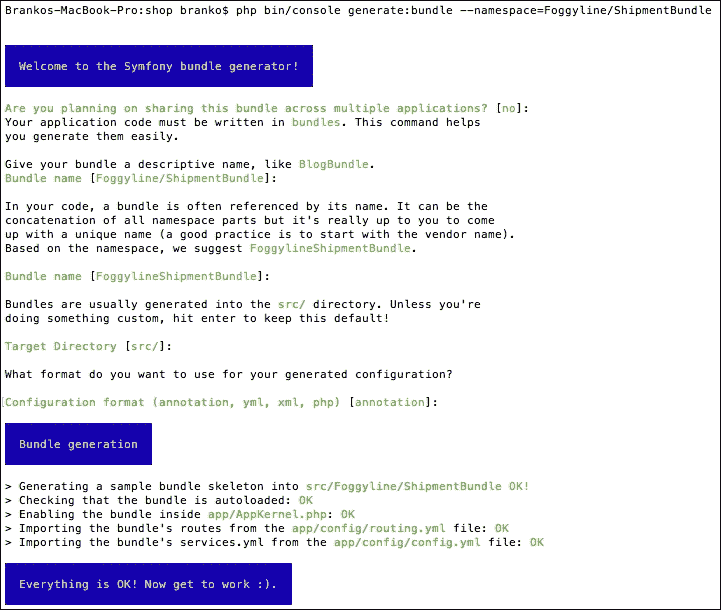

# 第 10 章，构建发货模块

发货模块与`payment`模块一起，为我们网店的进一步销售功能提供了基础。当我们到达即将到来的`sales`模块的结账流程时，它将使我们能够选择发货方式。与`payment`类似，`shipment`可以是静态的，也可以是动态的。静态可能意味着一个固定的定价值，甚至是通过一些简单条件计算出的定价值，而动态通常意味着与外部 API 服务的连接。

在本章中，我们将接触这两种类型的基础，并了解如何建立实现`shipment`模块的基本结构。

在本章中，我们将介绍`shipment`模块的以下主题：

*   要求
*   依赖关系
*   实施
*   单元测试
*   功能测试

# 要求

[第 4 章](04.html "Chapter 4. Requirement Specification for a Modular Web Shop App")、*模块化网店 App*需求规范中定义的应用需求，并未给出我们需要实施哪种类型的发货的任何细节。因此，在本章中，我们将开发两种装运方法：动态费率装运和固定费率装运。动态费率装运用作将装运方法连接到实际装运处理器（如 UPS、FedEx 等）的一种方式。但是，它实际上不会连接到任何外部 API。

理想情况下，我们希望通过类似于以下内容的接口完成此操作：

```php
namespace Foggyline\SalesBundle\Interface;

interface Shipment
{
  function getInfo($street, $city, $country, $postcode, $amount, $qty);
  function process($street, $city, $country, $postcode, $amount, $qty);
}
```

然后可以使用`getInfo`方法获取给定订单信息的可用交付选项，而处理方法随后将处理所选交付选项。例如，在动态费率装运方法下，我们可能会使用 API 返回“当天交付（$9.99）”、=和“标准交付（$4.99）”作为交付选项。

有了这样一个装运接口，就需要有`SalesBundle`模块，而我们还没有开发。因此，我们将继续使用我们的装运方法，使用 Symfony 控制器处理过程方法，使用服务处理`getInfo`方法。

类似地，正如我们在上一章中对付款方法所做的那样，我们将通过标记的 Symfony 服务公开我们的`getInfo`方法。我们将用于装运方式的标签为`shipment_method`。稍后，在签出过程中，`SalesBundle`模块将获取所有标记为`shipment_method`的服务，并在内部使用它们来列出可用的装运方法。

# 依赖关系

我们正在相反方向构建模块。也就是说，我们在了解`SalesBundle`模块之前就开始构建它，这是唯一一个使用它的模块。考虑到这一点，`shipment`模块对任何其他模块都没有牢固的依赖关系。然而，首先构建`SalesBundle`模块，然后公开`shipment`模块可能使用的几个接口可能会更方便。

# 实施

我们将首先创建一个名为`Foggyline\ShipmentBundle`的新模块。我们将在控制台的帮助下运行以下命令：

```php
php bin/console generate:bundle --namespace=Foggyline/ShipmentBundle

```

该命令触发了一个交互过程，该过程向我们提出了几个问题，如下所示：



完成后，将自动修改文件`app/AppKernel.php`和`app/config/routing.yml`。`AppKernel`类的`registerBundles`方法已添加到`$bundles`数组下的以下行：

```php
new Foggyline\PaymentBundle\FoggylineShipmentBundle(),
```

`routing.yml`文件已更新为以下条目：

```php
foggyline_payment:
  resource: "@FoggylineShipmentBundle/Resources/config/routing.xml"
  prefix:   /
```

为了避免与核心应用程序代码冲突，我们需要将`prefix: /`更改为`prefix: /shipment/`。

## 创建统一费率发货服务

统一费率装运服务将提供`sales`模块将用于其检验过程的固定装运方法。它的作用是提供装运方法标签、代码、交付选项和处理 URL。

我们首先在`src/Foggyline/ShipmentBundle/Resources/config/services.xml`文件的 services 元素下定义以下服务：

```php
<service id="foggyline_shipment.dynamicrate_shipment"class="Foggyline\ShipmentBundle\Service\DynamicRateShipment">
  <argument type="service" id="router"/>
  <tag name="shipment_method"/>
</service>
```

此`service`只接受一个参数：`router`。`tagname`值被设置为`shipment_method`，因为我们的`SalesBundle`模块将根据分配给服务的`shipment_method`标签寻找装运方法。

我们现在将在`src/Foggyline/ShipmentBundle/Service/FlatRateShipment.php`文件中创建实际的`service`类，如下所示：

```php
namespace Foggyline\ShipmentBundle\Service;
class FlatRateShipment
{
  private $router;

  public function __construct(
    \Symfony\Bundle\FrameworkBundle\Routing\Router $router
  )
  {
    $this->router = $router;
  }

  public function getInfo($street, $city, $country, $postcode, $amount, $qty)
  {
    return array(
      'shipment' => array(
        'title' =>'Foggyline FlatRate Shipment',
        'code' =>'flat_rate',
        'delivery_options' => array(
        'title' =>'Fixed',
        'code' =>'fixed',
        'price' => 9.99
      ),
      'url_process' => $this->router->generate('foggyline_shipment_flat_rate_process'),
    )
  ;
  }
}
```

`getInfo`方法将为我们未来的`SalesBundle`模块提供必要的信息，以便它构建检验过程的`shipment`步骤。它接受一系列参数：`$street`、`$city`、`$country`、`$postcode`、`$amount`和`$qty`。我们可以认为这些是统一装运接口的一部分。`delivery_options`在本例中，返回单个固定值。`url_process`是我们将插入所选装运方式的 URL。我们未来的`SalesBundle`模块将只在这个 URL 上做一个 AJAX 帖子，期望 JSON 响应是成功还是错误，这与我们想象的支付方式非常相似。

## 创建统一费率发货控制器和路线

我们通过向`src/Foggyline/ShipmentBundle/Resources/config/routing.xml`文件添加以下路由定义来编辑`src/Foggyline/ShipmentBundle/Resources/config/routing.xml`文件：

```php
<route id="foggyline_shipment_flat_rate_process"path="/flat_rate/process">
  <default key="_controller">FoggylineShipmentBundle:FlatRate:process
  </default>
</route>
```

然后我们创建一个`src/Foggyline/ShipmentBundle/Controller/FlatRateController.php`。文件内容如下：

```php
namespace Foggyline\ShipmentBundle\Controller;

use Symfony\Component\HttpFoundation\JsonResponse;
use Symfony\Component\HttpFoundation\Request;
use Symfony\Bundle\FrameworkBundle\Controller\Controller;

class FlatRateController extends Controller
{
  public function processAction(Request $request)
  {
    // Simulating some transaction id, if any
    $transaction = md5(time() . uniqid());

    return new JsonResponse(array(
      'success' => $transaction
    ));
  }
}
```

我们现在应该能够访问 URL，如`/app_dev.php/shipment/flat_rate/process`，并查看`processAction`的输出。这里给出的实现是虚拟的。我们需要知道的是，`sales`模块将在其签出过程中，通过`shipment_method`标记服务的`getInfo`方法提供任何可能的`delivery_options`。也就是说，结帐过程应该显示固定费率装运作为一个选项。签出的行为将被编码，这样，如果未选择`shipment`方法，它将阻止签出过程进一步进行。当我们进入`SalesBundle`模块时，我们将进一步讨论这个问题。

## 创建动态费率支付服务

除了固定费率装运方法之外，让我们继续定义另一种动态装运，称为动态费率。

我们首先在`src/Foggyline/ShipmentBundle/Resources/config/services.xml`文件的`services`元素下定义以下服务：

```php
<service id="foggyline_shipment.dynamicrate_shipment"class="Foggyline\ShipmentBundle\Service\DynamicRateShipment">
  <argument type="service" id="router"/>
  <tag name="shipment_method"/>
</service>
```

这里定义的`service`只接受一个`router`参数。`tag name`属性与统一费率装运服务相同。

然后我们将创建`src/Foggyline/ShipmentBundle/Service/DynamicRateShipment.php`文件，内容如下：

```php
namespace Foggyline\ShipmentBundle\Service;

class DynamicRateShipment
{
  private $router;

  public function __construct(
    \Symfony\Bundle\FrameworkBundle\Routing\Router $router
  )
  {
    $this->router = $router;
  }

  public function getInfo($street, $city, $country, $postcode, $amount, $qty)
  {
    return array(
      'shipment' => array(
        'title' =>'Foggyline DynamicRate Shipment',
        'code' =>'dynamic_rate_shipment',
        'delivery_options' => $this->getDeliveryOptions($street, $city, $country, $postcode, $amount, $qty),
        'url_process' => $this->router->generate('foggyline_shipment_dynamic_rate_process'),
      )
    );
  }

  public function getDeliveryOptions($street, $city, $country, $postcode, $amount, $qty)
  {
    // Imagine we are hitting the API with: $street, $city, $country, $postcode, $amount, $qty
    return array(
      array(
        'title' =>'Same day delivery',
        'code' =>'dynamic_rate_sdd',
        'price' => 9.99
      ),
      array(
        'title' =>'Standard delivery',
        'code' =>'dynamic_rate_sd',
        'price' => 4.99
      ),
    );
  }
}
```

与固定费率装运不同，`getInfo`方法的`delivery_options`键由`getDeliveryOptions`方法的响应构成。该方法是服务内部的，不被认为是公开的，也不被看作是接口的一部分。我们可以很容易地想象在其中进行一些 API 调用，以便为我们的动态装运方法获取计算出的费率。

## 创建动态费率发货控制器和路线

一旦动态费率装运服务到位，我们可以继续为其创建必要的路线。我们将首先在`src/Foggyline/ShipmentBundle/Resources/config/routing.xml`文件中添加以下路由定义：

```php
<route id="foggyline_shipment_dynamic_rate_process" path="/dynamic_rate/process">
  <default key="_controller">FoggylineShipmentBundle:DynamicRate:process
  </default>
</route>
```

然后我们将创建`src/Foggyline/ShipmentBundle/Controller/DynamicRateController.php`文件，内容如下：

```php
namespace Foggyline\ShipmentBundle\Controller;

use Foggyline\ShipmentBundle\Entity\DynamicRate;
use Symfony\Component\HttpFoundation\JsonResponse;
use Symfony\Component\HttpFoundation\Request;
use Symfony\Bundle\FrameworkBundle\Controller\Controller;
use Symfony\Component\Form\Extension\Core\Type\ChoiceType;

class DynamicRateController extends Controller
{
  public function processAction(Request $request)
  {
    // Just a dummy string, simulating some transaction id
    $transaction = md5(time() . uniqid());

    if ($transaction) {
      return new JsonResponse(array(
'success' => $transaction
      ));
    }

    return new JsonResponse(array(
      'error' =>'Error occurred while processing DynamicRate shipment.'
    ));
  }
}
```

与统一费率装运类似，这里我们添加了一个简单的流程和方法的虚拟实现。传入的`$request`应该包含与服务`getInfo`方法相同的信息，也就是说，它应该有以下可用参数：`$street`、`$city`、`$country`、`$postcode`、`$amount`和`$qty`。方法响应稍后将反馈到`SalesBundle`模块。我们可以很容易地从这些方法中实现更健壮的功能，但这超出了本章的范围。

# 单元测试

`FoggylineShipmentBundle`模块非常简单。通过只提供两个简单的服务和两个简单的控制器，它很容易测试。

首先，我们将在`phpunit.xml.dist`文件的`testsuites`元素下添加以下行：

```php
<directory>src/Foggyline/ShipmentBundle/Tests</directory>
```

在这个位置上，从我们商店的根目录运行`phpunit`命令应该可以获取我们在`src/Foggyline/ShipmentBundle/Tests/`目录下定义的任何测试。

现在，让我们继续为我们的`FlatRateShipment`服务创建一个测试。我们将创建一个`src/Foggyline/ShipmentBundle/Tests/Service/FlatRateShipmentTest.php`文件，内容如下：

```php
namespace Foggyline\ShipmentBundle\Tests\Service;

use Symfony\Bundle\FrameworkBundle\Test\KernelTestCase;

class FlatRateShipmentTest extends KernelTestCase
{
  private $container;
  private $router;

  private $street = 'Masonic Hill Road';
  private $city = 'Little Rock';
  private $country = 'US';
  private $postcode = 'AR 72201';
  private $amount = 199.99;
  private $qty = 7;

  public function setUp()
  {
    static::bootKernel();
    $this->container = static::$kernel->getContainer();
    $this->router = $this->container->get('router');
  }

  public function testGetInfoViaService()
  {
    $shipment = $this->container->get('foggyline_shipment.flat_rate');

    $info = $shipment->getInfo(
      $this->street, $this->city, $this->country, $this->postcode, $this->amount, $this->qty
    );

    $this->validateGetInfoResponse($info);
  }

  public function testGetInfoViaClass()
  {
    $shipment = new \Foggyline\ShipmentBundle\Service\FlatRateShipment($this->router);

    $info = $shipment->getInfo(
      $this->street, $this->city, $this->country, $this->postcode, $this->amount, $this->qty
    );

    $this->validateGetInfoResponse($info);
  }

  public function validateGetInfoResponse($info)
  {
    $this->assertNotEmpty($info);
    $this->assertNotEmpty($info['shipment']['title']);
    $this->assertNotEmpty($info['shipment']['code']);
    $this->assertNotEmpty($info['shipment']['delivery_options']);
    $this->assertNotEmpty($info['shipment']['url_process']);
  }
}
```

这里正在运行两个简单的测试。一个检查是否可以通过容器实例化服务，另一个检查是否可以直接实例化服务。一旦实例化，我们只需调用服务的`getInfo`方法，向其传递一个虚拟地址和订单信息。虽然我们实际上没有在`getInfo`方法中使用这些数据，但我们需要通过一些测试，否则测试将失败。该方法预计将返回一个响应，该响应包含装运密钥下的多个密钥，最显著的是`title`、`code`、`delivery_options`和`url_process`。

现在，让我们继续为我们的`DynamicRateShipment`服务创建一个测试。我们将创建一个`src/Foggyline/ShipmentBundle/Tests/Service/DynamicRateShipmentTest.php`文件，内容如下：

```php
namespace Foggyline\ShipmentBundle\Tests\Service;

use Symfony\Bundle\FrameworkBundle\Test\KernelTestCase;
class DynamicRateShipmentTest extends KernelTestCase
{
  private $container;
  private $router;

  private $street = 'Masonic Hill Road';
  private $city = 'Little Rock';
  private $country = 'US';
  private $postcode = 'AR 72201';
  private $amount = 199.99;
  private $qty = 7;

  public function setUp()
  {
    static::bootKernel();
    $this->container = static::$kernel->getContainer();
    $this->router = $this->container->get('router');
  }

  public function testGetInfoViaService()
  {
    $shipment = $this->container->get('foggyline_shipment.dynamicrate_shipment');
    $info = $shipment->getInfo(
      $this->street, $this->city, $this->country, $this->postcode, $this->amount, $this->qty
    );
    $this->validateGetInfoResponse($info);
  }

  public function testGetInfoViaClass()
  {
    $shipment = new \Foggyline\ShipmentBundle\Service\DynamicRateShipment($this->router);
    $info = $shipment->getInfo(
      $this->street, $this->city, $this->country, $this->postcode, $this->amount, $this->qty
    );

    $this->validateGetInfoResponse($info);
  }

  public function validateGetInfoResponse($info)
  {
    $this->assertNotEmpty($info);
    $this->assertNotEmpty($info['shipment']['title']);
    $this->assertNotEmpty($info['shipment']['code']);

    // Could happen that dynamic rate has none?!
    //$this->assertNotEmpty($info['shipment']['delivery_options']);

    $this->assertNotEmpty($info['shipment']['url_process']);
  }
}
```

此测试与`FlatRateShipment`服务的测试几乎相同。这里，我们还有两个简单的测试：一个通过容器获取支付方法，另一个直接通过类获取。区别在于我们不再断言`delivery_options`的存在不是空的。这是因为根据给定的地址和订单信息，真实的 API 请求可能不会返回任何交付选项。

# 功能测试

我们的整个模块只有两个控制器类，我们想测试它们的响应。我们希望确保`FlatRateController`和`DynamicRateController`类的处理方法是可访问的，并且能够正常工作。

我们先创建一个`src/Foggyline/ShipmentBundle/Tests/Controller/FlatRateControllerTest.php`文件，内容如下：

```php
namespace Foggyline\ShipmentBundle\Tests\Controller;

use Symfony\Bundle\FrameworkBundle\Test\WebTestCase;
class FlatRateControllerTest extends WebTestCase
{
  private $client;
  private $router;

  public function setUp()
  {
    $this->client = static::createClient();
    $this->router = $this->client->getContainer()->get('router');
  }

  public function testProcessAction()
  {
    $this->client->request('GET', $this->router->generate('foggyline_shipment_flat_rate_process'));
    $this->assertSame(200, $this->client->getResponse()->getStatusCode());
    $this->assertSame('application/json', $this->client->getResponse()->headers->get('Content-Type'));
    $this->assertContains('success', $this->client->getResponse()->getContent());
    $this->assertNotEmpty($this->client->getResponse()->getContent());
  }
}
```

然后我们将创建一个`src/Foggyline/ShipmentBundle/Tests/Controller/DynamicRateControllerTest.php`文件，内容如下：

```php
namespace Foggyline\ShipmentBundle\Tests\Controller;

use Symfony\Bundle\FrameworkBundle\Test\WebTestCase;

class DynamicRateControllerTest extends WebTestCase
{
  private $client;
  private $router;

  public function setUp()
  {
    $this->client = static::createClient();
    $this->router = $this->client->getContainer()->get('router');
  }

  public function testProcessAction()
  {
    $this->client->request('GET', $this->router->generate('foggyline_shipment_dynamic_rate_process'));
    $this->assertSame(200, $this->client->getResponse()->getStatusCode());
    $this->assertSame('application/json', $this->client->getResponse()->headers->get('Content-Type'));
    $this->assertContains('success', $this->client->getResponse()->getContent());
    $this->assertNotEmpty($this->client->getResponse()->getContent());
  }
}
```

两项测试几乎完全相同。它们包含对单个进程操作方法的测试。正如现在编码的那样，控制器进程操作只返回一个固定的成功 JSON 响应。我们可以很容易地扩展它，使其返回的不仅仅是一个固定的响应，还可以通过更健壮的功能测试来伴随该更改。

# 总结

在本章中，我们构建了一个具有两种装运方法的`shipment`模块。每种装运方式都提供了可用的交付选项。固定费率装运方法在其交付选项下只有一个固定值，而动态费率方法从`getDeliveryOptions`方法获取其值。我们可以很容易地嵌入一个真正的运输 API 作为`getDeliveryOptions`的一部分，以提供真正的动态运输选项。

显然，我们在这里缺少官方接口，就像我们在支付方式上做的那样。然而，当我们最终确定`final`模块时，我们总是可以在应用程序中回顾并重构这一点。

与付款方式类似，这里的想法是创建一个最小的结构，展示如何开发一个简单的装运模块以进行进一步定制。使用`shipment_methodservice`标签，我们有效地公开了未来`sales`模块的装运方法。

接下来，在下一章中，我们将构建一个`sales`模块，它将最终使用我们的`payment`和`shipment`模块。