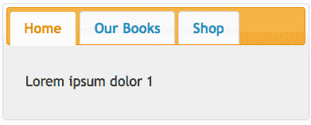
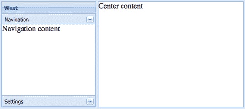
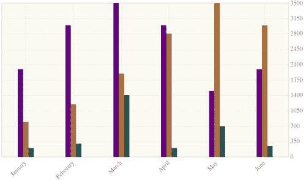
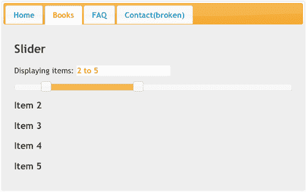
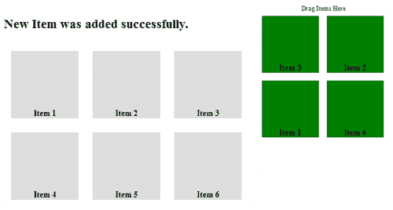

# 第 1 章 Ajax 库

在本章中，我们将介绍：

*   使用 jQuery 设计简单导航
*   创建选项卡导航
*   使用 extjs 设计组件
*   MochiKit 中的事件处理
*   使用 Dojo 构建选项卡导航
*   使用 YUI 库构建图表应用程序
*   使用 jQuery 滑块加载动态内容
*   使用 MooTools 创建 Ajax 购物车
*   使用 prototype.js 构建 Ajax 登录表单

在本章中，我们将学习如何使用最著名的 JavaScript 库和具有 Ajax 功能的框架。这些库是根据我们的主观意见选择的，我们不想说哪个库/框架更好或更差。它们各有优缺点。

# 使用 jQuery 设计简单导航

**jQuery**是一个开发框架，允许我们在 HTML 文档中使用 JavaScript。现在，我们将使用基本 jQuery 特性构建一个简单的导航。

## 准备好了吗

在开始之前，我们需要包括最新的 jQuery 库。我们可以从[www.jquery.com](http://www.jquery.com)的下载部分下载。我们将把它保存在名为 `js`的 JavaScript 文件夹中，位于 HTML 文档的根目录中，例如 `cookbook`。

本书中提到的所有库也可以在在线缓存中使用，如[http://code.google.com/apis/libraries/](http://code.google.com/apis/libraries) 。

### 注

您可以下载您从[账户购买的所有 Packt 书籍的示例代码 fleshttp://www.PacktPub.com](http://www.PacktPub.com) 。如果您在其他地方购买了本书，您可以访问[http://www.PacktPub.com/support](http://www.PacktPub.com/support) 并注册，让 fles 直接通过电子邮件发送给您。

## 怎么做。。。

现在，我们可以开始编写 `task1.html`页面了。我们将把它放在 `cookbook`文件夹中。

```php
<!doctype html>
<html>
<head>
<title>Example 1</title>
</head>
<body>
<ul id="navigation">
<li id="home"><a href="#">Home</a></li>
<li class="active"><a href="#">Our Books</a></li>
<li><a href="#">Shop</a></li>
<li><a href="#">Blog</a></li>
</ul>
<div id="placeHolder">
<!-- our content goes here -->
</div>
<script src=js/jquery.min.js></"></script>
<script>
$(document).ready(function(){
$('#navigation li a').each(function(){
var $item = $(this);
$item.bind('click',function(event){
event.preventDefault();
var title = $item.html();
var html = title + ' was selected.';
$('#placeHolder').html(html);
});
});
$.get('ajax/test.html', function(data) {
$('.result').html(data);
alert('Load was performed.');
});
});
</script>
</body>
</html>

```

## 它是如何工作的。。。

现在，让我们解释一下在前面的代码片段中我们做了什么。我们脚本的主要思想是找到文档中的每个超链接`<a>`，阻止其默认功能，并在 `placeHolder`中显示超链接内容。从一开始，我们就从 `doctype`和主要的 HTML 布局开始。页面主体包含用于动态内容的 `navigation`和 `placeholder`元素。

jQuery 功能最重要的部分是包含我们的 jQuery 库。让我们把它放在结束标记之前。这将允许首先加载页面的 HTML:

```php
<script src="js/jquery.min.js"></script>

```

加载 HTML 页面后，当文档准备就绪时，我们可以在 `$(document).ready()`函数中定义 JavaScripts:

```php
<script>
$(document).ready(function(){
alert("Hello jQuery!");
});
</script>

```

这也可以缩短为 `$():`

```php
<script>
$(function(){
alert("Hello jQuery!");
});
</script>

```

美元符号 `$()`表示 `jQuery()`工厂函数的别名。在这个函数中，我们可以使用所有 CSS 选择器，如 ID、类或确切的标记名。例如：

*   `$('a'):`选择我们文档中的所有超链接
*   `$('#myID'):`选择具有此 ID 的元素
*   `$('.myID'):`选择该类的所有元素

在我们的例子中，我们选择 `navigation <div>`中的所有超链接，并使用 `click`事件的事件处理程序定义它们自己的功能：

```php
$item.bind('click',function(event){
// prevent default functionality
event.preventDefault();
// here goes the rest
});

```

我们示例的最后一步是创建 `title`VAR 和 HTML 字符串，该字符串指向 `placeHolder:`

```php
var title = $(this).html();
var html = title + ' was selected.';
$('#placeHolder').html(html);

```

## 还有更多。。。

前面的例子非常简单。但是 jQuery 可以为我们提供更多。这包括特殊选择器、效果、DOM 操作或 Ajax 功能。

我们可以更精确地指定选择器。例如，我们可以根据超链接的 `href`属性指定哪些超链接应该受到影响：

```php
$('a[href^=mailto:]').addClass('mailto);
$('a[href$=.pdf]').addClass('pdf');
$('a[href^=http] [href*=milan]').addClass('milan');

```

jQuery 还涵盖所有可能的事件（`click`、 `blur, focus, dblclick`等）、视觉效果（`hide`、 `show, toggle, fadeIn, fadeOut`等）或 DOM 操作（`appendTo`、 `prependTo`等）。它有一整套 AJAX 功能，非常易于使用，例如：

```php
$.get('test.html', function(data) {
$('.result').html(data);
});

```

但我们将在以后的任务和章节中更好地了解更多 jQuery 特性。

## 另见

[第一章](1.html "Chapter 1. Ajax Libraries")*使用 jQuery 的 AJAX*

[第二章](2.html "Chapter 2. Basic Utilities")、*jQuery UI*

[第 3 章](3.html "Chapter 3. Useful Tools Using jQuery")，*使用 jQuery 创建选项卡导航的有用工具*

# 创建标签导航

**jQuery UI**是从 jQuery 的核心交互插件构建而成。作为一个高级框架，它使每个开发人员都可以轻松地创建效果和动画。现在，我们将使用 jqueryui 构建一个选项卡导航。

## 准备好了吗

首先，如果我们没有在前面的配方中使用 jQuery 库，那么我们需要包括来自[www.jQuery.com](http://www.jquery.com)的 jQuery 库。然后，我们可以从[www.jqueryui.com/download](http://www.jqueryui.com/download)下载 jQuery UI 库。在这个页面上，我们可以下载特定的模块或整个库。我们可以选择自己喜欢的主题，也可以使用高级主题设置创建自己的主题。现在，我们将选择整个具有 `ui-lightness`主题的图书馆。

## 怎么做。。。

1.  现在我们已经准备好编码了。让我们从 HTML 部分开始。本部分将定义一个具有三个标签和一个手风琴的 `navigation`元素。

    ```php
    <body>
    <div id="navigation">
    <ul>
    <li><a href="#tabs-1">Home</a></li>
    <li><a href="#tabs-2">Our Books</a></li>
    <li><a href="http://ajax/shop.html">Shop</a></li>
    </ul>
    <div id="tabs-1">
    <p>Lorem ipsum dolor 1</p>
    </div>
    <div id="tabs-2">
    <p>Lorem ipsum dolor 2</p>
    </div>
    </div>
    </body>

    ```

2.  当 HTML 准备好后，我们可以在`<head>`标记中继续使用 CSS 和 JavaScript CSS 样式，如下代码所示：

    ```php
    <head>
    <link href="css/ui-lightness/jquery-ui.custom.css"
    rel="stylesheet" />
    </head>

    ```

3.  我们将在关闭`<body>`标记

    ```php
    <script src="js/jquery.min.js"></script>
    <script src="js/jquery-ui.custom.min.js"></script>
    <script>
    $(document).ready(function(){
    $('#navigation').tabs();
    });
    </script>
    </body>

    ```

    之前添加 JavaScript
4.  Our result looks like the following:

    

## 它是如何工作的。。。

下载的 jQueryUI 包含所选主题的全部 CSS 内容（jQueryUI.custom.CSS）。我们需要做的就是将其包含在`<head>`标签中：

```php
...
<link href="css/ui-lightness/jquery-ui.custom.css"
rel="stylesheet" />

```

在 CSS 之后，我们包括 jQuery 和 jQuery UI 库：

```php
<script src="js/jquery.min.js"></script>
<script src="js/jquery-ui.custom.min.js"></script>

```

JavaScript 部分非常简单：

```php
$('#navigation').tabs();

```

重要的是要适合所需的 HTML 结构。每个超链接都以选定的`<div>`标记中的 HTML 内容为目标。为了在它们之间建立关系，我们将在每个超链接中使用 `#id`和所选`<div>`标记的 ID（例如， `tabs-1)`。

第三个选项卡中有一个异常，它通过 Ajax 加载请求的数据。在这种情况下，我们不定义任何目标区域，因为它将自动创建。如您所见，在 jQueryUI 中使用 Ajax 非常简单和舒适。

## 还有更多。。。

jQueryUI 为我们提供了很多选项。我们可以只使用前面代码片段中显示的默认功能或一些附加功能：

<colgroup><col style="text-align: left"> <col style="text-align: left"></colgroup> 
| 通过 Ajax 的内容： | `$( "#navigation" ).tabs({ajaxOptions: {} })`； |
| 鼠标悬停时打开： | `$( "#navigation" ).tabs({event: "mouseover"})`； |
| 折叠内容： | `$( "#navigation" ).tabs({collapsible: true})`； |
| 可排序： | `$( "navigation" ).tabs().find( ".ui-tabs-nav" ).sortable({ axis: "x" })`； |
| Cookie 持久性： | `$( "#navigation" ).tabs({cookie: { expires: 1 }})`； |

## 另见

[第 3 章](3.html "Chapter 3. Useful Tools Using jQuery")，*使用 jQuery 设计组件的有用工具*

# 使用 Ext JS 设计组件

**ExtJS**是一个 JavaScript 框架，提供了大量跨浏览器用户界面小部件。ExtJS 的核心是基于组件的设计，可以很容易地扩展以满足我们的需求。

## 准备好了吗

我们可以从[www.sencha.com](http://www.sencha.com)的 ExtJS 部分下载最新版本的 ExtJS 框架。现在，我们准备用两列和一个手风琴构建一个经典的 ExtJS 布局。我们还可以准备一个简单的 HTML 文件 `ajax/center-content.html`来测试 Ajax 功能：

```php
…
<body>
<p>Center content</p>
</body>
…

```

## 怎么做。。。

1.  首先，我们将包括像 CSS 和 ExtJS 库文件这样的强制文件。

    ```php
    <link rel="stylesheet" href="css/ext-all.css" />
    <script src="js/ext-base.js"></script>
    <script src="js/ext-all.js"></script>

    ```

2.  我们将继续使用 `onReady`函数，该函数将运行我们的脚本：

    ```php
    <script type="text/javascript">
    Ext.onReady(function(){
    var viewport = new Ext.Viewport({
    layout:'border',
    items:[{
    region:'west',
    id:'west-panel',
    title:'West',
    split:true,
    width: 200,
    layout:'accordion',
    items: [{
    html: 'Navigation content',
    title:'Navigation'
    },{
    title:'Settings',
    html: 'Settings content'
    }]
    },{
    region:'center',
    layout:'column',
    autoLoad:{
    url: 'ajax/center-content.html',
    method:'GET'
    }
    }]
    });
    });
    </script>

    ```

3.  Our layout with an accordion navigation is ready:

    

## 它是如何工作的。。。

ExtJS 是为开发人员构建的，目的是让他们的生活更轻松。正如您在源代码中看到的，我们使用一个简单的 JavaScript 对象构建了一个布局。我们有一个包含两个项目的“视口”。一个位于左侧（区域：**西）**，第二个位于右侧（区域：**东）**。在这种情况下，我们不必处理 CSS。ExtJS 通过 `width, margins, cmargins`等变量直接处理所有内容。 `layout`属性非常强大。**西侧**的内部布局与**导航**和**设置**一致。在中间的一栏中，我们可以看到使用 `autoLoad`方法通过 Ajax 加载的内容。

## 还有更多。。。

布局的可能选项有：绝对、锚定、卡片、列、拟合、表格、Vbox 和 Hbox。

# MochiKit 中的事件处理

本章中的下一个轻量级库是**MochiKit**。在本任务中，我们将构建一个脚本，用于列出 `onkeydown`和 `onkeypress`事件。在每个事件之后，我们将显示按下的键及其键代码和键字符串。

## 准备好了吗

所有强制性文件、文档和演示均可在[www.mochikit.com](http://www.mochikit.com)上获得。我们需要下载整个 MochiKit 库并将其保存在我们的 `js`文件夹中。小心， `MochiKit.js`只是包含 MochiKit 中所有必要子模块的主文件（例如， `base.js, signal.js, DOM.js`等等）。Ajax 请求的登录页将是 `ajax/actions.php:`

```php
<?php
if($_GET["action"] && $_GET["key"]) {
// our logic for processing given data
} else {
echo "No params provided";
}
?>

```

## 怎么做。。。

1.  让我们从 HTML 代码开始：

    ```php
    <table>
    <tr>
    <th>Event</th>
    <th>Key Code</th>
    <th>Key String</th>
    </tr>
    <tr>
    <td>onkeydown</td>
    <td id="onkeydown_code">-</td>
    <td id="onkeydown_string">-</td>
    </tr>
    <tr>
    <td>onkeypress</td>
    <td id="onkeypress_code">-</td>
    <td id="onkeypress_string">-</td>
    </tr>
    </table>

    ```

2.  包括 MochiKit 框架：

    ```php
    <script type="text/javascript" src="js/MochiKit/MochiKit.js"> </script>

    ```

3.  定义 JavaScript 功能：

    ```php
    <script>
    connect(document, 'onkeydown',
    function(e) {
    var key = e.key();
    replaceChildNodes('onkeydown_code', key.code);
    replaceChildNodes('onkeydown_string', key.string);
    doSimpleXMLHttpRequest("ajax/actions.php",
    { action: "keydown", key: key.code});
    });
    connect(document, 'onkeypress',
    function(e) {
    var key = e.key();
    replaceChildNodes('onkeypress_code', key.code);
    replaceChildNodes('onkeypress_string', key.string);
    doSimpleXMLHttpRequest("ajax/actions.php",
    { action: "keypress", key: key.code});
    });
    </script>

    ```

4.  Our result is:

    

## 它是如何工作的。。。

`connect()`函数将信号（Mochikit.signal API 参考）连接到插槽。在本例中，我们将文档连接到 `onkeydown`和 `onkeypress`处理程序以调用 `function(e)`。当 `key()`对象引用返回键代码和字符串时，参数 `e`表示我们的事件对象。

`replaceChildNodes(node[, childNode[,...]])`是 Mochikit.DOM API 引用的一个函数，它从给定的 DOM 元素中删除所有子元素，然后将给定的 `childNode`追加到该元素。

在每个 `onkeydown`和 `onkeypress`事件之后，我们使用 `doSimpleXMLHttpRequest()`函数发送一个 Ajax 调用。在我们的示例中，来自页面的请求类似于 `ajax/actions.php?action=onkeydown&key=87`。

## 还有更多。。。

通过 `disconnect()`或 `disconnectAll()`功能，可以断开任何已连接插槽的对象。如果我们只想使用 `connect()`一次，我们可以使用 `connectOnce()`函数，这将在触发信号处理程序后自动断开它的连接。

MochiKit 允许我们充分利用现有的浏览器生成的事件，但其中一些事件并不是所有浏览器都支持的。MochiKit 能够合成这些事件，包括 `onmouseenter, onmouseleave`和 `onmousewheel`。

# 使用 Dojo 构建选项卡导航

现在我们来看看 DojoJavaScript 库。我们将使用`Dojo Toolkit` （dojoToolKit）的基本功能构建一个简单的选项卡导航。

## 准备好了吗

我们需要包括来自 Google CDN（[等网站的 Dojo 工具包 http://ajax.googleapis.com/ajax/libs/dojo/1.5/dojo/dojo.xd.js](http://ajax.googleapis.com/ajax/libs/dojo/1.5/dojo/dojo.xd.js) 或 AOL CDN（[http://o.aolcdn.com/dojo/1.5/dojo/dojo.xd.js.](http://o.aolcdn.com/dojo/1.5/dojo/dojo.xd.js)

如果您想下载整个 Dojo SDK，请访问[www.dojotoolkit.org/download](http://www.dojotoolkit.org/download)。

Ajax 请求的登录页将为 `ajax/content1.html:`

```php
<body>
<h1>Operation completed.</h1>
</body>

```

## 怎么做。。。

1.  我们将包括来自 `claro`主题的样式（包括在我们文档

    ```php
    <link rel="stylesheet" type="text/css" href="http://js/dojoToolKit/dijit/themes/claro/claro.css" />

    ```

    的`<head>`标签中的 `dojoToolKit)`）
2.  我们将在文档正文中定义 HTML 代码：

    ```php
    <body class="claro">
    <div>
    <div dojoType="dijit.layout.TabContainer">
    <div dojoType="dijit.layout.ContentPane"
    title="Our first tab" selected="true">
    <div id="showMe">
    click here to see how it works
    </div>
    </div>
    <div dojoType="dijit.layout.ContentPane"
    title="Our second tab">
    Lorem ipsum - the second
    </div>
    <div dojoType="dijit.layout.ContentPane"
    title="Our last tab" closable="true">
    Lorem ipsum - the last...
    </div>
    </div>
    </div>
    </body>

    ```

3.  当 HTML 和 CSS 准备就绪时，我们将包括带有所需模块的 `DojoToolkit`：

    ```php
    <script type="text/javascript"
    src="js/dojoToolKit/dojo/dojo.js"
    djConfig="parseOnLoad: true"></script>
    <script type="text/javascript">
    dojo.require("dijit.layout.TabContainer");
    dojo.require("dijit.layout.ContentPane");
    </script>

    ```

4.  添加 JavaScript 功能会给我们带来以下内容：

    ```php
    <script type="text/javascript">
    dojo.addOnLoad(function() {
    if (document.pub) { document.pub(); }
    dojo.query("#showMe").onclick(function(e) {
    dojo.xhrGet({
    url: "ajax/content1.html",
    load: function(result) {
    alert("The loaded content is: " + result);
    }
    });
    var node = e.target;
    node.innerHTML = "wow, that was easy!";
    });
    });
    </script>

    ```

5.  When the preceding code snippet is ready and saved, our result will be a simple tab navigation with three tabs.

    

## 它是如何工作的。。。

正如您在源代码中看到的，我们使用的是 Dijit Dojo UI 组件系统。**Dijit**包含在 Dojo SDK 中，包括具有四个受支持主题的 UI 组件 `(nihilo soria, tundra,and claro)`。我们可以通过在`<body>`标记中选择一个类来设置要使用的主题。在前面的示例中，我们有 `class="claro`。

当我们包含 `dojoToolKit`脚本时，我们需要为 `djConfig`属性提供 `parseOnLoad:true`。否则，Dojo 将无法找到应该转换为 Dijit 小部件的页面元素。

当我们想要使用一个特定的小部件时，我们需要调用小部件所需的类（`dojo.require("dijit.layout.TabContainer")`，并提供它的 `dojoType`属性（`dojoType="dijit.layout.TabContainer"`。作为在 Dojo 中使用 Ajax 的一个示例，每次单击 `showMe`div.时，我们都使用 `dojo.xhrGet()`函数来获取 `ajax/content1.html`的内容

# 使用 YUI 库构建图表应用程序

在这个任务中，我们将使用由 Yahoo！绘制图表。

## 准备好了吗

YUI 库可在 Yahoo！上下载 s 开发者网站（[http://developer.yahoo.com/yui/3](http://developer.yahoo.com/yui/3) 。在我们将其保存到 `js`文件夹后，我们就可以开始编程了。

## 怎么做。。。

1.  我们必须首先在文档的`<head>`标记中包含 YUI 库，以及图表占位符

    ```php
    <script type="text/javascript" src="js/yui-min.js"></script>
    <style>
    #mychart {
    margin:10px;
    width:90%; max-width: 800px; height:400px;
    }
    </style>

    ```

    的样式
2.  我们将把我们的 HTML 放在`<body>`标记中，以标记我们的图表将被放置的位置：

    ```php
    <div id="mychart"></div>

    ```

3.  我们的 JavaScript 如下：

    ```php
    <script type="text/javascript">
    (function() {
    YUI().use('charts', function (Y){
    //dataProvider source
    var myDataValues = [
    {date:"January" , windows:2000, mac:800, linux:200},
    {date:"February", windows:3000, mac:1200, linux:300},
    {date:"March" , windows:3500, mac:1900, linux:1400},
    {date:"April" , windows:3000, mac:2800, linux:200},
    {date:"May" , windows:1500, mac:3500, linux:700},
    {date:"June" , windows:2000, mac:3000, linux:250}
    ];
    //Define our axes for the chart.
    var myAxes = {
    financials:{
    keys:["windows", "mac", "linux"],
    position:"right", type:"numeric"
    },
    dateRange:{
    keys:["date"],
    position:"bottom",type:"category"
    }
    };
    //instantiate the chart
    var myChart = new Y.Chart({
    type:"column", categoryKey:"date",
    dataProvider:myDataValues, axes:myAxes,
    horizontalGridlines: true,
    verticalGridlines: true,
    render:"#mychart"
    });
    });
    })();</script>

    ```

4.  The results after saving and opening our HTML document are as follows:

    

## 它是如何工作的。。。

YUI 图表在 `Chart`对象中定义。对于“documentready”函数，我们将使用 `(function(){...})()`语法。我们需要指定要使用 `YUI() 'charts'`。

主要部分是创建一个 `Y.Chart`对象。我们可以定义该图表的呈现方式、网格线的外观、在何处显示图表以及显示哪些数据。我们将使用 `myAxes`对象定义轴，该对象处理侧面的图例。我们的数据存储在 `myDataValues`对象中。

## 还有更多。。。

有许多可能性和方法来设计我们的图表。我们可以将图表拆分为最小的部分并设置每个属性。例如，标签或页边距的旋转：

```php
styles:{
label: {rotation:-45, margin:{top:5}}
}

```

YUI 还介绍了 Ajax 功能。下面是一个简单的 Ajax 调用的外观：

```php
<div id="content">
<p>Place for a replacing text</p>
</div>
<p><a href="http://ajax/content.html" onclick="return callAjax();">Call Ajax</a></p>
<script type="text/javascript">
//<![CDATA[
function callAjax(){
var sUrl = "http://ajax/content.html";
var callback = {
success: function(o) {
document.getElementById('content')
.innerHTML = o.responseText;
},
failure: function(o) {
alert("Request failed.");
}
}
var transaction = YAHOO.util.Connect
.asyncRequest('GET', sUrl, callback, null);
return false;
}
//]]>
</script>

```

我们创建了 `callAjax()`函数，通过点击 `Call Ajax`超链接触发。Ajax 调用由 `YAHOO.util.Connect.asyngRequest()`提供。我们使用 `success`方法定义了 HTTP 方法（GET）、请求的 URL `ajax/content.html`和 `callback`功能，该方法在 `'content' <div>`中显示响应文本。

# 使用 jQuery 滑块加载动态内容

在本任务中，我们将学习如何使用 jQuery 滑块动态加载页面内容。

## 准备好了吗

在这个任务中，我们还将使用 jQueryUI 库。我们可以包括[中的 jQuery UI 库 http://jqueryui.com/download](http://jqueryui.com/download) 或来自某个 CDN。然后我们将为我们的小项目创建一个文件夹，比如说 `packt1`。我们的 `packt1`文件夹中会有更多文件夹；这些是用于通过 Ajax 加载 HTML 文件的 `ajax`文件夹，用于样式的 CSS，以及用于 JavaScript 库的 `js`。

文件夹结构如下所示：

```php
Packt1/
ajax/
content1.html
content2.html
content3-broken.php
items.html
css/ - all stylesheets
js/
ui/ - all jQuery UI resources
jquery-1.4.4.js
index.html

```

## 怎么做。。。

既然一切都安排好了，我们准备开始了。

1.  我们将从基本的 HTML 布局和内容开始。这一部分已经包含了一个链接，指向 jQueryUI 库中提供的 CSS。我们可以将其保存为 `index.html:`

    ```php
    <!DOCTYPE html>
    <html lang="en">
    <head>
    <title>Ajax using jQuery</title>
    <link href="css/ui-lightness/jquery-ui.custom.css"
    rel="stylesheet" />
    </head>
    <body>
    <div class="demo">
    <div id="tabs">
    <ul>
    <li><a href="#tabs-1">Home</a></li>
    <li><a href="http://ajax/content1.html">Books</a></li>
    <li><a href="http://ajax/content2.html">FAQ</a></li>
    <li><a href="http://ajax/content3-broken.php">
    Contact(broken) </a>
    </li>
    </ul>
    <div id="tabs-1">
    This content is preloaded.
    </div>
    </div>
    </div>
    </body>
    </html>

    ```

2.  现在我们将添加 JavaScript 库及其功能：

    ```php
    <script src="js/jquery-1.4.4.js"></script>
    <script src="js/ui/jquery-ui.min.js"></script>
    <script>
    $(function() {
    $("#tabs").tabs({
    ajaxOptions: {
    success: function(){
    $("#slider").slider({
    range: true,
    min: 1,
    max: 10,
    values: [1,10],
    slide: function( event, ui ) {
    $("#amount").val(ui.values[0] + " to " +
    ui.values[1]);
    },
    change: function(event, ui) {
    var start = ui.values[0];
    var end = ui.values[1];
    $('#result').html('');
    for(var i = start; i <= end; i++){
    var $item = $('<h3></h3>');
    $item
    .load('ajax/items.html #item-'+i);
    .appendTo($('#result'));
    } }
    });
    },
    error: function(xhr, status, index, anchor) {
    $(anchor.hash).html(
    "Couldn't load this tab. We'll try to fix
    this as soon as possible. " +
    "If this wouldn't be a demo." );
    }
    }
    });
    });
    </script>

    ```

3.  Our `index.html` page is ready and we can create files that are going be loaded in our page via Ajax.

    第一个页面将是 ajax/content1.html。此页面将包含一个具有额外功能的滑块，稍后将对其进行描述。

    ```php
    <h2>Slider</h2>
    <p>
    <label for="amount">Displaying items:</label>
    <input type="text" id="amount" style="border:0;
    color:#f6931f; font-weight:bold;" value="none" />
    </p>
    <div id="slider"></div>
    <div id="result"></div>

    ```

4.  The second page will be `ajax/content2.html:`

    ```php
    <p><strong>This tab was loaded using ajax.</strong></p>
    <p>Lorem ipsum dolor sit amet, consectetur adipiscing elit. Aenean nec turpis justo, et facilisis ligula.</p>

    ```

    Ajax 文件夹中的最后一个文件是 items.html：

    ```php
    <div id="item-1">Item 1</div>
    <div id="item-2">Item 2</div>
    <div id="item-3">Item 3</div>
    <div id="item-4">Item 4</div>
    <div id="item-5">Item 5</div>
    <div id="item-6">Item 6</div>
    <div id="item-7">Item 7</div>
    <div id="item-8">Item 8</div>
    <div id="item-9">Item 9</div>
    <div id="item-10">Item 10</div>

    ```

5.  Now, as shown in the following screenshot, we have a multi-functional page with four tabs. Three of them are loaded via Ajax and one of them contains a slider. This slider has an extra functionality and every change loads a selected number of items.

    

## 它是如何工作的。。。

从一开始，我们就使用 jQueryUI 库从一个简单的选项卡布局开始，该布局包含四个选项卡。其中一个（#tabs-1）直接包含在 `index.html`文件中。jQuery UI 库允许我们定义 `ajaxOptions`，以便我们可以通过 Ajax 加载内容。我们找到所需内容的导航由每个超链接的 `href`属性进行引导。如果该目标不存在，则触发 `error`方法。

我们希望在第二个选项卡（名为**Books】**上有一个功能滑块。为了让它工作，我们不能在 `$(document).ready()`函数中初始化它，因为它的 HTML 内容尚未创建。只有在 `success`方法中需要时，我们才会添加滑块初始化。

每次更换滑块后，触发 `load()`功能。此函数通过 Ajax 加载给定目标的内容。在我们的例子中，我们使用一个更具体的选择器，该选择器具有对象的确切 ID，显示在结果框中。

## 还有更多。。。

在这个任务中，我们只使用了基本函数 `load()`，但是 jQuery 提供了更多的 Ajax 方法，如下表所示：

<colgroup><col style="text-align: left"> <col style="text-align: left"></colgroup> 
| `$.ajax` | 执行 Ajax 请求 |
| `jQuery.post()` | 使用 HTTP POST 请求从服务器加载数据 |
| `jQuery.get()` | 使用 HTTP GET 请求从服务器加载数据 |
| `jQuery.getJSON()` | 使用 HTTP GET 请求从服务器加载 JSON 数据 |
| `jQuery.getScript()` | 使用 HTTP GET 请求从服务器加载并执行 JavaScript 文件 |

## 另见

[第 3 章](3.html "Chapter 3. Useful Tools Using jQuery")，*使用 jQuery 的有用工具*

# 使用 MooTools 创建 Ajax 购物车

本任务将向我们展示如何将 Ajax 与 MooTools JavaScript 框架结合使用。我们将建立一个具有拖放功能的购物车。在每次向购物车添加新项目的 UI 解释之后，我们将向服务器发送 HTTP POST 请求。

## 准备好了吗

**MooTools**可在[下载 https://mootools.net/download](http://https://mootools.net/download) 或者在谷歌的 CDN 中。为了在服务器和客户端之间进行通信，我们将在 `ajax`文件夹中创建一个新文件，例如 `addItem.php:`

```php
<?php
if($_POST['type']=='Item'){
echo 'New Item was added successfuly.';
}
?>

```

在创建这个虚拟 PHP 文件之后，我们就可以开始这个任务的编程部分了。

## 怎么做。。。

1.  我们将像往常一样，从 HTML 布局开始，包括 MooTools 库：

    ```php
    <!doctype html>
    <html>
    <head>
    <title>Ajax Using MooTools</title>
    </head>
    <body>
    <div id="items">
    <div class="item">
    <span>Shirt 1</span>
    </div>
    <div class="item">
    <span>Shirt 2</span>
    </div>
    <div class="item">
    <span>Shirt 3</span>
    </div>
    <div class="item">
    <span>Shirt 4</span>
    </div>
    <div class="item">
    <span>Shirt 5</span>
    </div>
    <div class="item">
    <span>Shirt 6</span>
    </div>
    </div>
    <div id="cart">
    <div class="info">Drag Items Here</div>
    </div>
    <h3 id="result"></h3>
    <script src="js/mootools-core-1.3-full.js"></script>
    <script src="js/mootools-more-1.3-full.js"></script>
    <script src="js/mootools-art-0.87.js"></script>
    </body>
    </html>

    ```

2.  在这个任务中，我们必须提供自己的 CSS 样式：

    ```php
    <style>
    #items {
    float: left; border: 1px solid #F9F9F9; width: 525px;
    }
    item {
    background-color: #DDD;
    float: left;
    height: 100px;
    margin: 10px;
    width: 100px;
    position: relative;
    }
    item span {
    bottom: 0;
    left: 0;
    position: absolute;
    width: 100%;
    }
    #cart {
    border: 1px solid #F9F9F9;
    float: right;
    padding-bottom: 50px;
    width: 195px;
    }
    #cart .info {
    text-align: center;
    }
    #cart .item {
    background-color: green;
    border-width: 1px;
    cursor: default;
    height: 85px;
    margin: 5px;
    width: 85px;
    }
    </style>

    ```

3.  当 UI 的外观符合我们的期望时，我们可以启动 JavaScript:

    ```php
    <script>
    window.addEvent('domready', function(){
    $('.item').addEvent('mousedown', function(event){
    event.stop();
    var shirt = this;
    var clone = shirt.clone()
    .setStyles(shirt.getCoordinates())
    .setStyles({
    opacity: 0.6,
    position: 'absolute'
    })
    .inject(document.body);
    var drag = new Drag.Move(clone, {
    droppables: $('cart'),
    onDrop: function(dragging, cart){
    dragging.destroy();
    new Request.HTML({
    url: 'ajax/addItem.php',
    onRequest: function(){
    $('result').set('text', 'loading...');
    console.log('loading...');
    },
    onComplete: function(response){
    $('result').empty().adopt(response);
    console.log(response);
    }a
    }).post('type=shirt');
    if (cart != null){
    shirt.clone().inject(cart);
    cart.highlight('#7389AE', '#FFF');
    }
    },
    onCancel: function(dragging){
    dragging.destroy();
    }
    });
    drag.start(event);
    });
    });
    </script>

    ```

4.  Once we save our code, our shopping cart is ready. The result is as follows:

    

## 它是如何工作的。。。

`$(document).ready`函数通过将 `domready`事件绑定到 `window`对象来执行。对于每个项目，我们将添加一个 `mousedown`事件，该事件包含使用 `Drag`对象和 `clone()`函数在购物车中添加每个项目的整个过程。

为了与服务器通信，我们使用 `Request.HTML`方法，并使用 `post`变量 `type`通过 `HTTP post`方法发送。如果变量 `type`等于字符串 `shirt`，则表示购物车中添加了新项目，信息框结果更新为 `'New Item was added successfully'`。

## 还有更多。。。

`Class Request`表示主类，处理 `XMLHttpRequest:`

```php
var myRequest = new Request([options]);

```

上述模板的示例如下所示：

```php
var request = new Request({
url: 'sample.php', data: { sample: 'sample1'},
onComplete: function(text, xml){
$('result').set('text ', text);
}

```

在 MooTools 库的核心， `Request`类被扩展为 `Request.HTML`和 `Request.JSON`。

`Request.HTML`是一个扩展的 `Request`类，专门用于接收 HTML 数据：

```php
new Request.HTML({
url: 'sample.php',
onRequest: function(){
console.log('loading...');
},
onComplete: function(response){
$('result').empty().adopt(response);
}
}).post('id=242');

```

我们可以使用 `post`或 `get`方法：

```php
new Request.HTML([options]).get({'id': 242});

```

作为客户端和服务器之间最有效的通信实践，我们可以使用 `Request.JSON`接收和传输 `JSON`格式的 JavaScript 对象。

```php
var jsonRequest = new Request.JSON({
url: 'sample.php', onSuccess: function(author){
alert(author.firstname); // "Milan".
alert(author.lastname); // "Sedliak"
alert(author.company); // "Skype"
}}).get({bookTitle: 'PHP Ajax CookBook', 'bookID': 654});

```

# 使用 prototype.js 构建 Ajax 登录表单

本章最后一个 JavaScript 框架是 `prototype.js`。在本任务中，我们将使用 Ajax 功能制作一个简单的登录表单。我们将了解使用 Ajax 的 `prototype.js`最常用的实践。

## 准备好了吗

我们可以从[下载 `prototype.js`http://www.prototypejs.org/download](http://www.prototypejs.org/download) 。然后，将其保存在 `js`文件夹中。要完成此任务，我们需要运行 Apache 服务器。

## 怎么做。。。

1.  First, let's create our dummy `.php` file, `login.php:`

    ```php
    <?php
    if($_POST['username']==$_POST['password']){
    echo 'proceed';
    }
    ?>

    ```

    然后，我们可以继续我们的 HTML 布局。

    ```php
    <!DOCTYPE html>
    <html>
    <head>
    </head>
    <body>
    <form id="loginForm">
    <label for="username">Username: </label>
    <input type="text" id="username" name="username" />
    <br />
    <label for="password">Password:</label>
    <input type="password" id="password" name="password"/>
    <br /><br />
    <input type="submit" value="Sign In" id="submit" />
    </form>
    </body>
    </html>

    ```

2.  设置 HTML 后，我们将定义 JavaScript:

    ```php
    <script src="js/prototype.js"></script>
    <script>
    $('submit').observe('click', login);
    function login(e) {
    Event.stop(e);
    var url = "ajax/login.php";
    new Ajax.Request(url, {
    method: 'post',
    parameters: {
    username: document.getElementById('username').value,
    password: document.getElementById('password').value
    },
    onSuccess: process,
    onFailure: function() {
    alert("There was an error with the connection");
    }
    });
    }
    function process(transport) {
    var response = transport.responseText;
    if(response == 'proceed'){
    $('loginForm').hide();
    var my_div = document.createElement('div');
    my_div.appendChild(document.createTextNode("You are logged in!"));
    document.body.appendChild(my_div);
    }
    else
    alert("Sorry, your username and password don't match.");
    }
    </script>

    ```

### 它是如何工作的。。。

正如您在源代码中看到的，我们在 ID 为 `submit`的按钮元素上 `observe`了一个新的 `click`事件，这是我们登录表单中的 `submit`按钮。 `login()`功能由 `click`事件触发。 `submit`按钮的默认行为被 `Event.stop(event)`替换，因此触发 HTTP 请求被禁用。而是创建了一个 Ajax 请求。 `Ajax.Request`是 `prototype.js`中使用 Ajax 的基本类。我们使用的 `post`方法有两个参数（用户名和密码）。如果请求成功并且来自 `login.php`的响应文本为 `proceed`，则我们已成功登录。

### 还有更多。。。

`prototype.js`将 `Ajax.Request`对象扩展到更多对象，如下所述：

*   Ajax.Updater:

    Updater 是`Ajax.Request` 对象的扩展，它执行 Ajax 请求并根据响应文本更新容器：

    ```php
    <div id="container">Send the request</div>
    <script>
    $('submit').observe('click', login);
    function login(){
    new Ajax.Updater(
    'saladContainer', 'login.php', { method: 'post' }
    );
    })
    </script>

    ```

*   **Ajax.PeriodicalUpdater:**

    如果我们需要定期更新内容，我们可以使用定期更新程序：

    ```php
    new Ajax.PeriodicalUpdater('items', '/items', {
    method: 'get', frequency: 3, decay: 2
    });

    ```

    频率表示更新内容的周期（以秒为单位）。在前面的代码片段中，我们的内容将每 3 秒更新一次。

*   **Ajax.Responders:**

    `Ajax.Responders`表示监控页面上所有 Ajax 活动的全局侦听器的存储库：

    ```php
    Ajax.Responders.register(responder)
    Ajax.Responders.unregister(responder)

    ```

    通过响应器，我们可以轻松跟踪页面上有多少 Ajax 请求处于活动状态。

    ```php
    Ajax.Responders.register({
    onCreate: function() {
    Ajax.activeRequestCount++;
    },
    onComplete: function() {
    Ajax.activeRequestCount--;
    }
    });

    ```