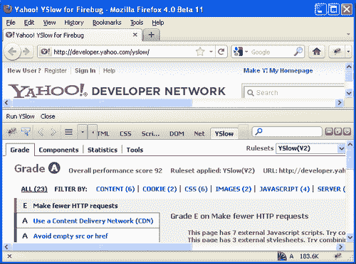
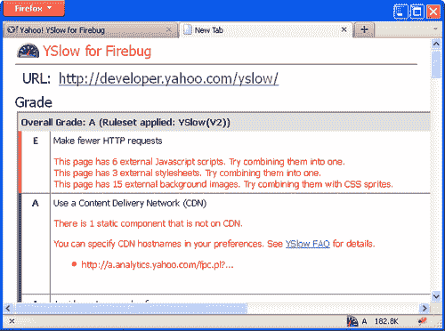
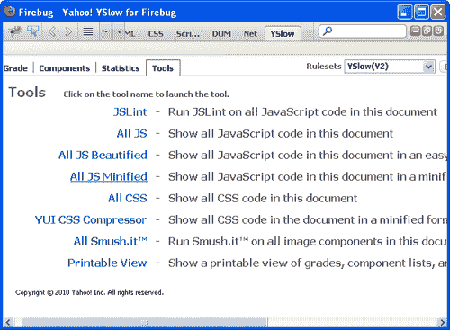
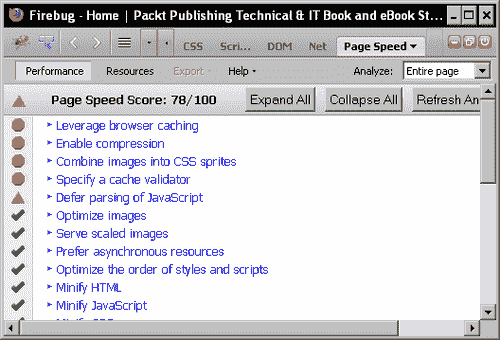

# 第六章优化

在本章中，我们将介绍以下主题：

*   对象缓存
*   使用 YSlow 获取优化提示
*   通过自动压缩和浏览器缓存加速 JavaScript 交付
*   在 DOM 加载时提前/提前触发 JavaScript
*   延迟加载图像
*   通过 Apache 模块/Google mod_pagespeed 自动优化 Ajax 应用程序

作为 JavaScript 开发人员，我们经常面临页面加载速度慢、页面响应差、浏览器窗口冻结等性能问题。大多数情况下，所有这些都是由于脚本或我们采取的方法/算法中的瓶颈造成的。在本章中，让我们讨论解决这些问题的可能方法。

# 对象缓存

由于 JavaScript 代码必须在客户机上运行，因此代码级优化非常重要。其中最重要的是计算和对象的缓存或缓冲。这种基本的优化常常被忽视。

## 准备好了吗

我们需要识别重复的函数调用以缓存结果；这将加快代码的性能。

## 怎么做。。。

```php
var a = Math.sqrt(10);
var b = Math.sqrt(10);

```

在这里，在这种情况下，我们重复计算相同的 `sqrt(10)`并将其存储在不同的变量中。这太过分了；如你所知，可以这样写：

```php
var sqrt_10 = Math.sqrt(10);
var a = sqrt_10, b = sqrt_10;

```

类似地，特别是在基于选择器的框架中，建议缓存或缓冲选择器对象。例如，考虑下面的 HTML 标记：

```php
<a href="#" id="trigger">Trigger</a>
<div id="container">
Container
</div>

```

以下是最初隐藏容器的 jQuery 代码；单击触发器链接时，将显示容器，如下所示：

```php
$('#trigger').click(function(){
});

```

## 它是如何工作的。。。

正如您在前面的代码片段中所看到的，我们已经使用了 `$('#container')`两次；这意味着我们为了同样的目的运行了两次 `$()`。如果你看一下 jQuery 代码， `$()`调用还有其他函数，这最终是一种过度使用。因此，建议将 `$('#container')`缓存到另一个变量，并按如下方式使用：

```php
var $container = $('#container'); // cache the object
$container.hide();
$('#trigger').click(function(){
$container.show();
});

```

在某些情况下，缓存对象（如前面的代码片段所示）可能会将页面响应能力提高一倍。当缓存应用于缓慢/复杂的选择器（如 `$('div p a')`）时，很容易感觉到速度的提高。

# 使用 YSlow 获取优化提示

当我们遇到性能问题时，我们需要知道该怎么做。**YSlow**，来自雅虎！，是一种速度诊断工具，可根据各种因素快速列出建议。

## 准备好了吗

我们需要安装 Firebug 插件的 Firefox 浏览器。YSlow 是 Firebug 的一个附加组件，需要安装它才能获得优化提示。安装后，它会在 Firebug 中添加另一个选项卡，如以下屏幕截图所示：



## 怎么做。。。

在任何页面上执行时，YSlow 都会给出一个特定于页面的报告，其中包含优化提示。它还与一些优化工具捆绑在一起，帮助我们快速解决性能问题。由于它是一个基于浏览器的工具，它不能对服务器端代码提出建议，只能建议服务器设置，如 `gzip`和 `expire`头。

安装 YSlow 时，最好关闭其自动运行模式。否则，它将对每个页面执行，这将降低其他页面的浏览体验。

以下是在[上执行报告时的示例屏幕截图 http://developer.yahoo.com/yslow/:](http://    http://developer.yahoo.com/yslow/:)



该报告基于以下 22 条规则：

1.  Minimize HTTP Requests:

    当页面有大量样式表和 JavaScript 引用时，其加载时间将受到影响。每个文件都需要单独下载。这里的解决方案是将所有 JavaScript 代码合并到一个文件中，并将所有样式表合并到一个文件中。对于大量的 CSS 背景图像，我们可以使用一种称为 CSS Sprites 的技术。这样，我们可以最小化 HTTP 请求。YSlow 帮助我们识别大量此类 HTTP 请求，并为我们提供建议。

    ### 注

    **CSS sprite**-是一种技术，通过调整 CSS 样式属性以使用相同的*sprite*图像，我们可以从多个 CSS 背景图像中形成一个名为*sprite*的 CSS 背景图像。我们通过 `background-position`属性引用 `sprite`中的每个图像。

2.  Use a Content Delivery Network:

    **内容交付网络（CDN）**是一个第三方托管解决方案，用于服务静态内容和图像，其交付速度将高于正常的服务器设置，因为它是在云上运行的。YSlow 识别 CDN 的使用情况，如果我们没有使用任何 CDN，它建议我们使用 CDN 以获得更好的性能。

3.  Add an `Expires` or a `Cache-Control` header:

    如果我们在浏览器中缓存静态内容，它将提高加载速度，因为这些内容不必再次下载。我们必须确保不对动态内容应用浏览器缓存。当我们有单个 JavaScript 和单个 CSS 文件时，为了避免 HTTP 请求，我们至少可以在浏览器级别缓存它们。为此，我们可以使用`Expires`或`Cache-Control` HTTP 头。YSlow 识别 HTTP 头并建议我们在不使用时使用浏览器缓存头。

4.  `Gzip` components:

    强烈建议通过 PHP 或 Apache 来`gzip`页面内容。Apache 的`mod_deflate` 更可取，因为它易于配置，并且可以在交付过程中动态压缩。YSlow 可以识别`gzip`的用法，并建议我们在不使用时使用`gzip`。

5.  Put stylesheets at the top:

    根据浏览器行为，如果在顶部引用样式表，用户将有更好的加载体验。如果它们在底部被引用，用户将看到样式应用缓慢，这取决于它们的下载速度。YSlow 根据样式表引用对页面进行分级。

6.  Put scripts at the bottom:

    当脚本放在顶部时，它们将阻止页面的加载。当我们链接外部脚本时，这一点很重要，例如谷歌分析、Facebook 库等。这些脚本可以在`</body>`标记结束之前引用。另一种解决方案是在链接外部脚本时使用`async`属性。YSlow 根据我们链接脚本的位置对页面进行分级，并帮助我们提高速度。

7.  Avoid CSS expressions:

    CSS 表达式是 InternetExplorer 提供的混合 JavaScript 和 CSS 的工具，最高版本为 8。根据研究，表达经常被触发，导致页面响应速度缓慢。YSlow 检测使用情况并对页面进行分级。

8.  Make JavaScript and CSS external:

    最好将 JavaScript 和 CSS 文件保存在外部，而不是将它们作为内联和内部文件保存。这样，外部文件可以在浏览器级别缓存，以便快速加载页面。将脚本分离到外部文件是**低调的 JavaScript**和基于选择器的 JavaScript 框架（如 jQuery、YUI 等）的主要关注点。

9.  Reduce DNS lookups:

    如果站点引用来自不同域的图像、样式表和 JavaScript，则 DNS 查找会增加。虽然 DNS 查找是缓存的，但当引用多个域时，站点的加载时间将增加。YSlow 在 URL 中标识不同的主机名引用。

10.  Minify JavaScript and CSS:

    正如下一个配方中所解释的，缩小的 JavaScript 和 CSS 文件可以更快地下载，因为文件大小减小了。YSlow 还有一个选项/工具来缩小 JavaScript 和 CSS 文件。

11.  Avoid redirects:

    不必要的页面重定向将影响加载速度。

12.  Remove duplicate scripts

    不必要的重复脚本是多余的。

13.  Configure ETags:

    **ETag**与其他浏览器缓存选项类似。虽然它可以避免不必要的往返，但它在服务器之间并不一致。因此，最好完全禁用它，以减少 HTTP 请求头的大小。

14.  Make Ajax cacheable:

    甚至 Ajax 请求也可以缓存在浏览器端。通过这样做，应用程序的响应能力将提高。

15.  Use `GET` for Ajax requests:

    雅虎！团队注意到，对于 Ajax 请求，`POST`操作是一个两步过程，`GET`请求只需要一个 TCP 数据包。根据 HTTP 规范，`GET`操作用于检索内容，POST 用于发布或更新。

16.  Reduce the number of DOM elements:

    如果我们尝试在页面呈现大量 HTML 标记时应用 JavaScript 效果或事件，则由于 JavaScript 代码必须遍历每个 DOM 元素，因此速度会减慢。YSlow 建议我们将 DOM 元素计数保持在最小值。

17.  No 404s:

    断开的链接会导致不必要的请求。它们通常是由于引用链接中的输入错误或错误而发生的。YSlow 识别断开的链接并对页面进行分级。

18.  Reduce cookie size:

    Cookie 总是通过 HTTP 请求发送。因此，如果 Cookie 中存储了大量信息，将影响 HTTP 请求响应时间。

19.  Use cookie-free domains for components:

    没有必要引用 cookies 来传递静态内容。因此，更明智的做法是保留通过某个子域引用的所有静态内容，并避免为该域设置 cookie。

20.  Avoid filters:

    在 Internet Explorer 中使用过滤器来处理 PNG 文件是很常见的，但是使用过滤器通常会降低页面速度。解决方案是使用 IE 中已经支持的 PNG8 文件。

21.  Do not scale images in HTML:

    使用大图像并缩小它们，使用`height`和`width`属性，并不是更明智的选择。这将强制浏览器加载大图像，即使它们必须以较小的尺寸显示。解决方案是在服务器级别调整图像大小。

22.  Make the `favicon.ico` icon small and cacheable:

    与图像类似，favicon 图标必须小且可缓存。

## 它是如何工作的。。。

YSlow 通过 Yahoo！内置支持 JavaScript 代码缩小和图像压缩这是斯马什。它是一个 web 服务。它还有一个代码美化工具，可以帮助我们在格式化视图中查看 JavaScript 源代码，如以下屏幕截图所示：



该报告及其有用的提示帮助我们寻找性能基础架构，如 CDN、无 Cookie 的静态内容交付等。警告：这需要开发人员付出额外的努力来解决问题。

## 还有更多。。。

谷歌的页面速度扩展，可在[下载 http://code.google.com/speed/page-speed/docs/extension.html](http://code.google.com/speed/page-speed/docs/extension.html) 提供类似的速度诊断和自动建议。在下面的截图中，我们可以看到它是如何在网站[上执行的 http://www.packtpub.com/](http://www.packtpub.com/) ，提供速度评分和建议：



谷歌在速度诊断方面的举措并不令人惊讶，因为页面速度可能会影响其搜索引擎爬虫；记住，在谷歌的 PageRankTM 中，网站速度是决定因素之一。YSlow 将页面从 A 分级为 F，而页面速度则为 100 分。两个插件都使用相似的规则集来提供优化提示。

# 通过自动压缩和浏览器缓存加速 JavaScript 交付

JavaScript 最初是一种解释语言，但 V8 和 JIT 编译器现在正在取代解释程序。V8 JavaScript 引擎，最初在 Google Chrome 中引入，Chrome 是一个趋势引领者；它将 JavaScript 编译为本机代码。随着 Web 的不断发展，可能迟早会有更强大的 JavaScript 编译器出现。

无论浏览器是否有编译器或解释器，JavaScript 代码都必须在执行之前下载到客户机中。这需要更快的下载，这反过来意味着更少的代码大小。实现更少代码空间和更快加载的最快和最常见的方法是：

*   去除空白、换行符和注释这可以通过缩小工具实现，如 JSMin、Packer、Google 闭包编译器等。
*   通过 `gzip`进行代码压缩——所有现代浏览器都支持 `gzip`内容编码，这允许内容以压缩格式从服务器传输到客户端；这反过来又减少了要下载的字节数并缩短了加载时间。
*   浏览器缓存为避免每次请求时下载脚本，我们可能会强制静态脚本在浏览器中缓存一段时间。这将避免不必要的往返。

在本教程中，我们将快速比较 JavaScript 缩小工具，然后看看如何应用它们。

## 准备好了吗

为了进行比较，我们需要以下缩小工具：

*   Dougl 作为 Crockford 制作的**JSMin**[http://www.crockford.com/javascript/jsmin.html](http://www.crockford.com/javascript/jsmin.html)
*   Tweakers.net 提供的**JSMin+**（基于 Narcissus JavaScript 引擎）：[http://crisp.tweakblogs.net/blog/cat/716](http://crisp.tweakblogs.net/blog/cat/716)
*   迪安·爱德华兹**包装工**：[http://dean.edwards.name/packer/](http://dean.edwards.name/packer/)
*   **YUI 压缩机：**[http://developer.yahoo.com/yui/compressor/](http://developer.yahoo.com/yui/compressor/)
*   **谷歌闭包编译器：**[http://closure-compiler.appspot.com/](http://closure-compiler.appspot.com/)
*   **丑八怪：**[https://github.com/mishoo/UglifyJS](https://github.com/mishoo/UglifyJS) （PHP 版本：[https://github.com/kbjr/UglifyJS.php](http://https://github.com/kbjr/UglifyJS.php)

对于 JavaScript 和 CSS 的自动缩小，我们将使用[中的缩小 PHP 应用程序 https://github.com/mrclay/minify](http://https://github.com/mrclay/minify) 。

为了比较缩小工具，让我们看下面一段重 `931`字节的代码。请注意，此代码包含注释、空格、换行符以及冗长的变量和函数名：

```php
/**
* Calculates the discount percentage for given price and discounted price
* @param (Number) actual_price Actual price of a product
* @param (Number) discounted_price Discounted price of a product
* @return (Number) Discount percentage
*/
function getDiscountPercentage(actual_price, discounted_price) {
var discount_percentage = 100 * (actual_price - discounted_price)/ actual_price;
return discount_percentage;

alert(discount_percentage); //unreachable code
}
// Let's take the book1's properties and find out the discount percentage...
var book1_actual_price = 50;
var book1_discounted_price = 48;
alert(getDiscountPercentage(book1_actual_price, book1_discounted_price));
// Let's take the book2's properties and find out the discount percentage...
var book2_actual_price = 45;
var book2_discounted_price = 40;
alert(getDiscountPercentage(book2_actual_price, book2_discounted_price));

```

1.  JSMin by Dougl as Crockford.

    输出：

    ```php
    function getDiscountPercentage(actual_price,discounted_price){var discount_percentage=100*(actual_price-discounted_price)/actual_price;return discount_percentage;alert(discount_percentage);}var book1_actual_price=50;var book1_discounted_price=48;alert(getDiscountPercentage(book1_actual_price,book1_discounted_price));var book2_actual_price=45;var book2_discounted_price=40;alert(getDiscountPercentage(book2_actual_price,book2_discounted_price));

    ```

2.  JSMin+ by Tweakers.net (based on Narcissus JavaScript engine).

    输出：

    ```php
    function getDiscountPercentage(actual_price,discounted_price){var discount_percentage=100*(actual_price-discounted_price)/actual_price;return discount_percentage;alert(discount_percentage)};var book1_actual_price=50,book1_discounted_price=48;alert(getDiscountPercentage(book1_actual_price,book1_discounted_price));var book2_actual_price=45,book2_discounted_price=40;alert(getDiscountPercentage(book2_actual_price,book2_discounted_price))

    ```

3.  Packer by Dean Edwards.

    输出：

    ```php
    function getDiscountPercentage(a,b){var c=100*(a-b)/a;return c;alert(c)}var book1_actual_price=50;var book1_discounted_price=48;alert(getDiscountPercentage(book1_actual_price,book1_discounted_price));var book2_actual_price=45;var book2_discounted_price=40;alert(getDiscountPercentage(book2_actual_price,book2_discounted_price));

    ```

    带有 Base62 编码选项的输出（混淆代码）：

    ```php
    eval(function(p,a,c,k,e,r){e=function(c){return c.toString(a)};if(!''.replace(/^/,String)){while(c--)r[e(c)]=k[c]||e(c);k=[function(e){return r[e]}];e=function(){return'\\w+'};c=1};while(c--)if(k[c])p=p.replace(new RegExp('\\b'+e(c)+'\\b','g'),k[c]);return p}('7 1(a,b){0 c=8*(a-b)/a;9 c;2(c)}0 3=d;0 4=e;2(1(3,4));0 5=f;0 6=g;2(1(5,6));',17,17,'var|getDiscountPercentage|alert|book1_actual_price|book1_discounted_price|book2_actual_price|book2_discounted_price|function|100|return||||50|48|45|40'.split('|'),0,{}))

    ```

4.  YUI Compressor.

    输出：

    ```php
    function getDiscountPercentage(b,c){var a=100*(b-c)/b;return a;alert(a)}var book1_actual_price=50;var book1_discounted_price=48;alert(getDiscountPercentage(book1_actual_price,book1_discounted_price));var book2_actual_price=45;var book2_discounted_price=40;alert(getDiscountPercentage(book2_actual_price,book2_discounted_price));

    ```

5.  Google Closure Compiler.

    输出：

    ```php
    function getDiscountPercentage(a,b){return 100*(a-b)/a}var book1_actual_price=50,book1_discounted_price=48;alert(getDiscountPercentage(book1_actual_price,book1_discounted_price));var book2_actual_price=45,book2_discounted_price=40;alert(getDiscountPercentage(book2_actual_price,book2_discounted_price));

    ```

6.  UglifyJS.

    输出：

    ```php
    function getDiscountPercentage(a,b){var c=100*(a-b)/a;return c}var book1_actual_price=50,book1_discounted_price=48;alert(getDiscountPercentage(book1_actual_price,book1_discounted_price));var book2_actual_price=45,book2_discounted_price=40;alert(getDiscountPercentage(book2_actual_price,book2_discounted_price))

    ```

`931`字节 JavaScript 代码的列表结果如下：

<colgroup><col style="text-align: left"> <col style="text-align: left"> <col style="text-align: left"> <col style="text-align: left"> <col style="text-align: left"></colgroup> 
| 

工具

 | 

删除无法访问的代码

 | 

压缩大小（字节）

 | 

代码保存

 |   |
| --- | --- | --- | --- | --- |
| 道格拉斯·克罗克福德的 JSMin | 不 | 446 | 52.09% |   |
| JSMin+由 Tweakers.net 提供 | 不 | 437 | 53.06% |   |
| 迪安·爱德华兹师范学院的包装工 | 不 | 328 | 64.77% |   |
| 用 Base62 编码 | 不 | 515 | 44.68% |   |
| YUI 压缩机 | 不 | 328 | 64.77% |   |
| 谷歌闭包编译器 | 对 | 303 | 67.45% |   |
| 丑陋的 | 对 | 310 | 66.70% |   |

所有这些工具都去掉了空格、换行符和不必要的注释，以减少 JavaScript 的大小。迪安·爱德华兹（Dean Edwards）的打包机既有代码混淆功能，也有缩小功能。不建议使用 Base62 编码或代码混淆，因为解包必须在浏览器中完成，因此会产生大量开销。

YUI Compressor 的压缩相对较好，因为它使用 JavaRhino 引擎来分析代码。谷歌闭包编译器看起来非常有前途，因为它有一个内置的编译器，可以检测不可访问的代码，并可以进一步优化代码。正如在 `Node.js`中所写，UglifyJS 速度更快。如前文所示，UglifyJS 和 Google Closure 编译器都可以删除无法访问的代码，以改进代码缩减。

## 怎么做。。。

来自[的**缩小**应用程序 https://github.com/mrclay/minify](http://https://github.com/mrclay/minify) 可用于以下各项的自动化：

*   代码缩小
*   通过 `gzip`压缩
*   通过 `Last-Modified`或 `ETag`HTTP 头进行浏览器缓存

我们必须将 Minify 应用程序的 `min`文件夹放在文档根目录中。此文件夹包含以下内容：

*   `index.php:`交付缩小代码的前端脚本
*   `config.php:`缩小应用程序的设置文件
*   `groupConfig.php:`命名易于缩小的文件组的设置文件

在 `config.php`中，我们必须指定我们对缩小工具的选择，如下所示：

```php
$min_serveOptions['minifiers']['application/x-javascript'] = array('Minify_JS_ClosureCompiler', 'JSMinPlus');

```

前面代码片段中显示的设置将首先尝试使用 Google 的闭包编译器，如果出现任何错误，将使用 JSMinPlus 库。

有了这些配置，就可以从以下位置更改 JavaScript，包括语法：

```php
<script type="text/javascript" src="/script1.js"></script>
<script type="text/javascript" src="/script2.js"></script>
<script type="text/javascript" src="/script3.js"></script>

```

致：

```php
<script type="text/javascript" src="/min/?f=script1.js,script2.js,script3.js"></script>

```

这将实现以下目标：

*   组合 `script1.js, script2.js`和 `script3.js`
*   缩小组合脚本
*   自动处理 `gzip`内容编码
*   自动处理浏览器缓存

当有很多文件需要缩小时，我们可以利用 `groupConfig.php`将文件分组成一个键，如下所示：

```php
return array(
'js' => array('//script1.js', '//script2.js', '//script2.js')
);

```

我们可以简单地通过键名将它们引用到 `g`查询字符串，如下所示：

```php
<script type="text/javascript" src="/min/?g=js"></script>

```

## 它是如何工作的。。。

前端 `index.php`脚本通过查询字符串 `g`接收要缩小的文件。然后通过我们选择的 minifier 库合并并缩小逗号分隔的文件

```php
$min_serveOptions['minifiers']['application/x-javascript'] = array('Minify_JS_ClosureCompiler', 'JSMinPlus');

```

为了提高未来交付的性能，Minify 应用程序将以下版本存储到其缓存中：

*   组合缩小的 JavaScript 文件
*   组合缩小 JavaScript 文件的 gzip 版本

存储在缓存中的文件用于避免通过 minifier 库重复处理 JavaScript 文件。该应用程序还处理 `Accept-Encoding`HTTP 头，从而检测客户端浏览器对 `gzip`的偏好，压缩并传递相应的内容。

此应用程序的另一个有用功能是设置 `Last-Modified`或 `ETag`HTTP 头。这将在浏览器端启用脚本缓存。只有当时间戳或内容发生任何更改时，web 服务器才会向浏览器提供完整的脚本。因此，它节省了大量下载，尤其是静态 JavaScript 文件内容。

请注意，jQuery 的 Ajax 方法在默认情况下避免了缓存脚本和 `jsonp`数据类型的 Ajax 请求。为此，它在查询字符串中追加了 `_=[timestamp]`。当我们想要强制缓存时，我们必须显式地启用它，这将禁用时间戳附加。具体做法如下：

```php
$.ajax({
url: "script.js",
dataType: "script",
cache: true
});

```

## 还有更多。。。

我们还有一些服务和应用程序用于检查和加快交付选项。

### 比较 JavaScript 缩小工具

在[找到的基于 web 的服务 http://compressorrater.thruhere.net/](http://compressorrater.thruhere.net/) 可以用来比较许多缩小工具，因此，我们可以为我们的代码选择合适的工具。

### 自动加速工具

对于自动加速，我们可以使用：

*   来自[的 PHP 快速库 http://aciddrop.com/php-speedy/](http://aciddrop.com/php-speedy/) ；它类似于 Minify 应用程序。
*   谷歌的 `mod_pagespeed`Apache 模块。本章中的*通过 Apache 模块/Google mod_pagespeed*配方自动优化 Ajax 应用程序中对此进行了解释。

# 提前/在 DOM 加载时触发 JavaScript

在有容器和动画的 Web2.0 网站中，我们希望 JavaScript 代码能够尽快执行，这样当我们应用隐藏、显示或动画效果时，用户就不会看到闪烁的效果。此外，当我们通过 JavaScript 或 JavaScript 框架处理任何事件时，我们希望事件（如单击、更改等）尽快应用于 DOM。

## 准备好了吗

早些时候，JavaScript 开发人员将 JavaScript 和 HTML 混合在一起。这种做法称为*内联脚本编制*。随着网络的发展，出现了更多的标准和实践。*不引人注目的 JavaScript*实践通常意味着 JavaScript 代码与标记代码分离，JavaScript 以*不引人注目的*方式处理。

下面是一些快速编写的代码，用于在单击“名称”字段时向用户提示消息 `Enter your name!`：

```php
<!DOCTYPE html PUBLIC "-//W3C//DTD XHTML 1.0 Strict//EN"
"http://www.w3.org/TR/xhtml1/DTD/xhtml1-strict.dtd">
<html >
<head>
<title>Inline JavaScript</title>
</head>
<body>
<form method="post" action="action.php">
<fieldset>
<legend>Bio</legend>
<label for="name">Name</label><br />
<input type="text" id="name" onclick=
"alert('Enter your name!')" /><br />

<input type="submit" value="Submit" />
</fieldset>
</form>
</body>
</html>

```

如前面的代码所示，JavaScript 是在 `input`标记中编写和混合的。

内联 JavaScript 方法存在一些问题，例如：

*   无法缓存 JavaScript 代码。如果我们只使用一个 JavaScript 文件（一个缩小了的文件， `gzipped`，并且有适当的 HTTP 头将其缓存在浏览器中），我们可以感受到速度的提高。
*   代码不容易维护，特别是当许多程序员在同一个项目上工作时。对于每个 JavaScript 特性，HTML 代码都必须更改。
*   该站点可能存在可访问性问题，因为 JavaScript 代码可能会阻止非 JavaScript 设备上的功能。
*   HTML 脚本大小增加。如果由于某些原因（如动态内容）不应缓存 HTML，则会影响页面的速度。

## 怎么做。。。

通过将 JavaScript 代码移动到`<head>`标记，可以分离 JavaScript。最好将 JavaScript 代码移动到单独的外部文件中，并将其链接到`<head>`标记中。

在这里，在下面的代码中，我们尝试将 JavaScript 代码与前面的清单分开，如下所示：

```php
<!DOCTYPE html PUBLIC "-//W3C//DTD XHTML 1.0 Strict//EN"
"http://www.w3.org/TR/xhtml1/DTD/xhtml1-strict.dtd">
<html >
<head>
<script type="text/javascript" src="script.js">
</script>
<title>Unobtrusive JavaScript</title>
</head>
<body>
<form method="post" action="action.php">
<fieldset>
<legend>Bio</legend>
<label for="name">Name</label><br />
<input type="text" id="name" /><br />
<input type="submit" value="Submit" />
</fieldset>
</form>
</body>
</html>

```

在 JavaScript 代码中，我们添加了以下代码段：

```php
window.onload = function(){
document.getElementById('name').onclick = function(){
alert('Enter your name!');
}
}

```

如前面的代码片段所示，我们通过 `document.getElementById('name')`引用元素来附加 `click`事件。请注意，我们还将其包装在 `window.onload`下；否则， `document.getElementById('name')`将不可用。这是因为在 DOM 准备就绪之前，`<head>`标记中的脚本首先执行。 `window.onload`确保在文档完全下载并可用时执行代码。

## 它是如何工作的。。。

`onload`事件的问题是，只有在下载文档和相关文件（如 CSS 和图像）时才会触发。当页面包含任何大型图像文件或内容时，它将大大降低 JavaScript 代码的触发速度。因此，当我们必须将任何事件附加到任何元素时（如前面的代码所示），或者如果我们必须在加载页面期间隐藏任何 `div`容器，它将无法按预期工作。根据下载速度，用户将看到一个无响应或闪烁的网站。

### DOMContentLoaded 和变通方法

幸运的是，基于 Gecko 的浏览器，如 Mozilla Firefox，有一个名为 `DOMContentLoaded`的特殊事件。当 DOM 准备就绪时，在完全下载图像、样式表和子帧之前，将触发此事件。在 `DOMContentLoaded`事件中包装 JavaScript 代码将改善用户体验，因为一旦 DOM 就绪，就会触发 JavaScript。

使用 `DOMContentLoaded`事件的修改代码如下：

```php
document.addEventListener('DOMContentLoaded',function(){
document.getElementById('name').addEventListener('click', function(){
alert('Enter your name!');
},false);
},false);

```

`DOMContentLoaded`事件最初是在 Mozilla 版本 1 中引入的，最近，其他浏览器（包括 Internet Explorer 版本 9）也开始支持它。由于它也是 HTML5 规范的一部分，更多的浏览器可能很快就会开始支持它。在此之前， `DOMContentLoaded`有很多变通方法。例如，jQuery 的 `ready`功能就是为了支持许多浏览器。以下代码显示了如何使用浏览器兼容性重写前面的代码（在 jQuery 中）：

```php
jQuery(document).ready(function($){
$('#name').click(function(){
alert('Enter your name!');
});
});

```

## 还有更多。。。

即使我们在 `DOMContentLoaded`事件中使用浏览器兼容的黑客，在某些情况下，黑客可能无法按预期工作。在这种情况下，我们可以通过将初始化脚本放在`</body>`标记之前来触发 `load`函数。

# 图像的延迟加载

当大量图像被加载时，会减慢客户端浏览器的速度；过多的图像请求甚至会降低 web 服务器的速度。一种常见的方法是拆分页面并平均分发图像和内容。另一种方法是利用 JavaScript 的强大功能，避免在客户端级别进行不必要的图像请求。后一种技术称为**延迟加载**。在延迟加载中，图像请求将被阻止，直到图像进入浏览器视口，也就是说，直到用户拥有图像的物理视图。

## 准备好了吗

我们需要一个较长的图像库页面，以查看页面上的许多图像如何影响加载体验。然后，我们必须在不同的延迟加载实现方法之间做出决定。

## 怎么做。。。

我们可以通过以下方法解决延迟加载问题：

*   纯 JavaScript
*   损坏的 HTML 标记

### 纯 JavaScript 方法

在这种方法中，图像不会在 HTML 中被引用；它们只能在 JavaScript 中被引用，或者是硬编码的，或者是从 JSON URL 加载的。图像元素将动态形成，如下代码所示：

```php
// create img element
var img = document.createElement('img');
img.src = '/foo.jpg';
img.height = 50;
img.width = 100;
// append the img element to 'container' element
var container = document.getElementById('container');
container.appendChild(img);

```

这种方法的问题是图像没有在 HTML 标记中定义，因此，在不支持 JavaScript 的设备中无法工作。因此，这最终打破了可访问性标准。纯 JavaScript 应用程序在被搜索引擎索引时存在问题，如果应用程序的营销基于**SEO**aka**搜索引擎优化**，这种方法就无法成功。

### 损坏的 HTML 标记

另一种方法是将实际图像保留在 `rel`或 `alt`属性中，并动态形成 `src`属性。当在 `rel`或 `alt`中设置值后必须显示图像时，可执行此操作。部分 HTML 标记和 JavaScript 如下：

```php


$('img').each(function(){
$(this).attr('src', $(this).attr('alt')); // assign alt data to src
});

```

请注意，损坏的 HTML 标记方法仍然不是一种整洁且可访问的方法。

## 它是如何工作的。。。

上述方法不符合渐进增强原则，当 JavaScript 引擎不可用或关闭时，它们会停止显示图像。根据渐进增强方法，HTML 标记不应更改。当 DOM 准备就绪时，视口外图像的 `src`属性会被动态破坏，这样图像就不会被下载。破坏图像 `src`属性以停止下载的部分代码如下：

```php


$('img').each(function(){
$(this).attr('origSrc',$(this).attr('src')); // assign src data to origSrc
$(this).removeAttr('src'); // then remove src
});

```

当必须加载图像时，将使用以下代码段：

```php
$('img').each(function(){
$(this).attr('src', $(this).attr('origSrc')); // assign origSrc data to src
});

```

尽管（到目前为止）这是最好的方法，尽管通过任何 JavaScript 片段引入延迟加载很容易，但一些最新的浏览器在 DOM 准备就绪之前就开始下载图像。因此，这种方法并不适用于所有最新的浏览器。随着网络的发展，这一功能可能在不久的将来直接添加到浏览器中。

## 还有更多。。。

我们有许多用于延迟加载的插件。我们也可以采用类似的方法延迟脚本加载技术来加载外部脚本。

### 延迟加载插件

一些可用于流行 JavaScript 框架的图像延迟加载插件如下：

*   YUI 的图像加载程序：[http://developer.yahoo.com/yui/3/imageloader/](http://developer.yahoo.com/yui/3/imageloader/)
*   jQuery 的延迟加载：[http://www.appelsiini.net/projects/lazyload](http://www.appelsiini.net/projects/lazyload)
*   MooTools 的懒散负荷：[http://www.davidwalsh.name/lazyload](http://www.davidwalsh.name/lazyload)
*   原型的 LAZERLOAD:[http://www.bram.us/projects/js_bramus/lazierload/](http://www.bram.us/projects/js_bramus/lazierload/)

### 延迟/延迟的脚本加载

尽管延迟/延迟脚本加载与映像延迟加载功能没有直接关系，但可以将其与上述技术结合使用，以获得更好的加载体验。当 JavaScript 文件通常链接在`<head>`标记中时，执行脚本时，web 浏览器将暂停对 HTML 代码的解析。这种行为将使浏览器停止一段时间，因此用户将体验到较慢的速度。之前的建议是将脚本链接放在结束标记`</body>`之前。HTML5 为 `script`标签引入了 `async`属性；使用时，浏览器将继续解析 HTML 代码，并在下载脚本后执行脚本。脚本加载是异步的。

由于基于 Gecko 和 WebKit 的浏览器支持 `async`属性，因此以下语法有效：

```php
<script type="text/javascript" src="foo.js" async></script>

```

对于其他浏览器， `async`仅在通过 DOM 注入时有效。以下是 Google Analytics 代码，它使用 DOM 注入使异步加载在所有浏览器中都可行：

```php
<script type="text/javascript">
var _gaq = _gaq || [];
_gaq.push(['_setAccount', 'UA-XXXXX-X']);
_gaq.push(['_trackPageview']);
(function(){
var ga = document.createElement('script');
ga.type = 'text/javascript';

ga.async = true;
ga.src = ('https:'==document.location.protocol?'https://ssl':'http://www')+'.google-analytics.com/ga.js';
var s = document.getElementsByTagName('script')[0];
s.parentNode.insertBefore(ga,s);
})();
</script>

```

当用于外部脚本（如 Google Analytics、Facebook 库等）时，这将提高加载速度。

# 通过 Apache 模块/Google mod_pagespeed 自动优化 Ajax 应用程序

自动优化 Ajax 应用程序而无需手动操作-是任何开发人员最想要的工具。有一些工具是为此而发明的。在这个配方中，我们将看到一些这样的自动工具。

## 准备好了吗

我们需要一个在 ApacheWeb 服务器上运行的 web 应用程序。对于自动优化，我们需要以下 Apache 模块：

*   `mod_deflate`，可在[获取 http://httpd.apache.org/docs/2.0/mod/mod_deflate.html](http://httpd.apache.org/docs/2.0/mod/mod_deflate.html)
*   `mod_expires`，可在[获取 http://httpd.apache.org/docs/2.0/mod/mod_expires.html](http://httpd.apache.org/docs/2.0/mod/mod_expires.html)
*   `mod_pagespeed`，可在[获取 http://code.google.com/p/modpagespeed/](http://code.google.com/p/modpagespeed/)

## 怎么做。。。

我们必须安装这些模块，然后为它们设置自动处理请求的配置。我们将看到每个模块的配置：

1.  `mod_deflate:`

    要为 JavaScript、CSS 和 HTML 代码启用自动 gzip 处理，我们可以使用 AddOutputFilterByType 并指定它们的 MIME 类型：

    ```php
    <IfModule mod_deflate.c>
    AddOutputFilterByType
    DEFLATE application/javascript text/css text/html
    </IfModule>

    ```

2.  `mod_expires:`

    为了在静态内容（如 JavaScript、CSS、图像文件、SWF 文件和 Favicon）上启用自动浏览器缓存，我们可以指定它们的 MIME 类型和过期时间，如下所示：

    ```php
    <IfModule mod_expires.c>
    FileETag None
    ExpiresActive On
    ExpiresByType application/javascript "access plus 1 month"
    ExpiresByType text/css "access plus 1 month"
    ExpiresByType image/gif "access plus 1 month"
    ExpiresByType image/jpeg "access plus 1 month"
    ExpiresByType image/png "access plus 1 month"
    ExpiresByType application/x-shockwave-flash
    "access plus 1 month"
    # special MIME type for icons
    AddType image/vnd.microsoft.icon .ico
    # now we have icon MIME type, we can use it
    ExpiresByType image/vnd.microsoft.icon "access plus 3 months"
    </IfModule>

    ```

    在前面的代码片段中，我们为图标文件注册了一个 MIME 类型，并使用 MIME 类型将过期时间设置为三个月。这主要用于 favicon 文件。对于静态内容，我们可以安全地将过期时间设置为 1 到 6 个月或更长。前面的代码将通过`Last-Modified`头而不是通过 ETag 来处理浏览器缓存，因为我们已经禁用了 ETag 支持。YSlow 建议我们完全禁用 ETag，以减小 HTTP 请求头的大小。

    ### 注

    据报道，**ETag**现在被误用来唯一标识用户，因为许多用户出于隐私原因禁用 cookie。因此，有人试图在浏览器中禁用 ETag。

3.  `mod_pagespeed:`

    `mod_pagespeed`Apache 模块是谷歌的页面速度计划。谷歌的计划始于 PageSpeed Firefox 扩展，它类似于 YSlow。这是一个页面速度诊断工具，旨在发现瓶颈并提出建议。目前，Chrome 也可以使用页面速度扩展。

    页面速度诊断工具现在作为基于 web 的服务在[上提供 http://pagespeed.googlelabs.com/](http://pagespeed.googlelabs.com/) ，因此我们可以在不安装浏览器插件的情况下找到速度诊断。

    谷歌在这一领域的非凡努力的一个例子是`mod_pagespeed`Apache 扩展的发明，该扩展通过优化资源重写 HTML 内容来自动执行速度建议。正确配置后，它将缩小、压缩、转换 CSS 精灵，并处理 PageSpeed 浏览器扩展提供的许多其他建议。

    当我们在 PageSpeed 中启用 instrumentation 时，它将注入跟踪器 JavaScript 代码，并通过`mod_pagespeed`动态添加的信标图像进行跟踪。通过访问服务器中的`/mod_pagespeed_statistics`页面，我们可以找到有关使用情况的统计信息。

    以下是要放置在`pagespeed_module`的`pagespeed.conf`文件中的快速配置代码：

    ```php
    LoadModule pagespeed_module /usr/lib/httpd/modules/mod_pagespeed.so
    # Only attempt to load mod_deflate if it hasn't been loaded already.
    <IfModule !mod_deflate.c>
    LoadModule deflate_module /usr/lib/httpd/modules/mod_deflate.so
    </IfModule>
    <IfModule pagespeed_module>
    ModPagespeed on
    AddOutputFilterByType MOD_PAGESPEED_OUTPUT_FILTER text/html
    # The ModPagespeedFileCachePath and
    # ModPagespeedGeneratedFilePrefix directories must exist and be
    # writable by the apache user (as specified by the User
    # directive).
    ModPagespeedFileCachePath "/var/mod_pagespeed/cache/"
    ModPagespeedGeneratedFilePrefix "/var/mod_pagespeed/files/"
    # Override the mod_pagespeed 'rewrite level'. The default level
    # "CoreFilters" uses a set of rewrite filters that are generally
    # safe for most web pages. Most sites should not need to change
    # this value and can instead fine-tune the configuration using the
    # ModPagespeedDisableFilters and ModPagespeedEnableFilters
    # directives, below. Valid values for ModPagespeedRewriteLevel are
    # PassThrough and CoreFilters.
    #
    ModPagespeedRewriteLevel CoreFilters
    # Explicitly disables specific filters. This is useful in
    # conjuction with ModPagespeedRewriteLevel. For instance, if one
    # of the filters in the CoreFilters needs to be disabled for a
    # site, that filter can be added to
    # ModPagespeedDisableFilters. This directive contains a
    # comma-separated list of filter names, and can be repeated.
    #
    # ModPagespeedDisableFilters rewrite_javascript
    # Explicitly enables specific filters. This is useful in
    # conjuction with ModPagespeedRewriteLevel. For instance, filters
    # not included in the CoreFilters may be enabled using this
    # directive. This directive contains a comma-separated list of
    # filter names, and can be repeated.
    #
    ModPagespeedEnableFilters combine_heads
    ModPagespeedEnableFilters outline_css,outline_javascript
    ModPagespeedEnableFilters move_css_to_head
    ModPagespeedEnableFilters convert_jpeg_to_webp
    ModPagespeedEnableFilters remove_comments
    ModPagespeedEnableFilters collapse_whitespace
    ModPagespeedEnableFilters elide_attributes
    ModPagespeedEnableFilters remove_quotes
    # Enables server-side instrumentation and statistics. If this rewriter is
    # enabled, then each rewritten HTML page will have instrumentation javacript
    # added that sends latency beacons to /mod_pagespeed_beacon. These
    # statistics can be accessed at /mod_pagespeed_statistics. You must also
    # enable the mod_pagespeed_statistics and mod_pagespeed_beacon handlers
    # below.
    #
    ModPagespeedEnableFilters add_instrumentation
    # ModPagespeedDomain
    # authorizes rewriting of JS, CSS, and Image files found in this
    # domain. By default only resources with the same origin as the
    # HTML file are rewritten. For example:
    #
    # ModPagespeedDomain cdn.myhost.com
    #
    # This will allow resources found on http://cdn.myhost.com to be
    # rewritten in addition to those in the same domain as the HTML.
    #
    # Wildcards (* and ?) are allowed in the domain specification. Be
    # careful when using them as if you rewrite domains that do not
    # send you traffic, then the site receiving the traffic will not
    # know how to serve the rewritten content.
    ModPagespeedDomain *
    ModPagespeedFileCacheSizeKb 102400
    ModPagespeedFileCacheCleanIntervalMs 3600000
    ModPagespeedLRUCacheKbPerProcess 1024
    ModPagespeedLRUCacheByteLimit 16384
    ModPagespeedCssInlineMaxBytes 2048
    ModPagespeedImgInlineMaxBytes 2048
    ModPagespeedJsInlineMaxBytes 2048
    ModPagespeedCssOutlineMinBytes 3000
    ModPagespeedJsOutlineMinBytes 3000
    ModPagespeedImgMaxRewritesAtOnce 8
    # This handles the client-side instrumentation callbacks which are injected
    # by the add_instrumentation filter.
    # You can use a different location by adding the ModPagespeedBeaconUrl
    # directive; see the documentation on add_instrumentation.
    #
    <Location /mod_pagespeed_beacon>
    SetHandler mod_pagespeed_beacon
    </Location>
    # This page lets you view statistics about the mod_pagespeed module.
    <Location /mod_pagespeed_statistics>
    Order allow,deny
    # You may insert other "Allow from" lines to add hosts you want to
    # allow to look at generated statistics. Another possibility is
    # to comment out the "Order" and "Allow" options from the config
    # file, to allow any client that can reach your server to examine
    # statistics. This might be appropriate in an experimental setup or
    # if the Apache server is protected by a reverse proxy that will
    # filter URLs in some fashion.
    Allow from localhost
    SetHandler mod_pagespeed_statistics
    </Location>
    </IfModule>

    ```

### 它是如何工作的。。。

作为 Apache 的模块，这些模块处理 Apache 级别的优化。这意味着我们不必修改任何 PHP 或 JavaScript 代码。

1.  `mod_deflate:`

    `mod_deflate`作用于指定的内容类型。每当应用程序点击指定的内容类型时，它都会处理该文件，并根据浏览器请求对其进行 gzip 处理。

2.  `mod_expires:`

    此模块还作用于配置设置。它可以根据内容类型或文件扩展名进行处理。配置正确后，会添加`Last-Modified`头，避免缓存资源。基于每天的总点击量，它可以显著避免下载静态内容资源，从而加快网站加载速度。

3.  `mod_pagespeed:`

    由于此模块通过重写来优化 HTML 代码，因此需要在服务器上缓存文件。必须在`pagespeed.conf`配置文件中配置路径。重写设置通过 ModPagespeedRewriteLevel 进行调整，默认设置为`CoreFilters`。使用 CoreFilters，以下过滤器将自动启用：

    *   `add_head:`在文档中添加`<head>`元素（如果尚未存在）。
    *   `combine_css:`将多个 CSS 元素组合为一个。
    *   `rewrite_css:`重写 CSS 文件以删除多余的空白和注释。
    *   `rewrite_javascript:`重写 JavaScript 文件以删除多余的空白和注释。
    *   `inline_css:`将小 CSS 文件内联到 HTML 中。
    *   `inline_javascript`将小 JavaScript 文件内联到 HTML 中。
    *   `rewrite_images:`优化图像，重新编码图像，去除多余像素，并内联小图像。
    *   `insert_image:`由 `rewrite_images`暗示的尺寸。向缺少宽度和高度属性的``标记添加宽度和高度属性。
    *   `rewrite_images`所隐含的`inline_images:`。将小图像替换为数据 URL 内联数据。
    *   `rewrite_images`所隐含的`recompress_images:`。重新压缩图像，删除多余的元数据并将 GIF 图像转换为 PNG。
    *   `rewrite_images`所隐含的`resize_images:`。当相应的``标记指定的宽度和高度小于图像大小时，调整图像大小。
    *   `extend_cache:`通过使用内容哈希对 URL 进行签名来延长所有资源的缓存生存期。
    *   `trim_urls:`通过使 URL 相对于基本 URL 来缩短 URL。

`CoreFilters:`中还有一些其他过滤器未启用

*   `combine_heads:`将文档中的多个`<head>`元素合并为一个。
*   `strip_scripts:`从文档中删除所有脚本标记以帮助运行实验。
*   `outline_css:`将大块 CSS 外部化为可缓存文件。
*   `outline_javascript:`将大块 JavaScript 外部化为可缓存文件。
*   `move_css_to_head:`将所有 CSS 元素移动到`<head>`标记中。
*   `make_google_analytics_async:`将 Google Analytics API 的同步使用转换为异步使用。
*   `combine_javascript:`将多个脚本元素组合为一个。
*   `convert_jpeg_to_webp:`为兼容浏览器提供 WebP 而非 JPEG。**WebP**发音为“weppy”，是一种来自谷歌的图像格式，在不影响质量的情况下，比 JPEG 产生更好的压缩效果。
*   `remove_comments:`删除 HTML 文件中的注释，但不是内联 JS 或 CSS。
*   `collapse_whitespace:`删除除`<pre>, <script>, <style>`和`<textarea>`之外的 HTML 文件中多余的空白。
*   `elide_attributes:`根据 HTML 规范删除不重要的属性。
*   `rewrite_domains:`根据 `pagespeed.conf`中的 `ModPagespeedMapRewriteDomain`和 `ModPagespeedShardDomain`设置，重写 `mod_pagespeed`未涉及的资源域。
*   `remove_quotes:`删除非词汇要求的 HTML 属性周围的引号。
*   `add_instrumentation:`将 JavaScript 添加到页面以测量延迟并发送回服务器。

这些过滤器可通过 `ModPagespeedEnableFilters`启用。类似地，CoreFilters 中启用的任何过滤器都可以通过 `ModPagespeedDisableFilters`禁用。我们必须注意，当这个模块重写所有页面时，服务器上会有一点开销。我们可以有选择地禁用过滤器，并以重写 HTML 代码的方式手动修改 HTML 代码。

如果我们的所有页面在一段时间内都是静态的，我们可以用缓存中可用的重写 HTML 代码替换 HTML 文件。然后我们可以完全禁用该模块以避免 CPU 开销。这个模块也是一个很好的学习工具，通过它我们可以了解 HTML、JavaScript 和 CSS 中需要进行哪些更改以提高性能。

### 还有更多。。。

为了检查我们是否正确配置了模块，或者检查性能，有一些在线服务可用。

#### 测试 HTTP 头

为确保我们启用的 `gzip`和浏览器缓存正常工作，我们可以使用：

*   Firefox 扩展 Firebug 的 Net 选项卡，用于手动分析 HTTP 头
*   用于检查成绩/分数的 YSlow 和 PageSpeed 扩展
*   基于网络的服务，可在[上获得 http://www.webpagetest.org/](http://www.webpagetest.org/) ，这给出了类似于 YSlow 和页面速度的建议
*   基于网络的服务，可在[上获得 http://redbot.org/](http://redbot.org/) ，分析 HTTP 头，这可能是最简单的选择。

#### 在不安装的情况下测试 mod_pagespeed

使用[提供的在线服务 http://www.webpagetest.org/compare](http://www.webpagetest.org/compare) ，我们可以快速测试安装 `mod_pagespeed`可能带来的速度提升。视频功能为我们提供有关差异的实时反馈。

#### 页面速度服务

谷歌提供网页速度服务。如果我们使用此服务，则不必在服务器中安装 `mod_pagespeed`。服务器中唯一需要的更改是将 `DNS CNAME`条目指向 `ghs.google.com`。