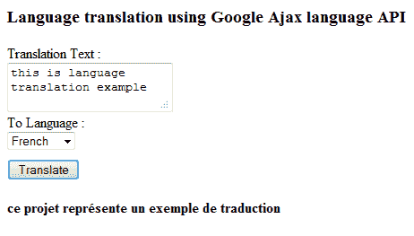
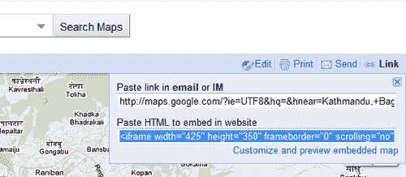
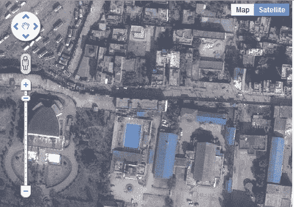
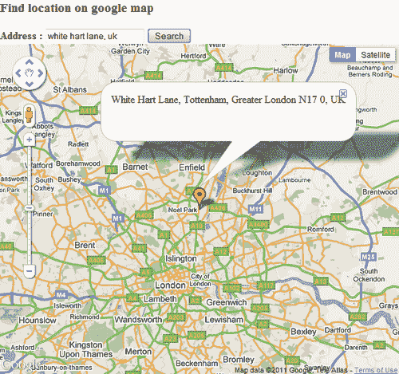
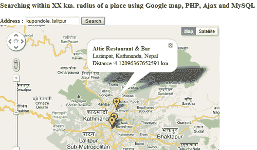
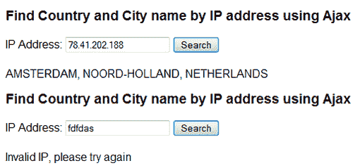

# 八、Ajax 交互

在本章中，我们将介绍以下主题：

*   网络服务
*   XML-RPC
*   使用 PHP 创建和使用 web 服务
*   将 flickrapi 与 Ajax 结合使用
*   将 twitterapi 与 Ajax 结合使用
*   使用 googleajaxapi 翻译文本
*   使用谷歌地图
*   在谷歌地图中搜索位置
*   在 XX 公里内搜索。带有标记和信息窗口的谷歌地图半径
*   带有标记和信息窗口的地图
*   使用 IP 地址查找城市/国家/地区
*   使用 Ajax 和 PHP 转换货币

web 服务知识是当今 web 开发人员的重要素质之一。在本章中，我们首先介绍如何使用流行网站提供的 web 服务。

首先，我们将学习介绍流行的 web 服务格式，如 SOAP、REST 和 XML-RPC。在这一部分之后，我们将学习如何与各种流行 web 应用程序的 API 交互，如 Flickr、Twitter、Google Translate、Google Maps 和使用 foxrate.org 的 XML-RPC API 的货币转换器。

# 网络服务

在典型的基于 web 的应用程序中，web 客户端（通常是浏览器）向 web 服务器发送 HTTP 请求，web 服务器通过 HTTP 协议向客户端发送响应。

例如，假设您想要获取某个城市的天气报告。在这个场景中，您访问一个新闻门户，并通过该新闻门户中的 HTML 搜索您所在城市的天气报告。

但是，web 服务的作用方式不同。web 服务不允许通过上面提到的 HTML 页面访问信息，而是让服务器公开应用程序逻辑，客户机可以通过编程方式使用应用程序逻辑。简单地说，这意味着服务器公开了一组客户端可以调用的 API（即函数）。因此，web 服务是服务器上的公开应用程序，客户端可以使用 Internet 访问该应用程序。

由于使用 web 服务公开的 API 应该是独立于平台的，因此使用 XML 以及 JSON 来进行客户端和服务器之间的通信。服务器公开的函数集通常使用称为 Web 服务描述语言（WSDL）的语言进行描述。

**Web 服务**是一组可以以多种方式使用的工具。使用它们的三种最常见的样式是 REST、XML-RPC 和 SOAP。

在创建 web 小部件时，我们可能必须使用各种 web 服务标准，让我们浏览一下这些技术。

## 肥皂

SOAP 以前被定义为**简单对象访问协议**，是 Internet 上访问远程过程最流行的方法之一。它是一种协议，通常使用 HTTP 和 HTTPS 协议将基于 XML 的消息从客户端交换到服务器。可以从使用 SOAP 协议的客户端使用以 XML 格式公开的 SOAP 过程。

SOAP 是一种基于 XML 的消息传递协议。XML 格式的 SOAP 请求包含以下主要部分：

1.  信封将文档定义为 SOAP 请求。
2.  Body 元素包含有关过程调用的信息，以及参数和预期响应。
3.  可选的头和 fault 元素包含关于 SOAP 请求的补充信息。

如何使用 SOAP 过程的一个典型示例是一个网站，它公开了一个名为 `addTwoNumbers()`的函数，用于添加两个数字并将响应发送给 SOAP 客户端。由于 SOAP 的请求和响应是使用 XML 格式发送的，所以它们是独立于平台的，可以从远程服务器调用。

SOAP 因其巨大的复杂性而受到批评，它必须序列化远程调用，然后构造一个 SOAP 信封来包含远程调用。由于这种复杂性，REST 方式在使用 web 服务时越来越流行。

## 休息

REST 代表*代表状态转移*，可能是当今创建和利用 web 服务最流行的方式。它是创建和使用 web 服务的一种简单而强大的方法。REST 有时被称为**RESTful Web 服务**。restfulweb 服务通过将接口约束到标准操作（如 GET、POST 和 PUT 方法）来使用 HTTP 或类似的协议。REST 关注与有状态资源的交互，而不是消息或操作。

RESTful web 服务的两个主要原则是：

*   资源由 URL 表示。可以将资源视为用户可以作为 web 服务的 API 访问的实体。REST 应用程序中的每个资源都有一个唯一的 URL。
*   RESTful Web 服务中的操作由标准 HTTP 操作（如 GET、POST 和 PUT）执行。

让我们看一个例子来理解 REST 原则。假设我们有一个市场网站，商家可以上传、查看和删除产品。让我们看看前面示例中 web 服务的 RESTful 接口。

*   可以从唯一的 URL 访问每个产品详细信息。让我们假设它是[http://marketplace-website.com/product/123](http://marketplace-website.com/product/123) 和 HTTP GET 方法可用于从前面的 URL 获取产品的详细信息。
*   HTTP POST 方法可用于向网站发布新产品，其中包含服务器在服务器指定的特定 URL 中指定的详细信息，以及服务器对产品上载信息的响应。
*   HTTP DELETE 方法可用于使用此操作的唯一 URL 从网站中删除特定产品。

# XML-RPC

XML 远程过程调用是提供和使用 web 服务的另一种方式。XML-RPC 使用 XML 对服务的请求和响应进行编码，并使用 HTTP 作为传输介质。

XML-RPC 是用于使用 web 服务的非常简单的协议。它有一组明确的 XML 格式，用于定义过程、数据类型和命令。XML-RPC 设计得尽可能简单。它允许使用其过程传输、处理和返回复杂的数据结构。让我们看看使用 XML-RPC 调用远程过程的 XML 请求格式，然后看看服务器以 XML-RPC 格式返回的响应。

```php
<?xml version="1.0"?>
<methodCall>
<methodName>examples.getProductName</methodName>
<params>
<param>
<value><int>10</int></value>
</param>
</params>
</methodCall>

```

如您所见，发送请求的 XML 格式相当简单，甚至参数的数据类型也在过程调用中定义。现在，让我们以 XML 格式查看对前面调用的响应：

```php
<?xml version="1.0"?>
<methodResponse>
<params>
<param>
<value><string>Apple IPhone 3G</string></value>
</param>
</params>
</methodResponse>

```

如您所见，XML 响应非常容易理解。这就是为什么许多提供 web 服务的网站也使用 XML-RPC 的原因。

# 使用 PHP 创建和使用 web 服务

PHP 可用于创建和使用 web 服务。PHP 拥有强大的库，用于创建和使用使用 SOAP、XML-RPC 或 REST 的 web 服务。

让我们通过一个简单的例子来了解如何使用 PHP 中的 web 服务。在本例中，我们将从 Wikipedia 的 API 中获取一个短语的详细信息。

## 准备好了吗

维基百科（[http://www.wikipedia.org](http://www.wikipedia.org) 是一本免费的基于网络的多语言百科全书。几乎所有的文章都可以被任何人编辑，只要他们有更多关于主题的信息。它可能是最大和最受欢迎的网站，人们可以在其中查找有关一般知识或特定主题的信息。目前，维基百科有 282 种语言的文章。

## 怎么做。。。

维基百科在[有一个 APIhttp://en.wikipedia.org/w/api.php](http://en.wikipedia.org/w/api.php) ，可用于各种目的，以访问和修改 Wikipedia.org 上的信息。在我们的例子中，我们只是使用维基百科来解释一个术语。

要调用 API 调用，我们需要访问 Wikipedia API 的以下 URL：

[http://en.wikipedia.org/w/api.php?format=xml &action=opensearch&search=PHP&limit=1](http://en.wikipedia.org/w/api.php?format=xml&action=opensearch&search=PHP&limit=1)

正如您在前面的 URL 中所看到的，API 调用的参数是不言自明的。我们正在使用搜索关键字 PHP 访问名为 opensearch of API 的操作。我们将结果限制为 1，得到的输出是 XML 格式的。现在，让我们看看前面 API 调用的 XML 输出。

```php
<SearchSuggestion version="2.0"> <Query xml:space="preserve">PHP</Query> <Section> <Item> <Text xml:space="preserve">PHP</Text> <Description xml:space="preserve">PHP is a general-purpose scripting language originally designed for web development to produce dynamic web pages. </Description> <Url xml:space="preserve">http://en.wikipedia.org/wiki/ PHP</Url> </Item> </Section> </SearchSuggestion>

```

正如我们在前面的代码中所看到的，我们得到了一个包含关键字 PHP 定义的 XML 结果。

现在，让我们来看一个调用 Wickipedia API 的 PHP 代码示例：

```php
$search_keyword = 'facebook';
//we're getting definition of keyword php in xml format with limitation of 1
$api_url = 'http://en.wikipedia.org/w/api.php?format=xml&action=opensearch&search='.$search_keyword.'&limit=1';
//initialling the curl
$ch = curl_init();
// set URL and other appropriate options
curl_setopt($ch, CURLOPT_URL, $api_url);
//to get the curl response as string
curl_setopt($ch, CURLOPT_RETURNTRANSFER, 1); //setting the logical user agent
curl_setopt($ch, CURLOPT_USERAGENT, "Mozilla/5.0 (Windows NT 6.0; rv:2.0) Gecko/20100101 Firefox/4.0");
// grab URL and pass it to the browser
$xml_reponse = curl_exec($ch);
curl_close($ch);
//user simplexml php parser
$xml_obj = simplexml_load_string($xml_reponse);
if($xml_obj->Section->Item->Description)
echo $xml_obj->Section->Item->Description;

```

**使用 PHP**的 Wikipedia API 调用示例

现在，让我们试着逐行理解前面的代码。代码的前两行是使用搜索关键字初始化变量，并形成 API 调用的 URL。现在，让我们试着理解代码的其他行：

```php
$ch = curl_init();

```

前一行初始化 CURL 的新会话。CURL 库用于通过 Internet 使用各种协议传输数据。

要使用 CURL 函数，请确保您的 PHP 是使用 CURL 库支持编译的，否则在尝试执行前面的代码时会出现致命的 EOR。

现在让我们看一下其他行：

```php
curl_setopt($ch, CURLOPT_URL, $api_url);
curl_setopt($ch, CURLOPT_RETURNTRANSFER, 1);
curl_setopt($ch, CURLOPT_USERAGENT, "Mozilla/5.0 (Windows NT 6.0; rv:2.0) Gecko/20100101 Firefox/4.0");

```

`curl_setopt()`函数用于设置卷曲执行的不同选项。 `CURLOPT_URL`选项用于设置调用的 URL。 `CURLOPT_RETURNTRANSFER`设置为 1，表示执行 `curl_exec()`接收到的响应不是直接输出，而是以字符串形式返回。此外， `CURLOPT_USERAGENT`用于将调用的用户代理设置为有意义的用户代理。

### 注

在某些情况下，在进行 API 调用时，设置适当的用户代理非常重要；否则，API 服务器可能会拒绝您的调用。

```php
$xml_reponse = curl_exec($ch);
curl_close($ch);
$xml_obj = simplexml_load_string($xml_reponse);
if($xml_obj->Section->Item->Description)
echo $xml_obj->Section->Item->Description;

```

然后，使用 `curl_exec()`函数执行 CURL 调用。XML 响应保存在 `$xml_reponse`变量中。使用 PHP 的**Simplexml**解析器解析 `$xml_reponse`变量。如果是有效响应，则存在 XML 节点描述，并使用最后一行中的 `echo`语句将其作为输出发送到浏览器。

## 它是如何工作的。。。

执行前面的代码后，您将在浏览器中看到以下输出，这正是您从 API 响应中获得的 Facebook 描述。

**Facebook（风格化的 Facebook）是 2004 年 2 月推出的社交网络服务和网站，由 Facebook，Inc**运营和私有。

# 结合 Ajax 使用 Flickr API

在本节中，我们将介绍如何使用 Flickr API 从 Flickr.com 检索图像，并使用从文本框输入的指定搜索标记。在本节中，我们将看到如何使用 Flickr 使用 jQuery 提供的 JSONPWeb 服务直接在 JavaScript 本身中获取响应，并对其进行解析和显示。在这个例子中，我们没有使用 PHP。

## 准备好了吗

**JSONP**（带填充的 JSON）是一种增强的 JSON 数据格式，其中 JSON 数据被包装在函数调用中，允许页面从不同的域访问数据。JSONP 允许我们在`<script>`元素的帮助下进行跨域通信。在 Ajax 应用程序中广泛使用的 JavaScript 的 `XMLHttpRequest`对象，由于现代浏览器的限制，无法进行跨域通信。JSONP 可以方便地克服这种情况。

现在，让我们试着了解 JSONP 是如何工作的。JSONP 不过是作为函数调用执行的任意 JavaScript 代码。让我们试着用一个例子来理解。首先让我们看一个简单的 JSON 数据项：

```php
var item = {'name':'iphone','model':'3GS' };

```

现在，该数据也可以轻松地作为参数传递给函数，如下所示：

```php
itemsDetails({'name':'iphone','model':'3GS' });

```

假设前面的代码是来自名为 `example.com`的域的 `product.php`的响应；然后，在 `script`标记的帮助下，可以从任何其他域执行前面的代码。

```php
<script type="text/javascript"
src="http://example.com/product.php?id=1">
</script>

```

无论哪一页使用前面的脚本标记，代码 `itemsDetails({'name':'iphone' , 'model':'3GS' })`；执行，这只是一个函数调用。

总之，JSONP 是填充或加前缀的 JSON 数据，它被包装在函数调用中，以实现跨域通信。

## 怎么做。。。

现在，让我们看看我们的 Flickr 搜索标签应用程序是什么样子的：


这只是一个简单的应用程序，您将输入关键字，我们的应用程序将搜索包含标签的照片并显示它们。我们将使用 Flickr 在[上提供的公共照片源 http://www.flickr.com/services/feeds/docs/photos_public/](http://www.flickr.com/services/feeds/docs/photos_public/) 。

可以使用参数**tags**和**format:**调用提要的示例 URL，以查找包含标签 sky 的照片并获得 JSON 格式的 API 响应

`http://api.flickr.com/services/feeds/photos_public. gne?tags=sky&format=json.`

现在，让我们看一下应用程序的代码，该应用程序使用 JSONPWeb 服务表单 FlickrAPI 按标记搜索图像并显示它们。这个例子的源代码可以在 `example-2.html`文件中找到。

```php
<!DOCTYPE html PUBLIC "-//W3C//DTD XHTML 1.0 Transitional//EN" "http://www.w3.org/TR/xhtml1/DTD/xhtml1-transitional.dtd">
<html >
<head>
<meta http-equiv="Content-Type" content="text/html; charset=iso-8859-1" />
<title>Flickr Search HTML</title>
<style type="text/css">
#photos {
margin-top:20px;
}
#photos img {
height:140px;
margin-right:10px;
margin-bottom:10px;
}
</style>
<script type="text/javascript" src="https://Ajax.googleapis.com/Ajax/libs/jquery/1.4.2/jquery.min.js"></script>
<script type="text/javascript">
$('document').ready(function()
{
$('#photoform').submit(function()
{
//get the value of the search tag
var keyword = $('#keyword').val();
//shows the please wait until result is fetched $("#photos").html('Please wait..');
$.getJSON('http://api.flickr.com/services/feeds/photos_public.gne?tags='+keyword+'&format=json&jsoncallback=?',
function(data)
{
//delete the child elements of #photos
$("#photos").empty();
$.each(data.items, function(index,item){
//now append each image to #photos
$("#photos").append('');
});
} );
//to protect from reloading the page
return false;
});
});
</script>
</head>
<body>
<form method="post" name="photoform" id="photoform">
Keyword : <input type="text" name="keyword" id="keyword" value="" /> <input name="findphoto" id="findphoto" value="Find" type="submit" />
</form>
<div id="photos"></div>
</body>
</html>

```

## 它是如何工作的。。。

您可能已经仔细阅读了前面的代码。即便如此，让我们试着理解前面代码的主要部分。

```php
<style type="text/css">
#photos {
margin-top:20px;
}
#photos img {
height:140px;
margin-right:10px;
margin-bottom:10px;
}
</style>

```

这里，我们只是为元素定义 CSS 样式。第一个带有 `#photos`的声明设置元素的上边距为 20 像素。另一个 CSS 声明 `#photos img`应用于 ID 为 `photos`的元素中的所有``元素。在第二个声明中，我们将图像元素的高度设置为 140 像素，并在右侧和底部设置 10 像素的边距。

应用程序的 jQuery 库托管在 Google 中。我们可以在应用程序中直接使用它来节省带宽。

```php
<script type="text/javascript" src="https://Ajax.googleapis.com/Ajax/libs/jquery/1.4.2/jquery.min.js"></script>

```

我们在这里使用 jQuery 的 1.4.2 版。现在，让我们看看实际的 jQuery 函数，它在使用标记搜索照片时处理表单的提交。

```php
$('#photoform').submit(function()
{
var keyword = $('#keyword').val();
$("#photos").html('Please wait..');

```

在这里，我们将事件处理程序附加到 ID 为**photoform**的表单上，以提交事件。无论何时提交表单，都会调用此函数。第一行将带有 ID 关键字的 textbox 的值存储到名为 `keyword`的 JavaScript 变量中。下一行显示**请稍候。**。照片容器元素中的消息。

```php
$.getJSON('http://api.flickr.com/services/feeds/photos_public.gne?tags='+keyword+'&format=json&jsoncallback=?',
function(data)
{

```

现在，我们使用 jQuery 强大的 `getJSON`函数从远程域获取的 JSONP 数据。请记住，回调函数中的变量 `data`保存从 JSONPAPI 调用返回的 JSON 数据。

### 注

在前面的 API 调用中，我们指定了 `jsoncallback`参数，该参数设置为 `?`。这意味着 jQuery 会自动用正确的方法名替换 `?`，自动调用我们的特定回调。

```php
$("#photos").empty();

```

前面的代码删除了照片容器（即 `#photo`）的子节点元素。在了解如何使用 jQuery 解析和显示 JSON 数据之前，让我们先看看 Flickr 提要发送的 JSON 响应示例。

```php
jsonp3434324344({
"title": "Recent Uploads tagged sky",
"link": "http://www.flickr.com/photos/tags/sky/",
"description": "",
"modified": "2011-04-17T17:30:30Z",
"generator": "http://www.flickr.com/",
"items": [
{
"title": "I needed to believe in something",
"link": "http://www.flickr.com/photos/mmcfotografia/5628290816/",
"media": {"m":"http://farm6.static.flickr.com/5064/5628290816_dc91b37539_m.jpg"},
"date_taken": "2011-04-17T14:26:33-08:00",

```

在查看前面的响应格式之后，现在让我们看看前面的 JSON 响应是如何解析的。

```php
$.each(data.items, function(index,item){
$("#photos").append('');
});

```

正如您所知， `data`是一个保存 JSON 数据的变量。 `data.items`数组保存响应的各个项。使用 jQuery 的 `each()`函数循环这些数据。 `each()`函数的回调函数接受两个参数；第一个是索引，第二个是值本身。正如您在上面的 JSON 响应格式响应中所看到的，可以使用 `item.media.m`变量从循环中访问 Flickr 的图像 URL。jQuery 的 `append()`函数用于将图像附加到 photo 容器元素。

还有一个 `return false`；语句，以防止表单提交，从而导致重新加载页面。

```php
return false;

```

## 还有更多。。。

除了 JSON 之外，Flickr 还提供许多不同格式的提要，如 RSS、Atom、SQL、YAML 等。您可以根据应用程序的需要使用这些提要格式。

如果您需要 Flickr API 的更多功能，如上传照片、获取朋友的照片等，那么您可以在[详细查看 Flickr APIhttp://www.flickr.com/services/api/](http://www.flickr.com/services/api/) 。

# 将 Twitter API 与 Ajax 结合使用

在本节中，我们将看到如何使用 PHP 和 Ajax 创建一个工具，该工具使用 Twitter 搜索 API 从包含搜索关键字的用户检索推文。我们将使用 Ajax、PHP 和 Twitter API 来制作这个工具。

## 准备好了吗

您可以按如下方式调用 Twitter 搜索 API：

[http://search.twitter.com/search.format?q=your_query_string](http://search.twitter.com/search.format?q=your_query_string)

在上一次调用中， `format`可以替换为 `json`或 `atom`。此外，我们可以使用额外的 `callback`参数进行 JSONP 调用。

[http://search.twitter.com/search.format?q=your_query_string &回调=？](http://search.twitter.com/search.format?q=your_query_string&callback=?)

假设我们想在搜索关键字中使用**php**搜索推文，并以 JSON 格式响应；然后我们可以像这样调用 Twitter API：

[http://search.twitter.com/search.json?q=php](http://search.twitter.com/search.json?q=php)

## 怎么做。。。

在这里，您可以看到使用 Ajax 的 Twitter 搜索应用程序的界面。这是一个非常简单的界面，具有最少的 CSS。有一个文本框，用户在其中输入搜索关键字并点击**搜索**按钮。这个搜索关键字通过 Ajax 传递给 PHP 脚本，PHP 脚本通过调用 twitterapi 从 Twitter 获取结果。


现在，让我们看看这个应用程序的代码。有两个文件与此示例关联。一个文件是 `example-3.html`，其中包含用于前端操作的 JavaScript、CSS 和 HTML 代码。另一个是通过 Ajax 调用的 `twitter.php`文件，用于从 Twitter 获取结果。

首先，我们来看一下 `example-3.html:`的代码

```php
<!DOCTYPE html PUBLIC "-//W3C//DTD XHTML 1.0 Transitional//EN" "http://www.w3.org/TR/xhtml1/DTD/xhtml1-transitional.dtd">
<html >
<head>
<meta http-equiv="Content-Type" content="text/html; charset=iso-8859-1" />
<title>Search Twitter using their API </title>
<style type="text/css">
body{
font-family:Arial, Helvetica, sans-serif;
}
#tweets {
margin-top:20px;
}
#tweets ul {
margin:0px; padding:0px;
}
#tweets li {
border-bottom:1px solid #B4B4B4;
background-repeat:no-repeat;
font-size:17px;
min-height:30px;
padding-left:75px;
list-style:none;
margin-bottom:10px;
}
#tweets li a {
color:#900;
text-decoration:none;
}
#tweets li a:hover {
color:#06C;
}
</style>
<script type="text/javascript" src="https://Ajax.googleapis.com/Ajax/libs/jquery/1.4.2/jquery.min.js"></script>
<script type="text/javascript">
$('document').ready(function()
{
$('#tweetform').submit(function()
{
//get the value of the search keyword
var keyword = $('#keyword').val();
//shows the please wait until result is fetched
$("#tweets").html('Please wait while tweets are loading....');
$.Ajax({
url : 'twitter.php',
data : 'query='+keyword,
success : function(html_data)
{
$('#tweets').html(html_data);
}
});
//to protect from reloading the page
return false;
});
});
</script>
</head>
<body>
<h2>Twitter Search Demo using Ajax</h2>
<form method="post" name="tweetform" id="tweetform">
Keyword : <input type="text" name="keyword" id="keyword" value="" /> <input name="findtweet" value="Search" type="submit" />
</form>
<div id="tweets"></div>
</body>
</html>

```

正如我们在前面的代码中所看到的，有一个对 `twitter.php`文件的 Ajax 调用。让我们看看 `twitter.php`文件的代码：

```php
<?php
//get the JSON response of serach keyword using search api of twitter
$raw_data=file_get_contents("http://search.twitter.com/search.json?q=".$_GET['query']);
//decode the json data to object
$tweets=json_decode($raw_data);
echo '<ul>';
if(count($tweets->results)>0)
{
foreach($tweets->results as $tweet)
{
echo "<li style='background-image:url(".$tweet->profile_image_url.");'>";
echo "<a href='http://twitter.com/".$tweet->from_user."'>".$tweet->from_user."</a> : ";
echo $tweet->text;
echo "</li>";
}
}
else
{
echo "<li> Sorry no tweets found </li>";
}
echo '</ul>';
?>

```

## 它是如何工作的。。。

在查看了代码及其接口之后，现在让我们详细了解一下它是如何工作的。

首先，让我们看一下 `example-1.html`文件。它的顶部有 CSS 样式，我们不需要太多解释。

此外，HTML 代码也是自解释的；我想你不难理解它。

让我们跳到 jQuery 代码并理解它：

```php
var keyword = $('#keyword').val(); $("#tweets").html('Please wait while tweets are loading....');

```

在这里，我们已经将 ID 为 `keyword`的文本框的值分配给名为 `keyword`的 JavaScript 变量。之后，我们将信息性消息放入 ID 为 `tweets`的元素，以显示它，直到收到来自 Ajax 的响应为止。

```php
$.Ajax({
url : 'twitter.php',
data : 'query='+keyword,
success : function(html_data)
{
$('#tweets').html(html_data);
}
});

```

现在，在前面的代码中，我们使用一个参数查询调用 jQuery 的 Ajax 函数，该参数查询具有在 textbox 中输入的文本值。Ajax 请求完成后，成功的响应将插入到#tweets 中。

### 注

如果 jQuery 的 Ajax 函数中未指定请求类型，则默认请求类型为 GET。

正如我们在前面的代码中看到的，有一个对 `twitter.php`的 Ajax 调用。现在，让我们看一下 `twitter.php`脚本的代码：

```php
$raw_data=file_get_contents("http://search.twitter.com/search.json?q=".$_GET['query']); $tweets=json_decode($raw_data);

```

前两行是代码的关键行。在第一行中，我们使用 PHP 的 `file_get_contents()`函数从 Twitter 获取搜索结果的内容。然后将响应存储在 `$raw_data`变量中。在第二行中，使用 `json_decode()`函数将 JSON 数据转换为 PHP 变量。

在看剩下的部分之前，让我们先看一下通过搜索 API 调用从 Twitter API 获得的 JSON 响应：

```php
{
"results": [{
"from_user_id_str": "83723708",
"profile_image_url": "http://a2.twimg.com/profile_images/814809939/n100000486346445_3870_normal.jpg",
"created_at": "Tue, 19 Apr 2011 09:10:30 +0000",
"from_user": "cdAlcoyano",
"id_str": "60269025921466369",
"metadata": {
"result_type": "recent"
},
"to_user_id": null,
"text": "Torneo en Novelda del Futbol Base: http://bit.ly/eNzvfy",
"id": 60269025921466369,
"from_user_id": 83723708,
"geo": null,
"iso_language_code": "no",
"to_user_id_str": null,
"source": "&lt;a href=&quot;http://twitterfeed.com&quot; rel=&quot;nofollow&quot;&gt;twitterfeed&lt;/a&gt;"
}, {
"from_user_id_str": "125327460",

```

正如您在前面的代码片段中看到的来自 Twitter 的 JSON 响应示例一样，响应以数组的形式存在于 results 变量中。现在，让我们看看用于解析前面响应的 PHP 代码。

```php
if(count($tweets->results)>0)
{
foreach($tweets->results as $tweet)
{
echo "<li style='background-image:url(".$tweet->profile_image_url.");'>";
echo "<a href='http://twitter.com/".$tweet->from_user."'>".$tweet->from_user."</a> : ";
echo $tweet->text;
echo "</li>";
}
}

```

正如您在前面的代码中所看到的，首先我们计算作为 JSON 数据返回的 tweet 的数量。如果结果超过零，那么我们将解析每个 tweet 并在 `li`元素上显示它们。

# 使用 Google Ajax API 翻译文本

在本节中，我们将介绍将文本从一种语言转换为其他语言的 GoogleAJAXAPI。谷歌为大量操作提供了 Ajax API，如谷歌地图、语言翻译、图表等。在这一部分中，我们将了解如何使用 GoogleTranslateAjax API 将文本从一种语言翻译成另一种语言。

## 准备好了吗

要使用 GoogleAjax API，我们首先需要注册特定域的密钥。您可以通过以下 URL 获取 Google Ajax API 的 API 密钥：[http://code.google.com/apis/loader/signup.html](http://code.google.com/apis/loader/signup.html) 。获取 API 密钥后，可以使用以下 URL 插入 Google API：

```php
<script type="text/javascript" src="https://www.google.com/jsapi?key=YOUR-API-KEY"></script>

```

现在，在调用 URL 之后，我们可以加载应用程序的特定模块。假设我们将使用 Ajax 语言 API；然后我们可以这样加载它：

```php
google.load("language", "1");

```

其中第一个参数是要在页面上使用的模块。这里，我们使用的是语言模块。第二个参数是特定模块的版本，在前面的示例中为 1。

### 注

`load()`函数中还有第三个参数，即 `packages`。这是可选的，可以在需要时使用。例如，要用 corechart 包加载 Google 可视化模块，我们使用以下代码： `google.load('visualization', '1', {'packages':['corechart']})`；

## 怎么做。。。

首先，让我们来看看我们使用谷歌翻译 API 帮助构建的语言翻译工具的界面。



正如您在前面的屏幕截图中所看到的，该界面简单而简洁。有一个文本区域，您可以在其中输入要翻译的文本。下面是 select 下拉列表，您可以在其中选择需要将前面的文本翻译成的语言。例如，在这个应用程序中，我们只在下拉列表中添加了 5 种流行语言。

谷歌在翻译 API 中支持更多的语言。谷歌不断增加语言支持，因此有关最新的语言支持，请查看 URL 以获取最新的支持语言列表：[http://code.google.com/apis/language/translate/v1/getting_started.html#translatableLanguages](http://code.google.com/apis/language/translate/v1/getting_started.html#translatableLanguages) 。

在看了这个工具的界面之后，现在让我们看一下它的代码，以探索它实际上是如何工作的。

```php
<!DOCTYPE html PUBLIC "-//W3C//DTD XHTML 1.0 Strict//EN" "http://www.w3.org/TR/xhtml1/DTD/xhtml1-strict.dtd">
<html >
<head>
<meta http-equiv="content-type" content="text/html; charset=utf-8"/>
<title>Language translation using Google Ajax language API</title>
<style title="text/css">
#label , #translate{
margin-top:10px;
}
#tanslated_text{
font-weight:bold;
margin-top:20px;
}
</style>
<script src="https://www.google.com/jsapi?key=YOUR-API-KEY"></script>
<script type="text/javascript">
google.load("language", "1");
//translate function
function translate_text()
{
var text = document.getElementById('content').value;
var lang = document.getElementById('languages').value;
//check for the empty text
if(text=='')
{
alert('Please enter some text to translate');
return false;
}
//for showing informative message
document.getElementById("tanslated_text").innerHTML = 'Translating...';
//call the translate function, empty second argument = detect language automatically
google.language.translate(text, '', lang, function(result) {
if (result.translation)
{
document.getElementById("tanslated_text").innerHTML = result.translation;
}
});
//to avoid submitting the form manually
return false;
}
</script>
</head>
<body>
<h3>Language translation using Google Ajax language API</h3>
<form method="post" name="translationform" id="translationform" onsubmit="return translate_text();">
<label for="content">Translation Text : </label>
<br />
<textarea name="content" id="content"></textarea>
<br />
<label for=" languages ">To Language : </label>
<br />
<select name="languages" id="languages">
<option value="es">Spanish</option>
<option value="fr">French</option>
<option value="zh">Chinese</option>
<option value="de">German</option>
<option value="en">English</option>
</select>
<br />
<input name="translate" id="translate" value="Translate" type="submit" />
</form>
<div id="tanslated_text"></div>
</body>
</html>

```

## 它是如何工作的。。。

在看了代码之后，让我们看一下代码主要部分的细节，看看它是如何工作的。

首先，让我们看看 JavaScript API 是如何加载的：

```php
<script src="https://www.google.com/jsapi?key=YOUR-API-KEY"></script>
<script type="text/javascript">
google.load("language", "1");

```

我们用 API 键调用 Google 的 JavaScript API。之后，在下一行代码中，我们将加载 GoogleAPI 的语言模块。

现在，让我们看一下表单的定义：

```php
<form method="post" name="translationform" id="translationform" onsubmit="return translate_text();">

```

正如您在前面所看到的，我们正在表单的提交操作上调用 `translate_text()`函数。还要记住， `onsubmit`事件需要一个返回类型。如果返回类型为 `true`，则表单被提交，否则提交事件不会被触发。

现在，让我们看看 JavaScript 的 `translate_text()`函数。

```php
var text = document.getElementById('content').value; var lang = document.getElementById('languages').value; if(text=='')
{
alert('Please enter some text to translate');
return false;
}

```

在前面清单的前两行中，我们将这些值赋给变量 `text`和 `lang`，这两个变量包含要翻译的内容和需要翻译的语言。

然后，在清单的接下来 4 行中，我们只是验证 `text`变量是否为空。如果传递的翻译内容为空， `false`返回给调用函数。

### 提示

用户只需在 textarea 中添加一个空格，即可绕过前面的验证。JavaScript 没有像 PHP 那样的内置 `trim()`函数。您可以自己编写，或者如果您已经在应用程序中使用类似 jQuery 的 JavaScript 库，这些库通常提供 `trim()`函数。

现在，让我们看看 Google translate API 代码的主要部分：

```php
google.language.translate(text, '', lang, function(result) {
if (result.translation)
{
document.getElementById("tanslated_text").innerHTML = result.translation;
}
});

```

正如您在前面的代码中所看到的，API 有一个带有 4 个参数的 `translate()`函数。让我们看看其中的每一个：

*   Text-此参数包含需要翻译的文本或内容。
*   源语言-此参数是提供的文本或内容的源语言。正如您在前面的列表中所看到的，它是空白的。如果为空，则要求函数自动检测源语言。
*   目标语言-此参数是文本需要翻译到的目标语言。在我们的例子中，这个变量是下拉列表中所选语言的值。
*   回调函数-第四个参数是接收转换结果的回调函数。

在回调函数中，我们首先检查转换的结果是否为空。如果它不是空的，我们将在 ID 为 `translated_text`的`<div>`元素上显示翻译后的文本。

# 使用谷歌地图

谷歌地图，可能是网络上最流行的地图服务，是谷歌免费提供的地图应用程序。GoogleMaps 包含一个强大的 API，通过该 API，不同的第三方网站可以将 GoogleMaps 用于各种目的，如路线规划、查找行驶方向和距离等。

谷歌地图正日益成为一个非常强大和有用的工具，因为它已被许多基于评论的服务应用程序和许多流行的移动应用程序广泛使用。

在本节中，我们将学习如何将谷歌地图嵌入网页。

## 准备好了吗

谷歌地图可以通过一个简单的`<Iframe>`代码嵌入到网站中，该代码基本上用于显示特定位置的地图或突出显示该位置的地标。它不能用于 GoogleMapAPI 交互。



如上图所示，您可以通过点击**链接**选项卡从谷歌地图中获取特定位置的 Iframe 代码。

## 怎么做。。。

但与使用`<iframe>`相比，我们更感兴趣的是在谷歌地图上使用 JavaScript API。那么，让我们来看一个使用 JavaScript API 在网页中使用 Google 地图的示例。

### 注

在本书中，我们使用的是谷歌地图 JavaScript API 3.0 版。谷歌地图 API 的其他版本的代码可能有所不同。此外，版本 3 不需要 API 键来调用 GoogleMapAPI。

```php
<!DOCTYPE html PUBLIC "-//W3C//DTD XHTML 1.0 Strict//EN" "http://www.w3.org/TR/xhtml1/DTD/xhtml1-strict.dtd">
<head>
<meta http-equiv="content-type" content="text/html; charset=utf-8"/>
<style type="text/css">
body { height: 100%; margin: 0px; padding: 0px }
#map { width:500px; height:500px; }
</style>
<script type="text/javascript" src="http://maps.google.com/maps/api/js?sensor=false"> </script>
<script type="text/javascript">
function showmap() {
//longitude and latitude of Kathmandu, Nepal
var lat_lng = new google.maps.LatLng(27.702871,85.318244);
//options of map
var map_options = {
center: lat_lng,
zoom : 18, //zoom level of the page
mapTypeId: google.maps.MapTypeId.SATELLITE
};
//now map should be there
var map = new google.maps.Map(document.getElementById("map"), map_options);
}
</script>
</head>
<body onload="showmap()">
<div id="map" ></div>
</body>
</html>

```

现在，让我们试着详细理解前面的代码。

```php
<body onload="showmap()"> <div id="map" ></div>

```

这是显示地图的容器。您可以在 CSS 样式中看到，该样式定义了宽度为 500 像素、高度为 500 像素的容器。您还可以看到，当页面在 `onload()`事件上完全加载时， `showmap()`函数被调用。

现在，通过在网页中包含以下 URL 的 JavaScript 文件，可以在网页中使用 GoogleMapJavaScriptAPI。

```php
<script type="text/javascript" src="http://maps.google.com/maps/api/js?sensor=false"></script>

```

您可以看到有一个 `sensor`参数指定给 `false`。必须显式指定此参数。此参数指定基于地图的应用程序是否使用传感器确定用户的位置。

### 注

在手机上广泛使用的 GPS 定位器等应用中，传感器通常设置为 `true`。

现在我们来看一下 `showmap()`函数的代码：

```php
var lat_lng = new google.maps.LatLng(27.702871,85.318244);

```

在第一行中，我们正在创建 `latLng`类的对象 `Lat_lng`，有两个参数传递给构造函数。第一个参数是纬度，第二个参数是经度。上述示例中给出的纬度和经度值为尼泊尔加德满都。

```php
var map_options = {
center: lat_lng,
zoom : 18, //zoom level of the page
mapTypeId: google.maps.MapTypeId.SATELLITE
};

```

在另一行中，我们正在创建 `map_options`对象，用于设置地图的不同选项。地图的中心由 `lat_lng`对象指定。地图的缩放级别设置为 18。第三个设置是 `mapTypeId`，对于摄影卫星地图，设置为 `google.maps.MapTypeId.SATELLITE`。除此之外，还支持其他三种地图类型：

*   `google.maps.MapTypeId.ROADMAP`这是您在谷歌地图上看到的默认 2D 磁贴。
*   `google.maps.MapTypeId.HYBRID`这是一种具有突出地标特征的卫星地图。
*   `google.maps.MapTypeId.TERRAIN`该类型用于显示基于地形信息的物理地图。

最后，使用基本的 `google.maps.Map`对象，我们将在指定的容器中显示地图。

```php
var map = new google.maps.Map(document.getElementById("map"), map_options);

```

这个对象的第一个参数是显示映射的容器的 DOM 对象，第二个参数是我们前面在 `map_options`对象中定义的映射选项。

## 它是如何工作的。。。

现在，让我们看看谷歌地图在网页上显示上述代码后是如何显示的。这是尼泊尔加德满都中心点的卫星地图。这只是一个简单的谷歌地图，您可以使用诸如缩放地图、拖动地图查看其他地方以及查看不同类型的地图（如卫星、路线图或地形）等功能。



# 在谷歌地图中搜索位置

在了解了如何使用 Google Map JavaScript API 在网页中嵌入地图之后，现在让我们来看一个使用 Google Map API 的 `GeoCoder()`类在 Google Map 中搜索位置的简单应用程序。

## 准备好了吗

这个工具有一个非常简单的应用程序和一个简单的界面。您可以在下图中查看其界面。它有一个简单的文本框，您可以在其中输入值。该值可以是世界上的任何位置、城市或地标。然后，谷歌 API 的*地理编码器*将找到位置并指向它。如果找到该位置，地图将以我们正在搜索的位置为中心。一个红色标记，这是谷歌地图 API 提供的默认标记，将放置在地图上找到的位置上。

### 注

地理编码是将地址（如“619 Escuela Ave，Mountain View，CA”）转换为地理坐标系（37.394011，-122.095528）的过程，即转换为纬度和经度。

当你点击红色标记时，会打开一个小的信息窗口，显示谷歌地图 API 返回的我们要搜索的地方的完整地址位置。



## 怎么做。。。

在了解了这个应用程序的接口是如何工作的之后，让我们看看它的代码。我们在这个工具中使用了不同类别的 GoogleMapAPI。以下是您可以在源代码的 `example-6.html`中找到的清单代码。

```php
<!DOCTYPE html PUBLIC "-//W3C//DTD XHTML 1.0 Strict//EN" "http://www.w3.org/TR/xhtml1/DTD/xhtml1-strict.dtd">
<head>
<meta http-equiv="content-type" content="text/html; charset=utf-8"/>
<style type="text/css">
body { height: 100%; margin: 0px; padding: 0px }
#map { width:600px; height:500px; }
</style>
<script type="text/javascript" src="http://maps.google.com/maps/api/js?sensor=false">
</script>
<script type="text/javascript">
//varaibles for map object, geocoder object, array of marker and information window
var map_obj;
var geocoder;
var temp_mark;
var infowindow;
function showmap() {
//longitude and latitude of Kathmandu, Nepal
var lat_lng = new google.maps.LatLng(27.702871,85.318244);
//options of map
var map_options = {
center: lat_lng,
zoom: 10,
mapTypeId: google.maps.MapTypeId.ROADMAP
};
//now map should be there
map_obj = new google.maps.Map(document.getElementById("map"), map_options);
}
function show_address_in_map()
{
geocoder = new google.maps.Geocoder();
var address = document.getElementById("address").value;
geocoder.geocode( { 'address': address}, function(results, status) {
if (status == google.maps.GeocoderStatus.OK) {
map_obj.setCenter(results[0].geometry.location);
//clear the old marker
if(temp_mark)
temp_mark.setMap(null);
//create a new marker on the searched position
var marker = new google.maps.Marker({
map: map_obj,
position: results[0].geometry.location
});
//assign the marker to another temporaray variable
temp_mark = marker;
//now add the info windows
infowindow = new google.maps.InfoWindow({content: results[0].formatted_address});
//now add the event listener to marker
google.maps.event.addListener(marker, 'click', function() {
infowindow.open(map_obj,marker);
});
} else {
alert("Google map could not find the address : " + status);
}
});
return false;
}
</script>
</head>
<body onload="showmap()">
<h3>Find location on google map</h3>
<form method="post" name="mapform" onsubmit="return show_address_in_map();" >
<strong>Address : </strong><input type="text" name="address" id="address" value="" /> <input name="find" value="Search" type="submit" />
</form>
<div id="map" ></div>
</body>
</html>

```

## 它是如何工作的。。。

在看了代码之后，现在让我们看一下这个应用程序的代码是如何工作的。

```php
var map_obj;
var geocoder;
var temp_mark;
var infowindow;

```

此应用程序中定义了四个全局 JavaScript 变量。一个用于 map 对象，另一个用于 API 的 geocoder 对象，下一个是临时变量，用于存储标记，以便稍后在 `temp_mark`上清除变量在这里很棘手，您将看到如何使用它从地图中清除标记，因为 Google map v3 没有任何预定义的函数来清除地图中的标记。应用程序中定义的第四个全局变量用于存储信息窗口对象。在查看全局 JavaScript 变量之后，现在让我们看看从不同事件调用的不同 JavaScript 函数。

```php
<body onload="showmap()">

```

正如您在前面的代码片段中清楚地看到的，加载页面时会调用 `showmap()`函数。

```php
<form method="post" name="mapform" onsubmit="return show_address_in_map();" >

```

还有另一个函数 `show_address_in_map()`，当我们尝试提交表单时调用它，该函数返回 `false`值以防止表单被提交，这将导致重新加载页面。

现在我们先来看看 `show_map()`函数的细节；它与上一个使用谷歌地图的配方中定义的 `show_map()`函数非常相似。一些不同之处在于我们将 `map_obj`变量从局部变量移动到了全局变量。此外，我们在本应用程序中使用的地图类型是 `ROADMAP`。

现在，让我们看一下另一个名为 `show_address_in_map()`的函数的代码，该函数在提交表单时调用。

```php
geocoder = new google.maps.Geocoder();
var address = document.getElementById("address").value;

```

在代码的第一行中，我们声明了一个 `Geocoder()`类的对象。这是本应用程序的主要类之一；此类的对象向服务器发送地理编码请求。在另一行中，我们将搜索地址的值分配给 `address`变量。

```php
geocoder.geocode( { 'address': address}, function(results, status) {
if (status == google.maps.GeocoderStatus.OK) {
map_obj.setCenter(results[0].geometry.location);

```

这里，我们向服务器发送 `geocode`请求，并将地址参数分配给 `address`变量。当出现结果时，它调用回调函数。此函数有两个参数：

*   第一个是 `GeocoderResult`对象的结果数组。
*   第二个参数是 `GeocoderStatus`类的对象。

您可以从[的 Google Map API 页面上阅读 Geocoder 类的更多详细信息 http://code.google.com/apis/maps/documentation/javascript/reference.html#Geocoder](http://code.google.com/apis/maps/documentation/javascript/reference.html#Geocoder) 。

在回调函数上，我们通过将结果与变量 `google.maps.GeocoderStatus.OK`进行比较来检查结果的状态，这意味着结果变量包含有效的地理编码器响应。

在下一行中，我们使用 `google.maps.Map`类的 `setCenter()`方法将地图居中放置到 `getcode()`方法返回的第一个结果的位置。

现在让我们看看响应格式，即 results 变量的格式，以了解代码的其余部分。此格式提供了对响应对象的清晰理解。

```php
results[]: { types[]: string, formatted_address: string, address_components[]: { short_name: string, long_name: string, types[]: string }, geometry: { location: LatLng, location_type: GeocoderLocationType viewport: LatLngBounds, bounds: LatLngBounds } }

```

`results[0].geometry.location`变量是 `google.maps.LatLng`类型的对象，这是纬度和经度的总和。我们在这里使用 `results[0]`变量，因为地理编码器返回的第一个结果是与搜索地址最相关的结果。

现在，让我们进一步讨论代码的另一部分：

```php
if(temp_mark)
temp_mark.setMap(null);
var marker = new google.maps.Marker({
map: map_obj,
position: results[0].geometry.location
});
temp_mark = marker;

```

在上面的代码列表中，我们首先检查 `temp_marker`变量是否为空。如果此变量未设置或为空，则不执行任何操作。但如果它包含一个标记对象，则使用 `setMap()`函数将该标记从地图中删除。 `setMap()`功能基本上用于为地图对象分配标记，但当设置为 `null`时，它会从地图中删除标记。

在下一行中，我们将在 `map_obj`地图对象上创建 marker 对象，marker 的位置将是地理编码服务返回的位置的第一个结果。

在下一行， `temp_mark`变量被分配给 marker 对象，该对象是为稍后清除新搜索结果的 marker 而创建的，这样可以避免在地图上显示多个 marker。

创建标记后，现在让我们将信息窗口附加到标记：

```php
infowindow = new google.maps.InfoWindow({content: results[0].formatted_address});

```

上面的代码创建了信息窗口。信息窗口的内容设置为我们作为地理编码服务的响应得到的格式化结果。

```php
google.maps.event.addListener(marker, 'click', function() {
infowindow.open(map_obj,marker);
});

```

在上面的代码中，我们将 click 事件附加到标记上。点击后，使用 `open()`功能打开信息窗口。这个函数接受两个参数：第一个是 map 对象，第二个是 anchor 对象，在本例中，anchor 对象是 marker 对象。

以下行用于警告弹出窗口，以显示地址的信息和状态：

```php
else {
alert("Google map could not find the address : " + status);
}

```

# 在 XX 公里范围内搜索。带有标记和信息窗口的谷歌地图半径

在了解了如何使用文本框在谷歌地图中查找位置之后，现在，让我们转到一个稍微复杂一点的应用程序，称为“ResturantFinder 应用程序”。这个应用程序简单但功能强大。当用户在文本框中输入一个位置时，应用程序将查找距离搜索位置指定公里数半径内的餐厅。我们将使用哈弗森公式来计算圆距离。您可以从这里了解更多信息：[http://en.wikipedia.org/wiki/Haversine_formula](http://en.wikipedia.org/wiki/Haversine_formula) 。

现在，让我们看一下这个应用程序的外观以及如何创建它的详细信息。

## 准备好了吗

在看了应用程序的外观之后，现在让我们看一下该应用程序所需的背景知识，如哈弗公式、数据库结构和数据。

### 计算圆周距离的哈弗公式

在开始编写代码之前，首先让我们试着了解当我们计算了两个地方的经度和纬度时，如何使用哈弗森公式来计算从一个地方到另一个地方的圆距离。如果你数学好，URL[http://en.wikipedia.org/wiki/Haversine_formula 维基百科上的](http://en.wikipedia.org/wiki/Haversine_formula)有关于它的详细信息。欲了解哈弗森公式，请查看网址：[http://www.movable-type.co.uk/scripts/latlong.html](http://www.movable-type.co.uk/scripts/latlong.html) 。它有 JavaScript 中的示例代码以及 Excel 中的公式。参考上面的 URL，让我们看一下 Excel 公式来计算两个位置之间的距离，即：

=6371*ACOS（SIN（弧度（lat1））*SIN（弧度（lat2））+COS（弧度（lat1））*COS（弧度（lat2））*COS（弧度（lon2）-弧度（lon1）））

### 注

上图中，6371 是地球的半径，单位为公里。如果您想以英里为单位计算距离，请将 6371 替换为 3959。还请注意，三角函数接受以弧度表示的角度，而不是以度表示的角度，因此角度在通过它们之前会转换为弧度。

现在，让我们尝试将其转换为 SQL 查询，因为这就是我们在这个应用程序中如何使用它来查找两个位置之间的距离。

```php
SELECT ( 6371 * acos(sin( radians(lat1) ) * sin( radians( lat2 ) ) +cos( radians(lat1) ) * cos( radians( lat2 ) ) * cos( radians( lon2 ) - radians(lon1) ) ) ) ;

```

在这个公式中， `(lat1, lon1)`是一个地方的地理坐标， `(lat2, lon2)`是另一个地方的坐标。

### 创建表格

由于该应用程序基于数据库表，现在，让我们为该应用程序创建表结构。以下是创建用于此应用程序的表的 SQL 代码：

```php
CREATE TABLE `restaurants` (
`id` int(11) NOT NULL AUTO_INCREMENT,
`name` varchar(60) NOT NULL,
`address` varchar(90) NOT NULL,
`lat` float(9,6) NOT NULL,
`lng` float(9,6) NOT NULL,
PRIMARY KEY (`id`)
) ENGINE=MyISAM;

```

让我们尝试查看用于此表的不同字段的详细信息：

*   id-这是此表的主键字段。此字段的数据类型为整数，最多 11 位。 `AUTO_INCREMENT`属性指定，如果在 INSERT 语句或查询中未指定此字段的值，则此字段的值将自动递增为 1（之前的最大值）。
*   名称-这是一个长度为 60 的 varchar 字段。此字段包含我们应用程序中的餐厅名称。如果您觉得不适合您的应用程序，请将尺寸从 60 增加到更多。
*   地址-此字段是长度为 90 的 varchar 字段。此字段包含餐厅的地址。
*   lat-此字段保存特定餐厅位置的纬度值。我们已将此字段的数据类型指定为长度为（9,6）的浮点类型，这意味着它可以容纳 9 位数字，小数点后有 6 位精度。因此，此字段的值范围从 999.9999999 降至 999.9999999。由于当前 Google MAP API 的缩放级别功能，我们不需要小数点后超过 6 位的精度。
*   lon-此字段保存餐厅位置的经度值。字段类型和字段长度与 lat 相同，lat 分别为浮动和（9,6）。

在查看了我们用于应用程序的表之后，让我们看看我们用于此应用程序的示例数据。我们使用的数据很少，因为它只是用于测试目的。以下是用于创建餐厅示例数据的 SQL 语句：

```php
INSERT INTO `restaurants` (`id`, `name`, `address`, `lat`, `lng`) VALUES
(1, 'Big Bell Restaurant and Guest House', 'Bhaktapur Nepal', 27.681187, 85.433067),
(2, 'Summit Hotel', 'Kupondole, Lalitpur, Nepal', 27.690613, 85.319077),
(3, 'New York Cafe', 'Thapathali, Kathmandu, Nepal', 27.696995, 85.323196),
(4, 'Attic Restaurant & Bar', 'Lazimpat, Kathmandu, Nepal', 27.721615, 85.327316);

```

您可以执行上面的 SQL 代码，将数据插入您喜爱的 MySQL 编辑器中。

在本应用程序中，我们使用位置数据进行采样，并将其用于测试。如果你想用更多的数据来测试这个例子，并且你知道这个地方的位置，但是你没有一个地方的地理坐标数据，你可以借助谷歌地理编码 API。

假设我们想知道“加德满都塔帕塔利”的纬度和经度；然后，我们可以使用以下请求 URL 将请求发送到 Google Geocoding API：

[http://maps.googleapis.com/maps/api/geocode/json?address=thapathali，尼泊尔加德满都&传感器=假](http://maps.googleapis.com/maps/api/geocode/json?address=thapathali,kathmandu,Nepal&sensor=false)

哪里：

*   URL 中的`json`是响应的格式；如果您想要 XML 格式的响应，那么可以将 `json`替换为 `XML`。
*   `address`参数包含要将地理编码为纬度和经度的位置的地址。

响应将采用 JSON 格式，您可以轻松解析并使用它。

## 怎么做。。。

首先，让我们看看这个应用程序的接口。有一个文本框，用户在其中输入位置。然后，使用 GoogleMapAPI 的地理编码服务和 PHP 中存储的数据，我们将在我们的示例中找到搜索地点 10 公里半径范围内的距离。



在了解了制作应用程序所需的一些背景知识之后，现在，让我们看看构建此应用程序的代码。

首先，让我们看一下 `example-7.html`文件的代码。

```php
<!DOCTYPE html PUBLIC "-//W3C//DTD XHTML 1.0 Strict//EN" "http://www.w3.org/TR/xhtml1/DTD/xhtml1-strict.dtd">
<head>
<meta http-equiv="content-type" content="text/html; charset=utf-8"/>
<title>Searching within XX km. radius of a place using Google map, PHP, Ajax and MySQL</title>
<style type="text/css">
body {
height: 100%;
margin: 0px; padding: 0px;
}
#map {
width:600px;
height:500px;
}
</style>
<script type="text/javascript" src="https://Ajax.googleapis.com/Ajax/libs/jquery/1.4.2/jquery.min.js"></script>
<script type="text/javascript" src="http://maps.google.com/maps/api/js?sensor=false">
</script>
<script type="text/javascript">
//global variables
var map_obj;
var geocoder;
var info_window = new google.maps.InfoWindow;
var markers_arr = [];
function showmap() {
//longitude and latitude of Kathmandu, Nepal
var lat_lng = new google.maps.LatLng(27.702871,85.318244);
//options of map
var map_options = {
center: lat_lng,
zoom: 11,
mapTypeId: google.maps.MapTypeId.ROADMAP
};
//now map should be there
map_obj = new google.maps.Map(document.getElementById("map"), map_options);
}
function search_map()
{
//initialize geocoding variable
geocoder = new google.maps.Geocoder();
var address = document.getElementById("address").value;
//start geocoding the address
geocoder.geocode( { 'address': address}, function(results, status) {
if (status == google.maps.GeocoderStatus.OK){
map_obj.setCenter(results[0].geometry.location);
//call the function to show the result with markers
search_near_by(results[0].geometry.location);
//clear all the markers
clear_markers ();
} else {
alert("Google API could not find the address : " + status);
}
});
return false;
}
function search_near_by(lat_lng)
{
//for the URL for the Ajax call
var url = 'restaurant-result.php?lat=' + lat_lng.lat() + '&lng=' + lat_lng.lng();
//use jQuery's get Ajax function to make the call
jQuery.get(url, function(data) {
//documentElement returns the root node of the xml
var markers = data.documentElement.getElementsByTagName('marker');
//looping through the each xml node
for (var i = 0; i < markers.length; i++) {
var name = markers[i].getAttribute('name');
var address = markers[i].getAttribute('address');
var distance = parseFloat(markers[i].getAttribute('distance'));
//create new LatLng object
var point = new google.maps.LatLng(parseFloat(markers[i].getAttribute('lat')),
parseFloat(markers[i].getAttribute('lng')));
//now call the function to create the markers and information window
create_marker(point, name, address, distance);
}
});
}
function create_marker(point, name, address, distance) {
//formatting html for displaying in information window
var html = '<strong>' + name + '</strong> <br/>' + address+'<br/>Distance :'+distance+' km';
//now create a marker object
var marker = new google.maps.Marker({
map: map_obj,
position: point
});
//now push into another array for clearing markers later on
markers_arr.push(marker);
//now bind the event on the click of the market
google.maps.event.addListener(marker, 'click', function() {
info_window.setContent(html);
info_window.open(map_obj,marker);
});
}
//function to clear the markers
function clear_markers () {
if (markers_arr) {
for (i in markers_arr) {
markers_arr[i].setMap(null);
}
}
//assign to empty array
markers_arr = [];
}
</script>
</head>
<body onload="showmap()">
<h3>Searching within XX km. radius of a place using Google map, PHP, Ajax and MySQL</h3>
<form method="post" name="mapform" onsubmit="return search_map();" >
<strong>Address : </strong><input type="text" name="address" id="address" value="" /> <input name="find" value="Search" type="submit" />
</form>
<div id="map" ></div>
</body>
</html>

```

在看了这个示例之后，现在让我们看一下从 `search_near_by()`函数提交纬度和经度时从 Ajax 调用的 `restaurant-result.php`文件的代码：

```php
<?php
////default mysql connection
define('DB_SERVER','localhost');
define('DB_USER','root');
define('DB_PASS','');
define('DB_NAME','test');
//default value of radius it is 10 kilometer here
define('RADIUS',10);
//connect to mysql database
$conn=mysql_connect (DB_SERVER,DB_USER,DB_PASS);
if (!$conn) {
die("Connection failed : " . mysql_error());
}
// Select the database the active mySQL database, change your setting here as needed
$db_selected = mysql_select_db(DB_NAME, $conn);
if (!$db_selected) {
die ("Can\'t use db : " . mysql_error());
}
//now get the the longitude and latitude
$g_lat = $_GET["lat"];
$g_lng = $_GET["lng"];
//query to get the restaurants within specified kilometers
$query = sprintf("SELECT address, name, lat, lng, ( 6371 * acos( cos( radians('%s') ) * cos( radians( lat ) ) * cos( radians( lng ) - radians('%s') ) + sin( radians('%s') ) * sin( radians( lat ) ) ) ) AS distance FROM restaurants HAVING distance < '%s' ORDER BY distance LIMIT 0 , 10",
mysql_real_escape_string($g_lat),
mysql_real_escape_string($g_lng),
mysql_real_escape_string($g_lat),
RADIUS
);
//get mysql result
$result = mysql_query($query);
//we're sending reponse in xml format
header("Content-type: text/xml");
// parent node of xml file
echo '<markers>';
// Iterate through the result rows
while ($row = @mysql_fetch_assoc($result)){
// add attribute to xml node called marker
echo '<marker ';
echo 'name="' . htmlentities($row['name'],ENT_QUOTES) . '" ';
echo 'address="' . htmlentities($row['address'],ENT_QUOTES) . '" ';
echo 'lat="' . $row['lat'] . '" ';
echo 'lng="' . $row['lng'] . '" ';
echo 'distance="' . $row['distance'] . '" ';
echo '/>';
}
// closing tag for parent node
echo '</markers>';
?>

```

## 它是如何工作的。。。

在看了代码之后，让我们试着理解这个应用程序的代码是如何工作的。首先，让我们试着理解 `restaurant-result.php`的代码。

```php
define('RADIUS',10);

```

在上面的一行中，半径变量被定义为 10，这意味着我们正在搜索距离该位置 10 公里半径范围内的区域。您可以根据需要更改此处的值。

```php
//now get the the longitude and latitude
$g_lat = $_GET["lat"];
$g_lng = $_GET["lng"];
$query = sprintf("SELECT address, name, lat, lng, ( 6371 * acos( cos( radians('%s') ) * cos( radians( lat ) ) * cos( radians( lng ) - radians('%s') ) + sin( radians('%s') ) * sin( radians( lat ) ) ) ) AS distance FROM restaurants HAVING distance < '%s' ORDER BY distance LIMIT 0 , 10",
mysql_real_escape_string($g_lat),
mysql_real_escape_string($g_lng),
mysql_real_escape_string($g_lat),
RADIUS
);

```

在前面代码的前两行中，我们将从 Ajax 调用中获取纬度和经度的值。然后，我们创建 SQL 查询以查找距离搜索位置 10 公里半径范围内的位置。还要注意，我们从 SQL 查询中得到了前 10 个结果。

现在，让我们看看如何创建 XML 格式，稍后我们将使用该格式创建标记。

```php
echo '<markers>';
while ($row = @mysql_fetch_assoc($result)){
echo '<marker ';
echo 'name="' . htmlentities($row['name'],ENT_QUOTES) . '" ';
echo 'address="' . htmlentities($row['address'],ENT_QUOTES) . '" ';
echo 'lat="' . $row['lat'] . '" ';
echo 'lng="' . $row['lng'] . '" ';
echo 'distance="' . $row['distance'] . '" ';
echo '/>';
}
echo '</markers>';

```

在创建 XML 时，我们使用 `htmlentities()`函数将`<, >`等特殊字符转换为`&gt, &lt`等 HTML 实体，以避免这些特殊字符导致 XML 数据畸形。

让我们看一看 `restaurant-result.php`脚本通过在类似 `restaurant-result.php?lat=27.6862181&lng=85.31491419999998`的浏览器上调用此函数生成的 XML 输出，其中指定的纬度和经度属于“尼泊尔拉利特布尔 Kupondole”位置：

```php
<markers>
<marker name="Summit Hotel" address="Kupondole, Lalitpur, Nepal" lat="27.690613" lng="85.319077" distance="0.6377753814621" />
<marker name="New York Cafe" address="Thapathali, Kathmandu, Nepal" lat="27.696995" lng="85.323196" distance="1.44945592535556" />
<marker name="Attic Restaurant &amp; Bar" address="Lazimpat, Kathmandu, Nepal" lat="27.721615" lng="85.327316" distance="4.12096367652591" />
</markers>

```

在查看了关闭的餐馆的 PHP 代码和 XML 输出之后，现在让我们看看 `example-7.html`文件中的 JavaScript 代码。

首先，让我们先看看 `search_map()`函数的代码。

```php
function search_map()
{
geocoder = new google.maps.Geocoder();
var address = document.getElementById("address").value;
geocoder.geocode( { 'address': address}, function(results, status) {
if (status == google.maps.GeocoderStatus.OK){
map_obj.setCenter(results[0].geometry.location);
search_near_by(results[0].geometry.location);
clearOverlays();
} else {
alert("Google API could not find the address : " + status);
}
});
return false;
}

```

在这个函数 `search_map()`中，我们使用谷歌地图 API 的地理编码功能，使用 `geocode()`函数将地址转换为纬度和经度。如果找到地址并成功返回地理编码结果，则使用 `setCenter()`功能将地图居中到找到的第一个位置。然后，使用参数 `results[0].geometry.location`调用 `search_near_by()`函数，参数 `results[0].geometry.location`是保存搜索地址中匹配位置的纬度和经度值的对象。

现在，首先让我们看一下 `search_near_by()`函数的前两行：

```php
function search_near_by(lat_lng)
{
var url = 'restaurant-result.php?lat=' + lat_lng.lat() + '&lng=' + lat_lng.lng();
jQuery.get(url, function(data) {

```

您可以清楚地看到，我们正在使用 jQuery 的 `get`函数向 PHP 文件 `restaurant-result.php`发出 Ajax 请求，该函数使用 `get`方法发送 Ajax 请求。

`data`变量包含 XML 响应，该响应包含从服务器端响应返回的最近餐厅的信息。

现在，让我们看看 JavaScript 中的 `search_near_by()`函数是如何解析 XML 响应的。

```php
var markers = data.documentElement.getElementsByTagName('marker');
for (var i = 0; i < markers.length; i++) {
var name = markers[i].getAttribute('name');
var address = markers[i].getAttribute('address');
var distance = parseFloat(markers[i].getAttribute('distance'));
var point = new google.maps.LatLng(parseFloat(markers[i].getAttribute('lat')),
parseFloat(markers[i].getAttribute('lng')));
create_marker(point, name, address, distance);
}

```

在上面， `data.documentElement`是指数据对象的根节点。 `markers`变量包含由 `getElemementByTagName()`DOM 函数返回的带有名称标记的节点。

在遍历循环中的每个 XML 节点之后，我们调用了名为 `create_marker()`的函数来创建从 XML 返回的每个位置的标记。请注意， `point`变量是 `LatLng`类的对象，因为 `marker`类需要它来创建标记。

现在，让我们看看创建标记和信息窗口的 create marker 函数：

```php
function create_marker(point, name, address,distance) {
var html = '<strong>' + name + '</strong> <br/>' + address+'<br/>Distance :'+distance+'km';
var marker = new google.maps.Marker({
map: map_obj,
position: point
});
markers_arr.push(marker);
google.maps.event.addListener(marker, 'click', function() {
info_window.setContent(html);
info_window.open(map_obj,marker);
});
}

```

在这个函数中，我们首先创建一个 HTML 格式来显示在信息窗口中。之后，我们将创建一个 marker 对象，并将该 marker 对象推送到 `markers_arr`变量中。我们将使用 `markers_arr`暂时存储 `marker`对象，以便稍后在下一次位置搜索时将其从地图中清除。因此，我们在标记上附加了一个 click 事件，用于显示包含所提供内容的信息窗口。

现在，让我们仔细看看从 `search_map()`调用的 `clear_marker()`函数。

```php
function clear_markers() {
if (markers_arr) {
for (i in markers_arr) {
markers_arr[i].setMap(null);
}
}
markers_arr = [];
}

```

在上述函数中， `markers_arr`为全局数组变量，包含语句 `markers_arr.push(marker)`中存储的 `marker`对象；在 `create_markers()`功能中。使用带有 null 参数的 `setMap()`函数从地图中删除每个标记。最后，全局变量 `markers_arr`被分配给一个空数组以节省一些内存。

# 使用 IP 地址查找城市/国家

在本节中，我们将把 IP 地址转换为城市和国家名称。我们将使用[中的 APIhttp://www.ipinfodb.com/](http://www.ipinfodb.com/) 从 IP 地址获取城市和国家的名称。

## 准备好了吗

IpInfodb.com 是使用 RESTful API 向国家和城市信息提供 IP 的流行 web 服务之一。

要使用它，首先需要通过在网站上注册来获取访问密钥。一旦获得 API 密钥，就可以进行调用。现在，让我们了解如何对网站进行 API 调用。可以使用以下 Restful API 调用调用 API：

[http://api.ipinfodb.com/v3/ip-city/?format=xml &密钥=<您的密钥>&ip=<您的 ip>](http://api.ipinfodb.com/v3/ip-city/?format=xml&key=<yourkey>&ip=<your)

其中格式值可以是 XML 或 JSON。

现在，在查看请求 API 调用之后，让我们看看对 IP 地址为 128.88.69.78 的 API 调用的响应。

**<应答>**

**<状态码>正常</状态码>**

**<状态信息/>**

**<IP 地址>128.88.69.78</IP 地址>**

**<国家代码>美国</国家代码>**

**<国名>美国</国名>**

**<地区名称>加利福尼亚</地区名称>**

**<城市名称>帕洛阿尔托</城市名称>**

**<zipCode>94304</zipCode>**

**<纬度>37.4404</纬度>**

**<经度>-122.14</经度>**

**<时区>-08:00</时区>**

**</应答>**

响应包含有关其所属 IP 地址的地理信息。

### 注

由于从现有数据库中查找 IP 地址等因素，API 的响应可能不是 100%准确。此外，对保留 IP（如 127.0.0.1）的响应可能不会导致任何特定结果。

## 怎么做。。。

在了解了 IpInfodb 的 API 信息之后，现在让我们看看应用程序的接口。它有一个文本框，您可以在其中输入 IP 地址，IP 地址的地理位置以以下格式显示：

城市名称、地区/州/省名称、国家名称



现在，让我们看看构建此应用程序以从 IP 地址查找位置的代码。

首先，让我们看一下 `example-8.html`文件的代码。

```php
<!DOCTYPE html PUBLIC "-//W3C//DTD XHTML 1.0 Transitional//EN" "http://www.w3.org/TR/xhtml1/DTD/xhtml1-transitional.dtd">
<html >
<head>
<meta http-equiv="Content-Type" content="text/html; charset=iso-8859-1" />
<title>Country and City name by IP address</title>
<style type="text/css">
body{
font-family:Arial, Helvetica, sans-serif;
}
</style>
<script type="text/javascript" src="https://Ajax.googleapis.com/Ajax/libs/jquery/1.4.2/jquery.min.js"></script>
<script type="text/javascript">
$('document').ready(function()
{
$('#Ajaxipform').submit(function()
{
//get the value of the search ip address
var ip = $('#ip_addr').val();
//shows the please wait until result is fetched
$("#result").html('Please wait....');
$.Ajax({
url : 'ip.php',
data : 'ip='+ip,
dataType : 'json',
success : function(data)
{
//check if it is valid ip or not
if($.trim(data.errormsg)=='')
{
var text = data.city+', '+data.region+', '+data.country;
$('#result').html(text);
}
else
{
$('#result').html(data.errormsg);
}
}
});
//to protect from reloading the page
return false;
});
});
</script>
</head>
<body>
<h3>Find Country and City name by IP address using Ajax</h3>
<form method="post" name="Ajaxipform" id="Ajaxipform" >
IP Address: <input type="text" name="ip_addr" id="ip_addr" value="" />
<input name="findip" value="Search" type="submit" />
</form>
<br />
<div id="result"></div>
</body>
</html>

```

正如您在上面的代码中所看到的，有一个对 `ip.php`的 Ajax 调用。让我们看看 `ip.php`文件的 PHP 代码：

```php
<?php
//key of the ipinfodb
define('KEY','You key goes here');
//the value of ip address
$ip = $_GET['ip'];
//filter_var function is avaiable in PHP 5.2 or greater only
if(!filter_var($ip, FILTER_VALIDATE_IP))
{
$return_array = array('errormsg'=>'Invalid IP, please try again');
}
else
{
//for the api call
$ipdbinfo_url = sprintf( 'http://api.ipinfodb.com/v3/ip-city/?format=xml&key=%s&ip=%s',KEY,$ip);
//get the xml content
$ipxml = file_get_contents($ipdbinfo_url);
//parse the xml string
$xml = simplexml_load_string($ipxml);
if($xml->statusCode=='OK')
$return_array = array('errormsg'=>'',
'city'=>strval($xml->cityName),
'country'=>strval($xml->countryName),
'region'=>strval($xml->regionName));
else
$return_array = array('errormsg'=>'API ERROR');
}
//echo the json encoded string
echo json_encode($return_array);
?>

```

## 它是如何工作的。。。

在看了两个文件 `example-8.html`和 `ip.php`的代码之后，现在让我们来挖掘第一个文件的代码。让我们看一下 `ip.php`的 PHP 代码，它是从 Ajax 调用的：

```php
$ip = $_GET['ip'];
if(!filter_var($ip, FILTER_VALIDATE_IP))
{
$return_array = array('errormsg'=>'Invalid IP, please try again');
}

```

如上所述，我们使用了 `filter_var()`和 `FILTER_VALIDATEIP`常量来验证变量 `$ip`的 IP 地址值是否为有效的 IP 地址格式。PHP5.2 中引入的这个函数是一个强大的验证函数。您可以从以下 URL[找到有关可用于此函数的其他筛选器常量的更多信息：http://www.php.net/manual/en/filter.filters.php](http://www.php.net/manual/en/filter.filters.php) 。如果 IP 地址不是有效的 IP 地址，那么我们将错误消息分配给返回数组的 `errormsg`键。

现在，让我们看看 IP 地址有效时的 API 调用：

```php
$ipdbinfo_url = sprintf( 'http://api.ipinfodb.com/v3/ip-city/?format=xml&key=%s&ip=%s',KEY,$ip);
$ipxml = file_get_contents($ipdbinfo_url);
$xml = simplexml_load_string($ipxml);

```

在前面的代码中，我们首先生成字符串以形成请求，然后使用 `file_get_contents()`调用该请求。然后将 XML 响应传递给 `simplexml_load_string()`函数进行解析，它将 XML 数据解析为 PHP 的 SimpleXML 对象。

### 注

SimpleXML 解析器是在 PHP5 中引入的，要使用像 `simplexml_load_string()`这样的函数，您需要在 PHP 中安装 SimpleXML 扩展。

```php
if($xml->statusCode=='OK')
$return_array = array('errormsg'=>'',
'city'=>strval($xml->cityName),
'country'=>strval($xml->countryName),
'region'=>strval($xml->regionName));
else
$return_array = array('errormsg'=>'API ERROR');

```

现在，我们检查响应值 `statusCode`节点，并根据其值在 `$return_array`中形成 Ajax 响应。

现在，我们不能将 `$return_array`直接传递给 JavaScript，因为它是 PHP 中的一个数组。它应该被转换成 JSON 对象，这样 JavaScript 就可以轻松访问它。所以在最后一行中，我们使用 PHP 的 `json_encode()`函数将这个数组编码为 JSON。

```php
echo json_encode($return_array);

```

现在，让我们用一个有效的 IP 地址调用 `ip.php`并查看响应。例如，打电话

`ip.php?ip=78.41.205.188` 您将得到 JSON 响应，如图所示：

**{“errormsg”：“城市”：“阿姆斯特丹”，“国家”：“荷兰”，“地区”：“诺德-荷兰”}**

现在，让我们看看我们在 `example-8.php`中使用的 Ajax 调用。

```php
$.Ajax({
url : 'ip.php',
data : 'ip='+ip,
dataType : 'json',
success : function(data)
{
if($.trim(data.errormsg)=='')
{
var text = data.city+', '+data.region+', '+data.country;
$('#result').html(text);
}
else
{
$('#result').html(data.errormsg);
}
}
});

```

正如您在上面的 Ajax 函数中所看到的，我们正在查看 JSON 响应，它位于 `data`变量中。首先，我们通过检查 `data.errormsg`变量来检查是否存在错误消息。如果有错误，我们将直接在 div 中显示，ID 为 `result`。

如果没有错误消息，则在 `data.city, data.region`和 `data.country`变量中有值，并形成字符串以显示 ID 为 `result`的 div 上的位置信息。

# 使用 Ajax 和 PHP 转换货币

在这个食谱中，我们将看到如何使用 Ajax 和 PHP 转换货币。在本例中，我们将使用 foxrate.org 提供的 API。org 提供了 XML-RPC 格式的 web 服务。在本例中，我们使用了一个 XML-RPCWeb 服务。

## 开始

org 的货币兑换器 API 位于：[http://foxrate.org/rpc/](http://foxrate.org/rpc/) 。XML-RPC 调用的方法名称为*foxrate.currencyConvert*。可传递到此函数的参数为：

*   From currency 这是原始货币金额所在货币的代码。例如美元或英镑。可在此处找到货币的货币代码列表：[http://en.wikipedia.org/wiki/ISO_4217](http://en.wikipedia.org/wiki/ISO_4217) 。
*   目标货币这是需要将金额转换为的目标货币的货币代码。
*   Amount 方法调用的第三个参数是需要从原始货币转换为目标货币的金额。

现在，让我们看看 XML-RPC 调用对 `foxrate.currencyConvert`的响应是什么样子的：

**<方法应答>**

**<参数>**

**<参数>**

**<值>**

**<结构>**

**<成员><名称>弗莱罗</名称><值><int>0</int></值></成员>**

**<成员><名称>金额</名称><值><双>33.016</双></值></成员>**

**<成员><名称>消息</名称><值><字符串>缓存</字符串></值></成员>**

**</结构>**

**</值>**

**</参数>**

**</参数>**

**</方法应答>**

如您所见，其 XML-RPC 响应格式有三个参数*flerror、amount*和*message*。*flerror*如果调用有错误，则包含值 1；如果调用成功，则包含值 0。*金额*是转换后的金额，*消息*包含与呼叫相关的错误消息或其他有用消息。

## 怎么做。。。

现在，让我们看看这个工具的界面。有一个文本框，您可以在其中输入需要转换为美元的金额。第二个是选择下拉列表，您可以在其中选择将金额转换为美元的货币。出于演示目的，我们在示例中仅使用了几种流行货币。


让我们看一下使用 foxrate.org 的 API 创建此工具以转换货币的代码。首先，让我们看一下 `example-9.html`文件。

```php
<!DOCTYPE HTML PUBLIC "-//W3C//DTD HTML 4.01 Transitional//EN"
"http://www.w3.org/TR/html4/loose.dtd">
<html>
<head>
<style media="all" type="text/css">
html, body {
font-family:Arial, Helvetica, sans-serif;
}
#container{
margin:0px auto;
width:420px;
}
#output {
font-weight:bold;
color:#F00;
}
</style>
<script type="text/javascript" src="https://Ajax.googleapis.com/Ajax/libs/jquery/1.4.2/jquery.min.js"></script>
<script type="text/javascript" language="javascript">
// currency convertor using
$(document).ready(function(){
$("#calculate").click(function()
{
var from_cur = $('#fromcurrency').val();
var amt = $('#fromaount').val();
if(isNaN(amt) || $.trim(amt)=='')
{
alert('Please enter a valid amount');
return false;
}
//to show the loading image
$('#output').html("Please wait...");
//
$('#output').load('convert-currency.php?from_curr='+from_cur+'&amount='+amt);
});
});
</script>
<title>Currency Currency Conversion Tool</title>
</head>
<body>
<div id="container">
<h2>Convert any other currency to USD</h2>
<p>
Amount : <input type="text" name="fromaount" id="fromaount" value="1">
<br/>
<br>
Currency:
<select name="fromcurrency" size="10" id="fromcurrency">
<option value="AUD" >Australian Dollar (AUD)</option>
<option value="GBP" >British Pound (GBP)</option>
<option value="BND" >Brunei Dollar (BND)</option>
<option value="JPY">Japanese Yen (JPY)</option>
<option value="JOD" >Korean Won (KRW)</option>
<option value="KWD" selected >Kuwaiti Dinar (KWD)</option>
<option value="NZD">New Zealand Dollar (NZD)</option>
<option value="AED">UAE Dirham (AED)</option>
</select>
<br/>
<br/>
&nbsp;&nbsp;<input type="submit" name="calculate" id="calculate" value="Convert to USD"/><br/><br/>
&nbsp;&nbsp;<span id="output" >Results Will be displayed here</span>
</p>
</div>
</body>
</html>

```

正如您在这段代码中看到的，使用 jQuery 的 `load()`函数对 `convert-currency.php`进行了 Ajax 调用。让我们看看 `convert-currency.php`的代码，它使用 PHP 的 `xml-rpc`函数调用 foxrate.org 的 API。

```php
<?php
//define the constant for targetted currency
define('TO_CURRENCY','USD');
//get values of amount and from currency
$amount=$_GET['amount'];
$from_curr =$_GET['from_curr'];
//check for valid amount value
if(!is_numeric($amount))
{
die("Invalid Amount");
}
//convert currency function
$response=convert_currency($from_curr,TO_CURRENCY,$amount);
//print_r($response);
if($response['flerror']==1)
echo "ERROR : ".$response['message'];
else
echo "$amount $fromCurr = ".number_format($response['amount'],2)." USD";
//function defined to convert the currency
function convert_currency($from_currency,$to_currency,$amount)
{
//encode the xml rpc request
$request = xmlrpc_encode_request("foxrate.currencyConvert", array($from_currency,$to_currency,$amount));
//create the stream content
$context = stream_context_create(array('http' => array(
'method' => "POST",
'header' => "Content-Type: text/xml",
'content' => $request
)));
//get the response here
$file = file_get_contents("http://foxrate.org/rpc/", false, $context);
$response = xmlrpc_decode($file);
if (xmlrpc_is_fault($response)) {
die('xmlrpc: '.$response['faultString'].' ('.$response['faultCode'].')');
} else {
return $response;
}
}
?>

```

## 它是如何工作的。。。

从 `example-9.html`开始，当您点击“转换为美元”按钮时，会在处调用该按钮的事件处理程序

```php
$("#calculate").click(function() {

```

在这个函数中，我们首先验证金额是否为有效数字。为此，JavaScript 中有一个名为 `isNaN()`的函数，用于检查该值是否为合法数字。这意味着*isNan*指的是 is-Not-a-Number。

```php
if(isNaN(amt) || $.trim(amt)=='')
{

```

现在，让我们看看使用 jQuery 的 `load()`函数使用 Ajax 的方法。

```php
$('#output').load('convert-currency.php?fromcurr='+from_cur+'&amount='+amt);

```

上面的代码对 `load()`函数括号中的 URL 进行 Ajax 调用，响应将被注入 ID 为 `output`的 div，即注入 `#output`。

现在，让我们试着理解 `convert-currency.php`文件的代码。

```php
$response=convert_currency($from_curr,TO_CURRENCY,$amount);

```

此行调用名为 `convert_currency()`的自定义函数。此函数接受三个参数，第一个参数 `$from_curr`是需要转换的货币。 `TO_CURRRNCY`是定义为*美元*值的常数， `$amount`是需要转换的金额。现在，让我们看看 `convert_currency()`函数。

为了将 XML-RPC 请求编码为 XML-RPC 格式，我们通常使用带有两个参数的 `xmlrpc_encode_request()`函数。第一个是要调用的方法的名称，第二个是 XML-RPC 调用的参数。

```php
$request = xmlrpc_encode_request("foxrate.currencyConvert", array($from_currency,$to_currency,$amount));

```

现在，下一部分是使用请求方法创建流上下文，并按照 foxrate.org 的指定指定 POST。

```php
$context = stream_context_create(array('http' => array(
'method' => "POST",
'header' => "Content-Type: text/xml",
'content' => $request
)));

```

创建内容后， `$context`变量中有上下文资源，可以与 `file_get_contents()`函数一起使用：

```php
$file = file_get_contents("http://foxrate.org/rpc/", false, $context);

```

其中 `file_get_contents()`的第二个参数是指定是否使用 `php.ini`中设置的 `include_path`值。我们在这里通过了 `false`考试。 `$file`变量包含 XML-RPC 格式的 XML 响应。现在，我们需要将其解码为本机 PHP 类型， `xmlrpc_decode()`将 XML-RPC 响应解码为 PHP 类型变量。

```php
$response = xmlrpc_decode($file);

```

解码对 PHP 的响应后， `var_dump($response)`给出以下示例输出：

**数组（3）{**

**[“flerror”]=>**

**int（0）**

**[“金额”]=>**

**浮子（33.016）**

**[“消息”]=>**

**字符串（6）“缓存的**

**}**

您可以看到响应被转换为 PHP 本机类型变量。

最后，此函数返回此 `$response`变量，并使用 `echo`语句将其打印到所需的输出中。