# 第 1 章：设置您的开发环境

> NetBeans 是一个免费、开源的**集成开发环境**（**IDE**），符合多种编程语言。长期以来，它一直是主要开发人员社区的首选编辑器。随着市场需求的增长，自 NetBeans 6.5（2008 年 11 月）以来，NetBeans 已经集成了 PHP 开发功能，如今，它已经成为 PHP 社区最流行的 IDE 之一。

在本章中，我们将讨论：

*   为什么使用 NetBeans 进行 PHP 应用程序开发？
*   下载 NetBeans IDE
*   逐步安装 NetBeans
*   设置 PHP 开发环境
*   创建 NetBeans 项目

让我们继续吧。。。

# 为什么使用 NetBeans 进行 PHP 应用程序开发？

NetBeans IDE 通过以下内容促进我们的日常 PHP 应用程序开发活动：

*   **创建和管理项目：**PHP 的 IDE 使我们能够创建 PHP 项目，并有助于项目的发展。可以进行项目相关的设置和操作；也就是说，为项目创建文档、测试项目等等。
*   **源代码的编辑功能：**代码编辑器在 PHP 项目范围内提供了一系列令人兴奋的源代码编辑功能。它通过以下功能实现更快的代码编写：
    *   **语法突出显示**可以突出显示项目文件中的 PHP 语法。
    *   **代码折叠**支持当前文件中所选类和方法代码的折叠和展开。
    *   **导航**帮助探索当前 PHP 文件中的类和方法。
    *   **代码模板**有助于使用预定义的代码片段。
    *   **代码完成**显示代码的自动完成列表。
    *   **参数提示**给出调用该方法的方法的形式参数信息。
    *   **智能缩进**在按代码时提供自动格式化功能。
    *   **格式化**提供当前文件中的自动代码格式化。
    *   **括号完成**在代码编写过程中添加/删除成对的引号、括号和大括号。
    *   **标记出现次数**标记打开的项目文件中出现的所有代码字符串。
    *   **错误检测**在输入完成后立即显示 PHP 解析错误。
    *   **配对**突出显示配对的引号、大括号、括号等。
    *   **语义高亮**标识关键字、方法名称、调用、未使用的变量等。
    *   **转到声明**将光标发送到声明所选类型的位置。
    *   **即时重命名**重命名变量在其作用域内出现的所有事件。
    *   **拼写检查器**显示拼写错误和更正。
    *   **代码文档**有助于自动文档结构。
*   **部署项目：**提供 PHP 项目内容与远程服务器内容的同步。
*   **数据库和服务：**提供对数据库管理和 web 服务的支持。
*   **SCM 工具：**提供源代码管理工具，如 Git、Subversion、CVS 和 Mercurial，内置用于源代码版本控制、跟踪更改等。
*   **运行 PHP 脚本：**可以解析 PHP 脚本，并在 IDE 中生成输出，而无需进入浏览器。
*   **调试源代码：**您可以检查局部变量，设置手表，设置断点，并对代码进行实时评估。您还可以执行命令行调试，并在 IDE 中检查 PHP 输出，而无需进入浏览器，这为远程调试提供了能力。
*   **Supporting PHP frameworks:** It also offers the support for popular PHP frameworks, such as the Zend Framework and Symfony.

    ### 注

    PHP 集成开发环境的比较见[http://en.wikipedia.org/wiki/Comparison_of_integrated_development_environments#PHP](http://en.wikipedia.org/wiki/Comparison_of_integrated_development_environments#PHP) 。

## 推荐的系统要求

在继续下载最新版本之前，让我们先了解一下安装和运行 NetBeans IDE 的各种平台的推荐系统要求：

*   Microsoft Windows XP Professional SP3/Vista SP1/Windows 7 Professional:
    *   **处理器：**2.6 GHz 英特尔奔腾 IV 或同等产品
    *   **内存：**2GB
    *   **磁盘空间：**1 GB 可用磁盘空间
*   Ubuntu 12.04:
    *   **处理器：**2.6 GHz 英特尔奔腾 IV 或同等产品
    *   **内存：**2GB
    *   **磁盘空间：**850 MB 可用磁盘空间
*   Macintosh OS X 10.7 英特尔：
    *   **处理器：**双核英特尔（32 或 64 位）
    *   **内存：**2GB
    *   **磁盘空间：**850 MB 可用磁盘空间

# 下载 NetBeans IDE

NetBeans 可以是您的日常开发 IDE，它将帮助您提高编码效率。它是一个免费的开源 IDE，可以下载不同的技术，包括 Java、C/C++、PHP 等，以及 Windows、Linux、Mac OS X 等平台，甚至是独立于操作系统的捆绑包。此外，您可以只下载 PHP 技术的 IDE，或者下载安装程序包中所有技术的 IDE。

同样，如果您已经在使用 IDE 开发 Java、C/C++等，那么您可以跳过此下载和安装部分，直接跳到名为*的部分，将 PHP 作为插件添加到已经存在的 NetBeans 安装*中。

# 行动时间-下载 NetBeans IDE

通过以下步骤下载 NetBeans IDE：

1.  Visit [http://netbeans.org/downloads/](http://netbeans.org/downloads/) in order to download the latest NetBeans release. The download page will automatically detect your computer's operating system, and will let you download the operating, system-specific installer.

    请注意，您可以在以后使用 IDE 的插件管理器添加或删除包或插件。此外，如果希望避免安装，您可以选择“OS 独立压缩”。同样，NetBeans 是那些使用多种编程语言平台的程序员必备的 IDE。目前，NetBeans IDE 支持各种开发平台——J2SE、J2EE、J2ME、PHP、C/C++等。

    

    接下来，我们将下载 PHP 包，如上面的屏幕截图所示。。

2.  After clicking on the **Download** button, the page will be redirected to an auto download, along with a direct download link, as shown in the following screenshot:

    

    如您所见，您的下载会自动启动；Firefox 用户应该会看到一个保存文件的窗口，该窗口如下所示：

    

3.  将文件保存到磁盘空间中。

## 刚才发生了什么事？

我们刚刚下载了 NetBeans PHP 捆绑包的安装文件。PHP 捆绑包提供用于 PHP5.x 开发的工具，以及 Zend 和 Symfony 框架支持。如果您点击**所有**下载选项，您将拥有所有提到的技术的安装文件，并且在安装过程中，您将能够准确选择要安装的工具和运行时。现在，我们可以启动安装向导了。

# 安装 NetBeans

使用安装向导安装 NetBeans 要容易得多，它可以用所需的步骤或配置指导用户。那些已经将 NetBeans 用于其他技术（如 Java 或 C/C++）的用户可以跳过此部分，直接跳到名为*的部分，将 PHP 作为插件添加到已经存在的 NetBeans 安装*中。

### 注

PHP 和 C/C++NetBeans 捆绑包只需要安装**Java 运行时环境****JRE****6**。但是，如果您计划使用任何 Java 特性，则需要 JDK 6 或 JDK 7。

# 行动时间-逐步安装 NetBeans

在本节中，我们将逐步为 Windows 操作系统（即 Windows 7）安装 NetBeans IDE。要安装软件，您需要运行安装程序并继续执行以下步骤：

1.  Run or execute the installer. The first step will look similar to the following screenshot:

    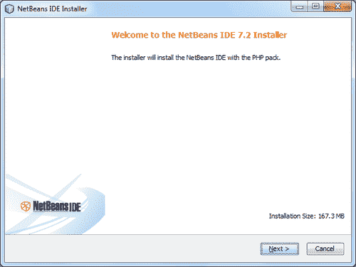

2.  By clicking on the **Next** button, you will be asked to accept the license agreement:

    

3.  The next step will ask you for the installation location for NetBeans and the JRE, with some default program file path:

    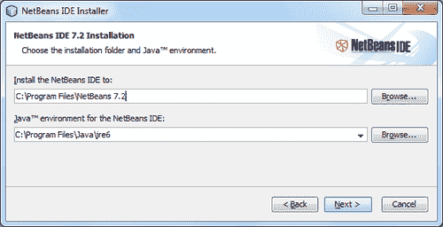

    请注意，JRE 是您计算机的 Java 软件，或 Java 运行时环境，也称为**Java 虚拟机（JVM）**。JRE 也将安装。

4.  Set the `installation` folder using the file browser, and click on the **Next** button. The next screenshot shows the total installation size:

    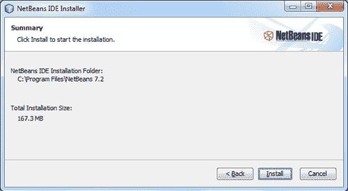

5.  If everything is set, start the installation by clicking on the **Install** button, which will start the installation process.

    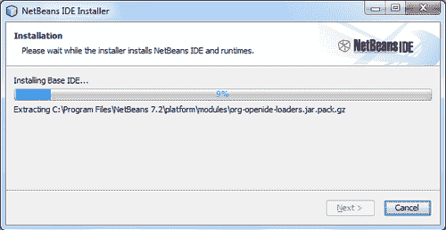

6.  After everything is installed correctly, you will see the finish wizard, as shown in the following screenshot:

    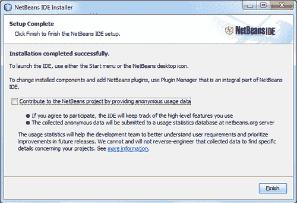

7.  You may check or uncheck the **Contribute to the NetBeans project by providing anonymous usage data** checkbox, as per your wish to participate or not. Note that it will send project-specific usage data to `netbeans.org`, so read the on-screen instructions carefully before checking it. Complete the installation by clicking on the **Finish** button. Now, go to your OS's **Program** menu or into the directory where you have installed the IDE to be run. The IDE initializes with a splash screen, as shown below:

    

8.  Finally, the running IDE looks similar to the following screenshot:

    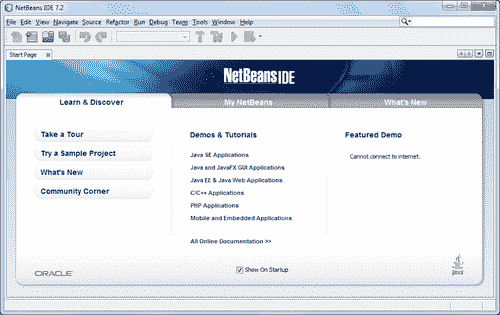

## 刚才发生了什么事？

现在我们已经安装并运行了 IDE，我们可以继续探索使用各种操作系统设置开发环境。

在下一节中，我们将在各种操作系统上配置 PHP 开发环境。对于相应的操作系统，我们将使用最新的 ApacheMySQL PHP 包安装程序，即 LAMP、XAMPP 和 MAMP。

### 将 PHP 作为插件添加到已存在的 NetBeans 安装中

如果要向 NetBeans IDE 配置添加功能，请使用 NetBeans 插件管理器。例如，假设您已经在为 Java 或 C/C++包运行 NetBeans IDE。然后，您决定尝试 PHP 功能。要执行此操作，请从 IDE 转到 NetBeans 插件管理器（选择**工具【插件】**，并将 PHP 包添加到现有安装中。

### 多个安装支架

NetBeans IDE 5.x、6.x 和 7.x 的多个安装可以与同一系统上的最新版本共存。要安装或运行最新版本，不必卸载早期版本。

如果您以前安装过 NetBeans IDE，则可以选择在首次运行最新 IDE 时是否从现有用户目录导入用户设置。

## 有一个英雄-从 NetBeans 添加或删除功能

因此，您已经在计算机上安装并运行了 NetBeans。现在，在已安装的 NetBeans 中添加更多功能或删除不必要的功能，并检查 IDE 中新添加的功能。您可以尝试插件管理器来实现这一点。

# 在 Windows 中设置开发环境

我们将使用 XAMPP 包自动安装和配置 Apache、MySQL 和 PHP，而不是单独安装和配置它们。我们将下载并安装最新的 XAMPP 包（1.7.7 版），其中包括以下内容：

*   Apache 2.2.21
*   MySQL 5.5.16
*   PHP 5.3.8
*   phpMyAdmin 3.4.5
*   FileZilla FTP 服务器 0.9.39

# 行动时间-在 Windows 中安装 XAMPP

以下步骤将下载并安装 XAMPP 包：

1.  我们将从以下位置下载最新 XAMPP 包的安装程序：[http://www.apachefriends.org/en/xampp-windows.html](http://www.apachefriends.org/en/xampp-windows.html) 。
2.  下载完成后，运行 `.exe`文件继续安装。更多安装详细信息请访问：[http://www.apachefriends.org/en/xampp-windows.html](http://www.apachefriends.org/en/xampp-windows.html) 。
3.  您可以选择将 Apache 服务器和 MySQL 数据库服务器作为服务安装，因此不需要从 XAMPP 控制面板手动启动它们。同样，您可以选择稍后从 XAMPP 控制面板配置这些服务，例如启动/停止、运行方式服务和卸载。
4.  After completing the installation process successfully, you will be able to proceed with further steps. Open the XAMPP control panel from your operating system's **Start | Programs | XAMPP**.

    

    **Svc**复选框表示该模块是作为 Windows 服务安装的，因此将在 Windows 启动时启动，或者您可以检查它们是否作为服务运行。如果您需要重新启动 Apache web 服务器，请使用 Apache 的**状态**之外的**停止/启动**按钮。

5.  Now, check your XAMPP installation. Visit the URL `http://localhost` from your web browser; the XAMPP welcome page looks similar to the following screenshot:

    

6.  From the left, click `phpinfo()` to check the PHP release and the installed components that you have configured:

    

7.  Click on the **Status** menu under the **Welcome** menu to check the installed tools status; the activated green status beside corresponding columns means that you are running Apache, MySQL, and PHP successfully:

    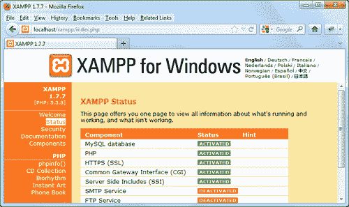

## 刚才发生了什么事？

我们已在系统上成功安装并运行 XAMPP 包。我们有 XAMPP 控制面板来控制已安装的服务，我们还有一个 web 界面来管理 MySQL 数据库。

## 有一个英雄-保护您的 XAMPP 安装

XAMPP 不是用于生产，而是仅用于开发环境中的开发人员。XAMPP 被配置为尽可能开放，它允许 web 开发人员获取他们想要的任何东西。对于开发环境来说，这非常好。但是，在生产环境中，这可能是致命的。因此，您需要在*安全问题*部分的帮助下，在[处保护您的 XAMPP 安装 http://www.apachefriends.org/en/xampp-windows.html](http://www.apachefriends.org/en/xampp-windows.html) 。

### 注

要在开发环境中显示错误，请将加载的 `php.ini`文件更新为设置 `display_errors = On`，并对生产环境执行相反的 `display_errors = Off`。

# 在 Ubuntu 桌面上设置开发环境

**Linux、Apache、MySQL**和**PHP****LAMP**是一些最常见的 web 托管平台。所以，这是一个完美的环境，为您建立和测试您的网站代码。在本节中，我们将在 Ubuntu 12.04 桌面上设置、配置和运行自己的 LAMP。

# 行动时间-在 Ubuntu 桌面上安装指示灯

按照这里列出的步骤在 Ubuntu 中安装 LAMP 包：

1.  Instead of installing each item separately, we will go with installing the LAMP server in a package in Ubuntu, which is fairly simple, along with a single terminal command:

    ```php
    sudo apt-get install lamp-server^ 

    ```

    `apt-get`命令是一个强大的命令行工具，用于配合 Ubuntu 的**高级打包工具（APT）**执行安装新软件包、升级现有软件包、更新包列表索引，甚至升级整个 Ubuntu 系统等功能。

    ### 注

    `sudo`用于以超级用户和插入符号（^）的权限调用当前用户，放在包名称之后，表示正在一起执行任务。

2.  此命令将导致 LAMP 包与最新的 PHP5、Apache 2、MySQL 和 PHP5 MySQL 软件一起立即开始安装。默认情况下，Apache 2 和 MySQL 作为服务安装，您的文档根目录将位于 `/var/www/`，而 `index.html`文件将位于 `/var/www/`。
3.  Both Apache and MySQL should be running. However, if required, you may start Apache by using the `service start` command as follows:

    ```php
    sudo service apache2 start 

    ```

    您可以使用以下命令停止 Apache：

    ```php
    sudo service apache2 stop 

    ```

4.  Now, let's check the LAMP installation. Point your browser to `http://localhost/`, and you will see the default, Apache 2 landing page, as shown in the following screenshot:

    

    这意味着您的 Apache2Web 服务器正在运行。您仍然可以按如下方式检查这些服务状态：

    ```php
    sudo service apache2 status 

    ```

    上一个命令将提供以下输出：

    ```php
    Apache is running. Process # 

    ```

5.  Again, to check the MySQL status, simply run the following command:

    ```php
    sudo service mysql status 

    ```

    将显示以下输出：

    ```php
    mysql start/running. Process # 

    ```

6.  To check the PHP installation, simply create a file named `test.php` in `/var/www/`, with the following line:

    ```php
    <?php phpinfo(); ?>

    ```

    ### 笔记

    您可以使用 `touch test.php`或使用 gedit 应用程序从终端创建新文件，然后编辑并保存该文件。

7.  Now, point your browser to `http://localhost/test.php`, and you will see the installed PHP and the component's configuration details:

    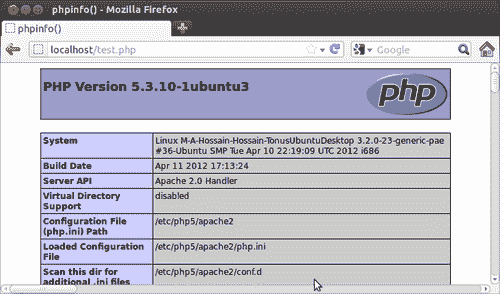

    *步骤 8*到*12*是可选的，因为我们在这些步骤中安装了`phpMyAdmin`。

8.  Though we can maintain our databases using NetBeans, we still need to maintain the MySQL database functionalities using a web-based interface. To do this, we may use `phpMyAdmin`.

    ```php
    sudo apt-get install phpmyadmin 

    ```

    `phpMyAdmin`将使用此命令安装，在安装过程中，您将收到一个蓝色窗口，询问您要使用哪台服务器-`apache2`或`lighttpd`。选择`apache2`，点击**确定**继续安装。请注意，在安装过程中，可能会要求您为数据库配置、密码等配置`phpMyAdmin`。

9.  After the installation point, open your browser with `http://localhost/phpmyadmin/`, and you will be able to view a `phpMyAdmin` landing page, as shown in the following screenshot:

    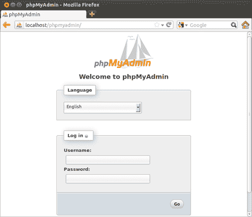

10.  如果您在 `http://localhost/phpmyadmin/`处收到 `404`错误，则需要在 Apache 下手动设置 `phpMyAdmin`，方法是使用 `gedit`（GNOME 桌面的官方文本编辑器）：

    ```php
    sudo gedit /etc/apache2/apache2.conf 

    ```

    修改 `/etc/apache2/apache2.conf`
11.  `gedit`将以图形方式打开文件，并在底部 `apache2.conf`内添加以下行：

    ```php
    Include /etc/phpmyadmin/apache.conf 

    ```

12.  Now, restart the Apache server to make the changes effective:

    ```php
    sudo service apache2 restart 

    ```

    刷新浏览器，您现在将拥有与上一屏幕截图所示相同的 `phpMyAdmin` 登录屏幕。

## 刚才发生了什么事？

Ubuntu 桌面上的 PHP 开发环境已经成功设置。LAMP 服务器的安装真是一个魅力，只需一个命令。我们学习了如何停止或重新启动 Apache 和 MySQL 等服务，以及检查它们的状态。

此外，我们还可选地安装了 `phpMyAdmin`，用于通过 web 界面管理数据库。请注意， `phpMyAdmin`并非用于生产，而是仅用于开发环境中的开发人员。

## 有一个围棋英雄-显示错误

由于我们精心设计了开发环境，PHP 错误消息将非常有助于我们解决这些问题。默认情况下，在 LAMP 安装中关闭 PHP 错误消息。您可以通过修改包含 `display_errors`的行来启用加载的 `php.ini`文件中显示的错误消息（请参见 `phpinfo)`。请注意，对 `php.ini`的任何更改都需要重新启动 Apache 2 服务器。

# 在 Mac OS X 中设置开发环境

由于我们有兴趣在一个捆绑包中设置 AMP，MAMP 包可能是 Mac OS X 的好包。

# 行动时间-在 Mac OS X 中安装 MAMP

按照以下步骤在 Mac OS X 中下载并安装 MAMP:

1.  Download the latest MAMP release from [http://www.mamp.info/en/](http://www.mamp.info/en/); download MAMP by clicking on the **Download now** button under **MAMP package downloader:**

    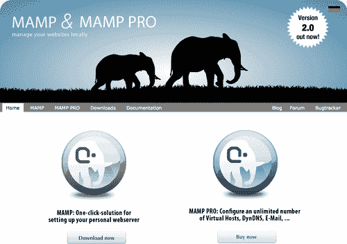

2.  如前面的屏幕截图所示，选择屏幕左侧的 MAMP 下载。
3.  Extract the downloaded file, and run the `.dmg` file. After accepting the "terms of use", you will see a screen similar to the following:

    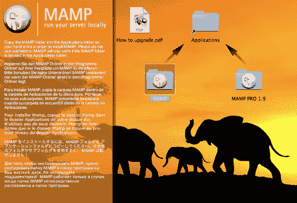

4.  将 `MAMP`文件夹拖入 `Applications`文件夹；MAMP 安装现已在 Mac OS X 上完成。
5.  Now, let's check our MAMP installation. Point your browser to `http://localhost/MAMP/`, and you will see the default MAMP landing page, as shown in the following screenshot:

    

    您可以在 MAMP 的**开始**页面的顶栏上查看**phpinfo、phpMyAdmin、**等。

6.  From `/Applications/MAMP/`, double-click on `MAMP.app` to run the Apache, MySQL, PHP, and MAMP control panel. The **MAMP** control panel shows the server status, and lets you start/stop servers, as shown in the following screenshot:

    

7.  在**首选项处从 MAMP 控制面板切换到 PHP 版本 5.3PHP 选项卡**（需要重新启动服务器）。

## 刚才发生了什么事？

我们已成功下载并安装了适用于 Mac OS X 开发环境的 MAMP。此外，我们已经测试了安装，发现它已经启动并运行良好。MAMP 登录页带有一个选项卡式界面，带有 `phpinfo, phpMyAdmin, SQLiteManager`，以此类推。您的 MAMP 捆绑包安装了以下程序和库：

*   Apache 2.0.63
*   MySQL 5.1.44
*   PHP 5.2.13 和 5.3.2
*   APC 3.1.3
*   每台加速器 0.9.6
*   XCache 1.2.2 和 1.3.0
*   phpMyAdmin 3.2.5
*   Zend Optimizer 3.3.9
*   SQLItemManager 1.2.4
*   Freetype 2.3.9
*   t1lib 5.1.2
*   卷曲 7.20.0
*   jpeg 8
*   libpng-1.2.42
*   gd 2.0.34
*   libxml 2.7.6
*   libxslt 1.1.26
*   gettext 0.17
*   libidn 1.15
*   iconv 1.13
*   mcrypt 2.6.8
*   YAZ 4.0.1 和 PHP/YAZ 1.0.14

到目前为止，我们已经安装了最新的 NetBeans IDE，并使用最新的 Apache、MySQL 和 PHP 设置了平台精确的开发环境。现在，我们最近完成的开发环境经过精心设计，足以开始构建项目。我们将在 IDE 的帮助下开始 PHP 项目的创建和维护。开发人员和 IDE 之间的这种协同方法确实可以提高生产率。

## 有一个英雄-保护你的 MAMP 安装

正如我们所了解到的，MAMP 并不是用于生产，而是仅用于开发环境中的开发人员。在[上的 MAMP 论坛的帮助下，保护您的 MAMP 安装 http://forum.mamp.info/viewtopic.php?t=365](http://forum.mamp.info/viewtopic.php?t=365) 。您可能需要设置 MySQL 密码、 `phpMyAdmin`密码、保护 MAMP 登录页等。

# 创建 NetBeans PHP 项目

NetBeans 将开发应用程序到项目中所需的所有文件分组。项目文件由原始代码和项目可能依赖的任何导入代码组成。NetBeans 项目管理通过立即向您展示程序某个部分的更改将如何影响程序的其余部分，使您更容易处理大型项目。因此，IDE 提供了一些特性，以促进项目中不断增长的开发。

# 行动时间到了——创建 NetBeans PHP 项目

最后，我们将创建一个 NetBeans PHP 项目来组织 PHP 内容，并获得对所创建项目的更多控制。

要创建 NetBeans PHP 项目，请执行以下步骤：

1.  In order to start the project creation, go to **File | New Project** from the IDE menu bar.

    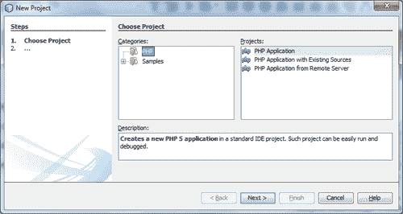

2.  在此窗口中，选择**PHP**作为项目类别，并选择默认选中的**PHP 应用程序**，这意味着我们将从头开始创建一个 PHP 项目。如果您已经有了源 PHP 代码，那么使用已有源代码的**PHP 应用程序**，您必须浏览已有源代码以设置源代码目录。
3.  Click on the **Next** button, which will take you to the following screen, as shown below:

    

4.  定义项目名称和 IDE，IDE 会自动建议给定名称的源文件夹。但是，我们可以通过浏览文件夹路径来显式定义源文件夹路径。另外，选择合适的**PHP 版本**，根据项目在 IDE 中的行为，选择**默认编码**。默认情况下，我们将选择具有最新 PHP 版本行为的项目， `UTF-8`作为**默认编码**。
5.  记住，项目元数据是仅在本地阶段使用的数据；或者，您可以将 NetBeans 创建的项目元数据放在单独的目录中。为此，请选中**框，将 NetBeans 元数据放入单独的目录**。
6.  So, we name our project as `chapter1`, and click on **Next**, as shown in the following screenshot:

    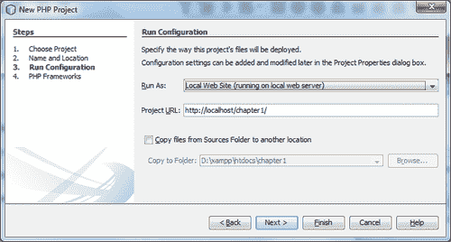

7.  Define where the project will run (remote server, and so on), as well as the project URL. The default project URL is a formation of `http://localhost/` concatenated with a trailing project name. Click on **Next** to get to the following screenshot:

    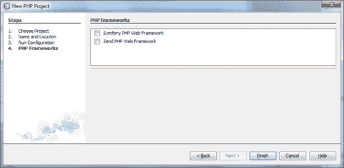

    如果需要，可选复选框用于将 PHP 框架支持添加到项目中。IDE 支持两种流行的 PHP 框架 Symfony 和 Zend 框架。

8.  Finally, click on **Finish** to complete the project wizard, and NetBeans will open the PHP project. It should look similar to the following screenshot:

    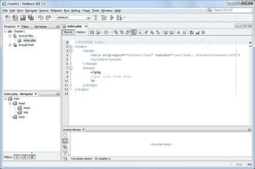

    在项目源内部自动创建索引页 `index.php`。

9.  为了测试该项目，我们将在 PHP 标记之间放置一些代码。那么，让我们把一个简单的 `echo`放在下面：

    ```php
    <?php
    echo "Hello World";
    ?>

    ```

10.  Save the file and point your browser to a project URL, `http://localhost/chapter1/`. The page should give an output similar to the following screenshot:

    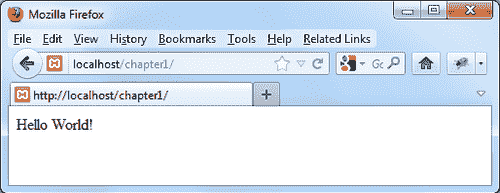

    因此，我们可以看到我们的 PHP 项目运行良好。

11.  To add more files and classes into our project, you may right-click on the project name, which will show the **Project** menu:

    

    有了这个项目上下文菜单，我们可以根据需要从**新**添加更多 PHP 文件、类等。正如我们在这个屏幕截图中看到的，项目也可以修改。例如，如果愿意，可以重命名、复制或更改项目配置。

## 刚才发生了什么事？

在 NetBeans 中创建一个新的 PHP 项目非常有吸引力。在创建它的过程中，我们注意到，我们可以借助逐步创建项目向导轻松地设置项目的多个配置。此外，我们还看到，在创建一个新项目之后，IDE 支持项目上下文菜单中的新 PHP 文件、类、接口等。请注意，从项目上下文菜单，您可以管理项目操作，例如运行和版本控制任务。要更改现有项目的设置，请将光标定位在项目节点上，然后从弹出菜单中选择**属性**。

因此，从现在开始，我们将采取以下步骤在 NetBeans 中创建一个新的 PHP 项目。

## 拥有一个英雄——从现有资源创建一个项目

如果已经有 PHP 项目的一些基础源代码，您可以将这些源文件放到 NETBeS 下，以便对项目有更多的控制。通过选择**文件【新建项目】**从现有来源创建新项目。

# 总结

我们已经实践了为特定操作系统设置开发环境。我们已成功安装并运行 IDE、web 服务器、数据库服务器、脚本语言和数据库管理 web 界面。

具体而言，我们涵盖：

*   NetBeans IDE 安装
*   不同平台上的 PHP 开发环境设置
*   在 NetBeans IDE 中创建 PHP 项目

我们还讨论了使用此类 IDE 的重要性，以及如何从 IDE 中获益。现在我们已经有了启动 PHP 开发所需的所有工具包，在下一章中，我们将学习如何使用编辑器功能进行快速高效的 PHP 开发。