# 第三章。使用 NetBeans 构建类似 Facebook 的状态海报

> 在本章中，我们将使用 NetBeans IDE 构建一个很酷的 PHP 项目。我们的计划简单明了。

我们将通过以下步骤创建类似 Facebook 的状态海报：

*   规划项目
*   创建状态流显示列表
*   使用 PHP-AJAX 创建状态海报

大多数社交网络平台，如 Facebook、Twitter 和 Google Plus，都在用户的好友之间提供状态发布功能，还允许用户查看好友的状态发布。因此，我们将四处窥探这是如何工作的，以及我们如何构建相似的产品。让我们选择实现一个有趣的功能，类似于最流行的社交网络平台 Facebook。

此外，我们还将讨论 MySQL 数据库连接和 PHP 类的创建以及我们的工作流程。所以，让我们努力吧。。。

# 项目规划

项目的正确规划对于模型、图表和流程图的智能开发和使用至关重要，这样项目就可以轻松地可视化需求。此外，它还描述了您将要做什么以及如何做。

我们将创建一个简单的 Facebook，如（[http://www.facebook.com](http://www.facebook.com) ）状态海报，并在其下方添加一个列表，以显示来自朋友的状态帖子，以及您自己的状态。在这个前端 PHP 应用程序中，我们将练习 JavaScript 库**jQuery**（[http://jquery.com/](http://jquery.com/) 使用**AJAX**（[发布状态 http://api.jquery.com/jQuery.ajax/](http://api.jquery.com/jQuery.ajax/) 。发布的状态将显示在状态堆栈的顶部，而无需重新加载页面。

在规划我们的项目时，我们将提前查看 web 应用程序的最终外观，并尝试了解如何使特定功能发挥作用。为了讨论工作流的各个方面，我们还将提供工作流图。

让我们看看我们在最后阶段将要构建什么。

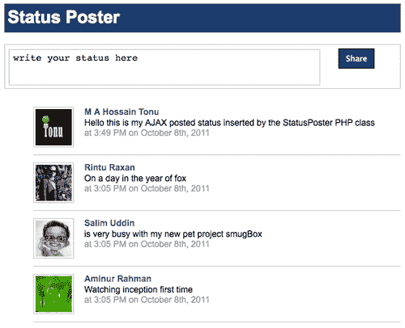

此**状态海报**将以以下方式发挥作用：


根据此图，用户在状态框中输入并点击**共享**按钮，触发 `Status.js`中绑定的 JavaScript 方法，通过 AJAX 将状态发布到服务器。服务器端脚本 `StatusPoster.php`接收要保存到数据库中的状态，并在完成任务后以成功消息进行响应。前端代码接收成功通知并在 status post 的显示堆栈顶部预先显示状态。

现在，我们将项目分为以下两部分，并将相应地进行开发：

*   状态流显示列表
*   使用 PHP-AJAX 的状态海报

我们收集了有关项目工作流的概念。因此，我们可以按照我们的计划立即开始实施该项目。从这一点出发，我们将通过一个新的 PHP 项目直接开始使用 NetBeans 开发 PHP 应用程序，并对 IDE 进行良好的实践。我们知道该怎么做，几分钟内我们就会学会怎么做。

## 理解 JSON JavaScript 对象表示法

**JavaScript 对象表示法（JSON）**是一种轻量级的数据交换格式，便于人类读写。它是一种易于机器解析和生成的格式，并且基于 JavaScript 编程语言的子集。JSON 是一种完全独立于语言的文本格式。

JSON 构建在两个结构上：

*   名称/值对的集合：在各种语言中，这是作为对象、记录、结构、字典、哈希表、键控列表或关联数组实现的。
*   值的有序列表：在大多数语言中，这是作为数组、向量、列表或序列实现的。

例如：

```php
{ "firstName":"John" , "lastName":"Doe" }

```

## 引入 jQuery 的权威 JavaScript 库

jQuery 是一个快速简洁的 JavaScript 库，它简化了**DOM**（**文档对象模型**）的遍历、事件处理、动画和 AJAX 交互，实现了快速 web 开发。jQuery 旨在改变编写 JavaScript 的方式-[http://jquery.com/](http://jquery.com/) 。

我们应该使用 jQuery 的一些原因如下：

*   自由和开源软件
*   轻量足迹
*   CSS3 兼容
*   跨浏览器
*   最小码
*   现成的插件

简单地说，jQuery 使您能够生成功能强大的动态用户界面。

### 注

在各种 jQuery 插件的帮助下，包括图像滑块、内容滑块、弹出框、选项卡式内容等，开发人员的工作可能会最小化，因为他们所要做的就是调整或自定义 jQuery 插件的小部分，使之成为更大的部分，以满足他们的需求。

## 理解 AJAX 异步 JavaScript 和 XML

**异步 JavaScript 和 XML**（**AJAX**）是客户端使用的一种编程技术或方法，用于在后台从服务器异步检索数据，而不会干扰现有页面的显示和行为。通常使用 `XMLHttpRequest`对象检索数据。尽管名称不同，实际上并不需要使用 XML，请求也不需要是异步的。

jQuery 库有一整套 AJAX 功能。其中的函数和方法允许我们从服务器加载数据，而无需刷新浏览器页面。

## 介绍 jQuery.ajax（）

让我们看看示例 `jQuery.ajax()`API。

```php
$.ajax({
url: "my_ajax_responder.php",
type: "POST",
data: {'name': 'Tonu'}, //key value paired or can be like "call=login&name=Tonu"
success: function(xh){
//success handler or callback
},
error: function(){
//error handler
}
});

```

在 `$.ajax()`函数中，您可以看到 AJAX 配置对象（使用 JavaScript 对象文字创建）被传递到其中，这些配置可以描述如下：

*   `url`表示与通信的服务器脚本的 URL
*   `type`表示 HTTP 请求类型；那就是 `GET/POST`
*   `data`包含以键值对或 URL 参数的形式发送到服务器的数据
*   `success`持有 AJAX 成功回调或方法以对获取的数据执行
*   `error`持有 AJAX 错误回调

现在，让我们来看另一个例子， `jQuery.ajax()`只是从服务器加载一个 JavaScript 文件：

```php
$.ajax({
type: "GET",
url: "test.js",
dataType: "script"
});

```

这里， `dataType`定义了要从服务器检索的数据类型；这种类型可以是 XML、JSON、 `script`、纯文本等。

## 介绍 PHP 数据对象（PDO）

**PHP 数据对象**（**PDO**扩展定义了一个轻量级且一致的接口，用于访问 PHP 中的数据库。PDO 提供了一个数据访问抽象层，这意味着无论使用哪个数据库，都使用相同的函数来发出查询和获取数据。PDO 不提供数据库抽象；它不会重写 SQL 或模拟缺少的特性。如果您需要一个完整的抽象层，那么您应该使用它。

值得一提的是，PDO 支持预先准备好的语句，它们是：

*   **更安全：**PDO 或底层数据库库将负责为您转义绑定变量。如果始终使用预处理语句，则永远不会受到 SQL 注入攻击的攻击。
*   **(Sometimes) Faster:** Many databases will cache the query plan for a prepared statement and refer to the prepared statement with a symbol, instead of retransmitting the entire query text. This is most noticeable if you prepare a statement only once, and then reuse the prepared statement object with different variables.

    ### 注

    PHP5.3 内置了 PDO 和 PDO_MYSQL 驱动程序。更多信息参见[http://www.php.net/manual/en/book.pdo.php](http://www.php.net/manual/en/book.pdo.php) 。

## 创建 NetBeans PHP 项目

在完成任务规划后，我们将着手处理其实际实施。

按*Ctrl+Shift+N*启动新的 NetBeans PHP 项目，并继续创建新项目，如[第 1 章](01.html "Chapter 1. Setting up your Development Environment")、*设置开发环境*中所述。让我们把这个项目命名为 `chapter3`作为我们的教程。

由于我们已经创建了 PHP 项目，我们将在项目内部自动创建 `index.php`文件。因此，可以通过将浏览器指向 `http://localhost/chapter3/`来定位项目。

# 创建状态流显示列表

根据我们项目的第一部分，我们现在将创建状态流显示列表。为了做到这一点，我们需要一个 PHP 类和一个 MySQL 数据库，其中填充了一些表示状态帖子的虚拟数据。PHP 类 `StatusPoster.php`将包含使用其构造函数中的 PDO 的 MySQL 数据库连接，以及从数据库中获取状态项行的方法。

## 设置数据库服务器

为了从数据库中存储和检索状态帖子，我们连接 MySQL 数据库服务器，创建数据库和表以插入状态条目，并获取这些条目以在状态流中显示。

# 行动时间-连接 MySQL 数据库服务器

在本节中，我们将通过向 IDE 提供访问凭据来创建 MySQL 服务器连接，IDE 将在该连接下显示可用数据库的列表：

1.  First of all, we will create the MySQL database server connection inside the IDE; press *Ctrl+5* to bring the **Services** window to focus, expand the **Databases** node, right-click on **MySQL Database Server**, and choose **Properties** to open the **MySQL Server Properties** window, as shown in the following screenshot:

    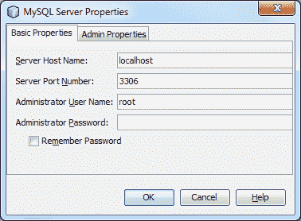

    在上一个屏幕截图中，IDE 已经填写了 MySQL 服务器详细信息的默认值，例如主机名、端口号、用户名和刚刚添加的密码。您可以随时根据需要更新这些详细信息。

2.  点击**管理属性**选项卡，可以输入控制 MySQL 服务器的信息。点击**确定**按钮保存设置。
3.  Now, you should have all the available databases listed under the **MySQL Server** node, as shown in the following screenshot:

    

## 刚才发生了什么事？

我们已成功连接 MySQL 服务器，并列出了可供所提供数据库用户使用的所有数据库。实际上，我们使 MySQL 数据库可以从 IDE 访问，这样我们就可以直接从 IDE 快速地操作任何类型的数据库查询。现在，我们将在其中创建一个新的数据库和表。

### 注

NetBeans IDE 键盘快捷键见*附录*。

## 创建数据库和表

每个项目都有单独的数据库是一种常见的做法。因此，我们将为我们的项目使用一个新的数据库，并使用一个表来存储条目。IDE 为数据库管理提供了优秀的 GUI 工具，如 SQL 编辑器、查询输出查看器和带有列列表的表查看器。

# 行动时间-创建 MySQL 数据库和表

从**MySQL 服务器**节点，我们将创建一个新的数据库，并运行一个查询来创建表以及必要的列字段。

1.  From the **Services** window, right-click on the **MySQL Server** node, and select **Create Database...**. A new dialog box will appear, as shown in the following screenshot:

    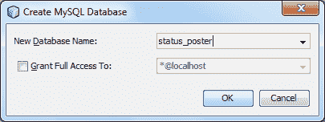

2.  输入名称 `status_poster`作为**新数据库名称**字段的值。未选中**授予对**的完全访问权限复选框。您可以使用此复选框和下拉列表授予给定用户访问权限。默认情况下， `admin`用户拥有所有权限。
3.  Click on **OK** to have the new database listed under the server node, and also to have the new database connection node created under the **Databases** node, as shown in the following screenshot:

    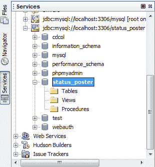

    根据此屏幕截图，状态海报连接节点下有三个子文件夹-**表格、视图、**和**程序**。

4.  Now, to create a new table in our database, right-click on the **Tables** folder and choose **Execute Command...** to open the **SQL Editor** canvas in the main window, as follows:

    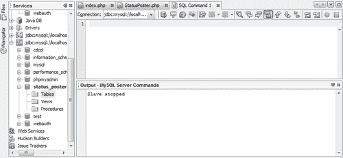

5.  In the SQL editor, type the following query to create the new `Status` table:

    ```php
    CREATE TABLE `status` (
    `id` bigint(20) NOT NULL AUTO_INCREMENT,
    `name` varchar(50) NOT NULL,
    `image` varchar(100) NOT NULL,
    `status` varchar(500) NOT NULL,
    `timestamp` int(11) unsigned NOT NULL,
    PRIMARY KEY (`id`)
    ) ENGINE=MyISAM DEFAULT CHARSET=utf8;

    ```

    如您所见， `status`表中的主键是 `id`（每个条目自动递增）。我们有 `name`字段来存储最多 `50`个字符的用户名。`e image`字段将存储最多为 `100`个字符的用户缩略图。状态字段将存储最多 500 个字符的用户状态帖子， `timestamp`字段将记录发布状态的时间。数据库引擎选择了 `MyISAM`来提供更快的表条目。

    因此，您只需在 NetBeans 查询编辑器中键入 MySQL 查询，然后运行查询以准备好数据库。

6.  To execute the query, either click on the **Run SQL** button in the task bar at the top (*Ctrl+Shift+E*), or right-click within the SQL editor and choose **Run Statement**. The IDE then generates the status table in the database, and you will receive a message similar to the following in the **Output** window:

    

7.  You will also have your table status listed under the **Table** subfolder, under the `status_poster` database connection, as shown in the following screenshot:

    

    在此屏幕截图中，展开的状态表显示了创建的列，主键标记为红色。

## 刚才发生了什么事？

IDE 展示了数据库管理功能；所有这些数据库和表的创建都可以通过单击和击键来完成。查询可以在 IDE 中以提示方式运行，SQL 命令的执行输出显示在单独的窗口中。接下来，我们将在创建的表中插入一些示例条目，以在状态流列表中显示它们。我们必须为本教程添加一些演示用户图像文件。

### 提示

您可以使用**创建表**向导创建表，在**数据库资源管理器中，右键点击**表**节点上的**，选择**创建表**。此时会打开**创建表**对话框，从中可以为具有特定属性的表添加列。

### 注

NetBeans IDE 键盘快捷键见*附录*。

## 将样本行插入表中

右键点击**表格**子文件夹下的 `status`表格，选择**执行命令。。。**，并在 SQL 编辑器中键入以下查询，将一些示例行插入到 `status`表中：

```php
INSERT INTO `status` VALUES('', 'Rintu Raxan', 'rintu.jpg', 'On a day in the year of fox', 1318064723);
INSERT INTO `status` VALUES('', 'Aminur Rahman', 'ami.jpg', 'Watching inception first time', 1318064721);
INSERT INTO `status` VALUES('', 'Salim Uddin', 'salim.jpg', 'is very busy with my new pet project smugBox', 1318064722);
INSERT INTO `status` VALUES('', 'M A Hossain Tonu', 'tonu.jpg', 'Hello this is my AJAX posted status inserted by the StatusPoster PHP class', 1318067362);

```

您可以看到，我们有一些 MySQL `INSERT`查询来存储一些测试用户的数据，例如名称、图像、状态 post 和 Unix 时间戳，用于状态流显示列表。每个这样的 `INSERT`查询都会在 `status`表中插入一行。

因此，我们的表中有一些示例行。为了验证记录是否已添加到 `status`表中，右键单击 `status`表并选择**查看数据。。。**。在主窗口中打开一个新的 SQL 编辑器选项卡，其中包含 SQL 编辑器中的 `select * from status`查询。执行此语句将在主窗口的下部区域生成一个表格数据查看器，如以下屏幕截图所示：


这个 SQL 查询非常简单，其中使用 `SELECT`关键字从表中选择数据，使用 SQL 速记`-*`表示应从表中选择所有列。

## 添加示例用户图像文件

在本教程中，我们在 `status`表中插入了一些示例行；在 `image`列中，我们有一些用户图像文件名，它们实际上存储在 `user`文件夹下，在项目的 `images`目录中。这些示例用户图像可以在本章的项目源代码中找到。从 Packt Publishing 网站下载这个完整的项目源代码，并复制示例用户图像。

要在 `project`文件夹中创建子文件夹，请右键单击 `chapter3`项目节点，然后选择**新建文件夹。。。**；在**新建文件夹**对话框中输入文件夹名称 `images`，点击**完成**创建文件夹。现在以同样的方式在 `images`目录下创建另一个名为“user”的文件夹，并将复制的示例用户图像文件放在那里。

## 创建 StatusPoster PHP 类

`StatusPoster`PHP 类的目的是查询数据库以获取和插入状态条目。此类的一个方法将用于将状态条目插入该数据库表，另一个方法将用于执行从表中获取条目的操作。简单地说，该类将用作数据库代理，并可用于必要的数据库操作。

# 行动时间-创建类、添加构造函数和创建方法

我们将使用 NetBeans 代码模板创建 `StatusPoster.php`文件和类框架，要在类中创建方法，我们也将使用 `function`模板。我们将在类构造函数中使用 PDO 创建一个 MySQL 数据库连接，这样数据库连接将与对象实例化和从表中获取状态帖子的 `getStatusPosts()`方法一起创建。

1.  From the **Projects** pane, right-click on project name `chapter3`, select **New | PHP File...**, and name the file `StatusPoster`, as shown in the following screenshot:

    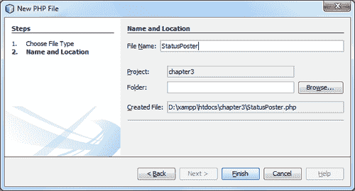

2.  点击**完成**将文件添加到我们的项目中，并在编辑器中自动打开。您将看到文件中放置的 PHP 开始和结束标记。
3.  In order to create the PHP class skeleton, we will use PHP code templates. We type `cls` and press the *Tab* key to obtain the class skeleton with a constructor inside, as follows:

    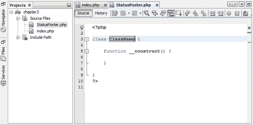

4.  In the preceding screenshot, `classname` is already selected. You will just have to type `StatusPoster` as the value for `classname`, and press the *Tab key* to select the constructor name, as shown in the following screenshot:

    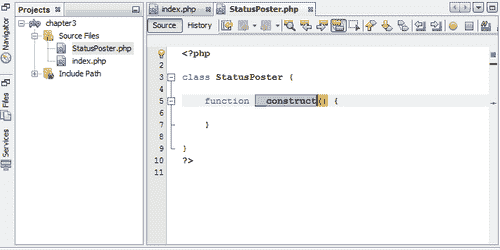

    构造函数名称保持不变，因为它是构造函数的默认 PHP5 命名约定。

5.  Now, add some class constants and attributes to hold the database credentials, as shown in the following code snippet:

    ```php
    class StatusPoster {
    private $db = NULL;
    const DB_SERVER = "localhost";
    const DB_USER = "root";
    const DB_PASSWORD = "root";
    const DB_NAME = "status_poster";
    public function __construct() {
    }
    }

    ```

    您可以看到添加的类常量，其中包含数据库信息，例如数据库服务器名称、用户名、密码和数据库名称。添加了一个 `private`类变量 `$db`来保存 PDO 对象内部的数据库连接。您可以根据自己的要求修改这些常量。

    ### 注

    **Private:**此属性或方法只能由其所属的类或对象使用；其他地方无法访问它。

6.  To fetch the status posts from the `status` table, we will add an empty method named `getStatusPosts` inside the class. To do this, type `fnc` and press *Tab* to have the empty function code generated with the selected function name. Type the selected function name as `getStatusPosts`, and drop the parameter `$param` variable this time. Our class skeleton will look similar to the following:

    ```php
    class StatusPoster {
    private $db = NULL;
    const DB_SERVER = "localhost";
    const DB_USER = "root";
    const DB_PASSWORD = "root";
    const DB_NAME = "status_poster";
    public function __construct() {
    }
    public function getStatusPosts() {
    }
    }

    ```

    我们已经准备好了类框架，我们将在这些类方法中添加代码。现在，我们将在构造函数中创建数据库连接代码。

7.  To connect MySQL using PDO, type the following lines inside the class constructor so that it looks similar to the following code snippet:

    ```php
    public function __construct() {
    $dsn = 'mysql:dbname='.self::DB_NAME.';host='.self::DB_SERVER;
    try {
    $this->db = new PDO($dsn, self::DB_USER, self::DB_PASSWORD);
    } catch (PDOException $e) {
    throw new Exception('Connection failed: ' . $e->getMessage());
    }
    return $this->db;
    }

    ```

    `public function __construct ()`使用 PDO 连接 MySQL 数据库 PDO 实例的数据库连接存储在类的私有变量中。

    `$dsn`变量包含**数据源名称（DSN）**，其中包含连接到数据库所需的信息。使用 PDO 的最大优点之一是，如果我们想迁移到其他 SQL 解决方案，那么我们需要做的就是调整 DSN 参数字符串。

    以下行创建一个 PDO 实例来表示与请求数据库的连接，并在成功时返回一个 PDO 对象：

    ```php
    $this->db = new PDO($dsn, self::DB_USER, self::DB_PASSWORD);

    ```

    请注意，如果尝试连接到请求的数据库失败，它将抛出一个`PDOException`异常。

8.  To select the status posts from the table, we shall write a `select` query with the help of an auto completion code inside the `getStatusPosts` method. As we discussed in the previous chapter, SQL code completion begins with the SQL keyword `SELECT` and by pressing *Ctrl+Space bar*. So, we will proceed according to these steps and write the following query code inside this method:

    ```php
    public function getStatusPosts() {
    $statement = $this->db->prepare("SELECT name, image, status, timestamp FROM status ORDER BY timestamp DESC,id");
    $statement->execute();
    if ($statement->rowCount() > 0) {
    return $statement->fetchAll();
    }
    return false;
    }

    ```

    使用此代码，我们从按时间戳排序的表状态中按降序选择列（`name, image, status,`和`timestamp`。默认情况下，我们还按升序选择 id。`prepare()`方法准备由`PDOStatement::execute()`方法执行的 SQL 语句。在`execute()`方法之后，如果找到行，那么它将获取并返回所有表条目。

9.  现在，我们将在这个文件的底部实例化这个类的一个对象，如下所示：

    ```php
    $status = new StatusPoster();

    ```

## 刚才发生了什么事？

PDO 实例在类构造函数中创建并存储在 `$db`变量中，因此其他成员方法可以以 `$this->db`的形式访问该类变量，以使用 `prepare(), execute()`等 PDO 方法。

对将多次发出的语句调用 `PDO::prepare()`和 `PDOStatement::execute()`可以通过缓存查询计划和元信息等来优化性能。

到目前为止，我们已经在 `StatusPoster.php`中准备好了数据库操作代码。我们将创建一个 HTML 用户界面来显示从数据库表 status 获取的状态列表。

### 注

NetBeans IDE 键盘快捷键见*附录*。

## 突击测验-理解 PDO

1.  哪一个不是 PDO 功能？
    1.  准备好的发言
    2.  绑定值
    3.  绑定对象
    4.  数据访问抽象

## 触发显示状态列表的用户界面

HTML 用户界面将显示通过 `getStatusPosts`方法从 `StatusPoster`类检索到的状态列表，用户将能够查看来自测试朋友的状态帖子列表以及自己的帖子。该接口将使用 jQuery 和由 CSS 类设置样式的状态列表。

# 行动时间-向文档添加 CSS 支持

我们将使用 `index.php`作为应用程序的单页界面，并将向文档中添加 CSS 样式表支持。为了保持实践，我们将尝试将样式属性放入类中，以便它们可以重用，并且可以在需要特定样式类时用作元素的类名。那么，让我们先创建 CSS 类：

1.  在我们的项目源目录中为 CSS 文件创建一个名为 `styles`的文件夹。
2.  To create a **Cascading Style Sheet** where CSS classes reside, right-click on the `styles` folder inside the project, select **New | Cascading Style Sheet** from the **New Cascading Style Sheet** dialog box, name the CSS file as `styles.css`, and hit **Finish**. Drop all the comments and code blocks in the opened CSS file. Type the following style classes in the CSS file:

    ```php
    body {
    font-family:Arial,Helvetica,sans-serif;
    font-size:12px;
    }
    h1,input {
    color:#fff;
    background-color:#1A3C6C;
    }
    h1,input,textarea,.inputbox,.postStatus {
    padding:5px;
    }
    input,textarea,ul li img,.inputbox {
    border:1px solid #ccc;
    }
    ul li {
    width:100%;
    display:block;
    border-bottom:1px solid #ccc;
    padding:10px 0;
    }
    ul li img {
    padding:2px;
    }
    .container {
    width:60%;
    float:none;
    margin:auto;
    }
    .content {
    padding-left:15px;
    }
    .content a {
    font-weight:700;
    color:#3B5998;
    text-decoration:none;
    }
    .clearer {
    clear:both;
    }
    .hidden {
    display:none;
    }
    .left {
    float:left;
    }
    .right {
    float:right;
    }
    .localtime {
    color:#999;
    }
    .inputbox {
    height:70px;
    margin:15px 0;
    }
    .inputbox textarea {
    width:450px;
    height:50px;
    overflow:hidden;
    }
    .inputbox input {
    margin-right:30px;
    width:50px;
    }

    ```

    我们将使用`container`类在文档体内的应用接口容器`<div>`上应用样式；`ul`li 将表示列出的项目，这些项目是带有父`ul`元素的状态`li`项目，以及其他 HTML 元素，如 h1、`img`和`textarea`，它们也使用 CSS 类进行样式设置。

3.  Add the following PHP code snippet at the top of the `index.php` file:

    ```php
    <?php
    define('BASE_URL', 'http://localhost/chapter3/');
    ?>

    ```

    我们定义了一个 PHP 常量，用于定义 web 应用程序的基本 URL。基本 URL 可用于为项目资产文件（CSS 或 JS 文件）提供绝对路径。您可以将项目目录名替换为第 3 章。

4.  Now, add the following line to your `index.php` document heading below the `<title>` tag, to include the CSS file.

    ```php
    <link href="<?=BASE_URL?>styles/styles.css" media="screen" rel="stylesheet" type="text/css" />

    ```

    通过这一行，我们将 CSS 文件嵌入到 HTML 文档中。这里，`BASE_URL`告诉我们文件`styles/styles.css`在项目目录下可用。因此，我们的界面元素将继承`styles.css`文件中的样式。

## 刚才发生了什么事？

为了在浏览器上保持一致的界面，已经使用 CSS 类对各种 HTML 元素进行了样式设置，并且一些类是从指定元素继承样式的位置编写的。

为了将 CSS 代码保持在最少行数，使用逗号分隔的类或元素名称共享公共属性，如下所示：

```php
h1, input, textarea, .inputbox, .postStatus{
padding:5px;
}

```

这里是 `padding:5px`；样式将应用于所提到的元素或给定的类。因此，可以通过这种方式减轻类之间的公共属性。

为了理解类的可重用性问题，让我们看一下以下内容：

```php
.left {
float:left;
}

```

我们可以使用 `left`作为多个元素的类名，这些元素需要 `float:left`样式，如 `<div class="left">, `等。

# 行动时间-添加 jQuery 支持和自定义 JS 库

我们将添加一个 jQuery（一个 JavaScript 库；更多信息参见[http://jquery.com/)](http://jquery.com/))支持文档并创建基于 jQuery 的自定义 JS 库。

对于 JS 库，我们将创建一个单独的 JavaScript 文件 `status.js`，接口 JS 代码将驻留在该文件中，用于执行接口任务，例如通过 AJAX 发布状态和一些用于显示本地日期时间的实用方法。那么，让我们创建自定义 JS 库：

1.  To add the jQuery support from Google Content Delivery Network (CDN) to our document, add the following lines to your `index.php` document heading below the `<link>` tag:

    ```php
    <script src= "http://ajax.googleapis.com/ajax/libs/jquery/1.7/jquery.min.js">
    </script>

    ```

    有了这一行，我们就有了来自 CDN 的最新 jQuery 版本。请注意，版本 1.7 表示可用的最新版本，即 1.7.X，除非您指定了确切的数字，即 1.7.2 或更高。现在，我们的文档已启用 jQuery 并准备好使用 jQuery 特性。

2.  要创建基于 jQuery 的自定义 JS 库，请在 `js`文件夹中添加一个新的 JavaScript 文件，并将其命名为 `status.js`。将该文件包含在文档头中，以便 `<head>`标记看起来类似于以下代码片段：

    ```php
    <head>
    <meta http-equiv="Content-Type" content="text/html; charset=UTF-8">
    <title>Status updater</title>
    <link href="<?=BASE_URL?>styles/styles.css" media="screen" rel="stylesheet" type="text/css" />
    <script src="http://ajax.googleapis.com/ajax/libs/jquery/1.7/jquery.min.js"></script>
    <script src="<?=BASE_URL?>js/status.js"></script>
    </head>

    ```

3.  Now, create the `Status` JS library skeleton inside the `status.js` file, as follows:

    ```php
    $(document).ready(function ($)
    {
    var Status = {
    };
    });

    ```

    您可以看到变量 `Status`包含一个使用 JavaScript 对象文字的对象（括在花括号内的键值对）。

    ```php
    var obj = { a : function(){ }, b : function(){ } }

    ```

    请注意，库代码是用 jQuery `$(document).ready()`函数包装的。

4.  Let's write some utility JavaScript methods inside the `status` object and type the following `currentTime ()` method:

    ```php
    currentTime: function (timestamp) {
    if (typeof timestamp !== 'undefined' && timestamp !== '')
    var currentTime = new Date(timestamp * 1000);
    else
    var currentTime = new Date();
    var hours = currentTime.getHours();
    var minutes = currentTime.getMinutes();
    var timeStr = '';
    if (minutes < 10) {
    minutes = "0" + minutes
    }
    timeStr = ((hours > 12) ? (hours - 12) : hours) + ":" + minutes + ' ';
    if (hours > 11) {
    timeStr += "PM";
    } else {
    timeStr += "AM";
    }
    return timeStr;
    },

    ```

    `currentTime ()`方法返回从 Unix 时间戳转换的本地时间。请记住，如果时间戳不存在，则返回当前本地时间。样本输出可以是凌晨 3:22 或下午 2:30。

    您可以在`var currentTime = new Date(timestamp * 1000);`行中看到，Unix 时间戳已转换为 JS 时间戳（以毫秒为单位），并创建了一个新的日期对象。小时和分钟分别从`currentTime.getHours()`和`currentTime. getMinutes ()`方法中选取。注意，`currentTime () method`用逗号（，）分隔。

5.  Add the `currentDate ()` method inside the `Status` object, as follows:

    ```php
    currentDate: function (timestamp) {
    var m_names = ["January", "February", "March", "April", "May", "June", "July", "August", "September", "October", "November", "December"];
    if (typeof timestamp !== 'undefined' && timestamp !== '')
    var d = new Date(timestamp * 1000);
    else
    var d = new Date();
    var curr_date = d.getDate();
    var curr_month = d.getMonth();
    var curr_year = d.getFullYear();
    var sup = "";
    if (curr_date === 1 || curr_date === 21 || curr_date === 31)
    {
    sup = "st";
    }
    else if (curr_date === 2 || curr_date === 22)
    {
    sup = "nd";
    }
    else if (curr_date === 3 || curr_date === 23)
    {
    sup = "rd";
    }
    else
    {
    sup = "th";
    }
    return m_names[curr_month] + ' ' + curr_date + sup + ', ' + curr_year;
    },

    ```

    `currentDate ()`方法返回转换后的本地日期。与`step 4`中前面的方法类似，它从 date 对象获取日期、月份和年份。

6.  Now, add the `getLocalTimeStr ()` method as follows:

    ```php
    getLocalTimeStr: function (gmtTimestampInSec) {
    return 'at ' + this.currentTime(gmtTimestampInSec)
    + ' on ' + this.currentDate(gmtTimestampInSec);
    }

    ```

    上面的方法返回字符串中连接的格式化时间和日期。

## 刚才发生了什么事？

jQuery 为我们提供了一个名为 `ready`的文档对象的特殊实用程序，允许我们仅在 DOM 完全完成加载后执行代码。使用 `$(document).ready()`，我们可以对一系列事件进行排队，并在 DOM 初始化后执行它们。 `$(document).ready()`方法以一个函数（匿名）作为参数，在 DOM 完成加载后传递给调用，并在函数内执行代码。

如果您正在为发行版开发代码，补偿任何可能的名称冲突总是很重要的。因此，我们将 `$`作为匿名函数的参数传递。 `$`指的是内部的 `jQuery`，因此在脚本之后导入的其他 `$`函数并不冲突。

最后，为了从 UNIX 时间戳获取本地日期和时间，我们在自定义 JavaScript 库中添加了实用程序方法。作为一个使用示例， `currentDate()`实用方法可以从对象的范围内和范围外分别调用为 `this.currentDate()and Status.currentDate()`。

# 行动时间-显示状态列表

我们将把接口元素放在 `index.php`中，并以适当的方式嵌入 PHP 代码。那么，让我们来完成以下步骤：

1.  Modify the `index.php` file inside the `<body>` tag, drop the PHP tag, and place the status entries in the `<div>` container tag and elements, as follows:

    ```php
    <body>
    <div id="container" class="container">
    <h1>Status Poster</h1>
    <ul>
    </ul>
    </div>
    </body>

    ```

    从这段代码中，您可以看到我们的应用程序界面将位于带有 id 容器的 `<div>`容器中， `<ul>`标记将保存包含用户状态帖子的内部 `<li>`项堆栈，其中将填充一些 PHP 代码。

2.  Above the `<!DOCTYPE html>` tag, at the top PHP code snippet of the `index.php` file, type the following lines to integrate the `StatusPoster` class so that the code snippet looks similar to the following:

    ```php
    <?php
    require_once 'StatusPoster.php';
    $result = $status->getStatusPosts();
    define('BASE_URL', 'http://localhost/chapter3/');
    ?>

    ```

    从代码中，需要一次 PHP 类文件来集成该类，并将其实例使用到我们的应用程序中。在这一行，我们调用了`$status`对象的`getStatusPosts()`方法，从数据库中获取所有状态条目，返回的结果数组也存储在`$result`中。

3.  To display a status stream, we will write the following PHP code to loop through the `$result` array inside the `<ul>` tag:

    ```php
    <?php
    if (is_array($result))
    foreach ($result as $row) {
    echo '
    <li>
    <a href="#">
    
    </a>
    <div class="content left">
    <a href="#">' . $row['name'] . '</a>
    <div class="status">' . $row['status'] . '</div>
    <span class="localtime" data-timestamp="' . $row['timestamp'] . '"></span>
    </div>
    <div class="clearer"></div>
    </li>
    ';
    }
    ?>

    ```

    首先，验证了`$result`阵列的正确类型。我们循环遍历数组，使每个条目都进入`$row`变量。前面的服务器脚本为每个状态条目生成一个`<li>` 项，每个`<li>`项包含一个用户映像、一个超链接名称、一个用户状态文本和一个 UNIX 时间戳元素。请注意，时间戳已转储到类名为`localtime`的`span`元素的`data-timestamp`属性中。为了更好地理解，状态列表的项目框架如下图所示：

    

4.  Now, we need to convert the PHP-dumped timestamp inside the `data-timestamp` attribute using the jQuery code, as soon as the DOM is ready. Add the following method inside the `Status` object of the library `status.js:`

    ```php
    showLocalTime: function () {
    var spans = $('span.localtime[data-timestamp]');
    spans.each( function () {
    var localTimeStr = Status.getLocalTimeStr( $(this).attr('data-timestamp') );
    $(this).html(localTimeStr);
    });
    },

    ```

    该方法使用 jQuery 选择器，为每个元素选择所有具有带有`$('span.localtime[data-timestamp]');.`的数据时间戳属性的 span 元素，用`$(this).attr('data-timestamp')`解析时间戳，并传递到`Status.getLocalTimeStr()`以获得本地时间字符串。最后，它使用该本地时间字符串设置每个`span`元素的内部 HTML。

5.  To enable `Status.showLocalTime()` to work immediately with DOM, call the method, as follows, before the termination line of `ready()` method:

    ```php
    $(document).ready(function ($)
    {
    var Status = {
    //whole library methods...
    };
    Status.showLocalTime();
    });

    ```

    因此，每个帖子下都会显示用户的本地日期和时间。

6.  Finally, point your browser with the project URL, or press the **Run Project (chapter3)** button from the toolbar, or press *F6* from the IDE to have the status stream display the list, which looks similar to the following screenshot:

    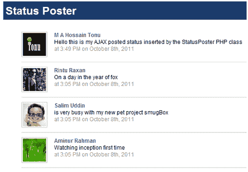

## 刚才发生了什么事？

PHP 脚本转储 `<ul>`标记内的 `<li>`项，接口 JS 代码 `Status.showLocalTime()`；解析转储的时间戳，并在 DOM 就绪后立即在用户的本地时间中显示它。如果我们在没有时区转换的情况下显示 UNIX 时间戳中的日期和时间，那么我们可能必须交付服务器的日期和时间，这可能与用户的时间不一致。同样，服务器不知道用户的本地时区，客户端界面也知道用户的本地时区。因此，我们使用客户端代码快速解决了本地时间显示问题。

因此，我们已经完成了项目的第一部分。我们已经创建了一个界面，其中的状态流看起来像 Facebook。

到目前为止，我们已经能够使用 IDE 处理数据库操作，通过使用 NetBeans 代码模板创建 PHP 类和方法，我们还能够为 web 应用程序创建必要的用户界面文件。

## 尝试英雄-调整 CSS

对于大型状态帖子，可以在每个 `<li>`中发现界面被破坏，因此最好修复用户界面问题。您可以在相应 CSS 文件的 `.content`类中添加固定宽度。

## 突击测验-理解 CSS

1.  CSS 代表什么？
    1.  级联样式表
    2.  级联样式表
    3.  彩色样式表
    4.  计算机样式表
2.  引用外部样式表的正确 HTML 格式是什么？
    1.  `<link rel="stylesheet" type="text/css" href="mystyle.css">`
    2.  `<style src="mystyle.css">`
    3.  `<stylesheet>mystyle.css</stylesheet>`
3.  需要在 CSS 类中添加什么属性才能在该元素周围留出一些空间？
    1.  `padding`
    2.  `margin`
    3.  `padding-bottom and padding-top`
    4.  `display`

# 使用 PHP-AJAX 制作状态海报

用户的状态文本应提交到服务器，而无需重新加载页面。要做到这一点，我们可以使用 AJAX 方法，用户的数据可以通过 HTTP 方法发送到服务器，并等待服务器的响应。一旦服务器响应，我们就可以解析响应数据，并可以通过编程方式做出决定。在我们的例子中，如果服务器响应成功，我们将根据该结果更新接口 DOM。

简单地说，我们将使用 AJAX 通过 `HTTP POST`方法将用户的状态文本提交到驻留在 `index.php`的服务器端 PHP 代码中，并将来自服务器的预期数据类型配置为 JSON。因此，我们可以轻松解析 JSON 并确定状态是否成功保存。从成功的服务器响应中，我们可以更新状态流显示列表，并将新发布的状态放在该列表的顶部。但是，在出现任何故障或错误的情况下，我们可以解析错误消息并将其显示到接口中。

# 动作时间-将状态输入框添加到界面

在本节中，我们将简单地添加一个 HTML 表单，该表单包含一个用于状态公告的文本区域和一个用于表单提交的**提交**按钮。我们将在 `index.php`处的 `<ul>`标记之前添加用 `div`元素包装的表单。

1.  In order to add the status poster box, we add the following HTML code inside the `div#container`, before the `<ul>` tag:

    ```php
    <div class="inputbox">
    <form id="statusFrom" action="index.php" method="post" >
    <textarea name="status" id="status_box">Write your status here</textarea>
    <input class="right" type="submit" name="submit" id="submit" value="Share" />
    <div id="postStatus" class="postStatus clearer hidden">loading</div>
    </form>
    </div>

    ```

    因此，`div.inputbox`将包含带有`share`或`submit`按钮的状态输入框。`div#postStatus`将显示传达该状态的提交后进度信息状态，无论该状态是否已成功提交。在 AJAX 帖子进行期间，我们将使用一些奇特的加载`.gif` 图像。`ajaxload.gif`图像也保存在项目的`images`目录中。

2.  Now, refresh your browser with the project URL, and the status input box should look similar to the following screenshot:

    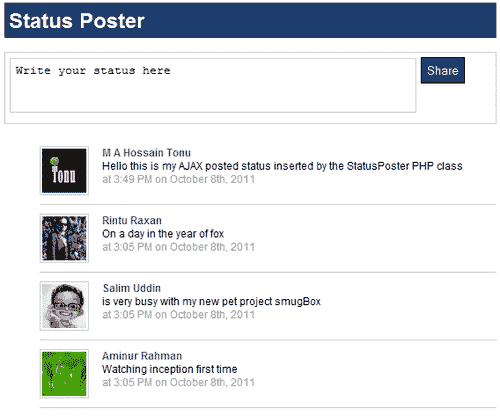

## 刚才发生了什么事？

检查 `form`标签打开的线路 `<form id="statusFrom" action="index.php" method="post" >`。可以使用 jQuery `action`属性使用 `id`属性选择表单，jQuery `action`属性包含脚本名称 `index.php`，这意味着它将被发布到我们正在处理的同一个文件中。您可以看到， `method`属性包含提交表单的 HTTP 方法类型。jQuery 代码不需要 `action`和 `method`属性。相反，在这种情况下，我们将保留它们。如果浏览器的 JavaScript 被禁用，那么我们仍然可以通过 `POST`方法将表单提交给 `index.php`。

请注意， `div#postStatus`在默认情况下使用 CSS 类 `hidden`隐藏，并且只有在 AJAX 工作时才可见。

### 注

NetBeans IDE 键盘快捷键见*附录*。

## 向 index.php 添加新的状态发布模板

我们需要在编码时保持行为的分离，因为 HTML 标记应该与 JavaScript 代码分开。此外，我们需要更新状态流显示列表，并将新的状态帖子放在列表的顶部，而无需重新加载页面。

我们知道，每个状态条目都可以组织在一个 `<li>`项目中，在该项目中，条目值（如用户名、图像和状态公告以及下面提到的本地日期时间）应使用适当的标记元素精心编制。因此，我们需要为新状态帖子创建一个条目模板。使用该模板，JavaScript 代码可以生成一个新的接口条目，并将其放在状态流的顶部。

在文档 `<body>`标签内 `div#container`结束标签下方添加以下模板：

```php
<div id="statusTemplate" class="hidden">
<li>
<a href="#">

</a>
<div class="content left">
<a href="#">#NAME</a>
<div class="status">#STATUS</div>
<span class="localtime">#TIME</span>
</div>
<div class="clearer"></div>
</li>
</div>

```

我们可以看到有占位符，例如 `#SRC`用于配置文件图片的图像 URL， `#NAME`用于条目的用户名， `#STATUS`用于状态文本， `#TIME`用于本地日期时间。通过复制此模板，可以用适当的值替换这些占位符，并在 `<ul>`元素前面添加占位符。请注意，整个模板保存在一个隐藏的 `div`元素中，以将其从用户视图中排除。

## 创建 AJAX 状态海报

AJAX 用于从浏览器到 web 服务器的频繁通信。这种著名的技术正在**富互联网应用程序**（**RIA**中大量使用，jQuery 提供了一个非常简单的 AJAX 框架。AJAX 海报将在不重新加载页面的情况下发布状态文本，并使用顶部的最新状态条目更新状态堆栈。

# 行动时间-使用 JQuery AJAX 创建状态海报

我们将在 `status.js`库中创建一个 `post()`方法，并将该方法与**提交**按钮上的点击事件绑定。我们将通过依次添加代码行来创建该方法，如下步骤所示：

1.  At our `status.js` library, type the following `post()` method, terminated with a comma, to add it inside the `Status` library:

    ```php
    post: function () {
    var myname = 'M A Hossain Tonu', myimage = 'images/user/tonu.jpg';
    var loadingHtml = '';
    var successMsg = 'Status Posted Successfully ...';
    var statusTxt = $('#status_box').val(), postStatus = $('#postStatus');
    },

    ```

    在变量声明部分，`myname`和`myimage`变量包含登录的演示、用户名和配置文件图片 URL。`loadingHtml`包含用于显示加载 GIF 动画的 img 标记。您还可以看到，`statusTxt`包含使用`$('#status_box').val()`获得的状态框值，`postStatus`缓存了`div#postStatus`元素。

2.  Now, add the following line after the variables declaration section within the `post()` method:

    ```php
    if ((statusTxt.trim() !== '' && statusTxt !== 'Write your status here'
    && statusTxt.length < 500) === false) return;

    ```

    此代码验证 `statusTxt`是否为空或是否包含默认输入消息，即使它在 500 个字符的最大输入限制内。如果任何此类验证失败，则在执行后返回该方法。

3.  To display animation loading while the AJAX operation is in progress, we can add the following line after the previous line *(step 2):*

    ```php
    postStatus.html(loadingHtml).fadeIn('slow');

    ```

    它在 div 元素的`#postStatus`中淡出，加载图像在里面。

4.  Now, it's time to add the AJAX feature inside the method. Add the following jQuery code after the previous line *(step 3):*

    ```php
    $.ajax({
    data: $('form').serialize(),
    url: 'index.php',
    type: 'POST',
    dataType: 'json',
    success: function (response) {
    //ajax success callback codes
    },
    error: function () {}
    });

    ```

    在这段代码中，您可以看到添加了 AJAX 框架，并且 jQuery`$.ajax()`方法与配置对象一起传递。配置对象是使用 JavaScript 对象文字技术创建的。您可以看到这些键值对；例如，`data`包含表单的序列化值，使用`$('form').serialize(), url`保存要提交数据的服务器 URL，`dataType`作为 JSON 提供，这样我们将在`success()`回调方法中传递一个 JSON 对象。检查默认的`success`和`error`回调方法；您可以看到一个变量`response`被传递到`success`回调中，它实际上是一个使用 AJAX 从服务器获取的 JSON 对象。

5.  On successful AJAX submission, let's type the following code inside the `success` callback method:

    ```php
    if (response.success === true) {
    postStatus.html('<strong>'+successMsg+'</strong>');
    $('#status_box').val('');
    var statusHtml = $('#statusTemplate').html();
    statusHtml = statusHtml
    .replace('#SRC', myimage)
    .replace('#NAME', myname)
    .replace('#STATUS', statusTxt)
    .replace('#TIME', Status.getLocalTimeStr());
    $('#container ul').prepend(statusHtml);
    } else {
    postStatus.html('<strong>' + response.error + '</strong>').fadeIn("slow");
    }

    ```

    由于传入的`response`是一个 JSON 对象，我们检查`response`对象的`response.success`属性，该属性包含布尔真值或假值。如果`response.success`属性未设置为`true`，则显示元素`div#postStatus`中 response.error 的错误消息。

    因此，对于服务器的成功响应，我们在`successMsg`中显示消息，并清除输入`text_area#status_box`值以进行下一次输入。现在，在`var statusHtml = $('#statusTemplate').html();`行中，我们将条目模板缓存在`statusHtml`变量中。在连续的行中，我们用正确的条目值替换占位符，最后使用行`$('#container ul').prepend(statusHtml)`在`<ul>`元素中预先添加新条目项。

6.  为了用事件触发 `Status.post()`，我们将该方法绑定到 `Submit`（**共享**按钮上的*点击*事件。在 `$(document).ready()`方法终止前 `status.js`库中添加以下代码（在 `Status.showLocalTime()`行之后）：

    ```php
    $('#submit').click(function () {
    Status.post();
    return false;
    });

    ```

## 刚才发生了什么事？

我们已经序列化了要通过 AJAX 发送到服务器的表单值，服务器响应由 jQuery AJAX 特性解析，以获得 `success`回调方法中的 JSON 对象。我们检查了 `response`对象是否带有 `success`标志。如果找到了成功标志，我们将使用它来解析状态条目模板，以准备条目 HTML，并在状态列表的顶部预先添加条目。

因此，我们将 AJAX 状态海报方法 `post()`与状态**提交**按钮绑定，点击按钮即可触发。请注意，在执行 `post()`方法时，我们在用户界面上反映 `success`或 `error`消息，甚至显示加载动画。因此，我们使应用程序具有响应性。

现在，让我们添加服务器代码以响应 AJAX 请求。

### 再次使用 StatusPoster.php

为了在数据库表的 `status`字段中插入一个条目，我们在 PHP 类中添加了一个 `StatusPoster`方法，名为 `insertStatus`，如下所示：

```php
public function insertStatus(array $values){
$sql = "INSERT INTO status ";
$fields = array_keys($values);
$vals = array_values($values);
$sql .= '('.implode(',', $fields).') ';
$arr = array();
foreach ($fields as $f) {
$arr[] = '?';
}
$sql .= 'VALUES ('.implode(',', $arr).') ';
$statement = $this->db->prepare($sql);
foreach ($vals as $i=>$v) {
$statement->bindValue($i+1, $v);
}
return $statement->execute();
}

```

该方法获取在关联数组 `$values`中传递的字段值，为 `status`表准备 MySQL insert 查询，并执行查询。请注意，我们在 `$fields`数组中保留了字段名，在 `$vals`数组中保留了从传递数组的键和值中提取的字段值。我们已使用 `?`代替编制报表的所有给定值，每个值都将替换为与 `PDOStatement::bindValue()`方法绑定的相应值。 `bindValue()`方法将值绑定到参数。

注意，在将查询发送到 MySQL 之前，应该对包含直接用户输入的变量进行转义，以确保数据的安全。PDO 准备语句负责为您转义绑定值。

最后，不管 `execute()`方法是否成功，该方法都会返回。

### 将 AJAX 响应程序代码添加到 index.php

在位于 `index.php`文件顶部 `require_once 'StatusPoster.php';:`行下方的 PHP 代码中添加以下 AJAX 响应程序代码

```php
if (isset($_POST['status'])) {
$statusStr = trim($_POST['status']);
$length = mb_strlen($statusStr);
$success = false;
if ($length > 0 && $length < 500) {
$success = $status->insertStatus(array(
'name' => 'M A Hossain Tonu',
'image' => 'tonu.jpg',
'status' => $statusStr,
'timestamp' => time()
));
}
if (isset($_SERVER['HTTP_X_REQUESTED_WITH']) && $_SERVER['HTTP_X_REQUESTED_WITH'] === 'XMLHttpRequest') {
echo ($success) ? '{"success":true}' : '{"error":"Error posting status"}';
exit;
}
}

```

此代码检查 `$_POST['status']`是否包含任何 `POST`值；如果是，则修剪已发布状态值，并确定 `$statusStr`中包含的已发布状态字符串的长度。使用多字节字符串长度函数 `mb_strlen()`测量长度。如果字符串长度在上述范围内，则使用数组中关联的数据库列名压缩状态条目值，并传递 `StatusPoster`类的 `insertStatus`方法保存状态。

由于 `insertStatus`方法返回 `true`以成功插入数据库，因此我们将返回值保留在 `$success`变量中。此外，通过验证 `$_SERVER['HTTP_X_REQUESTED_WITH']`值是否为 `XMLHttpRequest`，可以在服务器上识别 AJAX 请求。

因此，对于 AJAX 请求，我们将提供 JSON 字符串； `$success`的 `{"success":true}`包含布尔值 `true`，或者 `$success`的 `{"error":"Error posting status"}`包含布尔值 `false`。

因此，检查值 `XMLHttpRequest`可以确保 JSON 字符串仅用于 AJAX 请求。最后，前面的 PHP 代码插入带有或不带有 AJAX 请求的状态 post。因此，在客户端浏览器中禁用 JavaScript 的情况下，仍然可以提交状态海报表单，也可以插入提交的数据。

### 注

本章的完整项目源代码可从 Packt 网站 URL 下载。

## 测试状态海报的可用性

我们已经准备好状态海报项目。接口 JavaScript 代码发布到服务器，服务器端代码执行指示的操作和响应，接口代码随响应一起更新 DOM。

您可以通过在框中键入状态文本并单击**共享**按钮来测试状态海报。点击**共享**按钮，您将看到输入框下方的加载图像。在几分钟内，您将看到一条**状态已成功发布**消息，因为状态已在状态显示列表中预先显示。最后，在发布状态**“hello world”**后，屏幕显示如下所示：

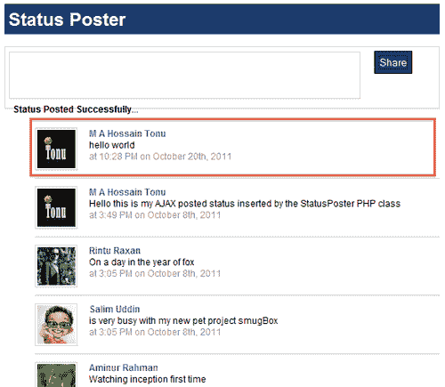

完成的项目目录结构类似于以下内容：


## 突击测验-复习 jQuery 知识

1.  jQuery 使用哪个符号作为 jQuery 的快捷方式？
    1.  `?`标志
    2.  `%`标志
    3.  `$`标志
    4.  jQuery 符号
2.  使用 `#element_id`ID 获取输入框的值，以下哪项是正确的？
    1.  `$('#element_id').value()`
    2.  `$('#element_id').text()`
    3.  `$('#element_id').html()`
    4.  `$('#element_id').val()`
3.  以下哪项返回 JavaScript 中 `stringVar`变量中存储的字符串长度？
    1.  `stringVar.size`
    2.  `length(stringVar)`
    3.  `stringVar.length`
4.  在另一个元素的开头添加 `DIV`元素的正确语句是什么？
    1.  `$('#container').append('<div></div>')`；
    2.  `$('#container').html('<div></div>')`；
    3.  `$('#container').prepend('<div></div>')`；
5.  下列哪项会导致元素逐渐消失？
    1.  `$('#element').hide()`；
    2.  `$('#element').fadeOut('slow')`；
    3.  `$('#element').blur('slow')`；
6.  以下哪一项是获取 `element1`的内部 HTML 用作 `element2?`的内部 HTML 的正确代码
    1.  `$('#element2').html( ) = $('#element1').html( )`；
    2.  `$('#element2').html( $('#element1').innerHTML )`；
    3.  `$('#element1').html( $('#element2').html() )`；
    4.  `$('#element2').html( $('#element1').html( ) )`；

## 有一个围棋英雄-清理状态输入

由于用户提供的状态输入没有经过足够的清理，因此输入中放置的原始标记或 HTML 标记很可能会破坏界面。因此，要正确地清理状态输入，还要注意显示这个新状态条目的 JavaScript 代码，而不必刷新 AJAX 成功的页面。如果不允许使用标记，则可以在将输入插入到 `INSERT`查询之前使用 `trip_tags()`方法从输入中剥离标记。同样，如果希望保留标记，可以使用 PHP `htmlspecialchars()`函数。你也必须重构你的 JS 代码；也就是说，您可以使用 `$('#status_box').text()`而不是 `$('#status_box').val()`。

# 总结

在本章中，我们已经完成了一个真实的 PHP 项目，现在我们可以使用 NetBeans IDE 创建和维护一个 PHP 项目。此外，我们现在已经熟悉了 IDE 的用法，可以加快开发速度。练习这些键盘快捷键、代码完成、短代码、代码生成器和其他 IDE 特性将加快您的速度并使您的开发更加顺利。所有这些功能都是为了简化您的任务，让您的生活更轻松。

我们特别致力于：

*   设置数据库
*   创建 JavaScript 库
*   现实生活、PHP AJAX、web 应用程序开发
*   使用 NetBeans 代码模板

到目前为止，我们已经使用 NetBeans 开发了一个 PHP 项目。在下一章中，我们将对一些演示 PHP 项目进行调试和测试，以掌握更多处理项目关键时刻的技能。