# 第 6 章：理解 Git，NetBeans 方式

> 尽早承诺，经常承诺。

在本章中，我们将介绍版本控制系统，以管理源代码中的更改。为此，我们将学习使用**Git**，这是一个免费的开源分布式版本控制系统。我们将逐步使用 NetBeans 中的 Git。我们将特别讨论以下问题：

*   版本控制系统
*   **分布式版本控制系统**（**DVCS**
*   快速分布式版本控制系统 Git
*   初始化 Git 存储库
*   克隆 Git 存储库
*   将文件暂存到 Git 存储库中
*   将更改提交到 Git 存储库
*   比较文件修订和恢复更改
*   使用远程存储库获取、拉取和推送
*   使用分支创建、签出、切换、合并和删除

# 版本控制系统

版本控制系统（源代码管理或**SCM 的一个方面）**是跟踪和控制项目文件变更的技术和实践的组合，尤其是源代码、文档和网页。

版本控制之所以如此普遍，是因为它实际上在运行项目的各个方面都有帮助，包括开发人员之间的沟通、发布管理、bug 管理、代码稳定性和实验性开发工作，以及特定开发人员对更改的归属和授权。版本控制系统为所有这些领域提供了一个中央协调力量。

版本控制的核心活动是**变更管理**——识别对项目文件所做的每个离散变更，用元数据（如时间戳和变更作者）注释每个变更，然后以任何方式向提出请求的人重播这些事实。它是一种通信机制，其中更改是信息的基本单位，此类更改可以与某些类型的合并文件进行比较和恢复。

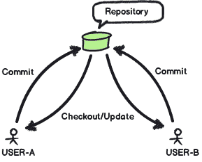

现在让我们讨论一下常见的版本控制系统术语：

*   **存储库：**存储库，也称为**回购**，用于存储文件的当前和历史数据。版本控制系统的核心是存储库，它可以集中或分布式存储该系统的数据。存储库通常以文件系统树的形式存储信息，文件系统树是文件和目录的层次结构。
*   **Working copy:** A working copy is a developer's private directory tree, containing the project's source code files and possibly its web pages, or other documents. A working copy also contains a little bit of metadata managed by the version control system, telling the working copy what repository it comes from, what "revisions" of the files are present, and so on. Generally, each developer has his own working copy, in which he makes and tests the changes, and from which he commits.

    在分散的版本控制系统中，每个工作副本本身就是一个存储库，可以将更改推送到（或拉入）任何愿意接受它们的存储库。

*   **工作树：**这是实际签出文件的树。工作树通常等于 HEAD，加上您所做但尚未提交的任何本地更改。
*   **来源：**指原始存储库，或默认的上游存储库。大多数项目至少有一个上游项目，他们会跟踪。默认情况下，原点用于此目的。
*   **Master:**指默认的开发分支。
*   **负责人：**这是分支机构的最新版本。
*   **提交：**用于对项目进行变更；更正式地说，在版本控制数据库中存储更改，以便将其合并到称为提交的项目的未来版本中。提交将创建一个新版本，该版本本质上是项目中某个特定时间点的文件快照。
*   **Index:** This is a collection of files with stat information, whose contents are stored.

    索引用作工作目录和存储库之间的暂存区域。您可以使用索引建立一组要一起提交的更改。创建提交时，提交的内容是索引中当前的内容，而不是工作目录中的内容。

*   **修订版：**一个“修订版”通常是一个特定文件或目录的具体体现。例如，如果项目以文件 `F`的 `6`版本开始，然后有人对 `F`进行更改，则会产生 `F`的 `7`版本。
*   **签出：**签出是从存储库中获取项目、文件、修订等副本的过程。签出通常会生成一个称为“工作副本”的目录树，从中可以将更改提交回原始存储库。
*   **分支：**这是项目的副本，在版本控制下，但是隔离的，因此对分支所做的更改不会影响项目的其余部分。分支机构也称为**开发线**。即使一个项目没有明确的分支，开发仍然被认为是在“主干”上进行的，也被称为“主线”或“主干”。
*   **Merge:** Merge requires copying a change from one branch to another. This involves merging from the main trunk to some other branch, or vice versa.

    Merge 还有第二个相关的含义，即当版本控制系统看到两个人以非重叠的方式更改了同一个文件时，它会执行的操作。由于这两个更改不会相互干扰，因此当一个人更新其文件副本（已包含自己的更改）时，另一个人的更改将自动合并到中。这是很常见的，尤其是在多人入侵同一代码的项目中。当两个不同的变化重叠时，结果就是**冲突。**

*   **冲突：**当两个人试图对代码中的同一区域进行不同更改时，会发生这种情况。所有版本控制系统都会自动检测冲突，并通知至少一个相关人员其更改与其他人的更改发生冲突。然后由该人员解决冲突并将该解决方案传达给版本控制系统。
*   **还原：**要回滚到上一版本，我们会还原更改；也就是说，我们放弃更改，返回到上次更新的点。当你已经破坏了你的本地构建，并且不知道如何让它重新工作时，这是很方便的。有时还原比调试快，尤其是最近签入的情况下。
*   **差异：**这是一个变化的可视表示，它显示了哪些行发生了变化以及如何发生变化，加上两侧的几行周围上下文。已经熟悉某些代码的开发人员通常可以读取与该代码的差异，了解更改所做的工作，甚至可以发现错误。
*   **标签：**标签是特定版本文件集合的标签。标记通常用于保存项目的有趣快照。例如，通常为每个公共版本制作一个标签，以便直接从版本控制系统获得包含该版本的文件/修订的确切集合。

## 分布式版本控制

有些版本控制系统是集中式的，只有一个主存储库，存储对项目所做的所有更改。另一些是分散的，每个开发人员都有自己的存储库，并且可以在存储库之间任意地来回交换更改。

在分布式版本控制系统（如 Git、Mercurial 或 Bazaar）中，开发人员（客户机）不仅要查看文件的最新快照，还要完全镜像存储库。

让我们看一下分布式版本控制示意图：

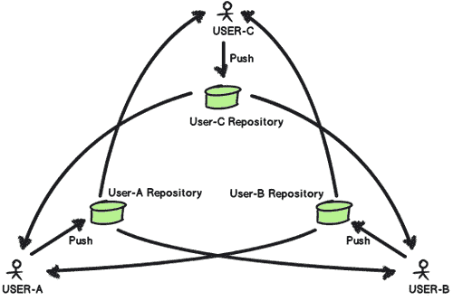

# Git 快速分布式版本控制系统

Git 是一个免费的、开源的分布式版本控制系统，旨在以快速高效的方式处理从小型到大型的所有项目。在 Git 中，您可以拥有自己的本地存储库和几乎所有的本地操作。

每个 Git 克隆都是一个成熟的存储库，具有完整的历史记录和完整的版本跟踪功能，不依赖于网络访问或中央服务器。分支和合并既快又容易。

Git 用于文件的版本控制，很像 Mercurial、Subversion、CVS、Perforce 等工具（[http://git-scm.com/](http://git-scm.com/) ）。

### 注

Git 最初由*Linus Torvalds*为 Linux 内核开发而设计和开发。

# 理解 Git，NetBeans 方式

NetBeans IDE 为 Git 版本控制客户端提供了极好的支持。IDE 的 Git 支持允许您直接从 IDE 中的项目执行版本控制任务。Git 存储库有两种方法，第一种方法获取现有项目或目录并将其导入 Git，第二种方法从另一台服务器计算机克隆现有 Git 存储库。

在接下来的部分中，使用 NetBeans，我们将尝试启动 Git 存储库，并学习如何克隆 Git 存储库。为此，我们将创建一个名为 `Chapter6`的示例 NetBeans 项目，其中项目元数据存储在一个单独的目录中，因为我们不需要版本控制下的项目元数据，我们将在项目目录中进行实践。

## 初始化 Git 存储库

如果您开始跟踪 Git 中的现有项目，或者希望现有项目处于版本控制之下，那么您需要启动 Git 存储库。

# 行动时间-初始化 Git 存储库

要从您现有的项目或源文件中初始化 Git 存储库（这些文件尚未处于版本控制之下），您可以执行以下步骤：

1.  Right-click on the project `Chapter6`, and select **Versioning | Initialize Git Repository** from the context menu.

    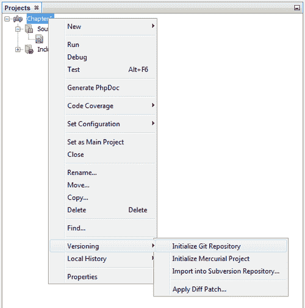

2.  现在，在**初始化 Git 存储库**对话框中指定创建存储库的目录路径。在本例中，我们选择相同的项目路径。
3.  Click on **OK** and you can check the repository creation progress or status in the **Output** window (*Ctrl*+*4*) as follows:

    

    将在项目目录下创建一个 `.git`子目录，其中存储项目快照的所有数据。Git 开始对指定目录中的所有文件进行版本控制。

    您可以看到，所有项目文件都在项目树中标记为 `-/Added`。要查看文件状态，只需将鼠标悬停在文件名上，如以下屏幕截图所示：

    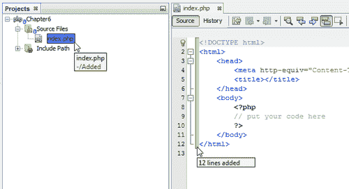

    我们可以看到文件状态显示为绿色，在斜杠的右侧。

    还要注意， `index.php`文件中新添加的行标记为绿色，如前一个屏幕截图所示。您可以看到自早期版本以来添加的行数，将鼠标悬停在绿色高光上。一旦创建了 Git 存储库，IDE 中的所有 Git 选项都可以直接在当前项目的**团队**菜单或**团队【Git】子菜单下使用。**

## 刚才发生了什么事？

我们已经成功初始化了 Git 存储库，以便使用 NetBeans 将现有项目文件置于版本控制之下。因此，我们拥有自己成熟的本地 Git 存储库。

要使用远程存储库，您可以添加一个远程 Git 存储库作为此初始化 repo 的源。通过这种方式，您可以执行与本地存储库同步的远程存储库。现在，我们可以添加文件或直接将其提交到本地 Git 存储库；但在此之前，让我们尝试第二种方法，克隆 Git 存储库。请注意，在克隆存储库的同时，我们还可能创建另一个新项目。

## 克隆 Git 存储库

假设您已作为合作者添加到 Git 下维护的现有项目中。如果您想获得现有 Git 存储库的副本或希望参与的项目，则需要该 repo 的 Git 克隆。直接合作者是由存储库所有者添加的一名值得信赖且经验丰富的开发人员，他为项目做出了贡献，可以在原始存储库中执行常规的 Git 操作。

对于本教程，我们已经在 GitHub.com（免费 Git 托管）上创建了一个名为 `chapter6demo`（[的 Git 存储库 https://github.com/mahtonu/chapter6demo](https://github.com/mahtonu/chapter6demo) ），出于测试目的，我们在那里添加了另一个作为合作者的帐户。现在，我们将从 GitHub.com 克隆该存储库，并使用该协作者帐户从 NetBeans IDE 实践常规 Git 功能。要通过 SSH 进行克隆并在 GitHub 项目上作为协作者执行，您需要一个 GitHub 帐户，并且需要由相应的项目所有者将其作为成员添加到项目中。

### 注

要在 GitHub.com 上托管您的源代码，请在那里注册并创建您自己的存储库。

另外，您需要在**设置【SSH 密钥】T1】（[处添加您的公钥 https://github.com/settings/ssh 通过**Secure Shell**（**SSH**）从您的计算机进行 Git 操作。](https://github.com/settings/ssh)**

对于 Windows 操作系统，您可以使用**PuTTYgen**（[http://www.chiark.greenend.org.uk/~sgtatham/putty/download.html](http://www.chiark.greenend.org.uk/~sgtatham/putty/download.html)来生成密钥，并且在 IDE 中使用它们之前必须将它们转换为**OpenSSH**格式。

在继续下面的教程之前，您可以在 GitHub 创建一个示例存储库，并将另一个 GitHub 测试帐户作为协作者添加到存储库中（从**管理员|协作者）**，并记住为这些对应的帐户添加公钥。

# 行动时间-通过 SSH 协议从 GitHub 克隆 Git 存储库

在本教程中，我们将充当该 GitHub 项目的合作者，并将自己的 SSH 公钥添加到 GitHub 帐户中。我们将使用 NetBeans 添加 SSH 私钥。除了库克隆之外，NetBeans 还提供了创建新项目的选项：

1.  选择**团队| Git |克隆。。。**，并显示**克隆库**向导。
2.  在**存储库 URL**字段中指定所需存储库的路径，例如 `git@github.com:mahtonu/chapter6demo.git`。
3.  验证**用户名**是否为 `git`。
4.  浏览**私钥文件**位置。
5.  Add **Passphrase**, which you created during the key generation, and (optionally) select the **Save Passphrase** checkbox. The **Remote Repository** page at the **Clone Repository** wizard looks similar to the following screenshot:

    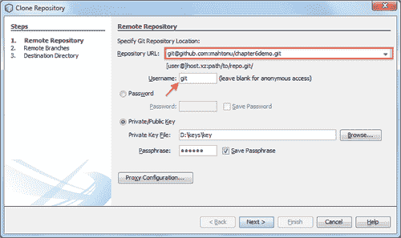

6.  Click on **Next**, and select the repository branch that needs to be fetched (downloaded) to your local repository at the **Remote Branches** page, for example, `master`.

    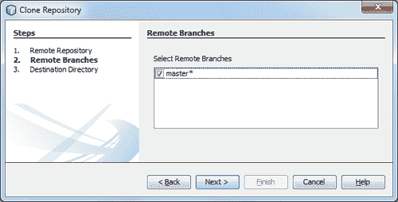

7.  Click on **Next**, and fill in or browse the **Parent Directory** where the clone directory will be placed at the **Destination Directory** page. The repository name is filled in the **Clone Name** field automatically, which will be the local clone directory name.

    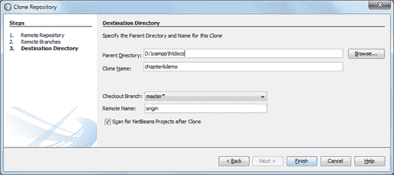

8.  在此屏幕截图中，**签出分支**默认设置为 `master*`，而**远程名称**设置为 `origin`，这意味着我们要克隆的是原始存储库。另外，选中克隆后对 NetBeans 项目进行的**扫描**复选框。
9.  Click on **Finish** and see what is happening in the NetBeans **Output** window. You will be prompted to create a new NetBeans project from the cloned source, as shown in the following screenshot:

    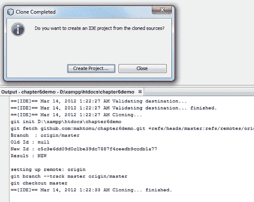

    我们也从克隆的源代码创建了 NetBeans 项目，通过选择带有现有源代码选项的**新项目**，并将 NetBeans 项目元数据存储到一个单独的目录中，因为我们不希望它们位于 Git 下。此外，您将在项目中找到一个 `README`文件，该文件已经被跟踪，并且来自远程源存储库。

## 刚才发生了什么事？

我们使用 NetBeans 通过 SSH 协议克隆了一个存储库。这些克隆中的每一个都是一个成熟的 repo，其中的 `.git`目录包含所有修订信息。所以，现在我们有了一个可用的本地存储库，也可以使用远程源。我们所做的是将一个 GitHub 帐户作为合作者添加到 GitHub 项目中，当我们访问该项目时，我们使用 NetBeans IDE 从那里克隆了它。您可以从 IDE 执行大多数 Git 操作，这些操作的结果可以在**输出**窗口中看到。

从这一点上，我们将学习从 IDE 使用 Git 操作。接下来的部分将从协作者的角度进行说明，包括添加、编辑、比较、提交文件、将更改推送到远程等等。

## 突击测验-理解 Git

1.  Git 的正确特性是什么？
    1.  分布式版本控制系统
    2.  问题追踪器
    3.  集中存储库
    4.  始终依赖于网络
2.  哪个不是 Git 存储库特性？
    1.  每个 Git 克隆都是一个成熟的存储库
    2.  本地 Git 存储库是原始存储库的子集
    3.  所有提交都是本地的
    4.  可能有一个遥远的起源
3.  在上一节中，哪个密钥文件被添加到 IDE 中？
    1.  公钥文件
    2.  私钥文件
    3.  两个关键文件
    4.  打开 SSH 文件
4.  对于新创建的文件，NetBeans IDE 中存储库上下文中的文件状态符号是什么？
    1.  `Added/-`
    2.  `-/Added`
    3.  `Added/+`
    4.  `+/Added`

# 将文件暂存到 Git 存储库

要开始跟踪新文件并对 Git 存储库中已跟踪的文件进行阶段性更改，您需要将其添加到存储库中。**暂存**是指为*“要提交的更改”*在 Git 下添加新的或修改的文件。

将文件添加到 Git 存储库时，IDE 首先在**索引**中合成并保存项目的快照。执行提交后，IDE 将这些快照保存在头部。

# 行动时间-将文件转移到 Git 存储库

在本教程中，我们将学习如何将文件转移到本地 Git 存储库。暂存是添加要提交的更改的状态。以下文件可称为暂存文件：

*   添加到存储库的新创建的文件
*   已修改并添加到存储库的现有文件

首先，我们将向 repo 添加一个新创建的文件，然后我们将向 repo 添加一个修改后的文件：

1.  首先，我们将打开 NetBeans Git 的**显示更改**查看器窗口。右键点击 `chapter6demo`项目节点，选择**Git |显示变更**。NetBeans 将扫描存储库并在窗口中显示任何更改。现在，可以从此窗口实时查看对存储库的任何更改。
2.  Now, add a new file into the NetBeans project in the usual way, which is `test.php`. You can see that the new `test.php` file is opened into the editor; hovering on the filename at the **Projects** pane shows the file status for Git.

    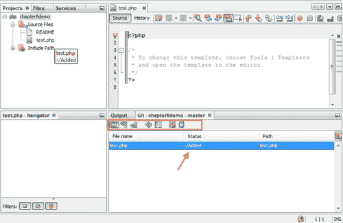

    在这个屏幕截图中，我们可以看到 Git 窗口的底部显示 `test.php`作为新添加的文件，表示为 `-/Added`，这意味着它尚未添加到回购协议中。

3.  右键点击 `test.php`，从关联菜单中选择**Git|Add**。现在， `test.php`文件可用或可以在 Git 下跟踪。您可以在 Git 窗口中看到文件状态为 `Added/-`，这意味着该文件已准备好提交或已暂存。此外，您还可以看到显示 Git 操作状态的输出窗口。
4.  Now, we will open the existing `README` file, try to add some lines within it, and save it, to watch the effect it has in the local repository. Note that the file comes from the original remote repository. We can also view any changes in the Git window instantly.

    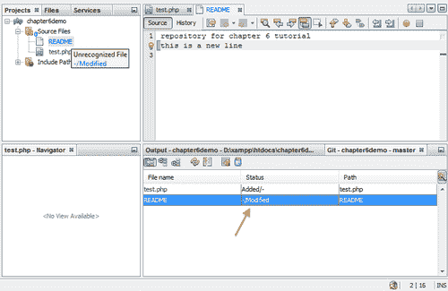

    在这个屏幕截图中，我们可以看到文件开头添加的新行（标记为绿色）表示新行是从早期版本添加的。此外，在 Git 窗口中，您可以看到文件状态显示为 `-/Modified`，这意味着该文件已被修改，但尚未添加用于暂存。

5.  右键点击**自述**，从关联菜单中选择**Git |添加**。现在， `README`文件更改已经准备好提交。您可以在 Git 窗口中看到文件状态为 `Modified/-`，这意味着该文件已准备好提交或已暂存。请注意，每次完成对文件的修改时，都可以重复该步骤，以便为下一次提交准备更改。此外，在 NetBeans**项目**窗格中，修改后的文件名变为蓝色，新添加的文件名变为绿色。

## 刚才发生了什么事？

我们刚刚学习了如何为到目前为止所做的更改准备文件，这些更改将提交到本地存储库中。因此，每次我们有一些更改时，我们可能会对这些文件应用**Git | Add**，以使它们可用于下一次提交。此外，我们还看到 Git 窗口显示文件的实时状态，而不是存储库的实时状态。

请注意，**团队**菜单包含活动项目中使用的特定版本控制系统下的所有选项。例如，在我们的例子中，我们可以看到所有 Git 选项在**团队**菜单和**团队【Git】子菜单下都可用。**

## 在源代码编辑器中查看更改

当您在 IDE 的源代码编辑器中打开一个版本化的文件时，您可以在根据 Git 存储库中的基本版本修改文件时查看文件发生的实时更改。在您工作时，IDE 使用源代码编辑器边距中的颜色代码来传达以下信息：

*   蓝色：表示自早期修订以来已更改的行
*   绿色：表示自早期修订以来添加的行
*   红色：表示自早期版本以来已删除的行

源编辑器的左边距显示逐行发生的更改。修改给定行时，更改将立即显示在左边距中。

源代码编辑器的右边距为您提供了一个概览，从上到下显示对整个文件所做的更改。对文件进行更改时，会立即生成颜色编码。您可以单击右边距内的特定点，将内嵌光标立即带到文件中的该位置。

## Git 窗口

您已经在 Git 窗口中看到了对本地工作树的选定文件夹中的文件所做的所有更改的实时列表，如以下屏幕截图所示：

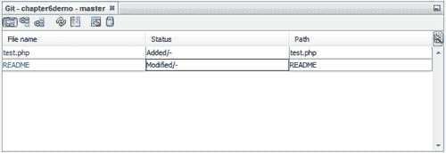

在这个版本控制窗口中，您可以看到一个带有按钮的工具栏，它使您能够对列表中显示的所有文件调用最常见的 Git 任务。使用工具栏中的按钮，可以选择显示索引或标头、工作树和索引或工作树和标头存在差异的文件列表。还可以单击列出的文件上方的列标题，按名称、状态或位置对文件进行排序。

## 有一个围棋英雄-解除分级文件

假设您已经更改了两个文件，并希望将它们作为两个单独的更改提交，但无意中将它们同时提交。尝试使用**团队| Git | Reset 解除暂存文件的转储。。。**；您可以从那里重置头部。

# 向存储库提交更改

在本节中，我们将学习如何提交已暂存的更改。上一节中所做的更改将提交到本地存储库中。

# 操作时间-将更改提交到本地存储库

要将更改提交到本地存储库，请执行以下步骤：

1.  Select the file you want to commit to your local repository; that is `test.php`. Right-click on them and select **Git | Commit...** from the context menu. The commit dialog box will be displayed, as shown in the following screenshot:

    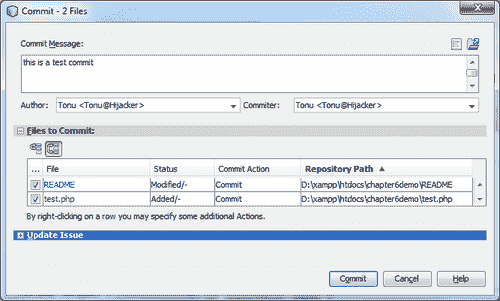

    在此屏幕截图中，您可以看到**提交消息**框。**要提交的文件**列表显示要提交的暂存文件。

2.  为**提交消息**文本区域键入一条消息，该文本区域将描述源代码提交的意图。提交消息应该传达对更改内容和原因的有意义的描述。
3.  您可以通过取消选中行将文件从提交中排除，也可以通过右键单击行来指定其他操作。完成后点击**提交**。

## 刚才发生了什么事？

IDE 执行提交并将快照存储到存储库中。IDE 的状态栏位于界面的右下角，在提交操作发生时显示。成功提交后，**项目、文件**和**收藏夹**窗口中的版本标识消失，提交文件的颜色代码恢复正常。还要注意，**Git**窗口中的文件已清除，这意味着存储库是最新的，没有可用的更改。

## 有一个围棋英雄-一起添加和提交所有文件

我们已将新文件暂存到存储库，然后提交这些更改。现在，直接提交新文件，让它们从 IDE 自动暂存。您可以向项目中添加新文件；试着直接提交它们，看看它们之间的区别。

## 比较文件修订

使用版本化项目时，比较文件版本是一项常见的工作。IDE 允许您使用 `Diff`命令比较修订版。可以对文件修订进行比较，以查看从一个修订到另一个修订的源更改。

# 行动时间-使用 IDE 中的差异

为了比较文件修订，您可以使用 IDE 的 `Diff`功能，并执行以下步骤：

1.  选择一个版本控制的文件 `README`，并修改该文件的某些行。
2.  Right-click on the file, and select **Git | Diff** from the context menu. A graphical **Diff** viewer is opened for all the selected file(s) and revisions in the IDE's main window. The **Diff** viewer displays two copies in side-by-side panels. The more current copy appears on the right side. So if you are comparing a repository revision against your working tree, the working tree gets displayed in the right panel:

    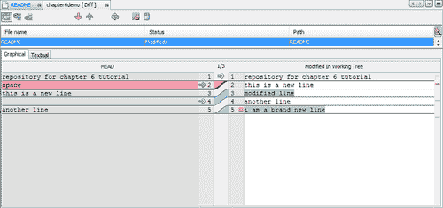

    `Diff`查看器使用其他地方使用的相同颜色代码来显示版本控制更改。在上一个屏幕截图中，绿色块表示已添加到更当前版本的内容。红色方框表示已删除早期版本中的内容。蓝色块表示高亮显示的行内发生了更改。

## 刚才发生了什么事？

**Diff**查看器工具栏还包括一些按钮，使您能够为列表中显示的所有文件调用最常见的 Git 任务。如果您正在工作树中的本地副本上执行差异，则编辑器允许您直接从**差异**查看器中进行更改。为此，您可以将光标放在**Diff**查看器的右窗格中，并相应地修改文件。否则，请使用内联图标，该图标显示在每个高亮显示的更改旁边。

## 恢复存储库的本地更改

要丢弃对工作树中选定文件所做的本地更改，并用索引或标头中的文件替换这些文件，需要进行还原。

# 操作时间-恢复工作树的更改

要恢复更改，请执行以下步骤：

1.  从上一节开始，修改后的 `README`文件的**Diff**窗口提供了一个恢复、修改功能。此外，Git 窗口还提供了恢复修改的按钮。
2.  Right-click on the `README` file, and select **Git | Revert | Revert Modifications** from the context menu, or click on the **Revert Modifications** button from the **Diff** window. A dialog box similar to the following one opens:

    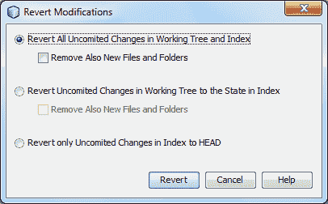

3.  指定其他选项（例如**仅将索引中未提交的更改还原为标题】**。
4.  点击**回复**。

## 刚才发生了什么事？

IDE 还原了指定的更改，并将这些文件替换为索引或标头中的文件。通过这种方式，您可以轻松地恢复修改或恢复提交。

## 突击测验-与 Git 合作

1.  将文件添加到 Git 存储库时，IDE 首先在以下哪项中合成并保存项目的快照？
    1.  指数
    2.  头
    3.  存储库
    4.  主人
2.  源编辑器左边距中的哪种颜色表示自早期修订以来已更改的行？
    1.  绿色
    2.  蓝色
    3.  红色
    4.  黄的
3.  Diff 用于以下哪项？
    1.  查看文件历史记录的步骤
    2.  比较两次修订
    3.  比较两个文件的两个修订的步骤
    4.  所有这些
4.  在还原更改的情况下，可以使用 revert 执行哪些操作？
    1.  还原工作树和索引中所有未提交的更改
    2.  将工作树中未提交的更改还原为索引中的状态
    3.  仅将未提交的更改还原到索引中的标头
    4.  所有这些

## 有一个英雄-回复承诺

尝试使用提交 ID 从 IDE 还原特定的提交。为此，您可以选择**revert | revert commit。。。**来自 IDE。

# 使用远程存储库

要与其他开发人员合作或在协作的开发环境中工作，每个人都希望共享他们的工作，这涉及到从托管在 Internet 或网络上的远程存储库获取、推送和拉取数据。

## 获取源代码更新

获取从原始远程存储库获取您尚未进行的更改。它不会改变你当地的分支机构。获取从远程存储库获取所有分支，您可以将这些分支合并到您的分支中，也可以随时进行检查。

# 操作时间-获取源代码更新

要获取更新，请执行以下步骤：

1.  Right-click on the project node, select **Git | Remote | Fetch**, and the **Fetch from Remote Repository** wizard is displayed.

    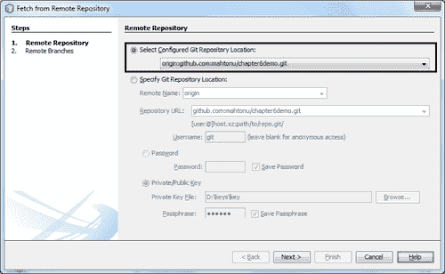

2.  在向导的**远程存储库**页面，我们将使用配置的存储库（使用前面配置的存储库的路径），然后单击**下一步**。
3.  At the **Remote Branches** page of the wizard, select the branches to fetch changes from, and click on **Finish**. Find the local copy of a remote branch in the repository browser window **(TEAM | Git | Repository Browser)**.

    

## 刚才发生了什么事？

已创建远程分支的本地副本。所选分支在**Git Repository Browser**中的**分支| Remote**目录中更新。接下来，将获取的更新合并到本地分支中。

## 从远程存储库拉取更新

当从远程 Git 存储库中获取一些更新时，将从中获取更改并将其合并到本地存储库的当前头中。

# 行动时间-从远程存储库获取更新

要执行拉动，请完成以下步骤：

1.  Right-click on the project node, select **Git | Remote | Pull**, and the **Pull from Remote Repository** wizard is displayed.

    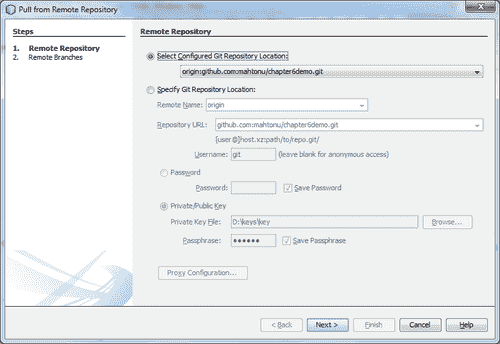

2.  在向导的**远程存储库**页面，我们将使用配置的存储库（使用前面配置的存储库路径），然后单击**下一步**。
3.  在向导的**远程分支**页面，选择该分支，即 `master -> origin/master`（远程分支 `origin/master`将合并到当前分支），拉式修改，点击**完成**。

## 刚才发生了什么事？

您的本地存储库与源存储库同步。在**远程分支**页面，我们选择的分支即 `master -> origin/master`将合并到我们当前的分支中。您可以在 IDE 的右下角或输出窗口中看到拉动状态。

用最简单的术语来说， `Git Pull`做一个 `Git Fetch`后跟一个 `Git Merge`。

## 将源代码更改推送到远程存储库

要共享到目前为止完成的酷提交，您需要将更改推送到远程存储库。同样，您可以将新分支和数据推送到远程存储库。

# 行动时间-推动源代码更改

要将本地 Git 存储库中的更改提交到公共/远程 Git 存储库，请执行以下步骤：

1.  Right-click on project node, select **Git | Remote | Push**, and the **Push to Remote Repository** wizard is displayed.

    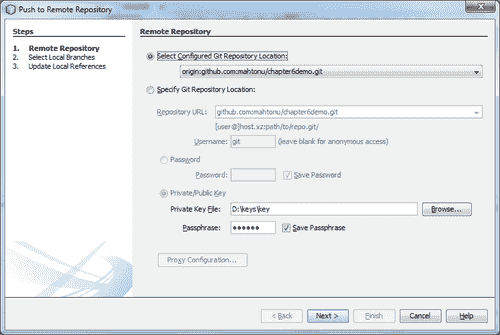

2.  在向导的**远程存储库**页面，我们将使用配置的存储库（使用前面配置的存储库路径），然后单击**下一步**。
3.  在向导的**选择本地分支**页面，选择要将更改推送到的本地分支，即 `master -> master`，然后点击**完成**。
4.  在**更新本地参考**页面，在您本地存储库的**远程**目录中选择要更新的分支，即 `master -> origin/master`，然后点击**完成**。

## 刚才发生了什么事？

指定的远程存储库分支已更新为本地分支的最新状态。您的本地回购的**分支机构**远程目录也已更新。因此，您的更改在远程存储库中是实时的，其他协作者可以将更改拉到他们自己的 repo 中。

# 与分支机构合作

开始替代开发线的意图在源代码管理系统中产生了一个分支。**分支机构**帮助您管理工作环境并提供单独的工作空间。通常，**主分支**是最好的代码所在的分支；除此之外，还可能有一个**开发分支**，其中可以驻留持续开发代码。同样，明智的软件开发使用分支来维护功能、版本、修补程序等。

对于新版本的开发和旧版本的维护，分支是一个明确的目标。在下图中，描述了通用 Git 分支模型：

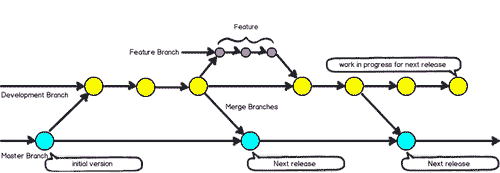

在这个图中，我们可以看到**开发分支**与**主分支**合并了一个新版本，一个新特性已经与**开发分支**合并。

NetBeans 支持您使用 Git 分支执行以下操作：

*   创建分支
*   检查分支机构
*   交换支路
*   合并分支
*   删除分支

## 创建分支

如果您想在不干扰主干的情况下使用单独版本的文件系统来稳定或试验，您可以创建一个分支。

# 行动时间-创建分支

要创建本地分支，请完成以下步骤：

1.  Right-click on the project node, select **Git | Branch | Create Branch**, and the **Create Branch** dialog box is displayed.

    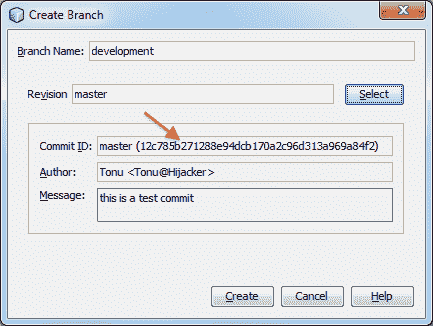

2.  在**分支机构名称**字段中，输入需要创建的分支机构名称，即 `development.`
3.  您可以通过在**修订**字段中输入提交 ID、现有分支或标记名来键入所选项目的特定修订，或按**选择**查看存储库中维护的修订列表。默认的**版本**是主分支的最新版本。
4.  （可选）在**选择修订**对话框中，展开**分支**并选择所需的分支，在相邻列表中指定提交 ID，然后按**选择**。
5.  Review the **Commit ID, Author**, and **Message** fields information, specific to the revision being branched from, and click on **Create**. The branch is added to the **Branches | Local** folder of the Git repository view at **Git Repository Browser**.

    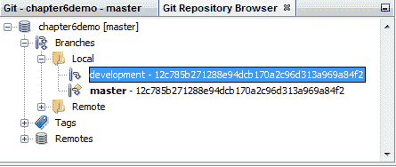

## 刚才发生了什么事？

我们已经在本地存储库中创建了一个新分支。新分支包含来自主分支的最新快照。新创建的分支还不是我们的工作分支。主分支仍然是工作分支；我们将选择检查新的分支机构，使其成为一个有效的分支机构。请注意，我们可以从任何现有修订创建新分支。

## 检查分支机构

如果要编辑已存在的分支上的文件，可以签出需要用于将文件复制到工作树的分支。它只需切换到所需的分支。

# 行动时间-检查分支机构

要签出修订，请执行以下操作：

1.  Right-click on the project node, select **Git | Checkout | Checkout Revision**, and the **Checkout Revision** dialog box is displayed.

    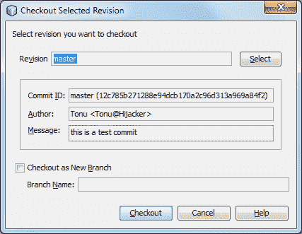

2.  Again, right-click on the **Branches | Local | Branch Name** at the **Repository Browser** window from the context menu, as shown in the following screenshot. Select **Checkout Revision**, and the same dialog box is displayed, along with the latest revision selected from that branch.

    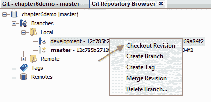

3.  （可选）通过在**修订**字段中输入提交 ID、现有分支或标记名，指定所需修订，或按**选择**查看存储库中维护的修订列表。请注意，如果指定的修订引用了未标记分支名称的有效提交，则您的头部将分离，不再位于任何分支上。
4.  （可选）在**选择修订**对话框中，展开**分支**并选择所需的分支，在相邻列表中指定提交 ID，然后按**选择**。
5.  查看**提交 ID、作者**和**消息**字段中特定于签出版本的信息。
6.  要从签出的修订创建新分支，请选择**签出为新分支**选项，并在**分支名称**字段中输入名称。
7.  按**签出**以签出修订。

## 刚才发生了什么事？

工作树和索引中的文件已更新，以匹配指定版本中的版本。

## 切换到分支机构

如果要将文件切换到已存在的分支（例如，切换到不在某个分支顶部的提交），可以使用**团队| Git | branch | switch to branch**命令，在**切换到所选分支**对话框中指定该分支，将其作为新分支签出（可选），并按下**开关**。

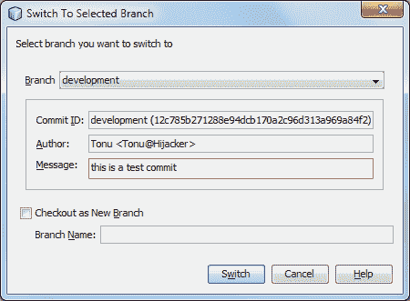

## 正在签出文件

IDE 支持对当前在 IDE 中选择的文件、文件夹或项目进行上下文相关签出。要从索引中签出一些文件（不是分支），请从主菜单中选择**团队| Git |签出|签出文件**，并显示**签出所选路径**对话框。

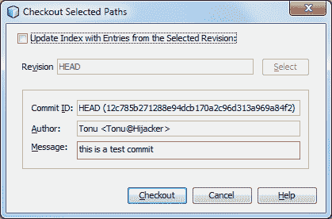

在该对话框中，从**所选修订版**选项中选择**更新索引，其中包含条目**。如果选中，则在签出之前，索引将使用选定修订中的状态更新（即，工作树和索引中的选定文件都将更新）。

指定所需的属性并签出。

## 合并

将分支上下文合并到当前上下文中。一旦您在一个分支中完成了独立的工作，您最终会希望将其合并到您的主分支中。您可以将任何分支合并到当前分支中。

# 动作时间-合并到当前分支

要将修改从存储库版本移植到工作树，请执行以下操作：

1.  Select **Team | Git | Merge Revision** from the main menu. The **Merge Revision** dialog box is displayed.

    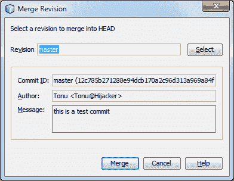

2.  （可选）通过在**修订**字段中输入提交 ID、现有分支或标记名称来指定所需修订，或按**选择**查看存储库中维护的修订列表。
3.  （可选）在**选择修订**对话框中，展开**分支**并选择所需分支，在相邻列表中指定提交 ID，然后按**选择**。
4.  查看**提交 ID、作者**和**消息**字段中特定于合并版本的信息。
5.  按**合并**。

## 刚才发生了什么事？

完成当前分支、工作树内容和指定分支之间的三方合并。如果发生合并冲突，则冲突的文件将标记为红色标记以指示此情况。合并后，您仍然可以提交更改，以便将其添加到头部。

## 删除分支机构

要删除不必要的本地分支，请从主菜单中选择**团队| Git |存储库浏览器**。在**Git Repository Browser**中，选择需要删除的分支。请注意，分支应处于非活动状态，这意味着它当前尚未在工作树中签出。

右击所选分支，在弹出菜单中选择**删除分支**。在**删除分支**对话框中，按**确定**确认分支删除。该分支将从本地存储库以及**Git 存储库浏览器**中删除。

## 突击测验-与远程存储库和分支机构合作

1.  哪些 Git 操作与远程存储库最相关？
    1.  提交、合并和还原
    2.  抓取、拉和推
    3.  取、拉、推和检出
    4.  添加、提交和推送
2.  从远程存储库提取更改后会发生什么？
    1.  从远程存储库获取更改
    2.  更改将从中提取并合并到本地存储库的当前头中
    3.  更改将从中提取并合并到远程存储库的当前头中
    4.  以上都没有
3.  签出分支后会发生什么？
    1.  它会立即切换到该分支，分支文件将可用于您的工作树
    2.  它将文件复制到您的工作树中
    3.  创建一个新分支，它将成为您的工作分支
    4.  所有这些

## 有一个英雄创建标签

Git 使用两种主要类型的标记-**轻量级**和**注释的**。轻量级标记非常类似于不会更改的分支——它只是指向特定提交的指针。但是，带注释的标记作为完整对象存储在 Git 数据库中。这些标记检查总数，并包含标记者的姓名、电子邮件和日期以及标记消息。通常建议您创建带注释的标记，以便能够获得所有这些信息。现在，创建一个新标签，您可以选择**Git|tag | create tag。。。**来自 IDE。

# 良好实践和工作流程

下面讨论了一些指导原则和工作流程，以维护 Git 的良好实践：

*   无论你在做什么，都要保持一个单独的分支。现在，当您想将更改合并回 main 时，只需执行 Git 合并。
*   尽可能使分支保持最新，这涉及签出或提取更改。
*   分支可以向上推到原点。这有几个原因。首先，如果您的工作站崩溃，您不会丢失更改—这是 VCS 的主要原因之一。其次，如果需要，其他开发人员可以快速切换到您的分支。
*   经常提交您的更改；当然，应该始终以逻辑片段的形式提交更改。由于您的更改是在本地提交的，而不是提交到源/主服务器（可以通过推送完成），因此您应该以有组织的方式提交更改。
*   为您对提交消息所做的一切以及对修订历史记录进行更改的每个操作提供消息/注释。
*   经常推动您的更改。如果您在自己的分支中开发，而该分支是独立于其他分支的，那么您的更改不会影响任何其他分支。

首选 Git 工作流：

*   从主节点创建分支，签出它，然后执行您的工作
*   测试并提交您的更改
*   （可选）将分支推送到远程存储库（源）
*   查看 master，确保它是最新的上游更改
*   将您的分支合并为主分支
*   反复试验
*   将主机的本地副本推送到远程存储库主机（源/主机）
*   删除您的分支（如果您发布了分支，也可以远程删除）

此外，即使对于本地独立项目，使用版本控制系统也是值得的，因为代码更改可以轻松地在本地进行审查、回滚和备份。

# 总结

在本章中，我们讨论了版本控制系统及其重要性。此外，我们选择 Git 作为分布式版本控制系统，并从 NetBeans 学习了如何使用它。

我们特别关注以下方面：

*   分布式版本控制系统
*   初始化 Git 存储库
*   克隆 Git 存储库
*   将文件暂存到 Git 存储库中
*   将更改提交到 Git 存储库
*   比较文件修订和恢复更改
*   使用远程存储库获取、拉取和推送
*   使用分支创建、签出、切换、合并和删除。

最后，我们讨论了 Git 的实践和首选工作流。我们现在更有信心加入使用 Git 和 NetBeans 的协作开发。

在下一章中，我们将创建一个包含用户注册、登录和注销的新 PHP 项目，以将我们的 PHP 应用程序开发技能提升到一个新的水平。